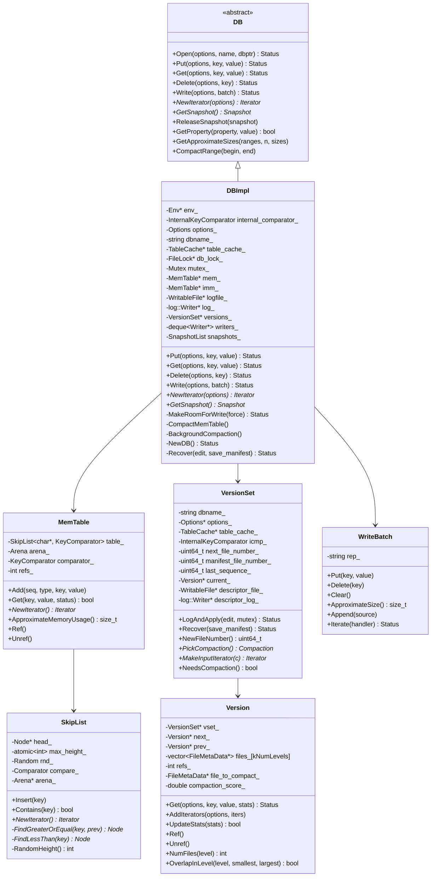
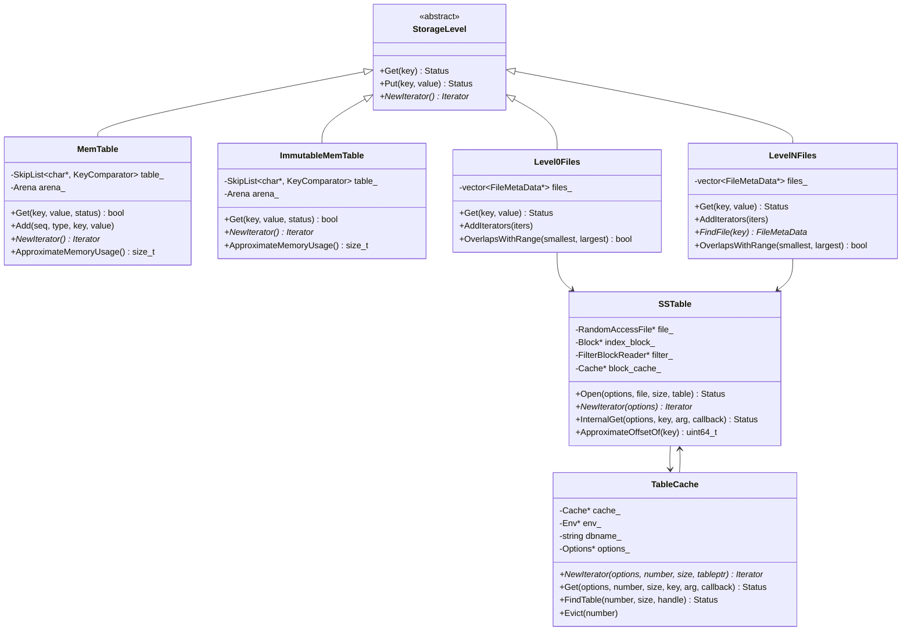
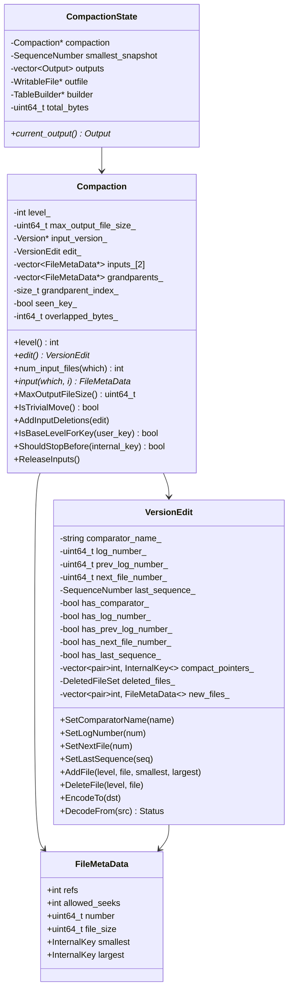
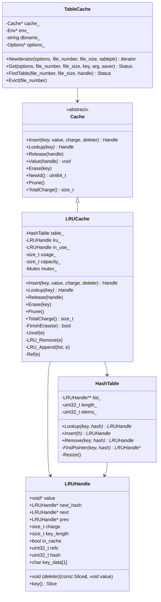
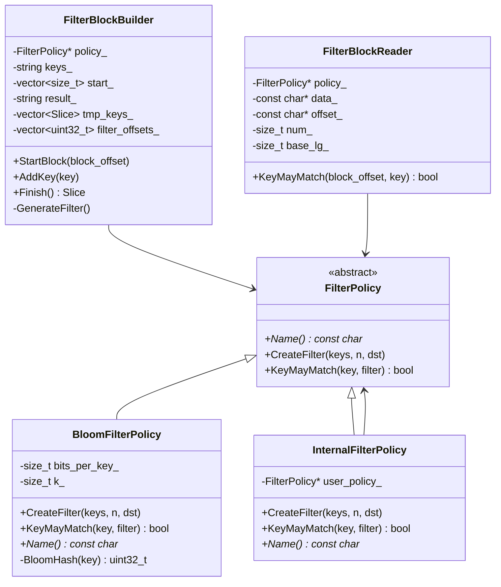
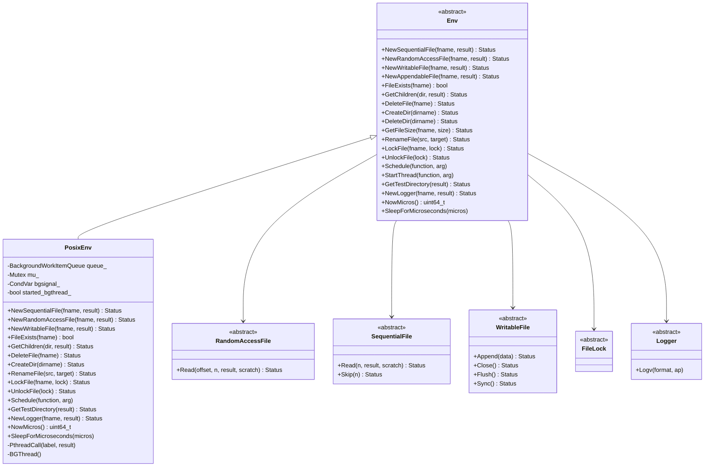

## 1. 整体类关系图



## 2. 存储层次结构图



## 3. 迭代器继承体系

```mermaid
classDiagram
    class Iterator {
        <<abstract>>
        +Valid() bool
        +SeekToFirst()
        +SeekToLast()
        +Seek(target)
        +Next()
        +Prev()
        +key() Slice
        +value() Slice
        +status() Status
    }
    
    class MemTableIterator {
        -SkipList::Iterator iter_
        -string tmp_
        +Valid() bool
        +key() Slice
        +value() Slice
        +Next()
        +Prev()
        +Seek(k)
        +SeekToFirst()
        +SeekToLast()
    }
    
    class Block::Iter {
        -Comparator* comparator_
        -const char* data_
        -uint32_t restarts_
        -uint32_t num_restarts_
        -uint32_t current_
        -uint32_t restart_index_
        -string key_
        -Slice value_
        +Valid() bool
        +key() Slice
        +value() Slice
        +Next()
        +Prev()
        +Seek(target)
        -SeekToRestartPoint(index)
        -ParseNextKey() bool
    }
    
    class TwoLevelIterator {
        -Iterator* index_iter_
        -Iterator* data_iter_
        -BlockFunction block_function_
        -void* arg_
        -ReadOptions options_
        +Valid() bool
        +key() Slice
        +value() Slice
        +Next()
        +Prev()
        +Seek(target)
        +SeekToFirst()
        +SeekToLast()
        -InitDataBlock()
        -SetDataIterator(iter)
    }
    
    class MergingIterator {
        -Comparator* comparator_
        -IteratorWrapper* children_
        -int n_
        -IteratorWrapper* current_
        -Direction direction_
        +Valid() bool
        +key() Slice
        +value() Slice
        +Next()
        +Prev()
        +Seek(target)
        +SeekToFirst()
        +SeekToLast()
        -FindSmallest()
        -FindLargest()
    }
    
    class DBIterator {
        -DBImpl* db_
        -Iterator* iter_
        -SequenceNumber sequence_
        -Status status_
        -Slice saved_key_
        -Slice saved_value_
        -Direction direction_
        +Valid() bool
        +key() Slice
        +value() Slice  
        +Next()
        +Prev()
        +Seek(target)
        +SeekToFirst()
        +SeekToLast()
        -FindNextUserEntry(skipping)
        -FindPrevUserEntry()
    }
    
    Iterator <|-- MemTableIterator
    Iterator <|-- Block::Iter
    Iterator <|-- TwoLevelIterator
    Iterator <|-- MergingIterator
    Iterator <|-- DBIterator
```

## 4. 日志系统结构图

```mermaid
classDiagram
    class log::Writer {
        -WritableFile* dest_
        -int block_offset_
        -uint32_t type_crc_[kMaxRecordType + 1]
        +AddRecord(slice) Status
        -EmitPhysicalRecord(type, ptr, length) Status
    }
    
    class log::Reader {
        -SequentialFile* file_
        -Reporter* reporter_
        -bool checksum_
        -char* backing_store_
        -Slice buffer_
        -bool eof_
        -uint64_t last_record_offset_
        -uint64_t end_of_buffer_offset_
        -uint64_t initial_offset_
        +ReadRecord(record, scratch) bool
        -SkipToInitialBlock() bool
        -ReadPhysicalRecord(type) unsigned int
        -ReportCorruption(bytes, reason)
        -ReportDrop(bytes, reason)
    }
    
    class LogFormat {
        <<enumeration>>
        kZeroType
        kFullType
        kFirstType
        kMiddleType
        kLastType
    }
    
    class RecordHeader {
        +uint32_t checksum
        +uint16_t length
        +uint8_t type
    }
    
    log::Writer --> LogFormat
    log::Reader --> LogFormat
    log::Writer --> RecordHeader
    log::Reader --> RecordHeader
```

## 5. 压缩系统结构图



## 6. 缓存系统结构图



## 7. 过滤器系统结构图



## 8. 环境抽象层结构图



## 9. 关键数据结构详细说明

### 9.1 DBImpl核心成员详解

```cpp
class DBImpl : public DB {
 private:
  // 常量，构造后不变
  Env* const env_;                              // 环境抽象层
  const InternalKeyComparator internal_comparator_; // 内部键比较器
  const InternalFilterPolicy internal_filter_policy_; // 内部过滤器策略
  const Options options_;                       // 配置选项
  const std::string dbname_;                    // 数据库名称
  
  // 缓存和锁
  TableCache* const table_cache_;               // SSTable缓存
  FileLock* db_lock_;                          // 文件锁
  
  // 状态保护 (mutex_保护)
  port::Mutex mutex_;                          // 主要互斥锁
  std::atomic<bool> shutting_down_;            // 关闭标志
  port::CondVar background_work_finished_signal_; // 后台工作完成信号
  
  // 内存表
  MemTable* mem_;                              // 当前内存表
  MemTable* imm_;                              // 不可变内存表
  std::atomic<bool> has_imm_;                  // 是否有不可变内存表
  
  // 日志
  WritableFile* logfile_;                      // 日志文件
  uint64_t logfile_number_;                    // 日志文件编号
  log::Writer* log_;                           // 日志写入器
  
  // 写入管理
  std::deque<Writer*> writers_;                // 写入者队列
  WriteBatch* tmp_batch_;                      // 临时批处理
  
  // 快照管理
  SnapshotList snapshots_;                     // 快照列表
  
  // 版本管理
  VersionSet* const versions_;                 // 版本集合
  
  // 后台任务管理
  bool background_compaction_scheduled_;       // 是否调度了后台压缩
  ManualCompaction* manual_compaction_;        // 手动压缩
  
  // 错误处理
  Status bg_error_;                           // 后台错误
  
  // 统计信息
  CompactionStats stats_[config::kNumLevels];  // 各级压缩统计
};
```

### 9.2 MemTable内存布局

```cpp
class MemTable {
 private:
  // 键比较器包装
  struct KeyComparator {
    const InternalKeyComparator comparator;
    int operator()(const char* a, const char* b) const;
  };

  typedef SkipList<const char*, KeyComparator> Table;

  KeyComparator comparator_;  // 比较器实例
  int refs_;                  // 引用计数
  Arena arena_;               // 内存分配器
  Table table_;               // 跳表存储

  // 内存中的记录格式：
  // [internal_key_size:varint32][internal_key:internal_key_size]
  // [value_size:varint32][value:value_size]
  //
  // internal_key格式：
  // [user_key][sequence_number:7bytes][type:1byte]
};
```

### 9.3 SSTable在内存中的表示

```cpp
struct Table::Rep {
  Options options;              // 选项配置
  Status status;                // 状态
  RandomAccessFile* file;       // 文件句柄
  uint64_t cache_id;           // 缓存ID
  
  FilterBlockReader* filter;    // 过滤器读取器
  const char* filter_data;      // 过滤器数据
  
  BlockHandle metaindex_handle; // 元索引块句柄
  Block* index_block;          // 索引块
  
  // 文件布局：
  // [data blocks...]
  // [filter block (optional)]
  // [metaindex block]  
  // [index block]
  // [footer: 48 bytes]
};
```

### 9.4 Version版本信息结构

```cpp
class Version {
 private:
  VersionSet* vset_;                    // 所属版本集
  Version* next_;                       // 链表下一个节点  
  Version* prev_;                       // 链表上一个节点
  int refs_;                            // 引用计数

  // 每个级别的文件列表
  std::vector<FileMetaData*> files_[config::kNumLevels];

  // 压缩统计和触发信息
  FileMetaData* file_to_compact_;       // 基于查找统计需要压缩的文件
  int file_to_compact_level_;           // 对应级别
  double compaction_score_;             // 压缩评分
  int compaction_level_;                // 需要压缩的级别
  
  // 文件组织原则：
  // Level 0: 文件可能重叠，按文件编号排序
  // Level 1+: 文件不重叠，按键范围排序
};
```

## 10. 数据结构性能特性

### 10.1 时间复杂度对比表

| 数据结构 | 插入 | 查找 | 删除 | 遍历 | 空间复杂度 |
|----------|------|------|------|------|------------|
| SkipList | O(log n) | O(log n) | O(log n) | O(n) | O(n) |
| SSTable Index | N/A | O(log m) | N/A | O(m) | O(m) |
| LRU Cache | O(1) | O(1) | O(1) | N/A | O(k) |
| Bloom Filter | O(k) | O(k) | N/A | N/A | O(m) |
| Version Files | N/A | O(log f) | N/A | O(f) | O(f) |

注：n=键数量，m=块数量，k=哈希函数数量，f=文件数量

### 10.2 内存使用分析

```cpp
// MemTable内存开销估算
sizeof(MemTable) = 48字节 (对象本身)
+ sizeof(Arena) ≈ 32字节 (Arena对象)  
+ sizeof(SkipList) ≈ 56字节 (跳表对象)
+ 数据存储 ≈ 1.33 * 原始数据大小 (跳表平均指针开销)
+ Arena块开销 ≈ 每4KB块8字节额外开销

// SSTable内存开销估算  
索引块大小 ≈ 文件数量 * 40字节 / 块
过滤器大小 ≈ 键数量 * 10位 / 8 (布隆过滤器)
块缓存开销 ≈ 缓存的块数量 * (块大小 + 64字节LRUHandle)
```

这些UML图和数据结构分析为理解LevelDB的内部工作机制提供了详细的蓝图，有助于深入掌握其设计思想和实现细节。
