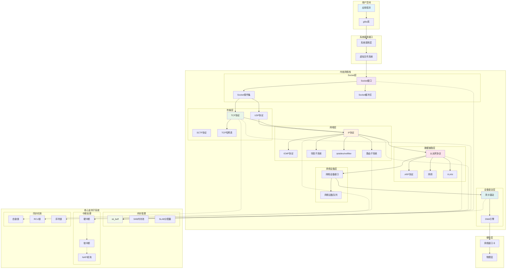
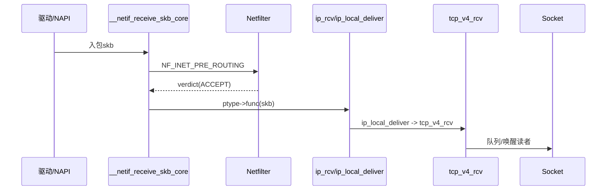
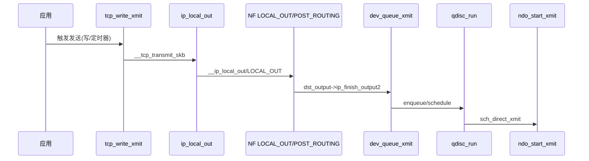
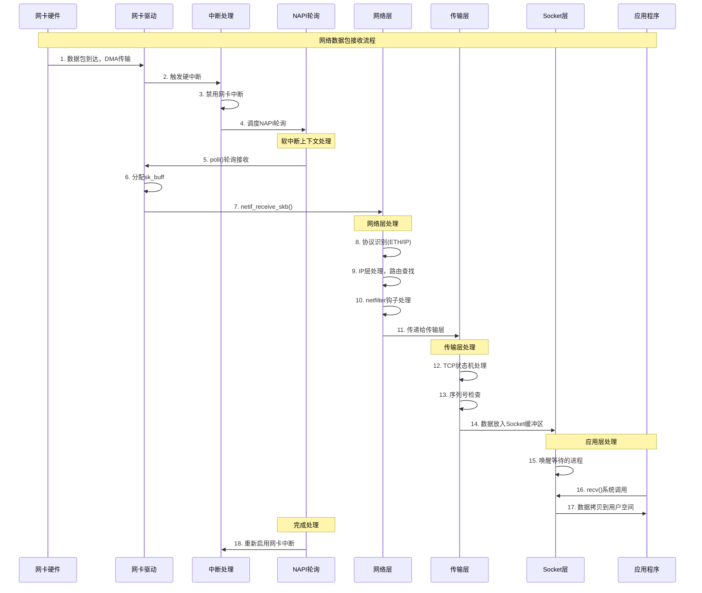
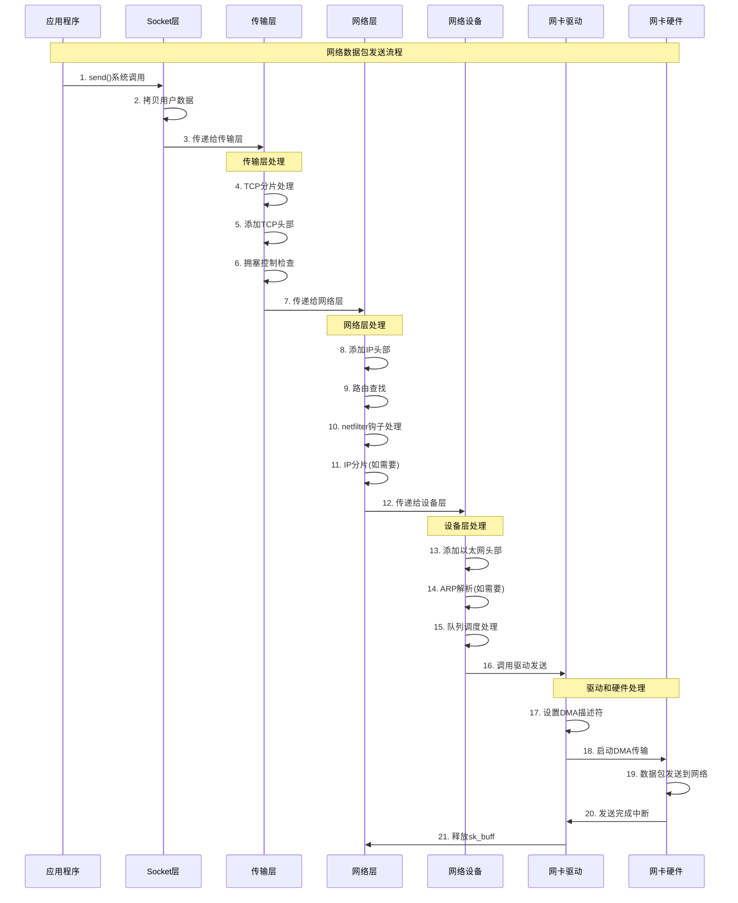
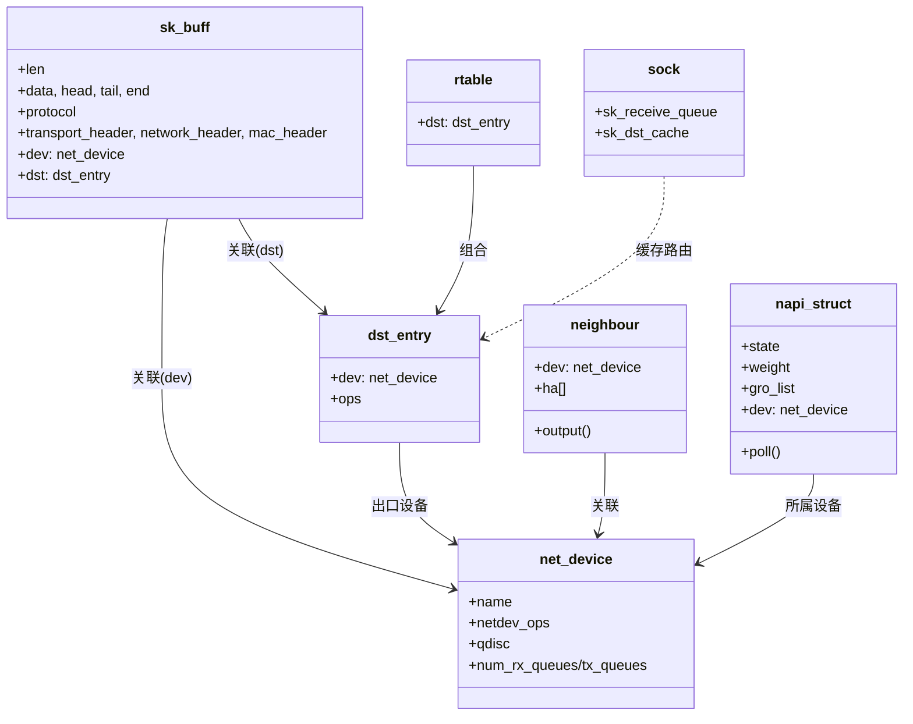
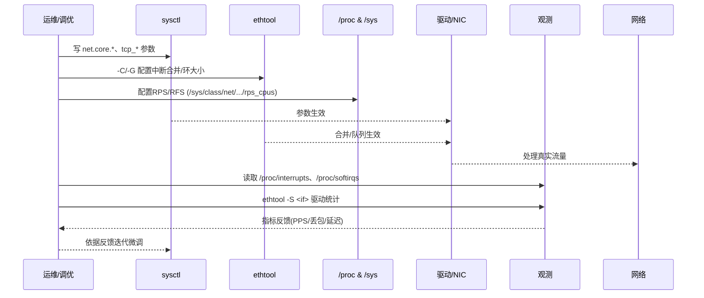

## 概述

Linux网络协议栈是内核中最复杂和最重要的子系统之一，它实现了完整的TCP/IP协议族，为用户空间应用程序提供了强大的网络通信能力。Linux网络栈的整体架构、各层模块的设计实现以及数据包的完整处理流程。

<!--more-->

## 1. Linux网络栈整体架构

### 1.1 网络栈的设计目标

Linux网络栈的设计遵循以下核心原则：

- **分层设计**：严格按照OSI七层模型进行分层实现
- **高性能**：支持高并发网络连接和大量数据传输
- **可扩展性**：支持多种网络协议和硬件设备
- **稳定可靠**：保证数据传输的完整性和可靠性

### 1.2 网络栈分层架构图



### 2.3 关键函数核心代码与功能说明（精炼）

```c
/*
 * __netif_receive_skb_core - L2→L3 分发与钩子处理核心
 * 作用：在软中断/NAPI上下文中，对入包执行协议识别、VLAN/Netfilter、路由前置等，
 * 决定将skb交付到IP层、桥、VLAN或上层处理。
 */
static int __netif_receive_skb_core(struct sk_buff *skb)
{
    struct packet_type *ptype;
    __be16 type = skb->protocol;

    /* L2 解析已在 eth_type_trans 完成，这里进入 L3/钩子 */
    if (vlan_do_receive(&skb))
        return NET_RX_SUCCESS; /* 交由VLAN设备继续处理 */

    /* PRE_ROUTING: 早期策略/ACL/NAT 前检查 */
    if (nf_hook(NFPROTO_IPV4, NF_INET_PRE_ROUTING, skb, skb->dev, NULL,
                __netif_receive_skb_one_core))
        return NET_RX_SUCCESS; /* 被丢弃或重定向 */

    /* 分发到具体 L3 协议（IPv4/IPv6/ARP 等） */
    ptype = rcu_dereference(ptype_base[ntohs(type) & PTYPE_HASH_MASK]);
    for (; ptype; ptype = rcu_dereference(ptype->next)) {
        if (ptype->type == type)
            return ptype->func(skb, skb->dev, ptype, NULL);
    }
    kfree_skb_reason(skb, SKB_DROP_REASON_PROTO_OUT_OF_RANGE);
    return NET_RX_DROP;
}

/*
 * ip_local_out/__ip_local_out - 本机发包 L3 出口
 * 作用：本地构造的IP包完成路由、Netfilter LOCAL_OUT/POST_ROUTING，再交给dst输出。
 */
int ip_local_out(struct net *net, struct sock *sk, struct sk_buff *skb)
{
    int err;

    err = __ip_local_out(net, sk, skb);
    if (likely(err == 0))
        err = dst_output(net, sk, skb->sk ? skb->sk->sk_dst_cache : skb_dst(skb), skb);
    return err;
}

static inline int __ip_local_out(struct net *net, struct sock *sk, struct sk_buff *skb)
{
    /* 计算/修正IP头校验、长度等 */
    ip_send_check(ip_hdr(skb));

    /* LOCAL_OUT：策略/防火墙/旁路等 */
    return nf_hook(NFPROTO_IPV4, NF_INET_LOCAL_OUT, skb, NULL, skb_dst(skb)->dev,
                   dst_output);
}

/*
 * dev_queue_xmit - L2 出口调度入口
 * 作用：选择Qdisc/队列，应用分片/GSO校验，最终调用驱动 ndo_start_xmit。
 */
netdev_tx_t dev_queue_xmit(struct sk_buff *skb)
{
    struct net_device *dev = skb->dev;
    struct Qdisc *q;

    /* 选择发送队列（队列映射/多队列/RSS） */
    skb_set_queue_mapping(skb, netdev_pick_tx(dev, skb));
    q = rcu_dereference_bh(dev->qdisc);

    /* GSO/分段与TC过滤 */
    if (qdisc_enqueue_root(skb, q) == NET_XMIT_SUCCESS) {
        __netif_schedule(q);
        return NET_XMIT_SUCCESS;
    }
    return NET_XMIT_DROP;
}

/*
 * tcp_write_xmit - TCP 发送路径核心
 * 作用：根据拥塞/窗口/延迟ACK等策略，从发送队列取段，执行TSO/GSO或常规发送。
 */
static bool tcp_write_xmit(struct sock *sk, unsigned int mss_now, int nonagle,
                           int push_one, gfp_t gfp)
{
    struct tcp_sock *tp = tcp_sk(sk);

    while (tcp_packets_pending(tp)) {
        struct sk_buff *skb = tcp_send_head(sk);
        if (!tcp_snd_wnd_test(tp, skb))
            break; /* 受限于发送窗口/拥塞窗口 */

        if (skb_is_gso(skb))
            tcp_tso_xmit(sk, skb);
        else
            __tcp_transmit_skb(sk, skb, 1, gfp);

        if (push_one)
            break; /* Nagle/Push 策略 */
    }
    return true;
}
```

### 2.4 关键函数时序图（精炼）





### 2.5 关键函数调用链（补充）

- __netif_receive_skb_core
  - 调用来源：net_rx_action -> napi_poll -> 驱动 poll -> napi_gro_receive -> netif_receive_skb
  - 下游：vlan_do_receive | Netfilter PRE_ROUTING | ptype->func(ip_rcv/arp_rcv/ipv6_rcv)

- ip_local_out/__ip_local_out
  - 调用来源：tcp_transmit/udp_send_skb/raw_send_hdrinc 等
  - 下游：dst_output -> ip_output -> ip_finish_output -> 邻居输出(neigh_output)

- dev_queue_xmit
  - 调用来源：ip_finish_output2/neigh_hh_output/vlan_dev_hard_start_xmit
  - 下游：qdisc_enqueue -> qdisc_run -> sch_direct_xmit -> 驱动 ndo_start_xmit

- tcp_write_xmit
  - 调用来源：tcp_push/tcp_release_cb/拥塞/定时器
  - 下游：__tcp_transmit_skb -> ip_queue_xmit -> ip_local_out

### 1.3 网络栈主要组件

Linux网络栈由以下核心组件构成：

1. **Socket层**：提供应用程序网络编程接口
2. **传输层**：实现TCP、UDP等传输协议
3. **网络层**：实现IP协议和路由功能
4. **数据链路层**：处理以太网帧和ARP协议
5. **网络设备层**：管理网络设备和队列
6. **设备驱动层**：控制具体的网卡硬件

## 2. 网络数据包处理流程

### 2.1 数据包接收流程时序图



### 2.2 数据包发送流程时序图



## 3. 核心数据结构

### 3.1 sk_buff：网络数据包的核心表示

```c
/**
 * sk_buff - 网络数据包的核心数据结构
 * 
 * sk_buff是Linux网络栈中最重要的数据结构，用于在各个网络层之间传递数据包。
 * 它不仅包含数据包的实际内容，还包含了各种元数据信息，如协议头指针、
 * 时间戳、网络设备信息等。
 */
struct sk_buff {
    union {
        struct {
            /* 这些成员必须在第一位，以保证与其他结构的兼容性 */
            struct sk_buff    *next;     // 链表中的下一个skb
            struct sk_buff    *prev;     // 链表中的前一个skb
            union {
                struct net_device    *dev;    // 关联的网络设备
                unsigned long        dev_scratch; // 设备相关的临时数据
            };
        };
        struct rb_node    rbnode;      // 用于红黑树的节点（TCP重组）
        struct list_head  list;       // 通用链表节点
    };
    
    union {
        struct sock *sk;              // 关联的socket
        int        ip_defrag_offset;  // IP分片重组偏移
    };
    
    union {
        ktime_t        tstamp;        // 时间戳
        u64        skb_mstamp_ns;     // 单调时间戳（纳秒）
    };
    
    /*
     * 这些成员用于跟踪数据包在网络栈中的传递过程
     */
    char            cb[48] __aligned(8);  // 控制缓冲区，各层可用来存储私有数据
    
    union {
        struct {
            unsigned long    _skb_refdst; // 目标路由缓存
            void        (*destructor)(struct sk_buff *skb); // 析构函数
        };
        struct list_head    tcp_tsorted_anchor; // TCP时间戳排序锚点
    };
    
    /*
     * 协议相关的头部指针
     * 这些指针指向数据包中各个协议层的头部位置
     */
    unsigned int        len;          // 数据包总长度
    unsigned int        data_len;     // 非线性数据长度
    __u16            mac_len;      // MAC头长度
    __u16            hdr_len;      // 可写头部长度
    
    /* 数据包内容指针 */
    __u16            queue_mapping;   // 队列映射
    
    /* 各层协议头部指针 */
    __u8            *head;         // 缓冲区头部
    __u8            *data;         // 数据起始位置
    __u8            *tail;         // 数据结束位置
    __u8            *end;          // 缓冲区结束位置
    
    unsigned int        truesize;     // 实际占用内存大小
    refcount_t        users;        // 引用计数
    
    /* 网络协议栈相关字段 */
    __be16            protocol;      // 协议类型（如ETH_P_IP）
    __u16            transport_header; // 传输层头部偏移
    __u16            network_header;   // 网络层头部偏移
    __u16            mac_header;       // MAC层头部偏移
    __u16            inner_transport_header; // 内层传输头偏移
    __u16            inner_network_header;   // 内层网络头偏移
    __u16            inner_mac_header;       // 内层MAC头偏移
    
    __u8            pkt_type:3;      // 数据包类型（单播/广播/组播等）
    __u8            ignore_df:1;     // 忽略DF标志
    __u8            nf_trace:1;      // netfilter跟踪标志
    __u8            ip_summed:2;     // 校验和状态
    __u8            ooo_okay:1;      // 允许乱序
    
    __u8            l4_hash:1;       // L4哈希有效
    __u8            sw_hash:1;       // 软件哈希
    __u8            wifi_acked_valid:1; // WiFi ACK有效
    __u8            wifi_acked:1;    // WiFi已ACK
    __u8            no_fcs:1;        // 无FCS
    __u8            encapsulation:1; // 封装标志
    __u8            encap_hdr_csum:1; // 封装头校验和
    __u8            csum_valid:1;    // 校验和有效
    
    __u8            csum_complete_sw:1; // 软件完整校验和
    __u8            csum_level:2;    // 校验和级别
    __u8            csum_not_inet:1; // 非inet校验和
    __u8            dst_pending_confirm:1; // 目标确认待处理
    
    __u8            ndisc_nodetype:2; // NDISC节点类型
    __u8            ipvs_property:1; // IPVS属性
    __u8            inner_protocol_type:1; // 内层协议类型
    __u8            remcsum_offload:1; // 远程校验和卸载
    
    __u32            hash;           // 数据包哈希值
    __be16            vlan_proto;     // VLAN协议
    __u16            vlan_tci;      // VLAN标签
    
    union {
        unsigned int    napi_id;     // NAPI实例ID
        unsigned int    sender_cpu;  // 发送CPU
    };
    
    union {
        __u32        mark;          // 数据包标记
        __u32        reserved_tailroom; // 保留尾部空间
    };
    
    union {
        __be16        inner_protocol; // 内层协议
        __u8        inner_ipproto;    // 内层IP协议
    };
    
    __u16            tc_index;       // 流量控制索引
    __u16            tc_verd;        // TC verdict
    
    union {
        __wsum        csum;          // 校验和
        struct {
            __u16    csum_start;     // 校验和起始偏移
            __u16    csum_offset;    // 校验和偏移
        };
    };
    
    __u32            priority;       // 数据包优先级
    int            skb_iif;        // 输入接口索引
    __u32            rxhash;         // 接收哈希
    
    union {
        struct net_device *dev;      // 输出设备
        unsigned long     dev_scratch;
    };
    
    union {
        struct rtable    *rt;        // IPv4路由表项
        struct rt6_info  *rt6;       // IPv6路由表项
        struct dst_entry *dst;       // 通用目标项
    };
    
    union {
        struct secpath    *sp;       // 安全路径
        unsigned long     _tx_flags; // 传输标志
    };
    
    union {
        unsigned long     _sk_rcu;   // RCU保护的socket指针
        struct sock      *sk_listener; // 监听socket
    };
    
    /* 分片相关字段 */
    unsigned int        frag_max_size; // 最大分片大小
    skb_frag_t        frags[MAX_SKB_FRAGS]; // 分片数组
};
```

### 3.2 网络设备结构体

```c
/**
 * net_device - 网络设备结构体
 * 
 * 这个结构体表示系统中的一个网络设备，包含了设备的所有状态信息、
 * 操作函数指针、统计信息等。每个网络接口（如eth0、wlan0等）都
 * 对应一个net_device实例。
 */
struct net_device {
    char            name[IFNAMSIZ];   // 设备名称，如"eth0"
    struct netdev_name_node    *name_node; // 名称节点
    struct dev_ifalias    __rcu *ifalias;   // 接口别名
    
    /*
     * I/O相关字段
     */
    unsigned long        mem_end;     // 共享内存结束地址
    unsigned long        mem_start;   // 共享内存起始地址
    unsigned long        base_addr;   // 设备基地址
    
    /*
     * 一些内核版本中可能还包含IRQ相关字段
     */
    int            irq;           // 中断号
    
    /*
     * 网络设备状态和特性
     */
    netdev_features_t    features;     // 设备特性标志
    netdev_features_t    hw_features;  // 硬件特性
    netdev_features_t    wanted_features; // 期望特性
    netdev_features_t    vlan_features;   // VLAN特性
    netdev_features_t    hw_enc_features; // 硬件加密特性
    netdev_features_t    mpls_features;   // MPLS特性
    netdev_features_t    gso_partial_features; // GSO部分特性
    
    unsigned int        flags;         // 设备标志（IFF_UP等）
    unsigned int        priv_flags;    // 私有标志
    
    unsigned short        gflags;       // 全局标志
    unsigned short        padded;       // 填充字段
    
    unsigned char        operstate;    // 操作状态
    unsigned char        link_mode;    // 链接模式
    unsigned char        if_port;      // 接口端口类型
    unsigned char        dma;          // DMA通道
    
    /*
     * 最大传输单元和相关参数
     */
    unsigned int        mtu;           // 最大传输单元
    unsigned int        min_mtu;       // 最小MTU
    unsigned int        max_mtu;       // 最大MTU
    unsigned short        type;         // 硬件类型
    unsigned short        hard_header_len; // 硬件头长度
    unsigned char        min_header_len;   // 最小头长度
    
    unsigned short        needed_headroom; // 需要的头部空间
    unsigned short        needed_tailroom; // 需要的尾部空间
    
    /*
     * 设备地址信息
     */
    unsigned char        perm_addr[MAX_ADDR_LEN]; // 永久地址
    unsigned char        addr_assign_type;        // 地址分配类型
    unsigned char        addr_len;               // 地址长度
    unsigned char        upper_level;            // 上层级别
    unsigned char        lower_level;            // 下层级别
    
    unsigned short        neigh_priv_len;        // 邻居私有数据长度
    unsigned short        dev_id;               // 设备ID
    unsigned short        dev_port;             // 设备端口
    
    spinlock_t        addr_list_lock;          // 地址列表锁
    
    struct netdev_hw_addr_list    uc;          // 单播地址列表
    struct netdev_hw_addr_list    mc;          // 组播地址列表
    struct netdev_hw_addr_list    dev_addrs;   // 设备地址列表
    
    /*
     * 队列相关结构
     */
    struct kset        *queues_kset;           // 队列kset
    unsigned int        promiscuity;          // 混杂模式计数
    unsigned int        allmulti;             // 全组播计数
    bool            uc_promisc;             // UC混杂模式
    
    /*
     * 网络设备操作函数集
     */
    const struct net_device_ops    *netdev_ops; // 设备操作函数
    const struct ethtool_ops    *ethtool_ops;   // ethtool操作函数
    const struct l3mdev_ops    *l3mdev_ops;     // L3设备操作
    const struct ndisc_ops    *ndisc_ops;       // NDISC操作
    const struct xfrmdev_ops *xfrmdev_ops;      // XFRM设备操作
    
    /*
     * 头部操作和缓存
     */
    const struct header_ops *header_ops;        // 头部操作函数
    struct neigh_parms    *arp_ptr;            // ARP参数
    struct neigh_parms    *nd_net;             // ND网络
    
    /*
     * 统计信息
     */
    struct net_device_stats stats;             // 设备统计
    struct net_device_core_stats __percpu *core_stats; // 核心统计
    
    /*
     * 发送和接收队列
     */
    struct netdev_queue    __rcu *ingress_queue; // 入口队列
    unsigned char        broadcast[MAX_ADDR_LEN]; // 广播地址
    struct cpu_rmap        *rx_cpu_rmap;          // RX CPU映射
    
    struct hlist_node    index_hlist;           // 索引哈希链表
    
    /*
     * 网络命名空间
     */
    possible_net_t        nd_net;               // 网络命名空间
    
    /*
     * 类和组
     */
    struct device        dev;                   // 设备结构
    const struct attribute_group *sysfs_groups[4]; // sysfs组
    const struct attribute_group *sysfs_rx_queue_group; // RX队列sysfs组
    
    const struct rtnl_link_ops *rtnl_link_ops;  // RTNL链接操作
    
    /*
     * 发送队列
     */
    unsigned int        num_tx_queues;         // 发送队列数量
    unsigned int        real_num_tx_queues;    // 实际发送队列数量
    struct Qdisc        *qdisc;                // 队列规则
    unsigned int        tx_queue_len;          // 发送队列长度
    spinlock_t        tx_global_lock;         // 发送全局锁
    
    struct xdp_netdev_queue __rcu *xdp_queue[16]; // XDP队列
    
    /*
     * 接收队列
     */
    unsigned int        num_rx_queues;         // 接收队列数量
    unsigned int        real_num_rx_queues;    // 实际接收队列数量
    
    struct bpf_prog __rcu    *xdp_prog;        // XDP程序
    unsigned long        xdp_features;        // XDP特性
    
    /*
     * 设备特定的私有数据
     */
    unsigned long        priv[0] __aligned(NETDEV_ALIGN);
} ____cacheline_aligned;
```

### 3.3 关键结构体关系图（组合/引用）



## 4. 网络命名空间

Linux网络栈支持网络命名空间，这是容器网络隔离的基础：

```c
/**
 * net - 网络命名空间结构体
 * 
 * 网络命名空间提供了网络资源的隔离，包括网络设备、路由表、
 * 防火墙规则等。每个命名空间都有自己独立的网络视图。
 */
struct net {
    atomic_t            passive;     // 被动引用计数
    refcount_t        count;       // 活跃引用计数
    spinlock_t        rules_mod_lock; // 规则修改锁
    
    atomic64_t        cookie_gen;   // cookie生成器
    
    struct list_head    list;       // 命名空间链表
    struct list_head    exit_list;  // 退出列表
    struct user_namespace   *user_ns;   // 用户命名空间
    struct ucounts        *ucounts;     // 用户计数
    struct idr        netns_ids;    // 命名空间ID映射
    
    struct ns_common    ns;         // 通用命名空间部分
    struct list_head    dev_base_head; // 设备基础链表头
    struct hlist_head   *dev_name_head; // 设备名称哈希表
    struct hlist_head   *dev_index_head; // 设备索引哈希表
    unsigned int        dev_base_seq;    // 设备序列号
    int            ifindex;        // 接口索引
    unsigned int        dev_unreg_count; // 设备注销计数
    
    /* 路由相关 */
    struct list_head    rules_ops;      // 路由规则操作列表
    struct net_device   *loopback_dev;  // 回环设备
    
    /* IPv4相关 */
    struct netns_ipv4   ipv4;          // IPv4命名空间数据
    
    /* IPv6相关 */
    struct netns_ipv6   ipv6;          // IPv6命名空间数据
    
    /* 其他协议栈数据 */
    struct netns_ieee802154_lowpan  ieee802154_lowpan;
    struct netns_sctp   sctp;          // SCTP数据
    struct netns_dccp   dccp;          // DCCP数据
    struct netns_nf     nf;            // netfilter数据
    struct netns_xt     xt;            // xtables数据
    struct netns_ct     ct;            // 连接跟踪数据
    
    /* 网络设备相关 */
    struct sock         *rtnl;         // RTNETLINK套接字
    struct sock         *genl;         // 通用netlink套接字
    
    struct uevent_sock  *uevent_sock;  // uevent套接字
    
    struct hlist_head   *dev_addr_hash; // 设备地址哈希
    
    /* 流量控制 */
    struct tcf_proto __rcu *ingress_base; // 入口基础过滤器
    
    /* BPF相关 */
    struct bpf_prog __rcu *flow_dissector_prog; // 流分析器BPF程序
} __randomize_layout;
```

## 5. 网络栈初始化流程

Linux网络栈在系统启动时按照特定顺序进行初始化：

```c
/**
 * 网络栈初始化的核心函数
 * 这些函数在系统启动时被调用，按照依赖关系进行初始化
 */

// 1. 基础网络初始化
static int __init net_dev_init(void)
{
    int i, rc = -ENOMEM;
    
    // 初始化per-CPU的软中断队列
    for_each_possible_cpu(i) {
        struct softnet_data *sd = &per_cpu(softnet_data, i);
        
        memset(sd, 0, sizeof(*sd));
        skb_queue_head_init(&sd->input_pkt_queue);
        skb_queue_head_init(&sd->process_queue);
        INIT_LIST_HEAD(&sd->poll_list);
        sd->output_queue_tailp = &sd->output_queue;
        
        sd->csd.func = rps_trigger_softirq;
        sd->csd.info = sd;
        sd->cpu = i;
        
        init_gro_hash(&sd->backlog);
        sd->backlog.poll = process_backlog;
        sd->backlog.weight = weight_p;
        sd->backlog.gro_list = NULL;
        sd->backlog.gro_count = 0;
    }
    
    // 注册网络设备通知链
    register_netdevice_notifier(&netdev_chain_exit_notifier);
    
    // 初始化路由缓存
    dst_subsys_init();
    
    // 初始化网络设备子系统
    rc = register_pernet_subsys(&netdev_net_ops);
    if (rc)
        goto out;
    
    // 初始化邻居子系统
    rc = neigh_init();
    if (rc)
        goto out;
    
    // 初始化数据包套接字
    rc = register_pernet_subsys(&packet_net_ops);
    if (rc)
        goto out;
    
out:
    return rc;
}

// 2. Socket层初始化
static int __init sock_init(void)
{
    int err;
    
    // 初始化网络命名空间
    err = net_sysctl_init();
    if (err)
        return err;
    
    // 初始化sk_buff缓存
    skb_init();
    
    // 初始化socket缓存
    init_inodecache();
    
    // 注册socket文件系统
    err = register_filesystem(&sock_fs_type);
    if (err)
        goto out;
    
    // 初始化socket相关的proc文件系统
    err = sock_proc_init();
    if (err)
        goto out_fs;
    
    // 初始化netfilter
    err = netfilter_init();
    if (err)
        goto out;
    
out_fs:
    unregister_filesystem(&sock_fs_type);
out:
    return err;
}

// 3. 协议栈初始化
static int __init inet_init(void)
{
    struct sk_buff *dummy_skb;
    struct inet_protosw *q;
    struct list_head *r;
    int rc = -EINVAL;
    
    // 初始化TCP协议
    rc = tcp_init();
    if (rc)
        goto out;
    
    // 初始化UDP协议
    udp_init();
    
    // 初始化ICMP协议
    icmp_init();
    
    // 初始化IP协议
    ip_init();
    
    // 注册inet协议族
    (void)sock_register(&inet_family_ops);
    
    // 注册inet协议
    inet_add_protocol(&icmp_protocol, IPPROTO_ICMP);
    inet_add_protocol(&udp_protocol, IPPROTO_UDP);
    inet_add_protocol(&tcp_protocol, IPPROTO_TCP);
    
    // 初始化ARP
    arp_init();
    
    // 初始化IP路由
    ip_rt_init();
    
    // 初始化inet哈希表
    inet_hashinfo_init(&tcp_hashinfo);
    
out:
    return rc;
}
```

## 6. 网络栈模块划分

鉴于Linux网络栈的复杂性，我们将其划分为以下模块进行详细介绍：

### 6.1 模块列表

1. **网络设备驱动层** - `linux-network-device-driver.md`
2. **数据链路层** - `linux-network-datalink.md`
3. **网络层（IP协议）** - `linux-network-ip-layer.md`
4. **传输层（TCP/UDP）** - `linux-network-transport-layer.md`
5. **Socket层** - `linux-network-socket-layer.md`
6. **网络包处理流程** - `linux-network-packet-flow.md`
7. **网络中断处理** - `linux-network-interrupt.md`
8. **网络内存管理** - `linux-network-memory.md`
9. **Netfilter框架** - `linux-network-netfilter.md`

每个模块都将包含：
- 模块架构图和时序图
- 核心数据结构详解
- 关键函数源码分析
- 执行流程追踪
- 性能优化要点

## 7. 网络栈性能优化技术

### 7.1 关键优化策略

Linux网络栈采用了多种先进的优化技术：

```c
/**
 * 网络栈优化配置示例
 */
static void optimize_network_stack(void)
{
    /* 启用RPS多核处理 */
    echo f > /sys/class/net/eth0/queues/rx-0/rps_cpus
    
    /* 配置RFS流引导 */
    echo 32768 > /proc/sys/net/core/rps_sock_flow_entries
    echo 2048 > /sys/class/net/eth0/queues/rx-0/rps_flow_cnt
    
    /* 优化中断合并 */
    ethtool -C eth0 rx-usecs 50 rx-frames 32
    ethtool -C eth0 tx-usecs 50 tx-frames 32
    
    /* 增加网络缓冲区 */
    echo 16777216 > /proc/sys/net/core/rmem_max
    echo 16777216 > /proc/sys/net/core/wmem_max
    
    /* 优化软中断处理 */
    echo 600 > /proc/sys/net/core/netdev_budget
    echo 5000 > /proc/sys/net/core/netdev_max_backlog
}
```

### 7.2 网络栈演进历程

从早期版本到现代Linux，网络栈经历了重要演进：

- **Linux 1.0**: 基础TCP/IP实现
- **Linux 2.2**: 引入Netfilter框架
- **Linux 2.4**: 加入NAPI机制
- **Linux 2.6**: 完善多核支持
- **Linux 3.x**: 引入RPS/RFS技术
- **Linux 4.x**: 加入XDP高性能框架
- **Linux 5.x**: 完善eBPF集成

### 7.3 现代网络挑战与解决方案

#### 云原生网络优化

- **容器网络**：veth、bridge、overlay网络
- **服务网格**：eBPF加速的服务间通信
- **负载均衡**：内核级别的负载分发

#### 高频交易网络优化

- **内核旁路**：DPDK、AF_XDP等技术
- **时延优化**：busy polling、中断绑定
- **零拷贝**：用户态网络栈

### 7.4 参数调优与观测清单（实践手册)

以下清单按配置域分组：

- sysctl（内存/队列/软中断）
  - net.core.rmem_default / rmem_max：接收缓冲默认/上限
  - net.core.wmem_default / wmem_max：发送缓冲默认/上限
  - net.core.optmem_max：单socket可选项内存上限
  - net.core.netdev_max_backlog：软中断积压队列上限
  - net.core.netdev_budget / netdev_budget_usecs：RX软中断预算/时间
  - net.core.busy_poll / busy_read：busy polling周期（µs）
  - net.ipv4.tcp_rmem / tcp_wmem / tcp_mem：TCP三元组内存
  - net.ipv4.udp_mem：UDP内存阈值
  - net.ipv4.tcp_notsent_lowat：未发送阈值（降低系统调用开销/延迟）
  - net.ipv4.tcp_mtu_probing：启用PMTUD失败时的MTU探测

- ethtool（驱动/队列/中断合并）
  - ethtool -k <if>：查看/设置 offload（TSO/GSO/GRO/LRO）
  - ethtool -C <if> rx-usecs/tx-usecs/rx-frames/tx-frames：中断合并
  - ethtool -G <if> rx/tx：硬件环大小
  - ethtool -S <if>：驱动统计（丢包/重试/队列/页池）
  - ethtool -l/-L <if>：RSS队列数量

- /proc 与 /sys 观测
  - /proc/net/sockstat、/proc/net/netstat：协议内存/错误
  - /proc/softirqs：NET_RX/NET_TX分布
  - /proc/interrupts：中断亲和与分布
  - /sys/class/net/<if>/queues/rx-*/rps_cpus / rps_flow_cnt：RPS配置
  - /sys/kernel/debug/page_pool/*/stats：页池命中/回收/失败

- 建议默认基线（10G起步，按业务调优）
  - net.core.netdev_max_backlog = 5000
  - net.core.netdev_budget = 600，net.core.netdev_budget_usecs = 2000
  - net.core.rmem_max = 16777216，net.core.wmem_max = 16777216
  - 适度开启中断合并（rx-usecs=50，rx-frames=32；tx 同步）
  - 合理开启GRO/GSO/TSO，配合应用发送批量化

### 7.5 调优与观测时序图



### 7.6 关键函数调用路径速查（基于源码）

- 应用发送(TCP)
  - `__sys_sendto` -> `sock_sendmsg` -> `inet_sendmsg` -> `tcp_sendmsg_locked` -> `tcp_push` -> `tcp_write_xmit` -> `__tcp_transmit_skb` -> `ip_queue_xmit` -> `ip_local_out` -> `__ip_local_out` -> `dst_output` -> `ip_output` -> `ip_finish_output` -> `ip_finish_output2`/`neigh_output` -> `dev_queue_xmit` -> `qdisc_run` -> `sch_direct_xmit` -> 驱动 `ndo_start_xmit`
- 应用接收(TCP)
  - 硬中断ISR -> `napi_schedule` -> `net_rx_action` -> 驱动 `poll` -> `napi_gro_receive` -> `netif_receive_skb` -> `__netif_receive_skb_core` -> `ip_rcv` -> `ip_rcv_finish` -> `ip_local_deliver` -> `ip_protocol_deliver_rcu` -> `tcp_v4_rcv` -> `tcp_rcv_established` -> `sk_data_ready`/`wake_up` -> `__sys_recvfrom` -> `sock_recvmsg` -> `inet_recvmsg` -> `tcp_recvmsg`
- 应用发送(UDP)
  - `__sys_sendto` -> `sock_sendmsg` -> `inet_sendmsg` -> `udp_sendmsg` -> `ip_make_skb`/`udp_send_skb` -> `ip_local_out` -> `dst_output` -> `ip_finish_output2`/`neigh_output` -> `dev_queue_xmit` -> 驱动 `ndo_start_xmit`
- 应用接收(UDP)
  - 驱动 `poll` -> `napi_gro_receive` -> `netif_receive_skb` -> `ip_rcv` -> `ip_local_deliver` -> `ip_protocol_deliver_rcu` -> `__udp4_lib_rcv` -> `udp_queue_rcv_skb` -> `udp_recvmsg`
- IPv4 路由查找
  - 发送侧：`ip_queue_xmit` 需要 `skb_dst` -> 若空则 `ip_route_output_flow` -> 继续 `ip_local_out`
  - 接收侧：`ip_rcv_core` -> `ip_route_input_noref` -> 设置 `skb_dst` -> `ip_rcv_finish`
- Netfilter 钩子（IPv4）
  - 接收：`ip_rcv` -> `NF_INET_PRE_ROUTING` -> 路由 -> `LOCAL_IN`/`FORWARD` -> `ip_local_deliver`
  - 发送：`ip_local_out` -> `NF_INET_LOCAL_OUT` -> `POST_ROUTING` -> `dst_output`
- 设备接收/NAPI
  - ISR -> `napi_schedule` -> `net_rx_action` -> `napi_poll`(驱动) -> `napi_complete_done` -> 重新启用中断
- 设备发送/Qdisc
  - `dev_queue_xmit` -> `__dev_queue_xmit` -> `qdisc_enqueue` -> `qdisc_run` -> `dequeue_skb` -> `sch_direct_xmit` -> 驱动 `ndo_start_xmit`
- 邻居/ARP 解析（发送路径未解析MAC时）
  - `neigh_hh_output`/`neigh_output` -> `neigh_resolve_output` -> `arp_solicit` -> `arp_send` -> 等待应答后重发原包
- VLAN 收发
  - 接收：驱动标记VLan -> `__vlan_hwaccel_put_tag` -> `vlan_do_receive` -> 交付VLAN设备 -> 上送协议栈
  - 发送：`vlan_dev_hard_start_xmit` -> 添/保留VLAN标签 -> `dev_queue_xmit`
- GRO/GSO
  - 接收GRO：`napi_gro_receive` -> `inet_gro_receive`/`tcp_gro_receive` -> `napi_gro_flush`
  - 发送GSO：`dev_queue_xmit` -> `validate_xmit_skb` -> `gso_segment`/TSO -> 驱动发送
- Zero-Copy/ERRQUEUE（SO_ZEROCOPY）
  - 发送：`tcp_sendmsg_locked(MSG_ZEROCOPY)` -> SKB引用用户页 -> 硬件完成 -> `sk_error_queue` 注入 `sock_extended_err(ee_origin=ZEROCOPY)`
  - 完成通知：应用 `recvmsg(MSG_ERRQUEUE)` 读取CMSG范围
- Page Pool（RX页池）
  - 预填：`page_pool_dev_alloc_pages` -> 填RX描述符 -> NIC DMA
  - 完成：`page_pool_dma_sync_for_cpu` -> `build_skb` -> `napi_gro_receive` -> 消费后 `page_pool_put_full_page`
- Socket 连接/监听
  - 连接：`__sys_connect` -> `inet_stream_connect` -> `tcp_v4_connect` -> `__inet_hash_connect` -> `tcp_connect` -> 3次握手
  - 监听/接受：`__sys_listen` -> `inet_listen` -> `inet_csk_listen_start`；`inet_csk_accept` -> `inet_accept` -> `sock_map_fd`


## 7. 总结

### 7.1 Linux网络栈的优势

Linux网络协议栈是一个高度复杂但设计精良的系统，它通过分层架构实现了完整的网络通信功能：

- **模块化设计**：清晰的分层和接口抽象
- **高性能实现**：大量优化技术和零拷贝机制
- **良好扩展性**：支持多协议和新技术集成
- **稳定可靠性**：经过大量实际部署验证


理解网络栈的整体架构对于深入学习Linux内核网络子系统至关重要。在模块化文档中，我们了每个层次的具体实现，揭示了Linux网络栈高性能和可靠性的技术细节。

