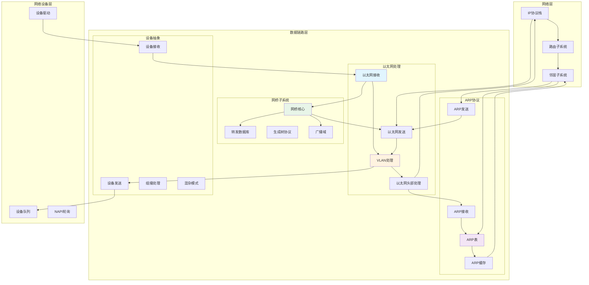
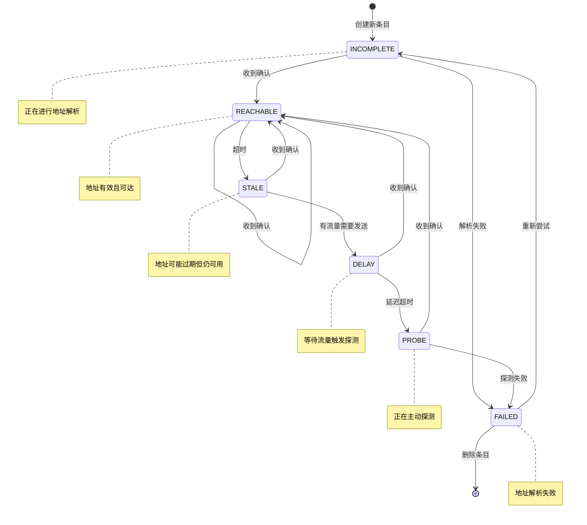
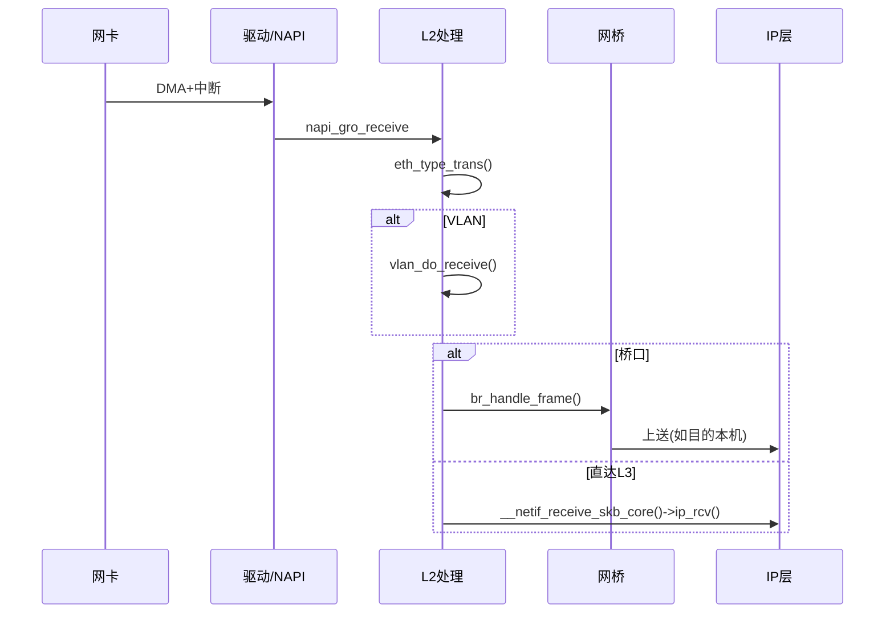
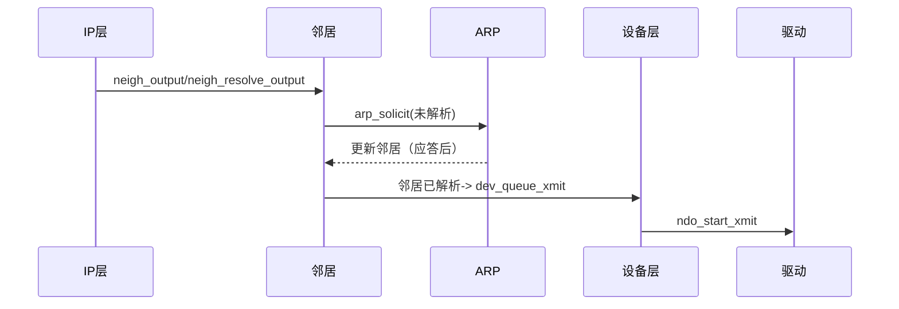
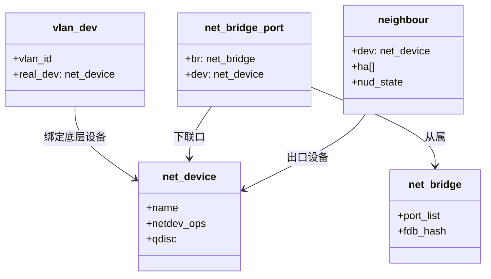

## 概述

数据链路层是Linux网络协议栈中连接物理层和网络层的关键桥梁，主要负责处理以太网帧、ARP协议解析、VLAN标签处理等功能。Linux数据链路层的核心组件和实现机制。

<!--more-->

## 1. 数据链路层架构

### 1.1 数据链路层的核心职责

数据链路层在Linux网络栈中承担以下关键功能：

- **以太网帧处理**：封装和解封装以太网帧头部
- **MAC地址管理**：处理物理地址到逻辑地址的映射
- **ARP协议**：实现IP地址到MAC地址的解析
- **VLAN支持**：处理虚拟局域网标签
- **网桥功能**：实现二层转发和学习
- **流量控制**：管理数据链路层的流量

### 1.2 数据链路层架构图



## 2. 以太网协议实现

### 2.1 以太网帧结构

```c
/**
 * 以太网帧头结构
 * 
 * 以太网帧是数据链路层的基本传输单元，包含目标MAC地址、
 * 源MAC地址和协议类型字段。
 */
struct ethhdr {
    unsigned char   h_dest[ETH_ALEN];    /* 目标MAC地址，6字节 */
    unsigned char   h_source[ETH_ALEN];  /* 源MAC地址，6字节 */
    __be16          h_proto;             /* 协议类型，2字节 */
} __packed;

/**
 * 常用的以太网协议类型定义
 */
#define ETH_P_LOOP      0x0060          /* 以太网环回包 */
#define ETH_P_PUP       0x0200          /* Xerox PUP包 */
#define ETH_P_PUPAT     0x0201          /* Xerox PUP地址转换包 */
#define ETH_P_TSN       0x22F0          /* TSN (IEEE 1722) 包 */
#define ETH_P_IP        0x0800          /* 网际协议包 */
#define ETH_P_X25       0x0805          /* CCITT X.25 */
#define ETH_P_ARP       0x0806          /* 地址解析包 */
#define ETH_P_BPQ       0x08FF          /* G8BPQ AX.25 以太网包 */
#define ETH_P_IEEEPUP   0x0a00          /* Xerox IEEE802.3 PUP包 */
#define ETH_P_IEEEPUPAT 0x0a01          /* Xerox IEEE802.3 PUP地址转换包 */
#define ETH_P_BATMAN    0x4305          /* B.A.T.M.A.N.-高级包 */
#define ETH_P_DEC       0x6000          /* DEC指定，非DIX */
#define ETH_P_DNA_DL    0x6001          /* DEC DNA转储/加载 */
#define ETH_P_DNA_RC    0x6002          /* DEC DNA远程控制台 */
#define ETH_P_DNA_RT    0x6003          /* DEC DNA路由 */
#define ETH_P_LAT       0x6004          /* DEC LAT */
#define ETH_P_DIAG      0x6005          /* DEC诊断包 */
#define ETH_P_CUST      0x6006          /* DEC客户协议 */
#define ETH_P_SCA       0x6007          /* DEC系统控制体系结构 */
#define ETH_P_TEB       0x6558          /* 透明以太网桥接 */
#define ETH_P_RARP      0x8035          /* 反向地址解析包 */
#define ETH_P_8021Q     0x8100          /* 802.1Q VLAN扩展帧 */
#define ETH_P_IPX       0x8137          /* IPX协议 */
#define ETH_P_IPV6      0x86DD          /* IPv6协议 */
#define ETH_P_PAUSE     0x8808          /* IEEE 802.3 暂停帧 */
#define ETH_P_SLOW      0x8809          /* 慢协议(IEEE 802.3) */
#define ETH_P_WCCP      0x883E          /* Web-cache协调协议 */
#define ETH_P_MPLS_UC   0x8847          /* MPLS单播流量 */
#define ETH_P_MPLS_MC   0x8848          /* MPLS组播流量 */
#define ETH_P_ATMMPOA   0x884c          /* MultiProtocol Over ATM */
#define ETH_P_PPP_DISC  0x8863          /* PPPoE发现协议 */
#define ETH_P_PPP_SES   0x8864          /* PPPoE会话协议 */
#define ETH_P_LINK_CTL  0x886c          /* HPNA, wlan链路本地隧道 */
#define ETH_P_ATMFATE   0x8884          /* Frame-based ATM传输 */
#define ETH_P_PAE       0x888E          /* 端口访问实体(IEEE 802.1X) */
#define ETH_P_AOE       0x88A2          /* ATA over Ethernet */
#define ETH_P_8021AD    0x88A8          /* 802.1ad服务VLAN */
#define ETH_P_802_EX1   0x88B5          /* 802.1本地实验1 */
#define ETH_P_TIPC      0x88CA          /* TIPC */
#define ETH_P_MACSEC    0x88E5          /* 802.1AE MACsec */
#define ETH_P_8021AH    0x88E7          /* 802.1ah骨干服务标签 */
#define ETH_P_MVRP      0x88F5          /* 802.1Q MVRP */
#define ETH_P_1588      0x88F7          /* IEEE 1588时钟同步 */
#define ETH_P_NCSI      0x88F8          /* NCSI协议 */
#define ETH_P_PRP       0x88FB          /* 并行冗余协议 */
#define ETH_P_FCOE      0x8906          /* 光纤通道以太网 */
#define ETH_P_TDLS      0x890D          /* TDLS */
#define ETH_P_FIP       0x8914          /* FCoE初始化协议 */
#define ETH_P_80221     0x8917          /* IEEE 802.21媒体独立握手协议 */
#define ETH_P_HSR       0x892F          /* 高可用性无缝冗余 */
#define ETH_P_NSH       0x894F          /* 网络服务头部 */
#define ETH_P_LOOPBACK  0x9000          /* 以太网环回包，内核内部 */
#define ETH_P_QINQ1     0x9100          /* 已弃用的QinQ VLAN [ NOT AN OFFICIALLY REGISTERED ID ] */
#define ETH_P_QINQ2     0x9200          /* 已弃用的QinQ VLAN [ NOT AN OFFICIALLY REGISTERED ID ] */
#define ETH_P_QINQ3     0x9300          /* 已弃用的QinQ VLAN [ NOT AN OFFICIALLY REGISTERED ID ] */
#define ETH_P_EDSA      0xDADA          /* Ethertype DSA [ NOT AN OFFICIALLY REGISTERED ID ] */
#define ETH_P_IFE       0xED3E          /* ForCES帧间封装 */
#define ETH_P_AF_IUCV   0xFBFB          /* IBM af_iucv [ NOT AN OFFICIALLY REGISTERED ID ] */
#define ETH_P_802_3_MIN 0x0600          /* 如果frame length字段是 <= 1500，它是长度字段 */
#define ETH_P_802_3     0x0001          /* Dummy类型用于IEEE 802.3帧 */
#define ETH_P_AX25      0x0002          /* Dummy协议id用于AX.25 */
#define ETH_P_ALL       0x0003          /* 每个包(注意：绝不是有线的) */
#define ETH_P_802_2     0x0004          /* 802.2帧 */
#define ETH_P_SNAP      0x0005          /* 内部唯一SNAP */
#define ETH_P_DDCMP     0x0006          /* DEC DDCMP: 内部唯一 */
#define ETH_P_WAN_PPP   0x0007          /* 伪PPP用于WAN */
#define ETH_P_PPP_MP    0x0008          /* Dummy类型用于PPP MP帧 */
#define ETH_P_LOCALTALK 0x0009          /* Localtalk伪类型 */
#define ETH_P_CAN       0x000C          /* CAN: 控制器局域网 */
#define ETH_P_CANFD     0x000D          /* CANFD: CAN灵活数据速率*/
#define ETH_P_TR_802_2  0x0011          /* 802.2帧 */
#define ETH_P_MOBITEX   0x0015          /* Mobitex (kmod-mobitex.sf.net) */
#define ETH_P_CONTROL   0x0016          /* 通用PPP或原始帧的标签切换 */
#define ETH_P_IRDA      0x0017          /* Linux-IrDA */
#define ETH_P_ECONET    0x0018          /* Acorn Econet */
#define ETH_P_HDLC      0x0019          /* HDLC帧 */
#define ETH_P_ARCNET    0x001A          /* 1A用于ARCNET :-) */
#define ETH_P_DSA       0x001B          /* 分布式交换机体系结构 */
#define ETH_P_TRAILER   0x001C          /* 拖车切换器 */
#define ETH_P_PHONET    0x00F5          /* Nokia Phonet帧 */
#define ETH_P_IEEE802154 0x00F6         /* IEEE802.15.4帧 */
#define ETH_P_CAIF      0x00F7          /* ST-Ericsson CAIF协议 */
#define ETH_P_XDSA      0x00F8          /* 多路复用器DSA体系结构 */
#define ETH_P_MAP       0x00F9          /* Qualcomm IPC路由器协议 */
```

### 2.2 以太网帧接收处理

```c
/**
 * eth_type_trans - 确定数据包的协议ID
 * @skb: 接收到的数据包
 * @dev: 接收设备
 * 
 * 分析以太网帧头部，确定上层协议类型并设置相关字段
 * 返回值：网络字节序的协议类型
 */
__be16 eth_type_trans(struct sk_buff *skb, struct net_device *dev)
{
    unsigned short _service_access_point;
    const unsigned char *rawp;
    struct ethhdr *eth;
    
    /* 重置网络头部偏移 */
    skb_reset_mac_header(skb);
    
    /* 获取以太网头部 */
    eth = (struct ethhdr *)skb->data;
    
    /* 移动数据指针跳过以太网头部 */
    skb_pull_inline(skb, ETH_HLEN);
    
    /* 设置输入设备 */
    skb->dev = dev;
    
    /* 
     * 判断数据包类型：单播、广播、组播或其他主机的包
     */
    if (unlikely(is_multicast_ether_addr(eth->h_dest))) {
        if (ether_addr_equal_64bits(eth->h_dest, dev->broadcast))
            skb->pkt_type = PACKET_BROADCAST;
        else
            skb->pkt_type = PACKET_MULTICAST;
    } else if (unlikely(!ether_addr_equal_64bits(eth->h_dest, dev->dev_addr))) {
        skb->pkt_type = PACKET_OTHERHOST;
    }
    
    /*
     * 一些老的网络硬件会给我们长度而不是类型字段，
     * 我们可以通过查看其值来判断。
     * 
     * 0x0600是帧长度的最大值，所以如果协议字段 > 0x0600，
     * 那么它是一个类型字段，我们直接使用它。
     */
    if (ntohs(eth->h_proto) >= ETH_P_802_3_MIN)
        return eth->h_proto;
    
    /*
     * 这是802.3帧，长度字段位于类型字段位置。
     * 实际的协议ID可能是：
     * - DSAP/SSAP，1字节每个，DSAP==SSAP表示一个协议
     * - SNAP，5或8字节，需要读取以确定
     * - DSAP+SSAP != SNAP的LLC，我们不处理
     */
    rawp = skb->data;
    
    if (*(unsigned short *)rawp == 0xFFFF) {
        /*
         * IPX的802.3，如果两个字节都是0xff，则为IPX
         */
        return htons(ETH_P_802_3);
    }
    
    /*
     * 实际长度 - 假设为802.2LLC
     */
    _service_access_point = *(unsigned char*)rawp;
    if (_service_access_point == 0xAA) {
        /*
         * SNAP - 检查OUI是否为以太网封装
         */
        if (skb->len >= 5) {
            if (rawp[1] == 0xAA && rawp[2] == 0x03 &&
                rawp[3] == 0x00 && rawp[4] == 0x00 && rawp[5] == 0x00) {
                /*
                 * 这是RFC 1042封装的以太网
                 */
                if (skb->len >= 8) {
                    return *(__be16*)(rawp + 6);
                }
            }
        }
    }
    
    /*
     * 没有其他匹配，假设它是原始802.2 LLC
     */
    return htons(ETH_P_802_2);
}

/**
 * eth_header - 创建以太网头部
 * @skb: 要添加头部的数据包
 * @dev: 网络设备
 * @type: 协议类型
 * @daddr: 目标硬件地址
 * @saddr: 源硬件地址
 * @len: 数据长度
 * 
 * 在数据包前面添加以太网头部
 * 返回值：成功返回ETH_HLEN，失败返回负值
 */
int eth_header(struct sk_buff *skb, struct net_device *dev,
              unsigned short type, const void *daddr,
              const void *saddr, unsigned int len)
{
    struct ethhdr *eth = (struct ethhdr *)skb_push(skb, ETH_HLEN);
    
    if (type != ETH_P_802_3 && type != ETH_P_802_2)
        eth->h_proto = htons(type);
    else
        eth->h_proto = htons(len);
    
    /*
     * 设置源地址
     */
    if (!saddr)
        saddr = dev->dev_addr;
    memcpy(eth->h_source, saddr, ETH_ALEN);
    
    if (daddr) {
        memcpy(eth->h_dest, daddr, ETH_ALEN);
        return ETH_HLEN;
    }
    
    /*
     * 目标地址需要通过地址解析获得
     */
    return -ETH_HLEN;
}

/**
 * eth_rebuild_header - 重建以太网头部
 * @skb: 数据包
 * 
 * 用于在地址解析完成后重建以太网头部
 * 返回值：成功返回1，失败返回0
 */
int eth_rebuild_header(struct sk_buff *skb)
{
    struct ethhdr *eth = (struct ethhdr *)skb->data;
    struct net_device *dev = skb->dev;
    
    switch (eth->h_proto) {
    case htons(ETH_P_IP):
        return arp_find(eth->h_dest, skb);
    default:
        netdev_dbg(dev,
                   "%s: unable to resolve type %X addresses.\n",
                   dev->name, ntohs(eth->h_proto));
        
        memcpy(eth->h_source, dev->dev_addr, ETH_ALEN);
        break;
    }
    
    return 0;
}

/**
 * 以太网头部操作函数集
 */
const struct header_ops eth_header_ops = {
    .create     = eth_header,
    .parse      = eth_header_parse,
    .cache      = eth_header_cache,
    .cache_update = eth_header_cache_update,
};
```

## 3. ARP协议实现

### 3.1 ARP协议基础结构

```c
/**
 * ARP协议头部结构
 * 
 * ARP(Address Resolution Protocol)用于将IP地址解析为MAC地址
 */
struct arphdr {
    __be16      ar_hrd;     /* 硬件类型，例如ARPHRD_ETHER */
    __be16      ar_pro;     /* 协议类型，例如ETH_P_IP */
    unsigned char   ar_hln; /* 硬件地址长度 */
    unsigned char   ar_pln; /* 协议地址长度 */
    __be16      ar_op;      /* 操作码，请求或应答 */
} __packed;

/* ARP操作码 */
#define ARPOP_REQUEST   1       /* ARP请求 */
#define ARPOP_REPLY     2       /* ARP应答 */
#define ARPOP_RREQUEST  3       /* RARP请求 */
#define ARPOP_RREPLY    4       /* RARP应答 */
#define ARPOP_InREQUEST 8       /* InARP请求 */
#define ARPOP_InREPLY   9       /* InARP应答 */
#define ARPOP_NAK       10      /* (ATM)ARP NAK */

/**
 * ARP缓存表项结构
 * 
 * 每个ARP表项存储IP地址到MAC地址的映射关系
 */
struct neighbour {
    struct neighbour __rcu  *next;          /* 哈希链表下一个节点 */
    struct neigh_table      *tbl;           /* 所属的邻居表 */
    struct neigh_parms      *parms;         /* 参数配置 */
    unsigned long           confirmed;      /* 最后确认时间 */
    unsigned long           updated;        /* 最后更新时间 */
    rwlock_t                lock;           /* 读写锁 */
    refcount_t              refcnt;         /* 引用计数 */
    struct sk_buff_head     arp_queue;      /* 等待ARP解析的数据包队列 */
    unsigned int            arp_queue_len_bytes; /* 队列字节数 */
    struct timer_list       timer;          /* 定时器 */
    unsigned long           used;           /* 最后使用时间 */
    atomic_t                probes;         /* 探测次数 */
    __u8                    flags;          /* 标志位 */
    __u8                    nud_state;      /* 邻居状态 */
    __u8                    type;           /* 缓存类型 */
    __u8                    dead;           /* 死亡标记 */
    u8                      protocol;       /* 协议类型 */
    seqlock_t               ha_lock;        /* 硬件地址锁 */
    unsigned char           ha[ALIGN(MAX_ADDR_LEN, sizeof(unsigned long))]; /* 硬件地址 */
    struct hh_cache         hh;             /* 硬件头缓存 */
    int                     (*output)(struct neighbour *, struct sk_buff *); /* 输出函数 */
    const struct neigh_ops  *ops;           /* 操作函数集 */
    struct list_head        gc_list;        /* 垃圾回收列表 */
    struct rcu_head         rcu;            /* RCU头部 */
    struct net_device       *dev;           /* 关联的网络设备 */
    u8                      primary_key[0]; /* 主键(IP地址) */
};

/**
 * 邻居状态定义
 */
#define NUD_INCOMPLETE  0x01    /* 正在解析中 */
#define NUD_REACHABLE   0x02    /* 可达 */
#define NUD_STALE       0x04    /* 过期但可用 */
#define NUD_DELAY       0x08    /* 延迟确认 */
#define NUD_PROBE       0x10    /* 正在探测 */
#define NUD_FAILED      0x20    /* 解析失败 */
#define NUD_NOARP       0x40    /* 无需ARP */
#define NUD_PERMANENT   0x80    /* 永久条目 */
#define NUD_NONE        0x00    /* 无效状态 */

/* 有效状态的组合 */
#define NUD_IN_TIMER    (NUD_INCOMPLETE|NUD_REACHABLE|NUD_DELAY|NUD_PROBE)
#define NUD_VALID       (NUD_PERMANENT|NUD_NOARP|NUD_REACHABLE|NUD_PROBE|NUD_STALE|NUD_DELAY)
#define NUD_CONNECTED   (NUD_PERMANENT|NUD_NOARP|NUD_REACHABLE)

/**
 * ARP表结构
 */
struct neigh_table {
    int                 family;         /* 协议族 */
    unsigned int        entry_size;     /* 条目大小 */
    unsigned int        key_len;        /* 键长度 */
    __be16              protocol;       /* 协议类型 */
    __u32               (*hash)(const void *pkey, 
                               const struct net_device *dev,
                               __u32 *hash_rnd);      /* 哈希函数 */
    bool                (*key_eq)(const struct neighbour *, const void *pkey); /* 键比较 */
    int                 (*constructor)(struct neighbour *); /* 构造函数 */
    int                 (*pconstructor)(struct neighbour *); /* 代理构造函数 */
    void                (*pdestructor)(struct neighbour *); /* 代理析构函数 */
    void                (*proxy_redo)(struct sk_buff *skb); /* 代理重做 */
    char                *id;            /* 表标识 */
    struct neigh_parms  parms;          /* 默认参数 */
    struct list_head    parms_list;     /* 参数列表 */
    int                 gc_interval;    /* GC间隔 */
    int                 gc_thresh1;     /* GC阈值1 */
    int                 gc_thresh2;     /* GC阈值2 */
    int                 gc_thresh3;     /* GC阈值3 */
    unsigned long       last_flush;     /* 最后刷新时间 */
    struct delayed_work gc_work;        /* GC工作队列 */
    struct timer_list   proxy_timer;    /* 代理定时器 */
    struct sk_buff_head proxy_queue;    /* 代理队列 */
    atomic_t            entries;        /* 条目数量 */
    rwlock_t            lock;           /* 读写锁 */
    unsigned long       last_rand;      /* 最后随机数 */
    struct neigh_statistics __percpu *stats; /* 统计信息 */
    struct neigh_hash_table __rcu *nht; /* 哈希表 */
    struct pneigh_entry **phash_buckets; /* 代理哈希桶 */
};

/* IPv4 ARP表 */
static struct neigh_table arp_tbl = {
    .family         = AF_INET,
    .key_len        = 4,
    .protocol       = cpu_to_be16(ETH_P_IP),
    .hash           = arp_hash,
    .key_eq         = arp_key_eq,
    .constructor    = arp_constructor,
    .proxy_redo     = arp_proxy_redo,
    .id             = "arp_cache",
    /* 其他字段初始化... */
};
```

### 3.2 ARP数据包处理流程

```c
/**
 * arp_rcv - ARP数据包接收处理
 * @skb: 接收到的数据包
 * @dev: 接收设备
 * @pt: 数据包类型结构
 * @orig_dev: 原始设备
 * 
 * 处理接收到的ARP数据包
 * 返回值：NET_RX_SUCCESS表示成功处理
 */
static int arp_rcv(struct sk_buff *skb, struct net_device *dev,
                   struct packet_type *pt, struct net_device *orig_dev)
{
    const struct arphdr *arp;
    
    /* 检查数据包合法性 */
    if (dev->flags & IFF_NOARP)
        goto freeskb;
    
    if (!pskb_may_pull(skb, arp_hdr_len(dev)))
        goto freeskb;
    
    arp = arp_hdr(skb);
    
    /* 检查ARP头部有效性 */
    if (arp->ar_hln != dev->addr_len ||
        arp->ar_pln != 4 ||
        arp->ar_pro != htons(ETH_P_IP) ||
        arp->ar_hrd != htons(dev->type))
        goto freeskb;
    
    /* 确保数据包足够长 */
    if (!pskb_may_pull(skb, sizeof(struct arphdr) + 
                       (2 * (dev->addr_len + sizeof(u32)))))
        goto freeskb;
    
    /* 处理ARP请求和应答 */
    return arp_process(dev_net(dev), NULL, skb);
    
freeskb:
    kfree_skb(skb);
    return NET_RX_DROP;
}

/**
 * arp_process - ARP数据包核心处理函数
 * @net: 网络命名空间
 * @sock: 套接字(通常为NULL)
 * @skb: ARP数据包
 * 
 * 处理ARP请求和应答数据包的核心逻辑
 */
static int arp_process(struct net *net, struct sock *sk, struct sk_buff *skb)
{
    struct net_device *dev = skb->dev;
    struct in_device *in_dev = __in_dev_get_rcu(dev);
    struct arphdr *arp;
    unsigned char *arp_ptr;
    struct rtable *rt;
    unsigned char *sha;     /* 发送方硬件地址 */
    unsigned char *tha;     /* 目标硬件地址 */
    __be32 sip, tip;        /* 发送方IP，目标IP */
    u16 dev_type = dev->type;
    int addr_type;
    struct neighbour *n;
    struct dst_entry *dst = NULL;
    
    if (!in_dev)
        goto out;
    
    arp = arp_hdr(skb);
    
    switch (dev_type) {
    default:
        if (arp->ar_pro != htons(ETH_P_IP) ||
            htons(dev_type) != arp->ar_hrd)
            goto out;
        break;
    case ARPHRD_ETHER:
    case ARPHRD_FDDI:
    case ARPHRD_IEEE802:
        /*
         * 以太网(10Mb)
         * FDDI
         * IEEE 802网络
         */
        if (arp->ar_pro != htons(ETH_P_IP) ||
            arp->ar_hrd != htons(ARPHRD_ETHER))
            goto out;
        break;
    case ARPHRD_AX25:
        if (arp->ar_pro != htons(AX25_P_IP) ||
            arp->ar_hrd != htons(ARPHRD_AX25))
            goto out;
        break;
    case ARPHRD_NETROM:
        if (arp->ar_pro != htons(AX25_P_IP) ||
            arp->ar_hrd != htons(ARPHRD_NETROM))
            goto out;
        break;
    }
    
    /* 解析ARP数据包内容 */
    arp_ptr = (unsigned char *)(arp + 1);
    sha = arp_ptr;                           /* 发送方硬件地址 */
    arp_ptr += dev->addr_len;
    memcpy(&sip, arp_ptr, 4);               /* 发送方IP地址 */
    arp_ptr += 4;
    tha = arp_ptr;                           /* 目标硬件地址 */
    arp_ptr += dev->addr_len;
    memcpy(&tip, arp_ptr, 4);               /* 目标IP地址 */
    
    /*
     * 检查是否为我们的地址
     */
    if (tip == sip && inet_addr_type_dev_table(net, dev, sip) == RTN_LOCAL) {
        /* 自己给自己发ARP，忽略 */
        goto out;
    }
    
    if (arp->ar_op == htons(ARPOP_REQUEST) &&
        ip_route_input_noref(skb, tip, sip, 0, dev) == 0) {
        
        rt = skb_rtable(skb);
        addr_type = rt->rt_type;
        
        if (addr_type == RTN_LOCAL) {
            int dont_send;
            
            dont_send = arp_ignore(in_dev, sip, tip);
            if (!dont_send && IN_DEV_ARPFILTER(in_dev))
                dont_send = arp_filter(sip, tip, dev);
            if (!dont_send) {
                n = neigh_event_ns(&arp_tbl, sha, &sip, dev);
                if (n) {
                    arp_send_dst(ARPOP_REPLY, ETH_P_ARP, 
                               sip, dev, tip, sha, 
                               dev->dev_addr, sha, dst);
                    neigh_release(n);
                }
            }
            goto out;
        } else if (IN_DEV_FORWARD(in_dev)) {
            if (addr_type == RTN_UNICAST  &&
                (arp_fwd_proxy(in_dev, dev, rt) ||
                 arp_fwd_pvlan(in_dev, dev, rt, sip, tip) ||
                 (rt->dst.dev != dev &&
                  pneigh_lookup(&arp_tbl, net, &tip, dev, 0)))) {
                n = neigh_event_ns(&arp_tbl, sha, &sip, dev);
                if (n)
                    neigh_release(n);
                
                if (NEIGH_CB(skb)->flags & LOCALLY_ENQUEUED ||
                    skb->pkt_type == PACKET_HOST ||
                    NEIGH_VAR(in_dev->arp_parms, PROXY_DELAY) == 0) {
                    arp_send_dst(ARPOP_REPLY, ETH_P_ARP, 
                               sip, dev, tip, sha, 
                               dev->dev_addr, sha, dst);
                } else {
                    pneigh_enqueue(&arp_tbl, in_dev->arp_parms, skb);
                    goto out_consume_skb;
                }
                goto out;
            }
        }
    }
    
    /* 更新发送方的ARP缓存条目 */
    n = __neigh_lookup(&arp_tbl, &sip, dev, 0);
    
    if (IN_DEV_ARP_ACCEPT(in_dev)) {
        addr_type = inet_addr_type_dev_table(net, dev, sip);
        if (addr_type == RTN_UNICAST)
            n = __neigh_lookup(&arp_tbl, &sip, dev, 1);
    }
    
    if (n) {
        int state = NUD_REACHABLE;
        int override;
        
        /* 如果地址来源被覆盖或者我们没有地址，使用应答地址 */
        override = time_after(jiffies, 
                             n->updated + NEIGH_VAR(n->parms, LOCKTIME)) ||
                  is_garp;
        
        /* 确认此地址 */
        if (n->nud_state == NUD_INCOMPLETE) {
            if (skb && arp->ar_op == htons(ARPOP_REPLY))
                neigh_update(n, sha, state,
                           override ? NEIGH_UPDATE_F_OVERRIDE : 0, 0);
        } else {
            neigh_update(n, sha, state,
                       override ? NEIGH_UPDATE_F_OVERRIDE : 0, 0);
        }
        neigh_release(n);
    }
    
out:
    consume_skb(skb);
    return NET_RX_SUCCESS;
    
out_consume_skb:
    consume_skb(skb);
    return NET_RX_SUCCESS;
}

/**
 * arp_send_dst - 发送ARP数据包
 * @type: ARP操作类型
 * @ptype: 包类型
 * @dest_ip: 目标IP地址
 * @dev: 发送设备
 * @src_ip: 源IP地址
 * @dest_hw: 目标硬件地址
 * @src_hw: 源硬件地址
 * @target_hw: 目标硬件地址(在ARP头部中)
 * @dst: 目标路由
 */
static void arp_send_dst(int type, int ptype, __be32 dest_ip,
                        struct net_device *dev, __be32 src_ip,
                        const unsigned char *dest_hw,
                        const unsigned char *src_hw,
                        const unsigned char *target_hw,
                        struct dst_entry *dst)
{
    struct sk_buff *skb;
    
    /* 分配sk_buff */
    skb = arp_create(type, ptype, dest_ip, dev, src_ip,
                     dest_hw, src_hw, target_hw);
    if (!skb)
        return;
    
    skb_dst_set(skb, dst_clone(dst));
    arp_xmit(skb);
}

/**
 * arp_create - 创建ARP数据包
 * @type: ARP操作类型
 * @ptype: 以太网协议类型
 * @dest_ip: 目标IP地址
 * @dev: 发送设备
 * @src_ip: 源IP地址
 * @dest_hw: 目标硬件地址
 * @src_hw: 源硬件地址
 * @target_hw: ARP目标硬件地址
 * 
 * 创建一个ARP数据包
 * 返回值：成功返回sk_buff指针，失败返回NULL
 */
static struct sk_buff *arp_create(int type, int ptype, __be32 dest_ip,
                                 struct net_device *dev, __be32 src_ip,
                                 const unsigned char *dest_hw,
                                 const unsigned char *src_hw,
                                 const unsigned char *target_hw)
{
    struct sk_buff *skb;
    struct arphdr *arp;
    unsigned char *arp_ptr;
    int hlen = LL_RESERVED_SPACE(dev);
    int tlen = dev->needed_tailroom;
    
    /*
     * 分配缓冲区
     */
    skb = alloc_skb(arp_hdr_len(dev) + hlen + tlen, GFP_ATOMIC);
    if (!skb)
        return NULL;
    
    skb_reserve(skb, hlen);
    skb_reset_network_header(skb);
    arp = (struct arphdr *)skb_put(skb, arp_hdr_len(dev));
    skb->dev = dev;
    skb->protocol = htons(ETH_P_ARP);
    
    if (!src_hw)
        src_hw = dev->dev_addr;
    if (!dest_hw)
        dest_hw = dev->broadcast;
    
    /*
     * 填充ARP头部
     */
    if (dev_hard_header(skb, dev, ptype, dest_hw, src_hw, skb->len) < 0)
        goto out;
    
    /*
     * 填充ARP操作码等字段
     */
    arp->ar_hrd = htons(dev->type);
    arp->ar_pro = htons(ETH_P_IP);
    arp->ar_hln = dev->addr_len;
    arp->ar_pln = 4;
    arp->ar_op = htons(type);
    
    arp_ptr = (unsigned char *)(arp + 1);
    
    /* 发送方硬件地址 */
    memcpy(arp_ptr, src_hw, dev->addr_len);
    arp_ptr += dev->addr_len;
    
    /* 发送方协议地址 */
    memcpy(arp_ptr, &src_ip, 4);
    arp_ptr += 4;
    
    /* 目标硬件地址 */
    if (target_hw)
        memcpy(arp_ptr, target_hw, dev->addr_len);
    else
        memset(arp_ptr, 0, dev->addr_len);
    arp_ptr += dev->addr_len;
    
    /* 目标协议地址 */
    memcpy(arp_ptr, &dest_ip, 4);
    
    return skb;
    
out:
    kfree_skb(skb);
    return NULL;
}
```

## 4. 邻居子系统

### 4.1 邻居子系统架构

邻居子系统是Linux网络栈中管理网络邻居信息的核心组件，主要功能包括：

- **地址解析**：将网络层地址解析为数据链路层地址
- **邻居状态管理**：维护邻居的可达性状态
- **硬件头缓存**：缓存已解析的硬件头部
- **垃圾回收**：定期清理过期的邻居条目

### 4.2 邻居条目状态机



## 5. VLAN支持实现

### 5.1 VLAN标签处理

```c
/**
 * VLAN头部结构
 */
struct vlan_hdr {
    __be16  h_vlan_TCI;     /* 标签控制信息：优先级(3位) + CFI(1位) + VID(12位) */
    __be16  h_vlan_encapsulated_proto; /* 封装的协议类型 */
} __packed;

/**
 * VLAN标签控制信息位定义
 */
#define VLAN_PRIO_MASK      0xe000  /* 优先级掩码 */
#define VLAN_PRIO_SHIFT     13      /* 优先级位移 */
#define VLAN_CFI_MASK       0x1000  /* CFI掩码 */
#define VLAN_TAG_PRESENT    VLAN_CFI_MASK /* 标签存在标志 */
#define VLAN_VID_MASK       0x0fff  /* VLAN ID掩码 */
#define VLAN_N_VID          4096    /* VLAN ID数量 */

/**
 * vlan_get_tag - 从数据包中提取VLAN标签
 * @skb: 数据包
 * @vlan_tci: 输出的VLAN TCI
 * 
 * 从数据包中提取VLAN标签信息
 * 返回值：成功返回0，失败返回负值
 */
static inline int vlan_get_tag(const struct sk_buff *skb, u16 *vlan_tci)
{
    if (skb_vlan_tag_present(skb)) {
        *vlan_tci = skb_vlan_tag_get(skb);
        return 0;
    } else {
        *vlan_tci = 0;
        return -EINVAL;
    }
}

/**
 * __vlan_hwaccel_put_tag - 设置硬件加速VLAN标签
 * @skb: 数据包
 * @vlan_proto: VLAN协议
 * @vlan_tci: VLAN标签控制信息
 * 
 * 为支持硬件VLAN处理的网卡设置VLAN标签
 */
static inline void __vlan_hwaccel_put_tag(struct sk_buff *skb,
                                         __be16 vlan_proto, u16 vlan_tci)
{
    skb->vlan_proto = vlan_proto;
    skb->vlan_tci = vlan_tci | VLAN_TAG_PRESENT;
}

/**
 * vlan_do_receive - VLAN接收处理
 * @skb: 接收的数据包
 * 
 * 处理带VLAN标签的接收数据包
 * 返回值：处理结果
 */
bool vlan_do_receive(struct sk_buff **skbp)
{
    struct sk_buff *skb = *skbp;
    __be16 vlan_proto = skb->vlan_proto;
    u16 vlan_id = skb_vlan_tag_get_id(skb);
    struct net_device *vlan_dev;
    struct vlan_pcpu_stats *rx_stats;
    
    vlan_dev = vlan_find_dev(skb->dev, vlan_proto, vlan_id);
    if (!vlan_dev)
        return false;
    
    skb = *skbp = skb_share_check(skb, GFP_ATOMIC);
    if (unlikely(!skb))
        return false;
    
    skb->dev = vlan_dev;
    if (unlikely(skb->pkt_type == PACKET_OTHERHOST)) {
        /* 其他主机的包，检查是否为我们的VLAN设备 */
        if (ether_addr_equal_64bits(eth_hdr(skb)->h_dest, vlan_dev->dev_addr))
            skb->pkt_type = PACKET_HOST;
    }
    
    if (!(vlan_dev->flags & IFF_UP)) {
        kfree_skb(skb);
        *skbp = NULL;
        return true;
    }
    
    skb->priority = vlan_get_ingress_priority(vlan_dev, skb->vlan_tci);
    skb_vlan_tag_unset(skb);
    
    rx_stats = this_cpu_ptr(vlan_dev_priv(vlan_dev)->vlan_pcpu_stats);
    
    u64_stats_update_begin(&rx_stats->syncp);
    rx_stats->rx_packets++;
    rx_stats->rx_bytes += skb->len;
    if (skb->pkt_type == PACKET_MULTICAST)
        rx_stats->rx_multicast++;
    u64_stats_update_end(&rx_stats->syncp);
    
    return true;
}

/**
 * vlan_dev_hard_start_xmit - VLAN设备发送函数
 * @skb: 要发送的数据包
 * @dev: VLAN设备
 * 
 * VLAN虚拟设备的发送函数
 */
static netdev_tx_t vlan_dev_hard_start_xmit(struct sk_buff *skb,
                                           struct net_device *dev)
{
    struct vlan_dev_priv *vlan = vlan_dev_priv(dev);
    struct vlan_ethhdr *veth = (struct vlan_ethhdr *)(skb->data);
    unsigned int len;
    int ret;
    
    /* 处理VLAN标签 */
    if (veth->h_vlan_proto != vlan->vlan_proto ||
        vlan->flags & VLAN_FLAG_REORDER_HDR) {
        u16 vlan_tci;
        vlan_tci = vlan->vlan_id;
        vlan_tci |= vlan_get_egress_priority(dev, skb->priority) << VLAN_PRIO_SHIFT;
        __vlan_hwaccel_put_tag(skb, vlan->vlan_proto, vlan_tci);
    }
    
    skb->dev = vlan->real_dev;
    len = skb->len;
    if (unlikely(netpoll_tx_running(dev)))
        return vlan_netpoll_send_skb(vlan, skb);
    
    ret = dev_queue_xmit(skb);
    
    if (likely(ret == NET_XMIT_SUCCESS || ret == NET_XMIT_CN)) {
        struct vlan_pcpu_stats *stats;
        
        stats = this_cpu_ptr(vlan->vlan_pcpu_stats);
        u64_stats_update_begin(&stats->syncp);
        stats->tx_packets++;
        stats->tx_bytes += len;
        u64_stats_update_end(&stats->syncp);
    } else {
        this_cpu_inc(vlan->vlan_pcpu_stats->tx_dropped);
    }
    
    return ret;
}
```

## 6. 网桥功能实现

### 6.1 网桥核心结构

```c
/**
 * net_bridge - Linux网桥结构
 * 
 * 网桥是工作在数据链路层的网络设备，用于连接多个网络段
 */
struct net_bridge {
    spinlock_t                  lock;           /* 网桥锁 */
    spinlock_t                  hash_lock;      /* 哈希表锁 */
    struct list_head            port_list;      /* 端口列表 */
    struct net_device           *dev;           /* 网桥设备 */
    struct pcpu_sw_netstats __percpu *stats;    /* 统计信息 */
    
    /* STP相关 */
    unsigned long               designated_root; /* 指定根桥 */
    unsigned long               root_path_cost;  /* 根路径成本 */
    unsigned long               root_port;       /* 根端口 */
    unsigned char               bridge_id[8];    /* 网桥ID */
    unsigned char               designated_bridge[8]; /* 指定网桥 */
    
    /* 转发数据库 */
    struct hlist_head           fdb_hash[BR_HASH_SIZE]; /* FDB哈希表 */
    
    /* 网桥参数 */
    unsigned long               ageing_time;     /* 老化时间 */
    unsigned long               hello_time;      /* hello时间 */
    unsigned long               forward_delay;   /* 转发延迟 */
    unsigned long               max_age;         /* 最大存活时间 */
    
    u32                         feature_mask;    /* 特性掩码 */
    
    struct timer_list           hello_timer;     /* hello定时器 */
    struct timer_list           tcn_timer;       /* TCN定时器 */
    struct timer_list           topology_change_timer; /* 拓扑变化定时器 */
    struct delayed_work         gc_work;         /* 垃圾回收工作 */
};

/**
 * net_bridge_port - 网桥端口结构
 */
struct net_bridge_port {
    struct net_bridge           *br;             /* 所属网桥 */
    struct net_device           *dev;            /* 关联的网络设备 */
    struct list_head            list;            /* 端口列表节点 */
    
    unsigned long               flags;           /* 端口标志 */
    
    /* STP端口状态 */
    u8                          state;           /* 端口状态 */
    u8                          priority;        /* 端口优先级 */
    u32                         path_cost;       /* 路径成本 */
    u32                         designated_cost; /* 指定成本 */
    unsigned long               designated_port; /* 指定端口 */
    unsigned long               designated_bridge; /* 指定网桥 */
    unsigned long               designated_root; /* 指定根 */
    
    struct timer_list           forward_delay_timer; /* 转发延迟定时器 */
    struct timer_list           hold_timer;     /* 保持定时器 */
    struct timer_list           message_age_timer; /* 消息年龄定时器 */
    
    struct rcu_head             rcu;             /* RCU头部 */
};
```

### 6.2 网桥数据包处理

```c
/**
 * br_handle_frame - 网桥处理帧
 * @skb: 数据包
 * 
 * 网桥接收数据包的核心处理函数
 * 返回值：处理结果
 */
rx_handler_result_t br_handle_frame(struct sk_buff **pskb)
{
    struct net_bridge_port *p;
    struct sk_buff *skb = *pskb;
    const unsigned char *dest = eth_hdr(skb)->h_dest;
    
    if (unlikely(skb->pkt_type == PACKET_LOOPBACK))
        return RX_HANDLER_PASS;
    
    if (!is_valid_ether_addr(eth_hdr(skb)->h_source))
        goto drop;
    
    skb = skb_share_check(skb, GFP_ATOMIC);
    if (!skb)
        return RX_HANDLER_CONSUMED;
    
    memset(skb->cb, 0, sizeof(struct br_input_skb_cb));
    
    p = br_port_get_rcu(skb->dev);
    if (p->state == BR_STATE_DISABLED)
        goto drop;
    
    /* 检查是否为STP BPDU */
    if (unlikely(is_link_local_ether_addr(dest))) {
        u16 fwd_mask = p->br->group_fwd_mask | p->group_fwd_mask;
        
        switch (dest[5]) {
        case 0x00:  /* STP */
        case 0x01:  /* IEEE MAC Pause */
            goto drop;
        case 0x0E:  /* 802.1AB LLDP */
            fwd_mask |= p->br->group_fwd_mask_required;
            if (fwd_mask & (1u << dest[5]))
                goto forward;
            *pskb = skb;
            return RX_HANDLER_PASS;
        }
    }
    
forward:
    switch (p->state) {
    case BR_STATE_FORWARDING:
        return br_handle_frame_finish(net, NULL, skb);
    case BR_STATE_LEARNING:
        br_fdb_update(p->br, p, eth_hdr(skb)->h_source, skb->vlan_tci, false);
        break;
    default:
drop:
        kfree_skb(skb);
    }
    return RX_HANDLER_CONSUMED;
}

/**
 * br_handle_frame_finish - 完成网桥帧处理
 * @net: 网络命名空间
 * @sk: 套接字
 * @skb: 数据包
 * 
 * 完成网桥的帧处理逻辑，包括学习和转发
 */
static int br_handle_frame_finish(struct net *net, struct sock *sk, 
                                 struct sk_buff *skb)
{
    struct net_bridge_port *p = br_port_get_rcu(skb->dev);
    enum br_pkt_type pkt_type = BR_PKT_UNICAST;
    struct net_bridge_mdb_entry *mdst;
    bool local_rcv, mcast_hit = false;
    struct net_bridge *br;
    u16 vid = 0;
    
    if (!p || p->state == BR_STATE_DISABLED)
        goto drop;
    
    br = p->br;
    
    if (unlikely(is_link_local_ether_addr(eth_hdr(skb)->h_dest))) {
        /* 链路本地地址处理 */
        pkt_type = BR_PKT_MULTICAST;
        local_rcv = true;
    } else if (is_multicast_ether_addr(eth_hdr(skb)->h_dest)) {
        /* 组播地址处理 */
        pkt_type = BR_PKT_MULTICAST;
        if (br_multicast_rcv(br, p, skb, vid))
            goto drop;
    } else {
        /* 单播地址处理 */
        pkt_type = BR_PKT_UNICAST;
    }
    
    /* 学习源MAC地址 */
    br_fdb_update(br, p, eth_hdr(skb)->h_source, vid, false);
    
    local_rcv = !!(br->dev->flags & IFF_PROMISC);
    dest = br_fdb_find_rcu(br, eth_hdr(skb)->h_dest, vid);
    
    if (dest) {
        /* 找到目标，进行转发 */
        dst = dest->dst;
        if (dst && dst->state == BR_STATE_FORWARDING &&
            dst != p && !(dst->flags & BR_HAIRPIN_MODE) &&
            !skb_warn_if_lro(skb)) {
            br_forward(dst, skb, local_rcv, false);
        } else {
            if (!mcast_hit)
                br_flood(br, skb, pkt_type, local_rcv, false);
            else
                br_multicast_flood(mdst, skb, local_rcv, false);
        }
    } else {
        /* 未知目标，洪泛 */
        if (!mcast_hit)
            br_flood(br, skb, pkt_type, local_rcv, false);
        else
            br_multicast_flood(mdst, skb, local_rcv, false);
    }
    
    if (local_rcv)
        return br_pass_frame_up(skb);
    
out:
    return 0;
drop:
    kfree_skb(skb);
    goto out;
}
```

## 7. 性能优化策略

### 7.1 数据链路层优化要点

```c
/**
 * 以太网帧处理优化
 */
static inline void eth_addr_copy(u8 *dst, const u8 *src)
{
#ifdef CONFIG_HAVE_EFFICIENT_UNALIGNED_ACCESS
    *(u32 *)dst = *(const u32 *)src;
    *(u16 *)(dst + 4) = *(const u16 *)(src + 4);
#else
    memcpy(dst, src, ETH_ALEN);
#endif
}

/**
 * ether_addr_equal_64bits - 64位对齐的MAC地址比较
 * @addr1: 第一个MAC地址
 * @addr2: 第二个MAC地址
 * 
 * 利用64位对齐优化MAC地址比较性能
 */
static inline bool ether_addr_equal_64bits(const u8 addr1[6+2],
                                          const u8 addr2[6+2])
{
#ifdef CONFIG_HAVE_EFFICIENT_UNALIGNED_ACCESS
    u64 fold = (*(const u64 *)addr1) ^ (*(const u64 *)addr2);
    
#ifdef __BIG_ENDIAN
    return (fold >> 16) == 0;
#else
    return (fold << 16) == 0;
#endif
#else
    return ether_addr_equal(addr1, addr2);
#endif
}
```

### 7.2 ARP缓存优化

```c
/**
 * neigh_lookup_nodev - 查找邻居条目（无设备）
 * @tbl: 邻居表
 * @net: 网络命名空间  
 * @pkey: 协议键值
 * 
 * 在邻居表中查找条目，不限定设备
 * 返回值：邻居条目或NULL
 */
struct neighbour *neigh_lookup_nodev(struct neigh_table *tbl, struct net *net,
                                    const void *pkey)
{
    struct neighbour *n;
    unsigned int key_len = tbl->key_len;
    u32 hash_val;
    struct neigh_hash_table *nht;
    
    NEIGH_CACHE_STAT_INC(tbl, lookups);
    
    rcu_read_lock_bh();
    nht = rcu_dereference_bh(tbl->nht);
    hash_val = tbl->hash(pkey, NULL, nht->hash_rnd) >> (32 - nht->hash_shift);
    
    for (n = rcu_dereference_bh(nht->hash_buckets[hash_val]);
         n != NULL;
         n = rcu_dereference_bh(n->next)) {
        if (!memcmp(n->primary_key, pkey, key_len) &&
            net_eq(dev_net(n->dev), net)) {
            if (!refcount_inc_not_zero(&n->refcnt))
                n = NULL;
            NEIGH_CACHE_STAT_INC(tbl, hits);
            break;
        }
    }
    
    rcu_read_unlock_bh();
    return n;
}

/**
 * neigh_update - 更新邻居条目
 * @neigh: 邻居条目
 * @lladdr: 链路层地址
 * @new: 新状态
 * @flags: 更新标志
 * @nlmsg_pid: netlink消息PID
 * 
 * 更新邻居条目的状态和地址信息
 * 返回值：更新结果
 */
int neigh_update(struct neighbour *neigh, const u8 *lladdr,
                u8 new, u32 flags, u32 nlmsg_pid)
{
    u8 old;
    int err;
    int notify = 0;
    struct net_device *dev;
    int update_isrouter = 0;
    
    trace_neigh_update(neigh, lladdr, new, flags, nlmsg_pid);
    
    write_lock_bh(&neigh->lock);
    
    dev    = neigh->dev;
    old    = neigh->nud_state;
    err    = -EPERM;
    
    if (!(flags & NEIGH_UPDATE_F_ADMIN) &&
        (old & (NUD_NOARP | NUD_PERMANENT)))
        goto out;
    
    ext_learn_change = neigh_update_ext_learned(neigh, flags, &notify);
    if (ext_learn_change < 0) {
        err = ext_learn_change;
        goto out;
    }
    
    if (!(new & NUD_VALID)) {
        neigh_del_timer(neigh);
        if (old & NUD_CONNECTED)
            neigh_suspect(neigh);
        neigh->nud_state = new;
        err = 0;
        notify = old & NUD_VALID;
        if ((old & (NUD_INCOMPLETE | NUD_PROBE)) &&
            (new & NUD_FAILED)) {
            neigh_invalidate(neigh);
            notify = 1;
        }
        goto out;
    }
    
    /* 比较链路层地址... */
    if (lladdr) {
        /* 更新MAC地址 */
        if (!dev->addr_len ||
            memcmp(lladdr, neigh->ha, dev->addr_len)) {
            write_seqlock(&neigh->ha_lock);
            memcpy(&neigh->ha, lladdr, dev->addr_len);
            write_sequnlock(&neigh->ha_lock);
            neigh_update_hhs(neigh);
            if (!(new & NUD_CONNECTED))
                neigh->confirmed = jiffies -
                                 (NEIGH_VAR(neigh->parms, BASE_REACHABLE_TIME) << 1);
            notify = 1;
        }
    }
    
    if (new == old)
        goto out;
    
    /* 状态转换处理 */
    if (new & NUD_CONNECTED)
        neigh_connect(neigh);
    else
        neigh_suspect(neigh);
    
    if (!(old & NUD_VALID)) {
        struct sk_buff *skb;
        
        /* 第一次建立连接，发送排队的数据包 */
        while (neigh->nud_state & NUD_VALID &&
               (skb = __skb_dequeue(&neigh->arp_queue)) != NULL) {
            struct dst_entry *dst = skb_dst(skb);
            struct neighbour *n2, *n1 = neigh;
            
            /* 再次验证目标 */
            if (dst) {
                n2 = dst_neigh_lookup_skb(dst, skb);
                if (n2)
                    n1 = n2;
            }
            n1->output(n1, skb);
            if (n2)
                neigh_release(n2);
        }
        
        __skb_queue_purge(&neigh->arp_queue);
        neigh->arp_queue_len_bytes = 0;
    }
out:
    if (update_isrouter)
        neigh_update_is_router(neigh, flags, &notify);
    write_unlock_bh(&neigh->lock);
    
    if (((new ^ old) & NUD_PERMANENT) || ext_learn_change)
        neigh_update_gc_list(neigh);
    
    if (notify)
        neigh_update_notify(neigh, nlmsg_pid);
    
    trace_neigh_update_done(neigh, err);
    
    return err;
}
```

## 8. 总结

数据链路层作为网络协议栈的重要层次，通过以太网协议、ARP解析、VLAN处理和网桥功能，为上层网络层提供了可靠的二层通信基础。其高效的实现和优化策略是Linux网络栈高性能的重要保障。

### 8.1 关键技术要点

- **高效地址解析**：ARP协议的智能缓存和状态管理
- **灵活VLAN支持**：硬件和软件VLAN处理
- **智能网桥功能**：学习和转发的优化实现
- **性能优化设计**：缓存友好的数据结构和算法

### 8.2 性能优化建议

- **ARP缓存调优**：合理设置邻居表大小和超时参数
- **VLAN硬件加速**：充分利用网卡的VLAN硬件功能
- **网桥优化**：合理配置STP参数和FDB大小
- **内存对齐**：确保关键数据结构的缓存行对齐

本文为Linux网络栈源码分析系列的数据链路层深度解析


## 9. 关键函数与调用链/时序图/结构体关系

### 9.1 关键函数核心代码与功能说明

```c
/*
 * __netif_receive_skb_core(L2侧相关路径片段已在总览文档给出)，
 * 这里补充数据链路层入口关键点：eth_type_trans / vlan_do_receive / br_handle_frame。
 */

/* 以太网协议识别：将以太网帧转换为上层协议标识 */
__be16 eth_type_trans(struct sk_buff *skb, struct net_device *dev);

/* VLAN接收处理：将打标流量重定向至VLAN子设备 */
bool vlan_do_receive(struct sk_buff **skbp);

/* 网桥接收路径：学习源MAC并按FDB转发或洪泛/上送 */
rx_handler_result_t br_handle_frame(struct sk_buff **pskb);

/* ARP接收与处理：合法性校验、邻居更新、应答/代理 */
static int arp_rcv(struct sk_buff *skb, struct net_device *dev,
                   struct packet_type *pt, struct net_device *orig_dev);
static int arp_process(struct net *net, struct sock *sk, struct sk_buff *skb);
```

- 功能说明
  - `eth_type_trans`：解析以太头并设置 `skb->protocol` 与 `pkt_type`，决定后续分发。
  - `vlan_do_receive`：解析VLAN标签并切换到VLAN逻辑设备，统一后续路径。
  - `br_handle_frame`：桥转发入口，完成学习、目的查找、转发/洪泛或交付本地协议栈。
  - `arp_rcv/arp_process`：处理ARP请求/应答并更新邻居表，必要时进行代理ARP与应答。

### 9.2 关键函数调用链

- 接收链路（以太网→VLAN/桥→L3）
  - 驱动`poll` -> `napi_gro_receive` -> `netif_receive_skb` -> `eth_type_trans` -> `vlan_do_receive`(可选) -> `br_handle_frame`(桥口) 或 `__netif_receive_skb_core` -> `ip_rcv`

- ARP处理
  - `netif_receive_skb` -> `__netif_receive_skb_core` -> `arp_rcv` -> `arp_process` -> `neigh_event_ns`/`arp_send_dst`

- 发送（含VLAN/邻居解析）
  - `ip_finish_output2` -> `neigh_output`/`neigh_resolve_output` -> `arp_solicit` -> `dev_queue_xmit` -> 驱动 `ndo_start_xmit`

### 9.3 数据链路层时序图（接收/发送/ARP）





### 9.4 关键结构体关系图（L2/VLAN/桥/邻居）


