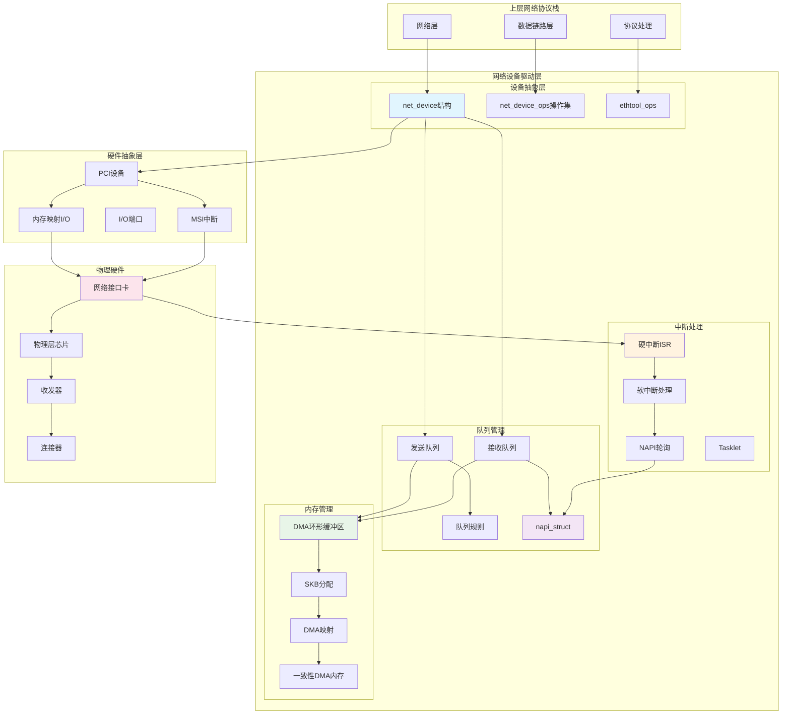
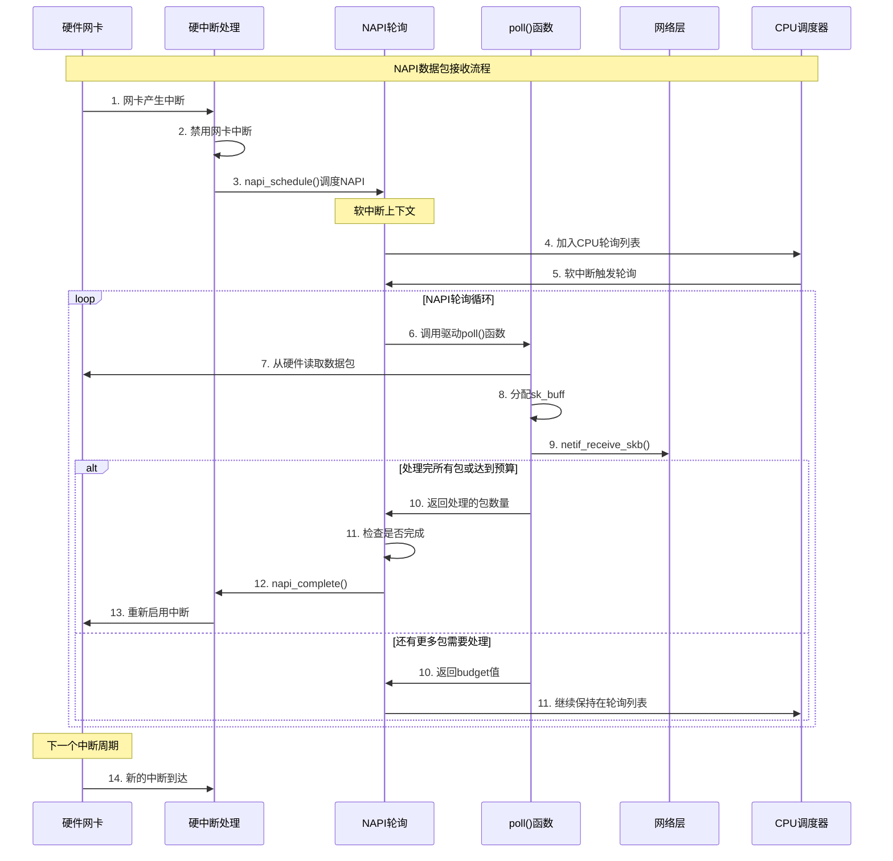
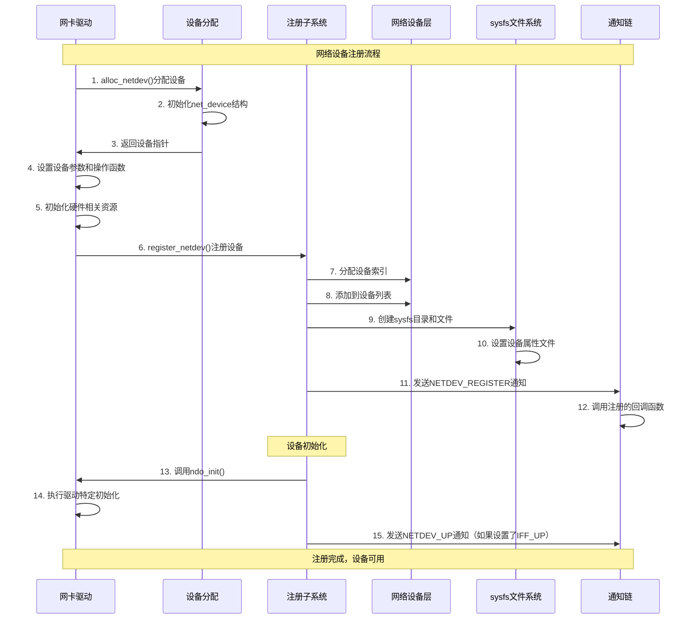
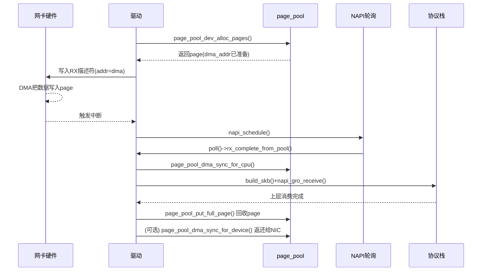
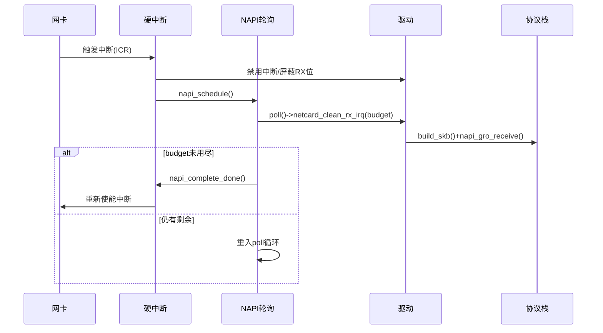
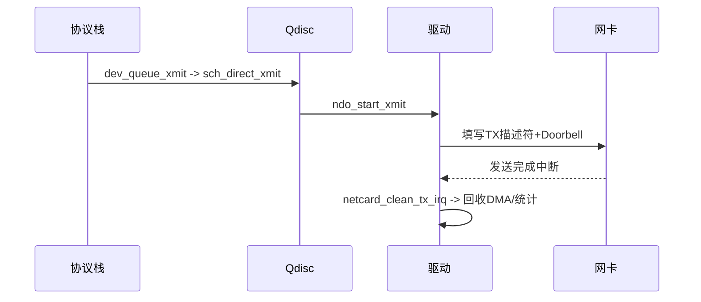
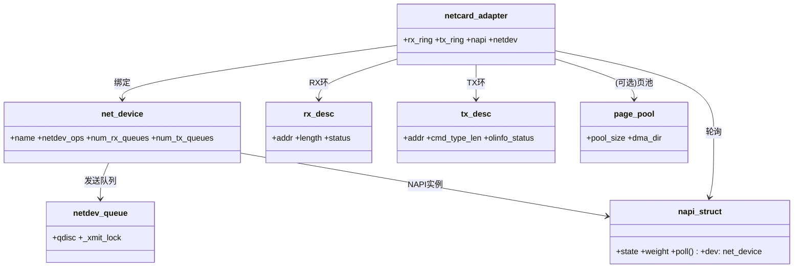

## 概述

网络设备驱动层是Linux网络栈的最底层，直接与网络硬件交互。它负责管理网络设备、处理硬件中断、实现DMA传输，并通过NAPI机制优化网络性能。网络设备驱动层的核心机制和实现细节。

<!--more-->

## 1. 网络设备驱动层架构

### 1.1 设备驱动层的核心职责

网络设备驱动层承担以下关键任务：

- **硬件抽象**：为上层提供统一的网络设备接口
- **中断处理**：处理网络硬件产生的中断信号
- **DMA管理**：管理网络数据的DMA传输
- **缓冲区管理**：维护发送和接收缓冲区
- **性能优化**：通过NAPI等机制提升网络性能

### 1.2 网络设备驱动架构图



## 2. 核心数据结构深度解析

### 2.1 net_device_ops：设备操作接口

```c
/**
 * net_device_ops - 网络设备操作函数集
 * 
 * 这个结构体定义了网络设备驱动必须实现的核心操作接口，
 * 为上层网络协议栈提供统一的设备操作抽象。
 */
struct net_device_ops {
    /**
     * ndo_init - 设备初始化
     * @dev: 网络设备指针
     * 
     * 在设备注册时调用，用于执行设备特定的初始化操作
     * 返回值：成功返回0，失败返回负错误码
     */
    int         (*ndo_init)(struct net_device *dev);
    
    /**
     * ndo_uninit - 设备去初始化
     * @dev: 网络设备指针
     * 
     * 在设备注销时调用，用于清理设备特定的资源
     */
    void        (*ndo_uninit)(struct net_device *dev);
    
    /**
     * ndo_open - 打开网络设备
     * @dev: 网络设备指针
     * 
     * 当接口被激活时调用（如执行ifconfig eth0 up）
     * 需要启动硬件、分配资源、启用中断等
     * 返回值：成功返回0，失败返回负错误码
     */
    int         (*ndo_open)(struct net_device *dev);
    
    /**
     * ndo_stop - 停止网络设备
     * @dev: 网络设备指针
     * 
     * 当接口被停用时调用（如执行ifconfig eth0 down）
     * 需要停止硬件、释放资源、禁用中断等
     * 返回值：成功返回0，失败返回负错误码
     */
    int         (*ndo_stop)(struct net_device *dev);
    
    /**
     * ndo_start_xmit - 开始数据包传输
     * @skb: 要发送的网络数据包
     * @dev: 网络设备指针
     * 
     * 网络栈的核心发送函数，将数据包交给硬件发送
     * 这是驱动最重要的功能之一
     * 返回值：NETDEV_TX_OK(成功) 或 NETDEV_TX_BUSY(繁忙)
     */
    netdev_tx_t (*ndo_start_xmit)(struct sk_buff *skb, struct net_device *dev);
    
    /**
     * ndo_select_queue - 选择发送队列
     * @dev: 网络设备指针  
     * @skb: 网络数据包
     * @accel_priv: 加速私有数据
     * @fallback: 回退函数
     * 
     * 在多队列网卡上选择适当的发送队列
     * 返回值：选择的队列索引
     */
    u16         (*ndo_select_queue)(struct net_device *dev,
                                   struct sk_buff *skb,
                                   void *accel_priv,
                                   select_queue_fallback_t fallback);
    
    /**
     * ndo_change_rx_flags - 修改接收标志
     * @dev: 网络设备指针
     * @flags: 新的标志位
     * 
     * 当设备的接收模式发生变化时调用
     */
    void        (*ndo_change_rx_flags)(struct net_device *dev, int flags);
    
    /**
     * ndo_set_rx_mode - 设置接收模式
     * @dev: 网络设备指针
     * 
     * 设置设备的接收模式（如混杂模式、多播过滤等）
     */
    void        (*ndo_set_rx_mode)(struct net_device *dev);
    
    /**
     * ndo_set_multicast_list - 设置多播列表
     * @dev: 网络设备指针
     * 
     * 配置硬件的多播地址过滤列表
     */
    void        (*ndo_set_multicast_list)(struct net_device *dev);
    
    /**
     * ndo_set_mac_address - 设置MAC地址
     * @dev: 网络设备指针
     * @addr: 新的MAC地址
     * 
     * 更改设备的MAC地址
     * 返回值：成功返回0，失败返回负错误码
     */
    int         (*ndo_set_mac_address)(struct net_device *dev, void *addr);
    
    /**
     * ndo_validate_addr - 验证设备地址
     * @dev: 网络设备指针
     * 
     * 验证设备的MAC地址是否有效
     * 返回值：有效返回0，无效返回负错误码
     */
    int         (*ndo_validate_addr)(struct net_device *dev);
    
    /**
     * ndo_do_ioctl - 执行设备特定的ioctl操作
     * @dev: 网络设备指针
     * @ifr: ioctl请求结构
     * @cmd: ioctl命令
     * 
     * 处理设备特定的ioctl命令
     * 返回值：成功返回0，失败返回负错误码
     */
    int         (*ndo_do_ioctl)(struct net_device *dev,
                               struct ifreq *ifr, int cmd);
    
    /**
     * ndo_change_mtu - 更改最大传输单元
     * @dev: 网络设备指针
     * @new_mtu: 新的MTU值
     * 
     * 修改设备的MTU大小
     * 返回值：成功返回0，失败返回负错误码
     */
    int         (*ndo_change_mtu)(struct net_device *dev, int new_mtu);
    
    /**
     * ndo_tx_timeout - 发送超时处理
     * @dev: 网络设备指针
     * 
     * 当发送队列停止太长时间时由网络层调用
     * 用于恢复发送队列的正常工作
     */
    void        (*ndo_tx_timeout)(struct net_device *dev);
    
    /**
     * ndo_get_stats64 - 获取64位统计信息
     * @dev: 网络设备指针
     * @storage: 统计信息存储位置
     * 
     * 获取设备的详细统计信息
     */
    void        (*ndo_get_stats64)(struct net_device *dev,
                                  struct rtnl_link_stats64 *storage);
    
    /**
     * ndo_vlan_rx_add_vid - 添加VLAN ID
     * @dev: 网络设备指针
     * @proto: VLAN协议
     * @vid: VLAN ID
     * 
     * 在硬件中添加VLAN过滤规则
     * 返回值：成功返回0，失败返回负错误码
     */
    int         (*ndo_vlan_rx_add_vid)(struct net_device *dev,
                                      __be16 proto, u16 vid);
    
    /**
     * ndo_vlan_rx_kill_vid - 删除VLAN ID
     * @dev: 网络设备指针
     * @proto: VLAN协议
     * @vid: VLAN ID
     * 
     * 从硬件中删除VLAN过滤规则
     * 返回值：成功返回0，失败返回负错误码
     */
    int         (*ndo_vlan_rx_kill_vid)(struct net_device *dev,
                                       __be16 proto, u16 vid);
    
    /**
     * ndo_poll_controller - 轮询控制器
     * @dev: 网络设备指针
     * 
     * 用于网络控制台等特殊情况下的轮询接收
     */
    void        (*ndo_poll_controller)(struct net_device *dev);
    
    /**
     * ndo_netpoll_setup - 设置网络轮询
     * @dev: 网络设备指针
     * @info: netpoll信息
     * 
     * 配置netpoll功能
     * 返回值：成功返回0，失败返回负错误码
     */
    int         (*ndo_netpoll_setup)(struct net_device *dev,
                                    struct netpoll_info *info);
    
    /**
     * ndo_netpoll_cleanup - 清理网络轮询
     * @dev: 网络设备指针
     * 
     * 清理netpoll相关资源
     */
    void        (*ndo_netpoll_cleanup)(struct net_device *dev);
    
    /**
     * ndo_set_vf_mac - 设置VF的MAC地址
     * @dev: 网络设备指针
     * @vf: VF索引
     * @mac: MAC地址
     * 
     * 为SR-IOV虚拟功能设置MAC地址
     * 返回值：成功返回0，失败返回负错误码
     */
    int         (*ndo_set_vf_mac)(struct net_device *dev,
                                 int vf, u8* mac);
    
    /**
     * ndo_set_vf_vlan - 设置VF的VLAN
     * @dev: 网络设备指针
     * @vf: VF索引  
     * @vlan: VLAN ID
     * @qos: QoS设置
     * @vlan_proto: VLAN协议
     * 
     * 为SR-IOV虚拟功能配置VLAN
     * 返回值：成功返回0，失败返回负错误码
     */
    int         (*ndo_set_vf_vlan)(struct net_device *dev,
                                  int vf, u16 vlan, u8 qos,
                                  __be16 vlan_proto);
};
```

### 2.2 NAPI结构体：高效中断处理

```c
/**
 * napi_struct - NAPI(New API)结构体
 * 
 * NAPI是Linux网络栈的重要优化机制，通过减少中断频率和批量处理
 * 数据包来提高网络性能。每个支持NAPI的网络设备都有一个或多个
 * napi_struct实例。
 */
struct napi_struct {
    /**
     * poll_list - 轮询列表节点
     * 将此NAPI实例链接到CPU的轮询列表中
     */
    struct list_head    poll_list;
    
    /**
     * state - NAPI状态标志
     * 使用原子位操作管理NAPI的各种状态：
     * - NAPI_STATE_SCHED: 已调度等待轮询
     * - NAPI_STATE_DISABLE: 禁用状态
     * - NAPI_STATE_NPSVC: 正在轮询服务中
     * - NAPI_STATE_HASHED: 已添加到哈希表
     */
    unsigned long       state;
    
    /**
     * weight - 轮询权重
     * 每次轮询时处理的最大数据包数量，通常设置为64
     * 这个值平衡了延迟和吞吐量
     */
    int                 weight;
    
    /**
     * gro_count - GRO聚合计数
     * 当前聚合的数据包数量，用于GRO(Generic Receive Offload)优化
     */
    int                 gro_count;
    
    /**
     * poll - 轮询函数指针
     * 这是NAPI的核心函数，驱动程序实现此函数来处理接收到的数据包
     * @napi: NAPI结构体指针
     * @budget: 本次轮询可处理的最大数据包数
     * 返回值: 实际处理的数据包数量
     */
    int                 (*poll)(struct napi_struct *napi, int budget);
    
    /**
     * gro_list - GRO聚合链表
     * 保存正在进行GRO聚合的数据包链表
     */
    struct sk_buff      *gro_list;
    
    /**
     * skb - 当前处理的数据包
     * 指向正在处理的sk_buff，主要用于GRO处理
     */
    struct sk_buff      *skb;
    
    /**
     * hash_node - 哈希表节点
     * 用于将NAPI实例添加到全局哈希表中，便于查找和管理
     */
    struct hlist_node   hash_node;
    
    /**
     * napi_id - NAPI实例ID
     * 全局唯一的NAPI标识符，用于RPS(Receive Packet Steering)等功能
     */
    unsigned int        napi_id;
    
    /**
     * dev - 关联的网络设备
     * 指向拥有此NAPI实例的网络设备
     */
    struct net_device   *dev;
    
    /**
     * list_owner - 列表所有者CPU
     * 标识当前将此NAPI添加到轮询列表的CPU编号
     */
    int                 list_owner;
    
    /**
     * timer - NAPI定时器
     * 用于NAPI超时处理，确保在低负载时也能及时处理数据包
     */
    struct hrtimer      timer;
} ____cacheline_aligned;
```

### 2.3 网络设备队列结构

```c
/**
 * netdev_queue - 网络设备队列结构
 * 
 * 现代网卡通常支持多个发送和接收队列，每个队列对应一个
 * netdev_queue结构。多队列支持可以提高并行处理能力。
 */
struct netdev_queue {
    /**
     * dev - 关联的网络设备
     */
    struct net_device  *dev;
    
    /**
     * qdisc - 队列规则
     * 指向此队列使用的流量控制队列规则
     */
    struct Qdisc       *qdisc;
    
    /**
     * qdisc_sleeping - 休眠队列规则
     * 在队列规则切换时使用
     */
    struct Qdisc       *qdisc_sleeping;
    
    /**
     * numa_node - NUMA节点
     * 此队列所属的NUMA节点，用于优化内存访问
     */
    int                 numa_node;
    
    /**
     * _xmit_lock - 发送锁
     * 保护发送队列的自旋锁
     */
    spinlock_t          _xmit_lock;
    
    /**
     * xmit_lock_owner - 发送锁所有者
     * 当前持有发送锁的CPU编号
     */
    int                 xmit_lock_owner;
    
    /**
     * trans_start - 传输开始时间
     * 最后一次开始传输的时间戳，用于检测发送超时
     */
    unsigned long       trans_start;
    
    /**
     * trans_timeout - 传输超时时间
     * 发送超时的时间限制
     */
    unsigned long       trans_timeout;
    
    /**
     * state - 队列状态
     * 队列的当前状态标志：
     * - __QUEUE_STATE_DRV_XOFF: 驱动停止发送
     * - __QUEUE_STATE_STACK_XOFF: 协议栈停止发送
     * - __QUEUE_STATE_FROZEN: 队列冻结
     */
    unsigned long       state;
    
    /**
     * dql - 动态队列限制
     * 动态调整队列长度以优化性能和延迟
     */
    struct dql          dql;
} ____cacheline_aligned_in_smp;
```

## 3. NAPI机制详解

### 3.1 NAPI工作原理

NAPI（New API）是Linux网络栈的重要优化机制，它通过以下方式提升性能：

- **中断合并**：减少中断频率，避免中断风暴
- **批量处理**：一次轮询处理多个数据包
- **CPU亲和性**：将处理绑定到特定CPU
- **自适应调整**：根据负载动态调整行为

### 3.2 NAPI处理流程图



### 3.3 NAPI核心函数实现

```c
/**
 * napi_schedule - 调度NAPI轮询
 * @n: NAPI结构体指针
 * 
 * 将NAPI实例添加到当前CPU的轮询列表中，并触发软中断处理。
 * 这个函数通常在硬中断处理程序中调用。
 */
static inline void napi_schedule(struct napi_struct *n)
{
    if (napi_schedule_prep(n))
        __napi_schedule(n);
}

/**
 * napi_schedule_prep - 准备调度NAPI
 * @n: NAPI结构体指针
 * 
 * 检查NAPI是否可以被调度，如果可以则设置SCHED标志
 * 返回值：可以调度返回true，否则返回false
 */
static inline bool napi_schedule_prep(struct napi_struct *n)
{
    return !napi_disable_pending(n) &&
           !test_and_set_bit(NAPI_STATE_SCHED, &n->state);
}

/**
 * __napi_schedule - 实际执行NAPI调度
 * @n: NAPI结构体指针
 * 
 * 将NAPI添加到当前CPU的软中断数据结构中，并触发NET_RX_SOFTIRQ
 * 软中断处理。
 */
void __napi_schedule(struct napi_struct *n)
{
    unsigned long flags;
    
    local_irq_save(flags);
    ____napi_schedule(this_cpu_ptr(&softnet_data), n);
    local_irq_restore(flags);
}

/**
 * ____napi_schedule - 核心调度逻辑
 * @sd: 软网络数据结构
 * @napi: NAPI结构体指针
 * 
 * 将NAPI添加到轮询列表并触发软中断
 */
static inline void ____napi_schedule(struct softnet_data *sd,
                                    struct napi_struct *napi)
{
    list_add_tail(&napi->poll_list, &sd->poll_list);
    __raise_softirq_irqoff(NET_RX_SOFTIRQ);
}

/**
 * napi_complete_done - 完成NAPI轮询
 * @n: NAPI结构体指针
 * @work_done: 本次处理的数据包数量
 * 
 * 当NAPI轮询完成时调用，清理状态并重新启用硬件中断
 * 返回值：成功完成返回true，需要继续轮询返回false
 */
bool napi_complete_done(struct napi_struct *n, int work_done)
{
    unsigned long flags;
    
    /*
     * 检查是否还有待处理的数据包
     */
    if (unlikely(test_bit(NAPI_STATE_NPSVC, &n->state)))
        return false;
    
    if (n->gro_list) {
        unsigned long timeout = 0;
        
        if (work_done)
            timeout = n->dev->gro_flush_timeout;
        
        /* 如果有GRO数据包等待，设置定时器 */
        if (timeout)
            hrtimer_start(&n->timer, ns_to_ktime(timeout),
                         HRTIMER_MODE_REL_PINNED);
        else
            napi_gro_flush(n, false);
    }
    
    if (unlikely(!list_empty(&n->poll_list))) {
        /* 竞争条件：在完成过程中又被调度了 */
        WARN_ON_ONCE(1);
        return false;
    }
    
    if (n->list_owner != smp_processor_id())
        return true;
    
    /* 原子地清除SCHED状态位 */
    if (unlikely(test_and_clear_bit(NAPI_STATE_SCHED, &n->state)))
        return true;
    
    return false;
}

/**
 * net_rx_action - 网络接收软中断处理函数
 * @h: 软中断描述符
 * 
 * 这是NET_RX_SOFTIRQ软中断的处理函数，负责轮询所有调度的NAPI实例
 */
static __latent_entropy void net_rx_action(struct softirq_action *h)
{
    struct softnet_data *sd = this_cpu_ptr(&softnet_data);
    unsigned long time_limit = jiffies + usecs_to_jiffies(netdev_budget_usecs);
    int budget = netdev_budget;
    LIST_HEAD(list);
    LIST_HEAD(repoll);
    
    local_irq_disable();
    /* 将当前CPU的poll_list移动到本地列表 */
    list_splice_init(&sd->poll_list, &list);
    local_irq_enable();
    
    for (;;) {
        struct napi_struct *n;
        
        if (list_empty(&list)) {
            if (!sd_has_rps_ipi_waiting(sd) && list_empty(&repoll))
                goto end;
            break;
        }
        
        n = list_first_entry(&list, struct napi_struct, poll_list);
        list_del_init(&n->poll_list);
        
        /* 调用驱动的poll函数 */
        int work = napi_poll(n, &repoll);
        budget -= work;
        
        /* 检查时间和预算限制 */
        if (unlikely(budget <= 0 || time_after_eq(jiffies, time_limit))) {
            sd->time_squeeze++;
            break;
        }
    }
    
    local_irq_disable();
    
    list_splice_tail_init(&sd->poll_list, &list);
    list_splice_tail(&repoll, &list);
    list_splice(&list, &sd->poll_list);
    
    if (!list_empty(&sd->poll_list))
        __raise_softirq_irqoff(NET_RX_SOFTIRQ);
    
    net_rps_action_and_irq_enable(sd);
    
end:;
}

/**
 * napi_poll - 执行NAPI轮询
 * @n: NAPI结构体指针
 * @repoll: 重新轮询列表
 * 
 * 调用驱动程序的poll函数处理数据包
 * 返回值：处理的数据包数量
 */
static int napi_poll(struct napi_struct *n, struct list_head *repoll)
{
    void *have;
    int work, weight;
    
    list_del_init(&n->poll_list);
    
    have = netpoll_poll_lock(n);
    
    weight = n->weight;
    
    /* 调用驱动程序实现的poll函数 */
    work = n->poll(n, weight);
    
    WARN_ON_ONCE(work > weight);
    
    if (likely(work < weight))
        goto out_unlock;
    
    /* 如果处理了满预算的数据包，可能还有更多 */
    if (unlikely(napi_disable_pending(n))) {
        napi_complete(n);
        goto out_unlock;
    }
    
    /* 需要继续轮询 */
    if (n->gro_list) {
        /* 刷新GRO数据包 */
        napi_gro_flush(n, HZ >= 1000);
    }
    
    /* 重新添加到轮询列表 */
    list_add_tail(&n->poll_list, repoll);
    
out_unlock:
    netpoll_poll_unlock(have);
    
    return work;
}
```

## 4. 网络设备注册流程

### 4.1 设备注册时序图



### 4.2 设备分配和初始化

```c
/**
 * alloc_netdev_mqs - 分配网络设备结构
 * @sizeof_priv: 私有数据大小
 * @name: 设备名称模板
 * @name_assign_type: 名称分配类型
 * @setup: 设备设置函数
 * @txqs: 发送队列数量
 * @rxqs: 接收队列数量
 * 
 * 分配并初始化一个net_device结构及其相关的队列结构
 * 返回值：成功返回设备指针，失败返回NULL
 */
struct net_device *alloc_netdev_mqs(int sizeof_priv, const char *name,
                                   unsigned char name_assign_type,
                                   void (*setup)(struct net_device *),
                                   unsigned int txqs, unsigned int rxqs)
{
    struct net_device *dev;
    size_t alloc_size;
    struct net_device *p;
    
    BUG_ON(strlen(name) >= sizeof(dev->name));
    
    if (txqs < 1) {
        pr_err("alloc_netdev: Unable to allocate device with zero queues\n");
        return NULL;
    }
    
    if (rxqs < 1) {
        pr_err("alloc_netdev: Unable to allocate device with zero RX queues\n");
        return NULL;
    }
    
    /* 计算总的分配大小 */
    alloc_size = sizeof(struct net_device);
    if (sizeof_priv) {
        /* 确保私有数据对齐 */
        alloc_size = ALIGN(alloc_size, NETDEV_ALIGN);
        alloc_size += sizeof_priv;
    }
    /* 确保整个结构对齐 */
    alloc_size = ALIGN(alloc_size, NETDEV_ALIGN);
    
    p = kzalloc(alloc_size, GFP_KERNEL | __GFP_NOWARN | __GFP_REPEAT);
    if (!p)
        return NULL;
    
    dev = PTR_ALIGN(p, NETDEV_ALIGN);
    dev->padded = (char *)dev - (char *)p;
    
    /* 分配发送队列数组 */
    dev->_tx = netdev_alloc_tx_queues(dev, txqs);
    if (!dev->_tx)
        goto free_p;
    
    /* 分配接收队列数组 */
    dev->_rx = netdev_alloc_rx_queues(dev, rxqs);
    if (!dev->_rx)
        goto free_tx;
    
    dev->num_tx_queues = txqs;
    dev->real_num_tx_queues = txqs;
    dev->num_rx_queues = rxqs;
    dev->real_num_rx_queues = rxqs;
    
    /* 初始化基本字段 */
    dev->gso_max_size = GSO_MAX_SIZE;
    dev->gso_max_segs = GSO_MAX_SEGS;
    dev->upper_level = 1;
    dev->lower_level = 1;
    
    INIT_LIST_HEAD(&dev->napi_list);
    INIT_LIST_HEAD(&dev->unreg_list);
    INIT_LIST_HEAD(&dev->close_list);
    INIT_LIST_HEAD(&dev->link_watch_list);
    INIT_LIST_HEAD(&dev->adj_list.upper);
    INIT_LIST_HEAD(&dev->adj_list.lower);
    INIT_LIST_HEAD(&dev->ptype_all);
    INIT_LIST_HEAD(&dev->ptype_specific);
    
    /* 设置设备名称 */
    strcpy(dev->name, name);
    dev->name_assign_type = name_assign_type;
    dev->group = INIT_NETDEV_GROUP;
    
    /* 如果提供了设置函数，调用它 */
    if (setup)
        setup(dev);
    
    /* 设置默认的ethtool操作 */
    if (!dev->ethtool_ops)
        dev->ethtool_ops = &default_ethtool_ops;
    
    nf_hook_netdev_init(dev);
    
    return dev;
    
free_tx:
    kfree(dev->_tx);
free_p:
    kfree(p);
    return NULL;
}

/**
 * register_netdev - 注册网络设备
 * @dev: 要注册的网络设备
 * 
 * 将网络设备注册到内核，使其对用户空间可见
 * 返回值：成功返回0，失败返回负错误码
 */
int register_netdev(struct net_device *dev)
{
    int err;
    
    if (WARN_ON(dev->reg_state != NETREG_UNINITIALIZED))
        return -EINVAL;
    
    rtnl_lock();
    err = register_netdevice(dev);
    rtnl_unlock();
    return err;
}

/**
 * register_netdevice - 内部设备注册函数
 * @dev: 要注册的网络设备
 * 
 * 执行实际的设备注册操作，包括分配接口索引、添加到设备列表、
 * 创建sysfs接口等
 */
int register_netdevice(struct net_device *dev)
{
    int ret;
    struct net *net = dev_net(dev);
    
    ASSERT_RTNL();
    BUG_ON(dev_boot_phase);
    
    might_sleep();
    
    /* 检查设备名称有效性 */
    if (dev->name[0] == '\0' || dev->name[0] == ' ') {
        pr_err("register_netdevice: device name not set\n");
        ret = -EINVAL;
        goto out;
    }
    
    /* 设备必须有有效的网络命名空间 */
    if (WARN_ON(!net)) {
        ret = -EINVAL;
        goto out;
    }
    
    /* 初始化设备索引 */
    spin_lock_bh(&dev_base_lock);
    list_add_tail_rcu(&dev->dev_list, &net->dev_base_head);
    device_rename(&dev->dev, dev->name);
    hlist_add_head_rcu(&dev->name_hlist,
                       dev_name_hash(net, dev->name));
    hlist_add_head_rcu(&dev->index_hlist,
                       dev_index_hash(net, dev->ifindex));
    spin_unlock_bh(&dev_base_lock);
    
    dev_init_scheduler(dev);
    
    /* 调用设备的初始化函数 */
    if (dev->netdev_ops->ndo_init) {
        ret = dev->netdev_ops->ndo_init(dev);
        if (ret) {
            if (ret > 0)
                ret = -EIO;
            goto err_uninit;
        }
    }
    
    /* 如果设备名包含%d等格式，分配实际名称 */
    if (((dev->addr_assign_type == NET_ADDR_RANDOM) ||
         (dev->addr_assign_type == NET_ADDR_SET)) &&
        !is_valid_ether_addr(dev->dev_addr))
        eth_hw_addr_random(dev);
    
    /* 设置设备状态为已注册 */
    dev->reg_state = NETREG_REGISTERED;
    
    /* 通知其他内核模块设备已注册 */
    ret = call_netdevice_notifiers(NETDEV_REGISTER, dev);
    ret = notifier_to_errno(ret);
    if (ret) {
        rollback_registered(dev);
        dev->reg_state = NETREG_UNREGISTERED;
    }
    
    /* 创建网络设备的sysfs条目 */
    netdev_register_kobject(dev);
    
out:
    return ret;
    
err_uninit:
    if (dev->netdev_ops->ndo_uninit)
        dev->netdev_ops->ndo_uninit(dev);
    goto out;
}
```

## 5. DMA内存管理

### 5.1 DMA环形缓冲区设计

现代网卡大量使用DMA进行数据传输，驱动程序需要管理DMA内存：

```c
/**
 * 网卡接收环形缓冲区描述符
 * 这个结构用于描述接收缓冲区中的每个条目
 */
struct rx_desc {
    __le64 addr;        // DMA缓冲区地址
    union {
        __le32 data;
        struct {
            __le16 length;  // 数据包长度
            __le16 status;  // 状态标志
        } fields;
    };
    __le16 vlan;        // VLAN标签
    __le16 errors;      // 错误标志
} __packed;

/**
 * 网卡发送环形缓冲区描述符
 */
struct tx_desc {
    __le64 addr;        // DMA缓冲区地址
    __le32 cmd_type_len; // 命令类型和长度
    __le32 olinfo_status; // offload信息和状态
} __packed;

/**
 * 网卡驱动私有数据结构示例
 */
struct netcard_adapter {
    /* 硬件相关 */
    void __iomem *hw_addr;      // 硬件寄存器映射地址
    struct pci_dev *pdev;       // PCI设备指针
    
    /* 接收环形缓冲区 */
    struct rx_desc *rx_ring;    // 接收描述符环
    dma_addr_t rx_ring_dma;     // 接收环DMA地址
    struct sk_buff **rx_buffer_info; // 接收缓冲区信息
    u16 rx_ring_count;          // 接收环大小
    u16 rx_next_clean;          // 下一个清理位置
    u16 rx_next_use;            // 下一个使用位置
    
    /* 发送环形缓冲区 */
    struct tx_desc *tx_ring;    // 发送描述符环
    dma_addr_t tx_ring_dma;     // 发送环DMA地址
    struct sk_buff **tx_buffer_info; // 发送缓冲区信息
    u16 tx_ring_count;          // 发送环大小
    u16 tx_next_clean;          // 下一个清理位置
    u16 tx_next_use;            // 下一个使用位置
    
    /* NAPI相关 */
    struct napi_struct napi;    // NAPI结构
    
    /* 统计信息 */
    u64 packets_received;
    u64 bytes_received;
    u64 packets_transmitted;
    u64 bytes_transmitted;
    
    /* 锁 */
    spinlock_t tx_lock;
    
    /* 网络设备 */
    struct net_device *netdev;
};

/**
 * netcard_alloc_rx_buffers - 分配接收缓冲区
 * @adapter: 网卡适配器
 * 
 * 为接收环分配sk_buff和对应的DMA内存
 */
static void netcard_alloc_rx_buffers(struct netcard_adapter *adapter)
{
    struct rx_desc *rx_desc;
    struct sk_buff *skb;
    dma_addr_t dma;
    u16 i;
    
    i = adapter->rx_next_use;
    
    while (i != adapter->rx_next_clean) {
        rx_desc = NETCARD_RX_DESC(adapter, i);
        
        if (adapter->rx_buffer_info[i])
            break;
        
        /* 分配新的sk_buff */
        skb = netdev_alloc_skb_ip_align(adapter->netdev, 
                                       adapter->rx_buffer_len);
        if (unlikely(!skb)) {
            /* 分配失败，增加统计计数 */
            adapter->alloc_rx_buff_failed++;
            break;
        }
        
        /* 建立DMA映射 */
        dma = dma_map_single(&adapter->pdev->dev, 
                            skb->data,
                            adapter->rx_buffer_len,
                            DMA_FROM_DEVICE);
        
        if (dma_mapping_error(&adapter->pdev->dev, dma)) {
            dev_kfree_skb(skb);
            adapter->alloc_rx_buff_failed++;
            break;
        }
        
        adapter->rx_buffer_info[i] = skb;
        
        /* 设置硬件描述符 */
        rx_desc->addr = cpu_to_le64(dma);
        rx_desc->fields.length = 0;
        rx_desc->fields.status = 0;
        
        i++;
        if (i == adapter->rx_ring_count)
            i = 0;
    }
    
    if (adapter->rx_next_use != i) {
        adapter->rx_next_use = i;
        
        /* 确保写入完成后再通知硬件 */
        wmb();
        
        /* 通知硬件有新的缓冲区可用 */
        writel(i, adapter->hw_addr + NETCARD_RDT_REG);
    }
}

/**
 * netcard_clean_tx_irq - 清理已发送的数据包
 * @adapter: 网卡适配器
 * 
 * 处理已完成发送的数据包，释放相关资源
 * 返回值：清理的数据包数量
 */
static int netcard_clean_tx_irq(struct netcard_adapter *adapter)
{
    struct tx_desc *tx_desc;
    struct sk_buff *skb;
    dma_addr_t dma;
    u16 i;
    int count = 0;
    
    i = adapter->tx_next_clean;
    
    while (i != adapter->tx_next_use) {
        tx_desc = NETCARD_TX_DESC(adapter, i);
        
        /* 检查硬件是否完成了这个描述符的处理 */
        if (!(tx_desc->olinfo_status & cpu_to_le32(NETCARD_TXD_STAT_DD)))
            break;
        
        skb = adapter->tx_buffer_info[i];
        if (skb) {
            unsigned int len = skb_headlen(skb);
            
            /* 取消DMA映射 */
            dma = le64_to_cpu(tx_desc->addr);
            dma_unmap_single(&adapter->pdev->dev, dma, len, DMA_TO_DEVICE);
            
            /* 更新统计信息 */
            adapter->packets_transmitted++;
            adapter->bytes_transmitted += skb->len;
            
            /* 释放sk_buff */
            dev_kfree_skb_any(skb);
            adapter->tx_buffer_info[i] = NULL;
            
            count++;
        }
        
        /* 清除描述符 */
        tx_desc->addr = 0;
        tx_desc->cmd_type_len = 0;
        tx_desc->olinfo_status = 0;
        
        i++;
        if (i == adapter->tx_ring_count)
            i = 0;
    }
    
    adapter->tx_next_clean = i;
    
    /* 如果队列之前被停止，现在可能可以重新启动 */
    if (netif_queue_stopped(adapter->netdev) &&
        netcard_desc_unused(adapter) >= NETCARD_TX_WAKE_THRESHOLD) {
        netif_wake_queue(adapter->netdev);
    }
    
    return count;
}

/**
 * netcard_alloc_rings - 分配发送和接收环
 * @adapter: 网卡适配器
 * 
 * 分配DMA一致性内存用于描述符环
 * 返回值：成功返回0，失败返回负错误码
 */
static int netcard_alloc_rings(struct netcard_adapter *adapter)
{
    int size;
    
    /* 分配接收描述符环 */
    size = sizeof(struct rx_desc) * adapter->rx_ring_count;
    adapter->rx_ring = dma_alloc_coherent(&adapter->pdev->dev, size,
                                         &adapter->rx_ring_dma, 
                                         GFP_KERNEL);
    if (!adapter->rx_ring)
        return -ENOMEM;
    
    /* 分配发送描述符环 */
    size = sizeof(struct tx_desc) * adapter->tx_ring_count;
    adapter->tx_ring = dma_alloc_coherent(&adapter->pdev->dev, size,
                                         &adapter->tx_ring_dma,
                                         GFP_KERNEL);
    if (!adapter->tx_ring)
        goto err_alloc_tx;
    
    /* 分配缓冲区信息数组 */
    size = sizeof(struct sk_buff *) * adapter->rx_ring_count;
    adapter->rx_buffer_info = vzalloc(size);
    if (!adapter->rx_buffer_info)
        goto err_alloc_rx_buffer;
    
    size = sizeof(struct sk_buff *) * adapter->tx_ring_count;
    adapter->tx_buffer_info = vzalloc(size);
    if (!adapter->tx_buffer_info)
        goto err_alloc_tx_buffer;
    
    return 0;
    
err_alloc_tx_buffer:
    vfree(adapter->rx_buffer_info);
err_alloc_rx_buffer:
    dma_free_coherent(&adapter->pdev->dev,
                      sizeof(struct tx_desc) * adapter->tx_ring_count,
                      adapter->tx_ring, adapter->tx_ring_dma);
err_alloc_tx:
    dma_free_coherent(&adapter->pdev->dev,
                      sizeof(struct rx_desc) * adapter->rx_ring_count,
                      adapter->rx_ring, adapter->rx_ring_dma);
    return -ENOMEM;
}
```

### 5.2 环与缓冲区分配/清理

```c
/**
 * netcard_alloc_rx_buffers - 分配接收缓冲区
 * @adapter: 网卡适配器
 * 
 * 为接收环分配sk_buff和对应的DMA内存
 */
static void netcard_alloc_rx_buffers(struct netcard_adapter *adapter)
{
    struct rx_desc *rx_desc;
    struct sk_buff *skb;
    dma_addr_t dma;
    u16 i;
    
    i = adapter->rx_next_use;
    
    while (i != adapter->rx_next_clean) {
        rx_desc = NETCARD_RX_DESC(adapter, i);
        
        if (adapter->rx_buffer_info[i])
            break;
        
        /* 分配新的sk_buff */
        skb = netdev_alloc_skb_ip_align(adapter->netdev, 
                                       adapter->rx_buffer_len);
        if (unlikely(!skb)) {
            /* 分配失败，增加统计计数 */
            adapter->alloc_rx_buff_failed++;
            break;
        }
        
        /* 建立DMA映射 */
        dma = dma_map_single(&adapter->pdev->dev, 
                            skb->data,
                            adapter->rx_buffer_len,
                            DMA_FROM_DEVICE);
        
        if (dma_mapping_error(&adapter->pdev->dev, dma)) {
            dev_kfree_skb(skb);
            adapter->alloc_rx_buff_failed++;
            break;
        }
        
        adapter->rx_buffer_info[i] = skb;
        
        /* 设置硬件描述符 */
        rx_desc->addr = cpu_to_le64(dma);
        rx_desc->fields.length = 0;
        rx_desc->fields.status = 0;
        
        i++;
        if (i == adapter->rx_ring_count)
            i = 0;
    }
    
    if (adapter->rx_next_use != i) {
        adapter->rx_next_use = i;
        
        /* 确保写入完成后再通知硬件 */
        wmb();
        
        /* 通知硬件有新的缓冲区可用 */
        writel(i, adapter->hw_addr + NETCARD_RDT_REG);
    }
}

/**
 * netcard_clean_tx_irq - 清理已发送的数据包
 * @adapter: 网卡适配器
 * 
 * 处理已完成发送的数据包，释放相关资源
 * 返回值：清理的数据包数量
 */
static int netcard_clean_tx_irq(struct netcard_adapter *adapter)
{
    struct tx_desc *tx_desc;
    struct sk_buff *skb;
    dma_addr_t dma;
    u16 i;
    int count = 0;
    
    i = adapter->tx_next_clean;
    
    while (i != adapter->tx_next_use) {
        tx_desc = NETCARD_TX_DESC(adapter, i);
        
        /* 检查硬件是否完成了这个描述符的处理 */
        if (!(tx_desc->olinfo_status & cpu_to_le32(NETCARD_TXD_STAT_DD)))
            break;
        
        skb = adapter->tx_buffer_info[i];
        if (skb) {
            unsigned int len = skb_headlen(skb);
            
            /* 取消DMA映射 */
            dma = le64_to_cpu(tx_desc->addr);
            dma_unmap_single(&adapter->pdev->dev, dma, len, DMA_TO_DEVICE);
            
            /* 更新统计信息 */
            adapter->packets_transmitted++;
            adapter->bytes_transmitted += skb->len;
            
            /* 释放sk_buff */
            dev_kfree_skb_any(skb);
            adapter->tx_buffer_info[i] = NULL;
            
            count++;
        }
        
        /* 清除描述符 */
        tx_desc->addr = 0;
        tx_desc->cmd_type_len = 0;
        tx_desc->olinfo_status = 0;
        
        i++;
        if (i == adapter->tx_ring_count)
            i = 0;
    }
    
    adapter->tx_next_clean = i;
    
    /* 如果队列之前被停止，现在可能可以重新启动 */
    if (netif_queue_stopped(adapter->netdev) &&
        netcard_desc_unused(adapter) >= NETCARD_TX_WAKE_THRESHOLD) {
        netif_wake_queue(adapter->netdev);
    }
    
    return count;
}

/**
 * netcard_alloc_rings - 分配发送和接收环
 * @adapter: 网卡适配器
 * 
 * 分配DMA一致性内存用于描述符环
 * 返回值：成功返回0，失败返回负错误码
 */
static int netcard_alloc_rings(struct netcard_adapter *adapter)
{
    int size;
    
    /* 分配接收描述符环 */
    size = sizeof(struct rx_desc) * adapter->rx_ring_count;
    adapter->rx_ring = dma_alloc_coherent(&adapter->pdev->dev, size,
                                         &adapter->rx_ring_dma, 
                                         GFP_KERNEL);
    if (!adapter->rx_ring)
        return -ENOMEM;
    
    /* 分配发送描述符环 */
    size = sizeof(struct tx_desc) * adapter->tx_ring_count;
    adapter->tx_ring = dma_alloc_coherent(&adapter->pdev->dev, size,
                                         &adapter->tx_ring_dma,
                                         GFP_KERNEL);
    if (!adapter->tx_ring)
        goto err_alloc_tx;
    
    /* 分配缓冲区信息数组 */
    size = sizeof(struct sk_buff *) * adapter->rx_ring_count;
    adapter->rx_buffer_info = vzalloc(size);
    if (!adapter->rx_buffer_info)
        goto err_alloc_rx_buffer;
    
    size = sizeof(struct sk_buff *) * adapter->tx_ring_count;
    adapter->tx_buffer_info = vzalloc(size);
    if (!adapter->tx_buffer_info)
        goto err_alloc_tx_buffer;
    
    return 0;
    
err_alloc_tx_buffer:
    vfree(adapter->rx_buffer_info);
err_alloc_rx_buffer:
    dma_free_coherent(&adapter->pdev->dev,
                      sizeof(struct tx_desc) * adapter->tx_ring_count,
                      adapter->tx_ring, adapter->tx_ring_dma);
err_alloc_tx:
    dma_free_coherent(&adapter->pdev->dev,
                      sizeof(struct rx_desc) * adapter->rx_ring_count,
                      adapter->rx_ring, adapter->rx_ring_dma);
    return -ENOMEM;
}
```

### 5.3 page_pool 与DMA同步/回收/统计

```c
/**
 * page_pool_params - 页池参数配置
 */
struct page_pool_params pp = {
    .flags          = PP_FLAG_DMA_MAP | PP_FLAG_DMA_SYNC_DEV, /* 硬件零拷贝友好 */
    .order          = 0,
    .pool_size      = 4096,
    .nid            = NUMA_NO_NODE,
    .dev            = &adapter->pdev->dev,
    .dma_dir        = DMA_FROM_DEVICE,
    .max_len        = adapter->rx_buffer_len,
    .offset         = NET_SKB_PAD, /* 头部预留 */
};

struct page_pool *pool = page_pool_create(&pp);
adapter->rx_page_pool = pool;

/**
 * 设备RX缓冲准备：从page_pool分配并映射
 */
static int rx_refill_from_pool(struct netcard_adapter *adapter)
{
    struct page *page;
    dma_addr_t dma;

    page = page_pool_dev_alloc_pages(adapter->rx_page_pool);
    if (unlikely(!page))
        return -ENOMEM;

    dma = page_pool_get_dma_addr(page);
    /* 若启用PP_FLAG_DMA_MAP，dma已由页池准备；否则驱动自行dma_map_page */

    /* 写入描述符 */
    rx_desc->addr = cpu_to_le64(dma);
    rx_desc->fields.status = 0;
    return 0;
}

/**
 * RX完成路径：同步设备->CPU并构造skb
 */
static void rx_complete_from_pool(struct netcard_adapter *adapter, struct rx_desc *rxd)
{
    struct page *page = le64_to_page(rxd->addr);

    /* DMA同步：从设备可见切换为CPU可见 */
    page_pool_dma_sync_for_cpu(adapter->rx_page_pool, page, 0, adapter->rx_buffer_len);

    /* 构造skb并附着frag，避免复制 */
    struct sk_buff *skb = build_skb(page_address(page), PAGE_SIZE);
    if (likely(skb)) {
        skb_reserve(skb, NET_SKB_PAD);
        skb_put(skb, length);
        /* 上送协议栈 */
        napi_gro_receive(&adapter->napi, skb);
    } else {
        page_pool_put_full_page(adapter->rx_page_pool, page, false);
    }
}

/**
 * RX回收：当协议栈消费完成，页返回池中复用
 */
static void rx_recycle_page(struct netcard_adapter *adapter, struct page *page)
{
    page_pool_put_full_page(adapter->rx_page_pool, page, false);
}
```

注意事项：
- 若使用 `PP_FLAG_DMA_MAP`，请使用 `page_pool_get_dma_addr()` 与 `page_pool_put_*()` 保持DMA生命周期一致；自行 `dma_unmap_*` 会破坏引用计数。
- `page_pool_dma_sync_for_cpu()` 与 `page_pool_dma_sync_for_device()` 必须按方向配对，在访问数据前后调用，避免缓存不一致。
- 结合 `ethtool -S` 与 `/sys/kernel/debug/page_pool/*/stats` 观测页池命中率、回收延迟等指标，及时调整 `pool_size`、`order` 与 `max_len`。
- 对GRO与XDP路径，尽量复用页池以减少分配/映射开销，并确保在大包/多队列下的NUMA亲和。

#### 5.3.1 page_pool RX/Recycle 时序图



## 6. 网络设备发送路径

### 6.1 数据包发送流程

```c
/**
 * netcard_start_xmit - 网络设备发送函数
 * @skb: 要发送的数据包
 * @netdev: 网络设备
 * 
 * 这是网络设备驱动最重要的函数之一，负责将数据包交给硬件发送
 * 返回值：NETDEV_TX_OK或NETDEV_TX_BUSY
 */
static netdev_tx_t netcard_start_xmit(struct sk_buff *skb,
                                     struct net_device *netdev)
{
    struct netcard_adapter *adapter = netdev_priv(netdev);
    struct tx_desc *tx_desc;
    dma_addr_t dma;
    u32 cmd_len;
    u16 i;
    
    /* 检查是否有可用的描述符 */
    if (netcard_desc_unused(adapter) < NETCARD_TX_DESC_NEEDED) {
        /* 没有足够的描述符，停止队列 */
        netif_stop_queue(netdev);
        
        /* 再次检查，避免竞争条件 */
        smp_mb();
        if (netcard_desc_unused(adapter) < NETCARD_TX_DESC_NEEDED)
            return NETDEV_TX_BUSY;
        
        /* 有描述符可用了，重新启动队列 */
        netif_start_queue(netdev);
    }
    
    i = adapter->tx_next_use;
    tx_desc = NETCARD_TX_DESC(adapter, i);
    
    /* 建立DMA映射 */
    dma = dma_map_single(&adapter->pdev->dev, 
                        skb->data, skb_headlen(skb), 
                        DMA_TO_DEVICE);
    
    if (dma_mapping_error(&adapter->pdev->dev, dma)) {
        dev_kfree_skb_any(skb);
        return NETDEV_TX_OK;
    }
    
    /* 保存sk_buff指针 */
    adapter->tx_buffer_info[i] = skb;
    
    /* 设置描述符字段 */
    cmd_len = skb->len;
    cmd_len |= NETCARD_TXD_CMD_EOP;  // End of Packet
    cmd_len |= NETCARD_TXD_CMD_IFCS; // Insert Frame Check Sequence
    cmd_len |= NETCARD_TXD_CMD_RS;   // Report Status
    
    /* 处理VLAN标签 */
    if (skb_vlan_tag_present(skb)) {
        cmd_len |= NETCARD_TXD_CMD_VLE;
        tx_desc->olinfo_status |= 
            cpu_to_le32(skb_vlan_tag_get(skb) << NETCARD_TX_FLAGS_VLAN_SHIFT);
    }
    
    /* 处理校验和offload */
    if (skb->ip_summed == CHECKSUM_PARTIAL) {
        if (netcard_tso(adapter, skb, &cmd_len))
            goto out_drop;
        else if (netcard_tx_csum(adapter, skb, &cmd_len))
            goto out_drop;
    }
    
    tx_desc->addr = cpu_to_le64(dma);
    tx_desc->cmd_type_len = cpu_to_le32(cmd_len);
    
    /* 更新环形缓冲区指针 */
    i++;
    if (i == adapter->tx_ring_count)
        i = 0;
    adapter->tx_next_use = i;
    
    /* 确保写入完成 */
    wmb();
    
    /* 通知硬件开始发送 */
    writel(i, adapter->hw_addr + NETCARD_TDT_REG);
    
    return NETDEV_TX_OK;
    
out_drop:
    dma_unmap_single(&adapter->pdev->dev, dma, skb_headlen(skb), DMA_TO_DEVICE);
    dev_kfree_skb_any(skb);
    return NETDEV_TX_OK;
}

/**
 * netcard_tx_csum - 配置校验和offload
 * @adapter: 网卡适配器
 * @skb: 数据包
 * @cmd_len: 命令长度字段指针
 * 
 * 配置硬件校验和计算
 * 返回值：成功返回0，失败返回非0
 */
static int netcard_tx_csum(struct netcard_adapter *adapter,
                          struct sk_buff *skb, u32 *cmd_len)
{
    u8 l4_hdr = 0;
    
    switch (skb->protocol) {
    case __constant_htons(ETH_P_IP):
        l4_hdr = ip_hdr(skb)->protocol;
        break;
    case __constant_htons(ETH_P_IPV6):
        l4_hdr = ipv6_hdr(skb)->nexthdr;
        break;
    default:
        return 0;
    }
    
    switch (l4_hdr) {
    case IPPROTO_TCP:
        *cmd_len |= NETCARD_TXD_CMD_TCP;
        break;
    case IPPROTO_UDP:
        *cmd_len |= NETCARD_TXD_CMD_UDP;
        break;
    case IPPROTO_SCTP:
        *cmd_len |= NETCARD_TXD_CMD_SCTP;
        break;
    default:
        return 0;
    }
    
    return 1;
}

/**
 * netcard_tso - 配置TCP分段offload
 * @adapter: 网卡适配器
 * @skb: 数据包
 * @cmd_len: 命令长度字段指针
 * 
 * 配置硬件TSO功能
 * 返回值：使用TSO返回1，不使用返回0，错误返回负值
 */
static int netcard_tso(struct netcard_adapter *adapter,
                      struct sk_buff *skb, u32 *cmd_len)
{
    u32 mss_l4len_idx = 0;
    u32 type_tucmd_mlhl = 0;
    
    if (!skb_is_gso(skb))
        return 0;
    
    if (skb_header_cloned(skb)) {
        int err = pskb_expand_head(skb, 0, 0, GFP_ATOMIC);
        if (err)
            return err;
    }
    
    /* 设置MSS */
    mss_l4len_idx = skb_shinfo(skb)->gso_size << NETCARD_TXD_MSS_SHIFT;
    
    /* 设置L4头长度 */
    if (skb->protocol == htons(ETH_P_IP)) {
        struct iphdr *iph = ip_hdr(skb);
        iph->tot_len = 0;
        iph->check = 0;
        tcp_hdr(skb)->check = ~csum_tcpudp_magic(iph->saddr, iph->daddr,
                                                 0, IPPROTO_TCP, 0);
        type_tucmd_mlhl |= NETCARD_TXD_TUCMD_IPV4;
        mss_l4len_idx |= (tcp_hdrlen(skb) >> 2) << NETCARD_TXD_L4LEN_SHIFT;
    }
    
    *cmd_len |= NETCARD_TXD_CMD_TSE;
    
    return 1;
}
```

## 7. 网络设备接收路径

### 7.1 NAPI轮询接收实现

```c
/**
 * netcard_poll - NAPI轮询函数
 * @napi: NAPI结构指针
 * @budget: 预算（最大处理包数）
 * 
 * 这是NAPI的核心函数，驱动程序在此实现数据包接收逻辑
 * 返回值：实际处理的数据包数量
 */
static int netcard_poll(struct napi_struct *napi, int budget)
{
    struct netcard_adapter *adapter = 
        container_of(napi, struct netcard_adapter, napi);
    int work_done = 0;
    
    /* 清理已发送的数据包 */
    if (netcard_clean_tx_irq(adapter))
        work_done = budget;
    
    /* 如果还有预算，处理接收数据包 */
    if (work_done < budget) {
        work_done += netcard_clean_rx_irq(adapter, budget - work_done);
    }
    
    /* 如果没有用完预算，说明没有更多工作，完成NAPI */
    if (work_done < budget) {
        napi_complete_done(napi, work_done);
        
        /* 重新启用中断 */
        netcard_enable_intr(adapter);
    }
    
    return work_done;
}

/**
 * netcard_clean_rx_irq - 清理接收中断
 * @adapter: 网卡适配器
 * @budget: 处理预算
 * 
 * 处理接收到的数据包
 * 返回值：处理的数据包数量
 */
static int netcard_clean_rx_irq(struct netcard_adapter *adapter, int budget)
{
    struct rx_desc *rx_desc;
    struct sk_buff *skb;
    u16 length;
    u16 status;
    int work_done = 0;
    u16 i;
    
    i = adapter->rx_next_clean;
    
    while (work_done < budget) {
        rx_desc = NETCARD_RX_DESC(adapter, i);
        status = le16_to_cpu(rx_desc->fields.status);
        
        /* 检查描述符是否被硬件更新 */
        if (!(status & NETCARD_RXD_STAT_DD))
            break;
        
        /* 确保读取状态后再读取其他字段 */
        dma_rmb();
        
        skb = adapter->rx_buffer_info[i];
        length = le16_to_cpu(rx_desc->fields.length);
        
        /* 预取数据到缓存 */
        prefetch(skb->data);
        
        /* 清除缓冲区信息，准备分配新的 */
        adapter->rx_buffer_info[i] = NULL;
        
        /* 取消DMA映射 */
        dma_unmap_single(&adapter->pdev->dev,
                        le64_to_cpu(rx_desc->addr),
                        adapter->rx_buffer_len,
                        DMA_FROM_DEVICE);
        
        /* 检查接收错误 */
        if (status & NETCARD_RXD_ERR_MASK) {
            dev_kfree_skb_any(skb);
            goto next_desc;
        }
        
        /* 设置数据包长度 */
        skb_put(skb, length);
        
        /* 设置协议类型 */
        skb->protocol = eth_type_trans(skb, adapter->netdev);
        
        /* 处理VLAN标签 */
        if (status & NETCARD_RXD_STAT_VP) {
            u16 vlan_tag = le16_to_cpu(rx_desc->vlan);
            __vlan_hwaccel_put_tag(skb, htons(ETH_P_8021Q), vlan_tag);
        }
        
        /* 处理校验和 */
        netcard_rx_checksum(adapter, rx_desc, skb);
        
        /* 记录统计信息 */
        adapter->packets_received++;
        adapter->bytes_received += length;
        
        /* 将数据包传递给上层协议栈 */
        napi_gro_receive(&adapter->napi, skb);
        
next_desc:
        /* 清除描述符状态 */
        rx_desc->fields.status = 0;
        
        /* 移动到下一个描述符 */
        i++;
        if (i == adapter->rx_ring_count)
            i = 0;
        
        work_done++;
    }
    
    adapter->rx_next_clean = i;
    
    /* 分配新的接收缓冲区 */
    if (netcard_desc_unused_rx(adapter) >= NETCARD_RX_BUFFER_WRITE) {
        netcard_alloc_rx_buffers(adapter);
    }
    
    return work_done;
}

/**
 * netcard_rx_checksum - 处理接收校验和
 * @adapter: 网卡适配器
 * @rx_desc: 接收描述符
 * @skb: 数据包
 * 
 * 根据硬件校验和结果设置sk_buff的校验和状态
 */
static void netcard_rx_checksum(struct netcard_adapter *adapter,
                               struct rx_desc *rx_desc,
                               struct sk_buff *skb)
{
    u16 status = le16_to_cpu(rx_desc->fields.status);
    u16 errors = le16_to_cpu(rx_desc->errors);
    
    /* 初始状态：需要软件校验和 */
    skb_checksum_none_assert(skb);
    
    /* 如果硬件没有计算校验和，返回 */
    if (!(status & NETCARD_RXD_STAT_IPCS))
        return;
    
    /* 检查IP校验和错误 */
    if (errors & NETCARD_RXD_ERR_IPE) {
        adapter->hw_csum_err++;
        return;
    }
    
    /* IP校验和正确 */
    if (status & NETCARD_RXD_STAT_IPCS) {
        skb->ip_summed = CHECKSUM_UNNECESSARY;
    }
    
    /* 检查TCP/UDP校验和 */
    if (!(status & (NETCARD_RXD_STAT_TCPCS | NETCARD_RXD_STAT_UDPCS)))
        return;
    
    if (errors & (NETCARD_RXD_ERR_TCPE | NETCARD_RXD_ERR_IPE)) {
        adapter->hw_csum_err++;
        return;
    }
    
    /* TCP/UDP校验和正确 */
    skb->ip_summed = CHECKSUM_UNNECESSARY;
    adapter->hw_csum_good++;
}
```

## 8. 中断处理实现

### 8.1 中断服务程序

```c
/**
 * netcard_intr - 网卡中断处理函数
 * @irq: 中断号
 * @data: 设备私有数据
 * 
 * 硬中断处理函数，快速处理中断并调度NAPI
 * 返回值：IRQ_HANDLED表示中断已处理
 */
static irqreturn_t netcard_intr(int irq, void *data)
{
    struct net_device *netdev = data;
    struct netcard_adapter *adapter = netdev_priv(netdev);
    u32 icr;
    
    /* 读取中断原因寄存器 */
    icr = readl(adapter->hw_addr + NETCARD_ICR_REG);
    if (!icr)
        return IRQ_NONE;  /* 不是我们的中断 */
    
    /* 如果接口未激活，清除中断并返回 */
    if (unlikely(!netif_running(netdev))) {
        /* 禁用所有中断 */
        writel(0, adapter->hw_addr + NETCARD_IMS_REG);
        return IRQ_HANDLED;
    }
    
    /* 处理接收和发送中断 */
    if (icr & (NETCARD_ICR_RXT0 | NETCARD_ICR_TXDW)) {
        /* 禁用中断并调度NAPI */
        netcard_disable_intr(adapter);
        
        if (napi_schedule_prep(&adapter->napi)) {
            __napi_schedule(&adapter->napi);
        }
    }
    
    /* 处理链路状态变化 */
    if (icr & NETCARD_ICR_LSC) {
        netcard_check_link(adapter);
    }
    
    /* 处理其他中断 */
    if (icr & NETCARD_ICR_OTHER) {
        netcard_handle_other_intr(adapter, icr);
    }
    
    return IRQ_HANDLED;
}

/**
 * netcard_enable_intr - 启用网卡中断
 * @adapter: 网卡适配器
 */
static void netcard_enable_intr(struct netcard_adapter *adapter)
{
    u32 ims_mask = NETCARD_IMS_ENABLE_MASK;
    
    writel(ims_mask, adapter->hw_addr + NETCARD_IMS_REG);
    readl(adapter->hw_addr + NETCARD_IMS_REG); /* flush */
}

/**
 * netcard_disable_intr - 禁用网卡中断
 * @adapter: 网卡适配器
 */
static void netcard_disable_intr(struct netcard_adapter *adapter)
{
    writel(0, adapter->hw_addr + NETCARD_IMS_REG);
    readl(adapter->hw_addr + NETCARD_IMS_REG); /* flush */
    
    synchronize_irq(adapter->pdev->irq);
}

/**
 * netcard_request_irq - 请求中断
 * @adapter: 网卡适配器
 * 
 * 注册中断处理函数
 * 返回值：成功返回0，失败返回负错误码
 */
static int netcard_request_irq(struct netcard_adapter *adapter)
{
    struct net_device *netdev = adapter->netdev;
    int err;
    
    /* 尝试使用MSI-X中断 */
    if (adapter->flags & NETCARD_FLAG_HAS_MSIX) {
        err = netcard_request_msix_irqs(adapter);
        if (!err)
            return 0;
        
        /* MSI-X失败，回退到MSI */
        adapter->flags &= ~NETCARD_FLAG_HAS_MSIX;
    }
    
    /* 尝试使用MSI中断 */
    if (adapter->flags & NETCARD_FLAG_HAS_MSI) {
        err = pci_enable_msi(adapter->pdev);
        if (err) {
            adapter->flags &= ~NETCARD_FLAG_HAS_MSI;
        }
    }
    
    /* 注册中断处理函数 */
    err = request_irq(adapter->pdev->irq, netcard_intr, IRQF_SHARED,
                      netdev->name, netdev);
    if (err) {
        netdev_err(netdev, "Unable to allocate interrupt Error: %d\n", err);
        if (adapter->flags & NETCARD_FLAG_HAS_MSI)
            pci_disable_msi(adapter->pdev);
    }
    
    return err;
}

/**
 * netcard_free_irq - 释放中断
 * @adapter: 网卡适配器
 */
static void netcard_free_irq(struct netcard_adapter *adapter)
{
    struct net_device *netdev = adapter->netdev;
    
    if (adapter->flags & NETCARD_FLAG_HAS_MSIX) {
        netcard_free_msix_irqs(adapter);
    } else {
        free_irq(adapter->pdev->irq, netdev);
        
        if (adapter->flags & NETCARD_FLAG_HAS_MSI)
            pci_disable_msi(adapter->pdev);
    }
}
```

## 9. ethtool接口实现

### 9.1 ethtool操作集

```c
/**
 * netcard_ethtool_ops - ethtool操作函数集
 * 
 * 提供用户空间ethtool工具访问设备信息和配置的接口
 */
static const struct ethtool_ops netcard_ethtool_ops = {
    .get_settings           = netcard_get_settings,
    .set_settings           = netcard_set_settings,
    .get_drvinfo            = netcard_get_drvinfo,
    .get_regs_len           = netcard_get_regs_len,
    .get_regs               = netcard_get_regs,
    .get_wol                = netcard_get_wol,
    .set_wol                = netcard_set_wol,
    .nway_reset             = netcard_nway_reset,
    .get_link               = ethtool_op_get_link,
    .get_eeprom_len         = netcard_get_eeprom_len,
    .get_eeprom             = netcard_get_eeprom,
    .set_eeprom             = netcard_set_eeprom,
    .get_ringparam          = netcard_get_ringparam,
    .set_ringparam          = netcard_set_ringparam,
    .get_pauseparam         = netcard_get_pauseparam,
    .set_pauseparam         = netcard_set_pauseparam,
    .self_test              = netcard_diag_test,
    .get_strings            = netcard_get_strings,
    .get_sset_count         = netcard_get_sset_count,
    .get_ethtool_stats      = netcard_get_ethtool_stats,
    .get_coalesce           = netcard_get_coalesce,
    .set_coalesce           = netcard_set_coalesce,
};

/**
 * netcard_get_drvinfo - 获取驱动信息
 * @netdev: 网络设备
 * @drvinfo: 驱动信息结构
 */
static void netcard_get_drvinfo(struct net_device *netdev,
                               struct ethtool_drvinfo *drvinfo)
{
    struct netcard_adapter *adapter = netdev_priv(netdev);
    
    strlcpy(drvinfo->driver, "netcard", sizeof(drvinfo->driver));
    strlcpy(drvinfo->version, NETCARD_DRIVER_VERSION, 
            sizeof(drvinfo->version));
    strlcpy(drvinfo->fw_version, "N/A", sizeof(drvinfo->fw_version));
    strlcpy(drvinfo->bus_info, pci_name(adapter->pdev),
            sizeof(drvinfo->bus_info));
    drvinfo->regdump_len = netcard_get_regs_len(netdev);
    drvinfo->eedump_len = netcard_get_eeprom_len(netdev);
}

/**
 * netcard_get_ringparam - 获取环形缓冲区参数
 * @netdev: 网络设备
 * @ring: 环形参数结构
 */
static void netcard_get_ringparam(struct net_device *netdev,
                                 struct ethtool_ringparam *ring)
{
    struct netcard_adapter *adapter = netdev_priv(netdev);
    
    ring->rx_max_pending = NETCARD_MAX_RXD;
    ring->tx_max_pending = NETCARD_MAX_TXD;
    ring->rx_pending = adapter->rx_ring_count;
    ring->tx_pending = adapter->tx_ring_count;
}

/**
 * netcard_set_ringparam - 设置环形缓冲区参数
 * @netdev: 网络设备
 * @ring: 新的环形参数
 * 
 * 返回值：成功返回0，失败返回负错误码
 */
static int netcard_set_ringparam(struct net_device *netdev,
                                struct ethtool_ringparam *ring)
{
    struct netcard_adapter *adapter = netdev_priv(netdev);
    struct netcard_adapter temp_adapter;
    int err = 0;
    
    if ((ring->rx_mini_pending) || (ring->rx_jumbo_pending))
        return -EINVAL;
    
    if (ring->tx_pending > NETCARD_MAX_TXD ||
        ring->tx_pending < NETCARD_MIN_TXD ||
        ring->rx_pending > NETCARD_MAX_RXD ||
        ring->rx_pending < NETCARD_MIN_RXD) {
        return -EINVAL;
    }
    
    if (ring->tx_pending == adapter->tx_ring_count &&
        ring->rx_pending == adapter->rx_ring_count) {
        /* 没有变化 */
        return 0;
    }
    
    while (test_and_set_bit(__NETCARD_RESETTING, &adapter->state))
        usleep_range(1000, 2000);
    
    if (!netif_running(adapter->netdev)) {
        /* 接口未运行，直接更改参数 */
        adapter->tx_ring_count = ring->tx_pending;
        adapter->rx_ring_count = ring->rx_pending;
        goto clear_reset;
    }
    
    /* 保存旧的适配器配置 */
    memcpy(&temp_adapter, adapter, sizeof(struct netcard_adapter));
    
    /* 设置新的环大小 */
    adapter->tx_ring_count = ring->tx_pending;
    adapter->rx_ring_count = ring->rx_pending;
    
    /* 重新分配环形缓冲区 */
    err = netcard_setup_all_rings(adapter);
    if (err) {
        /* 恢复旧的配置 */
        memcpy(adapter, &temp_adapter, sizeof(struct netcard_adapter));
        netcard_setup_all_rings(adapter);
    }
    
clear_reset:
    clear_bit(__NETCARD_RESETTING, &adapter->state);
    return err;
}

/**
 * netcard_get_ethtool_stats - 获取ethtool统计信息
 * @netdev: 网络设备
 * @stats: 统计信息结构
 * @data: 数据数组
 */
static void netcard_get_ethtool_stats(struct net_device *netdev,
                                    struct ethtool_stats *stats, u64 *data)
{
    struct netcard_adapter *adapter = netdev_priv(netdev);
    u64 *queue_stat;
    int i;
    char *p;
    
    netcard_update_stats(adapter);
    
    for (i = 0; i < NETCARD_GLOBAL_STATS_LEN; i++) {
        p = (char *)adapter + netcard_gstrings_stats[i].stat_offset;
        data[i] = (netcard_gstrings_stats[i].sizeof_stat ==
                   sizeof(u64)) ? *(u64 *)p : *(u32 *)p;
    }
}
```

## 10. 性能优化要点

### 10.1 关键优化策略

1. **NAPI批量处理**：减少中断频率，批量处理数据包
2. **DMA一致性内存**：使用适当的DMA内存分配策略
3. **缓存行对齐**：关键数据结构按缓存行对齐
4. **预取优化**：适当使用prefetch指令
5. **中断合并**：配置硬件中断合并参数

### 10.2 性能监控

```c
/**
 * netcard_update_stats - 更新网卡统计信息
 * @adapter: 网卡适配器
 */
static void netcard_update_stats(struct netcard_adapter *adapter)
{
    struct net_device_stats *net_stats = &adapter->netdev->stats;
    struct pci_dev *pdev = adapter->pdev;
    
    /* 如果设备已移除，不要更新统计 */
    if (pci_channel_offline(pdev))
        return;
    
    /* 更新接收统计 */
    adapter->stats.gprc = readl(adapter->hw_addr + NETCARD_GPRC_REG);
    adapter->stats.gptc = readl(adapter->hw_addr + NETCARD_GPTC_REG);
    adapter->stats.gorc = readl(adapter->hw_addr + NETCARD_GORCL_REG);
    adapter->stats.gorc |= ((u64)readl(adapter->hw_addr + NETCARD_GORCH_REG)) << 32;
    adapter->stats.gotc = readl(adapter->hw_addr + NETCARD_GOTCL_REG);
    adapter->stats.gotc |= ((u64)readl(adapter->hw_addr + NETCARD_GOTCH_REG)) << 32;
    
    /* 更新错误统计 */
    adapter->stats.crcerrs = readl(adapter->hw_addr + NETCARD_CRCERRS_REG);
    adapter->stats.algnerrc = readl(adapter->hw_addr + NETCARD_ALGNERRC_REG);
    adapter->stats.rxerrc = readl(adapter->hw_addr + NETCARD_RXERRC_REG);
    
    /* 设置net_device统计 */
    net_stats->rx_packets = adapter->stats.gprc;
    net_stats->tx_packets = adapter->stats.gptc;
    net_stats->rx_bytes = adapter->stats.gorc;
    net_stats->tx_bytes = adapter->stats.gotc;
    net_stats->rx_errors = adapter->stats.crcerrs + adapter->stats.algnerrc +
                          adapter->stats.rxerrc;
}
```

## 11. 总结

网络设备驱动层是Linux网络栈的基础，通过NAPI机制、DMA管理、中断处理等核心技术，为上层协议栈提供了高效的硬件抽象。理解驱动层的实现原理对于网络性能优化和驱动开发都具有重要意义。

在后续的模块分析中，我们将深入探讨数据链路层、网络层等其他网络栈组件的实现细节。

---


## 12. 关键函数与调用链/时序图/结构体关系

### 12.1 关键函数核心代码与功能说明

```c
/* NAPI调度与完成 */
static inline void napi_schedule(struct napi_struct *n);
bool napi_complete_done(struct napi_struct *n, int work_done);

/* 接收完成路径：清理+构造skb+上送 */
static int netcard_clean_rx_irq(struct netcard_adapter *adapter, int budget);

/* 发送完成路径：回收DMA、统计、唤醒队列 */
static int netcard_clean_tx_irq(struct netcard_adapter *adapter);

/* 发送入口：映射DMA、填描述符、doorbell */
static netdev_tx_t netcard_start_xmit(struct sk_buff *skb,
                                     struct net_device *netdev);

/* 中断入口：禁中断并调度NAPI，或处理链路/其他 */
static irqreturn_t netcard_intr(int irq, void *data);

/* RX页池：分配/同步/回收（可选优化路径） */
static int rx_refill_from_pool(struct netcard_adapter *adapter);
static void rx_complete_from_pool(struct netcard_adapter *adapter,
                                 struct rx_desc *rxd);
```

- 功能说明
  - `napi_schedule/napi_complete_done`：在硬中断中调度、在轮询完成后清理并可能重新使能中断。
  - `netcard_clean_rx_irq`：按预算批量取回RX描述符、DMA同步、构造/上送SKB、补环。
  - `netcard_clean_tx_irq`：检测发送完成位、解除DMA映射、更新统计、可能唤醒队列。
  - `netcard_start_xmit`：队列资源检查、DMA映射、填写TX描述符、写TDT doorbell。
  - `netcard_intr`：读取ICR、禁用相应中断、调度NAPI；处理链路变化与其他中断源。
  - `rx_refill_from_pool/rx_complete_from_pool`：使用page_pool优化RX分配与回收路径，降低DMA开销。

### 12.2 关键函数调用链

- 接收（NAPI）
  - 硬中断ISR -> `napi_schedule` -> 软中断 `net_rx_action` -> 驱动 `napi->poll` -> `netcard_clean_rx_irq` -> `napi_complete_done` -> 重新使能中断

- 发送
  - 协议栈 `dev_queue_xmit` -> Qdisc -> `sch_direct_xmit` -> 驱动 `netcard_start_xmit` -> NIC DMA -> TX完成中断 -> `netcard_clean_tx_irq`

- 中断管理
  - 共享/多队列：`request_irq`/MSI-X -> 驱动中断处理 `netcard_intr` -> 按位判定(RX/TX/LSC/OTHER) -> 调度NAPI或处理链路

### 12.3 驱动接收/发送/中断时序图





### 12.4 关键结构体关系图（驱动/环/页池）


