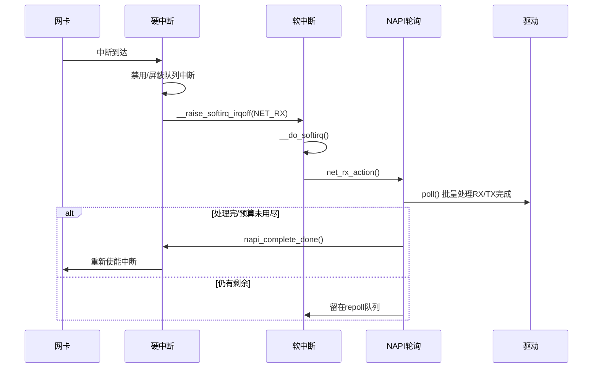
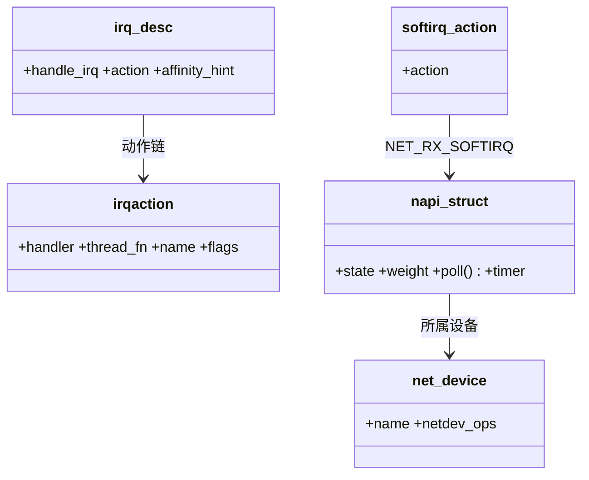

## 概述

网络中断处理是Linux网络栈性能的关键因素，它直接影响系统的网络吞吐量和延迟。Linux网络中断处理的完整机制，包括硬中断处理、软中断机制、NAPI轮询以及各种中断优化技术。

<!--more-->

## 1. 网络中断处理架构

### 1.1 中断处理的核心挑战

现代高速网络对中断处理提出了严峻挑战：

- **中断风暴**：高速网络产生大量中断，消耗CPU资源
- **延迟控制**：在保证低延迟的同时维持高吞吐量
- **多核扩展**：有效利用多核CPU进行中断处理
- **内存带宽**：避免中断处理成为内存访问瓶颈
- **功耗控制**：在移动设备上优化功耗表现

### 1.2 网络中断处理架构图

```mermaid
graph TB
    subgraph "硬件层"
        NIC[网卡硬件]
        DMA[DMA控制器]
        PCIE[PCIe总线]
        IOAPIC[I/O APIC]
    end
    
    subgraph "中断控制器"
        MSI[MSI/MSI-X]
        VECTOR[中断向量]
        IRQ_DESC[中断描述符]
        IRQ_CHIP[中断芯片]
    end
    
    subgraph "硬中断处理"
        HARD_ISR[硬中断服务程序]
        IRQ_HANDLER[中断处理函数]
        NAPI_SCHEDULE[NAPI调度]
        IRQ_DISABLE[中断禁用]
    end
    
    subgraph "软中断系统"
        SOFTIRQ[软中断框架]
        NET_RX[NET_RX_SOFTIRQ]
        NET_TX[NET_TX_SOFTIRQ]
        KSOFTIRQD[ksoftirqd线程]
    end
    
    subgraph "NAPI轮询机制"
        NAPI_LIST[NAPI轮询列表]
        POLL_FUNC[poll()函数]
        GRO_PROC[GRO处理]
        BUDGET_CTRL[预算控制]
    end
    
    subgraph "CPU调度"
        CURR_CPU[当前CPU]
        OTHER_CPU[其他CPU]
        RPS_STEER[RPS引导]
        IRQ_BALANCE[中断均衡]
    end
    
    subgraph "性能优化"
        IRQ_COALESCE[中断合并]
        IRQ_AFFINITY[中断亲和性]
        THREADED_IRQ[线程化中断]
        IRQ_POLL[中断轮询]
    end
    
    %% 硬件到中断控制器
    NIC --> DMA
    DMA --> PCIE
    PCIE --> MSI
    MSI --> VECTOR
    VECTOR --> IRQ_DESC
    IRQ_DESC --> IRQ_CHIP
    
    %% 硬中断处理流程
    IRQ_CHIP --> HARD_ISR
    HARD_ISR --> IRQ_HANDLER
    IRQ_HANDLER --> IRQ_DISABLE
    IRQ_DISABLE --> NAPI_SCHEDULE
    
    %% 软中断处理
    NAPI_SCHEDULE --> SOFTIRQ
    SOFTIRQ --> NET_RX
    NET_RX --> NAPI_LIST
    NAPI_LIST --> POLL_FUNC
    POLL_FUNC --> GRO_PROC
    
    %% 预算和调度控制
    GRO_PROC --> BUDGET_CTRL
    BUDGET_CTRL --> KSOFTIRQD
    
    %% 多CPU处理
    NET_RX -.-> RPS_STEER
    RPS_STEER --> OTHER_CPU
    IRQ_CHIP -.-> IRQ_BALANCE
    
    %% 优化技术
    IRQ_HANDLER -.-> IRQ_COALESCE
    IRQ_CHIP -.-> IRQ_AFFINITY
    SOFTIRQ -.-> THREADED_IRQ
    POLL_FUNC -.-> IRQ_POLL
    
    style HARD_ISR fill:#e1f5fe
    style NET_RX fill:#f3e5f5
    style NAPI_LIST fill:#e8f5e8
    style GRO_PROC fill:#fff3e0
    style IRQ_COALESCE fill:#fce4ec
```

## 2. 硬中断处理机制

### 2.1 中断描述符和处理

```c
/**
 * irq_desc - 中断描述符结构
 * 
 * 每个中断号都对应一个中断描述符，包含中断的所有管理信息
 */
struct irq_desc {
    struct irq_common_data  irq_common_data;   /* 通用中断数据 */
    struct irq_data         irq_data;          /* 中断数据 */
    unsigned int __percpu   *kstat_irqs;       /* 每CPU中断统计 */
    irq_flow_handler_t      handle_irq;        /* 中断流控制器 */
    struct irqaction        *action;           /* 中断动作链表 */
    unsigned int            status_use_accessors; /* 状态标志 */
    unsigned int            core_internal_state__do_not_mess_with_it; /* 内部状态 */
    unsigned int            depth;             /* 禁用深度 */
    unsigned int            wake_depth;        /* 唤醒深度 */
    unsigned int            tot_count;         /* 总中断计数 */
    unsigned int            irq_count;         /* 中断计数 */
    unsigned long           last_unhandled;    /* 最后未处理时间 */
    unsigned int            irqs_unhandled;    /* 未处理中断数 */
    atomic_t                threads_handled;   /* 线程处理计数 */
    int                     threads_handling;  /* 正在处理的线程数 */
    raw_spinlock_t          lock;              /* 描述符锁 */
    struct cpumask          *percpu_enabled;   /* 每CPU启用掩码 */
    const struct cpumask    *percpu_affinity;  /* 每CPU亲和性 */
    const struct cpumask    *affinity_hint;    /* 亲和性提示 */
    struct irq_affinity_notify *affinity_notify; /* 亲和性通知 */
#ifdef CONFIG_PROC_FS
    struct proc_dir_entry   *dir;             /* proc目录 */
#endif
#ifdef CONFIG_SPARSE_IRQ
    struct rcu_head         rcu;               /* RCU头 */
    struct kobject          kobj;              /* 内核对象 */
#endif
    struct mutex            request_mutex;     /* 请求互斥锁 */
    int                     parent_irq;        /* 父中断 */
    struct module           *owner;            /* 所有者模块 */
    const char              *name;             /* 中断名称 */
} ____cacheline_internodealigned_in_smp;

/**
 * irqaction - 中断动作结构
 * 
 * 描述中断的具体处理动作，支持中断共享
 */
struct irqaction {
    irq_handler_t       handler;        /* 中断处理函数 */
    void                *dev_id;        /* 设备标识 */
    void __percpu       *percpu_dev_id; /* 每CPU设备标识 */
    struct irqaction    *next;          /* 下一个动作（中断共享） */
    irq_handler_t       thread_fn;      /* 线程化中断函数 */
    struct task_struct  *thread;        /* 中断线程 */
    struct irqaction    *secondary;     /* 辅助动作 */
    unsigned int        irq;            /* 中断号 */
    unsigned int        flags;          /* 中断标志 */
    unsigned long       thread_flags;   /* 线程标志 */
    unsigned long       thread_mask;    /* 线程掩码 */
    const char          *name;          /* 动作名称 */
    struct proc_dir_entry *dir;        /* proc目录 */
} ____cacheline_internodealigned_in_smp;

/**
 * request_irq - 请求中断
 * @irq: 中断号
 * @handler: 中断处理函数
 * @flags: 中断标志
 * @name: 中断名称
 * @dev: 设备标识
 * 
 * 注册网络设备的中断处理函数
 * 返回值：成功返回0，失败返回负错误码
 */
static inline int __must_check
request_irq(unsigned int irq, irq_handler_t handler, unsigned long flags,
           const char *name, void *dev)
{
    return request_threaded_irq(irq, handler, NULL, flags, name, dev);
}

/**
 * 网络设备中断处理函数示例
 * @irq: 中断号
 * @dev_id: 设备标识
 * 
 * 典型的网络设备硬中断处理函数
 * 返回值：IRQ_HANDLED表示中断已处理
 */
static irqreturn_t e1000_intr(int irq, void *dev_id)
{
    struct net_device *netdev = dev_id;
    struct e1000_adapter *adapter = netdev_priv(netdev);
    struct e1000_hw *hw = &adapter->hw;
    u32 icr = er32(ICR);
    
    if (unlikely((!icr)))
        return IRQ_NONE;  /* 不是我们的中断 */
    
    /*
     * IMS为0时，IMC和IMS的写入被忽略。
     * 因为我们写入IMS和这里的ims_val，我们避免了竞争条件。
     */
    ew32(IMC, ~0);
    
    /* 如果接口关闭，清理并返回 */
    if (unlikely(test_bit(__E1000_DOWN, &adapter->flags)))
        return IRQ_HANDLED;
    
    /* 检查是否为Rx中断 */
    if (unlikely(icr & (E1000_ICR_RXSEQ | E1000_ICR_LSC))) {
        /* 处理链路状态变化 */
        hw->get_link_status = 1;
        /* 
         * 80003ES2LAN的ICR不会回写LSC中断位
         * - 它与RXSEQ中断共享同一位
         */
        mod_timer(&adapter->watchdog_timer, jiffies + 1);
    }
    
    /* 禁用中断，调度NAPI */
    if (likely(napi_schedule_prep(&adapter->napi))) {
        adapter->total_tx_bytes = 0;
        adapter->total_tx_packets = 0;
        adapter->total_rx_bytes = 0;
        adapter->total_rx_packets = 0;
        __napi_schedule(&adapter->napi);
    } else {
        /* 重新启用中断 */
        if (!test_bit(__E1000_DOWN, &adapter->flags))
            e1000_irq_enable(adapter);
    }
    
    return IRQ_HANDLED;
}
```

### 2.2 MSI/MSI-X中断机制

```c
/**
 * pci_enable_msix_range - 启用MSI-X中断
 * @dev: PCI设备
 * @entries: MSI-X条目数组
 * @minvec: 最小向量数
 * @maxvec: 最大向量数
 * 
 * 为网络设备启用MSI-X中断，支持多队列
 * 返回值：分配的向量数或错误码
 */
int pci_enable_msix_range(struct pci_dev *dev, struct msix_entry *entries,
                         int minvec, int maxvec)
{
    int rc;
    
    if (maxvec < minvec)
        return -ERANGE;
    
    for (;;) {
        if (maxvec == 1) {
            rc = pci_enable_msix_exact(dev, entries, maxvec);
            if (rc < 0)
                return rc;
            return maxvec;
        }
        
        rc = pci_enable_msix(dev, entries, maxvec);
        if (rc < 0) {
            return rc;
        } else if (rc > 0) {
            if (rc < minvec)
                return -ENOSPC;
            maxvec = rc;
        } else {
            return maxvec;
        }
    }
}

/**
 * 网络设备MSI-X中断设置示例
 */
static int e1000e_request_msix(struct e1000_adapter *adapter)
{
    struct net_device *netdev = adapter->netdev;
    int err = 0, vector = 0;
    
    if (strlen(netdev->name) < (IFNAMSIZ - 5))
        snprintf(adapter->rx_ring->name,
                sizeof(adapter->rx_ring->name) - 1,
                "%s-rx-0", netdev->name);
    else
        memcpy(adapter->rx_ring->name, netdev->name, IFNAMSIZ);
    
    err = request_irq(adapter->msix_entries[vector].vector,
                     e1000_intr_msix_rx, 0, adapter->rx_ring->name,
                     netdev);
    if (err)
        return err;
    adapter->rx_ring->itr_register = E1000_EITR(vector);
    adapter->rx_ring->itr_val = adapter->itr;
    vector++;
    
    /* 发送中断 */
    if (strlen(netdev->name) < (IFNAMSIZ - 5))
        snprintf(adapter->tx_ring->name,
                sizeof(adapter->tx_ring->name) - 1,
                "%s-tx-0", netdev->name);
    else
        memcpy(adapter->tx_ring->name, netdev->name, IFNAMSIZ);
    
    err = request_irq(adapter->msix_entries[vector].vector,
                     e1000_intr_msix_tx, 0, adapter->tx_ring->name,
                     netdev);
    if (err)
        return err;
    adapter->tx_ring->itr_register = E1000_EITR(vector);
    adapter->tx_ring->itr_val = adapter->itr;
    vector++;
    
    /* 其他中断（链路状态等） */
    err = request_irq(adapter->msix_entries[vector].vector,
                     e1000_msix_other, 0, netdev->name, netdev);
    if (err)
        return err;
    
    return 0;
}
```

## 3. 软中断机制详解

### 3.1 软中断框架实现

```c
/**
 * softirq_action - 软中断动作结构
 */
struct softirq_action {
    void (*action)(struct softirq_action *);
};

/**
 * 软中断类型定义
 */
enum {
    HI_SOFTIRQ=0,           /* 高优先级软中断 */
    TIMER_SOFTIRQ,          /* 定时器软中断 */
    NET_TX_SOFTIRQ,         /* 网络发送软中断 */
    NET_RX_SOFTIRQ,         /* 网络接收软中断 */
    BLOCK_SOFTIRQ,          /* 块设备软中断 */
    IRQ_POLL_SOFTIRQ,       /* IRQ轮询软中断 */
    TASKLET_SOFTIRQ,        /* Tasklet软中断 */
    SCHED_SOFTIRQ,          /* 调度软中断 */
    HRTIMER_SOFTIRQ,        /* 高精度定时器软中断 */
    RCU_SOFTIRQ,            /* RCU软中断 */
    NR_SOFTIRQS             /* 软中断数量 */
};

/**
 * __do_softirq - 软中断处理主函数
 * 
 * 处理待处理的软中断，这是软中断机制的核心
 */
asmlinkage __visible void __do_softirq(void)
{
    unsigned long end = jiffies + MAX_SOFTIRQ_TIME;
    unsigned long old_flags = current->flags;
    int max_restart = MAX_SOFTIRQ_RESTART;
    struct softirq_action *h;
    bool in_hardirq;
    __u32 pending;
    int softirq_bit;
    
    /*
     * 掩码出标志以防止无限递归。这可以被明确地清除
     * 通过调用local_irq_enable()
     */
    current->flags &= ~PF_MEMALLOC;
    
    pending = local_softirq_pending();
    
    softirq_handle_begin();
    in_hardirq = lockdep_softirq_start();
    account_irq_enter_time(current);
    
restart:
    /* 重置软中断映射 */
    set_softirq_pending(0);
    
    local_irq_enable();
    
    h = softirq_vec;
    
    while ((softirq_bit = ffs(pending))) {
        unsigned int vec_nr;
        int prev_count;
        
        h += softirq_bit - 1;
        
        vec_nr = h - softirq_vec;
        prev_count = preempt_count();
        
        kstat_incr_softirqs_this_cpu(vec_nr);
        
        trace_softirq_entry(vec_nr);
        h->action(h);                    /* 执行软中断处理函数 */
        trace_softirq_exit(vec_nr);
        
        if (unlikely(prev_count != preempt_count())) {
            pr_err("huh, entered softirq %u %s %p with preempt_count %08x, exited with %08x?\n",
                   vec_nr, softirq_to_name[vec_nr], h->action,
                   prev_count, preempt_count());
            preempt_count_set(prev_count);
        }
        h++;
        pending >>= softirq_bit;
    }
    
    local_irq_disable();
    
    pending = local_softirq_pending();
    if (pending) {
        if (time_before(jiffies, end) && !need_resched() && --max_restart)
            goto restart;
        
        /*
         * 如果软中断处理时间太长，唤醒ksoftirqd线程
         */
        wakeup_softirqd();
    }
    
    account_irq_exit_time(current);
    lockdep_softirq_end(in_hardirq);
    softirq_handle_end();
    current->flags = old_flags;
}

/**
 * raise_softirq_irqoff - 触发软中断（中断已禁用）
 * @nr: 软中断号
 * 
 * 在中断已禁用的上下文中触发软中断
 */
void raise_softirq_irqoff(unsigned int nr)
{
    __raise_softirq_irqoff(nr);
    
    /*
     * 如果我们在硬中断上下文中，不要立即处理软中断。
     * 相反，当硬中断退出时它们会被触发。
     */
    if (!in_interrupt())
        wakeup_softirqd();
}

/**
 * __raise_softirq_irqoff - 内部软中断触发
 * @nr: 软中断号
 * 
 * 设置软中断待处理位
 */
inline void __raise_softirq_irqoff(unsigned int nr)
{
    lockdep_assert_irqs_disabled();
    trace_softirq_raise(nr);
    or_softirq_pending(1UL << nr);
}
```

### 3.2 ksoftirqd内核线程

```c
/**
 * ksoftirqd - 软中断处理内核线程
 * @should_run: 是否应该运行
 * 
 * 每个CPU都有一个ksoftirqd线程来处理软中断
 */
static void run_ksoftirqd(unsigned int cpu)
{
    ksoftirqd_run_begin();
    if (local_softirq_pending()) {
        /*
         * 我们可以安全地运行软中断，而不调用local_irq_enable()
         * 因为软中断禁用被每个CPU标志跟踪，而不是每个进程标志。
         */
        __do_softirq();
        ksoftirqd_run_end();
        cond_resched();
        
        return;
    }
    ksoftirqd_run_end();
}

/**
 * run_ksoftirqd - ksoftirqd线程主循环
 * @cpu: CPU编号
 * 
 * ksoftirqd线程的主要工作循环
 */
static int run_ksoftirqd(void *_cpu)
{
    int cpu = (int)(long)_cpu;
    
    set_current_state(TASK_INTERRUPTIBLE);
    
    while (!kthread_should_stop()) {
        preempt_disable();
        if (!local_softirq_pending()) {
            schedule_preempt_disabled();
        }
        
        __set_current_state(TASK_RUNNING);
        
        while (local_softirq_pending()) {
            /* 抢占必须被禁用，否则cpu可能改变 */
            preempt_enable_no_resched();
            __do_softirq();
            preempt_disable();
            cond_resched();
        }
        preempt_enable();
        set_current_state(TASK_INTERRUPTIBLE);
    }
    __set_current_state(TASK_RUNNING);
    return 0;
}

/**
 * wakeup_softirqd - 唤醒ksoftirqd线程
 * 
 * 当软中断处理时间过长时，唤醒ksoftirqd线程继续处理
 */
void wakeup_softirqd(void)
{
    /* 不要唤醒ksoftirqd，如果我们在中断上下文中 */
    if (in_interrupt())
        return;
    wake_up_process(this_cpu_ksoftirqd());
}
```

## 4. NAPI轮询机制深度分析

### 4.1 NAPI状态管理

```c
/**
 * NAPI状态位定义
 */
enum {
    NAPI_STATE_SCHED,       /* 已调度等待轮询 */
    NAPI_STATE_MISSED,      /* 轮询时又收到中断 */
    NAPI_STATE_DISABLE,     /* 禁用状态 */
    NAPI_STATE_NPSVC,       /* 正在轮询服务中 */
    NAPI_STATE_LISTED,      /* 在设备列表中 */
    NAPI_STATE_NO_BUSY_POLL, /* 禁用busy polling */
    NAPI_STATE_IN_BUSY_POLL, /* 在busy polling中 */
    NAPI_STATE_PREFER_BUSY_POLL, /* 偏好busy polling */
    NAPI_STATE_THREADED,    /* 线程化NAPI */
    NAPI_STATE_SCHED_THREADED, /* 线程化调度 */
};

/**
 * napi_enable - 启用NAPI
 * @n: NAPI结构指针
 * 
 * 启用NAPI机制，允许轮询处理
 */
void napi_enable(struct napi_struct *n)
{
    unsigned long new, val = READ_ONCE(n->state);
    
    do {
        BUG_ON(!test_bit(NAPI_STATE_SCHED, &val));
        
        new = val & ~(NAPIF_STATE_SCHED | NAPIF_STATE_NPSVC);
        new |= NAPIF_STATE_SCHED_THREADED;
    } while (cmpxchg(&n->state, val, new) != val);
}

/**
 * napi_disable - 禁用NAPI
 * @n: NAPI结构指针
 * 
 * 禁用NAPI机制，停止轮询处理
 */
void napi_disable(struct napi_struct *n)
{
    might_sleep();
    set_bit(NAPI_STATE_DISABLE, &n->state);
    
    while (test_and_set_bit(NAPI_STATE_SCHED, &n->state))
        msleep(1);
    while (test_and_set_bit(NAPI_STATE_NPSVC, &n->state))
        msleep(1);
    
    hrtimer_cancel(&n->timer);
    
    clear_bit(NAPI_STATE_DISABLE, &n->state);
    clear_bit(NAPI_STATE_PREFER_BUSY_POLL, &n->state);
}

/**
 * napi_schedule_irqoff - 在中断禁用状态下调度NAPI
 * @n: NAPI结构指针
 * 
 * 这是最常用的NAPI调度函数，通常在硬中断处理中调用
 */
static inline void napi_schedule_irqoff(struct napi_struct *n)
{
    if (napi_schedule_prep(n))
        __napi_schedule_irqoff(n);
}

/**
 * __napi_schedule_irqoff - 内部NAPI调度（中断禁用）
 * @n: NAPI结构指针
 * 
 * 将NAPI添加到当前CPU的轮询列表中
 */
void __napi_schedule_irqoff(struct napi_struct *n)
{
    ____napi_schedule(this_cpu_ptr(&softnet_data), n);
}

/**
 * napi_complete_done - 完成NAPI轮询
 * @n: NAPI结构指针
 * @work_done: 完成的工作量
 * 
 * 当NAPI轮询完成时调用，重新启用硬件中断
 * 返回值：是否成功完成
 */
bool napi_complete_done(struct napi_struct *n, int work_done)
{
    unsigned long flags, val, new, timeout = 0;
    bool ret = true;
    
    /*
     * 1) 不要让napi成为线程化的，如果在硬/软irq上下文之外被调用
     * 2) 如果禁用了中断，我们需要原子操作，因为我们可能在竞争
     *    napi_disable()
     */
    if (unlikely(in_irq() || irqs_disabled())) {
        WARN_ON_ONCE(!(val & NAPIF_STATE_SCHED));
        new = val & ~(NAPIF_STATE_MISSED | NAPIF_STATE_SCHED |
                     NAPIF_STATE_SCHED_THREADED);
        
        /* 如果在服务中，不要完成 */
        if (val & NAPIF_STATE_NPSVC)
            new |= NAPIF_STATE_NPSVC;
        
        val = cmpxchg(&n->state, val, new);
        if (unlikely(val != (val & ~NAPIF_STATE_MISSED)))
            goto reschedule;
        ret = false;
    }
    
    if (n->gro_list) {
        gro_normal_list(n);
        
        if (work_done < n->weight && n->dev->gro_flush_timeout) {
            /* 如果还有GRO包等待且没用完预算，设置定时器 */
            timeout = n->dev->gro_flush_timeout;
            hrtimer_start(&n->timer, ns_to_ktime(timeout),
                         HRTIMER_MODE_REL_PINNED);
        }
    }
    
    if (unlikely(!list_empty(&n->poll_list))) {
        /* 在完成过程中被重新调度了 */
        WARN_ON_ONCE(1);
        return false;
    }
    
    if (timeout)
        hrtimer_start(&n->timer, ns_to_ktime(timeout),
                     HRTIMER_MODE_REL_PINNED);
    
    return ret;
    
reschedule:
    if (unlikely(val & NAPIF_STATE_MISSED)) {
        __napi_schedule(n);
        return false;
    }
    return ret;
}
```

## 5. 中断合并和节流

### 5.1 中断合并机制

```c
/**
 * ethtool_coalesce - 中断合并参数
 * 
 * 这个结构定义了网络设备的中断合并参数，
 * 用于平衡延迟和CPU利用率
 */
struct ethtool_coalesce {
    __u32   cmd;                    /* 命令 */
    
    /* 接收中断合并参数 */
    __u32   rx_coalesce_usecs;      /* 接收中断延迟（微秒） */
    __u32   rx_max_coalesced_frames; /* 接收最大合并帧数 */
    __u32   rx_coalesce_usecs_irq;   /* 中断内接收延迟 */
    __u32   rx_max_coalesced_frames_irq; /* 中断内最大帧数 */
    
    /* 发送中断合并参数 */
    __u32   tx_coalesce_usecs;      /* 发送中断延迟（微秒） */
    __u32   tx_max_coalesced_frames; /* 发送最大合并帧数 */
    __u32   tx_coalesce_usecs_irq;   /* 中断内发送延迟 */
    __u32   tx_max_coalesced_frames_irq; /* 中断内最大帧数 */
    
    /* 统计相关参数 */
    __u32   stats_block_coalesce_usecs; /* 统计块延迟 */
    
    /* 自适应中断合并 */
    __u32   use_adaptive_rx_coalesce;    /* 自适应接收合并 */
    __u32   use_adaptive_tx_coalesce;    /* 自适应发送合并 */
    
    /* 包速率相关参数 */
    __u32   pkt_rate_low;           /* 低包速率阈值 */
    __u32   rx_coalesce_usecs_low;  /* 低速率接收延迟 */
    __u32   rx_max_coalesced_frames_low; /* 低速率最大帧数 */
    __u32   tx_coalesce_usecs_low;  /* 低速率发送延迟 */
    __u32   tx_max_coalesced_frames_low; /* 低速率最大帧数 */
    
    __u32   pkt_rate_high;          /* 高包速率阈值 */
    __u32   rx_coalesce_usecs_high; /* 高速率接收延迟 */
    __u32   rx_max_coalesced_frames_high; /* 高速率最大帧数 */
    __u32   tx_coalesce_usecs_high; /* 高速率发送延迟 */
    __u32   tx_max_coalesced_frames_high; /* 高速率最大帧数 */
    
    /* 采样间隔 */
    __u32   rate_sample_interval;   /* 速率采样间隔 */
};

/**
 * 自适应中断合并算法示例
 */
static void e1000e_update_itr(struct e1000_adapter *adapter,
                             u16 itr_setting, int packets, int bytes)
{
    unsigned int retval = itr_setting;
    
    if (packets == 0)
        return;
    
    switch (itr_setting) {
    case lowest_latency:
        /* 处理大量小包 */
        if (bytes/packets > 8000)
            retval = bulk_latency;
        else if ((packets < 5) && (bytes > 512))
            retval = low_latency;
        break;
        
    case low_latency:  /* 50 usec aka 20000 ints/s */
        if (bytes > 10000) {
            /* 这可能意味着大量的小包或几个大包 */
            if (bytes/packets > 8000)
                retval = bulk_latency;
            else if ((packets < 10) || ((bytes/packets) > 1200))
                retval = bulk_latency;
            else if ((packets > 35))
                retval = lowest_latency;
        } else if (bytes/packets > 2000) {
            retval = bulk_latency;
        } else if (packets <= 2 && bytes < 512) {
            retval = lowest_latency;
        }
        break;
        
    case bulk_latency: /* 250 usec aka 4000 ints/s */
        if (bytes > 25000) {
            if (packets > 35)
                retval = low_latency;
        } else if (bytes < 1500) {
            retval = low_latency;
        }
        break;
    }
    
    adapter->rx_itr_setting = retval;
}
```

## 6. 网络中断亲和性管理

### 6.1 中断亲和性设置

```c
/**
 * irq_set_affinity - 设置中断亲和性
 * @irq: 中断号
 * @cpumask: CPU掩码
 * 
 * 将中断绑定到特定的CPU集合
 * 返回值：成功返回0，失败返回负错误码
 */
int irq_set_affinity(unsigned int irq, const struct cpumask *cpumask)
{
    struct irq_desc *desc = irq_to_desc(irq);
    struct irq_chip *chip;
    unsigned long flags;
    int ret = 0;
    
    if (!desc)
        return -EINVAL;
    
    raw_spin_lock_irqsave(&desc->lock, flags);
    ret = irq_set_affinity_locked(desc, cpumask, false);
    raw_spin_unlock_irqrestore(&desc->lock, flags);
    return ret;
}

/**
 * 网络设备中断亲和性优化示例
 */
static void setup_rx_irq_affinity(struct e1000_adapter *adapter)
{
    struct net_device *netdev = adapter->netdev;
    int i, cpu;
    
    /* 为每个接收队列设置CPU亲和性 */
    for (i = 0; i < adapter->num_rx_queues; i++) {
        struct e1000_ring *rx_ring = &adapter->rx_ring[i];
        
        /* 循环分配CPU */
        cpu = i % num_online_cpus();
        
        /* 设置中断亲和性 */
        if (adapter->msix_entries) {
            int vector = adapter->msix_entries[i].vector;
            irq_set_affinity_hint(vector, cpumask_of(cpu));
        }
        
        /* 设置NAPI处理CPU */
        netif_set_real_num_rx_queues(netdev, adapter->num_rx_queues);
    }
}

/**
 * irq_cpu_rmap_add - 添加CPU反向映射
 * @rmap: CPU反向映射
 * @irq: 中断号
 * 
 * 建立中断到CPU的反向映射，用于RFS优化
 * 返回值：映射索引或负错误码
 */
int irq_cpu_rmap_add(struct cpu_rmap *rmap, int irq)
{
    int rc;
    
    rc = cpu_rmap_add(rmap, irq_to_desc(irq));
    if (rc < 0)
        return rc;
    
    irq_set_affinity_notifier(irq, &rmap->obj[rc].notify);
    return rc;
}
```

### 6.2 中断负载均衡

```c
/**
 * irq_balance_info - 中断负载均衡信息
 */
struct irq_balance_info {
    unsigned long       last_move;      /* 最后移动时间 */
    unsigned int        irq_delta;      /* 中断变化量 */
    unsigned long       local_count;    /* 本地计数 */
    unsigned long       global_count;   /* 全局计数 */
    
    struct list_head    list;           /* 均衡列表 */
    struct cpumask      allowed_mask;   /* 允许的CPU掩码 */
    unsigned int        numa_node;      /* NUMA节点 */
    unsigned int        package_id;     /* 封装ID */
    unsigned int        core_id;        /* 核心ID */
    
    int                 class;          /* 中断类别 */
    unsigned long       load;           /* 负载值 */
};

/**
 * irq_balance_work - 中断负载均衡工作函数
 * @work: 工作结构
 * 
 * 定期执行中断负载均衡，优化中断分布
 */
static void irq_balance_work(struct work_struct *work)
{
    struct irq_balance_info *info;
    struct cpumask target_mask;
    int cpu, target_cpu;
    unsigned long min_load = ULONG_MAX;
    
    /* 遍历所有需要均衡的中断 */
    list_for_each_entry(info, &irq_balance_list, list) {
        if (time_before(jiffies, info->last_move + IRQ_BALANCE_INTERVAL))
            continue;
        
        /* 查找负载最轻的CPU */
        cpumask_and(&target_mask, &info->allowed_mask, cpu_online_mask);
        target_cpu = -1;
        
        for_each_cpu(cpu, &target_mask) {
            unsigned long load = cpu_irq_load(cpu);
            if (load < min_load) {
                min_load = load;
                target_cpu = cpu;
            }
        }
        
        /* 如果找到更好的CPU，移动中断 */
        if (target_cpu != -1 && 
            cpu_irq_load(target_cpu) < cpu_irq_load(info->current_cpu) - BALANCE_THRESHOLD) {
            irq_set_affinity(info->irq, cpumask_of(target_cpu));
            info->last_move = jiffies;
            info->current_cpu = target_cpu;
        }
    }
    
    /* 重新调度均衡工作 */
    schedule_delayed_work(&irq_balance_work, IRQ_BALANCE_INTERVAL);
}
```

## 7. Busy Polling优化

### 7.1 用户空间忙轮询

```c
/**
 * sk_busy_loop - 套接字忙轮询
 * @sk: 套接字
 * @nonblock: 非阻塞标志
 * 
 * 在用户空间系统调用中进行忙轮询，减少延迟
 * 返回值：轮询结果
 */
void sk_busy_loop(struct sock *sk, int nonblock)
{
    unsigned long end_time = !nonblock ? sk_busy_loop_end_time(sk) : 0;
    int (*napi_poll)(struct napi_struct *napi, int budget);
    int (*busy_poll_spin)(struct napi_struct *napi);
    void *have_poll_lock = NULL;
    struct napi_struct *napi;
    unsigned int napi_id;
    
restart:
    napi_id = READ_ONCE(sk->sk_napi_id);
    if (napi_id < MIN_NAPI_ID)
        return;
    
    napi = napi_by_id(napi_id);
    if (!napi)
        return;
    
    preempt_disable();
    for (;;) {
        int work = 0;
        
        local_bh_disable();
        if (!napi_disable_pending(napi)) {
            clear_bit(NAPI_STATE_IN_BUSY_POLL, &napi->state);
            local_bh_enable();
            
            have_poll_lock = netpoll_poll_lock(napi);
            napi_poll = napi->poll;
            
            work = napi_poll(napi, BUSY_POLL_BUDGET);
            trace_napi_poll(napi, work, BUSY_POLL_BUDGET);
            gro_normal_list(napi);
            
            if (work > 0)
                __NET_ADD_STATS(sock_net(sk),
                               LINUX_MIB_BUSYPOLLRXPACKETS, work);
            local_bh_disable();
            
            if (!netpoll_poll_lock(napi)) {
                /* 失去锁，需要重新尝试 */
                busy_poll_stop(napi, have_poll_lock, prefer_busy_poll, budget);
                preempt_enable();
                goto restart;
            }
            cpu_relax(); /* 让出CPU给其他任务 */
        }
        local_bh_enable();
        
        if (nonblock || !skb_queue_empty_lockless(&sk->sk_receive_queue) ||
            busy_loop_timeout(end_time))
            break;
        
        if (unlikely(need_resched())) {
            if (napi_poll)
                busy_poll_stop(napi, have_poll_lock, prefer_busy_poll, budget);
            preempt_enable();
            rcu_read_unlock();
            cond_resched();
            if (unlikely(!skb_queue_empty_lockless(&sk->sk_receive_queue)))
                return;
            rcu_read_lock();
            goto restart;
        }
        cpu_relax(); /* 等待更多数据包 */
    }
    busy_poll_stop(napi, have_poll_lock, prefer_busy_poll, budget);
    preempt_enable();
}

/**
 * busy_poll_stop - 停止忙轮询
 * @napi: NAPI结构
 * @have_poll_lock: 是否持有轮询锁
 * @prefer_busy_poll: 是否偏好忙轮询
 * @budget: 预算
 * 
 * 结束忙轮询并恢复正常中断处理
 */
static void busy_poll_stop(struct napi_struct *napi, void *have_poll_lock,
                          bool prefer_busy_poll, u16 budget)
{
    bool skip_schedule = false;
    unsigned long timeout;
    int rc;
    
    /* 忙轮询期间处理了数据包 */
    if (rc > 0) {
        /* 即使收到包，也检查是否需要重新调度NAPI */
        if (rc < budget) {
            napi_complete_done(napi, rc);
            if (prefer_busy_poll) {
                napi_schedule_prep(napi);
                skip_schedule = true;
            }
        }
    } else if (rc == 0) {
        /* 没有收到包，完成NAPI */
        napi_complete_done(napi, 0);
    }
    
    if (!skip_schedule) {
        /* 重新启用中断 */
        clear_bit(NAPI_STATE_IN_BUSY_POLL, &napi->state);
        if (prefer_busy_poll) {
            set_bit(NAPI_STATE_PREFER_BUSY_POLL, &napi->state);
        }
        
        /* 如果有待处理的工作，重新调度 */
        if (napi_disable_pending(napi)) {
            napi_schedule(napi);
        }
    }
    
    netpoll_poll_unlock(have_poll_lock);
}
```

## 8. 中断处理性能监控

### 8.1 中断统计信息

```c
/**
 * show_interrupts - 显示中断统计信息
 * @p: seq_file指针
 * @v: 数据指针
 * 
 * /proc/interrupts的实现，显示系统中断统计
 */
int show_interrupts(struct seq_file *p, void *v)
{
    static int prec;
    unsigned long flags, any_count = 0;
    int i = *(loff_t *) v, j;
    struct irqaction *action;
    struct irq_desc *desc;
    
    if (i > ACTUAL_NR_IRQS)
        return 0;
    
    if (i == ACTUAL_NR_IRQS)
        return arch_show_interrupts(p, prec);
    
    /* 打印头部 */
    if (i == 0) {
        seq_printf(p, "%*s", prec + 8, "");
        for_each_online_cpu(j)
            seq_printf(p, "CPU%-8d", j);
        seq_putc(p, '\n');
    }
    
    desc = irq_to_desc(i);
    if (!desc || irq_settings_is_hidden(desc))
        return 0;
    
    raw_spin_lock_irqsave(&desc->lock, flags);
    for_each_online_cpu(j)
        any_count |= kstat_irqs_cpu(i, j);
    
    if ((!desc->action || irq_desc_is_chained(desc)) && !any_count)
        goto out;
    
    seq_printf(p, "%*d: ", prec, i);
    for_each_online_cpu(j)
        seq_printf(p, "%10u ", kstat_irqs_cpu(i, j));
    
    if (desc->irq_data.chip) {
        if (desc->irq_data.chip->irq_print_chip)
            desc->irq_data.chip->irq_print_chip(&desc->irq_data, p);
        else if (desc->irq_data.chip->name)
            seq_printf(p, " %8s", desc->irq_data.chip->name);
        else
            seq_printf(p, " %8s", "-");
    } else {
        seq_printf(p, " %8s", "None");
    }
    
    if (desc->irq_data.domain)
        seq_printf(p, " %*d", prec, (int) desc->irq_data.hwirq);
    else
        seq_printf(p, " %*s", prec, "");
    
    seq_printf(p, " %-8s", irqd_is_level_type(&desc->irq_data) ? "Level" : "Edge");
    
    if (desc->name)
        seq_printf(p, "-%-8s", desc->name);
    
    action = desc->action;
    if (action) {
        seq_printf(p, "  %s", action->name);
        while ((action = action->next) != NULL)
            seq_printf(p, ", %s", action->name);
    }
    
    seq_putc(p, '\n');
out:
    raw_spin_unlock_irqrestore(&desc->lock, flags);
    return 0;
}

/**
 * /proc/softirqs统计显示
 */
static int show_softirqs(struct seq_file *p, void *v)
{
    int i, j;
    
    seq_puts(p, "                    ");
    for_each_possible_cpu(i)
        seq_printf(p, "CPU%-8d", i);
    seq_putc(p, '\n');
    
    for (i = 0; i < NR_SOFTIRQS; i++) {
        seq_printf(p, "%12s:", softirq_to_name[i]);
        for_each_possible_cpu(j)
            seq_printf(p, " %10u", kstat_softirqs_cpu(i, j));
        seq_putc(p, '\n');
    }
    return 0;
}
```

## 9. 高级中断优化技术

### 9.1 线程化中断

```c
/**
 * request_threaded_irq - 请求线程化中断
 * @irq: 中断号
 * @handler: 硬中断处理函数
 * @thread_fn: 线程中断处理函数
 * @irqflags: 中断标志
 * @devname: 设备名称
 * @dev_id: 设备标识
 * 
 * 注册线程化中断处理，将耗时操作移到内核线程中
 * 返回值：成功返回0，失败返回负错误码
 */
int request_threaded_irq(unsigned int irq, irq_handler_t handler,
                        irq_handler_t thread_fn, unsigned long irqflags,
                        const char *devname, void *dev_id)
{
    struct irqaction *action;
    struct irq_desc *desc;
    int retval;
    
    if (irq == IRQ_NOTCONNECTED)
        return -ENOTCONN;
    
    /*
     * 参数有效性检查
     */
    if (((irqflags & IRQF_SHARED) && !dev_id) ||
        (!(irqflags & IRQF_SHARED) && (irqflags & IRQF_COND_SUSPEND)) ||
        ((irqflags & IRQF_NO_SUSPEND) && (irqflags & IRQF_COND_SUSPEND)))
        return -EINVAL;
    
    desc = irq_to_desc(irq);
    if (!desc)
        return -EINVAL;
    
    if (!irq_settings_can_request(desc) ||
        WARN_ON(irq_settings_is_per_cpu_devid(desc)))
        return -EINVAL;
    
    if (!handler) {
        if (!thread_fn)
            return -EINVAL;
        handler = irq_default_primary_handler;
    }
    
    action = kzalloc(sizeof(struct irqaction), GFP_KERNEL);
    if (!action)
        return -ENOMEM;
    
    action->handler = handler;
    action->thread_fn = thread_fn;
    action->flags = irqflags;
    action->name = devname;
    action->dev_id = dev_id;
    
    retval = __setup_irq(irq, desc, action);
    
    if (retval) {
        kfree(action->secondary);
        kfree(action);
    }
    
#ifdef CONFIG_DEBUG_SHIRQ_FIXME
    if (!retval && (irqflags & IRQF_SHARED)) {
        /*
         * 对于共享中断，确保旧驱动是安全的；
         * 它们可能没有准备好处理新的中断。
         */
        disable_irq(irq);
        enable_irq(irq);
    }
#endif
    return retval;
}

/**
 * irq_thread - 中断线程主函数
 * @data: 中断动作数据
 * 
 * 线程化中断的主要处理函数
 * 返回值：线程退出码
 */
static int irq_thread(void *data)
{
    struct callback_head on_exit_work;
    struct irqaction *action = data;
    struct irq_desc *desc = irq_to_desc(action->irq);
    irqreturn_t (*handler_fn)(struct irq_desc *desc,
                             struct irqaction *action);
    
    if (force_irqthreads && test_bit(IRQTF_FORCED_THREAD,
                                    &action->thread_flags))
        handler_fn = irq_forced_thread_fn;
    else
        handler_fn = irq_thread_fn;
    
    init_task_work(&on_exit_work, irq_thread_dtor);
    task_work_add(current, &on_exit_work, TWA_NONE);
    
    irq_thread_check_affinity(desc, action);
    
    while (!irq_wait_for_interrupt(action)) {
        irqreturn_t action_ret;
        
        irq_thread_check_affinity(desc, action);
        
        action_ret = handler_fn(desc, action);
        if (action_ret == IRQ_HANDLED)
            atomic_inc(&desc->threads_handled);
        
        migrate_disable();
        add_interrupt_randomness(action->irq, 0);
        migrate_enable();
        cond_resched();
    }
    
    /*
     * 这是exit路径。在这里task_work_add()的工作处理已移除我们自己
     */
    return 0;
}
```

### 9.2 中断合并优化

```c
/**
 * irq_coalesce_params - 中断合并参数
 */
struct irq_coalesce_params {
    u32 max_packets;        /* 最大数据包数 */
    u32 max_usecs;          /* 最大微秒数 */
    u32 pkt_rate_low;       /* 低包速率 */
    u32 pkt_rate_high;      /* 高包速率 */
    u32 rate_sample_interval; /* 采样间隔 */
    bool use_adaptive;      /* 使用自适应合并 */
};

/**
 * adaptive_coalesce_update - 自适应合并更新
 * @adapter: 网络适配器
 * @packets: 数据包数
 * @bytes: 字节数
 * @usecs: 处理时间
 * 
 * 根据当前网络负载动态调整中断合并参数
 */
static void adaptive_coalesce_update(struct net_adapter *adapter,
                                   u32 packets, u32 bytes, u32 usecs)
{
    struct irq_coalesce_params *coal = &adapter->coalesce;
    u32 pps = 0; /* packets per second */
    u32 rate;
    
    if (usecs > 0)
        pps = (packets * 1000000) / usecs;
    
    /* 计算当前包速率 */
    rate = (pps + coal->pkt_rate_low + coal->pkt_rate_high) / 3;
    
    if (rate < coal->pkt_rate_low) {
        /* 低速率：优化延迟 */
        coal->max_usecs = min(coal->max_usecs / 2, 10U);
        coal->max_packets = min(coal->max_packets / 2, 4U);
    } else if (rate > coal->pkt_rate_high) {
        /* 高速率：优化吞吐量 */
        coal->max_usecs = min(coal->max_usecs * 2, 200U);
        coal->max_packets = min(coal->max_packets * 2, 64U);
    }
    
    /* 更新硬件中断合并设置 */
    adapter_update_coalesce_hw(adapter, coal);
}

/**
 * napi_gro_frags - NAPI GRO分片处理
 * @napi: NAPI结构
 * 
 * 处理分片数据包的GRO聚合
 * 返回值：GRO处理结果
 */
gro_result_t napi_gro_frags(struct napi_struct *napi)
{
    struct sk_buff *skb = napi->skb;
    gro_result_t ret;
    
    trace_napi_gro_frags_entry(skb);
    
    skb_gro_reset_offset(skb);
    
    ret = napi_frags_finish(napi, skb, dev_gro_receive(napi, skb));
    trace_napi_gro_frags_exit(ret);
    
    return ret;
}
```

## 10. 网络中断调试和性能分析

### 10.1 中断调试工具

```c
/**
 * /proc/net/softnet_stat显示软中断统计
 */
static int softnet_seq_show(struct seq_file *seq, void *v)
{
    struct softnet_data *sd = v;
    
    seq_printf(seq, "%08x %08x %08x %08x %08x %08x %08x %08x %08x %08x %08x\n",
              sd->processed, sd->dropped, sd->time_squeeze, 0,
              0, 0, 0, 0, /* 保留字段 */
              sd->cpu_collision, sd->received_rps, flow_limit_count);
    return 0;
}

/**
 * 网络设备中断统计更新
 */
static inline void netdev_irq_stats_update(struct net_device *dev,
                                          unsigned int packets,
                                          unsigned int bytes)
{
    struct netdev_irq_stats *stats;
    
    stats = this_cpu_ptr(dev->irq_stats);
    u64_stats_update_begin(&stats->syncp);
    stats->packets += packets;
    stats->bytes += bytes;
    u64_stats_update_end(&stats->syncp);
}

/**
 * net_rps_action - RPS动作处理
 * @sd: 软网络数据
 * 
 * 处理RPS相关的跨CPU工作
 */
static void net_rps_action_and_irq_enable(struct softnet_data *sd)
{
#ifdef CONFIG_RPS
    struct softnet_data *remsd = sd->rps_ipi_list;
    
    if (remsd) {
        sd->rps_ipi_list = NULL;
        
        local_irq_enable();
        
        /* 发送IPI到其他CPU */
        while (remsd) {
            struct softnet_data *next = remsd->rps_ipi_next;
            
            if (cpu_online(remsd->cpu))
                smp_call_function_single_async(remsd->cpu, &remsd->csd);
            remsd = next;
        }
    } else
#endif
        local_irq_enable();
}
```

### 10.2 性能调优参数

```c
/**
 * 重要的网络中断调优参数
 */

/* 网络设备预算参数 */
int netdev_budget __read_mostly = 300;          /* 软中断处理预算 */
unsigned int netdev_budget_usecs __read_mostly = 2000; /* 软中断时间预算(微秒) */

/* RPS/RFS参数 */
unsigned int rps_sock_flow_entries __read_mostly = 0; /* RPS套接字流表大小 */

/* GRO参数 */
int gro_normal_batch __read_mostly = 8;         /* GRO正常批处理大小 */

/**
 * 调优函数：设置网络中断处理参数
 */
static void tune_network_interrupts(struct net_device *dev)
{
    struct ethtool_coalesce ec;
    
    /* 获取当前中断合并设置 */
    if (dev->ethtool_ops->get_coalesce)
        dev->ethtool_ops->get_coalesce(dev, &ec, NULL, NULL);
    
    /* 根据网络类型调整参数 */
    if (dev->speed >= SPEED_10000) {
        /* 10Gbps+网络：优化吞吐量 */
        ec.rx_coalesce_usecs = 50;
        ec.rx_max_coalesced_frames = 32;
        ec.tx_coalesce_usecs = 50;
        ec.tx_max_coalesced_frames = 32;
        ec.use_adaptive_rx_coalesce = 1;
        ec.use_adaptive_tx_coalesce = 1;
    } else if (dev->speed >= SPEED_1000) {
        /* 1Gbps网络：平衡延迟和吞吐量 */
        ec.rx_coalesce_usecs = 25;
        ec.rx_max_coalesced_frames = 16;
        ec.tx_coalesce_usecs = 25;
        ec.tx_max_coalesced_frames = 16;
        ec.use_adaptive_rx_coalesce = 1;
        ec.use_adaptive_tx_coalesce = 1;
    } else {
        /* 低速网络：优化延迟 */
        ec.rx_coalesce_usecs = 10;
        ec.rx_max_coalesced_frames = 4;
        ec.tx_coalesce_usecs = 10;
        ec.tx_max_coalesced_frames = 4;
        ec.use_adaptive_rx_coalesce = 0;
        ec.use_adaptive_tx_coalesce = 0;
    }
    
    /* 应用新的合并设置 */
    if (dev->ethtool_ops->set_coalesce)
        dev->ethtool_ops->set_coalesce(dev, &ec, NULL, NULL);
}
```

## 11. 网络中断处理最佳实践

### 11.1 中断亲和性配置

```bash
#!/bin/bash
# 网络中断亲和性配置脚本

# 获取网卡的中断号
get_irq_list() {
    local interface=$1
    grep $interface /proc/interrupts | awk -F: '{print $1}' | tr -d ' '
}

# 设置中断亲和性
set_irq_affinity() {
    local irq=$1
    local cpu=$2
    echo $cpu > /proc/irq/$irq/smp_affinity_list
    echo "IRQ $irq -> CPU $cpu"
}

# 为网卡设置中断亲和性
setup_network_irq_affinity() {
    local interface=$1
    local start_cpu=$2
    local cpu=$start_cpu
    
    for irq in $(get_irq_list $interface); do
        set_irq_affinity $irq $cpu
        cpu=$((cpu + 1))
        # 避免使用超线程的第二个逻辑核心
        if [ $((cpu % 2)) -eq 1 ]; then
            cpu=$((cpu + 1))
        fi
    done
}

# 示例：为eth0设置中断亲和性，从CPU 2开始
setup_network_irq_affinity eth0 2
```

### 11.2 性能监控脚本

```bash
#!/bin/bash
# 网络中断性能监控脚本

monitor_network_interrupts() {
    echo "=== 网络中断统计 ==="
    
    # 显示软中断统计
    echo "软中断统计:"
    cat /proc/softirqs | grep -E "(CPU|NET_RX|NET_TX)"
    
    # 显示网络设备中断
    echo -e "\n网络设备中断:"
    grep -E "(eth|wlan|enp)" /proc/interrupts
    
    # 显示softnet统计
    echo -e "\nsoftnet统计:"
    cat /proc/net/softnet_stat
    
    # RPS配置
    echo -e "\nRPS配置:"
    for dev in /sys/class/net/*/queues/rx-*/rps_cpus; do
        if [ -r "$dev" ]; then
            echo "$dev: $(cat $dev)"
        fi
    done
    
    # 中断合并设置
    echo -e "\n中断合并设置:"
    for iface in $(ls /sys/class/net/ | grep -E "^(eth|enp|wlan)"); do
        if [ -d "/sys/class/net/$iface/device" ]; then
            echo "$iface:"
            ethtool -c $iface 2>/dev/null | grep -E "(rx-usecs|rx-frames|tx-usecs|tx-frames)"
        fi
    done
}

# 连续监控
while true; do
    clear
    monitor_network_interrupts
    sleep 5
done
```

## 12. 总结

Linux网络中断处理是一个复杂而精妙的系统，通过硬中断、软中断、NAPI轮询等多层机制，实现了高性能的网络数据处理：

### 12.1 关键技术要点

- **分层处理**：硬中断负责快速响应，软中断处理复杂逻辑
- **NAPI机制**：通过轮询减少中断频率，提升吞吐量
- **中断合并**：聚合多个中断减少CPU开销
- **多核扩展**：通过RPS/RFS技术实现多核并行处理
- **自适应优化**：根据负载动态调整处理策略

### 12.2 性能优化建议

- **合理设置中断亲和性**：避免中断集中在单个CPU
- **启用中断合并**：在高吞吐量场景下减少中断频率
- **配置RPS/RFS**：提升多核系统的网络性能
- **使用busy polling**：在低延迟要求的场景中使用
- **监控中断统计**：定期检查中断分布和处理效率

理解这些机制对于高性能网络应用开发和系统调优具有重要价值。


## 13. 关键函数与调用链/时序图/结构体关系

### 13.1 关键函数核心代码与功能说明

```c
/* 软中断主循环 */
asmlinkage __visible void __do_softirq(void);

/* NET_RX_SOFTIRQ 入口：轮询所有NAPI */
static __latent_entropy void net_rx_action(struct softirq_action *h);

/* NAPI 调度/完成 */
static inline void napi_schedule(struct napi_struct *n);
bool napi_complete_done(struct napi_struct *n, int work_done);

/* 中断请求/释放（含MSI/MSI-X） */
int request_irq(unsigned int irq, irq_handler_t handler, unsigned long flags,
               const char *name, void *dev);
void free_irq(unsigned int irq, void *dev);

/* 设置中断亲和/均衡 */
int irq_set_affinity(unsigned int irq, const struct cpumask *cpumask);
int pci_enable_msix_range(struct pci_dev *dev, struct msix_entry *entries,
                         int minvec, int maxvec);
```

- 功能说明
  - `__do_softirq`：软中断处理主函数，循环处理挂起软中断，必要时唤醒 `ksoftirqd`。
  - `net_rx_action`：NET_RX_SOFTIRQ 的处理，遍历/轮询NAPI实例并按预算/时间片调度。
  - `napi_schedule/napi_complete_done`：在中断上下文中调度NAPI、在完成后做GRO flush并原子清理状态。
  - `request_irq/free_irq`：注册/释放设备中断处理，支持共享与线程化中断。
  - `irq_set_affinity/pci_enable_msix_range`：亲和性与多队列中断管理，支撑多核扩展。

### 13.2 中断/软中断/NAPI 调用链

- RX路径
  - NIC 触发中断 -> 驱动ISR(禁中断) -> `napi_schedule` -> `__raise_softirq_irqoff(NET_RX)` -> `__do_softirq` -> `net_rx_action` -> `napi->poll`(驱动) -> `napi_complete_done` -> 重新使能中断

- TX完成
  - NIC TX完成中断 -> 驱动ISR -> 标记TX清理 -> NAPI poll或专用TX清理 -> 协议栈统计/唤醒队列

- 自适应中断合并（示例）
  - 驱动统计收集 -> 更新 `itr`/coalesce 参数 -> 写NIC寄存器 -> 生效后观察软中断负载变化

### 13.3 中断/软中断/NAPI 时序图



### 13.4 关键结构体关系图（中断/软中断/NAPI）


