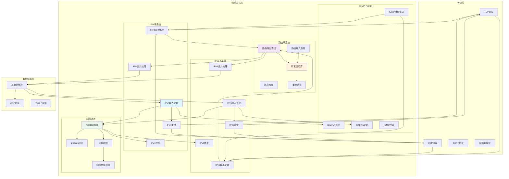
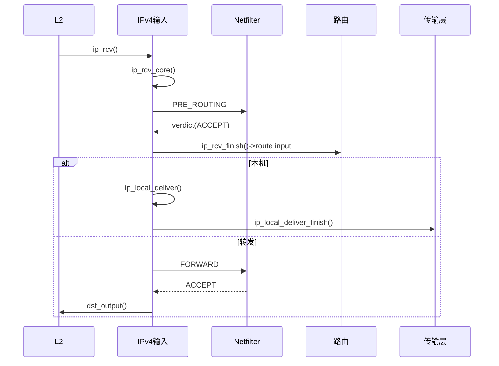
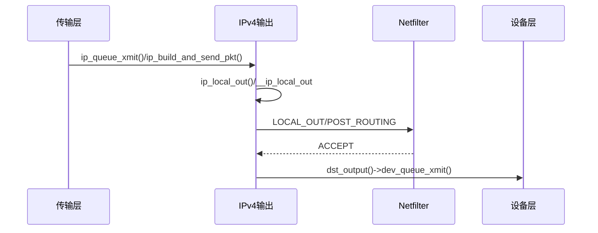
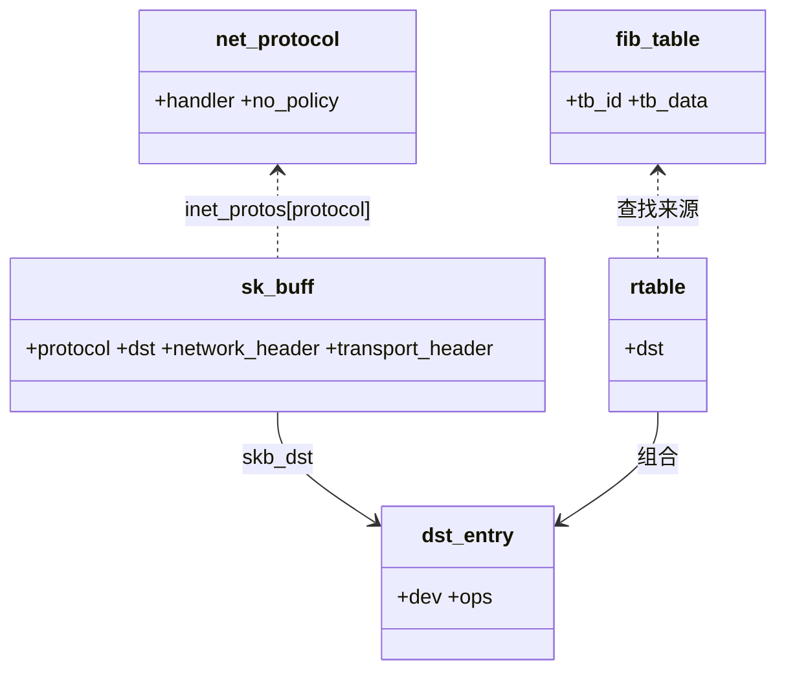

## 概述

网络层是Linux网络协议栈的核心层次，主要负责IP数据包的路由、转发、分片和重组等功能。Linux网络层的实现机制，包括IPv4/IPv6协议处理、路由子系统、ICMP协议以及各种优化策略。

<!--more-->

## 1. 网络层架构

### 1.1 网络层核心职责

Linux网络层承担以下关键功能：

- **IP数据包处理**：IPv4和IPv6数据包的收发处理
- **路由决策**：根据目标地址决定数据包的转发路径
- **分片与重组**：处理大数据包的分片和重组
- **ICMP协议**：实现网络控制消息协议
- **QoS处理**：服务质量和流量分类
- **网络地址转换**：支持NAT功能

### 1.2 网络层架构图



## 2. IPv4协议实现

### 2.1 IPv4头部结构

```c
/**
 * IPv4头部结构
 * 
 * IPv4头部是网络层数据包的核心，包含了路由、分片、
 * 服务类型等关键信息。
 */
struct iphdr {
#if defined(__LITTLE_ENDIAN_BITFIELD)
    __u8    ihl:4,      /* 头部长度(32位字为单位) */
            version:4;  /* IP版本号 */
#elif defined (__BIG_ENDIAN_BITFIELD)
    __u8    version:4,  /* IP版本号 */
            ihl:4;      /* 头部长度(32位字为单位) */
#else
#error  "Please fix <asm/byteorder.h>"
#endif
    __u8    tos;        /* 服务类型 */
    __be16  tot_len;    /* 总长度 */
    __be16  id;         /* 标识符 */
    __be16  frag_off;   /* 分片偏移 */
    __u8    ttl;        /* 生存时间 */
    __u8    protocol;   /* 协议类型 */
    __sum16 check;      /* 头部校验和 */
    __be32  saddr;      /* 源IP地址 */
    __be32  daddr;      /* 目标IP地址 */
    /* 可选字段和填充 */
};

/* IPv4分片标志位 */
#define IP_CE       0x8000      /* 拥塞标志 */
#define IP_DF       0x4000      /* 不分片标志 */
#define IP_MF       0x2000      /* 更多分片标志 */
#define IP_OFFSET   0x1FFF      /* 分片偏移掩码 */

/* IPv4服务类型字段 */
#define IPTOS_TOS_MASK      0x1E    /* TOS掩码 */
#define IPTOS_TOS(tos)      ((tos) & IPTOS_TOS_MASK)
#define IPTOS_LOWDELAY      0x10    /* 低延迟 */
#define IPTOS_THROUGHPUT    0x08    /* 高吞吐量 */
#define IPTOS_RELIABILITY   0x04    /* 高可靠性 */
#define IPTOS_MINCOST       0x02    /* 最低成本 */

/* IPv4协议号定义 */
#define IPPROTO_IP      0       /* 虚拟协议，用于表示下一个头部是IPv4 */
#define IPPROTO_ICMP    1       /* 网际控制消息协议 */
#define IPPROTO_IGMP    2       /* 网际组管理协议 */
#define IPPROTO_IPIP    4       /* IPv4隧道 */
#define IPPROTO_TCP     6       /* 传输控制协议 */
#define IPPROTO_EGP     8       /* 外部网关协议 */
#define IPPROTO_PUP     12      /* PUP协议 */
#define IPPROTO_UDP     17      /* 用户数据报协议 */
#define IPPROTO_IDP     22      /* XNS IDP协议 */
#define IPPROTO_TP      29      /* SO传输协议类4 */
#define IPPROTO_DCCP    33      /* 数据报拥塞控制协议 */
#define IPPROTO_IPV6    41      /* IPv6头部 */
#define IPPROTO_RSVP    46      /* RSVP协议 */
#define IPPROTO_GRE     47      /* 通用路由封装 */
#define IPPROTO_ESP     50      /* 封装安全有效载荷 */
#define IPPROTO_AH      51      /* 认证头部 */
#define IPPROTO_MTP     92      /* 多播传输协议 */
#define IPPROTO_BEETPH  94      /* IP选项伪头部用于BEET */
#define IPPROTO_ENCAP   98      /* 封装头部 */
#define IPPROTO_PIM     103     /* 协议独立组播 */
#define IPPROTO_COMP    108     /* 压缩头部协议 */
#define IPPROTO_SCTP    132     /* 流控制传输协议 */
#define IPPROTO_UDPLITE 136     /* UDP-Lite协议 */
#define IPPROTO_MPLS    137     /* MPLS-in-IP */
#define IPPROTO_RAW     255     /* 原始IP包 */
#define IPPROTO_MAX     256
```

### 2.2 IPv4数据包接收处理

```c
/**
 * ip_rcv - IPv4数据包接收入口函数
 * @skb: 接收到的数据包
 * @dev: 接收设备
 * @pt: 数据包类型
 * @orig_dev: 原始设备
 * 
 * IPv4协议栈的接收入口，进行基本的合法性检查
 * 返回值：NET_RX_SUCCESS表示成功，NET_RX_DROP表示丢弃
 */
int ip_rcv(struct sk_buff *skb, struct net_device *dev, 
           struct packet_type *pt, struct net_device *orig_dev)
{
    struct net *net = dev_net(dev);
    
    skb = ip_rcv_core(skb, net);
    if (skb == NULL)
        return NET_RX_DROP;
    
    return NF_HOOK(NFPROTO_IPV4, NF_INET_PRE_ROUTING,
                   net, NULL, skb, dev, NULL,
                   ip_rcv_finish);
}

/**
 * ip_rcv_core - IPv4接收核心处理
 * @skb: 数据包
 * @net: 网络命名空间
 * 
 * 执行IPv4头部的基本验证和处理
 * 返回值：处理后的数据包或NULL
 */
static struct sk_buff *ip_rcv_core(struct sk_buff *skb, struct net *net)
{
    const struct iphdr *iph;
    int drop_reason;
    u32 len;
    
    /* 数据包长度检查 */
    if (skb->len < sizeof(struct iphdr))
        goto inhdr_error;
    
    if (!pskb_may_pull(skb, sizeof(struct iphdr)))
        goto inhdr_error;
    
    iph = ip_hdr(skb);
    
    /*
     * RFC1122: 3.2.1.2 MUST silently discard any IP frame that fails the checksum.
     * RFC1122: 3.2.1.3 MUST discard a frame whose length is less than the minimum of 20 bytes.
     *
     * 基本头部验证
     */
    if (iph->ihl < 5 || iph->version != 4)
        goto inhdr_error;
    
    BUILD_BUG_ON(IPSTATS_MIB_ECT1PKTS != IPSTATS_MIB_NOECTPKTS + INET_ECN_ECT_1);
    BUILD_BUG_ON(IPSTATS_MIB_ECT0PKTS != IPSTATS_MIB_NOECTPKTS + INET_ECN_ECT_0);
    BUILD_BUG_ON(IPSTATS_MIB_CEPKTS != IPSTATS_MIB_NOECTPKTS + INET_ECN_CE);
    
    /* 更新ECN统计 */
    __IP_ADD_STATS(net, IPSTATS_MIB_INRECEIVES, 1);
    __IP_ADD_STATS(net, IPSTATS_MIB_NOECTPKTS + (iph->tos & INET_ECN_MASK), 1);
    
    if (!pskb_may_pull(skb, iph->ihl*4))
        goto inhdr_error;
    
    iph = ip_hdr(skb);
    
    /* 校验和验证 */
    if (unlikely(ip_fast_csum((u8 *)iph, iph->ihl)))
        goto csum_error;
    
    len = ntohs(iph->tot_len);
    if (skb->len < len) {
        drop_reason = SKB_DROP_REASON_PKT_TOO_SMALL;
        __IP_INC_STATS(net, IPSTATS_MIB_INTRUNCATEDPKTS);
        goto drop;
    } else if (len < (iph->ihl*4))
        goto inhdr_error;
    
    /*
     * 我们的传输媒介可能在IP包后面填充了一些字节。
     * 我们只要求传输层接收实际的IP数据，因此我们缩短数据包。
     */
    if (pskb_trim_rcsum(skb, len)) {
        __IP_INC_STATS(net, IPSTATS_MIB_INDISCARDS);
        goto drop;
    }
    
    iph = ip_hdr(skb);
    skb->transport_header = skb->network_header + iph->ihl*4;
    
    /* 移除任何调试信息或严格路由选项，它们已经处理过了 */
    if (iph->ihl > 5 && ip_rcv_options(skb, dev))
        goto drop;
    
    return skb;
    
csum_error:
    drop_reason = SKB_DROP_REASON_IP_CSUM;
    __IP_INC_STATS(net, IPSTATS_MIB_CSUMERRORS);
inhdr_error:
    if (drop_reason == SKB_DROP_REASON_NOT_SPECIFIED)
        drop_reason = SKB_DROP_REASON_IP_INHDR;
    __IP_INC_STATS(net, IPSTATS_MIB_INHDRERRORS);
drop:
    kfree_skb_reason(skb, drop_reason);
    return NULL;
}

/**
 * ip_rcv_finish - IPv4接收完成处理
 * @net: 网络命名空间
 * @sk: 套接字(通常为NULL)
 * @skb: 数据包
 * 
 * 完成IPv4数据包的接收处理，进行路由查找
 * 返回值：处理结果
 */
static int ip_rcv_finish(struct net *net, struct sock *sk, struct sk_buff *skb)
{
    struct net_device *dev = skb->dev;
    int ret;
    
    /* Initialise the virtual path cache for the packet. It describes
     * how the packet travels inside Linux networking.
     */
    if (!skb_valid_dst(skb)) {
        ret = ip_route_input_noref(skb, ip_hdr(skb)->daddr,
                                  ip_hdr(skb)->saddr,
                                  ip_hdr(skb)->tos, dev);
        if (unlikely(ret))
            goto drop_error;
    }
    
    if (unlikely(skb_dst(skb)->tclassid)) {
        struct ip_rt_acct *st = this_cpu_ptr(ip_rt_acct);
        u32 idx = skb_dst(skb)->tclassid;
        st[idx&0xFF].o_packets++;
        st[idx&0xFF].o_bytes += skb->len;
        st[(idx>>16)&0xFF].i_packets++;
        st[(idx>>16)&0xFF].i_bytes += skb->len;
    }
    
    if (iph->ihl > 5 && ip_rcv_options(skb, dev))
        return NET_RX_DROP;
    
    rt = skb_rtable(skb);
    if (rt->rt_type == RTN_MULTICAST) {
        __IP_UPD_PO_STATS(net, IPSTATS_MIB_INMCAST, skb->len);
    } else if (rt->rt_type == RTN_BROADCAST) {
        __IP_UPD_PO_STATS(net, IPSTATS_MIB_INBCAST, skb->len);
    } else if (skb->pkt_type == PACKET_BROADCAST ||
              skb->pkt_type == PACKET_MULTICAST) {
        struct in_device *in_dev = __in_dev_get_rcu(dev);
        
        /* RFC 1122 3.3.6:
         *
         *   When a host sends a datagram to a link-layer broadcast
         *   address, the IP destination address MUST be a legal IP
         *   broadcast or IP multicast address.
         *
         *   A host SHOULD silently discard a datagram that is received
         *   via a link-layer broadcast (see Section 2.4) but does not
         *   specify an IP multicast or broadcast destination address.
         *
         * This doesn't explicitly say L2 *broadcast*, but broadcast is
         * in a way a form of multicast and the most common use case for
         * this is 802.11 protecting against cross-station spoofing (the
         * so-called "hole-196" attack) so do it for both.
         */
        if (in_dev &&
            IN_DEV_ORCONF(in_dev, DROP_UNICAST_IN_L2_MULTICAST)) {
            goto drop;
        }
    }
    
    return dst_input(skb);
    
drop:
    kfree_skb(skb);
    return NET_RX_DROP;
    
drop_error:
    if (ret == -EXDEV)
        __NET_INC_STATS(net, LINUX_MIB_IPRPFILTER);
    goto drop;
}

/**
 * ip_local_deliver - 本地交付IPv4数据包
 * @skb: 数据包
 * 
 * 将IPv4数据包交付给本地协议处理程序
 * 返回值：处理结果
 */
int ip_local_deliver(struct sk_buff *skb)
{
    /*
     * 重组分片包
     */
    if (ip_is_fragment(ip_hdr(skb))) {
        if (ip_defrag(dev_net(skb->dev), skb, IP_DEFRAG_LOCAL_DELIVER))
            return 0;
    }
    
    return NF_HOOK(NFPROTO_IPV4, NF_INET_LOCAL_IN,
                   dev_net(skb->dev), NULL, skb,
                   skb->dev, NULL,
                   ip_local_deliver_finish);
}

/**
 * ip_local_deliver_finish - 完成本地交付
 * @net: 网络命名空间
 * @sk: 套接字
 * @skb: 数据包
 * 
 * 根据协议类型将数据包交付给相应的协议处理程序
 * 返回值：处理结果
 */
static int ip_local_deliver_finish(struct net *net, struct sock *sk,
                                  struct sk_buff *skb)
{
    __skb_pull(skb, skb_network_header_len(skb));
    
    rcu_read_lock();
    {
        int protocol = ip_hdr(skb)->protocol;
        const struct net_protocol *ipprot;
        int raw;
        
    resubmit:
        raw = raw_local_deliver(skb, protocol);
        
        ipprot = rcu_dereference(inet_protos[protocol]);
        if (ipprot) {
            int ret;
            
            if (!ipprot->no_policy) {
                if (!xfrm4_policy_check(NULL, XFRM_POLICY_IN, skb)) {
                    kfree_skb(skb);
                    goto out;
                }
                nf_reset_ct(skb);
            }
            ret = ipprot->handler(skb);
            if (ret < 0) {
                protocol = -ret;
                goto resubmit;
            }
            __IP_INC_STATS(net, IPSTATS_MIB_INDELIVERS);
        } else {
            if (!raw) {
                if (xfrm4_policy_check(NULL, XFRM_POLICY_IN, skb)) {
                    __IP_INC_STATS(net, IPSTATS_MIB_INUNKNOWNPROTOS);
                    icmp_send(skb, ICMP_DEST_UNREACH,
                             ICMP_PROT_UNREACH, 0);
                }
                kfree_skb(skb);
            } else {
                __IP_INC_STATS(net, IPSTATS_MIB_INDELIVERS);
                consume_skb(skb);
            }
        }
    }
out:
    rcu_read_unlock();
    
    return 0;
}
```

### 2.3 IPv4数据包发送处理

```c
/**
 * ip_queue_xmit - IPv4数据包排队发送
 * @sk: 套接字
 * @skb: 要发送的数据包
 * @fl: 流信息
 * 
 * TCP/SCTP等协议通过此函数发送IPv4数据包
 * 返回值：成功返回0，失败返回负错误码
 */
int ip_queue_xmit(struct sock *sk, struct sk_buff *skb, struct flowi *fl)
{
    struct inet_sock *inet = inet_sk(sk);
    struct net *net = sock_net(sk);
    struct ip_options_rcu *inet_opt;
    struct flowi4 *fl4;
    struct rtable *rt;
    struct iphdr *iph;
    int res;
    
    /* 跳过目标不可达的已排队数据包 */
    if (inet->pmtudisc == IP_PMTUDISC_PROBE &&
        inet->cork.length) {
        return ip_queue_mtu_discover(sk, skb);
    }
    
    rcu_read_lock();
    inet_opt = rcu_dereference(inet->inet_opt);
    fl4 = &fl->u.ip4;
    rt = skb_rtable(skb);
    if (rt)
        goto packet_routed;
    
    /* 如果没有路由，需要进行路由查找 */
    rt = ip_route_output_ports(net, fl4, sk,
                              inet->inet_daddr, inet->inet_saddr,
                              inet->inet_dport,
                              inet->inet_sport,
                              sk->sk_protocol,
                              RT_CONN_FLAGS(sk),
                              sk->sk_bound_dev_if);
    if (IS_ERR(rt))
        goto no_route;
    sk_setup_caps(sk, &rt->dst);
    
packet_routed:
    skb_dst_set_noref(skb, &rt->dst);
    
    /* 现在我们知道了路由，需要填充IP头部 */
    skb_push(skb, sizeof(struct iphdr) + (inet_opt ? inet_opt->opt.optlen : 0));
    skb_reset_network_header(skb);
    iph = ip_hdr(skb);
    *((__be16 *)iph) = htons((4 << 12) | (5 << 8) | (inet->tos & 0xff));
    if (ip_dont_fragment(sk, &rt->dst) && !skb->ignore_df)
        iph->frag_off = htons(IP_DF);
    else
        iph->frag_off = 0;
    iph->ttl      = ip_select_ttl(inet, &rt->dst);
    iph->protocol = sk->sk_protocol;
    ip_copy_addrs(iph, fl4);
    
    /* 传输层必须设置以下字段：tot_len, id */
    if (inet_opt && inet_opt->opt.optlen) {
        iph->ihl += inet_opt->opt.optlen >> 2;
        ip_options_build(skb, &inet_opt->opt, inet->inet_daddr, rt, 0);
    }
    
    ip_select_ident_segs(net, skb, sk,
                        skb_shinfo(skb)->gso_segs ?: 1);
    
    /* 添加IP头部校验和 */
    ip_send_check(iph);
    
    skb->priority = sk->sk_priority;
    skb->mark = sk->sk_mark;
    
    res = ip_local_out(net, sk, skb);
    rcu_read_unlock();
    return res;
    
no_route:
    rcu_read_unlock();
    __IP_INC_STATS(net, IPSTATS_MIB_OUTNOROUTES);
    kfree_skb(skb);
    return -EHOSTUNREACH;
}

/**
 * ip_build_and_send_pkt - 构建并发送IP数据包
 * @skb: 数据包
 * @sk: 套接字
 * @saddr: 源地址
 * @daddr: 目标地址
 * @opt: IP选项
 * @tos: 服务类型
 * @priority: 优先级
 * @mark: 标记
 * 
 * 构建完整的IP头部并发送数据包
 * 返回值：成功返回0，失败返回负错误码
 */
int ip_build_and_send_pkt(struct sk_buff *skb, const struct sock *sk,
                         __be32 saddr, __be32 daddr, struct ip_options_rcu *opt,
                         u8 tos, int priority, u32 mark)
{
    struct net *net = sock_net(sk);
    struct iphdr *iph;
    int err;
    
    /* 构建IP头部 */
    skb_push(skb, sizeof(struct iphdr) + (opt ? opt->opt.optlen : 0));
    skb_reset_network_header(skb);
    iph = ip_hdr(skb);
    iph->version  = 4;
    iph->ihl      = 5;
    iph->tos      = tos;
    iph->ttl      = ip_select_ttl(inet_sk(sk), skb_dst(skb));
    iph->daddr    = (opt && opt->opt.srr) ? opt->opt.faddr : daddr;
    iph->saddr    = saddr;
    iph->protocol = sk->sk_protocol;
    if (ip_dont_fragment(sk, skb_dst(skb))) {
        iph->frag_off = htons(IP_DF);
        iph->id = 0;
    } else {
        iph->frag_off = 0;
        __ip_select_ident(net, iph, 1);
    }
    
    if (opt && opt->opt.optlen) {
        iph->ihl += opt->opt.optlen>>2;
        ip_options_build(skb, &opt->opt, daddr, skb_rtable(skb), 0);
    }
    
    iph->tot_len = htons(skb->len);
    ip_send_check(iph);
    skb->priority = priority;
    skb->mark = mark;
    
    /* Send it out. */
    return ip_local_out(net, sk, skb);
}

/**
 * ip_send_check - 计算IP头部校验和
 * @iph: IP头部指针
 * 
 * 计算并设置IP头部的校验和字段
 */
static inline void ip_send_check(struct iphdr *iph)
{
    iph->check = 0;
    iph->check = ip_fast_csum((unsigned char *)iph, iph->ihl);
}

/**
 * ip_local_out - 本地IP数据包输出
 * @net: 网络命名空间
 * @sk: 套接字
 * @skb: 数据包
 * 
 * 本地生成的IP数据包输出处理
 * 返回值：处理结果
 */
int ip_local_out(struct net *net, struct sock *sk, struct sk_buff *skb)
{
    int err;
    
    err = __ip_local_out(net, sk, skb);
    if (likely(err == 1))
        err = dst_output(net, sk, skb);
    
    return err;
}

/**
 * __ip_local_out - 内部本地输出处理
 * @net: 网络命名空间
 * @sk: 套接字
 * @skb: 数据包
 * 
 * 执行netfilter LOCAL_OUT钩子
 * 返回值：1表示继续处理，其他值表示已处理
 */
int __ip_local_out(struct net *net, struct sock *sk, struct sk_buff *skb)
{
    struct iphdr *iph = ip_hdr(skb);
    
    iph->tot_len = htons(skb->len);
    ip_send_check(iph);
    
    /* 如果启用了GSO并且数据包长度超过MTU，跳过netfilter */
    if (skb_is_gso(skb) || 
        ((ntohs(iph->tot_len) > skb_dst(skb)->dev->mtu) && !skb_is_gso(skb)))
        return ip_fragment(net, sk, skb, skb_dst(skb)->dev->mtu,
                          ip_finish_output);
    
    return NF_HOOK_COND(NFPROTO_IPV4, NF_INET_LOCAL_OUT,
                       net, sk, skb, NULL, skb_dst(skb)->dev,
                       dst_output,
                       !(IPCB(skb)->flags & IPSKB_REROUTED));
}
```

## 3. IP分片与重组机制

### 3.1 IP分片处理

```c
/**
 * ip_fragment - IPv4数据包分片
 * @net: 网络命名空间
 * @sk: 套接字
 * @skb: 要分片的数据包
 * @mtu: 最大传输单元
 * @output: 输出函数
 * 
 * 将大的IPv4数据包分片成符合MTU要求的小包
 * 返回值：成功返回0，失败返回负错误码
 */
int ip_fragment(struct net *net, struct sock *sk, struct sk_buff *skb,
               unsigned int mtu, int (*output)(struct net *, struct sock *,
                                              struct sk_buff *))
{
    struct iphdr *iph = ip_hdr(skb);
    
    if ((iph->frag_off & htons(IP_DF)) && !skb->ignore_df) {
        __IP_INC_STATS(net, IPSTATS_MIB_FRAGFAILS);
        icmp_send(skb, ICMP_DEST_UNREACH, ICMP_FRAG_NEEDED,
                 htonl(mtu));
        kfree_skb(skb);
        return -EMSGSIZE;
    }
    
    return ip_do_fragment(net, sk, skb, output);
}

/**
 * ip_do_fragment - 执行实际的分片操作
 * @net: 网络命名空间
 * @sk: 套接字
 * @skb: 要分片的数据包
 * @output: 输出函数
 * 
 * 实际执行IPv4数据包的分片操作
 * 返回值：成功返回0，失败返回负错误码
 */
static int ip_do_fragment(struct net *net, struct sock *sk, struct sk_buff *skb,
                         int (*output)(struct net *, struct sock *, 
                                      struct sk_buff *))
{
    struct iphdr *iph;
    struct sk_buff *skb2;
    struct rtable *rt = skb_rtable(skb);
    unsigned int mtu, hlen, left, len, ll_rs;
    int offset;
    __be16 not_last_frag;
    int err = 0;
    
    iph = ip_hdr(skb);
    
    mtu = ip_skb_dst_mtu(sk, skb);
    if (IPCB(skb)->frag_max_size && IPCB(skb)->frag_max_size < mtu)
        mtu = IPCB(skb)->frag_max_size;
    
    /*
     * 设置变量。分片中的IP头部选项只出现在第一个分片中。
     */
    hlen = iph->ihl * 4;
    mtu = mtu - hlen;   /* 大小减去IP头部 */
    IPCB(skb)->flags |= IPSKB_FRAG_COMPLETE;
    ll_rs = LL_RESERVED_SPACE(rt->dst.dev);
    
    /* 当分片时，我们必须确保没有丢失CHECKSUM_PARTIAL头部 */
    if (skb->ip_summed == CHECKSUM_PARTIAL) {
        int first_len = skb_pagelen(skb);
        
        if (first_len - hlen > mtu ||
            ((first_len - hlen) & 7) ||
            ip_is_fragment(iph) ||
            skb_cloned(skb) ||
            skb_headroom(skb) < ll_rs) {
            if (skb_checksum_help(skb))
                goto fail;
        }
    }
    
    /*
     * 分片点是在8字节边界上。
     */
    left = skb->len - hlen;     /* 空间减去IP头部 */
    
    /* for bridged IP traffic encapsulated inside f.e. a vlan header,
     * we need to make room for the encapsulating header
     */
    ll_rs = LL_RESERVED_SPACE_EXTRA(rt->dst.dev, ntohs(skb->protocol));
    
    ptr = raw = skb->data;
    ptr += hlen;
    
    /*
     * 分片循环
     */
    
    bytes = (mtu - hlen) & ~7;
    if (bytes < 8) {
        __IP_INC_STATS(net, IPSTATS_MIB_FRAGFAILS);
        goto fail;
    }
    
    offset = (ntohs(iph->frag_off) & IP_OFFSET) << 3;
    not_last_frag = iph->frag_off & htons(IP_MF);
    
    /*
     * 保持分片的DF标志。
     * 
     * 这看起来违反直觉，但这样做是对的。
     * 标志位置的含义：
     * 不要分片：如果一个分片数据包有DF设置，这意味着原始数据包也有DF设置。
     */
    
    /*
     * 如果我们无法分片一个数据包，清除它的分片标志。
     * [!] 实际上我们只对从netfilter传递过来的分片数据包才这样做。
     */
    
    while (left > 0) {
        len = left;
        /* IF: 它不适合，在8字节边界上使用'mtu'。 */
        if (len > mtu)
            len = mtu;
        /* IF: 这不是最后一个分片，我们必须在8字节边界上分割。 */
        if (len < left) {
            len &= ~7;
        }
        
        /* 分配并设置控制缓冲区 */
        if ((skb2 = alloc_skb(len + hlen + ll_rs, GFP_ATOMIC)) == NULL) {
            err = -ENOMEM;
            goto fail;
        }
        
        /*
         * 为分片留下空间。
         */
        skb_reserve(skb2, ll_rs);
        skb_put(skb2, len + hlen);
        skb_reset_network_header(skb2);
        skb2->transport_header = skb2->network_header + hlen;
        
        /*
         * 收费。
         */
        if (skb->sk)
            skb_set_owner_w(skb2, skb->sk);
        
        /*
         * 复制IP头部。
         */
        skb_copy_from_linear_data(skb, skb_network_header(skb2), hlen);
        
        /*
         * 复制一个数据块。
         */
        if (skb_copy_bits(skb, ptr, skb_transport_header(skb2), len))
            BUG();
        left -= len;
        
        /*
         * 填写新分片的IP头部。
         */
        iph = ip_hdr(skb2);
        iph->frag_off = htons((offset >> 3));
        if (IPCB(skb)->flags & IPSKB_FRAG_PMTU)
            iph->frag_off |= htons(IP_DF);
        
        /* ANK: 分片的脏黑客。基本上，我们必须恢复原始头部中的frag_off位。 */
        if (offset == 0)
            iph->frag_off |= htons(IP_DF);
        
        /*
         * 如果我们正在分片一个分片，添加IP_MF标志。
         */
        if (left > 0 || not_last_frag)
            iph->frag_off |= htons(IP_MF);
        ptr += len;
        offset += len;
        
        /*
         * 给新分片加上长度和校验和。
         */
        iph->tot_len = htons(len + hlen);
        ip_send_check(iph);
        
        skb2->priority = skb->priority;
        skb2->dev = skb->dev;
        dst_set(&skb2->dst, dst_clone(&rt->dst));
        
        /* 输出分片 */
        err = output(net, sk, skb2);
        if (err)
            goto fail;
        
        __IP_INC_STATS(net, IPSTATS_MIB_FRAGCREATES);
    }
    consume_skb(skb);
    __IP_INC_STATS(net, IPSTATS_MIB_FRAGOKS);
    return err;
    
fail:
    kfree_skb(skb);
    __IP_INC_STATS(net, IPSTATS_MIB_FRAGFAILS);
    return err;
}
```

### 3.2 IP重组处理

```c
/**
 * ip_defrag - IPv4分片重组
 * @net: 网络命名空间
 * @skb: 分片数据包
 * @user: 重组用户类型
 * 
 * 将IPv4分片数据包重组成完整的数据包
 * 返回值：成功返回重组后的数据包，失败返回NULL
 */
struct sk_buff *ip_defrag(struct net *net, struct sk_buff *skb, u32 user)
{
    struct net_device *dev = skb->dev ? : skb_dst(skb)->dev;
    int vif = l3mdev_master_ifindex_rcu(dev);
    struct ipq *qp;
    
    __IP_INC_STATS(net, IPSTATS_MIB_REASMREQDS);
    skb_orphan(skb);
    
    /* 查找或创建重组队列 */
    qp = ip_find(net, ip_hdr(skb), user, vif);
    if (qp) {
        int ret;
        
        spin_lock(&qp->q.lock);
        
        ret = ip_frag_queue(qp, skb);
        
        spin_unlock(&qp->q.lock);
        ipq_put(qp);
        return ret;
    }
    
    __IP_INC_STATS(net, IPSTATS_MIB_REASMFAILS);
    kfree_skb(skb);
    return NULL;
}

/**
 * ip_find - 查找或创建IP重组队列
 * @net: 网络命名空间
 * @iph: IP头部
 * @user: 用户类型
 * @vif: 虚拟接口
 * 
 * 根据IP头部信息查找现有的重组队列或创建新的
 * 返回值：重组队列指针或NULL
 */
static struct ipq *ip_find(struct net *net, struct iphdr *iph,
                          u32 user, int vif)
{
    struct frag_v4_compare_key key = {
        .saddr = iph->saddr,
        .daddr = iph->daddr,
        .user = user,
        .vif = vif,
        .id = iph->id,
        .protocol = iph->protocol,
    };
    struct inet_frag_queue *q;
    
    q = inet_frag_find(&net->ipv4.frags, &key);
    if (!q)
        return NULL;
    
    return container_of(q, struct ipq, q);
}

/**
 * ip_frag_queue - 将分片添加到重组队列
 * @qp: 重组队列
 * @skb: 分片数据包
 * 
 * 将接收到的IP分片添加到重组队列中
 * 返回值：重组结果
 */
static int ip_frag_queue(struct ipq *qp, struct sk_buff *skb)
{
    struct net *net = container_of(qp->q.net, struct net, ipv4.frags);
    struct rb_node **rbn, *parent;
    struct sk_buff *skb1, *prev_tail;
    struct net_device *dev;
    unsigned int fragsize;
    int flags, offset;
    int ihl, end;
    int err = -ENOENT;
    u8 ecn;
    
    if (qp->q.flags & INET_FRAG_COMPLETE)
        goto err;
    
    if (!(IPCB(skb)->flags & IPSKB_FRAG_COMPLETE) &&
        unlikely(ip_frag_too_far(qp)) &&
        unlikely(err = ip_frag_reinit(qp))) {
        ipq_kill(qp);
        goto err;
    }
    
    ecn = ip4_frag_ecn(ip_hdr(skb)->tos);
    offset = ntohs(ip_hdr(skb)->frag_off);
    flags = offset & ~IP_OFFSET;
    offset &= IP_OFFSET;
    offset <<= 3;       /* offset is in 8-byte chunks */
    ihl = ip_hdrlen(skb);
    
    /* 确定分片在原始数据包中的位置。 */
    end = offset + skb->len - skb_network_offset(skb) - ihl;
    err = -EINVAL;
    
    /* 这是最后一个分片吗？ */
    if ((flags & IP_MF) == 0) {
        /* 如果我们已经有最后一个分片的长度... */
        if (qp->q.flags & INET_FRAG_LAST_IN) {
            if (end != qp->q.len)
                goto err;
        } else {
            qp->q.flags |= INET_FRAG_LAST_IN;
            qp->q.len = end;
        }
    } else {
        if (end & 7) {
            end &= ~7;
            if (skb->ip_summed != CHECKSUM_UNNECESSARY)
                skb->ip_summed = CHECKSUM_NONE;
        }
        if (end > qp->q.len) {
            if (qp->q.flags & INET_FRAG_LAST_IN)
                goto err;
            qp->q.len = end;
        }
    }
    
    if (end == offset)
        goto err;
    
    err = -ENOMEM;
    if (!pskb_pull(skb, skb_network_offset(skb) + ihl))
        goto err;
    
    err = pskb_trim_rcsum(skb, end - offset);
    if (err)
        goto err;
    
    /* 注意: skb->sk可以在早期分裂中传递给我们 */
    skb->dev = dev;
    IPCB(skb)->ecn = ecn;
    
    /* 添加到队列按偏移顺序插入 */
    err = -ENOMEM;
    
    fragsize = skb->len + ihl;
    
    /* 更新统计信息 */
    qp->q.stamp = skb->tstamp;
    qp->q.meat += fragsize;
    qp->ecn |= ecn;
    add_frag_mem_limit(qp->q.net, fragsize);
    if (offset == 0)
        qp->q.flags |= INET_FRAG_FIRST_IN;
    
    fragsize -= ihl;
    if (fragsize > 0)
        add_frag_mem_limit(qp->q.net, fragsize);
    
    if (qp->q.flags == (INET_FRAG_FIRST_IN | INET_FRAG_LAST_IN) &&
        qp->q.meat == qp->q.len) {
        unsigned long orefdst = skb->_skb_refdst;
        
        skb->_skb_refdst = 0UL;
        err = ip_frag_reasm(qp, skb, dev);
        skb->_skb_refdst = orefdst;
        if (err)
            inet_frag_kill(&qp->q);
        return err;
    }
    
    skb_dst_drop(skb);
    return -EINPROGRESS;
    
err:
    kfree_skb(skb);
    return err;
}

/**
 * ip_frag_reasm - 重组完整的IP数据包
 * @qp: 重组队列
 * @skb: 当前分片
 * @dev: 网络设备
 * 
 * 将所有分片重组成完整的IP数据包
 * 返回值：重组后的数据包
 */
static struct sk_buff *ip_frag_reasm(struct ipq *qp, struct sk_buff *skb,
                                    struct net_device *dev)
{
    struct net *net = container_of(qp->q.net, struct net, ipv4.frags);
    struct iphdr *iph;
    struct sk_buff *fp, *head = skb_rb_first(&qp->q.rb_fragments);
    struct sk_buff **nextp;
    struct rb_node *rbn;
    int len;
    int ihlen;
    int err;
    
    ipq_kill(qp);
    
    BUG_ON(!head);
    BUG_ON(FRAG_CB(head)->offset != 0);
    
    /* 解决偏差问题。 */
    ihlen = ip_hdrlen(head);
    len = ihlen + qp->q.len;
    
    err = -E2BIG;
    if (len > 65535)
        goto out_oversize;
    
    /* 头部 + 分片 = 完整数据包 */
    fp = head;
    
    /* 确保我们有空间容纳完整数据包 */
    err = pskb_expand_head(head, 0, 0, GFP_ATOMIC);
    if (err)
        goto out_nomem;
    
    /* 将所有分片连接在一起 */
    nextp = &head->next;
    rbn = rb_next(&head->rbnode);
    rb_erase(&head->rbnode, &qp->q.rb_fragments);
    while (rbn || nextp != &head->next) {
        /* 获取下一个分片 */
        if (rbn) {
            struct sk_buff *skb2 = rb_to_skb(rbn);
            rb_erase(&skb2->rbnode, &qp->q.rb_fragments);
            rbn = rb_next(rbn);
            *nextp = skb2;
            nextp = &skb2->next;
            skb2->next = NULL;
            skb2->prev = NULL;
        }
    }
    
    sub_frag_mem_limit(qp->q.net, head->truesize);
    
    head->ignore_df |= qp->q.flags & INET_FRAG_COMPLETE;
    head->next = NULL;
    head->prev = NULL;
    head->dev = dev;
    head->tstamp = qp->q.stamp;
    IPCB(head)->frag_max_size = max(qp->max_orig_len, qp->q.max_size);
    
    iph = ip_hdr(head);
    iph->tot_len = htons(len);
    iph->tos |= qp->ecn;
    
    /* 当我们遇到中间分片，我们必须计算校验和增量。 */
    if (IPCB(head)->flags & IPSKB_FRAG_COMPLETE)
        skb_postpull_rcsum(head, skb_network_header(head), ihlen);
    
    qp->q.rb_fragments = RB_ROOT;
    qp->q.fragments_tail = NULL;
    qp->q.last_run_head = NULL;
    
    return head;
    
out_nomem:
    net_dbg_ratelimited("queue_glue: no memory for gluing queue %p\n", qp);
    err = -ENOMEM;
    goto out_fail;
out_oversize:
    net_info_ratelimited("Oversized IP packet from %pI4\n", &qp->saddr);
out_fail:
    __IP_INC_STATS(net, IPSTATS_MIB_REASMFAILS);
    return NULL;
}
```

## 4. 路由子系统详解

### 4.1 路由表结构

```c
/**
 * fib_table - IPv4转发信息库表
 */
struct fib_table {
    struct hlist_node   tb_hlist;   /* 哈希表节点 */
    u32                 tb_id;      /* 路由表ID */
    int                 tb_num_default; /* 默认路由数量 */
    struct rcu_head     rcu;        /* RCU头部 */
    unsigned long       *tb_data;   /* 路由表数据 */
};
```

### 4.2 路由查找算法

路由查找是网络层的核心功能，Linux使用LPC-trie算法实现高效的路由查找。

## 5. ICMP协议实现

ICMP协议用于在IP网络中发送控制消息和错误报告。

### 5.1 ICMP消息处理

```c
/**
 * icmp_send - 发送ICMP错误消息
 * @skb_in: 引发错误的数据包
 * @type: ICMP消息类型
 * @code: ICMP代码  
 * @info: 附加信息
 */
void __icmp_send(struct sk_buff *skb_in, int type, int code, __be32 info,
                const struct ip_options *opt)
{
    struct iphdr *iph;
    struct icmp_bxm icmp_param;
    struct rtable *rt = skb_rtable(skb_in);
    struct net *net;
    
    if (!rt)
        goto out;
    net = dev_net(rt->dst.dev);
    
    /* 构造ICMP消息并发送 */
    icmp_param.data.icmph.type = type;
    icmp_param.data.icmph.code = code;
    icmp_param.data.icmph.un.gateway = info;
    
    icmp_push_reply(&icmp_param, &fl4, &ipc, &rt);
out:;
}
```

## 6. 性能优化要点

- **路由缓存**：缓存常用路由减少查找开销
- **批量处理**：批量处理数据包提高效率  
- **预分配内存**：减少内存分配开销
- **CPU亲和性**：绑定网络处理到特定CPU

## 7. 关键函数与调用链/时序图/结构体关系

### 7.1 关键函数核心代码与功能说明

```c
/* 接收路径 */
int ip_rcv(struct sk_buff *skb, struct net_device *dev,
           struct packet_type *pt, struct net_device *orig_dev);
static struct sk_buff *ip_rcv_core(struct sk_buff *skb, struct net *net);
static int ip_rcv_finish(struct net *net, struct sock *sk, struct sk_buff *skb);
int ip_local_deliver(struct sk_buff *skb);
static int ip_local_deliver_finish(struct net *net, struct sock *sk,
                                  struct sk_buff *skb);

/* 发送路径 */
int ip_queue_xmit(struct sock *sk, struct sk_buff *skb, struct flowi *fl);
int ip_build_and_send_pkt(struct sk_buff *skb, const struct sock *sk,
                         __be32 saddr, __be32 daddr, struct ip_options_rcu *opt,
                         u8 tos, int priority, u32 mark);
int ip_local_out(struct net *net, struct sock *sk, struct sk_buff *skb);
int __ip_local_out(struct net *net, struct sock *sk, struct sk_buff *skb);

/* 分片与重组 */
int ip_fragment(struct net *net, struct sock *sk, struct sk_buff *skb,
               unsigned int mtu, int (*output)(struct net *, struct sock *, struct sk_buff *));
struct sk_buff *ip_defrag(struct net *net, struct sk_buff *skb, u32 user);
```

- 功能说明
  - `ip_rcv/ip_rcv_core/ip_rcv_finish`：接收入口、合法性校验/ECN/长度/校验和、路由输入与下一步分发。
  - `ip_local_deliver/_finish`：本地交付路径，按协议 `inet_protos[protocol]` 调度到 TCP/UDP/ICMP。
  - `ip_queue_xmit/ip_build_and_send_pkt`：构造或补全IP头、路由输出、PMTU/DF处理，交由 `ip_local_out`。
  - `ip_local_out/__ip_local_out`：LOCAL_OUT 钩子/分片/接力到 `dst_output` 与设备层。
  - `ip_fragment/ip_defrag`：按MTU分片、在接收侧基于frag队列重组。

### 7.2 关键函数调用链

- 接收（本机）
  - 驱动`poll` -> `napi_gro_receive` -> `netif_receive_skb` -> `ip_rcv` -> `NF_INET_PRE_ROUTING` -> `ip_rcv_finish`(route input) -> `ip_local_deliver` -> `ip_local_deliver_finish` -> `tcp_v4_rcv`/`__udp4_lib_rcv`/`icmp_rcv`

- 转发
  - `ip_rcv` -> `PRE_ROUTING` -> `ip_rcv_finish`(route input) -> `FORWARD` -> `dst_output` -> 设备发送

- 发送（本机）
  - `tcp_transmit_skb`/`udp_sendmsg` -> `ip_queue_xmit` -> `ip_local_out` -> `LOCAL_OUT` -> `POST_ROUTING` -> `dst_output` -> `dev_queue_xmit`

- 分片/重组
  - 发送分片：`__ip_local_out` 检查大小 -> `ip_fragment`/`ip_do_fragment` -> `output`
  - 接收重组：`ip_local_deliver` 检测 `ip_is_fragment` -> `ip_defrag` -> 重组完成后继续本地交付

### 7.3 网络层典型时序图（接收/发送/转发）





### 7.4 关键结构体关系图（路由/目的/协议分发）


