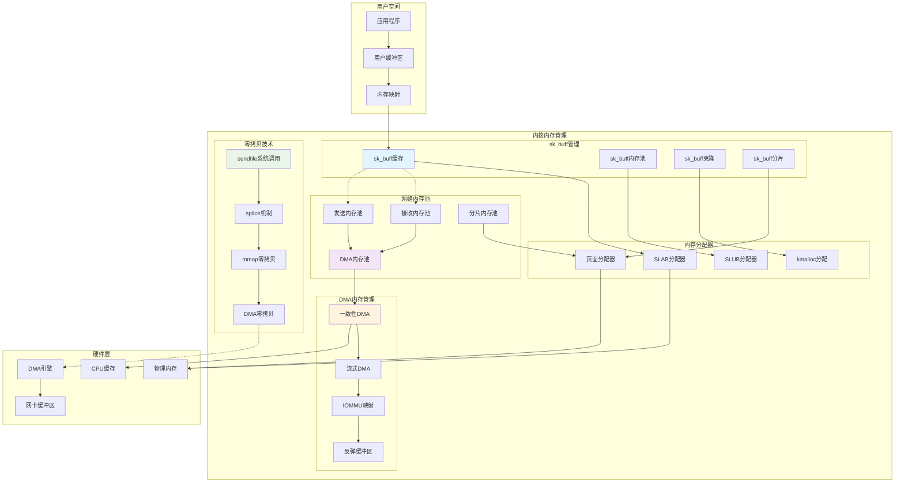

## 概述

网络内存管理是Linux网络栈性能的关键因素，它直接影响网络吞吐量和延迟。Linux网络内存管理的完整机制，包括sk_buff分配器、内存池管理、零拷贝技术以及各种内存优化策略。

<!--more-->

## 1. 网络内存管理架构

### 1.1 网络内存管理的挑战

高性能网络处理对内存管理提出了严格要求：

- **高频分配释放**：网络包的快速分配和释放
- **内存碎片控制**：避免内存碎片影响性能
- **缓存局部性**：优化CPU缓存访问模式
- **零拷贝技术**：减少数据拷贝开销
- **DMA一致性**：保证DMA内存的一致性

### 1.2 网络内存管理架构图



## 2. sk_buff内存管理详解

### 2.1 sk_buff分配器实现

```c
/**
 * skbuff_cache_init - 初始化sk_buff缓存
 * 
 * 在系统启动时初始化sk_buff的SLAB缓存
 */
void __init skb_init(void)
{
    /* 创建sk_buff头部缓存 */
    skbuff_head_cache = kmem_cache_create_usercopy("skbuff_head_cache",
                                                  sizeof(struct sk_buff),
                                                  0,
                                                  SLAB_HWCACHE_ALIGN|SLAB_PANIC,
                                                  offsetof(struct sk_buff, cb),
                                                  sizeof_field(struct sk_buff, cb),
                                                  NULL);
    
    /* 创建sk_buff fclone缓存 */
    skbuff_fclone_cache = kmem_cache_create("skbuff_fclone_cache",
                                           sizeof(struct sk_buff_fclones),
                                           0,
                                           SLAB_HWCACHE_ALIGN|SLAB_PANIC,
                                           NULL);
    
    /* 创建共享信息缓存 */
    skbuff_ext_cache = kmem_cache_create("skbuff_ext_cache",
                                        SKB_EXT_ALIGN_VALUE,
                                        0,
                                        SLAB_HWCACHE_ALIGN|SLAB_PANIC,
                                        NULL);
}

/**
 * __netdev_alloc_skb - 网络设备分配sk_buff
 * @dev: 网络设备
 * @len: 数据长度
 * @gfp_mask: 分配标志
 * 
 * 为网络设备分配sk_buff，优化了分配路径
 * 返回值：分配的sk_buff或NULL
 */
struct sk_buff *__netdev_alloc_skb(struct net_device *dev, unsigned int len,
                                  gfp_t gfp_mask)
{
    struct page_frag_cache *nc;
    struct sk_buff *skb;
    bool pfmemalloc;
    void *data;
    
    len += NET_SKB_PAD;
    
    /* 对于小包，尝试使用per-CPU缓存 */
    if ((len <= SKB_WITH_OVERHEAD(1024)) &&
        (gfp_mask & (__GFP_DIRECT_RECLAIM | GFP_DMA)) == __GFP_DIRECT_RECLAIM &&
        !pfmemalloc_match(skb)) {
        
        len = SKB_DATA_ALIGN(len);
        len += SKB_DATA_ALIGN(sizeof(struct skb_shared_info));
        
        local_irq_disable();
        nc = this_cpu_ptr(&netdev_alloc_cache);
        data = page_frag_alloc(nc, len, gfp_mask);
        pfmemalloc = nc->pfmemalloc;
        local_irq_enable();
        
        if (likely(data)) {
            skb = __build_skb_around(skb, data, len);
            if (unlikely(!skb))
                skb_free_frag(data);
            else if (pfmemalloc)
                skb->pfmemalloc = 1;
        }
    } else {
        skb = __alloc_skb(len, gfp_mask, SKB_ALLOC_RX, NUMA_NO_NODE);
    }
    
    if (likely(skb)) {
        skb_reserve(skb, NET_SKB_PAD);
        skb->dev = dev;
    }
    
    return skb;
}

/**
 * __build_skb_around - 在已有内存基础上构建sk_buff
 * @skb: sk_buff结构指针
 * @data: 数据缓冲区
 * @frag_size: 分片大小
 * 
 * 在预分配的内存上构建sk_buff，减少分配开销
 * 返回值：构建的sk_buff指针
 */
static struct sk_buff *__build_skb_around(struct sk_buff *skb,
                                         void *data, unsigned int frag_size)
{
    struct skb_shared_info *shinfo;
    unsigned int size = frag_size ? : ksize(data);
    
    size -= SKB_DATA_ALIGN(sizeof(struct skb_shared_info));
    
    /* 初始化sk_buff */
    memset(skb, 0, offsetof(struct sk_buff, tail));
    skb->truesize = SKB_TRUESIZE(size);
    refcount_set(&skb->users, 1);
    skb->head = data;
    skb->data = data;
    skb_reset_tail_pointer(skb);
    skb->end = skb->tail + size;
    skb->mac_header = (typeof(skb->mac_header))~0U;
    skb->transport_header = (typeof(skb->transport_header))~0U;
    
    /* 初始化共享信息 */
    shinfo = skb_shinfo(skb);
    memset(shinfo, 0, offsetof(struct skb_shared_info, dataref));
    atomic_set(&shinfo->dataref, 1);
    
    return skb;
}

/**
 * napi_alloc_skb - NAPI上下文中分配sk_buff
 * @napi: NAPI结构
 * @len: 数据长度
 * 
 * 在NAPI轮询上下文中分配sk_buff，使用优化的分配路径
 * 返回值：分配的sk_buff或NULL
 */
struct sk_buff *napi_alloc_skb(struct napi_struct *napi, unsigned int len)
{
    gfp_t gfp_mask = (GFP_ATOMIC | __GFP_NOWARN);
    struct napi_alloc_cache *nc;
    struct sk_buff *skb;
    bool pfmemalloc;
    void *data;
    
    len += NET_SKB_PAD + NET_IP_ALIGN;
    
    /* 对于小包，使用NAPI本地缓存 */
    if ((len <= SKB_WITH_OVERHEAD(1024))) {
        len = SKB_DATA_ALIGN(len);
        len += SKB_DATA_ALIGN(sizeof(struct skb_shared_info));
        
        nc = this_cpu_ptr(&napi_alloc_cache);
        
        if (sk_memalloc_socks())
            gfp_mask |= __GFP_MEMALLOC;
        
        data = page_frag_alloc(&nc->page, len, gfp_mask);
        pfmemalloc = nc->page.pfmemalloc;
        
        if (unlikely(!data))
            return NULL;
        
        skb = __napi_build_skb(data, len);
        if (unlikely(!skb)) {
            skb_free_frag(data);
            return NULL;
        }
        
        if (pfmemalloc)
            skb->pfmemalloc = 1;
        skb->head_frag = 1;
    } else {
        skb = __alloc_skb(len, gfp_mask, SKB_ALLOC_RX, NUMA_NO_NODE);
    }
    
    if (likely(skb)) {
        skb_reserve(skb, NET_SKB_PAD + NET_IP_ALIGN);
        skb->dev = napi->dev;
    }
    
    return skb;
}
```

### 2.2 sk_buff内存回收

```c
/**
 * __kfree_skb - 释放sk_buff
 * @skb: 要释放的sk_buff
 * 
 * sk_buff释放的核心函数，处理引用计数和内存回收
 */
void __kfree_skb(struct sk_buff *skb)
{
    skb_release_all(skb);
    kfree_skbmem(skb);
}

/**
 * skb_release_all - 释放sk_buff的所有资源
 * @skb: sk_buff指针
 * 
 * 释放sk_buff相关的所有资源，包括数据、头部、析构函数等
 */
static void skb_release_all(struct sk_buff *skb)
{
    skb_release_head_state(skb);
    if (likely(skb->head))
        skb_release_data(skb);
}

/**
 * skb_release_data - 释放sk_buff数据缓冲区
 * @skb: sk_buff指针
 * 
 * 处理sk_buff数据缓冲区的释放，包括共享数据的引用计数管理
 */
static void skb_release_data(struct sk_buff *skb)
{
    struct skb_shared_info *shinfo = skb_shinfo(skb);
    int i;
    
    if (skb->cloned &&
        atomic_sub_return(skb->nohdr ? (1 << SKB_DATAREF_SHIFT) + 1 : 1,
                         &shinfo->dataref))
        goto exit;
    
    skb_zcopy_clear(skb, true);
    
    for (i = 0; i < shinfo->nr_frags; i++)
        __skb_frag_unref(&shinfo->frags[i], skb->pp_recycle);
    
    if (shinfo->frag_list)
        kfree_skb_list(shinfo->frag_list);
    
    skb_free_head(skb);
exit:
    /* 当我们克隆skb时，我们也会克隆共享区域。对于克隆，
     * 原始skb可能在skb_release_data()之前释放。
     */
    if (skb->cloned)
        return;
}

/**
 * skb_free_head - 释放sk_buff头部
 * @skb: sk_buff指针
 * 
 * 根据分配方式释放sk_buff的头部内存
 */
static void skb_free_head(struct sk_buff *skb)
{
    unsigned char *head = skb->head;
    
    if (skb->head_frag) {
        if (skb_pp_recycle(skb, head))
            return;
        skb_free_frag(head);
    } else {
        kfree(head);
    }
}

/**
 * consume_skb - 正常消费sk_buff
 * @skb: 要消费的sk_buff
 * 
 * 正常情况下的sk_buff消费，与kfree_skb不同，
 * 这表示正常的数据包处理完成
 */
void consume_skb(struct sk_buff *skb)
{
    if (!skb_unref(skb))
        return;
    
    trace_consume_skb(skb);
    __kfree_skb(skb);
}

/**
 * skb_recycle - 回收sk_buff到内存池
 * @skb: 要回收的sk_buff
 * 
 * 将sk_buff回收到内存池中，避免频繁的分配释放
 */
void skb_recycle(struct sk_buff *skb)
{
    struct skb_shared_info *shinfo;
    
    if (irqs_disabled() || skb_shinfo(skb)->tx_flags & SKBTX_DEV_ZEROCOPY ||
        skb_shinfo(skb)->nr_frags || skb_has_frag_list(skb) ||
        skb_cloned(skb) || skb_is_nonlinear(skb))
        goto drop;
    
    shinfo = skb_shinfo(skb);
    memset(shinfo, 0, offsetof(struct skb_shared_info, dataref));
    atomic_set(&shinfo->dataref, 1);
    
    memset(skb, 0, offsetof(struct sk_buff, tail));
    skb->data = skb->head + NET_SKB_PAD;
    skb_reset_tail_pointer(skb);
    
    /* 回收到per-CPU缓存 */
    if (likely(__skb_recycle(skb)))
        return;
    
drop:
    __kfree_skb(skb);
}
```

## 3. 网络内存池管理

### 3.1 页面分片分配器

```c
/**
 * page_frag_cache - 页面分片缓存
 * 
 * 用于高效分配小块网络内存的页面分片缓存
 */
struct page_frag_cache {
    void *va;                   /* 虚拟地址 */
#if (PAGE_SIZE < PAGE_FRAG_CACHE_MAX_SIZE)
    __u16 offset;               /* 当前偏移 */
    __u16 size;                 /* 可用大小 */
#else
    __u32 offset;
    __u32 size;
#endif
    /* 我们保持一个pagecount偏移，所以我们可以使用原子操作
     * 来跟踪多少人正在使用这个页面分片。
     * 我们可以使用这个而不是_refcount，因为我们永远不会
     * 需要引用计数超过INT_MAX的数量，并且这减少了
     * 更新参考计数时的竞争。
     */
    unsigned int            pagecnt_bias;
    bool                    pfmemalloc;
};

/**
 * page_frag_alloc - 从页面分片缓存分配内存
 * @nc: 页面分片缓存
 * @fragsz: 分片大小
 * @gfp_mask: 分配标志
 * 
 * 从页面分片缓存中分配指定大小的内存
 * 返回值：分配的内存指针或NULL
 */
void *page_frag_alloc(struct page_frag_cache *nc,
                     unsigned int fragsz, gfp_t gfp_mask)
{
    unsigned int size = PAGE_SIZE;
    struct page *page;
    int offset;
    
    if (unlikely(!nc->va)) {
refill:
        page = __page_frag_cache_refill(nc, gfp_mask);
        if (!page)
            return NULL;
        
#if (PAGE_SIZE < PAGE_FRAG_CACHE_MAX_SIZE)
        /* 重置偏移到页面末尾 */
        nc->offset = size;
#else
        nc->offset = PAGE_SIZE;
#endif
    }
    
    offset = nc->offset - fragsz;
    if (unlikely(offset < 0)) {
        page = virt_to_page(nc->va);
        
        if (!page_ref_sub_and_test(page, nc->pagecnt_bias))
            goto refill;
        
        if (unlikely(nc->pfmemalloc)) {
            free_the_page(page, compound_order(page));
            goto refill;
        }
        
#if (PAGE_SIZE < PAGE_FRAG_CACHE_MAX_SIZE)
        /* 如果大小变化了，我们还需要改变pagecnt_bias */
        size = nc->size;
#endif
        nc->pagecnt_bias = PAGE_FRAG_CACHE_MAX_SIZE + 1;
        nc->offset = size;
        
        offset = size - fragsz;
        if (unlikely(offset < 0)) {
            /*
             * 页面分片缓存可能包含一个比PAGE_SIZE小的页面，
             * 所以我们需要重新填充
             */
            goto refill;
        }
    }
    
    nc->pagecnt_bias--;
    nc->offset = offset;
    
    return nc->va + offset;
}

/**
 * __page_frag_cache_refill - 重新填充页面分片缓存
 * @nc: 页面分片缓存
 * @gfp_mask: 分配标志
 * 
 * 为页面分片缓存分配新的页面
 * 返回值：分配的页面或NULL
 */
static struct page *__page_frag_cache_refill(struct page_frag_cache *nc,
                                            gfp_t gfp_mask)
{
    struct page *page = NULL;
    gfp_t gfp = gfp_mask;
    
#if (PAGE_SIZE < PAGE_FRAG_CACHE_MAX_SIZE)
    gfp_mask = (gfp_mask & ~__GFP_DIRECT_RECLAIM) | __GFP_COMP |
               __GFP_NOWARN | __GFP_NORETRY | __GFP_NOMEMALLOC;
    page = alloc_pages_node(NUMA_NO_NODE, gfp_mask,
                           PAGE_FRAG_CACHE_MAX_ORDER);
    nc->size = page ? PAGE_FRAG_CACHE_MAX_SIZE : PAGE_SIZE;
#endif
    if (unlikely(!page))
        page = alloc_pages_node(NUMA_NO_NODE, gfp, 0);
    
    nc->va = page ? page_address(page) : NULL;
    
    return page;
}
```

### 3.2 网络设备内存池

```c
/**
 * netdev_alloc_cache - 网络设备分配缓存
 * 
 * 每CPU的网络设备内存分配缓存，用于提高分配效率
 */
static DEFINE_PER_CPU(struct page_frag_cache, netdev_alloc_cache);
static DEFINE_PER_CPU(struct napi_alloc_cache, napi_alloc_cache);

/**
 * napi_alloc_cache - NAPI分配缓存
 */
struct napi_alloc_cache {
    struct page_frag_cache page;    /* 页面分片缓存 */
    unsigned int skb_count;         /* sk_buff计数 */
    void *skb_cache[NAPI_SKB_CACHE_SIZE]; /* sk_buff缓存数组 */
};

/**
 * napi_consume_skb - NAPI上下文中消费sk_buff
 * @skb: 要消费的sk_buff
 * @budget: 预算值
 * 
 * 在NAPI上下文中释放sk_buff，可能回收到本地缓存
 */
void napi_consume_skb(struct sk_buff *skb, int budget)
{
    /* 零拷贝skb和克隆skb不能被缓存 */
    if (unlikely(!skb || !budget))
        return consume_skb(skb);
    
    if (unlikely(irqs_disabled() != (budget == 0)))
        return consume_skb(skb);
    
    if (unlikely(skb_unref(skb))) {
        struct napi_alloc_cache *nc = this_cpu_ptr(&napi_alloc_cache);
        
        /* skb->head 是从页面池分配的，尝试回收 */
        if (skb->head_frag && !skb->pfmemalloc &&
            nc->skb_count < ARRAY_SIZE(nc->skb_cache) &&
            !skb_cloned(skb) && !skb_is_nonlinear(skb) &&
            !skb_has_frag_list(skb) && !skb_has_extensions(skb)) {
            
            nc->skb_cache[nc->skb_count++] = skb->head;
            skb->head = NULL;
        }
        __kfree_skb(skb);
    }
}

/**
 * __napi_build_skb - NAPI构建sk_buff
 * @data: 数据缓冲区
 * @frag_size: 分片大小
 * 
 * 在NAPI上下文中构建sk_buff
 * 返回值：构建的sk_buff
 */
static struct sk_buff *__napi_build_skb(void *data, unsigned int frag_size)
{
    struct sk_buff *skb;
    
    skb = napi_skb_cache_get();
    if (unlikely(!skb))
        return NULL;
    
    skb = __build_skb_around(skb, data, frag_size);
    
    return skb;
}

/**
 * napi_skb_cache_get - 从NAPI缓存获取sk_buff
 * 
 * 从per-CPU NAPI缓存中获取预分配的sk_buff
 * 返回值：缓存的sk_buff或NULL
 */
static struct sk_buff *napi_skb_cache_get(void)
{
    struct napi_alloc_cache *nc = this_cpu_ptr(&napi_alloc_cache);
    struct sk_buff *skb;
    
    if (unlikely(!nc->skb_count)) {
        nc->skb_count = kmem_cache_alloc_bulk(skbuff_head_cache,
                                             GFP_ATOMIC,
                                             NAPI_SKB_CACHE_BULK,
                                             nc->skb_cache);
        if (unlikely(!nc->skb_count))
            return NULL;
    }
    
    skb = nc->skb_cache[--nc->skb_count];
    kasan_unpoison_object_data(skbuff_head_cache, skb);
    
    return skb;
}
```

## 4. 零拷贝技术实现

### 4.1 sendfile零拷贝

```c
/**
 * do_sendfile - sendfile系统调用实现
 * @out_fd: 输出文件描述符
 * @in_fd: 输入文件描述符
 * @ppos: 位置指针
 * @count: 传输字节数
 * @max: 最大传输字节数
 * 
 * sendfile的核心实现，实现零拷贝文件传输
 * 返回值：传输的字节数或错误码
 */
static ssize_t do_sendfile(int out_fd, int in_fd, loff_t *ppos,
                          size_t count, loff_t max)
{
    struct fd in, out;
    struct inode *in_inode, *out_inode;
    struct pipe_inode_info *opipe;
    loff_t pos;
    loff_t out_pos;
    ssize_t retval;
    int fl;
    
    /*
     * 获取文件描述符
     */
    retval = -EBADF;
    in = fdget(in_fd);
    if (!in.file)
        goto out;
    
    if (!(in.file->f_mode & FMODE_READ))
        goto fput_in;
    
    retval = -ESPIPE;
    if (!ppos) {
        pos = in.file->f_pos;
    } else {
        pos = *ppos;
        if (!(in.file->f_mode & FMODE_PREAD))
            goto fput_in;
    }
    retval = rw_verify_area(READ, in.file, &pos, count);
    if (retval < 0)
        goto fput_in;
    if (count > MAX_RW_COUNT)
        count = MAX_RW_COUNT;
    
    /*
     * 获取输出文件
     */
    retval = -EBADF;
    out = fdget(out_fd);
    if (!out.file)
        goto fput_in;
    
    if (!(out.file->f_mode & FMODE_WRITE))
        goto fput_out;
    
    in_inode = file_inode(in.file);
    out_inode = file_inode(out.file);
    out_pos = out.file->f_pos;
    
    if (!max)
        max = min(in_inode->i_sb->s_maxbytes, out_inode->i_sb->s_maxbytes);
    
    if (unlikely(pos + count > max)) {
        retval = -EOVERFLOW;
        if (pos >= max)
            goto fput_out;
        count = max - pos;
    }
    
    fl = 0;
#if 0
    /*
     * 目前我们需要非阻塞的sendfile()的FMODE_NOWAIT，
     * 如果文件有支持，我们可以设置SPLICE_F_NONBLOCK。
     */
    if ((in.file->f_flags | out.file->f_flags) & O_NONBLOCK)
        fl = SPLICE_F_NONBLOCK;
#endif
    opipe = get_pipe_info(out.file, true);
    if (!opipe) {
        retval = -EINVAL;
        goto fput_out;
    }
    
    /*
     * 对于套接字输出，我们使用特殊的splice_to_socket
     */
    if (out.file->f_op->splice_write == splice_to_socket) {
        retval = splice_file_to_socket(in.file, out.file, &pos, count, fl);
    } else {
        retval = do_splice_direct(in.file, &pos, out.file, &out_pos,
                                 count, fl);
    }
    
    if (retval > 0) {
        add_rchar(current, retval);
        add_wchar(current, retval);
        fsnotify_access(in.file);
        fsnotify_modify(out.file);
        out.file->f_pos = out_pos;
        if (ppos)
            *ppos = pos;
        else
            in.file->f_pos = pos;
    }
    
    inc_syscr(current);
    inc_syscw(current);
    if (pos > max)
        retval = -EOVERFLOW;
    
fput_out:
    fdput(out);
fput_in:
    fdput(in);
out:
    return retval;
}

/**
 * splice_to_socket - splice到套接字
 * @pipe: 管道
 * @out: 输出文件
 * @ppos: 位置
 * @len: 长度
 * @flags: 标志
 * 
 * 将数据从管道splice到套接字，实现零拷贝
 * 返回值：传输字节数或错误码
 */
static long splice_to_socket(struct pipe_inode_info *pipe, struct file *out,
                           loff_t *ppos, size_t len, unsigned int flags)
{
    struct socket *sock = sock_from_file(out);
    const struct proto_ops *ops;
    struct msghdr msg = {};
    struct splice_pipe_desc spd = {
        .pages = pages,
        .nr_pages_max = PIPE_DEF_BUFFERS,
        .ops = &nosteal_pipe_buf_ops,
        .spd_release = splice_sock_release,
    };
    long ret;
    
    if (unlikely(!sock))
        return -ENOTSOCK;
    
    ops = sock->ops;
    if (unlikely(!ops->sendmsg))
        return -EINVAL;
    
    msg.msg_flags = MSG_SPLICE_PAGES;
    if (flags & SPLICE_F_NONBLOCK)
        msg.msg_flags |= MSG_DONTWAIT;
    if (flags & SPLICE_F_MORE)
        msg.msg_flags |= MSG_MORE;
    
    ret = splice_from_pipe(pipe, out, ppos, len, flags, sock_splice_actor);
    if (ret > 0) {
        sock_update_sent_stats(sock, ret);
    }
    
    return ret;
}
```

### 4.2 mmap零拷贝

```c
/**
 * packet_mmap - 数据包套接字内存映射
 * @file: 文件结构
 * @sock: 套接字
 * @vma: 虚拟内存区域
 * 
 * 实现数据包套接字的内存映射，支持零拷贝数据包捕获
 * 返回值：映射结果
 */
static int packet_mmap(struct file *file, struct socket *sock,
                      struct vm_area_struct *vma)
{
    struct sock *sk = sock->sk;
    struct packet_sock *po = pkt_sk(sk);
    unsigned long size, expected_size;
    struct packet_ring_buffer *rb;
    unsigned long start;
    int err = -EINVAL;
    int i;
    
    if (vma->vm_pgoff)
        return -EINVAL;
    
    mutex_lock(&po->pg_vec_lock);
    
    expected_size = 0;
    for (rb = &po->rx_ring; rb <= &po->tx_ring; rb++) {
        if (rb->pg_vec) {
            expected_size += rb->pg_vec_len
                          * rb->pg_vec_pages
                          * PAGE_SIZE;
        }
    }
    
    if (expected_size == 0)
        goto out;
    
    size = vma->vm_end - vma->vm_start;
    if (size != expected_size)
        goto out;
    
    start = vma->vm_start;
    for (rb = &po->rx_ring; rb <= &po->tx_ring; rb++) {
        if (rb->pg_vec == NULL)
            continue;
        
        for (i = 0; i < rb->pg_vec_len; i++) {
            struct page *page;
            void *kaddr = rb->pg_vec[i].buffer;
            int pg_num;
            
            for (pg_num = 0; pg_num < rb->pg_vec_pages; pg_num++, page++) {
                page = pgv_to_page(kaddr);
                err = vm_insert_page(vma, start, page);
                if (unlikely(err))
                    goto out;
                start += PAGE_SIZE;
                kaddr += PAGE_SIZE;
            }
        }
    }
    
    atomic_inc(&po->mapped);
    vma->vm_ops = &packet_mmap_ops;
    err = 0;
    
out:
    mutex_unlock(&po->pg_vec_lock);
    return err;
}

/**
 * tpacket_rcv - 数据包套接字接收函数（零拷贝）
 * @skb: 接收的数据包
 * @dev: 网络设备
 * @pt: 数据包类型
 * @orig_dev: 原始设备
 * 
 * 零拷贝方式接收数据包到用户空间映射的内存
 * 返回值：处理结果
 */
static int tpacket_rcv(struct sk_buff *skb, struct net_device *dev,
                      struct packet_type *pt, struct net_device *orig_dev)
{
    struct sock *sk;
    struct packet_sock *po;
    struct sockaddr_ll *sll;
    union tpacket_uhdr h;
    u8 *skb_head = skb->data;
    int skb_len = skb->len;
    unsigned int snaplen, res;
    unsigned long status = TP_STATUS_USER;
    unsigned short macoff, netoff, hdrlen;
    struct sk_buff *copy_skb = NULL;
    struct timespec64 ts;
    __u32 ts_status;
    bool is_drop_n_account = false;
    bool do_vnet = false;
    
    /* 获取数据包套接字 */
    sk = pt->af_packet_priv;
    po = pkt_sk(sk);
    
    if (!net_eq(dev_net(dev), sock_net(sk)))
        goto drop;
    
    if (dev->header_ops) {
        if (sk->sk_type != SOCK_DGRAM)
            skb_push(skb, skb->data - skb_mac_header(skb));
        else if (skb->pkt_type == PACKET_OUTGOING) {
            /* 特殊情况：传出数据包。 */
            skb_pull(skb, skb_network_offset(skb));
        }
    }
    
    snaplen = skb->len;
    
    res = run_filter(skb, sk, snaplen);
    if (!res)
        goto drop_n_restore;
    
    /* 检查环形缓冲区空间 */
    if (po->rx_ring.pg_vec) {
        res = tpacket_rcv_ring(sk, skb, copy_skb, snaplen, &ts, &ts_status);
        if (res == TP_STATUS_DROP)
            goto drop_n_account;
        if (res != TP_STATUS_LOSE) {
            if (copy_skb) {
                memcpy(__packet_get_status(po, copy_skb->data),
                      &ts_status, sizeof(ts_status));
            }
            sock_def_readable(sk);
        }
    } else {
        sock_def_readable(sk);
    }
    
    spin_unlock(&sk->sk_receive_queue.lock);
    
    if (copy_skb)
        consume_skb(copy_skb);
    
    return 0;
    
drop_n_account:
    is_drop_n_account = true;
    atomic_inc(&po->tp_drops);
    spin_unlock(&sk->sk_receive_queue.lock);
    
    sk->sk_data_ready(sk);
    kfree_skb(copy_skb);
drop_n_restore:
    if (skb_head != skb->data && skb_shared(skb)) {
        skb->data = skb_head;
        skb->len = skb_len;
    }
drop:
    if (!is_drop_n_account)
        consume_skb(skb);
    else
        kfree_skb(skb);
    return 0;
}
```

## 5. DMA内存管理

### 5.1 DMA一致性内存

```c
/**
 * dma_alloc_coherent - 分配DMA一致性内存
 * @dev: 设备结构
 * @size: 分配大小
 * @dma_handle: DMA地址输出
 * @gfp: 分配标志
 * 
 * 分配CPU和设备都可以访问的一致性内存
 * 返回值：虚拟地址或NULL
 */
void *dma_alloc_coherent(struct device *dev, size_t size,
                        dma_addr_t *dma_handle, gfp_t gfp)
{
    const struct dma_map_ops *ops = get_dma_ops(dev);
    void *memory;
    
    memory = ops->alloc(dev, size, dma_handle, gfp, DMA_ATTR_NON_CONSISTENT);
    debug_dma_alloc_coherent(dev, size, *dma_handle, memory, DMA_ATTR_NON_CONSISTENT);
    return memory;
}

/**
 * dma_free_coherent - 释放DMA一致性内存
 * @dev: 设备结构
 * @size: 内存大小
 * @cpu_addr: CPU虚拟地址
 * @dma_handle: DMA地址
 * 
 * 释放之前分配的DMA一致性内存
 */
void dma_free_coherent(struct device *dev, size_t size,
                      void *cpu_addr, dma_addr_t dma_handle)
{
    const struct dma_map_ops *ops = get_dma_ops(dev);
    
    debug_dma_free_coherent(dev, size, cpu_addr, dma_handle);
    if (dma_release_from_dev_coherent(dev, get_order(size), cpu_addr))
        return;
    
    if (!ops->free || !cpu_addr)
        return;
    
    ops->free(dev, size, cpu_addr, dma_handle, DMA_ATTR_NON_CONSISTENT);
}

/**
 * dma_map_single - 映射单个DMA缓冲区
 * @dev: 设备结构
 * @cpu_addr: CPU虚拟地址
 * @size: 缓冲区大小
 * @dir: DMA方向
 * 
 * 将CPU虚拟地址映射为DMA地址
 * 返回值：DMA地址
 */
dma_addr_t dma_map_single(struct device *dev, void *cpu_addr, size_t size,
                         enum dma_data_direction dir)
{
    const struct dma_map_ops *ops = get_dma_ops(dev);
    dma_addr_t addr;
    
    BUG_ON(!valid_dma_direction(dir));
    
    addr = ops->map_page(dev, virt_to_page(cpu_addr),
                        offset_in_page(cpu_addr), size, dir, 0);
    debug_dma_map_single(dev, cpu_addr, size, dir, addr);
    
    return addr;
}

/**
 * dma_unmap_single - 取消DMA映射
 * @dev: 设备结构
 * @addr: DMA地址
 * @size: 缓冲区大小
 * @dir: DMA方向
 * 
 * 取消之前建立的DMA映射
 */
void dma_unmap_single(struct device *dev, dma_addr_t addr, size_t size,
                     enum dma_data_direction dir)
{
    const struct dma_map_ops *ops = get_dma_ops(dev);
    
    BUG_ON(!valid_dma_direction(dir));
    if (ops->unmap_page)
        ops->unmap_page(dev, addr, size, dir, 0);
    debug_dma_unmap_single(dev, addr, size, dir);
}
```

### 5.2 网络设备DMA管理

```c
/**
 * 网络设备DMA环形缓冲区管理
 */
struct netdev_dma_ring {
    void                *desc;          /* 描述符环虚拟地址 */
    dma_addr_t          desc_dma;       /* 描述符环DMA地址 */
    unsigned int        size;           /* 环大小 */
    unsigned int        next_to_use;    /* 下一个使用位置 */
    unsigned int        next_to_clean;  /* 下一个清理位置 */
    
    struct sk_buff      **skb_buffer;   /* sk_buff指针数组 */
    dma_addr_t          *dma_buffer;    /* DMA地址数组 */
    
    struct device       *dev;           /* 关联设备 */
    unsigned int        numa_node;      /* NUMA节点 */
};

/**
 * netdev_alloc_dma_ring - 分配网络设备DMA环
 * @dev: 设备结构
 * @ring: DMA环结构
 * @count: 描述符数量
 * @desc_size: 描述符大小
 * 
 * 为网络设备分配DMA环形缓冲区
 * 返回值：成功返回0，失败返回负错误码
 */
static int netdev_alloc_dma_ring(struct device *dev,
                                struct netdev_dma_ring *ring,
                                unsigned int count,
                                unsigned int desc_size)
{
    unsigned int size;
    
    ring->size = count;
    ring->dev = dev;
    
    /* 分配描述符环 */
    size = count * desc_size;
    ring->desc = dma_alloc_coherent(dev, size, &ring->desc_dma,
                                   GFP_KERNEL);
    if (!ring->desc)
        return -ENOMEM;
    
    /* 分配sk_buff指针数组 */
    ring->skb_buffer = kcalloc(count, sizeof(struct sk_buff *), GFP_KERNEL);
    if (!ring->skb_buffer)
        goto err_skb_buffer;
    
    /* 分配DMA地址数组 */
    ring->dma_buffer = kcalloc(count, sizeof(dma_addr_t), GFP_KERNEL);
    if (!ring->dma_buffer)
        goto err_dma_buffer;
    
    return 0;
    
err_dma_buffer:
    kfree(ring->skb_buffer);
err_skb_buffer:
    dma_free_coherent(dev, size, ring->desc, ring->desc_dma);
    return -ENOMEM;
}

/**
 * netdev_setup_rx_dma_buffers - 设置接收DMA缓冲区
 * @ring: DMA环结构
 * @buffer_size: 缓冲区大小
 * 
 * 为接收环预分配DMA缓冲区
 * 返回值：成功返回0，失败返回负错误码
 */
static int netdev_setup_rx_dma_buffers(struct netdev_dma_ring *ring,
                                      unsigned int buffer_size)
{
    unsigned int i;
    
    for (i = 0; i < ring->size; i++) {
        struct sk_buff *skb;
        dma_addr_t dma;
        
        /* 分配sk_buff */
        skb = netdev_alloc_skb_ip_align(NULL, buffer_size);
        if (!skb)
            return -ENOMEM;
        
        /* 建立DMA映射 */
        dma = dma_map_single(ring->dev, skb->data, buffer_size,
                           DMA_FROM_DEVICE);
        if (dma_mapping_error(ring->dev, dma)) {
            dev_kfree_skb(skb);
            return -ENOMEM;
        }
        
        ring->skb_buffer[i] = skb;
        ring->dma_buffer[i] = dma;
    }
    
    return 0;
}

/**
 * netdev_clean_rx_dma_buffers - 清理接收DMA缓冲区
 * @ring: DMA环结构
 * @buffer_size: 缓冲区大小
 * 
 * 清理接收环中的DMA缓冲区
 */
static void netdev_clean_rx_dma_buffers(struct netdev_dma_ring *ring,
                                       unsigned int buffer_size)
{
    unsigned int i;
    
    for (i = 0; i < ring->size; i++) {
        if (ring->skb_buffer[i]) {
            dma_unmap_single(ring->dev, ring->dma_buffer[i],
                           buffer_size, DMA_FROM_DEVICE);
            dev_kfree_skb(ring->skb_buffer[i]);
            ring->skb_buffer[i] = NULL;
        }
    }
}
```

## 6. 网络内存压力处理

### 6.1 内存回收机制

```c
/**
 * sk_mem_reclaim - 套接字内存回收
 * @sk: 套接字
 * 
 * 当套接字内存使用过多时，回收部分内存
 */
void sk_mem_reclaim(struct sock *sk)
{
    int reclaimable;
    
    reclaimable = sk->sk_forward_alloc - sk_unused_reserved_mem(sk);
    
    if (reclaimable >= (int)PAGE_SIZE)
        __sk_mem_reclaim(sk, reclaimable);
}

/**
 * __sk_mem_reclaim - 内部内存回收实现
 * @sk: 套接字
 * @amount: 回收数量
 * 
 * 执行实际的套接字内存回收
 */
void __sk_mem_reclaim(struct sock *sk, int amount)
{
    amount >>= SK_MEM_QUANTUM_SHIFT;
    sk_memory_allocated_sub(sk, amount);
    sk->sk_forward_alloc -= amount << SK_MEM_QUANTUM_SHIFT;
    
    if (sk_under_memory_pressure(sk) &&
        (sk_memory_allocated(sk) < sk_prot_mem_limits(sk, 0)))
        sk_leave_memory_pressure(sk);
}

/**
 * sk_stream_moderate_sndbuf - 调节发送缓冲区
 * @sk: 套接字
 * 
 * 根据当前使用情况动态调整发送缓冲区大小
 */
void sk_stream_moderate_sndbuf(struct sock *sk)
{
    u32 val;
    
    if (sk->sk_userlocks & SOCK_SNDBUF_LOCK)
        return;
    
    val = min(sk->sk_sndbuf, sk->sk_wmem_queued >> 1);
    val = max_t(u32, val, sk_unused_reserved_mem(sk));
    
    WRITE_ONCE(sk->sk_sndbuf, max_t(u32, val, SOCK_MIN_SNDBUF));
}

/**
 * sk_page_frag_refill - 重新填充页面分片
 * @sk: 套接字
 * @pfrag: 页面分片结构
 * 
 * 为套接字重新分配页面分片，用于零拷贝操作
 * 返回值：成功返回true，失败返回false
 */
bool sk_page_frag_refill(struct sock *sk, struct page_frag *pfrag)
{
    if (likely(skb_page_frag_refill(32U, pfrag, sk->sk_allocation)))
        return true;
    
    sk_enter_memory_pressure(sk);
    sk_stream_moderate_sndbuf(sk);
    return false;
}
```

### 6.2 内存压力检测

```c
/**
 * sk_under_memory_pressure - 检查套接字内存压力
 * @sk: 套接字
 * 
 * 检查套接字是否处于内存压力状态
 * 返回值：是否有内存压力
 */
static inline bool sk_under_memory_pressure(const struct sock *sk)
{
    if (mem_cgroup_sockets_enabled && sk->sk_memcg &&
        mem_cgroup_under_socket_pressure(sk->sk_memcg))
        return true;
    
    return !!*sk->sk_prot->memory_pressure;
}

/**
 * sk_enter_memory_pressure - 进入内存压力状态
 * @sk: 套接字
 * 
 * 将套接字标记为内存压力状态，启动内存回收
 */
static inline void sk_enter_memory_pressure(struct sock *sk)
{
    if (!sk->sk_prot->enter_memory_pressure)
        return;
    
    sk->sk_prot->enter_memory_pressure(sk);
}

/**
 * sk_leave_memory_pressure - 离开内存压力状态
 * @sk: 套接字
 * 
 * 套接字离开内存压力状态
 */
static inline void sk_leave_memory_pressure(struct sock *sk)
{
    if (sk->sk_prot->leave_memory_pressure)
        sk->sk_prot->leave_memory_pressure(sk);
    else {
        unsigned long *memory_pressure = sk->sk_prot->memory_pressure;
        
        if (memory_pressure && READ_ONCE(*memory_pressure))
            WRITE_ONCE(*memory_pressure, 0);
    }
}

/**
 * 全局网络内存压力控制
 */
struct proto tcp_prot = {
    .name                   = "TCP",
    .owner                  = THIS_MODULE,
    .memory_pressure        = &tcp_memory_pressure,
    .enter_memory_pressure  = tcp_enter_memory_pressure,
    .leave_memory_pressure  = tcp_leave_memory_pressure,
    .stream_memory_free     = tcp_stream_memory_free,
    .sysctl_wmem_offset     = offsetof(struct net, ipv4.sysctl_tcp_wmem),
    .sysctl_rmem_offset     = offsetof(struct net, ipv4.sysctl_tcp_rmem),
    .max_header             = MAX_TCP_HEADER,
    .obj_size               = sizeof(struct tcp_sock),
    .slab_flags             = SLAB_TYPESAFE_BY_RCU,
    .twsk_prot              = &tcp_timewait_sock_ops,
    .rsk_prot               = &tcp_request_sock_ops,
    .h.hashinfo             = &tcp_hashinfo,
    .no_autobind            = true,
    .diag_destroy           = tcp_abort,
};

/**
 * tcp_enter_memory_pressure - TCP进入内存压力
 * @sk: 套接字
 * 
 * TCP协议特定的内存压力处理
 */
void tcp_enter_memory_pressure(struct sock *sk)
{
    unsigned long val;
    
    if (READ_ONCE(tcp_memory_pressure))
        return;
    val = jiffies;
    
    if (!val)
        val--;
    if (!cmpxchg(&tcp_memory_pressure, 0, val))
        NET_INC_STATS(sock_net(sk), LINUX_MIB_TCPMEMORYPRESSURES);
}
```

## 7. 网络缓冲区调优

### 7.1 套接字缓冲区管理

```c
/**
 * sk_stream_alloc_skb - 为流套接字分配sk_buff
 * @sk: 套接字
 * @size: 数据大小
 * @gfp: 分配标志
 * @force_schedule: 强制调度
 * 
 * 为TCP等流协议分配优化的sk_buff
 * 返回值：分配的sk_buff或NULL
 */
struct sk_buff *sk_stream_alloc_skb(struct sock *sk, int size, gfp_t gfp,
                                   bool force_schedule)
{
    struct sk_buff *skb;
    
    if (likely(!size)) {
        skb = sk->sk_tx_skb_cache;
        if (skb) {
            sk->sk_tx_skb_cache = NULL;
            pskb_trim(skb, 0);
            INIT_LIST_HEAD(&skb->tcp_tsorted_anchor);
            skb_shinfo(skb)->tx_flags = 0;
            memset(TCP_SKB_CB(skb), 0, sizeof(struct tcp_skb_cb));
            return skb;
        }
    }
    
    /* 尝试分配新的sk_buff */
    skb = alloc_skb_fclone(size + sk->sk_prot->max_header, gfp);
    if (likely(skb)) {
        bool mem_scheduled;
        
        if (force_schedule) {
            mem_scheduled = true;
            sk_forced_mem_schedule(sk, skb->truesize);
        } else {
            mem_scheduled = sk_wmem_schedule(sk, skb->truesize);
        }
        if (likely(mem_scheduled)) {
            skb_reserve(skb, sk->sk_prot->max_header);
            /*
             * 确保原子写入：
             */
            skb->reserved_tailroom = skb->end - skb->tail;
            return skb;
        }
        __kfree_skb(skb);
    } else {
        sk->sk_prot->enter_memory_pressure(sk);
        sk_stream_moderate_sndbuf(sk);
    }
    return NULL;
}

/**
 * sk_wmem_schedule - 调度写内存
 * @sk: 套接字  
 * @size: 需要的内存大小
 * 
 * 检查并分配套接字写内存
 * 返回值：成功返回true，失败返回false
 */
static inline bool sk_wmem_schedule(struct sock *sk, int size)
{
    int delta;
    
    if (!sk_has_account(sk))
        return true;
    delta = size - sk->sk_forward_alloc;
    return delta <= 0 || __sk_mem_schedule(sk, delta, SK_MEM_SEND);
}

/**
 * __sk_mem_schedule - 内部内存调度函数
 * @sk: 套接字
 * @size: 内存大小
 * @kind: 内存类型
 * 
 * 执行实际的内存调度和分配检查
 * 返回值：成功返回true，失败返回false
 */
int __sk_mem_schedule(struct sock *sk, int size, int kind)
{
    int ret, amt = sk_mem_pages(size);
    
    sk->sk_forward_alloc += amt << SK_MEM_QUANTUM_SHIFT;
    ret = __sk_mem_raise_allocated(sk, size, amt, kind);
    if (!ret)
        sk->sk_forward_alloc -= amt << SK_MEM_QUANTUM_SHIFT;
    return ret;
}

/**
 * __sk_mem_raise_allocated - 提高分配的内存量
 * @sk: 套接字
 * @size: 内存大小
 * @amt: 页面数量
 * @kind: 内存类型
 * 
 * 在内存分配前检查是否超过限制
 * 返回值：成功返回1，失败返回0
 */
int __sk_mem_raise_allocated(struct sock *sk, int size, int amt, int kind)
{
    struct proto *prot = sk->sk_prot;
    long allocated = sk_memory_allocated_add(sk, amt);
    bool charged = true;
    
    if (mem_cgroup_sockets_enabled && sk->sk_memcg &&
        !mem_cgroup_charge_skmem(sk->sk_memcg, amt, gfp_memcg_charge()))
        charged = false;
    
    /* 在我们改变page_counter后，再次检查原子计数器。 */
    if (charged && allocated <= sk_prot_mem_limits(sk, 1))
        return 1;
    
    sk_enter_memory_pressure(sk);
    
    /* 在内存压力下减少分配 */
    if (allocated > sk_prot_mem_limits(sk, 2))
        goto suppress_allocation;
    
    /* 中等压力下减少一些分配 */
    if (allocated > sk_prot_mem_limits(sk, 1) && kind != SK_MEM_SEND)
        goto suppress_allocation;
    
    /* 允许分配但标记压力 */
    if (allocated > sk_prot_mem_limits(sk, 0)) {
        sk_enter_memory_pressure(sk);
        return 1;
    }
    
    return 1;
    
suppress_allocation:
    if (charged)
        mem_cgroup_uncharge_skmem(sk->sk_memcg, amt);
    
    sk_memory_allocated_sub(sk, amt);
    
    if (kind == SK_MEM_SEND && sk->sk_type == SOCK_STREAM) {
        sk_stream_moderate_sndbuf(sk);
        
        /* 从wmem_queued中回收内存 */
        if (sk->sk_wmem_queued > 2 * sk->sk_sndbuf)
            __sk_mem_reclaim(sk, sk->sk_wmem_queued >> 2);
    }
    
    return 0;
}
```

## 8. 网络内存统计和监控

### 8.1 内存使用统计

```c
/**
 * /proc/net/sockstat显示套接字内存统计
 */
static int sockstat_seq_show(struct seq_file *seq, void *v)
{
    struct net *net = seq->private;
    int orphans;
    
    orphans = percpu_counter_sum_positive(&tcp_orphan_count);
    
    seq_printf(seq, "sockets: used %d\n",
              sock_inuse_get(net));
    seq_printf(seq, "TCP: inuse %d orphan %d tw %d alloc %d mem %ld\n",
              sock_prot_inuse_get(net, &tcp_prot), orphans,
              tcp_death_row.tw_count.counter,
              sock_prot_inuse_get(net, &tcp_prot),
              proto_memory_allocated(&tcp_prot));
    seq_printf(seq, "UDP: inuse %d mem %ld\n",
              sock_prot_inuse_get(net, &udp_prot),
              proto_memory_allocated(&udp_prot));
    seq_printf(seq, "UDPLITE: inuse %d\n",
              sock_prot_inuse_get(net, &udplite_prot));
    seq_printf(seq, "RAW: inuse %d\n",
              sock_prot_inuse_get(net, &raw_prot));
    seq_printf(seq, "FRAG: inuse %d memory %lu\n",
              atomic_read(&net->ipv4.frags.mem),
              frag_mem_limit(&net->ipv4.frags));
    return 0;
}

/**
 * 网络内存sysctl参数
 */
static struct ctl_table netns_core_table[] = {
    {
        .procname   = "rmem_default",
        .data       = &init_net.core.sysctl_rmem_default,
        .maxlen     = sizeof(int),
        .mode       = 0644,
        .proc_handler   = proc_dointvec_minmax,
        .extra1     = &one,
    },
    {
        .procname   = "rmem_max",
        .data       = &init_net.core.sysctl_rmem_max,
        .maxlen     = sizeof(int),
        .mode       = 0644,
        .proc_handler   = proc_dointvec_minmax,
        .extra1     = &one,
    },
    {
        .procname   = "wmem_default",
        .data       = &init_net.core.sysctl_wmem_default,
        .maxlen     = sizeof(int),
        .mode       = 0644,
        .proc_handler   = proc_dointvec_minmax,
        .extra1     = &one,
    },
    {
        .procname   = "wmem_max",
        .data       = &init_net.core.sysctl_wmem_max,
        .maxlen     = sizeof(int),
        .mode       = 0644,
        .proc_handler   = proc_dointvec_minmax,
        .extra1     = &one,
    },
    {
        .procname   = "netdev_max_backlog",
        .data       = &netdev_max_backlog,
        .maxlen     = sizeof(int),
        .mode       = 0644,
        .proc_handler   = proc_dointvec
    },
    {
        .procname   = "netdev_budget",
        .data       = &netdev_budget,
        .maxlen     = sizeof(int),
        .mode       = 0644,
        .proc_handler   = proc_dointvec
    },
    { }
};
```

## 9. 网络内存优化技术

### 9.1 页面回收优化

```c
/**
 * page_pool - 页面池管理
 * 
 * 高性能网络驱动使用页面池来减少页面分配开销
 */
struct page_pool {
    struct page_pool_params p;      /* 页面池参数 */
    
    struct delayed_work release_dw; /* 延迟释放工作 */
    void (*disconnect)(void *pool); /* 断开连接回调 */
    unsigned long defer_start;      /* 延迟开始时间 */
    unsigned long defer_warn;       /* 延迟警告时间 */
    
    u32 pages_state_hold_cnt;       /* 保持状态页面计数 */
    unsigned int frag_offset;       /* 分片偏移 */
    struct page *frag_page;         /* 分片页面 */
    long frag_users;                /* 分片用户数 */
    
#ifdef CONFIG_PAGE_POOL_STATS
    /* 这些统计由驱动程序提供，通过page_pool_get_stats API访问。
     * 注意：把stats放在不同的缓存行，这样fast-path访问
     * 不会与stats的写入产生false-sharing
     */
    struct page_pool_stats_percpu __percpu *stats;
#endif
    /*
     * 警告：在最后放置alloc_stats，因为它的大小是动态的。
     * 它需要是page_pool结构的最后一个成员。
     */
    struct page_pool_alloc_stats alloc_stats;
};

/**
 * page_pool_create - 创建页面池
 * @params: 页面池参数
 * 
 * 创建一个新的页面池用于网络驱动
 * 返回值：页面池指针或错误指针
 */
struct page_pool *page_pool_create(const struct page_pool_params *params)
{
    struct page_pool *pool;
    int err;
    
    pool = kzalloc_node(sizeof(*pool) + params->stats_percpu ?
                       sizeof(struct page_pool_stats_percpu) * num_possible_cpus() : 0,
                       GFP_KERNEL, params->nid);
    if (!pool)
        return ERR_PTR(-ENOMEM);
    
    pool->p = *params;
    
    if (pool->p.flags & PP_FLAG_DMA_MAP) {
        /* DMA映射地址跟踪功能需要页面引用计数为1 */
        if (pool->p.flags & PP_FLAG_DMA_SYNC_DEV) {
            if (dma_need_sync(pool->p.dev, pool->p.dma_dir))
                pool->p.flags |= PP_FLAG_DMA_SYNC_DEV;
            else
                pool->p.flags &= ~PP_FLAG_DMA_SYNC_DEV;
        }
    }
    
    if (pool->p.pool_size)
        get_online_cpus();
    
    pool->cpu = get_cpu();
    
    /* 创建统计信息 */
    if (params->stats_percpu) {
        int cpu;
        for_each_possible_cpu(cpu) {
            struct page_pool_stats_percpu *s;
            s = per_cpu_ptr(pool->stats, cpu);
            u64_stats_init(&s->syncp);
        }
    }
    
    if (ptr_ring_init(&pool->ring, ring_qsize, GFP_KERNEL) < 0) {
        err = -ENOMEM;
        goto err_ring;
    }
    
    atomic_set(&pool->pages_state_release_cnt, 0);
    
    /* 初始化延迟工作 */
    INIT_DELAYED_WORK(&pool->release_dw, page_pool_release_retry);
    
    put_cpu();
    
    return pool;
    
err_ring:
    put_cpu();
    return ERR_PTR(err);
}

/**
 * page_pool_alloc_pages - 从页面池分配页面
 * @pool: 页面池
 * @gfp: 分配标志
 * 
 * 从页面池中分配页面，优先使用缓存
 * 返回值：分配的页面或NULL
 */
struct page *page_pool_alloc_pages(struct page_pool *pool, gfp_t gfp)
{
    struct page *page;
    
    /* 快速路径：从缓存获取 */
    page = page_pool_alloc_cached(pool);
    if (page)
        return page;
    
    /* 慢路径：分配新页面 */
    page = page_pool_alloc_new(pool, gfp);
    
    return page;
}

/**
 * page_pool_alloc_cached - 从缓存分配页面
 * @pool: 页面池
 * 
 * 从页面池缓存中分配页面
 * 返回值：缓存的页面或NULL
 */
static struct page *page_pool_alloc_cached(struct page_pool *pool)
{
    struct page *page;
    
    /* 尝试从ptr_ring缓存获取 */
    page = ptr_ring_consume(&pool->ring);
    if (likely(page)) {
        /* 验证页面状态 */
        if (page_pool_dma_sync_for_device(pool, page, pool->p.max_len))
            page_pool_set_dma_addr(page, pool->p.dma_addr);
        
        page_pool_fragment_page(page, 1);
        pool->alloc_stats.cached++;
        return page;
    }
    
    return NULL;
}
```

## 10. 网络内存性能调优

### 10.1 内存调优参数

```bash
#!/bin/bash
# 网络内存性能调优脚本

# 设置网络内存参数
tune_network_memory() {
    echo "调优网络内存参数..."
    
    # 增加网络核心内存限制
    echo 262144 > /proc/sys/net/core/rmem_default    # 默认接收缓冲区
    echo 16777216 > /proc/sys/net/core/rmem_max      # 最大接收缓冲区
    echo 262144 > /proc/sys/net/core/wmem_default    # 默认发送缓冲区  
    echo 16777216 > /proc/sys/net/core/wmem_max      # 最大发送缓冲区
    
    # 增加TCP内存限制
    echo "8192 87380 16777216" > /proc/sys/net/ipv4/tcp_rmem  # TCP接收内存
    echo "4096 65536 16777216" > /proc/sys/net/ipv4/tcp_wmem  # TCP发送内存
    echo "8388608 12582912 16777216" > /proc/sys/net/ipv4/tcp_mem # TCP总内存
    
    # 增加UDP内存限制
    echo "8192 87380 16777216" > /proc/sys/net/ipv4/udp_rmem_min
    echo "4096 65536 16777216" > /proc/sys/net/ipv4/udp_wmem_min
    echo 16777216 > /proc/sys/net/ipv4/udp_mem
    
    # 优化网络设备队列
    echo 5000 > /proc/sys/net/core/netdev_max_backlog   # 增加backlog
    echo 600 > /proc/sys/net/core/netdev_budget         # 增加软中断预算
    
    # 启用TCP窗口扩展
    echo 1 > /proc/sys/net/ipv4/tcp_window_scaling
    
    # 优化TCP缓冲区自动调节
    echo 1 > /proc/sys/net/ipv4/tcp_moderate_rcvbuf
    
    echo "网络内存调优完成"
}

# 监控网络内存使用
monitor_network_memory() {
    echo "=== 网络内存使用统计 ==="
    
    # 显示套接字统计
    echo "套接字统计:"
    cat /proc/net/sockstat
    
    # 显示SLAB缓存统计
    echo -e "\nsk_buff SLAB统计:"
    grep skbuff /proc/slabinfo
    
    # 显示内存压力信息
    echo -e "\nTCP内存压力:"
    cat /proc/net/sockstat | grep TCP
    
    # 显示页面池统计
    echo -e "\n页面池统计:"
    find /sys/kernel/debug/page_pool/ -name "stats" -exec cat {} \; 2>/dev/null
    
    # 显示网络设备统计
    echo -e "\n网络设备内存统计:"
    for dev in /sys/class/net/*/statistics/; do
        if [ -d "$dev" ]; then
            echo "$(basename $(dirname $dev)):"
            echo "  RX dropped: $(cat ${dev}rx_dropped)"
            echo "  TX dropped: $(cat ${dev}tx_dropped)"
            echo "  RX fifo errors: $(cat ${dev}rx_fifo_errors)"
        fi
    done
}

# 执行调优
tune_network_memory

# 开始监控
while true; do
    clear
    monitor_network_memory
    sleep 10
done
```

### 10.1 AF_XDP 零拷贝路径

```c
/**
 * xdp_umem - AF_XDP用户态UMEM注册
 */
struct xdp_umem {
    void                    *addrs;         /* UMEM地址空间 */
    struct xdp_umem_fq      fq;             /* Fill Queue */
    struct xdp_umem_cq      cq;             /* Completion Queue */
    u64                     size;           /* UMEM大小 */
    u32                     chunk_size;     /* 块大小 */
    u32                     headroom;       /* 头部预留 */
    struct user_struct      *user;          /* 用户 */
};

/**
 * xsk_rcv_zc - XDP零拷贝接收路径(概念示例)
 */
static int xsk_rcv_zc(struct xdp_rxq_info *rxq, struct xdp_buff *xdp)
{
    struct xdp_umem *umem = rxq->umem;
    u64 addr;
    
    /* 从Fill Queue获取一个空闲缓冲区 */
    if (xdp_umem_peek_addr(&umem->fq, &addr))
        return -ENOSPC;
    
    /* 将NIC收到的数据直接写入UMEM对应的页帧，无需复制 */
    xdp->data = umem_addr_to_kaddr(umem, addr) + umem->headroom;
    xdp->data_end = xdp->data + xdp->data_len;
    
    /* 投递到用户态RX环 */
    xskq_prod_reserve(rxq->xsk_pool->rx, 1);
    xskq_prod_submit(rxq->xsk_pool->rx, addr);
    
    return 0;
}

/**
 * XDP REDIRECT到AF_XDP - eBPF程序中通过bpf_redirect_map()
 * 用户态使用libbpf创建xsk_socket并轮询RX/TX描述符环实现零拷贝
 */
```

要点：
- 使用XDP_ZEROCOPY模式绑定驱动队列，数据在NIC DMA -> UMEM页帧间零拷贝。
- 当TX完成时，通过Completion Queue回收UMEM缓冲区，避免重复映射/分配。
- 如果驱动不支持ZC，可回退到XDP_SKB(复制一次)或XDP_DRV(generic)。

### 10.2 MSG_ZEROCOPY 与错误队列完成通知

```c
/* 用户态启用零拷贝 */
int one = 1;
setsockopt(fd, SOL_SOCKET, SO_ZEROCOPY, &one, sizeof(one));

/* 发送时标记MSG_ZEROCOPY */
struct msghdr msg = { .msg_iov = iov, .msg_iovlen = iovlen };
sendmsg(fd, &msg, MSG_ZEROCOPY);

/* 在错误队列接收完成通知 */
int on = 1; /* 开启错误队列 */
setsockopt(fd, SOL_IP, IP_RECVERR, &on, sizeof(on));

char cbuf[256];
struct msghdr emsg = { .msg_control = cbuf, .msg_controllen = sizeof(cbuf) };
recvmsg(fd, &emsg, MSG_ERRQUEUE); /* 返回sock_extended_err，origin=SO_EE_ORIGIN_ZEROCOPY */
```

内核关键路径：
- `tcp_sendmsg_locked()` 检测 `MSG_ZEROCOPY`，尝试将用户页作为不可变引用挂到skb frags，减少拷贝。
- 完成时通过`sk->sk_error_queue`投递`zerocopy`完成CMSG，用户态在`MSG_ERRQUEUE`读取。
- 零拷贝可能因小包/拥塞/TSO/GSO条件不满足而回退到普通拷贝。

### 10.3 kTLS 内核TLS与硬件卸载

```c
/* 用户态启用kTLS传输卸载 */
struct tls12_crypto_info_aes_gcm_128 crypto = { /* ... 填充秘钥/盐/IV ... */ };
setsockopt(fd, SOL_TLS, TLS_TX, &crypto, sizeof(crypto));

/* 内核侧：为该socket安装ULP，并选择SW/HW offload */
int tls_set_sw_offload(struct sock *sk)
{
    struct tls_context *ctx = tls_ctx_create(sk);
    ctx->tx_conf = TLS_SW;
    sk->sk_prot = &tls_prots.sw_proto; /* 替换发送路径 */
    return 0;
}
```

要点：
- kTLS在内核中完成TLS记录层分片与加密，可与NIC TLS引擎结合实现**真正发送路径零拷贝+硬件AES/GCM**。
- 发送缓冲沿用`sk_buff`分片页，减少用户态—内核态拷贝与CPU加密开销。

### 10.4 cgroup 内存会计 (memcg) 与套接字记账

```c
static int __sk_mem_raise_allocated(struct sock *sk, int size, int amt, int kind)
{
    struct proto *prot = sk->sk_prot;
    long allocated = sk_memory_allocated_add(sk, amt);
    bool charged = true;

    if (mem_cgroup_sockets_enabled && sk->sk_memcg &&
        !mem_cgroup_charge_skmem(sk->sk_memcg, amt, gfp_memcg_charge()))
        charged = false; /* memcg配额不足 */

    if (charged && allocated <= sk_prot_mem_limits(sk, 1))
        return 1; /* 记账成功 */

    sk_enter_memory_pressure(sk);
    /* 超限时触发降级/回收/拒绝 */
    /* ... 回滚记账/释放 ... */
    return 0;
}
```

要点：
- `sk->sk_memcg` 关联到cgroup，配合 `mem_cgroup_sockets_enabled` 开启套接字内存记账。
- 配合 `tcp_mem / udp_mem / rmem_max / wmem_max` 等限制，实现多维度限额与背压。

### 10.5 网络内存相关 sysctl 速查

- `net.core.rmem_default / rmem_max`：接收缓冲默认/上限
- `net.core.wmem_default / wmem_max`：发送缓冲默认/上限
- `net.core.optmem_max`：每socket可选项缓冲上限
- `net.core.netdev_max_backlog`：软中断队列最大积压
- `net.core.netdev_budget / netdev_budget_usecs`：每轮RX软中断预算/时限
- `net.core.busy_poll / busy_read`：busy polling微秒数
- `net.ipv4.tcp_rmem / tcp_wmem / tcp_mem`：TCP三元组内存调优
- `net.ipv4.udp_mem`：UDP内存阈值
- `net.ipv4.tcp_notsent_lowat`：未发送阈值，影响send阻塞与聚合
- `net.ipv4.tcp_mtu_probing`：PMTUD失败时的MTU探测
- `net.core.xdp` 与 `/sys/kernel/debug/page_pool/*`：XDP与页池观测


