## 概述

Netfilter是Linux内核中的包过滤框架，为防火墙、NAT、包修改等网络功能提供了强大的基础设施。Netfilter框架的设计原理、钩子机制、iptables实现以及连接跟踪系统的完整实现。

<!--more-->

## 1. Netfilter框架架构

### 1.1 Netfilter的核心职责

Netfilter框架在Linux网络栈中承担以下关键功能：

- **包过滤**：基于规则的数据包过滤和丢弃
- **网络地址转换**：实现SNAT、DNAT等NAT功能
- **连接跟踪**：跟踪网络连接状态和关系
- **包修改**：修改数据包头部和内容
- **流量整形**：控制网络流量的速率和优先级
- **安全策略**：实现各种网络安全策略

### 1.2 Netfilter框架架构图

```mermaid
graph TB
    subgraph "用户空间"
        IPTABLES[iptables工具]
        IP6TABLES[ip6tables工具]
        NFTABLES[nftables工具]
        CONNTRACK[conntrack工具]
    end
    
    subgraph "Netfilter内核框架"
        subgraph "钩子系统"
            HOOK_PRE[PRE_ROUTING钩子]
            HOOK_LOCAL_IN[LOCAL_IN钩子]
            HOOK_FORWARD[FORWARD钩子]
            HOOK_LOCAL_OUT[LOCAL_OUT钩子]
            HOOK_POST[POST_ROUTING钩子]
        end
        
        subgraph "表和链管理"
            FILTER_TABLE[filter表]
            NAT_TABLE[nat表]
            MANGLE_TABLE[mangle表]
            RAW_TABLE[raw表]
            SECURITY_TABLE[security表]
        end
        
        subgraph "目标和匹配"
            TARGETS[目标模块]
            MATCHES[匹配模块]
            EXTENSIONS[扩展模块]
        end
        
        subgraph "连接跟踪"
            CONNTRACK_CORE[连接跟踪核心]
            CT_HASH[连接跟踪哈希表]
            CT_TIMEOUT[连接超时管理]
            CT_HELPER[连接跟踪助手]
        end
        
        subgraph "NAT系统"
            NAT_CORE[NAT核心]
            SNAT[源NAT]
            DNAT[目标NAT]
            MASQUERADE[IP伪装]
        end
    end
    
    subgraph "网络协议栈"
        IP_LAYER[IP层]
        TCP_LAYER[TCP层]
        UDP_LAYER[UDP层]
        ICMP_LAYER[ICMP层]
    end
    
    %% 用户空间到内核连接
    IPTABLES --> FILTER_TABLE
    IPTABLES --> NAT_TABLE
    IPTABLES --> MANGLE_TABLE
    IP6TABLES --> FILTER_TABLE
    NFTABLES --> TARGETS
    CONNTRACK --> CONNTRACK_CORE
    
    %% 钩子连接到协议栈
    IP_LAYER --> HOOK_PRE
    IP_LAYER --> HOOK_LOCAL_IN
    IP_LAYER --> HOOK_FORWARD
    IP_LAYER --> HOOK_LOCAL_OUT
    IP_LAYER --> HOOK_POST
    
    %% 表连接到钩子
    HOOK_PRE --> RAW_TABLE
    HOOK_PRE --> MANGLE_TABLE
    HOOK_PRE --> NAT_TABLE
    
    HOOK_LOCAL_IN --> MANGLE_TABLE
    HOOK_LOCAL_IN --> FILTER_TABLE
    HOOK_LOCAL_IN --> SECURITY_TABLE
    
    HOOK_FORWARD --> MANGLE_TABLE
    HOOK_FORWARD --> FILTER_TABLE
    HOOK_FORWARD --> SECURITY_TABLE
    
    HOOK_LOCAL_OUT --> RAW_TABLE
    HOOK_LOCAL_OUT --> MANGLE_TABLE
    HOOK_LOCAL_OUT --> NAT_TABLE
    HOOK_LOCAL_OUT --> FILTER_TABLE
    HOOK_LOCAL_OUT --> SECURITY_TABLE
    
    HOOK_POST --> MANGLE_TABLE
    HOOK_POST --> NAT_TABLE
    
    %% 表连接到匹配和目标
    FILTER_TABLE --> MATCHES
    NAT_TABLE --> TARGETS
    MANGLE_TABLE --> EXTENSIONS
    
    %% 连接跟踪集成
    HOOK_PRE --> CONNTRACK_CORE
    CONNTRACK_CORE --> CT_HASH
    CONNTRACK_CORE --> CT_TIMEOUT
    CT_HELPER --> TCP_LAYER
    CT_HELPER --> UDP_LAYER
    
    %% NAT系统连接
    NAT_TABLE --> NAT_CORE
    NAT_CORE --> SNAT
    NAT_CORE --> DNAT
    NAT_CORE --> MASQUERADE
    NAT_CORE --> CONNTRACK_CORE
    
    style HOOK_PRE fill:#e1f5fe
    style CONNTRACK_CORE fill:#f3e5f5
    style NAT_CORE fill:#e8f5e8
    style FILTER_TABLE fill:#fff3e0
```



## 2. Netfilter钩子机制

### 2.1 钩子点定义和注册

```c
/**
 * Netfilter钩子点定义
 * 
 * 这些钩子点定义了数据包在网络栈中的关键处理位置
 */
enum nf_inet_hooks {
    NF_INET_PRE_ROUTING,        /* 路由前处理 */
    NF_INET_LOCAL_IN,           /* 本地输入 */
    NF_INET_FORWARD,            /* 转发处理 */
    NF_INET_LOCAL_OUT,          /* 本地输出 */
    NF_INET_POST_ROUTING,       /* 路由后处理 */
    NF_INET_NUMHOOKS,           /* 钩子数量 */
    NF_INET_INGRESS = NF_INET_NUMHOOKS, /* 入口钩子 */
};

/**
 * nf_hook_ops - Netfilter钩子操作结构
 * 
 * 定义在特定钩子点注册的处理函数
 */
struct nf_hook_ops {
    /* 用户填充的字段 */
    nf_hookfn               *hook;      /* 钩子处理函数 */
    struct net_device       *dev;       /* 关联设备(可选) */
    void                    *priv;      /* 私有数据 */
    u_int8_t                pf;         /* 协议族 */
    unsigned int            hooknum;    /* 钩子编号 */
    /* 钩子的优先级。 较低的数字 = 较早调用。 */
    int                     priority;   /* 优先级 */
    
    /* 由netfilter核心填充 */
    struct list_head        list;       /* 钩子链表 */
};

/**
 * nf_hook_state - 钩子状态信息
 * 
 * 传递给钩子函数的上下文信息
 */
struct nf_hook_state {
    unsigned int hook;                  /* 当前钩子编号 */
    u_int8_t pf;                       /* 协议族 */
    struct net_device *in;             /* 输入设备 */
    struct net_device *out;            /* 输出设备 */
    struct sock *sk;                   /* 关联套接字 */
    struct net *net;                   /* 网络命名空间 */
    int (*okfn)(struct net *, struct sock *, struct sk_buff *); /* 继续处理函数 */
};

/**
 * nf_register_net_hook - 注册网络钩子
 * @net: 网络命名空间
 * @reg: 钩子注册信息
 * 
 * 在指定网络命名空间中注册netfilter钩子
 * 返回值：成功返回0，失败返回负错误码
 */
int nf_register_net_hook(struct net *net, const struct nf_hook_ops *reg)
{
    struct nf_hook_ops *elem;
    struct nf_hook_entries *new_hooks;
    struct nf_hook_entries __rcu **pp;
    
    if (reg->pf == NFPROTO_NETDEV) {
        if (reg->hooknum == NF_NETDEV_INGRESS)
            return nf_register_netdev_hook(net, reg);
    }
    
    pp = nf_hook_entry_head(net, reg->pf, reg->hooknum, reg->dev);
    if (!pp)
        return -EINVAL;
    
    mutex_lock(&nf_hook_mutex);
    
    new_hooks = nf_hook_entries_grow(rcu_dereference_protected(*pp, lockdep_is_held(&nf_hook_mutex)), reg);
    if (IS_ERR(new_hooks)) {
        mutex_unlock(&nf_hook_mutex);
        return PTR_ERR(new_hooks);
    }
    
    rcu_assign_pointer(*pp, new_hooks);
    
    mutex_unlock(&nf_hook_mutex);
    
#ifdef CONFIG_NETFILTER_INGRESS
    if (reg->pf == NFPROTO_NETDEV && reg->hooknum == NF_NETDEV_INGRESS)
        net_inc_ingress_queue();
#endif
    
    return 0;
}

/**
 * NF_HOOK - Netfilter钩子调用宏
 * @pf: 协议族
 * @hook: 钩子编号
 * @net: 网络命名空间
 * @sk: 套接字
 * @skb: 数据包
 * @in: 输入设备
 * @out: 输出设备
 * @okfn: 继续处理函数
 * 
 * 在指定钩子点执行注册的处理函数
 */
static inline int NF_HOOK(u_int8_t pf, unsigned int hook, struct net *net,
                         struct sock *sk, struct sk_buff *skb,
                         struct net_device *in, struct net_device *out,
                         int (*okfn)(struct net *, struct sock *, struct sk_buff *))
{
    int ret = nf_hook(pf, hook, net, sk, skb, in, out, okfn);
    if (ret == 1)
        ret = okfn(net, sk, skb);
    return ret;
}

/**
 * nf_hook - 执行netfilter钩子
 * @pf: 协议族
 * @hook: 钩子编号
 * @net: 网络命名空间
 * @sk: 套接字
 * @skb: 数据包
 * @indev: 输入设备
 * @outdev: 输出设备
 * @okfn: 继续处理函数
 * 
 * 执行指定钩子点的所有注册处理函数
 * 返回值：处理结果
 */
int nf_hook(u_int8_t pf, unsigned int hook, struct net *net,
           struct sock *sk, struct sk_buff *skb,
           struct net_device *indev, struct net_device *outdev,
           int (*okfn)(struct net *, struct sock *, struct sk_buff *))
{
    const struct nf_hook_entries *hook_head = NULL;
    int ret = 1;
    
#ifdef HAVE_JUMP_LABEL
    if (static_key_false(&nf_hooks_needed[pf][hook])) {
#endif
        rcu_read_lock();
        switch (pf) {
        case NFPROTO_IPV4:
            hook_head = rcu_dereference(net->nf.hooks_ipv4[hook]);
            break;
        case NFPROTO_IPV6:
            hook_head = rcu_dereference(net->nf.hooks_ipv6[hook]);
            break;
        case NFPROTO_ARP:
            if (WARN_ON_ONCE(hook >= ARRAY_SIZE(net->nf.hooks_arp)))
                break;
            hook_head = rcu_dereference(net->nf.hooks_arp[hook]);
            break;
        case NFPROTO_BRIDGE:
            hook_head = rcu_dereference(net->nf.hooks_bridge[hook]);
            break;
        default:
            WARN_ON_ONCE(1);
            break;
        }
        
        if (hook_head) {
            struct nf_hook_state state;
            
            nf_hook_state_init(&state, hook, pf, indev, outdev,
                              sk, net, okfn);
            
            ret = nf_hook_slow(skb, &state, hook_head, 0);
        }
        rcu_read_unlock();
#ifdef HAVE_JUMP_LABEL
    }
#endif
    
    return ret;
}
```

### 2.2 钩子处理函数实现

```c
/**
 * nf_hook_slow - 慢路径钩子处理
 * @skb: 数据包
 * @state: 钩子状态
 * @e: 钩子条目
 * @i: 起始索引
 * 
 * 执行钩子链中的所有处理函数
 * 返回值：处理结果
 */
int nf_hook_slow(struct sk_buff *skb, struct nf_hook_state *state,
                const struct nf_hook_entries *e, unsigned int s)
{
    unsigned int verdict;
    int ret;
    
    for (; s < e->num_hook_entries; s++) {
        verdict = nf_hook_entry_hookfn(&e->hooks[s], skb, state);
        switch (verdict & NF_VERDICT_MASK) {
        case NF_ACCEPT:
            continue;
        case NF_DROP:
            kfree_skb(skb);
            ret = NF_DROP_GETERR(verdict);
            return ret ? : -EPERM;
        case NF_QUEUE:
            ret = nf_queue(skb, state, s, verdict);
            if (ret == 1)
                continue;
            return ret;
        default:
            /* 假设这是NF_STOLEN或者其他无效的verdict。
             * 钩子函数必须释放skb。
             */
            return 0;
        }
    }
    
    return 1;
}

/**
 * 钩子处理函数的返回值定义
 */
#define NF_DROP         0       /* 丢弃数据包 */
#define NF_ACCEPT       1       /* 接受数据包，继续处理 */
#define NF_STOLEN       2       /* 钩子函数接管数据包 */
#define NF_QUEUE        3       /* 将数据包排队到用户空间 */
#define NF_REPEAT       4       /* 再次调用此钩子 */
#define NF_STOP         5       /* 停止遍历钩子链 */
#define NF_MAX_VERDICT  NF_STOP /* 最大判决值 */

/**
 * nf_hook_state_init - 初始化钩子状态
 * @p: 钩子状态指针
 * @hook: 钩子编号
 * @pf: 协议族
 * @indev: 输入设备
 * @outdev: 输出设备
 * @sk: 套接字
 * @net: 网络命名空间
 * @okfn: 继续处理函数
 * 
 * 初始化传递给钩子函数的状态信息
 */
static inline void nf_hook_state_init(struct nf_hook_state *p,
                                     unsigned int hook,
                                     u_int8_t pf,
                                     struct net_device *indev,
                                     struct net_device *outdev,
                                     struct sock *sk,
                                     struct net *net,
                                     int (*okfn)(struct net *, struct sock *, struct sk_buff *))
{
    p->hook = hook;
    p->pf = pf;
    p->in = indev;
    p->out = outdev;
    p->sk = sk;
    p->net = net;
    p->okfn = okfn;
}
```

## 3. iptables规则处理

### 3.1 iptables表结构

```c
/**
 * xt_table - xtables表结构
 * 
 * 代表iptables中的一个表（如filter、nat、mangle等）
 */
struct xt_table {
    struct list_head list;              /* 表链表 */
    
    /* 表的基本信息 */
    unsigned int valid_hooks;           /* 有效钩子掩码 */
    
    /* 表私有数据和元信息 */
    struct xt_table_info *private;      /* 表私有信息 */
    
    /* 挂载到实际钩子点的处理函数 */
    struct module *me;                  /* 所属模块 */
    
    u_int8_t af;                       /* 地址族 */
    int priority;                      /* 优先级 */
    
    /* 用于注册/注销钩子 */
    const char name[XT_TABLE_MAXNAMELEN]; /* 表名称 */
};

/**
 * xt_table_info - 表信息结构
 * 
 * 包含表的具体规则和配置信息
 */
struct xt_table_info {
    unsigned int size;                  /* 表大小 */
    unsigned int number;                /* 规则数量 */
    unsigned int initial_entries;       /* 初始条目数 */
    
    /* 每个钩子的条目数和偏移 */
    unsigned int hook_entry[NF_INET_NUMHOOKS];   /* 钩子入口偏移 */
    unsigned int underflow[NF_INET_NUMHOOKS];    /* 下溢偏移 */
    
    /*
     * 每CPU的跳转栈 - 数据跟随在entries[]之后
     */
    unsigned int stacksize;             /* 栈大小 */
    void ***jumpstack;                  /* 跳转栈 */
    
    unsigned char entries[0] __aligned(8); /* 规则条目 */
};

/**
 * ipt_entry - IPv4 iptables规则条目
 * 
 * 代表iptables中的一条规则
 */
struct ipt_entry {
    struct ipt_ip ip;                   /* IP匹配条件 */
    
    /* 标记位和计数器 */
    unsigned int nfcache;               /* netfilter缓存 */
    
    __u16 target_offset;                /* 目标偏移 */
    __u16 next_offset;                  /* 下一个规则偏移 */
    
    /* 回退计数器 */
    unsigned int comefrom;              /* 来源标记 */
    
    /* 数据包和字节计数器 */
    struct xt_counters counters;        /* 计数器 */
    
    /* 可变长度的匹配和目标数据 */
    unsigned char elems[0];             /* 元素数据 */
};

/**
 * ipt_ip - IPv4匹配条件
 * 
 * 定义IPv4数据包的匹配条件
 */
struct ipt_ip {
    struct in_addr src, dst;            /* 源和目标IP地址 */
    struct in_addr smsk, dmsk;          /* 源和目标掩码 */
    char iniface[IFNAMSIZ], outiface[IFNAMSIZ]; /* 接口名称 */
    unsigned char iniface_mask[IFNAMSIZ], outiface_mask[IFNAMSIZ]; /* 接口掩码 */
    
    __u16 proto;                        /* 协议 */
    
    __u8 flags;                         /* 标志 */
    __u8 invflags;                      /* 反转标志 */
};

/**
 * ipt_do_table - 执行iptables表处理
 * @skb: 数据包
 * @state: 钩子状态
 * @table: iptables表
 * 
 * 遍历iptables表中的规则并执行匹配和目标操作
 * 返回值：处理结果
 */
unsigned int ipt_do_table(struct sk_buff *skb,
                         const struct nf_hook_state *state,
                         struct xt_table *table)
{
    unsigned int hook = state->hook;
    static const char nulldevname[IFNAMSIZ] __attribute__((aligned(sizeof(long))));
    const struct iphdr *ip;
    /* 初始化位置：规则0 */
    unsigned int addend = xt_write_recseq_begin();
    const struct ipt_entry *e, **jumpstack;
    const char *indev, *outdev;
    const void *table_base;
    struct xt_table_info *private;
    int cpu = smp_processor_id();
    
    /* 读取表私有数据 */
    private = READ_ONCE(table->private);
    table_base = private->entries;
    
    jumpstack = (const struct ipt_entry **)private->jumpstack[cpu];
    
    /* 获取设备名称 */
    indev = state->in ? state->in->name : nulldevname;
    outdev = state->out ? state->out->name : nulldevname;
    
    ip = ip_hdr(skb);
    
    e = get_entry(table_base, private->hook_entry[hook]);
    
    do {
        const struct xt_entry_target *t;
        const struct xt_entry_match *ematch;
        struct xt_acct_state acct;
        
        WARN_ON(!e);
        acct.pos = e;
        if (!ip_packet_match(ip, indev, outdev,
                            &e->ip, state->fragoff)) {
            no_match:
                e = ipt_next_entry(e);
                continue;
        }
        
        xt_ematch_foreach(ematch, e) {
            acct.match = ematch->u.kernel.match;
            acct.matchinfo = ematch->data;
            acct.thoff = ip_hdrlen(skb);
            acct.fragoff = state->fragoff;
            if (!acct.match->match(skb, &acct))
                goto no_match;
        }
        
        ADD_COUNTER(e->counters, skb->len, 1);
        
        t = ipt_get_target_c(e);
        WARN_ON(!t->u.kernel.target);
        
#if IS_ENABLED(CONFIG_NETFILTER_XT_TARGET_TRACE)
        /* 跟踪匹配的规则 */
        if (unlikely(skb->nf_trace))
            trace_packet(state->net, skb, hook, state->in,
                        state->out, table->name, private, e);
#endif
        /* 标准目标 */
        if (!t->u.kernel.target->target) {
            int v;
            
            v = ((struct xt_standard_target *)t)->verdict;
            if (v < 0) {
                /* 弹出跳转栈 */
                if (stackidx == 0) {
                    e = get_entry(table_base,
                                 private->underflow[hook]);
                } else {
                    e = jumpstack[--stackidx];
                    e = ipt_next_entry(e);
                }
                continue;
            }
            if (table_base + v != ipt_next_entry(e) &&
                !(e->ip.flags & IPT_F_GOTO))
                jumpstack[stackidx++] = e;
            
            e = get_entry(table_base, v);
            continue;
        }
        
        acct.target   = t->u.kernel.target;
        acct.targinfo = t->data;
        acct.net      = state->net;
        
        verdict = t->u.kernel.target->target(skb, &acct);
        if (verdict == XT_CONTINUE) {
            /* 目标说继续，从下一个规则开始 */
            e = ipt_next_entry(e);
        } else {
            /* 终决或跳转目标 */
            return verdict;
        }
    } while (!acct.hotdrop);
    
    xt_write_recseq_end(addend);
    return NF_ACCEPT;
}
```

## 4. 连接跟踪系统

### 4.1 连接跟踪核心结构

```c
/**
 * nf_conn - 连接跟踪结构
 * 
 * 表示一个被跟踪的网络连接，包含连接的所有状态信息
 */
struct nf_conn {
    /* 使用它来区分不同的连接 */
    struct nf_conntrack ct_general;
    
    spinlock_t          lock;           /* 连接锁 */
    u16                 cpu;            /* 绑定的CPU */
    
#ifdef CONFIG_NF_CONNTRACK_ZONES
    struct nf_conntrack_zone zone;      /* 连接区域 */
#endif
    
    /* 连接元组信息：原始方向和回复方向 */
    struct nf_conntrack_tuple_hash tuplehash[IP_CT_DIR_MAX];
    
    /* 当前状态 */
    unsigned long status;               /* 连接状态位 */
    
    u32 timeout;                        /* 超时时间 */
    
    possible_net_t ct_net;              /* 网络命名空间 */
    
#if IS_ENABLED(CONFIG_NF_NAT)
    struct hlist_node nat_bysource;     /* NAT源链表 */
#endif
    
    /* 存储私有数据（helper、nat等） */
    union nf_conntrack_proto proto;     /* 协议特定数据 */
    
#if IS_ENABLED(CONFIG_NF_CONNTRACK_HELPER)
    struct nf_conn_help *help;          /* 连接助手 */
#endif
    
    struct nf_conntrack_tstamp *tstamp; /* 时间戳 */
    
#ifdef CONFIG_NF_CONNTRACK_COUNTER
    struct nf_conn_counter *counters;   /* 计数器 */
#endif
    
#ifdef CONFIG_NF_CONNTRACK_EVENTS
    struct nf_conntrack_ecache *ecache; /* 事件缓存 */
#endif
    
#ifdef CONFIG_NF_CONNTRACK_LABELS
    struct nf_conn_labels *labels;      /* 连接标签 */
#endif
    
    /* 协议特定数据在这里 */
    union nf_conntrack_proto proto;
};

/**
 * nf_conntrack_tuple - 连接元组
 * 
 * 唯一标识一个网络连接的关键信息
 */
struct nf_conntrack_tuple {
    struct nf_conntrack_man src;        /* 源地址和端口 */
    
    /* 目标端的这些部分不会改变。 */
    struct {
        union nf_inet_addr u3;          /* 目标地址 */
        union {
            /* 在这里添加其他协议。 */
            __be16 all;                 /* 通用端口 */
            
            struct {
                __be16 port;            /* TCP/UDP端口 */
            } tcp;
            struct {
                __be16 port;            /* UDP端口 */
            } udp;
            struct {
                u_int8_t type, code;    /* ICMP类型和代码 */
            } icmp;
            struct {
                __be16 port;            /* SCTP端口 */
            } sctp;
            struct {
                __be16 port;            /* DCCP端口 */
            } dccp;
            struct {
                __be16 port;            /* GRE key的上16位 */
                __be16 key;             /* GRE key的下16位 */
            } gre;
        } u;
        
        /* 协议部分。 */
        u_int8_t protonum;              /* 协议号 */
        
        /* 方向(对于NAT/查找的目的) */
        u_int8_t dir;                   /* 连接方向 */
    } dst;
};

/**
 * nf_conntrack_get - 查找连接跟踪条目
 * @net: 网络命名空间
 * @zone: 连接区域
 * @tuple: 连接元组
 * @hash: 哈希值
 * 
 * 根据连接元组查找现有的连接跟踪条目
 * 返回值：连接跟踪条目或NULL
 */
struct nf_conntrack_tuple_hash *
nf_conntrack_find_get(struct net *net,
                     const struct nf_conntrack_zone *zone,
                     const struct nf_conntrack_tuple *tuple)
{
    unsigned int rid, hash, hsize;
    struct nf_conntrack_tuple_hash *h;
    
    rid = nf_ct_zone_id(zone, IP_CT_DIR_ORIGINAL);
    hash = hash_conntrack_raw(tuple, net);
    
    hsize = nf_conntrack_htable_size;
    smp_rmb(); /* 与哈希表大小配对 */
    
    h = __nf_conntrack_find_get(net, zone, tuple, hash, hsize);
    if (h) {
        /* 增加引用计数 */
        if (unlikely(!refcount_inc_not_zero(&h->ct->ct_general.use)))
            h = NULL;
        else {
            /* 重新验证元组 */
            if (nf_ct_tuple_equal(tuple, &h->tuple) &&
                nf_ct_zone_equal(nf_ct_zone(nf_ct_tuplehash_to_ctrack(h)),
                                zone, IP_CT_DIR_ORIGINAL))
                NF_CT_STAT_INC_ATOMIC(net, found);
            else {
                nf_ct_put(nf_ct_tuplehash_to_ctrack(h));
                h = NULL;
            }
        }
    }
    
    if (!h)
        NF_CT_STAT_INC_ATOMIC(net, searched);
    
    return h;
}

/**
 * nf_conntrack_in - 连接跟踪输入处理
 * @skb: 数据包
 * @state: 钩子状态
 * 
 * 对输入数据包进行连接跟踪处理
 * 返回值：处理结果
 */
unsigned int nf_conntrack_in(struct sk_buff *skb,
                             const struct nf_hook_state *state)
{
    enum ip_conntrack_info ctinfo;
    struct nf_conn *ct, *tmpl;
    u_int8_t protonum;
    int dataoff, ret;
    
    tmpl = nf_ct_get(skb, &ctinfo);
    if (tmpl || ctinfo == IP_CT_UNTRACKED) {
        /* 之前已经被跟踪过了 */
        if ((tmpl && !nf_ct_is_template(tmpl)) ||
             ctinfo == IP_CT_UNTRACKED) {
            NF_CT_STAT_INC_ATOMIC(state->net, ignore);
            return NF_ACCEPT;
        }
        skb->_nfct = 0;
    }
    
    /* rcu_read_lock()ed由nf_hook_thresh */
    dataoff = get_l4proto(skb, skb_network_offset(skb), state->pf, &protonum);
    if (dataoff <= 0) {
        pr_debug("not prepared to track yet or error occurred\n");
        NF_CT_STAT_INC_ATOMIC(state->net, error);
        NF_CT_STAT_INC_ATOMIC(state->net, invalid);
        ret = -NF_ACCEPT;
        goto out;
    }
    
    /* 查找现有连接或创建新连接 */
    ct = resolve_normal_ct(state->net, tmpl, skb, dataoff, state->pf, protonum,
                          &ctinfo);
    if (!ct) {
        /* 连接无法被跟踪 */
        nf_conntrack_put(tmpl);
        skb->_nfct = 0;
        NF_CT_STAT_INC_ATOMIC(state->net, invalid);
        if (ret == -NF_DROP)
            NF_CT_STAT_INC_ATOMIC(state->net, drop);
        ret = -ret;
        goto out;
    }
    
    /* 决定什么时候计时器应该被刷新 */
    if (test_bit(IPS_SEEN_REPLY_BIT, &ct->status)) {
        nf_ct_offload_timeout(ct);
        nf_ct_acct_update(ct, CTINFO2DIR(ctinfo), skb->len);
    }
    
    return ret;
out:
    if (ret < 0) {
        /* 无效：反转回退，但期望未跟踪。 */
        if (ret == -NF_DROP)
            return NF_DROP;
        return NF_ACCEPT;
    }
    
    return ret;
}
```

### 4.2 连接状态管理

```c
/**
 * TCP连接状态定义
 */
enum tcp_conntrack {
    TCP_CONNTRACK_NONE,         /* 无连接 */
    TCP_CONNTRACK_SYN_SENT,     /* SYN已发送 */
    TCP_CONNTRACK_SYN_RECV,     /* SYN已接收 */
    TCP_CONNTRACK_ESTABLISHED,  /* 连接已建立 */
    TCP_CONNTRACK_FIN_WAIT,     /* FIN等待 */
    TCP_CONNTRACK_CLOSE_WAIT,   /* 关闭等待 */
    TCP_CONNTRACK_LAST_ACK,     /* 最后ACK */
    TCP_CONNTRACK_TIME_WAIT,    /* TIME_WAIT */
    TCP_CONNTRACK_CLOSE,        /* 连接关闭 */
    TCP_CONNTRACK_LISTEN,       /* 监听状态 */
    TCP_CONNTRACK_MAX,          /* 最大状态数 */
    TCP_CONNTRACK_IGNORE,       /* 忽略状态 */
    TCP_CONNTRACK_RETRANS,      /* 重传状态 */
    TCP_CONNTRACK_UNACK,        /* 未确认状态 */
    TCP_CONNTRACK_TIMEOUT_MAX   /* 超时最大值 */
};

/**
 * tcp_new - 处理新的TCP连接
 * @ct: 连接跟踪条目
 * @skb: 数据包
 * @dataoff: 数据偏移
 * @state: 钩子状态
 * 
 * 处理新建立的TCP连接跟踪
 * 返回值：处理结果
 */
static bool tcp_new(struct nf_conn *ct, const struct sk_buff *skb,
                   unsigned int dataoff, const struct nf_hook_state *state)
{
    enum tcp_conntrack new_state;
    const struct tcphdr *th;
    struct tcphdr _tcph;
    struct ip_ct_tcp *ct_tcp = nf_ct_ext_find(ct, NF_CT_EXT_TCP);
    
    th = skb_header_pointer(skb, dataoff, sizeof(_tcph), &_tcph);
    if (th == NULL) {
        return false;
    }
    
    /* 不要跟踪窗口为0的连接，它们被认为是无效的 */
    if (th->window == 0)
        return false;
    
    /* 根据TCP标志确定初始状态 */
    if (th->syn) {
        new_state = TCP_CONNTRACK_SYN_SENT;
        /* SYN标志的基本检查 */
        if (th->ack)
            return false;
    } else if (th->ack) {
        new_state = TCP_CONNTRACK_ESTABLISHED;
    } else {
        return false;
    }
    
    ct->proto.tcp.state = new_state;
    ct->proto.tcp.seen[0].flags = th->window;
    ct->proto.tcp.seen[0].flags |= IP_CT_TCP_FLAG_WINDOW_SCALE;
    
    memset(&ct->proto.tcp.seen[1], 0, sizeof(struct ip_ct_tcp_state));
    
    /* tcp_packet函数将设置剩余字段 */
    return true;
}

/**
 * tcp_packet - 处理TCP数据包的连接跟踪
 * @ct: 连接跟踪条目
 * @conntrack: 连接跟踪信息
 * @skb: 数据包
 * @dataoff: 数据偏移
 * @state: 钩子状态
 * 
 * 更新TCP连接的跟踪状态
 * 返回值：处理结果
 */
static int tcp_packet(struct nf_conn *ct,
                     struct sk_buff *skb,
                     unsigned int dataoff,
                     enum ip_conntrack_info ctinfo,
                     const struct nf_hook_state *state)
{
    struct net *net = nf_ct_net(ct);
    struct nf_tcp_net *tn = nf_tcp_pernet(net);
    struct tcphdr *th, _tcph;
    unsigned long timeout;
    unsigned int index;
    enum tcp_conntrack new_state, old_state;
    unsigned int dir = CTINFO2DIR(ctinfo);
    
    th = skb_header_pointer(skb, dataoff, sizeof(_tcph), &_tcph);
    if (th == NULL)
        return NF_ACCEPT;
    
    spin_lock_bh(&ct->lock);
    old_state = ct->proto.tcp.state;
    dir = CTINFO2DIR(ctinfo);
    index = get_conntrack_index(th);
    new_state = tcp_conntracks[dir][index][old_state];
    
    switch (new_state) {
    case TCP_CONNTRACK_SYN_SENT:
        if (old_state < TCP_CONNTRACK_TIME_WAIT)
            break;
        /* 重新开始连接（回复SYN） */
        if ((ct->proto.tcp.seen[!dir].flags & IP_CT_TCP_FLAG_CLOSE_INIT) ||
            (ct->proto.tcp.last_dir == dir &&
             ct->proto.tcp.last_seq == ntohl(th->seq))) {
            /* 尝试回复连接：删除旧状态 */
            ct->proto.tcp.state = TCP_CONNTRACK_NONE;
            ct->proto.tcp.seen[0].flags = 0;
            ct->proto.tcp.seen[1].flags = 0;
            ct->proto.tcp.last_win = 0;
            ct->proto.tcp.last_seq = 0;
            ct->proto.tcp.last_ack = 0;
            ct->proto.tcp.last_end = 0;
            ct->proto.tcp.last_index = TCP_NONE_SET;
        }
        break;
    case TCP_CONNTRACK_IGNORE:
        /* 忽略此数据包 */
        spin_unlock_bh(&ct->lock);
        return NF_ACCEPT;
    case TCP_CONNTRACK_MAX:
        /* 无效状态 */
        pr_debug("nf_ct_tcp: Invalid dir=%i index=%u ostate=%u\n",
                dir, get_conntrack_index(th), old_state);
        spin_unlock_bh(&ct->lock);
        return -NF_ACCEPT;
    case TCP_CONNTRACK_CLOSE:
        if (index == TCP_RST_SET && test_bit(IPS_SEEN_REPLY_BIT, &ct->status)) {
            /* RST关闭连接，快速处理 */
            nf_ct_kill_acct(ct, ctinfo, skb);
            return NF_ACCEPT;
        }
        break;
    default:
        break;
    }
    
    if (!tcp_in_window(ct, &ct->proto.tcp, dir, index,
                      skb, dataoff, th, state->pf)) {
        spin_unlock_bh(&ct->lock);
        return -NF_ACCEPT;
    }
    in_window:
    
    /* 从这里开始，我们有有效的数据包 */
    ct->proto.tcp.state = new_state;
    if (old_state != new_state &&
        new_state == TCP_CONNTRACK_FIN_WAIT)
        ct->proto.tcp.seen[dir].flags |= IP_CT_TCP_FLAG_CLOSE_INIT;
    
    timeout = tcp_timeouts[new_state];
    nf_ct_refresh_acct(ct, ctinfo, skb, timeout);
    
    spin_unlock_bh(&ct->lock);
    
    return NF_ACCEPT;
}
```

## 5. NAT（网络地址转换）实现

### 5.1 NAT核心结构

```c
/**
 * nf_nat_range2 - NAT范围定义
 * 
 * 定义NAT转换的地址和端口范围
 */
struct nf_nat_range2 {
    unsigned int flags;                 /* NAT标志 */
    union nf_inet_addr min_addr;        /* 最小地址 */
    union nf_inet_addr max_addr;        /* 最大地址 */
    union nf_conntrack_man_proto min_proto; /* 最小协议端口 */
    union nf_conntrack_man_proto max_proto; /* 最大协议端口 */
};

/* NAT标志定义 */
#define NF_NAT_RANGE_MAP_IPS            (1 << 0)  /* 映射IP地址 */
#define NF_NAT_RANGE_PROTO_SPECIFIED    (1 << 1)  /* 指定协议范围 */
#define NF_NAT_RANGE_PROTO_RANDOM       (1 << 2)  /* 随机协议端口 */
#define NF_NAT_RANGE_PERSISTENT         (1 << 3)  /* 持久化映射 */
#define NF_NAT_RANGE_PROTO_RANDOM_FULLY (1 << 4)  /* 完全随机端口 */
#define NF_NAT_RANGE_PROTO_OFFSET       (1 << 5)  /* 协议偏移 */
#define NF_NAT_RANGE_NETMAP             (1 << 6)  /* 网络映射 */

/**
 * nf_nat_lookup_hook - NAT查找钩子函数
 * @skb: 数据包
 * @state: 钩子状态
 * 
 * 在PRE_ROUTING和LOCAL_OUT钩子点进行NAT查找
 * 返回值：处理结果
 */
unsigned int nf_nat_inet_fn(void *priv, struct sk_buff *skb,
                           const struct nf_hook_state *state)
{
    struct nf_conn *ct;
    enum ip_conntrack_info ctinfo;
    struct nf_conn_nat *nat;
    enum nf_nat_manip_type maniptype = HOOK2MANIP(state->hook);
    __be16 frag_off;
    int hdrlen;
    
    ct = nf_ct_get(skb, &ctinfo);
    /* 如果没有连接跟踪，跳过NAT */
    if (!ct || nf_ct_is_untracked(ct))
        return NF_ACCEPT;
    
    /* 不要NAT UNTRACKED连接 */
    if (ctinfo == IP_CT_UNTRACKED)
        return NF_ACCEPT;
    
    nat = nf_ct_nat_ext_add(ct);
    if (nat == NULL)
        return NF_ACCEPT;
    
    switch (ctinfo) {
    case IP_CT_RELATED:
    case IP_CT_RELATED_REPLY:
        /* 相关连接的特殊处理 */
        if (skb_network_protocol(skb) == htons(ETH_P_IP)) {
            if (!nf_nat_ipv4_csum_update(skb, &ip_hdr(skb)->check,
                                        maniptype == NF_NAT_MANIP_SRC))
                return NF_DROP;
        }
        break;
        
    default:
        /* 常规连接处理 */
        if (nf_ct_is_confirmed(ct))
            break;
        
        /* 需要进行NAT设置 */
        BUG_ON(ctinfo != IP_CT_NEW);
        
        /* 查看我们是否应该对这个连接进行NAT。 */
        ret = nf_nat_rule_find(skb, state->hook, state->in, state->out, ct);
        if (ret != NF_ACCEPT)
            return ret;
        
        ret = nf_nat_alloc_null_binding(ct, state->hook);
        if (ret != NF_ACCEPT)
            return ret;
    }
    
    return nf_nat_packet(ct, ctinfo, state->hook, skb);
}

/**
 * nf_nat_packet - 执行NAT数据包转换
 * @ct: 连接跟踪条目
 * @ctinfo: 连接跟踪信息
 * @hooknum: 钩子编号
 * @skb: 数据包
 * 
 * 对数据包执行实际的NAT转换操作
 * 返回值：转换结果
 */
unsigned int nf_nat_packet(struct nf_conn *ct,
                          enum ip_conntrack_info ctinfo,
                          unsigned int hooknum,
                          struct sk_buff *skb)
{
    const struct nf_nat_l3proto *l3proto;
    const struct nf_nat_l4proto *l4proto;
    struct nf_conntrack_tuple target;
    enum nf_nat_manip_type mtype = HOOK2MANIP(hooknum);
    
    /* 我们操作的是已确认的连接 */
    if (!nf_ct_is_confirmed(ct))
        BUG();
    
    l3proto = __nf_nat_l3proto_find(nf_ct_l3num(ct));
    if (l3proto == NULL)
        return NF_ACCEPT;
    
    l4proto = __nf_nat_l4proto_find(nf_ct_l3num(ct), nf_ct_protonum(ct));
    if (l4proto == NULL)
        return NF_ACCEPT;
    
    /* 更改元组的src部分和dst部分。 */
    if (!nf_ct_tuple_src_mask_cmp(&ct->tuplehash[IP_CT_DIR_ORIGINAL].tuple,
                                 &target, &ct->nat.mask)) {
        /* 不在范围内 */
        return NF_ACCEPT;
    }
    
    return l3proto->manip_pkt(skb, 0, l4proto, &target, mtype);
}

/**
 * nf_nat_ipv4_manip_pkt - IPv4 NAT数据包操作
 * @skb: 数据包
 * @iphdroff: IP头偏移
 * @l4proto: L4协议处理器
 * @target: 目标元组
 * @maniptype: 操作类型
 * 
 * 对IPv4数据包执行NAT转换
 * 返回值：转换结果
 */
static bool nf_nat_ipv4_manip_pkt(struct sk_buff *skb,
                                 unsigned int iphdroff,
                                 const struct nf_nat_l4proto *l4proto,
                                 const struct nf_conntrack_tuple *target,
                                 enum nf_nat_manip_type maniptype)
{
    struct iphdr *iph;
    unsigned int hdroff;
    
    if (skb_ensure_writable(skb, iphdroff + sizeof(*iph)))
        return false;
    
    iph = (void *)skb->data + iphdroff;
    hdroff = iphdroff + iph->ihl * 4;
    
    if (!l4proto->manip_pkt(skb, &nf_nat_l3proto_ipv4, iphdroff, hdroff,
                           target, maniptype))
        return false;
    iph = (void *)skb->data + iphdroff;
    
    if (maniptype == NF_NAT_MANIP_SRC) {
        csum_replace4(&iph->check, iph->saddr, target->src.u3.ip);
        iph->saddr = target->src.u3.ip;
    } else {
        csum_replace4(&iph->check, iph->daddr, target->dst.u3.ip);
        iph->daddr = target->dst.u3.ip;
    }
    return true;
}

/**
 * nf_nat_tcp_manip_pkt - TCP NAT数据包操作
 * @skb: 数据包
 * @l3proto: L3协议处理器
 * @iphdroff: IP头偏移
 * @hdroff: TCP头偏移
 * @target: 目标元组
 * @maniptype: 操作类型
 * 
 * 对TCP数据包执行NAT端口转换
 * 返回值：转换结果
 */
static bool nf_nat_tcp_manip_pkt(struct sk_buff *skb,
                                const struct nf_nat_l3proto *l3proto,
                                unsigned int iphdroff, unsigned int hdroff,
                                const struct nf_conntrack_tuple *target,
                                enum nf_nat_manip_type maniptype)
{
    struct tcphdr *tcph;
    __be16 *portptr, newport, oldport;
    int hdrsize = 8; /* TCP头最小大小 */
    
    /* this could be a inner header returned in icmp packet; in such
       cases we cannot update the checksum field since it is outside of
       the 8 bytes of transport layer headers we are guaranteed */
    if (skb->len >= hdroff + sizeof(struct tcphdr))
        hdrsize = sizeof(struct tcphdr);
    
    if (skb_ensure_writable(skb, hdroff + hdrsize))
        return false;
    
    tcph = (void *)skb->data + hdroff;
    
    if (maniptype == NF_NAT_MANIP_SRC) {
        /* 获取源端口指针 */
        portptr = &tcph->source;
        newport = target->src.u.tcp.port;
    } else {
        /* 获取目标端口指针 */
        portptr = &tcph->dest;
        newport = target->dst.u.tcp.port;
    }
    
    oldport = *portptr;
    *portptr = newport;
    
    if (hdrsize < sizeof(*tcph))
        return true;
    
    l3proto->csum_update(skb, iphdroff, &tcph->check, target, maniptype);
    inet_proto_csum_replace2(&tcph->check, skb, oldport, newport, false);
    
    return true;
}
```

## 6. iptables规则匹配引擎

### 6.1 匹配条件处理

```c
/**
 * ip_packet_match - IPv4数据包匹配
 * @iph: IP头部
 * @indev: 输入设备名称
 * @outdev: 输出设备名称
 * @ipinfo: IP匹配信息
 * @fragoff: 分片偏移
 * 
 * 检查IPv4数据包是否匹配指定条件
 * 返回值：匹配返回true，不匹配返回false
 */
static bool
ip_packet_match(const struct iphdr *iph,
               const char *indev,
               const char *outdev,
               const struct ipt_ip *ipinfo,
               int fragoff)
{
    unsigned long ret;
    
#define FWINV(bool, invflg) ((bool) ^ !!(ipinfo->invflags & (invflg)))
    
    if (FWINV((iph->saddr&ipinfo->smsk.s_addr) != ipinfo->src.s_addr,
             IPT_INV_SRCIP) ||
        FWINV((iph->daddr&ipinfo->dmsk.s_addr) != ipinfo->dst.s_addr,
             IPT_INV_DSTIP))
        return false;
    
    ret = ifname_compare_aligned(indev, ipinfo->iniface, ipinfo->iniface_mask);
    
    if (FWINV(ret != 0, IPT_INV_VIA_IN))
        return false;
    
    ret = ifname_compare_aligned(outdev, ipinfo->outiface, ipinfo->outiface_mask);
    
    if (FWINV(ret != 0, IPT_INV_VIA_OUT))
        return false;
    
    /* 检查协议 */
    if (FWINV(iph->protocol != ipinfo->proto, IPT_INV_PROTO))
        return false;
    
    /* 如果我们有分片规则但数据包未分片，则不匹配 */
    if (FWINV((ipinfo->flags&IPT_F_FRAG) && !fragoff, IPT_INV_FRAG))
        return false;
    
    return true;
}

/**
 * 常用iptables匹配模块示例 - TCP匹配
 */
struct xt_tcp {
    __u16 spts[2];                      /* 源端口范围 */
    __u16 dpts[2];                      /* 目标端口范围 */
    __u8 option;                        /* TCP选项 */
    __u8 flg_mask, flg_cmp;            /* 标志掩码和比较值 */
    __u8 invflags;                      /* 反转标志 */
};

/**
 * tcp_match - TCP匹配函数
 * @skb: 数据包
 * @par: 匹配参数
 * 
 * 检查TCP数据包是否匹配指定条件
 * 返回值：匹配返回true，不匹配返回false
 */
static bool tcp_match(const struct sk_buff *skb, struct xt_action_param *par)
{
    const struct tcphdr *th;
    struct tcphdr _tcph;
    const struct xt_tcp *tcpinfo = par->matchinfo;
    
    if (par->fragoff != 0) {
        /* 为了避免IP分片中的虚假匹配，我们只匹配非分片包。 */
        pr_debug("Dropping non-first fragment\n");
        return false;
    }
    
    th = skb_header_pointer(skb, par->thoff, sizeof(_tcph), &_tcph);
    if (th == NULL) {
        /* 我们已经被调用，说明我们有一个有效的头部
         * 但是在sk_buff内没有足够的连续数据来读取
         * TCP头部的字段。这对于已经验证了
         * skb->len >= ip->ihl*4 + sizeof(tcphdr)的用户来说是一个bug。
         */
        pr_debug("tcp_match: Dropping evil TCP offset=0 tinygram.\n");
        par->hotdrop = true;
        return false;
    }
    
    if (!port_match(tcpinfo->spts[0], tcpinfo->spts[1],
                   ntohs(th->source),
                   !!(tcpinfo->invflags & XT_TCP_INV_SRCPT)))
        return false;
    
    if (!port_match(tcpinfo->dpts[0], tcpinfo->dpts[1],
                   ntohs(th->dest),
                   !!(tcpinfo->invflags & XT_TCP_INV_DSTPT)))
        return false;
    
    if (!FWINVTCP(tcp_find_option(tcpinfo->option, skb, par->thoff,
                                 th, &par->hotdrop),
                 XT_TCP_INV_OPTION))
        return false;
    
    if (tcpinfo->flg_mask) {
        u_int8_t _flg = th->res1 << 1 | th->doff >> 3;
        _flg <<= 4;
        _flg |= th->fin | th->syn << 1 | th->rst << 2 | th->psh << 3 |
               th->ack << 4 | th->urg << 5;
        
        if (!FWINVTCP((_flg & tcpinfo->flg_mask) == tcpinfo->flg_cmp,
                     XT_TCP_INV_FLAGS))
            return false;
    }
    
    return true;
}
```

### 6.2 目标动作处理

```c
/**
 * 常用iptables目标模块 - ACCEPT目标
 */
static unsigned int accept_tg(struct sk_buff *skb, const struct xt_action_param *par)
{
    return XT_CONTINUE;
}

/**
 * DROP目标处理
 */
static unsigned int drop_tg(struct sk_buff *skb, const struct xt_action_param *par)
{
    return NF_DROP;
}

/**
 * REJECT目标实现
 */
static unsigned int reject_tg(struct sk_buff *skb, const struct xt_action_param *par)
{
    const struct ipt_reject_info *reject = par->targinfo;
    int hook_mask;
    
    hook_mask = par->state->hook_mask;
    
    /* WARNING: 这个钩子掩码允许用户指定不安全的配置。
     * 这是为了兼容性；一些需要清理的用户空间代码。
     */
    if (hook_mask & (1 << NF_INET_LOCAL_IN)) {
        /* 从本地输入发送拒绝 */
        nf_send_unreach(skb, ICMP_PORT_UNREACH, hook_mask);
    } else if (hook_mask & (1 << NF_INET_FORWARD)) {
        /* 从转发发送拒绝 */
        if (reject->with == IPT_ICMP_HOST_UNREACHABLE)
            nf_send_unreach(skb, ICMP_HOST_UNREACH, hook_mask);
        else if (reject->with == IPT_ICMP_PORT_UNREACHABLE)
            nf_send_unreach(skb, ICMP_PORT_UNREACH, hook_mask);
        else if (reject->with == IPT_ICMP_ADMIN_PROHIBITED)
            nf_send_unreach(skb, ICMP_PKT_FILTERED, hook_mask);
    }
    
    return NF_DROP;
}

/**
 * MASQUERADE目标实现 - IP伪装
 */
static unsigned int masquerade_tg(struct sk_buff *skb, const struct xt_action_param *par)
{
    struct nf_nat_range2 range;
    const struct nf_nat_ipv4_multi_range_compat *mr = par->targinfo;
    
    NF_CT_ASSERT(par->state->hook == NF_INET_POST_ROUTING);
    
    /* 对于伪装，使用输出设备的地址 */
    range.flags = mr->range[0].flags | NF_NAT_RANGE_MAP_IPS;
    range.min_addr.ip = inet_select_addr(par->state->out, 0, RT_SCOPE_UNIVERSE);
    range.max_addr.ip = range.min_addr.ip;
    range.min_proto = mr->range[0].min;
    range.max_proto = mr->range[0].max;
    
    return nf_nat_setup_info(ct, &range, NF_NAT_MANIP_SRC);
}

/**
 * SNAT目标实现 - 源地址转换
 */
static unsigned int snat_tg(struct sk_buff *skb, const struct xt_action_param *par)
{
    struct nf_conn *ct;
    enum ip_conntrack_info ctinfo;
    const struct nf_nat_ipv4_multi_range_compat *mr = par->targinfo;
    struct nf_nat_range2 range;
    unsigned int ret;
    
    ct = nf_ct_get(skb, &ctinfo);
    
    NF_CT_ASSERT(ct && (ctinfo == IP_CT_NEW || ctinfo == IP_CT_RELATED ||
                       ctinfo == IP_CT_RELATED_REPLY));
    
    /* 将旧格式的多范围转换为新格式 */
    memset(&range, 0, sizeof(range));
    range.flags = mr->range[0].flags;
    range.min_addr.ip = mr->range[0].min_ip;
    range.max_addr.ip = mr->range[0].max_ip;
    range.min_proto = mr->range[0].min;
    range.max_proto = mr->range[0].max;
    
    return nf_nat_setup_info(ct, &range, NF_NAT_MANIP_SRC);
}

/**
 * DNAT目标实现 - 目标地址转换
 */
static unsigned int dnat_tg(struct sk_buff *skb, const struct xt_action_param *par)
{
    struct nf_conn *ct;
    enum ip_conntrack_info ctinfo;
    const struct nf_nat_ipv4_multi_range_compat *mr = par->targinfo;
    struct nf_nat_range2 range;
    
    ct = nf_ct_get(skb, &ctinfo);
    
    NF_CT_ASSERT(ct && (ctinfo == IP_CT_NEW || ctinfo == IP_CT_RELATED));
    
    /* 设置DNAT范围 */
    memset(&range, 0, sizeof(range));
    range.flags = mr->range[0].flags;
    range.min_addr.ip = mr->range[0].min_ip;
    range.max_addr.ip = mr->range[0].max_ip;
    range.min_proto = mr->range[0].min;
    range.max_proto = mr->range[0].max;
    
    return nf_nat_setup_info(ct, &range, NF_NAT_MANIP_DST);
}
```

## 7. 连接跟踪超时管理

### 7.1 超时处理机制

```c
/**
 * nf_ct_timeout - 连接跟踪超时结构
 */
struct nf_ct_timeout {
    __u16                       l3num;      /* L3协议号 */
    const struct nf_ct_l4proto  *l4proto;  /* L4协议处理器 */
    char                        data[0];    /* 协议特定数据 */
};

/**
 * nf_conntrack_tuple_taken - 检查元组是否被占用
 * @net: 网络命名空间
 * @tuple: 连接元组
 * @ignored_conntrack: 忽略的连接
 * 
 * 检查指定的连接元组是否已被其他连接使用
 * 返回值：被占用返回true，可用返回false
 */
bool nf_conntrack_tuple_taken(struct net *net,
                             const struct nf_conntrack_tuple *tuple,
                             const struct nf_conn *ignored_conntrack)
{
    const struct nf_conntrack_zone *zone;
    struct nf_conntrack_tuple_hash *h;
    struct hlist_nulls_head *head;
    unsigned int hash;
    
    zone = nf_ct_zone(ignored_conntrack);
    
    rcu_read_lock();
    begin:
    hash = nf_conntrack_tuple_hash(tuple);
    head = &nf_conntrack_hash[hash];
    
    hlist_nulls_for_each_entry_rcu(h, n, head, hnnode) {
        struct nf_conn *ct = nf_ct_tuplehash_to_ctrack(h);
        
        if (ct != ignored_conntrack &&
            nf_ct_tuple_equal(tuple, &h->tuple) &&
            nf_ct_zone_equal(nf_ct_zone(ct), zone, IP_CT_DIR_ORIGINAL)) {
            NF_CT_STAT_INC_ATOMIC(net, found);
            rcu_read_unlock();
            return true;
        }
    }
    
    if (get_nulls_value(n) != hash &&
        !nulls_list_unhashed(&ignored_conntrack->tuplehash[IP_CT_DIR_ORIGINAL].hnnode))
        goto begin;
    
    rcu_read_unlock();
    
    return false;
}

/**
 * death_by_timeout - 超时死亡处理
 * @work: 延迟工作结构
 * 
 * 处理超时的连接跟踪条目
 */
static void death_by_timeout(struct work_struct *work)
{
    struct nf_conn_timeout *timeout_ext;
    struct nf_conn *ct = container_of(work, struct nf_conn, rcu.work);
    
    timeout_ext = nf_ct_timeout_find(ct);
    
    if (timeout_ext && timeout_ext->timeout)
        nf_ct_kill_timeout(ct, timeout_ext->timeout);
    else
        nf_ct_kill(ct);
}

/**
 * nf_ct_gc_expired - 垃圾回收过期连接
 * @ct: 连接跟踪条目
 * 
 * 检查连接是否过期，如果过期则进行垃圾回收
 * 返回值：过期返回true，未过期返回false
 */
static bool nf_ct_gc_expired(struct nf_conn *ct)
{
    unsigned long timeout = nf_ct_expires(ct);
    
    if (time_before(jiffies, timeout))
        return false;
    
    if (nf_conntrack_max &&
        atomic_read(&nf_conntrack_count) > nf_conntrack_max) {
        /* 强制过期一些连接 */
        if (nf_ct_is_dying(ct))
            return true;
        if (!del_timer(&ct->timeout))
            return true;
    }
    
    return nf_ct_is_expired(ct);
}

/**
 * nf_conntrack_gc_work - 连接跟踪垃圾回收工作
 * @work: 延迟工作结构
 * 
 * 定期执行连接跟踪表的垃圾回收
 */
static void nf_conntrack_gc_work(struct work_struct *work)
{
    unsigned int min_interval = max(HZ / GC_MAX_BUCKETS_DIV, 1u);
    unsigned int i, goal, buckets = 0, expired_count = 0;
    struct conntrack_gc_work *gc_work;
    unsigned int ratio, scanned = 0;
    unsigned long next_run;
    
    gc_work = container_of(work, struct conntrack_gc_work, dwork.work);
    
    goal = nf_conntrack_htable_size / GC_MAX_BUCKETS_DIV;
    i = gc_work->last_bucket;
    if (gc_work->early_drop)
        goal /= 2;
    
    do {
        struct nf_conntrack_tuple_hash *h;
        struct hlist_nulls_head *head;
        struct hlist_nulls_node *n;
        unsigned int hashsz;
        struct nf_conn *tmp;
        
        i++;
        hashsz = nf_conntrack_htable_size;
        if (i >= hashsz)
            i = 0;
        
        head = &nf_conntrack_hash[i];
        
        rcu_read_lock();
        hlist_nulls_for_each_entry_rcu(h, n, head, hnnode) {
            struct nf_conn *ct;
            
            tmp = nf_ct_tuplehash_to_ctrack(h);
            
            scanned++;
            if (test_bit(IPS_OFFLOAD_BIT, &tmp->status)) {
                nf_ct_offload_timeout(tmp);
                continue;
            }
            
            if (nf_ct_gc_expired(tmp)) {
                expired_count++;
                nf_ct_kill(tmp);
            }
        }
        
        /* 如果nulls值发生变化，重新扫描这个bucket */
        if (get_nulls_value(n) != i &&
            !hlist_nulls_empty(head))
            goto rescan;
        rcu_read_unlock();
        
        cond_resched();
    } while (++buckets < goal);
    
    if (gc_work->exiting)
        return;
    
    /*
     * 计算下一次垃圾回收的时间。
     * 如果过期连接较多，增加回收频率。
     */
    ratio = scanned ? expired_count * 100 / scanned : 0;
    if (ratio > 90) {
        /* 过期连接很多，快速回收 */
        next_run = min_interval;
    } else if (ratio > 10) {
        /* 适中数量的过期连接 */
        next_run = min_interval * 2;
    } else {
        /* 很少过期连接，慢速回收 */
        next_run = min_interval * 4;
    }
    
    gc_work->last_bucket = i;
    gc_work->early_drop = false;
    queue_delayed_work(system_power_efficient_wq, &gc_work->dwork, next_run);
}
```

## 8. Netfilter性能优化

### 8.1 规则优化策略

```c
/**
 * 规则优化和JIT编译
 */
struct nf_hook_entries_rcu_head {
    struct rcu_head head;
    void    *allocation;
};

/**
 * nf_hook_entries_grow - 扩展钩子条目数组
 * @old: 旧的钩子条目
 * @reg: 新注册的钩子
 * 
 * 当注册新钩子时扩展条目数组
 * 返回值：新的钩子条目数组或错误指针
 */
static struct nf_hook_entries *nf_hook_entries_grow(const struct nf_hook_entries *old,
                                                   const struct nf_hook_ops *reg)
{
    unsigned int i, alloc_entries, nhooks, old_entries;
    struct nf_hook_ops **orig_ops = NULL;
    struct nf_hook_ops **new_ops;
    struct nf_hook_entries *new;
    bool inserted = false;
    
    alloc_entries = 1;
    old_entries = old ? old->num_hook_entries : 0;
    
    if (old) {
        orig_ops = nf_hook_entries_get_hook_ops(old);
        
        for (i = 0; i < old_entries; i++) {
            if (orig_ops[i] != &dummy_ops)
                alloc_entries++;
        }
    }
    
    if (alloc_entries > MAX_HOOK_COUNT)
        return ERR_PTR(-E2BIG);
    
    new = allocate_hook_entries_size(alloc_entries);
    if (!new)
        return ERR_PTR(-ENOMEM);
    
    new_ops = nf_hook_entries_get_hook_ops(new);
    
    i = 0;
    nhooks = 0;
    while (i < old_entries) {
        if (orig_ops[i] == &dummy_ops) {
            ++i;
            continue;
        }
        
        if (inserted || reg->priority > orig_ops[i]->priority) {
            new_ops[nhooks] = (void *)orig_ops[i];
            new->hooks[nhooks] = old->hooks[i];
            i++;
        } else {
            new_ops[nhooks] = (void *)reg;
            new->hooks[nhooks].hook = reg->hook;
            new->hooks[nhooks].priv = reg->priv;
            inserted = true;
        }
        nhooks++;
    }
    
    if (!inserted) {
        new_ops[nhooks] = (void *)reg;
        new->hooks[nhooks].hook = reg->hook;
        new->hooks[nhooks].priv = reg->priv;
        nhooks++;
    }
    
    return new;
}
```

### 8.2 连接跟踪哈希表优化

```c
/**
 * nf_conntrack_hash_resize - 调整连接跟踪哈希表大小
 * @hashsize: 新的哈希表大小
 * 
 * 根据当前连接数动态调整哈希表大小
 * 返回值：成功返回0，失败返回负错误码
 */
int nf_conntrack_hash_resize(unsigned int hashsize)
{
    int i, bucket;
    unsigned int old_size;
    struct hlist_nulls_head *hash, *old_hash;
    struct nf_conntrack_tuple_hash *h;
    struct nf_conn *ct;
    
    if (!hashsize)
        return -EINVAL;
    
    /* 分配新的哈希表 */
    hash = nf_ct_alloc_hashtable(&hashsize, 1);
    if (!hash)
        return -ENOMEM;
    
    old_size = nf_conntrack_htable_size;
    if (old_size == hashsize) {
        nf_ct_free_hashtable(hash, hashsize);
        return 0;
    }
    
    local_bh_disable();
    nf_conntrack_all_lock();
    write_seqcount_begin(&nf_conntrack_generation);
    
    /* 备份旧的哈希表 */
    old_hash = nf_conntrack_hash;
    nf_conntrack_hash = hash;
    nf_conntrack_htable_size = hashsize;
    write_seqcount_end(&nf_conntrack_generation);
    
    nf_conntrack_all_unlock();
    local_bh_enable();
    
    /* 重新哈希现有连接 */
    for (i = 0; i < old_size; i++) {
        while (!hlist_nulls_empty(&old_hash[i])) {
            h = hlist_nulls_entry(old_hash[i].first,
                                 struct nf_conntrack_tuple_hash, hnnode);
            ct = nf_ct_tuplehash_to_ctrack(h);
            hlist_nulls_del_rcu(&h->hnnode);
            
            bucket = __hash_conntrack(nf_ct_net(ct),
                                    &h->tuple, hashsize);
            hlist_nulls_add_head_rcu(&h->hnnode, &hash[bucket]);
        }
    }
    
    synchronize_net();
    nf_ct_free_hashtable(old_hash, old_size);
    return 0;
}
```

## 9. Netfilter调试和监控

### 9.1 连接跟踪统计

```bash
#!/bin/bash
# Netfilter性能监控脚本

monitor_netfilter_performance() {
    echo "=== Netfilter性能统计 ==="
    
    # 连接跟踪统计
    echo "连接跟踪统计:"
    cat /proc/net/stat/nf_conntrack
    
    # 当前连接数
    echo -e "\n当前连接数:"
    cat /proc/sys/net/netfilter/nf_conntrack_count
    echo "最大连接数:"
    cat /proc/sys/net/netfilter/nf_conntrack_max
    
    # iptables计数器
    echo -e "\niptables规则计数器:"
    iptables -L -n -v | head -20
    
    # NAT表统计
    echo -e "\nNAT表统计:"
    iptables -t nat -L -n -v | head -20
    
    # 连接跟踪表项
    echo -e "\n连接跟踪表项数量:"
    wc -l /proc/net/nf_conntrack
    
    # 哈希表信息
    echo -e "\n哈希表信息:"
    cat /proc/net/stat/nf_conntrack | awk '{print "哈希表大小:", $2, "使用:", $3}'
}

# 优化Netfilter性能
optimize_netfilter() {
    echo "优化Netfilter配置..."
    
    # 增加连接跟踪表大小
    echo 1048576 > /proc/sys/net/netfilter/nf_conntrack_max
    
    # 调整连接跟踪超时
    echo 120 > /proc/sys/net/netfilter/nf_conntrack_tcp_timeout_established
    echo 60 > /proc/sys/net/netfilter/nf_conntrack_tcp_timeout_time_wait
    echo 30 > /proc/sys/net/netfilter/nf_conntrack_udp_timeout
    
    # 启用连接跟踪帮助器的自动加载
    echo 1 > /proc/sys/net/netfilter/nf_conntrack_helper
    
    # 优化哈希表大小
    modprobe nf_conntrack hashsize=32768
    
    echo "Netfilter优化完成"
}

# 执行优化
optimize_netfilter

# 开始监控
while true; do
    clear
    monitor_netfilter_performance
    sleep 10
done
```

## 10. 总结

Linux Netfilter框架是一个功能强大且高度优化的包处理系统，为Linux提供了完整的防火墙、NAT和包过滤功能：

### 10.1 关键技术特点

- **灵活的钩子机制**：在网络栈关键位置提供处理钩子
- **高效的规则匹配**：优化的规则匹配引擎和JIT编译
- **完整的连接跟踪**：状态化的连接管理和超时处理
- **强大的NAT功能**：支持各种NAT场景和负载均衡
- **良好的扩展性**：支持自定义匹配条件和目标动作

### 10.2 性能优化要点

- **合理配置连接跟踪表**：根据系统负载调整表大小
- **优化规则顺序**：将常用规则放在前面
- **使用连接状态**：利用连接跟踪减少规则匹配
- **监控性能指标**：定期检查连接数和命中率
- **调整超时参数**：根据应用特点设置合适的超时

Netfilter为Linux网络安全和NAT功能提供了坚实的基础，理解其实现原理对于网络安全管理和性能调优都具有重要意义。

