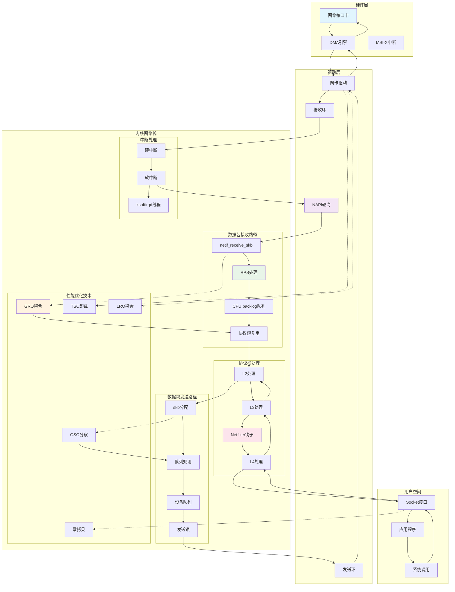

## 概述

网络包处理流程是Linux网络栈中最核心的部分，它定义了数据包从网卡硬件到用户空间应用程序的完整传输路径。数据包接收和发送的详细流程，以及Linux内核中的各种网络性能优化技术。

<!--more-->

## 1. 网络包处理流程架构

### 1.1 数据包处理的核心挑战

现代网络环境对数据包处理提出了严苛要求：

- **高吞吐量**：支持10Gbps、40Gbps甚至100Gbps网络
- **低延迟**：减少数据包处理延迟，提升响应速度
- **多CPU扩展**：有效利用多核CPU的并行处理能力
- **内存效率**：减少内存拷贝，优化缓存使用
- **负载均衡**：在多个CPU之间均匀分配网络负载

### 1.2 网络包处理架构图



## 2. 数据包接收详细流程

### 2.1 硬件中断到软中断转换

```c
/**
 * 软网络数据结构 - 每CPU的网络处理数据
 * 
 * 每个CPU都有一个softnet_data结构，用于管理该CPU上的
 * 网络数据包处理工作。
 */
struct softnet_data {
    struct list_head    poll_list;          /* NAPI轮询列表 */
    struct sk_buff_head process_queue;      /* 处理队列 */
    
    /* RPS相关字段 */
    struct sk_buff_head input_pkt_queue;    /* 输入数据包队列 */
    struct napi_struct  backlog;            /* backlog NAPI */
    
    /* 输出队列管理 */
    struct sk_buff      *output_queue;      /* 输出队列头 */
    struct sk_buff      **output_queue_tailp; /* 输出队列尾指针 */
    
    /* CPU间调用数据 */
    struct call_single_data csd ____cacheline_aligned_in_smp;
    
    /* RPS统计信息 */
    struct softnet_data *rps_ipi_list;     /* RPS IPI列表 */
    bool                rps_ipi_next;      /* RPS IPI下一个 */
    
    /* 流限制 */
    unsigned int        processed;          /* 已处理包数 */
    unsigned int        time_squeeze;       /* 时间压榨计数 */
    unsigned int        received_rps;       /* 接收RPS包数 */
    
    /* GRO相关 */
    struct sk_buff_head defer_list;        /* 延迟列表 */
    struct call_single_data defer_csd;     /* 延迟CSD */
    
#ifdef CONFIG_RPS
    struct softnet_data *rps_ipi_list;
    bool                rps_ipi_next;
#endif
    
    /* 网络设备引用 */
    struct net_device   *netdev_ref_tracker_holder;
    struct netdev_ref_tracker netdev_tracker;
};

/**
 * net_rx_action - 网络接收软中断处理主函数
 * @h: 软中断动作结构
 * 
 * 这是NET_RX_SOFTIRQ软中断的处理函数，是网络包接收处理的核心
 */
static __latent_entropy void net_rx_action(struct softirq_action *h)
{
    struct softnet_data *sd = this_cpu_ptr(&softnet_data);
    unsigned long time_limit = jiffies + usecs_to_jiffies(netdev_budget_usecs);
    int budget = netdev_budget;
    LIST_HEAD(list);
    LIST_HEAD(repoll);
    
    local_irq_disable();
    /* 将poll_list移到本地列表，避免新的NAPI被调度到当前列表 */
    list_splice_init(&sd->poll_list, &list);
    local_irq_enable();
    
    for (;;) {
        struct napi_struct *n;
        
        if (list_empty(&list)) {
            if (!sd_has_rps_ipi_waiting(sd) && list_empty(&repoll))
                goto end;
            break;
        }
        
        n = list_first_entry(&list, struct napi_struct, poll_list);
        list_del_init(&n->poll_list);
        
        /* 执行NAPI轮询，处理数据包 */
        int work = napi_poll(n, &repoll);
        budget -= work;
        
        /* 检查预算和时间限制，防止软中断占用过多CPU时间 */
        if (unlikely(budget <= 0 || time_after_eq(jiffies, time_limit))) {
            sd->time_squeeze++;
            break;
        }
    }
    
    local_irq_disable();
    
    /* 处理剩余的NAPI实例 */
    list_splice_tail_init(&sd->poll_list, &list);
    list_splice_tail(&repoll, &list);
    list_splice(&list, &sd->poll_list);
    
    if (!list_empty(&sd->poll_list))
        __raise_softirq_irqoff(NET_RX_SOFTIRQ);
    
    /* 处理RPS相关工作并重新启用中断 */
    net_rps_action_and_irq_enable(sd);
    
end:;
}

/**
 * netif_receive_skb - 网络接收的核心入口函数
 * @skb: 接收到的数据包
 * 
 * 这是网络数据包进入内核协议栈的主要入口点
 * 返回值：处理结果
 */
int netif_receive_skb(struct sk_buff *skb)
{
    int ret;
    
    trace_netif_receive_skb_entry(skb);
    
    ret = netif_receive_skb_internal(skb);
    trace_netif_receive_skb_exit(ret);
    
    return ret;
}

/**
 * netif_receive_skb_internal - 内部数据包接收处理
 * @skb: 数据包
 * 
 * 执行实际的数据包接收处理逻辑
 */
static int netif_receive_skb_internal(struct sk_buff *skb)
{
    int ret;
    
    net_timestamp_check(netdev_tstamp_prequeue, skb);
    
    if (skb_defer_rx_timestamp(skb))
        return NET_RX_SUCCESS;
    
    rcu_read_lock();
    
#ifdef CONFIG_RPS
    if (static_branch_unlikely(&rps_needed)) {
        struct rps_dev_flow voidflow, *rflow = &voidflow;
        int cpu = get_rps_cpu(skb->dev, skb, &rflow);
        
        if (cpu >= 0) {
            ret = enqueue_to_backlog(skb, cpu, &rflow->last_qtail);
            rcu_read_unlock();
            return ret;
        }
    }
#endif
    ret = __netif_receive_skb(skb);
    rcu_read_unlock();
    return ret;
}

/**
 * __netif_receive_skb - 核心数据包接收处理
 * @skb: 数据包
 * 
 * 处理数据包并将其传递给协议栈
 */
static int __netif_receive_skb(struct sk_buff *skb)
{
    int ret;
    
    /* 如果数据包被RPS重定向，它可能已经被处理 */
    if (netpoll_receive_skb(skb))
        return NET_RX_DROP;
    
    net_timestamp_check(!netdev_tstamp_prequeue, skb);
    
    trace_netif_receive_skb(skb);
    
    /* 检查是否为原始包套接字 */
    if (skb->dev->type == ARPHRD_RAWIP) {
        skb_reset_mac_header(skb);
        skb->protocol = htons(ETH_P_IP);
    } else if (!skb->protocol) {
        skb->protocol = eth_type_trans(skb, skb->dev);
    }
    
    /* 应用入口流量控制和过滤 */
    if (skb_skip_tc_classify(skb))
        goto skip_classify;
    
    if (pfmemalloc_match(skb))
        goto skip_taps;
    
    /* 处理数据包tap（如tcpdump） */
    list_for_each_entry_rcu(ptype, &ptype_all, list) {
        if (ptype->ignore_outgoing &&
            ptype->ignore_outgoing(skb))
            continue;
        ret = deliver_skb(skb, ptype, orig_dev);
        if (unlikely(ret == NET_RX_DROP))
            goto out;
    }
    
skip_taps:
#ifdef CONFIG_NET_INGRESS
    if (static_branch_unlikely(&ingress_needed_key)) {
        bool another = false;
        
        skb = sch_handle_ingress(skb, &pt_prev, &ret, orig_dev, &another);
        if (another)
            goto another_round;
        if (!skb)
            goto out;
    }
#endif
    
skip_classify:
    if (pfmemalloc_match(skb))
        goto skip_taps;
    
    /* 协议特定处理 */
    ret = __netif_receive_skb_one_core(skb, false);
    
out:
    return ret;
}

/**
 * __netif_receive_skb_one_core - 单核心数据包处理
 * @skb: 数据包
 * @pfmemalloc: 是否为紧急内存分配
 * 
 * 在单个CPU核心上处理数据包
 */
static int __netif_receive_skb_one_core(struct sk_buff *skb, bool pfmemalloc)
{
    struct net_device *orig_dev = skb->dev;
    struct packet_type *pt_prev = NULL;
    int ret;
    
    ret = __netif_receive_skb_core(&skb, pfmemalloc, &pt_prev);
    if (pt_prev)
        ret = INDIRECT_CALL_INET(pt_prev->func, ipv6_rcv, ip_rcv, skb,
                               skb->dev, pt_prev, orig_dev);
    return ret;
}
```

## 2. RPS/RFS性能优化机制

### 2.1 RPS（Receive Packet Steering）

RPS是Linux网络栈的重要优化技术，它将数据包处理分散到多个CPU上：

```c
/**
 * get_rps_cpu - 获取RPS目标CPU
 * @dev: 网络设备
 * @skb: 数据包
 * @rflowp: RPS流指针
 * 
 * 根据RPS配置选择处理数据包的目标CPU
 * 返回值：目标CPU编号，-1表示使用当前CPU
 */
static int get_rps_cpu(struct net_device *dev, struct sk_buff *skb,
                      struct rps_dev_flow **rflowp)
{
    const struct rps_sock_flow_table *sock_flow_table;
    struct netdev_rx_queue *rxqueue = dev->_rx;
    struct rps_dev_flow_table *flow_table;
    struct rps_map *map;
    int cpu = -1;
    u32 hash;
    u16 tcpu;
    
    /* 如果没有配置RPS，返回-1 */
    if (!rxqueue->rps_map && !rxqueue->rps_flow_table)
        goto done;
    
    skb_reset_network_header(skb);
    
    /* 计算数据包哈希值 */
    hash = skb_get_hash(skb);
    if (!hash)
        goto done;
    
    sock_flow_table = rcu_dereference(rps_sock_flow_table);
    if (sock_flow_table) {
        struct rps_dev_flow *rflow;
        u32 next_cpu;
        u32 ident;
        
        /* 计算套接字流的标识符 */
        ident = sock_flow_table->ents[hash & sock_flow_table->mask];
        if ((ident ^ hash) & ~rps_cpu_mask)
            goto try_rps;
        
        next_cpu = ident & rps_cpu_mask;
        
        /* 如果目标CPU有效，优先使用RFS */
        if (next_cpu < nr_cpu_ids && cpu_online(next_cpu)) {
            *rflowp = rflow;
            cpu = next_cpu;
            goto done;
        }
    }
    
try_rps:
    map = rcu_dereference(rxqueue->rps_map);
    if (map) {
        tcpu = map->cpus[reciprocal_scale(hash, map->len)];
        if (cpu_online(tcpu)) {
            cpu = tcpu;
            goto done;
        }
    }
    
done:
    return cpu;
}

/**
 * enqueue_to_backlog - 将数据包入队到目标CPU的backlog
 * @skb: 数据包
 * @cpu: 目标CPU
 * @qtail: 队列尾指针
 * 
 * 将数据包放入指定CPU的backlog队列中进行处理
 * 返回值：入队结果
 */
static int enqueue_to_backlog(struct sk_buff *skb, int cpu,
                             unsigned int *qtail)
{
    struct softnet_data *sd;
    unsigned long flags;
    unsigned int qlen;
    
    sd = &per_cpu(softnet_data, cpu);
    
    local_irq_save(flags);
    
    rps_lock(sd);
    if (!netif_running(skb->dev))
        goto drop;
    qlen = skb_queue_len(&sd->input_pkt_queue);
    if (qlen <= netdev_max_backlog && !skb_flow_limit(skb, qlen)) {
        if (qlen) {
enqueue:
            __skb_queue_tail(&sd->input_pkt_queue, skb);
            input_queue_tail_incr_save(sd, qtail);
            rps_unlock(sd);
            local_irq_restore(flags);
            return NET_RX_SUCCESS;
        }
        
        /* 调度NAPI来处理backlog */
        if (!__test_and_set_bit(NAPI_STATE_SCHED, &sd->backlog.state)) {
            if (!rps_ipi_queued(sd))
                ____napi_schedule(sd, &sd->backlog);
        }
        goto enqueue;
    }
    
drop:
    sd->dropped++;
    rps_unlock(sd);
    
    local_irq_restore(flags);
    
    atomic_long_inc(&skb->dev->rx_dropped);
    kfree_skb(skb);
    return NET_RX_DROP;
}

/**
 * process_backlog - 处理CPU的backlog队列
 * @napi: backlog NAPI结构
 * @quota: 处理配额
 * 
 * 处理当前CPU backlog队列中的数据包
 * 返回值：处理的数据包数量
 */
static int process_backlog(struct napi_struct *napi, int quota)
{
    struct softnet_data *sd = container_of(napi, struct softnet_data, backlog);
    bool again = true;
    int work = 0;
    
    /* 检查是否有RPS IPI等待处理 */
    if (sd_has_rps_ipi_waiting(sd)) {
        local_irq_disable();
        net_rps_action_and_irq_enable(sd);
    }
    
    napi->weight = weight_p;
    while (again) {
        struct sk_buff *skb;
        
        while ((skb = __skb_dequeue(&sd->process_queue))) {
            rcu_read_lock();
            __netif_receive_skb(skb);
            rcu_read_unlock();
            input_queue_head_incr(sd);
            if (++work >= quota)
                return work;
        }
        
        local_irq_disable();
        rps_lock(sd);
        if (skb_queue_empty(&sd->input_pkt_queue)) {
            /*
             * 内联__napi_complete()。只有在禁用中断时写入状态，
             * 以便在__napi_schedule()中进行同步。
             */
            __clear_bit(NAPI_STATE_SCHED, &napi->state);
            again = false;
        } else {
            skb_queue_splice_tail_init(&sd->input_pkt_queue,
                                     &sd->process_queue);
        }
        rps_unlock(sd);
        local_irq_enable();
    }
    
    return work;
}
```

### 2.2 GRO（Generic Receive Offload）优化

```c
/**
 * napi_gro_receive - NAPI GRO接收处理
 * @napi: NAPI结构
 * @skb: 数据包
 * 
 * 通过GRO优化处理接收到的数据包，尝试将相关数据包聚合
 * 返回值：处理结果
 */
gro_result_t napi_gro_receive(struct napi_struct *napi, struct sk_buff *skb)
{
    gro_result_t ret;
    
    skb_mark_napi_id(skb, napi);
    trace_napi_gro_receive_entry(skb);
    
    skb_gro_reset_offset(skb);
    
    ret = napi_skb_finish(napi, skb, dev_gro_receive(napi, skb));
    trace_napi_gro_receive_exit(ret);
    
    return ret;
}

/**
 * dev_gro_receive - 设备GRO接收处理
 * @napi: NAPI结构
 * @skb: 数据包
 * 
 * 尝试将数据包与现有GRO流进行聚合
 * 返回值：GRO处理结果
 */
static enum gro_result dev_gro_receive(struct napi_struct *napi, struct sk_buff *skb)
{
    u32 hash = skb_get_hash_raw(skb) & (GRO_HASH_BUCKETS - 1);
    struct gro_list_head *gro_head = &napi->gro_hash[hash];
    struct sk_buff *pp = NULL;
    enum gro_result ret;
    int same_flow;
    int grow;
    
    if (netif_elide_gro(skb->dev))
        goto normal;
    
    gro_list_prepare(&gro_head->list, skb);
    
    rcu_read_lock();
    list_for_each_entry_rcu(ptype, &offload_base, list) {
        if (ptype->type != type || !ptype->callbacks.gro_receive)
            continue;
        
        skb_set_network_header(skb, skb_gro_offset(skb));
        skb_reset_mac_len(skb);
        NAPI_GRO_CB(skb)->same_flow = 0;
        NAPI_GRO_CB(skb)->flush = skb_is_gso(skb) || skb_has_frag_list(skb);
        NAPI_GRO_CB(skb)->free = 0;
        NAPI_GRO_CB(skb)->encap_mark = 0;
        NAPI_GRO_CB(skb)->recursion_counter = 0;
        NAPI_GRO_CB(skb)->is_fou = 0;
        NAPI_GRO_CB(skb)->is_atomic = 1;
        NAPI_GRO_CB(skb)->gro_remcsum_start = 0;
        
        /* 设置数据偏移 */
        NAPI_GRO_CB(skb)->data_offset = 0;
        
        pp = INDIRECT_CALL_INET(ptype->callbacks.gro_receive,
                               ipv6_gro_receive, inet_gro_receive,
                               &gro_head->list, skb);
        break;
    }
    rcu_read_unlock();
    
    if (&ptype->list == &offload_base)
        goto normal;
    
    if (PTR_ERR(pp) == -EINPROGRESS) {
        ret = GRO_CONSUMED;
        goto ok;
    }
    
    same_flow = NAPI_GRO_CB(skb)->same_flow;
    ret = NAPI_GRO_CB(skb)->free ? GRO_MERGED_FREE : GRO_MERGED;
    
    if (pp) {
        skb_list_del_init(pp);
        napi_gro_complete(napi, pp);
        napi->gro_hash[hash].count--;
    }
    
    if (same_flow)
        goto ok;
    
    if (NAPI_GRO_CB(skb)->flush)
        goto normal;
    
    if (unlikely(napi->gro_hash[hash].count >= MAX_GRO_SKBS)) {
        gro_flush_oldest(napi, &gro_head->list);
    } else {
        napi->gro_hash[hash].count++;
    }
    NAPI_GRO_CB(skb)->age = jiffies;
    NAPI_GRO_CB(skb)->last = skb;
    skb_shinfo(skb)->gso_size = skb_gro_len(skb);
    list_add(&skb->list, &gro_head->list);
    ret = GRO_HELD;
    
pull:
    grow = skb_gro_offset(skb) - skb_headlen(skb);
    if (grow > 0)
        gro_pull_from_frag0(skb, grow);
ok:
    if (napi->gro_hash[hash].count) {
        if (!timer_pending(&napi->timer))
            mod_timer(&napi->timer, jiffies + HZ);
    }
    return ret;
    
normal:
    ret = GRO_NORMAL;
    goto pull;
}

/**
 * inet_gro_receive - IP层GRO接收处理
 * @head: GRO链表头
 * @skb: 当前数据包
 * 
 * IP层的GRO聚合处理
 * 返回值：聚合结果
 */
struct sk_buff *inet_gro_receive(struct list_head *head, struct sk_buff *skb)
{
    const struct net_offload *ops;
    struct sk_buff *pp = NULL;
    const struct iphdr *iph;
    unsigned int hlen;
    unsigned int off;
    unsigned int id;
    int flush = 1;
    int proto;
    
    off = skb_gro_offset(skb);
    hlen = off + sizeof(*iph);
    iph = skb_gro_header(skb, hlen, off);
    if (unlikely(!iph))
        goto out;
    
    proto = iph->protocol;
    
    rcu_read_lock();
    ops = rcu_dereference(inet_offloads[proto]);
    if (!ops || !ops->callbacks.gro_receive)
        goto out_unlock;
    
    if (*(u8 *)iph != 0x45)
        goto out_unlock;
    
    if (ip_is_fragment(iph))
        goto out_unlock;
    
    if (unlikely(ip_fast_csum((u8 *)iph, 5)))
        goto out_unlock;
    
    id = ntohl(*(__be32 *)&iph->id);
    flush = (u16)((ntohl(*(__be32 *)iph) ^ skb_gro_len(skb)) | (id & ~IP_DF));
    id >>= 16;
    
    list_for_each_entry(p, head, list) {
        struct iphdr *iph2;
        u16 flush_id;
        
        if (!NAPI_GRO_CB(p)->same_flow)
            continue;
        
        iph2 = (struct iphdr *)(p->data + off);
        /* IP头部必须完全匹配（除了长度和标识符） */
        if ((iph->saddr ^ iph2->saddr) | (iph->daddr ^ iph2->daddr))
            continue;
        if (memcmp(iph, iph2, 5 << 2))
            continue;
        
        NAPI_GRO_CB(p)->same_flow = 1;
        break;
    }
    
    NAPI_GRO_CB(skb)->same_flow = !list_empty(head);
    NAPI_GRO_CB(skb)->flush = flush;
    
    skb_gro_pull(skb, sizeof(*iph));
    skb_set_transport_header(skb, skb_gro_offset(skb));
    
    pp = call_gro_receive(ops->callbacks.gro_receive, head, skb);
    
out_unlock:
    rcu_read_unlock();
    
out:
    skb_gro_flush_final(skb, pp, flush);
    
    return pp;
}
```

### 2.3 RFS（Receive Flow Steering）

```c
/**
 * rps_sock_flow_table - RFS套接字流表
 * 
 * RFS通过记录套接字最后处理的CPU来提高缓存局部性
 */
struct rps_sock_flow_table {
    u32 mask;           /* 哈希表掩码 */
    u32 ents[0];        /* 流表条目 */
};

/**
 * rps_record_sock_flow - 记录套接字流
 * @sk: 套接字
 * @hash: 流哈希值
 * 
 * 记录套接字在哪个CPU上被处理，用于RFS优化
 */
static inline void rps_record_sock_flow(struct sock *sk, u32 hash)
{
    struct rps_sock_flow_table *sock_flow_table;
    
    rcu_read_lock();
    sock_flow_table = rcu_dereference(rps_sock_flow_table);
    if (sock_flow_table) {
        u32 val = hash & sock_flow_table->mask;
        
        /* 设置当前CPU和RPS CPU掩码 */
        val |= raw_smp_processor_id() << 16;
        
        if (sock_flow_table->ents[val] != val)
            sock_flow_table->ents[val] = val;
    }
    rcu_read_unlock();
}

/**
 * sock_rps_record_flow_hash - 在套接字接收时记录流
 * @sk: 套接字
 * 
 * 当数据包到达套接字时记录RFS信息
 */
static inline void sock_rps_record_flow_hash(struct sock *sk)
{
#ifdef CONFIG_RPS
    struct rps_sock_flow_table *sock_flow_table;
    
    rcu_read_lock();
    sock_flow_table = rcu_dereference(rps_sock_flow_table);
    if (sock_flow_table) {
        /* 使用套接字的接收哈希 */
        u32 hash = sk->sk_rxhash;
        if (hash) {
            u32 val = hash & sock_flow_table->mask;
            val |= raw_smp_processor_id() << 16;
            sock_flow_table->ents[val] = val;
        }
    }
    rcu_read_unlock();
#endif
}
```

## 3. 数据包发送详细流程

### 3.1 队列规则（Qdisc）处理

```c
/**
 * __dev_queue_xmit - 设备队列发送函数
 * @skb: 要发送的数据包
 * @sb_dev: 子设备
 * 
 * 通过设备队列发送数据包的核心函数
 * 返回值：发送结果
 */
static int __dev_queue_xmit(struct sk_buff *skb, struct net_device *sb_dev)
{
    struct net_device *dev = skb->dev;
    struct netdev_queue *txq;
    struct Qdisc *q;
    int rc = -ENOMEM;
    bool again = false;
    
    skb_reset_mac_header(skb);
    
    if (unlikely(skb_shinfo(skb)->tx_flags & SKBTX_SCHED_TSTAMP))
        __skb_tstamp_tx(skb, NULL, NULL, skb->sk, SCM_TSTAMP_SCHED);
    
    /* 禁用软中断以避免死锁 */
    rcu_read_lock_bh();
    
    skb_update_prio(skb);
    
    qdisc_pkt_len_init(skb);
#ifdef CONFIG_NET_CLS_ACT
    skb->tc_at_ingress = 0;
# ifdef CONFIG_NET_EGRESS
    if (static_branch_unlikely(&egress_needed_key)) {
        skb = sch_handle_egress(skb, &rc, dev);
        if (!skb)
            goto out;
    }
# endif
#endif
    
    /* 如果设备离线，丢弃数据包 */
    if (unlikely(!netif_running(dev) && !netif_device_present(dev))) {
        atomic_long_inc(&dev->tx_dropped);
        kfree_skb_reason(skb, SKB_DROP_REASON_DEV_READY);
        rc = -ENETDOWN;
        goto out;
    }
    
    /* 选择发送队列 */
    txq = netdev_core_pick_tx(dev, skb, sb_dev);
    q = rcu_dereference_bh(txq->qdisc);
    
    trace_net_dev_queue(skb);
    if (q->enqueue) {
        rc = __dev_xmit_skb(skb, q, dev, txq);
        goto out;
    }
    
    /* 设备使用LLTX */
    if (dev->flags & IFF_UP) {
        int cpu = smp_processor_id(); /* ok because BHs are off */
        
        if (txq->xmit_lock_owner != cpu) {
            if (dev_xmit_recursion())
                goto recursion_alert;
            
            skb = validate_xmit_skb(skb, dev, &again);
            if (!skb)
                goto out;
            
            PRANDOM_ADD_NOISE(skb, dev, txq, jiffies);
            HARD_TX_LOCK(dev, txq, cpu);
            
            if (!netif_xmit_stopped(txq)) {
                dev_xmit_recursion_inc();
                skb = dev_hard_start_xmit(skb, dev, txq, &rc);
                dev_xmit_recursion_dec();
                if (dev_xmit_complete(rc)) {
                    HARD_TX_UNLOCK(dev, txq);
                    goto out;
                }
            }
            HARD_TX_UNLOCK(dev, txq);
            net_crit_ratelimited("Virtual device %s asks to queue packet!\n",
                                dev->name);
        } else {
            /* 递归传输检测 */
            net_crit_ratelimited("Dead loop on virtual device %s, fix it urgently!\n",
                                dev->name);
        }
    }
    
    rc = -ENETDOWN;
    rcu_read_unlock_bh();
    
    atomic_long_inc(&dev->tx_dropped);
    kfree_skb_list(skb);
    return rc;
out:
    rcu_read_unlock_bh();
    return rc;
recursion_alert:
    net_crit_ratelimited("Dead loop on virtual device %s, fix it urgently!\n",
                        dev->name);
}

/**
 * __dev_xmit_skb - 通过队列规则发送数据包
 * @skb: 数据包
 * @q: 队列规则
 * @dev: 网络设备
 * @txq: 发送队列
 * 
 * 通过队列规则处理数据包发送
 * 返回值：发送结果
 */
static inline int __dev_xmit_skb(struct sk_buff *skb, struct Qdisc *q,
                                struct net_device *dev,
                                struct netdev_queue *txq)
{
    spinlock_t *root_lock = qdisc_lock(q);
    struct sk_buff *to_free = NULL;
    bool contended;
    int rc;
    
    qdisc_calculate_pkt_len(skb, q);
    
    if (q->flags & TCQ_F_NOLOCK) {
        rc = q->enqueue(skb, q, &to_free) & NET_XMIT_MASK;
        qdisc_run_end(q);
        
        if (unlikely(to_free))
            kfree_skb_list(to_free);
        return rc;
    }
    
    /*
     * 并行处理：首先尝试获取队列锁，如果失败则入队
     */
    contended = qdisc_is_running(q);
    if (unlikely(contended))
        spin_lock(&q->busylock);
    
    spin_lock(root_lock);
    if (unlikely(test_bit(__QDISC_STATE_DEACTIVATED, &q->state))) {
        __qdisc_drop(skb, &to_free);
        rc = NET_XMIT_DROP;
    } else if ((q->flags & TCQ_F_CAN_BYPASS) && !qdisc_qlen(q) &&
              qdisc_run_begin(q)) {
        /*
         * 这是一个工作守恒队列；没有包排队，所以我们可以直接传输。
         */
        qdisc_bstats_cpu_update(q, skb);
        
        skb = validate_xmit_skb_list(skb, dev, &again);
        if (skb) {
            if (sch_direct_xmit(skb, q, dev, txq, root_lock, true)) {
                if (unlikely(contended)) {
                    spin_unlock(&q->busylock);
                    contended = false;
                }
                __qdisc_run(q);
            }
        }
        
        qdisc_run_end(q);
        rc = NET_XMIT_SUCCESS;
    } else {
        rc = q->enqueue(skb, q, &to_free) & NET_XMIT_MASK;
        if (qdisc_run_begin(q)) {
            if (unlikely(contended)) {
                spin_unlock(&q->busylock);
                contended = false;
            }
            __qdisc_run(q);
            qdisc_run_end(q);
        }
    }
    spin_unlock(root_lock);
    if (unlikely(to_free))
        kfree_skb_list(to_free);
    if (unlikely(contended))
        spin_unlock(&q->busylock);
    return rc;
}
```

## 4. GSO/TSO发送优化

### 4.1 GSO（Generic Segmentation Offload）

```c
/**
 * skb_gso_segment - GSO分段处理
 * @skb: 大数据包
 * @features: 设备特性
 * 
 * 将大数据包分段成符合MTU要求的小包
 * 返回值：分段后的数据包链表
 */
struct sk_buff *skb_gso_segment(struct sk_buff *skb,
                               netdev_features_t features)
{
    struct sk_buff *segs = NULL;
    struct packet_offload *ptype;
    __be16 type = skb->protocol;
    
    if (skb->encapsulation) {
        skb_reset_inner_headers(skb);
        
        if (!skb->encap_hdr_csum) {
            /* 如果外层头部校验和无效，不能进行GSO */
            if (skb_checksum_start_offset(skb) <
                skb_inner_network_offset(skb)) {
                features &= ~(NETIF_F_CSUM_MASK | NETIF_F_GSO_MASK);
            }
        }
    }
    
    skb_reset_mac_header(skb);
    
    /* 查找协议特定的分段函数 */
    rcu_read_lock();
    list_for_each_entry_rcu(ptype, &offload_base, list) {
        if (ptype->type == type && ptype->callbacks.gso_segment) {
            segs = ptype->callbacks.gso_segment(skb, features);
            break;
        }
    }
    rcu_read_unlock();
    
    /* 如果没有找到协议处理函数，返回错误 */
    if (unlikely(IS_ERR_OR_NULL(segs))) {
        netdev_err(skb->dev,
                  "gso_segment failed for protocol %x\n",
                  ntohs(type));
        if (!segs)
            segs = ERR_PTR(-EINVAL);
    }
    
    return segs;
}

/**
 * tcp_gso_segment - TCP GSO分段
 * @skb: TCP数据包
 * @features: 设备特性
 * 
 * TCP协议的GSO分段实现
 * 返回值：分段后的TCP数据包链表
 */
struct sk_buff *tcp_gso_segment(struct sk_buff *skb,
                               netdev_features_t features)
{
    struct sk_buff *segs = NULL;
    struct tcphdr *th;
    unsigned int thlen;
    unsigned int seq;
    __be32 delta;
    unsigned int oldlen;
    unsigned int mss;
    struct sk_buff *gso_skb = skb;
    __sum16 newcheck;
    bool ooo_okay, copy_destructor;
    
    th = tcp_hdr(skb);
    thlen = th->doff * 4;
    if (thlen < sizeof(*th))
        goto out;
    
    if (!pskb_may_pull(skb, thlen))
        goto out;
    
    oldlen = (u16)~skb->len;
    __skb_pull(skb, thlen);
    
    mss = skb_shinfo(skb)->gso_size;
    if (unlikely(skb->len <= mss))
        goto out;
    
    if (skb_gso_ok(skb, features | NETIF_F_GSO_ROBUST)) {
        /* 数据包已经是分段的，可以直接处理 */
        int type = skb_shinfo(skb)->gso_type;
        
        if (unlikely(type &
                    ~(SKB_GSO_TCPV4 |
                      SKB_GSO_DODGY |
                      SKB_GSO_TCP_ECN |
                      SKB_GSO_TCP_FIXEDID |
                      SKB_GSO_TCPV6 |
                      SKB_GSO_PARTIAL) ||
                    !(type & (SKB_GSO_TCPV4 | SKB_GSO_TCPV6))))
            goto out;
        
        skb_shinfo(skb)->gso_segs = DIV_ROUND_UP(skb->len, mss);
        
        segs = NULL;
        goto out;
    }
    
    copy_destructor = gso_skb->destructor == tcp_wfree;
    ooo_okay = gso_skb->ooo_okay;
    /* 所有后续数据包应该有ooo_okay == 0 */
    skb->ooo_okay = 0;
    
    segs = skb_segment(skb, features);
    if (IS_ERR(segs))
        goto out;
    
    /* 为每个分段设置TCP头部 */
    delta = htonl(oldlen + (thlen + mss));
    
    skb = segs;
    th = tcp_hdr(skb);
    seq = ntohl(th->seq);
    
    if (unlikely(skb_shinfo(gso_skb)->tx_flags & SKBTX_SW_TSTAMP))
        tcp_gso_tstamp(skb, skb_shinfo(gso_skb)->tskey, seq, mss);
    
    newcheck = ~csum_fold((__force __wsum)((__force u32)th->check +
                                          (__force u32)delta));
    
    while (skb->next) {
        th->fin = th->psh = 0;
        th->check = newcheck;
        
        if (skb->ip_summed == CHECKSUM_PARTIAL)
            gso_reset_checksum(skb, ~th->check);
        else
            th->check = gso_make_checksum(skb, ~th->check);
        
        seq += mss;
        if (copy_destructor) {
            skb->destructor = gso_skb->destructor;
            skb->sk = gso_skb->sk;
            sum_truesize += skb->truesize;
        }
        skb = skb->next;
        th = tcp_hdr(skb);
        
        th->seq = htonl(seq);
        th->cwr = 0;
    }
    
    /* 最后一个分段 */
    delta = htonl(oldlen + (skb_tail_pointer(skb) -
                           skb_transport_header(skb)) +
                 skb->data_len);
    th->check = ~csum_fold((__force __wsum)((__force u32)th->check +
                                          (__force u32)delta));
    if (skb->ip_summed == CHECKSUM_PARTIAL)
        gso_reset_checksum(skb, ~th->check);
    else
        th->check = gso_make_checksum(skb, ~th->check);
    if (copy_destructor) {
        skb->destructor = gso_skb->destructor;
        skb->sk = gso_skb->sk;
        sum_truesize += skb->truesize;
        atomic_add(sum_truesize - gso_skb->truesize,
                  &skb->sk->sk_wmem_alloc);
    }
    
    delta = htonl(oldlen + (thlen + mss));
    
    /* 第一个分段保持原始的ooo_okay */
    segs->ooo_okay = ooo_okay;
    
out:
    return segs;
}
```

### 4.2 零拷贝技术

```c
/**
 * sock_sendpage - Socket发送页面（零拷贝）
 * @sock: Socket结构
 * @page: 要发送的页面
 * @offset: 页面内偏移
 * @size: 发送大小
 * @flags: 发送标志
 * 
 * 通过零拷贝技术发送页面数据
 * 返回值：发送的字节数或错误码
 */
ssize_t sock_sendpage(struct socket *sock, struct page *page, int offset,
                     size_t size, int flags)
{
    ssize_t res;
    struct msghdr msg = {.msg_flags = flags};
    struct kvec iov;
    char *kaddr = kmap(page);
    iov.iov_base = kaddr + offset;
    iov.iov_len = size;
    iov_iter_kvec(&msg.msg_iter, WRITE, &iov, 1, size);
    res = sock_sendmsg(sock, &msg);
    /*
     * 如果这失败了，我们应该返回实际的错误码，但是
     * 某些应用程序可能依赖返回的正字节数
     */
    kunmap(page);
    return res;
}

/**
 * tcp_sendpage_locked - TCP锁定发送页面
 * @sk: TCP套接字
 * @page: 页面
 * @offset: 偏移
 * @size: 大小
 * @flags: 标志
 * 
 * 在已持有套接字锁的情况下发送页面
 * 返回值：发送字节数或错误码
 */
ssize_t tcp_sendpage_locked(struct sock *sk, struct page *page, int offset,
                           size_t size, int flags)
{
    struct tcp_sock *tp = tcp_sk(sk);
    int mss_now, size_goal;
    int err;
    ssize_t copied = 0;
    
    /* 检查连接状态 */
    if (flags & MSG_OOB) {
        err = tcp_send_urg_data(sk, page, offset, size, flags);
        goto out_err;
    }
    
    /* 如果连接已关闭，返回错误 */
    if (sk->sk_err || (sk->sk_shutdown & SEND_SHUTDOWN))
        goto out_err;
    
    mss_now = tcp_send_mss(sk, &size_goal, flags);
    copied = 0;
    
    err = -EPIPE;
    if (sk->sk_err || (sk->sk_shutdown & SEND_SHUTDOWN))
        goto out_err;
    
    while (size > 0) {
        struct sk_buff *skb;
        size_t copy, i;
        bool can_coalesce;
        
        if (!tcp_send_head(sk) || (copy = size_goal - tcp_send_head(sk)->len) <= 0) {
new_segment:
            if (!sk_stream_memory_free(sk))
                goto wait_for_sndbuf;
            
            skb = sk_stream_alloc_skb(sk, 0, sk->sk_allocation,
                                     tcp_rtx_and_write_queues_empty(sk));
            if (!skb)
                goto wait_for_memory;
            
            /*
             * 检查是否需要插入TSO选项和时间戳选项
             */
            skb_entail(sk, skb);
            copy = size_goal;
        }
        
        if (copy > size)
            copy = size;
        
        i = skb_shinfo(skb)->nr_frags;
        can_coalesce = skb_can_coalesce(skb, i, page, offset);
        if (!can_coalesce && i >= sysctl_max_skb_frags) {
            tcp_mark_push(tp, skb);
            goto new_segment;
        }
        if (!sk_wmem_schedule(sk, copy))
            goto wait_for_memory;
        
        if (can_coalesce) {
            skb_frag_size_add(&skb_shinfo(skb)->frags[i - 1], copy);
        } else {
            get_page(page);
            skb_fill_page_desc(skb, i, page, offset, copy);
        }
        
        if (!(flags & MSG_NO_SHARED_FRAGS))
            skb_shinfo(skb)->flags |= SKBFL_SHARED_FRAG;
        
        skb->len += copy;
        skb->data_len += copy;
        skb->truesize += copy;
        sk_wmem_queued_add(sk, copy);
        sk_mem_charge(sk, copy);
        skb->ip_summed = CHECKSUM_PARTIAL;
        WRITE_ONCE(tp->write_seq, tp->write_seq + copy);
        TCP_SKB_CB(skb)->end_seq += copy;
        tcp_skb_pcount_set(skb, 0);
        
        if (!copied)
            TCP_SKB_CB(skb)->tcp_flags &= ~TCPHDR_PSH;
        
        copied += copy;
        offset += copy;
        size -= copy;
        
        if (!size)
            goto out;
        
        if (skb->len < size_goal || (flags & MSG_OOB) || unlikely(tp->repair))
            continue;
        
        if (forced_push(tp)) {
            tcp_mark_push(tp, skb);
            __tcp_push_pending_frames(sk, mss_now, TCP_NAGLE_PUSH);
        } else if (skb == tcp_send_head(sk))
            tcp_push_one(sk, mss_now);
        continue;
        
wait_for_sndbuf:
        set_bit(SOCK_NOSPACE, &sk->sk_socket->flags);
wait_for_memory:
        tcp_push(sk, flags & ~MSG_MORE, mss_now,
                TCP_NAGLE_PUSH, size_goal);
        
        err = sk_stream_wait_memory(sk, &timeo);
        if (err != 0)
            goto do_error;
        
        mss_now = tcp_send_mss(sk, &size_goal, flags);
    }
    
out:
    if (copied) {
        tcp_tx_timestamp(sk, sk->sk_tsflags);
        if (!(flags & MSG_SENDPAGE_NOTLAST))
            tcp_push(sk, flags, mss_now, tp->nonagle, size_goal);
    }
    return copied;
    
do_error:
    tcp_remove_empty_skb(sk, tcp_write_queue_tail(sk));
    if (copied)
        goto out;
out_err:
    /* 确保我们返回一个连接错误 */
    if (sk->sk_err)
        err = -sk->sk_err;
    else if (sk->sk_shutdown & SEND_SHUTDOWN)
        err = -EPIPE;
    else if (sk->sk_state == TCP_CLOSE)
        err = -ENOTCONN;
    return err;
}
```

## 5. 网络包内存管理

### 5.1 sk_buff内存池管理

```c
/**
 * skb_pool_head - sk_buff内存池
 * 
 * Linux内核使用多级内存池来管理sk_buff分配，
 * 减少内存分配的开销和碎片。
 */
struct skb_pool_head {
    spinlock_t          lock;           /* 内存池锁 */
    int                 qlen;           /* 队列长度 */
    struct sk_buff      *head;          /* 池头指针 */
    struct sk_buff      *tail;          /* 池尾指针 */
    
    int                 min_pool_size;  /* 最小池大小 */
    int                 max_pool_size;  /* 最大池大小 */
    
    struct kmem_cache   *cache;         /* SLAB缓存 */
};

/**
 * __alloc_skb - 分配sk_buff
 * @size: 数据区大小
 * @gfp_mask: 分配掩码
 * @flags: SKB标志
 * @node: NUMA节点
 * 
 * sk_buff分配的核心函数，使用多种优化策略
 * 返回值：分配的sk_buff指针或NULL
 */
struct sk_buff *__alloc_skb(unsigned int size, gfp_t gfp_mask,
                           int flags, int node)
{
    struct kmem_cache *cache;
    struct sk_buff *skb;
    bool pfmemalloc;
    u8 *data;
    
    cache = (flags & SKB_ALLOC_FCLONE) ? skbuff_fclone_cache : skbuff_head_cache;
    
    if (sk_memalloc_socks()) {
        gfp_mask |= __GFP_MEMALLOC;
        cache = skbuff_head_cache;
    }
    
    /* 从SLAB缓存分配sk_buff头部 */
    skb = kmem_cache_alloc_node(cache, gfp_mask & ~GFP_DMA, node);
    if (unlikely(!skb))
        goto out;
    prefetchw(skb);
    
    /* 在分配数据缓冲区之前需要检查 */
    if (likely(!(flags & SKB_ALLOC_NO_DIRTY_CHECK)))
        size = SKB_DATA_ALIGN(size);
    size += SKB_DATA_ALIGN(sizeof(struct skb_shared_info));
    data = kmalloc_reserve(size, gfp_mask, node, &pfmemalloc);
    if (unlikely(!data))
        goto nodata;
    
    /* 确保data对齐到缓存行边界 */
    size = SKB_WITH_OVERHEAD(ksize(data));
    prefetchw(data + size);
    
    /*
     * 我们保证shinfo在数据缓冲区末尾正确对齐
     * 并且原子计数器初始化为1
     */
    memset(skb, 0, offsetof(struct sk_buff, tail));
    /* 确保我们初始化shinfo顺序相关字段 */
    skb->truesize = SKB_TRUESIZE(size);
    skb->pfmemalloc = pfmemalloc;
    refcount_set(&skb->users, 1);
    skb->head = data;
    skb->data = data;
    skb_reset_tail_pointer(skb);
    skb->end = skb->tail + size;
    skb->mac_header = (typeof(skb->mac_header))~0U;
    skb->transport_header = (typeof(skb->transport_header))~0U;
    
    /* 确保我们在skb_shared_info中初始化数据结构 */
    shinfo = skb_shinfo(skb);
    memset(shinfo, 0, offsetof(struct skb_shared_info, dataref));
    atomic_set(&shinfo->dataref, 1);
    
    if (flags & SKB_ALLOC_FCLONE) {
        struct sk_buff_fclones *fclones;
        
        fclones = container_of(skb, struct sk_buff_fclones, skb1);
        
        skb->fclone = SKB_FCLONE_ORIG;
        refcount_set(&fclones->fclone_ref, 1);
        
        fclones->skb2.fclone = SKB_FCLONE_CLONE;
    }
    
out:
    return skb;
    
nodata:
    kmem_cache_free(cache, skb);
    skb = NULL;
    goto out;
}

/**
 * skb_clone - 克隆sk_buff
 * @skb: 要克隆的sk_buff
 * @gfp_mask: 分配掩码
 * 
 * 创建sk_buff的克隆，共享数据但有独立的头部
 * 返回值：克隆的sk_buff或NULL
 */
struct sk_buff *skb_clone(struct sk_buff *skb, gfp_t gfp_mask)
{
    struct sk_buff_fclones *fclones = container_of(skb,
                                                  struct sk_buff_fclones,
                                                  skb1);
    struct sk_buff *n;
    
    if (skb_orphan_frags(skb, gfp_mask))
        return NULL;
    
    if (skb->fclone == SKB_FCLONE_ORIG &&
        refcount_read(&fclones->fclone_ref) == 1) {
        n = &fclones->skb2;
        refcount_set(&fclones->fclone_ref, 2);
    } else {
        if (skb_pfmemalloc(skb))
            gfp_mask |= __GFP_MEMALLOC;
        
        n = kmem_cache_alloc(skbuff_head_cache, gfp_mask);
        if (!n)
            return NULL;
        
        n->fclone = SKB_FCLONE_UNAVAILABLE;
    }
    
    return __skb_clone(n, skb);
}

/**
 * __skb_clone - 内部skb克隆函数
 * @n: 新的sk_buff
 * @skb: 源sk_buff
 * 
 * 执行实际的sk_buff克隆操作
 * 返回值：克隆的sk_buff
 */
static struct sk_buff *__skb_clone(struct sk_buff *n, struct sk_buff *skb)
{
#define C(x) n->x = skb->x
    
    n->next = n->prev = NULL;
    n->sk = NULL;
    __copy_skb_header(n, skb);
    
    C(len);
    C(data_len);
    C(mac_len);
    n->hdr_len = skb->nohdr ? skb_headroom(skb) : skb->hdr_len;
    n->cloned = 1;
    n->nohdr = 0;
    n->peeked = 0;
    C(pfmemalloc);
    n->destructor = NULL;
    C(tail);
    C(end);
    C(head);
    C(head_frag);
    C(data);
    C(truesize);
    refcount_set(&n->users, 1);
    
    atomic_inc(&(skb_shinfo(skb)->dataref));
    skb->cloned = 1;
    
    return n;
#undef C
}
```

## 6. 网络性能监控和调试

### 6.1 网络统计信息

```c
/**
 * dev_get_stats - 获取网络设备统计信息
 * @dev: 网络设备
 * @storage: 统计信息存储
 * 
 * 获取网络设备的详细统计信息，用于性能监控
 * 返回值：统计信息结构指针
 */
struct rtnl_link_stats64 *dev_get_stats(struct net_device *dev,
                                        struct rtnl_link_stats64 *storage)
{
    const struct net_device_ops *netdev_ops = dev->netdev_ops;
    const struct net_device_core_stats __percpu *core_stats;
    
    if (netdev_ops->ndo_get_stats64) {
        memset(storage, 0, sizeof(*storage));
        netdev_ops->ndo_get_stats64(dev, storage);
    } else if (netdev_ops->ndo_get_stats) {
        netdev_stats_to_stats64(storage, netdev_ops->ndo_get_stats(dev));
    } else {
        netdev_stats_to_stats64(storage, &dev->stats);
    }
    
    /* 添加核心统计信息 */
    core_stats = dev->core_stats;
    if (core_stats) {
        const struct net_device_core_stats *p;
        u32 rx_dropped = 0, tx_dropped = 0;
        u32 rx_nohandler = 0, rx_otherhost_dropped = 0;
        int i;
        
        for_each_possible_cpu(i) {
            p = per_cpu_ptr(core_stats, i);
            rx_dropped += p->rx_dropped;
            tx_dropped += p->tx_dropped;
            rx_nohandler += p->rx_nohandler;
            rx_otherhost_dropped += p->rx_otherhost_dropped;
        }
        storage->rx_dropped += rx_dropped;
        storage->tx_dropped += tx_dropped;
        storage->rx_nohandler += rx_nohandler;
        storage->rx_otherhost_dropped += rx_otherhost_dropped;
    }
    return storage;
}

/**
 * /proc/net/dev接口的统计信息显示
 */
static int dev_seq_show(struct seq_file *seq, void *v)
{
    if (v == SEQ_START_TOKEN)
        seq_puts(seq, "Inter-|   Receive                            "
                     "                    |  Transmit\n"
                     " face |bytes    packets errs drop fifo frame "
                     "compressed multicast|bytes    packets errs "
                     "drop fifo colls carrier compressed\n");
    else
        dev_seq_printf_stats(seq, v);
    return 0;
}

static void dev_seq_printf_stats(struct seq_file *seq, struct net_device *dev)
{
    struct rtnl_link_stats64 temp;
    const struct rtnl_link_stats64 *stats = dev_get_stats(dev, &temp);
    
    seq_printf(seq, "%6s: %7llu %7llu %4llu %4llu %4llu %5llu %10llu %9llu "
                   "%8llu %7llu %4llu %4llu %4llu %5llu %7llu %10llu\n",
              dev->name, stats->rx_bytes, stats->rx_packets,
              stats->rx_errors,
              stats->rx_dropped + stats->rx_missed_errors,
              stats->rx_fifo_errors,
              stats->rx_length_errors + stats->rx_over_errors +
               stats->rx_crc_errors + stats->rx_frame_errors,
              stats->rx_compressed, stats->multicast,
              stats->tx_bytes, stats->tx_packets,
              stats->tx_errors, stats->tx_dropped,
              stats->tx_fifo_errors, stats->collisions,
              stats->tx_carrier_errors +
               stats->tx_aborted_errors +
               stats->tx_window_errors +
               stats->tx_heartbeat_errors,
              stats->tx_compressed);
}
```

## 7. 高级性能优化技术

### 7.1 XDP（eXpress Data Path）

XDP是Linux内核中的高性能数据包处理框架：

```c
/**
 * xdp_buff - XDP数据包缓冲区
 * 
 * XDP程序操作的数据包表示，提供高性能的数据包处理能力
 */
struct xdp_buff {
    void *data;                 /* 数据起始指针 */
    void *data_end;             /* 数据结束指针 */
    void *data_meta;            /* 元数据指针 */
    void *data_hard_start;      /* 硬起始指针 */
    struct xdp_rxq_info *rxq;   /* 接收队列信息 */
    struct xdp_txq_info *txq;   /* 发送队列信息 */
    u32 frame_sz;               /* 帧大小 */
    u32 flags;                  /* 标志位 */
};

/**
 * XDP动作类型定义
 */
enum xdp_action {
    XDP_ABORTED = 0,    /* 异常终止，丢弃包 */
    XDP_DROP,           /* 丢弃数据包 */
    XDP_PASS,           /* 传递给网络栈 */
    XDP_TX,             /* 从同一接口发送回去 */
    XDP_REDIRECT,       /* 重定向到其他接口 */
};

/**
 * netif_receive_generic_xdp - 通用XDP处理
 * @skb: 数据包
 * @xdp_prog: XDP程序
 * 
 * 为不支持原生XDP的驱动提供通用XDP支持
 * 返回值：XDP处理结果
 */
static u32 netif_receive_generic_xdp(struct sk_buff *skb,
                                     struct xdp_buff *xdp,
                                     struct bpf_prog *xdp_prog)
{
    void *orig_data, *orig_data_end;
    struct netdev_rx_queue *rxqueue;
    u32 metalen, act = XDP_DROP;
    u32 mac_len, frame_sz;
    __be16 orig_eth_type;
    struct ethhdr *eth;
    bool orig_bcast;
    int hlen, off;
    
    /* 确保线性化足够的数据 */
    if (!pskb_may_pull(skb, XDP_PACKET_HEADROOM))
        goto do_drop;
    
    /* 设置XDP缓冲区 */
    xdp_init_buff(xdp, frame_sz, rxqueue);
    xdp_prepare_buff(xdp, skb->head, skb_headroom(skb),
                    skb_headlen(skb), true);
    
    orig_data_end = xdp->data_end;
    orig_data = xdp->data;
    eth = (struct ethhdr *)xdp->data;
    orig_bcast = is_multicast_ether_addr(eth->h_dest);
    orig_eth_type = eth->h_proto;
    
    rxqueue = netif_get_rxqueue(skb);
    xdp->rxq = &rxqueue->xdp_rxq;
    
    /* 运行XDP程序 */
    act = bpf_prog_run_xdp(xdp_prog, xdp);
    
    /* 检查XDP程序是否修改了数据包 */
    off = xdp->data - orig_data;
    if (off) {
        if (off > 0)
            __skb_pull(skb, off);
        else if (off < 0)
            __skb_push(skb, -off);
        
        skb->mac_header += off;
        skb_reset_network_header(skb);
    }
    
    /* 检查数据包尾部是否被修改 */
    off = orig_data_end - xdp->data_end;
    if (off != 0) {
        skb_set_tail_pointer(skb, xdp->data_end - xdp->data);
        skb->len -= off; /* 注意：可能变为负数 */
    }
    
    /* 检查是否需要更新以太网头部 */
    if (orig_eth_type != eth->h_proto ||
        orig_bcast != is_multicast_ether_addr(eth->h_dest)) {
        __skb_push(skb, ETH_HLEN);
        skb->pkt_type = PACKET_HOST;
        skb->protocol = eth_type_trans(skb, skb->dev);
    }
    
    switch (act) {
    case XDP_REDIRECT:
    case XDP_TX:
        __skb_push(skb, mac_len);
        break;
    default:
        break;
    }
    
    return act;
    
do_drop:
    kfree_skb(skb);
    return XDP_DROP;
}
```

## 8. 网络数据包流水线优化

### 8.1 数据包批处理

```c
/**
 * netif_receive_skb_list - 批量接收数据包
 * @head: 数据包链表头
 * 
 * 批量处理数据包链表，提高处理效率
 */
void netif_receive_skb_list(struct list_head *head)
{
    struct sk_buff *skb, *next;
    struct list_head sublist;
    
    if (list_empty(head))
        return;
    if (list_is_singular(head)) {
        skb = list_first_entry(head, struct sk_buff, list);
        list_del_init(&skb->list);
        netif_receive_skb_internal(skb);
        return;
    }
    
    list_for_each_entry_safe(skb, next, head, list) {
        net_timestamp_check(netdev_tstamp_prequeue, skb);
        list_del_init(&skb->list);
        if (!skb_defer_rx_timestamp(skb))
            list_add_tail(&skb->list, &sublist);
    }
    list_splice_init(&sublist, head);
    
    rcu_read_lock();
    
#ifdef CONFIG_RPS
    if (static_branch_unlikely(&rps_needed)) {
        list_for_each_entry_safe(skb, next, head, list) {
            struct rps_dev_flow voidflow, *rflow = &voidflow;
            int cpu = get_rps_cpu(skb->dev, skb, &rflow);
            
            if (cpu >= 0) {
                /* 将需要RPS处理的包移到单独列表 */
                list_del_init(&skb->list);
                enqueue_to_backlog(skb, cpu, &rflow->last_qtail);
            }
        }
    }
#endif
    
    __netif_receive_skb_list(head);
    rcu_read_unlock();
}

/**
 * gro_normal_list - 处理GRO正常列表
 * @napi: NAPI结构
 * 
 * 处理完成GRO聚合后的数据包列表
 */
static void gro_normal_list(struct napi_struct *napi)
{
    if (!napi->rx_list.count)
        return;
    netif_receive_skb_list_internal(&napi->rx_list.head);
    INIT_LIST_HEAD(&napi->rx_list.head);
    napi->rx_list.count = 0;
}
```

## 9. 总结

Linux网络包处理流程是一个高度优化的系统，通过多种技术手段实现了高性能的网络数据传输：

### 9.1 关键优化技术

- **NAPI机制**：减少中断频率，批量处理数据包
- **RPS/RFS**：多核扩展和缓存局部性优化
- **GRO/GSO**：减少协议栈处理开销
- **零拷贝技术**：减少内存拷贝操作
- **XDP框架**：提供超高性能数据包处理

### 9.2 性能调优要点

- **合理配置RPS/RFS**：根据系统特点调整配置
- **优化中断合并**：平衡延迟和吞吐量
- **内存池管理**：减少内存分配开销
- **CPU亲和性绑定**：避免缓存抖动
- **监控统计信息**：及时发现性能瓶颈

理解这些机制对于网络应用开发和系统调优具有重要意义。

