## 概述

Socket层是Linux网络协议栈与用户空间应用程序之间的关键接口层，它通过虚拟文件系统(VFS)提供了统一的网络编程API。Socket层的实现机制，包括系统调用处理、缓冲区管理、Socket操作集等核心功能。

<!--more-->

## 1. Socket层架构

### 1.1 Socket层核心职责

Linux Socket层承担以下关键功能：

- **系统调用接口**：提供socket、bind、listen、accept等网络API
- **VFS集成**：将Socket作为特殊文件处理，支持read/write/poll等操作
- **协议无关抽象**：为不同协议族提供统一接口
- **缓冲区管理**：管理发送和接收缓冲区
- **异步I/O支持**：支持epoll、select等异步I/O机制
- **安全控制**：实现Socket级别的权限控制

### 1.2 Socket层架构图


## 2. 核心数据结构详解

### 2.1 socket结构体

```c
/**
 * socket结构体 - Socket的核心表示
 * 
 * socket结构体是用户空间Socket的内核表示，它连接了
 * VFS文件系统和底层的网络协议实现。
 */
struct socket {
    socket_state        state;          /* Socket状态(连接、断开等) */
    
    short               type;           /* Socket类型(STREAM/DGRAM/RAW等) */
    
    unsigned long       flags;          /* Socket标志 */
    
    struct file         *file;          /* 关联的VFS文件 */
    struct sock         *sk;            /* 网络层Socket结构 */
    const struct proto_ops *ops;       /* 协议操作函数集 */
    
    struct socket_wq    wq;             /* 等待队列 */
};

/**
 * Socket状态定义
 */
typedef enum {
    SS_FREE = 0,            /* 未分配 */
    SS_UNCONNECTED,         /* 未连接 */
    SS_CONNECTING,          /* 正在连接 */
    SS_CONNECTED,           /* 已连接 */
    SS_DISCONNECTING        /* 正在断开连接 */
} socket_state;

/**
 * Socket类型定义
 */
enum sock_type {
    SOCK_STREAM     = 1,    /* 流式Socket(TCP) */
    SOCK_DGRAM      = 2,    /* 数据报Socket(UDP) */
    SOCK_RAW        = 3,    /* 原始Socket */
    SOCK_RDM        = 4,    /* 可靠数据报Socket */
    SOCK_SEQPACKET  = 5,    /* 序列化包Socket */
    SOCK_DCCP       = 6,    /* 数据报拥塞控制协议Socket */
    SOCK_PACKET     = 10,   /* Linux特有的原始包Socket */
};

/**
 * Socket等待队列结构
 */
struct socket_wq {
    /* 注意: 这个结构的wait成员在一些地方已被直接修改，
     * 包含了队列头和在内核中旋转的标志。
     */
    wait_queue_head_t   wait;           /* 等待队列头 */
    struct fasync_struct *fasync_list;  /* 异步通知列表 */
    unsigned long       flags;          /* 标志位 */
    struct rcu_head     rcu;            /* RCU头部，用于延迟释放 */
} ____cacheline_aligned_in_smp;
```

### 2.2 sock结构体 - 网络层Socket

```c
/**
 * sock结构体 - 网络层的Socket表示
 * 
 * 这是网络协议栈中Socket的核心数据结构，包含了
 * 网络协议相关的所有状态和控制信息。
 */
struct sock {
    /*
     * 现在结构体布局是优化的。
     * 为了保持结构体对齐到8字节，不能在下面插入新字段。
     * 如果确实需要，请在最后插入。
     */
    struct sock_common  __sk_common;   /* 通用Socket字段 */
#define sk_node         __sk_common.skc_node        /* 哈希表节点 */
#define sk_nulls_node   __sk_common.skc_nulls_node  /* nulls哈希表节点 */
#define sk_refcnt       __sk_common.skc_refcnt      /* 引用计数 */
#define sk_tx_queue_mapping __sk_common.skc_tx_queue_mapping /* 发送队列映射 */
    
#define sk_dontcopy_begin   __sk_common.skc_dontcopy_begin   /* 不复制字段开始 */
#define sk_dontcopy_end     __sk_common.skc_dontcopy_end     /* 不复制字段结束 */
#define sk_hash         __sk_common.skc_hash        /* 哈希值 */
#define sk_portpair     __sk_common.skc_portpair    /* 端口对 */
#define sk_num          __sk_common.skc_num         /* 本地端口 */
#define sk_dport        __sk_common.skc_dport       /* 目标端口 */
#define sk_addrpair     __sk_common.skc_addrpair    /* 地址对 */
#define sk_daddr        __sk_common.skc_daddr       /* 目标地址 */
#define sk_rcv_saddr    __sk_common.skc_rcv_saddr   /* 接收地址 */
#define sk_family       __sk_common.skc_family      /* 协议族 */
#define sk_state        __sk_common.skc_state       /* Socket状态 */
#define sk_reuse        __sk_common.skc_reuse       /* 地址重用标志 */
#define sk_reuseport    __sk_common.skc_reuseport   /* 端口重用标志 */
#define sk_ipv6only     __sk_common.skc_ipv6only    /* 仅IPv6标志 */
#define sk_net_refcnt   __sk_common.skc_net_refcnt  /* 网络命名空间引用计数 */
#define sk_bound_dev_if __sk_common.skc_bound_dev_if /* 绑定设备接口 */
#define sk_bind_node    __sk_common.skc_bind_node   /* 绑定节点 */
#define sk_prot         __sk_common.skc_prot        /* 协议操作集 */
#define sk_net          __sk_common.skc_net         /* 网络命名空间 */
#define sk_v6_daddr     __sk_common.skc_v6_daddr    /* IPv6目标地址 */
#define sk_v6_rcv_saddr __sk_common.skc_v6_rcv_saddr /* IPv6接收地址 */
#define sk_cookie       __sk_common.skc_cookie      /* Socket cookie */
#define sk_incoming_cpu __sk_common.skc_incoming_cpu /* 输入CPU */
#define sk_flags        __sk_common.skc_flags       /* Socket标志 */
#define sk_rxhash       __sk_common.skc_rxhash      /* 接收哈希 */
    
    /* 这里是具体的Socket字段 */
    __u16               sk_type;        /* Socket类型 */
    __u16               sk_protocol;    /* Socket协议 */
    __u16               sk_gso_max_segs; /* GSO最大分段数 */
    
    unsigned long       sk_lingertime;  /* linger超时 */
    struct proto        *sk_prot_creator; /* 创建时的协议 */
    rwlock_t            sk_callback_lock; /* 回调锁 */
    int                 sk_err,         /* 上次错误 */
                        sk_err_soft;    /* 软错误 */
    u32                 sk_ack_backlog; /* 当前ack backlog */
    u32                 sk_max_ack_backlog; /* listen backlog */
    kuid_t              sk_uid;         /* 用户ID */
    u8                  sk_txrehash;    /* 发送rehash */
    u8                  sk_prefer_busy_poll; /* 偏好busy poll */
    u16                 sk_busy_poll_budget; /* busy poll预算 */
    spinlock_t          sk_peer_lock;   /* 对等锁 */
    int                 sk_bind_phc;    /* 绑定PHC */
    struct pid          *sk_peer_pid;   /* 对等进程ID */
    const struct cred   *sk_peer_cred;  /* 对等凭证 */
    long                sk_rcvtimeo;    /* 接收超时 */
    long                sk_sndtimeo;    /* 发送超时 */
    int                 sk_rcvlowat;    /* 接收低水位 */
    int                 sk_rcvbuf;      /* 接收缓冲区大小 */
    
    struct sk_buff_head sk_receive_queue; /* 接收队列 */
    /*
     * sk_wmem_alloc减去这个开销
     * sk_wmem_queued：持久化的发送缓冲区
     * sk_forward_alloc：转发分配的空间
     */
    atomic_t            sk_wmem_alloc;   /* 已分配的写内存 */
    unsigned long       sk_tsq_flags;    /* TCP小队列标志 */
    union {
        atomic_t        sk_wmem_queued;  /* 已入队的写内存 */
        int             sk_forward_alloc; /* 转发分配 */
    };
    
    atomic_t            sk_rmem_alloc;   /* 已分配的读内存 */
    int                 sk_sndbuf;       /* 发送缓冲区大小 */
    
    /* ===== cache line for TX ===== */
    int                 sk_wmem_queued;  /* 已排队的写内存 */
    refcount_t          sk_wmem_alloc;   /* 写内存分配引用计数 */
    unsigned long       sk_tsq_flags;    /* TSQ标志 */
    union {
        struct sk_buff  *sk_send_head;   /* 发送队列头 */
        struct rb_root  tcp_rtx_queue;   /* TCP重传队列 */
    };
    struct sk_buff_head sk_write_queue;  /* 写队列 */
    __s32               sk_peek_off;     /* 当前peek偏移 */
    int                 sk_write_pending; /* 待写数据计数 */
    __u32               sk_dst_pending_confirm; /* 目标待确认 */
    u32                 sk_pacing_status; /* pacing状态 */
    
    /*
     * 加密支持
     */
    struct dst_entry    *sk_dst_cache;   /* 目标缓存 */
    atomic_t            sk_omem_alloc;   /* 选项内存分配 */
    int                 sk_sndbuf;       /* 发送缓冲区大小 */
    
    /* ===== cache line for RX ===== */
    __u32               sk_peek_off;     /* peek偏移 */
    int                 sk_write_pending; /* 待写入数据 */
    atomic_t            sk_drops;        /* 丢包统计 */
    int                 sk_rcvlowat;     /* SO_RCVLOWAT */
    struct sk_buff_head sk_error_queue;  /* 错误队列 */
    struct sk_buff      *sk_rx_skb_cache; /* RX skb缓存 */
    struct sk_buff      *sk_tx_skb_cache; /* TX skb缓存 */
    
#ifdef CONFIG_FILTER
    struct sk_filter __rcu  *sk_filter;  /* Socket过滤器 */
#endif
    union {
        struct socket_wq __rcu  *sk_wq;   /* Socket等待队列 */
        /* 适用于UDP的GRO相关字段 */
        struct socket_wq        *sk_wq_raw;
    };
#ifdef CONFIG_XFRM
    struct xfrm_policy __rcu *sk_policy[2]; /* XFRM策略 */
#endif
    
    struct dst_entry    *sk_rx_dst;      /* 接收目标 */
    int                 sk_rx_dst_ifindex; /* 接收目标接口索引 */
    u32                 sk_rx_dst_cookie; /* 接收目标cookie */
    
    struct dst_entry    *sk_dst_cache;   /* 目标缓存 */
    spinlock_t          sk_dst_lock;     /* 目标锁 */
    enum sk_pacing      sk_pacing;       /* pacing模式 */
    atomic_t            sk_omem_alloc;   /* 选项内存分配 */
    int                 sk_sndbuf;       /* SO_SNDBUF */
    
    /* RPS相关字段 */
    int                 sk_route_caps;   /* 路由能力 */
    int                 sk_gso_type;     /* GSO类型 */
    unsigned int        sk_gso_max_size; /* GSO最大大小 */
    gfp_t               sk_allocation;   /* 分配标志 */
    __u32               sk_txhash;       /* 发送哈希 */
    
    /*
     * 因为套接字在create时被清零，我们不能在套接字create后再有任何
     * 自动变量或保证在其中的其他有趣数据。
     */
    u8                  sk_clockid;      /* 时钟ID */
    u8                  sk_txtime_deadline_mode:1, /* 发送时间deadline模式 */
                        sk_txtime_report_errors:1,  /* 发送时间错误报告 */
                        sk_txtime_unused:6;         /* 未使用的位 */
    
    void                *sk_user_data;   /* 用户数据指针 */
#ifdef CONFIG_SECURITY
    void                *sk_security;    /* 安全相关数据 */
#endif
    struct sock_cgroup_data sk_cgrp_data; /* cgroup数据 */
    struct mem_cgroup   *sk_memcg;       /* 内存cgroup */
    void                (*sk_state_change)(struct sock *sk); /* 状态变化回调 */
    void                (*sk_data_ready)(struct sock *sk);   /* 数据就绪回调 */
    void                (*sk_write_space)(struct sock *sk);  /* 写空间可用回调 */
    void                (*sk_error_report)(struct sock *sk); /* 错误报告回调 */
    int                 (*sk_backlog_rcv)(struct sock *sk, struct sk_buff *skb); /* backlog接收函数 */
#ifdef CONFIG_BPF_SYSCALL
    struct sk_psock __rcu *sk_psock;     /* BPF psock */
#endif
    struct proto        *sk_prot_creator; /* 原始协议 */
    void                (*sk_destruct)(struct sock *sk); /* 析构函数 */
    struct sock_reuseport __rcu *sk_reuseport_cb; /* reuseport回调 */
#ifdef CONFIG_BPF_SYSCALL
    struct bpf_local_storage __rcu *sk_bpf_storage; /* BPF本地存储 */
#endif
    struct rcu_head     sk_rcu;          /* RCU头部 */
    netns_tracker       ns_tracker;      /* 网络命名空间追踪器 */
};
```

### 2.3 协议操作函数集

```c
/**
 * proto_ops结构体 - Socket协议操作函数集
 * 
 * 这个结构体定义了特定协议族(如AF_INET)的Socket操作函数，
 * 为VFS层提供统一的Socket操作接口。
 */
struct proto_ops {
    int         family;     /* 协议族标识 */
    struct module *owner;   /* 模块所有者 */
    
    /* Socket生命周期管理 */
    int         (*release)   (struct socket *sock);
    int         (*bind)      (struct socket *sock,
                             struct sockaddr *myaddr,
                             int sockaddr_len);
    int         (*connect)   (struct socket *sock,
                             struct sockaddr *vaddr,
                             int sockaddr_len, int flags);
    int         (*socketpair)(struct socket *sock1,
                             struct socket *sock2);
    int         (*accept)    (struct socket *sock,
                             struct socket *newsock, int flags, bool kern);
    int         (*getname)   (struct socket *sock,
                             struct sockaddr *addr, int peer);
    
    /* I/O操作 */
    __poll_t    (*poll)      (struct file *file, struct socket *sock,
                             struct poll_table_struct *wait);
    int         (*ioctl)     (struct socket *sock, unsigned int cmd,
                             unsigned long arg);
    int         (*gettstamp) (struct socket *sock, void __user *userstamp,
                             bool timeval, bool time32);
    int         (*listen)    (struct socket *sock, int len);
    int         (*shutdown)  (struct socket *sock, int flags);
    int         (*setsockopt)(struct socket *sock, int level,
                             int optname, sockptr_t optval,
                             unsigned int optlen);
    int         (*getsockopt)(struct socket *sock, int level,
                             int optname, char __user *optval, int __user *optlen);
    void        (*show_fdinfo)(struct seq_file *m, struct socket *sock);
    int         (*sendmsg)   (struct socket *sock, struct msghdr *m,
                             size_t total_len);
    /* Notes for sendmsg:
     * 在内核中，如果sendmsg的flags为MSG_SPLICE_PAGES，
     * 那么数据在msg->msg_iter的页面中，需要拼接到skb中。
     */
    int         (*recvmsg)   (struct socket *sock, struct msghdr *m,
                             size_t total_len, int flags);
    int         (*mmap)      (struct file *file, struct socket *sock,
                             struct vm_area_struct *vma);
    ssize_t     (*sendpage)  (struct socket *sock, struct page *page,
                             int offset, size_t size, int flags);
    ssize_t     (*splice_read)(struct socket *sock,  loff_t *ppos,
                              struct pipe_inode_info *pipe, size_t len, unsigned int flags);
    int         (*set_peek_off)(struct sock *sk, int val);
    int         (*peek_len)(struct socket *sock);
    
    /* 以下仅用于内核空间socket */
    int         (*read_sock)(struct sock *sk, read_descriptor_t *desc,
                            sk_read_actor_t recv_actor);
    /* 这仅在sock_map需要时覆盖 */
    int         (*sendpage_locked)(struct sock *sk, struct page *page,
                                  int offset, size_t size, int flags);
    int         (*sendmsg_locked)(struct sock *sk, struct msghdr *msg,
                                 size_t size);
    int         (*set_rcvlowat)(struct sock *sk, int val);
};

/* IPv4协议族的操作函数集 */
const struct proto_ops inet_stream_ops = {
    .family        = PF_INET,
    .owner         = THIS_MODULE,
    .release       = inet_release,
    .bind          = inet_bind,
    .connect       = inet_stream_connect,
    .socketpair    = sock_no_socketpair,
    .accept        = inet_accept,
    .getname       = inet_getname,
    .poll          = tcp_poll,
    .ioctl         = inet_ioctl,
    .gettstamp     = sock_gettstamp,
    .listen        = inet_listen,
    .shutdown      = inet_shutdown,
    .setsockopt    = sock_common_setsockopt,
    .getsockopt    = sock_common_getsockopt,
    .sendmsg       = inet_sendmsg,
    .recvmsg       = inet_recvmsg,
    .mmap          = sock_no_mmap,
    .sendpage      = inet_sendpage,
    .splice_read   = generic_splice_sendpage,
    .read_sock     = tcp_read_sock,
    .sendmsg_locked = tcp_sendmsg_locked,
    .sendpage_locked = tcp_sendpage_locked,
    .peek_len      = tcp_peek_len,
    .set_rcvlowat  = tcp_set_rcvlowat,
};

/* UDP协议的操作函数集 */
const struct proto_ops inet_dgram_ops = {
    .family        = PF_INET,
    .owner         = THIS_MODULE,
    .release       = inet_release,
    .bind          = inet_bind,
    .connect       = inet_dgram_connect,
    .socketpair    = sock_no_socketpair,
    .accept        = sock_no_accept,
    .getname       = inet_getname,
    .poll          = udp_poll,
    .ioctl         = inet_ioctl,
    .gettstamp     = sock_gettstamp,
    .listen        = sock_no_listen,
    .shutdown      = inet_shutdown,
    .setsockopt    = sock_common_setsockopt,
    .getsockopt    = sock_common_getsockopt,
    .sendmsg       = inet_sendmsg,
    .recvmsg       = inet_recvmsg,
    .mmap          = sock_no_mmap,
    .sendpage      = inet_sendpage,
    .set_peek_off  = sk_set_peek_off,
    .peek_len      = udp_peek_len,
    .set_rcvlowat  = sock_no_set_rcvlowat,
};
```

## 3. Socket创建流程

### 3.1 Socket创建时序图

```mermaid
sequenceDiagram
    participant APP as 应用程序
    participant LIBC as C库
    participant VFS as VFS层
    participant SOCKET as Socket层
    participant PROTO as 协议层
    participant MEM as 内存管理
    
    Note over APP,MEM: Socket创建流程
    
    APP->>LIBC: socket(AF_INET, SOCK_STREAM, 0)
    LIBC->>VFS: sys_socket系统调用
    
    VFS->>SOCKET: __sys_socket()
    SOCKET->>SOCKET: sock_create()
    
    Note over SOCKET: Socket结构体分配
    SOCKET->>MEM: sock_alloc()
    MEM->>SOCKET: 返回socket结构体
    
    Note over SOCKET: 协议族查找
    SOCKET->>SOCKET: sock_create1()
    SOCKET->>PROTO: net_families[family]->create()
    
    Note over PROTO: 协议特定初始化
    PROTO->>PROTO: inet_create()
    PROTO->>MEM: sk_alloc()
    MEM->>PROTO: 返回sock结构体
    
    PROTO->>PROTO: 设置协议操作集
    PROTO->>PROTO: 初始化协议特定字段
    PROTO->>SOCKET: 返回初始化结果
    
    Note over SOCKET: VFS集成
    SOCKET->>VFS: sock_map_fd()
    VFS->>VFS: 创建file结构体
    VFS->>VFS: 分配文件描述符
    
    VFS->>LIBC: 返回文件描述符
    LIBC->>APP: 返回socket fd
    
    Note over APP,MEM: Socket创建完成
```



### 3.2 Socket创建核心函数

```c
/**
 * __sys_socket - Socket系统调用实现
 * @family: 协议族(AF_INET, AF_INET6等)
 * @type: Socket类型(SOCK_STREAM, SOCK_DGRAM等)  
 * @protocol: 协议号(IPPROTO_TCP, IPPROTO_UDP等)
 * 
 * Socket系统调用的核心实现函数
 * 返回值：成功返回文件描述符，失败返回负错误码
 */
SYSCALL_DEFINE3(socket, int, family, int, type, int, protocol)
{
    return __sys_socket(family, type, protocol);
}

int __sys_socket(int family, int type, int protocol)
{
    int retval;
    struct socket *sock;
    int flags;
    
    /* 检查type中的标志位 */
    if (SOCK_NONBLOCK != O_NONBLOCK && (flags & SOCK_NONBLOCK))
        flags = (flags & ~SOCK_NONBLOCK) | O_NONBLOCK;
    
    retval = sock_create(family, type, protocol, &sock);
    if (retval < 0)
        return retval;
    
    return sock_map_fd(sock, flags & (O_CLOEXEC | O_NONBLOCK));
}

/**
 * sock_create - 创建Socket
 * @family: 协议族
 * @type: Socket类型
 * @protocol: 协议号
 * @res: 输出的Socket指针
 * 
 * 创建一个新的Socket结构体
 * 返回值：成功返回0，失败返回负错误码
 */
int sock_create(int family, int type, int protocol, struct socket **res)
{
    return __sock_create(current->nsproxy->net_ns, family, type, protocol, res, 0);
}

/**
 * __sock_create - 内部Socket创建函数
 * @net: 网络命名空间
 * @family: 协议族
 * @type: Socket类型
 * @protocol: 协议号
 * @res: 输出的Socket指针
 * @kern: 内核Socket标志
 * 
 * Socket创建的核心实现
 * 返回值：成功返回0，失败返回负错误码
 */
int __sock_create(struct net *net, int family, int type, int protocol,
                 struct socket **res, int kern)
{
    int err;
    struct socket *sock;
    const struct net_proto_family *pf;
    
    /*
     * 参数有效性检查
     */
    if (family < 0 || family >= NPROTO)
        return -EAFNOSUPPORT;
    if (type < 0 || type >= SOCK_MAX)
        return -EINVAL;
    
    /* 兼容性处理 */
    if (family == PF_INET && type == SOCK_PACKET) {
        pr_info_once("%s uses obsolete (PF_INET,SOCK_PACKET)\n",
                    current->comm);
        family = PF_PACKET;
    }
    
    err = security_socket_create(family, type, protocol, kern);
    if (err)
        return err;
    
    /*
     * 分配Socket结构体
     */
    sock = sock_alloc();
    if (!sock) {
        net_warn_ratelimited("socket: no more sockets\n");
        return -ENFILE; /* 不是ENOBUFS，因为某些应用程序依赖这个 */
    }
    
    sock->type = type;
    
#ifdef CONFIG_MODULES
    /* 尝试加载协议模块(如果需要) */
    if (rcu_access_pointer(net_families[family]) == NULL)
        request_module("net-pf-%d", family);
#endif
    
    rcu_read_lock();
    pf = rcu_dereference(net_families[family]);
    err = -EAFNOSUPPORT;
    if (!pf)
        goto out_release;
    
    /*
     * 我们将通过调用协议家族特定创建函数完成这个套接字。
     */
    err = pf->create(net, sock, protocol, kern);
    if (err < 0)
        goto out_module_put;
    
    /*
     * 现在设置module_get以防止模块被卸载，该模块拥有
     * 刚刚创建的套接字的ops，并且递增ops的使用计数。
     */
    if (!try_module_get(sock->ops->owner))
        goto out_module_busy;
    
    /*
     * 现在我们确实拥有它已被创建，将其包装在文件和
     * 文件描述符中并让它们关联。
     */
    *res = sock;
    security_socket_post_create(sock, family, type, protocol, kern);
    
out_module_put:
    rcu_read_unlock();
    return err;
    
out_module_busy:
    err = -EAFNOSUPPORT;
out_release:
    rcu_read_unlock();
    sock_release(sock);
    return err;
}

/**
 * sock_alloc - 分配Socket结构体
 * 
 * 分配一个新的Socket结构体及其关联的inode
 * 返回值：成功返回socket指针，失败返回NULL
 */
struct socket *sock_alloc(void)
{
    struct inode *inode;
    struct socket *sock;
    
    inode = new_inode_pseudo(sock_mnt->mnt_sb);
    if (!inode)
        return NULL;
    
    sock = SOCKET_I(inode);
    
    inode->i_ino = get_next_ino();
    inode->i_mode = S_IFSOCK | S_IRWXUGO;
    inode->i_uid = current_fsuid();
    inode->i_gid = current_fsgid();
    inode->i_op = &sockfs_inode_ops;
    
    return sock;
}

/**
 * sock_map_fd - 将Socket映射到文件描述符
 * @sock: Socket结构体
 * @flags: 文件标志
 * 
 * 为Socket分配文件描述符并建立VFS映射
 * 返回值：成功返回文件描述符，失败返回负错误码
 */
int sock_map_fd(struct socket *sock, int flags)
{
    struct file *newfile;
    int fd = get_unused_fd_flags(flags);
    if (unlikely(fd < 0)) {
        sock_release(sock);
        return fd;
    }
    
    newfile = sock_alloc_file(sock, flags, NULL);
    if (IS_ERR(newfile)) {
        put_unused_fd(fd);
        return PTR_ERR(newfile);
    }
    
    fd_install(fd, newfile);
    return fd;
}

/**
 * sock_alloc_file - 为Socket分配file结构体
 * @sock: Socket结构体
 * @flags: 文件标志
 * @dname: 设备名称
 * 
 * 创建与Socket关联的file结构体
 * 返回值：成功返回file指针，失败返回错误指针
 */
struct file *sock_alloc_file(struct socket *sock, int flags, const char *dname)
{
    struct file *file;
    
    if (!dname)
        dname = sock->sk ? sock->sk->sk_prot_creator->name : "socket";
    
    file = alloc_file_pseudo(SOCK_INODE(sock), sock_mnt, dname,
                           O_RDWR | (flags & O_NONBLOCK),
                           &socket_file_ops);
    if (IS_ERR(file)) {
        sock_release(sock);
        return file;
    }
    
    sock->file = file;
    file->private_data = sock;
    stream_open(SOCK_INODE(sock), file);
    return file;
}
```

## 4. 系统调用实现

### 4.1 bind系统调用

```c
/**
 * __sys_bind - bind系统调用实现
 * @fd: Socket文件描述符
 * @umyaddr: 用户空间地址结构
 * @addrlen: 地址结构长度
 * 
 * bind系统调用将Socket绑定到指定地址
 * 返回值：成功返回0，失败返回负错误码
 */
SYSCALL_DEFINE3(bind, int, fd, struct sockaddr __user *, umyaddr, int, addrlen)
{
    return __sys_bind(fd, umyaddr, addrlen);
}

int __sys_bind(int fd, struct sockaddr __user *umyaddr, int addrlen)
{
    struct socket *sock;
    struct sockaddr_storage address;
    int err, fput_needed;
    
    sock = sockfd_lookup_light(fd, &err, &fput_needed);
    if (sock) {
        err = move_addr_to_kernel(umyaddr, addrlen, &address);
        if (!err) {
            err = security_socket_bind(sock,
                                     (struct sockaddr *)&address,
                                     addrlen);
            if (!err)
                err = sock->ops->bind(sock,
                                    (struct sockaddr *)&address,
                                    addrlen);
        }
        fput_light(sock->file, fput_needed);
    }
    return err;
}

/**
 * inet_bind - IPv4协议族bind实现
 * @sock: Socket结构体
 * @uaddr: 地址结构
 * @addr_len: 地址长度
 * 
 * IPv4协议的bind实现
 * 返回值：成功返回0，失败返回负错误码
 */
int inet_bind(struct socket *sock, struct sockaddr *uaddr, int addr_len)
{
    struct sock *sk = sock->sk;
    int err;
    
    /* 如果socket有自己的bind函数，使用它 */
    if (sk->sk_prot->bind) {
        return sk->sk_prot->bind(sk, uaddr, addr_len);
    }
    if (addr_len < sizeof(struct sockaddr_in))
        return -EINVAL;
    
    /* BPF程序可以拦截bind操作 */
    if (cgroup_bpf_enabled(CGROUP_INET4_BIND) ||
        cgroup_bpf_enabled(CGROUP_INET6_BIND)) {
        err = BPF_CGROUP_RUN_PROG_INET_BIND_LOCK(sk, uaddr,
                                                &addr_len);
        if (err)
            return err;
    }
    
    return __inet_bind(sk, uaddr, addr_len, BIND_FORCE_ADDRESS_NO_PORT,
                      true);
}

/**
 * __inet_bind - 内部bind实现
 * @sk: Socket结构体
 * @uaddr: 用户地址
 * @addr_len: 地址长度
 * @flags: 绑定标志
 * @with_lock: 是否需要加锁
 * 
 * IPv4 bind的核心实现
 * 返回值：成功返回0，失败返回负错误码
 */
int __inet_bind(struct sock *sk, struct sockaddr *uaddr, int addr_len,
               u32 flags, bool with_lock)
{
    struct sockaddr_in *addr = (struct sockaddr_in *)uaddr;
    struct inet_sock *inet = inet_sk(sk);
    struct net *net = sock_net(sk);
    unsigned short snum;
    int chk_addr_ret;
    u32 tb_id = RT_TABLE_LOCAL;
    int err;
    
    if (addr->sin_family != AF_INET) {
        /* 兼容性 - 这是历史上接受的 */
        if (addr->sin_family != AF_UNSPEC)
            return -EAFNOSUPPORT;
    }
    
    tb_id = l3mdev_fib_table_by_index(net, sk->sk_bound_dev_if) ? : tb_id;
    chk_addr_ret = inet_addr_type_table(net, addr->sin_addr.s_addr, tb_id);
    
    /* 不是本地地址，也不是组播或广播 */
    if (!inet_can_nonlocal_bind(net, inet) &&
        addr->sin_addr.s_addr != htonl(INADDR_ANY) &&
        chk_addr_ret != RTN_LOCAL &&
        chk_addr_ret != RTN_MULTICAST &&
        chk_addr_ret != RTN_BROADCAST)
        return -EADDRNOTAVAIL;
    
    snum = ntohs(addr->sin_port);
    err = -EACCES;
    if (snum && inet_port_requires_bind_service(net, snum) &&
        !ns_capable(net->user_ns, CAP_NET_BIND_SERVICE))
        return err;
    
    /*      我们跟踪这个，以防在双重绑定上或什么的时候。  */
    if (with_lock)
        lock_sock(sk);
    
    /* Check these errors (active socket, double bind). */
    err = -EINVAL;
    if (sk->sk_state != TCP_CLOSE || inet->inet_num)
        goto out_release_sock;
    
    inet->inet_rcv_saddr = inet->inet_saddr = addr->sin_addr.s_addr;
    if (chk_addr_ret == RTN_MULTICAST || chk_addr_ret == RTN_BROADCAST)
        inet->inet_saddr = 0;  /* 使用设备 */
    
    /* 确保我们被允许绑定这里。 */
    if (snum || !(inet->bind_address_no_port ||
                 (flags & BIND_FORCE_ADDRESS_NO_PORT))) {
        if (sk->sk_prot->get_port(sk, snum)) {
            inet->inet_saddr = inet->inet_rcv_saddr = 0;
            err = -EADDRINUSE;
            goto out_release_sock;
        }
        if (!(flags & BIND_FROM_BPF)) {
            err = BPF_CGROUP_RUN_PROG_INET4_POST_BIND(sk);
            if (err) {
                inet->inet_saddr = inet->inet_rcv_saddr = 0;
                if (sk->sk_prot->put_port)
                    sk->sk_prot->put_port(sk);
                goto out_release_sock;
            }
        }
    }
    
    if (inet->inet_rcv_saddr)
        sk->sk_userlocks |= SOCK_BINDADDR_LOCK;
    if (snum)
        sk->sk_userlocks |= SOCK_BINDPORT_LOCK;
    inet->inet_sport = htons(inet->inet_num);
    inet->inet_daddr = 0;
    inet->inet_dport = 0;
    sk_dst_reset(sk);
    err = 0;
out_release_sock:
    if (with_lock)
        release_sock(sk);
    return err;
}
```

### 4.2 listen系统调用

```c
/**
 * __sys_listen - listen系统调用实现
 * @fd: Socket文件描述符
 * @backlog: 监听队列长度
 * 
 * listen系统调用使Socket进入监听状态
 * 返回值：成功返回0，失败返回负错误码
 */
SYSCALL_DEFINE2(listen, int, fd, int, backlog)
{
    return __sys_listen(fd, backlog);
}

int __sys_listen(int fd, int backlog)
{
    struct socket *sock;
    int err, fput_needed;
    int somaxconn;
    
    sock = sockfd_lookup_light(fd, &err, &fput_needed);
    if (sock) {
        somaxconn = READ_ONCE(sock_net(sock->sk)->core.sysctl_somaxconn);
        if ((unsigned int)backlog > somaxconn)
            backlog = somaxconn;
        
        err = security_socket_listen(sock, backlog);
        if (!err)
            err = sock->ops->listen(sock, backlog);
        
        fput_light(sock->file, fput_needed);
    }
    return err;
}

/**
 * inet_listen - IPv4协议族listen实现  
 * @sock: Socket结构体
 * @backlog: 监听队列长度
 * 
 * IPv4协议的listen实现
 * 返回值：成功返回0，失败返回负错误码
 */
int inet_listen(struct socket *sock, int backlog)
{
    struct sock *sk = sock->sk;
    unsigned char old_state;
    int err, tcp_fastopen;
    
    lock_sock(sk);
    
    err = -EINVAL;
    if (sock->state != SS_UNCONNECTED || sock->type != SOCK_STREAM)
        goto out;
    
    old_state = sk->sk_state;
    if (!((1 << old_state) & (TCPF_CLOSE | TCPF_LISTEN)))
        goto out;
    
    WRITE_ONCE(sk->sk_max_ack_backlog, backlog);
    /* 现实情况是，backlog的内核最大值在很多地方都假设为somaxconn */
    
    if (old_state != TCP_LISTEN) {
        /*
         * Tell TCP this is a sock being turned into a listener, so when the
         * syn queue overflows don't delete a syn. The syn 
         * queue overfills with request_socks and to delete a syn would free
         * memory that is required.
         */
        tcp_fastopen = READ_ONCE(sock_net(sk)->ipv4.sysctl_tcp_fastopen);
        if ((tcp_fastopen & TFO_SERVER_WO_SOCKOPT1) &&
            (tcp_fastopen & TFO_SERVER_ENABLE) &&
            !inet_csk(sk)->icsk_accept_queue.fastopenq.max_qlen) {
            fastopenq_init(&inet_csk(sk)->icsk_accept_queue.fastopenq);
        }
        
        err = inet_csk_listen_start(sk, backlog);
        if (err)
            goto out;
        tcp_call_bpf(sk, BPF_SOCK_OPS_TCP_LISTEN_CB, 0, NULL);
    }
    err = 0;
    
out:
    release_sock(sk);
    return err;
}
```

## 5. accept系统调用实现

### 5.1 accept核心处理

```c
/**
 * inet_accept - IPv4协议族accept实现
 * @sock: 监听套接字
 * @newsock: 新连接套接字
 * @flags: 标志
 * @kern: 内核标志
 * 
 * IPv4协议的accept实现，接受新的TCP连接
 * 返回值：成功返回0，失败返回负错误码
 */
int inet_accept(struct socket *sock, struct socket *newsock, int flags,
               bool kern)
{
    struct sock *sk1 = sock->sk;
    int err = -EINVAL;
    struct sock *sk2 = sk1->sk_prot->accept(sk1, flags, &err, kern);
    
    if (!sk2)
        goto do_err;
    
    lock_sock(sk2);
    
    /* 记录RPS流信息 */
    sock_rps_record_flow(sk2);
    WARN_ON(!((1 << sk2->sk_state) &
             (TCPF_ESTABLISHED | TCPF_SYN_RECV |
              TCPF_CLOSE_WAIT | TCPF_CLOSE)));
    
    sock_graft(sk2, newsock);
    
    newsock->state = SS_CONNECTED;
    err = 0;
    release_sock(sk2);
do_err:
    return err;
}
```

## 6. 缓冲区管理详解

### 6.1 Socket缓冲区优化

```c
/**
 * sk_stream_alloc_skb - 为流套接字分配sk_buff
 * @sk: 套接字
 * @size: 数据大小
 * @gfp: 分配标志
 * @force_schedule: 强制调度
 * 
 * 为TCP等流协议分配优化的sk_buff
 * 返回值：分配的sk_buff或NULL
 */
struct sk_buff *sk_stream_alloc_skb(struct sock *sk, int size, gfp_t gfp,
                                   bool force_schedule)
{
    struct sk_buff *skb;
    
    /* 尝试使用缓存的skb */
    if (likely(!size)) {
        skb = sk->sk_tx_skb_cache;
        if (skb) {
            sk->sk_tx_skb_cache = NULL;
            pskb_trim(skb, 0);
            INIT_LIST_HEAD(&skb->tcp_tsorted_anchor);
            skb_shinfo(skb)->tx_flags = 0;
            memset(TCP_SKB_CB(skb), 0, sizeof(struct tcp_skb_cb));
            return skb;
        }
    }
    
    /* 分配新的sk_buff */
    skb = alloc_skb_fclone(size + sk->sk_prot->max_header, gfp);
    if (likely(skb)) {
        bool mem_scheduled;
        
        if (force_schedule) {
            mem_scheduled = true;
            sk_forced_mem_schedule(sk, skb->truesize);
        } else {
            mem_scheduled = sk_wmem_schedule(sk, skb->truesize);
        }
        if (likely(mem_scheduled)) {
            skb_reserve(skb, sk->sk_prot->max_header);
            skb->reserved_tailroom = skb->end - skb->tail;
            return skb;
        }
        __kfree_skb(skb);
    } else {
        sk->sk_prot->enter_memory_pressure(sk);
        sk_stream_moderate_sndbuf(sk);
    }
    return NULL;
}
```

### 6.2 零拷贝与错误队列（MSG_ZEROCOPY/ERRQUEUE）

用户态使用步骤：

```c
/* 1) 启用零拷贝与错误接收 */
int one = 1;
setsockopt(fd, SOL_SOCKET, SO_ZEROCOPY, &one, sizeof(one));
setsockopt(fd, SOL_IP, IP_RECVERR, &one, sizeof(one)); /* TCP/UDP皆可 */

/* 2) 发送时指定MSG_ZEROCOPY */
struct msghdr msg = { .msg_iov = iov, .msg_iovlen = iovlen };
ssize_t n = sendmsg(fd, &msg, MSG_ZEROCOPY);

/* 3) 从错误队列读取完成通知（非致命“错误”） */
char cbuf[512];
struct msghdr emsg = { .msg_control = cbuf, .msg_controllen = sizeof(cbuf) };
ssize_t m = recvmsg(fd, &emsg, MSG_ERRQUEUE);
/* 解析 struct sock_extended_err，期望 ee_origin == SO_EE_ORIGIN_ZEROCOPY */
```

内核路径要点（简化）：
- 发送：`tcp_sendmsg_locked()` 检测 `MSG_ZEROCOPY`，尽可能将用户页作为不可变引用附加到 skb frags，避免拷贝。
- 完成：数据实际下网并可安全释放时，通过 `sk->sk_error_queue` 注入一条带 `sock_extended_err` 的 CMSG，`ee_origin=SO_EE_ORIGIN_ZEROCOPY`，用户在 `MSG_ERRQUEUE` 读取。
- 回退：较小报文、拥塞、混合GSO/TSO 等条件下可能回退到普通拷贝（非严格保证零拷贝）。

调试与观测：
- `ss -nito` 观察 TCP 套接字的 zerocopy 统计字段（不同内核版本可能差异）。
- 统计错误队列事件次数，确保应用层消费 `MSG_ERRQUEUE`，否则会造成队列积压。
- 结合 `ethtool -S <if>`、`/proc/net/sockstat`、`/proc/net/netstat` 观察发送/内存与丢弃情况。

注意事项：
- 建议与大报文、稳定路径配合，收益更显著；对小报文或强实时场景评估延迟抖动。
- 当与 kTLS、GSO、TSO 等叠加时，具体驱动/内核实现可能限制实际零拷贝比例。

#### 6.2.1 零拷贝完成通知时序图


## 7. 性能优化策略

### 7.1 关键优化要点

- **缓冲区调优**：根据应用特点设置合适的缓冲区大小
- **零拷贝技术**：在适当场景使用sendfile等优化
- **异步I/O**：合理使用epoll提高并发性能
- **Busy Polling**：在低延迟场景中启用
- **Socket缓存**：充分利用per-CPU缓存减少分配开销

本文为Linux网络栈源码分析系列的Socket层深度解析


## 8. 关键函数与调用链/时序图/结构体关系（补充）

### 8.1 关键函数核心代码与功能说明（精炼）

```c
/* VFS→Socket：系统调用入口与派发 */
int __sys_socket(int family, int type, int protocol);
int __sys_bind(int fd, struct sockaddr __user *umyaddr, int addrlen);
int __sys_listen(int fd, int backlog);
int inet_accept(struct socket *sock, struct socket *newsock, int flags, bool kern);

/* Socket创建/映射到fd */
int sock_create(int family, int type, int protocol, struct socket **res);
int __sock_create(struct net *net, int family, int type, int protocol,
                 struct socket **res, int kern);
int sock_map_fd(struct socket *sock, int flags);

/* 协议操作集（示例：inet_stream_ops/inet_dgram_ops） */
extern const struct proto_ops inet_stream_ops;
extern const struct proto_ops inet_dgram_ops;
```

- 功能说明
  - `__sys_socket/__sock_create`：完成参数校验、协议族定位、分配 `socket`/`sock` 与 `ops` 绑定。
  - `sock_map_fd`：创建 `file` 并安装到fd表，使Socket融入VFS统一I/O。
  - `inet_stream_ops/inet_dgram_ops`：为TCP/UDP提供统一的VFS操作（bind/connect/sendmsg/recvmsg/poll等）。

### 8.2 关键函数调用链

- 创建/接入VFS
  - `socket(2)` -> `__sys_socket` -> `sock_create`/`__sock_create` -> 协议族 `create()` -> 设置 `proto_ops` -> `sock_map_fd`

- 绑定/监听/接受
  - `bind(2)` -> `__sys_bind` -> `sock->ops->bind`(如 `inet_bind`)
  - `listen(2)` -> `__sys_listen` -> `sock->ops->listen`(如 `inet_listen`)
  - `accept(2)` -> `sys_accept4` -> `inet_accept` -> 协议层分配子`sk` -> `sock_graft` -> 返回新fd

- 发送/接收（以TCP为例）
  - `sendmsg(2)` -> `sock->ops->sendmsg`(inet_sendmsg) -> 协议层 `tcp_sendmsg_locked`
  - `recvmsg(2)` -> `sock->ops->recvmsg`(inet_recvmsg) -> 协议层 `tcp_recvmsg`

### 8.3 Socket层时序图（创建/绑定/发送）


### 8.4 关键结构体关系图（Socket/VFS/协议）


