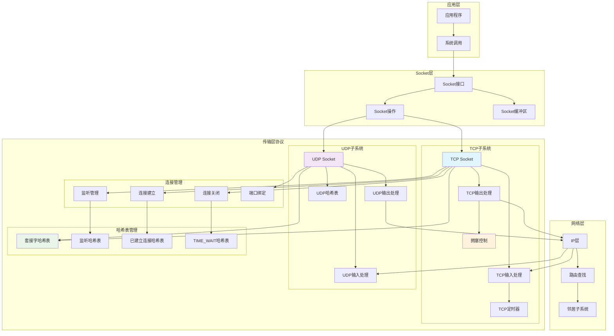
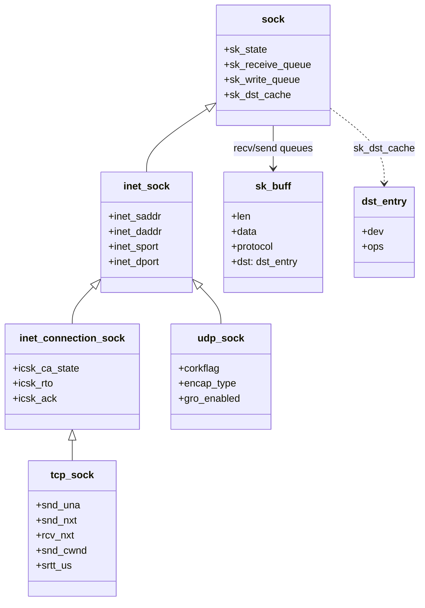
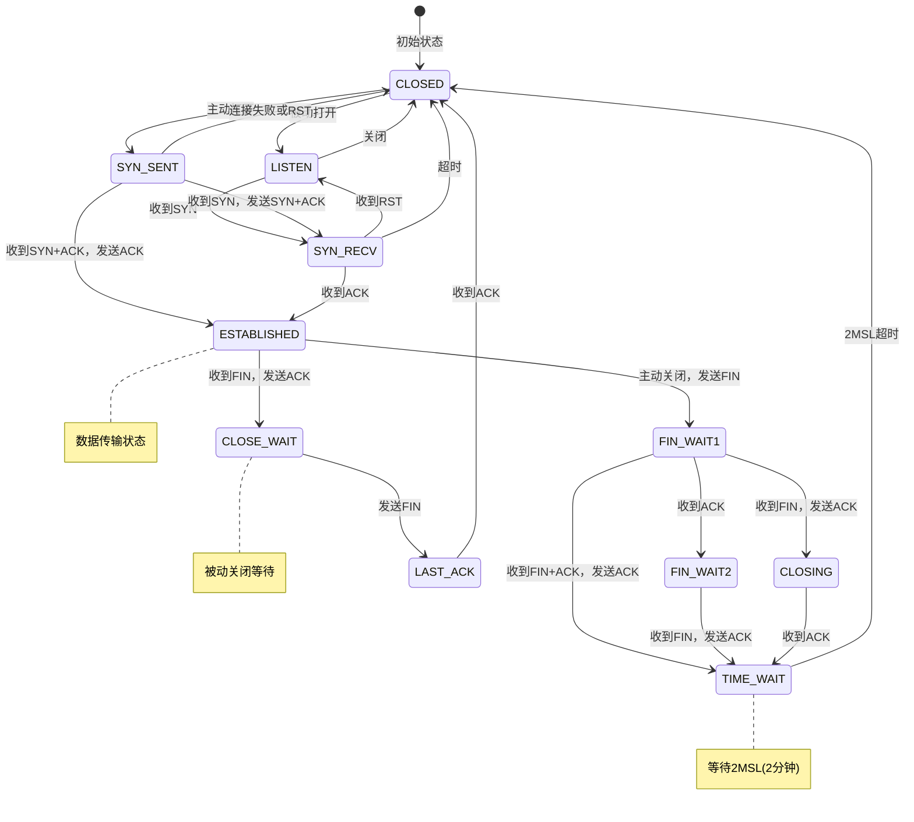
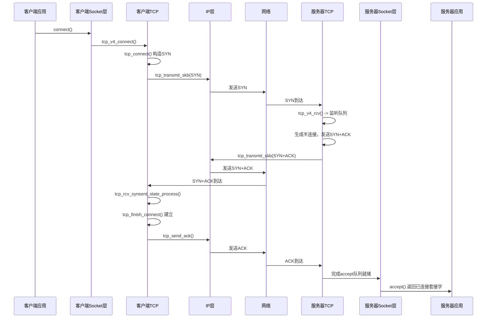
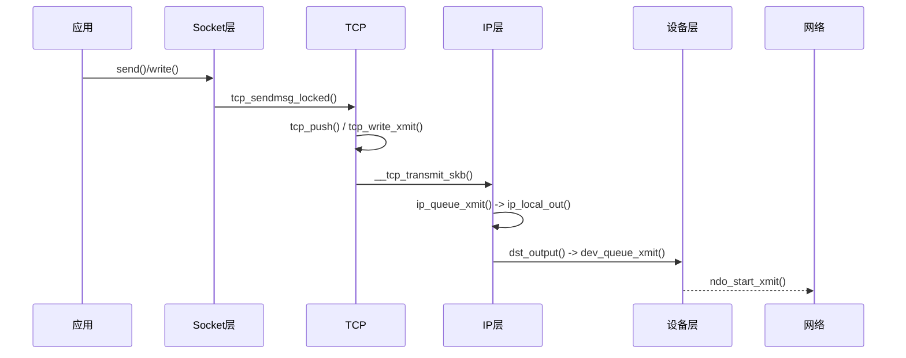
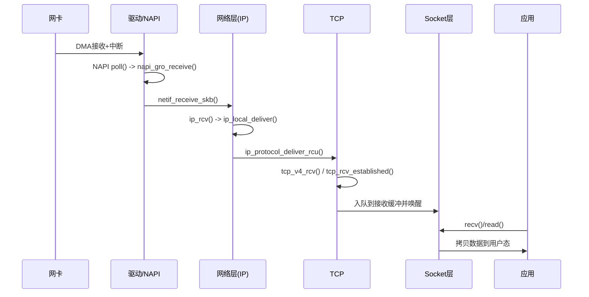
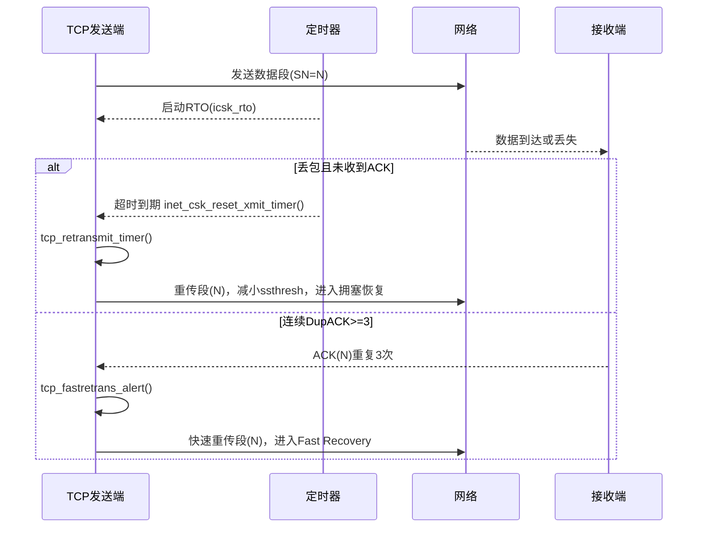
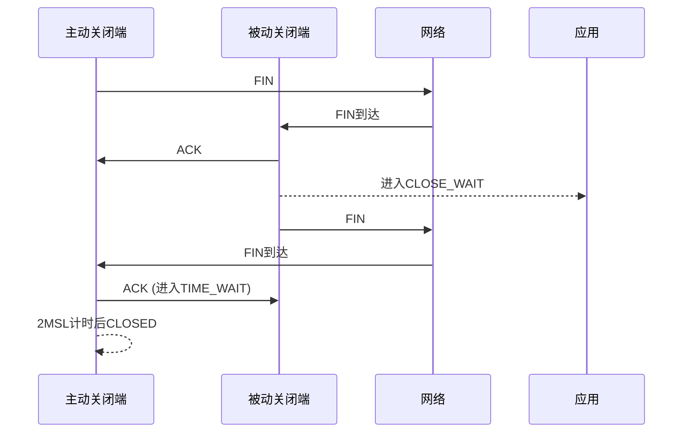
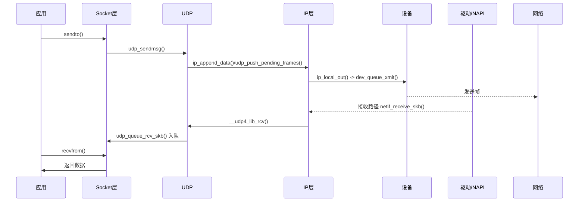

## 概述

传输层是Linux网络协议栈的核心层次，主要负责端到端的可靠数据传输。TCP和UDP协议的实现机制，包括连接管理、拥塞控制、流量控制以及各种优化策略。

<!--more-->

## 1. 传输层架构

### 1.1 传输层核心职责

Linux传输层承担以下关键功能：

- **TCP可靠传输**：提供面向连接的可靠数据传输服务
- **UDP无连接传输**：提供无连接的数据报传输服务
- **端口管理**：管理传输层端口的分配和绑定
- **连接管理**：处理TCP连接的建立、维护和关闭
- **流量控制**：防止发送方压垮接收方
- **拥塞控制**：避免网络拥塞，优化传输性能
- **错误检测与恢复**：检测并恢复传输错误

### 1.2 传输层架构图



### 1.3 关键结构体关系图（传输层）



## 2. TCP协议实现

### 2.1 TCP头部结构

```c
/**
 * TCP头部结构
 * 
 * TCP头部包含了传输层的所有控制信息，是TCP协议
 * 实现可靠传输的基础。
 */
struct tcphdr {
    __be16  source;     /* 源端口号 */
    __be16  dest;       /* 目标端口号 */
    __be32  seq;        /* 序列号 */
    __be32  ack_seq;    /* 确认序列号 */
#if defined(__LITTLE_ENDIAN_BITFIELD)
    __u16   res1:4,     /* 保留位 */
            doff:4,     /* 数据偏移(TCP头长度) */
            fin:1,      /* FIN标志 */
            syn:1,      /* SYN标志 */
            rst:1,      /* RST标志 */
            psh:1,      /* PSH标志 */
            ack:1,      /* ACK标志 */
            urg:1,      /* URG标志 */
            ece:1,      /* ECE标志(ECN回显) */
            cwr:1;      /* CWR标志(拥塞窗口缩减) */
#elif defined(__BIG_ENDIAN_BITFIELD)
    __u16   doff:4,     /* 数据偏移 */
            res1:4,     /* 保留位 */
            cwr:1,      /* CWR标志 */
            ece:1,      /* ECE标志 */
            urg:1,      /* URG标志 */
            ack:1,      /* ACK标志 */
            psh:1,      /* PSH标志 */
            rst:1,      /* RST标志 */
            syn:1,      /* SYN标志 */
            fin:1;      /* FIN标志 */
#else
#error  "Adjust your <asm/byteorder.h> defines"
#endif  
    __be16  window;     /* 窗口大小 */
    __sum16 check;      /* 校验和 */
    __be16  urg_ptr;    /* 紧急指针 */
};

/**
 * TCP套接字结构 - 核心控制块
 * 
 * tcp_sock结构是TCP连接的核心控制块，包含了TCP连接
 * 的所有状态信息、控制参数和统计数据。
 */
struct tcp_sock {
    /* inet_connection_sock 必须是第一个成员 */
    struct inet_connection_sock inet_conn;
    
    /* TCP特有的选项 */
    u16     tcp_header_len;     /* TCP头部长度，包括选项 */
    u16     gso_segs;           /* GSO分段数 */
    
    /*
     * 发送方变量 - RFC793和RFC1122中定义
     */
    __be32  rcv_tstamp;         /* 接收时间戳回显 */
    u32     snd_una;            /* 发送未确认序列号 */
    u32     snd_nxt;            /* 下一个发送序列号 */
    u32     snd_up;             /* 发送紧急指针 */
    u32     snd_wl1;            /* 发送窗口更新的序列号 */
    u32     snd_wl2;            /* 发送窗口更新的确认号 */
    u32     snd_wnd;            /* 发送窗口大小 */
    u32     max_window;         /* 对端通告的最大窗口 */
    u32     mss_cache;          /* 缓存的MSS */
    
    /*
     * 接收方变量
     */
    u32     rcv_nxt;            /* 期望接收的下一个序列号 */
    u32     copied_seq;         /* 已复制给用户的序列号 */
    u32     rcv_wup;            /* 接收窗口更新发送点 */
    u32     rcv_wnd;            /* 接收窗口大小 */
    u32     recv_snd_wnd;       /* 发送给对端的窗口大小 */
    u32     max_ack_backlog;    /* listen backlog的最大值 */
    
    /*
     * 选项相关
     */
    u8      syn_retries;        /* SYN重传次数 */
    u8      ecn_flags;          /* ECN标志 */
    u8      keepalive_probes;   /* keepalive探测次数 */
    u32     srtt_us;            /* 平滑化RTT(微秒) */
    u32     mdev_us;            /* RTT变化(微秒) */
    u32     mdev_max_us;        /* RTT变化的最大值 */
    u32     rttvar_us;          /* RTT变量 */
    u32     rtt_seq;            /* RTT测量序列号 */
    struct  minmax rtt_min;     /* RTT最小值追踪 */
    
    u32     packets_out;        /* 已发送但未确认的包数 */
    u32     retrans_out;        /* 重传包数 */
    u32     max_packets_out;    /* 包输出的最大值 */
    u32     max_packets_seq;    /* 包输出最大值对应的序列号 */
    
    u16     urg_data;           /* 保存的紧急数据 */
    u8      ecn_flags;          /* ECN标志 */
    u8      keepalive_probes;   /* keepalive探测次数 */
    u32     lsndtime;           /* 最后发送数据的时间 */
    
    u32     total_retrans;      /* 总重传次数 */
    u32     urg_seq;            /* 紧急序列号 */
    
    unsigned int    keepalive_time;   /* keepalive超时 */
    unsigned int    keepalive_intvl;  /* keepalive间隔 */
    
    int     linger2;            /* TIME_WAIT超时 */
    
    /*
     * 拥塞控制相关
     */
    u8      ca_state;           /* 拥塞状态 */
    u8      retransmits;        /* 重传次数 */
    u8      pending;            /* 待处理的ACK类型 */
    u8      quick_ack;          /* 快速ACK计数 */
    u8      syn_data;           /* TCP Fast Open SYN data */
    u8      syn_fastopen;       /* SYN包含Fast Open选项 */
    u8      syn_fastopen_exp:1, /* SYN包含实验性Fast Open选项 */
            syn_data_acked:1,   /* SYN数据已确认 */
            save_syn:1,         /* 保存SYN头部和数据 */
            is_cwnd_limited:1;  /* 是否受拥塞窗口限制 */
    
    u32     snd_cwnd;           /* 拥塞窗口 */
    u32     snd_cwnd_cnt;       /* 拥塞窗口计数 */
    u32     snd_cwnd_clamp;     /* 拥塞窗口限制 */
    u32     snd_ssthresh;       /* 慢启动阈值 */
    u32     prior_cwnd;         /* 上一个拥塞窗口 */
    u32     prr_delivered;      /* PRR已交付的字节数 */
    u32     prr_out;            /* PRR输出字节数 */
    u32     delivered;          /* 交付的数据包总数 */
    u32     delivered_ce;       /* 标记ECN的交付包数 */
    u64     bytes_sent;         /* 发送的字节总数 */
    u64     bytes_retrans;      /* 重传的字节总数 */
    u32     dsack_dups;         /* DSACK重复包数 */
    u32     snd_una_time;       /* snd_una未更新的时间 */
    u32     snd_cwnd_stamp;     /* 拥塞窗口时间戳 */
    u32     prior_cwnd;         /* 拥塞恢复前的窗口 */
    u32     prr_delivered;      /* PRR已交付 */
    u32     prr_out;            /* PRR输出 */
    u32     rack.mstamp;        /* RACK时间戳 */
    u8      rack.advanced;      /* RACK高级模式 */
    u8      rack.reord;         /* RACK记录重排序 */
    u8      rack.dsack_seen:1,  /* 看到DSACK */
            unused:5;
    u32     chrono_start;       /* 计时开始时间 */
    u32     chrono_stat[3];     /* 计时统计 */
    u8      chrono_type:2,      /* 计时类型 */
            rate_app_limited:1, /* 应用限制标志 */
            fastopen_connect:1, /* Fast Open连接 */
            fastopen_no_cookie:1, /* 无cookie的Fast Open */
            is_sack_reneg:1,    /* SACK重新协商 */
            fastopen_client_fail:2; /* Fast Open客户端失败 */
    u8      nonagle;            /* Nagle算法禁用 */
    u8      thin_lto:1,         /* 瘦流线性超时 */
            repair:1,
            frto:2,             /* F-RTO算法 */
            repair_queue:2,
            syn_data:1,         /* SYN携带数据 */
            syn_fastopen:1;     /* SYN Fast Open */
    
    u8      do_early_retrans:1, /* 早期重传 */
            syn_data_acked:1,   /* SYN数据已确认 */
            save_syn:2,         /* 保存SYN */
            is_cwnd_limited:1,  /* 拥塞窗口限制 */
            syn_smc:1;          /* SYN SMC */
    
    u32     tlp_high_seq;       /* TLP高序列号 */
    u32     tcp_tx_delay;       /* TCP发送延迟 */
    
    /* RTT测量 */
    u64     tcp_mstamp;         /* 最近的时间戳 */
    u32     srtt_us;            /* 平滑RTT */
    u32     mdev_us;            /* RTT变化 */
    u32     mdev_max_us;        /* RTT变化最大值 */
    u32     rttvar_us;          /* RTT方差 */
    u32     rtt_seq;            /* RTT序列号 */
    struct  minmax rtt_min;     /* RTT最小值 */
    
    u32     prior_ssthresh;     /* 上一个ssthresh */
    u32     high_seq;           /* 恢复期间的最高序列号 */
    u32     retrans_stamp;      /* 重传时间戳 */
    u32     undo_marker;        /* 撤销标记 */
    int     undo_retrans;       /* 撤销重传 */
    u32     undo_cwnd;          /* 撤销拥塞窗口 */
    
    u32     snd_up;             /* 紧急指针 */
    
    /*
     * 选择确认(SACK)相关
     */
    struct tcp_sack_block duplicate_sack[1]; /* DSACK块 */
    struct tcp_sack_block selective_acks[4]; /* SACK块 */
    
    struct tcp_sack_block recv_sack_cache[4]; /* 接收SACK缓存 */
    
    struct sk_buff *highest_sack;   /* SACK记分板中的最高包 */
    
    /* 从这里开始，我们可以安全地忽略 */
    struct sk_buff_head out_of_order_queue; /* 乱序队列 */
    
    struct tcp_md5sig_info __rcu *md5sig_info; /* MD5签名信息 */
    
    /* TCP时间戳 */
    u32     rx_opt_ts;          /* 接收选项时间戳 */
    u32     tsoffset;           /* 时间戳偏移 */
    
    u32     lost_out;           /* 丢失的包数 */
    u32     sacked_out;         /* SACK标记的包数 */
    
    struct hrtimer  pacing_timer; /* pacing定时器 */
    struct hrtimer  compressed_ack_timer; /* 压缩ACK定时器 */
    
    /* 拥塞控制 */
    const struct tcp_congestion_ops *ca_ops; /* 拥塞控制操作 */
    
    u32     app_limited;        /* 应用限制时的delivered */
    
    struct {
        u32 space;              /* 应用接收缓冲区空间 */
    } rcvq_space;
    
    struct {
        u32 probe_seq_start;    /* 拥塞探测起始序列号 */
        u32 probe_seq_end;      /* 拥塞探测结束序列号 */
    } mtu_probe;
    u32     mtu_info;           /* MTU信息 */
    
    bool    is_mptcp;           /* 是否为MPTCP */
    
#ifdef CONFIG_TCP_MD5SIG
    /* TCP MD5签名池 - 此套接字的签名 */
    struct tcp_md5sig_pool __percpu *md5sig_pool;
#endif
};

/* TCP连接状态定义 */
enum {
    TCP_ESTABLISHED = 1,    /* 已建立连接 */
    TCP_SYN_SENT,          /* 已发送SYN */
    TCP_SYN_RECV,          /* 已接收SYN */
    TCP_FIN_WAIT1,         /* 等待连接中断确认 */
    TCP_FIN_WAIT2,         /* 等待连接中断 */
    TCP_TIME_WAIT,         /* 等待足够时间确保对端收到ACK */
    TCP_CLOSE,             /* 关闭 */
    TCP_CLOSE_WAIT,        /* 等待本地连接中断 */
    TCP_LAST_ACK,          /* 等待连接中断确认 */
    TCP_LISTEN,            /* 监听连接请求 */
    TCP_CLOSING,           /* 双向同时关闭 */
    TCP_NEW_SYN_RECV,      /* 新的SYN接收状态 */
    
    TCP_MAX_STATES         /* 保持在最后位置 */
};
```

### 2.2 TCP连接建立流程

```c
/**
 * tcp_v4_connect - 发起TCP连接(客户端)
 * @sk: TCP套接字
 * @uaddr: 目标地址
 * @addr_len: 地址长度
 * 
 * 客户端发起TCP连接的核心函数，实现三次握手的第一步
 * 返回值：成功返回0，失败返回负错误码
 */
int tcp_v4_connect(struct sock *sk, struct sockaddr *uaddr, int addr_len)
{
    struct sockaddr_in *usin = (struct sockaddr_in *)uaddr;
    struct inet_sock *inet = inet_sk(sk);
    struct tcp_sock *tp = tcp_sk(sk);
    __be16 orig_sport, orig_dport;
    __be32 daddr, nexthop;
    struct flowi4 *fl4;
    struct rtable *rt;
    int err;
    struct ip_options_rcu *inet_opt;
    struct inet_timewait_death_row *tcp_death_row = &sock_net(sk)->ipv4.tcp_death_row;
    
    if (addr_len < sizeof(struct sockaddr_in))
        return -EINVAL;
    
    if (usin->sin_family != AF_INET)
        return -EAFNOSUPPORT;
    
    nexthop = daddr = usin->sin_addr.s_addr;
    inet_opt = rcu_dereference_protected(inet->inet_opt,
                                        lockdep_sock_is_held(sk));
    if (inet_opt && inet_opt->opt.srr) {
        if (!daddr)
            return -EINVAL;
        nexthop = inet_opt->opt.faddr;
    }
    
    orig_sport = inet->inet_sport;
    orig_dport = usin->sin_port;
    fl4 = &inet->cork.fl.u.ip4;
    rt = ip_route_connect(fl4, nexthop, inet->inet_saddr,
                         RT_CONN_FLAGS(sk), sk->sk_bound_dev_if,
                         IPPROTO_TCP,
                         orig_sport, orig_dport, sk);
    if (IS_ERR(rt)) {
        err = PTR_ERR(rt);
        if (err == -ENETUNREACH)
            __IP_INC_STATS(sock_net(sk), IPSTATS_MIB_OUTNOROUTES);
        return err;
    }
    
    if (rt->rt_flags & (RTCF_MULTICAST | RTCF_BROADCAST)) {
        ip_rt_put(rt);
        return -ENETUNREACH;
    }
    
    if (!inet_opt || !inet_opt->opt.srr)
        daddr = fl4->daddr;
    
    if (!inet->inet_saddr) {
        if (inet_csk(sk)->icsk_bind2_hash)
            inet_put_port(sk);
        inet->inet_saddr = fl4->saddr;
    }
    sk_daddr_set(sk, daddr);
    inet->inet_dport = usin->sin_port;
    sk_set_txhash(sk);
    
    inet_csk(sk)->icsk_ext_hdr_len = 0;
    if (inet_opt)
        inet_csk(sk)->icsk_ext_hdr_len = inet_opt->opt.optlen;
    
    tp->rx_opt.mss_clamp = TCP_MSS_DEFAULT;
    
    /* Socket身份已确定，可以锁定哈希表并设置状态 */
    tcp_set_state(sk, TCP_SYN_SENT);
    err = inet_hash_connect(tcp_death_row, sk);
    if (err)
        goto failure;
    
    sk_set_txhash(sk);
    
    rt = ip_route_newports(fl4, rt, orig_sport, orig_dport,
                          inet->inet_sport, inet->inet_dport, sk);
    if (IS_ERR(rt)) {
        err = PTR_ERR(rt);
        rt = NULL;
        goto failure;
    }
    /* OK, 现在提交目标和路由 */
    tcp_death_row = &sock_net(sk)->ipv4.tcp_death_row;
    sk_setup_caps(sk, &rt->dst);
    rt = NULL;
    
    if (likely(!tp->repair)) {
        if (!tp->write_seq)
            WRITE_ONCE(tp->write_seq,
                      secure_tcp_seq(inet->inet_saddr,
                                    inet->inet_daddr,
                                    inet->inet_sport,
                                    usin->sin_port));
        tp->tsoffset = secure_tcp_ts_off(sock_net(sk),
                                        inet->inet_saddr,
                                        inet->inet_daddr);
    }
    
    inet->inet_id = prandom_u32();
    
    if (tcp_fastopen_defer_connect(sk, &err))
        return err;
    if (err)
        goto failure;
    
    err = tcp_connect(sk);
    
    if (err)
        goto failure;
    
    return 0;
    
failure:
    /*
     * 此不快乐的结局删除了我们上面分配的本地端口，
     * 以及已设置的路由。没有其他方法可以这样做。
     * 当连接处于SYN_SENT状态时，它还会删除哈希表条目。
     */
    tcp_set_state(sk, TCP_CLOSE);
    if (!(sk->sk_userlocks & SOCK_BINDADDR_LOCK))
        inet_reset_saddr(sk);
    ip_rt_put(rt);
    sk->sk_route_caps = 0;
    inet->inet_dport = 0;
    return err;
}

/**
 * tcp_connect - 发送SYN数据包
 * @sk: TCP套接字
 * 
 * 构造并发送TCP SYN数据包，开始三次握手
 * 返回值：成功返回0，失败返回负错误码
 */
int tcp_connect(struct sock *sk)
{
    struct tcp_sock *tp = tcp_sk(sk);
    struct sk_buff *buff;
    int err;
    
    tcp_call_bpf(sk, BPF_SOCK_OPS_TCP_CONNECT_CB, 0, NULL);
    
    if (inet_csk(sk)->icsk_af_ops->rebuild_header(sk))
        return -EHOSTUNREACH; /* 路由失败 */
    
    tcp_connect_init(sk);
    
    if (unlikely(tp->repair)) {
        tcp_finish_connect(sk, NULL);
        return 0;
    }
    
    buff = tcp_stream_alloc_skb(sk, 0, sk->sk_allocation, true);
    if (unlikely(!buff))
        return -ENOBUFS;
    
    tcp_init_nondata_skb(buff, tp->write_seq++, TCPHDR_SYN);
    tcp_mstamp_refresh(tp);
    tp->retrans_stamp = tcp_time_stamp(tp);
    tcp_connect_queue_skb(sk, buff);
    tcp_ecn_send_syn(sk, buff);
    tcp_rbtree_insert(&sk->tcp_rtx_queue, buff);
    
    /* 发送它，这将设置我们的状态为TCP_SYN_SENT */
    err = tp->fastopen_req ? tcp_send_syn_data(sk, buff) :
                            tcp_transmit_skb(sk, buff, 1, sk->sk_allocation);
    if (err == -ECONNREFUSED)
        return err;
    
    /* 我们改变了套接字，需要它被哈希处理 */
    tcp_insert_write_queue_before(buff, tcp_send_head(sk), sk);
    
    /* 计时器用于重传SYN */
    inet_csk_reset_xmit_timer(sk, ICSK_TIME_RETRANS,
                             inet_csk(sk)->icsk_rto, TCP_RTO_MAX);
    return 0;
}

/**
 * tcp_rcv_synsent_state_process - 处理SYN_SENT状态的输入
 * @sk: TCP套接字  
 * @skb: 接收到的数据包
 * @th: TCP头部
 * @len: 数据长度
 * 
 * 处理处于SYN_SENT状态的套接字收到的数据包
 * 返回值：处理结果
 */
static int tcp_rcv_synsent_state_process(struct sock *sk, struct sk_buff *skb,
                                       const struct tcphdr *th)
{
    struct inet_connection_sock *icsk = inet_csk(sk);
    struct tcp_sock *tp = tcp_sk(sk);
    struct tcp_fastopen_cookie foc = { .len = -1 };
    int saved_clamp = tp->rx_opt.mss_clamp;
    bool fastopen_fail;
    
    tcp_parse_options(sock_net(sk), skb, &tp->rx_opt, 0, &foc);
    if (tp->rx_opt.saw_tstamp && tp->rx_opt.rcv_tsecr)
        tp->rx_opt.rcv_tsecr -= tp->tsoffset;
    
    if (th->ack) {
        /* rfc793:
         * "如果ACK位被设置
         *
         *   如果SEG.ACK =< ISS 或者 SEG.ACK > SND.NXT, 发送
         *   一个reset (除非RST位被设置, 如果是这样就丢弃
         *   这个segment)，并且丢弃这个segment. 返回。
         *
         *   如果SND.UNA =< SEG.ACK =< SND.NXT 那么ACK是可接受的。"
         */
        if (!after(TCP_SKB_CB(skb)->ack_seq, tp->snd_una) ||
            after(TCP_SKB_CB(skb)->ack_seq, tp->snd_nxt)) {
            /* 如果有RST，完全忽略segment */
            if (th->rst)
                goto discard;
            goto reset_and_undo;
        }
        
        if (tp->rx_opt.saw_tstamp && tp->rx_opt.rcv_tsecr &&
            !between(tp->rx_opt.rcv_tsecr, tp->retrans_stamp,
                    tcp_time_stamp(tp))) {
            NET_INC_STATS(sock_net(sk),
                         LINUX_MIB_PAWSACTIVEREJECTED);
            goto reset_and_undo;
        }
        
        /* 现在ACK是可接受的 */
        tcp_finish_connect(sk, skb);
        
        fastopen_fail = (tp->syn_fastopen || tp->syn_data) &&
                       tcp_rcv_fastopen_synack(sk, skb, &foc);
        
        if (!sock_flag(sk, SOCK_DEAD)) {
            sk->sk_state_change(sk);
            sk_wake_async(sk, SOCK_WAKE_IO, POLL_OUT);
        }
        if (fastopen_fail)
            return -1;
        if (sk->sk_write_pending ||
            icsk->icsk_accept_queue.rskq_defer_accept ||
            inet_csk_in_pingpong_mode(sk)) {
            /* 保存一个ACK. 让它们合并时自动释放内存 */
            inet_csk_schedule_ack(sk);
            tcp_enter_quickack_mode(sk, TCP_MAX_QUICKACKS);
            inet_csk_reset_xmit_timer(sk, ICSK_TIME_DACK,
                                    TCP_DELACK_MAX, TCP_RTO_MAX);
            
discard:
            tcp_drop(sk, skb);
            return 0;
        } else {
            tcp_send_ack(sk);
        }
        return -1;
    }
    
    /* 没有ACK在segment中 */
    if (th->rst) {
        /* rfc793: 
         * "如果RST位被设置
         *
         *      否则 (没有ACK) 丢弃segment并且返回。"
         */
        goto discard;
    }
    
    /* PAWS检查. */
    if (tcp_paws_reject(&tp->rx_opt, 0))
        goto discard_and_undo;
    
    if (th->syn) {
        /* 我们看到一个SYN，所以我们发送一个ACK.  如果这个segment不是SYN+ACK，
         * 那么我们发送一个ACK.
         */
        TCP_INC_STATS(sock_net(sk), TCP_MIB_PASSIVEOPENS);
        
        /* 在rfc793第71页, SYN_SENT: 
         *
         *    "如果SYN位在这个segment被设置, 更新连接状态变量,
         *     发送一个ACK segment
         *
         *        <SEQ=SND.NXT><ACK=RCV.NXT><CTL=ACK>
         *
         *     连接进入ESTABLISHED状态。
         *
         *     如果segment承认我们的SYN (它承认我们的SYN) 然后
         *     进入ESTABLISHED状态，否则进入SYN_RECV."
         */
        
        tcp_ecn_rcv_syn(sk, th);
        
        tcp_init_wl(tp, TCP_SKB_CB(skb)->seq);
        tcp_ack(sk, skb, FLAG_SLOWPATH);
        
        /* Ok.. 它在看起来，它的一个连接建立 packet
         * 交换选项。 计算MSS等等。 实际上连接建立已经
         * 基本上完成了..
         *
         * XXX 在这里做慢启动。然而，接收到的数据可能
         * 使我们进入快速恢复，我们必须小心不要重复数据包。
         */
        if (!th->ack && !th->rst && !th->fin)
            goto discard;
        
        /* ack_seq != tcp_sk(sk)->snd_nxt 可能是对old duplicate segment
         * 的合法ack，或者一个early ack。
         */
        if (!th->ack || !TCP_SKB_CB(skb)->ack_seq)
            goto discard;
        
        TCP_ECN_rcv_synack(tp, th);
        
        tcp_init_wl(tp, TCP_SKB_CB(skb)->seq);
        tcp_finish_connect(sk, skb);
        
        if ((int)skb->len > 0 || th->fin) {
            tcp_send_ack(sk);
            return -1;
        } else {
            tcp_send_ack(sk);
        }
        return -1;
    } else {
        tcp_send_ack(sk);
    }
    
reset_and_undo:
    tcp_clear_options(&tp->rx_opt);
    tp->rx_opt.mss_clamp = saved_clamp;
    tcp_send_challenge_ack(sk, skb);
reset:
    tcp_reset(sk, skb);
discard_and_undo:
    tcp_clear_options(&tp->rx_opt);
    tp->rx_opt.mss_clamp = saved_clamp;
discard:
    tcp_drop(sk, skb);
    return 0;
}
```

### 2.3 TCP状态机转换



### 2.4 三次握手时序图（主动/被动）



### 2.5 TCP数据发送路径时序图



### 2.6 TCP数据接收路径时序图



### 2.7 超时重传与快速重传时序图



### 2.8 连接终止（四次挥手）时序图



## 3. UDP协议实现

### 3.1 UDP头部结构与套接字

```c
/**
 * UDP头部结构
 * 
 * UDP头部相对简单，只包含基本的端口信息和长度校验和
 */
struct udphdr {
    __be16  source;     /* 源端口号 */
    __be16  dest;       /* 目标端口号 */
    __be16  len;        /* UDP长度(包括头部和数据) */
    __sum16 check;      /* 校验和 */
};

/**
 * UDP套接字结构
 * 
 * udp_sock结构相对简单，因为UDP是无连接协议
 */
struct udp_sock {
    /* inet_sock 必须是第一个成员 */
    struct inet_sock inet;
    
    int      pending;       /* 当前pending的操作 */
    unsigned int corkflag;  /* Cork位掩码 */
    
    __u8     encap_type;    /* 封装类型 */
    
    unsigned char no_check6_tx:1,   /* 发送时不计算IPv6校验和 */
                  no_check6_rx:1,   /* 接收时不验证IPv6校验和 */
                  encap_enabled:1,  /* 启用UDP封装 */
                  gro_enabled:1,    /* 启用GRO */
                  accept_udp_l4:1,  /* 接受UDP L4 */
                  accept_udp_fraglist:1; /* 接受UDP分片列表 */
    
    /*
     * UDP封装相关的回调函数
     * 用于实现VXLAN、GUE等隧道协议
     */
    int (*encap_rcv)(struct sock *sk, struct sk_buff *skb);
    int (*encap_err_lookup)(struct sock *sk, struct sk_buff *skb);
    void (*encap_destroy)(struct sock *sk);
    
    /* GRO相关函数 */
    struct sk_buff *(*gro_receive)(struct sock *sk,
                                   struct list_head *head,
                                   struct sk_buff *skb);
    int (*gro_complete)(struct sock *sk, struct sk_buff *skb, int nhoff);
    
    /* 用于BPF程序的额外空间 */
    struct sk_buff_head reader_queue ____cacheline_aligned_in_smp;
    int forward_deficit;
    
    /* UDP套接字的哈希表节点 */
    struct udp_hslot *udp_portaddr_hash;
    unsigned int udp_portaddr_node;
};

/**
 * UDP哈希表槽结构
 * 
 * UDP使用哈希表来快速查找套接字
 */
struct udp_hslot {
    struct hlist_head   head;   /* 哈希链表头 */
    int                 count;  /* 当前槽中的套接字数量 */
    spinlock_t          lock;   /* 保护此槽的自旋锁 */
} __attribute__((aligned(2 * sizeof(long))));

/**
 * UDP哈希表结构
 */
struct udp_table {
    struct udp_hslot    *hash;      /* 哈希表数组 */
    struct udp_hslot    *hash2;     /* 第二级哈希表 */
    unsigned int        mask;       /* 哈希表掩码 */
    unsigned int        log;        /* 哈希表大小的对数 */
};
```

### 3.2 UDP数据包处理

```c
/**
 * __udp4_lib_rcv - UDP数据包接收处理
 * @skb: 接收到的数据包
 * @udptable: UDP哈希表
 * 
 * UDP数据包接收的核心处理函数
 * 返回值：处理结果
 */
int __udp4_lib_rcv(struct sk_buff *skb, struct udp_table *udptable,
                   int proto)
{
    struct sock *sk;
    struct udphdr *uh;
    unsigned short ulen;
    struct rtable *rt = skb_rtable(skb);
    __be32 saddr, daddr;
    struct net *net = dev_net(skb->dev);
    bool refcounted;
    int drop_reason;
    
    drop_reason = SKB_DROP_REASON_NOT_SPECIFIED;
    
    /*
     * 验证UDP头部
     */
    if (!pskb_may_pull(skb, sizeof(struct udphdr)))
        goto drop;              /* 没有空间给UDP头部 */
    
    uh = udp_hdr(skb);
    ulen = ntohs(uh->len);
    saddr = ip_hdr(skb)->saddr;
    daddr = ip_hdr(skb)->daddr;
    
    if (ulen > skb->len)
        goto short_packet;
    
    if (proto == IPPROTO_UDP) {
        /* UDP校验和验证 */
        if (udp_checksum_complete(skb))
            goto csum_error;
    } else if (proto == IPPROTO_UDPLITE) {
        /* UDP-Lite校验和验证 */  
        if (udplite_checksum_complete(skb))
            goto csum_error;
    }
    
    /* 如果这是广播/组播包，可能需要处理多个套接字 */
    if (rt->rt_flags & (RTCF_BROADCAST|RTCF_MULTICAST))
        return __udp4_lib_mcast_deliver(net, skb, uh,
                                       saddr, daddr, udptable, proto);
    
    sk = __udp4_lib_lookup_skb(skb, uh->source, uh->dest, udptable);
    if (sk) {
        int ret;
        
        if (inet_get_convert_csum(sk) && uh->check && !IS_UDPLITE(sk))
            skb_checksum_try_convert(skb, IPPROTO_UDP, uh->check,
                                   inet_compute_pseudo);
        
        ret = udp_queue_rcv_skb(sk, skb);
        
        /* 现在释放套接字的引用 */
        if (refcounted)
            sock_put(sk);
        return ret;
    }
    
    /*
     * 没有找到套接字 - 发送ICMP端口不可达
     */
    if (!xfrm4_policy_check(NULL, XFRM_POLICY_IN, skb))
        goto drop;
    nf_reset_ct(skb);
    
    /* 没有找到套接字，丢弃包并发送ICMP */
    __UDP_INC_STATS(net, UDP_MIB_NOPORTS, proto == IPPROTO_UDPLITE);
    icmp_send(skb, ICMP_DEST_UNREACH, ICMP_PORT_UNREACH, 0);
    
    /*
     * 当前内核版本的Hmm 检查 - 我们接收到的UDP packets 在传输时出现校验和错误，
     * UDP层在接收时修复校验和错误，结果出现错误的校验和。
     * 这种情况应该很少见，除非有人发送假包。
     */
drop:
    __UDP_INC_STATS(net, UDP_MIB_INERRORS, proto == IPPROTO_UDPLITE);
    kfree_skb_reason(skb, drop_reason);
    return 0;
    
short_packet:
    drop_reason = SKB_DROP_REASON_PKT_TOO_SMALL;
    net_dbg_ratelimited("UDP%s: short packet: From %pI4:%u %d/%d to %pI4:%u\n",
                       proto == IPPROTO_UDPLITE ? "Lite" : "",
                       &saddr, ntohs(uh->source),
                       ulen, skb->len,
                       &daddr, ntohs(uh->dest));
    goto drop;
    
csum_error:
    /* 
     * RFC 768: 接收方应该丢弃校验和错误的UDP包
     */
    drop_reason = SKB_DROP_REASON_UDP_CSUM;
    __UDP_INC_STATS(net, UDP_MIB_CSUMERRORS, proto == IPPROTO_UDPLITE);
    
    net_dbg_ratelimited("UDP%s: bad checksum. From %pI4:%u to %pI4:%u ulen %d\n",
                       proto == IPPROTO_UDPLITE ? "Lite" : "",
                       &saddr, ntohs(uh->source), &daddr,
                       ntohs(uh->dest), ulen);
    
    goto drop;
}

/**
 * udp_queue_rcv_skb - 将UDP数据包入队到套接字
 * @sk: 目标套接字
 * @skb: 数据包
 * 
 * 将接收到的UDP数据包加入套接字接收队列
 * 返回值：处理结果
 */
int udp_queue_rcv_skb(struct sock *sk, struct sk_buff *skb)
{
    struct udp_sock *up = udp_sk(sk);
    int is_udplite = IS_UDPLITE(sk);
    
    /*
     * 检查套接字过滤器
     */
    if (sk_filter_trim_cap(sk, skb, sizeof(struct udphdr)))
        goto drop;
    
    if (sk_rcvqueues_full(sk, sk->sk_rcvbuf)) {
        __UDP_INC_STATS(sock_net(sk), UDP_MIB_RCVBUFERRORS, is_udplite);
        goto drop;
    }
    
    skb_dst_drop(skb);
    
    /*
     * 处理UDP封装
     */
    if (up->encap_type) {
        int (*encap_rcv)(struct sock *sk, struct sk_buff *skb);
        
        /*
         * 这是一个封装的数据包 - 调用封装处理函数
         */
        encap_rcv = READ_ONCE(up->encap_rcv);
        if (encap_rcv) {
            int ret;
            
            /* 验证校验和(如果需要) */
            if (skb_checksum_complete(skb)) {
                __UDP_INC_STATS(sock_net(sk),
                               UDP_MIB_CSUMERRORS, is_udplite);
                goto drop;
            }
            
            ret = encap_rcv(sk, skb);
            if (ret <= 0) {
                __UDP_INC_STATS(sock_net(sk),
                               UDP_MIB_INDATAGRAMS, is_udplite);
                return -ret;
            }
        }
        
        /* FALLTHROUGH -- 继续普通处理 */
    }
    
    /*
     * 普通UDP数据包处理
     */
    if (inet_get_convert_csum(sk) && skb_checksum_complete(skb))
        goto csum_error;
    
    if (sk_rcvqueues_full(sk, sk->sk_rcvbuf))
        goto drop;
    
    if (skb_checksum_complete(skb))
        goto csum_error;
    
    if (sock_queue_rcv_skb(sk, skb) < 0)
        goto drop;
    
    __UDP_INC_STATS(sock_net(sk), UDP_MIB_INDATAGRAMS, is_udplite);
    return 0;
    
csum_error:
    __UDP_INC_STATS(sock_net(sk), UDP_MIB_CSUMERRORS, is_udplite);
drop:
    __UDP_INC_STATS(sock_net(sk), UDP_MIB_INERRORS, is_udplite);
    kfree_skb(skb);
    return -1;
}

/**
 * udp_sendmsg - UDP数据包发送
 * @sk: UDP套接字
 * @msg: 消息结构
 * @len: 数据长度
 * 
 * UDP数据包发送的核心函数
 * 返回值：发送的字节数或错误码
 */
int udp_sendmsg(struct sock *sk, struct msghdr *msg, size_t len)
{
    struct inet_sock *inet = inet_sk(sk);
    struct udp_sock *up = udp_sk(sk);
    DECLARE_SOCKADDR(struct sockaddr_in *, usin, msg->msg_name);
    struct flowi4 fl4_stack;
    struct flowi4 *fl4 = NULL;
    int ulen = len;
    struct ipcm_cookie ipc;
    struct rtable *rt = NULL;
    int free = 0;
    int connected = 0;
    __be32 daddr, faddr, saddr;
    __be16 dport;
    u8  tos;
    int err, is_udplite = IS_UDPLITE(sk);
    int corkreq = READ_ONCE(up->corkflag) || msg->msg_flags&MSG_MORE;
    int (*getfrag)(void *, char *, int, int, int, struct sk_buff *);
    struct sk_buff *skb;
    struct ip_options_data opt_copy;
    
    if (len > 0xFFFF)
        return -EMSGSIZE;
    
    /*
     * 检查标志位
     */
    if (msg->msg_flags & MSG_OOB) /* Mirror BSD error message compatibility */
        return -EOPNOTSUPP;
    
    getfrag = is_udplite ? udplite_getfrag : ip_generic_getfrag;
    
    fl4 = &inet->cork.fl.u.ip4;
    if (up->pending) {
        /*
         * 这里有一个待处理的缓冲区。
         * 完成发送时我们必须使用相同的目标
         */
        lock_sock(sk);
        if (likely(up->pending)) {
            if (unlikely(up->pending != AF_INET)) {
                release_sock(sk);
                return -EINVAL;
            }
            goto do_append_data;
        }
        release_sock(sk);
    }
    ulen += sizeof(struct udphdr);
    
    /*
     * 获取并验证目标地址
     */
    if (usin) {
        if (msg->msg_namelen < sizeof(*usin))
            return -EINVAL;
        if (usin->sin_family != AF_INET) {
            if (usin->sin_family != AF_UNSPEC)
                return -EAFNOSUPPORT;
        }
        
        daddr = usin->sin_addr.s_addr;
        dport = usin->sin_port;
        if (dport == 0)
            return -EINVAL;
    } else {
        if (sk->sk_state != TCP_ESTABLISHED)
            return -EDESTADDRREQ;
        daddr = inet->inet_daddr;
        dport = inet->inet_dport;
        /* 在UDP中打开fast path */
        connected = 1;
    }
    
    ipcm_init_sk(&ipc, inet);
    ipc.gso_size = READ_ONCE(up->gso_size);
    
    if (msg->msg_controllen) {
        err = udp_cmsg_send(sk, msg, &ipc.gso_size);
        if (err > 0)
            err = ip_cmsg_send(sk, msg, &ipc,
                              sk->sk_family == AF_INET6);
        if (unlikely(err < 0)) {
            kfree(ipc.opt);
            return err;
        }
        if (ipc.opt)
            free = 1;
        connected = 0;
    }
    
    if (!ipc.opt) {
        struct ip_options_rcu *inet_opt;
        
        rcu_read_lock();
        inet_opt = rcu_dereference(inet->inet_opt);
        if (inet_opt) {
            memcpy(&opt_copy, inet_opt,
                   sizeof(*inet_opt) + inet_opt->opt.optlen);
            ipc.opt = &opt_copy.opt;
        }
        rcu_read_unlock();
    }
    
    if (cgroup_bpf_enabled(CGROUP_UDP4_SENDMSG) && !connected) {
        err = BPF_CGROUP_RUN_PROG_UDP4_SENDMSG_LOCK(sk,
                                                   (struct sockaddr *)usin,
                                                   &ipc.addr);
        if (err)
            goto out_free;
        if (usin) {
            if (usin->sin_port == 0) {
                /* BPF程序设置了无效端口，拒绝包。 */
                err = -EINVAL;
                goto out_free;
            }
            daddr = usin->sin_addr.s_addr;
            dport = usin->sin_port;
        }
    }
    
    saddr = ipc.addr;
    ipc.addr = faddr = daddr;
    
    if (ipc.opt && ipc.opt->opt.srr) {
        if (!daddr) {
            err = -EINVAL;
            goto out_free;
        }
        faddr = ipc.opt->opt.faddr;
        connected = 0;
    }
    tos = get_rttos(&ipc, inet);
    if (sock_flag(sk, SOCK_LOCALROUTE) ||
        (msg->msg_flags & MSG_DONTROUTE) ||
        (ipc.opt && ipc.opt->opt.is_strictroute)) {
        tos |= RTO_ONLINK;
        connected = 0;
    }
    
    if (ipv4_is_multicast(daddr)) {
        if (!ipc.oif || netif_index_is_l3_master(sock_net(sk), ipc.oif))
            ipc.oif = inet->mc_index;
        if (!saddr)
            saddr = inet->mc_addr;
        connected = 0;
    } else if (!ipc.oif) {
        ipc.oif = inet->uc_index;
    } else if (ipv4_is_lbcast(daddr) && inet->uc_index) {
        /* oif是L3主设备，但daddr是L2广播，
         * _and_ uc_index被设置，然后我们必须使用它在路由查找中
         * 以确保我们选择正确的输出路径；我们不能依赖oif。
         */
        ipc.oif = inet->uc_index;
    }
    
    if (connected)
        rt = (struct rtable *)sk_dst_check(sk, 0);
    
    if (!rt) {
        struct net *net = sock_net(sk);
        __u8 flow_flags = inet_sk_flowi_flags(sk);
        
        fl4 = &fl4_stack;
        
        flowi4_init_output(fl4, ipc.oif, ipc.sockc.mark, tos,
                          RT_SCOPE_UNIVERSE, sk->sk_protocol,
                          flow_flags,
                          faddr, saddr, dport, inet->inet_sport,
                          sk->sk_uid);
        
        security_sk_classify_flow(sk, flowi4_to_flowi(fl4));
        rt = ip_route_output_flow(net, fl4, sk);
        if (IS_ERR(rt)) {
            err = PTR_ERR(rt);
            rt = NULL;
            if (err == -ENETUNREACH)
                __IP_INC_STATS(net, IPSTATS_MIB_OUTNOROUTES);
            goto out;
        }
        
        err = -EACCES;
        if ((rt->rt_flags & RTCF_BROADCAST) &&
            !sock_flag(sk, SOCK_BROADCAST))
            goto out;
        if (connected)
            sk_dst_set(sk, dst_clone(&rt->dst));
    }
    
    if (msg->msg_flags&MSG_CONFIRM)
        goto do_confirm;
back_from_confirm:
    
    saddr = fl4->saddr;
    if (!ipc.addr)
        daddr = ipc.addr = fl4->daddr;
    
    /* 锁套接字并追加数据 */
    if (unlikely(up->pending)) {
        /* 这意味着在我们释放锁之前某些其他线程设置了CORK。
         */
        err = -EAGAIN;
        goto out;
    }
    up->len += ulen;
    err = ip_append_data(sk, fl4, getfrag, msg, ulen,
                        sizeof(struct udphdr), &ipc, &rt,
                        corkreq ? msg->msg_flags|MSG_MORE : msg->msg_flags);
    if (err)
        udp_flush_pending_frames(sk);
    else if (!corkreq)
        err = udp_push_pending_frames(sk);
    else if (unlikely(skb_queue_empty(&sk->sk_write_queue)))
        up->pending = 0;
    release_sock(sk);
    
out:
    ip_rt_put(rt);
out_free:
    if (free)
        kfree(ipc.opt);
    if (!err)
        return len;
    /*
     * ENOBUFS = 本地没有内核内存
     * EAGAIN = 需要重新路由
     */
    if (err == -ENOBUFS || test_bit(SOCK_NOSPACE, &sk->sk_socket->flags)) {
        UDP_INC_STATS(sock_net(sk),
                     UDP_MIB_SNDBUFERRORS, is_udplite);
    }
    return err;
    
do_confirm:
    if (msg->msg_flags & MSG_PROBE)
        dst_confirm_neigh(&rt->dst, &fl4->daddr);
    if (!(msg->msg_flags&MSG_PROBE) || len)
        goto back_from_confirm;
    err = 0;
    goto out;
    
do_append_data:
    up->len += ulen;
    err = ip_append_data(sk, fl4, getfrag, msg, ulen,
                        sizeof(struct udphdr), &ipc, &rt,
                        corkreq ? msg->msg_flags|MSG_MORE : msg->msg_flags);
    if (err)
        udp_flush_pending_frames(sk);
    else if (!corkreq)
        err = udp_push_pending_frames(sk);
    release_sock(sk);
    goto out;
}
```

### 3.3 UDP收发时序图



## 4. TCP拥塞控制算法

### 4.1 拥塞控制算法框架

```c
/**
 * tcp_congestion_ops - TCP拥塞控制算法接口
 */
struct tcp_congestion_ops {
    struct list_head    list;           /* 全局拥塞控制算法列表 */
    u32                 key;            /* 算法标识 */
    u32                 flags;          /* 算法标志 */
    
    /* 初始化和清理 */
    void (*init)(struct sock *sk);      /* 初始化函数 */
    void (*release)(struct sock *sk);   /* 释放函数 */
    
    /* 拥塞控制事件 */
    void (*cong_control)(struct sock *sk, const struct rate_sample *rs);
    void (*cong_avoid)(struct sock *sk, u32 ack, u32 acked); /* 拥塞避免 */
    u32  (*ssthresh)(struct sock *sk);  /* 计算慢启动阈值 */
    u32  (*undo_cwnd)(struct sock *sk); /* 撤销拥塞窗口减小 */
    void (*cwnd_event)(struct sock *sk, enum tcp_ca_event ev); /* 窗口事件 */
    
    /* 估算函数 */
    u32  (*min_tso_segs)(struct sock *sk); /* 最小TSO段数 */
    u32  (*sndbuf_expand)(struct sock *sk); /* 发送缓冲区扩展 */
    
    char    name[TCP_CA_NAME_MAX];      /* 算法名称 */
    struct module *owner;               /* 模块所有者 */
};
```

### 4.2 Cubic拥塞控制算法

```c
/**
 * bictcp - Cubic算法私有数据
 */
struct bictcp {
    u32 cnt;            /* 增长计数器 */
    u32 last_max_cwnd;  /* 上次最大窗口 */
    u32 last_cwnd;      /* 上次拥塞窗口 */
    u32 last_time;      /* 上次时间 */
    u32 bic_origin_point; /* 原点 */
    u32 bic_K;          /* 时间周期 */
    u32 delay_min;      /* 最小延迟 */
    u32 epoch_start;    /* 纪元开始时间 */
    u32 ack_cnt;        /* ACK计数 */
    u32 tcp_cwnd;       /* 估计的TCP窗口 */
    u16 unused;         /* 未使用 */
    u8  sample_cnt;     /* 采样计数 */
    u8  found;          /* 已找到最优点 */
    u32 round_start;    /* 回合开始 */
    u32 end_seq;        /* 结束序列号 */
    u32 last_ack;       /* 最后ACK */
    u32 curr_rtt;       /* 当前RTT */
};

/**
 * bictcp_cong_avoid - Cubic拥塞避免算法
 * @sk: 套接字
 * @ack: 确认号
 * @acked: 确认的数据包数
 */
static void bictcp_cong_avoid(struct sock *sk, u32 ack, u32 acked)
{
    struct tcp_sock *tp = tcp_sk(sk);
    struct bictcp *ca = inet_csk_ca(sk);
    
    if (!tcp_is_cwnd_limited(sk))
        return;
    
    if (tcp_in_slow_start(tp)) {
        /* 慢启动阶段：指数增长 */
        if (hystart && after(ack, ca->end_seq))
            bictcp_hystart_reset(sk);
        acked = tcp_slow_start(tp, acked);
        if (!acked)
            return;
    }
    
    /* 拥塞避免阶段：Cubic函数增长 */
    bictcp_update(ca, tp->snd_cwnd, acked);
    tcp_cong_avoid_ai(tp, ca->cnt, acked);
}

/**
 * bictcp_update - 更新Cubic算法参数
 * @ca: Cubic私有数据
 * @cwnd: 当前拥塞窗口
 * @acked: 确认的数据包数
 */
static void bictcp_update(struct bictcp *ca, u32 cwnd, u32 acked)
{
    u32 delta, bic_target, max_cnt;
    u64 offs, t;
    
    ca->ack_cnt += acked; /* 统计确认包数 */
    
    if (ca->last_cwnd == cwnd &&
        (s32)(tcp_jiffies32 - ca->last_time) <= HZ / 32)
        return;
    
    /* 计算cubic函数值 */
    ca->last_cwnd = cwnd;
    ca->last_time = tcp_jiffies32;
    
    if (ca->epoch_start == 0) {
        ca->epoch_start = tcp_jiffies32;
        ca->ack_cnt = acked;
        ca->tcp_cwnd = cwnd;
        
        if (ca->last_max_cwnd <= cwnd) {
            ca->bic_K = 0;
            ca->bic_origin_point = cwnd;
        } else {
            /* 计算时间周期K */
            ca->bic_K = cubic_root(cube_factor * 
                                 (ca->last_max_cwnd - cwnd));
            ca->bic_origin_point = ca->last_max_cwnd;
        }
    }
    
    /* cubic函数计算 */
    t = (s32)(tcp_jiffies32 - ca->epoch_start);
    t += msecs_to_jiffies(ca->delay_min >> 3);
    
    if (t < ca->bic_K)        /* t < K */
        offs = ca->bic_K - t;
    else                      /* t >= K */  
        offs = t - ca->bic_K;
    
    /* c(t-K)^3 + Wmax */
    delta = (cube_rtt_scale * offs * offs * offs) >> (10 + 3 * BICTCP_HZ);
    if (t < ca->bic_K)        /* 下U型曲线 */
        bic_target = ca->bic_origin_point - delta;
    else                      /* 上U型曲线 */
        bic_target = ca->bic_origin_point + delta;
    
    /* cubic增长率计算 */
    if (bic_target > cwnd) {
        ca->cnt = cwnd / (bic_target - cwnd);
    } else {
        ca->cnt = 100 * cwnd;  /* 很小的增长率 */
    }
    
    /* TCP友好性检查 */
    if (ca->last_max_cwnd == 0 && ca->cnt > 20)
        ca->cnt = 20;   /* 增加攻击性 */
    
    ca->cnt = max(ca->cnt, 2U);  /* 增长率下限 */
}
```

### 4.3 BBR拥塞控制算法

BBR(Bottleneck Bandwidth and RTT)是谷歌开发的新一代拥塞控制算法：

```c
/**
 * bbr - BBR算法私有数据
 */
struct bbr {
    u32 min_rtt_us;         /* 最小RTT(微秒) */
    u32 min_rtt_stamp;      /* 最小RTT时间戳 */
    u32 probe_rtt_done_stamp; /* ProbeRTT完成时间 */
    
    struct minmax bw;       /* 最大带宽估计 */
    u32 rtt_cnt;           /* RTT计数 */
    u32 next_rtt_delivered; /* 下RTT交付数 */
    
    u64 cycle_mstamp;      /* 周期时间戳 */
    u32 mode:3,            /* BBR模式 */
        prev_ca_state:3,   /* 前一个拥塞状态 */
        packet_conservation:1, /* 包守恒模式 */
        round_start:1,     /* 回合开始 */
        idle_restart:1,    /* 空闲重启 */
        probe_rtt_round_done:1, /* ProbeRTT回合完成 */
        unused:13,
        lt_is_sampling:1,  /* 长期采样 */
        lt_rtt_cnt:7,      /* 长期RTT计数 */
        lt_use_bw:1;       /* 使用长期带宽 */
    
    u32 lt_bw;             /* 长期带宽 */
    u32 lt_last_delivered; /* 长期最后交付 */
    u32 lt_last_stamp;     /* 长期最后时间戳 */
    u32 lt_last_lost;      /* 长期最后丢失 */
    
    u32 pacing_gain:10,    /* 步调增益 */
        cwnd_gain:10,      /* 窗口增益 */
        full_bw_reached:1, /* 已达到全带宽 */
        full_bw_cnt:2,     /* 全带宽计数 */
        cycle_idx:3,       /* 周期索引 */
        has_seen_rtt:1,    /* 已看RTT */
        unused_b:5;
    
    u32 prior_cwnd;        /* 之前窗口 */
    u32 full_bw;           /* 全带宽估计 */
};

/**
 * bbr_main - BBR主逻辑
 * @sk: 套接字
 * @rs: 率采样结果
 */
static void bbr_main(struct sock *sk, const struct rate_sample *rs)
{
    struct bbr *bbr = inet_csk_ca(sk);
    u32 bw;
    
    bbr_update_model_and_state(sk, rs);
    bbr_update_control_parameters(sk, rs);
}
```

## 5. 套接字哈希表管理

### 5.1 哈希表结构

```c
/**
 * inet_hashinfo - TCP/UDP哈希表
 */
struct inet_hashinfo {
    struct inet_ehash_bucket *ehash;     /* 已建立连接哈希表 */
    spinlock_t               *ehash_locks; /* 哈希表锁 */
    unsigned int              ehash_mask; /* 哈希表掩码 */
    unsigned int              ehash_locks_mask; /* 锁掩码 */
    
    struct inet_bind_hashbucket *bhash;  /* 绑定哈希表 */
    unsigned int              bhash_size; /* 绑定表大小 */
    
    struct kmem_cache        *bind_bucket_cachep; /* 绑定桶缓存 */
    
    struct inet_listen_hashbucket *listening_hash; /* 监听哈希表 */
    unsigned int              listening_hash_size; /* 监听表大小 */
    
    atomic_t                  bsockets;   /* 绑定套接字数 */
};
```

## 6. 性能优化要点

- **拥塞控制选择**：根据网络环境选择适合算法
- **哈希表优化**：合理配置哈希表大小
- **缓存局部性**：优化数据结构布局
- **内存管理**：减少内存分配和释放开销

## 7. 关键函数调用路径速查（传输层）

- 应用发送(TCP)
  - `__sys_sendto` -> `sock_sendmsg` -> `inet_sendmsg` -> `tcp_sendmsg_locked` -> `tcp_push` -> `tcp_write_xmit` -> `__tcp_transmit_skb` -> `ip_queue_xmit`
- 应用接收(TCP)
  - 驱动`poll` -> `napi_gro_receive` -> `netif_receive_skb` -> `ip_rcv` -> `ip_local_deliver` -> `tcp_v4_rcv` -> `tcp_rcv_established` -> `tcp_recvmsg`
- TCP连接建立/监听
  - `__sys_connect` -> `inet_stream_connect` -> `tcp_v4_connect` -> `tcp_connect` -> 三次握手
  - `__sys_listen` -> `inet_listen` -> `inet_csk_listen_start`；`inet_csk_accept` -> `inet_accept`
- 超时重传/快速重传
  - RTO: `inet_csk_reset_xmit_timer` -> `tcp_retransmit_timer` -> `tcp_retransmit_skb`
  - Fast: `tcp_fastretrans_alert` -> 快速重传与拥塞恢复
- 应用发送(UDP)
  - `__sys_sendto` -> `sock_sendmsg` -> `inet_sendmsg` -> `udp_sendmsg` -> `ip_append_data`/`udp_push_pending_frames` -> `ip_local_out`
- 应用接收(UDP)
  - 驱动`poll` -> `netif_receive_skb` -> `ip_rcv` -> `ip_local_deliver` -> `__udp4_lib_rcv` -> `udp_queue_rcv_skb` -> `udp_recvmsg`

### 7.1 分模块路径清单

- 连接管理（Connect/Listen/Accept/Close/Time-Wait）
  - 主动连接: `__sys_connect` -> `inet_stream_connect` -> `tcp_v4_connect` -> `tcp_connect` -> `tcp_transmit_skb(SYN)` -> 三次握手 -> `tcp_finish_connect`
  - 监听: `__sys_listen` -> `inet_listen` -> `inet_csk_listen_start`
  - 接受连接: `__sys_accept4` -> `inet_accept` -> `inet_csk_accept` -> 返回已连接`socket`
  - 主动关闭: `__sys_close`/`close` -> `sock_close` -> `__sock_release` -> `inet_release` -> `tcp_close` -> `tcp_send_fin` -> 四次挥手 -> `tcp_time_wait`
  - 被动关闭: `tcp_v4_rcv`(收到FIN) -> `tcp_fin()`/`tcp_ack` -> `tcp_send_ack` -> `tcp_time_wait`
  - TIME-WAIT: `tcp_time_wait` -> `inet_twsk_schedule` -> `inet_twsk_deschedule` -> 过期后资源回收

- TCP 输出（发送与分段/硬件卸载）
  - 常规发送: `tcp_sendmsg_locked` -> `tcp_push` -> `tcp_write_xmit` -> `__tcp_transmit_skb` -> `ip_queue_xmit` -> `ip_local_out` -> `dst_output` -> `dev_queue_xmit`
  - TSO/GSO: `dev_queue_xmit` -> `validate_xmit_skb` -> `gso_segment`/TSO -> 驱动`ndo_start_xmit`
  - 带VLAN: `__vlan_hwaccel_put_tag` -> `dev_queue_xmit`

- TCP 输入（接收与ACK处理）
  - 接收路径: 驱动`poll` -> `napi_gro_receive` -> `netif_receive_skb` -> `ip_rcv` -> `ip_local_deliver` -> `ip_protocol_deliver_rcu` -> `tcp_v4_rcv` -> `tcp_rcv_established` -> 入队`socket`
  - ACK处理: `tcp_ack` -> `tcp_clean_rtx_queue` -> `tcp_fastretrans_alert`(判断快速重传/拥塞恢复)
  - Delayed ACK: `inet_csk_schedule_ack` -> 定时器`tcp_delack_timer` -> `tcp_send_ack`

- 重传与定时器（RTO/TLP/Keepalive）
  - RTO超时: `inet_csk_reset_xmit_timer(…ICSK_TIME_RETRANS…)` -> `tcp_retransmit_timer` -> `tcp_retransmit_skb`
  - 快速重传: 连续DupACK>=3 -> `tcp_fastretrans_alert` -> 重传并进入Fast Recovery
  - TLP(可选): `tcp_send_loss_probe`/`tcp_tlp_timer` -> 触发探测重传
  - Keepalive: 周期定时器`tcp_keepalive_timer` -> `tcp_write_wakeup`(发送探测)

- 拥塞控制（CUBIC/BBR示例）
  - 通用回调: `cong_control`/`cong_avoid`/`ssthresh`/`undo_cwnd`由`tcp_congestion_ops`实现
  - Cubic: `bictcp_cong_avoid` -> `bictcp_update` -> 调整`tp->snd_cwnd`
  - BBR: `bbr_main` -> `bbr_update_model_and_state` -> `bbr_update_control_parameters`

- 套接字哈希/查找（绑定、监听、已建立、TIME-WAIT）
  - 发送侧目的套接字: `__inet_lookup_established`
  - 监听查找: `inet_lookup_listener`
  - 绑定表: `inet_bind_bucket`/`inet_hashinfo.bhash`
  - TIME-WAIT迁移: `inet_twsk_hashdance`

- UDP 输出
  - 普通发送: `udp_sendmsg` -> `ip_append_data` -> `udp_push_pending_frames` -> `ip_local_out` -> `dev_queue_xmit`
  - Cork与分片: `udp_sendmsg`(cork) -> 多次`ip_append_data` -> `udp_push_pending_frames`

- UDP 输入
  - 普通接收: `__udp4_lib_rcv` -> `udp_queue_rcv_skb` -> `udp_recvmsg`
  - 组播/广播: `__udp4_lib_rcv` -> `__udp4_lib_mcast_deliver`
  - UDP GRO: `udp_gro_receive` -> `udp_gro_complete`

- TCP Fast Open（TFO）
  - 主动侧: `tcp_v4_connect` -> `tcp_connect` -> `tcp_send_syn_data`(SYN携带数据)
  - 被动侧: `tcp_v4_rcv`(SYN+TFO) -> `tcp_fastopen_create_child` -> 接收数据并建立子连接
  - SYN-ACK处理: `tcp_rcv_synsent_state_process` -> `tcp_rcv_fastopen_synack`

- SACK/乱序重组
  - 接收SACK: `tcp_sacktag_write_queue` -> 更新记分板`tp->sacked_out`/`tp->lost_out`
  - 乱序: `tcp_data_queue_ofo` -> `ofo_queue`/合并 -> `tcp_ofo_queue`消化

- GRO/GSO/TSO 关键路径
  - GRO接收: `napi_gro_receive` -> `inet_gro_receive`/`tcp_gro_receive` -> `napi_gro_flush`
  - GSO发送: `dev_queue_xmit` -> `validate_xmit_skb` -> `gso_segment` -> 驱动TSO

