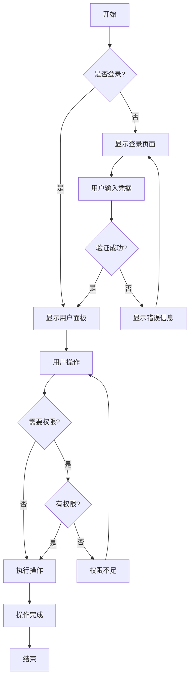
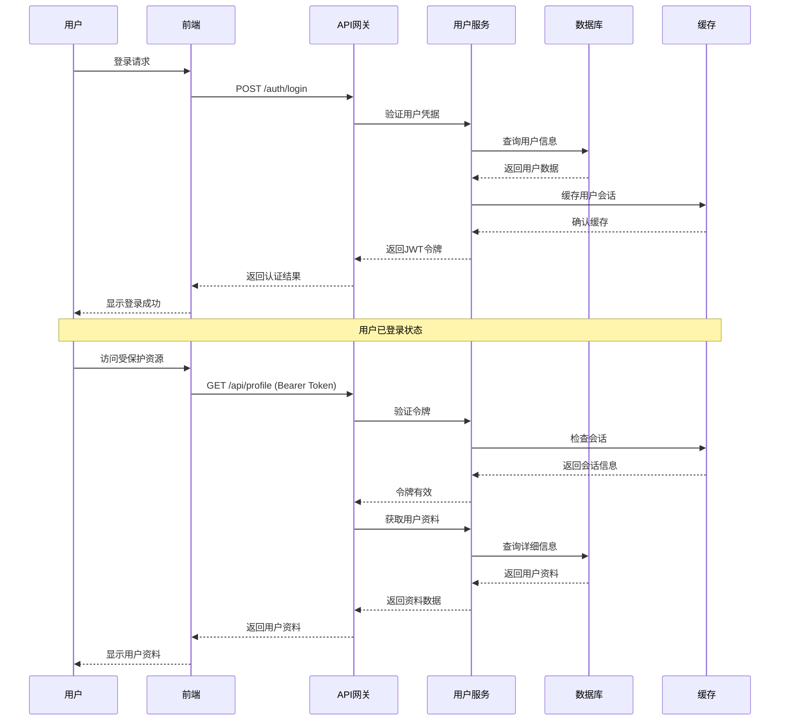
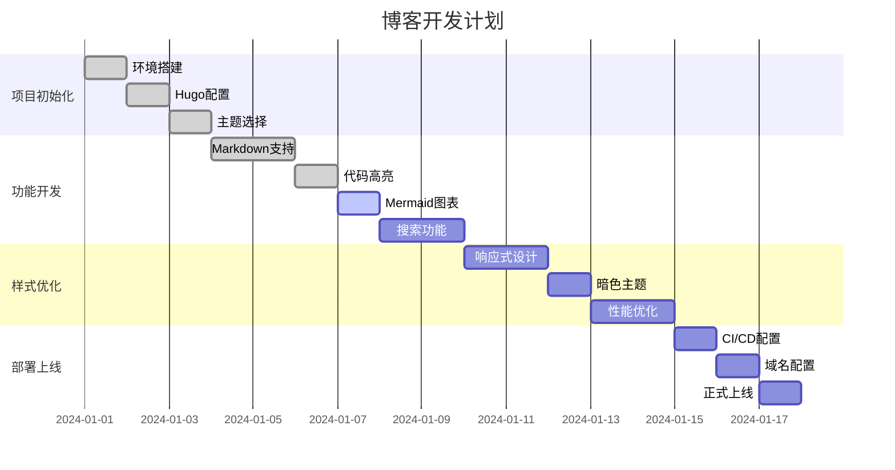
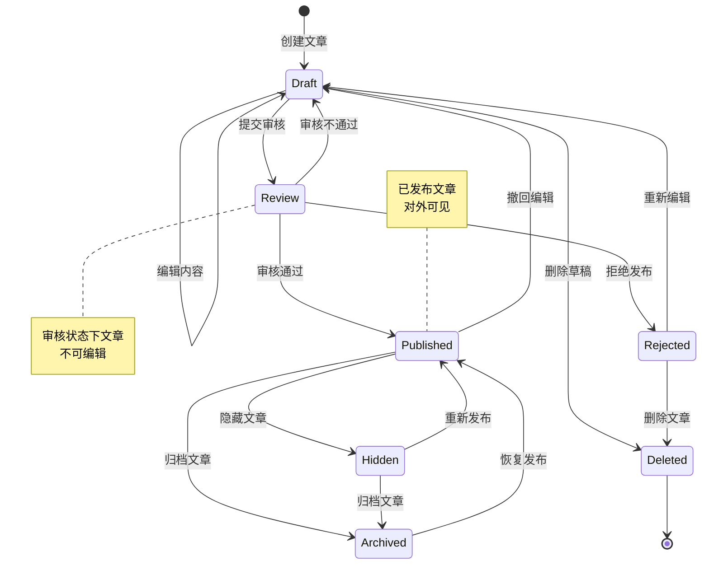

这篇文章展示了博客支持的各种Markdown功能，包括代码高亮、Mermaid图表、数学公式等。

## 📝 基本Markdown语法

### 文本格式

这是**粗体文本**，这是*斜体文本*，这是***粗斜体文本***。

这是~~删除线文本~~，这是<mark>高亮文本</mark>。

这是`行内代码`，这是<kbd>Ctrl</kbd> + <kbd>C</kbd>键盘快捷键。

### 列表

**无序列表：**
- 第一项
- 第二项
  - 子项目1
  - 子项目2
- 第三项

**有序列表：**
1. 第一步
2. 第二步
3. 第三步

**任务列表：**
- [x] 已完成的任务
- [ ] 未完成的任务
- [x] 另一个已完成的任务

### 引用

> 这是一个引用块。
> 
> 引用可以包含多行内容，支持**格式化**文本。
> 
> — 作者名

### 链接和图片

这是一个[链接示例](https://example.com)。

这是一个带标题的链接：[Hugo官网](https://gohugo.io/ "Hugo静态网站生成器")。

## 💻 代码高亮

### JavaScript代码

```javascript
// 异步函数示例
async function fetchUserData(userId) {
    try {
        const response = await fetch(`/api/users/${userId}`);
        const userData = await response.json();
        
        if (!response.ok) {
            throw new Error(`HTTP error! status: ${response.status}`);
        }
        
        return userData;
    } catch (error) {
        console.error('获取用户数据失败:', error);
        throw error;
    }
}

// 使用示例
fetchUserData(123)
    .then(user => console.log('用户信息:', user))
    .catch(error => console.error('错误:', error));
```

### Python代码

```python
# 数据处理示例
import pandas as pd
import numpy as np
from typing import List, Dict, Optional

class DataProcessor:
    """数据处理器类"""
    
    def __init__(self, data_path: str):
        self.data_path = data_path
        self.data: Optional[pd.DataFrame] = None
    
    def load_data(self) -> pd.DataFrame:
        """加载数据"""
        try:
            self.data = pd.read_csv(self.data_path)
            print(f"成功加载 {len(self.data)} 行数据")
            return self.data
        except FileNotFoundError:
            print(f"文件未找到: {self.data_path}")
            raise
    
    def clean_data(self) -> pd.DataFrame:
        """清理数据"""
        if self.data is None:
            raise ValueError("请先加载数据")
        
        # 删除重复行
        self.data = self.data.drop_duplicates()
        
        # 处理缺失值
        self.data = self.data.fillna(method='forward')
        
        return self.data

# 使用示例
processor = DataProcessor("data.csv")
df = processor.load_data()
clean_df = processor.clean_data()
```

### Go代码

```go
package main

import (
    "context"
    "fmt"
    "log"
    "net/http"
    "time"
)

// User 用户结构体
type User struct {
    ID       int    `json:"id"`
    Name     string `json:"name"`
    Email    string `json:"email"`
    CreateAt time.Time `json:"created_at"`
}

// UserService 用户服务接口
type UserService interface {
    GetUser(ctx context.Context, id int) (*User, error)
    CreateUser(ctx context.Context, user *User) error
}

// HTTPUserService HTTP用户服务实现
type HTTPUserService struct {
    client *http.Client
    baseURL string
}

// NewHTTPUserService 创建新的HTTP用户服务
func NewHTTPUserService(baseURL string) *HTTPUserService {
    return &HTTPUserService{
        client: &http.Client{
            Timeout: 30 * time.Second,
        },
        baseURL: baseURL,
    }
}

// GetUser 获取用户信息
func (s *HTTPUserService) GetUser(ctx context.Context, id int) (*User, error) {
    url := fmt.Sprintf("%s/users/%d", s.baseURL, id)
    
    req, err := http.NewRequestWithContext(ctx, "GET", url, nil)
    if err != nil {
        return nil, fmt.Errorf("创建请求失败: %w", err)
    }
    
    resp, err := s.client.Do(req)
    if err != nil {
        return nil, fmt.Errorf("请求失败: %w", err)
    }
    defer resp.Body.Close()
    
    if resp.StatusCode != http.StatusOK {
        return nil, fmt.Errorf("HTTP错误: %d", resp.StatusCode)
    }
    
    var user User
    // 解析响应...
    
    return &user, nil
}

func main() {
    service := NewHTTPUserService("https://api.example.com")
    
    ctx, cancel := context.WithTimeout(context.Background(), 10*time.Second)
    defer cancel()
    
    user, err := service.GetUser(ctx, 123)
    if err != nil {
        log.Fatal("获取用户失败:", err)
    }
    
    fmt.Printf("用户信息: %+v\n", user)
}
```

### Shell脚本

```bash
#!/bin/bash

# 自动化部署脚本
set -euo pipefail

# 配置变量
PROJECT_NAME="myblog"
BUILD_DIR="public"
DEPLOY_BRANCH="gh-pages"
REMOTE_URL="origin"

# 颜色输出
RED='\033[0;31m'
GREEN='\033[0;32m'
YELLOW='\033[1;33m'
NC='\033[0m' # No Color

# 日志函数
log_info() {
    echo -e "${GREEN}[INFO]${NC} $1"
}

log_warn() {
    echo -e "${YELLOW}[WARN]${NC} $1"
}

log_error() {
    echo -e "${RED}[ERROR]${NC} $1"
}

# 检查依赖
check_dependencies() {
    log_info "检查依赖..."
    
    if ! command -v hugo &> /dev/null; then
        log_error "Hugo未安装，请先安装Hugo"
        exit 1
    fi
    
    if ! command -v git &> /dev/null; then
        log_error "Git未安装，请先安装Git"
        exit 1
    fi
    
    log_info "依赖检查完成"
}

# 构建网站
build_site() {
    log_info "开始构建网站..."
    
    # 清理之前的构建
    if [ -d "$BUILD_DIR" ]; then
        rm -rf "$BUILD_DIR"
    fi
    
    # 构建网站
    hugo --gc --minify
    
    if [ $? -eq 0 ]; then
        log_info "网站构建成功"
    else
        log_error "网站构建失败"
        exit 1
    fi
}

# 部署到GitHub Pages
deploy_to_github() {
    log_info "开始部署到GitHub Pages..."
    
    cd "$BUILD_DIR"
    
    # 初始化Git仓库
    git init
    git add -A
    git commit -m "Deploy to GitHub Pages - $(date)"
    
    # 推送到GitHub Pages分支
    git push -f "$REMOTE_URL" master:$DEPLOY_BRANCH
    
    log_info "部署完成！"
}

# 主函数
main() {
    log_info "开始自动化部署流程..."
    
    check_dependencies
    build_site
    deploy_to_github
    
    log_info "🎉 部署流程完成！"
}

# 执行主函数
main "$@"
```

## 📊 Mermaid图表

### 流程图



### 序列图



### 甘特图



### 类图

```mermaid
classDiagram
    class User {
        +int id
        +string name
        +string email
        +DateTime createdAt
        +DateTime updatedAt
        +login(credentials) bool
        +logout() void
        +updateProfile(data) bool
    }
    
    class Post {
        +int id
        +string title
        +string content
        +string slug
        +DateTime publishedAt
        +bool isDraft
        +User author
        +Category[] categories
        +Tag[] tags
        +publish() bool
        +unpublish() bool
        +addTag(tag) void
        +removeTag(tag) void
    }
    
    class Category {
        +int id
        +string name
        +string slug
        +string description
        +Post[] posts
        +addPost(post) void
        +removePost(post) void
    }
    
    class Tag {
        +int id
        +string name
        +string slug
        +Post[] posts
        +addPost(post) void
        +removePost(post) void
    }
    
    class Comment {
        +int id
        +string content
        +DateTime createdAt
        +User author
        +Post post
        +Comment parent
        +Comment[] replies
        +approve() bool
        +reject() bool
    }
    
    User ||--o{ Post : "authors"
    Post }o--|| Category : "belongs to"
    Post }o--o{ Tag : "tagged with"
    Post ||--o{ Comment : "has"
    Comment ||--o{ Comment : "replies to"
    User ||--o{ Comment : "writes"
```

### 状态图



## 🧮 数学公式

### 行内公式

这是一个行内数学公式：$E = mc^2$，这是爱因斯坦的质能方程。

另一个例子：当 $a \neq 0$ 时，方程 $ax^2 + bx + c = 0$ 的解为 $x = \frac{-b \pm \sqrt{b^2-4ac}}{2a}$。

### 块级公式

**二次方程的解：**

$$x = \frac{-b \pm \sqrt{b^2-4ac}}{2a}$$

**积分公式：**

$$\int_{a}^{b} f(x) \, dx = F(b) - F(a)$$

**矩阵表示：**

$$\begin{pmatrix}
a_{11} & a_{12} & \cdots & a_{1n} \\
a_{21} & a_{22} & \cdots & a_{2n} \\
\vdots & \vdots & \ddots & \vdots \\
a_{m1} & a_{m2} & \cdots & a_{mn}
\end{pmatrix}$$

**求和公式：**

$$\sum_{i=1}^{n} i = \frac{n(n+1)}{2}$$

## 📋 表格

| 功能 | 支持状态 | 说明 |
|------|---------|------|
| 代码高亮 | ✅ 支持 | 支持多种编程语言 |
| Mermaid图表 | ✅ 支持 | 响应式图表显示 |
| 数学公式 | ✅ 支持 | KaTeX渲染引擎 |
| 任务列表 | ✅ 支持 | 交互式复选框 |
| 表格 | ✅ 支持 | 响应式表格设计 |
| 脚注 | ✅ 支持 | 自动编号和链接 |
| 定义列表 | ✅ 支持 | 术语定义格式 |

## 📚 其他功能

### 定义列表

HTML
: 超文本标记语言，用于创建网页的标准标记语言。

CSS
: 层叠样式表，用于描述HTML文档的样式和布局。

JavaScript
: 一种高级的、解释型的编程语言，主要用于网页开发。

### 脚注

这是一个包含脚注的段落[^1]。你也可以使用命名脚注[^note-name]。

[^1]: 这是第一个脚注的内容。
[^note-name]: 这是一个命名脚注的内容，可以包含**格式化**文本。

### 缩写

<abbr title="HyperText Markup Language">HTML</abbr>是网页开发的基础语言。

<abbr title="Cascading Style Sheets">CSS</abbr>用于控制网页的样式和布局。

## 🎯 总结

这篇文章展示了博客支持的丰富Markdown功能：

1. **代码高亮** - 支持多种编程语言，带行号和复制功能
2. **Mermaid图表** - 支持流程图、序列图、甘特图等多种图表类型
3. **数学公式** - 使用KaTeX渲染引擎，支持行内和块级公式
4. **响应式设计** - 所有元素都针对移动设备进行了优化
5. **丰富的Markdown扩展** - 任务列表、表格、脚注、定义列表等

这些功能让你可以创建内容丰富、视觉效果出色的技术博客文章！

---

*演示完成 - 开始你的写作之旅吧！* ✨
