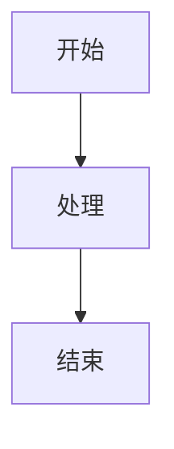
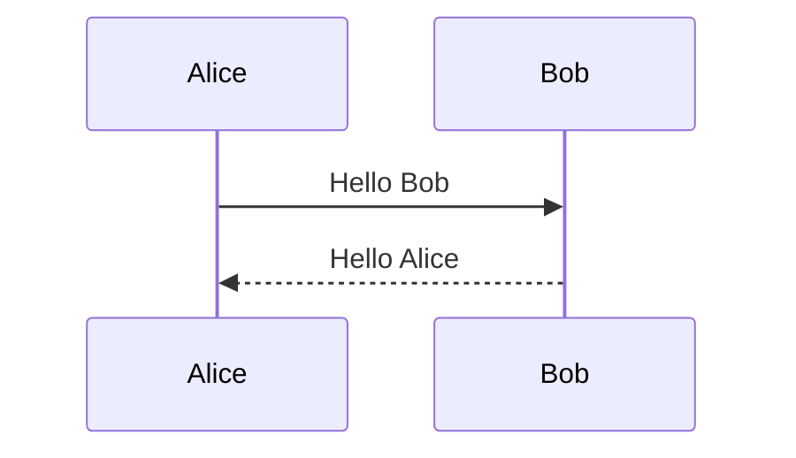
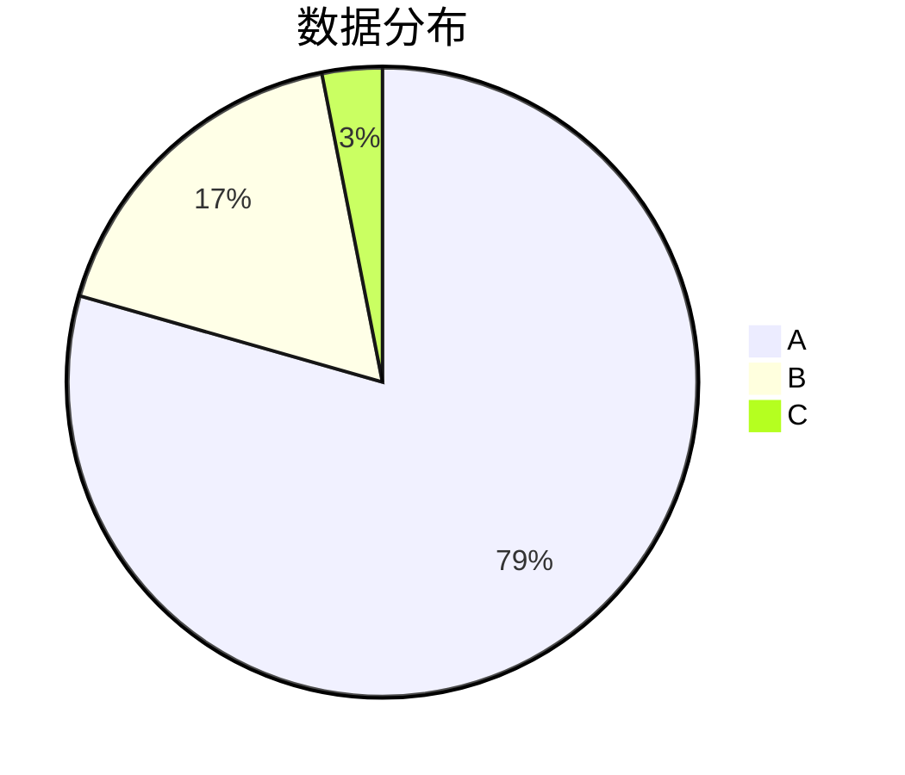

这是一个简单的Mermaid测试页面。

## 简单流程图

```mermaid
graph TD
    A[开始] --> B[处理]
    B --> C[结束]
```

## 简单序列图

```mermaid
sequenceDiagram
    Alice->>Bob: Hello Bob
    Bob-->>Alice: Hello Alice
```

## 简单饼图

```mermaid
pie title 数据分布
    "A" : 386
    "B" : 85
    "C" : 15
```

测试完成。
