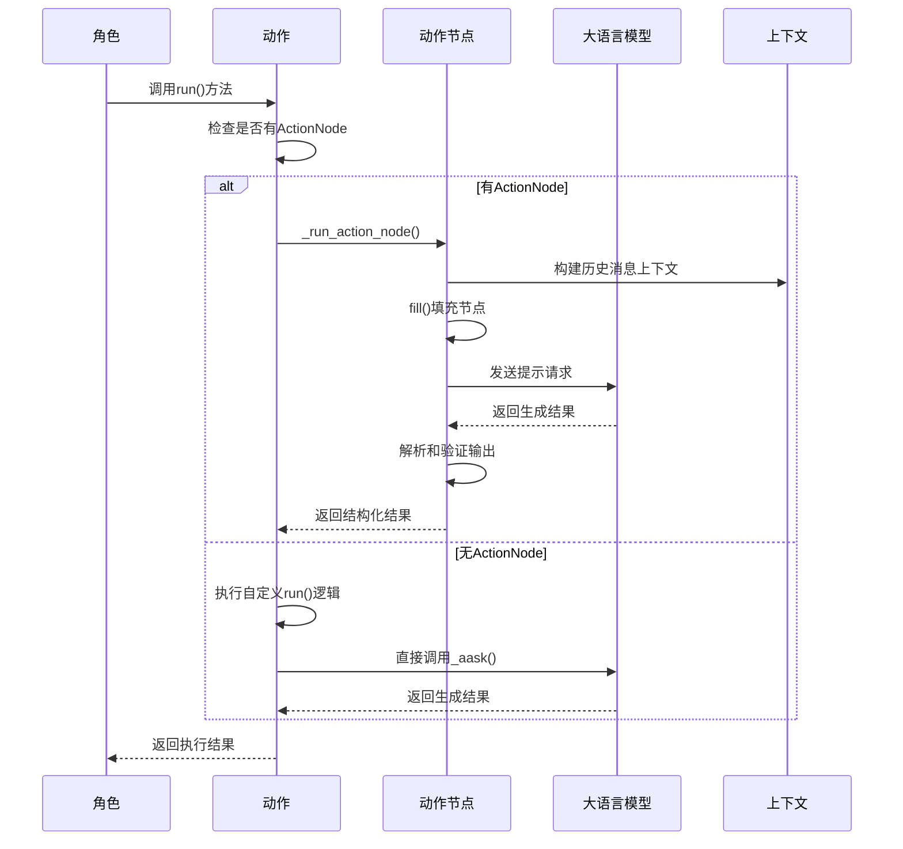
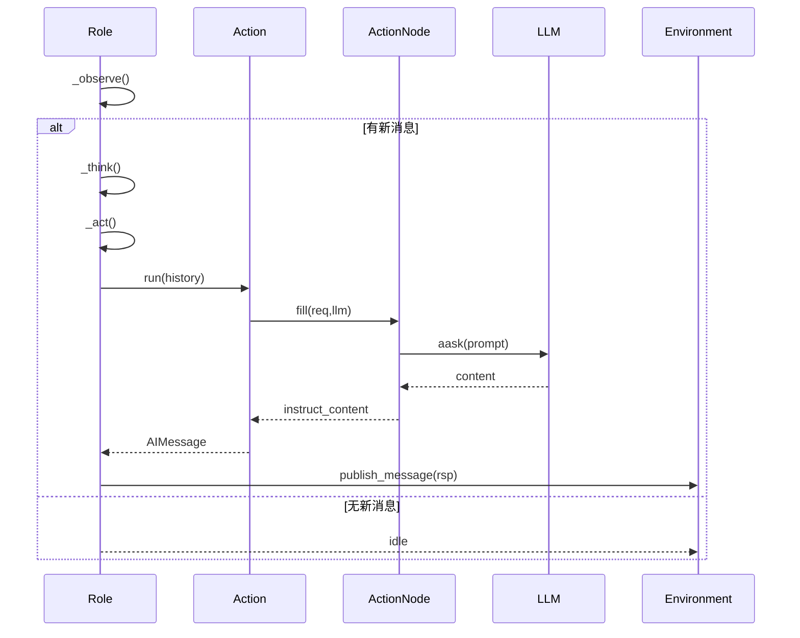
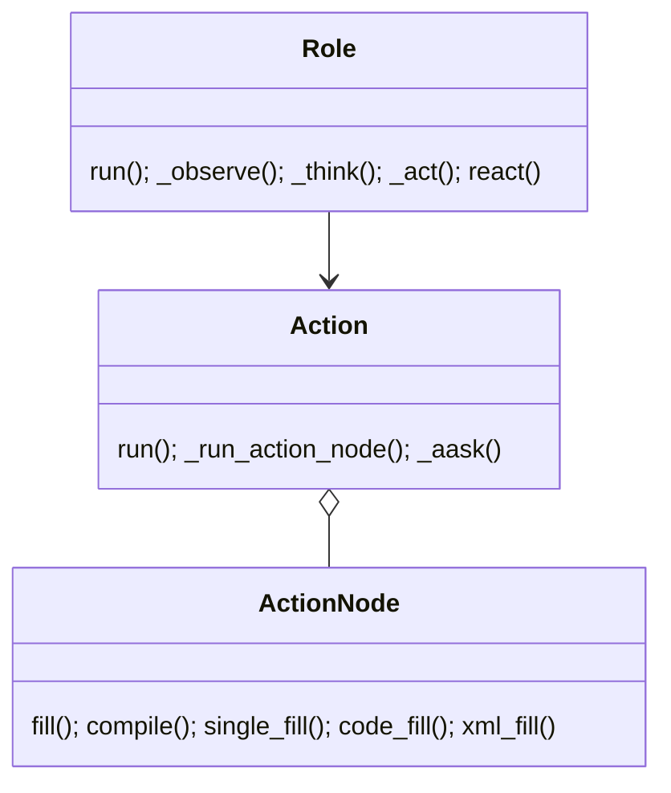

## 概述

MetaGPT的动作系统是智能体行为执行的核心引擎，它将复杂的软件开发任务分解为一系列可执行的原子动作。每个动作都封装了特定的业务逻辑和LLM交互模式，通过组合和编排实现复杂的软件开发流程。动作系统的架构设计、执行机制和实现细节。

<!--more-->

## 1. 动作系统架构概览

### 1.1 核心组件层次结构

MetaGPT的动作系统采用分层架构，从基础抽象到具体实现：

```mermaid
classDiagram
    class Action {
        <<abstract>>
        +name: str
        +i_context: Union[dict, Context, str]
        +prefix: str
        +desc: str
        +node: ActionNode
        +llm_name_or_type: Optional[str]
        +set_prefix(prefix) Action
        +_aask(prompt, system_msgs) str
        +run(*args, **kwargs)*
        +_run_action_node(*args, **kwargs)
    }
    
    class ActionNode {
        +key: str
        +expected_type: Type
        +instruction: str
        +example: Any
        +content: str
        +children: dict[str, ActionNode]
        +schema: str
        +context: str
        +llm: BaseLLM
        +fill(req, llm, **kwargs) ActionNode
        +compile(context, schema, mode) str
        +review(strgy, **kwargs) dict
        +revise(comments, **kwargs) ActionNode
    }
    
    class ActionGraph {
        +nodes: dict[str, ActionNode]
        +edges: dict[str, list[str]]
        +execution_order: list[str]
        +add_node(node)
        +add_edge(from_node, to_node)
        +topological_sort()
    }
    
    class WritePRD {
        +repo: ProjectRepo
        +input_args: BaseModel
        +run(with_messages, **kwargs) AIMessage
        +_new_prd(requirement) ActionNode
        +_handle_new_requirement(req) ActionOutput
        +_handle_requirement_update(req, docs) ActionOutput
        +_is_bugfix(context) bool
        +get_related_docs(req, docs) list[Document]
    }
    
    class WriteCode {
        +i_context: Document
        +repo: ProjectRepo
        +input_args: BaseModel
        +write_code(prompt) str
        +run(*args, **kwargs) CodingContext
        +_get_codes(task_doc, logs) str
        +_get_logs() str
    }
    
    class WriteDesign {
        +run(with_messages, **kwargs) ActionOutput
        +_new_system_design(requirements) str
        +_merge(requirements, design_doc) str
    }
    
    class RunCode {
        +run(context) RunCodeResult
        +_run_script(working_directory, additional_python_paths) str
    }
    
    class ActionType {
        <<enumeration>>
        ADD_REQUIREMENT
        WRITE_PRD
        WRITE_DESIGN
        WRITE_CODE
        RUN_CODE
        WRITE_TEST
        DEBUG_ERROR
    }
    
    Action <|-- WritePRD
    Action <|-- WriteCode
    Action <|-- WriteDesign
    Action <|-- RunCode
    Action o-- ActionNode
    ActionNode o-- ActionGraph
    
    %% 样式定义
    classDef abstract fill:#ffeb3b
    classDef core fill:#2196f3
    classDef concrete fill:#4caf50
    classDef utility fill:#ff9800
    
    class Action abstract
    class ActionNode,ActionGraph core
    class WritePRD,WriteCode,WriteDesign,RunCode concrete
    class ActionType utility
```

### 1.2 动作执行流程



## 2. 基础动作抽象 (Action)

### 2.1 Action基类设计

`Action`类是所有动作的基础抽象，提供了统一的执行接口和LLM交互能力：

```python
class Action(SerializationMixin, ContextMixin, BaseModel):
    """动作基类，定义了所有动作的通用接口和行为"""
    
    model_config = ConfigDict(arbitrary_types_allowed=True)

    # 基础属性
    name: str = ""                          # 动作名称，默认为类名
    i_context: Union[dict, CodingContext, CodeSummarizeContext, 
                    TestingContext, RunCodeContext, 
                    CodePlanAndChangeContext, str, None] = ""  # 输入上下文
    prefix: str = ""                        # 系统消息前缀
    desc: str = ""                          # 动作描述，用于技能管理
    node: ActionNode = Field(default=None, exclude=True)  # 关联的动作节点
    llm_name_or_type: Optional[str] = None  # LLM模型名称或类型

    @model_validator(mode="after")
    @classmethod
    def _update_private_llm(cls, data: Any) -> Any:
        """更新私有LLM实例"""
        config = ModelsConfig.default().get(data.llm_name_or_type)
        if config:
            llm = create_llm_instance(config)
            llm.cost_manager = data.llm.cost_manager
            data.llm = llm
        return data

    @model_validator(mode="before")
    @classmethod
    def set_name_if_empty(cls, values):
        """如果名称为空，则设置为类名"""
        if "name" not in values or not values["name"]:
            values["name"] = cls.__name__
        return values

    @model_validator(mode="before")
    @classmethod
    def _init_with_instruction(cls, values):
        """使用指令初始化ActionNode"""
        if "instruction" in values:
            name = values["name"]
            i = values.pop("instruction")
            values["node"] = ActionNode(
                key=name, 
                expected_type=str, 
                instruction=i, 
                example="", 
                schema="raw"
            )
        return values

    def set_prefix(self, prefix):
        """设置前缀，用于后续使用"""
        self.prefix = prefix
        self.llm.system_prompt = prefix
        if self.node:
            self.node.llm = self.llm
        return self

    async def _aask(self, prompt: str, system_msgs: Optional[list[str]] = None) -> str:
        """添加默认前缀的LLM询问"""
        return await self.llm.aask(prompt, system_msgs)

    async def _run_action_node(self, *args, **kwargs):
        """运行动作节点"""
        msgs = args[0]
        context = "## History Messages\n"
        context += "\n".join([f"{idx}: {i}" for idx, i in enumerate(reversed(msgs))])
        return await self.node.fill(req=context, llm=self.llm)

    async def run(self, *args, **kwargs):
        """运行动作 - 子类必须实现"""
        if self.node:
            return await self._run_action_node(*args, **kwargs)
        raise NotImplementedError("The run method should be implemented in a subclass.")
```

**设计要点**：
- **统一接口**：所有动作都通过`run()`方法执行
- **LLM集成**：内置LLM交互能力和成本管理
- **上下文管理**：支持多种类型的输入上下文
- **节点支持**：可选的ActionNode集成
- **配置灵活性**：支持不同的LLM模型配置

### 2.2 动作生命周期管理

```python
# 动作创建和初始化
action = WritePRD()
action.set_prefix("You are a professional product manager...")

# 动作执行
result = await action.run(
    user_requirement="Create a 2048 game",
    output_pathname="docs/prd.json"
)

# 结果处理
if isinstance(result, AIMessage):
    print(f"Action completed: {result.content}")
```

## 3. 动作节点系统 (ActionNode)

### 3.1 ActionNode核心设计

`ActionNode`是动作系统的核心组件，提供了结构化的LLM交互和输出处理能力：

```python
class ActionNode:
    """ActionNode是节点树结构，支持复杂的LLM交互模式"""
    
    # 基础属性
    key: str                                # 节点键名，如"Product Requirement"
    expected_type: Type                     # 期望的输出类型
    instruction: str                        # 执行指令
    example: Any                           # 示例，用于上下文学习
    content: str                           # 节点内容
    children: dict[str, "ActionNode"]      # 子节点字典
    schema: str                            # 输出模式：raw/json/markdown
    
    # 执行上下文
    context: str                           # 完整上下文信息
    llm: BaseLLM                          # LLM实例
    
    # 图结构支持
    prevs: List["ActionNode"]              # 前置节点
    nexts: List["ActionNode"]              # 后续节点

    def __init__(
        self,
        key: str,
        expected_type: Type,
        instruction: str,
        example: Any,
        content: str = "",
        children: dict[str, "ActionNode"] = None,
        schema: str = "",
    ):
        """初始化动作节点"""
        self.key = key
        self.expected_type = expected_type
        self.instruction = instruction
        self.example = example
        self.content = content
        self.children = children if children is not None else {}
        self.schema = schema
        self.prevs = []
        self.nexts = []

    async def fill(
        self, 
        req: str, 
        llm: BaseLLM, 
        schema: str = "json", 
        mode: str = "auto",
        exclude: list[str] = None,
        **kwargs
    ) -> "ActionNode":
        """填充节点内容"""
        # 构建提示模板
        prompt = self._compile_prompt(req, schema, exclude)
        
        # 调用LLM生成内容
        content = await llm.aask(prompt, **kwargs)
        
        # 解析和验证输出
        parsed_content = self._parse_output(content, schema)
        
        # 更新节点内容
        self.content = content
        self.instruct_content = parsed_content
        
        return self

    def _compile_prompt(self, req: str, schema: str, exclude: list[str] = None) -> str:
        """编译提示模板"""
        # 构建指令部分
        instruction_template = self._build_instruction_template(exclude)
        
        # 构建示例部分
        example_template = self._build_example_template(schema)
        
        # 构建约束部分
        constraint_template = self._build_constraint_template()
        
        # 组合完整提示
        prompt = SIMPLE_TEMPLATE.format(
            context=req,
            instruction=instruction_template,
            example=example_template,
            constraint=constraint_template
        )
        
        return prompt

    def _parse_output(self, content: str, schema: str) -> Any:
        """解析LLM输出"""
        if schema == "json":
            return self._parse_json_output(content)
        elif schema == "markdown":
            return self._parse_markdown_output(content)
        else:
            return content

    async def review(self, strgy: str = "auto", **kwargs) -> dict:
        """审查节点输出质量"""
        if strgy == "human":
            return await self._human_review(**kwargs)
        else:
            return await self._auto_review(**kwargs)

    async def revise(self, comments: dict, **kwargs) -> "ActionNode":
        """根据审查意见修订节点内容"""
        # 构建修订提示
        revise_prompt = self._build_revise_prompt(comments)
        
        # 重新生成内容
        revised_content = await self.llm.aask(revise_prompt, **kwargs)
        
        # 更新节点
        self.content = revised_content
        self.instruct_content = self._parse_output(revised_content, self.schema)
        
        return self
```

### 3.2 节点填充机制

ActionNode的填充机制是其核心功能，支持多种模式和策略：

```python
# 简单填充模式
node = ActionNode(
    key="ProductRequirement",
    expected_type=str,
    instruction="Write a detailed product requirement document",
    example="## Product Goals\n1. Goal 1\n2. Goal 2",
    schema="markdown"
)

result = await node.fill(
    req="Create a 2048 game with web interface",
    llm=llm,
    schema="json"
)

# 复杂填充模式（带排除字段）
result = await node.fill(
    req=context,
    llm=llm,
    schema="json",
    exclude=["project_name"],  # 排除某些字段
    mode="auto"
)
```

### 3.3 输出模式支持

ActionNode支持多种输出模式，适应不同的使用场景：

#### 3.3.1 JSON模式

```python
# JSON模式输出结构化数据
json_node = ActionNode(
    key="PRDStructure",
    expected_type=dict,
    instruction="Generate PRD in JSON format",
    schema="json"
)

# 输出示例
{
    "project_name": "2048 Game",
    "goals": ["Entertainment", "Learning", "Competition"],
    "user_stories": [
        "As a player, I want to slide tiles to combine numbers",
        "As a player, I want to see my score in real-time"
    ],
    "requirements": {
        "functional": ["Game logic", "Score system"],
        "non_functional": ["Performance", "Usability"]
    }
}
```

#### 3.3.2 Markdown模式

```python
# Markdown模式输出文档格式
markdown_node = ActionNode(
    key="PRDDocument",
    expected_type=str,
    instruction="Generate PRD in Markdown format",
    schema="markdown"
)

# 输出示例
"""
## Product Goals
1. Create an engaging 2048 puzzle game
2. Provide intuitive web interface
3. Support score tracking and leaderboards

## User Stories
- As a player, I want to slide tiles to combine numbers so that I can achieve higher scores
- As a player, I want to see my current score and best score so that I can track my progress

## Requirements
### Functional Requirements
- Game board with 4x4 grid
- Tile sliding mechanics
- Score calculation system
"""
```

#### 3.3.3 Raw模式

```python
# Raw模式输出原始文本
raw_node = ActionNode(
    key="CodeSnippet",
    expected_type=str,
    instruction="Generate Python code for game logic",
    schema="raw"
)

# 输出示例
"""
class Game2048:
    def __init__(self):
        self.board = [[0] * 4 for _ in range(4)]
        self.score = 0
    
    def move_left(self):
        # Implementation here
        pass
"""
```

## 4. 动作图系统 (ActionGraph)

### 4.1 ActionGraph设计

`ActionGraph`提供了动作间依赖关系的管理和执行顺序的优化：

```python
class ActionGraph:
    """动作图：表示动作间依赖关系的有向图"""
    
    def __init__(self):
        self.nodes = {}                     # 节点字典
        self.edges = {}                     # 边字典
        self.execution_order = []           # 执行顺序

    def add_node(self, node):
        """添加节点到图中"""
        self.nodes[node.key] = node

    def add_edge(self, from_node: "ActionNode", to_node: "ActionNode"):
        """添加边到图中"""
        if from_node.key not in self.edges:
            self.edges[from_node.key] = []
        self.edges[from_node.key].append(to_node.key)
        from_node.add_next(to_node)
        to_node.add_prev(from_node)

    def topological_sort(self):
        """拓扑排序图"""
        visited = set()
        stack = []

        def visit(k):
            if k not in visited:
                visited.add(k)
                if k in self.edges:
                    for next_node in self.edges[k]:
                        visit(next_node)
                stack.insert(0, k)

        for key in self.nodes:
            visit(key)

        self.execution_order = stack
        return self.execution_order
```

### 4.2 动作依赖管理

```python
# 创建动作图
graph = ActionGraph()

# 添加节点
requirement_node = ActionNode(key="requirement", ...)
design_node = ActionNode(key="design", ...)
code_node = ActionNode(key="code", ...)

graph.add_node(requirement_node)
graph.add_node(design_node)
graph.add_node(code_node)

# 添加依赖关系
graph.add_edge(requirement_node, design_node)  # 设计依赖需求
graph.add_edge(design_node, code_node)         # 代码依赖设计

# 计算执行顺序
execution_order = graph.topological_sort()
# 结果: ['requirement', 'design', 'code']
```

## 5. 具体动作实现

### 5.1 WritePRD动作

`WritePRD`是产品需求文档生成动作，展示了复杂业务逻辑的实现：

```python
@register_tool(include_functions=["run"])
class WritePRD(Action):
    """WritePRD处理以下情况：
    1. 缺陷修复：如果需求是缺陷修复，将生成缺陷文档
    2. 新需求：如果需求是新需求，将生成PRD文档
    3. 需求更新：如果需求是更新，将更新PRD文档
    """

    repo: Optional[ProjectRepo] = Field(default=None, exclude=True)
    input_args: Optional[BaseModel] = Field(default=None, exclude=True)

    async def run(
        self,
        with_messages: List[Message] = None,
        *,
        user_requirement: str = "",
        output_pathname: str = "",
        legacy_prd_filename: str = "",
        extra_info: str = "",
        **kwargs,
    ) -> Union[AIMessage, str]:
        """运行PRD生成流程"""
        
        # API调用模式
        if not with_messages:
            return await self._execute_api(
                user_requirement=user_requirement,
                output_pathname=output_pathname,
                legacy_prd_filename=legacy_prd_filename,
                extra_info=extra_info,
            )

        # 消息驱动模式
        self.input_args = with_messages[-1].instruct_content
        if not self.input_args:
            # 初始化项目仓库
            self.repo = ProjectRepo(self.context.kwargs.project_path)
            await self.repo.docs.save(filename=REQUIREMENT_FILENAME, content=with_messages[-1].content)
            # 创建指令内容
            self.input_args = AIMessage.create_instruct_value(
                kvs={
                    "project_path": self.context.kwargs.project_path,
                    "requirements_filename": str(self.repo.docs.workdir / REQUIREMENT_FILENAME),
                    "prd_filenames": [str(self.repo.docs.prd.workdir / i) for i in self.repo.docs.prd.all_files],
                },
                class_name="PrepareDocumentsOutput",
            )
        else:
            self.repo = ProjectRepo(self.input_args.project_path)
        
        # 加载需求文档
        req = await Document.load(filename=self.input_args.requirements_filename)
        docs: list[Document] = [
            await Document.load(filename=i, project_path=self.repo.workdir) 
            for i in self.input_args.prd_filenames
        ]

        if not req:
            raise FileNotFoundError("No requirement document found.")

        # 判断需求类型并处理
        if await self._is_bugfix(req.content):
            logger.info(f"Bugfix detected: {req.content}")
            return await self._handle_bugfix(req)
        
        # 移除上一轮的缺陷文件以避免冲突
        await self.repo.docs.delete(filename=BUGFIX_FILENAME)

        # 如果需求与其他文档相关，更新它们，否则创建新文档
        if related_docs := await self.get_related_docs(req, docs):
            logger.info(f"Requirement update detected: {req.content}")
            await self._handle_requirement_update(req=req, related_docs=related_docs)
        else:
            logger.info(f"New requirement detected: {req.content}")
            await self._handle_new_requirement(req)

        # 构建返回结果
        kvs = self.input_args.model_dump()
        kvs["changed_prd_filenames"] = [
            str(self.repo.docs.prd.workdir / i) for i in list(self.repo.docs.prd.changed_files.keys())
        ]
        kvs["project_path"] = str(self.repo.workdir)
        kvs["requirements_filename"] = str(self.repo.docs.workdir / REQUIREMENT_FILENAME)
        self.context.kwargs.project_path = str(self.repo.workdir)
        
        return AIMessage(
            content="PRD is completed. " + "\n".join(
                list(self.repo.docs.prd.changed_files.keys())
                + list(self.repo.resources.prd.changed_files.keys())
                + list(self.repo.resources.competitive_analysis.changed_files.keys())
            ),
            instruct_content=AIMessage.create_instruct_value(kvs=kvs, class_name="WritePRDOutput"),
            cause_by=self,
        )

    async def _new_prd(self, requirement: str) -> ActionNode:
        """生成新的PRD"""
        project_name = self.project_name
        context = CONTEXT_TEMPLATE.format(requirements=requirement, project_name=project_name)
        exclude = [PROJECT_NAME.key] if project_name else []
        node = await WRITE_PRD_NODE.fill(
            req=context, llm=self.llm, exclude=exclude, schema=self.prompt_schema
        )
        return node

    async def _handle_new_requirement(self, req: Document) -> ActionOutput:
        """处理新需求"""
        async with DocsReporter(enable_llm_stream=True) as reporter:
            await reporter.async_report({"type": "prd"}, "meta")
            node = await self._new_prd(req.content)
            await self._rename_workspace(node)
            new_prd_doc = await self.repo.docs.prd.save(
                filename=FileRepository.new_filename() + ".json", 
                content=node.instruct_content.model_dump_json()
            )
            await self._save_competitive_analysis(new_prd_doc)
            md = await self.repo.resources.prd.save_pdf(doc=new_prd_doc)
            await reporter.async_report(self.repo.workdir / md.root_relative_path, "path")
            return Documents.from_iterable(documents=[new_prd_doc]).to_action_output()

    async def _is_bugfix(self, context: str) -> bool:
        """判断是否为缺陷修复"""
        if not self.repo.code_files_exists():
            return False
        node = await WP_ISSUE_TYPE_NODE.fill(req=context, llm=self.llm)
        return node.get("issue_type") == "BUG"

    async def get_related_docs(self, req: Document, docs: list[Document]) -> list[Document]:
        """获取相关文档"""
        return [i for i in docs if await self._is_related(req, i)]

    async def _is_related(self, req: Document, old_prd: Document) -> bool:
        """判断需求是否与现有PRD相关"""
        context = NEW_REQ_TEMPLATE.format(old_prd=old_prd.content, requirements=req.content)
        node = await WP_IS_RELATIVE_NODE.fill(req=context, llm=self.llm)
        return node.get("is_relative") == "YES"
```

**WritePRD特点**：
- **多场景支持**：新需求、需求更新、缺陷修复
- **智能判断**：自动识别需求类型和相关性
- **文档管理**：完整的文档生成和版本控制
- **报告集成**：实时进度报告和结果展示

### 5.2 WriteCode动作

`WriteCode`动作负责代码生成，展示了复杂的上下文处理：

```python
class WriteCode(Action):
    """代码编写动作"""
    
    name: str = "WriteCode"
    i_context: Document = Field(default_factory=Document)
    repo: Optional[ProjectRepo] = Field(default=None, exclude=True)
    input_args: Optional[BaseModel] = Field(default=None, exclude=True)

    @retry(wait=wait_random_exponential(min=1, max=60), stop=stop_after_attempt(6))
    async def write_code(self, prompt) -> str:
        """编写代码，带重试机制"""
        code_rsp = await self._aask(prompt)
        code = CodeParser.parse_code(text=code_rsp)
        return code

    async def run(self, *args, **kwargs) -> CodingContext:
        """运行代码编写流程"""
        
        # 获取输入参数
        bug_feedback = kwargs.get("bug_feedback", "")
        self.input_args = kwargs.get("input_args")
        
        if not self.input_args:
            raise ValueError("Missing required input_args")

        # 初始化项目仓库
        self.repo = ProjectRepo(self.input_args.project_path)
        
        # 加载任务文档
        task_doc = await Document.load(filename=self.input_args.task_filename)
        if not task_doc:
            raise FileNotFoundError(f"Task file not found: {self.input_args.task_filename}")

        # 获取设计文档
        design_doc = await self._get_design_doc()
        
        # 获取现有代码
        codes = await self._get_codes(task_doc)
        
        # 获取日志信息
        logs = await self._get_logs()
        
        # 构建提示
        prompt = PROMPT_TEMPLATE.format(
            design=design_doc.content if design_doc else "",
            task=task_doc.content,
            code=codes,
            logs=logs,
            feedback=bug_feedback,
            filename=self.input_args.filename,
            demo_filename="demo"
        )

        # 生成代码
        async with EditorReporter(enable_llm_stream=True) as reporter:
            await reporter.async_report({"type": "code", "filename": self.input_args.filename}, "meta")
            code = await self.write_code(prompt)
            
            # 保存代码文件
            await self.repo.code.save(filename=self.input_args.filename, content=code)
            await reporter.async_report(self.repo.workdir / self.input_args.filename, "path")

        # 构建返回上下文
        context = CodingContext(
            filename=self.input_args.filename,
            design_doc=design_doc,
            task_doc=task_doc,
            code_doc=Document(content=code, filename=self.input_args.filename)
        )
        
        return context

    async def _get_design_doc(self) -> Optional[Document]:
        """获取设计文档"""
        design_filenames = self.input_args.design_filenames or []
        if not design_filenames:
            return None
        
        # 加载第一个设计文档
        return await Document.load(filename=design_filenames[0], project_path=self.repo.workdir)

    async def _get_codes(self, task_doc: Document) -> str:
        """获取现有代码"""
        # 解析任务文档中的文件列表
        file_list = CodeParser.parse_file_list(text=task_doc.content)
        codes = []
        
        for filename in file_list:
            try:
                code_doc = await self.repo.code.get(filename=filename)
                if code_doc:
                    codes.append(f"## {filename}\n```python\n{code_doc.content}\n```")
            except FileNotFoundError:
                continue
        
        return "\n\n".join(codes)

    async def _get_logs(self) -> str:
        """获取执行日志"""
        try:
            log_doc = await self.repo.docs.get(filename="run_log.txt")
            return log_doc.content if log_doc else ""
        except FileNotFoundError:
            return ""
```

**WriteCode特点**：
- **上下文感知**：综合考虑设计、任务、现有代码和日志
- **重试机制**：使用tenacity库实现智能重试
- **代码解析**：专门的代码解析器处理输出
- **文件管理**：完整的代码文件管理和版本控制

## 6. 动作类型系统

### 6.1 ActionType枚举

MetaGPT定义了完整的动作类型枚举，用于动作索引和管理：

```python
class ActionType(Enum):
    """所有动作类型，用于索引"""

    # 需求管理
    ADD_REQUIREMENT = UserRequirement
    
    # 文档生成
    WRITE_PRD = WritePRD
    WRITE_PRD_REVIEW = WritePRDReview
    WRITE_DESIGN = WriteDesign
    DESIGN_REVIEW = DesignReview
    
    # 代码开发
    WRTIE_CODE = WriteCode
    WRITE_CODE_REVIEW = WriteCodeReview
    WRITE_TEST = WriteTest
    RUN_CODE = RunCode
    DEBUG_ERROR = DebugError
    
    # 项目管理
    WRITE_TASKS = WriteTasks
    
    # 研究分析
    SEARCH_AND_SUMMARIZE = SearchAndSummarize
    COLLECT_LINKS = CollectLinks
    WEB_BROWSE_AND_SUMMARIZE = WebBrowseAndSummarize
    CONDUCT_RESEARCH = ConductResearch
    
    # 数据分析
    EXECUTE_NB_CODE = ExecuteNbCode
    WRITE_ANALYSIS_CODE = WriteAnalysisCode
    WRITE_PLAN = WritePlan
```

### 6.2 动作注册机制

```python
from metagpt.tools.tool_registry import register_tool

@register_tool(include_functions=["run"])
class CustomAction(Action):
    """自定义动作示例"""
    
    async def run(self, input_data: str) -> str:
        """自定义执行逻辑"""
        result = await self._aask(f"Process this data: {input_data}")
        return result

# 动作会自动注册到工具注册表中
# 可以通过工具推荐系统被发现和使用
```

## 7. 动作执行模式

### 7.1 同步执行模式

```python
# 顺序执行多个动作
async def sequential_execution():
    # 1. 生成PRD
    prd_action = WritePRD()
    prd_result = await prd_action.run(user_requirement="Create a 2048 game")
    
    # 2. 生成设计
    design_action = WriteDesign()
    design_result = await design_action.run(with_messages=[prd_result])
    
    # 3. 生成代码
    code_action = WriteCode()
    code_result = await code_action.run(input_args=design_result.instruct_content)
    
    return code_result
```

### 7.2 并行执行模式

```python
import asyncio

async def parallel_execution():
    # 并行执行独立的动作
    tasks = [
        CollectLinks().run(query="2048 game tutorials"),
        SearchAndSummarize().run(query="2048 game mechanics"),
        ConductResearch().run(topic="web game development")
    ]
    
    results = await asyncio.gather(*tasks)
    return results
```

### 7.3 条件执行模式

```python
async def conditional_execution(requirement: str):
    # 根据条件选择不同的执行路径
    prd_action = WritePRD()
    
    # 判断是否为缺陷修复
    if await prd_action._is_bugfix(requirement):
        # 缺陷修复流程
        debug_action = DebugError()
        return await debug_action.run(issue_description=requirement)
    else:
        # 正常开发流程
        return await prd_action.run(user_requirement=requirement)
```

## 8. 动作组合模式

### 8.1 管道模式

```python
class ActionPipeline:
    """动作管道，支持链式执行"""
    
    def __init__(self):
        self.actions = []
    
    def add_action(self, action: Action):
        """添加动作到管道"""
        self.actions.append(action)
        return self
    
    async def execute(self, initial_input):
        """执行管道"""
        result = initial_input
        for action in self.actions:
            result = await action.run(result)
        return result

# 使用示例
pipeline = ActionPipeline()
pipeline.add_action(WritePRD())
pipeline.add_action(WriteDesign())
pipeline.add_action(WriteCode())

result = await pipeline.execute("Create a 2048 game")
```

### 8.2 分支模式

```python
class ActionBranch:
    """动作分支，支持条件分支执行"""
    
    def __init__(self, condition_func):
        self.condition_func = condition_func
        self.true_actions = []
        self.false_actions = []
    
    def when_true(self, *actions):
        """条件为真时执行的动作"""
        self.true_actions.extend(actions)
        return self
    
    def when_false(self, *actions):
        """条件为假时执行的动作"""
        self.false_actions.extend(actions)
        return self
    
    async def execute(self, input_data):
        """执行分支"""
        if await self.condition_func(input_data):
            actions = self.true_actions
        else:
            actions = self.false_actions
        
        results = []
        for action in actions:
            result = await action.run(input_data)
            results.append(result)
        return results

# 使用示例
async def is_complex_requirement(req):
    return len(req.split()) > 10

branch = ActionBranch(is_complex_requirement)
branch.when_true(ConductResearch(), WritePRD(), WriteDesign())
branch.when_false(WritePRD(), WriteCode())

results = await branch.execute("Create a simple calculator")
```

## 9. 错误处理和重试机制

### 9.1 重试装饰器

```python
from tenacity import retry, stop_after_attempt, wait_random_exponential

class RobustAction(Action):
    """带重试机制的健壮动作"""
    
    @retry(
        wait=wait_random_exponential(min=1, max=60),
        stop=stop_after_attempt(3),
        reraise=True
    )
    async def _robust_aask(self, prompt: str, **kwargs) -> str:
        """带重试的LLM调用"""
        try:
            return await self.llm.aask(prompt, **kwargs)
        except Exception as e:
            logger.warning(f"LLM call failed: {e}, retrying...")
            raise

    async def run(self, *args, **kwargs):
        """健壮的执行逻辑"""
        try:
            result = await self._robust_aask("Your prompt here")
            return self._process_result(result)
        except Exception as e:
            logger.error(f"Action {self.name} failed after retries: {e}")
            return self._handle_failure(e)

    def _process_result(self, result: str):
        """处理成功结果"""
        return result

    def _handle_failure(self, error: Exception):
        """处理失败情况"""
        return f"Action failed: {str(error)}"
```

### 9.2 异常恢复机制

```python
class RecoverableAction(Action):
    """可恢复的动作"""
    
    def __init__(self, **kwargs):
        super().__init__(**kwargs)
        self.checkpoint_data = {}
    
    async def save_checkpoint(self, data: dict):
        """保存检查点"""
        self.checkpoint_data.update(data)
        # 可以保存到文件或数据库
    
    async def restore_checkpoint(self) -> dict:
        """恢复检查点"""
        return self.checkpoint_data
    
    async def run_with_recovery(self, *args, **kwargs):
        """带恢复机制的执行"""
        try:
            # 尝试从检查点恢复
            checkpoint = await self.restore_checkpoint()
            if checkpoint:
                logger.info("Restoring from checkpoint")
                return await self._resume_from_checkpoint(checkpoint, *args, **kwargs)
            
            # 正常执行
            return await self.run(*args, **kwargs)
        
        except Exception as e:
            # 保存当前状态
            await self.save_checkpoint({
                "args": args,
                "kwargs": kwargs,
                "error": str(e),
                "timestamp": datetime.now().isoformat()
            })
            raise

    async def _resume_from_checkpoint(self, checkpoint: dict, *args, **kwargs):
        """从检查点恢复执行"""
        # 实现具体的恢复逻辑
        pass
```

## 10. 性能优化策略

### 10.1 缓存机制

```python
from functools import lru_cache
import hashlib

class CachedAction(Action):
    """带缓存的动作"""
    
    def __init__(self, **kwargs):
        super().__init__(**kwargs)
        self.cache = {}
    
    def _generate_cache_key(self, *args, **kwargs) -> str:
        """生成缓存键"""
        content = str(args) + str(sorted(kwargs.items()))
        return hashlib.md5(content.encode()).hexdigest()
    
    async def run(self, *args, **kwargs):
        """带缓存的执行"""
        cache_key = self._generate_cache_key(*args, **kwargs)
        
        # 检查缓存
        if cache_key in self.cache:
            logger.info(f"Cache hit for {self.name}")
            return self.cache[cache_key]
        
        # 执行并缓存结果
        result = await self._execute(*args, **kwargs)
        self.cache[cache_key] = result
        
        return result
    
    async def _execute(self, *args, **kwargs):
        """实际执行逻辑"""
        raise NotImplementedError
```

### 10.2 批处理优化

```python
class BatchAction(Action):
    """批处理动作"""
    
    def __init__(self, batch_size: int = 5, **kwargs):
        super().__init__(**kwargs)
        self.batch_size = batch_size
        self.batch_queue = []
    
    async def add_to_batch(self, item):
        """添加项目到批处理队列"""
        self.batch_queue.append(item)
        
        if len(self.batch_queue) >= self.batch_size:
            return await self._process_batch()
        
        return None
    
    async def flush_batch(self):
        """处理剩余的批处理项目"""
        if self.batch_queue:
            return await self._process_batch()
        return []
    
    async def _process_batch(self):
        """处理批处理"""
        batch = self.batch_queue.copy()
        self.batch_queue.clear()
        
        # 并行处理批次中的所有项目
        tasks = [self._process_item(item) for item in batch]
        results = await asyncio.gather(*tasks, return_exceptions=True)
        
        return results
    
    async def _process_item(self, item):
        """处理单个项目"""
        raise NotImplementedError
```

## 11. 监控和可观测性

### 11.1 动作执行监控

```python
import time
from contextlib import asynccontextmanager

class MonitoredAction(Action):
    """带监控的动作"""
    
    def __init__(self, **kwargs):
        super().__init__(**kwargs)
        self.metrics = {
            "execution_count": 0,
            "total_time": 0,
            "error_count": 0,
            "last_execution": None
        }
    
    @asynccontextmanager
    async def _monitor_execution(self):
        """执行监控上下文管理器"""
        start_time = time.time()
        self.metrics["execution_count"] += 1
        
        try:
            yield
        except Exception as e:
            self.metrics["error_count"] += 1
            logger.error(f"Action {self.name} failed: {e}")
            raise
        finally:
            execution_time = time.time() - start_time
            self.metrics["total_time"] += execution_time
            self.metrics["last_execution"] = time.time()
            
            logger.info(f"Action {self.name} executed in {execution_time:.2f}s")
    
    async def run(self, *args, **kwargs):
        """带监控的执行"""
        async with self._monitor_execution():
            return await self._execute(*args, **kwargs)
    
    def get_metrics(self) -> dict:
        """获取执行指标"""
        avg_time = self.metrics["total_time"] / max(1, self.metrics["execution_count"])
        return {
            **self.metrics,
            "average_time": avg_time,
            "success_rate": 1 - (self.metrics["error_count"] / max(1, self.metrics["execution_count"]))
        }
```

### 11.2 动作链路追踪

```python
import uuid
from contextvars import ContextVar

# 全局追踪上下文
trace_context: ContextVar[dict] = ContextVar('trace_context', default={})

class TracedAction(Action):
    """带链路追踪的动作"""
    
    def __init__(self, **kwargs):
        super().__init__(**kwargs)
        self.trace_id = None
        self.span_id = None
        self.parent_span_id = None
    
    async def run(self, *args, **kwargs):
        """带追踪的执行"""
        # 获取或创建追踪上下文
        context = trace_context.get({})
        
        self.trace_id = context.get('trace_id', str(uuid.uuid4()))
        self.parent_span_id = context.get('span_id')
        self.span_id = str(uuid.uuid4())
        
        # 更新追踪上下文
        new_context = {
            'trace_id': self.trace_id,
            'span_id': self.span_id,
            'parent_span_id': self.parent_span_id
        }
        trace_context.set(new_context)
        
        # 记录开始
        await self._log_span_start()
        
        try:
            result = await self._execute(*args, **kwargs)
            await self._log_span_success(result)
            return result
        except Exception as e:
            await self._log_span_error(e)
            raise
        finally:
            await self._log_span_end()
    
    async def _log_span_start(self):
        """记录span开始"""
        logger.info(f"Span started: {self.span_id}, Action: {self.name}, Trace: {self.trace_id}")
    
    async def _log_span_success(self, result):
        """记录span成功"""
        logger.info(f"Span success: {self.span_id}, Result length: {len(str(result))}")
    
    async def _log_span_error(self, error):
        """记录span错误"""
        logger.error(f"Span error: {self.span_id}, Error: {str(error)}")
    
    async def _log_span_end(self):
        """记录span结束"""
        logger.info(f"Span ended: {self.span_id}")
```

## 12. 总结

MetaGPT的动作系统通过精心设计的分层架构和组件化设计，实现了高度灵活和可扩展的智能体行为执行引擎。其核心优势包括：

### 12.1 架构优势

1. **统一抽象**：Action基类提供了一致的执行接口
2. **节点化设计**：ActionNode支持复杂的结构化交互
3. **图结构支持**：ActionGraph管理复杂的依赖关系
4. **类型系统**：完整的动作类型枚举和注册机制

### 12.2 执行特性

1. **多模式支持**：同步、异步、并行、条件执行
2. **错误处理**：完善的重试和恢复机制
3. **性能优化**：缓存、批处理、监控等优化策略
4. **可观测性**：全面的执行监控和链路追踪

### 12.3 扩展能力

1. **自定义动作**：简单的动作扩展机制
2. **组合模式**：管道、分支等组合模式
3. **工具集成**：与工具系统的无缝集成
4. **上下文管理**：丰富的上下文类型支持

### 12.4 实际应用

1. **软件开发**：PRD、设计、代码、测试等全流程动作
2. **数据分析**：数据处理、分析、可视化动作
3. **研究分析**：信息收集、分析、总结动作
4. **项目管理**：任务分解、进度跟踪、报告生成

这种设计使得MetaGPT能够灵活地处理各种复杂的软件开发任务，同时保持良好的可维护性和可扩展性。动作系统作为智能体行为的载体，为整个多智能体协作框架提供了坚实的执行基础。

## 附录A：关键函数与调用链（基于源码）

### A.1 关键函数代码与说明

```python
# 位置: metagpt/actions/action.py
async def run(self, *args, **kwargs):
    """运行动作。
    当存在 ActionNode 时，桥接历史消息上下文并委托给 ActionNode.fill。
    """
    if self.node:
        return await self._run_action_node(*args, **kwargs)
    raise NotImplementedError("The run method should be implemented in a subclass.")

async def _run_action_node(self, *args, **kwargs):
    """运行动作节点：构建历史消息上下文后调用 ActionNode.fill。"""
    msgs = args[0]
    context = "## History Messages\n" + "\n".join([f"{idx}: {i}" for idx, i in enumerate(reversed(msgs))])
    return await self.node.fill(req=context, llm=self.llm)
```

```python
# 位置: metagpt/actions/action_node.py
@exp_cache(serializer=ActionNodeSerializer())
async def fill(self, *, req, llm, schema="json", mode="auto", strgy="simple", images=None,
               timeout=USE_CONFIG_TIMEOUT, exclude=[], function_name: str | None = None):
    """填充节点内容的核心方法：支持 raw/json/markdown、children/root/auto、多模态与超时。"""
    self.set_llm(llm)
    self.set_context(req)
    if self.schema:
        schema = self.schema
    if mode == FillMode.CODE_FILL.value:
        result = await self.code_fill(context, function_name, timeout)
        self.instruct_content = self.create_class()(**result)
        return self
    if mode == FillMode.XML_FILL.value:
        context = self.xml_compile(context=self.context)
        result = await self.xml_fill(context, images=images)
        self.instruct_content = self.create_class()(**result)
        return self
    if mode == FillMode.SINGLE_FILL.value:
        result = await self.single_fill(context, images=images)
        self.instruct_content = self.create_class()(**result)
        return self
    if strgy == "simple":
        return await self.simple_fill(schema=schema, mode=mode, images=images, timeout=timeout, exclude=exclude)
    tmp = {}
    for _, child in self.children.items():
        if exclude and child.key in exclude:
            continue
        c = await child.simple_fill(schema=schema, mode=mode, images=images, timeout=timeout, exclude=exclude)
        tmp.update(c.instruct_content.model_dump())
    cls = self._create_children_class()
    self.instruct_content = cls(**tmp)
    return self
```

```python
# 位置: metagpt/roles/role.py
@role_raise_decorator
async def run(self, with_message=None) -> Message | None:
    """角色主循环：观察-思考-行动，发布响应并重置 todo。"""
    if with_message:
        msg = Message(content=with_message) if isinstance(with_message, str) else (
            with_message if isinstance(with_message, Message) else Message(content="\n".join(with_message))
        )
        if not msg.cause_by:
            msg.cause_by = UserRequirement
        self.put_message(msg)
    if not await self._observe():
        logger.debug(f"{self._setting}: no news. waiting.")
        return
    rsp = await self.react()
    self.set_todo(None)
    self.publish_message(rsp)
    return rsp
```

### A.2 调用链

```
Role.run()
  ├─ Role._observe() ──┬─ MessageQueue.pop_all()
  │                    └─ Memory.add_batch()/find_news()
  ├─ Role.react()
  │   ├─ Role._react() / Role._plan_and_act()
  │   │   ├─ Role._think() ── LLM.aask() [可选]
  │   │   └─ Role._act() ── Action.run()
  │   │                     └─ ActionNode.fill() ── LLM.aask()
  └─ Environment.publish_message()
```

```
Action.run()
  └─ Action._run_action_node()
      └─ ActionNode.fill()
          ├─ set_llm()/set_context()
          ├─ simple_fill()/single_fill()/code_fill()/xml_fill()
          └─ create_model_class() → instruct_content(Model)
```

### A.3 时序图（补充）



### A.4 类结构图（补充）


