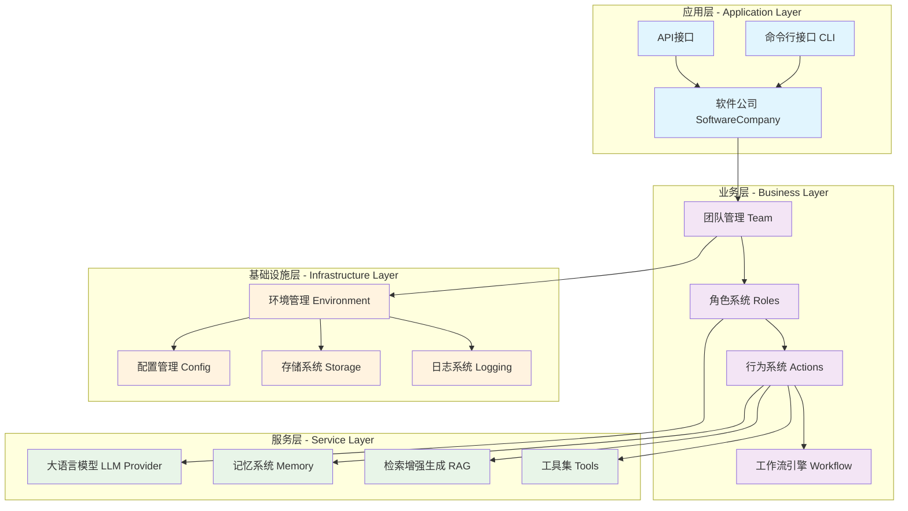
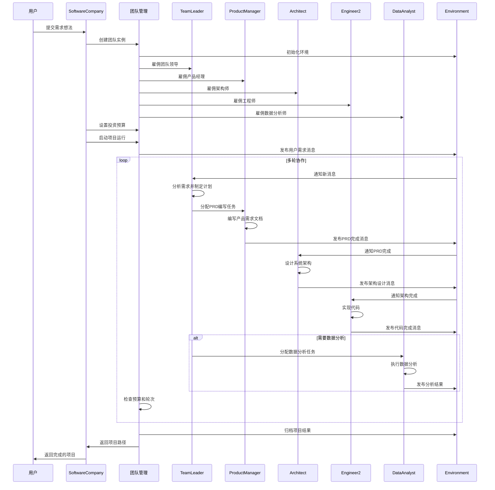
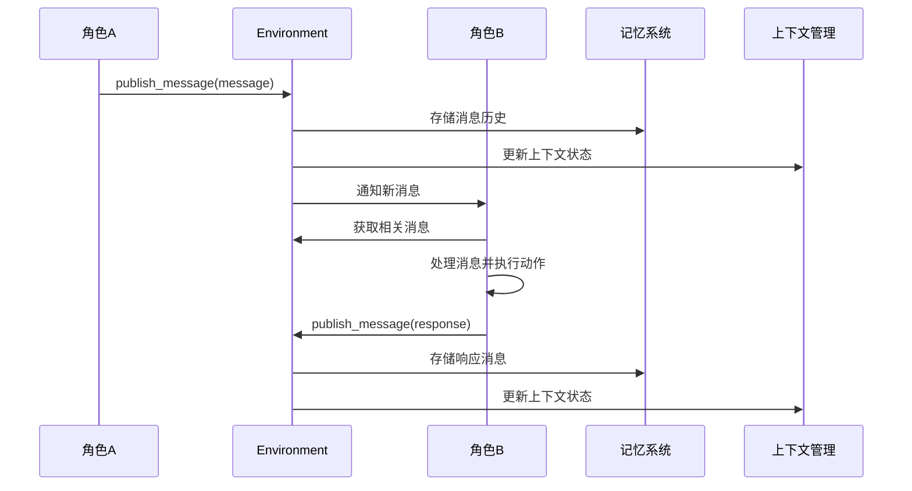
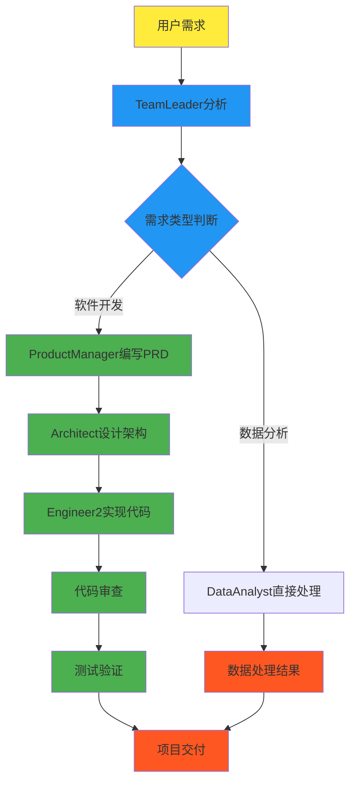
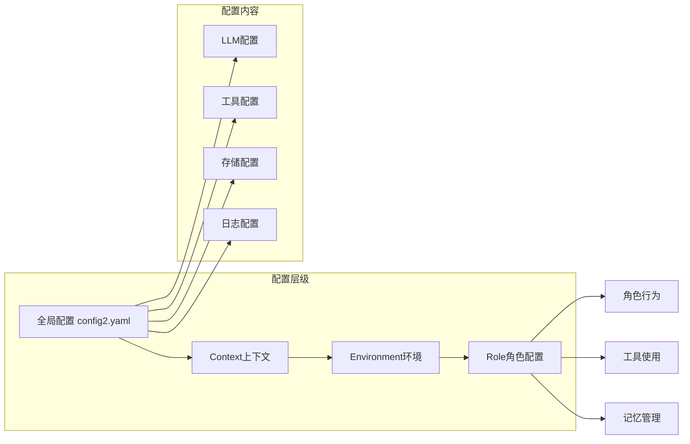
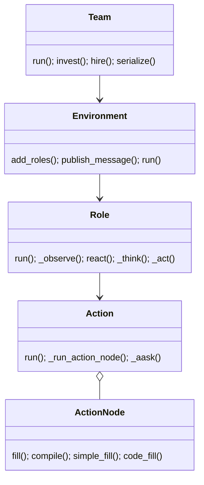

## 概述

MetaGPT是一个革命性的多智能体框架，它将软件开发过程抽象为一个由AI智能体组成的虚拟软件公司。通过模拟真实软件公司的组织结构和工作流程，MetaGPT实现了从需求分析到代码实现的全自动化软件开发。MetaGPT的核心架构设计，揭示其背后的技术原理和实现细节。

<!--more-->

## 1. 核心设计理念

### 1.1 软件公司即多智能体系统

MetaGPT的核心哲学是 `Code = SOP(Team)`，即代码是标准操作程序（SOP）作用于团队的结果。这一理念体现在：

- **角色分工明确**：产品经理、架构师、工程师、数据分析师等专业角色
- **流程标准化**：遵循真实软件公司的开发流程和最佳实践
- **协作机制**：通过消息传递和环境共享实现智能体间的有效协作
- **质量保证**：内置代码审查、测试等质量控制机制

### 1.2 分层架构设计

MetaGPT采用清晰的分层架构，从底层基础设施到上层业务逻辑：



## 2. 核心模块架构

### 2.1 软件公司模块 (SoftwareCompany)

软件公司模块是MetaGPT的入口点，负责整个系统的初始化和运行控制：

```python
def generate_repo(
    idea,                    # 用户需求描述
    investment=3.0,         # 投资预算
    n_round=5,              # 运行轮次
    code_review=True,       # 是否启用代码审查
    run_tests=False,        # 是否运行测试
    implement=True,         # 是否实现代码
    project_name="",        # 项目名称
    inc=False,              # 增量模式
    project_path="",        # 项目路径
    reqa_file="",          # 质量保证文件
    max_auto_summarize_code=0,  # 自动代码总结次数
    recover_path=None,      # 恢复路径
):
    """运行软件公司的核心逻辑，可从CLI或其他Python脚本调用"""
```

**核心功能**：

- **团队组建**：创建并配置各种角色（TeamLeader、ProductManager、Architect、Engineer2、DataAnalyst）
- **预算管理**：控制AI调用成本，防止超出预算
- **项目执行**：协调各角色完成软件开发任务
- **状态持久化**：支持项目状态的序列化和恢复

### 2.2 团队管理模块 (Team)

团队模块是多智能体协作的核心，管理所有角色的生命周期和交互：

```python
class Team(BaseModel):
    """
    团队：拥有一个或多个角色（智能体）、SOP（标准操作程序）和用于即时消息的环境，
    专门用于任何多智能体活动，如协作编写可执行代码。
    """
    
    env: Optional[Environment] = None      # 环境实例
    investment: float = Field(default=10.0)  # 投资金额
    idea: str = Field(default="")          # 项目想法
    use_mgx: bool = Field(default=True)    # 是否使用MGX环境
```

**关键方法**：

- `hire(roles)`: 雇佣角色到团队
- `invest(investment)`: 设置投资预算
- `run(n_round, idea)`: 运行团队协作
- `serialize/deserialize`: 状态持久化

### 2.3 环境系统 (Environment)

环境系统提供智能体间的通信基础设施和执行上下文：

```python
class Environment(ExtEnv):
    """
    环境，承载一批角色，角色可以向环境发布消息，可以被其他角色观察到
    """
    
    desc: str = Field(default="")                    # 环境描述
    roles: dict[str, SerializeAsAny[BaseRole]] = Field(default_factory=dict)  # 角色字典
    member_addrs: Dict[BaseRole, Set] = Field(default_factory=dict)  # 成员地址
    history: Memory = Field(default_factory=Memory)  # 历史记录
    context: Context = Field(default_factory=Context)  # 上下文
```

**核心功能**：

- **消息路由**：在角色间传递消息和通知
- **状态管理**：维护全局状态和历史记录
- **资源管理**：管理共享资源和配置
- **生命周期管理**：控制角色的创建、运行和销毁

## 3. 系统时序图

### 3.1 软件开发完整流程



### 3.2 角色间消息传递机制



## 4. 核心数据流

### 4.1 需求到代码的转换流程



### 4.2 配置和上下文管理



## 5. 关键设计模式

### 5.1 观察者模式 (Observer Pattern)

环境系统使用观察者模式实现角色间的松耦合通信：

```python
class Environment:
    def publish_message(self, message: Message, peekable: bool = True) -> bool:
        """发布消息给所有订阅的角色"""
        # 通知所有相关角色
        for role in self.roles.values():
            if self._should_notify(role, message):
                role.put_message(message)
```

### 5.2 策略模式 (Strategy Pattern)

不同的LLM提供商通过策略模式实现统一接口：

```python
class BaseLLM:
    """LLM提供商的基础接口"""
    async def aask(self, prompt: str, **kwargs) -> str:
        """异步询问LLM"""
        raise NotImplementedError

class OpenAILLM(BaseLLM):
    """OpenAI实现"""
    pass

class AnthropicLLM(BaseLLM):
    """Anthropic实现"""
    pass
```

### 5.3 工厂模式 (Factory Pattern)

角色创建使用工厂模式，支持动态角色配置：

```python
def create_role(role_type: str, **kwargs) -> BaseRole:
    """根据类型创建角色实例"""
    role_map = {
        "ProductManager": ProductManager,
        "Architect": Architect,
        "Engineer2": Engineer2,
        "DataAnalyst": DataAnalyst,
    }
    return role_map[role_type](**kwargs)
```

## 6. 性能优化策略

### 6.1 异步执行模型

MetaGPT采用异步编程模型，提高并发处理能力：

```python
async def run(self, n_round=3, idea="", send_to="", auto_archive=True):
    """异步运行团队协作"""
    while n_round > 0:
        if self.env.is_idle:
            break
        n_round -= 1
        self._check_balance()
        await self.env.run()  # 异步执行环境运行
```

### 6.2 内存管理优化

- **分层记忆**：短期记忆、长期记忆和工作记忆分离
- **上下文压缩**：智能压缩历史对话，减少token消耗
- **缓存机制**：缓存常用的LLM响应和计算结果

### 6.3 成本控制机制

```python
def _check_balance(self):
    """检查预算余额"""
    if self.cost_manager.total_cost >= self.cost_manager.max_budget:
        raise NoMoneyException(
            self.cost_manager.total_cost,
            f"资金不足: {self.cost_manager.max_budget}"
        )
```

## 7. 扩展性设计

### 7.1 插件化架构

- **角色插件**：支持自定义角色类型和行为
- **动作插件**：可扩展的动作系统
- **工具插件**：集成外部工具和服务
- **环境插件**：支持不同的执行环境（Android、Minecraft等）

### 7.2 多环境支持

```python
# 标准软件开发环境
env = Environment(context=ctx)

# Android开发环境  
env = AndroidEnv(context=ctx)

# Minecraft游戏环境
env = MinecraftEnv(context=ctx)

# MGX增强环境
env = MGXEnv(context=ctx)
```

## 8. 质量保证机制

### 8.1 代码审查流程

- **自动化审查**：基于规则的代码质量检查
- **智能审查**：使用LLM进行代码逻辑和最佳实践审查
- **多轮迭代**：支持审查-修改-再审查的循环流程

### 8.2 测试集成

- **单元测试生成**：自动生成测试用例
- **集成测试**：端到端功能测试
- **性能测试**：代码性能和资源使用评估

## 9. 监控和可观测性

### 9.1 日志系统

```python
from metagpt.logs import logger

logger.info(f"投资金额: ${investment}")
logger.debug(f"剩余轮次: {n_round}")
logger.error("预算不足异常")
```

### 9.2 指标收集

- **成本指标**：LLM调用成本、token使用量
- **性能指标**：执行时间、成功率、错误率
- **业务指标**：项目完成度、代码质量分数

## 10. 总结

MetaGPT通过精心设计的架构，成功地将复杂的软件开发过程抽象为多智能体协作问题。其核心优势包括：

1. **模块化设计**：清晰的分层架构和模块边界
2. **可扩展性**：插件化的角色、动作和环境系统
3. **可靠性**：完善的错误处理和状态管理
4. **可观测性**：全面的日志和监控机制
5. **成本控制**：智能的预算管理和资源优化

这种架构设计不仅实现了高效的多智能体协作，还为未来的功能扩展和性能优化奠定了坚实基础。通过深入理解这些架构原理，开发者可以更好地使用和扩展MetaGPT框架，构建更加智能和高效的AI应用系统。

## 附录A：关键函数与调用链（基于源码）

### A.1 团队与环境关键函数

```python
# 位置: metagpt/team.py
@serialize_decorator
async def run(self, n_round=3, idea="", send_to="", auto_archive=True):
    if idea:
        self.run_project(idea=idea, send_to=send_to)
    while n_round > 0:
        if self.env.is_idle:
            break
        n_round -= 1
        self._check_balance()
        await self.env.run()
    self.env.archive(auto_archive)
    return self.env.history
```

```python
# 位置: metagpt/environment/base_env.py
def publish_message(self, message: Message, peekable: bool = True) -> bool:
    found = False
    for role, addrs in self.member_addrs.items():
        if is_send_to(message, addrs):
            role.put_message(message)
            found = True
    if not found:
        logger.warning(f"Message no recipients: {message.dump()}")
    self.history.add(message)
    return True

async def run(self, k=1):
    for _ in range(k):
        futures = []
        for role in self.roles.values():
            if role.is_idle:
                continue
            futures.append(role.run())
        if futures:
            await asyncio.gather(*futures)
```

### A.2 角色与动作关键函数

```python
# 位置: metagpt/roles/role.py
@role_raise_decorator
async def run(self, with_message=None) -> Message | None:
    if with_message:
        msg = Message(content=with_message) if isinstance(with_message, str) else (
            with_message if isinstance(with_message, Message) else Message(content="\n".join(with_message))
        )
        if not msg.cause_by:
            msg.cause_by = UserRequirement
        self.put_message(msg)
    if not await self._observe():
        return
    rsp = await self.react()
    self.set_todo(None)
    self.publish_message(rsp)
    return rsp
```

```python
# 位置: metagpt/actions/action.py
async def _run_action_node(self, *args, **kwargs):
    msgs = args[0]
    context = "## History Messages\n" + "\n".join([f"{idx}: {i}" for idx, i in enumerate(reversed(msgs))])
    return await self.node.fill(req=context, llm=self.llm)
```

### A.3 总调用链

```
SoftwareCompany.generate_repo()
  └─ Team.run()
      ├─ Team._check_balance()
      ├─ Environment.run()
      │   └─ Role.run()
      │       ├─ Role._observe() → Memory/MessageQueue
      │       ├─ Role.react() → Role._react()/Role._plan_and_act()
      │       │   ├─ Role._think() → LLM.aask() [可选]
      │       │   └─ Role._act() → Action.run() → ActionNode.fill() → LLM.aask()
      │       └─ Environment.publish_message()
      └─ Environment.archive()
```

### A.4 类结构图（关键）


