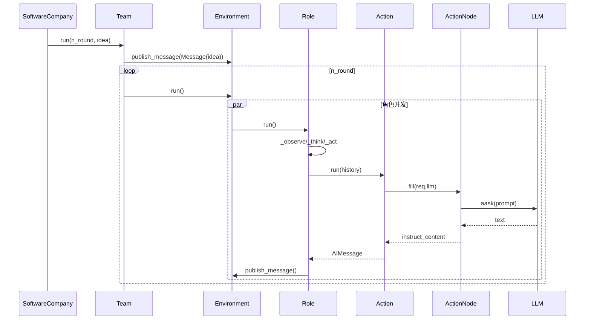

# MetaGPT源码完整解析：多智能体软件开发框架深度剖析

> MetaGPT是一个通过...实现进行深度解析，揭示其多智能体协作的核心机制。

---

# 第一部分：整体架构与设计理念

## 1.1 架构概览

MetaGPT采用分层架构设计，模拟真实软件公司的组织结构和工作流程：

<div class="mermaid-image-container" data-chart-id="MetaGPT_complete_analysis-0">
  
  <div class="mermaid-fallback" style="display: none;">
    <details>
      <summary>显示 Mermaid 源码</summary>
      <pre class="mermaid">graph TB
    subgraph "用户层"
        CLI[命令行接口]
        API[API接口]
        Examples[示例应用]
    end
    
    subgraph "团队管理层"
        Team[Team 团队]
        Context[Context 上下文]
        Config[Config 配置]
    end
    
    subgraph "环境层"
        Environment[Environment 环境]
        MGXEnv[MGX环境]
        ExtEnv[扩展环境]
    end
    
    subgraph "角色层"
        Role[Role 基础角色]
        PM[ProductManager]
        Arch[Architect]
        Eng[Engineer]
        TL[TeamLeader]
        DA[DataAnalyst]
    end
    
    subgraph "动作层"
        Action[Action 基础动作]
        ActionNode[ActionNode]
        WritePRD[写PRD]
        WriteCode[写代码]
        CodeReview[代码审查]
    end
    
    subgraph "基础设施层"
        LLM[LLM提供者]
        Memory[记忆系统]
        Schema[消息模式]
        Tools[工具集]
    end
    
    CLI --> Team
    API --> Team
    Examples --> Team
    
    Team --> Environment
    Team --> Role
    Context --> Config
    
    Environment --> Role
    Role --> Action
    Action --> ActionNode
    
    Role --> Memory
    Action --> LLM
    Action --> Schema
    
    LLM --> Tools</pre>
    </details>
  </div>
</div>

## 1.2 核心设计理念

* **分层架构**：用户层 → 团队层 → 环境层 → 角色层 → 动作层 → 基础设施层
* **消息驱动**：通过 Message 在角色间传递信息，实现异步协作
* **角色专业化**：每个角色专注特定职责，如产品经理负责需求分析，架构师负责系统设计
* **动作原子化**：将复杂任务分解为可复用的原子动作
* **记忆持久化**：支持长期记忆和工作记忆，保持上下文连续性

## 1.3 启动流程时序图

<div class="mermaid-image-container" data-chart-id="MetaGPT_complete_analysis-1">
  
  <div class="mermaid-fallback" style="display: none;">
    <details>
      <summary>显示 Mermaid 源码</summary>
      <pre class="mermaid">sequenceDiagram
    participant CLI as 命令行
    participant SC as SoftwareCompany
    participant Team as Team
    participant Env as Environment
    participant Role as Role
    participant LLM as LLM Provider
    
    CLI->>SC: startup(idea, investment, n_round)
    SC->>SC: generate_repo()
    SC->>Team: Team(context=ctx)
    Team->>Env: Environment(context=ctx)
    
    SC->>Team: hire([TeamLeader, PM, Architect, Engineer])
    loop 每个角色
        Team->>Env: add_role(role)
        Env->>Role: set_env(env)
        Role->>LLM: 初始化LLM连接
    end
    
    SC->>Team: invest(investment)
    SC->>Team: run(n_round, idea)
    Team->>Env: publish_message(Message(idea))
    
    loop n_round轮
        Team->>Env: run()
        loop 每个角色
            Env->>Role: run()
            Role->>Role: _observe()
            Role->>Role: _think()
            Role->>Role: _act()
            Role->>Env: publish_message(response)
        end
    end</pre>
    </details>
  </div>
</div>

---

# 第二部分：核心执行路径关键函数深度解析

## 2.1 启动入口函数

### `generate_repo()` - 主启动函数
**位置**: `metagpt/software_company.py:14`  
**职责**: 协调整个软件开发流程的启动

```python
def generate_repo(
    idea,
    investment=3.0,
    n_round=5,
    code_review=True,
    run_tests=False,
    implement=True,
    project_name="",
    inc=False,
    project_path="",
    reqa_file="",
    max_auto_summarize_code=0,
    recover_path=None,
):
    """核心启动逻辑"""
    # 1. 配置初始化
    config.update_via_cli(project_path, project_name, inc, reqa_file, max_auto_summarize_code)
    ctx = Context(config=config)
    
    # 2. 团队组建
    company = Team(context=ctx)
    company.hire([
        TeamLeader(),
        ProductManager(),
        Architect(),
        Engineer2(),
        DataAnalyst(),
    ])
    
    # 3. 投资设置与异步执行
    company.invest(investment)
    asyncio.run(company.run(n_round=n_round, idea=idea))
```

**关键步骤**:

1. **配置初始化**: `config.update_via_cli()` - 解析命令行参数并更新配置
2. **上下文创建**: `Context(config=config)` - 创建全局上下文对象
3. **团队组建**: `Team(context=ctx)` - 初始化团队实例
4. **角色雇佣**: `company.hire([...])` - 添加各种专业角色
5. **投资设置**: `company.invest(investment)` - 设置预算限制
6. **异步执行**: `asyncio.run(company.run(...))` - 启动主执行循环

**设计亮点**:

- 支持从序列化状态恢复: `Team.deserialize(stg_path)`
- 灵活的角色配置: 可选择性启用不同角色
- 预算控制机制: 防止无限制的LLM调用成本

## 2.2 团队管理函数

### `Team.run()` - 团队主执行循环
**位置**: `metagpt/team.py:123`  
**职责**: 控制整个团队的运行节奏和生命周期

```python
@serialize_decorator
async def run(self, n_round=3, idea="", send_to="", auto_archive=True):
    """运行团队直到目标轮数或资金耗尽"""
    if idea:
        self.run_project(idea=idea, send_to=send_to)

    while n_round > 0:
        if self.env.is_idle:  # 所有角色都空闲
            logger.debug("All roles are idle.")
            break
        n_round -= 1
        self._check_balance()  # 检查预算
        await self.env.run()   # 环境运行一轮
        logger.debug(f"max {n_round=} left.")
    
    self.env.archive(auto_archive)  # 归档项目
    return self.env.history
```

**执行逻辑**:

1. **需求发布**: 如果有新想法，通过`run_project()`发布到环境
2. **轮次控制**: 最多执行`n_round`轮，防止无限循环
3. **空闲检测**: 所有角色都空闲时提前结束
4. **预算检查**: 每轮检查是否超出预算限制
5. **环境运行**: 委托给环境执行一轮所有角色
6. **自动归档**: 完成后自动保存项目状态

**关键机制**:

- `@serialize_decorator`: 自动序列化团队状态
- 预算控制: `_check_balance()` 防止成本失控
- 优雅退出: 多种退出条件确保程序正常结束

### `Team.hire()` - 角色雇佣
**位置**: `metagpt/team.py:83`

```python
def hire(self, roles: list[Role]):
    """雇佣角色进行协作"""
    self.env.add_roles(roles)

def invest(self, investment: float):
    """投资公司，设置预算上限"""
    self.investment = investment
    self.cost_manager.max_budget = investment
```

**简洁设计**: 直接委托给环境的`add_roles()`方法，体现了单一职责原则。

## 2.3 环境管理函数

### `Environment.run()` - 环境执行引擎
**位置**: `metagpt/environment/base_env.py:197`  
**职责**: 并发执行所有活跃角色

```python
async def run(self, k=1):
    """处理一次所有角色的运行"""
    for _ in range(k):
        futures = []
        for role in self.roles.values():
            if role.is_idle:
                continue
            future = role.run()
            futures.append(future)

        if futures:
            await asyncio.gather(*futures)  # 并发执行所有角色
        logger.debug(f"is idle: {self.is_idle}")
```

**并发设计**:

- **异步收集**: 收集所有非空闲角色的执行任务
- **并发执行**: 使用`asyncio.gather()`并发执行所有角色
- **性能优化**: 跳过空闲角色，避免不必要的等待

### `Environment.publish_message()` - 消息路由核心
**位置**: `metagpt/environment/base_env.py:175`  
**职责**: 实现消息的智能路由分发

```python
def publish_message(self, message: Message, peekable: bool = True) -> bool:
    """分发消息给接收者"""
    logger.debug(f"publish_message: {message.dump()}")
    found = False
    # 根据 RFC 113 的路由特性计划
    for role, addrs in self.member_addrs.items():
        if is_send_to(message, addrs):
            role.put_message(message)  # 放入角色私有消息缓冲区
            found = True
    if not found:
        logger.warning(f"Message no recipients: {message.dump()}")
    self.history.add(message)  # For debug
    return True
```

**路由算法**:

1. **地址匹配**: 检查消息的`send_to`是否匹配角色的订阅地址
2. **消息投递**: 将消息放入匹配角色的私有消息缓冲区
3. **异常处理**: 记录无接收者的消息警告
4. **历史记录**: 保存所有消息用于调试和回溯

**设计特点**:

- 基于RFC 113的路由设计，职责清晰
- 支持一对多广播和点对点通信
- 完整的消息追踪和调试支持

---

# 第三部分：角色系统与协作机制

## 3.1 Role（角色系统）核心函数

### `Role.run()` - 角色主执行入口
**位置**: `metagpt/roles/role.py:530`  
**职责**: 实现角色的完整执行周期

```python
@role_raise_decorator
async def run(self, with_message=None) -> Message | None:
    """观察，思考并根据观察结果行动"""
    if with_message:
        msg = self._process_input_message(with_message)
        self.put_message(msg)
    
    if not await self._observe():
        # 如果没有新信息，暂停等待
        logger.debug(f"{self._setting}: no news. waiting.")
        return

    rsp = await self.react()  # 反应（思考+行动）

    # 重置下一个要执行的动作
    self.set_todo(None)
    # 发送响应消息到环境
    self.publish_message(rsp)
    return rsp
```

**执行流程**:

1. **消息预处理**: 处理外部输入消息
2. **观察阶段**: `_observe()` 检查新消息
3. **反应阶段**: `react()` 思考并执行动作
4. **状态重置**: 清理当前任务状态
5. **结果发布**: 将响应发布到环境

### `Role._observe()` - 消息观察机制
**位置**: `metagpt/roles/role.py:399`  
**职责**: 从消息缓冲区筛选和处理新消息

```python
async def _observe(self) -> int:
    """从消息缓冲区准备新消息进行处理"""
    # 读取未处理的消息
    news = []
    if self.recovered and self.latest_observed_msg:
        news = self.rc.memory.find_news(observed=[self.latest_observed_msg], k=10)
    if not news:
        news = self.rc.msg_buffer.pop_all()
    
    # 存储到自己的记忆中防止重复处理
    old_messages = [] if not self.enable_memory else self.rc.memory.get()
    
    # 过滤感兴趣的消息
    self.rc.news = [
        n for n in news
        if (n.cause_by in self.rc.watch or self.name in n.send_to)
        and n not in old_messages
    ]
    
    if self.observe_all_msg_from_buffer:
        self.rc.memory.add_batch(news)
    else:
        self.rc.memory.add_batch(self.rc.news)
    
    self.latest_observed_msg = self.rc.news[-1] if self.rc.news else None
    return len(self.rc.news)
```

**过滤逻辑**:

1. **消息获取**: 从缓冲区获取所有未处理消息
2. **重复检测**: 与已有记忆对比，避免重复处理
3. **兴趣过滤**: 只关注订阅的动作类型或直接发送给自己的消息
4. **记忆更新**: 将新消息添加到记忆系统
5. **状态跟踪**: 记录最后观察到的消息用于恢复

### `Role._think()` - 决策思考机制
**位置**: `metagpt/roles/role.py:340`  
**职责**: 根据当前状态和历史决定下一步动作

```python
async def _think(self) -> bool:
    """考虑做什么并决定下一步行动"""
    if len(self.actions) == 1:
        # 如果只有一个动作，则只能执行这个
        self._set_state(0)
        return True

    if self.recovered and self.rc.state >= 0:
        self._set_state(self.rc.state)  # 从恢复状态运行的动作
        self.recovered = False
        return True

    if self.rc.react_mode == RoleReactMode.BY_ORDER:
        if self.rc.max_react_loop != len(self.actions):
            self.rc.max_react_loop = len(self.actions)
        self._set_state(self.rc.state + 1)
        return self.rc.state >= 0 and self.rc.state < len(self.actions)

    # 使用LLM动态选择动作
    prompt = self._get_prefix() + STATE_TEMPLATE.format(
        history=self.rc.history,
        states="\n".join(self.states),
        n_states=len(self.states) - 1,
        previous_state=self.rc.state,
    )

    next_state = await self.llm.aask(prompt)
    next_state = extract_state_value_from_output(next_state)
    
    if (not next_state.isdigit() and next_state != "-1") or int(next_state) not in range(-1, len(self.states)):
        logger.warning(f"Invalid answer of state, {next_state=}, will be set to -1")
        next_state = -1
    else:
        next_state = int(next_state)
        if next_state == -1:
            logger.info(f"End actions with {next_state=}")
    
    self._set_state(next_state)
    return True
```

**决策策略**:

1. **单动作模式**: 只有一个动作时直接执行
2. **恢复模式**: 从序列化状态恢复时继续之前的动作
3. **顺序模式**: 按预定义顺序执行动作
4. **智能模式**: 使用LLM根据历史和当前状态选择最佳动作

**三种反应模式**：

```python
class RoleReactMode(str, Enum):
    REACT = "react"           # 动态选择动作
    BY_ORDER = "by_order"     # 按顺序执行
    PLAN_AND_ACT = "plan_and_act"  # 先计划后执行
```

### `Role._act()` - 动作执行机制
**位置**: `metagpt/roles/role.py:381`  
**职责**: 执行当前选定的动作并生成响应

```python
async def _act(self) -> Message:
    logger.info(f"{self._setting}: to do {self.rc.todo}({self.rc.todo.name})")
    response = await self.rc.todo.run(self.rc.history)
    
    if isinstance(response, (ActionOutput, ActionNode)):
        msg = AIMessage(
            content=response.content,
            instruct_content=response.instruct_content,
            cause_by=self.rc.todo,
            sent_from=self,
        )
    elif isinstance(response, Message):
        msg = response
    else:
        msg = AIMessage(content=response or "", cause_by=self.rc.todo, sent_from=self)
    
    self.rc.memory.add(msg)
    return msg
```

**响应处理**:

1. **动作执行**: 调用当前待办动作的`run()`方法
2. **响应封装**: 根据响应类型创建合适的消息对象
3. **记忆更新**: 将响应添加到角色记忆中
4. **消息返回**: 返回格式化的消息对象

## 3.2 消息流与协作时序

<div class="mermaid-image-container" data-chart-id="MetaGPT_complete_analysis-2">
  
  <div class="mermaid-fallback" style="display: none;">
    <details>
      <summary>显示 Mermaid 源码</summary>
      <pre class="mermaid">sequenceDiagram
    participant Role1 as 角色A
    participant Env as Environment
    participant Role2 as 角色B
    participant Memory as Memory
    
    Role1->>Role1: _act() 执行动作
    Role1->>Role1: 生成 AIMessage
    Role1->>Env: publish_message(msg)
    
    Env->>Env: 检查消息路由规则
    Env->>Role2: put_message(msg)
    Env->>Memory: add(msg) 历史记录
    
    Role2->>Role2: _observe() 观察新消息
    Role2->>Role2: msg_buffer.pop_all()
    Role2->>Role2: 过滤感兴趣的消息
    Role2->>Memory: add_batch(news) 更新记忆
    
    Role2->>Role2: _think() 思考下一步
    Role2->>Role2: _act() 执行响应动作</pre>
    </details>
  </div>
</div>

### 协作模式

**1. 流水线模式**：

```
ProductManager → Architect → Engineer → QaEngineer
    (需求)    →   (设计)   →  (编码)  →   (测试)
```

**2. 评审模式**：

```
Engineer → CodeReview → Engineer
 (编码)  →   (评审)   →  (修改)
```

**3. 团队协作模式**：

```
TeamLeader 统筹 → 各角色并行工作 → 结果汇总
```

---

# 第四部分：动作系统与结构化输出

## 4.1 Action（动作系统）核心函数

### `Action.run()` - 动作执行入口
**位置**: `metagpt/actions/action.py:110`  
**职责**: 执行具体的动作逻辑

```python
async def run(self, *args, **kwargs):
    """运行动作"""
    if self.node:
        return await self._run_action_node(*args, **kwargs)
    raise NotImplementedError("The run method should be implemented in a subclass.")

async def _run_action_node(self, *args, **kwargs):
    """运行动作节点"""
    msgs = args[0]
    context = "## History Messages\n"
    context += "\n".join([f"{idx}: {i}" for idx, i in enumerate(reversed(msgs))])
    return await self.node.fill(req=context, llm=self.llm)
```

**上下文构建**:

- 将历史消息格式化为上下文
- 按时间倒序排列，最新消息在前
- 委托给ActionNode进行结构化处理

## 4.2 ActionNode核心函数

### `ActionNode.fill()` - 结构化填充核心
**位置**: `metagpt/actions/action_node.py:597`  
**职责**: 实现结构化的LLM输出处理

```python
@exp_cache(serializer=ActionNodeSerializer())
async def fill(
    self,
    *,
    req,
    llm,
    schema="json",
    mode="auto",
    strgy="simple",
    images: Optional[Union[str, list[str]]] = None,
    timeout=USE_CONFIG_TIMEOUT,
    exclude=[],
    function_name: str = None,
):
    """填充节点内容"""
    self.set_llm(llm)
    self.set_context(req)
    if self.schema:
        schema = self.schema

    if mode == FillMode.CODE_FILL.value:
        result = await self.code_fill(context, function_name, timeout)
        self.instruct_content = self.create_class()(**result)
        return self

    elif mode == FillMode.XML_FILL.value:
        context = self.xml_compile(context=self.context)
        result = await self.xml_fill(context, images=images)
        self.instruct_content = self.create_class()(**result)
        return self

    elif mode == FillMode.SINGLE_FILL.value:
        result = await self.single_fill(context, images=images)
        self.instruct_content = self.create_class()(**result)
        return self

    if strgy == "simple":
        return await self.simple_fill(schema=schema, mode=mode, images=images, timeout=timeout, exclude=exclude)
    elif strgy == "complex":
        # 复杂策略：逐个处理子节点
        tmp = {}
        for _, i in self.children.items():
            if exclude and i.key in exclude:
                continue
            child = await i.simple_fill(schema=schema, mode=mode, images=images, timeout=timeout, exclude=exclude)
            tmp.update(child.instruct_content.model_dump())
        cls = self._create_children_class()
        self.instruct_content = cls(**tmp)
        return self
```

**多模式支持**:

- **CODE_FILL**: 专门处理代码生成，支持函数名提取
- **XML_FILL**: XML格式的结构化输出
- **SINGLE_FILL**: 单一字段填充
- **标准模式**: JSON/Markdown结构化输出

**策略选择**:

- **simple**: 一次性处理所有字段
- **complex**: 逐个处理子节点，适合复杂嵌套结构

### `ActionNode.compile()` - 提示模板编译
**位置**: `metagpt/actions/action_node.py:382`  
**职责**: 将节点定义编译为LLM提示模板

```python
def compile(self, context, schema="json", mode="children", template=SIMPLE_TEMPLATE, exclude=[]) -> str:
    """
    编译提示模板
    mode: all/root/children
    schema: raw/json/markdown
    """
    if schema == "raw":
        return f"{context}\n\n## Actions\n{LANGUAGE_CONSTRAINT}\n{self.instruction}"

    instruction = self.compile_instruction(schema="markdown", mode=mode, exclude=exclude)
    example = self.compile_example(schema=schema, tag=TAG, mode=mode, exclude=exclude)
    constraints = [LANGUAGE_CONSTRAINT, FORMAT_CONSTRAINT]
    constraint = "\n".join(constraints)

    prompt = template.format(
        context=context,
        example=example,
        instruction=instruction,
        constraint=constraint,
    )
    return prompt
```

**模板组成**:

1. **上下文**: 历史消息和当前请求
2. **指令**: 字段定义和类型约束
3. **示例**: 期望的输出格式示例
4. **约束**: 语言和格式约束

**结构化输出特性**：

* **动态模型生成**：基于字段定义动态创建 Pydantic 模型
* **多格式支持**：支持 JSON、Markdown、XML 等输出格式
* **验证与解析**：自动验证输出格式并解析为结构化数据
* **错误重试**：支持输出格式错误时的自动重试

---

# 第五部分：记忆系统与LLM调用

## 5.1 Memory（记忆系统）核心函数

### `Memory.add()` - 消息添加
**位置**: `metagpt/memory/memory.py:27`

```python
def add(self, message: Message):
    """添加新消息到存储，同时更新索引"""
    if self.ignore_id:
        message.id = IGNORED_MESSAGE_ID
    if message in self.storage:
        return
    self.storage.append(message)
    if message.cause_by:
        self.index[message.cause_by].append(message)
```

**索引维护**:

- 按动作类型建立倒排索引
- 避免重复消息
- 支持ID忽略模式

### `Memory.get_by_actions()` - 按动作检索
**位置**: `metagpt/memory/memory.py:99`

```python
def get_by_actions(self, actions: Set) -> list[Message]:
    """返回由指定动作触发的所有消息"""
    rsp = []
    indices = any_to_str_set(actions)
    for action in indices:
        if action not in self.index:
            continue
        rsp += self.index[action]
    return rsp

def find_news(self, observed: list[Message], k=0) -> list[Message]:
    """从最近的 k 条记忆中找到新消息（之前未见过的消息）"""
    already_observed = self.get(k)
    news = []
    for i in observed:
        if i in already_observed:
            continue
        news.append(i)
    return news
```

**高效检索**:

- 利用倒排索引快速定位
- 支持多动作类型查询
- 自动处理不存在的索引

**记忆机制**：

* **分层存储**：支持工作记忆和长期记忆
* **索引优化**：按动作类型建立索引，快速检索相关消息
* **增量更新**：支持增量添加和批量操作

## 5.2 LLM调用函数

### `BaseLLM.aask()` - 异步LLM调用
**位置**: `metagpt/provider/base_llm.py:179`

```python
async def aask(
    self,
    msg: Union[str, list[dict[str, str]]],
    system_msgs: Optional[list[str]] = None,
    format_msgs: Optional[list[dict[str, str]]] = None,
    images: Optional[Union[str, list[str]]] = None,
    timeout=USE_CONFIG_TIMEOUT,
    stream=None,
) -> str:
    if system_msgs:
        message = self._system_msgs(system_msgs)
    else:
        message = [self._default_system_msg()]
    if not self.use_system_prompt:
        message = []
    if format_msgs:
        message.extend(format_msgs)
    if isinstance(msg, str):
        message.append(self._user_msg(msg, images=images))
    else:
        message.extend(msg)
    if stream is None:
        stream = self.config.stream

    # 图像数据替换为占位符以避免长输出
    masked_message = [self.mask_base64_data(m) for m in message]
    logger.debug(masked_message)

    compressed_message = self.compress_messages(message, compress_type=self.config.compress_type)
    rsp = await self.acompletion_text(compressed_message, stream=stream, timeout=self.get_timeout(timeout))
    return rsp
```

**消息处理流程**:

1. **消息组装**: 系统消息 + 格式化消息 + 用户消息
2. **多模态支持**: 处理图像输入
3. **日志优化**: 屏蔽base64数据避免日志过长
4. **消息压缩**: 根据配置压缩长上下文
5. **异步调用**: 支持流式和非流式输出

### `BaseLLM.compress_messages()` - 消息压缩
**位置**: `metagpt/provider/base_llm.py:340`

```python
def compress_messages(
    self,
    messages: list[dict],
    compress_type: CompressType = CompressType.NO_COMPRESS,
    max_token: int = 128000,
    threshold: float = 0.8,
) -> list[dict]:
    """压缩消息以适应token限制"""
    if compress_type == CompressType.NO_COMPRESS:
        return messages

    max_token = TOKEN_MAX.get(self.model, max_token)
    keep_token = int(max_token * threshold)
    compressed = []

    # Always keep system messages
    system_msg_val = self._system_msg("")["role"]
    system_msgs = []
    for i, msg in enumerate(messages):
        if msg["role"] == system_msg_val:
            system_msgs.append(msg)
        else:
            user_assistant_msgs = messages[i:]
            break
    
    compressed.extend(system_msgs)
    current_token_count = self.count_tokens(system_msgs)

    if compress_type in [CompressType.POST_CUT_BY_TOKEN, CompressType.POST_CUT_BY_MSG]:
        # 保留最新的消息
        for i, msg in enumerate(reversed(user_assistant_msgs)):
            token_count = self.count_tokens([msg])
            if current_token_count + token_count <= keep_token:
                compressed.insert(len(system_msgs), msg)
                current_token_count += token_count
            else:
                if compress_type == CompressType.POST_CUT_BY_TOKEN:
                    # 截断消息以适应剩余token数量
                    truncated_content = msg["content"][-(keep_token - current_token_count) :]
                    compressed.insert(len(system_msgs), {"role": msg["role"], "content": truncated_content})
                break

    return compressed
```

**压缩策略**:

- **POST_CUT**: 保留最新消息，删除最旧的
- **PRE_CUT**: 保留最旧消息，删除最新的
- **TOKEN级别**: 精确到token的截断
- **MSG级别**: 以完整消息为单位的截断

---

# 第六部分：扩展环境与专业化应用

## 6.1 MGX环境（多模态交互）

```python
class MGXEnv(Environment, SerializationMixin):
    def publish_message(self, message: Message, user_defined_recipient: str = "", publicer: str = ""):
        """让团队领导接管消息发布"""
        message = self.attach_images(message)  # 多模态消息支持
        
        tl = self.get_role(TEAMLEADER_NAME)  # TeamLeader 名为 Mike
        
        if user_defined_recipient:
            # 用户直接与某个角色对话
            self.direct_chat_roles.add(role_name)
            self._publish_message(message)
        elif publicer == tl.profile:
            # 团队领导处理的消息可以发布
            self._publish_message(message)
        else:
            # 每个常规消息都通过团队领导
            message.send_to.add(tl.name)
            self._publish_message(message)
```

**特性**：

* **多模态支持**：自动提取和编码图像
* **直接对话**：支持用户与特定角色的直接交互
* **团队协调**：TeamLeader 统筹消息流转

## 6.2 Android环境

支持 Android 应用的自动化测试和操作：

```python
class AndroidEnv(ExtEnv):
    @mark_as_readable
    def get_screenshot(self):
        """获取屏幕截图"""
        
    @mark_as_writeable  
    def tap(self, x: int, y: int):
        """点击屏幕坐标"""
```

---

# 第七部分：关键设计模式与工程实践

## 7.1 观察者模式

角色通过 `watch` 机制订阅感兴趣的动作类型：

```python
def _watch(self, actions: Iterable[Type[Action]]):
    """观察感兴趣的动作"""
    self.rc.watch = {any_to_str(t) for t in actions}

def is_watch(self, caused_by: str):
    return caused_by in self.rc.watch
```

## 7.2 工厂模式

LLM 提供者的动态创建：

```python
def create_llm_instance(config: LLMConfig) -> BaseLLM:
    """根据配置创建 LLM 实例"""
    if config.api_type == LLMType.OPENAI:
        return OpenAILLM(config)
    elif config.api_type == LLMType.ANTHROPIC:
        return AnthropicLLM(config)
    # ...
```

## 7.3 序列化与持久化

支持团队状态的序列化和恢复：

```python
class Team(BaseModel):
    def serialize(self, stg_path: Path = None):
        """序列化团队状态"""
        serialized_data = self.model_dump()
        serialized_data["context"] = self.env.context.serialize()
        write_json_file(team_info_path, serialized_data)
    
    @classmethod
    def deserialize(cls, stg_path: Path, context: Context = None) -> "Team":
        """从序列化数据恢复团队"""
        team_info = read_json_file(team_info_path)
        ctx = context or Context()
        ctx.deserialize(team_info.pop("context", None))
        return Team(**team_info, context=ctx)
```

---

# 第八部分：性能优化与工程实践

## 8.1 并发执行

环境支持角色的并发执行：

```python
async def run(self, k=1):
    """并发处理所有角色的运行"""
    futures = []
    for role in self.roles.values():
        if not role.is_idle:
            futures.append(role.run())
    
    if futures:
        await asyncio.gather(*futures)
```

## 8.2 成本控制

集成成本管理器跟踪 LLM 调用成本：

```python
class CostManager:
    def update_cost(self, prompt_tokens: int, completion_tokens: int, model: str):
        """更新每次请求的 token 成本"""
        
def _check_balance(self):
    if self.cost_manager.total_cost >= self.cost_manager.max_budget:
        raise NoMoneyException(self.cost_manager.total_cost)
```

## 8.3 重试机制

ActionNode 支持自动重试：

```python
@retry(
    wait=wait_random_exponential(min=1, max=20),
    stop=stop_after_attempt(6),
    after=general_after_log(logger),
)
async def _aask_v1(self, prompt: str, ...):
    """带重试的 LLM 调用"""
```

## 8.4 错误处理与边界行为

### 预算控制

* **预算检查**：每轮执行前检查剩余预算
* **成本跟踪**：实时跟踪 LLM 调用成本
* **异常处理**：预算不足时抛出 `NoMoneyException`

### 消息路由失败

* **无接收者警告**：消息无接收者时记录警告日志
* **地址验证**：验证角色地址的有效性
* **消息重试**：支持消息发送失败时的重试机制

### LLM 调用失败

* **连接重试**：网络连接失败时自动重试
* **格式验证**：输出格式不正确时重新生成
* **降级处理**：关键服务不可用时的降级策略

---

# 第九部分：实战经验与优化建议

## 9.1 角色设计最佳实践

* **职责单一**：每个角色专注特定领域，避免职责重叠
* **接口标准化**：统一的消息格式和动作接口
* **状态管理**：合理使用工作记忆和长期记忆

## 9.2 动作优化策略

* **提示工程**：精心设计提示模板提高输出质量
* **结构化输出**：使用 ActionNode 确保输出格式一致性
* **缓存机制**：缓存常用的 LLM 响应减少调用成本

## 9.3 环境扩展指南

* **API 注册**：使用 `@mark_as_readable` 和 `@mark_as_writeable` 注册环境 API
* **状态同步**：确保环境状态与角色状态的一致性
* **错误隔离**：环境错误不应影响其他组件

## 9.4 监控与调试

* **日志分级**：使用不同级别的日志记录关键事件
* **消息追踪**：完整记录消息流转路径
* **性能监控**：监控 LLM 调用延迟和成本

---

# 第十部分：完整流程回顾

## 10.1 流程时序（完整）

1. **启动阶段**：`generate_repo()` → 配置初始化 → 团队组建 → 角色雇佣
2. **运行阶段**：`Team.run()` → 发布需求消息 → 多轮协作循环
3. **协作循环**：`Environment.run()` → 并发执行角色 → 消息路由分发
4. **角色执行**：`Role.run()` → 观察消息 → 思考决策 → 执行动作 → 发布响应
5. **动作执行**：`Action.run()` → 构建提示 → LLM 调用 → 结构化解析
6. **结果归档**：项目完成后自动归档历史记录和状态

## 10.2 关键函数总结

MetaGPT关键函数的设计特点：

1. **分层清晰**: 从启动到执行的每一层都有明确的职责边界
2. **异步优先**: 大量使用async/await实现高并发
3. **错误处理**: 完善的异常处理和状态恢复机制
4. **可扩展性**: 通过接口和抽象类支持功能扩展
5. **工程化**: 日志、监控、成本控制等生产级特性

上述函数构成了完整的多智能体协作框架，实现复杂软件开发任务的自动化处理。

---

## 小结

MetaGPT 采用 **分层架构 + 消息驱动 + 角色协作** 的设计模式，实现复杂软件开发任务的自动化处理：

* **清晰的职责分离**：每个组件都有明确的职责边界
* **灵活的扩展机制**：支持新角色、新动作、新环境的轻松扩展  
* **完善的错误处理**：从预算控制到消息路由的全方位错误处理
* **工程化的实践**：并发执行、成本控制、状态持久化等生产级特性

工程实现的关键要素：**角色专业化、动作原子化、消息标准化、环境可扩展性**。这些设计原则确保了MetaGPT在复杂多智能体协作场景下的稳定运行。

## 附录A：全局关键函数与总调用链（基于源码）

### A.1 全局关键函数摘录

```python
# Team.run / Environment.run / Role.run（节选）
@serialize_decorator
async def run(self, n_round=3, idea="", send_to="", auto_archive=True):
    if idea:
        self.run_project(idea=idea, send_to=send_to)
    while n_round > 0:
        if self.env.is_idle:
            break
        n_round -= 1
        self._check_balance()
        await self.env.run()
    self.env.archive(auto_archive)
    return self.env.history

async def run(self, k=1):
    for _ in range(k):
        futures = []
        for role in self.roles.values():
            if role.is_idle:
                continue
            futures.append(role.run())
        if futures:
            await asyncio.gather(*futures)

@role_raise_decorator
async def run(self, with_message=None) -> Message | None:
    if with_message:
        msg = Message(content=with_message) if isinstance(with_message, str) else (
            with_message if isinstance(with_message, Message) else Message(content="\n".join(with_message))
        )
        if not msg.cause_by:
            msg.cause_by = UserRequirement
        self.put_message(msg)
    if not await self._observe():
        return
    rsp = await self.react()
    self.set_todo(None)
    self.publish_message(rsp)
    return rsp
```

```python
# Action.run / ActionNode.fill（节选）
async def _run_action_node(self, *args, **kwargs):
    msgs = args[0]
    context = "## History Messages\n" + "\n".join([f"{idx}: {i}" for idx, i in enumerate(reversed(msgs))])
    return await self.node.fill(req=context, llm=self.llm)

@exp_cache(serializer=ActionNodeSerializer())
async def fill(self, *, req, llm, schema="json", mode="auto", strgy="simple", images=None,
               timeout=USE_CONFIG_TIMEOUT, exclude=[], function_name=None):
    self.set_llm(llm)
    self.set_context(req)
    if self.schema:
        schema = self.schema
    if strgy == "simple":
        return await self.simple_fill(schema=schema, mode=mode, images=images, timeout=timeout, exclude=exclude)
    # 复杂模式：聚合子节点
    tmp = {}
    for _, child in self.children.items():
        c = await child.simple_fill(schema=schema, mode=mode, images=images, timeout=timeout, exclude=exclude)
        tmp.update(c.instruct_content.model_dump())
    cls = self._create_children_class()
    self.instruct_content = cls(**tmp)
    return self
```

### A.2 全局总调用链

```
generate_repo()
  └─ Team.run()
      ├─ Team._check_balance()
      ├─ Environment.run()
      │   └─ Role.run()
      │       ├─ Role._observe() → Memory/MessageQueue
      │       ├─ Role.react() → Role._react()/Role._plan_and_act()
      │       │   ├─ Role._think() → LLM.aask() [可选]
      │       │   └─ Role._act() → Action.run() → ActionNode.fill() → LLM.aask()
      │       └─ Environment.publish_message()
      └─ Environment.archive()
```

### A.3 汇总时序图


