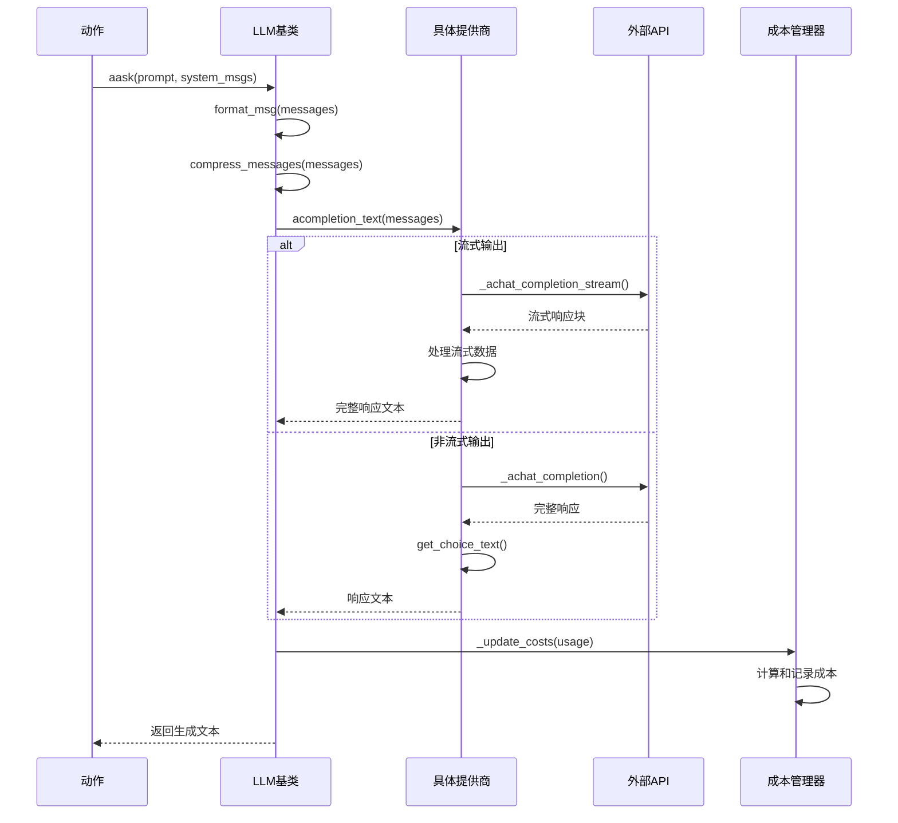
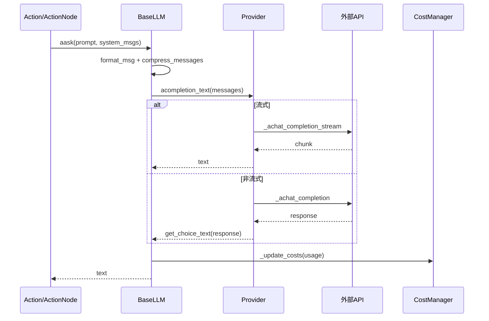

## 概述

MetaGPT的LLM提供商系统是整个框架与大语言模型交互的核心基础设施，它通过统一的抽象接口支持多种LLM提供商，包括OpenAI、Anthropic、Google Gemini、本地模型等。该系统设计了灵活的配置管理、智能的成本控制和完善的错误处理机制，为上层应用提供了稳定可靠的LLM服务。

<!--more-->

## 1. LLM提供商系统架构概览

### 1.1 核心组件架构

MetaGPT的LLM提供商系统采用分层架构，从抽象基类到具体实现：

```mermaid
classDiagram
    class BaseLLM {
        <<abstract>>
        +config: LLMConfig
        +use_system_prompt: bool
        +system_prompt: str
        +aclient: AsyncOpenAI
        +cost_manager: CostManager
        +model: str
        +pricing_plan: str
        +_reasoning_content: str
        +_user_msg(msg, images) dict
        +_assistant_msg(msg) dict
        +_system_msg(msg) dict
        +support_image_input() bool
        +format_msg(messages) list[dict]
        +aask(msg, system_msgs, **kwargs) str
        +acompletion(messages, **kwargs)*
        +_achat_completion(messages, **kwargs)*
        +_achat_completion_stream(messages, **kwargs)*
        +compress_messages(messages, **kwargs) list[dict]
        +count_tokens(messages) int
        +get_costs() Costs
    }
    
    class OpenAILLM {
        +_init_client()
        +_make_client_kwargs() dict
        +_get_proxy_params() dict
        +_achat_completion_stream(messages, **kwargs) str
        +_cons_kwargs(messages, **kwargs) dict
        +_get_max_tokens(messages) int
        +_calc_usage(messages, rsp) CompletionUsage
        +acompletion(messages, **kwargs) ChatCompletion
        +_achat_completion(messages, **kwargs) ChatCompletion
    }
    
    class AnthropicLLM {
        +_init_client()
        +_achat_completion(messages, **kwargs) dict
        +_achat_completion_stream(messages, **kwargs) str
        +_cons_kwargs(messages, **kwargs) dict
        +get_choice_text(rsp) str
    }
    
    class GeminiLLM {
        +_init_client()
        +_achat_completion(messages, **kwargs) dict
        +_format_msg(messages) list[dict]
        +get_choice_text(rsp) str
    }
    
    class BedrockLLM {
        +_init_client()
        +_achat_completion(messages, **kwargs) dict
        +_get_provider(model_id) BaseBedrockProvider
        +get_choice_text(rsp) str
    }
    
    class OllamaLLM {
        +_init_client()
        +_achat_completion(messages, **kwargs) dict
        +_achat_completion_stream(messages, **kwargs) str
        +get_choice_text(rsp) str
    }
    
    class LLMProviderRegistry {
        +providers: dict[LLMType, BaseLLM]
        +register(key, provider_cls)
        +get_provider(enum) BaseLLM
    }
    
    class LLMConfig {
        +api_key: str
        +api_type: LLMType
        +base_url: str
        +model: str
        +max_token: int
        +temperature: float
        +stream: bool
        +timeout: int
        +calc_usage: bool
        +compress_type: CompressType
        +use_system_prompt: bool
        +reasoning: bool
    }
    
    class LLMType {
        <<enumeration>>
        OPENAI
        ANTHROPIC
        GEMINI
        BEDROCK
        OLLAMA
        ZHIPUAI
        QIANFAN
        DASHSCOPE
        MOONSHOT
        MISTRAL
        DEEPSEEK
    }
    
    BaseLLM <|-- OpenAILLM
    BaseLLM <|-- AnthropicLLM
    BaseLLM <|-- GeminiLLM
    BaseLLM <|-- BedrockLLM
    BaseLLM <|-- OllamaLLM
    BaseLLM o-- LLMConfig
    LLMProviderRegistry o-- BaseLLM
    LLMConfig o-- LLMType
    
    %% 样式定义
    classDef abstract fill:#ffeb3b
    classDef concrete fill:#4caf50
    classDef config fill:#2196f3
    classDef registry fill:#ff9800
    
    class BaseLLM abstract
    class OpenAILLM,AnthropicLLM,GeminiLLM,BedrockLLM,OllamaLLM concrete
    class LLMConfig,LLMType config
    class LLMProviderRegistry registry
```

### 1.2 LLM交互流程



## 2. 基础LLM抽象 (BaseLLM)

### 2.1 BaseLLM核心设计

`BaseLLM`是所有LLM提供商的抽象基类，定义了统一的接口和通用功能：

```python
class BaseLLM(ABC):
    """LLM API抽象类，要求所有继承者提供一系列标准能力"""

    # 核心配置
    config: LLMConfig                           # LLM配置对象
    use_system_prompt: bool = True              # 是否使用系统提示
    system_prompt = "You are a helpful assistant."  # 默认系统提示

    # 客户端和管理器
    aclient: Optional[Union[AsyncOpenAI]] = None     # 异步客户端
    cost_manager: Optional[CostManager] = None       # 成本管理器
    
    # 模型信息
    model: Optional[str] = None                      # 模型名称
    pricing_plan: Optional[str] = None               # 定价计划
    
    # 推理内容（用于支持推理模式的模型）
    _reasoning_content: Optional[str] = None

    @property
    def reasoning_content(self):
        """获取推理内容"""
        return self._reasoning_content

    @reasoning_content.setter
    def reasoning_content(self, value: str):
        """设置推理内容"""
        self._reasoning_content = value

    @abstractmethod
    def __init__(self, config: LLMConfig):
        """初始化LLM实例"""
        pass

    def _user_msg(self, msg: str, images: Optional[Union[str, list[str]]] = None) -> dict:
        """构建用户消息"""
        if images and self.support_image_input():
            # 支持多模态输入（如GPT-4V）
            return self._user_msg_with_imgs(msg, images)
        else:
            return {"role": "user", "content": msg}

    def _user_msg_with_imgs(self, msg: str, images: Optional[Union[str, list[str]]]):
        """构建包含图像的用户消息"""
        if isinstance(images, str):
            images = [images]
        content = [{"type": "text", "text": msg}]
        for image in images:
            # 图像URL或base64编码
            url = image if image.startswith("http") else f"data:image/jpeg;base64,{image}"
            content.append({"type": "image_url", "image_url": {"url": url}})
        return {"role": "user", "content": content}

    def _assistant_msg(self, msg: str) -> dict[str, str]:
        """构建助手消息"""
        return {"role": "assistant", "content": msg}

    def _system_msg(self, msg: str) -> dict[str, str]:
        """构建系统消息"""
        return {"role": "system", "content": msg}

    def support_image_input(self) -> bool:
        """检查是否支持图像输入"""
        return any([m in self.model for m in MULTI_MODAL_MODELS])

    def format_msg(self, messages: Union[str, "Message", list[dict], list["Message"], list[str]]) -> list[dict]:
        """将消息转换为标准格式"""
        from metagpt.schema import Message

        if not isinstance(messages, list):
            messages = [messages]

        processed_messages = []
        for msg in messages:
            if isinstance(msg, str):
                processed_messages.append({"role": "user", "content": msg})
            elif isinstance(msg, dict):
                assert set(msg.keys()) == set(["role", "content"])
                processed_messages.append(msg)
            elif isinstance(msg, Message):
                images = msg.metadata.get(IMAGES)
                processed_msg = self._user_msg(msg=msg.content, images=images) if images else msg.to_dict()
                processed_messages.append(processed_msg)
            else:
                raise ValueError(f"不支持的消息类型: {type(messages).__name__}")
        return processed_messages
```

**设计要点**：
- **统一接口**：所有LLM提供商遵循相同的调用接口
- **多模态支持**：内置图像输入处理能力
- **消息格式化**：统一的消息格式转换机制
- **成本管理**：集成的成本跟踪和控制
- **配置驱动**：通过配置对象控制行为

### 2.2 核心交互方法

#### 2.2.1 异步询问接口

```python
async def aask(
    self,
    msg: Union[str, list[dict[str, str]]],
    system_msgs: Optional[list[str]] = None,
    format_msgs: Optional[list[dict[str, str]]] = None,
    images: Optional[Union[str, list[str]]] = None,
    timeout=USE_CONFIG_TIMEOUT,
    stream=None,
) -> str:
    """异步询问LLM"""
    
    # 构建消息列表
    if system_msgs:
        message = self._system_msgs(system_msgs)
    else:
        message = [self._default_system_msg()]
    
    # 如果不使用系统提示，清空消息
    if not self.use_system_prompt:
        message = []
    
    # 添加格式化消息
    if format_msgs:
        message.extend(format_msgs)
    
    # 添加用户消息
    if isinstance(msg, str):
        message.append(self._user_msg(msg, images=images))
    else:
        message.extend(msg)
    
    # 确定是否使用流式输出
    if stream is None:
        stream = self.config.stream

    # 记录日志（屏蔽base64图像数据）
    masked_message = [self.mask_base64_data(m) for m in message]
    logger.debug(masked_message)

    # 压缩消息以适应token限制
    compressed_message = self.compress_messages(message, compress_type=self.config.compress_type)
    
    # 调用具体实现
    rsp = await self.acompletion_text(compressed_message, stream=stream, timeout=self.get_timeout(timeout))
    return rsp
```

#### 2.2.2 批量询问接口

```python
async def aask_batch(self, msgs: list, timeout=USE_CONFIG_TIMEOUT) -> str:
    """顺序批量询问"""
    context = []
    for msg in msgs:
        umsg = self._user_msg(msg)
        context.append(umsg)
        rsp_text = await self.acompletion_text(context, timeout=self.get_timeout(timeout))
        context.append(self._assistant_msg(rsp_text))
    return self._extract_assistant_rsp(context)

def _extract_assistant_rsp(self, context):
    """提取助手响应"""
    return "\n".join([i["content"] for i in context if i["role"] == "assistant"])
```

### 2.3 消息压缩机制

BaseLLM提供了智能的消息压缩机制，以适应不同模型的token限制：

```python
def compress_messages(
    self,
    messages: list[dict],
    compress_type: CompressType = CompressType.NO_COMPRESS,
    max_token: int = 128000,
    threshold: float = 0.8,
) -> list[dict]:
    """压缩消息以适应token限制"""
    
    if compress_type == CompressType.NO_COMPRESS:
        return messages

    max_token = TOKEN_MAX.get(self.model, max_token)
    keep_token = int(max_token * threshold)
    compressed = []

    # 始终保留系统消息
    system_msg_val = self._system_msg("")["role"]
    system_msgs = []
    for i, msg in enumerate(messages):
        if msg["role"] == system_msg_val:
            system_msgs.append(msg)
        else:
            user_assistant_msgs = messages[i:]
            break
    
    compressed.extend(system_msgs)
    current_token_count = self.count_tokens(system_msgs)

    if compress_type in [CompressType.POST_CUT_BY_TOKEN, CompressType.POST_CUT_BY_MSG]:
        # 在token约束下，保留尽可能多的最新消息
        for i, msg in enumerate(reversed(user_assistant_msgs)):
            token_count = self.count_tokens([msg])
            if current_token_count + token_count <= keep_token:
                compressed.insert(len(system_msgs), msg)
                current_token_count += token_count
            else:
                if compress_type == CompressType.POST_CUT_BY_TOKEN or len(compressed) == len(system_msgs):
                    # 截断消息以适应剩余token数量
                    truncated_content = msg["content"][-(keep_token - current_token_count):]
                    compressed.insert(len(system_msgs), {"role": msg["role"], "content": truncated_content})
                logger.warning(f"使用{compress_type}截断消息以适应token限制")
                break

    elif compress_type in [CompressType.PRE_CUT_BY_TOKEN, CompressType.PRE_CUT_BY_MSG]:
        # 在token约束下，保留尽可能多的最早消息
        for i, msg in enumerate(user_assistant_msgs):
            token_count = self.count_tokens([msg])
            if current_token_count + token_count <= keep_token:
                compressed.append(msg)
                current_token_count += token_count
            else:
                if compress_type == CompressType.PRE_CUT_BY_TOKEN or len(compressed) == len(system_msgs):
                    # 截断消息以适应剩余token数量
                    truncated_content = msg["content"][:keep_token - current_token_count]
                    compressed.append({"role": msg["role"], "content": truncated_content})
                logger.warning(f"使用{compress_type}截断消息以适应token限制")
                break

    return compressed
```

**压缩策略**：
- **NO_COMPRESS**：不压缩，保留所有消息
- **POST_CUT_BY_TOKEN**：保留最新消息，按token截断
- **POST_CUT_BY_MSG**：保留最新消息，按消息截断
- **PRE_CUT_BY_TOKEN**：保留最早消息，按token截断
- **PRE_CUT_BY_MSG**：保留最早消息，按消息截断

### 2.4 成本管理机制

```python
def _update_costs(self, usage: Union[dict, BaseModel], model: str = None, local_calc_usage: bool = True):
    """更新每次请求的token成本"""
    calc_usage = self.config.calc_usage and local_calc_usage
    model = model or self.pricing_plan or self.model
    usage = usage.model_dump() if isinstance(usage, BaseModel) else usage
    
    if calc_usage and self.cost_manager and usage:
        try:
            prompt_tokens = int(usage.get("prompt_tokens", 0))
            completion_tokens = int(usage.get("completion_tokens", 0))
            self.cost_manager.update_cost(prompt_tokens, completion_tokens, model)
        except Exception as e:
            logger.error(f"{self.__class__.__name__} 更新成本失败: {e}")

def get_costs(self) -> Costs:
    """获取累计成本"""
    if not self.cost_manager:
        return Costs(0, 0, 0, 0)
    return self.cost_manager.get_costs()
```

## 3. LLM配置系统

### 3.1 LLMConfig配置类

`LLMConfig`提供了完整的LLM配置管理：

```python
class LLMConfig(YamlModel):
    """LLM配置类"""

    # API基础配置
    api_key: str = "sk-"                        # API密钥
    api_type: LLMType = LLMType.OPENAI         # API类型
    base_url: str = "https://api.openai.com/v1"  # 基础URL
    api_version: Optional[str] = None           # API版本

    # 模型配置
    model: Optional[str] = None                 # 模型名称
    pricing_plan: Optional[str] = None          # 定价计划

    # 云服务提供商配置（如百度、阿里云）
    access_key: Optional[str] = None            # 访问密钥
    secret_key: Optional[str] = None            # 秘密密钥
    session_token: Optional[str] = None         # 会话令牌
    endpoint: Optional[str] = None              # 自部署模型端点

    # 讯飞星火专用配置
    app_id: Optional[str] = None                # 应用ID
    api_secret: Optional[str] = None            # API秘密
    domain: Optional[str] = None                # 域名

    # 聊天完成配置
    max_token: int = 4096                       # 最大token数
    temperature: float = 0.0                    # 温度参数
    top_p: float = 1.0                          # Top-p采样
    top_k: int = 0                              # Top-k采样
    repetition_penalty: float = 1.0             # 重复惩罚
    stop: Optional[str] = None                  # 停止词
    presence_penalty: float = 0.0               # 存在惩罚
    frequency_penalty: float = 0.0              # 频率惩罚
    best_of: Optional[int] = None               # 最佳选择数
    n: Optional[int] = None                     # 生成数量
    stream: bool = True                         # 是否流式输出
    seed: Optional[int] = None                  # 随机种子
    logprobs: Optional[bool] = None             # 是否返回概率
    top_logprobs: Optional[int] = None          # 顶部概率数
    timeout: int = 600                          # 超时时间
    context_length: Optional[int] = None        # 最大输入token

    # Amazon Bedrock配置
    region_name: str = None                     # 区域名称

    # 网络配置
    proxy: Optional[str] = None                 # 代理设置

    # 成本控制
    calc_usage: bool = True                     # 是否计算使用量

    # 消息压缩
    compress_type: CompressType = CompressType.NO_COMPRESS  # 压缩类型

    # 消息控制
    use_system_prompt: bool = True              # 是否使用系统提示

    # 推理模式
    reasoning: bool = False                     # 推理开关
    reasoning_max_token: int = 4000             # 推理预算token

    @field_validator("api_key")
    @classmethod
    def check_llm_key(cls, v):
        """验证API密钥"""
        if v in ("", "sk-", "YOUR_API_KEY", None):
            repo_config_path = METAGPT_ROOT / "config/config2.yaml"
            root_config_path = CONFIG_ROOT / "config2.yaml"
            if root_config_path.exists():
                raise ValueError(f"请在{root_config_path}中设置您的API密钥")
            elif repo_config_path.exists():
                raise ValueError(f"请在{repo_config_path}中设置您的API密钥")
            else:
                raise ValueError("请在config2.yaml中设置您的API密钥")
        return v

    @field_validator("timeout")
    @classmethod
    def check_timeout(cls, v):
        """验证超时设置"""
        return v or LLM_API_TIMEOUT
```

### 3.2 LLMType枚举

`LLMType`定义了支持的所有LLM提供商类型：

```python
class LLMType(Enum):
    """LLM提供商类型枚举"""
    
    # 主流商业模型
    OPENAI = "openai"                           # OpenAI GPT系列
    ANTHROPIC = "anthropic"                     # Anthropic Claude系列
    CLAUDE = "claude"                           # Claude别名
    GEMINI = "gemini"                          # Google Gemini
    
    # 云服务提供商
    AZURE = "azure"                            # Azure OpenAI
    BEDROCK = "bedrock"                        # Amazon Bedrock
    QIANFAN = "qianfan"                        # 百度千帆
    DASHSCOPE = "dashscope"                    # 阿里云灵积
    ARK = "ark"                                # 火山引擎
    
    # 国产模型
    ZHIPUAI = "zhipuai"                        # 智谱AI
    SPARK = "spark"                            # 讯飞星火
    MOONSHOT = "moonshot"                      # 月之暗面
    YI = "yi"                                  # 零一万物
    DEEPSEEK = "deepseek"                      # DeepSeek
    
    # 开源和自部署
    OLLAMA = "ollama"                          # Ollama本地部署
    OLLAMA_GENERATE = "ollama.generate"        # Ollama生成接口
    OLLAMA_EMBEDDINGS = "ollama.embeddings"    # Ollama嵌入接口
    OLLAMA_EMBED = "ollama.embed"              # Ollama嵌入接口
    OPEN_LLM = "open_llm"                      # 开源LLM
    
    # 第三方服务
    FIREWORKS = "fireworks"                    # Fireworks AI
    MISTRAL = "mistral"                        # Mistral AI
    OPEN_ROUTER = "open_router"                # OpenRouter
    OPENROUTER = "openrouter"                  # OpenRouter
    OPENROUTER_REASONING = "openrouter_reasoning"  # OpenRouter推理模式
    SILICONFLOW = "siliconflow"                # 硅基流动
    LLAMA_API = "llama_api"                    # Llama API
    
    # MetaGPT专用
    METAGPT = "metagpt"                        # MetaGPT API

    def __missing__(self, key):
        """默认返回OpenAI"""
        return self.OPENAI
```

### 3.3 多模型配置管理

`ModelsConfig`类提供了多模型的统一配置管理：

```python
class ModelsConfig(YamlModel):
    """多模型配置管理类"""

    models: Dict[str, LLMConfig] = Field(default_factory=dict)

    @field_validator("models", mode="before")
    @classmethod
    def update_llm_model(cls, value):
        """验证和更新LLM模型配置"""
        for key, config in value.items():
            if isinstance(config, LLMConfig):
                config.model = config.model or key
            elif isinstance(config, dict):
                config["model"] = config.get("model") or key
        return value

    @classmethod
    def from_home(cls, path):
        """从~/.metagpt/config2.yaml加载配置"""
        pathname = CONFIG_ROOT / path
        if not pathname.exists():
            return None
        return ModelsConfig.from_yaml_file(pathname)

    @classmethod
    def default(cls):
        """加载默认配置"""
        default_config_paths: List[Path] = [
            METAGPT_ROOT / "config/config2.yaml",
            CONFIG_ROOT / "config2.yaml",
        ]

        dicts = [ModelsConfig.read_yaml(path) for path in default_config_paths]
        final = merge_dict(dicts)
        return ModelsConfig(**final)

    def get(self, name_or_type: str) -> Optional[LLMConfig]:
        """根据名称或API类型获取LLMConfig"""
        if not name_or_type:
            return None
        
        # 首先按名称查找
        model = self.models.get(name_or_type)
        if model:
            return model
        
        # 然后按API类型查找
        for m in self.models.values():
            if m.api_type == name_or_type:
                return m
        return None
```

## 4. 提供商注册系统

### 4.1 LLMProviderRegistry注册表

```python
class LLMProviderRegistry:
    """LLM提供商注册表"""
    
    def __init__(self):
        self.providers = {}

    def register(self, key, provider_cls):
        """注册提供商"""
        self.providers[key] = provider_cls

    def get_provider(self, enum: LLMType):
        """根据枚举获取提供商实例"""
        return self.providers[enum]

def register_provider(keys):
    """提供商注册装饰器"""
    def decorator(cls):
        if isinstance(keys, list):
            for key in keys:
                LLM_REGISTRY.register(key, cls)
        else:
            LLM_REGISTRY.register(keys, cls)
        return cls
    return decorator

def create_llm_instance(config: LLMConfig) -> BaseLLM:
    """创建LLM实例"""
    llm = LLM_REGISTRY.get_provider(config.api_type)(config)
    if llm.use_system_prompt and not config.use_system_prompt:
        # 对于o1系列等模型，需要特殊处理系统提示
        llm.use_system_prompt = config.use_system_prompt
    return llm

# 全局注册表实例
LLM_REGISTRY = LLMProviderRegistry()
```

### 4.2 提供商注册示例

```python
@register_provider([
    LLMType.OPENAI,
    LLMType.FIREWORKS,
    LLMType.OPEN_LLM,
    LLMType.MOONSHOT,
    LLMType.MISTRAL,
    LLMType.YI,
    LLMType.OPEN_ROUTER,
    LLMType.DEEPSEEK,
    LLMType.SILICONFLOW,
    LLMType.OPENROUTER,
    LLMType.LLAMA_API,
])
class OpenAILLM(BaseLLM):
    """OpenAI兼容的LLM提供商"""
    pass

@register_provider(LLMType.ANTHROPIC)
class AnthropicLLM(BaseLLM):
    """Anthropic Claude提供商"""
    pass

@register_provider(LLMType.GEMINI)
class GeminiLLM(BaseLLM):
    """Google Gemini提供商"""
    pass
```

## 5. 具体提供商实现

### 5.1 OpenAILLM实现

`OpenAILLM`是最重要的提供商实现，支持OpenAI及其兼容的多种服务：

```python
@register_provider([
    LLMType.OPENAI, LLMType.FIREWORKS, LLMType.OPEN_LLM,
    LLMType.MOONSHOT, LLMType.MISTRAL, LLMType.YI,
    LLMType.OPEN_ROUTER, LLMType.DEEPSEEK, LLMType.SILICONFLOW,
    LLMType.OPENROUTER, LLMType.LLAMA_API,
])
class OpenAILLM(BaseLLM):
    """OpenAI兼容的LLM提供商"""

    def __init__(self, config: LLMConfig):
        self.config = config
        self._init_client()
        self.auto_max_tokens = False
        self.cost_manager: Optional[CostManager] = None

    def _init_client(self):
        """初始化OpenAI客户端"""
        self.model = self.config.model
        self.pricing_plan = self.config.pricing_plan or self.model
        kwargs = self._make_client_kwargs()
        self.aclient = AsyncOpenAI(**kwargs)

    def _make_client_kwargs(self) -> dict:
        """构建客户端参数"""
        kwargs = {
            "api_key": self.config.api_key, 
            "base_url": self.config.base_url
        }

        # 代理支持
        if proxy_params := self._get_proxy_params():
            kwargs["http_client"] = AsyncHttpxClientWrapper(**proxy_params)

        return kwargs

    def _get_proxy_params(self) -> dict:
        """获取代理参数"""
        params = {}
        if self.config.proxy:
            params = {"proxy": self.config.proxy}
            if self.config.base_url:
                params["base_url"] = self.config.base_url
        return params

    async def _achat_completion_stream(self, messages: list[dict], timeout=USE_CONFIG_TIMEOUT) -> str:
        """流式聊天完成"""
        response: AsyncStream[ChatCompletionChunk] = await self.aclient.chat.completions.create(
            **self._cons_kwargs(messages, timeout=self.get_timeout(timeout)), 
            stream=True
        )
        
        usage = None
        collected_messages = []
        collected_reasoning_messages = []
        has_finished = False
        
        async for chunk in response:
            if not chunk.choices:
                continue

            choice0 = chunk.choices[0]
            choice_delta = choice0.delta
            
            # 处理推理内容（如DeepSeek）
            if hasattr(choice_delta, "reasoning_content") and choice_delta.reasoning_content:
                collected_reasoning_messages.append(choice_delta.reasoning_content)
                continue
            
            # 提取消息内容
            chunk_message = choice_delta.content or ""
            finish_reason = choice0.finish_reason if hasattr(choice0, "finish_reason") else None
            log_llm_stream(chunk_message)
            collected_messages.append(chunk_message)
            
            # 处理使用量信息
            chunk_has_usage = hasattr(chunk, "usage") and chunk.usage
            if has_finished:
                if chunk_has_usage:
                    usage = CompletionUsage(**chunk.usage) if isinstance(chunk.usage, dict) else chunk.usage
            
            if finish_reason:
                if chunk_has_usage:
                    usage = CompletionUsage(**chunk.usage) if isinstance(chunk.usage, dict) else chunk.usage
                elif hasattr(choice0, "usage"):
                    usage = CompletionUsage(**choice0.usage)
                has_finished = True

        log_llm_stream("\n")
        full_reply_content = "".join(collected_messages)
        
        # 保存推理内容
        if collected_reasoning_messages:
            self.reasoning_content = "".join(collected_reasoning_messages)
        
        # 计算使用量（如果服务未提供）
        if not usage:
            usage = self._calc_usage(messages, full_reply_content)

        self._update_costs(usage)
        return full_reply_content

    def _cons_kwargs(self, messages: list[dict], timeout=USE_CONFIG_TIMEOUT, **extra_kwargs) -> dict:
        """构建请求参数"""
        kwargs = {
            "messages": messages,
            "max_tokens": self._get_max_tokens(messages),
            "temperature": self.config.temperature,
            "model": self.model,
            "timeout": self.get_timeout(timeout),
        }
        
        # o1系列模型特殊处理
        if "o1-" in self.model:
            kwargs["temperature"] = 1
            kwargs.pop("max_tokens", None)  # o1不支持max_tokens
        
        # 推理模式支持
        if self.config.reasoning and "reasoning" in extra_kwargs:
            kwargs["reasoning"] = extra_kwargs["reasoning"]
            kwargs["max_completion_tokens"] = self.config.reasoning_max_token

        kwargs.update(extra_kwargs)
        return kwargs

    def _get_max_tokens(self, messages: list[dict]) -> int:
        """获取最大token数"""
        if self.auto_max_tokens:
            return get_max_completion_tokens(messages, self.model, self.config.max_token)
        return self.config.max_token

    def _calc_usage(self, messages: list[dict], rsp: str) -> CompletionUsage:
        """计算token使用量"""
        prompt_tokens = count_message_tokens(messages, self.model)
        completion_tokens = count_output_tokens(rsp, self.model)
        return CompletionUsage(
            prompt_tokens=prompt_tokens,
            completion_tokens=completion_tokens,
            total_tokens=prompt_tokens + completion_tokens
        )

    @retry(
        stop=stop_after_attempt(3),
        wait=wait_random_exponential(min=1, max=60),
        after=after_log(logger, logger.level("WARNING").name),
        retry=retry_if_exception_type((APIConnectionError, ConnectionError)),
        retry_error_callback=log_and_reraise,
    )
    async def acompletion(self, messages: list[dict], timeout=USE_CONFIG_TIMEOUT) -> ChatCompletion:
        """异步聊天完成"""
        return await self._achat_completion(messages, timeout)

    async def _achat_completion(self, messages: list[dict], timeout=USE_CONFIG_TIMEOUT) -> ChatCompletion:
        """内部聊天完成实现"""
        rsp: ChatCompletion = await self.aclient.chat.completions.create(
            **self._cons_kwargs(messages, timeout=self.get_timeout(timeout))
        )
        self._update_costs(rsp.usage)
        return rsp
```

**OpenAILLM特点**：
- **广泛兼容性**：支持多种OpenAI兼容的服务
- **流式支持**：完整的流式输出处理
- **推理模式**：支持推理模式的模型（如DeepSeek）
- **成本计算**：精确的token使用量计算
- **错误重试**：内置的重试机制

### 5.2 AnthropicLLM实现

```python
@register_provider(LLMType.ANTHROPIC)
class AnthropicLLM(BaseLLM):
    """Anthropic Claude提供商"""

    def __init__(self, config: LLMConfig):
        self.config = config
        self._init_client()
        self.cost_manager: Optional[CostManager] = None

    def _init_client(self):
        """初始化Anthropic客户端"""
        import anthropic
        self.model = self.config.model
        self.pricing_plan = self.config.pricing_plan or self.model
        self.aclient = anthropic.AsyncAnthropic(
            api_key=self.config.api_key,
            base_url=self.config.base_url,
            timeout=self.config.timeout,
        )

    async def _achat_completion(self, messages: list[dict], timeout=USE_CONFIG_TIMEOUT) -> dict:
        """Anthropic聊天完成"""
        # 分离系统消息和对话消息
        system_messages = [msg for msg in messages if msg["role"] == "system"]
        conversation_messages = [msg for msg in messages if msg["role"] != "system"]
        
        system_prompt = "\n".join([msg["content"] for msg in system_messages])
        
        kwargs = self._cons_kwargs(conversation_messages, timeout)
        if system_prompt:
            kwargs["system"] = system_prompt

        rsp = await self.aclient.messages.create(**kwargs)
        self._update_costs(rsp.usage)
        return self._format_response(rsp)

    async def _achat_completion_stream(self, messages: list[dict], timeout=USE_CONFIG_TIMEOUT) -> str:
        """Anthropic流式聊天完成"""
        # 类似的系统消息处理
        system_messages = [msg for msg in messages if msg["role"] == "system"]
        conversation_messages = [msg for msg in messages if msg["role"] != "system"]
        
        system_prompt = "\n".join([msg["content"] for msg in system_messages])
        
        kwargs = self._cons_kwargs(conversation_messages, timeout)
        kwargs["stream"] = True
        if system_prompt:
            kwargs["system"] = system_prompt

        collected_messages = []
        usage = None
        
        async with self.aclient.messages.stream(**kwargs) as stream:
            async for chunk in stream:
                if chunk.type == "content_block_delta":
                    chunk_message = chunk.delta.text
                    log_llm_stream(chunk_message)
                    collected_messages.append(chunk_message)
                elif chunk.type == "message_stop":
                    usage = chunk.usage

        log_llm_stream("\n")
        full_reply_content = "".join(collected_messages)
        
        if usage:
            self._update_costs(usage)
        
        return full_reply_content

    def _cons_kwargs(self, messages: list[dict], timeout=USE_CONFIG_TIMEOUT) -> dict:
        """构建Anthropic请求参数"""
        return {
            "model": self.model,
            "messages": messages,
            "max_tokens": self.config.max_token,
            "temperature": self.config.temperature,
            "timeout": self.get_timeout(timeout),
        }

    def get_choice_text(self, rsp: dict) -> str:
        """获取响应文本"""
        return rsp["content"][0]["text"]

    def _format_response(self, rsp) -> dict:
        """格式化响应为标准格式"""
        return {
            "choices": [{
                "message": {
                    "content": rsp.content[0].text,
                    "role": "assistant"
                }
            }],
            "usage": rsp.usage
        }
```

### 5.3 GeminiLLM实现

```python
@register_provider(LLMType.GEMINI)
class GeminiLLM(BaseLLM):
    """Google Gemini提供商"""

    def __init__(self, config: LLMConfig):
        self.config = config
        self._init_client()
        self.cost_manager: Optional[CostManager] = None

    def _init_client(self):
        """初始化Gemini客户端"""
        import google.generativeai as genai
        
        genai.configure(api_key=self.config.api_key)
        self.model = self.config.model
        self.pricing_plan = self.config.pricing_plan or self.model
        
        # 配置生成参数
        self.generation_config = genai.types.GenerationConfig(
            temperature=self.config.temperature,
            max_output_tokens=self.config.max_token,
            top_p=self.config.top_p,
            top_k=self.config.top_k if self.config.top_k > 0 else None,
        )
        
        self.aclient = genai.GenerativeModel(
            model_name=self.model,
            generation_config=self.generation_config
        )

    async def _achat_completion(self, messages: list[dict], timeout=USE_CONFIG_TIMEOUT) -> dict:
        """Gemini聊天完成"""
        # 转换消息格式
        gemini_messages = self._format_msg(messages)
        
        # 分离系统消息
        system_instruction = None
        conversation_messages = []
        
        for msg in gemini_messages:
            if msg["role"] == "system":
                system_instruction = msg["parts"][0]["text"]
            else:
                conversation_messages.append(msg)
        
        # 创建聊天会话
        if system_instruction:
            chat = self.aclient.start_chat(
                history=conversation_messages[:-1],
                system_instruction=system_instruction
            )
        else:
            chat = self.aclient.start_chat(history=conversation_messages[:-1])
        
        # 发送最后一条消息
        last_message = conversation_messages[-1]["parts"][0]["text"]
        response = await chat.send_message_async(last_message)
        
        # 计算使用量
        usage = self._calc_usage_from_response(response)
        self._update_costs(usage)
        
        return self._format_response(response)

    def _format_msg(self, messages: list[dict]) -> list[dict]:
        """将标准消息格式转换为Gemini格式"""
        gemini_messages = []
        for msg in messages:
            role = msg["role"]
            content = msg["content"]
            
            if role == "system":
                gemini_messages.append({
                    "role": "system",
                    "parts": [{"text": content}]
                })
            elif role == "user":
                gemini_messages.append({
                    "role": "user",
                    "parts": [{"text": content}]
                })
            elif role == "assistant":
                gemini_messages.append({
                    "role": "model",
                    "parts": [{"text": content}]
                })
        
        return gemini_messages

    def get_choice_text(self, rsp: dict) -> str:
        """获取响应文本"""
        return rsp["candidates"][0]["content"]["parts"][0]["text"]

    def _format_response(self, response) -> dict:
        """格式化响应为标准格式"""
        return {
            "candidates": [{
                "content": {
                    "parts": [{"text": response.text}]
                }
            }],
            "usage": response.usage_metadata
        }
```

## 6. 多模态支持

### 6.1 图像输入处理

MetaGPT的LLM系统内置了多模态支持，特别是图像输入：

```python
def _user_msg_with_imgs(self, msg: str, images: Optional[Union[str, list[str]]]):
    """构建包含图像的用户消息"""
    if isinstance(images, str):
        images = [images]
    
    content = [{"type": "text", "text": msg}]
    for image in images:
        # 支持HTTP URL和base64编码
        url = image if image.startswith("http") else f"data:image/jpeg;base64,{image}"
        content.append({
            "type": "image_url", 
            "image_url": {"url": url}
        })
    return {"role": "user", "content": content}

def support_image_input(self) -> bool:
    """检查模型是否支持图像输入"""
    return any([m in self.model for m in MULTI_MODAL_MODELS])

def mask_base64_data(self, msg: dict) -> dict:
    """屏蔽base64图像数据以便日志记录"""
    if not isinstance(msg, dict):
        return msg

    new_msg = msg.copy()
    content = new_msg.get("content")
    img_base64_prefix = "data:image/"

    if isinstance(content, list):
        # 处理多模态内容（如GPT-4V格式）
        new_content = []
        for item in content:
            if isinstance(item, dict) and item.get("type") == "image_url":
                image_url = item.get("image_url", {}).get("url", "")
                if image_url.startswith(img_base64_prefix):
                    item = item.copy()
                    item["image_url"] = {"url": "<图像base64数据已省略>"}
            new_content.append(item)
        new_msg["content"] = new_content
    elif isinstance(content, str) and img_base64_prefix in content:
        # 处理包含base64图像数据的纯文本消息
        new_msg["content"] = "<包含图像base64数据的消息已省略>"
    
    return new_msg
```

### 6.2 支持的多模态模型

```python
# 在metagpt/provider/constant.py中定义
MULTI_MODAL_MODELS = [
    "gpt-4-vision-preview",
    "gpt-4v",
    "gpt-4-turbo",
    "gpt-4o",
    "gpt-4o-mini",
    "claude-3-opus",
    "claude-3-sonnet",
    "claude-3-haiku",
    "claude-3-5-sonnet",
    "gemini-pro-vision",
    "gemini-1.5-pro",
    "gemini-1.5-flash",
]
```

## 7. 错误处理和重试机制

### 7.1 重试装饰器

MetaGPT使用tenacity库实现智能重试：

```python
@retry(
    stop=stop_after_attempt(3),                    # 最多重试3次
    wait=wait_random_exponential(min=1, max=60),   # 指数退避，1-60秒随机等待
    after=after_log(logger, logger.level("WARNING").name),  # 重试后记录日志
    retry=retry_if_exception_type((APIConnectionError, ConnectionError)),  # 只重试连接错误
    retry_error_callback=log_and_reraise,          # 重试失败后的回调
)
async def acompletion_text(
    self, messages: list[dict], stream: bool = False, timeout: int = USE_CONFIG_TIMEOUT
) -> str:
    """带重试的异步完成"""
    if stream:
        return await self._achat_completion_stream(messages, timeout=self.get_timeout(timeout))
    resp = await self._achat_completion(messages, timeout=self.get_timeout(timeout))
    return self.get_choice_text(resp)
```

### 7.2 异常处理策略

```python
async def _achat_completion_stream(self, messages: list[dict], timeout=USE_CONFIG_TIMEOUT) -> str:
    """流式完成的异常处理"""
    try:
        response = await self.aclient.chat.completions.create(
            **self._cons_kwargs(messages, timeout=self.get_timeout(timeout)), 
            stream=True
        )
        
        collected_messages = []
        async for chunk in response:
            try:
                # 处理每个流式块
                chunk_message = self._process_chunk(chunk)
                collected_messages.append(chunk_message)
            except Exception as e:
                logger.warning(f"处理流式块时出错: {e}")
                continue  # 跳过有问题的块，继续处理
        
        return "".join(collected_messages)
        
    except APIConnectionError as e:
        logger.error(f"API连接错误: {e}")
        raise
    except Exception as e:
        logger.error(f"流式完成时发生未知错误: {e}")
        raise
```

## 8. 性能优化策略

### 8.1 连接池管理

```python
def _make_client_kwargs(self) -> dict:
    """优化的客户端配置"""
    kwargs = {
        "api_key": self.config.api_key, 
        "base_url": self.config.base_url,
        "timeout": httpx.Timeout(self.config.timeout),
        "limits": httpx.Limits(
            max_keepalive_connections=20,  # 保持连接池
            max_connections=100,           # 最大连接数
            keepalive_expiry=30.0         # 连接保持时间
        )
    }

    # 代理支持
    if proxy_params := self._get_proxy_params():
        kwargs["http_client"] = AsyncHttpxClientWrapper(**proxy_params)

    return kwargs
```

### 8.2 Token计算优化

```python
def count_tokens(self, messages: list[dict]) -> int:
    """优化的token计算"""
    # 使用缓存避免重复计算
    cache_key = hash(str(messages))
    if hasattr(self, '_token_cache') and cache_key in self._token_cache:
        return self._token_cache[cache_key]
    
    # 针对不同模型使用不同的计算方法
    if self.model.startswith("gpt-"):
        token_count = count_message_tokens(messages, self.model)
    elif self.model.startswith("claude-"):
        token_count = self._count_claude_tokens(messages)
    else:
        # 通用启发式方法
        token_count = sum([int(len(msg["content"]) * 0.5) for msg in messages])
    
    # 缓存结果
    if not hasattr(self, '_token_cache'):
        self._token_cache = {}
    self._token_cache[cache_key] = token_count
    
    return token_count
```

### 8.3 批量处理优化

```python
async def aask_batch_parallel(self, msgs: list, max_concurrency: int = 5) -> list[str]:
    """并行批量询问"""
    semaphore = asyncio.Semaphore(max_concurrency)
    
    async def process_single_msg(msg):
        async with semaphore:
            return await self.aask(msg)
    
    tasks = [process_single_msg(msg) for msg in msgs]
    results = await asyncio.gather(*tasks, return_exceptions=True)
    
    # 处理异常结果
    processed_results = []
    for i, result in enumerate(results):
        if isinstance(result, Exception):
            logger.error(f"批量处理第{i}条消息时出错: {result}")
            processed_results.append(f"错误: {str(result)}")
        else:
            processed_results.append(result)
    
    return processed_results
```

## 9. 成本控制和监控

### 9.1 成本管理器集成

```python
class CostManager:
    """成本管理器"""
    
    def __init__(self, max_budget: float = 0.0):
        self.max_budget = max_budget
        self.total_cost = 0.0
        self.prompt_tokens = 0
        self.completion_tokens = 0
        self.requests_count = 0

    def update_cost(self, prompt_tokens: int, completion_tokens: int, model: str):
        """更新成本"""
        # 根据模型获取定价
        pricing = self._get_model_pricing(model)
        
        prompt_cost = prompt_tokens * pricing["prompt_price"]
        completion_cost = completion_tokens * pricing["completion_price"]
        request_cost = prompt_cost + completion_cost
        
        self.total_cost += request_cost
        self.prompt_tokens += prompt_tokens
        self.completion_tokens += completion_tokens
        self.requests_count += 1
        
        # 检查预算限制
        if self.max_budget > 0 and self.total_cost >= self.max_budget:
            raise NoMoneyException(
                self.total_cost, 
                f"超出预算限制: ${self.max_budget:.2f}"
            )
        
        logger.info(f"请求成本: ${request_cost:.4f}, 累计成本: ${self.total_cost:.4f}")

    def _get_model_pricing(self, model: str) -> dict:
        """获取模型定价"""
        # 定价表（每1K tokens的价格）
        pricing_table = {
            "gpt-4": {"prompt_price": 0.03/1000, "completion_price": 0.06/1000},
            "gpt-4-turbo": {"prompt_price": 0.01/1000, "completion_price": 0.03/1000},
            "gpt-3.5-turbo": {"prompt_price": 0.001/1000, "completion_price": 0.002/1000},
            "claude-3-opus": {"prompt_price": 0.015/1000, "completion_price": 0.075/1000},
            "claude-3-sonnet": {"prompt_price": 0.003/1000, "completion_price": 0.015/1000},
            "gemini-pro": {"prompt_price": 0.0005/1000, "completion_price": 0.0015/1000},
        }
        
        # 模糊匹配模型名称
        for model_key, pricing in pricing_table.items():
            if model_key in model.lower():
                return pricing
        
        # 默认定价
        return {"prompt_price": 0.001/1000, "completion_price": 0.002/1000}

    def get_costs(self) -> Costs:
        """获取成本统计"""
        return Costs(
            total_cost=self.total_cost,
            prompt_tokens=self.prompt_tokens,
            completion_tokens=self.completion_tokens,
            requests_count=self.requests_count
        )
```

### 9.2 成本监控和报告

```python
class CostReporter:
    """成本报告器"""
    
    def __init__(self, cost_manager: CostManager):
        self.cost_manager = cost_manager
        self.start_time = time.time()

    def generate_report(self) -> dict:
        """生成成本报告"""
        costs = self.cost_manager.get_costs()
        elapsed_time = time.time() - self.start_time
        
        return {
            "total_cost": f"${costs.total_cost:.4f}",
            "prompt_tokens": costs.prompt_tokens,
            "completion_tokens": costs.completion_tokens,
            "total_tokens": costs.prompt_tokens + costs.completion_tokens,
            "requests_count": costs.requests_count,
            "elapsed_time": f"{elapsed_time:.2f}s",
            "cost_per_request": f"${costs.total_cost/max(1, costs.requests_count):.4f}",
            "tokens_per_second": f"{(costs.prompt_tokens + costs.completion_tokens)/max(1, elapsed_time):.1f}",
        }

    def print_report(self):
        """打印成本报告"""
        report = self.generate_report()
        print("\n=== LLM成本报告 ===")
        for key, value in report.items():
            print(f"{key}: {value}")
        print("==================\n")
```

## 10. 配置文件示例

### 10.1 基础配置示例

```yaml
# config2.yaml
llm:
  api_type: "openai"
  model: "gpt-4-turbo"
  api_key: "sk-your-api-key"
  base_url: "https://api.openai.com/v1"
  temperature: 0.0
  max_token: 4096
  stream: true
  timeout: 600
  calc_usage: true
  compress_type: "NO_COMPRESS"
  use_system_prompt: true

# 多模型配置
models:
  gpt4:
    api_type: "openai"
    model: "gpt-4-turbo"
    api_key: "sk-your-openai-key"
    base_url: "https://api.openai.com/v1"
    
  claude:
    api_type: "anthropic"
    model: "claude-3-5-sonnet-20241022"
    api_key: "sk-ant-your-anthropic-key"
    base_url: "https://api.anthropic.com"
    
  gemini:
    api_type: "gemini"
    model: "gemini-1.5-pro"
    api_key: "your-google-api-key"
    
  local_llama:
    api_type: "ollama"
    model: "llama3:8b"
    base_url: "http://localhost:11434"
    api_key: "not-needed"
```

### 10.2 高级配置示例

```yaml
# 生产环境配置
llm:
  api_type: "openai"
  model: "gpt-4-turbo"
  api_key: "sk-your-api-key"
  base_url: "https://api.openai.com/v1"
  temperature: 0.1
  max_token: 8192
  stream: true
  timeout: 300
  calc_usage: true
  compress_type: "POST_CUT_BY_TOKEN"
  use_system_prompt: true
  proxy: "http://proxy.company.com:8080"
  
  # 推理模式配置
  reasoning: false
  reasoning_max_token: 4000

# 成本控制配置
cost_control:
  max_budget: 100.0  # 最大预算$100
  alert_threshold: 0.8  # 80%时发出警告
  
# 压缩配置
compress:
  type: "POST_CUT_BY_TOKEN"
  threshold: 0.8
  max_token: 128000
```

## 11. 使用示例

### 11.1 基础使用

```python
from metagpt.configs.llm_config import LLMConfig, LLMType
from metagpt.provider.llm_provider_registry import create_llm_instance

# 创建配置
config = LLMConfig(
    api_type=LLMType.OPENAI,
    model="gpt-4-turbo",
    api_key="sk-your-api-key",
    temperature=0.0,
    max_token=4096
)

# 创建LLM实例
llm = create_llm_instance(config)

# 基础询问
response = await llm.aask("Hello, how are you?")
print(response)

# 带系统提示的询问
response = await llm.aask(
    "Explain quantum computing",
    system_msgs=["You are a physics professor"]
)
print(response)
```

### 11.2 多模态使用

```python
# 图像输入示例
image_url = "https://example.com/image.jpg"
response = await llm.aask(
    "What do you see in this image?",
    images=[image_url]
)
print(response)

# Base64图像输入
import base64
with open("image.jpg", "rb") as f:
    image_base64 = base64.b64encode(f.read()).decode()

response = await llm.aask(
    "Describe this image",
    images=[image_base64]
)
print(response)
```

### 11.3 批量处理

```python
# 顺序批量处理
messages = [
    "What is AI?",
    "Explain machine learning",
    "What is deep learning?"
]

response = await llm.aask_batch(messages)
print(response)

# 并行批量处理（如果支持）
responses = await llm.aask_batch_parallel(messages, max_concurrency=3)
for i, resp in enumerate(responses):
    print(f"Response {i+1}: {resp}")
```

### 11.4 成本监控

```python
from metagpt.utils.cost_manager import CostManager

# 创建成本管理器
cost_manager = CostManager(max_budget=10.0)
llm.cost_manager = cost_manager

# 执行多次请求
for i in range(10):
    response = await llm.aask(f"Question {i+1}")
    print(f"Response: {response}")
    
    # 检查成本
    costs = llm.get_costs()
    print(f"Current cost: ${costs.total_cost:.4f}")

# 生成成本报告
reporter = CostReporter(cost_manager)
reporter.print_report()
```

## 12. 总结

MetaGPT的LLM提供商系统通过精心设计的架构，实现了高度灵活和可扩展的多模型统一接入能力。其核心优势包括：

### 12.1 架构优势

1. **统一抽象**：BaseLLM提供了一致的接口规范
2. **多模型支持**：支持20+种主流LLM提供商
3. **配置驱动**：灵活的配置管理和多模型配置
4. **注册机制**：简单的提供商注册和发现机制

### 12.2 功能特性

1. **多模态支持**：内置图像输入处理能力
2. **流式输出**：完整的流式响应处理
3. **消息压缩**：智能的token限制适配
4. **成本控制**：精确的成本计算和预算管理

### 12.3 可靠性保障

1. **错误处理**：完善的异常处理和重试机制
2. **连接管理**：优化的连接池和超时控制
3. **日志记录**：详细的调用日志和调试信息
4. **状态监控**：实时的成本和性能监控

### 12.4 扩展能力

1. **新提供商接入**：简单的提供商扩展机制
2. **自定义配置**：灵活的配置扩展能力
3. **插件化设计**：支持自定义处理逻辑
4. **多环境支持**：开发、测试、生产环境适配

这种设计使得MetaGPT能够灵活地适应不同的LLM服务商和使用场景，为上层应用提供了稳定可靠的AI能力基础设施。无论是商业模型还是开源模型，无论是云服务还是本地部署，都能通过统一的接口进行访问和管理。

## 附录A：关键函数与调用链（基于源码）

### A.1 关键函数代码与说明

```python
# 位置: metagpt/provider/base_llm.py
async def aask(self, msg, system_msgs=None, format_msgs=None, images=None, timeout=USE_CONFIG_TIMEOUT, stream=None) -> str:
    """统一异步询问：组装消息、压缩上下文并调用 acompletion_text。"""
    if system_msgs:
        message = self._system_msgs(system_msgs)
    else:
        message = [self._default_system_msg()]
    if not self.use_system_prompt:
        message = []
    if format_msgs:
        message.extend(format_msgs)
    message.append(self._user_msg(msg, images=images) if isinstance(msg, str) else msg)
    stream = self.config.stream if stream is None else stream
    masked_message = [self.mask_base64_data(m) for m in message]
    logger.debug(masked_message)
    compressed_message = self.compress_messages(message, compress_type=self.config.compress_type)
    return await self.acompletion_text(compressed_message, stream=stream, timeout=self.get_timeout(timeout))
```

```python
# 位置: metagpt/provider/base_llm.py
def compress_messages(self, messages: list[dict], compress_type: CompressType = CompressType.NO_COMPRESS, max_token: int = 128000, threshold: float = 0.8) -> list[dict]:
    """智能压缩：保留系统消息，在 token 阈值内保留最新或最早消息。"""
    if compress_type == CompressType.NO_COMPRESS:
        return messages
    # 省略: 计算 keep_token，并按策略保留/截断消息
    return compressed
```

```python
# 位置: metagpt/provider/openai_api.py (OpenAILLM节选)
async def _achat_completion(self, messages: list[dict], timeout=USE_CONFIG_TIMEOUT) -> ChatCompletion:
    rsp = await self.aclient.chat.completions.create(**self._cons_kwargs(messages, timeout=self.get_timeout(timeout)))
    self._update_costs(rsp.usage)
    return rsp
```

### A.2 调用链

```
Action._aask()/ActionNode.fill()
  └─ BaseLLM.aask()
      ├─ BaseLLM._user_msg()/format_msg()/mask_base64_data()
      ├─ BaseLLM.compress_messages()
      └─ BaseLLM.acompletion_text() → Provider._achat_completion()/stream → Provider.get_choice_text()
          └─ BaseLLM._update_costs() → CostManager.update_cost()
```

### A.3 补充时序图


