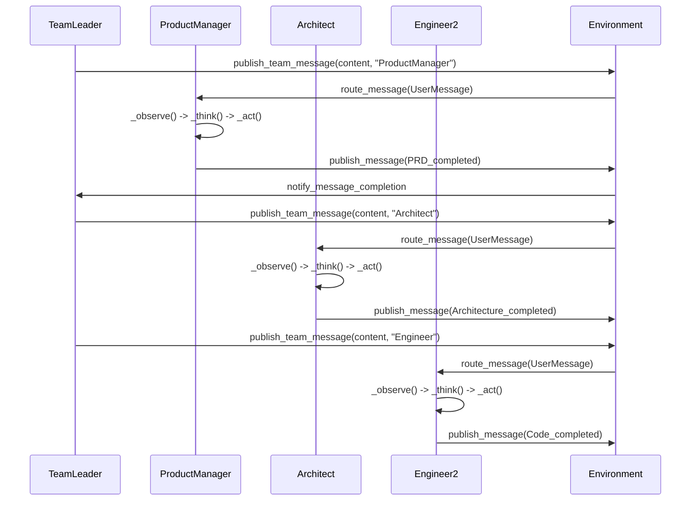
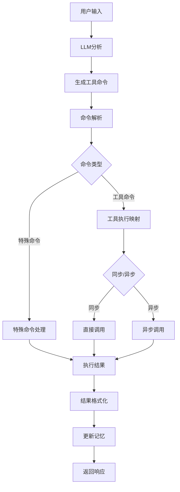
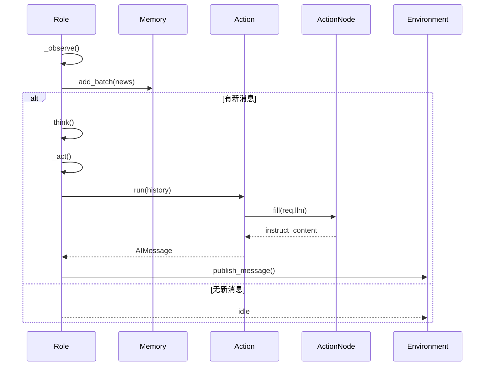

## 概述

MetaGPT的角色系统是整个多智能体框架的核心，它将软件开发过程中的不同职能抽象为独立的智能体角色。每个角色都具有特定的技能、目标和行为模式，通过协作完成复杂的软件开发任务。角色系统的架构设计、核心组件和实现细节。

<!--more-->

## 1. 角色系统架构概览

### 1.1 角色层次结构

MetaGPT的角色系统采用分层继承架构，从抽象基类到具体实现：

```mermaid
classDiagram
    class BaseRole {
        <<abstract>>
        +name: str
        +is_idle: bool
        +think()*
        +act()*
        +react()* Message
        +run()* Message
        +get_memories()* list[Message]
    }
    
    class Role {
        +name: str
        +profile: str
        +goal: str
        +constraints: str
        +desc: str
        +is_human: bool
        +actions: list[Action]
        +rc: RoleContext
        +addresses: set[str]
        +planner: Planner
        +_watch()
        +set_env()
        +_get_prefix()
        +_set_state()
    }
    
    class RoleZero {
        +system_prompt: str
        +tools: list[str]
        +tool_recommender: ToolRecommender
        +tool_execution_map: dict
        +editor: Editor
        +browser: Browser
        +experience_retriever: ExpRetriever
        +max_react_loop: int
        +_think() bool
        +_act() Message
        +_react() Message
        +ask_human() str
        +reply_to_human() str
    }
    
    class ProductManager {
        +name: "Alice"
        +profile: "Product Manager"
        +goal: "Create PRD or research"
        +tools: ["RoleZero", "Browser", "Editor", "SearchEnhancedQA"]
        +todo_action: WritePRD
        +_think() bool
        +_update_tool_execution()
    }
    
    class TeamLeader {
        +name: "TeamLeader"
        +profile: "Team Leader"
        +goal: "Manage team"
        +max_react_loop: 3
        +tools: ["Plan", "RoleZero", "TeamLeader"]
        +publish_team_message()
        +finish_current_task()
        +_get_team_info() str
    }
    
    class Architect {
        +profile: "Architect"
        +goal: "Design system architecture"
        +tools: ["RoleZero", "Terminal"]
        +_update_tool_execution()
    }
    
    class Engineer2 {
        +profile: "Engineer"
        +goal: "Write code"
        +tools: ["RoleZero", "Terminal"]
        +_update_tool_execution()
    }
    
    class DataAnalyst {
        +profile: "Data Analyst"
        +goal: "Analyze data"
        +tools: ["RoleZero", "Terminal"]
        +_update_tool_execution()
    }
    
    BaseRole <|-- Role
    Role <|-- RoleZero
    RoleZero <|-- ProductManager
    RoleZero <|-- TeamLeader
    RoleZero <|-- Architect
    RoleZero <|-- Engineer2
    RoleZero <|-- DataAnalyst
    
    %% 样式定义
    classDef abstract fill:#ffeb3b
    classDef base fill:#2196f3
    classDef enhanced fill:#4caf50
    classDef concrete fill:#ff9800
    
    class BaseRole abstract
    class Role base
    class RoleZero enhanced
    class ProductManager,TeamLeader,Architect,Engineer2,DataAnalyst concrete
```

### 1.2 角色上下文系统

每个角色都拥有独立的运行时上下文，管理其状态和资源：

```python
class RoleContext(BaseModel):
    """角色运行时上下文"""
    
    # 环境引用（避免循环导入，设置exclude=True）
    env: BaseEnvironment = Field(default=None, exclude=True)
    
    # 消息缓冲区，支持异步更新
    msg_buffer: MessageQueue = Field(default_factory=MessageQueue, exclude=True)
    
    # 记忆系统
    memory: Memory = Field(default_factory=Memory)              # 短期记忆
    working_memory: Memory = Field(default_factory=Memory)      # 工作记忆
    
    # 状态管理
    state: int = Field(default=-1)                              # 当前状态，-1表示初始或终止状态
    todo: Action = Field(default=None, exclude=True)            # 待执行动作
    
    # 观察和通信
    watch: set[str] = Field(default_factory=set)                # 关注的动作类型
    news: list[Type[Message]] = Field(default=[], exclude=True) # 新消息列表
    
    # 反应模式配置
    react_mode: RoleReactMode = RoleReactMode.REACT             # 反应模式
    max_react_loop: int = 1                                     # 最大反应循环次数
```

## 2. 基础角色抽象 (BaseRole)

### 2.1 基础接口定义

`BaseRole` 定义了所有角色必须实现的核心接口：

```python
class BaseRole(BaseSerialization):
    """所有角色的抽象基类"""

    name: str  # 角色名称

    @property
    def is_idle(self) -> bool:
        """检查角色是否空闲"""
        raise NotImplementedError

    @abstractmethod
    def think(self):
        """思考下一步行动"""
        raise NotImplementedError

    @abstractmethod
    def act(self):
        """执行当前动作"""
        raise NotImplementedError

    @abstractmethod
    async def react(self) -> "Message":
        """对观察到的消息做出反应的入口方法"""

    @abstractmethod
    async def run(self, with_message: Optional[Union[str, "Message", list[str]]] = None) -> Optional["Message"]:
        """观察、思考并基于观察结果行动"""

    @abstractmethod
    def get_memories(self, k: int = 0) -> list["Message"]:
        """返回最近k条记忆"""
```

**设计要点**：

- **抽象性**：定义核心行为接口，不涉及具体实现
- **可扩展性**：支持不同类型的角色实现
- **一致性**：所有角色遵循统一的生命周期管理

## 3. 核心角色实现 (Role)

### 3.1 角色核心属性

```python
class Role(BaseRole, SerializationMixin, ContextMixin, BaseModel):
    """角色/智能体核心实现"""
    
    # 基础信息
    name: str = ""                      # 角色名称
    profile: str = ""                   # 角色档案
    goal: str = ""                      # 角色目标
    constraints: str = ""               # 约束条件
    desc: str = ""                      # 角色描述
    is_human: bool = False              # 是否为人类角色
    
    # 记忆管理
    enable_memory: bool = True          # 是否启用记忆功能
    
    # 角色标识和状态
    role_id: str = ""                   # 角色ID
    states: list[str] = []              # 状态列表
    
    # 动作系统
    actions: list[SerializeAsAny[Action]] = Field(default=[], validate_default=True)
    
    # 运行时上下文
    rc: RoleContext = Field(default_factory=RoleContext)
    
    # 通信地址
    addresses: set[str] = set()         # 接收消息的地址集合
    
    # 规划器
    planner: Planner = Field(default_factory=Planner)
    
    # 恢复标志
    recovered: bool = False             # 标记是否为恢复的角色
    latest_observed_msg: Optional[Message] = None  # 中断时观察到的最新消息
    observe_all_msg_from_buffer: bool = False      # 是否保存缓冲区中的所有消息
```

### 3.2 关键方法实现

#### 3.2.1 环境设置方法

```python
def set_env(self, env: BaseEnvironment):
    """设置角色工作的环境"""
    self.rc.env = env
    if env:
        # 设置消息路由地址
        env.set_addresses(self, self.addresses)
        # 配置LLM系统提示
        self.llm.system_prompt = self._get_prefix()
        # 设置成本管理器
        self.llm.cost_manager = self.context.cost_manager
        # 重置动作以更新LLM和前缀
        self.set_actions(self.actions)
```

**功能说明**：

- **环境绑定**：将角色与执行环境关联
- **消息路由**：配置角色的消息接收地址
- **LLM配置**：设置大语言模型的系统提示和成本管理
- **动作更新**：确保动作与环境配置同步

#### 3.2.2 观察机制

```python
def _watch(self, actions: Iterable[Type[Action]] | Iterable[Action]):
    """监听感兴趣的动作类型"""
    self.rc.watch = {any_to_str(t) for t in actions}

def is_watch(self, caused_by: str):
    """检查是否关注特定动作"""
    return caused_by in self.rc.watch
```

**设计原理**：

- **选择性观察**：角色只关注与其职责相关的消息
- **效率优化**：避免处理无关消息，提高响应效率
- **解耦设计**：通过动作类型而非具体角色进行关联

#### 3.2.3 状态管理

```python
def _set_state(self, state: int):
    """更新当前状态"""
    self.rc.state = state
    logger.debug(f"actions={self.actions}, state={state}")
    # 根据状态设置待办动作
    self.set_todo(self.actions[self.rc.state] if state >= 0 else None)
```

**状态机制**：

- **状态驱动**：角色行为由当前状态决定
- **动作映射**：每个状态对应特定的动作
- **生命周期管理**：-1状态表示初始或终止状态

## 4. 增强角色实现 (RoleZero)

### 4.1 RoleZero核心特性

`RoleZero` 是MetaGPT的增强角色基类，提供了丰富的工具集成和智能决策能力：

```python
class RoleZero(Role):
    """能够动态思考和行动的角色"""
    
    # 基础信息
    name: str = "Zero"
    profile: str = "RoleZero"
    goal: str = ""
    
    # 提示系统
    system_prompt: str = SYSTEM_PROMPT
    cmd_prompt: str = CMD_PROMPT
    instruction: str = ROLE_INSTRUCTION
    
    # 反应模式
    react_mode: Literal["react"] = "react"
    max_react_loop: int = 50
    
    # 工具系统
    tools: list[str] = []                                    # 工具列表
    tool_recommender: Optional[ToolRecommender] = None       # 工具推荐器
    tool_execution_map: dict[str, Callable] = {}             # 工具执行映射
    
    # 内置工具
    editor: Editor = Editor(enable_auto_lint=True)           # 代码编辑器
    browser: Browser = Browser()                             # 网页浏览器
    
    # 经验系统
    experience_retriever: ExpRetriever = DummyExpRetriever() # 经验检索器
    
    # 配置参数
    memory_k: int = 200                                      # 记忆上下文长度
    use_fixed_sop: bool = False                              # 是否使用固定SOP
    respond_language: str = ""                               # 响应语言
    use_summary: bool = True                                 # 是否使用总结
```

### 4.2 动态思考机制

#### 4.2.1 思考流程

```python
async def _think(self) -> bool:
    """在'react'模式下使用LLM决定是否以及做什么"""
    
    ### 0. 准备阶段 ###
    if not self.rc.todo:
        return False

    # 设置规划目标和检测语言
    if not self.planner.plan.goal:
        self.planner.plan.goal = self.get_memories()[-1].content
        detect_language_prompt = DETECT_LANGUAGE_PROMPT.format(requirement=self.planner.plan.goal)
        self.respond_language = await self.llm.aask(detect_language_prompt)
    
    ### 1. 经验检索 ###
    example = self._retrieve_experience()

    ### 2. 计划状态 ###
    plan_status, current_task = get_plan_status(planner=self.planner)

    ### 3. 工具/命令信息 ###
    tools = await self.tool_recommender.recommend_tools()
    tool_info = json.dumps({tool.name: tool.schemas for tool in tools})

    ### 4. 角色指令 ###
    instruction = self.instruction.strip()
    system_prompt = self.system_prompt.format(
        role_info=self._get_prefix(),
        task_type_desc=self.task_type_desc,
        available_commands=tool_info,
        example=example,
        instruction=instruction,
    )

    ### 5. 动态决策 ###
    prompt = self.cmd_prompt.format(
        current_state=self.cmd_prompt_current_state,
        plan_status=plan_status,
        current_task=current_task,
        respond_language=self.respond_language,
    )

    ### 6. 近期观察 ###
    memory = self.rc.memory.get(self.memory_k)
    memory = await parse_browser_actions(memory, browser=self.browser)
    memory = await parse_editor_result(memory)
    memory = await parse_images(memory, llm=self.llm)

    # 格式化请求并获取响应
    req = self.llm.format_msg(memory + [UserMessage(content=prompt)])
    self.command_rsp = await self.llm_cached_aask(req=req, system_msgs=[system_prompt])

    return True
```

**思考机制特点**：

- **上下文感知**：结合历史记忆、当前状态和可用工具
- **经验驱动**：利用历史经验指导决策
- **工具推荐**：智能推荐最适合的工具
- **多模态处理**：支持文本、图像等多种输入

#### 4.2.2 快速思考优化

```python
async def _quick_think(self) -> Tuple[Message, str]:
    """快速思考机制，处理简单问题无需完整的思考-行动循环"""
    answer = ""
    rsp_msg = None
    
    # 只对用户需求进行快速思考
    if self.rc.news[-1].cause_by != any_to_str(UserRequirement):
        return rsp_msg, ""

    # 意图路由
    memory = self.get_memories(k=self.memory_k)
    context = self.llm.format_msg(memory + [UserMessage(content=QUICK_THINK_PROMPT)])
    intent_result = await self.llm.aask(context, system_msgs=[self.format_quick_system_prompt()])

    if "QUICK" in intent_result or "AMBIGUOUS" in intent_result:
        # 快速回答
        answer = await self.llm.aask(
            self.llm.format_msg(memory),
            system_msgs=[QUICK_RESPONSE_SYSTEM_PROMPT.format(role_info=self._get_prefix())],
        )
    elif "SEARCH" in intent_result:
        # 搜索回答
        query = "\n".join(str(msg) for msg in memory)
        answer = await SearchEnhancedQA().run(query)

    if answer:
        self.rc.memory.add(AIMessage(content=answer, cause_by=QUICK_THINK_TAG))
        await self.reply_to_human(content=answer)
        rsp_msg = AIMessage(content=answer, sent_from=self.name, cause_by=QUICK_THINK_TAG)

    return rsp_msg, intent_result
```

**快速思考优势**：

- **效率提升**：简单问题直接回答，无需复杂流程
- **智能路由**：根据问题类型选择处理方式
- **成本优化**：减少不必要的LLM调用

### 4.3 工具系统集成

#### 4.3.1 工具执行映射

```python
def set_tool_execution(self) -> "RoleZero":
    """设置工具执行映射"""
    # 默认映射
    self.tool_execution_map = {
        "Plan.append_task": self.planner.plan.append_task,
        "Plan.reset_task": self.planner.plan.reset_task,
        "Plan.replace_task": self.planner.plan.replace_task,
        "RoleZero.ask_human": self.ask_human,
        "RoleZero.reply_to_human": self.reply_to_human,
    }
    
    # 搜索工具
    if self.config.enable_search:
        self.tool_execution_map["SearchEnhancedQA.run"] = SearchEnhancedQA().run
    
    # 浏览器工具
    self.tool_execution_map.update({
        f"Browser.{i}": getattr(self.browser, i)
        for i in ["click", "close_tab", "go_back", "go_forward", "goto",
                 "hover", "press", "scroll", "tab_focus", "type"]
    })
    
    # 编辑器工具
    self.tool_execution_map.update({
        f"Editor.{i}": getattr(self.editor, i)
        for i in ["append_file", "create_file", "edit_file_by_replace",
                 "find_file", "goto_line", "insert_content_at_line",
                 "open_file", "read", "scroll_down", "scroll_up",
                 "search_dir", "search_file", "similarity_search", "write"]
    })
    
    # 子类可以更新映射
    self._update_tool_execution()
    return self
```

#### 4.3.2 命令执行机制

```python
async def _run_commands(self, commands) -> str:
    """执行命令列表"""
    outputs = []
    for cmd in commands:
        output = f"Command {cmd['command_name']} executed"
        
        # 处理特殊命令
        if self._is_special_command(cmd):
            special_command_output = await self._run_special_command(cmd)
            outputs.append(output + ":" + special_command_output)
            continue
        
        # 执行工具映射中的命令
        if cmd["command_name"] in self.tool_execution_map:
            tool_obj = self.tool_execution_map[cmd["command_name"]]
            try:
                if inspect.iscoroutinefunction(tool_obj):
                    tool_output = await tool_obj(**cmd["args"])
                else:
                    tool_output = tool_obj(**cmd["args"])
                if tool_output:
                    output += f": {str(tool_output)}"
                outputs.append(output)
            except Exception as e:
                tb = traceback.format_exc()
                logger.exception(str(e) + tb)
                outputs.append(output + f": {tb}")
                break  # 任何命令失败都停止执行
        else:
            outputs.append(f"Command {cmd['command_name']} not found.")
            break
    
    return "\n\n".join(outputs)
```

**命令执行特点**：

- **统一接口**：所有工具通过统一的命令接口调用
- **异步支持**：支持同步和异步工具函数
- **错误处理**：完善的异常捕获和错误报告
- **执行控制**：命令失败时停止后续执行

## 5. 具体角色实现

### 5.1 产品经理 (ProductManager)

```python
class ProductManager(RoleZero):
    """产品经理角色，负责产品开发和管理"""
    
    name: str = "Alice"
    profile: str = "Product Manager"
    goal: str = "Create a Product Requirement Document or market research/competitive product research."
    constraints: str = "utilize the same language as the user requirements for seamless communication"
    instruction: str = PRODUCT_MANAGER_INSTRUCTION
    tools: list[str] = ["RoleZero", Browser.__name__, Editor.__name__, SearchEnhancedQA.__name__]
    
    todo_action: str = any_to_name(WritePRD)

    def __init__(self, **kwargs) -> None:
        super().__init__(**kwargs)
        if self.use_fixed_sop:
            self.enable_memory = False
            self.set_actions([PrepareDocuments(send_to=any_to_str(self)), WritePRD])
            self._watch([UserRequirement, PrepareDocuments])
            self.rc.react_mode = RoleReactMode.BY_ORDER

    async def _think(self) -> bool:
        """决定做什么"""
        if not self.use_fixed_sop:
            return await super()._think()

        # 固定SOP模式下的思考逻辑
        if GitRepository.is_git_dir(self.config.project_path) and not self.config.git_reinit:
            self._set_state(1)  # 跳过文档准备，直接写PRD
        else:
            self._set_state(0)  # 从文档准备开始
            self.config.git_reinit = False
            self.todo_action = any_to_name(WritePRD)
        return bool(self.rc.todo)
```

**产品经理特点**：

- **双模式支持**：固定SOP和动态反应两种工作模式
- **文档导向**：专注于PRD和市场研究文档的创建
- **工具集成**：集成浏览器、编辑器和搜索增强QA工具
- **状态感知**：根据项目状态调整工作流程

### 5.2 团队领导 (TeamLeader)

```python
class TeamLeader(RoleZero):
    """团队领导角色，负责管理团队协助用户"""
    
    name: str = TEAMLEADER_NAME
    profile: str = "Team Leader"
    goal: str = "Manage a team to assist users"
    thought_guidance: str = TL_THOUGHT_GUIDANCE
    max_react_loop: int = 3  # 每次只反应一次，但可能遇到错误或需要询问人类
    
    tools: list[str] = ["Plan", "RoleZero", "TeamLeader"]
    use_summary: bool = False

    def publish_team_message(self, content: str, send_to: str):
        """
        向团队成员发布消息，使用成员名称填充send_to参数
        不要省略任何必要信息，如路径、链接、环境、编程语言、框架、需求、约束等
        """
        self._set_state(-1)  # 每次发布消息后暂停等待响应
        if send_to == self.name:
            return  # 避免向自己发送消息
        
        # 发布用户消息给指定角色
        self.publish_message(
            UserMessage(content=content, sent_from=self.name, send_to=send_to, cause_by=RunCommand),
            send_to=send_to
        )

    def _get_team_info(self) -> str:
        """获取团队信息"""
        if not self.rc.env:
            return ""
        team_info = ""
        for role in self.rc.env.roles.values():
            team_info += f"{role.name}: {role.profile}, {role.goal}\n"
        return team_info
```

**团队领导特点**：

- **协调管理**：负责任务分配和团队协调
- **消息路由**：智能地将任务分配给合适的团队成员
- **状态控制**：发布消息后暂停，等待团队成员响应
- **团队感知**：了解所有团队成员的能力和状态

### 5.3 架构师 (Architect)

```python
class Architect(RoleZero):
    """架构师角色，负责系统架构设计"""
    
    profile: str = "Architect"
    goal: str = "Design system architecture and technical specifications"
    tools: list[str] = ["RoleZero", Terminal.__name__]

    def _update_tool_execution(self):
        """更新工具执行映射"""
        from metagpt.tools.libs.terminal import Terminal
        self.terminal = Terminal()
        self.tool_execution_map.update({"Terminal.run_command": self.terminal.run_command})
```

**架构师特点**：

- **技术导向**：专注于系统架构和技术规范设计
- **终端集成**：集成终端工具进行技术验证
- **设计能力**：具备系统设计和技术决策能力

## 6. 角色协作机制

### 6.1 消息传递系统

角色间通过消息系统进行协作：



### 6.2 角色反应模式

MetaGPT支持多种角色反应模式：

```python
class RoleReactMode(str, Enum):
    REACT = "react"              # 反应式：观察-思考-行动循环
    BY_ORDER = "by_order"        # 按序执行：按预定义顺序执行动作
    PLAN_AND_ACT = "plan_and_act"  # 计划执行：先制定计划再执行
```

**反应模式特点**：

- **REACT模式**：适合动态环境，能够根据观察结果调整行为
- **BY_ORDER模式**：适合固定流程，按预定义顺序执行
- **PLAN_AND_ACT模式**：适合复杂任务，先制定详细计划

### 6.3 状态同步机制

```python
def _set_state(self, state: int):
    """更新当前状态并同步到环境"""
    self.rc.state = state
    logger.debug(f"Role {self.name} state changed to {state}")
    
    # 根据状态设置待办动作
    if state >= 0 and state < len(self.actions):
        self.set_todo(self.actions[state])
    else:
        self.set_todo(None)  # 终止状态
    
    # 通知环境状态变化
    if self.rc.env:
        self.rc.env.update_role_state(self, state)
```

## 7. 记忆和学习机制

### 7.1 多层记忆架构

```python
class RoleContext:
    memory: Memory = Field(default_factory=Memory)              # 短期记忆
    working_memory: Memory = Field(default_factory=Memory)      # 工作记忆
    # long_term_memory: LongTermMemory                          # 长期记忆（可选）
```

**记忆层次**：

- **短期记忆**：存储最近的对话和观察
- **工作记忆**：存储当前任务相关的信息
- **长期记忆**：存储历史经验和学习成果

### 7.2 经验检索系统

```python
def _retrieve_experience(self) -> str:
    """检索相关经验"""
    context = [str(msg) for msg in self.rc.memory.get(self.memory_k)]
    context = "\n\n".join(context)
    example = self.experience_retriever.retrieve(context=context)
    return example
```

**经验系统特点**：

- **上下文相关**：基于当前上下文检索相关经验
- **可扩展性**：支持不同的检索策略
- **学习能力**：从历史执行中学习最佳实践

## 8. 工具集成架构

### 8.1 工具推荐系统

```python
class BM25ToolRecommender(ToolRecommender):
    """基于BM25算法的工具推荐器"""
    
    async def recommend_tools(self, context: str = "") -> list[Tool]:
        """根据上下文推荐最相关的工具"""
        if not context:
            return self.tools
        
        # 使用BM25算法计算相关性
        scores = self.bm25.get_scores(context.split())
        top_indices = scores.argsort()[-self.top_k:][::-1]
        
        return [self.tools[i] for i in top_indices]
```

### 8.2 工具执行框架



## 9. 性能优化策略

### 9.1 缓存机制

```python
@exp_cache(context_builder=RoleZeroContextBuilder(), serializer=RoleZeroSerializer())
async def llm_cached_aask(self, *, req: list[dict], system_msgs: list[str], **kwargs) -> str:
    """使用经验缓存自动管理LLM调用"""
    return await self.llm.aask(req, system_msgs=system_msgs)
```

**缓存优势**：

- **成本降低**：避免重复的LLM调用
- **响应加速**：缓存命中时快速返回结果
- **经验积累**：将成功的交互作为经验保存

### 9.2 异步处理

```python
async def _react(self) -> Message:
    """异步反应循环"""
    actions_taken = 0
    while actions_taken < self.rc.max_react_loop:
        # 异步观察
        await self._observe()
        
        # 异步思考
        has_todo = await self._think()
        if not has_todo:
            break
            
        # 异步行动
        rsp = await self._act()
        actions_taken += 1
    
    return rsp
```

## 10. 错误处理和恢复

### 10.1 异常处理机制

```python
async def _run_commands(self, commands) -> str:
    """带异常处理的命令执行"""
    outputs = []
    for cmd in commands:
        try:
            # 执行命令
            tool_output = await self._execute_command(cmd)
            outputs.append(f"Command {cmd['command_name']} executed: {tool_output}")
        except Exception as e:
            # 记录异常并停止执行
            tb = traceback.format_exc()
            logger.exception(f"Command {cmd['command_name']} failed: {e}")
            outputs.append(f"Command {cmd['command_name']} failed: {tb}")
            break
    
    return "\n\n".join(outputs)
```

### 10.2 状态恢复

```python
def serialize(self, stg_path: Path = None):
    """序列化角色状态"""
    # 保存角色配置和状态
    role_data = self.model_dump()
    # 保存记忆和上下文
    role_data["memory"] = self.rc.memory.serialize()
    role_data["context"] = self.rc.env.context.serialize()
    
    write_json_file(stg_path / "role.json", role_data)

@classmethod
def deserialize(cls, stg_path: Path) -> "Role":
    """反序列化角色状态"""
    role_data = read_json_file(stg_path / "role.json")
    role = cls(**role_data)
    # 恢复记忆和上下文
    role.rc.memory.deserialize(role_data["memory"])
    return role
```

## 11. 总结

MetaGPT的角色系统通过精心设计的分层架构，实现了高度灵活和可扩展的多智能体协作框架。其核心优势包括：

### 11.1 架构优势

1. **清晰的抽象层次**：从BaseRole到具体角色的清晰继承关系
2. **统一的接口设计**：所有角色遵循一致的生命周期管理
3. **灵活的扩展机制**：支持自定义角色和工具集成
4. **完善的状态管理**：支持角色状态的持久化和恢复

### 11.2 协作机制

1. **消息驱动**：通过环境进行松耦合的消息传递
2. **观察者模式**：角色选择性关注相关消息
3. **多种反应模式**：适应不同类型的任务需求
4. **智能路由**：团队领导智能分配任务

### 11.3 智能特性

1. **动态决策**：RoleZero的智能思考和工具推荐
2. **经验学习**：从历史执行中学习和改进
3. **快速响应**：简单问题的快速思考机制
4. **多模态支持**：支持文本、图像等多种输入

### 11.4 工程实践

1. **异步处理**：高效的并发执行能力
2. **错误处理**：完善的异常捕获和恢复机制
3. **性能优化**：缓存和批处理优化
4. **可观测性**：详细的日志和状态跟踪

这种设计使得MetaGPT能够模拟真实软件公司的协作模式，通过专业化分工和智能协作，实现复杂软件项目的自动化开发。每个角色都具有明确的职责和专业技能，同时保持足够的灵活性来适应不同的项目需求和执行环境。

## 附录A：关键函数与调用链（基于源码）

### A.1 关键函数代码与说明

```python
# 位置: metagpt/roles/role.py
@role_raise_decorator
async def run(self, with_message=None) -> Message | None:
    if with_message:
        msg = Message(content=with_message) if isinstance(with_message, str) else (
            with_message if isinstance(with_message, Message) else Message(content="\n".join(with_message))
        )
        if not msg.cause_by:
            msg.cause_by = UserRequirement
        self.put_message(msg)
    if not await self._observe():
        logger.debug(f"{self._setting}: no news. waiting.")
        return
    rsp = await self.react()
    self.set_todo(None)
    self.publish_message(rsp)
    return rsp
```

```python
# 位置: metagpt/roles/role.py
async def _observe(self) -> int:
    news = self.rc.msg_buffer.pop_all() if not (self.recovered and self.latest_observed_msg) else \
        self.rc.memory.find_news(observed=[self.latest_observed_msg], k=10)
    old_messages = [] if not self.enable_memory else self.rc.memory.get()
    self.rc.news = [n for n in news if (n.cause_by in self.rc.watch or self.name in n.send_to) and n not in old_messages]
    self.rc.memory.add_batch(news if self.observe_all_msg_from_buffer else self.rc.news)
    self.latest_observed_msg = self.rc.news[-1] if self.rc.news else None
    return len(self.rc.news)
```

```python
# 位置: metagpt/roles/di/role_zero.py
async def _react(self) -> Message:
    self._set_state(0)
    quick_rsp, _ = await self._quick_think()
    if quick_rsp:
        return quick_rsp
    actions_taken = 0
    rsp = AIMessage(content="No actions taken yet", cause_by=Action)
    while actions_taken < self.rc.max_react_loop:
        await self._observe()
        has_todo = await self._think()
        if not has_todo:
            break
        rsp = await self._act()
        actions_taken += 1
    return rsp
```

### A.2 调用链

```
Role.run()
  ├─ Role._observe() → MessageQueue.pop_all()/Memory.find_news()
  ├─ Role.react()
  │   └─ Role._react()/Role._plan_and_act()
  │       ├─ Role._think() → LLM.aask() [可选]
  │       └─ Role._act() → Action.run() → ActionNode.fill()
  └─ Environment.publish_message()
```

### A.3 关键时序图


