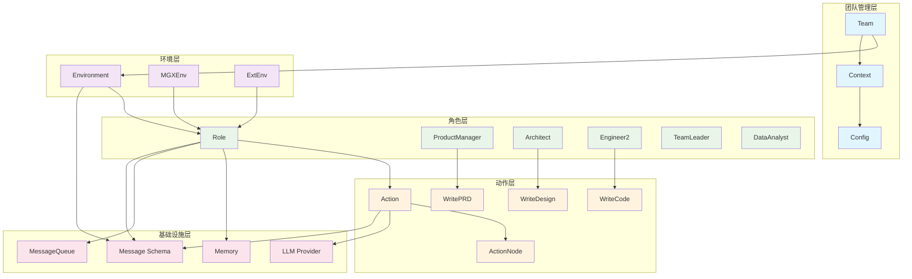

## 1. Role 执行循环时序图

### 1.1 核心执行流程

Role类的执行循环是MetaGPT智能体系统的核心机制，实现了"观察-思考-行动"的智能体范式。

#### 关键函数：Role.run()
**位置**: `metagpt/roles/role.py:530`  
**功能**: 角色主执行入口，实现完整的智能体执行周期

```python
@role_raise_decorator
async def run(self, with_message=None) -> Message | None:
    """观察，思考并根据观察结果行动
    
    Args:
        with_message: 外部输入消息，可以是字符串、Message对象或消息列表
        
    Returns:
        Message | None: 执行结果消息，如果无新消息则返回None
        
    执行流程:
        1. 预处理输入消息并放入消息缓冲区
        2. 观察环境中的新消息
        3. 如果有新消息，进行反应（思考+行动）
        4. 重置状态并发布响应消息
    """
    # 1. 消息预处理：将外部输入转换为标准Message格式
    if with_message:
        msg = None
        if isinstance(with_message, str):
            msg = Message(content=with_message)
        elif isinstance(with_message, Message):
            msg = with_message
        elif isinstance(with_message, list):
            msg = Message(content="\n".join(with_message))
        if not msg.cause_by:
            msg.cause_by = UserRequirement  # 设置消息来源
        self.put_message(msg)  # 放入私有消息缓冲区
    
    # 2. 观察阶段：检查是否有新消息需要处理
    if not await self._observe():
        logger.debug(f"{self._setting}: no news. waiting.")
        return  # 无新消息时暂停等待

    # 3. 反应阶段：根据观察结果进行思考和行动
    rsp = await self.react()

    # 4. 状态重置：清理当前任务状态
    self.set_todo(None)
    
    # 5. 消息发布：将响应发送到环境中
    self.publish_message(rsp)
    return rsp
```

#### 关键函数：Role._observe()
**位置**: `metagpt/roles/role.py:399`  
**功能**: 消息观察和过滤机制

```python
async def _observe(self) -> int:
    """从消息缓冲区准备新消息进行处理
    
    Returns:
        int: 新消息数量
        
    处理逻辑:
        1. 从消息缓冲区获取未处理消息
        2. 与历史记忆对比，过滤重复消息
        3. 根据关注列表过滤感兴趣的消息
        4. 更新角色记忆系统
    """
    # 获取新消息
    news = []
    if self.recovered and self.latest_observed_msg:
        # 恢复模式：从上次观察的消息开始
        news = self.rc.memory.find_news(observed=[self.latest_observed_msg], k=10)
    if not news:
        # 正常模式：从缓冲区获取所有消息
        news = self.rc.msg_buffer.pop_all()
    
    # 获取历史消息用于去重
    old_messages = [] if not self.enable_memory else self.rc.memory.get()
    
    # 过滤感兴趣的消息
    self.rc.news = [
        n for n in news 
        if (n.cause_by in self.rc.watch or self.name in n.send_to) 
        and n not in old_messages
    ]
    
    # 更新记忆系统
    if self.observe_all_msg_from_buffer:
        self.rc.memory.add_batch(news)  # 保存所有消息
    else:
        self.rc.memory.add_batch(self.rc.news)  # 只保存感兴趣的消息
    
    # 记录最后观察的消息用于恢复
    self.latest_observed_msg = self.rc.news[-1] if self.rc.news else None
    return len(self.rc.news)
```

#### 关键函数：Role.react()
**位置**: `metagpt/roles/role.py:512`  
**功能**: 反应策略调度器

```python
async def react(self) -> Message:
    """根据反应模式选择执行策略
    
    Returns:
        Message: 反应结果消息
        
    支持的反应模式:
        - REACT: 动态选择动作
        - BY_ORDER: 按顺序执行动作
        - PLAN_AND_ACT: 先计划后执行
    """
    if self.rc.react_mode == RoleReactMode.REACT or self.rc.react_mode == RoleReactMode.BY_ORDER:
        rsp = await self._react()
    elif self.rc.react_mode == RoleReactMode.PLAN_AND_ACT:
        rsp = await self._plan_and_act()
    else:
        raise ValueError(f"Unsupported react mode: {self.rc.react_mode}")
    
    # 重置状态：当前反应完成，状态回到初始值
    self._set_state(state=-1)
    
    # 添加智能体信息
    if isinstance(rsp, AIMessage):
        rsp.with_agent(self._setting)
    return rsp
```

<div class="mermaid-image-container" data-chart-id="MetaGPT_核心模块时序图-0">
  
  <div class="mermaid-fallback" style="display: none;">
    <details>
      <summary>显示 Mermaid 源码</summary>
      <pre class="mermaid">sequenceDiagram
    participant Env as Environment
    participant Role as Role
    participant Memory as Memory
    participant LLM as LLM Provider
    participant Action as Action
    
    Env->>Role: run()
    Role->>Role: _observe()
    Role->>Role: msg_buffer.pop_all()
    Role->>Role: 过滤感兴趣消息
    Role->>Memory: add_batch(news)
    
    alt 有新消息
        Role->>Role: _think()
        alt 单一动作
            Role->>Role: _set_state(0)
        else 多动作-按顺序
            Role->>Role: _set_state(state+1)
        else 多动作-LLM选择
            Role->>LLM: aask(state_prompt)
            LLM-->>Role: next_state
            Role->>Role: _set_state(next_state)
        end
        
        Role->>Role: _act()
        Role->>Action: run(history)
        Action->>LLM: aask(prompt)
        LLM-->>Action: response
        Action-->>Role: AIMessage
        Role->>Memory: add(message)
        Role->>Env: publish_message(response)
    else 无新消息
        Role-->>Env: None (idle)
    end</pre>
    </details>
  </div>
</div>

### 1.2 调用链分析

```
Environment.run()
    └── Role.run()
        ├── Role._observe()
        │   ├── MessageQueue.pop_all()
        │   ├── Memory.find_news()
        │   └── Memory.add_batch()
        ├── Role.react()
        │   └── Role._react() / Role._plan_and_act()
        │       ├── Role._think()
        │       │   └── LLM.aask() [条件性调用]
        │       └── Role._act()
        │           └── Action.run()
        │               └── LLM.aask()
        └── Environment.publish_message()
```

## 2. ActionNode 填充时序图

### 2.1 结构化输出处理机制

ActionNode是MetaGPT实现结构化输出的核心组件，它将自然语言提示转换为结构化数据。

#### 关键函数：ActionNode.fill()
**位置**: `metagpt/actions/action_node.py:597`  
**功能**: 节点填充的核心方法，实现结构化输出处理

```python
@exp_cache(serializer=ActionNodeSerializer())
async def fill(
    self,
    *,
    req,                    # 请求上下文，包含所有必要信息
    llm,                    # 大语言模型实例
    schema="json",          # 输出格式：raw/json/markdown
    mode="auto",            # 填充模式：auto/children/root
    strgy="simple",         # 策略：simple/complex
    images=None,            # 图像输入（多模态支持）
    timeout=USE_CONFIG_TIMEOUT,  # 超时设置
    exclude=[],             # 排除的字段
    function_name=None,     # 函数名（代码填充模式）
):
    """填充节点内容的主要方法
    
    Args:
        req: 填充节点时需要的所有上下文信息
        llm: 预定义系统消息的大语言模型
        schema: 输出格式 - raw(自由文本)/json(结构化)/markdown(标记)
        mode: 填充模式 - auto(自动)/children(子节点)/root(根节点)
        strgy: 执行策略 - simple(单次运行)/complex(逐节点运行)
        images: 图像URL或base64列表（GPT-4V支持）
        timeout: LLM调用超时时间
        exclude: 要排除的ActionNode键列表
        
    Returns:
        self: 填充后的ActionNode实例
    """
    # 1. 初始化设置
    self.set_llm(llm)           # 设置LLM实例
    self.set_context(req)       # 设置上下文
    if self.schema:
        schema = self.schema    # 使用节点预定义的schema
    
    # 2. 特殊填充模式处理
    if mode == FillMode.CODE_FILL.value:
        # 代码填充模式：专门处理代码生成
        result = await self.code_fill(context, function_name, timeout)
        self.instruct_content = self.create_class()(**result)
        return self
    
    elif mode == FillMode.XML_FILL.value:
        # XML填充模式：处理XML格式输出
        context = self.xml_compile(context=self.context)
        result = await self.xml_fill(context, images=images)
        self.instruct_content = self.create_class()(**result)
        return self
    
    elif mode == FillMode.SINGLE_FILL.value:
        # 单一填充模式：处理单个字段
        result = await self.single_fill(context, images=images)
        self.instruct_content = self.create_class()(**result)
        return self
    
    # 3. 标准填充流程
    if strgy == "simple":
        # 简单策略：一次性处理所有字段
        return await self.simple_fill(
            schema=schema, mode=mode, images=images, 
            timeout=timeout, exclude=exclude
        )
    elif strgy == "complex":
        # 复杂策略：逐个处理子节点
        tmp = {}
        for _, child_node in self.children.items():
            if exclude and child_node.key in exclude:
                continue  # 跳过排除的字段
            
            # 递归填充子节点
            child = await child_node.simple_fill(
                schema=schema, mode=mode, images=images, 
                timeout=timeout, exclude=exclude
            )
            tmp.update(child.instruct_content.model_dump())
        
        # 创建组合类并实例化
        cls = self._create_children_class()
        self.instruct_content = cls(**tmp)
        return self
```

#### 关键函数：ActionNode.compile()
**位置**: `metagpt/actions/action_node.py:382`  
**功能**: 提示模板编译器

```python
def compile(self, context, schema="json", mode="children", template=SIMPLE_TEMPLATE, exclude=[]) -> str:
    """将节点定义编译为LLM提示模板
    
    Args:
        context: 上下文信息
        schema: 输出格式 - raw/json/markdown
        mode: 编译模式 - all/root/children
        template: 提示模板
        exclude: 排除的字段列表
        
    Returns:
        str: 编译后的提示字符串
        
    模板组成:
        - context: 历史消息和当前请求
        - instruction: 字段定义和类型约束
        - example: 期望的输出格式示例
        - constraint: 语言和格式约束
    """
    if schema == "raw":
        # 原始模式：自由文本输出
        return f"{context}\n\n## Actions\n{LANGUAGE_CONSTRAINT}\n{self.instruction}"

    # 编译各个组件
    instruction = self.compile_instruction(schema="markdown", mode=mode, exclude=exclude)
    example = self.compile_example(schema=schema, tag=TAG, mode=mode, exclude=exclude)
    constraints = [LANGUAGE_CONSTRAINT, FORMAT_CONSTRAINT]
    constraint = "\n".join(constraints)

    # 组装完整提示
    prompt = template.format(
        context=context,
        example=example,
        instruction=instruction,
        constraint=constraint,
    )
    return prompt
```

#### 关键函数：Action._run_action_node()
**位置**: `metagpt/actions/action.py:103`  
**功能**: Action与ActionNode的桥接方法

```python
async def _run_action_node(self, *args, **kwargs):
    """运行动作节点
    
    Args:
        args[0]: 历史消息列表
        
    Returns:
        ActionNode: 填充后的节点实例
        
    处理流程:
        1. 构建历史消息上下文
        2. 调用节点填充方法
        3. 返回结构化结果
    """
    msgs = args[0]
    # 构建上下文：将历史消息格式化
    context = "## History Messages\n"
    context += "\n".join([f"{idx}: {i}" for idx, i in enumerate(reversed(msgs))])
    
    # 调用节点填充
    return await self.node.fill(req=context, llm=self.llm)
```

<div class="mermaid-image-container" data-chart-id="MetaGPT_核心模块时序图-1">
  
  <div class="mermaid-fallback" style="display: none;">
    <details>
      <summary>显示 Mermaid 源码</summary>
      <pre class="mermaid">sequenceDiagram
    participant Action as Action
    participant Node as ActionNode
    participant LLM as LLM Provider
    participant Parser as OutputParser
    participant Model as PydanticModel
    
    Action->>Node: fill(req, llm, schema, mode)
    Node->>Node: set_llm(llm)
    Node->>Node: set_context(req)
    
    alt schema == "raw"
        Node->>LLM: aask(raw_prompt)
        LLM-->>Node: content
        Node->>Node: self.content = content
    else 结构化输出
        Node->>Node: compile(context, schema, mode)
        Node->>Node: compile_instruction()
        Node->>Node: compile_example()
        Node->>Node: get_mapping(mode)
        
        Node->>Node: _aask_v1(prompt, class_name, mapping)
        Node->>LLM: aask(prompt)
        LLM-->>Node: raw_content
        
        alt schema == "json"
            Node->>Parser: llm_output_postprocess(content, schema)
        else schema == "markdown"
            Node->>Parser: parse_data_with_mapping(content, mapping)
        end
        
        Parser-->>Node: parsed_data
        Node->>Model: create_model_class(class_name, mapping)
        Model-->>Node: output_class
        Node->>Node: output_class(**parsed_data)
        Node->>Node: self.instruct_content = instance
    end
    
    Node-->>Action: self</pre>
    </details>
  </div>
</div>

### 2.2 调用链分析

```
Action.run()
    └── Action._run_action_node()
        └── ActionNode.fill()
            ├── ActionNode.set_llm()
            ├── ActionNode.set_context()
            ├── ActionNode.compile()
            │   ├── ActionNode.compile_instruction()
            │   ├── ActionNode.compile_example()
            │   └── ActionNode.get_mapping()
            ├── ActionNode._aask_v1()
            │   └── LLM.aask()
            ├── OutputParser.parse_data_with_mapping()
            ├── ActionNode.create_model_class()
            └── PydanticModel.__init__()
```

## 3. Environment 消息路由时序图

### 3.1 消息路由机制

Environment类是MetaGPT中智能体间通信的核心基础设施，负责消息的路由分发和环境管理。

#### 关键函数：Environment.publish_message()
**位置**: `metagpt/environment/base_env.py:175`  
**功能**: 消息路由分发的核心方法

```python
def publish_message(self, message: Message, peekable: bool = True) -> bool:
    """将消息分发给接收者
    
    根据RFC 116第2.2.1章节的消息路由结构设计，以及RFC 113中整个系统的规划，
    消息中的路由信息只负责指定消息接收者，不关心消息接收者在哪里。
    如何将消息路由到消息接收者是RFC 113设计的传输框架要解决的问题。
    
    Args:
        message: 要发布的消息对象
        peekable: 是否可窥视（调试用）
        
    Returns:
        bool: 发布是否成功
        
    路由算法:
        1. 遍历所有角色及其地址
        2. 检查消息的send_to是否匹配角色地址
        3. 将消息投递到匹配的角色消息缓冲区
        4. 记录消息到历史中用于调试
    """
    logger.debug(f"publish_message: {message.dump()}")
    found = False
    
    # 根据RFC 113第2.2.3.2章节的路由功能计划
    for role, addrs in self.member_addrs.items():
        if is_send_to(message, addrs):
            # 将消息放入角色的私有消息缓冲区
            role.put_message(message)
            found = True
    
    if not found:
        # 记录无接收者的消息警告
        logger.warning(f"Message no recipients: {message.dump()}")
    
    # 添加到历史记录用于调试
    self.history.add(message)
    return True
```

#### 关键函数：Environment.run()
**位置**: `metagpt/environment/base_env.py:197`  
**功能**: 环境运行引擎，并发执行所有角色

```python
async def run(self, k=1):
    """处理一次所有角色的运行
    
    Args:
        k: 运行轮数，默认为1
        
    执行机制:
        1. 收集所有非空闲角色的执行任务
        2. 使用asyncio.gather()并发执行所有角色
        3. 记录环境空闲状态用于调试
        
    并发设计:
        - 跳过空闲角色，避免不必要的等待
        - 并发执行提高系统整体性能
        - 异常隔离，单个角色错误不影响其他角色
    """
    for _ in range(k):
        futures = []
        
        # 收集所有活跃角色的执行任务
        for role in self.roles.values():
            if role.is_idle:
                continue  # 跳过空闲角色
            future = role.run()
            futures.append(future)

        # 并发执行所有角色
        if futures:
            await asyncio.gather(*futures)
        
        logger.debug(f"is idle: {self.is_idle}")
```

#### 关键函数：Environment.add_roles()
**位置**: `metagpt/environment/base_env.py:164`  
**功能**: 角色管理和环境绑定

```python
def add_roles(self, roles: Iterable[BaseRole]):
    """增加一批角色到当前环境
    
    Args:
        roles: 要添加的角色列表
        
    处理流程:
        1. 将角色添加到环境的角色字典中
        2. 设置角色的环境引用
        3. 建立角色地址映射关系
        
    设计要点:
        - 双向绑定：环境持有角色引用，角色持有环境引用
        - 地址管理：维护角色名称到地址的映射
        - 上下文共享：角色继承环境的上下文配置
    """
    for role in roles:
        # 添加到角色字典，使用名称作为键
        self.roles[role.name] = role
        
        # 建立地址映射关系
        self.member_addrs[role] = {role.name}

    # 设置角色环境和上下文
    for role in roles:
        role.context = self.context  # 共享上下文配置
        role.set_env(self)           # 设置环境引用
```

<div class="mermaid-image-container" data-chart-id="MetaGPT_核心模块时序图-2">
  
  <div class="mermaid-fallback" style="display: none;">
    <details>
      <summary>显示 Mermaid 源码</summary>
      <pre class="mermaid">sequenceDiagram
    participant Role1 as 发送角色
    participant Env as Environment
    participant Role2 as 接收角色1
    participant Role3 as 接收角色2
    participant History as History
    
    Role1->>Env: publish_message(message)
    Env->>Env: 检查 message.send_to
    
    loop 遍历所有角色
        Env->>Env: is_send_to(message, role.addresses)
        alt 地址匹配
            Env->>Role2: put_message(message)
            Role2->>Role2: msg_buffer.push(message)
        else 地址不匹配
            Env->>Role3: (跳过)
        end
    end
    
    Env->>History: add(message)
    Env-->>Role1: True (发送成功)
    
    Note over Env: 如果没有找到接收者，记录警告日志</pre>
    </details>
  </div>
</div>

### 3.2 调用链分析

```
Environment.run()
    ├── Role.is_idle [检查]
    ├── Role.run() [并发收集]
    └── asyncio.gather(*futures) [并发执行]

Environment.publish_message()
    ├── is_send_to(message, addrs) [地址匹配]
    ├── Role.put_message(message) [消息投递]
    └── History.add(message) [历史记录]

Environment.add_roles()
    ├── roles[role.name] = role [角色注册]
    ├── member_addrs[role] = {role.name} [地址映射]
    └── role.set_env(self) [环境绑定]
```

## 4. Team 运行时序图

### 4.1 团队协作机制

Team类是MetaGPT中多智能体协作的顶层管理器，负责协调各个角色的执行和资源管理。

#### 关键函数：Team.run()
**位置**: `metagpt/team.py:123`  
**功能**: 团队主执行循环，控制整个协作流程

```python
@serialize_decorator
async def run(self, n_round=3, idea="", send_to="", auto_archive=True):
    """运行团队直到目标轮数或资金耗尽
    
    Args:
        n_round: 最大运行轮数
        idea: 初始想法或需求
        send_to: 消息发送目标
        auto_archive: 是否自动归档
        
    Returns:
        History: 执行历史记录
        
    执行流程:
        1. 发布初始需求到环境
        2. 循环执行直到达到轮数限制或所有角色空闲
        3. 每轮检查预算并执行环境运行
        4. 自动归档项目结果
    """
    if idea:
        self.run_project(idea=idea, send_to=send_to)

    while n_round > 0:
        if self.env.is_idle:  # 所有角色都空闲
            logger.debug("All roles are idle.")
            break
        n_round -= 1
        self._check_balance()  # 检查预算
        await self.env.run()   # 环境运行一轮
        logger.debug(f"max {n_round=} left.")
    
    self.env.archive(auto_archive)  # 归档项目
    return self.env.history
```

#### 关键函数：Team._check_balance()
**位置**: `metagpt/team.py:95`  
**功能**: 预算控制机制

```python
def _check_balance(self):
    """检查预算余额，防止成本失控
    
    Raises:
        NoMoneyException: 当总成本超过预算限制时抛出
        
    成本控制策略:
        - 实时监控LLM调用成本
        - 设置预算上限防止无限制消费
        - 提供详细的成本报告
    """
    if self.cost_manager.total_cost >= self.cost_manager.max_budget:
        raise NoMoneyException(
            self.cost_manager.total_cost, 
            f"资金不足: {self.cost_manager.max_budget}"
        )
```

```mermaid
sequenceDiagram
    participant CLI as 命令行
    participant Team as Team
    participant Env as Environment
    participant Role1 as ProductManager
    participant Role2 as Architect
    participant Role3 as Engineer
    participant CostMgr as CostManager
    
    CLI->>Team: run(n_round, idea)
    Team->>Env: publish_message(Message(idea))
    
    loop n_round 轮
        Team->>CostMgr: _check_balance()
        alt 预算充足
            Team->>Env: run()
            
            par 并发执行角色
                Env->>Role1: run()
                Role1->>Role1: observe->think->act
                Role1->>Env: publish_message(prd)
            and
                Env->>Role2: run()
                Role2->>Role2: observe->think->act  
                Role2->>Env: publish_message(design)
            and
                Env->>Role3: run()
                Role3->>Role3: observe->think->act
                Role3->>Env: publish_message(code)
            end
            
            Team->>Env: is_idle?
            alt 所有角色空闲
                break 提前结束
            end
        else 预算不足
            Team->>Team: raise NoMoneyException
        end
    end
    
    Team->>Env: archive(auto_archive)
    Team-->>CLI: env.history
```
  </div>
</div>

### 4.2 调用链分析

```
Team.run()
    ├── Team.run_project() [条件性调用]
    ├── Team._check_balance() [每轮检查]
    ├── Environment.run() [核心执行]
    │   └── Role.run() [并发执行所有角色]
    ├── Environment.is_idle [状态检查]
    └── Environment.archive() [结果归档]
```

## 5. MGXEnv 多模态消息处理时序图

<div class="mermaid-image-container" data-chart-id="MetaGPT_核心模块时序图-4">
  
  <div class="mermaid-fallback" style="display: none;">
    <details>
      <summary>显示 Mermaid 源码</summary>
      <pre class="mermaid">sequenceDiagram
    participant User as 用户
    participant MGXEnv as MGXEnv
    participant TL as TeamLeader
    participant Role as 目标角色
    participant ImageProc as 图像处理
    
    User->>MGXEnv: publish_message(message, user_defined_recipient)
    MGXEnv->>ImageProc: attach_images(message)
    ImageProc->>ImageProc: extract_and_encode_images()
    ImageProc-->>MGXEnv: message with images
    
    MGXEnv->>TL: get_role(TEAMLEADER_NAME)
    
    alt 用户直接对话
        MGXEnv->>MGXEnv: direct_chat_roles.add(role_name)
        MGXEnv->>MGXEnv: _publish_message(message)
        MGXEnv->>Role: put_message(message)
    else 团队领导发布
        alt message.send_to == {"no one"}
            MGXEnv-->>MGXEnv: 跳过虚拟消息
        else
            MGXEnv->>MGXEnv: _publish_message(message)
        end
    else 常规消息
        MGXEnv->>MGXEnv: message.send_to.add(tl.name)
        MGXEnv->>MGXEnv: _publish_message(message)
        MGXEnv->>TL: put_message(message)
    end
    
    MGXEnv->>MGXEnv: move_message_info_to_content(message)
    MGXEnv->>MGXEnv: history.add(message)</pre>
    </details>
  </div>
</div>

## 6. Memory 记忆管理时序图

<div class="mermaid-image-container" data-chart-id="MetaGPT_核心模块时序图-5">
  
  <div class="mermaid-fallback" style="display: none;">
    <details>
      <summary>显示 Mermaid 源码</summary>
      <pre class="mermaid">sequenceDiagram
    participant Role as Role
    participant Memory as Memory
    participant Index as 索引系统
    participant Storage as 存储系统
    
    Role->>Memory: add(message)
    Memory->>Memory: 检查消息是否已存在
    alt 消息不存在
        Memory->>Storage: storage.append(message)
        alt message.cause_by 存在
            Memory->>Index: index[cause_by].append(message)
        end
    end
    
    Role->>Memory: get_by_actions(watch_actions)
    Memory->>Index: 查询索引
    loop 遍历关注的动作
        Index->>Index: 获取相关消息列表
    end
    Index-->>Memory: 相关消息集合
    Memory-->>Role: 过滤后的消息列表
    
    Role->>Memory: find_news(observed, k)
    Memory->>Storage: get(k) 获取最近k条
    Memory->>Memory: 对比找出新消息
    Memory-->>Role: 新消息列表</pre>
    </details>
  </div>
</div>

## 7. LLM Provider 调用时序图

```mermaid
sequenceDiagram
    participant Action as Action
    participant LLM as BaseLLM
    participant Provider as OpenAI/Anthropic
    participant CostMgr as CostManager
    participant Retry as 重试机制
    
    Action->>LLM: aask(prompt, system_msgs)
    LLM->>LLM: format_msg(messages)
    LLM->>LLM: compress_messages(messages)
    
    LLM->>Retry: acompletion_text(messages)
    loop 最多3次重试
        Retry->>Provider: _achat_completion(messages)
        Provider-->>Retry: response
        alt 调用成功
            break
        else 连接错误
            Retry->>Retry: wait_random_exponential()
        end
    end
    
    Retry-->>LLM: response
    LLM->>LLM: get_choice_text(response)
    LLM->>CostMgr: _update_costs(usage, model)
    CostMgr->>CostMgr: 更新token成本
    
    LLM-->>Action: content
```
  </div>
</div>

## 8. 配置系统初始化时序图

<div class="mermaid-image-container" data-chart-id="MetaGPT_核心模块时序图-7">
  
  <div class="mermaid-fallback" style="display: none;">
    <details>
      <summary>显示 Mermaid 源码</summary>
      <pre class="mermaid">sequenceDiagram
    participant CLI as 命令行
    participant Config as Config2
    participant Context as Context
    participant LLMConfig as LLM配置
    participant Provider as LLM Provider
    
    CLI->>Config: update_via_cli(params)
    Config->>Config: 解析命令行参数
    Config->>Config: 合并配置文件
    
    CLI->>Context: Context(config=config)
    Context->>LLMConfig: config.llm
    Context->>Provider: create_llm_instance(llm_config)
    
    alt OpenAI
        Provider->>Provider: OpenAILLM(config)
    else Anthropic  
        Provider->>Provider: AnthropicLLM(config)
    else 其他
        Provider->>Provider: 对应Provider(config)
    end
    
    Provider-->>Context: llm_instance
    Context->>Context: 设置cost_manager
    Context-->>CLI: 初始化完成的上下文</pre>
    </details>
  </div>
</div>

## 9. 核心类结构图和继承关系

### 9.1 Role类继承体系

```mermaid
classDiagram
    class BaseSerialization {
        <<abstract>>
        +serialize()
        +deserialize()
    }
    
    class BaseRole {
        <<abstract>>
        +name: str
        +is_idle: bool
        +think()*
        +act()*
        +react()* Message
        +run(with_message)* Message
        +get_memories(k)* list[Message]
    }
    
    class SerializationMixin {
        +model_dump()
        +model_dump_json()
    }
    
    class ContextMixin {
        +context: Context
        +llm: BaseLLM
        +config: Config
    }
    
    class BaseModel {
        <<Pydantic>>
        +model_config: ConfigDict
        +model_validate()
        +model_dump()
    }
    
    class RoleContext {
        +env: BaseEnvironment
        +msg_buffer: MessageQueue
        +memory: Memory
        +working_memory: Memory
        +state: int
        +todo: Action
        +watch: set[str]
        +react_mode: RoleReactMode
        +max_react_loop: int
        +important_memory: list[Message]
        +history: list[Message]
    }
    
    class Role {
        +name: str
        +profile: str
        +goal: str
        +constraints: str
        +desc: str
        +is_human: bool
        +enable_memory: bool
        +role_id: str
        +states: list[str]
        +actions: list[Action]
        +rc: RoleContext
        +addresses: set[str]
        +planner: Planner
        +recovered: bool
        +latest_observed_msg: Message
        +observe_all_msg_from_buffer: bool
        +_observe() int
        +_think() bool
        +_act() Message
        +react() Message
        +run(with_message) Message
        +set_todo(action)
        +_set_state(state)
    }
    
    class ProductManager {
        +run(with_messages) AIMessage
        +_new_prd(requirement) ActionNode
        +_handle_new_requirement(req) ActionOutput
        +_handle_requirement_update(req, docs) ActionOutput
        +_is_bugfix(context) bool
        +get_related_docs(req, docs) list[Document]
    }
    
    class Architect {
        +run(with_messages) AIMessage
        +_new_system_design(requirements) str
        +_merge(requirements, design_doc) str
    }
    
    class Engineer2 {
        +run(*args, **kwargs) CodingContext
        +write_code(prompt) str
        +_get_codes(task_doc, logs) str
        +_get_logs() str
    }
    
    class TeamLeader {
        +run(with_message) Message
        +_think() bool
        +_act() Message
        +_plan_and_act() Message
    }
    
    class DataAnalyst {
        +run(with_message) Message
        +_act_on_task(current_task) TaskResult
    }
    
    BaseSerialization <|-- BaseRole
    BaseRole <|-- Role
    SerializationMixin <|-- Role
    ContextMixin <|-- Role
    BaseModel <|-- Role
    BaseModel <|-- RoleContext
    Role o-- RoleContext
    Role <|-- ProductManager
    Role <|-- Architect
    Role <|-- Engineer2
    Role <|-- TeamLeader
    Role <|-- DataAnalyst
    
    %% 样式定义
    classDef abstract fill:#ffeb3b
    classDef mixin fill:#e1f5fe
    classDef concrete fill:#4caf50
    classDef context fill:#f3e5f5
    
    class BaseSerialization,BaseRole abstract
    class SerializationMixin,ContextMixin mixin
    class Role,ProductManager,Architect,Engineer2,TeamLeader,DataAnalyst concrete
    class RoleContext,BaseModel context
```

### 9.2 Action类继承体系

```mermaid
classDiagram
    class SerializationMixin {
        +model_dump()
        +model_dump_json()
    }
    
    class ContextMixin {
        +context: Context
        +llm: BaseLLM
        +config: Config
    }
    
    class BaseModel {
        <<Pydantic>>
        +model_config: ConfigDict
        +model_validate()
        +model_dump()
    }
    
    class Action {
        <<abstract>>
        +name: str
        +i_context: Union[dict, Context, str]
        +prefix: str
        +desc: str
        +node: ActionNode
        +llm_name_or_type: str
        +prompt_schema: str
        +project_name: str
        +project_path: str
        +set_prefix(prefix) Action
        +_aask(prompt, system_msgs) str
        +_run_action_node(*args, **kwargs)
        +run(*args, **kwargs)*
        +override_context()
    }
    
    class ActionNode {
        +key: str
        +expected_type: Type
        +instruction: str
        +example: Any
        +content: str
        +children: dict[str, ActionNode]
        +schema: str
        +context: str
        +llm: BaseLLM
        +prevs: list[ActionNode]
        +nexts: list[ActionNode]
        +add_prev(node)
        +add_next(node)
        +add_child(node)
        +fill(req, llm, **kwargs) ActionNode
        +compile(context, schema, mode) str
        +review(strgy, **kwargs) dict
        +revise(comments, **kwargs) ActionNode
    }
    
    class ActionOutput {
        +content: str
        +instruct_content: BaseModel
    }
    
    class WritePRD {
        +repo: ProjectRepo
        +input_args: BaseModel
        +run(with_messages, **kwargs) AIMessage
        +_new_prd(requirement) ActionNode
        +_handle_new_requirement(req) ActionOutput
        +_handle_requirement_update(req, docs) ActionOutput
        +_is_bugfix(context) bool
        +get_related_docs(req, docs) list[Document]
    }
    
    class WriteCode {
        +i_context: Document
        +repo: ProjectRepo
        +input_args: BaseModel
        +write_code(prompt) str
        +run(*args, **kwargs) CodingContext
        +_get_codes(task_doc, logs) str
        +_get_logs() str
    }
    
    class WriteDesign {
        +run(with_messages, **kwargs) ActionOutput
        +_new_system_design(requirements) str
        +_merge(requirements, design_doc) str
    }
    
    class RunCode {
        +run(context) RunCodeResult
        +_run_script(working_directory, additional_python_paths) str
    }
    
    class UserRequirement {
        +run(requirement) Message
    }
    
    class DebugError {
        +run(context) str
    }
    
    class ActionType {
        <<enumeration>>
        ADD_REQUIREMENT
        WRITE_PRD
        WRITE_DESIGN
        WRITE_CODE
        RUN_CODE
        WRITE_TEST
        DEBUG_ERROR
        WRITE_TASKS
        SEARCH_AND_SUMMARIZE
        COLLECT_LINKS
        WEB_BROWSE_AND_SUMMARIZE
        CONDUCT_RESEARCH
        EXECUTE_NB_CODE
        WRITE_ANALYSIS_CODE
        WRITE_PLAN
    }
    
    SerializationMixin <|-- Action
    ContextMixin <|-- Action
    BaseModel <|-- Action
    Action o-- ActionNode
    Action <|-- WritePRD
    Action <|-- WriteCode
    Action <|-- WriteDesign
    Action <|-- RunCode
    Action <|-- UserRequirement
    Action <|-- DebugError
    
    %% 样式定义
    classDef abstract fill:#ffeb3b
    classDef mixin fill:#e1f5fe
    classDef concrete fill:#4caf50
    classDef node fill:#2196f3
    classDef enum fill:#ff9800
    
    class Action abstract
    class SerializationMixin,ContextMixin mixin
    class WritePRD,WriteCode,WriteDesign,RunCode,UserRequirement,DebugError concrete
    class ActionNode,ActionOutput node
    class ActionType enum
```

### 9.3 Environment类继承体系

```mermaid
classDiagram
    class BaseEnvironment {
        <<abstract>>
        +roles: dict[str, BaseRole]
        +history: Memory
        +context: Context
        +is_idle: bool
        +add_role(role)*
        +add_roles(roles)*
        +publish_message(message)*
        +run()*
    }
    
    class BaseModel {
        <<Pydantic>>
        +model_config: ConfigDict
        +model_validate()
        +model_dump()
    }
    
    class ExtEnv {
        <<abstract>>
        +read_from_api(env_action)
        +write_thru_api(env_action)
        +reset(seed, options)*
        +observe(obs_params)*
        +step(action)*
    }
    
    class Environment {
        +desc: str
        +roles: dict[str, BaseRole]
        +member_addrs: dict[BaseRole, set]
        +history: Memory
        +context: Context
        +add_role(role)
        +add_roles(roles)
        +publish_message(message, peekable) bool
        +run(k) 
        +get_roles() dict[str, BaseRole]
        +get_role(name) BaseRole
        +role_names() list[str]
    }
    
    class MGXEnv {
        +direct_chat_roles: set[str]
        +is_public_chat: bool
        +_publish_message(message, peekable) bool
        +publish_message(message, user_defined_recipient, publicer) bool
        +attach_images(message) Message
        +ask_human(question, sent_from) str
    }
    
    class WerewolfEnv {
        +round_cnt: int
        +add_roles(roles)
        +publish_message(message, add_timestamp) 
        +run(k)
    }
    
    class MinecraftEnv {
        +reset(seed, options)
        +observe(obs_params)
        +step(action)
    }
    
    class AndroidEnv {
        +reset(seed, options)
        +observe(obs_params)
        +step(action)
    }
    
    BaseEnvironment <|-- ExtEnv
    ExtEnv <|-- Environment
    BaseModel <|-- Environment
    Environment <|-- MGXEnv
    Environment <|-- WerewolfEnv
    Environment <|-- MinecraftEnv
    Environment <|-- AndroidEnv
    
    %% 样式定义
    classDef abstract fill:#ffeb3b
    classDef base fill:#2196f3
    classDef concrete fill:#4caf50
    classDef specialized fill:#9c27b0
    
    class BaseEnvironment,ExtEnv abstract
    class Environment base
    class MGXEnv,WerewolfEnv concrete
    class MinecraftEnv,AndroidEnv specialized
```

### 9.4 核心组件关系图


