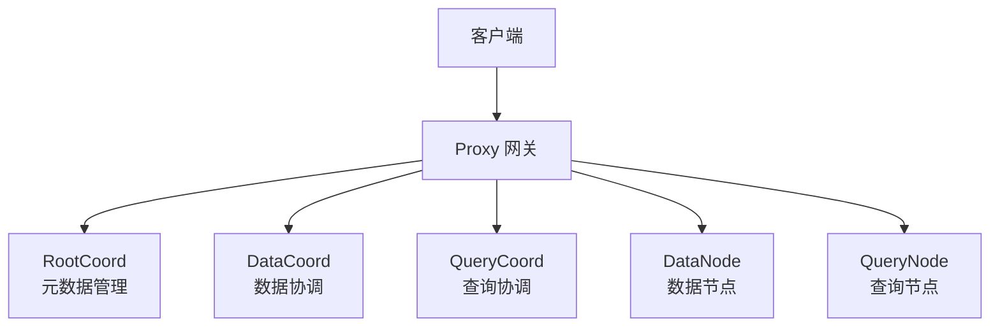
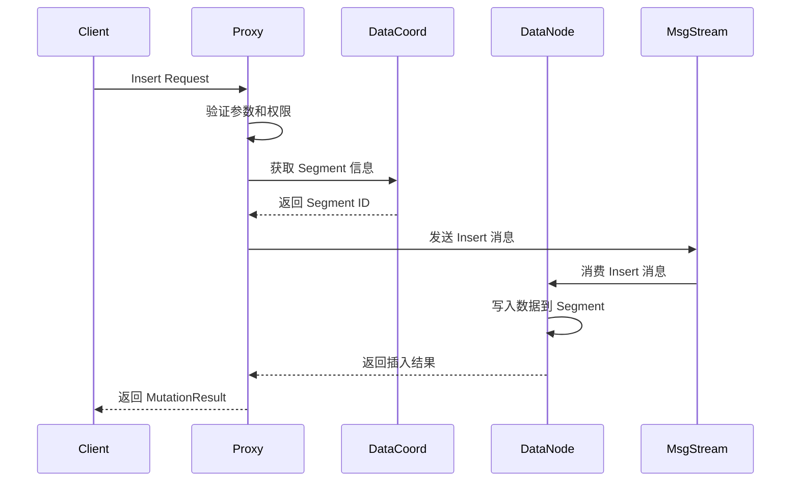
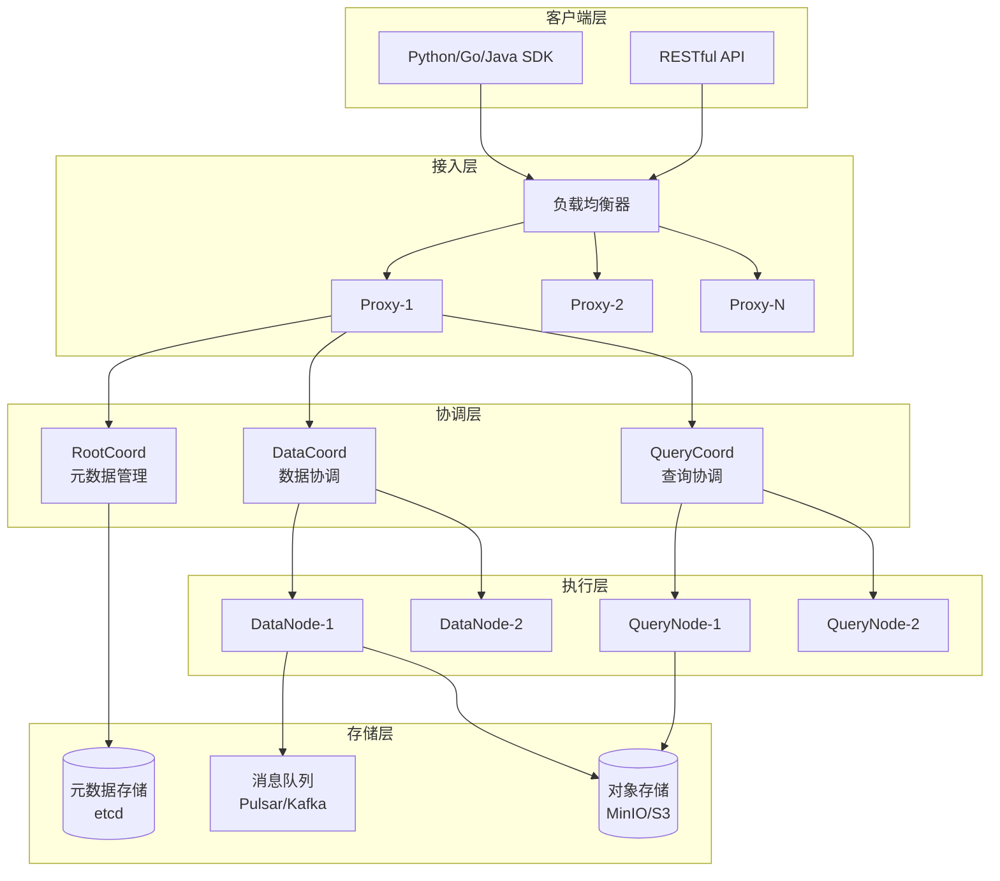
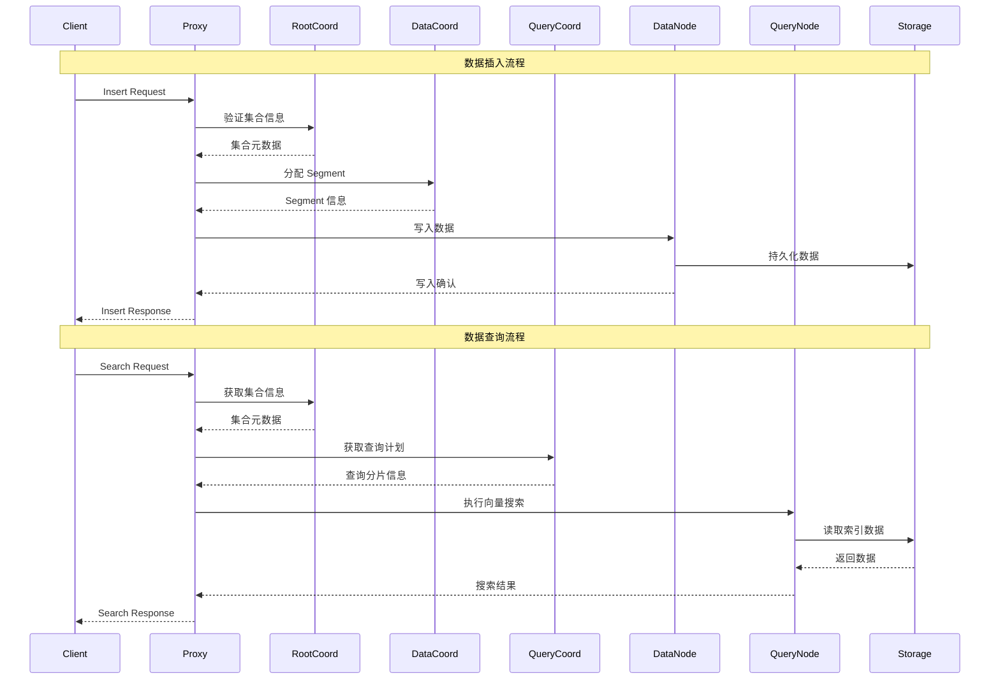
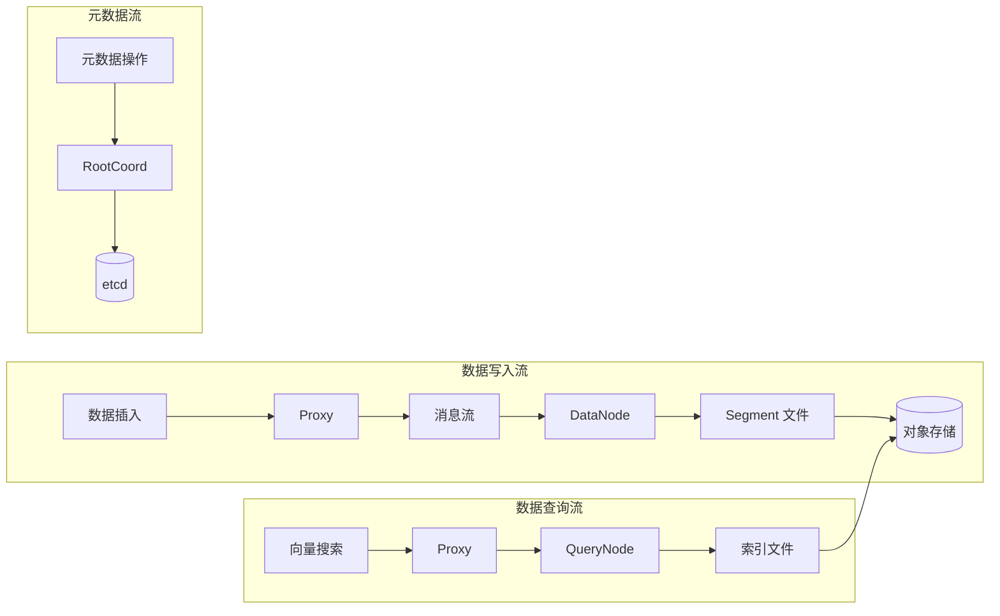
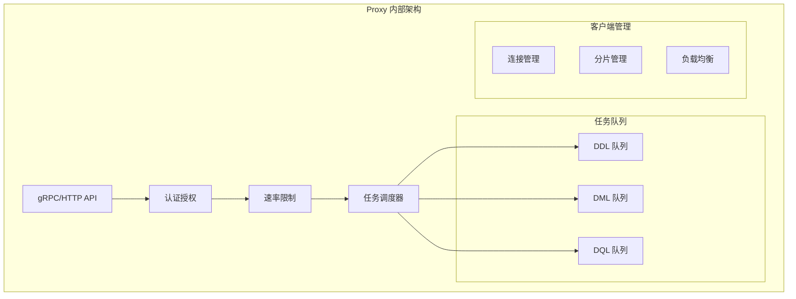
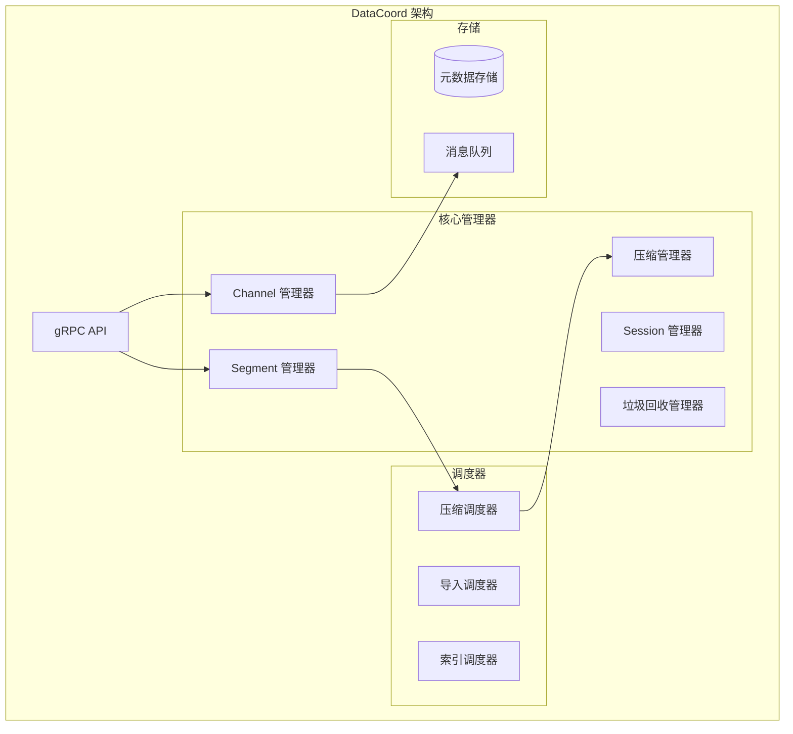
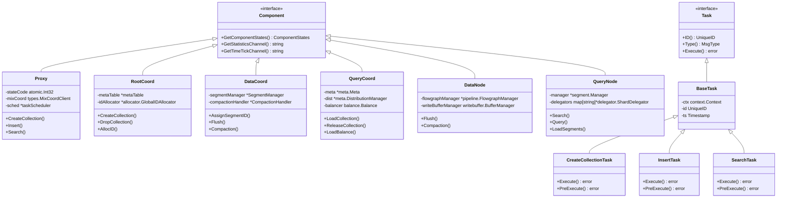

# Milvus 源码深度剖析

## 目录

1. [框架使用手册](#1-框架使用手册)
2. [对外 API 深入分析](#2-对外-api-深入分析)
3. [整体架构设计](#3-整体架构设计)
4. [核心模块分析](#4-核心模块分析)
5. [关键数据结构](#5-关键数据结构)
6. [实战经验总结](#6-实战经验总结)

---

## 1. 框架使用手册

### 1.1 Milvus 简介

Milvus 是一个开源的向量数据库，专为 AI 应用和向量相似度搜索而设计。它采用云原生架构，支持存储与计算分离，具备高性能、高可用性和水平扩展能力。

**核心特性：**
- 🚀 **高性能**：万亿级向量毫秒级搜索
- 🌐 **云原生**：存储计算分离，支持 Kubernetes
- 🔧 **多索引支持**：HNSW、IVF、FLAT、SCANN、DiskANN
- 🛡️ **高可用**：99.9% 可用性保证
- 📊 **多数据类型**：向量、标量、VARCHAR 支持
- 🔍 **混合搜索**：语义搜索 + 全文搜索

### 1.2 快速开始

#### 安装部署

```bash
# 使用 Docker Compose 部署
wget https://github.com/milvus-io/milvus/releases/download/v2.3.0/milvus-standalone-docker-compose.yml -O docker-compose.yml
docker-compose up -d

# 使用 Kubernetes Helm 部署
helm repo add milvus https://milvus-io.github.io/milvus-helm/
helm install my-release milvus/milvus
```

#### Python SDK 使用

```python
from pymilvus import MilvusClient

# 连接 Milvus
client = MilvusClient(
    uri="http://localhost:19530",
    token="username:password"  # 可选
)

# 创建集合
client.create_collection(
    collection_name="demo_collection",
    dimension=768,
    metric_type="IP",
    consistency_level="Strong"
)

# 插入数据
data = [
    {"id": 1, "vector": [0.1, 0.2, ...], "text": "sample text"},
    {"id": 2, "vector": [0.3, 0.4, ...], "text": "another text"}
]
client.insert(collection_name="demo_collection", data=data)

# 向量搜索
results = client.search(
    collection_name="demo_collection",
    data=[[0.1, 0.2, ...]],  # 查询向量
    limit=10,
    output_fields=["text"]
)
```

### 1.3 架构模式

Milvus 支持两种部署模式：

#### 单机模式 (Standalone)
- 所有组件运行在单个进程中
- 适合开发测试和小规模应用
- 资源需求较低

#### 集群模式 (Cluster)
- 微服务架构，组件独立部署
- 支持水平扩展和高可用
- 适合生产环境

---

## 2. 对外 API 深入分析

### 2.1 API 架构概览

Milvus 通过 Proxy 组件对外提供统一的 API 服务，支持 gRPC 和 RESTful 两种协议。



### 2.2 核心 API 接口分析

#### 2.2.1 集合管理 API

**CreateCollection - 创建集合**

```go
// 接口定义：internal/proxy/impl.go
func (node *Proxy) CreateCollection(ctx context.Context, request *milvuspb.CreateCollectionRequest) (*commonpb.Status, error) {
    // 1. 参数验证
    if err := merr.CheckHealthy(node.GetStateCode()); err != nil {
        return merr.Status(err), nil
    }
    
    // 2. 权限检查
    if err := node.checkAuth(ctx, request.GetDbName(), request.GetCollectionName(), commonpb.ObjectType_Collection, commonpb.ObjectPrivilege_PrivilegeCreateCollection); err != nil {
        return merr.Status(err), nil
    }
    
    // 3. 创建任务并调度
    cct := &createCollectionTask{
        baseTask: baseTask{
            ctx:  ctx,
            done: make(chan error, 1),
        },
        Condition: NewTaskCondition(ctx),
        CreateCollectionRequest: request,
        mixCoord: node.mixCoord,
    }
    
    // 4. 提交到任务调度器
    if err := node.sched.ddQueue.Enqueue(cct); err != nil {
        return merr.Status(err), nil
    }
    
    // 5. 等待任务完成
    if err := cct.WaitToFinish(); err != nil {
        return merr.Status(err), nil
    }
    
    return cct.result, nil
}
```

**关键调用链路：**
1. `Proxy.CreateCollection()` - API 入口
2. `createCollectionTask.Execute()` - 任务执行
3. `MixCoord.CreateCollection()` - 协调器处理
4. `RootCoord.CreateCollection()` - 元数据存储

#### 2.2.2 数据操作 API

**Insert - 数据插入**

```go
// 接口定义：internal/proxy/impl.go
func (node *Proxy) Insert(ctx context.Context, request *milvuspb.InsertRequest) (*milvuspb.MutationResult, error) {
    // 1. 健康检查
    if err := merr.CheckHealthy(node.GetStateCode()); err != nil {
        return &milvuspb.MutationResult{Status: merr.Status(err)}, nil
    }
    
    // 2. 速率限制检查
    if err := node.rateLimiter.Check(internalpb.RateType_DMLInsert, 1); err != nil {
        return &milvuspb.MutationResult{Status: merr.Status(err)}, nil
    }
    
    // 3. 创建插入任务
    it := &insertTask{
        baseTask: baseTask{
            ctx:  ctx,
            done: make(chan error, 1),
        },
        Condition: NewTaskCondition(ctx),
        insertMsg: &msgstream.InsertMsg{
            BaseMsg: msgstream.BaseMsg{
                Ctx: ctx,
            },
            InsertRequest: *request,
        },
    }
    
    // 4. 任务预处理
    if err := it.PreExecute(ctx); err != nil {
        return &milvuspb.MutationResult{Status: merr.Status(err)}, nil
    }
    
    // 5. 提交到 DML 队列
    if err := node.sched.dmlQueue.Enqueue(it); err != nil {
        return &milvuspb.MutationResult{Status: merr.Status(err)}, nil
    }
    
    // 6. 等待执行完成
    if err := it.WaitToFinish(); err != nil {
        return &milvuspb.MutationResult{Status: merr.Status(err)}, nil
    }
    
    return it.result, nil
}
```

**Insert 调用时序图：**



#### 2.2.3 查询搜索 API

**Search - 向量搜索**

```go
// 接口定义：internal/proxy/impl.go
func (node *Proxy) Search(ctx context.Context, request *milvuspb.SearchRequest) (*milvuspb.SearchResults, error) {
    // 1. 健康检查和权限验证
    if err := merr.CheckHealthy(node.GetStateCode()); err != nil {
        return &milvuspb.SearchResults{Status: merr.Status(err)}, nil
    }
    
    // 2. 速率限制
    if err := node.rateLimiter.Check(internalpb.RateType_DQLSearch, 1); err != nil {
        return &milvuspb.SearchResults{Status: merr.Status(err)}, nil
    }
    
    // 3. 创建搜索任务
    st := &searchTask{
        baseTask: baseTask{
            ctx:  ctx,
            done: make(chan error, 1),
        },
        Condition: NewTaskCondition(ctx),
        SearchRequest: request,
        queryCoord: node.queryCoord,
        queryNodes: node.queryNodes,
    }
    
    // 4. 任务预处理 - 解析查询参数
    if err := st.PreExecute(ctx); err != nil {
        return &milvuspb.SearchResults{Status: merr.Status(err)}, nil
    }
    
    // 5. 提交到查询队列
    if err := node.sched.dqQueue.Enqueue(st); err != nil {
        return &milvuspb.SearchResults{Status: merr.Status(err)}, nil
    }
    
    // 6. 等待搜索完成
    if err := st.WaitToFinish(); err != nil {
        return &milvuspb.SearchResults{Status: merr.Status(err)}, nil
    }
    
    return st.result, nil
}
```

**Search 执行流程：**

```go
// 搜索任务执行逻辑：internal/proxy/task_search.go
func (st *searchTask) Execute(ctx context.Context) error {
    // 1. 获取集合信息
    collInfo, err := st.getCollectionInfo(ctx)
    if err != nil {
        return err
    }
    
    // 2. 查询分片信息
    shards, err := st.getShards(ctx, collInfo.CollectionID)
    if err != nil {
        return err
    }
    
    // 3. 并行查询各个 QueryNode
    var wg sync.WaitGroup
    resultCh := make(chan *internalpb.SearchResults, len(shards))
    
    for _, shard := range shards {
        wg.Add(1)
        go func(s *shardInfo) {
            defer wg.Done()
            // 调用 QueryNode 执行搜索
            result, err := st.queryNode.Search(ctx, &internalpb.SearchRequest{
                Base: commonpbutil.NewMsgBase(),
                ReqID: st.ReqID,
                DbID: collInfo.DbID,
                CollectionID: collInfo.CollectionID,
                PartitionIDs: st.PartitionIDs,
                Dsl: st.Dsl,
                PlaceholderGroup: st.PlaceholderGroup,
                DslType: st.DslType,
                SerializedExprPlan: st.serializedExprPlan,
                OutputFieldsId: st.OutputFieldsId,
                TravelTimestamp: st.TravelTimestamp,
                GuaranteeTimestamp: st.GuaranteeTimestamp,
            })
            if err == nil {
                resultCh <- result
            }
        }(shard)
    }
    
    // 4. 等待所有查询完成
    wg.Wait()
    close(resultCh)
    
    // 5. 合并查询结果
    var results []*internalpb.SearchResults
    for result := range resultCh {
        results = append(results, result)
    }
    
    // 6. 结果聚合和排序
    st.result = st.reduceSearchResults(results)
    return nil
}
```

### 2.3 API 拦截器机制

Milvus 使用拦截器模式实现横切关注点：

```go
// 数据库拦截器：internal/proxy/database_interceptor.go
func DatabaseInterceptor() grpc.UnaryServerInterceptor {
    return func(ctx context.Context, req any, info *grpc.UnaryServerInfo, handler grpc.UnaryHandler) (resp interface{}, err error) {
        filledCtx, filledReq := fillDatabase(ctx, req)
        return handler(filledCtx, filledReq)
    }
}

// 认证拦截器：internal/proxy/authentication_interceptor.go
func AuthenticationInterceptor() grpc.UnaryServerInterceptor {
    return func(ctx context.Context, req interface{}, info *grpc.UnaryServerInfo, handler grpc.UnaryHandler) (interface{}, error) {
        // 验证用户身份
        if err := validateAuth(ctx, req); err != nil {
            return nil, err
        }
        return handler(ctx, req)
    }
}

// 速率限制拦截器：internal/proxy/rate_limit_interceptor.go
func RateLimitInterceptor() grpc.UnaryServerInterceptor {
    return func(ctx context.Context, req interface{}, info *grpc.UnaryServerInfo, handler grpc.UnaryHandler) (interface{}, error) {
        // 检查速率限制
        if err := checkRateLimit(ctx, req); err != nil {
            return nil, err
        }
        return handler(ctx, req)
    }
}
```

---

## 3. 整体架构设计

### 3.1 系统架构图



### 3.2 核心组件交互时序图



### 3.3 数据流架构



---

## 4. 核心模块分析

### 4.1 Proxy 模块 - API 网关

#### 4.1.1 模块架构



#### 4.1.2 核心数据结构

```go
// Proxy 主结构：internal/proxy/proxy.go
type Proxy struct {
    milvuspb.UnimplementedMilvusServiceServer
    
    ctx    context.Context
    cancel context.CancelFunc
    wg     sync.WaitGroup
    
    // 基础配置
    initParams *internalpb.InitParams
    ip         string
    port       int
    stateCode  atomic.Int32
    address    string
    
    // 协调器客户端
    mixCoord types.MixCoordClient
    
    // 限流器
    simpleLimiter *SimpleLimiter
    
    // 通道管理器
    chMgr channelsMgr
    
    // 任务调度器
    sched *taskScheduler
    
    // ID 和时间戳分配器
    rowIDAllocator *allocator.IDAllocator
    tsoAllocator   *timestampAllocator
    
    // 指标缓存管理器
    metricsCacheManager *metricsinfo.MetricsCacheManager
    
    // 会话和分片管理
    session  *sessionutil.Session
    shardMgr shardClientMgr
    
    // 搜索结果通道
    searchResultCh chan *internalpb.SearchResults
    
    // 回调函数
    startCallbacks []func()
    closeCallbacks []func()
    
    // 负载均衡策略
    lbPolicy LBPolicy
    
    // 资源管理器
    resourceManager resource.Manager
    
    // 功能开关
    enableMaterializedView   bool
    enableComplexDeleteLimit bool
    
    // 慢查询缓存
    slowQueries *expirable.LRU[Timestamp, *metricsinfo.SlowQuery]
}
```

#### 4.1.3 任务调度机制

```go
// 任务调度器：internal/proxy/task_scheduler.go
type taskScheduler struct {
    ddQueue  *BaseTaskQueue  // DDL 任务队列
    dmlQueue *BaseTaskQueue  // DML 任务队列  
    dqQueue  *BaseTaskQueue  // DQL 任务队列
    
    wg     sync.WaitGroup
    ctx    context.Context
    cancel context.CancelFunc
}

// 基础任务接口
type task interface {
    TraceCtx() context.Context
    ID() UniqueID
    SetID(uid UniqueID)
    Name() string
    Type() commonpb.MsgType
    BeginTs() Timestamp
    EndTs() Timestamp
    SetTs(ts Timestamp)
    OnEnqueue() error
    PreExecute(ctx context.Context) error
    Execute(ctx context.Context) error
    PostExecute(ctx context.Context) error
    WaitToFinish() error
    Notify(err error)
}

// 任务队列处理逻辑
func (queue *BaseTaskQueue) processTask(t task) {
    // 1. 任务预处理
    if err := t.PreExecute(queue.ctx); err != nil {
        t.Notify(err)
        return
    }
    
    // 2. 执行任务
    if err := t.Execute(queue.ctx); err != nil {
        t.Notify(err)
        return
    }
    
    // 3. 任务后处理
    if err := t.PostExecute(queue.ctx); err != nil {
        t.Notify(err)
        return
    }
    
    // 4. 通知任务完成
    t.Notify(nil)
}
```

### 4.2 RootCoord 模块 - 元数据管理

#### 4.2.1 模块职责

RootCoord 是 Milvus 的元数据管理中心，负责：
- 集合和分区的元数据管理
- Schema 定义和版本控制
- 全局 ID 分配
- 时间戳分配
- 数据定义语言 (DDL) 操作协调

#### 4.2.2 核心数据结构

```go
// RootCoord 主结构：internal/rootcoord/root_coord.go
type Core struct {
    ctx    context.Context
    cancel context.CancelFunc
    wg     sync.WaitGroup
    
    // 基础信息
    etcdCli   *clientv3.Client
    address   string
    port      int
    stateCode atomic.Int32
    
    // 元数据存储
    metaTable  *metaTable
    scheduler  *taskScheduler
    
    // ID 分配器
    idAllocator       *allocator.GlobalIDAllocator
    tsoAllocator      *tso.GlobalTSOAllocator
    
    // 代理管理
    proxyClientManager *proxyClientManager
    proxyWatcher       *proxyWatcher
    
    // 导入管理
    importManager *importManager
    
    // 配额管理
    quotaCenter *QuotaCenter
    
    // 会话
    session *sessionutil.Session
    
    // 工厂
    factory dependency.Factory
}

// 元数据表：internal/rootcoord/meta_table.go
type metaTable struct {
    ctx    context.Context
    catalog metastore.RootCoordCatalog
    
    // 集合信息缓存
    collID2Meta  map[typeutil.UniqueID]*model.Collection
    collName2ID  map[string]typeutil.UniqueID
    collAlias2ID map[string]typeutil.UniqueID
    
    // 分区信息缓存
    partID2Meta map[typeutil.UniqueID]*model.Partition
    
    // 数据库信息
    dbName2ID map[string]typeutil.UniqueID
    dbID2Meta map[typeutil.UniqueID]*model.Database
    
    // 读写锁
    ddLock sync.RWMutex
}
```

#### 4.2.3 集合创建流程

```go
// 创建集合任务：internal/rootcoord/create_collection_task.go
type createCollectionTask struct {
    baseTask
    Req *milvuspb.CreateCollectionRequest
    
    // 内部状态
    collectionID   typeutil.UniqueID
    partitionID    typeutil.UniqueID
    schema         *schemapb.CollectionSchema
    virtualChannels []string
    physicalChannels []string
}

func (t *createCollectionTask) Execute(ctx context.Context) error {
    // 1. 分配集合 ID
    collectionID, err := t.core.idAllocator.AllocOne()
    if err != nil {
        return err
    }
    t.collectionID = collectionID
    
    // 2. 分配分区 ID
    partitionID, err := t.core.idAllocator.AllocOne()
    if err != nil {
        return err
    }
    t.partitionID = partitionID
    
    // 3. 验证和处理 Schema
    if err := t.validateSchema(); err != nil {
        return err
    }
    
    // 4. 分配虚拟通道
    t.virtualChannels = t.core.chanTimeTick.getDmlChannelNames(t.Req.ShardsNum)
    
    // 5. 创建集合元数据
    collection := &model.Collection{
        CollectionID:         t.collectionID,
        Name:                t.Req.CollectionName,
        Description:         t.Req.Description,
        AutoID:              t.schema.AutoID,
        Fields:              model.UnmarshalFieldModels(t.schema.Fields),
        VirtualChannelNames: t.virtualChannels,
        PhysicalChannelNames: t.physicalChannels,
        ShardsNum:           t.Req.ShardsNum,
        ConsistencyLevel:    t.Req.ConsistencyLevel,
        CreateTime:          t.GetTs(),
        State:               pb.CollectionState_CollectionCreating,
        StartPositions:      t.startPositions,
    }
    
    // 6. 持久化到元数据存储
    if err := t.core.meta.AddCollection(ctx, collection); err != nil {
        return err
    }
    
    // 7. 通知 DataCoord 创建集合
    if err := t.core.broker.CreateCollection(ctx, collection); err != nil {
        return err
    }
    
    return nil
}
```

### 4.3 DataCoord 模块 - 数据协调

#### 4.3.1 模块架构



#### 4.3.2 Segment 管理

```go
// Segment 管理器：internal/datacoord/segment_manager.go
type SegmentManager struct {
    meta      *meta
    allocator allocator.Allocator
    
    // Segment 分配策略
    segmentSealPolicy   []segmentSealPolicy
    channelSealPolicies map[string][]segmentSealPolicy
    
    // 统计信息
    estimatePolicy ChannelSegmentPolicy
    allocPolicy    ChannelSegmentPolicy
    
    // 并发控制
    mu sync.RWMutex
}

// Segment 信息结构
type SegmentInfo struct {
    SegmentInfo *datapb.SegmentInfo
    currRows    int64
    allocations []*allocation
    lastFlushTs typeutil.Timestamp
    
    // 状态管理
    isCompacting bool
    size         int64
    lastExpireTime typeutil.Timestamp
}

// Segment 分配逻辑
func (s *SegmentManager) AllocSegment(ctx context.Context, collectionID, partitionID typeutil.UniqueID, channelName string, requestRows int64) (*SegmentInfo, error) {
    // 1. 查找可用的 Growing Segment
    segment := s.getGrowingSegment(collectionID, partitionID, channelName)
    
    // 2. 如果没有可用 Segment，创建新的
    if segment == nil {
        segmentID, err := s.allocator.AllocOne()
        if err != nil {
            return nil, err
        }
        
        segment = &SegmentInfo{
            SegmentInfo: &datapb.SegmentInfo{
                ID:            segmentID,
                CollectionID:  collectionID,
                PartitionID:   partitionID,
                InsertChannel: channelName,
                State:         commonpb.SegmentState_Growing,
                MaxRowNum:     Params.DataCoordCfg.SegmentMaxSize.GetAsInt64(),
                CreatedByNode: Params.DataCoordCfg.GetNodeID(),
            },
        }
        
        // 3. 注册到元数据
        if err := s.meta.AddSegment(ctx, segment); err != nil {
            return nil, err
        }
    }
    
    // 4. 分配行数
    segment.currRows += requestRows
    
    // 5. 检查是否需要 Seal
    if s.shouldSealSegment(segment) {
        s.sealSegment(ctx, segment)
    }
    
    return segment, nil
}
```

#### 4.3.3 压缩机制

```go
// 压缩管理器：internal/datacoord/compaction_manager.go
type CompactionManager struct {
    meta      *meta
    sessions  *SessionManager
    allocator allocator.Allocator
    
    // 压缩任务队列
    compactionHandler map[int64]*compactionPlanHandler
    
    // 压缩策略
    levelZeroCompactionPolicy CompactionPolicy
    mixCompactionPolicy       CompactionPolicy
    
    mu sync.RWMutex
}

// 压缩任务
type compactionTask struct {
    triggerID     int64
    planID        int64
    dataNodeID    int64
    plan          *datapb.CompactionPlan
    state         datapb.CompactionTaskState
    
    startTime time.Time
    endTime   time.Time
}

// 触发压缩逻辑
func (cm *CompactionManager) TriggerCompaction(collectionID int64) error {
    // 1. 获取集合的所有 Segment
    segments := cm.meta.GetSegmentsByCollection(collectionID)
    
    // 2. 按压缩策略分组
    groups := cm.groupSegmentsForCompaction(segments)
    
    // 3. 为每组创建压缩计划
    for _, group := range groups {
        plan := &datapb.CompactionPlan{
            PlanID:        cm.allocator.AllocOne(),
            Type:          datapb.CompactionType_MixCompaction,
            SegmentBinlogs: group.segments,
            TimeoutInSeconds: 3600,
            Collection:    collectionID,
            Channel:       group.channel,
        }
        
        // 4. 分配 DataNode 执行压缩
        nodeID := cm.selectDataNode(group.channel)
        if err := cm.sessions.Compaction(nodeID, plan); err != nil {
            return err
        }
        
        // 5. 记录压缩任务
        cm.addCompactionTask(plan.PlanID, nodeID, plan)
    }
    
    return nil
}
```

### 4.4 QueryCoord 模块 - 查询协调

#### 4.4.1 模块职责

QueryCoord 负责查询相关的协调工作：
- 管理 QueryNode 集群
- 负载均衡和分片分配
- 查询任务调度
- 副本管理

#### 4.4.2 核心架构

```go
// QueryCoord 主结构：internal/querycoordv2/server.go
type Server struct {
    ctx    context.Context
    cancel context.CancelFunc
    wg     sync.WaitGroup
    
    // 基础信息
    etcdCli *clientv3.Client
    address string
    port    int
    
    // 核心管理器
    meta         *meta.Meta
    dist         *meta.DistributionManager
    targetMgr    *meta.TargetManager
    broker       meta.Broker
    
    // 调度器
    jobScheduler  *job.Scheduler
    taskScheduler *task.Scheduler
    
    // 观察者
    nodeMgr     *session.NodeManager
    observers   []observers.Observer
    
    // 检查器
    checkerController *checkers.CheckerController
    
    // 负载均衡器
    balancer balance.Balance
    
    // 会话
    session *sessionutil.Session
}

// 分布式管理器：internal/querycoordv2/meta/dist_manager.go
type DistributionManager struct {
    // Segment 分布
    segmentDist map[int64]*meta.Segment  // nodeID -> segments
    channelDist map[int64]*meta.DmChannel // nodeID -> channels
    leaderView  map[int64]*meta.LeaderView // nodeID -> leader view
    
    // 读写锁
    rwmutex sync.RWMutex
}
```

#### 4.4.3 负载均衡机制

```go
// 负载均衡器：internal/querycoordv2/balance/balance.go
type Balance interface {
    AssignSegment(collectionID int64, segments []*meta.Segment, nodes []int64) []SegmentAssignPlan
    BalanceReplica(replica *meta.Replica) ([]SegmentAssignPlan, []ChannelAssignPlan)
}

// 轮询负载均衡器
type RoundRobinBalancer struct {
    scheduler task.Scheduler
    meta      *meta.Meta
    dist      *meta.DistributionManager
}

func (b *RoundRobinBalancer) AssignSegment(collectionID int64, segments []*meta.Segment, nodes []int64) []SegmentAssignPlan {
    plans := make([]SegmentAssignPlan, 0, len(segments))
    
    // 1. 获取节点负载信息
    nodeLoads := make(map[int64]int64)
    for _, nodeID := range nodes {
        nodeLoads[nodeID] = b.getNodeLoad(nodeID)
    }
    
    // 2. 按负载排序节点
    sort.Slice(nodes, func(i, j int) bool {
        return nodeLoads[nodes[i]] < nodeLoads[nodes[j]]
    })
    
    // 3. 轮询分配 Segment
    nodeIndex := 0
    for _, segment := range segments {
        targetNode := nodes[nodeIndex]
        plans = append(plans, SegmentAssignPlan{
            Segment: segment,
            From:    -1,
            To:      targetNode,
        })
        
        nodeIndex = (nodeIndex + 1) % len(nodes)
        nodeLoads[targetNode]++
    }
    
    return plans
}
```

### 4.5 DataNode 模块 - 数据节点

#### 4.5.1 数据写入流水线

```go
// 数据节点：internal/datanode/data_node.go
type DataNode struct {
    ctx    context.Context
    cancel context.CancelFunc
    
    // 基础信息
    Role       string
    NodeID     typeutil.UniqueID
    address    string
    port       int
    stateCode  atomic.Int32
    
    // 流水线管理
    flowgraphManager *pipeline.FlowgraphManager
    
    // 写缓冲区管理
    writeBufferManager writebuffer.BufferManager
    
    // 同步管理器
    syncMgr syncmgr.SyncManager
    
    // 压缩器
    compactionExecutor *compactor.Executor
    
    // 会话
    session *sessionutil.Session
}

// 数据写入流水线：internal/datanode/pipeline/flow_graph.go
type DataSyncService struct {
    ctx    context.Context
    cancel context.CancelFunc
    
    // 流图节点
    dmStreamNode   *DmInputNode
    insertBufferNode *InsertBufferNode
    deleteBufferNode *DeleteBufferNode
    ttNode         *TimeTickNode
    
    // 通道信息
    vchannelName   string
    metacache      metacache.MetaCache
    
    // 写缓冲区
    writeBuffer    writebuffer.WriteBuffer
    
    // 同步器
    syncMgr        syncmgr.SyncManager
}

// 插入缓冲节点处理逻辑
func (ibn *InsertBufferNode) Operate(in []Msg) []Msg {
    // 1. 解析插入消息
    insertMsgs := ibn.parseInsertMsgs(in)
    
    // 2. 写入缓冲区
    for _, msg := range insertMsgs {
        // 分配 Segment
        segmentID := ibn.allocateSegment(msg.CollectionID, msg.PartitionID)
        
        // 写入数据到缓冲区
        ibn.writeBuffer.BufferData(segmentID, msg.RowData)
        
        // 检查是否需要刷盘
        if ibn.shouldFlush(segmentID) {
            ibn.triggerFlush(segmentID)
        }
    }
    
    return in
}
```

#### 4.5.2 数据刷盘机制

```go
// 同步管理器：internal/datanode/syncmgr/sync_manager.go
type SyncManager interface {
    SyncData(ctx context.Context, task SyncTask) *SyncTask
}

type syncManager struct {
    // 任务队列
    tasks chan SyncTask
    
    // 工作协程池
    workers []Worker
    
    // 元数据缓存
    metacache metacache.MetaCache
    
    // 分配器
    allocator allocator.Allocator
    
    // 存储客户端
    chunkManager storage.ChunkManager
}

// 同步任务
type SyncTask struct {
    segmentID    int64
    collectionID int64
    partitionID  int64
    channelName  string
    
    // 数据
    insertData   *storage.InsertData
    deleteData   *storage.DeleteData
    
    // 时间戳
    startPosition *msgpb.MsgPosition
    endPosition   *msgpb.MsgPosition
    
    // 回调
    done chan error
}

// 执行同步任务
func (sm *syncManager) sync(task *SyncTask) error {
    // 1. 序列化数据
    insertLogs, statsLogs, err := sm.serializeInsertData(task.insertData)
    if err != nil {
        return err
    }
    
    deleteLogs, err := sm.serializeDeleteData(task.deleteData)
    if err != nil {
        return err
    }
    
    // 2. 上传到对象存储
    insertPaths := make([]string, len(insertLogs))
    for i, log := range insertLogs {
        path := sm.generateInsertLogPath(task.segmentID, log.FieldID)
        if err := sm.chunkManager.Write(path, log.Data); err != nil {
            return err
        }
        insertPaths[i] = path
    }
    
    // 3. 更新元数据
    segmentInfo := &datapb.SegmentInfo{
        ID:           task.segmentID,
        CollectionID: task.collectionID,
        PartitionID:  task.partitionID,
        InsertChannel: task.channelName,
        NumOfRows:    task.insertData.GetRowNum(),
        Binlogs:      insertPaths,
        Deltalogs:    deletePaths,
        Statslogs:    statsLogs,
        StartPosition: task.startPosition,
        DmlPosition:   task.endPosition,
    }
    
    // 4. 通知 DataCoord
    if err := sm.reportSegment(segmentInfo); err != nil {
        return err
    }
    
    return nil
}
```

### 4.6 QueryNode 模块 - 查询节点

#### 4.6.1 查询执行引擎

```go
// 查询节点：internal/querynodev2/server.go
type QueryNode struct {
    ctx    context.Context
    cancel context.CancelFunc
    
    // 基础信息
    address   string
    port      int
    nodeID    typeutil.UniqueID
    stateCode atomic.Int32
    
    // 核心管理器
    manager      *segment.Manager
    delegators   map[string]*delegator.ShardDelegator
    
    // 查询执行器
    scheduler    *task.Scheduler
    
    // 本地工作器
    workers      *LocalWorker
    
    // 会话
    session      *sessionutil.Session
}

// Segment 管理器：internal/querynodev2/segments/manager.go
type Manager struct {
    // Segment 存储
    growing map[int64]Segment  // segmentID -> growing segment
    sealed  map[int64]Segment  // segmentID -> sealed segment
    
    // 集合信息
    collection *Collection
    
    // 加载器
    loader *Loader
    
    // 读写锁
    mu sync.RWMutex
}

// 查询执行逻辑
func (qn *QueryNode) Search(ctx context.Context, req *querypb.SearchRequest) (*internalpb.SearchResults, error) {
    // 1. 获取分片委托器
    delegator := qn.delegators[req.GetDmlChannels()[0]]
    if delegator == nil {
        return nil, errors.New("delegator not found")
    }
    
    // 2. 创建搜索任务
    searchTask := &searchTask{
        req:       req,
        delegator: delegator,
        result:    make(chan *internalpb.SearchResults, 1),
    }
    
    // 3. 提交任务到调度器
    if err := qn.scheduler.Add(searchTask); err != nil {
        return nil, err
    }
    
    // 4. 等待结果
    select {
    case result := <-searchTask.result:
        return result, nil
    case <-ctx.Done():
        return nil, ctx.Err()
    }
}

// 分片委托器执行搜索
func (sd *ShardDelegator) Search(ctx context.Context, req *querypb.SearchRequest) (*internalpb.SearchResults, error) {
    // 1. 获取搜索 Segment 列表
    sealedSegments := sd.getSearchableSegments(req.GetReq().GetCollectionID())
    growingSegments := sd.getGrowingSegments(req.GetReq().GetCollectionID())
    
    // 2. 并行搜索 Sealed Segment
    var wg sync.WaitGroup
    sealedResults := make([]*internalpb.SearchResults, len(sealedSegments))
    
    for i, segment := range sealedSegments {
        wg.Add(1)
        go func(idx int, seg Segment) {
            defer wg.Done()
            result, err := seg.Search(ctx, req)
            if err == nil {
                sealedResults[idx] = result
            }
        }(i, segment)
    }
    
    // 3. 搜索 Growing Segment
    growingResults := make([]*internalpb.SearchResults, len(growingSegments))
    for i, segment := range growingSegments {
        result, err := segment.Search(ctx, req)
        if err == nil {
            growingResults[i] = result
        }
    }
    
    // 4. 等待所有搜索完成
    wg.Wait()
    
    // 5. 合并搜索结果
    allResults := append(sealedResults, growingResults...)
    finalResult := sd.reduceSearchResults(allResults, req.GetReq().GetTopk())
    
    return finalResult, nil
}
```

---

## 5. 关键数据结构

### 5.1 核心数据模型

#### 5.1.1 集合 (Collection) 模型

```go
// 集合模型：internal/metastore/model/collection.go
type Collection struct {
    CollectionID         int64                 `json:"collectionID"`
    Name                string                `json:"name"`
    Description         string                `json:"description"`
    AutoID              bool                  `json:"autoID"`
    Fields              []*Field              `json:"fields"`
    VirtualChannelNames []string              `json:"virtualChannelNames"`
    PhysicalChannelNames []string             `json:"physicalChannelNames"`
    ShardsNum           int32                 `json:"shardsNum"`
    ConsistencyLevel    commonpb.ConsistencyLevel `json:"consistencyLevel"`
    CreateTime          uint64                `json:"createTime"`
    StartPositions      []*commonpb.KeyDataPair `json:"startPositions"`
    Properties          map[string]string     `json:"properties"`
    State               pb.CollectionState    `json:"state"`
    Partitions          []*Partition          `json:"partitions"`
}

// 字段模型
type Field struct {
    FieldID      int64                `json:"fieldID"`
    Name         string               `json:"name"`
    IsPrimaryKey bool                 `json:"isPrimaryKey"`
    Description  string               `json:"description"`
    DataType     schemapb.DataType    `json:"dataType"`
    TypeParams   map[string]string    `json:"typeParams"`
    IndexParams  map[string]string    `json:"indexParams"`
    AutoID       bool                 `json:"autoID"`
}
```

#### 5.1.2 Segment 数据结构

```go
// Segment 信息：pkg/proto/datapb/data_coord.proto
type SegmentInfo struct {
    ID                int64                    `protobuf:"varint,1,opt,name=ID,proto3" json:"ID,omitempty"`
    CollectionID      int64                    `protobuf:"varint,2,opt,name=collectionID,proto3" json:"collectionID,omitempty"`
    PartitionID       int64                    `protobuf:"varint,3,opt,name=partitionID,proto3" json:"partitionID,omitempty"`
    InsertChannel     string                   `protobuf:"bytes,4,opt,name=insert_channel,json=insertChannel,proto3" json:"insert_channel,omitempty"`
    NumOfRows         int64                    `protobuf:"varint,5,opt,name=num_of_rows,json=numOfRows,proto3" json:"num_of_rows,omitempty"`
    State             commonpb.SegmentState    `protobuf:"varint,6,opt,name=state,proto3,enum=milvus.proto.common.SegmentState" json:"state,omitempty"`
    MaxRowNum         int64                    `protobuf:"varint,7,opt,name=max_row_num,json=maxRowNum,proto3" json:"max_row_num,omitempty"`
    LastExpireTime    uint64                   `protobuf:"varint,8,opt,name=last_expire_time,json=lastExpireTime,proto3" json:"last_expire_time,omitempty"`
    StartPosition     *msgpb.MsgPosition       `protobuf:"bytes,9,opt,name=start_position,json=startPosition,proto3" json:"start_position,omitempty"`
    DmlPosition       *msgpb.MsgPosition       `protobuf:"bytes,10,opt,name=dml_position,json=dmlPosition,proto3" json:"dml_position,omitempty"`
    Binlogs           []*FieldBinlog           `protobuf:"bytes,11,rep,name=binlogs,proto3" json:"binlogs,omitempty"`
    Statslogs         []*FieldBinlog           `protobuf:"bytes,12,rep,name=statslogs,proto3" json:"statslogs,omitempty"`
    Deltalogs         []*FieldBinlog           `protobuf:"bytes,13,rep,name=deltalogs,proto3" json:"deltalogs,omitempty"`
    CreatedByNode     int64                    `protobuf:"varint,14,opt,name=created_by_node,json=createdByNode,proto3" json:"created_by_node,omitempty"`
    SegmentSize       int64                    `protobuf:"varint,15,opt,name=segment_size,json=segmentSize,proto3" json:"segment_size,omitempty"`
    IndexInfos        []*SegmentIndexInfo      `protobuf:"bytes,16,rep,name=index_infos,json=indexInfos,proto3" json:"index_infos,omitempty"`
}

// Segment 状态枚举
type SegmentState int32
const (
    SegmentState_SegmentStateNone SegmentState = 0
    SegmentState_NotExist         SegmentState = 1
    SegmentState_Growing          SegmentState = 2
    SegmentState_Sealed           SegmentState = 3
    SegmentState_Flushed          SegmentState = 4
    SegmentState_Flushing         SegmentState = 5
    SegmentState_Dropped          SegmentState = 6
    SegmentState_Importing        SegmentState = 7
)
```

#### 5.1.3 索引数据结构

```go
// 索引信息：pkg/proto/indexpb/index_coord.proto
type IndexInfo struct {
    CollectionID    int64             `protobuf:"varint,1,opt,name=collectionID,proto3" json:"collectionID,omitempty"`
    FieldID         int64             `protobuf:"varint,2,opt,name=fieldID,proto3" json:"fieldID,omitempty"`
    IndexName       string            `protobuf:"bytes,3,opt,name=index_name,json=indexName,proto3" json:"index_name,omitempty"`
    IndexID         int64             `protobuf:"varint,4,opt,name=indexID,proto3" json:"indexID,omitempty"`
    TypeParams      []*commonpb.KeyValuePair `protobuf:"bytes,5,rep,name=type_params,json=typeParams,proto3" json:"type_params,omitempty"`
    IndexParams     []*commonpb.KeyValuePair `protobuf:"bytes,6,rep,name=index_params,json=indexParams,proto3" json:"index_params,omitempty"`
    IndexedRows     int64             `protobuf:"varint,7,opt,name=indexed_rows,json=indexedRows,proto3" json:"indexed_rows,omitempty"`
    TotalRows       int64             `protobuf:"varint,8,opt,name=total_rows,json=totalRows,proto3" json:"total_rows,omitempty"`
    State           commonpb.IndexState `protobuf:"varint,9,opt,name=state,proto3,enum=milvus.proto.common.IndexState" json:"state,omitempty"`
    IndexStateFailReason string       `protobuf:"bytes,10,opt,name=index_state_fail_reason,json=indexStateFailReason,proto3" json:"index_state_fail_reason,omitempty"`
    IsAutoIndex     bool              `protobuf:"varint,11,opt,name=is_auto_index,json=isAutoIndex,proto3" json:"is_auto_index,omitempty"`
    UserIndexParams []*commonpb.KeyValuePair `protobuf:"bytes,12,rep,name=user_index_params,json=userIndexParams,proto3" json:"user_index_params,omitempty"`
}
```

### 5.2 消息系统数据结构

#### 5.2.1 消息基础结构

```go
// 消息基础接口：pkg/mq/msgstream/msg.go
type TsMsg interface {
    TraceCtx() context.Context
    SetTraceCtx(ctx context.Context)
    ID() UniqueID
    BeginTs() Timestamp
    EndTs() Timestamp
    Type() MsgType
    SourceID() int64
    HashKeys() []uint32
    Marshal(TsMsg) (MarshalType, error)
    Unmarshal(MarshalType) (TsMsg, error)
    Position() *MsgPosition
    SetPosition(*MsgPosition)
    Size() int
}

// 插入消息
type InsertMsg struct {
    BaseMsg
    InsertRequest milvuspb.InsertRequest
    
    // 内部字段
    HashValues  []uint32
    Timestamps  []uint64
    RowIDs      []int64
    RowData     []*commonpb.Blob
}

// 删除消息
type DeleteMsg struct {
    BaseMsg
    DeleteRequest milvuspb.DeleteRequest
    
    // 内部字段
    HashValues []uint32
    Timestamps []uint64
    PrimaryKeys *schemapb.IDs
}

// 搜索消息
type SearchMsg struct {
    BaseMsg
    SearchRequest milvuspb.SearchRequest
    
    // 查询计划
    PlaceholderGroup []byte
    DslType         commonpb.DslType
    SerializedExprPlan []byte
}
```

### 5.3 存储数据结构

#### 5.3.1 Binlog 格式

```go
// Binlog 事件：internal/storage/event.go
type Event interface {
    EventType() EventTypeCode
    Timestamp() Timestamp
}

// 插入事件数据
type InsertEventData struct {
    StartTimestamp Timestamp
    EndTimestamp   Timestamp
    
    // 数据字段
    Data map[FieldID]FieldData
}

// 删除事件数据  
type DeleteEventData struct {
    StartTimestamp Timestamp
    EndTimestamp   Timestamp
    
    // 删除的主键
    Pks         *schemapb.IDs
    Tss         []Timestamp
}

// 字段数据接口
type FieldData interface {
    GetMemorySize() int
    RowNum() int
    GetNullMask() []bool
    AppendRow(interface{}) error
    GetRow(int) interface{}
}
```

### 5.4 类继承关系图



---

## 6. 实战经验总结

### 6.1 性能优化最佳实践

#### 6.1.1 索引选择策略

**HNSW 索引 - 高精度场景**
```yaml
index_params:
  index_type: "HNSW"
  metric_type: "L2"
  params:
    M: 16              # 连接数，影响精度和内存
    efConstruction: 200 # 构建时搜索深度
    ef: 64             # 查询时搜索深度
```

**IVF 索引 - 平衡性能**
```yaml
index_params:
  index_type: "IVF_FLAT"
  metric_type: "IP"
  params:
    nlist: 1024        # 聚类中心数量
    nprobe: 16         # 查询时探测的聚类数
```

**DiskANN 索引 - 大规模数据**
```yaml
index_params:
  index_type: "DISKANN"
  metric_type: "L2"
  params:
    max_degree: 56     # 图的最大度数
    search_list_size: 100 # 搜索列表大小
```

#### 6.1.2 集合设计原则

**分片策略**
```python
# 根据数据量和查询 QPS 确定分片数
def calculate_shard_num(data_size_gb, qps):
    # 每个分片建议处理 1-10GB 数据
    shard_by_size = max(1, data_size_gb // 5)
    
    # 每个分片建议处理 100-1000 QPS
    shard_by_qps = max(1, qps // 500)
    
    return min(16, max(shard_by_size, shard_by_qps))

# 创建集合时指定分片数
collection_schema = {
    "collection_name": "my_collection",
    "dimension": 768,
    "shard_num": calculate_shard_num(100, 2000)  # 4 个分片
}
```

**字段设计**
```python
# 合理设计 Schema
schema = CollectionSchema([
    FieldSchema(name="id", dtype=DataType.INT64, is_primary=True, auto_id=True),
    FieldSchema(name="vector", dtype=DataType.FLOAT_VECTOR, dim=768),
    FieldSchema(name="category", dtype=DataType.VARCHAR, max_length=50),  # 用于过滤
    FieldSchema(name="timestamp", dtype=DataType.INT64),  # 时间范围查询
    FieldSchema(name="metadata", dtype=DataType.JSON)     # 灵活的元数据
])
```

#### 6.1.3 查询优化技巧

**混合搜索优化**
```python
# 使用表达式过滤减少搜索范围
search_params = {
    "metric_type": "L2",
    "params": {"nprobe": 16},
    "expr": "category in ['tech', 'science'] and timestamp > 1640995200"
}

# 批量查询提高吞吐量
batch_vectors = [vector1, vector2, vector3, ...]
results = collection.search(
    data=batch_vectors,
    anns_field="vector",
    param=search_params,
    limit=10,
    output_fields=["id", "category"]
)
```

### 6.2 运维监控要点

#### 6.2.1 关键指标监控

**系统级指标**
```yaml
# Prometheus 监控配置
metrics:
  - milvus_proxy_search_vectors_count     # 搜索向量数
  - milvus_proxy_insert_vectors_count     # 插入向量数
  - milvus_proxy_search_latency_bucket    # 搜索延迟分布
  - milvus_querynode_search_latency       # QueryNode 搜索延迟
  - milvus_datanode_flush_buffer_count    # DataNode 刷盘次数
  - milvus_rootcoord_ddl_req_count        # DDL 请求数量
```

**业务级指标**
```python
# 自定义监控指标
class MilvusMonitor:
    def __init__(self):
        self.search_success_rate = Counter('milvus_search_success_total')
        self.search_error_rate = Counter('milvus_search_error_total')
        self.insert_throughput = Histogram('milvus_insert_throughput')
    
    def record_search(self, success: bool, latency: float):
        if success:
            self.search_success_rate.inc()
        else:
            self.search_error_rate.inc()
    
    def record_insert(self, batch_size: int, duration: float):
        throughput = batch_size / duration
        self.insert_throughput.observe(throughput)
```

#### 6.2.2 故障排查手册

**常见问题诊断**

1. **搜索延迟过高**
```bash
# 检查 QueryNode 负载
kubectl top pods -l component=querynode

# 查看索引构建状态
curl -X GET "http://milvus:9091/api/v1/index/progress?collection_name=my_collection"

# 检查 Segment 分布
curl -X GET "http://milvus:9091/api/v1/querycoord/segments"
```

2. **数据插入失败**
```bash
# 检查 DataNode 状态
kubectl logs -l component=datanode --tail=100

# 查看消息队列积压
kubectl exec -it pulsar-broker-0 -- bin/pulsar-admin topics stats persistent://public/default/milvus-insert

# 检查对象存储连接
kubectl exec -it datanode-0 -- curl -I http://minio:9000/minio/health/live
```

3. **内存使用过高**
```bash
# 查看各组件内存使用
kubectl top pods -l app=milvus

# 检查 Segment 加载情况
curl -X GET "http://milvus:9091/api/v1/querynode/segments/memory"

# 调整内存配置
kubectl patch configmap milvus-config --patch '
data:
  milvus.yaml: |
    queryNode:
      loadMemoryUsageRatio: 0.7  # 降低内存使用比例
'
```

### 6.3 扩容和容量规划

#### 6.3.1 水平扩容策略

**QueryNode 扩容**
```yaml
# 增加 QueryNode 副本数
apiVersion: apps/v1
kind: Deployment
metadata:
  name: milvus-querynode
spec:
  replicas: 6  # 从 3 增加到 6
  template:
    spec:
      containers:
      - name: querynode
        resources:
          requests:
            memory: "8Gi"
            cpu: "2"
          limits:
            memory: "16Gi"
            cpu: "4"
```

**DataNode 扩容**
```yaml
# DataNode 扩容配置
apiVersion: apps/v1
kind: Deployment
metadata:
  name: milvus-datanode
spec:
  replicas: 4  # 增加 DataNode 数量
  template:
    spec:
      containers:
      - name: datanode
        env:
        - name: DATANODE_MEMORY_LIMIT
          value: "32Gi"
        resources:
          requests:
            memory: "16Gi"
            cpu: "4"
```

#### 6.3.2 容量规划公式

**存储容量计算**
```python
def calculate_storage_capacity(
    vector_count: int,
    vector_dim: int,
    replica_count: int = 1,
    compression_ratio: float = 0.3,
    metadata_overhead: float = 0.1
):
    """
    计算存储容量需求
    
    Args:
        vector_count: 向量数量
        vector_dim: 向量维度
        replica_count: 副本数量
        compression_ratio: 压缩比例
        metadata_overhead: 元数据开销比例
    """
    # 原始向量数据大小 (float32 = 4 bytes)
    raw_size_gb = vector_count * vector_dim * 4 / (1024**3)
    
    # 考虑压缩和副本
    compressed_size = raw_size_gb * compression_ratio * replica_count
    
    # 索引开销 (通常是原始数据的 1.2-2 倍)
    index_overhead = compressed_size * 1.5
    
    # 元数据开销
    metadata_size = compressed_size * metadata_overhead
    
    # 总存储需求
    total_storage = compressed_size + index_overhead + metadata_size
    
    return {
        "raw_data_gb": raw_size_gb,
        "compressed_gb": compressed_size,
        "index_gb": index_overhead,
        "metadata_gb": metadata_size,
        "total_gb": total_storage,
        "recommended_gb": total_storage * 1.3  # 30% 缓冲
    }

# 示例计算
capacity = calculate_storage_capacity(
    vector_count=100_000_000,  # 1亿向量
    vector_dim=768,
    replica_count=2,
    compression_ratio=0.25
)
print(f"推荐存储容量: {capacity['recommended_gb']:.2f} GB")
```

**内存容量规划**
```python
def calculate_memory_requirements(
    active_vectors: int,
    vector_dim: int,
    query_qps: int,
    search_topk: int = 100
):
    """
    计算内存需求
    
    Args:
        active_vectors: 活跃向量数量 (经常被查询的)
        vector_dim: 向量维度
        query_qps: 查询 QPS
        search_topk: 搜索返回的 top-k 结果数
    """
    # QueryNode 内存需求
    # 1. 向量数据内存
    vector_memory_gb = active_vectors * vector_dim * 4 / (1024**3)
    
    # 2. 索引内存 (HNSW 约为向量数据的 1.5 倍)
    index_memory_gb = vector_memory_gb * 1.5
    
    # 3. 查询缓存内存
    query_cache_gb = query_qps * search_topk * vector_dim * 4 / (1024**3) * 10  # 10秒缓存
    
    # 4. 系统开销
    system_overhead_gb = (vector_memory_gb + index_memory_gb) * 0.2
    
    total_memory_gb = vector_memory_gb + index_memory_gb + query_cache_gb + system_overhead_gb
    
    return {
        "vector_data_gb": vector_memory_gb,
        "index_gb": index_memory_gb,
        "query_cache_gb": query_cache_gb,
        "system_overhead_gb": system_overhead_gb,
        "total_gb": total_memory_gb,
        "recommended_per_node_gb": total_memory_gb / 3,  # 假设 3 个 QueryNode
    }
```

### 6.4 安全和权限管理

#### 6.4.1 RBAC 配置

**用户和角色管理**
```python
from pymilvus import connections, utility

# 连接管理员账户
connections.connect(
    alias="admin",
    host="localhost",
    port="19530",
    user="root",
    password="admin_password"
)

# 创建角色
utility.create_role("data_scientist", using="admin")
utility.create_role("application_user", using="admin")

# 创建用户
utility.create_user("alice", "alice_password", using="admin")
utility.create_user("bob", "bob_password", using="admin")

# 分配角色
utility.add_user_to_role("alice", "data_scientist", using="admin")
utility.add_user_to_role("bob", "application_user", using="admin")

# 授予权限
utility.grant_role_privilege(
    role_name="data_scientist",
    object_type="Collection",
    object_name="research_vectors",
    privilege="Search",
    using="admin"
)

utility.grant_role_privilege(
    role_name="application_user", 
    object_type="Collection",
    object_name="prod_vectors",
    privilege="Search",
    using="admin"
)
```

#### 6.4.2 网络安全配置

**TLS 加密配置**
```yaml
# milvus.yaml 配置文件
tls:
  serverPemPath: "/etc/milvus/tls/server.pem"
  serverKeyPath: "/etc/milvus/tls/server.key"
  caPemPath: "/etc/milvus/tls/ca.pem"

proxy:
  http:
    enabled: true
    port: 9091
  grpc:
    serverMaxRecvSize: 268435456
    serverMaxSendSize: 268435456
    clientMaxRecvSize: 268435456
    clientMaxSendSize: 268435456

common:
  security:
    authorizationEnabled: true
    tlsMode: 2  # 强制 TLS
```

### 6.5 数据迁移和备份

#### 6.5.1 数据备份策略

**元数据备份**
```bash
#!/bin/bash
# 备份 etcd 元数据
ETCD_ENDPOINTS="etcd-0:2379,etcd-1:2379,etcd-2:2379"
BACKUP_DIR="/backup/milvus/$(date +%Y%m%d_%H%M%S)"

mkdir -p $BACKUP_DIR

# 备份 etcd 数据
etcdctl --endpoints=$ETCD_ENDPOINTS snapshot save $BACKUP_DIR/etcd_snapshot.db

# 备份 Milvus 配置
kubectl get configmap milvus-config -o yaml > $BACKUP_DIR/milvus-config.yaml

# 压缩备份文件
tar -czf $BACKUP_DIR.tar.gz $BACKUP_DIR
rm -rf $BACKUP_DIR

echo "Backup completed: $BACKUP_DIR.tar.gz"
```

**向量数据备份**
```python
import os
from milvus_backup import MilvusBackup

class VectorDataBackup:
    def __init__(self, milvus_host, backup_storage):
        self.backup = MilvusBackup(
            milvus_endpoint=f"{milvus_host}:19530",
            storage_config={
                "type": "s3",
                "endpoint": backup_storage["endpoint"],
                "access_key": backup_storage["access_key"],
                "secret_key": backup_storage["secret_key"],
                "bucket": backup_storage["bucket"]
            }
        )
    
    def backup_collection(self, collection_name, backup_name=None):
        if not backup_name:
            backup_name = f"{collection_name}_{int(time.time())}"
        
        # 创建备份
        job_id = self.backup.create_backup(
            backup_name=backup_name,
            collection_names=[collection_name]
        )
        
        # 等待备份完成
        while True:
            status = self.backup.get_backup_status(job_id)
            if status["state"] == "Completed":
                break
            elif status["state"] == "Failed":
                raise Exception(f"Backup failed: {status['error']}")
            time.sleep(10)
        
        return backup_name
    
    def restore_collection(self, backup_name, target_collection=None):
        # 恢复数据
        job_id = self.backup.restore_backup(
            backup_name=backup_name,
            target_collection=target_collection
        )
        
        # 监控恢复进度
        while True:
            status = self.backup.get_restore_status(job_id)
            if status["state"] == "Completed":
                break
            elif status["state"] == "Failed":
                raise Exception(f"Restore failed: {status['error']}")
            time.sleep(10)
        
        return True
```

#### 6.5.2 数据迁移工具

**跨集群迁移**
```python
class MilvusMigration:
    def __init__(self, source_config, target_config):
        self.source = MilvusClient(**source_config)
        self.target = MilvusClient(**target_config)
    
    def migrate_collection(self, collection_name, batch_size=1000):
        # 1. 获取源集合信息
        source_info = self.source.describe_collection(collection_name)
        
        # 2. 在目标创建集合
        self.target.create_collection(
            collection_name=collection_name,
            schema=source_info["schema"],
            index_params=source_info["index_params"]
        )
        
        # 3. 分批迁移数据
        offset = 0
        while True:
            # 从源读取数据
            results = self.source.query(
                collection_name=collection_name,
                expr="",
                limit=batch_size,
                offset=offset,
                output_fields=["*"]
            )
            
            if not results:
                break
            
            # 写入目标
            self.target.insert(
                collection_name=collection_name,
                data=results
            )
            
            offset += batch_size
            print(f"Migrated {offset} records")
        
        # 4. 构建索引
        self.target.create_index(
            collection_name=collection_name,
            field_name="vector",
            index_params=source_info["index_params"]
        )
        
        print(f"Migration completed for {collection_name}")

# 使用示例
migration = MilvusMigration(
    source_config={
        "uri": "http://source-milvus:19530",
        "token": "source_credentials"
    },
    target_config={
        "uri": "http://target-milvus:19530", 
        "token": "target_credentials"
    }
)

migration.migrate_collection("my_vectors")
```

---

## 总结

本文档深入剖析了 Milvus 向量数据库的源码架构，涵盖了从框架使用到核心模块实现的各个层面。通过详细的代码分析、架构图解和实战经验分享，帮助开发者全面理解 Milvus 的内部机制。

**核心要点回顾：**

1. **架构设计**：Milvus 采用云原生微服务架构，实现存储计算分离，支持水平扩展
2. **API 设计**：通过 Proxy 提供统一的 gRPC/HTTP 接口，使用拦截器实现横切关注点
3. **数据流**：插入数据通过消息队列异步处理，查询请求并行分发到多个节点
4. **存储引擎**：支持多种向量索引算法，针对不同场景优化性能
5. **运维监控**：提供完整的监控指标和故障排查工具

**最佳实践建议：**

- 根据数据规模和查询模式选择合适的索引类型
- 合理设计集合 Schema 和分片策略
- 建立完善的监控和告警机制
- 制定数据备份和迁移方案
- 配置适当的安全和权限控制

希望本文档能够帮助您深入理解 Milvus 的技术内幕，在实际项目中更好地应用这一强大的向量数据库系统。
