# Milvus 源码深度剖析

## 目录

1. [框架使用手册](#1-框架使用手册)
2. [对外 API 深入分析](#2-对外-api-深入分析)
3. [整体架构设计](#3-整体架构设计)
4. [核心模块分析](#4-核心模块分析)
5. [关键数据结构](#5-关键数据结构)
6. [实战经验总结](#6-实战经验总结)

---

## 1. 框架使用手册

### 1.1 Milvus 简介

Milvus 是一个开源的向量数据库，专为 AI 应用和向量相似度搜索而设计。它采用云原生架构，支持存储与计算分离，具备高性能、高可用性和水平扩展能力。

**核心特性：**
- 🚀 **高性能**：万亿级向量毫秒级搜索
- 🌐 **云原生**：存储计算分离，支持 Kubernetes
- 🔧 **多索引支持**：HNSW、IVF、FLAT、SCANN、DiskANN
- 🛡️ **高可用**：99.9% 可用性保证
- 📊 **多数据类型**：向量、标量、VARCHAR 支持
- 🔍 **混合搜索**：语义搜索 + 全文搜索

### 1.2 快速开始

#### 1.2.1 安装部署

**Docker Compose 单机部署**
```bash
# 下载配置文件
wget https://github.com/milvus-io/milvus/releases/download/v2.3.0/milvus-standalone-docker-compose.yml -O docker-compose.yml

# 启动服务（包含 Milvus、etcd、MinIO）
docker-compose up -d

# 检查服务状态
docker-compose ps

# 查看日志
docker-compose logs milvus-standalone
```

**Kubernetes 集群部署**
```bash
# 添加 Helm 仓库
helm repo add milvus https://milvus-io.github.io/milvus-helm/
helm repo update

# 创建命名空间
kubectl create namespace milvus

# 安装 Milvus 集群
helm install milvus-cluster milvus/milvus \
  --namespace milvus \
  --set cluster.enabled=true \
  --set etcd.replicaCount=3 \
  --set pulsar.enabled=true \
  --set minio.mode=distributed

# 检查部署状态
kubectl get pods -n milvus
```

**源码编译部署**
```bash
# 克隆源码
git clone https://github.com/milvus-io/milvus.git
cd milvus

# 安装依赖
make install

# 编译
make all

# 启动单机模式
./bin/milvus run standalone
```

#### 1.2.2 Python SDK 详细使用

**基础连接和认证**
```python
from pymilvus import MilvusClient, connections, utility
import numpy as np

# 方式1：使用 MilvusClient（推荐）
client = MilvusClient(
    uri="http://localhost:19530",  # Milvus 服务地址
    token="username:password",     # 认证信息（可选）
    db_name="default"              # 数据库名称
)

# 方式2：使用传统连接方式
connections.connect(
    alias="default",
    host="localhost",
    port="19530",
    user="username",
    password="password"
)

# 检查连接状态
print("Milvus server status:", utility.get_server_version())
```

**集合管理完整示例**
```python
from pymilvus import CollectionSchema, FieldSchema, DataType

# 定义 Schema
def create_collection_schema():
    """
    创建集合 Schema，定义数据结构
    
    Returns:
        CollectionSchema: 集合模式定义
    """
    # 定义字段
    fields = [
        # 主键字段（自动生成ID）
        FieldSchema(
            name="id", 
            dtype=DataType.INT64, 
            is_primary=True, 
            auto_id=True,
            description="主键ID，自动生成"
        ),
        # 向量字段
        FieldSchema(
            name="embedding", 
            dtype=DataType.FLOAT_VECTOR, 
            dim=768,  # 向量维度
            description="文本嵌入向量"
        ),
        # 标量字段
        FieldSchema(
            name="text", 
            dtype=DataType.VARCHAR, 
            max_length=1000,
            description="原始文本内容"
        ),
        FieldSchema(
            name="category", 
            dtype=DataType.VARCHAR, 
            max_length=50,
            description="文档分类"
        ),
        FieldSchema(
            name="timestamp", 
            dtype=DataType.INT64,
            description="创建时间戳"
        ),
        # JSON 字段（存储复杂元数据）
        FieldSchema(
            name="metadata", 
            dtype=DataType.JSON,
            description="扩展元数据信息"
        )
    ]
    
    # 创建 Schema
    schema = CollectionSchema(
        fields=fields,
        description="文档向量检索集合",
        enable_dynamic_field=True  # 支持动态字段
    )
    
    return schema

# 创建集合
collection_name = "document_search"
schema = create_collection_schema()

client.create_collection(
    collection_name=collection_name,
    schema=schema,
    shards_num=2,  # 分片数量
    consistency_level="Strong"  # 一致性级别
)

print(f"集合 {collection_name} 创建成功")
```

**索引管理和优化**
```python
# 创建向量索引
def create_vector_index():
    """
    为向量字段创建索引，提升搜索性能
    """
    # HNSW 索引（高精度）
    hnsw_index_params = {
        "index_type": "HNSW",
        "metric_type": "L2",  # 距离度量：L2, IP, COSINE
        "params": {
            "M": 16,              # 连接数，影响精度和内存使用
            "efConstruction": 200  # 构建时搜索深度
        }
    }
    
    # IVF 索引（平衡性能）
    ivf_index_params = {
        "index_type": "IVF_FLAT",
        "metric_type": "IP",
        "params": {
            "nlist": 1024  # 聚类中心数量
        }
    }
    
    # 创建索引
    client.create_index(
        collection_name=collection_name,
        field_name="embedding",
        index_params=hnsw_index_params
    )
    
    # 创建标量字段索引（加速过滤）
    client.create_index(
        collection_name=collection_name,
        field_name="category",
        index_params={"index_type": "TRIE"}  # 字符串索引
    )
    
    print("索引创建完成")

create_vector_index()
```

**数据插入和批处理**
```python
import time
import random

def generate_sample_data(num_records=1000):
    """
    生成示例数据
    
    Args:
        num_records (int): 生成记录数量
        
    Returns:
        list: 包含向量和元数据的记录列表
    """
    categories = ["技术", "科学", "文学", "历史", "艺术"]
    
    data = []
    for i in range(num_records):
        # 生成随机向量（实际应用中应使用真实的嵌入向量）
        embedding = np.random.random(768).tolist()
        
        record = {
            "embedding": embedding,
            "text": f"这是第 {i+1} 条文档内容，包含丰富的语义信息",
            "category": random.choice(categories),
            "timestamp": int(time.time() * 1000),
            "metadata": {
                "source": "sample_generator",
                "version": "1.0",
                "tags": [f"tag_{j}" for j in range(random.randint(1, 5))]
            }
        }
        data.append(record)
    
    return data

# 批量插入数据
def batch_insert_data():
    """
    批量插入数据，支持大规模数据导入
    """
    batch_size = 100  # 批次大小
    total_records = 1000
    
    for i in range(0, total_records, batch_size):
        batch_data = generate_sample_data(batch_size)

# 插入数据
        result = client.insert(
            collection_name=collection_name,
            data=batch_data
        )
        
        print(f"批次 {i//batch_size + 1}: 插入 {len(batch_data)} 条记录")
        print(f"插入结果: {result}")
    
    # 刷盘确保数据持久化
    client.flush(collection_name=collection_name)
    print("数据插入完成并已刷盘")

batch_insert_data()
```

**高级搜索和查询**
```python
def advanced_search_examples():
    """
    展示各种高级搜索功能
    """
    # 1. 基础向量搜索
    query_vector = np.random.random(768).tolist()
    
    basic_results = client.search(
        collection_name=collection_name,
        data=[query_vector],
        anns_field="embedding",
    limit=10,
        output_fields=["text", "category", "timestamp"]
    )
    
    print("基础搜索结果:")
    for hits in basic_results:
        for hit in hits:
            print(f"ID: {hit.id}, 相似度: {hit.score:.4f}")
            print(f"文本: {hit.entity.get('text')}")
            print(f"分类: {hit.entity.get('category')}")
            print("-" * 50)
    
    # 2. 带过滤条件的搜索
    filtered_results = client.search(
        collection_name=collection_name,
        data=[query_vector],
        anns_field="embedding",
        limit=5,
        expr='category in ["技术", "科学"] and timestamp > 1640995200000',
        output_fields=["text", "category", "metadata"]
    )
    
    print("\n过滤搜索结果:")
    for hits in filtered_results:
        for hit in hits:
            print(f"ID: {hit.id}, 分类: {hit.entity.get('category')}")
    
    # 3. 范围搜索
    range_results = client.search(
        collection_name=collection_name,
        data=[query_vector],
        anns_field="embedding",
        limit=20,
        search_params={
            "metric_type": "L2",
            "params": {"nprobe": 16, "radius": 0.8, "range_filter": 1.2}
        }
    )
    
    # 4. 混合搜索（多向量）
    multi_vectors = [np.random.random(768).tolist() for _ in range(3)]
    
    hybrid_results = client.search(
        collection_name=collection_name,
        data=multi_vectors,
        anns_field="embedding",
        limit=5,
        output_fields=["text", "category"]
    )
    
    print(f"\n混合搜索结果: {len(hybrid_results)} 组结果")

# 加载集合到内存
client.load_collection(collection_name=collection_name)
print("集合已加载到内存")

# 执行高级搜索
advanced_search_examples()
```

**Go SDK 使用示例**
```go
package main

import (
    "context"
    "fmt"
    "log"
    
    "github.com/milvus-io/milvus-sdk-go/v2/client"
    "github.com/milvus-io/milvus-sdk-go/v2/entity"
)

func main() {
    // 连接 Milvus
    ctx := context.Background()
    
    c, err := client.NewGrpcClient(ctx, "localhost:19530")
    if err != nil {
        log.Fatal("连接失败:", err)
    }
    defer c.Close()
    
    // 创建集合
    collectionName := "go_example"
    schema := createCollectionSchema()
    
    err = c.CreateCollection(ctx, schema, 2) // 2个分片
    if err != nil {
        log.Fatal("创建集合失败:", err)
    }
    
    // 创建索引
    indexParams := entity.NewIndexHNSW(entity.L2, 16, 200)
    err = c.CreateIndex(ctx, collectionName, "vector", indexParams, false)
    if err != nil {
        log.Fatal("创建索引失败:", err)
    }
    
    // 插入数据
    insertData(ctx, c, collectionName)
    
    // 加载集合
    err = c.LoadCollection(ctx, collectionName, false)
    if err != nil {
        log.Fatal("加载集合失败:", err)
    }
    
    // 搜索
    searchVectors(ctx, c, collectionName)
}

func createCollectionSchema() *entity.Schema {
    // 定义字段
    idField := entity.NewField().
        WithName("id").
        WithDataType(entity.FieldTypeInt64).
        WithIsPrimaryKey(true).
        WithIsAutoID(true)
    
    vectorField := entity.NewField().
        WithName("vector").
        WithDataType(entity.FieldTypeFloatVector).
        WithDim(128)
    
    textField := entity.NewField().
        WithName("text").
        WithDataType(entity.FieldTypeVarChar).
        WithMaxLength(500)
    
    // 创建 Schema
    schema := entity.NewSchema().
        WithName("go_example").
        WithDescription("Go SDK 示例集合").
        WithField(idField).
        WithField(vectorField).
        WithField(textField)
    
    return schema
}

func insertData(ctx context.Context, c client.Client, collectionName string) {
    // 准备数据
    vectors := make([][]float32, 1000)
    texts := make([]string, 1000)
    
    for i := 0; i < 1000; i++ {
        // 生成随机向量
        vector := make([]float32, 128)
        for j := 0; j < 128; j++ {
            vector[j] = rand.Float32()
        }
        vectors[i] = vector
        texts[i] = fmt.Sprintf("文档 %d", i)
    }
    
    // 创建列数据
    vectorColumn := entity.NewColumnFloatVector("vector", 128, vectors)
    textColumn := entity.NewColumnVarChar("text", texts)
    
    // 插入数据
    _, err := c.Insert(ctx, collectionName, "", vectorColumn, textColumn)
    if err != nil {
        log.Fatal("插入数据失败:", err)
    }
    
    // 刷盘
    err = c.Flush(ctx, collectionName, false)
    if err != nil {
        log.Fatal("刷盘失败:", err)
    }
    
    fmt.Println("数据插入成功")
}

func searchVectors(ctx context.Context, c client.Client, collectionName string) {
    // 准备查询向量
    queryVector := make([]float32, 128)
    for i := 0; i < 128; i++ {
        queryVector[i] = rand.Float32()
    }
    
    // 搜索参数
    searchParams := entity.NewIndexHNSWSearchParam(64) // ef 参数
    
    // 执行搜索
    results, err := c.Search(
        ctx,
        collectionName,
        []string{},  // 分区名称
        "id > 0",    // 过滤表达式
        []string{"text"}, // 输出字段
        []entity.Vector{entity.FloatVector(queryVector)},
        "vector",    // 向量字段名
        entity.L2,   // 距离度量
        10,          // topK
        searchParams,
    )
    
    if err != nil {
        log.Fatal("搜索失败:", err)
    }
    
    // 处理结果
    for _, result := range results {
        fmt.Printf("找到 %d 个结果:\n", result.ResultCount)
        for i := 0; i < result.ResultCount; i++ {
            id := result.IDs.(*entity.ColumnInt64).Data()[i]
            score := result.Scores[i]
            text := result.Fields.GetColumn("text").(*entity.ColumnVarChar).Data()[i]
            
            fmt.Printf("ID: %d, 相似度: %.4f, 文本: %s\n", id, score, text)
        }
    }
}
```

### 1.3 架构模式

Milvus 支持两种部署模式：

#### 单机模式 (Standalone)
- 所有组件运行在单个进程中
- 适合开发测试和小规模应用
- 资源需求较低

#### 集群模式 (Cluster)
- 微服务架构，组件独立部署
- 支持水平扩展和高可用
- 适合生产环境

---

## 2. 对外 API 深入分析

### 2.1 API 架构概览

Milvus 通过 Proxy 组件对外提供统一的 API 服务，支持 gRPC 和 RESTful 两种协议。

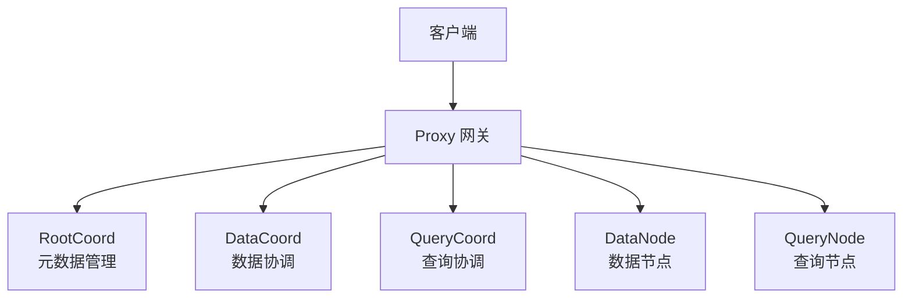

### 2.2 核心 API 接口分析

#### 2.2.1 集合管理 API

**CreateCollection - 创建集合**

**API 入口函数：**
```go
// 文件：internal/proxy/impl.go
// 功能：创建新的集合，包括 Schema 验证、权限检查和任务调度
// 参数：
//   - ctx: 上下文，用于超时控制和链路追踪
//   - request: 创建集合请求，包含集合名称、Schema、分片数等信息
// 返回值：
//   - *commonpb.Status: 操作状态，包含错误码和错误信息
//   - error: Go 标准错误
func (node *Proxy) CreateCollection(ctx context.Context, request *milvuspb.CreateCollectionRequest) (*commonpb.Status, error) {
    // 1. 健康状态检查 - 确保 Proxy 节点处于健康状态
    if err := merr.CheckHealthy(node.GetStateCode()); err != nil {
        return merr.Status(err), nil
    }
    
    // 2. 开启链路追踪 - 用于性能监控和问题排查
    ctx, sp := otel.Tracer(typeutil.ProxyRole).Start(ctx, "Proxy-CreateCollection")
    defer sp.End()
    
    // 3. 创建任务对象 - 封装请求参数和执行逻辑
    cct := &createCollectionTask{
        ctx:                     ctx,                // 执行上下文
        Condition:               NewTaskCondition(ctx), // 任务条件控制
        CreateCollectionRequest: request,            // 原始请求
        mixCoord:                node.mixCoord,      // 协调器客户端
    }

    // 4. 记录请求日志 - 便于调试和监控
    log := log.Ctx(ctx).With(
        zap.String("role", typeutil.ProxyRole),
        zap.String("db", request.DbName),
        zap.String("collection", request.CollectionName),
        zap.Int("len(schema)", len(request.Schema)),
        zap.Int32("shards_num", request.ShardsNum),
        zap.String("consistency_level", request.ConsistencyLevel.String()),
    )
    log.Info("CreateCollection request received")

    // 5. 提交到 DDL 任务队列 - 异步执行以避免阻塞
    if err := node.sched.ddQueue.Enqueue(cct); err != nil {
        log.Warn("Failed to enqueue create collection task", zap.Error(err))
        return merr.Status(err), nil
    }
    
    // 6. 等待任务完成 - 同步等待异步任务执行结果
    if err := cct.WaitToFinish(); err != nil {
        log.Warn("Create collection task failed", zap.Error(err))
        return merr.Status(err), nil
    }
    
    return cct.result, nil
}
```

**任务预处理函数：**
```go
// 文件：internal/proxy/task.go
// 功能：在执行创建集合任务前进行各种验证和预处理
// 参数：ctx - 执行上下文
// 返回值：error - 验证失败时返回错误
func (t *createCollectionTask) PreExecute(ctx context.Context) error {
    // 1. 设置消息类型和源ID
    t.Base.MsgType = commonpb.MsgType_CreateCollection
    t.Base.SourceID = paramtable.GetNodeID()

    // 2. 解析 Schema - 将字节数组反序列化为结构体
    t.schema = &schemapb.CollectionSchema{}
    err := proto.Unmarshal(t.Schema, t.schema)
    if err != nil {
        return fmt.Errorf("failed to unmarshal schema: %w", err)
    }
    t.schema.AutoID = false

    // 3. 验证函数字段定义
    if err := validateFunction(t.schema); err != nil {
        return fmt.Errorf("function validation failed: %w", err)
    }

    // 4. 验证分片数量限制
    if t.ShardsNum > Params.ProxyCfg.MaxShardNum.GetAsInt32() {
        return fmt.Errorf("shards number %d exceeds maximum limit %d", 
            t.ShardsNum, Params.ProxyCfg.MaxShardNum.GetAsInt())
    }

    // 5. 验证字段数量限制
    totalFieldsNum := typeutil.GetTotalFieldsNum(t.schema)
    if totalFieldsNum > Params.ProxyCfg.MaxFieldNum.GetAsInt() {
        return fmt.Errorf("total fields number %d exceeds maximum limit %d", 
            totalFieldsNum, Params.ProxyCfg.MaxFieldNum.GetAsInt())
    }

    // 6. 验证向量字段数量
    vectorFields := len(typeutil.GetVectorFieldSchemas(t.schema))
    if vectorFields > Params.ProxyCfg.MaxVectorFieldNum.GetAsInt() {
        return fmt.Errorf("vector fields number %d exceeds maximum limit %d", 
            vectorFields, Params.ProxyCfg.MaxVectorFieldNum.GetAsInt())
    }
    if vectorFields == 0 {
        return merr.WrapErrParameterInvalidMsg("schema must contain at least one vector field")
    }

    // 7. 验证集合名称格式
    if err := validateCollectionName(t.schema.Name); err != nil {
        return fmt.Errorf("invalid collection name: %w", err)
    }

    // 8. 验证字段名称唯一性
    if err := validateDuplicatedFieldName(t.schema); err != nil {
        return fmt.Errorf("duplicated field name found: %w", err)
    }

    // 9. 验证主键定义
    if err := validatePrimaryKey(t.schema); err != nil {
        return fmt.Errorf("primary key validation failed: %w", err)
    }

    // 10. 验证动态字段配置
    if err := validateDynamicField(t.schema); err != nil {
        return fmt.Errorf("dynamic field validation failed: %w", err)
    }

    // 11. 验证自动ID配置
    if err := ValidateFieldAutoID(t.schema); err != nil {
        return fmt.Errorf("auto ID validation failed: %w", err)
    }

    // 12. 验证字段类型定义
    if err := validateFieldType(t.schema); err != nil {
        return fmt.Errorf("field type validation failed: %w", err)
    }

    // 13. 重新序列化 Schema
    t.CreateCollectionRequest.Schema, err = proto.Marshal(t.schema)
    if err != nil {
        return fmt.Errorf("failed to marshal schema: %w", err)
    }
    
    return nil
}
```

**任务执行函数：**
```go
// 文件：internal/proxy/task.go
// 功能：执行创建集合的核心逻辑，调用 RootCoord 服务
// 参数：ctx - 执行上下文
// 返回值：error - 执行失败时返回错误
func (t *createCollectionTask) Execute(ctx context.Context) error {
    var err error
    // 调用 MixCoord（实际是 RootCoord）创建集合
    // MixCoord 是一个统一的协调器接口，封装了多个协调器的功能
    t.result, err = t.mixCoord.CreateCollection(ctx, t.CreateCollectionRequest)
    
    // 检查 RPC 调用结果
    return merr.CheckRPCCall(t.result, err)
}
```

**关键调用链路和时序图：**

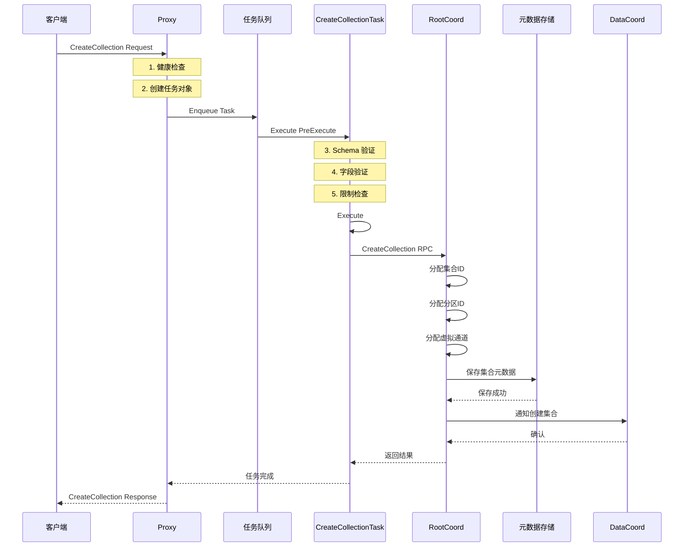

#### 2.2.2 数据操作 API

**Insert - 数据插入**

**API 入口函数：**
```go
// 文件：internal/proxy/impl.go
// 功能：插入数据到指定集合，支持批量插入和分区键路由
// 参数：
//   - ctx: 上下文，用于超时控制和链路追踪
//   - request: 插入请求，包含集合名称、分区名称、字段数据等
// 返回值：
//   - *milvuspb.MutationResult: 插入结果，包含插入的ID和错误信息
//   - error: Go 标准错误
func (node *Proxy) Insert(ctx context.Context, request *milvuspb.InsertRequest) (*milvuspb.MutationResult, error) {
    // 1. 开启链路追踪
    ctx, sp := otel.Tracer(typeutil.ProxyRole).Start(ctx, "Proxy-Insert")
    defer sp.End()

    // 2. 健康状态检查
    if err := merr.CheckHealthy(node.GetStateCode()); err != nil {
        return &milvuspb.MutationResult{Status: merr.Status(err)}, nil
    }

    // 3. 记录请求日志和指标
    log := log.Ctx(ctx).With(
        zap.String("role", typeutil.ProxyRole),
        zap.String("db", request.DbName),
        zap.String("collection", request.CollectionName),
        zap.String("partition", request.PartitionName),
        zap.Int("len(FieldsData)", len(request.FieldsData)),
        zap.Int("len(HashKeys)", len(request.HashKeys)),
        zap.Uint32("NumRows", request.NumRows),
    )

    // 4. 设置监控指标
    metrics.GetStats(ctx).
        SetNodeID(paramtable.GetNodeID()).
        SetInboundLabel(metrics.InsertLabel).
        SetDatabaseName(request.GetDbName()).
        SetCollectionName(request.GetCollectionName())

    // 5. 创建插入任务对象
    it := &insertTask{
        ctx:       ctx,
        Condition: NewTaskCondition(ctx),
        insertMsg: &msgstream.InsertMsg{
            BaseMsg: msgstream.BaseMsg{
                HashValues: request.HashKeys, // 用于分片路由的哈希值
            },
            InsertRequest: &msgpb.InsertRequest{
                Base: commonpbutil.NewMsgBase(
                    commonpbutil.WithMsgType(commonpb.MsgType_Insert),
                    commonpbutil.WithSourceID(paramtable.GetNodeID()),
                ),
                DbName:         request.GetDbName(),
                CollectionName: request.CollectionName,
                PartitionName:  request.PartitionName,
                FieldsData:     request.FieldsData,
                NumRows:        uint64(request.NumRows),
                Version:        msgpb.InsertDataVersion_ColumnBased,
                Namespace:      request.Namespace,
            },
        },
        idAllocator:     node.rowIDAllocator,    // ID分配器
        chMgr:           node.chMgr,             // 通道管理器
        schemaTimestamp: request.SchemaTimestamp, // Schema时间戳
    }

    // 6. 构造失败响应的辅助函数
    constructFailedResponse := func(err error) *milvuspb.MutationResult {
        numRows := request.NumRows
        errIndex := make([]uint32, numRows)
        for i := uint32(0); i < numRows; i++ {
            errIndex[i] = i
        }
        return &milvuspb.MutationResult{
            Status:   merr.Status(err),
            ErrIndex: errIndex,
        }
    }

    // 7. 提交到 DML 任务队列
    if err := node.sched.dmQueue.Enqueue(it); err != nil {
        log.Warn("Failed to enqueue insert task", zap.Error(err))
        return constructFailedResponse(
            merr.WrapErrAsInputErrorWhen(err, merr.ErrCollectionNotFound, merr.ErrDatabaseNotFound)), nil
    }

    // 8. 等待任务完成
    if err := it.WaitToFinish(); err != nil {
        log.Warn("Failed to execute insert task", zap.Error(err))
        return constructFailedResponse(err), nil
    }

    // 9. 处理执行结果
    if it.result.GetStatus().GetErrorCode() != commonpb.ErrorCode_Success {
        // 设置错误索引
        numRows := request.NumRows
        errIndex := make([]uint32, numRows)
        for i := uint32(0); i < numRows; i++ {
            errIndex[i] = i
        }
        it.result.ErrIndex = errIndex
        log.Warn("Insert operation failed", zap.Uint32s("err_index", it.result.ErrIndex))
    }

    // 10. 设置插入计数
    it.result.InsertCnt = int64(request.NumRows)

    return it.result, nil
}
```

**插入任务预处理：**
```go
// 文件：internal/proxy/task_insert.go
// 功能：插入任务的预处理，包括Schema验证、分区处理、数据验证
func (it *insertTask) PreExecute(ctx context.Context) error {
    // 1. 设置消息基础信息
    it.insertMsg.Base.MsgType = commonpb.MsgType_Insert
    it.insertMsg.Base.SourceID = paramtable.GetNodeID()

    // 2. 获取集合信息和Schema
    collectionName := it.insertMsg.CollectionName
    collID, err := globalMetaCache.GetCollectionID(ctx, it.insertMsg.GetDbName(), collectionName)
    if err != nil {
        return fmt.Errorf("failed to get collection ID: %w", err)
    }
    it.insertMsg.CollectionID = collID

    schema, err := globalMetaCache.GetCollectionSchema(ctx, it.insertMsg.GetDbName(), collectionName)
    if err != nil {
        return fmt.Errorf("failed to get collection schema: %w", err)
    }
    it.schema = schema

    // 3. 分配行ID（如果需要）
    if err := it.assignRowIDs(ctx); err != nil {
        return fmt.Errorf("failed to assign row IDs: %w", err)
    }

    // 4. 处理分区键模式
    partitionKeyMode, err := isPartitionKeyMode(ctx, it.insertMsg.GetDbName(), collectionName)
    if err != nil {
        return fmt.Errorf("failed to check partition key mode: %w", err)
    }

    if partitionKeyMode {
        // 分区键模式：从数据中提取分区键
        fieldSchema, _ := typeutil.GetPartitionKeyFieldSchema(it.schema)
        it.partitionKeys, err = getPartitionKeyFieldData(fieldSchema, it.insertMsg)
        if err != nil {
            return fmt.Errorf("failed to get partition keys: %w", err)
        }
    } else {
        // 非分区键模式：使用指定的分区或默认分区
        partitionTag := it.insertMsg.GetPartitionName()
        if len(partitionTag) <= 0 {
            // 使用默认分区
            pinfo, err := globalMetaCache.GetPartitionInfo(ctx, it.insertMsg.GetDbName(), collectionName, "")
            if err != nil {
                return fmt.Errorf("failed to get default partition info: %w", err)
            }
            partitionTag = pinfo.name
            it.insertMsg.PartitionName = partitionTag
        }

        // 验证分区名称
        if err := validatePartitionTag(partitionTag, true); err != nil {
            return fmt.Errorf("invalid partition name %s: %w", partitionTag, err)
        }
    }

    // 5. 数据验证
    validator := newValidateUtil(
        withNANCheck(),      // NaN值检查
        withOverflowCheck(), // 溢出检查
        withMaxLenCheck(),   // 最大长度检查
        withMaxCapCheck(),   // 最大容量检查
    )
    if err := validator.Validate(it.insertMsg.GetFieldsData(), schema.schemaHelper, it.insertMsg.NRows()); err != nil {
        return merr.WrapErrAsInputError(fmt.Errorf("data validation failed: %w", err))
    }

    return nil
}
```

**Insert 调用时序图：**

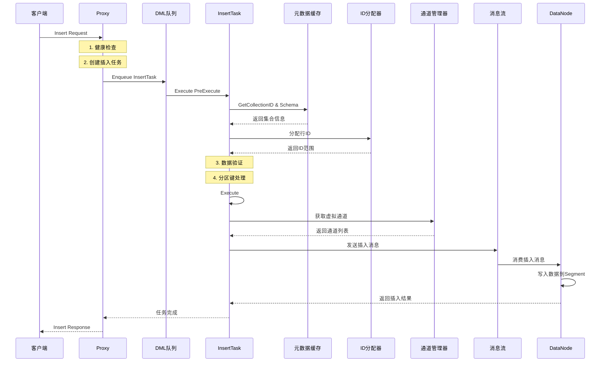

#### 2.2.3 查询搜索 API

**Search - 向量搜索**

**API 入口函数：**
```go
// 文件：internal/proxy/impl.go
// 功能：执行向量相似度搜索，支持混合搜索、过滤条件、多向量查询
// 参数：
//   - ctx: 上下文，用于超时控制和链路追踪
//   - request: 搜索请求，包含查询向量、搜索参数、过滤条件等
// 返回值：
//   - *milvuspb.SearchResults: 搜索结果，包含相似向量和相似度分数
//   - error: Go 标准错误
func (node *Proxy) Search(ctx context.Context, request *milvuspb.SearchRequest) (*milvuspb.SearchResults, error) {
    var err error
    rsp := &milvuspb.SearchResults{Status: merr.Success()}

    // 1. 优化搜索策略 - 支持结果大小不足时的重试机制
    optimizedSearch := true
    resultSizeInsufficient := false
    isTopkReduce := false
    isRecallEvaluation := false

    // 2. 重试机制 - 处理结果不足和一致性重查询
    err2 := retry.Handle(ctx, func() (bool, error) {
        rsp, resultSizeInsufficient, isTopkReduce, isRecallEvaluation, err = 
            node.search(ctx, request, optimizedSearch, false)
        
        // 如果优化搜索结果不足且启用了结果限制检查，则进行非优化搜索
        if merr.Ok(rsp.GetStatus()) && optimizedSearch && resultSizeInsufficient && 
           isTopkReduce && paramtable.Get().AutoIndexConfig.EnableResultLimitCheck.GetAsBool() {
            optimizedSearch = false
            rsp, resultSizeInsufficient, isTopkReduce, isRecallEvaluation, err = 
                node.search(ctx, request, optimizedSearch, false)
            
            // 记录重试指标
            metrics.ProxyRetrySearchCount.WithLabelValues(
                strconv.FormatInt(paramtable.GetNodeID(), 10),
                metrics.SearchLabel,
                request.GetDbName(),
                request.GetCollectionName(),
            ).Inc()
        }
        
        // 处理一致性重查询错误
        if errors.Is(merr.Error(rsp.GetStatus()), merr.ErrInconsistentRequery) {
            return true, merr.Error(rsp.GetStatus())
        }
        
        return false, err
    })

    if err2 != nil {
        err = err2
    }
    if err != nil {
        rsp.Status = merr.Status(err)
    }
    return rsp, nil
}
```

**核心搜索函数：**
```go
// 文件：internal/proxy/impl.go
// 功能：执行具体的搜索逻辑
func (node *Proxy) search(ctx context.Context, request *milvuspb.SearchRequest, 
    optimizedSearch bool, isRecallEvaluation bool) (*milvuspb.SearchResults, bool, bool, bool, error) {
    
    // 1. 设置监控指标
    metrics.GetStats(ctx).
        SetNodeID(paramtable.GetNodeID()).
        SetInboundLabel(metrics.SearchLabel).
        SetDatabaseName(request.GetDbName()).
        SetCollectionName(request.GetCollectionName())

    // 2. 记录查询向量数量
    metrics.ProxyReceivedNQ.WithLabelValues(
        strconv.FormatInt(paramtable.GetNodeID(), 10),
        metrics.SearchLabel,
        request.GetDbName(),
        request.GetCollectionName(),
    ).Add(float64(request.GetNq()))

    // 3. 健康状态检查
    if err := merr.CheckHealthy(node.GetStateCode()); err != nil {
        return &milvuspb.SearchResults{Status: merr.Status(err)}, false, false, false, nil
    }

    // 4. 开启链路追踪
    ctx, sp := otel.Tracer(typeutil.ProxyRole).Start(ctx, "Proxy-Search")
    defer sp.End()

    // 5. 处理主键搜索 - 根据主键获取向量进行搜索
    if request.SearchByPrimaryKeys {
        placeholderGroupBytes, err := node.getVectorPlaceholderGroupForSearchByPks(ctx, request)
        if err != nil {
            return &milvuspb.SearchResults{Status: merr.Status(err)}, false, false, false, nil
        }
        request.PlaceholderGroup = placeholderGroupBytes
    }

    // 6. 创建搜索任务对象
    qt := &searchTask{
        ctx:       ctx,
        Condition: NewTaskCondition(ctx),
        SearchRequest: &internalpb.SearchRequest{
            Base: commonpbutil.NewMsgBase(
                commonpbutil.WithMsgType(commonpb.MsgType_Search),
                commonpbutil.WithSourceID(paramtable.GetNodeID()),
            ),
            ReqID:              paramtable.GetNodeID(),
            IsTopkReduce:       optimizedSearch,      // 是否启用TopK优化
            IsRecallEvaluation: isRecallEvaluation,   // 是否进行召回评估
        },
        request:                request,
        tr:                     timerecord.NewTimeRecorder("search"),
        mixCoord:               node.mixCoord,
        node:                   node,
        lb:                     node.lbPolicy,        // 负载均衡策略
        enableMaterializedView: node.enableMaterializedView,
        mustUsePartitionKey:    Params.ProxyCfg.MustUsePartitionKey.GetAsBool(),
    }

    // 7. 记录详细的搜索日志
    log := log.Ctx(ctx).With(
        zap.String("role", typeutil.ProxyRole),
        zap.String("db", request.DbName),
        zap.String("collection", request.CollectionName),
        zap.Strings("partitions", request.PartitionNames),
        zap.String("expr", request.Expr),
        zap.Uint64("guarantee_timestamp", request.GuaranteeTimestamp),
        zap.Uint64("travel_timestamp", request.TravelTimestamp),
        zap.Int64("nq", qt.Nq),
        zap.Int64("topk", qt.TopK),
        zap.Bool("use_default_consistency", request.UseDefaultConsistency),
    )

    // 8. 提交到查询队列并等待执行
    // ... 省略队列处理逻辑
    
    return qt.result, qt.resultSizeInsufficient, qt.isTopkReduce, qt.isRecallEvaluation, nil
}
```

**搜索任务预处理：**
```go
// 文件：internal/proxy/task_search.go
// 功能：搜索任务的预处理，包括参数验证、分区处理、输出字段解析
func (t *searchTask) PreExecute(ctx context.Context) error {
    // 1. 开启链路追踪
    ctx, sp := otel.Tracer(typeutil.ProxyRole).Start(ctx, "Proxy-Search-PreExecute")
    defer sp.End()

    // 2. 设置请求基础信息
    t.SearchRequest.IsAdvanced = len(t.request.GetSubReqs()) > 0
    t.Base.MsgType = commonpb.MsgType_Search
    t.Base.SourceID = paramtable.GetNodeID()

    // 3. 获取集合信息
    collectionName := t.request.CollectionName
    t.collectionName = collectionName
    collID, err := globalMetaCache.GetCollectionID(ctx, t.request.GetDbName(), collectionName)
    if err != nil {
        return merr.WrapErrAsInputErrorWhen(err, merr.ErrCollectionNotFound, merr.ErrDatabaseNotFound)
    }

    t.SearchRequest.DbID = 0
    t.SearchRequest.CollectionID = collID

    // 4. 获取集合Schema
    t.schema, err = globalMetaCache.GetCollectionSchema(ctx, t.request.GetDbName(), collectionName)
    if err != nil {
        return fmt.Errorf("failed to get collection schema: %w", err)
    }

    // 5. 检查分区键模式
    t.partitionKeyMode, err = isPartitionKeyMode(ctx, t.request.GetDbName(), collectionName)
    if err != nil {
        return fmt.Errorf("failed to check partition key mode: %w", err)
    }

    // 分区键模式下不允许手动指定分区
    if t.partitionKeyMode && len(t.request.GetPartitionNames()) != 0 {
        return errors.New("cannot manually specify partition names in partition key mode")
    }

    // 强制使用分区键的配置检查
    if t.mustUsePartitionKey && !t.partitionKeyMode {
        return merr.WrapErrAsInputError(merr.WrapErrParameterInvalidMsg(
            "must use partition key because mustUsePartitionKey config is enabled"))
    }

    // 6. 处理分区名称到分区ID的转换
    if !t.partitionKeyMode && len(t.request.GetPartitionNames()) > 0 {
        t.SearchRequest.PartitionIDs, err = getPartitionIDs(ctx, 
            t.request.GetDbName(), collectionName, t.request.GetPartitionNames())
        if err != nil {
            return fmt.Errorf("failed to get partition IDs: %w", err)
        }
    }

    // 7. 解析输出字段
    t.translatedOutputFields, t.userOutputFields, err = translateOutputFields(
        t.request.OutputFields, t.schema, false)
    if err != nil {
        return fmt.Errorf("failed to translate output fields: %w", err)
    }

    // 8. 验证高级搜索请求数量
    if t.SearchRequest.GetIsAdvanced() {
        if len(t.request.GetSubReqs()) > defaultMaxSearchRequest {
            return fmt.Errorf("maximum number of search requests is %d", defaultMaxSearchRequest)
        }
    }

    // 9. 检查和设置查询向量数量(nq)
    nq, err := t.checkNq(ctx)
    if err != nil {
        return fmt.Errorf("invalid nq parameter: %w", err)
    }
    t.SearchRequest.Nq = nq

    // 10. 设置是否忽略Growing Segment
    if t.SearchRequest.IgnoreGrowing, err = isIgnoreGrowing(t.request.SearchParams); err != nil {
        return fmt.Errorf("failed to parse ignore_growing parameter: %w", err)
    }

    // 11. 获取输出字段ID
    outputFieldIDs, err := getOutputFieldIDs(t.schema, t.translatedOutputFields)
    if err != nil {
        return fmt.Errorf("failed to get output field IDs: %w", err)
    }
    t.SearchRequest.OutputFieldsId = outputFieldIDs

    // 12. 初始化搜索请求参数
    if t.SearchRequest.GetIsAdvanced() {
        err = t.initAdvancedSearchRequest(ctx)
    } else {
        err = t.initSearchRequest(ctx)
    }
    if err != nil {
        return fmt.Errorf("failed to initialize search request: %w", err)
    }

    return nil
}
```

**搜索任务执行：**
```go
// 文件：internal/proxy/task_search.go
// 功能：执行搜索任务，通过负载均衡器分发到各个QueryNode
func (t *searchTask) Execute(ctx context.Context) error {
    // 1. 开启链路追踪
    ctx, sp := otel.Tracer(typeutil.ProxyRole).Start(ctx, "Proxy-Search-Execute")
    defer sp.End()

    // 2. 创建性能记录器
    tr := timerecord.NewTimeRecorder(fmt.Sprintf("proxy execute search %d", t.ID()))
    defer tr.CtxElapse(ctx, "search execute done")

    // 3. 通过负载均衡器执行搜索
    err := t.lb.Execute(ctx, CollectionWorkLoad{
        db:             t.request.GetDbName(),
        collectionID:   t.SearchRequest.CollectionID,
        collectionName: t.collectionName,
        nq:             t.Nq,
        exec:           t.searchShard,  // 分片搜索函数
    })
    
    if err != nil {
        log.Ctx(ctx).Warn("search execute failed", zap.Error(err))
        return fmt.Errorf("failed to execute search: %w", err)
    }

    return nil
}
```

**Search 执行时序图：**

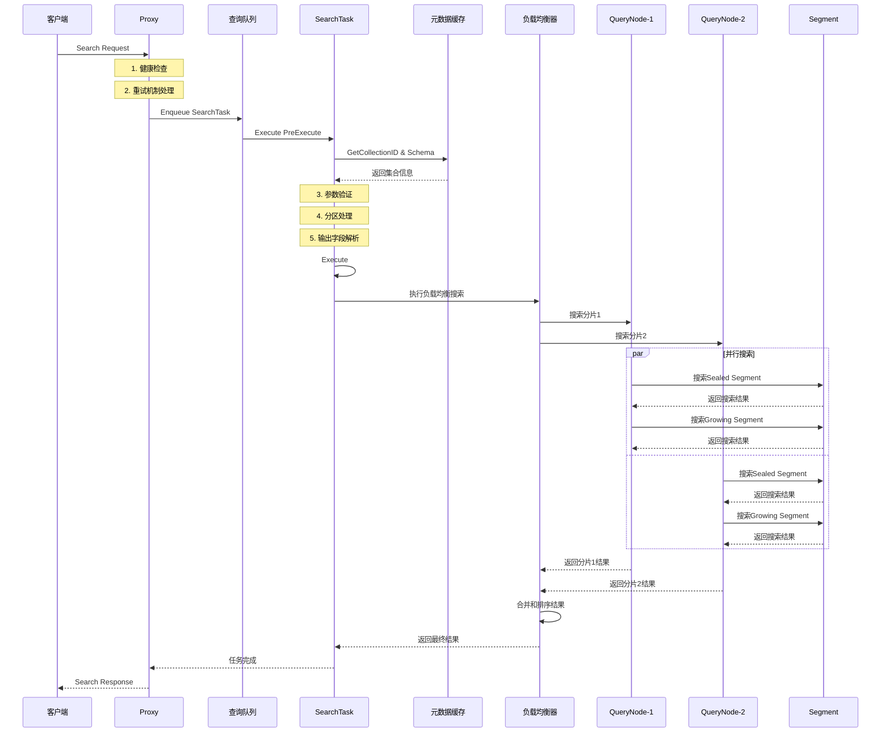

### 2.3 API 拦截器机制

Milvus 使用拦截器模式实现横切关注点：

```go
// 数据库拦截器：internal/proxy/database_interceptor.go
func DatabaseInterceptor() grpc.UnaryServerInterceptor {
    return func(ctx context.Context, req any, info *grpc.UnaryServerInfo, handler grpc.UnaryHandler) (resp interface{}, err error) {
        filledCtx, filledReq := fillDatabase(ctx, req)
        return handler(filledCtx, filledReq)
    }
}

// 认证拦截器：internal/proxy/authentication_interceptor.go
func AuthenticationInterceptor() grpc.UnaryServerInterceptor {
    return func(ctx context.Context, req interface{}, info *grpc.UnaryServerInfo, handler grpc.UnaryHandler) (interface{}, error) {
        // 验证用户身份
        if err := validateAuth(ctx, req); err != nil {
            return nil, err
        }
        return handler(ctx, req)
    }
}

// 速率限制拦截器：internal/proxy/rate_limit_interceptor.go
func RateLimitInterceptor() grpc.UnaryServerInterceptor {
    return func(ctx context.Context, req interface{}, info *grpc.UnaryServerInfo, handler grpc.UnaryHandler) (interface{}, error) {
        // 检查速率限制
        if err := checkRateLimit(ctx, req); err != nil {
            return nil, err
        }
        return handler(ctx, req)
    }
}
```

---

## 3. 整体架构设计

### 3.1 系统架构概览

Milvus 采用云原生的微服务架构，实现了存储与计算分离，支持水平扩展和高可用部署。整个系统分为五个层次：客户端层、接入层、协调层、执行层和存储层。

#### 3.1.1 详细系统架构图

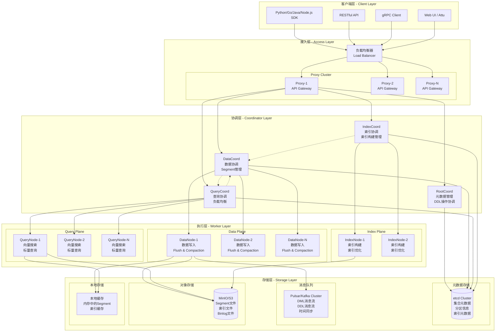

**架构层次详细说明：**

**1. 客户端层 (Client Layer)**
- **多语言SDK支持**：提供Python、Go、Java、Node.js等多种语言的SDK
- **协议支持**：支持gRPC和RESTful两种通信协议
- **管理界面**：Attu等Web UI工具用于可视化管理

**2. 接入层 (Access Layer)**
- **负载均衡器**：分发客户端请求到多个Proxy实例
- **Proxy集群**：无状态的API网关，提供统一的服务入口
- **功能特性**：
  - 请求路由和负载均衡
  - 认证和权限控制
  - 速率限制和流量控制
  - 协议转换和参数验证

**3. 协调层 (Coordinator Layer)**
- **RootCoord**：元数据管理中心
  - 集合和分区的生命周期管理
  - Schema定义和版本控制
  - 全局ID和时间戳分配
  - DDL操作的协调和执行

- **DataCoord**：数据协调中心
  - Segment的分配和管理
  - 数据刷盘和压缩调度
  - Channel和DataNode的映射
  - 数据生命周期管理

- **QueryCoord**：查询协调中心
  - QueryNode集群管理
  - 负载均衡和分片分配
  - 查询计划生成和优化
  - 副本管理和故障转移

- **IndexCoord**：索引协调中心
  - 索引构建任务调度
  - IndexNode集群管理
  - 索引生命周期管理
  - 索引元数据管理

**4. 执行层 (Worker Layer)**
- **DataNode**：数据写入和处理
  - 实时数据写入和缓存
  - 数据刷盘到对象存储
  - 数据压缩和合并
  - 增量数据处理

- **QueryNode**：查询执行引擎
  - 向量相似度搜索
  - 标量数据过滤和查询
  - 内存中的数据管理
  - 查询结果聚合

- **IndexNode**：索引构建服务
  - 向量索引构建
  - 索引优化和更新
  - 多种索引算法支持
  - 分布式索引构建

**5. 存储层 (Storage Layer)**
- **元数据存储(etcd)**：
  - 集合和分区元数据
  - 索引定义和状态
  - 系统配置信息
  - 分布式锁和协调

- **消息队列(Pulsar/Kafka)**：
  - DML操作的消息流
  - 时间同步和一致性保证
  - 数据变更日志
  - 组件间异步通信

- **对象存储(MinIO/S3)**：
  - Segment数据文件
  - 索引文件存储
  - Binlog和Deltalog
  - 数据备份和归档

- **本地缓存**：
  - 内存中的热数据
  - 索引缓存
  - 查询结果缓存
  - 元数据缓存

### 3.2 核心组件交互时序图

#### 3.2.1 完整的数据插入流程

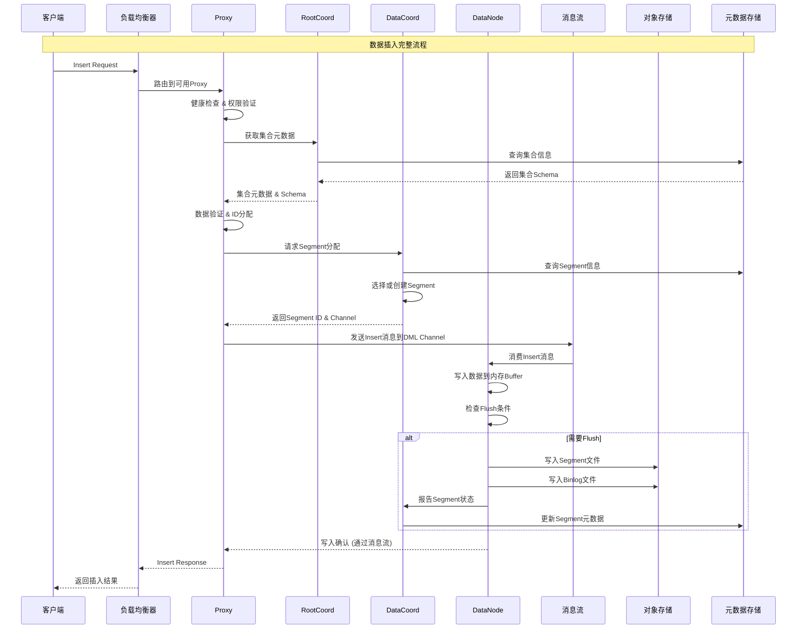

#### 3.2.2 完整的向量搜索流程

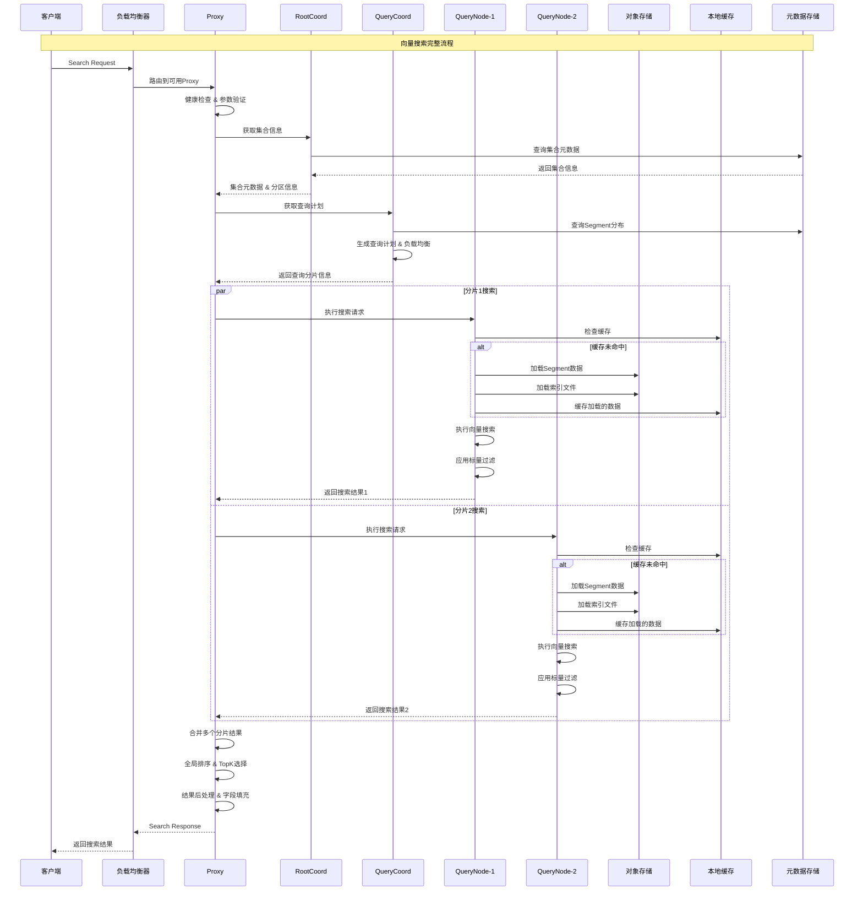

#### 3.2.3 集合创建流程

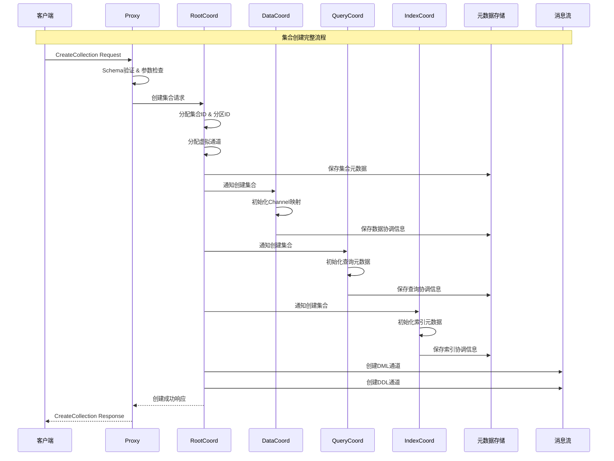

### 3.3 数据流架构

#### 3.3.1 完整数据流图

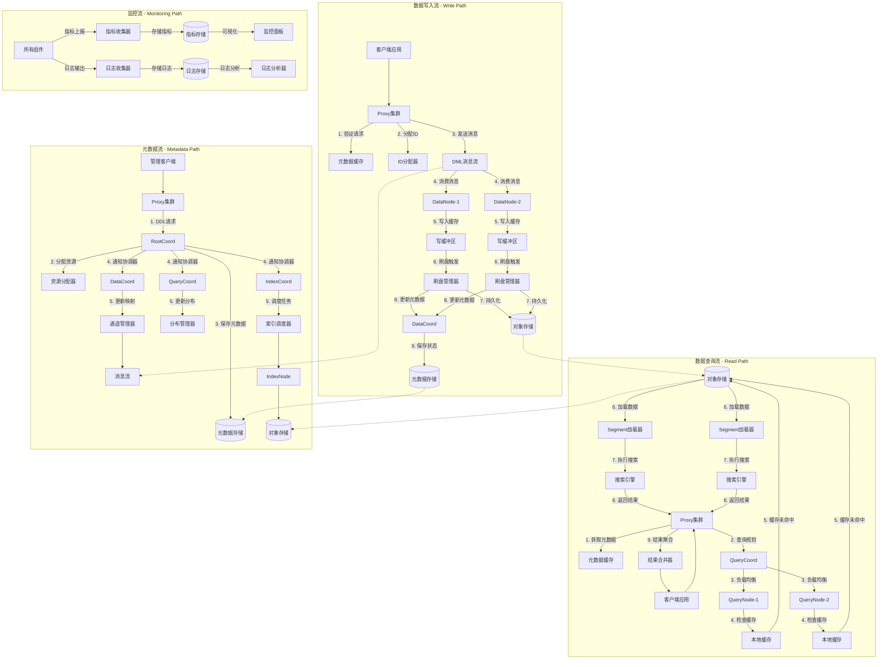

#### 3.3.2 数据生命周期管理

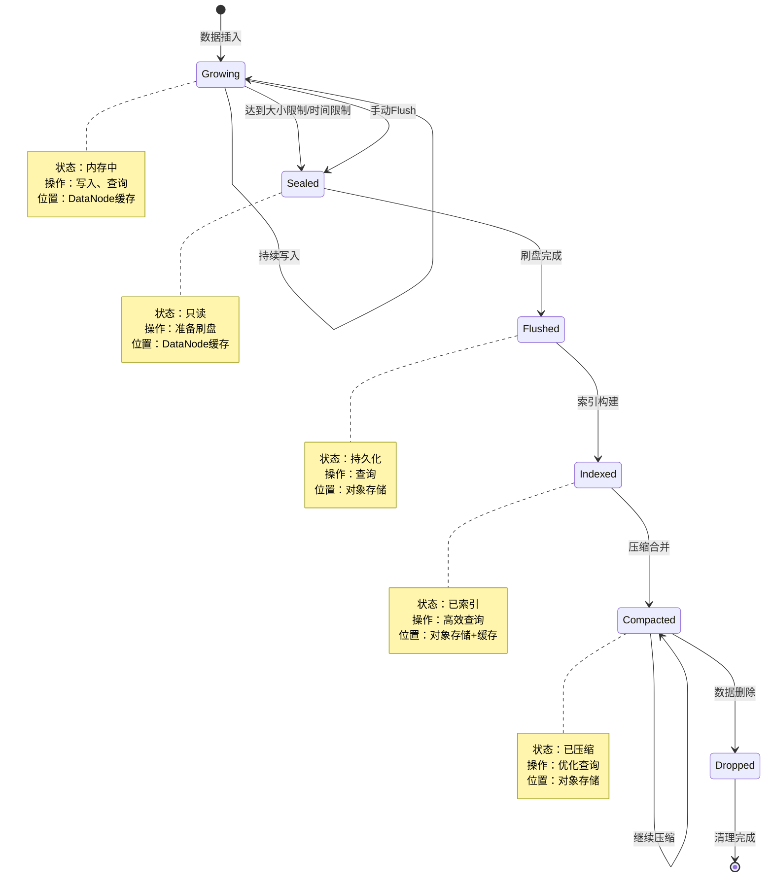

#### 3.3.3 消息流架构

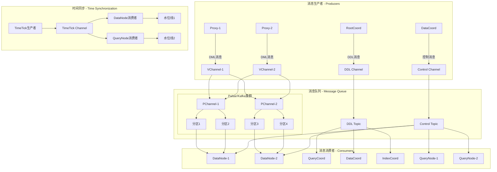

**数据流架构关键特性：**

1. **写入路径优化**：
   - 批量写入减少网络开销
   - 内存缓冲提升写入性能
   - 异步刷盘保证数据持久性
   - 压缩合并优化存储效率

2. **查询路径优化**：
   - 多级缓存加速数据访问
   - 并行查询提升搜索性能
   - 智能负载均衡分散查询压力
   - 结果聚合保证查询准确性

3. **元数据管理**：
   - 集中式元数据存储
   - 分布式缓存提升访问速度
   - 版本控制支持Schema演进
   - 一致性保证数据正确性

4. **消息流设计**：
   - 虚拟通道支持逻辑分片
   - 物理通道实现负载均衡
   - 时间同步保证数据一致性
   - 消息持久化防止数据丢失

---

## 4. 核心模块分析

### 4.1 Proxy 模块 - API 网关

#### 4.1.1 模块架构

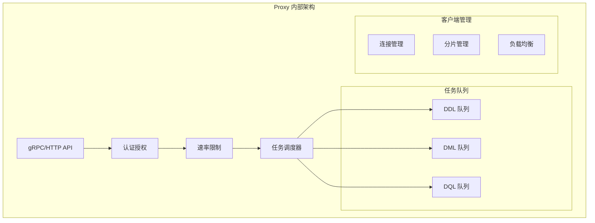

#### 4.1.2 核心数据结构

```go
// Proxy 主结构：internal/proxy/proxy.go
type Proxy struct {
    milvuspb.UnimplementedMilvusServiceServer
    
    ctx    context.Context
    cancel context.CancelFunc
    wg     sync.WaitGroup
    
    // 基础配置
    initParams *internalpb.InitParams
    ip         string
    port       int
    stateCode  atomic.Int32
    address    string
    
    // 协调器客户端
    mixCoord types.MixCoordClient
    
    // 限流器
    simpleLimiter *SimpleLimiter
    
    // 通道管理器
    chMgr channelsMgr
    
    // 任务调度器
    sched *taskScheduler
    
    // ID 和时间戳分配器
    rowIDAllocator *allocator.IDAllocator
    tsoAllocator   *timestampAllocator
    
    // 指标缓存管理器
    metricsCacheManager *metricsinfo.MetricsCacheManager
    
    // 会话和分片管理
    session  *sessionutil.Session
    shardMgr shardClientMgr
    
    // 搜索结果通道
    searchResultCh chan *internalpb.SearchResults
    
    // 回调函数
    startCallbacks []func()
    closeCallbacks []func()
    
    // 负载均衡策略
    lbPolicy LBPolicy
    
    // 资源管理器
    resourceManager resource.Manager
    
    // 功能开关
    enableMaterializedView   bool
    enableComplexDeleteLimit bool
    
    // 慢查询缓存
    slowQueries *expirable.LRU[Timestamp, *metricsinfo.SlowQuery]
}
```

#### 4.1.3 任务调度机制

```go
// 任务调度器：internal/proxy/task_scheduler.go
type taskScheduler struct {
    ddQueue  *BaseTaskQueue  // DDL 任务队列
    dmlQueue *BaseTaskQueue  // DML 任务队列  
    dqQueue  *BaseTaskQueue  // DQL 任务队列
    
    wg     sync.WaitGroup
    ctx    context.Context
    cancel context.CancelFunc
}

// 基础任务接口
type task interface {
    TraceCtx() context.Context
    ID() UniqueID
    SetID(uid UniqueID)
    Name() string
    Type() commonpb.MsgType
    BeginTs() Timestamp
    EndTs() Timestamp
    SetTs(ts Timestamp)
    OnEnqueue() error
    PreExecute(ctx context.Context) error
    Execute(ctx context.Context) error
    PostExecute(ctx context.Context) error
    WaitToFinish() error
    Notify(err error)
}

// 任务队列处理逻辑
func (queue *BaseTaskQueue) processTask(t task) {
    // 1. 任务预处理
    if err := t.PreExecute(queue.ctx); err != nil {
        t.Notify(err)
        return
    }
    
    // 2. 执行任务
    if err := t.Execute(queue.ctx); err != nil {
        t.Notify(err)
        return
    }
    
    // 3. 任务后处理
    if err := t.PostExecute(queue.ctx); err != nil {
        t.Notify(err)
        return
    }
    
    // 4. 通知任务完成
    t.Notify(nil)
}
```

### 4.2 RootCoord 模块 - 元数据管理

#### 4.2.1 模块职责

RootCoord 是 Milvus 的元数据管理中心，负责：
- 集合和分区的元数据管理
- Schema 定义和版本控制
- 全局 ID 分配
- 时间戳分配
- 数据定义语言 (DDL) 操作协调

#### 4.2.2 核心数据结构

```go
// RootCoord 主结构：internal/rootcoord/root_coord.go
type Core struct {
    ctx    context.Context
    cancel context.CancelFunc
    wg     sync.WaitGroup
    
    // 基础信息
    etcdCli   *clientv3.Client
    address   string
    port      int
    stateCode atomic.Int32
    
    // 元数据存储
    metaTable  *metaTable
    scheduler  *taskScheduler
    
    // ID 分配器
    idAllocator       *allocator.GlobalIDAllocator
    tsoAllocator      *tso.GlobalTSOAllocator
    
    // 代理管理
    proxyClientManager *proxyClientManager
    proxyWatcher       *proxyWatcher
    
    // 导入管理
    importManager *importManager
    
    // 配额管理
    quotaCenter *QuotaCenter
    
    // 会话
    session *sessionutil.Session
    
    // 工厂
    factory dependency.Factory
}

// 元数据表：internal/rootcoord/meta_table.go
type metaTable struct {
    ctx    context.Context
    catalog metastore.RootCoordCatalog
    
    // 集合信息缓存
    collID2Meta  map[typeutil.UniqueID]*model.Collection
    collName2ID  map[string]typeutil.UniqueID
    collAlias2ID map[string]typeutil.UniqueID
    
    // 分区信息缓存
    partID2Meta map[typeutil.UniqueID]*model.Partition
    
    // 数据库信息
    dbName2ID map[string]typeutil.UniqueID
    dbID2Meta map[typeutil.UniqueID]*model.Database
    
    // 读写锁
    ddLock sync.RWMutex
}
```

#### 4.2.3 集合创建流程

```go
// 创建集合任务：internal/rootcoord/create_collection_task.go
type createCollectionTask struct {
    baseTask
    Req *milvuspb.CreateCollectionRequest
    
    // 内部状态
    collectionID   typeutil.UniqueID
    partitionID    typeutil.UniqueID
    schema         *schemapb.CollectionSchema
    virtualChannels []string
    physicalChannels []string
}

func (t *createCollectionTask) Execute(ctx context.Context) error {
    // 1. 分配集合 ID
    collectionID, err := t.core.idAllocator.AllocOne()
    if err != nil {
        return err
    }
    t.collectionID = collectionID
    
    // 2. 分配分区 ID
    partitionID, err := t.core.idAllocator.AllocOne()
    if err != nil {
        return err
    }
    t.partitionID = partitionID
    
    // 3. 验证和处理 Schema
    if err := t.validateSchema(); err != nil {
        return err
    }
    
    // 4. 分配虚拟通道
    t.virtualChannels = t.core.chanTimeTick.getDmlChannelNames(t.Req.ShardsNum)
    
    // 5. 创建集合元数据
    collection := &model.Collection{
        CollectionID:         t.collectionID,
        Name:                t.Req.CollectionName,
        Description:         t.Req.Description,
        AutoID:              t.schema.AutoID,
        Fields:              model.UnmarshalFieldModels(t.schema.Fields),
        VirtualChannelNames: t.virtualChannels,
        PhysicalChannelNames: t.physicalChannels,
        ShardsNum:           t.Req.ShardsNum,
        ConsistencyLevel:    t.Req.ConsistencyLevel,
        CreateTime:          t.GetTs(),
        State:               pb.CollectionState_CollectionCreating,
        StartPositions:      t.startPositions,
    }
    
    // 6. 持久化到元数据存储
    if err := t.core.meta.AddCollection(ctx, collection); err != nil {
        return err
    }
    
    // 7. 通知 DataCoord 创建集合
    if err := t.core.broker.CreateCollection(ctx, collection); err != nil {
        return err
    }
    
    return nil
}
```

### 4.3 DataCoord 模块 - 数据协调

#### 4.3.1 模块架构

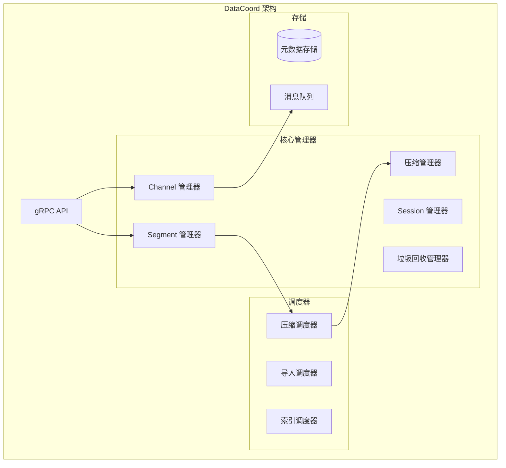

#### 4.3.2 Segment 管理

```go
// Segment 管理器：internal/datacoord/segment_manager.go
type SegmentManager struct {
    meta      *meta
    allocator allocator.Allocator
    
    // Segment 分配策略
    segmentSealPolicy   []segmentSealPolicy
    channelSealPolicies map[string][]segmentSealPolicy
    
    // 统计信息
    estimatePolicy ChannelSegmentPolicy
    allocPolicy    ChannelSegmentPolicy
    
    // 并发控制
    mu sync.RWMutex
}

// Segment 信息结构
type SegmentInfo struct {
    SegmentInfo *datapb.SegmentInfo
    currRows    int64
    allocations []*allocation
    lastFlushTs typeutil.Timestamp
    
    // 状态管理
    isCompacting bool
    size         int64
    lastExpireTime typeutil.Timestamp
}

// Segment 分配逻辑
func (s *SegmentManager) AllocSegment(ctx context.Context, collectionID, partitionID typeutil.UniqueID, channelName string, requestRows int64) (*SegmentInfo, error) {
    // 1. 查找可用的 Growing Segment
    segment := s.getGrowingSegment(collectionID, partitionID, channelName)
    
    // 2. 如果没有可用 Segment，创建新的
    if segment == nil {
        segmentID, err := s.allocator.AllocOne()
        if err != nil {
            return nil, err
        }
        
        segment = &SegmentInfo{
            SegmentInfo: &datapb.SegmentInfo{
                ID:            segmentID,
                CollectionID:  collectionID,
                PartitionID:   partitionID,
                InsertChannel: channelName,
                State:         commonpb.SegmentState_Growing,
                MaxRowNum:     Params.DataCoordCfg.SegmentMaxSize.GetAsInt64(),
                CreatedByNode: Params.DataCoordCfg.GetNodeID(),
            },
        }
        
        // 3. 注册到元数据
        if err := s.meta.AddSegment(ctx, segment); err != nil {
            return nil, err
        }
    }
    
    // 4. 分配行数
    segment.currRows += requestRows
    
    // 5. 检查是否需要 Seal
    if s.shouldSealSegment(segment) {
        s.sealSegment(ctx, segment)
    }
    
    return segment, nil
}
```

#### 4.3.3 压缩机制

```go
// 压缩管理器：internal/datacoord/compaction_manager.go
type CompactionManager struct {
    meta      *meta
    sessions  *SessionManager
    allocator allocator.Allocator
    
    // 压缩任务队列
    compactionHandler map[int64]*compactionPlanHandler
    
    // 压缩策略
    levelZeroCompactionPolicy CompactionPolicy
    mixCompactionPolicy       CompactionPolicy
    
    mu sync.RWMutex
}

// 压缩任务
type compactionTask struct {
    triggerID     int64
    planID        int64
    dataNodeID    int64
    plan          *datapb.CompactionPlan
    state         datapb.CompactionTaskState
    
    startTime time.Time
    endTime   time.Time
}

// 触发压缩逻辑
func (cm *CompactionManager) TriggerCompaction(collectionID int64) error {
    // 1. 获取集合的所有 Segment
    segments := cm.meta.GetSegmentsByCollection(collectionID)
    
    // 2. 按压缩策略分组
    groups := cm.groupSegmentsForCompaction(segments)
    
    // 3. 为每组创建压缩计划
    for _, group := range groups {
        plan := &datapb.CompactionPlan{
            PlanID:        cm.allocator.AllocOne(),
            Type:          datapb.CompactionType_MixCompaction,
            SegmentBinlogs: group.segments,
            TimeoutInSeconds: 3600,
            Collection:    collectionID,
            Channel:       group.channel,
        }
        
        // 4. 分配 DataNode 执行压缩
        nodeID := cm.selectDataNode(group.channel)
        if err := cm.sessions.Compaction(nodeID, plan); err != nil {
            return err
        }
        
        // 5. 记录压缩任务
        cm.addCompactionTask(plan.PlanID, nodeID, plan)
    }
    
    return nil
}
```

### 4.4 QueryCoord 模块 - 查询协调

#### 4.4.1 模块职责

QueryCoord 负责查询相关的协调工作：
- 管理 QueryNode 集群
- 负载均衡和分片分配
- 查询任务调度
- 副本管理

#### 4.4.2 核心架构

```go
// QueryCoord 主结构：internal/querycoordv2/server.go
type Server struct {
    ctx    context.Context
    cancel context.CancelFunc
    wg     sync.WaitGroup
    
    // 基础信息
    etcdCli *clientv3.Client
    address string
    port    int
    
    // 核心管理器
    meta         *meta.Meta
    dist         *meta.DistributionManager
    targetMgr    *meta.TargetManager
    broker       meta.Broker
    
    // 调度器
    jobScheduler  *job.Scheduler
    taskScheduler *task.Scheduler
    
    // 观察者
    nodeMgr     *session.NodeManager
    observers   []observers.Observer
    
    // 检查器
    checkerController *checkers.CheckerController
    
    // 负载均衡器
    balancer balance.Balance
    
    // 会话
    session *sessionutil.Session
}

// 分布式管理器：internal/querycoordv2/meta/dist_manager.go
type DistributionManager struct {
    // Segment 分布
    segmentDist map[int64]*meta.Segment  // nodeID -> segments
    channelDist map[int64]*meta.DmChannel // nodeID -> channels
    leaderView  map[int64]*meta.LeaderView // nodeID -> leader view
    
    // 读写锁
    rwmutex sync.RWMutex
}
```

#### 4.4.3 负载均衡机制

```go
// 负载均衡器：internal/querycoordv2/balance/balance.go
type Balance interface {
    AssignSegment(collectionID int64, segments []*meta.Segment, nodes []int64) []SegmentAssignPlan
    BalanceReplica(replica *meta.Replica) ([]SegmentAssignPlan, []ChannelAssignPlan)
}

// 轮询负载均衡器
type RoundRobinBalancer struct {
    scheduler task.Scheduler
    meta      *meta.Meta
    dist      *meta.DistributionManager
}

func (b *RoundRobinBalancer) AssignSegment(collectionID int64, segments []*meta.Segment, nodes []int64) []SegmentAssignPlan {
    plans := make([]SegmentAssignPlan, 0, len(segments))
    
    // 1. 获取节点负载信息
    nodeLoads := make(map[int64]int64)
    for _, nodeID := range nodes {
        nodeLoads[nodeID] = b.getNodeLoad(nodeID)
    }
    
    // 2. 按负载排序节点
    sort.Slice(nodes, func(i, j int) bool {
        return nodeLoads[nodes[i]] < nodeLoads[nodes[j]]
    })
    
    // 3. 轮询分配 Segment
    nodeIndex := 0
    for _, segment := range segments {
        targetNode := nodes[nodeIndex]
        plans = append(plans, SegmentAssignPlan{
            Segment: segment,
            From:    -1,
            To:      targetNode,
        })
        
        nodeIndex = (nodeIndex + 1) % len(nodes)
        nodeLoads[targetNode]++
    }
    
    return plans
}
```

### 4.5 DataNode 模块 - 数据节点

#### 4.5.1 数据写入流水线

```go
// 数据节点：internal/datanode/data_node.go
type DataNode struct {
    ctx    context.Context
    cancel context.CancelFunc
    
    // 基础信息
    Role       string
    NodeID     typeutil.UniqueID
    address    string
    port       int
    stateCode  atomic.Int32
    
    // 流水线管理
    flowgraphManager *pipeline.FlowgraphManager
    
    // 写缓冲区管理
    writeBufferManager writebuffer.BufferManager
    
    // 同步管理器
    syncMgr syncmgr.SyncManager
    
    // 压缩器
    compactionExecutor *compactor.Executor
    
    // 会话
    session *sessionutil.Session
}

// 数据写入流水线：internal/datanode/pipeline/flow_graph.go
type DataSyncService struct {
    ctx    context.Context
    cancel context.CancelFunc
    
    // 流图节点
    dmStreamNode   *DmInputNode
    insertBufferNode *InsertBufferNode
    deleteBufferNode *DeleteBufferNode
    ttNode         *TimeTickNode
    
    // 通道信息
    vchannelName   string
    metacache      metacache.MetaCache
    
    // 写缓冲区
    writeBuffer    writebuffer.WriteBuffer
    
    // 同步器
    syncMgr        syncmgr.SyncManager
}

// 插入缓冲节点处理逻辑
func (ibn *InsertBufferNode) Operate(in []Msg) []Msg {
    // 1. 解析插入消息
    insertMsgs := ibn.parseInsertMsgs(in)
    
    // 2. 写入缓冲区
    for _, msg := range insertMsgs {
        // 分配 Segment
        segmentID := ibn.allocateSegment(msg.CollectionID, msg.PartitionID)
        
        // 写入数据到缓冲区
        ibn.writeBuffer.BufferData(segmentID, msg.RowData)
        
        // 检查是否需要刷盘
        if ibn.shouldFlush(segmentID) {
            ibn.triggerFlush(segmentID)
        }
    }
    
    return in
}
```

#### 4.5.2 数据刷盘机制

```go
// 同步管理器：internal/datanode/syncmgr/sync_manager.go
type SyncManager interface {
    SyncData(ctx context.Context, task SyncTask) *SyncTask
}

type syncManager struct {
    // 任务队列
    tasks chan SyncTask
    
    // 工作协程池
    workers []Worker
    
    // 元数据缓存
    metacache metacache.MetaCache
    
    // 分配器
    allocator allocator.Allocator
    
    // 存储客户端
    chunkManager storage.ChunkManager
}

// 同步任务
type SyncTask struct {
    segmentID    int64
    collectionID int64
    partitionID  int64
    channelName  string
    
    // 数据
    insertData   *storage.InsertData
    deleteData   *storage.DeleteData
    
    // 时间戳
    startPosition *msgpb.MsgPosition
    endPosition   *msgpb.MsgPosition
    
    // 回调
    done chan error
}

// 执行同步任务
func (sm *syncManager) sync(task *SyncTask) error {
    // 1. 序列化数据
    insertLogs, statsLogs, err := sm.serializeInsertData(task.insertData)
    if err != nil {
        return err
    }
    
    deleteLogs, err := sm.serializeDeleteData(task.deleteData)
    if err != nil {
        return err
    }
    
    // 2. 上传到对象存储
    insertPaths := make([]string, len(insertLogs))
    for i, log := range insertLogs {
        path := sm.generateInsertLogPath(task.segmentID, log.FieldID)
        if err := sm.chunkManager.Write(path, log.Data); err != nil {
            return err
        }
        insertPaths[i] = path
    }
    
    // 3. 更新元数据
    segmentInfo := &datapb.SegmentInfo{
        ID:           task.segmentID,
        CollectionID: task.collectionID,
        PartitionID:  task.partitionID,
        InsertChannel: task.channelName,
        NumOfRows:    task.insertData.GetRowNum(),
        Binlogs:      insertPaths,
        Deltalogs:    deletePaths,
        Statslogs:    statsLogs,
        StartPosition: task.startPosition,
        DmlPosition:   task.endPosition,
    }
    
    // 4. 通知 DataCoord
    if err := sm.reportSegment(segmentInfo); err != nil {
        return err
    }
    
    return nil
}
```

### 4.6 QueryNode 模块 - 查询节点

#### 4.6.1 查询执行引擎

```go
// 查询节点：internal/querynodev2/server.go
type QueryNode struct {
    ctx    context.Context
    cancel context.CancelFunc
    
    // 基础信息
    address   string
    port      int
    nodeID    typeutil.UniqueID
    stateCode atomic.Int32
    
    // 核心管理器
    manager      *segment.Manager
    delegators   map[string]*delegator.ShardDelegator
    
    // 查询执行器
    scheduler    *task.Scheduler
    
    // 本地工作器
    workers      *LocalWorker
    
    // 会话
    session      *sessionutil.Session
}

// Segment 管理器：internal/querynodev2/segments/manager.go
type Manager struct {
    // Segment 存储
    growing map[int64]Segment  // segmentID -> growing segment
    sealed  map[int64]Segment  // segmentID -> sealed segment
    
    // 集合信息
    collection *Collection
    
    // 加载器
    loader *Loader
    
    // 读写锁
    mu sync.RWMutex
}

// 查询执行逻辑
func (qn *QueryNode) Search(ctx context.Context, req *querypb.SearchRequest) (*internalpb.SearchResults, error) {
    // 1. 获取分片委托器
    delegator := qn.delegators[req.GetDmlChannels()[0]]
    if delegator == nil {
        return nil, errors.New("delegator not found")
    }
    
    // 2. 创建搜索任务
    searchTask := &searchTask{
        req:       req,
        delegator: delegator,
        result:    make(chan *internalpb.SearchResults, 1),
    }
    
    // 3. 提交任务到调度器
    if err := qn.scheduler.Add(searchTask); err != nil {
        return nil, err
    }
    
    // 4. 等待结果
    select {
    case result := <-searchTask.result:
        return result, nil
    case <-ctx.Done():
        return nil, ctx.Err()
    }
}

// 分片委托器执行搜索
func (sd *ShardDelegator) Search(ctx context.Context, req *querypb.SearchRequest) (*internalpb.SearchResults, error) {
    // 1. 获取搜索 Segment 列表
    sealedSegments := sd.getSearchableSegments(req.GetReq().GetCollectionID())
    growingSegments := sd.getGrowingSegments(req.GetReq().GetCollectionID())
    
    // 2. 并行搜索 Sealed Segment
    var wg sync.WaitGroup
    sealedResults := make([]*internalpb.SearchResults, len(sealedSegments))
    
    for i, segment := range sealedSegments {
        wg.Add(1)
        go func(idx int, seg Segment) {
            defer wg.Done()
            result, err := seg.Search(ctx, req)
            if err == nil {
                sealedResults[idx] = result
            }
        }(i, segment)
    }
    
    // 3. 搜索 Growing Segment
    growingResults := make([]*internalpb.SearchResults, len(growingSegments))
    for i, segment := range growingSegments {
        result, err := segment.Search(ctx, req)
        if err == nil {
            growingResults[i] = result
        }
    }
    
    // 4. 等待所有搜索完成
    wg.Wait()
    
    // 5. 合并搜索结果
    allResults := append(sealedResults, growingResults...)
    finalResult := sd.reduceSearchResults(allResults, req.GetReq().GetTopk())
    
    return finalResult, nil
}
```

---

## 5. 关键数据结构

### 5.1 核心数据模型

#### 5.1.1 集合 (Collection) 模型

```go
// 集合模型：internal/metastore/model/collection.go
type Collection struct {
    CollectionID         int64                 `json:"collectionID"`
    Name                string                `json:"name"`
    Description         string                `json:"description"`
    AutoID              bool                  `json:"autoID"`
    Fields              []*Field              `json:"fields"`
    VirtualChannelNames []string              `json:"virtualChannelNames"`
    PhysicalChannelNames []string             `json:"physicalChannelNames"`
    ShardsNum           int32                 `json:"shardsNum"`
    ConsistencyLevel    commonpb.ConsistencyLevel `json:"consistencyLevel"`
    CreateTime          uint64                `json:"createTime"`
    StartPositions      []*commonpb.KeyDataPair `json:"startPositions"`
    Properties          map[string]string     `json:"properties"`
    State               pb.CollectionState    `json:"state"`
    Partitions          []*Partition          `json:"partitions"`
}

// 字段模型
type Field struct {
    FieldID      int64                `json:"fieldID"`
    Name         string               `json:"name"`
    IsPrimaryKey bool                 `json:"isPrimaryKey"`
    Description  string               `json:"description"`
    DataType     schemapb.DataType    `json:"dataType"`
    TypeParams   map[string]string    `json:"typeParams"`
    IndexParams  map[string]string    `json:"indexParams"`
    AutoID       bool                 `json:"autoID"`
}
```

#### 5.1.2 Segment 数据结构

```go
// Segment 信息：pkg/proto/datapb/data_coord.proto
type SegmentInfo struct {
    ID                int64                    `protobuf:"varint,1,opt,name=ID,proto3" json:"ID,omitempty"`
    CollectionID      int64                    `protobuf:"varint,2,opt,name=collectionID,proto3" json:"collectionID,omitempty"`
    PartitionID       int64                    `protobuf:"varint,3,opt,name=partitionID,proto3" json:"partitionID,omitempty"`
    InsertChannel     string                   `protobuf:"bytes,4,opt,name=insert_channel,json=insertChannel,proto3" json:"insert_channel,omitempty"`
    NumOfRows         int64                    `protobuf:"varint,5,opt,name=num_of_rows,json=numOfRows,proto3" json:"num_of_rows,omitempty"`
    State             commonpb.SegmentState    `protobuf:"varint,6,opt,name=state,proto3,enum=milvus.proto.common.SegmentState" json:"state,omitempty"`
    MaxRowNum         int64                    `protobuf:"varint,7,opt,name=max_row_num,json=maxRowNum,proto3" json:"max_row_num,omitempty"`
    LastExpireTime    uint64                   `protobuf:"varint,8,opt,name=last_expire_time,json=lastExpireTime,proto3" json:"last_expire_time,omitempty"`
    StartPosition     *msgpb.MsgPosition       `protobuf:"bytes,9,opt,name=start_position,json=startPosition,proto3" json:"start_position,omitempty"`
    DmlPosition       *msgpb.MsgPosition       `protobuf:"bytes,10,opt,name=dml_position,json=dmlPosition,proto3" json:"dml_position,omitempty"`
    Binlogs           []*FieldBinlog           `protobuf:"bytes,11,rep,name=binlogs,proto3" json:"binlogs,omitempty"`
    Statslogs         []*FieldBinlog           `protobuf:"bytes,12,rep,name=statslogs,proto3" json:"statslogs,omitempty"`
    Deltalogs         []*FieldBinlog           `protobuf:"bytes,13,rep,name=deltalogs,proto3" json:"deltalogs,omitempty"`
    CreatedByNode     int64                    `protobuf:"varint,14,opt,name=created_by_node,json=createdByNode,proto3" json:"created_by_node,omitempty"`
    SegmentSize       int64                    `protobuf:"varint,15,opt,name=segment_size,json=segmentSize,proto3" json:"segment_size,omitempty"`
    IndexInfos        []*SegmentIndexInfo      `protobuf:"bytes,16,rep,name=index_infos,json=indexInfos,proto3" json:"index_infos,omitempty"`
}

// Segment 状态枚举
type SegmentState int32
const (
    SegmentState_SegmentStateNone SegmentState = 0
    SegmentState_NotExist         SegmentState = 1
    SegmentState_Growing          SegmentState = 2
    SegmentState_Sealed           SegmentState = 3
    SegmentState_Flushed          SegmentState = 4
    SegmentState_Flushing         SegmentState = 5
    SegmentState_Dropped          SegmentState = 6
    SegmentState_Importing        SegmentState = 7
)
```

#### 5.1.3 索引数据结构

```go
// 索引信息：pkg/proto/indexpb/index_coord.proto
type IndexInfo struct {
    CollectionID    int64             `protobuf:"varint,1,opt,name=collectionID,proto3" json:"collectionID,omitempty"`
    FieldID         int64             `protobuf:"varint,2,opt,name=fieldID,proto3" json:"fieldID,omitempty"`
    IndexName       string            `protobuf:"bytes,3,opt,name=index_name,json=indexName,proto3" json:"index_name,omitempty"`
    IndexID         int64             `protobuf:"varint,4,opt,name=indexID,proto3" json:"indexID,omitempty"`
    TypeParams      []*commonpb.KeyValuePair `protobuf:"bytes,5,rep,name=type_params,json=typeParams,proto3" json:"type_params,omitempty"`
    IndexParams     []*commonpb.KeyValuePair `protobuf:"bytes,6,rep,name=index_params,json=indexParams,proto3" json:"index_params,omitempty"`
    IndexedRows     int64             `protobuf:"varint,7,opt,name=indexed_rows,json=indexedRows,proto3" json:"indexed_rows,omitempty"`
    TotalRows       int64             `protobuf:"varint,8,opt,name=total_rows,json=totalRows,proto3" json:"total_rows,omitempty"`
    State           commonpb.IndexState `protobuf:"varint,9,opt,name=state,proto3,enum=milvus.proto.common.IndexState" json:"state,omitempty"`
    IndexStateFailReason string       `protobuf:"bytes,10,opt,name=index_state_fail_reason,json=indexStateFailReason,proto3" json:"index_state_fail_reason,omitempty"`
    IsAutoIndex     bool              `protobuf:"varint,11,opt,name=is_auto_index,json=isAutoIndex,proto3" json:"is_auto_index,omitempty"`
    UserIndexParams []*commonpb.KeyValuePair `protobuf:"bytes,12,rep,name=user_index_params,json=userIndexParams,proto3" json:"user_index_params,omitempty"`
}
```

### 5.2 消息系统数据结构

#### 5.2.1 消息基础结构

```go
// 消息基础接口：pkg/mq/msgstream/msg.go
type TsMsg interface {
    TraceCtx() context.Context
    SetTraceCtx(ctx context.Context)
    ID() UniqueID
    BeginTs() Timestamp
    EndTs() Timestamp
    Type() MsgType
    SourceID() int64
    HashKeys() []uint32
    Marshal(TsMsg) (MarshalType, error)
    Unmarshal(MarshalType) (TsMsg, error)
    Position() *MsgPosition
    SetPosition(*MsgPosition)
    Size() int
}

// 插入消息
type InsertMsg struct {
    BaseMsg
    InsertRequest milvuspb.InsertRequest
    
    // 内部字段
    HashValues  []uint32
    Timestamps  []uint64
    RowIDs      []int64
    RowData     []*commonpb.Blob
}

// 删除消息
type DeleteMsg struct {
    BaseMsg
    DeleteRequest milvuspb.DeleteRequest
    
    // 内部字段
    HashValues []uint32
    Timestamps []uint64
    PrimaryKeys *schemapb.IDs
}

// 搜索消息
type SearchMsg struct {
    BaseMsg
    SearchRequest milvuspb.SearchRequest
    
    // 查询计划
    PlaceholderGroup []byte
    DslType         commonpb.DslType
    SerializedExprPlan []byte
}
```

### 5.3 存储数据结构

#### 5.3.1 Binlog 格式

```go
// Binlog 事件：internal/storage/event.go
type Event interface {
    EventType() EventTypeCode
    Timestamp() Timestamp
}

// 插入事件数据
type InsertEventData struct {
    StartTimestamp Timestamp
    EndTimestamp   Timestamp
    
    // 数据字段
    Data map[FieldID]FieldData
}

// 删除事件数据  
type DeleteEventData struct {
    StartTimestamp Timestamp
    EndTimestamp   Timestamp
    
    // 删除的主键
    Pks         *schemapb.IDs
    Tss         []Timestamp
}

// 字段数据接口
type FieldData interface {
    GetMemorySize() int
    RowNum() int
    GetNullMask() []bool
    AppendRow(interface{}) error
    GetRow(int) interface{}
}
```

### 5.4 类继承关系图


---

## 6. 实战经验总结

### 6.1 性能优化最佳实践

#### 6.1.1 索引选择策略

**HNSW 索引 - 高精度场景**
```yaml
index_params:
  index_type: "HNSW"
  metric_type: "L2"
  params:
    M: 16              # 连接数，影响精度和内存
    efConstruction: 200 # 构建时搜索深度
    ef: 64             # 查询时搜索深度
```

**IVF 索引 - 平衡性能**
```yaml
index_params:
  index_type: "IVF_FLAT"
  metric_type: "IP"
  params:
    nlist: 1024        # 聚类中心数量
    nprobe: 16         # 查询时探测的聚类数
```

**DiskANN 索引 - 大规模数据**
```yaml
index_params:
  index_type: "DISKANN"
  metric_type: "L2"
  params:
    max_degree: 56     # 图的最大度数
    search_list_size: 100 # 搜索列表大小
```

#### 6.1.2 集合设计原则

**分片策略**
```python
# 根据数据量和查询 QPS 确定分片数
def calculate_shard_num(data_size_gb, qps):
    # 每个分片建议处理 1-10GB 数据
    shard_by_size = max(1, data_size_gb // 5)
    
    # 每个分片建议处理 100-1000 QPS
    shard_by_qps = max(1, qps // 500)
    
    return min(16, max(shard_by_size, shard_by_qps))

# 创建集合时指定分片数
collection_schema = {
    "collection_name": "my_collection",
    "dimension": 768,
    "shard_num": calculate_shard_num(100, 2000)  # 4 个分片
}
```

**字段设计**
```python
# 合理设计 Schema
schema = CollectionSchema([
    FieldSchema(name="id", dtype=DataType.INT64, is_primary=True, auto_id=True),
    FieldSchema(name="vector", dtype=DataType.FLOAT_VECTOR, dim=768),
    FieldSchema(name="category", dtype=DataType.VARCHAR, max_length=50),  # 用于过滤
    FieldSchema(name="timestamp", dtype=DataType.INT64),  # 时间范围查询
    FieldSchema(name="metadata", dtype=DataType.JSON)     # 灵活的元数据
])
```

#### 6.1.3 查询优化技巧

**混合搜索优化**
```python
# 使用表达式过滤减少搜索范围
search_params = {
    "metric_type": "L2",
    "params": {"nprobe": 16},
    "expr": "category in ['tech', 'science'] and timestamp > 1640995200"
}

# 批量查询提高吞吐量
batch_vectors = [vector1, vector2, vector3, ...]
results = collection.search(
    data=batch_vectors,
    anns_field="vector",
    param=search_params,
    limit=10,
    output_fields=["id", "category"]
)
```

### 6.2 运维监控要点

#### 6.2.1 关键指标监控

**系统级指标**
```yaml
# Prometheus 监控配置
metrics:
  - milvus_proxy_search_vectors_count     # 搜索向量数
  - milvus_proxy_insert_vectors_count     # 插入向量数
  - milvus_proxy_search_latency_bucket    # 搜索延迟分布
  - milvus_querynode_search_latency       # QueryNode 搜索延迟
  - milvus_datanode_flush_buffer_count    # DataNode 刷盘次数
  - milvus_rootcoord_ddl_req_count        # DDL 请求数量
```

**业务级指标**
```python
# 自定义监控指标
class MilvusMonitor:
    def __init__(self):
        self.search_success_rate = Counter('milvus_search_success_total')
        self.search_error_rate = Counter('milvus_search_error_total')
        self.insert_throughput = Histogram('milvus_insert_throughput')
    
    def record_search(self, success: bool, latency: float):
        if success:
            self.search_success_rate.inc()
        else:
            self.search_error_rate.inc()
    
    def record_insert(self, batch_size: int, duration: float):
        throughput = batch_size / duration
        self.insert_throughput.observe(throughput)
```

#### 6.2.2 故障排查手册

**常见问题诊断**

1. **搜索延迟过高**
```bash
# 检查 QueryNode 负载
kubectl top pods -l component=querynode

# 查看索引构建状态
curl -X GET "http://milvus:9091/api/v1/index/progress?collection_name=my_collection"

# 检查 Segment 分布
curl -X GET "http://milvus:9091/api/v1/querycoord/segments"
```

2. **数据插入失败**
```bash
# 检查 DataNode 状态
kubectl logs -l component=datanode --tail=100

# 查看消息队列积压
kubectl exec -it pulsar-broker-0 -- bin/pulsar-admin topics stats persistent://public/default/milvus-insert

# 检查对象存储连接
kubectl exec -it datanode-0 -- curl -I http://minio:9000/minio/health/live
```

3. **内存使用过高**
```bash
# 查看各组件内存使用
kubectl top pods -l app=milvus

# 检查 Segment 加载情况
curl -X GET "http://milvus:9091/api/v1/querynode/segments/memory"

# 调整内存配置
kubectl patch configmap milvus-config --patch '
data:
  milvus.yaml: |
    queryNode:
      loadMemoryUsageRatio: 0.7  # 降低内存使用比例
'
```

### 6.3 扩容和容量规划

#### 6.3.1 水平扩容策略

**QueryNode 扩容**
```yaml
# 增加 QueryNode 副本数
apiVersion: apps/v1
kind: Deployment
metadata:
  name: milvus-querynode
spec:
  replicas: 6  # 从 3 增加到 6
  template:
    spec:
      containers:
      - name: querynode
        resources:
          requests:
            memory: "8Gi"
            cpu: "2"
          limits:
            memory: "16Gi"
            cpu: "4"
```

**DataNode 扩容**
```yaml
# DataNode 扩容配置
apiVersion: apps/v1
kind: Deployment
metadata:
  name: milvus-datanode
spec:
  replicas: 4  # 增加 DataNode 数量
  template:
    spec:
      containers:
      - name: datanode
        env:
        - name: DATANODE_MEMORY_LIMIT
          value: "32Gi"
        resources:
          requests:
            memory: "16Gi"
            cpu: "4"
```

#### 6.3.2 容量规划公式

**存储容量计算**
```python
def calculate_storage_capacity(
    vector_count: int,
    vector_dim: int,
    replica_count: int = 1,
    compression_ratio: float = 0.3,
    metadata_overhead: float = 0.1
):
    """
    计算存储容量需求
    
    Args:
        vector_count: 向量数量
        vector_dim: 向量维度
        replica_count: 副本数量
        compression_ratio: 压缩比例
        metadata_overhead: 元数据开销比例
    """
    # 原始向量数据大小 (float32 = 4 bytes)
    raw_size_gb = vector_count * vector_dim * 4 / (1024**3)
    
    # 考虑压缩和副本
    compressed_size = raw_size_gb * compression_ratio * replica_count
    
    # 索引开销 (通常是原始数据的 1.2-2 倍)
    index_overhead = compressed_size * 1.5
    
    # 元数据开销
    metadata_size = compressed_size * metadata_overhead
    
    # 总存储需求
    total_storage = compressed_size + index_overhead + metadata_size
    
    return {
        "raw_data_gb": raw_size_gb,
        "compressed_gb": compressed_size,
        "index_gb": index_overhead,
        "metadata_gb": metadata_size,
        "total_gb": total_storage,
        "recommended_gb": total_storage * 1.3  # 30% 缓冲
    }

# 示例计算
capacity = calculate_storage_capacity(
    vector_count=100_000_000,  # 1亿向量
    vector_dim=768,
    replica_count=2,
    compression_ratio=0.25
)
print(f"推荐存储容量: {capacity['recommended_gb']:.2f} GB")
```

**内存容量规划**
```python
def calculate_memory_requirements(
    active_vectors: int,
    vector_dim: int,
    query_qps: int,
    search_topk: int = 100
):
    """
    计算内存需求
    
    Args:
        active_vectors: 活跃向量数量 (经常被查询的)
        vector_dim: 向量维度
        query_qps: 查询 QPS
        search_topk: 搜索返回的 top-k 结果数
    """
    # QueryNode 内存需求
    # 1. 向量数据内存
    vector_memory_gb = active_vectors * vector_dim * 4 / (1024**3)
    
    # 2. 索引内存 (HNSW 约为向量数据的 1.5 倍)
    index_memory_gb = vector_memory_gb * 1.5
    
    # 3. 查询缓存内存
    query_cache_gb = query_qps * search_topk * vector_dim * 4 / (1024**3) * 10  # 10秒缓存
    
    # 4. 系统开销
    system_overhead_gb = (vector_memory_gb + index_memory_gb) * 0.2
    
    total_memory_gb = vector_memory_gb + index_memory_gb + query_cache_gb + system_overhead_gb
    
    return {
        "vector_data_gb": vector_memory_gb,
        "index_gb": index_memory_gb,
        "query_cache_gb": query_cache_gb,
        "system_overhead_gb": system_overhead_gb,
        "total_gb": total_memory_gb,
        "recommended_per_node_gb": total_memory_gb / 3,  # 假设 3 个 QueryNode
    }
```

### 6.4 安全和权限管理

#### 6.4.1 RBAC 配置

**用户和角色管理**
```python
from pymilvus import connections, utility

# 连接管理员账户
connections.connect(
    alias="admin",
    host="localhost",
    port="19530",
    user="root",
    password="admin_password"
)

# 创建角色
utility.create_role("data_scientist", using="admin")
utility.create_role("application_user", using="admin")

# 创建用户
utility.create_user("alice", "alice_password", using="admin")
utility.create_user("bob", "bob_password", using="admin")

# 分配角色
utility.add_user_to_role("alice", "data_scientist", using="admin")
utility.add_user_to_role("bob", "application_user", using="admin")

# 授予权限
utility.grant_role_privilege(
    role_name="data_scientist",
    object_type="Collection",
    object_name="research_vectors",
    privilege="Search",
    using="admin"
)

utility.grant_role_privilege(
    role_name="application_user", 
    object_type="Collection",
    object_name="prod_vectors",
    privilege="Search",
    using="admin"
)
```

#### 6.4.2 网络安全配置

**TLS 加密配置**
```yaml
# milvus.yaml 配置文件
tls:
  serverPemPath: "/etc/milvus/tls/server.pem"
  serverKeyPath: "/etc/milvus/tls/server.key"
  caPemPath: "/etc/milvus/tls/ca.pem"

proxy:
  http:
    enabled: true
    port: 9091
  grpc:
    serverMaxRecvSize: 268435456
    serverMaxSendSize: 268435456
    clientMaxRecvSize: 268435456
    clientMaxSendSize: 268435456

common:
  security:
    authorizationEnabled: true
    tlsMode: 2  # 强制 TLS
```

### 6.5 数据迁移和备份

#### 6.5.1 数据备份策略

**元数据备份**
```bash
#!/bin/bash
# 备份 etcd 元数据
ETCD_ENDPOINTS="etcd-0:2379,etcd-1:2379,etcd-2:2379"
BACKUP_DIR="/backup/milvus/$(date +%Y%m%d_%H%M%S)"

mkdir -p $BACKUP_DIR

# 备份 etcd 数据
etcdctl --endpoints=$ETCD_ENDPOINTS snapshot save $BACKUP_DIR/etcd_snapshot.db

# 备份 Milvus 配置
kubectl get configmap milvus-config -o yaml > $BACKUP_DIR/milvus-config.yaml

# 压缩备份文件
tar -czf $BACKUP_DIR.tar.gz $BACKUP_DIR
rm -rf $BACKUP_DIR

echo "Backup completed: $BACKUP_DIR.tar.gz"
```

**向量数据备份**
```python
import os
from milvus_backup import MilvusBackup

class VectorDataBackup:
    def __init__(self, milvus_host, backup_storage):
        self.backup = MilvusBackup(
            milvus_endpoint=f"{milvus_host}:19530",
            storage_config={
                "type": "s3",
                "endpoint": backup_storage["endpoint"],
                "access_key": backup_storage["access_key"],
                "secret_key": backup_storage["secret_key"],
                "bucket": backup_storage["bucket"]
            }
        )
    
    def backup_collection(self, collection_name, backup_name=None):
        if not backup_name:
            backup_name = f"{collection_name}_{int(time.time())}"
        
        # 创建备份
        job_id = self.backup.create_backup(
            backup_name=backup_name,
            collection_names=[collection_name]
        )
        
        # 等待备份完成
        while True:
            status = self.backup.get_backup_status(job_id)
            if status["state"] == "Completed":
                break
            elif status["state"] == "Failed":
                raise Exception(f"Backup failed: {status['error']}")
            time.sleep(10)
        
        return backup_name
    
    def restore_collection(self, backup_name, target_collection=None):
        # 恢复数据
        job_id = self.backup.restore_backup(
            backup_name=backup_name,
            target_collection=target_collection
        )
        
        # 监控恢复进度
        while True:
            status = self.backup.get_restore_status(job_id)
            if status["state"] == "Completed":
                break
            elif status["state"] == "Failed":
                raise Exception(f"Restore failed: {status['error']}")
            time.sleep(10)
        
        return True
```

#### 6.5.2 数据迁移工具

**跨集群迁移**
```python
class MilvusMigration:
    def __init__(self, source_config, target_config):
        self.source = MilvusClient(**source_config)
        self.target = MilvusClient(**target_config)
    
    def migrate_collection(self, collection_name, batch_size=1000):
        # 1. 获取源集合信息
        source_info = self.source.describe_collection(collection_name)
        
        # 2. 在目标创建集合
        self.target.create_collection(
            collection_name=collection_name,
            schema=source_info["schema"],
            index_params=source_info["index_params"]
        )
        
        # 3. 分批迁移数据
        offset = 0
        while True:
            # 从源读取数据
            results = self.source.query(
                collection_name=collection_name,
                expr="",
                limit=batch_size,
                offset=offset,
                output_fields=["*"]
            )
            
            if not results:
                break
            
            # 写入目标
            self.target.insert(
                collection_name=collection_name,
                data=results
            )
            
            offset += batch_size
            print(f"Migrated {offset} records")
        
        # 4. 构建索引
        self.target.create_index(
            collection_name=collection_name,
            field_name="vector",
            index_params=source_info["index_params"]
        )
        
        print(f"Migration completed for {collection_name}")

# 使用示例
migration = MilvusMigration(
    source_config={
        "uri": "http://source-milvus:19530",
        "token": "source_credentials"
    },
    target_config={
        "uri": "http://target-milvus:19530", 
        "token": "target_credentials"
    }
)

migration.migrate_collection("my_vectors")
```

---

## 总结

本文档深入剖析了 Milvus 向量数据库的源码架构，涵盖了从框架使用到核心模块实现的各个层面。通过详细的代码分析、架构图解和实战经验分享，帮助开发者全面理解 Milvus 的内部机制。

**核心要点回顾：**

1. **架构设计**：Milvus 采用云原生微服务架构，实现存储计算分离，支持水平扩展
2. **API 设计**：通过 Proxy 提供统一的 gRPC/HTTP 接口，使用拦截器实现横切关注点
3. **数据流**：插入数据通过消息队列异步处理，查询请求并行分发到多个节点
4. **存储引擎**：支持多种向量索引算法，针对不同场景优化性能
5. **运维监控**：提供完整的监控指标和故障排查工具

**最佳实践建议：**

- 根据数据规模和查询模式选择合适的索引类型
- 合理设计集合 Schema 和分片策略
- 建立完善的监控和告警机制
- 制定数据备份和迁移方案
- 配置适当的安全和权限控制

希望本文档能够帮助您深入理解 Milvus 的技术内幕，在实际项目中更好地应用这一强大的向量数据库系统。
