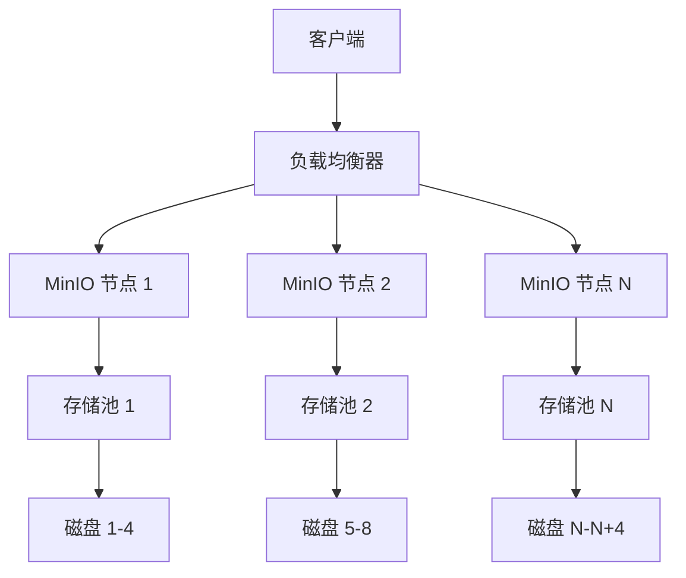
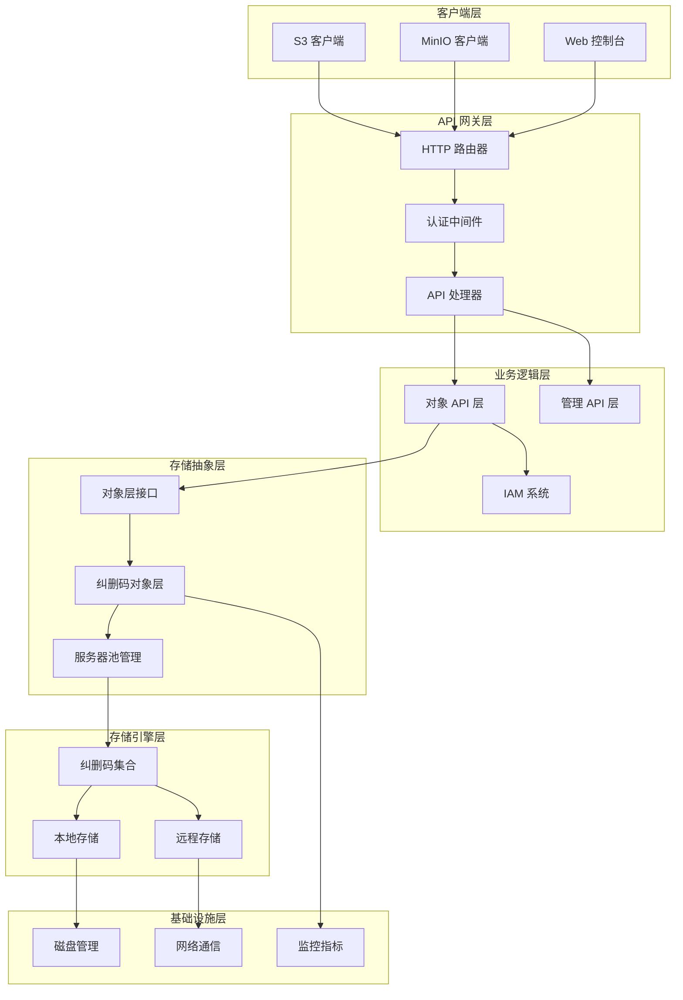
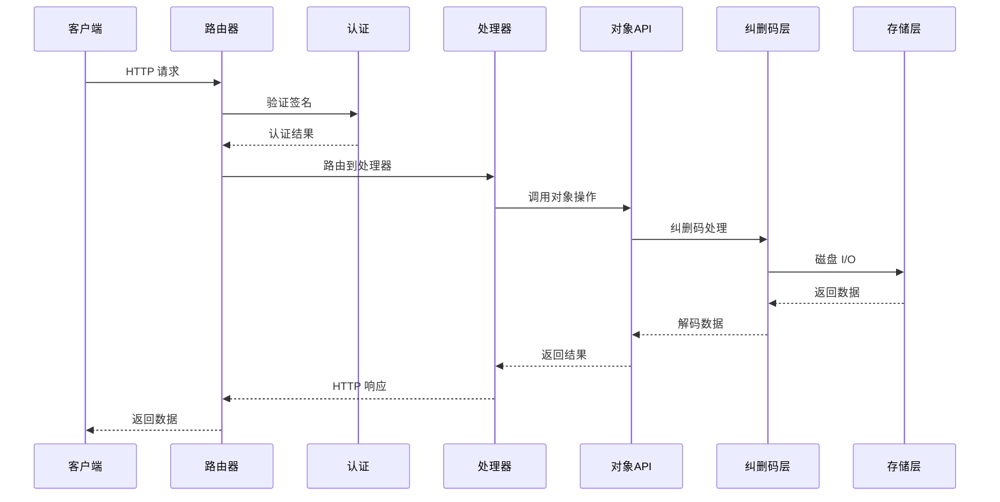
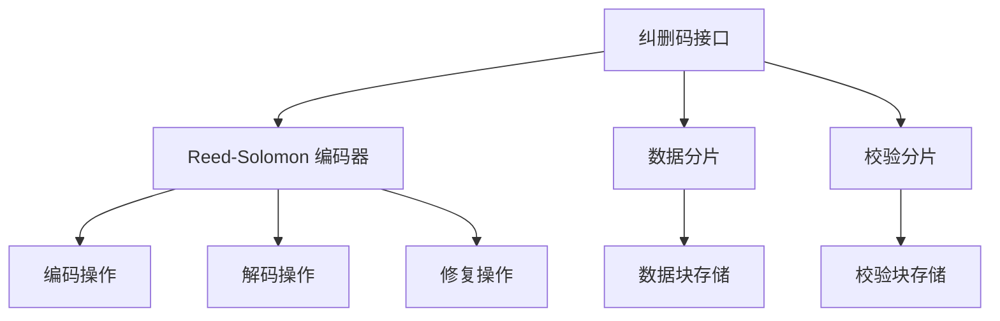
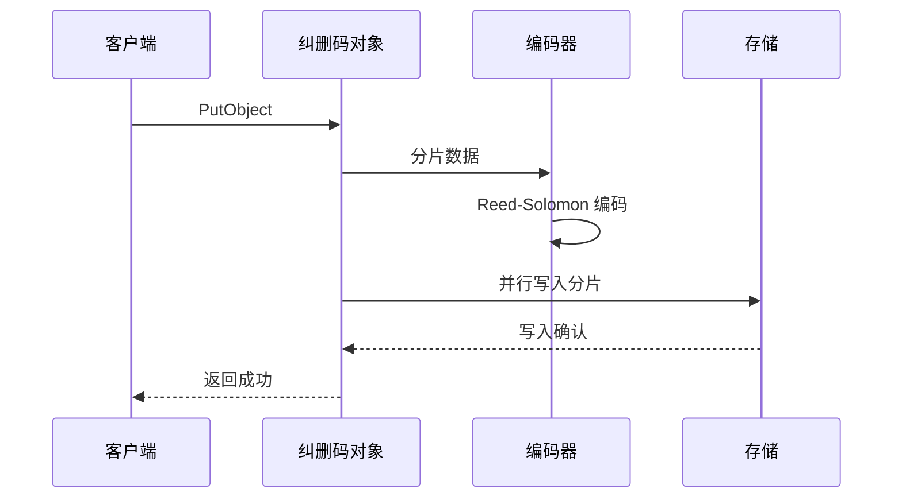
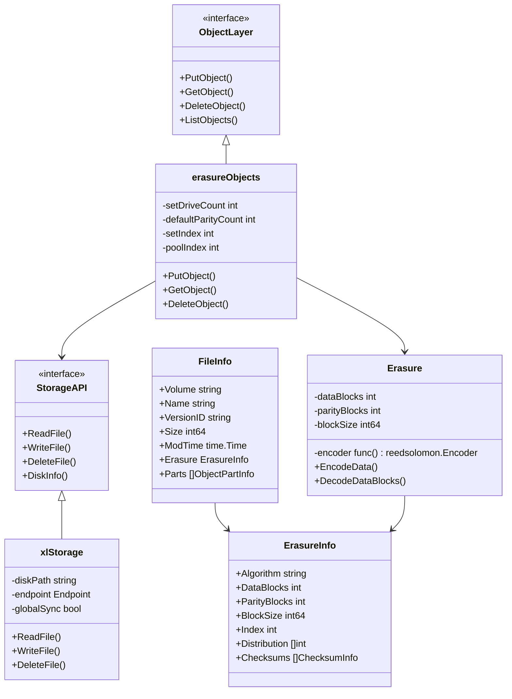
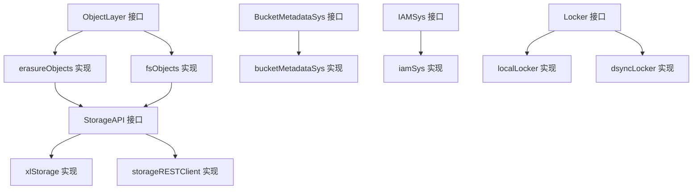

# MinIO 源码深度剖析文档

## 目录
1. [框架使用手册](#1-框架使用手册)
2. [对外 API 深入分析](#2-对外-api-深入分析)
3. [整体架构图和时序图](#3-整体架构图和时序图)
4. [核心模块详细分析](#4-核心模块详细分析)
5. [关键数据结构和继承关系](#5-关键数据结构和继承关系)
6. [实战经验总结](#6-实战经验总结)

---

## 1. 框架使用手册

### 1.1 MinIO 简介

MinIO 是一个高性能的分布式对象存储系统，采用 Go 语言开发，兼容 Amazon S3 API。它使用纠删码技术提供数据冗余和高可用性。

### 1.2 核心特性

- **S3 兼容性**: 完全兼容 Amazon S3 API
- **纠删码**: 使用 Reed-Solomon 纠删码提供数据保护
- **分布式架构**: 支持多节点分布式部署
- **高性能**: 优化的 I/O 路径和并发处理
- **企业级功能**: 支持版本控制、生命周期管理、复制等

### 1.3 部署架构



### 1.4 启动流程

```go
// main.go - 程序入口
func main() {
    minio.Main(os.Args)
}

// cmd/main.go - 主要启动逻辑
func Main(args []string) {
    appName := filepath.Base(args[0])
    if err := newApp(appName).Run(args); err != nil {
        os.Exit(1)
    }
}
```

---

## 2. 对外 API 深入分析

### 2.1 API 路由架构

MinIO 的 API 路由通过 `gorilla/mux` 路由器实现，主要在 `cmd/api-router.go` 中定义：

```go
// registerAPIRouter - 注册 S3 兼容 API
func registerAPIRouter(router *mux.Router) {
    // 初始化 API 处理器
    api := objectAPIHandlers{
        ObjectAPI: newObjectLayerFn,
    }
    
    // API 路由器
    apiRouter := router.PathPrefix(SlashSeparator).Subrouter()
    
    // 对象操作路由
    // HeadObject
    router.Methods(http.MethodHead).Path("/{object:.+}").
        HandlerFunc(s3APIMiddleware(api.HeadObjectHandler))
    
    // GetObject
    router.Methods(http.MethodGet).Path("/{object:.+}").
        HandlerFunc(s3APIMiddleware(api.GetObjectHandler))
    
    // PutObject
    router.Methods(http.MethodPut).Path("/{object:.+}").
        HandlerFunc(s3APIMiddleware(api.PutObjectHandler))
}
```

### 2.2 核心 API 处理器

#### 2.2.1 PutObject API

**入口函数**: `cmd/object-handlers.go:PutObjectHandler`

```go
func (api objectAPIHandlers) PutObjectHandler(w http.ResponseWriter, r *http.Request) {
    ctx := newContext(r, w, "PutObject")
    defer logger.AuditLog(ctx, w, r, mustGetClaimsFromToken(r))
    
    // 解析请求参数
    vars := mux.Vars(r)
    bucket := vars["bucket"]
    object, err := unescapePath(vars["object"])
    
    // 验证权限
    if s3Error := checkRequestAuthType(ctx, r, policy.PutObjectAction, bucket, object); s3Error != ErrNone {
        writeErrorResponse(ctx, w, errorCodes.ToAPIErr(s3Error), r.URL)
        return
    }
    
    // 创建 PutObjReader
    pReader, err := NewPutObjReader(hashReader)
    
    // 调用对象层 PutObject
    objInfo, err := objectAPI.PutObject(ctx, bucket, object, pReader, opts)
}
```

**调用链路**:
1. `PutObjectHandler` → 
2. `erasureObjects.PutObject` → 
3. `erasureObjects.putObject` → 
4. 纠删码编码和存储

#### 2.2.2 GetObject API

**入口函数**: `cmd/object-handlers.go:GetObjectHandler`

```go
func (api objectAPIHandlers) GetObjectHandler(w http.ResponseWriter, r *http.Request) {
    ctx := newContext(r, w, "GetObject")
    
    // 获取对象信息
    gr, err := getObjectNInfo(ctx, bucket, object, rs, r.Header, opts)
    if err != nil {
        writeErrorResponse(ctx, w, toAPIError(ctx, err), r.URL)
        return
    }
    defer gr.Close()
    
    // 设置响应头
    setObjectHeaders(w, objInfo, rs, opts)
    
    // 写入响应数据
    if _, err = xioutil.Copy(w, gr); err != nil {
        if !httpRequestCanceled(ctx, w) {
            writeErrorResponse(ctx, w, toAPIError(ctx, err), r.URL)
        }
    }
}
```

### 2.3 管理 API

MinIO 提供丰富的管理 API，定义在 `cmd/admin-router.go`：

```go
func registerAdminRouter(router *mux.Router, enableConfigOps bool) {
    adminAPI := adminAPIHandlers{}
    adminRouter := router.PathPrefix(adminPathPrefix).Subrouter()
    
    // 服务器信息
    adminRouter.Methods(http.MethodGet).Path(adminVersion + "/info").
        HandlerFunc(adminMiddleware(adminAPI.ServerInfoHandler))
    
    // 存储信息
    adminRouter.Methods(http.MethodGet).Path(adminVersion + "/storageinfo").
        HandlerFunc(adminMiddleware(adminAPI.StorageInfoHandler))
}
```

---

## 3. 整体架构图和时序图

### 3.1 整体架构图



### 3.2 请求处理时序图



---

## 4. 核心模块详细分析

### 4.1 纠删码模块

#### 4.1.1 模块架构



#### 4.1.2 核心实现

**纠删码结构定义** (`cmd/erasure-coding.go`):

```go
// Erasure - 纠删码编码详情
type Erasure struct {
    encoder                  func() reedsolomon.Encoder
    dataBlocks, parityBlocks int
    blockSize                int64
}

// NewErasure 创建新的纠删码存储
func NewErasure(ctx context.Context, dataBlocks, parityBlocks int, blockSize int64) (e Erasure, err error) {
    // 参数合法性检查
    if dataBlocks <= 0 || parityBlocks < 0 {
        return e, reedsolomon.ErrInvShardNum
    }
    
    if dataBlocks+parityBlocks > 256 {
        return e, reedsolomon.ErrMaxShardNum
    }
    
    e = Erasure{
        dataBlocks:   dataBlocks,
        parityBlocks: parityBlocks,
        blockSize:    blockSize,
    }
    
    // 延迟初始化编码器
    var enc reedsolomon.Encoder
    var once sync.Once
    e.encoder = func() reedsolomon.Encoder {
        once.Do(func() {
            e, err := reedsolomon.New(dataBlocks, parityBlocks, 
                reedsolomon.WithAutoGoroutines(int(e.ShardSize())))
            if err != nil {
                panic(err)
            }
            enc = e
        })
        return enc
    }
    return
}
```

**编码操作**:

```go
// EncodeData 对给定数据进行纠删码编码
func (e Erasure) EncodeData(ctx context.Context, data []byte) ([][]byte, error) {
    if len(data) == 0 {
        return make([][]byte, e.dataBlocks+e.parityBlocks), nil
    }
    
    encoded, err := e.encoder().Split(data)
    if err != nil {
        return nil, err
    }
    
    if err = e.encoder().Encode(encoded); err != nil {
        return nil, err
    }
    
    return encoded, nil
}
```

#### 4.1.3 时序图



### 4.2 存储层模块

#### 4.2.1 存储接口定义

**存储 API 接口** (`cmd/storage-interface.go`):

```go
// StorageAPI 存储接口定义
type StorageAPI interface {
    // 磁盘操作
    DiskInfo(ctx context.Context, opts DiskInfoOptions) (info DiskInfo, err error)
    NSScanner(ctx context.Context, cache dataUsageCache, updates chan<- dataUsageEntry, scanMode madmin.HealScanMode) (dataUsageCache, error)
    
    // 文件操作
    MakeVol(ctx context.Context, volume string) (err error)
    ListVols(ctx context.Context) (vols []VolInfo, err error)
    StatVol(ctx context.Context, volume string) (vol VolInfo, err error)
    DeleteVol(ctx context.Context, volume string, forceDelete bool) (err error)
    
    // 对象操作
    ListDir(ctx context.Context, volume, dirPath string, count int) ([]string, error)
    ReadFile(ctx context.Context, volume string, path string, offset int64, buf []byte, verifier *BitrotVerifier) (n int64, err error)
    AppendFile(ctx context.Context, volume string, path string, buf []byte) (err error)
    CreateFile(ctx context.Context, volume, path string, size int64, reader io.Reader) error
    ReadFileStream(ctx context.Context, volume, path string, offset, length int64) (io.ReadCloser, error)
    RenameFile(ctx context.Context, srcVolume, srcPath, dstVolume, dstPath string) error
    RenameData(ctx context.Context, srcVolume, srcPath string, fi FileInfo, dstVolume, dstPath string, opts RenameOptions) (sign uint64, err error)
    
    // 元数据操作
    CheckParts(ctx context.Context, volume string, path string, fi FileInfo) error
    Delete(ctx context.Context, volume string, path string, opts DeleteOptions) (err error)
    VerifyFile(ctx context.Context, volume, path string, fi FileInfo) error
    
    // 状态检查
    IsOnline() bool
    LastConn() time.Time
    IsLocal() bool
    Endpoint() Endpoint
    Hostname() string
    Healing() *healingTracker
    NSScanner(ctx context.Context, cache dataUsageCache, updates chan<- dataUsageEntry, scanMode madmin.HealScanMode) (dataUsageCache, error)
}
```

#### 4.2.2 文件信息结构

**FileInfo 结构** (`cmd/storage-datatypes.go`):

```go
// FileInfo 表示存储在磁盘上的文件信息
type FileInfo struct {
    // 卷名
    Volume string `msg:"v,omitempty"`
    
    // 文件名
    Name string `msg:"n,omitempty"`
    
    // 版本 ID
    VersionID string `msg:"vid,omitempty"`
    
    // 是否为最新版本
    IsLatest bool `msg:"is"`
    
    // 删除标记
    Deleted bool `msg:"del"`
    
    // 过渡状态
    TransitionStatus string `msg:"ts"`
    TransitionedObjName string `msg:"to"`
    TransitionTier string `msg:"tt"`
    TransitionVersionID string `msg:"tv"`
    ExpireRestored bool `msg:"exp"`
    
    // 数据目录
    DataDir string `msg:"dd"`
    
    // V1 格式标记
    XLV1 bool `msg:"v1"`
    
    // 修改时间
    ModTime time.Time `msg:"mt"`
    
    // 文件大小
    Size int64 `msg:"sz"`
    
    // 文件模式
    Mode uint32 `msg:"m"`
    
    // 创建版本
    WrittenByVersion uint64 `msg:"wv"`
    
    // 元数据
    Metadata map[string]string `msg:"meta"`
    
    // 分片信息
    Parts []ObjectPartInfo `msg:"parts"`
    
    // 纠删码信息
    Erasure ErasureInfo `msg:"ei"`
    
    // 删除标记
    MarkDeleted bool `msg:"md"`
    
    // 复制状态
    ReplicationState ReplicationState `msg:"rs"`
    
    // 可选数据
    Data []byte `msg:"d,allownil"`
    
    // 版本数量
    NumVersions int `msg:"nv"`
    SuccessorModTime time.Time `msg:"smt"`
}
```

### 4.3 对象层模块

#### 4.3.1 对象 API 接口

**ObjectLayer 接口** (`cmd/object-api-interface.go`):

```go
// ObjectLayer 对象存储接口
type ObjectLayer interface {
    // 存储信息
    StorageInfo(ctx context.Context, local bool) StorageInfo
    
    // 桶操作
    MakeBucketWithLocation(ctx context.Context, bucket string, opts BucketOptions) error
    GetBucketInfo(ctx context.Context, bucket string, opts BucketOptions) (bucketInfo BucketInfo, err error)
    ListBuckets(ctx context.Context, opts BucketOptions) (buckets []BucketInfo, err error)
    DeleteBucket(ctx context.Context, bucket string, opts DeleteBucketOptions) error
    
    // 对象操作
    GetObjectNInfo(ctx context.Context, bucket, object string, rs *HTTPRangeSpec, h http.Header, opts ObjectOptions) (reader *GetObjectReader, err error)
    GetObjectInfo(ctx context.Context, bucket, object string, opts ObjectOptions) (objInfo ObjectInfo, err error)
    PutObject(ctx context.Context, bucket, object string, data *PutObjReader, opts ObjectOptions) (objInfo ObjectInfo, err error)
    CopyObject(ctx context.Context, srcBucket, srcObject, destBucket, destObject string, srcInfo ObjectInfo, srcOpts, dstOpts ObjectOptions) (objInfo ObjectInfo, err error)
    DeleteObject(ctx context.Context, bucket, object string, opts ObjectOptions) (ObjectInfo, error)
    DeleteObjects(ctx context.Context, bucket string, objects []ObjectToDelete, opts ObjectOptions) ([]DeletedObject, []error)
    
    // 多部分上传
    ListMultipartUploads(ctx context.Context, bucket, prefix, keyMarker, uploadIDMarker, delimiter string, maxUploads int) (result ListMultipartsInfo, err error)
    NewMultipartUpload(ctx context.Context, bucket, object string, opts ObjectOptions) (result NewMultipartInfo, err error)
    CopyObjectPart(ctx context.Context, srcBucket, srcObject, destBucket, destObject string, uploadID string, partID int, startOffset int64, length int64, srcInfo ObjectInfo, srcOpts, dstOpts ObjectOptions) (info PartInfo, err error)
    PutObjectPart(ctx context.Context, bucket, object, uploadID string, partID int, data *PutObjReader, opts ObjectOptions) (info PartInfo, err error)
    GetMultipartInfo(ctx context.Context, bucket, object, uploadID string, opts ObjectOptions) (info MultipartInfo, err error)
    ListObjectParts(ctx context.Context, bucket, object, uploadID string, partNumberMarker int, maxParts int, opts ObjectOptions) (result ListPartsInfo, err error)
    AbortMultipartUpload(ctx context.Context, bucket, object, uploadID string, opts ObjectOptions) error
    CompleteMultipartUpload(ctx context.Context, bucket, object, uploadID string, uploadedParts []CompletePart, opts ObjectOptions) (objInfo ObjectInfo, err error)
    
    // 对象列表
    ListObjects(ctx context.Context, bucket, prefix, marker, delimiter string, maxKeys int) (result ListObjectsInfo, err error)
    ListObjectsV2(ctx context.Context, bucket, prefix, continuationToken, delimiter string, maxKeys int, fetchOwner bool, startAfter string) (result ListObjectsV2Info, err error)
    ListObjectVersions(ctx context.Context, bucket, prefix, keyMarker, versionMarker, delimiter string, maxKeys int) (ListObjectVersionsInfo, error)
    
    // 健康检查
    Health(ctx context.Context, opts HealthOptions) HealthResult
    ReadHealth(ctx context.Context) bool
    
    // 后台任务
    NewNSLock(bucket string, objects ...string) RWLocker
}
```

#### 4.3.2 纠删码对象实现

**erasureObjects 结构**:

```go
// erasureObjects - 实现 ObjectLayer 接口的纠删码对象
type erasureObjects struct {
    setDriveCount      int
    defaultParityCount int
    setIndex           int
    poolIndex          int
    
    // getDisks 返回当前纠删码集合的磁盘列表
    getDisks func() []StorageAPI
    
    // getLockers 返回当前纠删码集合的锁定器列表
    getLockers func() ([]dsync.NetLocker, string)
    
    // getEndpoints 返回当前纠删码集合的端点列表
    getEndpoints func() func() []Endpoint
    
    nsMutex *nsLockMap
    bp      *bpool.BytePoolCap
    
    // ndau: 非对齐更新
    ndau uint64
    
    // mrfUploads: 需要重试的上传
    mrfUploads chan partialOperation
}
```

**PutObject 实现**:

```go
func (er erasureObjects) PutObject(ctx context.Context, bucket, object string, r *PutObjReader, opts ObjectOptions) (ObjectInfo, error) {
    auditObjectErasureSet(ctx, "PutObject", object, &er)
    
    data := r.Reader
    
    // 验证输入数据大小
    if data.Size() < -1 {
        return ObjectInfo{}, toObjectErr(errInvalidArgument)
    }
    
    // 获取存储磁盘
    storageDisks := er.getDisks()
    
    // 计算奇偶校验驱动器数量
    parityDrives := globalStorageClass.GetParityForSC(opts.UserDefined[xhttp.AmzStorageClass])
    if parityDrives < 0 {
        parityDrives = er.defaultParityCount
    }
    
    // 处理最大奇偶校验
    if opts.MaxParity {
        parityDrives = len(storageDisks) / 2
    }
    
    dataDrives := len(storageDisks) - parityDrives
    
    // 计算写入法定人数
    writeQuorum := dataDrives
    if dataDrives == parityDrives {
        writeQuorum++
    }
    
    // 初始化分片元数据
    partsMetadata := make([]FileInfo, len(storageDisks))
    
    fi := newFileInfo(pathJoin(bucket, object), dataDrives, parityDrives)
    fi.VersionID = opts.VersionID
    if opts.Versioned && fi.VersionID == "" {
        fi.VersionID = mustGetUUID()
    }
    
    fi.DataDir = mustGetUUID()
    uniqueID := mustGetUUID()
    tempObj := uniqueID
    
    // 初始化纠删码元数据
    for index := range partsMetadata {
        partsMetadata[index] = fi
    }
    
    // 根据纠删码分布排序磁盘
    var onlineDisks []StorageAPI
    onlineDisks, partsMetadata = shuffleDisksAndPartsMetadata(storageDisks, partsMetadata, fi)
    
    erasure, err := NewErasure(ctx, fi.Erasure.DataBlocks, fi.Erasure.ParityBlocks, fi.Erasure.BlockSize)
    if err != nil {
        return ObjectInfo{}, toObjectErr(err, bucket, object)
    }
    
    // 写入对象数据
    n, erasureErr := erasureCreateFile(ctx, onlineDisks, minioMetaTmpBucket, tempObj, fi.Size, erasure, data, writeQuorum)
    if erasureErr != nil {
        return ObjectInfo{}, toObjectErr(erasureErr, bucket, object)
    }
    
    // 提交对象
    _, err = commitErasureObject(ctx, onlineDisks, minioMetaTmpBucket, tempObj, minioMetaBucket, object, partsMetadata, writeQuorum)
    if err != nil {
        return ObjectInfo{}, toObjectErr(err, bucket, object)
    }
    
    return fi.ToObjectInfo(bucket, object, opts.Versioned || opts.VersionSuspended), nil
}
```

---

## 5. 关键数据结构和继承关系

### 5.1 核心数据结构关系图



### 5.2 关键结构体详解

#### 5.2.1 ErasureInfo 结构

```go
// ErasureInfo 保存纠删码和位腐败相关信息
type ErasureInfo struct {
    // Algorithm 纠删码算法的字符串表示
    Algorithm string `json:"algorithm"`
    
    // DataBlocks 纠删码的数据块数量
    DataBlocks int `json:"data"`
    
    // ParityBlocks 纠删码的奇偶校验块数量
    ParityBlocks int `json:"parity"`
    
    // BlockSize 一个纠删码块的大小
    BlockSize int64 `json:"blockSize"`
    
    // Index 当前磁盘的索引
    Index int `json:"index"`
    
    // Distribution 数据和奇偶校验块的分布
    Distribution []int `json:"distribution"`
    
    // Checksums 所有纠删码块的位腐败校验和
    Checksums []ChecksumInfo `json:"checksum,omitempty"`
}
```

#### 5.2.2 ObjectInfo 结构

```go
// ObjectInfo - 表示对象元数据
type ObjectInfo struct {
    // 桶名
    Bucket string
    
    // 对象名
    Name string
    
    // 修改时间
    ModTime time.Time
    
    // 对象大小
    Size int64
    
    // 是否为目录
    IsDir bool
    
    // ETag 对象的 etag
    ETag string
    
    // VersionID 对象版本 ID
    VersionID string
    
    // IsLatest 是否为最新版本
    IsLatest bool
    
    // DeleteMarker 删除标记
    DeleteMarker bool
    
    // 内容类型
    ContentType string
    
    // 内容编码
    ContentEncoding string
    
    // 过期时间
    Expires time.Time
    
    // 缓存控制
    CacheControl string
    
    // 缓存状态
    CacheStatus CacheStatusType
    
    // 用户定义的元数据
    UserDefined map[string]string
    
    // 用户标签
    UserTags string
    
    // 复制状态
    ReplicationStatusInternal string
    ReplicationStatus        replication.StatusType
    
    // 版本清除状态
    VersionPurgeStatusInternal string
    VersionPurgeStatus         VersionPurgeStatusType
    
    // 过渡状态
    TransitionedObject TransitionedObject
    
    // 恢复信息
    RestoreExpires time.Time
    RestoreOngoing bool
    
    // 存储类别
    StorageClass string
    
    // 分片信息
    Parts []ObjectPartInfo
    
    // 校验和信息
    Checksum ChecksumInfo
    
    // 内部信息
    AccTime                  time.Time
    Legacy                   bool
    VersionOnly              bool
    DeleteMarkerReplicationStatus string
    MarkDeleted                   bool
    DeleteMarkerMTime             time.Time
    NumVersions                   int
    SuccessorModTime              time.Time
}
```

### 5.3 接口继承关系



---

## 6. 实战经验总结

### 6.1 性能优化经验

#### 6.1.1 I/O 优化

1. **并行 I/O**: MinIO 使用 goroutine 池并行处理磁盘 I/O
2. **直接 I/O**: 在支持的平台上使用 O_DIRECT 标志避免页缓存
3. **预读优化**: 实现智能预读机制减少磁盘寻道时间

```go
// 并行写入示例
func (er erasureObjects) putObject(ctx context.Context, bucket, object string, r *PutObjReader, opts ObjectOptions) (ObjectInfo, error) {
    // 创建并行写入通道
    writers := make([]io.WriteCloser, len(onlineDisks))
    
    // 启动并行写入 goroutine
    for i, disk := range onlineDisks {
        go func(i int, disk StorageAPI) {
            defer wg.Done()
            writers[i] = newBitrotWriter(disk, minioMetaTmpBucket, tempErasureObj, erasure.ShardFileSize(fi.Size), DefaultBitrotAlgorithm, erasure.ShardSize())
        }(i, disk)
    }
}
```

#### 6.1.2 内存管理

1. **对象池**: 使用 sync.Pool 复用缓冲区
2. **零拷贝**: 尽可能避免数据复制
3. **流式处理**: 对大对象使用流式处理避免内存溢出

```go
// 缓冲池使用示例
var erasureEncodePool = sync.Pool{
    New: func() interface{} {
        return make([][]byte, 16)
    },
}

func getErasureEncodeBuffer() [][]byte {
    return erasureEncodePool.Get().([][]byte)
}

func putErasureEncodeBuffer(buf [][]byte) {
    erasureEncodePool.Put(buf)
}
```

### 6.2 可靠性保障

#### 6.2.1 数据完整性

1. **校验和验证**: 每个数据块都有对应的校验和
2. **位腐败检测**: 使用 BLAKE2b 算法检测位腐败
3. **自动修复**: 检测到错误时自动从其他副本修复

```go
// 位腐败验证示例
func (b *BitrotVerifier) Verify(buf []byte) error {
    if b.algorithm.Available() {
        if !b.algorithm.Equal(b.sum, b.algorithm.New().Sum(buf)) {
            return errBitrotHashAlgoInvalid
        }
    }
    return nil
}
```

#### 6.2.2 故障恢复

1. **自愈机制**: 后台扫描和自动修复损坏的对象
2. **优雅降级**: 在部分磁盘故障时继续提供服务
3. **数据重建**: 支持在线添加磁盘和数据重建

### 6.3 扩展性设计

#### 6.3.1 水平扩展

1. **服务器池**: 支持多个服务器池动态扩展
2. **一致性哈希**: 使用一致性哈希分布数据
3. **负载均衡**: 内置负载均衡机制

#### 6.3.2 垂直扩展

1. **动态配置**: 支持运行时配置更新
2. **资源监控**: 实时监控 CPU、内存、磁盘使用情况
3. **自适应调优**: 根据负载自动调整参数

### 6.4 运维最佳实践

#### 6.4.1 监控指标

```go
// 关键监控指标
var (
    // API 请求指标
    httpRequestsDuration = prometheus.NewHistogramVec(
        prometheus.HistogramOpts{
            Name: "minio_http_requests_duration_seconds",
            Help: "Time taken by requests served by current MinIO server instance",
        },
        []string{"api", "method", "statuscode"},
    )
    
    // 存储指标
    storageUsageInfo = prometheus.NewGaugeVec(
        prometheus.GaugeOpts{
            Name: "minio_disk_storage_used_bytes",
            Help: "Total disk storage used by current MinIO server instance",
        },
        []string{"disk"},
    )
)
```

#### 6.4.2 日志管理

1. **结构化日志**: 使用 JSON 格式的结构化日志
2. **日志级别**: 支持动态调整日志级别
3. **审计日志**: 记录所有 API 访问的审计日志

#### 6.4.3 备份策略

1. **跨区域复制**: 配置跨区域自动复制
2. **版本控制**: 启用对象版本控制
3. **生命周期管理**: 配置自动归档和删除策略

### 6.5 故障排查指南

#### 6.5.1 常见问题

1. **磁盘故障**: 检查磁盘健康状态和 SMART 信息
2. **网络问题**: 验证节点间网络连通性
3. **权限问题**: 检查文件系统权限和 IAM 配置

#### 6.5.2 调试工具

1. **健康检查**: 使用内置健康检查 API
2. **性能分析**: 启用 pprof 进行性能分析
3. **日志分析**: 分析错误日志和访问日志

---

## 总结

MinIO 是一个设计精良的分布式对象存储系统，其核心优势包括：

1. **高性能**: 优化的 I/O 路径和并发处理
2. **高可靠**: 纠删码技术和自愈机制
3. **易扩展**: 灵活的架构设计支持水平和垂直扩展
4. **S3 兼容**: 完全兼容 Amazon S3 API
5. **企业级**: 丰富的企业级功能和管理工具

通过深入理解 MinIO 的源码架构，开发者可以更好地使用、定制和扩展这个强大的对象存储系统。
