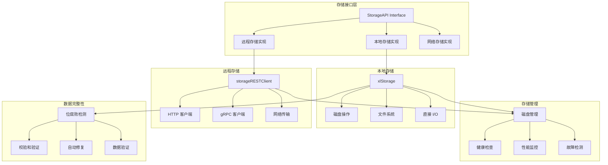

# MinIO 模块分析 - 存储抽象层

## 模块概述

存储抽象层是 MinIO 架构中的关键组件，它提供了统一的存储接口，屏蔽了不同存储后端的实现细节。该层支持本地磁盘存储和远程存储，并提供了丰富的存储操作接口。

## 模块架构图



## 核心接口定义

### 1. StorageAPI 接口

```go
// StorageAPI 存储接口定义了所有存储操作
type StorageAPI interface {
    // 磁盘信息和管理
    DiskInfo(ctx context.Context, opts DiskInfoOptions) (info DiskInfo, err error)
    NSScanner(ctx context.Context, cache dataUsageCache, updates chan<- dataUsageEntry, 
        scanMode madmin.HealScanMode) (dataUsageCache, error)
    
    // 卷操作
    MakeVol(ctx context.Context, volume string) (err error)
    ListVols(ctx context.Context) (vols []VolInfo, err error)
    StatVol(ctx context.Context, volume string) (vol VolInfo, err error)
    DeleteVol(ctx context.Context, volume string, forceDelete bool) (err error)
    
    // 目录操作
    ListDir(ctx context.Context, volume, dirPath string, count int) ([]string, error)
    
    // 文件读取操作
    ReadFile(ctx context.Context, volume string, path string, offset int64, buf []byte, 
        verifier *BitrotVerifier) (n int64, err error)
    ReadFileStream(ctx context.Context, volume, path string, offset, length int64) (io.ReadCloser, error)
    
    // 文件写入操作
    AppendFile(ctx context.Context, volume string, path string, buf []byte) (err error)
    CreateFile(ctx context.Context, volume, path string, size int64, reader io.Reader) error
    
    // 文件操作
    RenameFile(ctx context.Context, srcVolume, srcPath, dstVolume, dstPath string) error
    RenameData(ctx context.Context, srcVolume, srcPath string, fi FileInfo, 
        dstVolume, dstPath string, opts RenameOptions) (sign uint64, err error)
    
    // 元数据操作
    CheckParts(ctx context.Context, volume string, path string, fi FileInfo) error
    Delete(ctx context.Context, volume string, path string, opts DeleteOptions) (err error)
    VerifyFile(ctx context.Context, volume, path string, fi FileInfo) error
    
    // 版本操作
    WriteMetadata(ctx context.Context, volume, path string, fi FileInfo) error
    UpdateMetadata(ctx context.Context, volume, path string, fi FileInfo, opts RenameOptions) error
    ReadVersion(ctx context.Context, volume, path, versionID string, readData bool) (fi FileInfo, err error)
    ReadXL(ctx context.Context, volume, path string, readData bool) (rf RawFileInfo, err error)
    ReadAll(ctx context.Context, volume string, path string) (buf []byte, err error)
    
    // 状态检查
    IsOnline() bool
    LastConn() time.Time
    IsLocal() bool
    Endpoint() Endpoint
    Hostname() string
    Healing() *healingTracker
    
    // 关闭连接
    Close() error
    
    // 获取磁盘 ID
    GetDiskID() (string, error)
    
    // 设置磁盘 ID
    SetDiskID(id string)
    
    // 磁盘位置信息
    GetDiskLoc() (poolIdx, setIdx, diskIdx int)
    SetDiskLoc(poolIdx, setIdx, diskIdx int)
}
```

### 2. 核心数据结构

#### DiskInfo 结构

```go
// DiskInfo 磁盘信息结构
type DiskInfo struct {
    // 磁盘总容量（字节）
    Total uint64 `msg:"total"`
    
    // 磁盘可用空间（字节）
    Free uint64 `msg:"free"`
    
    // 磁盘已用空间（字节）
    Used uint64 `msg:"used"`
    
    // 可用 inode 数量
    FreeInodes uint64 `msg:"finodes"`
    
    // 文件系统类型
    FSType string `msg:"fstype"`
    
    // 根磁盘标记
    RootDisk bool `msg:"root"`
    
    // 修复信息
    Healing bool `msg:"heal"`
    
    // 扫描信息
    Scanning bool `msg:"scan"`
    
    // 磁盘 ID
    ID string `msg:"id"`
    
    // 端点信息
    Endpoint string `msg:"endpoint"`
    
    // 挂载路径
    MountPath string `msg:"mountpath"`
    
    // 错误信息
    Error string `msg:"error"`
    
    // 性能指标
    Metrics *DiskMetrics `msg:"metrics,omitempty"`
    
    // 磁盘状态
    State string `msg:"state"`
    
    // 本地磁盘标记
    Local bool `msg:"local"`
}

// DiskMetrics 磁盘性能指标
type DiskMetrics struct {
    // API 调用延迟
    APILatencies map[string]string `msg:"apiLatencies,omitempty"`
    
    // API 调用次数
    APICalls map[string]uint64 `msg:"apiCalls,omitempty"`
    
    // 最后活动时间
    LastMinute map[string]TimedAction `msg:"lastMinute,omitempty"`
}
```

#### FileInfo 结构

```go
// FileInfo 文件信息结构（已在前面模块中详细介绍）
type FileInfo struct {
    Volume    string            `msg:"v,omitempty"`
    Name      string            `msg:"n,omitempty"`
    VersionID string            `msg:"vid,omitempty"`
    IsLatest  bool              `msg:"is"`
    Deleted   bool              `msg:"del"`
    DataDir   string            `msg:"dd"`
    XLV1      bool              `msg:"v1"`
    ModTime   time.Time         `msg:"mt"`
    Size      int64             `msg:"sz"`
    Mode      uint32            `msg:"m"`
    Metadata  map[string]string `msg:"meta"`
    Parts     []ObjectPartInfo  `msg:"parts"`
    Erasure   ErasureInfo       `msg:"ei"`
    // ... 其他字段
}
```

## 本地存储实现 (xlStorage)

### 1. xlStorage 结构体

```go
// xlStorage 本地存储实现
type xlStorage struct {
    // 磁盘路径
    diskPath string
    
    // 端点信息
    endpoint Endpoint
    
    // 磁盘 ID
    diskID string
    
    // 格式数据
    formatData []byte
    
    // 格式最后检查时间
    formatLastCheck time.Time
    
    // 磁盘信息缓存
    diskInfoCache timedValue
    
    // 全局同步标记
    globalSync bool
    
    // 磁盘位置
    poolIndex, setIndex, diskIndex int
    
    // 修复跟踪器
    healing *healingTracker
    
    // API 指标
    apiCalls    *apiCallsMap
    apiLatencies *apiLatenciesMap
    
    // 互斥锁
    mutex sync.RWMutex
}

// NewXLStorage 创建新的本地存储实例
func NewXLStorage(ep Endpoint, diskID string, cleanUp bool) (*xlStorage, error) {
    path := ep.Path
    
    // 验证路径
    if path == "" {
        return nil, errInvalidArgument
    }
    
    // 创建存储实例
    xl := &xlStorage{
        diskPath:      path,
        endpoint:      ep,
        diskID:        diskID,
        globalSync:    env.Get(config.EnvFSOSync, config.EnableOff) == config.EnableOn,
        apiCalls:      newAPICallsMap(),
        apiLatencies:  newAPILatenciesMap(),
        healing:       &healingTracker{},
    }
    
    // 初始化磁盘信息缓存
    xl.diskInfoCache.TTL = time.Second
    xl.diskInfoCache.Update = func() (interface{}, error) {
        return getDiskInfo(xl.diskPath)
    }
    
    return xl, nil
}
```

### 2. 磁盘信息获取

```go
// DiskInfo 获取磁盘信息
func (s *xlStorage) DiskInfo(ctx context.Context, opts DiskInfoOptions) (info DiskInfo, err error) {
    s.apiCalls.Inc("DiskInfo")
    defer func() {
        s.apiLatencies.Update("DiskInfo", time.Since(time.Now()))
    }()
    
    if opts.NoOp {
        // 仅返回基本信息，不进行实际磁盘检查
        return DiskInfo{
            ID:       s.diskID,
            Endpoint: s.endpoint.String(),
            Local:    s.endpoint.IsLocal,
        }, nil
    }
    
    // 从缓存获取磁盘信息
    cached := s.diskInfoCache.Get()
    if cached != nil {
        info = cached.(DiskInfo)
    } else {
        // 获取实时磁盘信息
        info, err = getDiskInfo(s.diskPath)
        if err != nil {
            return info, err
        }
        s.diskInfoCache.Set(info)
    }
    
    // 设置额外信息
    info.ID = s.diskID
    info.Endpoint = s.endpoint.String()
    info.Local = s.endpoint.IsLocal
    info.Healing = s.healing.isHealing()
    
    // 添加性能指标
    if opts.Metrics {
        info.Metrics = &DiskMetrics{
            APILatencies: s.apiLatencies.String(),
            APICalls:     s.apiCalls.String(),
        }
    }
    
    return info, nil
}

// getDiskInfo 获取磁盘的实际信息
func getDiskInfo(diskPath string) (DiskInfo, error) {
    var stat unix.Statfs_t
    err := unix.Statfs(diskPath, &stat)
    if err != nil {
        return DiskInfo{}, err
    }
    
    // 计算磁盘使用情况
    total := uint64(stat.Blocks) * uint64(stat.Bsize)
    free := uint64(stat.Bavail) * uint64(stat.Bsize)
    used := total - free
    
    // 获取文件系统类型
    fsType := getFSType(stat.Type)
    
    // 检查是否为根磁盘
    rootDisk := isRootDisk(diskPath)
    
    return DiskInfo{
        Total:      total,
        Free:       free,
        Used:       used,
        FreeInodes: uint64(stat.Ffree),
        FSType:     fsType,
        RootDisk:   rootDisk,
        MountPath:  diskPath,
    }, nil
}
```

### 3. 文件操作实现

#### 文件读取

```go
// ReadFile 读取文件数据
func (s *xlStorage) ReadFile(ctx context.Context, volume string, path string, 
    offset int64, buf []byte, verifier *BitrotVerifier) (n int64, err error) {
    
    s.apiCalls.Inc("ReadFile")
    defer func() {
        s.apiLatencies.Update("ReadFile", time.Since(time.Now()))
    }()
    
    // 构建文件路径
    volumeDir, err := s.getVolDir(volume)
    if err != nil {
        return 0, err
    }
    
    filePath := pathJoin(volumeDir, path)
    
    // 打开文件
    file, err := os.OpenFile(filePath, readMode, 0)
    if err != nil {
        return 0, osErrToFileErr(err)
    }
    defer file.Close()
    
    // 定位到指定偏移量
    if offset > 0 {
        if _, err = file.Seek(offset, io.SeekStart); err != nil {
            return 0, osErrToFileErr(err)
        }
    }
    
    // 读取数据
    var totalRead int64
    for len(buf) > 0 {
        nr, er := file.Read(buf)
        if nr > 0 {
            // 验证数据完整性
            if verifier != nil {
                if err := verifier.Verify(buf[:nr]); err != nil {
                    return totalRead, err
                }
            }
            
            totalRead += int64(nr)
            buf = buf[nr:]
        }
        
        if er != nil {
            if er == io.EOF {
                break
            }
            return totalRead, osErrToFileErr(er)
        }
    }
    
    return totalRead, nil
}

// ReadFileStream 创建文件读取流
func (s *xlStorage) ReadFileStream(ctx context.Context, volume, path string, 
    offset, length int64) (io.ReadCloser, error) {
    
    s.apiCalls.Inc("ReadFileStream")
    defer func() {
        s.apiLatencies.Update("ReadFileStream", time.Since(time.Now()))
    }()
    
    // 构建文件路径
    volumeDir, err := s.getVolDir(volume)
    if err != nil {
        return nil, err
    }
    
    filePath := pathJoin(volumeDir, path)
    
    // 打开文件
    file, err := os.OpenFile(filePath, readMode, 0)
    if err != nil {
        return nil, osErrToFileErr(err)
    }
    
    // 定位到指定偏移量
    if offset > 0 {
        if _, err = file.Seek(offset, io.SeekStart); err != nil {
            file.Close()
            return nil, osErrToFileErr(err)
        }
    }
    
    // 如果指定了长度，使用 LimitReader
    if length > 0 {
        return &limitedFileReader{
            file:  file,
            limit: length,
        }, nil
    }
    
    return file, nil
}

// limitedFileReader 限制读取长度的文件读取器
type limitedFileReader struct {
    file  *os.File
    limit int64
    read  int64
}

func (l *limitedFileReader) Read(p []byte) (n int, err error) {
    if l.read >= l.limit {
        return 0, io.EOF
    }
    
    if int64(len(p)) > l.limit-l.read {
        p = p[:l.limit-l.read]
    }
    
    n, err = l.file.Read(p)
    l.read += int64(n)
    return n, err
}

func (l *limitedFileReader) Close() error {
    return l.file.Close()
}
```

#### 文件写入

```go
// CreateFile 创建文件
func (s *xlStorage) CreateFile(ctx context.Context, volume, path string, 
    size int64, reader io.Reader) error {
    
    s.apiCalls.Inc("CreateFile")
    defer func() {
        s.apiLatencies.Update("CreateFile", time.Since(time.Now()))
    }()
    
    // 构建文件路径
    volumeDir, err := s.getVolDir(volume)
    if err != nil {
        return err
    }
    
    filePath := pathJoin(volumeDir, path)
    
    // 确保父目录存在
    if err := os.MkdirAll(filepath.Dir(filePath), 0755); err != nil {
        return osErrToFileErr(err)
    }
    
    // 创建临时文件
    tmpPath := filePath + ".tmp"
    
    // 创建文件
    file, err := os.OpenFile(tmpPath, writeMode, 0644)
    if err != nil {
        return osErrToFileErr(err)
    }
    
    // 确保清理临时文件
    defer func() {
        file.Close()
        if err != nil {
            os.Remove(tmpPath)
        }
    }()
    
    // 预分配磁盘空间
    if size > 0 {
        if err := file.Truncate(size); err != nil {
            return osErrToFileErr(err)
        }
    }
    
    // 写入数据
    _, err = io.Copy(file, reader)
    if err != nil {
        return osErrToFileErr(err)
    }
    
    // 同步到磁盘
    if s.globalSync {
        if err := file.Sync(); err != nil {
            return osErrToFileErr(err)
        }
    }
    
    // 关闭文件
    if err := file.Close(); err != nil {
        return osErrToFileErr(err)
    }
    
    // 原子性重命名
    if err := os.Rename(tmpPath, filePath); err != nil {
        return osErrToFileErr(err)
    }
    
    return nil
}

// AppendFile 追加文件数据
func (s *xlStorage) AppendFile(ctx context.Context, volume string, path string, buf []byte) error {
    s.apiCalls.Inc("AppendFile")
    defer func() {
        s.apiLatencies.Update("AppendFile", time.Since(time.Now()))
    }()
    
    // 构建文件路径
    volumeDir, err := s.getVolDir(volume)
    if err != nil {
        return err
    }
    
    filePath := pathJoin(volumeDir, path)
    
    // 打开文件进行追加
    file, err := os.OpenFile(filePath, os.O_CREATE|os.O_WRONLY|os.O_APPEND, 0644)
    if err != nil {
        return osErrToFileErr(err)
    }
    defer file.Close()
    
    // 写入数据
    _, err = file.Write(buf)
    if err != nil {
        return osErrToFileErr(err)
    }
    
    // 同步到磁盘
    if s.globalSync {
        if err := file.Sync(); err != nil {
            return osErrToFileErr(err)
        }
    }
    
    return nil
}
```

### 4. 元数据操作

#### 元数据写入

```go
// WriteMetadata 写入元数据
func (s *xlStorage) WriteMetadata(ctx context.Context, volume, path string, fi FileInfo) error {
    s.apiCalls.Inc("WriteMetadata")
    defer func() {
        s.apiLatencies.Update("WriteMetadata", time.Since(time.Now()))
    }()
    
    // 构建元数据路径
    volumeDir, err := s.getVolDir(volume)
    if err != nil {
        return err
    }
    
    metaPath := pathJoin(volumeDir, path, xlStorageFormatFile)
    
    // 序列化元数据
    buf, err := fi.MarshalMsg(nil)
    if err != nil {
        return err
    }
    
    // 确保父目录存在
    if err := os.MkdirAll(filepath.Dir(metaPath), 0755); err != nil {
        return osErrToFileErr(err)
    }
    
    // 写入元数据文件
    tmpPath := metaPath + ".tmp"
    
    if err := ioutil.WriteFile(tmpPath, buf, 0644); err != nil {
        return osErrToFileErr(err)
    }
    
    // 原子性重命名
    if err := os.Rename(tmpPath, metaPath); err != nil {
        os.Remove(tmpPath)
        return osErrToFileErr(err)
    }
    
    return nil
}

// ReadVersion 读取版本元数据
func (s *xlStorage) ReadVersion(ctx context.Context, volume, path, versionID string, 
    readData bool) (fi FileInfo, err error) {
    
    s.apiCalls.Inc("ReadVersion")
    defer func() {
        s.apiLatencies.Update("ReadVersion", time.Since(time.Now()))
    }()
    
    // 构建元数据路径
    volumeDir, err := s.getVolDir(volume)
    if err != nil {
        return fi, err
    }
    
    var metaPath string
    if versionID != "" {
        metaPath = pathJoin(volumeDir, path, versionID, xlStorageFormatFile)
    } else {
        metaPath = pathJoin(volumeDir, path, xlStorageFormatFile)
    }
    
    // 读取元数据文件
    buf, err := ioutil.ReadFile(metaPath)
    if err != nil {
        return fi, osErrToFileErr(err)
    }
    
    // 反序列化元数据
    _, err = fi.UnmarshalMsg(buf)
    if err != nil {
        return fi, err
    }
    
    // 如果需要读取数据
    if readData && len(fi.Data) == 0 && fi.Size > 0 {
        dataPath := pathJoin(volumeDir, path, "part.1")
        if versionID != "" {
            dataPath = pathJoin(volumeDir, path, versionID, "part.1")
        }
        
        data, err := ioutil.ReadFile(dataPath)
        if err != nil {
            return fi, osErrToFileErr(err)
        }
        
        fi.Data = data
    }
    
    return fi, nil
}
```

## 远程存储实现 (storageRESTClient)

### 1. storageRESTClient 结构体

```go
// storageRESTClient 远程存储客户端
type storageRESTClient struct {
    endpoint   Endpoint
    restClient *rest.Client
    diskID     string
    
    // 连接状态
    connected  int32 // atomic
    lastConn   int64 // atomic (unix timestamp)
    
    // 磁盘位置
    poolIndex, setIndex, diskIndex int
    
    // 修复跟踪器
    healing *healingTracker
}

// newStorageRESTClient 创建新的远程存储客户端
func newStorageRESTClient(endpoint Endpoint, healthcheck bool) *storageRESTClient {
    serverURL := &url.URL{
        Scheme: endpoint.Scheme,
        Host:   endpoint.Host,
        Path:   path.Join(storageRESTPrefix, endpoint.Path),
    }
    
    restClient := rest.NewClient(serverURL, globalInternodeTransport, newAuthToken)
    restClient.HealthCheckFn = func() bool {
        ctx, cancel := context.WithTimeout(GlobalContext, restClientHealthCheckTimeout)
        defer cancel()
        
        respBody, err := restClient.Call(ctx, storageRESTMethodHealth, nil, nil, -1)
        xhttp.DrainBody(respBody)
        return !isNetworkError(err)
    }
    
    if healthcheck {
        restClient.HealthCheckInterval = restClientHealthCheckInterval
        restClient.HealthCheckTimeout = restClientHealthCheckTimeout
    }
    
    return &storageRESTClient{
        endpoint:   endpoint,
        restClient: restClient,
        healing:    &healingTracker{},
    }
}
```

### 2. 远程调用实现

#### 磁盘信息获取

```go
// DiskInfo 获取远程磁盘信息
func (client *storageRESTClient) DiskInfo(ctx context.Context, opts DiskInfoOptions) (info DiskInfo, err error) {
    // 准备请求参数
    values := make(url.Values)
    values.Set(storageRESTDiskID, client.diskID)
    if opts.Metrics {
        values.Set(storageRESTMetrics, "true")
    }
    if opts.NoOp {
        values.Set(storageRESTNoOp, "true")
    }
    
    // 发送 REST 请求
    respBody, err := client.restClient.Call(ctx, storageRESTMethodDiskInfo, values, nil, -1)
    if err != nil {
        return
    }
    defer xhttp.DrainBody(respBody)
    
    // 解析响应
    if err = msgp.Decode(respBody, &info); err != nil {
        return info, err
    }
    
    // 更新连接状态
    atomic.StoreInt32(&client.connected, 1)
    atomic.StoreInt64(&client.lastConn, time.Now().Unix())
    
    return info, nil
}
```

#### 文件操作

```go
// ReadFile 远程读取文件
func (client *storageRESTClient) ReadFile(ctx context.Context, volume string, path string, 
    offset int64, buf []byte, verifier *BitrotVerifier) (int64, error) {
    
    // 准备请求参数
    values := make(url.Values)
    values.Set(storageRESTVolume, volume)
    values.Set(storageRESTFilePath, path)
    values.Set(storageRESTOffset, strconv.FormatInt(offset, 10))
    values.Set(storageRESTLength, strconv.Itoa(len(buf)))
    
    // 添加位腐败验证器信息
    if verifier != nil {
        values.Set(storageRESTBitrotAlgo, verifier.algorithm.String())
        values.Set(storageRESTBitrotHash, hex.EncodeToString(verifier.sum))
    }
    
    // 发送请求
    respBody, err := client.restClient.Call(ctx, storageRESTMethodReadFile, values, nil, -1)
    if err != nil {
        return 0, err
    }
    defer xhttp.DrainBody(respBody)
    
    // 读取响应数据
    n, err := io.ReadFull(respBody, buf)
    return int64(n), err
}

// CreateFile 远程创建文件
func (client *storageRESTClient) CreateFile(ctx context.Context, volume, path string, 
    size int64, reader io.Reader) error {
    
    // 准备请求参数
    values := make(url.Values)
    values.Set(storageRESTVolume, volume)
    values.Set(storageRESTFilePath, path)
    values.Set(storageRESTLength, strconv.FormatInt(size, 10))
    
    // 发送请求（带数据流）
    respBody, err := client.restClient.CallWithContext(ctx, storageRESTMethodCreateFile, 
        values, reader, size)
    if err != nil {
        return err
    }
    defer xhttp.DrainBody(respBody)
    
    return nil
}
```

### 3. 网络错误处理

```go
// IsOnline 检查远程存储是否在线
func (client *storageRESTClient) IsOnline() bool {
    return atomic.LoadInt32(&client.connected) == 1
}

// LastConn 获取最后连接时间
func (client *storageRESTClient) LastConn() time.Time {
    return time.Unix(atomic.LoadInt64(&client.lastConn), 0)
}

// 网络错误检测
func isNetworkError(err error) bool {
    if err == nil {
        return false
    }
    
    // 检查常见的网络错误
    if errors.Is(err, context.DeadlineExceeded) ||
       errors.Is(err, context.Canceled) ||
       isErrIgnored(err) {
        return true
    }
    
    // 检查网络连接错误
    if urlErr, ok := err.(*url.Error); ok {
        if netErr, ok := urlErr.Err.(*net.OpError); ok {
            return netErr.Temporary() || netErr.Timeout()
        }
    }
    
    return false
}

// 连接重试机制
func (client *storageRESTClient) callWithRetry(ctx context.Context, method string, 
    values url.Values, body io.Reader, length int64) (io.ReadCloser, error) {
    
    const maxRetries = 3
    var lastErr error
    
    for i := 0; i < maxRetries; i++ {
        respBody, err := client.restClient.Call(ctx, method, values, body, length)
        if err == nil {
            // 更新连接状态
            atomic.StoreInt32(&client.connected, 1)
            atomic.StoreInt64(&client.lastConn, time.Now().Unix())
            return respBody, nil
        }
        
        lastErr = err
        
        // 如果不是网络错误，不重试
        if !isNetworkError(err) {
            break
        }
        
        // 标记为离线
        atomic.StoreInt32(&client.connected, 0)
        
        // 等待后重试
        select {
        case <-ctx.Done():
            return nil, ctx.Err()
        case <-time.After(time.Duration(i+1) * time.Second):
        }
    }
    
    return nil, lastErr
}
```

## 位腐败检测和数据完整性

### 1. BitrotVerifier 实现

```go
// BitrotVerifier 位腐败验证器
type BitrotVerifier struct {
    algorithm BitrotAlgorithm
    sum       []byte
}

// BitrotAlgorithm 位腐败检测算法接口
type BitrotAlgorithm interface {
    Available() bool
    New() hash.Hash
    String() string
}

// BLAKE2b256 算法实现
type blake2b256 struct{}

func (b blake2b256) Available() bool { return true }
func (b blake2b256) New() hash.Hash  { 
    h, _ := blake2b.New256(nil)
    return h
}
func (b blake2b256) String() string { return "blake2b" }

// NewBitrotVerifier 创建新的位腐败验证器
func NewBitrotVerifier(algorithm BitrotAlgorithm, sum []byte) *BitrotVerifier {
    return &BitrotVerifier{
        algorithm: algorithm,
        sum:       sum,
    }
}

// Verify 验证数据完整性
func (b *BitrotVerifier) Verify(buf []byte) error {
    if !b.algorithm.Available() {
        return nil
    }
    
    // 计算数据哈希
    hasher := b.algorithm.New()
    hasher.Write(buf)
    computed := hasher.Sum(nil)
    
    // 比较哈希值
    if !bytes.Equal(b.sum, computed) {
        return errBitrotHashMismatch
    }
    
    return nil
}
```

### 2. 数据完整性保护

```go
// bitrotWriter 带位腐败检测的写入器
type bitrotWriter struct {
    disk      StorageAPI
    volume    string
    path      string
    algorithm BitrotAlgorithm
    hasher    hash.Hash
    checksums [][]byte
    shardSize int64
    buffer    []byte
}

// Write 写入数据并计算校验和
func (b *bitrotWriter) Write(p []byte) (int, error) {
    // 将数据添加到缓冲区
    b.buffer = append(b.buffer, p...)
    
    // 当缓冲区达到分片大小时处理
    for len(b.buffer) >= int(b.shardSize) {
        shard := b.buffer[:b.shardSize]
        b.buffer = b.buffer[b.shardSize:]
        
        // 计算分片校验和
        b.hasher.Reset()
        b.hasher.Write(shard)
        checksum := b.hasher.Sum(nil)
        b.checksums = append(b.checksums, checksum)
        
        // 写入分片数据
        if err := b.disk.AppendFile(context.Background(), b.volume, b.path, shard); err != nil {
            return 0, err
        }
    }
    
    return len(p), nil
}

// Close 完成写入并保存校验和
func (b *bitrotWriter) Close() error {
    // 处理剩余数据
    if len(b.buffer) > 0 {
        b.hasher.Reset()
        b.hasher.Write(b.buffer)
        checksum := b.hasher.Sum(nil)
        b.checksums = append(b.checksums, checksum)
        
        if err := b.disk.AppendFile(context.Background(), b.volume, b.path, b.buffer); err != nil {
            return err
        }
    }
    
    // 保存校验和信息
    checksumPath := b.path + ".checksum"
    checksumData, err := json.Marshal(b.checksums)
    if err != nil {
        return err
    }
    
    return b.disk.AppendFile(context.Background(), b.volume, checksumPath, checksumData)
}
```

## 性能监控和指标

### 1. API 调用统计

```go
// apiCallsMap API 调用计数器
type apiCallsMap struct {
    calls map[string]uint64
    mutex sync.RWMutex
}

func newAPICallsMap() *apiCallsMap {
    return &apiCallsMap{
        calls: make(map[string]uint64),
    }
}

func (a *apiCallsMap) Inc(api string) {
    a.mutex.Lock()
    a.calls[api]++
    a.mutex.Unlock()
}

func (a *apiCallsMap) String() map[string]uint64 {
    a.mutex.RLock()
    defer a.mutex.RUnlock()
    
    result := make(map[string]uint64, len(a.calls))
    for k, v := range a.calls {
        result[k] = v
    }
    return result
}
```

### 2. 延迟统计

```go
// apiLatenciesMap API 延迟统计
type apiLatenciesMap struct {
    latencies map[string]*latencyTracker
    mutex     sync.RWMutex
}

type latencyTracker struct {
    total    time.Duration
    count    uint64
    min, max time.Duration
}

func newAPILatenciesMap() *apiLatenciesMap {
    return &apiLatenciesMap{
        latencies: make(map[string]*latencyTracker),
    }
}

func (a *apiLatenciesMap) Update(api string, duration time.Duration) {
    a.mutex.Lock()
    defer a.mutex.Unlock()
    
    tracker, exists := a.latencies[api]
    if !exists {
        tracker = &latencyTracker{
            min: duration,
            max: duration,
        }
        a.latencies[api] = tracker
    }
    
    tracker.total += duration
    tracker.count++
    
    if duration < tracker.min {
        tracker.min = duration
    }
    if duration > tracker.max {
        tracker.max = duration
    }
}

func (a *apiLatenciesMap) String() map[string]string {
    a.mutex.RLock()
    defer a.mutex.RUnlock()
    
    result := make(map[string]string, len(a.latencies))
    for api, tracker := range a.latencies {
        avg := tracker.total / time.Duration(tracker.count)
        result[api] = fmt.Sprintf("avg:%v min:%v max:%v count:%d", 
            avg, tracker.min, tracker.max, tracker.count)
    }
    return result
}
```

## 健康检查和故障检测

### 1. 磁盘健康检查

```go
// healingTracker 修复状态跟踪器
type healingTracker struct {
    mutex   sync.RWMutex
    healing bool
    since   time.Time
}

func (h *healingTracker) isHealing() bool {
    h.mutex.RLock()
    defer h.mutex.RUnlock()
    return h.healing
}

func (h *healingTracker) setHealing(healing bool) {
    h.mutex.Lock()
    defer h.mutex.Unlock()
    
    h.healing = healing
    if healing {
        h.since = time.Now()
    }
}

// 磁盘健康检查
func (s *xlStorage) checkDiskHealth(ctx context.Context) error {
    // 检查磁盘空间
    info, err := s.DiskInfo(ctx, DiskInfoOptions{})
    if err != nil {
        return err
    }
    
    // 检查可用空间是否充足
    if info.Free < minFreeDisk {
        return errDiskFull
    }
    
    // 检查 inode 是否充足
    if info.FreeInodes < minFreeInodes {
        return errFaultyDisk
    }
    
    // 执行简单的读写测试
    testPath := pathJoin(s.diskPath, ".minio.sys", "health-check")
    testData := []byte("health-check")
    
    // 写入测试
    if err := ioutil.WriteFile(testPath, testData, 0644); err != nil {
        return err
    }
    
    // 读取测试
    data, err := ioutil.ReadFile(testPath)
    if err != nil {
        return err
    }
    
    // 验证数据
    if !bytes.Equal(testData, data) {
        return errFaultyDisk
    }
    
    // 清理测试文件
    os.Remove(testPath)
    
    return nil
}
```

### 2. 自动故障恢复

```go
// 磁盘故障自动恢复
func (s *xlStorage) autoRecover(ctx context.Context) {
    ticker := time.NewTicker(30 * time.Second)
    defer ticker.Stop()
    
    for {
        select {
        case <-ctx.Done():
            return
        case <-ticker.C:
            // 执行健康检查
            if err := s.checkDiskHealth(ctx); err != nil {
                // 标记磁盘为故障状态
                s.setOffline()
                
                // 等待一段时间后重试
                time.Sleep(5 * time.Minute)
                continue
            }
            
            // 磁盘恢复正常
            if !s.IsOnline() {
                s.setOnline()
                logger.Info("Disk %s recovered from failure", s.diskPath)
            }
        }
    }
}

func (s *xlStorage) setOffline() {
    // 实现磁盘离线逻辑
}

func (s *xlStorage) setOnline() {
    // 实现磁盘上线逻辑
}
```

## 总结

MinIO 的存储抽象层是一个功能完整、性能优化的模块，具有以下特点：

1. **统一接口**: 提供了统一的存储操作接口，支持本地和远程存储
2. **高性能**: 优化的 I/O 操作和并行处理
3. **数据完整性**: 完整的位腐败检测和数据验证机制
4. **故障恢复**: 自动的健康检查和故障恢复能力
5. **监控完善**: 详细的性能指标和操作统计
6. **网络优化**: 智能的重试机制和连接管理

这个模块为 MinIO 的高可靠性和高性能提供了坚实的基础。
