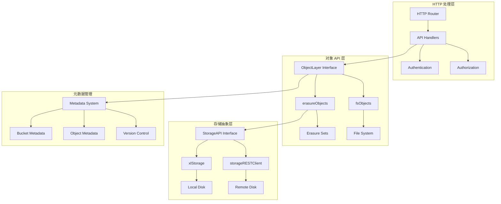
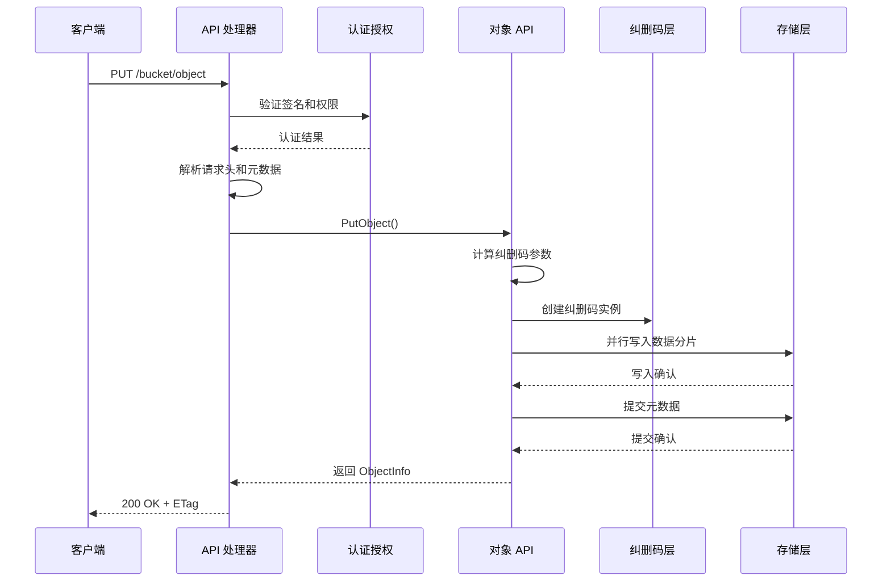
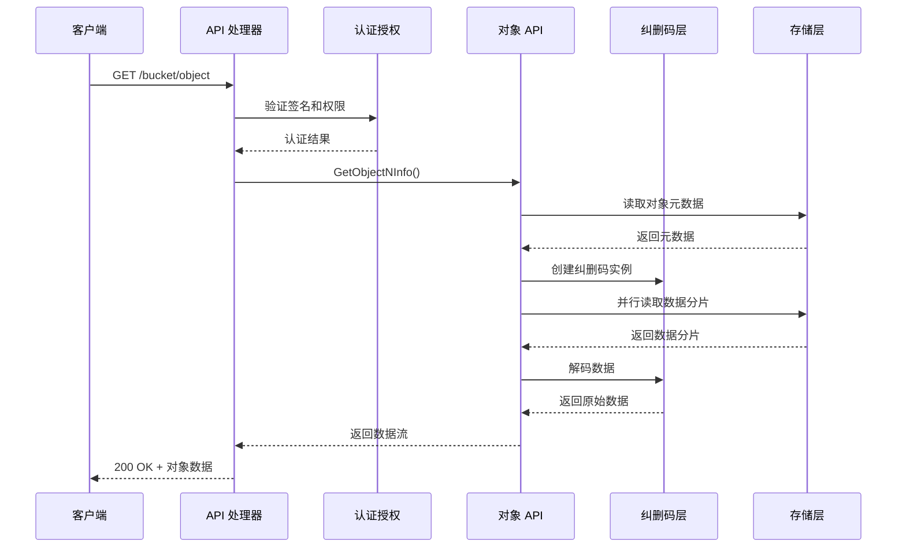

# MinIO 模块分析 - 对象 API 层

## 模块概述

对象 API 层是 MinIO 的核心业务逻辑层，负责处理所有 S3 兼容的对象操作。它提供了统一的对象存储接口，屏蔽了底层存储实现的复杂性。

## 模块架构图



## 核心接口定义

### 1. ObjectLayer 接口

```go
// ObjectLayer 对象存储层接口
type ObjectLayer interface {
    // 存储信息
    StorageInfo(ctx context.Context, local bool) StorageInfo
    
    // 桶操作
    MakeBucketWithLocation(ctx context.Context, bucket string, opts BucketOptions) error
    GetBucketInfo(ctx context.Context, bucket string, opts BucketOptions) (bucketInfo BucketInfo, err error)
    ListBuckets(ctx context.Context, opts BucketOptions) (buckets []BucketInfo, err error)
    DeleteBucket(ctx context.Context, bucket string, opts DeleteBucketOptions) error
    
    // 对象操作
    GetObjectNInfo(ctx context.Context, bucket, object string, rs *HTTPRangeSpec, 
        h http.Header, opts ObjectOptions) (reader *GetObjectReader, err error)
    GetObjectInfo(ctx context.Context, bucket, object string, opts ObjectOptions) (objInfo ObjectInfo, err error)
    PutObject(ctx context.Context, bucket, object string, data *PutObjReader, 
        opts ObjectOptions) (objInfo ObjectInfo, err error)
    CopyObject(ctx context.Context, srcBucket, srcObject, destBucket, destObject string, 
        srcInfo ObjectInfo, srcOpts, dstOpts ObjectOptions) (objInfo ObjectInfo, err error)
    DeleteObject(ctx context.Context, bucket, object string, opts ObjectOptions) (ObjectInfo, error)
    DeleteObjects(ctx context.Context, bucket string, objects []ObjectToDelete, 
        opts ObjectOptions) ([]DeletedObject, []error)
    
    // 多部分上传
    ListMultipartUploads(ctx context.Context, bucket, prefix, keyMarker, uploadIDMarker, 
        delimiter string, maxUploads int) (result ListMultipartsInfo, err error)
    NewMultipartUpload(ctx context.Context, bucket, object string, 
        opts ObjectOptions) (result NewMultipartInfo, err error)
    CopyObjectPart(ctx context.Context, srcBucket, srcObject, destBucket, destObject string, 
        uploadID string, partID int, startOffset int64, length int64, srcInfo ObjectInfo, 
        srcOpts, dstOpts ObjectOptions) (info PartInfo, err error)
    PutObjectPart(ctx context.Context, bucket, object, uploadID string, partID int, 
        data *PutObjReader, opts ObjectOptions) (info PartInfo, err error)
    GetMultipartInfo(ctx context.Context, bucket, object, uploadID string, 
        opts ObjectOptions) (info MultipartInfo, err error)
    ListObjectParts(ctx context.Context, bucket, object, uploadID string, partNumberMarker int, 
        maxParts int, opts ObjectOptions) (result ListPartsInfo, err error)
    AbortMultipartUpload(ctx context.Context, bucket, object, uploadID string, 
        opts ObjectOptions) error
    CompleteMultipartUpload(ctx context.Context, bucket, object, uploadID string, 
        uploadedParts []CompletePart, opts ObjectOptions) (objInfo ObjectInfo, err error)
    
    // 对象列表
    ListObjects(ctx context.Context, bucket, prefix, marker, delimiter string, 
        maxKeys int) (result ListObjectsInfo, err error)
    ListObjectsV2(ctx context.Context, bucket, prefix, continuationToken, delimiter string, 
        maxKeys int, fetchOwner bool, startAfter string) (result ListObjectsV2Info, err error)
    ListObjectVersions(ctx context.Context, bucket, prefix, keyMarker, versionMarker, 
        delimiter string, maxKeys int) (ListObjectVersionsInfo, error)
    
    // 健康检查
    Health(ctx context.Context, opts HealthOptions) HealthResult
    ReadHealth(ctx context.Context) bool
    
    // 锁管理
    NewNSLock(bucket string, objects ...string) RWLocker
}
```

### 2. 核心数据结构

#### ObjectInfo 结构

```go
// ObjectInfo 表示对象元数据
type ObjectInfo struct {
    // 基本信息
    Bucket    string    `json:"bucket"`
    Name      string    `json:"name"`
    ModTime   time.Time `json:"modTime"`
    Size      int64     `json:"size"`
    IsDir     bool      `json:"isDir"`
    ETag      string    `json:"etag"`
    
    // 版本控制
    VersionID    string `json:"versionId,omitempty"`
    IsLatest     bool   `json:"isLatest"`
    DeleteMarker bool   `json:"deleteMarker"`
    
    // HTTP 头信息
    ContentType     string    `json:"contentType,omitempty"`
    ContentEncoding string    `json:"contentEncoding,omitempty"`
    Expires         time.Time `json:"expires,omitempty"`
    CacheControl    string    `json:"cacheControl,omitempty"`
    CacheStatus     CacheStatusType `json:"cacheStatus"`
    
    // 用户定义的元数据和标签
    UserDefined map[string]string `json:"userDefined,omitempty"`
    UserTags    string            `json:"userTags,omitempty"`
    
    // 复制状态
    ReplicationStatusInternal string                `json:"replicationStatusInternal"`
    ReplicationStatus         replication.StatusType `json:"replicationStatus"`
    
    // 版本清除状态
    VersionPurgeStatusInternal string                 `json:"versionPurgeStatusInternal"`
    VersionPurgeStatus         VersionPurgeStatusType `json:"versionPurgeStatus"`
    
    // 过渡状态（用于生命周期管理）
    TransitionedObject TransitionedObject `json:"transitionedObject"`
    
    // 恢复信息（用于归档存储）
    RestoreExpires time.Time `json:"restoreExpires,omitempty"`
    RestoreOngoing bool      `json:"restoreOngoing"`
    
    // 存储类别
    StorageClass string `json:"storageClass,omitempty"`
    
    // 分片信息（用于多部分上传）
    Parts []ObjectPartInfo `json:"parts,omitempty"`
    
    // 校验和信息
    Checksum ChecksumInfo `json:"checksum,omitempty"`
    
    // 内部字段
    AccTime                       time.Time `json:"accTime"`
    Legacy                        bool      `json:"legacy"`
    VersionOnly                   bool      `json:"versionOnly"`
    DeleteMarkerReplicationStatus string    `json:"deleteMarkerReplicationStatus"`
    MarkDeleted                   bool      `json:"markDeleted"`
    DeleteMarkerMTime             time.Time `json:"deleteMarkerMTime"`
    NumVersions                   int       `json:"numVersions"`
    SuccessorModTime              time.Time `json:"successorModTime"`
}

// ToObjectInfo 将 FileInfo 转换为 ObjectInfo
func (fi FileInfo) ToObjectInfo(bucket, object string, versioned bool) ObjectInfo {
    objInfo := ObjectInfo{
        IsDir:           false,
        Bucket:          bucket,
        Name:            object,
        Size:            fi.Size,
        ModTime:         fi.ModTime,
        Legacy:          fi.XLV1,
        ETag:            extractETag(fi.Metadata),
        ContentType:     fi.Metadata["content-type"],
        ContentEncoding: fi.Metadata["content-encoding"],
        UserDefined:     cleanMetadata(fi.Metadata),
        Parts:           fi.Parts,
        AccTime:         fi.AccTime,
    }
    
    // 处理版本信息
    if versioned {
        objInfo.VersionID = fi.VersionID
        if objInfo.VersionID == "" {
            objInfo.VersionID = nullVersionID
        }
        objInfo.IsLatest = fi.IsLatest
        objInfo.DeleteMarker = fi.Deleted
    }
    
    return objInfo
}
```

## 核心 API 实现分析

### 1. PutObject - 对象上传

#### API 处理器

```go
// PutObjectHandler 处理对象上传请求
func (api objectAPIHandlers) PutObjectHandler(w http.ResponseWriter, r *http.Request) {
    ctx := newContext(r, w, "PutObject")
    defer logger.AuditLog(ctx, w, r, mustGetClaimsFromToken(r))
    
    // 解析请求参数
    vars := mux.Vars(r)
    bucket := vars["bucket"]
    object, err := unescapePath(vars["object"])
    if err != nil {
        writeErrorResponse(ctx, w, toAPIError(ctx, err), r.URL)
        return
    }
    
    // 验证桶名和对象名
    if s3Error := checkRequestAuthType(ctx, r, policy.PutObjectAction, bucket, object); s3Error != ErrNone {
        writeErrorResponse(ctx, w, errorCodes.ToAPIErr(s3Error), r.URL)
        return
    }
    
    // 解析对象选项
    opts, err := putObjectOptions(ctx, r, bucket, object)
    if err != nil {
        writeErrorResponse(ctx, w, toAPIError(ctx, err), r.URL)
        return
    }
    
    // 创建哈希读取器
    hashReader, err := hash.NewReader(ctx, r.Body, size, "", "", actualSize)
    if err != nil {
        writeErrorResponse(ctx, w, toAPIError(ctx, err), r.URL)
        return
    }
    
    // 创建 PutObjReader
    pReader, err := NewPutObjReader(hashReader)
    if err != nil {
        writeErrorResponse(ctx, w, toAPIError(ctx, err), r.URL)
        return
    }
    
    // 调用对象层 PutObject
    objInfo, err := objectAPI.PutObject(ctx, bucket, object, pReader, opts)
    if err != nil {
        writeErrorResponse(ctx, w, toAPIError(ctx, err), r.URL)
        return
    }
    
    // 设置响应头
    if objInfo.ETag != "" {
        w.Header().Set(xhttp.ETag, "\""+objInfo.ETag+"\"")
    }
    
    if objInfo.VersionID != "" {
        w.Header().Set(xhttp.AmzVersionID, objInfo.VersionID)
    }
    
    writeSuccessResponseHeadersOnly(w)
}
```

#### 纠删码对象实现

```go
// PutObject 在纠删码存储中创建对象
func (er erasureObjects) PutObject(ctx context.Context, bucket, object string, 
    r *PutObjReader, opts ObjectOptions) (ObjectInfo, error) {
    
    // 审计日志
    if !opts.NoAuditLog {
        auditObjectErasureSet(ctx, "PutObject", object, &er)
    }
    
    data := r.Reader
    
    // 验证数据大小
    if data.Size() < -1 {
        return ObjectInfo{}, toObjectErr(errInvalidArgument)
    }
    
    // 获取存储磁盘
    storageDisks := er.getDisks()
    
    // 计算奇偶校验驱动器数量
    parityDrives := globalStorageClass.GetParityForSC(opts.UserDefined[xhttp.AmzStorageClass])
    if parityDrives < 0 {
        parityDrives = er.defaultParityCount
    }
    
    // 处理最大奇偶校验选项
    if opts.MaxParity {
        parityDrives = len(storageDisks) / 2
    }
    
    // 处理可用性优化
    if !opts.MaxParity && globalStorageClass.AvailabilityOptimized() {
        parityOrig := parityDrives
        var offlineDrives int
        
        for _, disk := range storageDisks {
            if disk == nil || !disk.IsOnline() {
                parityDrives++
                offlineDrives++
                continue
            }
        }
        
        // 检查是否有足够的在线磁盘
        if offlineDrives >= (len(storageDisks)+1)/2 {
            return ObjectInfo{}, toObjectErr(errErasureWriteQuorum, bucket, object)
        }
        
        if parityDrives >= len(storageDisks)/2 {
            parityDrives = len(storageDisks) / 2
        }
        
        if parityOrig != parityDrives {
            opts.UserDefined[minIOErasureUpgraded] = strconv.Itoa(parityOrig) + "->" + strconv.Itoa(parityDrives)
        }
    }
    
    dataDrives := len(storageDisks) - parityDrives
    
    // 计算写入法定人数
    writeQuorum := dataDrives
    if dataDrives == parityDrives {
        writeQuorum++
    }
    
    // 初始化分片元数据
    partsMetadata := make([]FileInfo, len(storageDisks))
    
    fi := newFileInfo(pathJoin(bucket, object), dataDrives, parityDrives)
    fi.VersionID = opts.VersionID
    if opts.Versioned && fi.VersionID == "" {
        fi.VersionID = mustGetUUID()
    }
    
    fi.DataDir = mustGetUUID()
    uniqueID := mustGetUUID()
    tempObj := uniqueID
    
    // 设置用户定义的元数据
    fi.Metadata = opts.UserDefined
    if fi.Metadata == nil {
        fi.Metadata = make(map[string]string)
    }
    
    // 初始化纠删码元数据
    for index := range partsMetadata {
        partsMetadata[index] = fi
    }
    
    // 根据纠删码分布排序磁盘
    var onlineDisks []StorageAPI
    onlineDisks, partsMetadata = shuffleDisksAndPartsMetadata(storageDisks, partsMetadata, fi)
    
    // 创建纠删码实例
    erasure, err := NewErasure(ctx, fi.Erasure.DataBlocks, fi.Erasure.ParityBlocks, fi.Erasure.BlockSize)
    if err != nil {
        return ObjectInfo{}, toObjectErr(err, bucket, object)
    }
    
    // 写入对象数据
    n, erasureErr := erasureCreateFile(ctx, onlineDisks, minioMetaTmpBucket, tempObj, 
        fi.Size, erasure, data, writeQuorum)
    if erasureErr != nil {
        return ObjectInfo{}, toObjectErr(erasureErr, bucket, object)
    }
    
    // 更新文件信息
    fi.Size = n
    fi.ModTime = opts.MTime
    if opts.MTime.IsZero() {
        fi.ModTime = UTCNow()
    }
    
    // 提交对象
    _, err = commitErasureObject(ctx, onlineDisks, minioMetaTmpBucket, tempObj, 
        minioMetaBucket, object, partsMetadata, writeQuorum)
    if err != nil {
        return ObjectInfo{}, toObjectErr(err, bucket, object)
    }
    
    return fi.ToObjectInfo(bucket, object, opts.Versioned || opts.VersionSuspended), nil
}
```

### 2. GetObject - 对象下载

#### API 处理器

```go
// GetObjectHandler 处理对象下载请求
func (api objectAPIHandlers) GetObjectHandler(w http.ResponseWriter, r *http.Request) {
    ctx := newContext(r, w, "GetObject")
    defer logger.AuditLog(ctx, w, r, mustGetClaimsFromToken(r))
    
    // 解析请求参数
    vars := mux.Vars(r)
    bucket := vars["bucket"]
    object, err := unescapePath(vars["object"])
    if err != nil {
        writeErrorResponse(ctx, w, toAPIError(ctx, err), r.URL)
        return
    }
    
    // 验证权限
    if s3Error := checkRequestAuthType(ctx, r, policy.GetObjectAction, bucket, object); s3Error != ErrNone {
        writeErrorResponse(ctx, w, errorCodes.ToAPIErr(s3Error), r.URL)
        return
    }
    
    // 解析范围请求
    rangeSpec, err := parseRequestRangeSpec(r.Header.Get(xhttp.Range))
    if err != nil {
        writeErrorResponse(ctx, w, errorCodes.ToAPIErr(ErrInvalidRange), r.URL)
        return
    }
    
    // 解析对象选项
    opts := getObjectOptions(r, bucket, object)
    
    // 获取对象信息和数据流
    gr, err := getObjectNInfo(ctx, bucket, object, rangeSpec, r.Header, opts)
    if err != nil {
        writeErrorResponse(ctx, w, toAPIError(ctx, err), r.URL)
        return
    }
    defer gr.Close()
    
    objInfo := gr.ObjInfo
    
    // 设置响应头
    setObjectHeaders(w, objInfo, rangeSpec, opts)
    
    // 写入响应数据
    if _, err = xioutil.Copy(w, gr); err != nil {
        if !httpRequestCanceled(ctx, w) {
            writeErrorResponse(ctx, w, toAPIError(ctx, err), r.URL)
        }
    }
}
```

#### 纠删码对象实现

```go
// GetObjectNInfo 获取对象信息和数据流
func (er erasureObjects) GetObjectNInfo(ctx context.Context, bucket, object string, 
    rs *HTTPRangeSpec, h http.Header, opts ObjectOptions) (gr *GetObjectReader, err error) {
    
    // 审计日志
    auditObjectErasureSet(ctx, "GetObject", object, &er)
    
    // 获取对象信息
    objInfo, err := er.GetObjectInfo(ctx, bucket, object, opts)
    if err != nil {
        return nil, err
    }
    
    // 处理范围请求
    var startOffset, length int64
    if rs != nil {
        startOffset, length, err = rs.GetOffsetLength(objInfo.Size)
        if err != nil {
            return nil, err
        }
    } else {
        length = objInfo.Size
    }
    
    // 创建对象读取器
    fn, off, length, err := NewGetObjectReader(rs, objInfo, opts)
    if err != nil {
        return nil, err
    }
    
    // 获取纠删码读取器
    pr, pw := io.Pipe()
    go func() {
        defer pw.Close()
        
        // 读取对象数据
        err := er.getObject(ctx, bucket, object, off, length, pw, objInfo.ETag, opts)
        if err != nil {
            pw.CloseWithError(err)
        }
    }()
    
    // 创建 GetObjectReader
    return &GetObjectReader{
        ObjInfo:    objInfo,
        pipeReader: pr,
        cleanUpFns: []func(){fn},
    }, nil
}

// getObject 从纠删码存储中读取对象数据
func (er erasureObjects) getObject(ctx context.Context, bucket, object string, 
    startOffset int64, length int64, writer io.Writer, etag string, opts ObjectOptions) error {
    
    // 获取存储磁盘
    storageDisks := er.getDisks()
    
    // 读取对象元数据
    metaArr, errs := readAllFileInfo(ctx, storageDisks, bucket, object, opts.VersionID, false, false)
    
    // 选择有效的元数据
    fi, metaArr, onlineDisks, err := pickValidFileInfo(ctx, metaArr, errs, er.defaultParityCount)
    if err != nil {
        return err
    }
    
    // 验证 ETag
    if etag != "" && etag != fi.Metadata["etag"] {
        return InvalidETag{}
    }
    
    // 创建纠删码实例
    erasure, err := NewErasure(ctx, fi.Erasure.DataBlocks, fi.Erasure.ParityBlocks, fi.Erasure.BlockSize)
    if err != nil {
        return err
    }
    
    // 并行读取数据分片
    if length == fi.Size {
        // 读取完整对象
        return erasureReadFile(ctx, onlineDisks, bucket, object, writer, fi, erasure)
    } else {
        // 读取对象范围
        return erasureReadFileRange(ctx, onlineDisks, bucket, object, startOffset, length, 
            writer, fi, erasure)
    }
}
```

### 3. ListObjects - 对象列表

#### API 处理器

```go
// ListObjectsV2Handler 处理 ListObjectsV2 请求
func (api objectAPIHandlers) ListObjectsV2Handler(w http.ResponseWriter, r *http.Request) {
    ctx := newContext(r, w, "ListObjectsV2")
    defer logger.AuditLog(ctx, w, r, mustGetClaimsFromToken(r))
    
    // 解析请求参数
    vars := mux.Vars(r)
    bucket := vars["bucket"]
    
    // 验证权限
    if s3Error := checkRequestAuthType(ctx, r, policy.ListBucketAction, bucket, ""); s3Error != ErrNone {
        writeErrorResponse(ctx, w, errorCodes.ToAPIErr(s3Error), r.URL)
        return
    }
    
    // 解析查询参数
    urlValues := r.URL.Query()
    prefix := urlValues.Get("prefix")
    delimiter := urlValues.Get("delimiter")
    continuationToken := urlValues.Get("continuation-token")
    fetchOwner := urlValues.Get("fetch-owner") == "true"
    startAfter := urlValues.Get("start-after")
    
    maxKeys := maxObjectList
    if v := urlValues.Get("max-keys"); v != "" {
        if maxKeys, err = strconv.Atoi(v); err != nil {
            writeErrorResponse(ctx, w, errorCodes.ToAPIErr(ErrInvalidMaxKeys), r.URL)
            return
        }
    }
    
    // 调用对象层 ListObjectsV2
    listObjectsV2Info, err := objectAPI.ListObjectsV2(ctx, bucket, prefix, continuationToken, 
        delimiter, maxKeys, fetchOwner, startAfter)
    if err != nil {
        writeErrorResponse(ctx, w, toAPIError(ctx, err), r.URL)
        return
    }
    
    // 编码响应
    response := generateListObjectsV2Response(bucket, prefix, continuationToken, delimiter, 
        fetchOwner, listObjectsV2Info.IsTruncated, maxKeys, listObjectsV2Info.Objects, 
        listObjectsV2Info.Prefixes, listObjectsV2Info.ContinuationToken, 
        listObjectsV2Info.NextContinuationToken)
    
    // 写入 XML 响应
    writeSuccessResponseXML(w, encodeResponse(response))
}
```

#### 纠删码对象实现

```go
// ListObjectsV2 列出桶中的对象（V2 版本）
func (er erasureObjects) ListObjectsV2(ctx context.Context, bucket, prefix, continuationToken, 
    delimiter string, maxKeys int, fetchOwner bool, startAfter string) (ListObjectsV2Info, error) {
    
    // 验证桶是否存在
    if _, err := er.GetBucketInfo(ctx, bucket, BucketOptions{}); err != nil {
        return ListObjectsV2Info{}, err
    }
    
    // 处理 continuation token
    marker := continuationToken
    if marker == "" && startAfter != "" {
        marker = startAfter
    }
    
    // 调用 ListObjects 实现
    loi, err := er.ListObjects(ctx, bucket, prefix, marker, delimiter, maxKeys)
    if err != nil {
        return ListObjectsV2Info{}, err
    }
    
    // 转换为 V2 格式
    listObjectsV2Info := ListObjectsV2Info{
        IsTruncated:           loi.IsTruncated,
        ContinuationToken:     continuationToken,
        NextContinuationToken: loi.NextMarker,
        Objects:               loi.Objects,
        Prefixes:              loi.Prefixes,
    }
    
    return listObjectsV2Info, nil
}

// ListObjects 列出桶中的对象
func (er erasureObjects) ListObjects(ctx context.Context, bucket, prefix, marker, 
    delimiter string, maxKeys int) (ListObjectsInfo, error) {
    
    // 验证桶是否存在
    if _, err := er.GetBucketInfo(ctx, bucket, BucketOptions{}); err != nil {
        return ListObjectsInfo{}, err
    }
    
    // 使用元缓存进行高效列表
    if globalBucketMetadataSys.isListCacheEnabled(bucket) {
        return er.listObjectsWithMetacache(ctx, bucket, prefix, marker, delimiter, maxKeys)
    }
    
    // 回退到传统列表方法
    return er.listObjectsLegacy(ctx, bucket, prefix, marker, delimiter, maxKeys)
}

// listObjectsWithMetacache 使用元缓存列出对象
func (er erasureObjects) listObjectsWithMetacache(ctx context.Context, bucket, prefix, 
    marker, delimiter string, maxKeys int) (ListObjectsInfo, error) {
    
    // 创建列表参数
    listParams := listPathOptions{
        Bucket:      bucket,
        Prefix:      prefix,
        Separator:   delimiter,
        Limit:       maxKeys,
        Marker:      marker,
        InclDeleted: false,
        AskDisks:    globalAPIConfig.getListQuorum(),
    }
    
    // 获取元缓存
    cache := er.getCachedListing(ctx, listParams)
    if cache != nil {
        return cache.toListObjectsInfo(bucket, prefix, delimiter, marker, maxKeys), nil
    }
    
    // 创建新的元缓存
    cache, err := er.createMetacache(ctx, listParams)
    if err != nil {
        return ListObjectsInfo{}, err
    }
    
    return cache.toListObjectsInfo(bucket, prefix, delimiter, marker, maxKeys), nil
}
```

## 时序图

### PutObject 操作时序



### GetObject 操作时序



## 多部分上传实现

### 1. NewMultipartUpload - 初始化多部分上传

```go
// NewMultipartUpload 初始化多部分上传
func (er erasureObjects) NewMultipartUpload(ctx context.Context, bucket, object string, 
    opts ObjectOptions) (NewMultipartInfo, error) {
    
    // 审计日志
    auditObjectErasureSet(ctx, "NewMultipartUpload", object, &er)
    
    // 生成上传 ID
    uploadID := mustGetUUID()
    
    // 获取存储磁盘
    storageDisks := er.getDisks()
    
    // 计算奇偶校验驱动器数量
    parityDrives := globalStorageClass.GetParityForSC(opts.UserDefined[xhttp.AmzStorageClass])
    if parityDrives < 0 {
        parityDrives = er.defaultParityCount
    }
    dataDrives := len(storageDisks) - parityDrives
    
    // 计算写入法定人数
    writeQuorum := dataDrives
    if dataDrives == parityDrives {
        writeQuorum++
    }
    
    // 创建文件信息
    fi := newFileInfo(pathJoin(bucket, object), dataDrives, parityDrives)
    fi.VersionID = opts.VersionID
    if opts.Versioned && fi.VersionID == "" {
        fi.VersionID = mustGetUUID()
    }
    
    fi.DataDir = mustGetUUID()
    fi.Metadata = opts.UserDefined
    if fi.Metadata == nil {
        fi.Metadata = make(map[string]string)
    }
    
    // 设置多部分上传标记
    fi.Metadata[xhttp.AmzMultipartUpload] = "true"
    
    // 初始化分片元数据
    partsMetadata := make([]FileInfo, len(storageDisks))
    for index := range partsMetadata {
        partsMetadata[index] = fi
    }
    
    // 根据纠删码分布排序磁盘
    onlineDisks, partsMetadata := shuffleDisksAndPartsMetadata(storageDisks, partsMetadata, fi)
    
    // 创建上传目录
    uploadIDPath := er.getUploadIDDir(bucket, object, uploadID)
    
    // 写入初始元数据
    if _, err := writeUniqueFileInfo(ctx, onlineDisks, minioMetaTmpBucket, uploadIDPath, 
        partsMetadata, writeQuorum); err != nil {
        return NewMultipartInfo{}, toObjectErr(err, bucket, object)
    }
    
    return NewMultipartInfo{
        Bucket:   bucket,
        Object:   object,
        UploadID: uploadID,
    }, nil
}
```

### 2. PutObjectPart - 上传分片

```go
// PutObjectPart 上传对象分片
func (er erasureObjects) PutObjectPart(ctx context.Context, bucket, object, uploadID string, 
    partID int, r *PutObjReader, opts ObjectOptions) (PartInfo, error) {
    
    // 审计日志
    if !opts.NoAuditLog {
        auditObjectErasureSet(ctx, "PutObjectPart", object, &er)
    }
    
    data := r.Reader
    
    // 验证数据大小
    if data.Size() < -1 {
        return PartInfo{}, toObjectErr(errInvalidArgument)
    }
    
    uploadIDPath := er.getUploadIDDir(bucket, object, uploadID)
    
    // 验证上传 ID 是否存在
    fi, _, err := er.checkUploadIDExists(ctx, bucket, object, uploadID, true)
    if err != nil {
        if errors.Is(err, errVolumeNotFound) {
            return PartInfo{}, toObjectErr(err, bucket)
        }
        return PartInfo{}, toObjectErr(err, bucket, object, uploadID)
    }
    
    onlineDisks := er.getDisks()
    writeQuorum := fi.WriteQuorum(er.defaultWQuorum())
    
    // 验证校验和类型
    if cs := fi.Metadata[hash.MinIOMultipartChecksum]; cs != "" {
        if r.ContentCRCType().String() != cs {
            return PartInfo{}, InvalidArgument{
                Bucket: bucket,
                Object: fi.Name,
                Err:    fmt.Errorf("checksum missing, want %q, got %q", cs, r.ContentCRCType().String()),
            }
        }
    }
    
    onlineDisks = shuffleDisks(onlineDisks, fi.Erasure.Distribution)
    
    // 生成临时分片名称
    partSuffix := fmt.Sprintf("part.%d", partID)
    tmpPart := fmt.Sprintf("%sx%d", mustGetUUID(), time.Now().UnixNano())
    tmpPartPath := pathJoin(tmpPart, partSuffix)
    
    // 清理临时分片
    defer func() {
        if countOnlineDisks(onlineDisks) != len(onlineDisks) {
            er.deleteAll(context.Background(), minioMetaTmpBucket, tmpPart)
        }
    }()
    
    // 创建纠删码实例
    erasure, err := NewErasure(ctx, fi.Erasure.DataBlocks, fi.Erasure.ParityBlocks, fi.Erasure.BlockSize)
    if err != nil {
        return PartInfo{}, toObjectErr(err, bucket, object)
    }
    
    // 写入分片数据
    file := erasure.ShardFileSize(data.Size())
    n, erasureErr := erasureCreateFile(ctx, onlineDisks, minioMetaTmpBucket, tmpPartPath, 
        file, erasure, data, writeQuorum)
    if erasureErr != nil {
        return PartInfo{}, toObjectErr(erasureErr, bucket, object)
    }
    
    // 创建分片信息
    partInfo := ObjectPartInfo{
        Number:     partID,
        Size:       n,
        ActualSize: data.ActualSize(),
        ModTime:    UTCNow(),
        Index:      len(fi.Parts),
    }
    
    if r.MD5HexString() != "" {
        partInfo.ETag = r.MD5HexString()
    } else {
        partInfo.ETag = GenETag()
    }
    
    // 更新分片元数据
    fi.Parts = append(fi.Parts, partInfo)
    fi.ModTime = partInfo.ModTime
    
    // 提交分片
    partPath := pathJoin(uploadIDPath, partSuffix)
    _, err = commitErasureObject(ctx, onlineDisks, minioMetaTmpBucket, tmpPartPath, 
        minioMetaTmpBucket, partPath, []FileInfo{fi}, writeQuorum)
    if err != nil {
        return PartInfo{}, toObjectErr(err, bucket, object)
    }
    
    return PartInfo{
        PartNumber:   partID,
        Size:         partInfo.Size,
        ActualSize:   partInfo.ActualSize,
        ETag:         partInfo.ETag,
        LastModified: partInfo.ModTime,
        ChecksumCRC32:  r.ContentCRC32C(),
        ChecksumCRC32C: r.ContentCRC32C(),
        ChecksumSHA1:   r.ContentSHA1(),
        ChecksumSHA256: r.ContentSHA256(),
    }, nil
}
```

### 3. CompleteMultipartUpload - 完成多部分上传

```go
// CompleteMultipartUpload 完成多部分上传
func (er erasureObjects) CompleteMultipartUpload(ctx context.Context, bucket, object, uploadID string, 
    uploadedParts []CompletePart, opts ObjectOptions) (ObjectInfo, error) {
    
    // 审计日志
    auditObjectErasureSet(ctx, "CompleteMultipartUpload", object, &er)
    
    // 验证上传 ID
    fi, _, err := er.checkUploadIDExists(ctx, bucket, object, uploadID, false)
    if err != nil {
        return ObjectInfo{}, toObjectErr(err, bucket, object, uploadID)
    }
    
    // 验证分片完整性
    if len(uploadedParts) == 0 {
        return ObjectInfo{}, toObjectErr(errInvalidPart{}, bucket, object)
    }
    
    // 按分片号排序
    sort.Slice(uploadedParts, func(i, j int) bool {
        return uploadedParts[i].PartNumber < uploadedParts[j].PartNumber
    })
    
    // 验证分片连续性
    for i, part := range uploadedParts {
        if part.PartNumber != i+1 {
            return ObjectInfo{}, toObjectErr(errInvalidPart{}, bucket, object)
        }
    }
    
    // 获取存储磁盘
    storageDisks := er.getDisks()
    onlineDisks := shuffleDisks(storageDisks, fi.Erasure.Distribution)
    writeQuorum := fi.WriteQuorum(er.defaultWQuorum())
    
    // 计算对象总大小
    var objectSize int64
    var objectParts []ObjectPartInfo
    
    uploadIDPath := er.getUploadIDDir(bucket, object, uploadID)
    
    for i, part := range uploadedParts {
        // 读取分片元数据
        partPath := pathJoin(uploadIDPath, fmt.Sprintf("part.%d", part.PartNumber))
        partFI, err := er.readMetadata(ctx, onlineDisks, bucket, partPath)
        if err != nil {
            return ObjectInfo{}, toObjectErr(err, bucket, object)
        }
        
        // 验证 ETag
        if partFI.Parts[0].ETag != part.ETag {
            return ObjectInfo{}, toObjectErr(errInvalidPart{}, bucket, object)
        }
        
        objectSize += partFI.Parts[0].Size
        objectParts = append(objectParts, ObjectPartInfo{
            Number:     part.PartNumber,
            Size:       partFI.Parts[0].Size,
            ActualSize: partFI.Parts[0].ActualSize,
            ModTime:    partFI.Parts[0].ModTime,
            ETag:       partFI.Parts[0].ETag,
            Index:      i,
        })
    }
    
    // 更新文件信息
    fi.Size = objectSize
    fi.Parts = objectParts
    fi.ModTime = UTCNow()
    
    // 删除多部分上传标记
    delete(fi.Metadata, xhttp.AmzMultipartUpload)
    
    // 生成最终对象路径
    tempObj := mustGetUUID()
    
    // 合并分片到最终对象
    err = er.mergeMultipartParts(ctx, onlineDisks, bucket, object, uploadID, 
        tempObj, fi, writeQuorum)
    if err != nil {
        return ObjectInfo{}, toObjectErr(err, bucket, object)
    }
    
    // 提交最终对象
    _, err = commitErasureObject(ctx, onlineDisks, minioMetaTmpBucket, tempObj, 
        minioMetaBucket, object, []FileInfo{fi}, writeQuorum)
    if err != nil {
        return ObjectInfo{}, toObjectErr(err, bucket, object)
    }
    
    // 清理上传目录
    er.deleteAll(context.Background(), minioMetaTmpBucket, uploadIDPath)
    
    return fi.ToObjectInfo(bucket, object, opts.Versioned || opts.VersionSuspended), nil
}
```

## 版本控制实现

### 1. 版本管理

```go
// 版本控制相关的元数据字段
const (
    // 版本 ID 头
    xhttp.AmzVersionID = "x-amz-version-id"
    
    // 删除标记头
    xhttp.AmzDeleteMarker = "x-amz-delete-marker"
    
    // 版本控制状态
    xhttp.AmzBucketVersioning = "x-amz-bucket-versioning"
)

// 处理版本化的 PutObject
func (er erasureObjects) putObjectWithVersioning(ctx context.Context, bucket, object string, 
    r *PutObjReader, opts ObjectOptions) (ObjectInfo, error) {
    
    // 检查桶版本控制状态
    bucketVersioning := globalBucketVersioningSys.Get(bucket)
    
    if opts.Versioned || bucketVersioning.Enabled() {
        // 为版本化对象生成版本 ID
        if opts.VersionID == "" {
            opts.VersionID = mustGetUUID()
        }
        
        // 设置版本相关元数据
        if opts.UserDefined == nil {
            opts.UserDefined = make(map[string]string)
        }
        opts.UserDefined[xhttp.AmzVersionID] = opts.VersionID
    }
    
    return er.PutObject(ctx, bucket, object, r, opts)
}

// 处理版本化的 DeleteObject
func (er erasureObjects) deleteObjectWithVersioning(ctx context.Context, bucket, object string, 
    opts ObjectOptions) (ObjectInfo, error) {
    
    bucketVersioning := globalBucketVersioningSys.Get(bucket)
    
    if opts.VersionID != "" {
        // 删除特定版本
        return er.deleteObjectVersion(ctx, bucket, object, opts.VersionID, opts)
    }
    
    if bucketVersioning.Enabled() {
        // 创建删除标记
        return er.createDeleteMarker(ctx, bucket, object, opts)
    }
    
    // 永久删除对象
    return er.DeleteObject(ctx, bucket, object, opts)
}

// 创建删除标记
func (er erasureObjects) createDeleteMarker(ctx context.Context, bucket, object string, 
    opts ObjectOptions) (ObjectInfo, error) {
    
    // 生成删除标记版本 ID
    versionID := mustGetUUID()
    
    // 创建删除标记元数据
    fi := FileInfo{
        Volume:    bucket,
        Name:      object,
        VersionID: versionID,
        IsLatest:  true,
        Deleted:   true,
        ModTime:   UTCNow(),
        Metadata: map[string]string{
            xhttp.AmzDeleteMarker: "true",
            xhttp.AmzVersionID:    versionID,
        },
    }
    
    // 获取存储磁盘
    storageDisks := er.getDisks()
    writeQuorum := len(storageDisks)/2 + 1
    
    // 写入删除标记
    _, err := writeUniqueFileInfo(ctx, storageDisks, bucket, object, []FileInfo{fi}, writeQuorum)
    if err != nil {
        return ObjectInfo{}, toObjectErr(err, bucket, object)
    }
    
    return fi.ToObjectInfo(bucket, object, true), nil
}
```

## 性能优化

### 1. 元缓存系统

```go
// metacache 元缓存结构
type metacache struct {
    id           string
    bucket       string
    root         string
    recursive    bool
    status       scanStatus
    fileNotFound bool
    error        string
    started      time.Time
    ended        time.Time
    lastUpdate   time.Time
    lastN        int
    dataVersion  uint8
}

// 使用元缓存加速对象列表
func (er erasureObjects) listObjectsWithMetacache(ctx context.Context, bucket, prefix, 
    marker, delimiter string, maxKeys int) (ListObjectsInfo, error) {
    
    // 创建缓存键
    cacheKey := fmt.Sprintf("%s-%s-%s-%s", bucket, prefix, delimiter, marker)
    
    // 检查缓存
    if cached := er.getListCache(cacheKey); cached != nil {
        return *cached, nil
    }
    
    // 创建列表参数
    listParams := listPathOptions{
        Bucket:    bucket,
        Prefix:    prefix,
        Separator: delimiter,
        Limit:     maxKeys,
        Marker:    marker,
    }
    
    // 获取或创建元缓存
    cache, err := er.getOrCreateMetacache(ctx, listParams)
    if err != nil {
        return ListObjectsInfo{}, err
    }
    
    // 从缓存生成列表结果
    result := cache.toListObjectsInfo(bucket, prefix, delimiter, marker, maxKeys)
    
    // 缓存结果
    er.setListCache(cacheKey, &result)
    
    return result, nil
}
```

### 2. 并行处理优化

```go
// 并行读取对象元数据
func readAllFileInfo(ctx context.Context, disks []StorageAPI, bucket, object, versionID string, 
    readData, healing bool) ([]FileInfo, []error) {
    
    metadataArray := make([]FileInfo, len(disks))
    g := errgroup.WithNErrs(len(disks))
    
    // 并行读取各磁盘上的元数据
    for index := range disks {
        index := index
        g.Go(func() error {
            if disks[index] == nil {
                return errDiskNotFound
            }
            
            fi, err := disks[index].ReadVersion(ctx, bucket, object, versionID, readData)
            if err != nil {
                return err
            }
            
            metadataArray[index] = fi
            return nil
        }, index)
    }
    
    return metadataArray, g.Wait()
}

// 并行写入对象元数据
func writeUniqueFileInfo(ctx context.Context, disks []StorageAPI, bucket, object string, 
    files []FileInfo, quorum int) ([]FileInfo, error) {
    
    g := errgroup.WithNErrs(len(disks))
    
    // 并行写入各磁盘
    for index := range disks {
        index := index
        g.Go(func() error {
            if disks[index] == nil {
                return errDiskNotFound
            }
            
            return disks[index].WriteMetadata(ctx, bucket, object, files[index])
        }, index)
    }
    
    errs := g.Wait()
    
    // 检查写入法定人数
    writeSuccess := 0
    for _, err := range errs {
        if err == nil {
            writeSuccess++
        }
    }
    
    if writeSuccess < quorum {
        return nil, errErasureWriteQuorum
    }
    
    return files, nil
}
```

## 监控和指标

```go
var (
    // API 操作计数器
    s3RequestsTotal = prometheus.NewCounterVec(
        prometheus.CounterOpts{
            Name: "minio_s3_requests_total",
            Help: "Total number of S3 requests",
        },
        []string{"api", "method", "status_code"},
    )
    
    // API 操作延迟
    s3RequestsDuration = prometheus.NewHistogramVec(
        prometheus.HistogramOpts{
            Name: "minio_s3_requests_duration_seconds",
            Help: "Time taken by S3 requests",
        },
        []string{"api", "method"},
    )
    
    // 对象操作计数器
    objectOperationsTotal = prometheus.NewCounterVec(
        prometheus.CounterOpts{
            Name: "minio_object_operations_total",
            Help: "Total number of object operations",
        },
        []string{"operation", "result"},
    )
)

// 记录 API 指标
func recordAPIStats(api string, method string, statusCode int, duration time.Duration) {
    s3RequestsTotal.WithLabelValues(api, method, strconv.Itoa(statusCode)).Inc()
    s3RequestsDuration.WithLabelValues(api, method).Observe(duration.Seconds())
}
```

## 总结

MinIO 的对象 API 层是一个功能完整、性能优化的模块，具有以下特点：

1. **完整的 S3 兼容性**: 实现了所有主要的 S3 API
2. **高性能**: 大量使用并行处理和缓存优化
3. **版本控制**: 完整支持对象版本控制和删除标记
4. **多部分上传**: 高效的大文件上传机制
5. **元数据管理**: 灵活的元数据存储和检索
6. **监控完善**: 详细的性能指标和操作统计

这个模块展现了 MinIO 在企业级对象存储方面的技术深度和工程实践。
