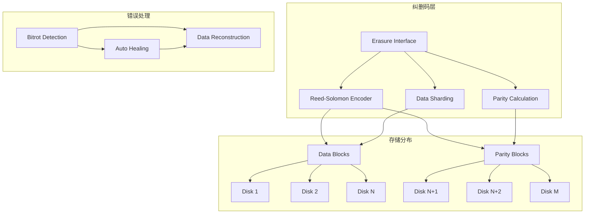
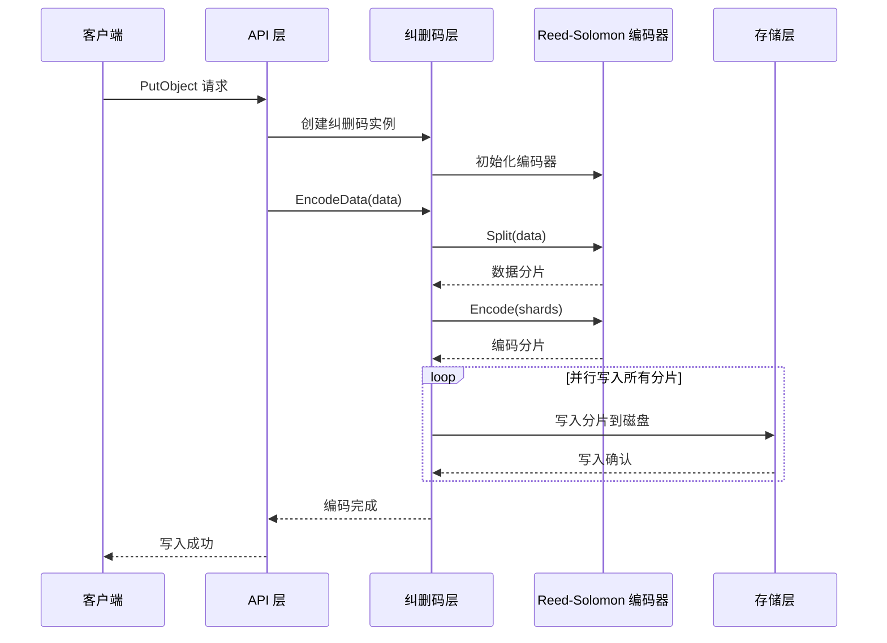
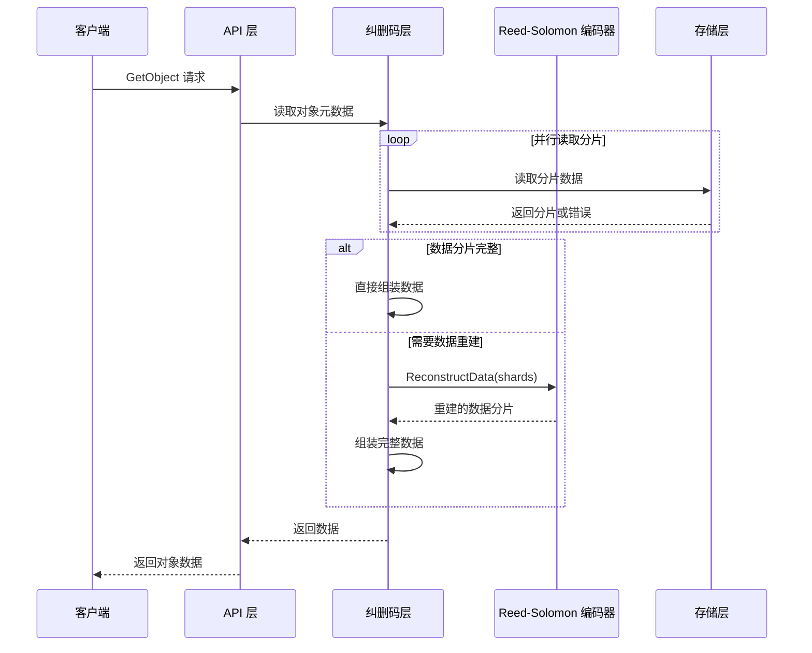

# MinIO 模块分析 - 纠删码存储引擎

## 模块概述

纠删码存储引擎是 MinIO 的核心模块，负责数据的编码、存储、解码和修复。它基于 Reed-Solomon 纠删码算法，提供数据冗余和容错能力。

## 模块架构图



## 核心数据结构

### 1. Erasure 结构体

```go
// Erasure - 纠删码编码详情
type Erasure struct {
    // 编码器工厂函数，延迟初始化以提高性能
    encoder func() reedsolomon.Encoder
    
    // 数据块数量
    dataBlocks int
    
    // 奇偶校验块数量  
    parityBlocks int
    
    // 块大小
    blockSize int64
}

// 关键方法
func (e Erasure) ShardSize() int64 {
    return (e.blockSize + int64(e.dataBlocks) - 1) / int64(e.dataBlocks)
}

func (e Erasure) ShardFileSize(totalLength int64) int64 {
    if totalLength == 0 {
        return 0
    }
    
    numShards := totalLength / e.blockSize
    lastBlockSize := totalLength % e.blockSize
    lastShardSize := ceilFrac(lastBlockSize, int64(e.dataBlocks))
    
    return numShards*e.ShardSize() + lastShardSize
}
```

### 2. ErasureInfo 元数据结构

```go
// ErasureInfo 保存纠删码和位腐败相关信息
type ErasureInfo struct {
    // 纠删码算法标识
    Algorithm string `json:"algorithm"`
    
    // 数据块数量
    DataBlocks int `json:"data"`
    
    // 奇偶校验块数量
    ParityBlocks int `json:"parity"`
    
    // 块大小
    BlockSize int64 `json:"blockSize"`
    
    // 当前磁盘在纠删码集合中的索引
    Index int `json:"index"`
    
    // 数据和奇偶校验块在磁盘上的分布
    Distribution []int `json:"distribution"`
    
    // 每个纠删码块的校验和信息
    Checksums []ChecksumInfo `json:"checksum,omitempty"`
}

// 验证纠删码信息是否相等
func (ei ErasureInfo) Equal(nei ErasureInfo) bool {
    if ei.Algorithm != nei.Algorithm {
        return false
    }
    if ei.DataBlocks != nei.DataBlocks {
        return false
    }
    if ei.ParityBlocks != nei.ParityBlocks {
        return false
    }
    if ei.BlockSize != nei.BlockSize {
        return false
    }
    return true
}
```

## 核心 API 分析

### 1. NewErasure - 创建纠删码实例

```go
// NewErasure 创建新的纠删码存储实例
func NewErasure(ctx context.Context, dataBlocks, parityBlocks int, blockSize int64) (e Erasure, err error) {
    // 参数验证
    if dataBlocks <= 0 || parityBlocks < 0 {
        return e, reedsolomon.ErrInvShardNum
    }
    
    // Reed-Solomon 算法限制最大分片数为 256
    if dataBlocks+parityBlocks > 256 {
        return e, reedsolomon.ErrMaxShardNum
    }
    
    e = Erasure{
        dataBlocks:   dataBlocks,
        parityBlocks: parityBlocks,
        blockSize:    blockSize,
    }
    
    // 延迟初始化编码器以提高性能
    var enc reedsolomon.Encoder
    var once sync.Once
    e.encoder = func() reedsolomon.Encoder {
        once.Do(func() {
            // 根据分片大小自动选择 goroutine 数量
            encoder, err := reedsolomon.New(
                dataBlocks,
                parityBlocks,
                reedsolomon.WithAutoGoroutines(int(e.ShardSize())),
            )
            if err != nil {
                // 参数已经验证过，这里不应该出错
                panic(err)
            }
            enc = encoder
        })
        return enc
    }
    
    return e, nil
}
```

### 2. EncodeData - 数据编码

```go
// EncodeData 对给定数据进行纠删码编码
func (e Erasure) EncodeData(ctx context.Context, data []byte) ([][]byte, error) {
    // 空数据处理
    if len(data) == 0 {
        return make([][]byte, e.dataBlocks+e.parityBlocks), nil
    }
    
    // 将数据分割成数据分片
    encoded, err := e.encoder().Split(data)
    if err != nil {
        return nil, err
    }
    
    // 计算奇偶校验分片
    if err = e.encoder().Encode(encoded); err != nil {
        return nil, err
    }
    
    return encoded, nil
}
```

### 3. DecodeDataBlocks - 数据解码

```go
// DecodeDataBlocks 从可用分片中解码数据
func (e Erasure) DecodeDataBlocks(data [][]byte) error {
    // 检查是否有足够的分片进行解码
    needsReconstruction := false
    for i := 0; i < e.dataBlocks; i++ {
        if data[i] == nil {
            needsReconstruction = true
            break
        }
    }
    
    // 如果数据分片完整，无需重建
    if !needsReconstruction {
        return nil
    }
    
    // 使用 Reed-Solomon 算法重建数据
    return e.encoder().ReconstructData(data)
}
```

## 时序图

### 写入操作时序



### 读取操作时序



## 关键功能实现

### 1. 数据分片存储

```go
// erasureCreateFile 创建纠删码文件
func erasureCreateFile(ctx context.Context, disks []StorageAPI, bucket, object string,
    fileSize int64, erasure Erasure, data io.Reader, writeQuorum int) (int64, error) {
    
    // 创建写入器数组
    writers := make([]io.WriteCloser, len(disks))
    var wg sync.WaitGroup
    var writeErr error
    
    // 并行创建写入器
    for i, disk := range disks {
        if disk == nil {
            continue
        }
        
        wg.Add(1)
        go func(i int, disk StorageAPI) {
            defer wg.Done()
            
            // 创建位腐败写入器
            writers[i] = newBitrotWriter(
                disk, bucket, object,
                erasure.ShardFileSize(fileSize),
                DefaultBitrotAlgorithm,
                erasure.ShardSize(),
            )
        }(i, disk)
    }
    wg.Wait()
    
    // 检查写入器创建结果
    onlineDisks := 0
    for _, writer := range writers {
        if writer != nil {
            onlineDisks++
        }
    }
    
    if onlineDisks < writeQuorum {
        return 0, errErasureWriteQuorum
    }
    
    // 创建纠删码写入器
    erasureWriter := &erasureEncoder{
        erasure: erasure,
        writers: writers,
    }
    
    // 流式编码和写入
    n, err := io.Copy(erasureWriter, data)
    if err != nil {
        return n, err
    }
    
    // 关闭所有写入器
    for _, writer := range writers {
        if writer != nil {
            if err := writer.Close(); err != nil {
                return n, err
            }
        }
    }
    
    return n, nil
}
```

### 2. 自动修复机制

```go
// HealObject 修复损坏的对象
func (er erasureObjects) HealObject(ctx context.Context, bucket, object, versionID string,
    opts madmin.HealOpts) (madmin.HealResultItem, error) {
    
    // 读取对象元数据
    storageDisks := er.getDisks()
    partsMetadata, errs := readAllFileInfo(ctx, storageDisks, bucket, object, versionID, false, false)
    
    // 分析哪些磁盘需要修复
    var availableDisks []StorageAPI
    var availableMetadata []FileInfo
    
    for i, metadata := range partsMetadata {
        if errs[i] == nil && metadata.IsValid() {
            availableDisks = append(availableDisks, storageDisks[i])
            availableMetadata = append(availableMetadata, metadata)
        }
    }
    
    // 检查是否有足够的数据进行修复
    if len(availableDisks) < er.defaultParityCount+1 {
        return madmin.HealResultItem{}, errErasureReadQuorum
    }
    
    // 选择最新的元数据作为修复模板
    latestMetadata := pickValidFileInfo(ctx, availableMetadata, er.defaultParityCount)
    
    // 执行数据修复
    erasure, err := NewErasure(ctx, latestMetadata.Erasure.DataBlocks,
        latestMetadata.Erasure.ParityBlocks, latestMetadata.Erasure.BlockSize)
    if err != nil {
        return madmin.HealResultItem{}, err
    }
    
    // 重建缺失的分片
    healResult := madmin.HealResultItem{
        Type:      madmin.HealItemObject,
        Bucket:    bucket,
        Object:    object,
        VersionID: versionID,
    }
    
    // 并行修复各个分片
    for partIndex := 0; partIndex < len(latestMetadata.Parts); partIndex++ {
        err := er.healObjectPart(ctx, bucket, object, versionID, partIndex,
            storageDisks, availableDisks, latestMetadata, erasure)
        if err != nil {
            healResult.Detail = fmt.Sprintf("Failed to heal part %d: %v", partIndex, err)
            return healResult, err
        }
    }
    
    healResult.Detail = "Successfully healed object"
    return healResult, nil
}
```

### 3. 位腐败检测

```go
// BitrotVerifier 位腐败验证器
type BitrotVerifier struct {
    algorithm BitrotAlgorithm
    sum       []byte
}

// Verify 验证数据完整性
func (b *BitrotVerifier) Verify(buf []byte) error {
    if b.algorithm.Available() {
        // 计算数据的校验和
        hasher := b.algorithm.New()
        hasher.Write(buf)
        computedSum := hasher.Sum(nil)
        
        // 比较校验和
        if !bytes.Equal(b.sum, computedSum) {
            return errBitrotHashMismatch
        }
    }
    return nil
}

// newBitrotWriter 创建带位腐败检测的写入器
func newBitrotWriter(disk StorageAPI, bucket, object string, shardSize int64,
    algo BitrotAlgorithm, shardFileSize int64) io.WriteCloser {
    
    return &bitrotWriter{
        disk:          disk,
        bucket:        bucket,
        object:        object,
        shardSize:     shardSize,
        algorithm:     algo,
        hasher:        algo.New(),
        shardFileSize: shardFileSize,
    }
}

type bitrotWriter struct {
    disk          StorageAPI
    bucket        string
    object        string
    shardSize     int64
    algorithm     BitrotAlgorithm
    hasher        hash.Hash
    shardFileSize int64
    checksums     [][]byte
    buffer        []byte
}

func (b *bitrotWriter) Write(p []byte) (int, error) {
    // 将数据写入缓冲区
    b.buffer = append(b.buffer, p...)
    
    // 当缓冲区达到分片大小时，计算校验和并写入磁盘
    for len(b.buffer) >= int(b.shardSize) {
        shard := b.buffer[:b.shardSize]
        b.buffer = b.buffer[b.shardSize:]
        
        // 计算分片校验和
        b.hasher.Reset()
        b.hasher.Write(shard)
        checksum := b.hasher.Sum(nil)
        b.checksums = append(b.checksums, checksum)
        
        // 写入分片数据
        if err := b.disk.AppendFile(context.Background(), b.bucket, b.object, shard); err != nil {
            return 0, err
        }
    }
    
    return len(p), nil
}
```

## 性能优化

### 1. 并行处理

纠删码模块大量使用并行处理来提高性能：

- **并行编码**: 使用多个 goroutine 并行计算奇偶校验
- **并行 I/O**: 同时向多个磁盘写入数据分片
- **并行解码**: 并行读取和重建数据分片

### 2. 内存优化

```go
// 使用对象池减少内存分配
var erasureEncodePool = sync.Pool{
    New: func() interface{} {
        return make([][]byte, 16) // 预分配分片数组
    },
}

// 获取编码缓冲区
func getErasureEncodeBuffer() [][]byte {
    return erasureEncodePool.Get().([][]byte)
}

// 归还编码缓冲区
func putErasureEncodeBuffer(buf [][]byte) {
    // 清空切片但保留容量
    for i := range buf {
        buf[i] = nil
    }
    erasureEncodePool.Put(buf)
}
```

### 3. 流式处理

对于大文件，使用流式处理避免内存溢出：

```go
// erasureEncoder 实现流式纠删码编码
type erasureEncoder struct {
    erasure Erasure
    writers []io.WriteCloser
    buffer  []byte
}

func (e *erasureEncoder) Write(p []byte) (int, error) {
    // 将数据添加到缓冲区
    e.buffer = append(e.buffer, p...)
    
    // 当缓冲区达到块大小时进行编码
    for len(e.buffer) >= int(e.erasure.blockSize) {
        block := e.buffer[:e.erasure.blockSize]
        e.buffer = e.buffer[e.erasure.blockSize:]
        
        // 编码数据块
        encoded, err := e.erasure.EncodeData(context.Background(), block)
        if err != nil {
            return 0, err
        }
        
        // 并行写入编码后的分片
        var wg sync.WaitGroup
        var writeErr error
        
        for i, shard := range encoded {
            if e.writers[i] == nil {
                continue
            }
            
            wg.Add(1)
            go func(i int, shard []byte) {
                defer wg.Done()
                if _, err := e.writers[i].Write(shard); err != nil {
                    writeErr = err
                }
            }(i, shard)
        }
        
        wg.Wait()
        if writeErr != nil {
            return 0, writeErr
        }
    }
    
    return len(p), nil
}
```

## 故障处理

### 1. 磁盘故障检测

```go
// 检测磁盘是否在线
func (er erasureObjects) getOnlineDisks() []StorageAPI {
    disks := er.getDisks()
    onlineDisks := make([]StorageAPI, len(disks))
    
    for i, disk := range disks {
        if disk != nil && disk.IsOnline() {
            onlineDisks[i] = disk
        }
    }
    
    return onlineDisks
}

// 计算在线磁盘数量
func countOnlineDisks(disks []StorageAPI) int {
    count := 0
    for _, disk := range disks {
        if disk != nil && disk.IsOnline() {
            count++
        }
    }
    return count
}
```

### 2. 读取法定人数检查

```go
// 检查是否满足读取法定人数
func (er erasureObjects) checkReadQuorum(ctx context.Context, bucket, object string) error {
    disks := er.getDisks()
    
    // 并行检查各磁盘上的对象状态
    g := errgroup.WithNErrs(len(disks))
    for index := range disks {
        index := index
        g.Go(func() error {
            if disks[index] == nil {
                return errDiskNotFound
            }
            
            _, err := disks[index].StatVol(ctx, bucket)
            return err
        }, index)
    }
    
    errs := g.Wait()
    
    // 计算可用磁盘数
    availableDisks := 0
    for _, err := range errs {
        if err == nil {
            availableDisks++
        }
    }
    
    // 检查是否满足读取法定人数
    if availableDisks < er.defaultParityCount+1 {
        return errErasureReadQuorum
    }
    
    return nil
}
```

## 监控指标

纠删码模块提供了丰富的监控指标：

```go
var (
    // 纠删码操作计数器
    erasureOperationsTotal = prometheus.NewCounterVec(
        prometheus.CounterOpts{
            Name: "minio_erasure_operations_total",
            Help: "Total number of erasure operations",
        },
        []string{"operation", "result"},
    )
    
    // 数据重建计数器
    dataReconstructionTotal = prometheus.NewCounterVec(
        prometheus.CounterOpts{
            Name: "minio_data_reconstruction_total",
            Help: "Total number of data reconstruction operations",
        },
        []string{"type"},
    )
    
    // 位腐败检测计数器
    bitrotErrorsTotal = prometheus.NewCounterVec(
        prometheus.CounterOpts{
            Name: "minio_bitrot_errors_total",
            Help: "Total number of bitrot errors detected",
        },
        []string{"disk"},
    )
)
```

## 总结

MinIO 的纠删码存储引擎是一个高度优化的模块，具有以下特点：

1. **高可靠性**: 基于 Reed-Solomon 算法提供强大的数据保护
2. **高性能**: 大量使用并行处理和内存优化技术
3. **自愈能力**: 自动检测和修复数据损坏
4. **可扩展性**: 支持灵活的数据块和奇偶校验块配置
5. **监控完善**: 提供详细的运行状态监控

这个模块的设计充分体现了 MinIO 在企业级存储系统方面的技术实力。
