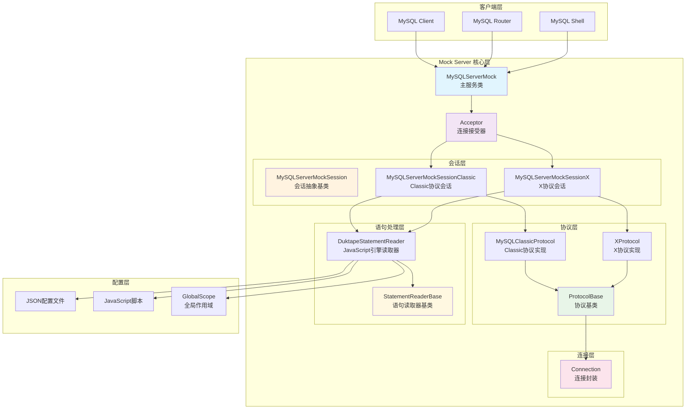
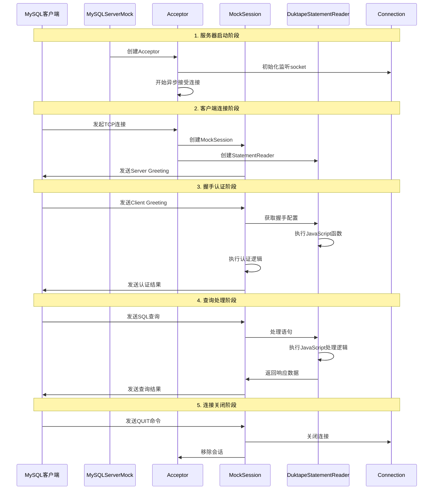
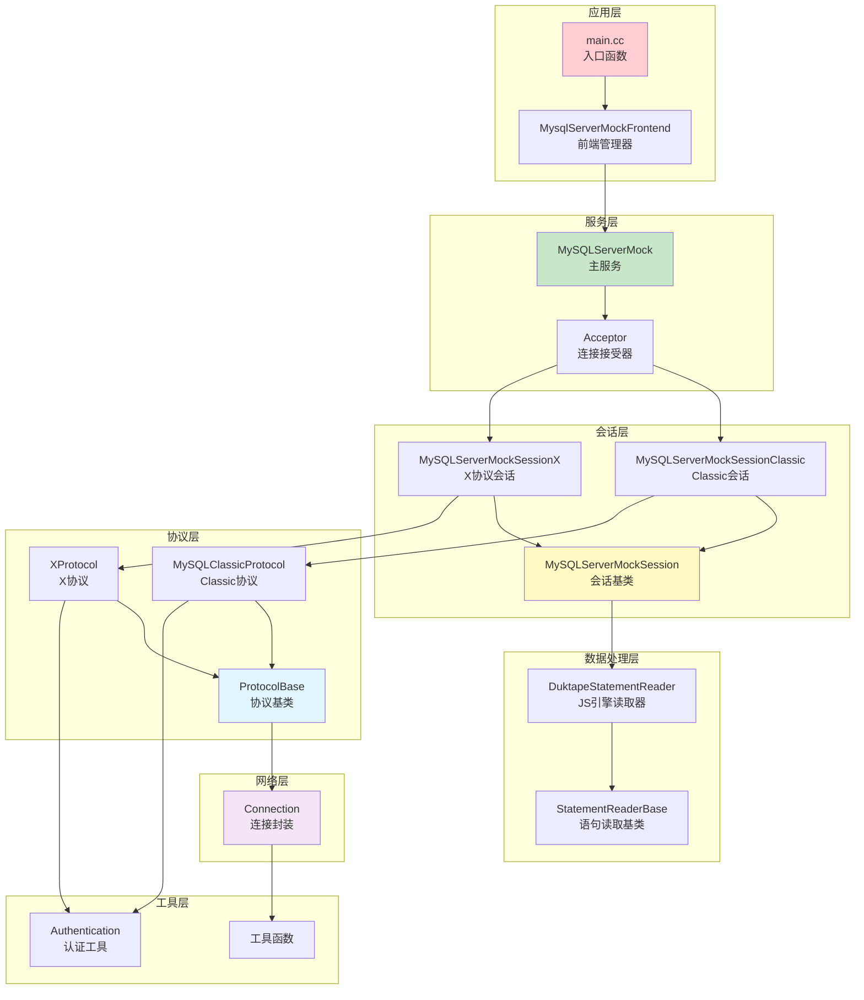
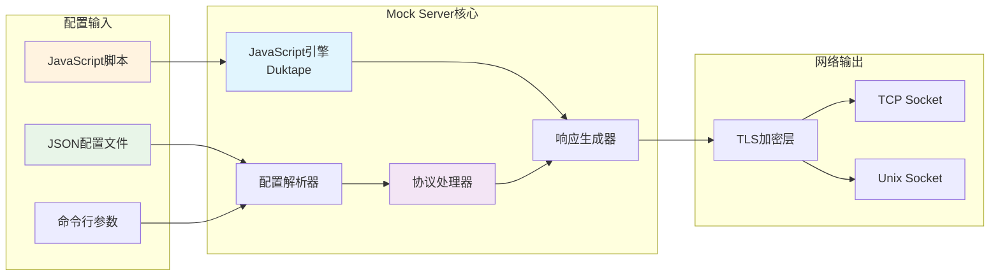

## 1. 项目概述

MySQL Router Mock Server 是 MySQL Router 项目中的一个重要组件，用于在测试环境中模拟真实的 MySQL 服务器。它能够接受客户端连接，解析 MySQL 协议消息，并根据预定义的脚本返回相应的响应。

### 1.1 设计目标

- **快速测试**：避免启动真实 MySQL 服务器的开销，提供零延迟的测试环境
- **错误场景模拟**：轻松创建各种错误情况，如磁盘满、服务器死机等
- **减少依赖**：测试时无需安装 MySQL Shell 和 MySQL Server
- **协议兼容**：完全兼容 MySQL Client/Server 协议

### 1.2 核心功能特性

- 支持 Classic MySQL 协议和 X Protocol
- 基于 JavaScript/JSON 的灵活配置
- TLS/SSL 连接支持
- 认证机制模拟
- 结果集、错误响应、OK 响应的完整支持

## 2. 整体架构设计

### 2.1 系统架构图



### 2.2 核心组件说明

#### 2.2.1 MySQLServerMock（主服务类）

```cpp
/**

 * @brief 主要服务类，负责接受和处理客户端连接

 *

 * 功能：
 * - 初始化服务器配置（端口、TLS等）
 * - 启动连接接受循环
 * - 管理所有活跃的客户端会话
 * - 处理服务器关闭逻辑

 */
class MySQLServerMock {
public:
  MySQLServerMock(net::io_context &io_ctx,           // IO上下文
                  std::string expected_queries_file, // 查询文件路径
                  std::vector<std::string> module_prefixes, // 模块前缀
                  mysql_harness::Destination bind_destination, // 绑定地址
                  std::string protocol,              // 协议类型
                  bool debug_mode,                   // 调试模式
                  TlsServerContext &&tls_server_ctx,// TLS上下文
                  mysql_ssl_mode ssl_mode);          // SSL模式

  void run(mysql_harness::PluginFuncEnv *env);      // 启动服务器
  void close_all_connections();                     // 关闭所有连接

private:
  // 绑定的网络端点
  mysql_harness::Destination bind_destination_;
  // 调试模式标志
  bool debug_mode_;
  // IO上下文引用
  net::io_context &io_ctx_;
  // 查询文件路径
  std::string expected_queries_file_;
  // JavaScript模块前缀列表
  std::vector<std::string> module_prefixes_;
  // 协议名称（classic或x）
  std::string protocol_name_;
  // TLS服务器上下文
  TlsServerContext tls_server_ctx_;
  // SSL模式配置
  mysql_ssl_mode ssl_mode_;
  // 客户端会话管理容器（线程安全）
  WaitableMonitor<std::list<std::unique_ptr<MySQLServerMockSession>>>
      client_sessions_{{}};
};
```

#### 2.2.2 Acceptor（连接接受器）

```cpp
/**

 * @brief 连接接受器，处理新连接的接受和会话创建

 *

 * 功能：
 * - 异步接受客户端连接
 * - 根据协议类型创建相应的会话对象
 * - 配置新连接的网络参数
 * - 管理连接生命周期

 */
class Acceptor {
public:
  Acceptor(net::io_context &io_ctx,                    // IO上下文
           std::string protocol_name,                  // 协议名称
           WaitableMonitor<std::list<std::unique_ptr<MySQLServerMockSession>>>
               &client_sessions,                       // 会话管理器
           DuktapeStatementReaderFactory &&reader_maker, // 读取器工厂
           TlsServerContext &tls_server_ctx,           // TLS上下文
           bool with_tls);                             // 是否支持TLS

  // 初始化监听套接字
  stdx::expected<void, std::error_code> init(
      const mysql_harness::Destination &dest);
  
  // 处理已接受的连接
  void accepted(mysql_harness::DestinationSocket client_sock);
  
  // 异步运行接受器
  void async_run();
  
  // 停止接受器
  void stop();

private:
  net::io_context &io_ctx_;                          // IO上下文
  mysql_harness::DestinationAcceptor sock_{io_ctx_}; // 监听套接字
  DuktapeStatementReaderFactory reader_maker_;      // 读取器工厂
  std::string protocol_name_;                        // 协议名称
  WaitableMonitor<std::list<std::unique_ptr<MySQLServerMockSession>>>
      &client_sessions_;                             // 会话管理器引用
  mysql_harness::DestinationEndpoint client_ep_;    // 客户端端点
  TlsServerContext &tls_server_ctx_;                // TLS上下文引用
  bool with_tls_{false};                            // TLS支持标志
  Monitor<bool> stopped_{false};                    // 停止标志
  WaitableMonitor<int> work_{0};                    // 工作计数器
  mysql_harness::logging::DomainLogger logger_;     // 日志记录器
  std::function<void()> at_destruct_;               // 析构时回调
};
```

### 2.3 主要执行流程时序图



## 3. 模块交互关系

### 3.1 依赖关系图



### 3.2 数据流向图



## 4. 关键设计模式

### 4.1 工厂模式（Factory Pattern）
- `DuktapeStatementReaderFactory`：创建语句读取器实例
- 根据不同的配置文件类型创建相应的读取器

### 4.2 策略模式（Strategy Pattern）
- `StatementReaderBase`：定义语句处理策略接口
- `DuktapeStatementReader`：基于JavaScript的具体策略

### 4.3 模板方法模式（Template Method Pattern）
- `ProtocolBase`：定义协议处理的基本框架
- `MySQLClassicProtocol`：实现具体的Classic协议逻辑

### 4.4 观察者模式（Observer Pattern）
- 会话断开时的回调机制
- 连接状态变化的通知机制

## 5. 性能优化设计

### 5.1 连接池化
- 使用`DukHeapPool`对JavaScript执行环境进行池化管理
- 避免频繁创建和销毁JavaScript引擎实例

### 5.2 异步IO
- 全面使用异步IO操作，避免阻塞
- 基于`net::io_context`的事件驱动模型

### 5.3 内存管理
- 智能指针的广泛使用
- RAII原则的严格遵循
- 缓冲区复用机制

### 5.4 编译期优化
- Solaris系统禁用字节码缓存避免崩溃
- 预编译JavaScript脚本的缓存机制

## 6. 安全性设计

### 6.1 TLS/SSL支持
- 完整的TLS服务器实现
- 客户端证书验证
- 多种加密套件支持

### 6.2 认证机制
- 支持多种MySQL认证插件
- `caching_sha2_password`
- `mysql_native_password`  
- `mysql_clear_password`

### 6.3 输入验证
- 协议消息的完整性检查
- JavaScript代码的安全执行环境
- SQL注入防护（通过预定义响应）

## 7. 扩展性设计

### 7.1 协议扩展
- 基于`ProtocolBase`可以轻松添加新协议支持
- 模块化的协议处理架构

### 7.2 语句处理扩展
- `StatementReaderBase`接口支持不同的语句处理器
- JavaScript引擎可替换为其他脚本引擎

### 7.3 配置扩展
- 支持JSON和JavaScript两种配置格式
- 运行时配置热更新能力

这个架构设计充分体现了现代C++的最佳实践，具有良好的可维护性、可扩展性和性能表现。
