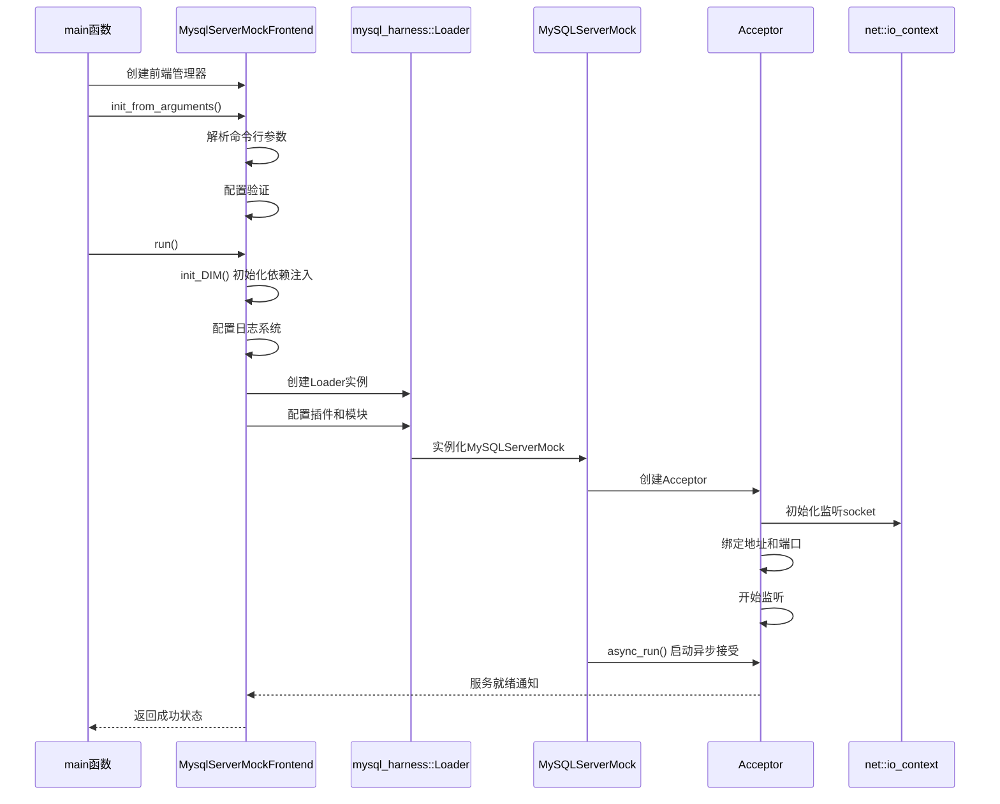
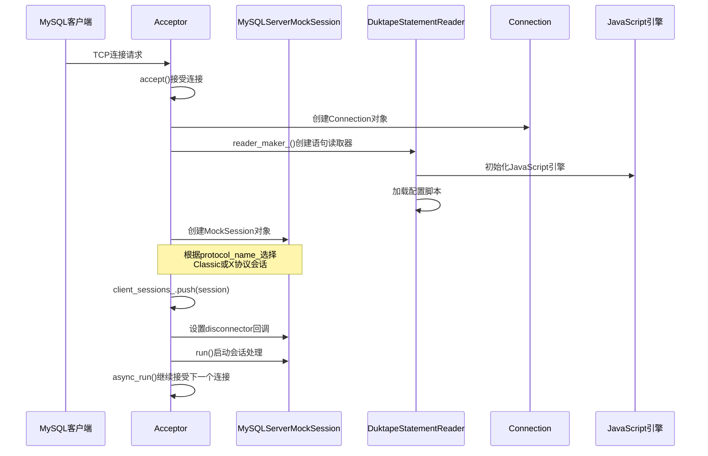
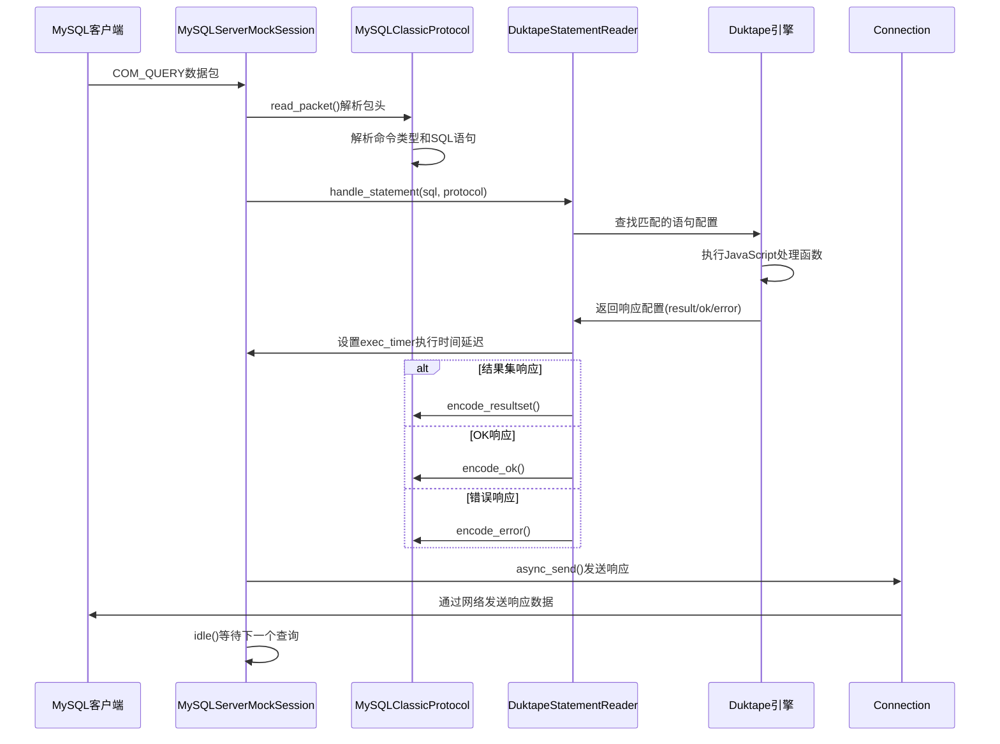

# MySQL Router Mock Server - API调用链路分析

## 1. 对外API概览

MySQL Router Mock Server 主要通过以下几种方式对外提供服务：

### 1.1 命令行接口API
```cpp
/**
 * @brief 命令行参数处理接口
 * 位置：src/main.cc
 */
struct MysqlServerMockConfig {
  std::string queries_filename;    // 查询文件名
  std::string module_prefix;       // 模块前缀路径
  std::string bind_address;        // 绑定地址，默认"0.0.0.0"
  std::string port;               // Classic协议端口
  std::string socket;             // Classic协议Unix socket
  std::string http_port;          // HTTP REST API端口
  std::string xport;              // X协议端口  
  std::string xsocket;            // X协议Unix socket
  bool verbose;                   // 详细模式标志
  std::string logging_folder;     // 日志目录
  
  // SSL/TLS 相关配置
  std::string ssl_cert;           // SSL证书路径
  std::string ssl_key;            // SSL密钥路径
  std::string ssl_mode;           // SSL模式
  std::string tls_version;        // TLS版本
  std::string ssl_ca;             // CA证书路径
  std::string ssl_capath;         // CA证书目录
  std::string ssl_crl;            // CRL文件路径
  std::string ssl_crlpath;        // CRL目录路径
  std::string ssl_cipher;         // SSL加密套件
  
  bool core_file;                 // 是否生成core文件
};
```

### 1.2 MySQL协议API
Mock Server实现了完整的MySQL Client/Server协议，支持以下主要命令：

#### 1.2.1 连接管理命令
```cpp
/**
 * @brief MySQL协议命令枚举
 * 位置：mysqlrouter/classic_protocol_constants.h
 */
enum class CommandType : uint8_t {
  COM_QUIT = 0x01,           // 退出连接
  COM_QUERY = 0x03,          // 执行SQL查询
  COM_PING = 0x0e,           // 心跳检测
  COM_CHANGE_USER = 0x11,    // 切换用户
  COM_RESET_CONNECTION = 0x1f // 重置连接
};
```

#### 1.2.2 认证协议API
```cpp
/**
 * @brief 支持的认证方法
 * 位置：src/authentication.h
 */
class CachingSha2Password {
public:
  static constexpr const char* name = "caching_sha2_password";
  static stdx::expected<std::vector<uint8_t>, std::error_code> 
    scramble(const std::string &nonce, const std::string &password);
};

class MySQLNativePassword {  
public:
  static constexpr const char* name = "mysql_native_password";
  static stdx::expected<std::vector<uint8_t>, std::error_code>
    scramble(const std::string &nonce, const std::string &password);
};

class ClearTextPassword {
public:
  static constexpr const char* name = "mysql_clear_password"; 
  static stdx::expected<std::vector<uint8_t>, std::error_code>
    scramble(const std::string &nonce, const std::string &password);
};
```

### 1.3 JavaScript配置API
通过JavaScript脚本可以动态配置Mock Server的行为：

```javascript
/**
 * @brief JavaScript配置对象结构
 */
{
  // 握手配置
  handshake: {
    greeting: {
      server_version: "8.0.0-mock",     // 服务器版本
      connection_id: 1,                 // 连接ID
      capabilities: 0xffffff,           // 服务器能力标志
      status_flags: 0,                  // 状态标志
      character_set: 8,                 // 字符集
      auth_method: "caching_sha2_password", // 认证方法
      nonce: "12345678901234567890",    // 认证随机数
      exec_time: 0                      // 执行时间（毫秒）
    },
    auth: {
      username: "root",                 // 期望用户名
      password: "password",             // 期望密码
      auth_method_name: "caching_sha2_password", // 强制认证方法
      certificate: {                    // 客户端证书验证
        issuer: "CN=MySQL_Server_...",  // 证书颁发者
        subject: "CN=MySQL_Client_..."  // 证书主体
      }
    }
  },
  
  // 语句处理配置
  stmts: [
    {
      stmt: "SELECT @@version_comment",  // SQL语句匹配
      exec_time: 1000,                  // 执行时间（毫秒）
      result: {                         // 结果集响应
        columns: [{
          name: "@@version_comment",
          type: "STRING"
        }],
        rows: [["MySQL Router Mock"]]
      }
    },
    {
      stmt: "INSERT INTO test VALUES (1)",
      ok: {                            // OK响应
        affected_rows: 1,
        last_insert_id: 1,
        status: 0,
        warning_count: 0,
        message: "",
        session_trackers: []
      }
    },
    {
      stmt: "SELECT * FROM nonexistent", 
      error: {                         // 错误响应
        code: 1146,
        message: "Table 'test.nonexistent' doesn't exist",
        sql_state: "42S02"
      }
    }
  ]
}
```

## 2. 核心API调用链路深度分析

### 2.1 服务器启动链路



#### 2.1.1 关键函数代码分析

**main函数（入口点）**
```cpp
/**
 * @brief 程序入口函数
 * @param argc 参数个数
 * @param argv 参数数组
 * @return int 程序退出码
 * 
 * 功能说明：
 * 1. 解析命令行参数
 * 2. 初始化网络环境（Windows WSA）
 * 3. 创建前端管理器并运行
 * 4. 异常处理和错误报告
 */
int main(int argc, char *argv[]) {
  MysqlServerMockFrontend frontend;

#ifdef _WIN32
  // Windows环境下初始化Winsock
  WSADATA wsaData;
  int result = WSAStartup(MAKEWORD(2, 2), &wsaData);
  if (result != 0) {
    std::cerr << "WSAStartup failed with error: " << result << std::endl;
    return EXIT_FAILURE;
  }
#endif

  std::vector<std::string> arguments{argv, argv + argc};
  try {
    // 解析命令行参数并创建配置对象
    auto frontend_config = frontend.init_from_arguments(arguments);

    // 如果是打印信息后退出的命令（如--help, --version），直接返回
    if (frontend.is_print_and_exit()) {
      return 0;
    }

    // 运行Mock Server主逻辑
    frontend.run();
  } catch (const std::exception &e) {
    std::cout << "ERROR: " << e.what() << std::endl;
    return EXIT_FAILURE;
  }

  return 0;
}
```

**MysqlServerMockFrontend::run()方法**
```cpp
/**
 * @brief 前端管理器运行方法
 * 
 * 功能说明：
 * 1. 初始化依赖注入管理器(DIM)
 * 2. 配置日志系统
 * 3. 创建并配置Loader
 * 4. 设置信号处理
 * 5. 启动所有服务
 */
void MysqlServerMockFrontend::run() {
  // 初始化依赖注入管理器
  init_DIM();
  
  // 创建配置加载器
  auto loader_config = std::make_unique<mysql_harness::LoaderConfig>(
      mysql_harness::Config::allow_keys);

  mysql_harness::DIM &dim = mysql_harness::DIM::instance();
  mysql_harness::logging::Registry &registry = dim.get_LoggingRegistry();

  // 设置日志级别
  const auto log_level = config_.verbose
                             ? mysql_harness::logging::LogLevel::kDebug
                             : mysql_harness::logging::LogLevel::kWarning;

  // 创建日志记录器
  mysql_harness::logging::clear_registry(registry);
  mysql_harness::logging::create_module_loggers(
      registry, log_level,
      {mysql_harness::logging::kMainLogger, "mock_server", "http_server", "",
       "rest_mock_server"},
      mysql_harness::logging::kMainLogger);
  mysql_harness::logging::create_main_log_handler(
      registry, "mock_server", config_.logging_folder, true);

  registry.set_ready();

  // 设置模块前缀默认值
  if (config_.module_prefix.empty()) {
    std::error_code ec;
    auto cwd = stdx::filesystem::current_path(ec);
    if (ec) throw std::system_error(ec);
    config_.module_prefix = cwd.native();
  }

  // 设置默认端口
  if (config_.port.empty() && config_.socket.empty()) {
    config_.port = "3306";
  }

  // 配置各种服务模块
  loader_config->set_default("logging_folder", config_.logging_folder);
  
  // 添加IO模块
  {
    auto &section = loader_config->add("io");
    section.add("library", "io");
    section.add("threads", "1");
  }

  // 如果配置了HTTP端口，添加REST API服务
  if (!config_.http_port.empty()) {
    auto &rest_mock_server_config =
        loader_config->add("rest_mock_server", "");
    rest_mock_server_config.set("library", "rest_mock_server");

    auto &http_server_config = loader_config->add("http_server", "");
    http_server_config.set("library", "http_server");
    http_server_config.set("bind_address", config_.bind_address);
    http_server_config.set("port", config_.http_port);
    http_server_config.set("static_folder", "");
  }

  // 配置Classic协议Mock Server
  if (!config_.port.empty() && config_.port != "0") {
    auto &mock_server_config = loader_config->add("mock_server", "classic");
    mock_server_config.set("bind_address", config_.bind_address);
    mock_server_config.set("port", config_.port);
    mock_server_config.set("protocol", "classic");
    add_common_mock_server_options(mock_server_config, config_);
  }

  // 配置X协议Mock Server
  if (!config_.xport.empty() && config_.xport != "0") {
    auto &mock_server_config = loader_config->add("mock_server", "x");
    mock_server_config.set("bind_address", config_.bind_address);
    mock_server_config.set("port", config_.xport);
    mock_server_config.set("protocol", "x");
    add_common_mock_server_options(mock_server_config, config_);
  }

  // 设置Unix Socket支持
  if (!config_.socket.empty()) {
    auto &mock_server_config =
        loader_config->add("mock_server", "classic_socket");
    mock_server_config.set("named_socket", config_.socket);
    mock_server_config.set("protocol", "classic");
    add_common_mock_server_options(mock_server_config, config_);
  }

  if (!config_.xsocket.empty()) {
    auto &mock_server_config = loader_config->add("mock_server", "x_socket");
    mock_server_config.set("named_socket", config_.xsocket);
    mock_server_config.set("protocol", "x");
    add_common_mock_server_options(mock_server_config, config_);
  }

  // 将配置传递给DIM
  dim.set_Config(loader_config.release(),
                 std::default_delete<mysql_harness::LoaderConfig>());

  // 创建并启动Loader
  std::unique_ptr<mysql_harness::Loader> loader_;
  try {
    loader_ = std::make_unique<mysql_harness::Loader>("server-mock",
                                                      dim.get_Config());
  } catch (const std::runtime_error &err) {
    throw std::runtime_error(std::string("init-loader failed: ") +
                             err.what());
  }

  logger_.debug("Starting");

#if !defined(_WIN32)
  // Unix系统下设置信号处理
  static const char kSignalHandlerServiceName[]{"signal_handler"};
  loader_->waitable_services().emplace_back(kSignalHandlerServiceName);

  loader_->after_all_started([&]() {
    signal_handler_.add_sig_handler(
        SIGTERM, [&](int /* sig */, const std::string &signal_info) {
          mysql_harness::ProcessStateComponent::get_instance()
              .request_application_shutdown(
                  mysql_harness::ShutdownPending::Reason::REQUESTED,
                  signal_info);
        });

    signal_handler_.add_sig_handler(
        SIGINT, [&](int /* sig */, const std::string &signal_info) {
          mysql_harness::ProcessStateComponent::get_instance()
              .request_application_shutdown(
                  mysql_harness::ShutdownPending::Reason::REQUESTED,
                  signal_info);
        });

    mysql_harness::on_service_ready(kSignalHandlerServiceName);
  });

  loader_->after_first_finished([&]() {
    signal_handler_.remove_sig_handler(SIGTERM);
    signal_handler_.remove_sig_handler(SIGINT);
  });
#endif

  // 启动所有服务
  loader_->start();
}
```

### 2.2 连接接受和会话创建链路



#### 2.2.1 Acceptor::accepted()方法详析

```cpp
/**
 * @brief 处理已接受的客户端连接
 * @param client_sock 客户端套接字
 * 
 * 功能说明：
 * 1. 创建语句读取器实例
 * 2. 根据协议类型创建相应的会话对象
 * 3. 设置会话断开回调
 * 4. 启动会话处理
 * 5. 继续异步接受下一个连接
 */
void Acceptor::accepted(mysql_harness::DestinationSocket client_sock) {
  // 通过工厂创建语句读取器
  auto reader = reader_maker_();

  // 在会话容器中创建新会话（线程安全操作）
  auto session_it = client_sessions_([&](auto &socks) {
    if (protocol_name_ == "classic") {
      // 创建Classic协议会话
      socks.emplace_back(std::make_unique<MySQLServerMockSessionClassic>(
          std::move(client_sock),  // 客户端套接字
          client_ep_,              // 客户端端点信息
          tls_server_ctx_,         // TLS服务器上下文
          std::move(reader),       // 语句读取器
          false,                   // 调试模式
          with_tls_));             // TLS支持标志
    } else {
      // 创建X协议会话
      socks.emplace_back(std::make_unique<MySQLServerMockSessionX>(
          std::move(client_sock),  // 客户端套接字
          client_ep_,              // 客户端端点信息  
          tls_server_ctx_,         // TLS服务器上下文
          std::move(reader),       // 语句读取器
          false,                   // 调试模式
          with_tls_));             // TLS支持标志
    }
    return std::prev(socks.end()); // 返回新创建会话的迭代器
  });

  auto &session = *session_it;
  
  // 设置会话断开时的清理回调函数
  session->disconnector([this, session_it]() mutable {
    client_sessions_.serialize_with_cv(
        [session_it](auto &sessions, auto &condvar) {
          // 从容器中移除会话（自动调用析构函数）
          sessions.erase(session_it);
          // 通知等待所有socket关闭的线程
          condvar.notify_one();
        });
  });

  // 使用defer确保会话在下一个事件循环中启动
  net::defer(io_ctx_, [&session]() { session->run(); });

  // 继续异步接受下一个连接
  async_run();
}
```

### 2.3 SQL查询处理链路



#### 2.3.1 MySQLServerMockSessionClassic::idle()方法详析

```cpp
/**
 * @brief 空闲状态处理函数，等待并处理客户端命令
 * 
 * 功能说明：
 * 1. 读取客户端发送的数据包
 * 2. 解析MySQL协议命令
 * 3. 根据命令类型进行相应处理
 * 4. 处理SQL查询、连接管理等命令
 */
void MySQLServerMockSessionClassic::idle() {
  std::vector<uint8_t> payload;
  
  // 尝试读取客户端数据包
  auto frame_decode_res = protocol_.read_packet(payload);
  if (!frame_decode_res) {
    auto ec = frame_decode_res.error();

    if (ec == classic_protocol::codec_errc::not_enough_input) {
      // 数据不完整，异步接收更多数据
      protocol_.async_receive([this](std::error_code ec,
                                     size_t /* transferred */) {
        if (ec) {
          if (ec != std::errc::operation_canceled &&
              ec != net::stream_errc::eof) {
            logger_.warning("receiving command-frame failed: " + ec.message());
          }
          disconnect();
          return;
        }

        idle(); // 递归调用处理完整的数据包
      });
      return;
    }

    disconnect();
    return;
  }

  if (payload.empty()) {
    logger_.debug("message was empty, closing connection.");
    disconnect();
    return;
  }

  // 解析MySQL协议命令字节
  const auto cmd = payload[0];
  switch (cmd) {
    case classic_protocol::Codec<
        classic_protocol::message::client::Query>::cmd_byte(): {
      // COM_QUERY: SQL查询命令
      
      // 跳过命令字节，提取SQL语句文本
      std::string statement_received(std::next(payload.begin()), payload.end());

      try {
        // 记录开始处理时间
        const auto started = std::chrono::steady_clock::now();

        // 调用语句处理器处理SQL
        json_reader_->handle_statement(statement_received, &protocol_);

        // 设置执行时间定时器
        protocol_.exec_timer().async_wait(
            [this, started,
             statement = statement_received](std::error_code ec) {
              if (ec) {
                if (ec != std::errc::operation_canceled) {
                  logger_.warning("wait exec-time failed: " + ec.message());
                }
                disconnect();
                return;
              }

              auto now = std::chrono::steady_clock::now();
              logger_.info(mysql_harness::utility::string_format(
                  "(%s)> %s", duration_to_us_string(now - started).c_str(),
                  statement.c_str()));

              send_response_then_idle(); // 发送响应并回到空闲状态
            });

      } catch (const std::exception &e) {
        // 处理异常，返回错误给客户端
        logger_.error("executing statement failed: "s + e.what());

        protocol_.encode_error(
            {ER_PARSE_ERROR, "executing statement failed: "s + e.what()});

        send_response_then_idle();
        return;
      }
      break;
    }
    
    case classic_protocol::Codec<
        classic_protocol::message::client::Quit>::cmd_byte():
      // COM_QUIT: 客户端请求断开连接
      
      // 等待客户端关闭连接以避免TIME_WAIT状态
      protocol_.async_receive([&](std::error_code ec, size_t transferred) {
        if (ec) {
          if (ec != net::stream_errc::eof &&
              ec != std::errc::operation_canceled) {
            logger_.warning("receive connection-close failed: " + ec.message());
          }
        } else {
          logger_.debug(mysql_harness::utility::string_format(
              "data after QUIT: %zu", transferred));
        }
        disconnect();
      });
      return;

    case classic_protocol::Codec<
        classic_protocol::message::client::ResetConnection>::cmd_byte():
      // COM_RESET_CONNECTION: 重置连接状态
      protocol_.encode_ok({});
      send_response_then_idle();
      break;

    case classic_protocol::Codec<
        classic_protocol::message::client::ChangeUser>::cmd_byte(): {
      // COM_CHANGE_USER: 切换用户
      auto msg_res = classic_protocol::decode<
          classic_protocol::message::client::ChangeUser>(net::buffer(payload),
                                                         {});
      if (!msg_res) {
        protocol_.encode_error({ER_PARSE_ERROR, std::string("change-user: ") +
                                                    msg_res.error().message()});
        send_response_then_idle();
        break;
      }

      if (msg_res->second.auth_method_name() == CachingSha2Password::name) {
        protocol_.encode_auth_fast_message();
      }

      OkResponse msg;
      if (protocol_.shared_capabilities().test(
              classic_protocol::capabilities::pos::session_track)) {
        msg.status_flags(
            1 << classic_protocol::status::pos::session_state_changed);
        msg.session_changes(encode_session_trackers({
            {classic_protocol::session_track::TransactionCharacteristics{""}},
        }));
      }

      protocol_.encode_ok(msg);
      send_response_then_idle();
      break;
    }
    
    case classic_protocol::Codec<
        classic_protocol::message::client::Ping>::cmd_byte():
      // COM_PING: 心跳检测
      protocol_.encode_ok({});
      send_response_then_idle();
      break;

    default:
      // 不支持的命令
      logger_.info("received unsupported command from the client: " +
                   std::to_string(cmd));

      protocol_.encode_error({ER_PARSE_ERROR,
                              "Unsupported command: " + std::to_string(cmd),
                              "HY000"});

      send_response_then_disconnect();
      return;
  }
}
```

### 2.4 JavaScript语句处理链路

#### 2.4.1 DuktapeStatementReader::handle_statement()方法详析

```cpp
/**
 * @brief JavaScript语句处理核心方法
 * @param statement 客户端发送的SQL语句
 * @param protocol 协议对象，用于发送响应
 * 
 * 功能说明：
 * 1. 根据配置类型（数组/函数/线程）处理语句
 * 2. 执行JavaScript脚本获取响应配置
 * 3. 根据响应类型编码相应的MySQL协议消息
 * 4. 设置执行时间延迟
 */
void DuktapeStatementReader::handle_statement(const std::string &statement,
                                              ProtocolBase *protocol) {
  auto *ctx = pimpl_->ctx;
  bool is_enumable = false;

  // 首次处理语句时的初始化
  if (pimpl_->first_stmt_) {
    duk_get_prop_string(ctx, -1, "stmts");
    // 语句类型在构造函数中已验证

    if (duk_is_array(ctx, -1)) {
      // 如果是数组，创建枚举器
      duk_enum(ctx, -1, DUK_ENUM_ARRAY_INDICES_ONLY);
    }

    pimpl_->first_stmt_ = false;
  }

  if (duk_is_thread(ctx, -1)) {
    // 协程/线程模式处理
    if (DUK_EXEC_SUCCESS !=
        duk_pcompile_string(ctx, DUK_COMPILE_FUNCTION,
                            "function (t, stmt) { return "
                            "Duktape.Thread.resume(t, stmt); }")) {
      throw DuktapeRuntimeError(ctx, -1);
    }
    duk_dup(ctx, -2);  // 复制线程对象
    duk_push_lstring(ctx, statement.c_str(), statement.size());

    if (DUK_EXEC_SUCCESS != duk_pcall(ctx, 2)) {
      throw DuktapeRuntimeError(ctx, -1);
    }
    // 栈顶现在是resume的结果
  } else if (duk_is_callable(ctx, -1)) {
    // 函数模式处理
    duk_dup(ctx, -1);  // 复制函数以便下次调用
    duk_push_lstring(ctx, statement.c_str(), statement.size());

    if (DUK_EXEC_SUCCESS != duk_pcall(ctx, 1)) {
      throw DuktapeRuntimeError(ctx, -1);
    }
  } else {
    // 数组枚举模式处理
    if (!duk_is_object(ctx, -1)) {
      throw std::runtime_error(
          "expected 'stmts' enumerator to be an object, got " +
          duk_get_type_names(ctx, -1));
    }

    // 获取下一个语句配置
    if (0 == duk_next(ctx, -1, true)) {
      duk_pop(ctx);
      
      // 没有更多匹配的语句，返回错误
      protocol->encode_error(
          {1064, "Unknown statement. (end of stmts)", "HY000"});
      return;
    }
    // 栈结构：枚举器(-3), 键(-2), 值(-1)
    is_enumable = true;
  }

  // 验证返回值必须是对象
  if (!duk_is_object(ctx, -1)) {
    throw std::runtime_error("expected 'stmts' to return an 'object', got " +
                             duk_get_type_names(ctx, -1));
  }

  // 解析执行时间
  std::chrono::microseconds exec_time{};
  duk_get_prop_string(ctx, -1, "exec_time");
  if (!duk_is_undefined(ctx, -1)) {
    if (!duk_is_number(ctx, -1)) {
      throw std::runtime_error("exec_time must be a number, if set, got " +
                               duk_get_type_names(ctx, -1));
    }
    if (duk_get_number(ctx, -1) < 0) {
      throw std::out_of_range("exec_time must be a non-negative number");
    }

    // 执行时间在配置文件中以毫秒为单位，转换为微秒
    exec_time = std::chrono::microseconds(
        static_cast<long>(duk_get_number(ctx, -1) * 1000));
  }
  duk_pop(ctx);

  // 根据响应类型处理
  bool response_sent{false};
  
  // 尝试处理结果集响应
  duk_get_prop_string(ctx, -1, "result");
  if (!duk_is_undefined(ctx, -1)) {
    protocol->exec_timer().expires_after(exec_time);
    protocol->encode_resultset(pimpl_->get_result(-1));
    response_sent = true;
  } else {
    duk_pop(ctx);  // result
    
    // 尝试处理错误响应
    duk_get_prop_string(ctx, -1, "error");
    if (!duk_is_undefined(ctx, -1)) {
      protocol->encode_error(pimpl_->get_error(-1));
      response_sent = true;
    } else {
      duk_pop(ctx);  // error
      
      // 尝试处理OK响应
      duk_get_prop_string(ctx, -1, "ok");
      if (!duk_is_undefined(ctx, -1)) {
        protocol->encode_ok(pimpl_->get_ok(-1));
        response_sent = true;
      } else {
        throw std::runtime_error("expected 'error', 'ok' or 'result'");
      }
    }
  }
  duk_pop(ctx);  // 清理最后一个属性

  duk_pop(ctx);  // 清理值对象
  if (is_enumable) {
    duk_pop(ctx);  // 清理键
  }

  if (!response_sent) {
    protocol->encode_error({1064, "Unsupported command", "HY000"});
  }
}
```

## 3. 性能关键路径分析

### 3.1 连接建立性能优化

1. **异步接受**：使用`async_accept`避免阻塞主线程
2. **TCP_NODELAY**：禁用Nagle算法减少延迟
3. **连接复用**：通过会话对象池化减少创建开销

### 3.2 JavaScript执行优化

1. **脚本缓存**：编译后的字节码缓存机制
2. **引擎池化**：DukHeapPool避免频繁创建销毁
3. **内存管理**：智能指针和RAII确保资源正确释放

### 3.3 协议处理优化

1. **零拷贝**：使用buffer引用而非内存拷贝
2. **流式解析**：增量解析协议消息
3. **批量编码**：将多个响应数据合并发送

## 4. 错误处理机制

### 4.1 网络错误处理
- 连接断开检测
- 超时处理
- 缓冲区溢出防护

### 4.2 协议错误处理
- 格式错误检测
- 不支持命令处理
- 状态机异常恢复

### 4.3 JavaScript错误处理
- 语法错误捕获
- 运行时异常处理
- 内存不足处理

Mock Server通过完善的错误处理机制确保服务的稳定性和可靠性。
