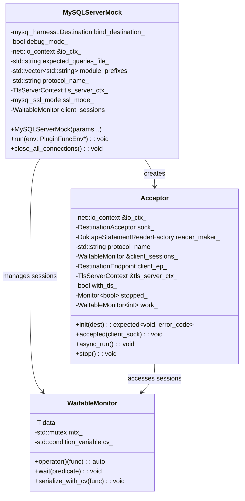
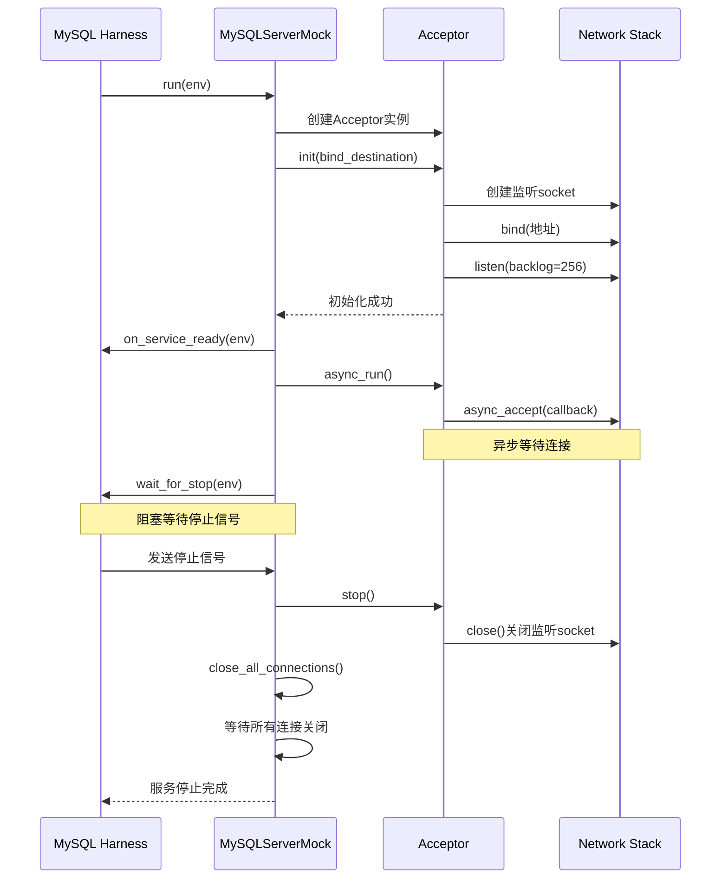
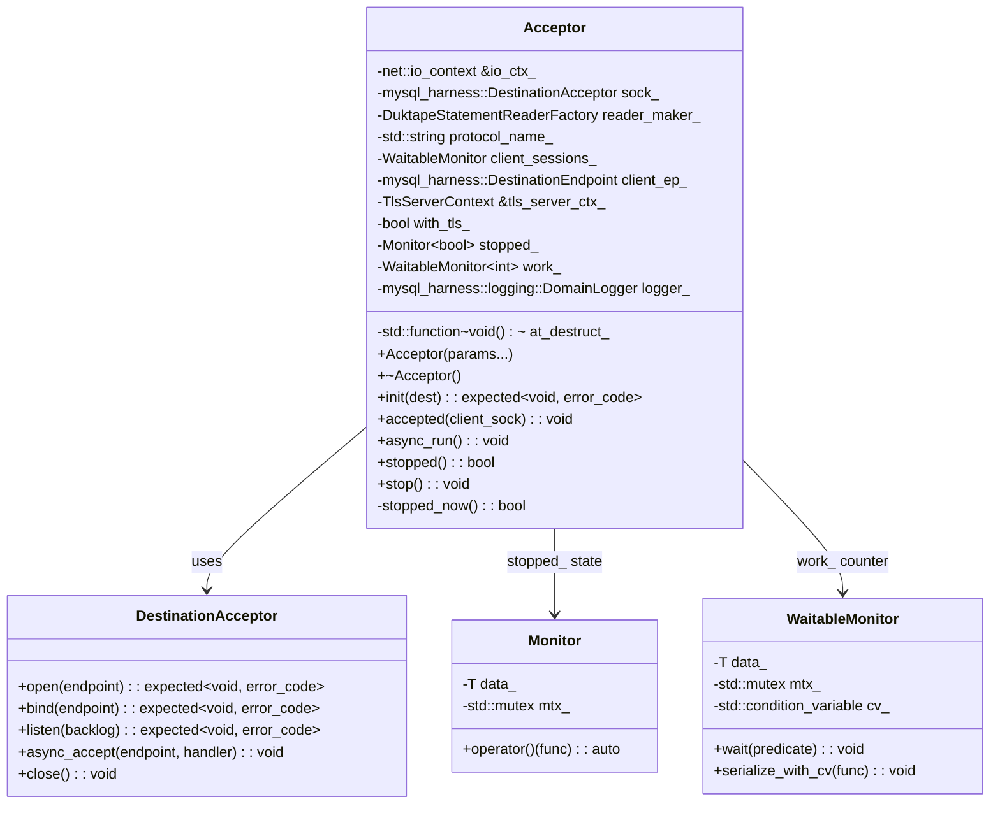
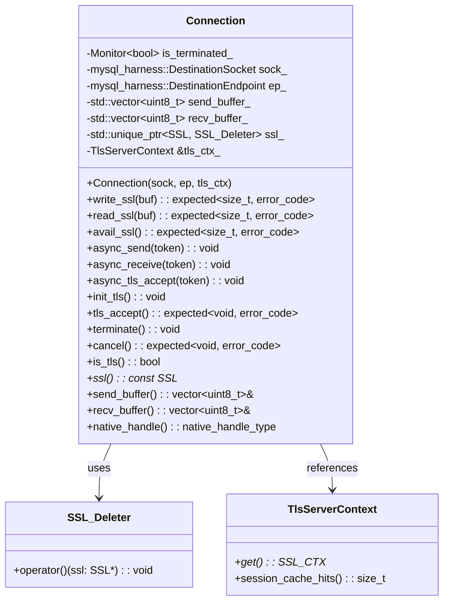
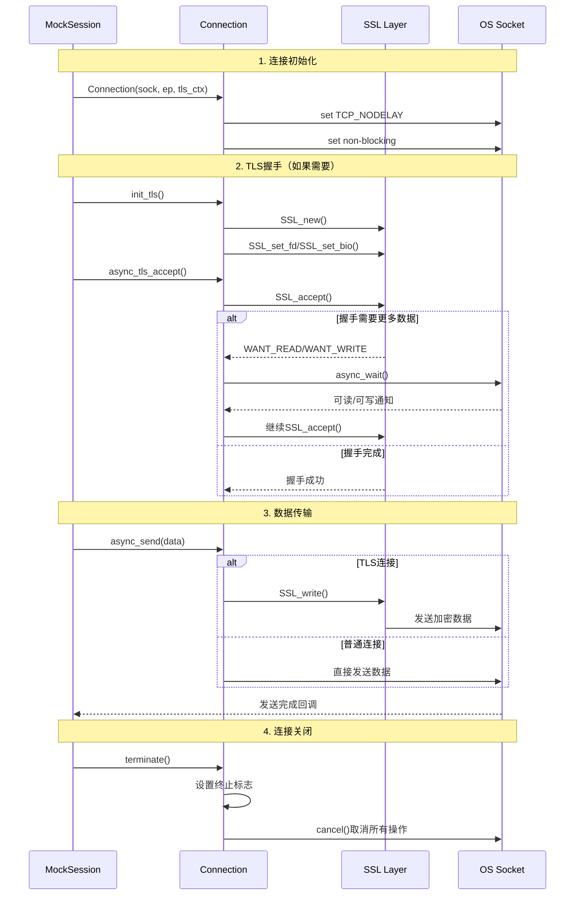

## 1. MySQLServerMock 主服务模块

### 1.1 模块架构图



### 1.2 核心功能实现

#### 1.2.1 构造函数详析

```cpp
/**
 * @brief MySQLServerMock构造函数
 * @param io_ctx IO上下文，用于异步网络操作
 * @param expected_queries_file 期望查询文件路径（JSON或JS）
 * @param module_prefixes JavaScript模块搜索路径前缀列表
 * @param bind_destination 绑定的网络地址（IP:端口或Unix Socket）
 * @param protocol_name 协议名称（"classic"或"x"）
 * @param debug_mode 调试模式，是否打印详细信息
 * @param tls_server_ctx TLS服务器上下文，用于SSL连接
 * @param ssl_mode SSL模式配置
 * 
 * 功能说明：
 * 1. 初始化所有成员变量
 * 2. 如果启用调试模式，打印配置文件路径
 * 3. 准备TLS上下文用于后续连接
 */
MySQLServerMock::MySQLServerMock(net::io_context &io_ctx,
                                 std::string expected_queries_file,
                                 std::vector<std::string> module_prefixes,
                                 mysql_harness::Destination bind_destination,
                                 std::string protocol_name, bool debug_mode,
                                 TlsServerContext &&tls_server_ctx,
                                 mysql_ssl_mode ssl_mode)
    : bind_destination_(std::move(bind_destination)),  // 移动语义避免拷贝
      debug_mode_{debug_mode},
      io_ctx_{io_ctx},                                // 引用，不能移动
      expected_queries_file_{std::move(expected_queries_file)},
      module_prefixes_{std::move(module_prefixes)},
      protocol_name_(std::move(protocol_name)),
      tls_server_ctx_{std::move(tls_server_ctx)},    // 移动TLS上下文
      ssl_mode_{ssl_mode} {
  
  // 调试模式下打印配置信息
  if (debug_mode_)
    std::cout << "\n\nExpected SQL queries come from file '"
              << expected_queries_file << "'\n\n"
              << std::flush;
}
```

#### 1.2.2 主运行方法详析

```cpp
/**
 * @brief 主运行方法，启动Mock Server服务
 * @param env 插件环境指针，用于服务生命周期管理
 * 
 * 执行流程：
 * 1. 创建并初始化Acceptor
 * 2. 绑定网络地址并开始监听
 * 3. 通知服务就绪
 * 4. 启动异步连接接受循环
 * 5. 等待停止信号
 * 6. 清理所有连接
 */
void MySQLServerMock::run(mysql_harness::PluginFuncEnv *env) {
  const auto &dest = bind_destination_;

  // 创建连接接受器
  Acceptor acceptor{
      io_ctx_,
      protocol_name_,
      client_sessions_,
      // 创建DuktapeStatementReaderFactory工厂
      DuktapeStatementReaderFactory{
          expected_queries_file_,
          module_prefixes_,
          // 会话数据提供器，用于JavaScript脚本中的mysqld.session对象
          {{"port",
            [&]() {
              return std::to_string(dest.is_tcp() ? dest.as_tcp().port() : 0);
            }},
           {"ssl_cipher", []() { return "\"\""s; }},        // 当前SSL加密套件
           {"mysqlx_ssl_cipher", []() { return "\"\""s; }}, // X协议SSL套件  
           {"ssl_session_cache_hits",                       // SSL会话缓存命中数
            [this]() {
              return std::to_string(tls_server_ctx_.session_cache_hits());
            }}},
          MockServerComponent::get_instance().get_global_scope()}, // 全局作用域
      tls_server_ctx_,
      ssl_mode_ != SSL_MODE_DISABLED}; // 根据SSL模式决定是否启用TLS

  // 初始化网络监听
  auto res = acceptor.init(dest);
  if (!res) {
    throw std::system_error(res.error(),
                            "binding to " + dest.str() + " failed");
  }

  // 通知harness框架服务已就绪
  mysql_harness::on_service_ready(env);

  // 记录服务启动信息
  mysql_harness::logging::DomainLogger().info([this, dest]() {
    return mysql_harness::utility::string_format(
        "Starting to handle %s connections on %s",
        protocol_name_.c_str(), dest.str().c_str());
  });

  // 开始异步接受连接
  acceptor.async_run();

  // 等待停止信号（阻塞直到服务被要求停止）
  mysql_harness::wait_for_stop(env, 0);

  // 停止接受新连接
  acceptor.stop();

  // 关闭所有现有连接
  close_all_connections();

  // 等待所有连接完全关闭
  client_sessions_.wait(
      [](const auto &sessions) -> bool { return sessions.empty(); });
}
```

#### 1.2.3 连接管理方法

```cpp
/**
 * @brief 关闭所有活跃连接
 * 
 * 功能说明：
 * 1. 线程安全地遍历所有会话
 * 2. 调用每个会话的terminate方法
 * 3. 触发连接的优雅关闭
 * 
 * 注意：此方法可以从其他线程调用
 */
void MySQLServerMock::close_all_connections() {
  client_sessions_([](auto &socks) {
    for (auto &conn : socks) {
      conn->terminate(); // 每个连接的terminate方法是线程安全的
    }
  });
}
```

### 1.3 模块时序图



## 2. Acceptor 连接接受模块

### 2.1 模块架构图



### 2.2 核心功能实现

#### 2.2.1 初始化方法

```cpp
/**
 * @brief 初始化接受器，创建监听socket
 * @param dest 目标网络地址（TCP或Unix Socket）
 * @return expected<void, error_code> 成功返回void，失败返回错误码
 * 
 * 功能说明：
 * 1. 解析网络地址
 * 2. 创建并配置socket
 * 3. 绑定地址并开始监听
 * 4. 设置socket选项优化性能
 */
stdx::expected<void, std::error_code> Acceptor::init(
    const mysql_harness::Destination &dest) {
  
  mysql_harness::DestinationAcceptor sock(io_ctx_);

  // 解析目标地址为网络端点
  auto ep_res = make_destination_endpoint(io_ctx_, dest);
  if (!ep_res) return stdx::unexpected(ep_res.error());
  const auto &ep = *ep_res;

  // 打开socket
  auto res = sock.open(ep);
  if (!res) return stdx::unexpected(res.error());

  // 设置非阻塞模式
  res = sock.native_non_blocking(true);
  if (!res) return stdx::unexpected(res.error());

  // TCP socket特殊设置
  if (ep.is_tcp()) {
    // 设置地址重用选项，避免TIME_WAIT状态下无法重新绑定
    res = sock.set_option(net::socket_base::reuse_address{true});
    if (!res) return stdx::unexpected(res.error());
  }

  // 绑定地址
  res = sock.bind(ep);
  if (!res) return stdx::unexpected(res.error());

  // 开始监听，backlog设为256
  res = sock.listen(256);
  if (!res) return stdx::unexpected(res.error());

  // Unix socket特殊处理：设置析构时清理文件
  if (ep.is_local()) {
    at_destruct_ = [path = ep.as_local().path()]() { 
      unlink(path.c_str()); 
    };
  }

  // 保存socket对象
  sock_ = std::move(sock);

  return {};
}
```

#### 2.2.2 连接接受处理

```cpp
/**
 * @brief 处理新接受的客户端连接
 * @param client_sock 客户端socket对象
 * 
 * 功能说明：
 * 1. 创建语句读取器
 * 2. 根据协议类型创建相应会话
 * 3. 配置断开回调
 * 4. 启动会话处理
 * 5. 继续接受下一个连接
 */
void Acceptor::accepted(mysql_harness::DestinationSocket client_sock) {
  // 通过工厂方法创建语句读取器实例
  auto reader = reader_maker_();

  // 线程安全地在会话列表中创建新会话
  auto session_it = client_sessions_([&](auto &socks) {
    if (protocol_name_ == "classic") {
      // 创建MySQL Classic协议会话
      socks.emplace_back(std::make_unique<MySQLServerMockSessionClassic>(
          std::move(client_sock),  // 移动语义转移socket所有权
          client_ep_,              // 客户端端点信息
          tls_server_ctx_,         // TLS上下文引用
          std::move(reader),       // 移动语句读取器所有权
          false,                   // 调试模式关闭
          with_tls_));             // TLS支持标志
    } else {
      // 创建MySQL X Protocol会话  
      socks.emplace_back(std::make_unique<MySQLServerMockSessionX>(
          std::move(client_sock),
          client_ep_,
          tls_server_ctx_,
          std::move(reader),
          false,
          with_tls_));
    }
    return std::prev(socks.end()); // 返回新创建元素的迭代器
  });

  auto &session = *session_it;
  
  // 设置会话断开时的清理回调
  session->disconnector([this, session_it]() mutable {
    client_sessions_.serialize_with_cv(
        [session_it](auto &sessions, auto &condvar) {
          // 从列表中移除会话（自动调用析构函数）
          sessions.erase(session_it);
          
          // 通知等待所有socket关闭的线程
          condvar.notify_one();
        });
  });

  // 延迟到下一个事件循环执行会话启动
  // 这样可以确保当前accept操作完全完成
  net::defer(io_ctx_, [&session]() { session->run(); });

  // 继续异步接受下一个连接
  async_run();
}
```

#### 2.2.3 异步运行控制

```cpp
/**
 * @brief 异步接受连接的主循环
 * 
 * 功能说明：
 * 1. 检查是否已停止
 * 2. 增加工作计数器
 * 3. 启动异步accept操作
 * 4. 设置完成回调处理
 */
void Acceptor::async_run() {
  if (stopped()) return;

  // 增加工作计数，防止在有pending操作时退出
  work_([](auto &work) { ++work; });

  // 启动异步accept操作
  sock_.async_accept(
      client_ep_, [this](std::error_code ec,
                         mysql_harness::DestinationSocket client_sock) {
        // RAII方式管理工作计数器
        Scope_guard guard([&]() {
          work_.serialize_with_cv([](auto &work, auto &cv) {
            --work;
            cv.notify_one(); // 通知可能等待的stop()方法
          });
        });

        if (ec) {
          // 接受连接出错，通常是因为socket被关闭
          return;
        }

        // TCP连接优化设置
        if (client_sock.is_tcp()) {
          client_sock.set_option(net::ip::tcp::no_delay{true});
        }

        // 记录连接信息
        logger_.info(
            [this]() { return "accepted from " + client_ep_.str(); });

        // 处理新连接
        this->accepted(std::move(client_sock));
      });
}
```

#### 2.2.4 停止控制

```cpp
/**
 * @brief 停止接受器
 * 
 * 功能说明：
 * 1. 标记为已停止状态
 * 2. 关闭监听socket
 * 3. 等待所有异步操作完成
 */
void Acceptor::stop() {
  if (!stopped_now()) return; // 如果已经停止，直接返回

  // 关闭socket，这会取消所有pending的async_accept操作
  sock_.close();

  // 等待所有异步回调完成
  work_.wait([](auto work) { return work == 0; });
}

/**
 * @brief 原子性地标记为停止状态
 * @return bool 是否是本次调用设置的停止状态
 */
bool Acceptor::stopped_now() {
  return stopped_([](bool &stopped) {
    if (stopped) return false; // 已经停止

    stopped = true;
    return true; // 本次设置为停止
  });
}
```

### 2.3 错误处理机制

```cpp
/**
 * @brief 析构函数，确保资源清理
 */
Acceptor::~Acceptor() {
  stop(); // 确保停止所有操作

  // 执行注册的清理函数（如删除Unix socket文件）
  if (at_destruct_) at_destruct_();
}
```

## 3. Connection 网络连接模块

### 3.1 模块架构图



### 3.2 核心功能实现

#### 3.2.1 构造和初始化

```cpp
/**
 * @brief Connection构造函数
 * @param sock 网络socket对象
 * @param ep 端点信息
 * @param tls_ctx TLS服务器上下文
 * 
 * 功能说明：
 * 1. 初始化socket和端点信息
 * 2. 配置TCP_NODELAY优化
 * 3. 设置非阻塞模式
 */
Connection::Connection(mysql_harness::DestinationSocket sock,
                       mysql_harness::DestinationEndpoint ep,
                       TlsServerContext &tls_ctx)
    : sock_(std::move(sock)), ep_(std::move(ep)), tls_ctx_(tls_ctx) {
  
  // 确保socket类型和端点类型匹配
  assert(sock_.is_tcp() == ep.is_tcp());

  // TCP连接优化：禁用Nagle算法减少延迟
  if (sock_.is_tcp()) {
    sock_.set_option(net::ip::tcp::no_delay{true});
  }
  
  // 设置非阻塞模式以支持异步操作
  sock_.native_non_blocking(true);
}
```

#### 3.2.2 TLS支持实现

```cpp
/**
 * @brief 初始化TLS连接
 * 
 * 功能说明：
 * 1. 创建SSL对象
 * 2. 处理预读缓冲区数据
 * 3. 配置BIO对象
 */
void Connection::init_tls() {
  ssl_.reset(SSL_new(tls_ctx_.get()));

  if (recv_buffer_.empty()) {
    // 接收缓冲区为空，直接关联socket文件描述符
    SSL_set_fd(ssl_.get(), native_handle());
  } else {
    // 接收缓冲区有数据，需要先处理缓存的数据
    // 创建内存BIO用于处理预读数据
    auto *r_mem_bio = BIO_new(BIO_s_mem());

    // 将缓存数据写入内存BIO
    auto res = BIO_write(r_mem_bio, recv_buffer_.data(), recv_buffer_.size());
    if (res != static_cast<int>(recv_buffer_.size())) {
      std::terminate(); // 这种情况不应该发生
    }

    recv_buffer_.clear();
    
    // 设置SSL使用内存BIO读取，socket BIO写入
    SSL_set_bio(ssl_.get(), r_mem_bio,
                BIO_new_socket(native_handle(), 0 /* close_flag */));
  }
}

/**
 * @brief 执行TLS握手
 * @return expected<void, error_code> 成功返回void，失败返回错误码
 */
stdx::expected<void, std::error_code> Connection::tls_accept() {
  auto *ssl = ssl_.get();
  auto *rbio = SSL_get_rbio(ssl);

  // 执行SSL握手
  stdx::expected<void, std::error_code> result{};
  const auto accept_res = SSL_accept(ssl);
  if (accept_res != 1) {
    result = stdx::unexpected(make_tls_ssl_error(ssl, accept_res));
  }

  // 如果内存BIO中的数据处理完毕，切换到socket BIO
  if (BIO_method_type(rbio) == BIO_TYPE_MEM && BIO_ctrl_pending(rbio) == 0) {
    SSL_set_fd(ssl, native_handle());
  }

  return result;
}
```

#### 3.2.3 异步IO操作

```cpp
/**
 * @brief 异步发送数据（支持TLS）
 * @param token 完成回调
 * 
 * 模板函数，支持多种回调类型
 */
template <class CompletionToken>
void Connection::async_send(CompletionToken &&token) {
  if (is_tls()) {
    async_send_tls(std::forward<CompletionToken>(token));
  } else {
    sock_.async_send(net::dynamic_buffer(send_buffer_),
                     std::forward<CompletionToken>(token));
  }
}

/**
 * @brief TLS异步发送实现
 */
template <class CompletionToken>
void Connection::async_send_tls(CompletionToken &&token) {
  net::async_completion<CompletionToken, void(std::error_code, size_t)> init{
      token};

  // 尝试立即发送数据
  const auto write_res = write_ssl(net::buffer(send_buffer_));
  if (!write_res) {
    auto write_ec = write_res.error();

    if (write_ec == TlsErrc::kWantRead || write_ec == TlsErrc::kWantWrite) {
      // SSL需要等待socket可读/可写
      sock_.async_wait(
          write_ec == TlsErrc::kWantRead ? net::socket_base::wait_read
                                         : net::socket_base::wait_write,
          [this, compl_handler = std::move(init.completion_handler)](
              std::error_code ec) mutable {
            if (ec) {
              compl_handler(ec, {});
              return;
            }

            // 递归调用继续发送
            async_send(std::move(compl_handler));
          });
    } else {
      // 发送错误，延迟调用回调
      net::defer(get_executor(),
                 [compl_handler = std::move(init.completion_handler),
                  ec = write_res.error()]() { compl_handler(ec, {}); });
    }
  } else {
    // 发送成功，更新缓冲区
    net::dynamic_buffer(send_buffer_).consume(write_res.value());

    net::defer(get_executor(),
               [compl_handler = std::move(init.completion_handler),
                transferred = write_res.value()]() {
                 compl_handler({}, transferred);
               });
  }

  return init.result.get();
}
```

#### 3.2.4 SSL数据传输

```cpp
/**
 * @brief SSL写操作
 * @param buf 要发送的数据缓冲区
 * @return expected<size_t, error_code> 成功返回发送字节数，失败返回错误码
 */
stdx::expected<size_t, std::error_code> Connection::write_ssl(
    const net::const_buffer &buf) {
  const auto res = SSL_write(ssl_.get(), buf.data(), buf.size());

  if (res <= 0) {
    return stdx::unexpected(make_tls_ssl_error(ssl_.get(), res));
  }

  return res;
}

/**
 * @brief SSL读操作
 * @param buf 接收数据的缓冲区
 * @return expected<size_t, error_code> 成功返回接收字节数，失败返回错误码
 */
stdx::expected<size_t, std::error_code> Connection::read_ssl(
    const net::mutable_buffer &buf) {
  const auto res = SSL_read(ssl_.get(), buf.data(), buf.size());

  if (res <= 0) {
    auto ec = make_tls_ssl_error(ssl_.get(), res);

    // 如果错误码为0，表示EOF
    return stdx::unexpected(ec ? ec : make_error_code(net::stream_errc::eof));
  }

  return res;
}

/**
 * @brief 获取SSL待处理数据大小
 * @return expected<size_t, error_code> 待处理字节数
 */
stdx::expected<size_t, std::error_code> Connection::avail_ssl() {
  const auto res = SSL_pending(ssl_.get());

  if (res <= 0) {
    return stdx::unexpected(make_tls_ssl_error(ssl_.get(), res));
  }

  return res;
}
```

#### 3.2.5 连接管理

```cpp
/**
 * @brief 终止连接
 * 
 * 功能说明：
 * 1. 原子性设置终止标志
 * 2. 取消所有pending操作
 * 
 * 注意：此方法可从任意线程调用
 */
void Connection::terminate() {
  is_terminated_([](auto &val) { val = true; });
  cancel();
}

/**
 * @brief 取消所有异步操作
 * @return expected<void, error_code> 操作结果
 */
stdx::expected<void, std::error_code> Connection::cancel() { 
  return sock_.cancel(); 
}
```

### 3.3 模块时序图



## 4. 模块间协作机制

### 4.1 线程安全设计

1. **WaitableMonitor**：提供线程安全的数据访问和等待机制
2. **Monitor**：简单的互斥锁封装
3. **原子操作**：关键状态变更使用原子性操作

### 4.2 异步操作协调

1. **IO上下文共享**：所有异步操作使用同一个io_context
2. **回调链接**：通过回调函数实现操作的顺序执行
3. **RAII管理**：确保资源的正确释放

### 4.3 错误传播机制

1. **expected类型**：现代C++错误处理方式
2. **异常安全**：确保异常情况下的资源清理
3. **错误日志**：完整的错误记录和诊断信息

通过这些设计，各模块能够高效协作，提供稳定可靠的MySQL协议模拟服务。
