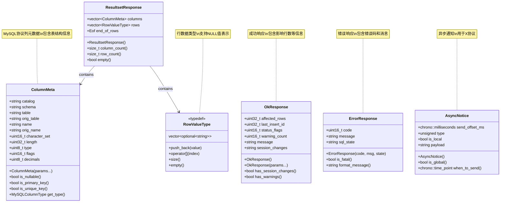
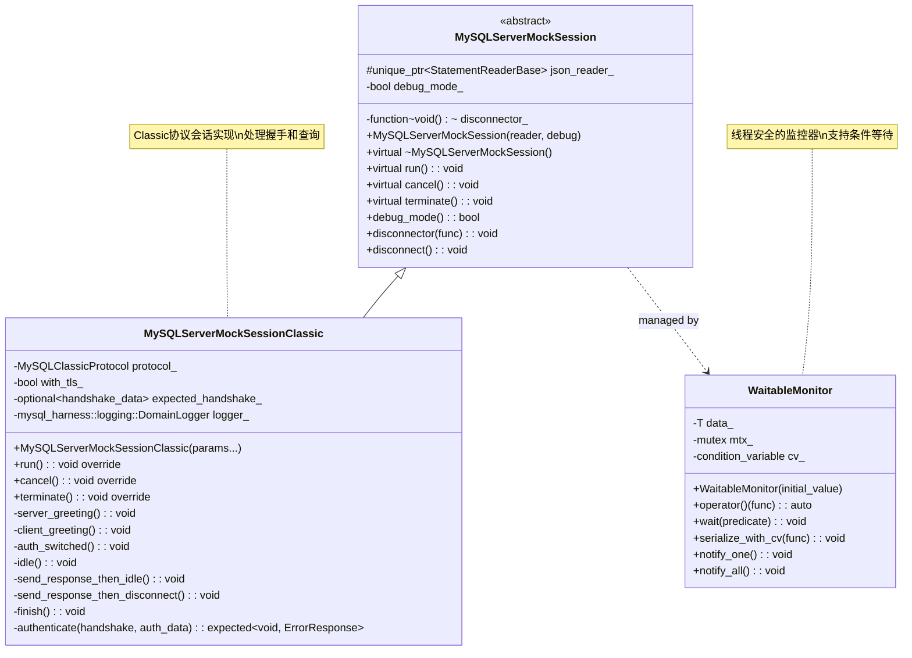
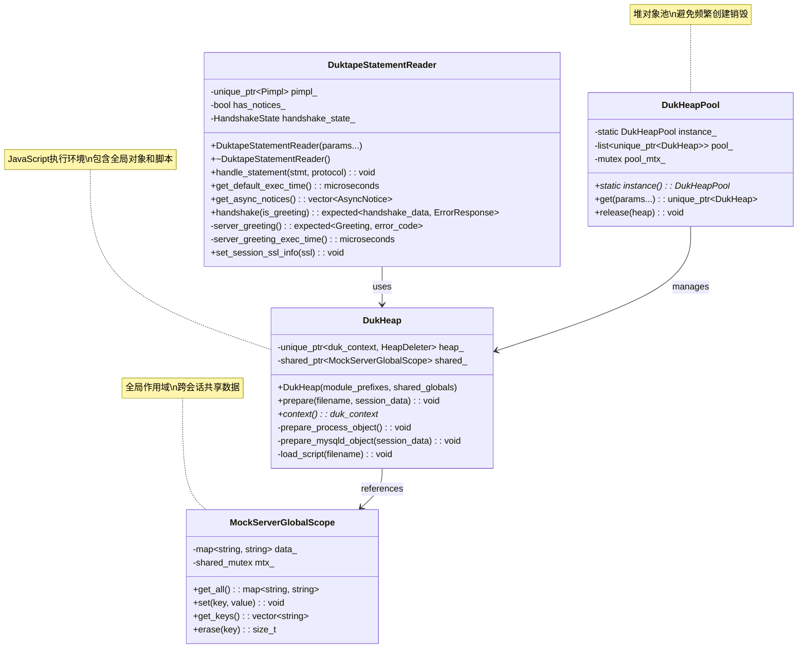

# MySQL Router Mock Server - 数据结构和最佳实践

## 1. 核心数据结构UML图和详细说明

### 1.1 协议消息数据结构



#### 1.1.1 ResultsetResponse结构详析

```cpp
/**
 * @brief MySQL结果集响应数据结构
 * 
 * 用途：
 * - 封装SELECT查询的完整响应数据
 * - 包含列定义、行数据和结束信息
 * - 支持空结果集和大结果集
 */
struct ResultsetResponse {
  // 列元数据数组，定义结果集的结构
  std::vector<classic_protocol::message::server::ColumnMeta> columns;
  
  // 行数据数组，每行是一个可选字符串值的向量
  std::vector<RowValueType> rows;
  
  // 结果集结束标记，包含影响行数、最后插入ID等信息
  classic_protocol::message::server::Eof end_of_rows;
  
  /**
   * @brief 获取列数
   */
  size_t column_count() const { return columns.size(); }
  
  /**
   * @brief 获取行数  
   */
  size_t row_count() const { return rows.size(); }
  
  /**
   * @brief 检查是否为空结果集
   */
  bool empty() const { return rows.empty(); }
  
  /**
   * @brief 验证数据完整性
   * @return bool 数据是否有效
   */
  bool is_valid() const {
    // 检查每一行的列数是否与列定义匹配
    for (const auto& row : rows) {
      if (row.size() != columns.size()) {
        return false;
      }
    }
    return true;
  }
  
  /**
   * @brief 添加行数据（带验证）
   * @param row 要添加的行数据
   * @throws std::invalid_argument 如果行数据列数不匹配
   */
  void add_row(const RowValueType& row) {
    if (row.size() != columns.size()) {
      throw std::invalid_argument(
          "Row column count doesn't match result set schema");
    }
    rows.push_back(row);
  }
};
```

#### 1.1.2 ColumnMeta结构详析

```cpp
/**
 * @brief MySQL列元数据结构
 * 
 * 对应MySQL协议的Column Definition包
 */
using ColumnMeta = classic_protocol::message::server::ColumnMeta;

// 扩展功能示例
class ExtendedColumnMeta : public ColumnMeta {
public:
  ExtendedColumnMeta(const std::string& catalog, const std::string& schema,
                     const std::string& table, const std::string& orig_table,
                     const std::string& name, const std::string& orig_name,
                     uint16_t character_set, uint32_t length, uint8_t type,
                     uint16_t flags, uint8_t decimals)
      : ColumnMeta(catalog, schema, table, orig_table, name, orig_name,
                   character_set, length, type, flags, decimals) {}

  /**
   * @brief 检查列是否可以为NULL
   */
  bool is_nullable() const {
    return !(flags() & static_cast<uint16_t>(ColumnFlag::NOT_NULL));
  }
  
  /**
   * @brief 检查是否为主键
   */
  bool is_primary_key() const {
    return flags() & static_cast<uint16_t>(ColumnFlag::PRI_KEY);
  }
  
  /**
   * @brief 检查是否为唯一键
   */
  bool is_unique_key() const {
    return flags() & static_cast<uint16_t>(ColumnFlag::UNIQUE_KEY);
  }
  
  /**
   * @brief 获取MySQL数据类型枚举
   */
  MySQLColumnType get_mysql_type() const {
    return static_cast<MySQLColumnType>(type());
  }
  
  /**
   * @brief 格式化类型信息为字符串
   */
  std::string type_info() const {
    std::stringstream ss;
    ss << mysql_type_to_string(get_mysql_type());
    if (length() > 0) {
      ss << "(" << length();
      if (decimals() > 0) {
        ss << "," << static_cast<int>(decimals());
      }
      ss << ")";
    }
    return ss.str();
  }
};
```

### 1.2 会话管理数据结构



#### 1.2.1 WaitableMonitor模板类详析

```cpp
/**
 * @brief 线程安全的监控器模板类
 * @tparam T 被监控的数据类型
 * 
 * 功能特点：
 * - 提供线程安全的数据访问
 * - 支持条件等待机制
 * - RAII风格的锁管理
 * - 高性能的函数对象接口
 */
template<typename T>
class WaitableMonitor {
public:
  /**
   * @brief 构造函数
   * @param initial_value 初始值
   */
  explicit WaitableMonitor(T initial_value = T{})
      : data_(std::move(initial_value)) {}

  /**
   * @brief 函数调用操作符，提供线程安全访问
   * @tparam Func 函数对象类型
   * @param func 操作函数，接收T&参数
   * @return auto 函数的返回值
   * 
   * 使用示例：
   * WaitableMonitor<int> counter{0};
   * int value = counter([](int& val) { return ++val; });
   */
  template<typename Func>
  auto operator()(Func&& func) -> decltype(func(std::declval<T&>())) {
    std::lock_guard<std::mutex> lock(mtx_);
    return func(data_);
  }

  /**
   * @brief 条件等待函数
   * @tparam Predicate 谓词类型
   * @param predicate 等待条件，接收const T&参数，返回bool
   * 
   * 阻塞直到谓词返回true
   * 
   * 使用示例：
   * sessions.wait([](const auto& list) { return list.empty(); });
   */
  template<typename Predicate>
  void wait(Predicate&& predicate) {
    std::unique_lock<std::mutex> lock(mtx_);
    cv_.wait(lock, [&]() { return predicate(data_); });
  }

  /**
   * @brief 序列化访问并可能通知等待线程
   * @tparam Func 函数对象类型
   * @param func 操作函数，接收T&和condition_variable&参数
   * 
   * 用于需要在修改数据后通知等待者的场景
   * 
   * 使用示例：
   * sessions.serialize_with_cv([](auto& list, auto& cv) {
   *   list.clear();
   *   cv.notify_all();
   * });
   */
  template<typename Func>
  void serialize_with_cv(Func&& func) {
    std::unique_lock<std::mutex> lock(mtx_);
    func(data_, cv_);
  }

private:
  T data_;                          // 被保护的数据
  mutable std::mutex mtx_;          // 互斥锁
  std::condition_variable cv_;      // 条件变量
};

/**
 * @brief 简化版监控器，只提供互斥访问
 */
template<typename T>
class Monitor {
public:
  explicit Monitor(T initial_value = T{})
      : data_(std::move(initial_value)) {}

  template<typename Func>
  auto operator()(Func&& func) -> decltype(func(std::declval<T&>())) {
    std::lock_guard<std::mutex> lock(mtx_);
    return func(data_);
  }

private:
  T data_;
  mutable std::mutex mtx_;
};
```

### 1.3 JavaScript引擎数据结构



#### 1.3.1 DukHeap JavaScript执行环境

```cpp
/**
 * @brief Duktape JavaScript执行堆管理类
 * 
 * 功能：
 * - 管理Duktape JavaScript引擎实例
 * - 提供模块加载和脚本执行环境
 * - 处理全局对象和会话数据注入
 */
class DukHeap {
public:
  /**
   * @brief 构造函数
   * @param module_prefixes JavaScript模块搜索路径
   * @param shared_globals 全局作用域共享对象
   */
  DukHeap(std::vector<std::string> module_prefixes,
          std::shared_ptr<MockServerGlobalScope> shared_globals)
      : heap_{duk_create_heap(nullptr, nullptr, nullptr, nullptr,
                              [](void *, const char *msg) {
                                mysql_harness::logging::DomainLogger().error(msg);
                                abort(); // 致命错误直接终止
                              })},
        shared_{std::move(shared_globals)} {
    
    // 初始化模块加载系统
    duk_module_shim_init(context(), module_prefixes);
  }

  /**
   * @brief 准备执行环境
   * @param filename 脚本文件路径
   * @param session_data 会话相关数据提供器
   */
  void prepare(
      std::string filename,
      std::map<std::string, std::function<std::string()>> &session_data) {
    
    auto ctx = context();
    duk_push_global_stash(ctx);
    
    if (nullptr == shared_.get()) {
      throw std::logic_error("shared global scope is null");
    }

    // 设置process.*对象
    prepare_process_object();

    // 设置mysqld.*对象
    prepare_mysqld_object(session_data);

    // 加载并执行脚本
    load_script(filename);

    // 验证脚本返回值
    if (!duk_is_object(ctx, -1)) {
      throw std::runtime_error(
          filename + ": expected object, got " + duk_get_type_names(ctx, -1));
    }

    // 验证必需的节区
    check_stmts_section(ctx);
    check_handshake_section(ctx);
  }

  /**
   * @brief 获取JavaScript上下文
   */
  duk_context *context() { return heap_.get(); }

private:
  /**
   * @brief 自定义删除器
   */
  class HeapDeleter {
   public:
    void operator()(duk_context *p) { duk_destroy_heap(p); }
  };

  /**
   * @brief 准备process全局对象
   * 
   * 提供以下JavaScript API：
   * - process.get_shared(key) - 获取全局共享数据
   * - process.set_shared(key, value) - 设置全局共享数据
   * - process.get_keys() - 获取所有共享数据键
   * - process.erase(key) - 删除共享数据
   */
  void prepare_process_object() {
    auto ctx = context();

    // 将shared_globals指针存储到全局stash
    duk_push_pointer(ctx, shared_.get());
    duk_put_prop_string(ctx, -2, "shared");
    duk_pop(ctx);  // stash

    // 获取process对象（由duk_module_shim_init创建）
    duk_get_global_string(ctx, "process");
    if (duk_is_undefined(ctx, -1)) {
      throw std::runtime_error("expected 'process' to exist");
    }

    // 添加共享数据访问方法
    duk_push_c_function(ctx, process_get_shared, 1);
    duk_put_prop_string(ctx, -2, "get_shared");

    duk_push_c_function(ctx, process_set_shared, 2);
    duk_put_prop_string(ctx, -2, "set_shared");

    duk_push_c_function(ctx, process_get_keys, 0);
    duk_put_prop_string(ctx, -2, "get_keys");

    duk_push_c_function(ctx, process_erase, 1);
    duk_put_prop_string(ctx, -2, "erase");

    duk_pop(ctx); // process对象
  }

  /**
   * @brief 准备mysqld全局对象
   * @param session_data 会话数据提供器映射
   * 
   * 创建JavaScript全局对象mysqld：
   * {
   *   session: {     // 会话特定数据
   *     port: 3306,
   *     ssl_cipher: "...",
   *     // ... 其他会话数据
   *   },
   *   global: Proxy  // 全局共享数据的代理对象
   * }
   */
  void prepare_mysqld_object(
      const std::map<std::string, std::function<std::string()>> &session_data) {
    auto ctx = context();
    
    duk_push_global_object(ctx);
    duk_push_object(ctx); // mysqld对象
    duk_push_object(ctx); // session对象

    // 填充会话数据
    for (const auto &el : session_data) {
      const std::string val = el.second(); // 调用提供器函数
      duk_push_lstring(ctx, val.data(), val.size());
      duk_json_decode(ctx, -1); // 解析JSON
      duk_put_prop_lstring(ctx, -2, el.first.data(), el.first.size());
    }

    duk_put_prop_string(ctx, -2, "session");

    // 创建全局数据的Proxy对象
    const char* proxy_script = R"(
      function () {
        return new Proxy({}, {
          ownKeys: function(target) {
            process.get_keys().forEach(function(el) {
              Object.defineProperty(target, el, {
                configurable: true,
                enumerable: true
              });
            });
            return Object.keys(target);
          },
          get: function(target, key, recv) {
            return process.get_shared(key);
          },
          set: function(target, key, val, recv) {
            return process.set_shared(key, val);
          },
          deleteProperty: function(target, prop) {
            if (process.erase(prop) > 0) {
              delete target[prop];
            }
          }
        });
      }
    )";

    if (DUK_EXEC_SUCCESS != duk_pcompile_string(ctx, DUK_COMPILE_FUNCTION, proxy_script)) {
      throw DuktapeRuntimeError(ctx, -1);
    }
    if (DUK_EXEC_SUCCESS != duk_pcall(ctx, 0)) {
      throw DuktapeRuntimeError(ctx, -1);
    }

    duk_put_prop_string(ctx, -2, "global");
    duk_put_prop_string(ctx, -2, "mysqld");
  }

  std::unique_ptr<duk_context, HeapDeleter> heap_{};
  std::shared_ptr<MockServerGlobalScope> shared_;

  // 脚本缓存（静态成员，所有实例共享）
  static std::mutex scripts_mtx_;
  static std::map<std::string, std::string> scripts_;
};
```

#### 1.3.2 MockServerGlobalScope全局作用域

```cpp
/**
 * @brief Mock Server全局作用域管理类
 * 
 * 功能：
 * - 跨会话共享数据存储
 * - 线程安全的读写操作
 * - 支持JavaScript全局变量访问
 */
class MockServerGlobalScope {
public:
  /**
   * @brief 获取所有共享数据
   * @return std::map<std::string, std::string> 键值对映射
   * 
   * 使用读锁保证线程安全
   */
  std::map<std::string, std::string> get_all() const {
    std::shared_lock<std::shared_mutex> lock(mtx_);
    return data_; // 拷贝返回，避免竞态条件
  }

  /**
   * @brief 设置共享数据
   * @param key 键名
   * @param value JSON编码的值
   * 
   * 使用写锁保证线程安全
   */
  void set(const std::string& key, const std::string& value) {
    std::unique_lock<std::shared_mutex> lock(mtx_);
    data_[key] = value;
  }

  /**
   * @brief 获取所有键名
   * @return std::vector<std::string> 键名列表
   */
  std::vector<std::string> get_keys() const {
    std::shared_lock<std::shared_mutex> lock(mtx_);
    std::vector<std::string> keys;
    keys.reserve(data_.size());
    
    for (const auto& pair : data_) {
      keys.push_back(pair.first);
    }
    return keys;
  }

  /**
   * @brief 删除共享数据
   * @param key 要删除的键名
   * @return size_t 删除的元素数量（0或1）
   */
  size_t erase(const std::string& key) {
    std::unique_lock<std::shared_mutex> lock(mtx_);
    return data_.erase(key);
  }

  /**
   * @brief 检查键是否存在
   * @param key 键名
   * @return bool 是否存在
   */
  bool contains(const std::string& key) const {
    std::shared_lock<std::shared_mutex> lock(mtx_);
    return data_.find(key) != data_.end();
  }

  /**
   * @brief 获取数据项数量
   * @return size_t 项数
   */
  size_t size() const {
    std::shared_lock<std::shared_mutex> lock(mtx_);
    return data_.size();
  }

  /**
   * @brief 清空所有数据
   */
  void clear() {
    std::unique_lock<std::shared_mutex> lock(mtx_);
    data_.clear();
  }

private:
  mutable std::shared_mutex mtx_;           // 读写锁
  std::map<std::string, std::string> data_; // 共享数据存储
};
```

## 2. 设计模式应用详解

### 2.1 RAII (Resource Acquisition Is Initialization)

#### 2.1.1 智能指针管理

```cpp
/**
 * @brief SSL对象的RAII管理示例
 */
class Connection {
private:
  // 自定义删除器确保SSL对象正确释放
  class SSL_Deleter {
   public:
    void operator()(SSL *ssl) { 
      if (ssl) SSL_free(ssl); 
    }
  };

  std::unique_ptr<SSL, SSL_Deleter> ssl_;

public:
  /**
   * @brief 初始化TLS连接
   * 异常安全：如果SSL_new失败，不会泄露资源
   */
  void init_tls() {
    ssl_.reset(SSL_new(tls_ctx_.get()));
    if (!ssl_) {
      throw std::runtime_error("Failed to create SSL object");
    }
    // ... 其他初始化代码
  }
};
```

#### 2.1.2 Scope Guard模式

```cpp
/**
 * @brief 作用域守护类，确保退出时执行清理
 */
class Scope_guard {
public:
  template<typename Func>
  explicit Scope_guard(Func&& func) : cleanup_(std::forward<Func>(func)) {}

  ~Scope_guard() {
    if (cleanup_) cleanup_();
  }

  // 禁止拷贝和移动
  Scope_guard(const Scope_guard&) = delete;
  Scope_guard& operator=(const Scope_guard&) = delete;

private:
  std::function<void()> cleanup_;
};

// 使用示例：
void Acceptor::async_run() {
  work_([](auto &work) { ++work; });

  sock_.async_accept(client_ep_, 
    [this](std::error_code ec, mysql_harness::DestinationSocket client_sock) {
      // RAII方式管理工作计数器
      Scope_guard guard([&]() {
        work_.serialize_with_cv([](auto &work, auto &cv) {
          --work;
          cv.notify_one();
        });
      });

      // ... 处理连接逻辑
    });
}
```

### 2.2 Factory Method Pattern (工厂方法模式)

```cpp
/**
 * @brief 语句读取器工厂类
 * 根据配置文件类型创建相应的读取器实例
 */
class DuktapeStatementReaderFactory {
public:
  DuktapeStatementReaderFactory(
      std::string filename,
      std::vector<std::string> module_prefixes,
      std::map<std::string, std::function<std::string()>> session,
      std::shared_ptr<MockServerGlobalScope> global_scope)
      : filename_{std::move(filename)},
        module_prefixes_{std::move(module_prefixes)},
        session_{std::move(session)},
        global_scope_{std::move(global_scope)} {}

  /**
   * @brief 创建语句读取器实例
   * @return std::unique_ptr<StatementReaderBase> 读取器智能指针
   * 
   * 工厂方法：根据文件类型和运行时条件创建不同的实现
   */
  std::unique_ptr<StatementReaderBase> operator()() {
    try {
      // 尝试创建正常的JavaScript读取器
      return std::make_unique<DuktapeStatementReader>(
          filename_, module_prefixes_, session_, global_scope_);
    } catch (const std::exception &ex) {
      // 失败时创建错误处理读取器
      mysql_harness::logging::DomainLogger().warning(ex.what());
      return std::make_unique<FailedStatementReader>(ex.what());
    }
  }

  /**
   * @brief 失败时的备用读取器
   */
  class FailedStatementReader : public StatementReaderBase {
   public:
    FailedStatementReader(std::string what) : what_{std::move(what)} {}

    void handle_statement(const std::string& /* statement */,
                          ProtocolBase* /* protocol */) override {
      throw std::logic_error("this should not be called.");
    }

    stdx::expected<handshake_data, ErrorResponse> handshake(
        bool /* is_greeting */) override {
      return stdx::unexpected(ErrorResponse(1064, what_, "HY000"));
    }

    // ... 其他方法的空实现
  };

private:
  std::string filename_;
  std::vector<std::string> module_prefixes_;
  std::map<std::string, std::function<std::string()>> session_;
  std::shared_ptr<MockServerGlobalScope> global_scope_;
};
```

### 2.3 Object Pool Pattern (对象池模式)

```cpp
/**
 * @brief Duktape堆对象池
 * 避免频繁创建和销毁JavaScript引擎实例
 */
class DukHeapPool {
public:
  static DukHeapPool *instance() { 
    static DukHeapPool instance_;
    return &instance_; 
  }

  /**
   * @brief 从池中获取堆对象
   * @param filename 脚本文件名
   * @param module_prefixes 模块路径
   * @param session_data 会话数据
   * @param shared_globals 全局作用域
   * @return std::unique_ptr<DukHeap> 堆对象智能指针
   */
  std::unique_ptr<DukHeap> get(
      const std::string &filename, 
      std::vector<std::string> module_prefixes,
      std::map<std::string, std::function<std::string()>> session_data,
      std::shared_ptr<MockServerGlobalScope> shared_globals) {
    
    {
      std::lock_guard<std::mutex> lock(pool_mtx_);
      if (pool_.size() > 0) {
        // 重用池中的对象
        auto result = std::move(pool_.front());
        pool_.pop_front();
        result->prepare(filename, session_data);
        return result;
      }
    }

    // 池为空，创建新对象
    auto result = std::make_unique<DukHeap>(
        std::move(module_prefixes), shared_globals);
    result->prepare(filename, session_data);
    return result;
  }

  /**
   * @brief 将对象归还到池中
   * @param heap 要归还的堆对象
   */
  void release(std::unique_ptr<DukHeap> heap) {
    std::lock_guard<std::mutex> lock(pool_mtx_);
    pool_.push_back(std::move(heap));
  }

private:
  DukHeapPool() = default;
  
  std::list<std::unique_ptr<DukHeap>> pool_;
  std::mutex pool_mtx_;
};
```

### 2.4 Strategy Pattern (策略模式)

```cpp
/**
 * @brief 协议处理策略基类
 */
class ProtocolBase {
public:
  virtual ~ProtocolBase() = default;

  // 策略接口：不同协议有不同的实现
  virtual void encode_error(const ErrorResponse &resp) = 0;
  virtual void encode_ok(const OkResponse &resp) = 0;  
  virtual void encode_resultset(const ResultsetResponse &response) = 0;

  // 通用功能：模板方法模式
  template <class CompletionToken>
  void async_send(CompletionToken &&token) {
    return conn_.async_send(std::forward<CompletionToken>(token));
  }

protected:
  Connection conn_;
  // ... 其他通用成员
};

/**
 * @brief MySQL Classic协议具体策略
 */
class MySQLClassicProtocol : public ProtocolBase {
public:
  void encode_error(const ErrorResponse &msg) override {
    // Classic协议特定的错误编码实现
    auto encode_res = classic_protocol::encode<
        classic_protocol::frame::Frame<classic_protocol::message::server::Error>>(
        {seq_no_++, msg}, shared_capabilities(),
        net::dynamic_buffer(send_buffer()));
    
    if (!encode_res) {
      // 编码失败处理
    }
  }

  void encode_ok(const OkResponse &msg) override {
    // Classic协议特定的OK响应编码
    // ... 实现细节
  }

  void encode_resultset(const ResultsetResponse &response) override {
    // Classic协议特定的结果集编码
    // ... 实现细节
  }
};
```

## 3. 性能优化最佳实践

### 3.1 内存管理优化

#### 3.1.1 移动语义的正确使用

```cpp
/**
 * @brief 移动语义优化示例
 */
class OptimizedConnection {
public:
  // 构造函数使用移动语义避免不必要的拷贝
  OptimizedConnection(mysql_harness::DestinationSocket sock,
                      mysql_harness::DestinationEndpoint ep,
                      TlsServerContext tls_ctx)
      : sock_(std::move(sock)),           // 移动socket对象
        ep_(std::move(ep)),               // 移动端点对象
        tls_ctx_(std::move(tls_ctx)) {}   // 移动TLS上下文

  // 返回值优化：返回引用而非拷贝
  const std::vector<uint8_t>& send_buffer() const { return send_buffer_; }
  std::vector<uint8_t>& send_buffer() { return send_buffer_; }

  // 参数传递优化：大对象使用const引用
  void set_data(const std::vector<uint8_t>& data) {
    send_buffer_ = data; // 必要时拷贝
  }

  void set_data(std::vector<uint8_t>&& data) {
    send_buffer_ = std::move(data); // 移动赋值
  }

private:
  mysql_harness::DestinationSocket sock_;
  mysql_harness::DestinationEndpoint ep_;
  TlsServerContext tls_ctx_;
  std::vector<uint8_t> send_buffer_;
  std::vector<uint8_t> recv_buffer_;
};
```

#### 3.1.2 缓冲区重用策略

```cpp
/**
 * @brief 缓冲区管理优化
 */
class BufferManager {
public:
  /**
   * @brief 预分配缓冲区避免频繁内存分配
   */
  void prepare_buffers() {
    constexpr size_t DEFAULT_BUFFER_SIZE = 16 * 1024; // 16KB
    
    send_buffer_.reserve(DEFAULT_BUFFER_SIZE);
    recv_buffer_.reserve(DEFAULT_BUFFER_SIZE);
  }

  /**
   * @brief 智能缓冲区增长策略
   */
  void ensure_send_capacity(size_t required_size) {
    if (send_buffer_.capacity() < required_size) {
      // 按2的幂次增长，避免频繁重新分配
      size_t new_capacity = std::max(send_buffer_.capacity() * 2, required_size);
      send_buffer_.reserve(new_capacity);
    }
  }

  /**
   * @brief 缓冲区清理而不释放内存
   */
  void reset_buffers() {
    send_buffer_.clear();    // 清空内容但保持容量
    recv_buffer_.clear();
  }

private:
  std::vector<uint8_t> send_buffer_;
  std::vector<uint8_t> recv_buffer_;
};
```

### 3.2 异步操作优化

#### 3.2.1 避免回调地狱

```cpp
/**
 * @brief 使用协程式异步操作（C++20风格）
 */
class ModernAsyncHandler {
public:
  /**
   * @brief 结构化异步操作处理
   */
  net::awaitable<void> handle_client_async() {
    try {
      // 发送greeting
      co_await send_greeting();
      
      // 等待客户端响应
      auto client_greeting = co_await receive_client_greeting();
      
      // 处理认证
      co_await process_authentication(client_greeting);
      
      // 进入命令处理循环
      while (!should_disconnect()) {
        auto command = co_await receive_command();
        co_await process_command(command);
      }
    } catch (const std::exception& e) {
      logger_.error("Async handler error: " + std::string(e.what()));
    }
  }

private:
  net::awaitable<void> send_greeting() {
    // ... 实现
    co_return;
  }

  net::awaitable<ClientGreeting> receive_client_greeting() {
    // ... 实现
    co_return {};
  }
};
```

#### 3.2.2 批量操作优化

```cpp
/**
 * @brief 批量发送优化
 */
class BatchSender {
public:
  /**
   * @brief 收集多个响应后批量发送
   */
  void add_response(const std::vector<uint8_t>& response) {
    batch_buffer_.insert(batch_buffer_.end(), 
                        response.begin(), response.end());
    
    if (batch_buffer_.size() >= BATCH_THRESHOLD) {
      flush_batch();
    }
  }

  /**
   * @brief 立即刷新所有待发送数据
   */
  void flush_batch() {
    if (!batch_buffer_.empty()) {
      // 一次性发送所有数据，减少系统调用次数
      async_send_all(batch_buffer_);
      batch_buffer_.clear();
    }
  }

private:
  static constexpr size_t BATCH_THRESHOLD = 8192; // 8KB批量阈值
  std::vector<uint8_t> batch_buffer_;
};
```

### 3.3 JavaScript引擎优化

#### 3.3.1 脚本预编译和缓存

```cpp
/**
 * @brief JavaScript脚本缓存管理
 */
class ScriptCache {
public:
  /**
   * @brief 获取编译后的脚本
   */
  std::string get_compiled_script(const std::string& filename) {
    std::lock_guard<std::mutex> lock(cache_mtx_);
    
    auto it = cache_.find(filename);
    if (it != cache_.end()) {
      hit_count_++;
      return it->second; // 缓存命中
    }

    // 缓存未命中，编译脚本
    auto compiled = compile_script(filename);
    cache_[filename] = compiled;
    miss_count_++;
    
    return compiled;
  }

  /**
   * @brief 获取缓存统计信息
   */
  struct CacheStats {
    size_t hit_count;
    size_t miss_count;
    double hit_ratio() const {
      size_t total = hit_count + miss_count;
      return total > 0 ? static_cast<double>(hit_count) / total : 0.0;
    }
  };

  CacheStats get_stats() const {
    std::lock_guard<std::mutex> lock(cache_mtx_);
    return {hit_count_, miss_count_};
  }

private:
  std::string compile_script(const std::string& filename) {
    // Duktape脚本编译实现
    // ...
    return {};
  }

  mutable std::mutex cache_mtx_;
  std::map<std::string, std::string> cache_;
  size_t hit_count_{0};
  size_t miss_count_{0};
};
```

## 4. 错误处理最佳实践

### 4.1 异常安全等级

#### 4.1.1 强异常安全保证

```cpp
/**
 * @brief 强异常安全的会话管理
 */
class SafeSessionManager {
public:
  /**
   * @brief 添加会话，提供强异常安全保证
   * 要么成功添加，要么保持原状不变
   */
  void add_session(std::unique_ptr<MySQLServerMockSession> session) {
    // 使用事务式操作
    auto transaction = [&](auto& sessions) {
      // 先验证会话有效性
      if (!session || !session->is_valid()) {
        throw std::invalid_argument("Invalid session");
      }

      // 检查是否达到最大连接数
      if (sessions.size() >= MAX_CONNECTIONS) {
        throw std::runtime_error("Max connections exceeded");
      }

      // 所有检查通过，安全添加
      sessions.push_back(std::move(session));
    };

    client_sessions_.serialize_with_cv([&](auto& sessions, auto& cv) {
      try {
        transaction(sessions);
        cv.notify_all(); // 通知等待者
      } catch (...) {
        // 异常情况下，sessions保持不变
        throw;
      }
    });
  }

private:
  static constexpr size_t MAX_CONNECTIONS = 1000;
  WaitableMonitor<std::list<std::unique_ptr<MySQLServerMockSession>>> client_sessions_;
};
```

#### 4.1.2 错误码vs异常的选择

```cpp
/**
 * @brief 混合错误处理策略
 */
class HybridErrorHandler {
public:
  /**
   * @brief 网络操作使用错误码（性能关键路径）
   */
  stdx::expected<size_t, std::error_code> send_data(
      const std::vector<uint8_t>& data) noexcept {
    try {
      auto result = socket_.send(data);
      if (result < 0) {
        return stdx::unexpected(make_error_code(std::errc::io_error));
      }
      return static_cast<size_t>(result);
    } catch (...) {
      return stdx::unexpected(make_error_code(std::errc::operation_canceled));
    }
  }

  /**
   * @brief 配置解析使用异常（错误应该被传播）
   */
  ConfigData parse_config(const std::string& filename) {
    std::ifstream file(filename);
    if (!file.is_open()) {
      throw std::runtime_error("Cannot open config file: " + filename);
    }

    try {
      // JSON解析可能抛出异常
      return parse_json_config(file);
    } catch (const std::exception& e) {
      throw std::runtime_error("Config parsing failed: " + std::string(e.what()));
    }
  }

  /**
   * @brief 资源管理使用RAII（自动清理）
   */
  class ResourceGuard {
  public:
    ResourceGuard(Resource* res) : resource_(res) {}
    ~ResourceGuard() { 
      if (resource_) {
        resource_->cleanup();
      }
    }

    // 禁止拷贝，允许移动
    ResourceGuard(const ResourceGuard&) = delete;
    ResourceGuard& operator=(const ResourceGuard&) = delete;
    
    ResourceGuard(ResourceGuard&& other) noexcept
        : resource_(std::exchange(other.resource_, nullptr)) {}

    ResourceGuard& operator=(ResourceGuard&& other) noexcept {
      if (this != &other) {
        resource_ = std::exchange(other.resource_, nullptr);
      }
      return *this;
    }

  private:
    Resource* resource_;
  };
};
```

## 5. 实战经验和案例分析

### 5.1 高并发场景优化

#### 5.1.1 连接池调优

```cpp
/**
 * @brief 生产环境连接池配置
 */
struct ProductionConfig {
  // 基于系统资源和预期负载调整
  static constexpr size_t MAX_CONNECTIONS = std::thread::hardware_concurrency() * 100;
  static constexpr size_t DUKTAPE_POOL_SIZE = std::thread::hardware_concurrency() * 2;
  static constexpr size_t BUFFER_INITIAL_SIZE = 16 * 1024;      // 16KB
  static constexpr size_t BUFFER_MAX_SIZE = 1024 * 1024;       // 1MB
  static constexpr std::chrono::milliseconds CLEANUP_INTERVAL{30000}; // 30秒

  /**
   * @brief 动态调整池大小
   */
  void adjust_pool_size(double cpu_usage, size_t active_connections) {
    if (cpu_usage > 0.8 && active_connections > MAX_CONNECTIONS * 0.7) {
      // CPU使用率高且连接数多，减少池大小
      current_pool_size_ = std::max(current_pool_size_ - 1, 
                                   std::thread::hardware_concurrency());
    } else if (cpu_usage < 0.5 && active_connections > MAX_CONNECTIONS * 0.5) {
      // CPU使用率低但连接数多，增加池大小
      current_pool_size_ = std::min(current_pool_size_ + 1, 
                                   DUKTAPE_POOL_SIZE * 2);
    }
  }

private:
  size_t current_pool_size_{DUKTAPE_POOL_SIZE};
};
```

#### 5.1.2 内存使用监控

```cpp
/**
 * @brief 内存使用监控和优化
 */
class MemoryMonitor {
public:
  struct MemoryStats {
    size_t total_allocated{0};
    size_t peak_usage{0};
    size_t current_sessions{0};
    size_t duktape_heap_count{0};
  };

  /**
   * @brief 定期检查内存使用情况
   */
  void periodic_check() {
    auto stats = collect_stats();
    
    if (stats.total_allocated > MEMORY_WARNING_THRESHOLD) {
      logger_.warning("High memory usage detected: " + 
                     std::to_string(stats.total_allocated / (1024*1024)) + " MB");
      
      // 触发垃圾收集
      trigger_cleanup();
    }

    if (stats.peak_usage > MEMORY_CRITICAL_THRESHOLD) {
      logger_.error("Critical memory usage, forcing cleanup");
      force_cleanup();
    }
  }

private:
  static constexpr size_t MEMORY_WARNING_THRESHOLD = 512 * 1024 * 1024;  // 512MB
  static constexpr size_t MEMORY_CRITICAL_THRESHOLD = 1024 * 1024 * 1024; // 1GB

  void trigger_cleanup() {
    // 清理JavaScript堆缓存
    DukHeapPool::instance()->cleanup_unused();
    
    // 强制垃圾收集
    std::this_thread::sleep_for(std::chrono::milliseconds(100));
  }
};
```

### 5.2 故障处理案例

#### 5.2.1 网络连接异常处理

```cpp
/**
 * @brief 网络异常恢复机制
 */
class NetworkErrorHandler {
public:
  /**
   * @brief 处理各种网络错误情况
   */
  void handle_network_error(std::error_code ec, 
                           MySQLServerMockSession* session) {
    if (ec == std::errc::connection_reset ||
        ec == net::stream_errc::eof) {
      // 客户端正常断开连接
      logger_.debug("Client disconnected normally");
      session->disconnect();
      return;
    }

    if (ec == std::errc::connection_aborted) {
      // 连接被中止，记录但不报错
      logger_.info("Connection aborted by client");
      session->disconnect();
      return;
    }

    if (ec == std::errc::operation_would_block) {
      // 非阻塞操作需要重试
      retry_operation(session);
      return;
    }

    if (ec == std::errc::network_unreachable ||
        ec == std::errc::host_unreachable) {
      // 网络不可达，延迟重试
      schedule_retry(session, std::chrono::seconds(5));
      return;
    }

    // 其他未知错误
    logger_.error("Unhandled network error: " + ec.message());
    session->terminate();
  }

private:
  void retry_operation(MySQLServerMockSession* session) {
    retry_count_++;
    if (retry_count_ > MAX_RETRIES) {
      logger_.error("Max retries exceeded, terminating session");
      session->terminate();
      return;
    }

    // 指数退避重试
    auto delay = std::chrono::milliseconds(100 * (1 << retry_count_));
    schedule_retry(session, delay);
  }

  void schedule_retry(MySQLServerMockSession* session,
                     std::chrono::milliseconds delay) {
    auto timer = std::make_shared<net::steady_timer>(session->get_executor());
    timer->expires_after(delay);
    
    timer->async_wait([this, session, timer](std::error_code ec) {
      if (!ec) {
        // 重试操作
        session->resume();
      }
    });
  }

private:
  static constexpr int MAX_RETRIES = 3;
  int retry_count_{0};
  mysql_harness::logging::DomainLogger logger_;
};
```

### 5.3 性能调优案例

#### 5.3.1 JavaScript执行优化

```javascript
// 优化前：每次查询都重新计算
{
  "stmts": function(stmt) {
    // 低效：每次都执行复杂计算
    var result = expensive_calculation();
    var timestamp = new Date().toISOString();
    
    if (stmt.includes("SELECT")) {
      return {
        "result": {
          "columns": [{"name": "value", "type": "STRING"}],
          "rows": [[result + " at " + timestamp]]
        }
      };
    }
    
    return {"error": {"code": 1064, "message": "Unknown statement"}};
  }
}
```

```javascript
// 优化后：使用缓存和预计算
{
  "stmts": (function() {
    // 预计算和缓存
    var cache = {};
    var expensive_result = expensive_calculation();
    
    return function(stmt) {
      // 使用缓存
      var cache_key = stmt.substring(0, 50); // 简单缓存键
      if (cache[cache_key]) {
        return cache[cache_key];
      }
      
      var result;
      if (stmt.includes("SELECT")) {
        result = {
          "result": {
            "columns": [{"name": "value", "type": "STRING"}],  
            "rows": [[expensive_result]]
          }
        };
      } else {
        result = {"error": {"code": 1064, "message": "Unknown statement"}};
      }
      
      // 缓存结果（限制缓存大小）
      if (Object.keys(cache).length < 100) {
        cache[cache_key] = result;
      }
      
      return result;
    };
  })()
}
```

这些最佳实践和设计模式的应用，使MySQL Router Mock Server具备了高性能、高可靠性和良好的可维护性。通过合理的架构设计和优化策略，系统能够在各种复杂场景下稳定运行。
