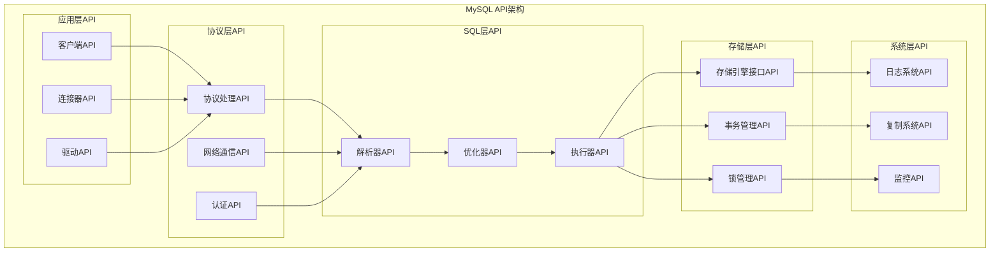
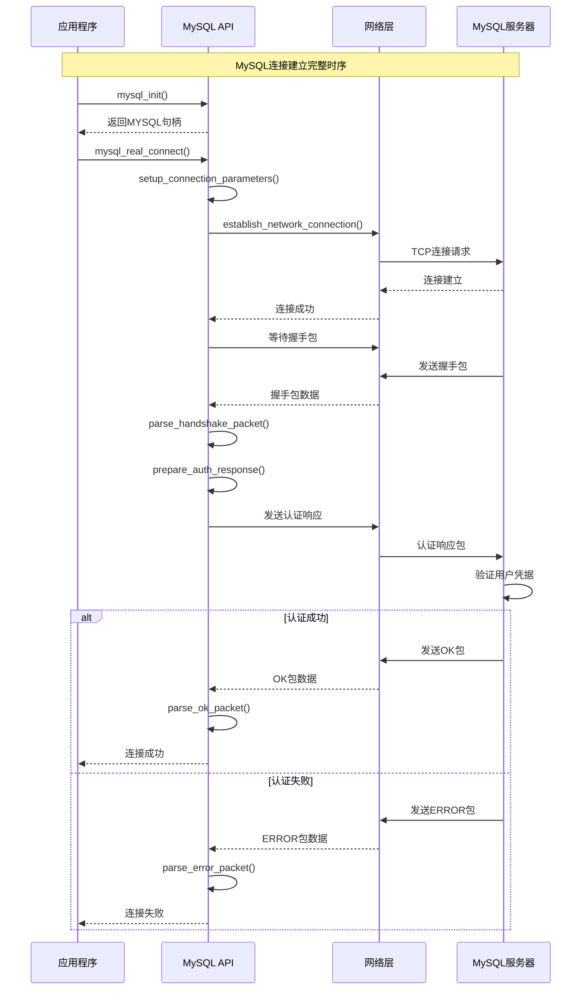
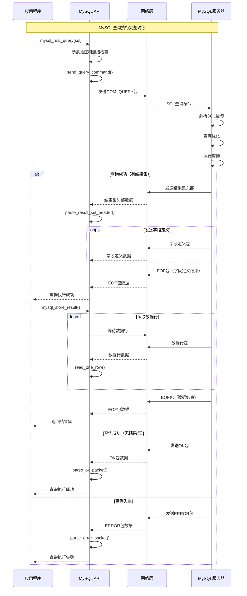
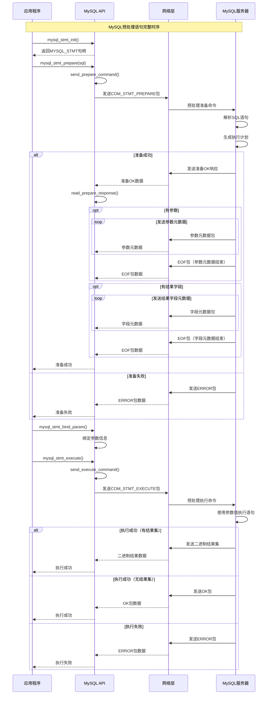

## 概述

MySQL作为世界上最流行的开源关系数据库管理系统，提供了丰富的API接口供外部应用程序调用。本文将深入分析MySQL对外提供的核心API，包括接口设计原理、调用链路、关键函数实现和详细功能说明。

<!--more-->

## 1. MySQL API架构概览

### 1.1 API分层设计

MySQL API采用分层设计，从上到下包括：



### 1.2 API接口分类

MySQL API按功能可分为以下几类：

1. **连接管理API**：处理客户端连接建立、维护和关闭
2. **查询执行API**：执行SQL语句和获取结果
3. **预处理语句API**：支持参数化查询和批量操作
4. **事务管理API**：控制事务的开始、提交和回滚
5. **元数据API**：获取数据库、表、字段等元信息
6. **管理API**：数据库管理和配置相关功能

## 2. 连接管理API深度解析

### 2.1 mysql_real_connect API

#### 2.1.1 API接口定义

```cpp
/**

 * MySQL连接建立API
 * 建立到MySQL服务器的连接

 *

 * @param mysql     连接句柄指针
 * @param host      服务器主机名或IP地址
 * @param user      用户名
 * @param passwd    密码
 * @param db        默认数据库名
 * @param port      端口号（0使用默认端口3306）
 * @param unix_socket Unix套接字文件路径
 * @param clientflag 客户端标志位
 * @return 成功返回连接句柄，失败返回NULL

 */
MYSQL *mysql_real_connect(MYSQL *mysql,
                         const char *host,
                         const char *user,
                         const char *passwd,
                         const char *db,
                         unsigned int port,
                         const char *unix_socket,
                         unsigned long clientflag);
```

#### 2.1.2 入口函数实现

```cpp
/**

 * mysql_real_connect 入口函数实现
 * 位置：libmysql/libmysql.c

 */
MYSQL *mysql_real_connect(MYSQL *mysql, const char *host, const char *user,
                         const char *passwd, const char *db,
                         unsigned int port, const char *unix_socket,
                         unsigned long clientflag) {
    DBUG_ENTER("mysql_real_connect");
    
    // 1. 参数验证和初始化
    if (!mysql) {
        if (!(mysql = mysql_init(NULL))) {
            DBUG_RETURN(NULL);
        }
        mysql->free_me = 1; // 标记需要释放
    }
    
    // 2. 设置连接参数
    if (setup_connection_parameters(mysql, host, user, passwd, db,
                                   port, unix_socket, clientflag) != 0) {
        DBUG_RETURN(NULL);
    }
    
    // 3. 建立网络连接
    if (establish_network_connection(mysql) != 0) {
        DBUG_RETURN(NULL);
    }
    
    // 4. 执行握手协议
    if (perform_handshake_protocol(mysql) != 0) {
        mysql_close(mysql);
        DBUG_RETURN(NULL);
    }
    
    // 5. 执行用户认证
    if (authenticate_user(mysql) != 0) {
        mysql_close(mysql);
        DBUG_RETURN(NULL);
    }
    
    // 6. 设置默认数据库
    if (db && *db && select_default_database(mysql, db) != 0) {
        mysql_close(mysql);
        DBUG_RETURN(NULL);
    }
    
    // 7. 连接后初始化
    if (post_connection_initialization(mysql) != 0) {
        mysql_close(mysql);
        DBUG_RETURN(NULL);
    }
    
    DBUG_RETURN(mysql);
}
```

#### 2.1.3 关键函数调用链路

**1. setup_connection_parameters 函数**

```cpp
/**

 * 设置连接参数
 * 配置连接所需的各种参数和选项

 */
static int setup_connection_parameters(MYSQL *mysql, const char *host,
                                     const char *user, const char *passwd,
                                     const char *db, unsigned int port,
                                     const char *unix_socket,
                                     unsigned long clientflag) {
    DBUG_ENTER("setup_connection_parameters");
    
    // 设置主机信息
    if (host && *host) {
        if (!(mysql->host_info = my_strdup(host, MYF(MY_WME)))) {
            set_mysql_error(mysql, CR_OUT_OF_MEMORY, unknown_sqlstate);
            DBUG_RETURN(1);
        }
    } else {
        mysql->host_info = my_strdup(LOCAL_HOST, MYF(MY_WME));
    }
    
    // 设置用户信息
    if (user && *user) {
        mysql->user = my_strdup(user, MYF(MY_WME));
    } else {
        mysql->user = my_strdup(getenv("USER") ? getenv("USER") : "root", MYF(MY_WME));
    }
    
    // 设置密码
    if (passwd && *passwd) {
        mysql->passwd = my_strdup(passwd, MYF(MY_WME));
    }
    
    // 设置数据库名
    if (db && *db) {
        mysql->db = my_strdup(db, MYF(MY_WME));
    }
    
    // 设置端口和套接字
    mysql->port = port ? port : MYSQL_PORT;
    if (unix_socket) {
        mysql->unix_socket = my_strdup(unix_socket, MYF(MY_WME));
    }
    
    // 设置客户端标志
    mysql->client_flag = clientflag;
    
    // 应用连接选项
    apply_connection_options(mysql);
    
    DBUG_RETURN(0);
}
```

**2. establish_network_connection 函数**

```cpp
/**

 * 建立网络连接
 * 根据配置建立TCP或Unix套接字连接

 */
static int establish_network_connection(MYSQL *mysql) {
    DBUG_ENTER("establish_network_connection");
    
    Vio *vio = NULL;
    int error = 0;
    
    // 确定连接类型
    if (mysql->unix_socket &&
        (!mysql->host_info || !strcmp(mysql->host_info, LOCAL_HOST))) {
        // Unix套接字连接
        vio = create_unix_socket_connection(mysql);
    } else {
        // TCP/IP连接
        vio = create_tcp_connection(mysql);
    }
    
    if (!vio) {
        DBUG_RETURN(1);
    }
    
    // 设置网络I/O对象
    mysql->net.vio = vio;
    
    // 初始化网络缓冲区
    if (my_net_init(&mysql->net, vio)) {
        vio_delete(vio);
        DBUG_RETURN(1);
    }
    
    // 设置网络超时
    vio_timeout(vio, 0, mysql->options.connect_timeout);
    vio_timeout(vio, 1, mysql->options.read_timeout);
    
    DBUG_RETURN(0);
}

/**

 * 创建TCP连接

 */
static Vio *create_tcp_connection(MYSQL *mysql) {
    DBUG_ENTER("create_tcp_connection");
    
    struct addrinfo hints, *res, *res_lst;
    int error;
    MYSQL_SOCKET sock = INVALID_SOCKET;
    Vio *vio = NULL;
    
    // 设置地址解析参数
    memset(&hints, 0, sizeof(hints));
    hints.ai_family = AF_UNSPEC;      // IPv4或IPv6
    hints.ai_socktype = SOCK_STREAM;  // TCP套接字
    hints.ai_protocol = IPPROTO_TCP;
    
    // 解析主机地址
    char port_str[16];
    snprintf(port_str, sizeof(port_str), "%u", mysql->port);
    
    error = getaddrinfo(mysql->host_info, port_str, &hints, &res_lst);
    if (error) {
        set_mysql_error(mysql, CR_UNKNOWN_HOST, unknown_sqlstate);
        DBUG_RETURN(NULL);
    }
    
    // 尝试连接每个地址
    for (res = res_lst; res; res = res->ai_next) {
        sock = socket(res->ai_family, res->ai_socktype, res->ai_protocol);
        if (sock == INVALID_SOCKET) {
            continue;
        }
        
        // 设置套接字选项
        set_socket_options(sock);
        
        // 建立连接
        if (connect(sock, res->ai_addr, res->ai_addrlen) == 0) {
            break; // 连接成功
        }
        
        // 连接失败，关闭套接字
        closesocket(sock);
        sock = INVALID_SOCKET;
    }
    
    freeaddrinfo(res_lst);
    
    if (sock == INVALID_SOCKET) {
        set_mysql_error(mysql, CR_CONN_HOST_ERROR, unknown_sqlstate);
        DBUG_RETURN(NULL);
    }
    
    // 创建VIO对象
    vio = vio_new(sock, VIO_TYPE_TCPIP, VIO_LOCALHOST);
    if (!vio) {
        closesocket(sock);
        set_mysql_error(mysql, CR_OUT_OF_MEMORY, unknown_sqlstate);
    }
    
    DBUG_RETURN(vio);
}
```

**3. perform_handshake_protocol 函数**

```cpp
/**

 * 执行握手协议
 * 处理MySQL客户端-服务器握手过程

 */
static int perform_handshake_protocol(MYSQL *mysql) {
    DBUG_ENTER("perform_handshake_protocol");
    
    uchar *pos, *end;
    ulong pkt_length;
    NET *net = &mysql->net;
    
    // 1. 读取服务器握手包
    pkt_length = cli_safe_read(mysql);
    if (pkt_length == packet_error) {
        DBUG_RETURN(1);
    }
    
    pos = net->read_pos;
    end = pos + pkt_length;
    
    // 2. 解析握手包
    if (parse_handshake_packet(mysql, pos, end) != 0) {
        DBUG_RETURN(1);
    }
    
    // 3. 准备认证响应包
    if (prepare_auth_response(mysql) != 0) {
        DBUG_RETURN(1);
    }
    
    // 4. 发送认证响应
    if (send_auth_response(mysql) != 0) {
        DBUG_RETURN(1);
    }
    
    DBUG_RETURN(0);
}

/**

 * 解析服务器握手包

 */
static int parse_handshake_packet(MYSQL *mysql, uchar *pos, uchar *end) {
    DBUG_ENTER("parse_handshake_packet");
    
    // 检查协议版本
    mysql->protocol_version = *pos++;
    if (mysql->protocol_version < PROTOCOL_VERSION) {
        set_mysql_error(mysql, CR_VERSION_ERROR, unknown_sqlstate);
        DBUG_RETURN(1);
    }
    
    // 读取服务器版本字符串
    mysql->server_version = my_strdup((char*)pos, MYF(MY_WME));
    pos += strlen((char*)pos) + 1;
    
    // 读取连接ID
    mysql->thread_id = uint4korr(pos);
    pos += 4;
    
    // 读取认证插件数据第一部分
    memcpy(mysql->scramble, pos, SCRAMBLE_LENGTH_323);
    pos += SCRAMBLE_LENGTH_323;
    pos++; // 跳过填充字节
    
    // 读取服务器能力标志
    if (pos < end) {
        mysql->server_capabilities = uint2korr(pos);
        pos += 2;
        
        if (pos < end) {
            mysql->server_language = *pos++;
            mysql->server_status = uint2korr(pos);
            pos += 2;
            
            // 读取扩展服务器能力标志
            mysql->server_capabilities |= uint2korr(pos) << 16;
            pos += 2;
            
            // 读取认证插件数据长度
            uchar auth_plugin_data_len = *pos++;
            pos += 10; // 跳过保留字节
            
            // 读取认证插件数据第二部分
            if (auth_plugin_data_len > SCRAMBLE_LENGTH_323) {
                memcpy(mysql->scramble + SCRAMBLE_LENGTH_323, pos,
                       auth_plugin_data_len - SCRAMBLE_LENGTH_323 - 1);
                pos += auth_plugin_data_len - SCRAMBLE_LENGTH_323 - 1;
                pos++; // 跳过结束字节
            }
            
            // 读取认证插件名称
            if (pos < end) {
                mysql->server_auth_plugin_name = my_strdup((char*)pos, MYF(MY_WME));
            }
        }
    }
    
    DBUG_RETURN(0);
}
```

### 2.2 mysql_close API

#### 2.2.1 API接口定义

```cpp
/**

 * MySQL连接关闭API
 * 关闭到MySQL服务器的连接并释放相关资源

 *

 * @param mysql 连接句柄指针

 */
void mysql_close(MYSQL *mysql);
```

#### 2.2.2 入口函数实现

```cpp
/**

 * mysql_close 入口函数实现
 * 位置：libmysql/libmysql.c

 */
void mysql_close(MYSQL *mysql) {
    DBUG_ENTER("mysql_close");
    
    if (mysql) {
        // 1. 发送退出命令
        if (mysql->net.vio != 0) {
            send_quit_command(mysql);
        }
        
        // 2. 释放网络资源
        cleanup_network_resources(mysql);
        
        // 3. 释放内存资源
        cleanup_memory_resources(mysql);
        
        // 4. 释放连接对象本身
        if (mysql->free_me) {
            my_free(mysql);
        }
    }
    
    DBUG_VOID_RETURN;
}

/**

 * 发送退出命令

 */
static void send_quit_command(MYSQL *mysql) {
    DBUG_ENTER("send_quit_command");
    
    // 构造COM_QUIT命令包
    uchar quit_packet[1] = {COM_QUIT};
    
    // 发送命令（忽略错误，因为连接可能已断开）
    my_net_write(&mysql->net, quit_packet, 1);
    my_net_flush(&mysql->net);
    
    DBUG_VOID_RETURN;
}

/**

 * 清理网络资源

 */
static void cleanup_network_resources(MYSQL *mysql) {
    DBUG_ENTER("cleanup_network_resources");
    
    // 关闭网络连接
    if (mysql->net.vio) {
        vio_delete(mysql->net.vio);
        mysql->net.vio = NULL;
    }
    
    // 释放网络缓冲区
    net_end(&mysql->net);
    
    DBUG_VOID_RETURN;
}

/**

 * 清理内存资源

 */
static void cleanup_memory_resources(MYSQL *mysql) {
    DBUG_ENTER("cleanup_memory_resources");
    
    // 释放字符串资源
    my_free(mysql->host_info);
    my_free(mysql->user);
    my_free(mysql->passwd);
    my_free(mysql->db);
    my_free(mysql->unix_socket);
    my_free(mysql->server_version);
    my_free(mysql->server_auth_plugin_name);
    
    // 释放选项资源
    mysql_close_free_options(mysql);
    
    // 释放SSL资源
    mysql_ssl_free(mysql);
    
    // 释放扩展资源
    if (mysql->extension) {
        my_free(mysql->extension);
    }
    
    DBUG_VOID_RETURN;
}
```

## 3. 查询执行API深度解析

### 3.1 mysql_real_query API

#### 3.1.1 API接口定义

```cpp
/**

 * MySQL查询执行API
 * 执行SQL查询语句

 *

 * @param mysql     连接句柄指针
 * @param stmt_str  SQL语句字符串
 * @param length    SQL语句长度
 * @return 成功返回0，失败返回非0

 */
int mysql_real_query(MYSQL *mysql, const char *stmt_str, unsigned long length);
```

#### 3.1.2 入口函数实现

```cpp
/**

 * mysql_real_query 入口函数实现
 * 位置：libmysql/libmysql.c

 */
int mysql_real_query(MYSQL *mysql, const char *stmt_str, unsigned long length) {
    DBUG_ENTER("mysql_real_query");
    DBUG_PRINT("enter", ("handle: 0x%lx", (long) mysql));
    DBUG_PRINT("query", ("Query = '%-.4096s'", stmt_str));
    
    // 1. 参数验证
    if (!mysql || !stmt_str) {
        set_mysql_error(mysql, CR_NULL_POINTER, unknown_sqlstate);
        DBUG_RETURN(1);
    }
    
    // 2. 连接状态检查
    if (check_connection_status(mysql) != 0) {
        DBUG_RETURN(1);
    }
    
    // 3. 清理之前的结果
    mysql_free_result(mysql->result);
    mysql->result = NULL;
    
    // 4. 发送查询命令
    if (send_query_command(mysql, stmt_str, length) != 0) {
        DBUG_RETURN(1);
    }
    
    // 5. 读取查询响应
    if (read_query_response(mysql) != 0) {
        DBUG_RETURN(1);
    }
    
    DBUG_RETURN(0);
}
```

#### 3.1.3 关键函数调用链路

**1. send_query_command 函数**

```cpp
/**

 * 发送查询命令
 * 将SQL语句封装成MySQL协议包发送给服务器

 */
static int send_query_command(MYSQL *mysql, const char *query, unsigned long length) {
    DBUG_ENTER("send_query_command");
    
    // 1. 构造命令包
    uchar *packet;
    ulong packet_length = length + 1; // +1 for command byte
    
    if (!(packet = (uchar*) my_malloc(packet_length, MYF(MY_WME)))) {
        set_mysql_error(mysql, CR_OUT_OF_MEMORY, unknown_sqlstate);
        DBUG_RETURN(1);
    }
    
    // 2. 设置命令类型
    packet[0] = COM_QUERY;
    
    // 3. 复制SQL语句
    memcpy(packet + 1, query, length);
    
    // 4. 发送数据包
    if (my_net_write(&mysql->net, packet, packet_length) ||
        my_net_flush(&mysql->net)) {
        my_free(packet);
        set_mysql_error(mysql, CR_SERVER_LOST, unknown_sqlstate);
        DBUG_RETURN(1);
    }
    
    my_free(packet);
    
    // 5. 更新统计信息
    mysql->info = NULL;
    mysql->affected_rows = ~(my_ulonglong) 0;
    
    DBUG_RETURN(0);
}
```

**2. read_query_response 函数**

```cpp
/**

 * 读取查询响应
 * 从服务器读取查询执行结果

 */
static int read_query_response(MYSQL *mysql) {
    DBUG_ENTER("read_query_response");
    
    ulong pkt_length;
    NET *net = &mysql->net;
    
    // 1. 读取响应包
    pkt_length = cli_safe_read(mysql);
    if (pkt_length == packet_error) {
        DBUG_RETURN(1);
    }
    
    // 2. 解析响应包类型
    uchar *pos = net->read_pos;
    uchar packet_type = *pos;
    
    switch (packet_type) {
        case 0x00: // OK包
            return parse_ok_packet(mysql, pos, pkt_length);
            
        case 0xFF: // ERROR包
            return parse_error_packet(mysql, pos, pkt_length);
            
        case 0xFE: // EOF包（旧协议）
            if (pkt_length < 9) {
                return parse_eof_packet(mysql, pos, pkt_length);
            }
            // 否则按结果集处理
            
        default: // 结果集包
            return parse_result_set_header(mysql, pos, pkt_length);
    }
}

/**

 * 解析OK包

 */
static int parse_ok_packet(MYSQL *mysql, uchar *pos, ulong packet_length) {
    DBUG_ENTER("parse_ok_packet");
    
    pos++; // 跳过包类型字节
    
    // 读取影响行数
    mysql->affected_rows = net_field_length_ll(&pos);
    
    // 读取插入ID
    mysql->insert_id = net_field_length_ll(&pos);
    
    // 读取服务器状态
    if (packet_length >= 5) {
        mysql->server_status = uint2korr(pos);
        pos += 2;
        
        // 读取警告数量
        mysql->warning_count = uint2korr(pos);
        pos += 2;
        
        // 读取信息字符串
        if (pos < mysql->net.read_pos + packet_length) {
            mysql->info = (char*) pos;
        }
    }
    
    DBUG_RETURN(0);
}

/**

 * 解析错误包

 */
static int parse_error_packet(MYSQL *mysql, uchar *pos, ulong packet_length) {
    DBUG_ENTER("parse_error_packet");
    
    pos++; // 跳过包类型字节
    
    // 读取错误码
    uint error_code = uint2korr(pos);
    pos += 2;
    
    // 读取SQL状态标记
    char *sqlstate = unknown_sqlstate;
    if (*pos == '#') {
        pos++;
        sqlstate = (char*) pos;
        pos += SQLSTATE_LENGTH;
    }
    
    // 读取错误消息
    uint error_msg_length = (mysql->net.read_pos + packet_length) - pos;
    char *error_msg = (char*) pos;
    
    // 设置错误信息
    set_mysql_extended_error(mysql, error_code, sqlstate, error_msg, error_msg_length);
    
    DBUG_RETURN(1);
}

/**

 * 解析结果集头部

 */
static int parse_result_set_header(MYSQL *mysql, uchar *pos, ulong packet_length) {
    DBUG_ENTER("parse_result_set_header");
    
    // 读取字段数量
    mysql->field_count = (uint) net_field_length(&pos);
    
    if (mysql->field_count == 0) {
        // 没有结果集的语句
        mysql->affected_rows = net_field_length_ll(&pos);
        mysql->insert_id = net_field_length_ll(&pos);
        
        if (packet_length >= 5) {
            mysql->server_status = uint2korr(pos);
            pos += 2;
            mysql->warning_count = uint2korr(pos);
        }
        
        DBUG_RETURN(0);
    }
    
    // 有结果集，读取字段定义
    if (read_field_definitions(mysql) != 0) {
        DBUG_RETURN(1);
    }
    
    DBUG_RETURN(0);
}
```

### 3.2 mysql_store_result API

#### 3.2.1 API接口定义

```cpp
/**

 * MySQL结果集获取API
 * 从服务器获取查询结果集并存储在客户端

 *

 * @param mysql 连接句柄指针
 * @return 成功返回结果集指针，失败返回NULL

 */
MYSQL_RES *mysql_store_result(MYSQL *mysql);
```

#### 3.2.2 入口函数实现

```cpp
/**

 * mysql_store_result 入口函数实现
 * 位置：libmysql/libmysql.c

 */
MYSQL_RES *mysql_store_result(MYSQL *mysql) {
    DBUG_ENTER("mysql_store_result");
    
    MYSQL_RES *result;
    
    // 1. 参数验证
    if (!mysql) {
        DBUG_RETURN(NULL);
    }
    
    // 2. 检查是否有结果集
    if (!mysql->field_count) {
        DBUG_RETURN(NULL);
    }
    
    // 3. 分配结果集结构
    if (!(result = (MYSQL_RES*) my_malloc(sizeof(MYSQL_RES), MYF(MY_WME | MY_ZEROFILL)))) {
        set_mysql_error(mysql, CR_OUT_OF_MEMORY, unknown_sqlstate);
        DBUG_RETURN(NULL);
    }
    
    // 4. 初始化结果集
    result->methods = &mysql_result_methods;
    result->eof = 1; // 假设已到达末尾
    
    // 5. 复制字段信息
    if (copy_field_definitions(mysql, result) != 0) {
        mysql_free_result(result);
        DBUG_RETURN(NULL);
    }
    
    // 6. 读取所有数据行
    if (read_all_rows(mysql, result) != 0) {
        mysql_free_result(result);
        DBUG_RETURN(NULL);
    }
    
    // 7. 设置结果集状态
    mysql->result = result;
    result->handle = mysql;
    
    DBUG_RETURN(result);
}
```

#### 3.2.3 关键函数调用链路

**1. copy_field_definitions 函数**

```cpp
/**

 * 复制字段定义信息
 * 从MySQL连接对象复制字段定义到结果集

 */
static int copy_field_definitions(MYSQL *mysql, MYSQL_RES *result) {
    DBUG_ENTER("copy_field_definitions");
    
    uint field_count = mysql->field_count;
    MYSQL_FIELD *fields;
    
    // 1. 分配字段数组
    if (!(fields = (MYSQL_FIELD*) my_malloc(sizeof(MYSQL_FIELD) * field_count,
                                           MYF(MY_WME | MY_ZEROFILL)))) {
        set_mysql_error(mysql, CR_OUT_OF_MEMORY, unknown_sqlstate);
        DBUG_RETURN(1);
    }
    
    // 2. 复制字段信息
    for (uint i = 0; i < field_count; i++) {
        MYSQL_FIELD *field = &fields[i];
        MYSQL_FIELD *src_field = &mysql->fields[i];
        
        // 复制基本信息
        *field = *src_field;
        
        // 复制字符串信息
        if (src_field->name) {
            field->name = my_strdup(src_field->name, MYF(MY_WME));
        }
        if (src_field->table) {
            field->table = my_strdup(src_field->table, MYF(MY_WME));
        }
        if (src_field->org_table) {
            field->org_table = my_strdup(src_field->org_table, MYF(MY_WME));
        }
        if (src_field->db) {
            field->db = my_strdup(src_field->db, MYF(MY_WME));
        }
        if (src_field->catalog) {
            field->catalog = my_strdup(src_field->catalog, MYF(MY_WME));
        }
        if (src_field->def) {
            field->def = my_strdup(src_field->def, MYF(MY_WME));
        }
    }
    
    // 3. 设置结果集字段信息
    result->fields = fields;
    result->field_count = field_count;
    
    DBUG_RETURN(0);
}
```

**2. read_all_rows 函数**

```cpp
/**

 * 读取所有数据行
 * 从服务器读取结果集的所有数据行

 */
static int read_all_rows(MYSQL *mysql, MYSQL_RES *result) {
    DBUG_ENTER("read_all_rows");
    
    MYSQL_ROWS **prev_ptr = &result->data;
    MYSQL_ROWS *cur;
    my_ulonglong row_count = 0;
    
    // 1. 循环读取数据行
    while (true) {
        MYSQL_ROW row = read_one_row(mysql, result->field_count, NULL, NULL);
        
        if (!row) {
            break; // 读取完毕或出错
        }
        
        // 2. 分配行结构
        if (!(cur = (MYSQL_ROWS*) my_malloc(sizeof(MYSQL_ROWS), MYF(MY_WME)))) {
            set_mysql_error(mysql, CR_OUT_OF_MEMORY, unknown_sqlstate);
            DBUG_RETURN(1);
        }
        
        // 3. 设置行数据
        cur->data = row;
        cur->length = NULL; // 将在需要时计算
        
        // 4. 链接到结果集
        *prev_ptr = cur;
        prev_ptr = &cur->next;
        row_count++;
    }
    
    // 5. 结束链表
    *prev_ptr = NULL;
    
    // 6. 设置行数
    result->row_count = row_count;
    result->data_cursor = result->data;
    
    // 7. 检查是否因错误而结束
    if (mysql->net.last_errno) {
        DBUG_RETURN(1);
    }
    
    DBUG_RETURN(0);
}

/**

 * 读取一行数据

 */
static MYSQL_ROW read_one_row(MYSQL *mysql, uint field_count,
                             ulong *lengths, my_bool *is_null) {
    DBUG_ENTER("read_one_row");
    
    ulong pkt_len;
    uchar *pos, *prev_pos, *end_pos;
    MYSQL_ROW row;
    
    // 1. 读取数据包
    if ((pkt_len = cli_safe_read(mysql)) == packet_error) {
        DBUG_RETURN(NULL);
    }
    
    // 2. 检查EOF包
    if (pkt_len <= 8 && mysql->net.read_pos[0] == 254) {
        // 这是EOF包，表示数据读取完毕
        parse_eof_packet(mysql, mysql->net.read_pos, pkt_len);
        DBUG_RETURN(NULL);
    }
    
    // 3. 分配行数据数组
    if (!(row = (MYSQL_ROW) my_malloc(sizeof(char*) * field_count, MYF(MY_WME)))) {
        set_mysql_error(mysql, CR_OUT_OF_MEMORY, unknown_sqlstate);
        DBUG_RETURN(NULL);
    }
    
    // 4. 解析行数据
    pos = mysql->net.read_pos;
    end_pos = pos + pkt_len;
    
    for (uint i = 0; i < field_count; i++) {
        ulong field_len;
        
        if (pos >= end_pos) {
            // 数据包格式错误
            my_free(row);
            set_mysql_error(mysql, CR_MALFORMED_PACKET, unknown_sqlstate);
            DBUG_RETURN(NULL);
        }
        
        // 读取字段长度
        if (*pos == 251) {
            // NULL值
            row[i] = NULL;
            field_len = 0;
            pos++;
        } else {
            // 非NULL值
            field_len = net_field_length(&pos);
            
            if (pos + field_len > end_pos) {
                // 数据包格式错误
                my_free(row);
                set_mysql_error(mysql, CR_MALFORMED_PACKET, unknown_sqlstate);
                DBUG_RETURN(NULL);
            }
            
            // 分配并复制字段数据
            if (!(row[i] = (char*) my_malloc(field_len + 1, MYF(MY_WME)))) {
                // 释放已分配的内存
                for (uint j = 0; j < i; j++) {
                    my_free(row[j]);
                }
                my_free(row);
                set_mysql_error(mysql, CR_OUT_OF_MEMORY, unknown_sqlstate);
                DBUG_RETURN(NULL);
            }
            
            memcpy(row[i], pos, field_len);
            row[i][field_len] = '\0'; // 添加字符串结束符
            pos += field_len;
        }
        
        // 设置长度信息
        if (lengths) {
            lengths[i] = field_len;
        }
        if (is_null) {
            is_null[i] = (row[i] == NULL);
        }
    }
    
    DBUG_RETURN(row);
}
```

## 4. 预处理语句API深度解析

### 4.1 mysql_stmt_prepare API

#### 4.1.1 API接口定义

```cpp
/**

 * MySQL预处理语句准备API
 * 准备一个SQL语句用于后续执行

 *

 * @param stmt      预处理语句句柄
 * @param stmt_str  SQL语句字符串
 * @param length    SQL语句长度
 * @return 成功返回0，失败返回非0

 */
int mysql_stmt_prepare(MYSQL_STMT *stmt, const char *stmt_str, unsigned long length);
```

#### 4.1.2 入口函数实现

```cpp
/**

 * mysql_stmt_prepare 入口函数实现
 * 位置：libmysql/libmysql.c

 */
int mysql_stmt_prepare(MYSQL_STMT *stmt, const char *stmt_str, unsigned long length) {
    DBUG_ENTER("mysql_stmt_prepare");
    DBUG_PRINT("enter", ("stmt: 0x%lx", (long) stmt));
    DBUG_PRINT("query", ("Query: '%-.4096s'", stmt_str));
    
    // 1. 参数验证
    if (!stmt || !stmt_str) {
        set_stmt_error(stmt, CR_NULL_POINTER, unknown_sqlstate, NULL);
        DBUG_RETURN(1);
    }
    
    // 2. 连接状态检查
    if (check_stmt_connection(stmt) != 0) {
        DBUG_RETURN(1);
    }
    
    // 3. 重置语句状态
    reset_stmt_state(stmt);
    
    // 4. 发送准备命令
    if (send_prepare_command(stmt, stmt_str, length) != 0) {
        DBUG_RETURN(1);
    }
    
    // 5. 读取准备响应
    if (read_prepare_response(stmt) != 0) {
        DBUG_RETURN(1);
    }
    
    // 6. 读取参数元数据
    if (stmt->param_count > 0) {
        if (read_parameter_metadata(stmt) != 0) {
            DBUG_RETURN(1);
        }
    }
    
    // 7. 读取结果元数据
    if (stmt->field_count > 0) {
        if (read_result_metadata(stmt) != 0) {
            DBUG_RETURN(1);
        }
    }
    
    // 8. 设置语句状态
    stmt->state = MYSQL_STMT_PREPARE_DONE;
    
    DBUG_RETURN(0);
}
```

#### 4.1.3 关键函数调用链路

**1. send_prepare_command 函数**

```cpp
/**

 * 发送预处理准备命令
 * 向服务器发送COM_STMT_PREPARE命令

 */
static int send_prepare_command(MYSQL_STMT *stmt, const char *stmt_str, unsigned long length) {
    DBUG_ENTER("send_prepare_command");
    
    MYSQL *mysql = stmt->mysql;
    NET *net = &mysql->net;
    uchar *packet;
    ulong packet_length = length + 1; // +1 for command byte
    
    // 1. 分配数据包缓冲区
    if (!(packet = (uchar*) my_malloc(packet_length, MYF(MY_WME)))) {
        set_stmt_error(stmt, CR_OUT_OF_MEMORY, unknown_sqlstate, NULL);
        DBUG_RETURN(1);
    }
    
    // 2. 构造命令包
    packet[0] = COM_STMT_PREPARE;
    memcpy(packet + 1, stmt_str, length);
    
    // 3. 发送数据包
    if (my_net_write(net, packet, packet_length) || my_net_flush(net)) {
        my_free(packet);
        set_stmt_error(stmt, CR_SERVER_LOST, unknown_sqlstate, NULL);
        DBUG_RETURN(1);
    }
    
    my_free(packet);
    DBUG_RETURN(0);
}
```

**2. read_prepare_response 函数**

```cpp
/**

 * 读取预处理准备响应
 * 从服务器读取准备命令的响应

 */
static int read_prepare_response(MYSQL_STMT *stmt) {
    DBUG_ENTER("read_prepare_response");
    
    MYSQL *mysql = stmt->mysql;
    ulong packet_length;
    uchar *pos;
    
    // 1. 读取响应包
    packet_length = cli_safe_read(mysql);
    if (packet_length == packet_error) {
        copy_stmt_error(stmt, mysql);
        DBUG_RETURN(1);
    }
    
    pos = mysql->net.read_pos;
    
    // 2. 检查响应类型
    if (*pos == 0xFF) {
        // 错误响应
        parse_stmt_error_packet(stmt, pos, packet_length);
        DBUG_RETURN(1);
    }
    
    if (*pos != 0x00) {
        // 无效响应
        set_stmt_error(stmt, CR_MALFORMED_PACKET, unknown_sqlstate, NULL);
        DBUG_RETURN(1);
    }
    
    // 3. 解析准备OK响应
    pos++; // 跳过状态字节
    
    // 读取语句ID
    stmt->stmt_id = uint4korr(pos);
    pos += 4;
    
    // 读取字段数量
    stmt->field_count = uint2korr(pos);
    pos += 2;
    
    // 读取参数数量
    stmt->param_count = uint2korr(pos);
    pos += 2;
    
    // 跳过保留字节
    pos++;
    
    // 读取警告数量
    if (packet_length >= 12) {
        stmt->upsert_status.warning_count = uint2korr(pos);
    }
    
    DBUG_RETURN(0);
}
```

### 4.2 mysql_stmt_execute API

#### 4.2.1 API接口定义

```cpp
/**

 * MySQL预处理语句执行API
 * 执行已准备的预处理语句

 *

 * @param stmt 预处理语句句柄
 * @return 成功返回0，失败返回非0

 */
int mysql_stmt_execute(MYSQL_STMT *stmt);
```

#### 4.2.2 入口函数实现

```cpp
/**

 * mysql_stmt_execute 入口函数实现
 * 位置：libmysql/libmysql.c

 */
int mysql_stmt_execute(MYSQL_STMT *stmt) {
    DBUG_ENTER("mysql_stmt_execute");
    DBUG_PRINT("enter", ("stmt: 0x%lx", (long) stmt));
    
    // 1. 参数验证
    if (!stmt) {
        DBUG_RETURN(1);
    }
    
    // 2. 状态检查
    if (stmt->state < MYSQL_STMT_PREPARE_DONE) {
        set_stmt_error(stmt, CR_COMMANDS_OUT_OF_SYNC, unknown_sqlstate, NULL);
        DBUG_RETURN(1);
    }
    
    // 3. 连接状态检查
    if (check_stmt_connection(stmt) != 0) {
        DBUG_RETURN(1);
    }
    
    // 4. 重置执行状态
    reset_stmt_execution_state(stmt);
    
    // 5. 发送执行命令
    if (send_execute_command(stmt) != 0) {
        DBUG_RETURN(1);
    }
    
    // 6. 读取执行响应
    if (read_execute_response(stmt) != 0) {
        DBUG_RETURN(1);
    }
    
    // 7. 设置语句状态
    stmt->state = MYSQL_STMT_EXECUTE_DONE;
    
    DBUG_RETURN(0);
}
```

#### 4.2.3 关键函数调用链路

**1. send_execute_command 函数**

```cpp
/**

 * 发送预处理执行命令
 * 向服务器发送COM_STMT_EXECUTE命令及参数数据

 */
static int send_execute_command(MYSQL_STMT *stmt) {
    DBUG_ENTER("send_execute_command");
    
    MYSQL *mysql = stmt->mysql;
    NET *net = &mysql->net;
    uchar *packet, *pos;
    ulong packet_length;
    
    // 1. 计算数据包长度
    packet_length = calculate_execute_packet_length(stmt);
    
    // 2. 分配数据包缓冲区
    if (!(packet = (uchar*) my_malloc(packet_length, MYF(MY_WME)))) {
        set_stmt_error(stmt, CR_OUT_OF_MEMORY, unknown_sqlstate, NULL);
        DBUG_RETURN(1);
    }
    
    pos = packet;
    
    // 3. 构造执行命令包
    *pos++ = COM_STMT_EXECUTE;      // 命令类型
    int4store(pos, stmt->stmt_id);  // 语句ID
    pos += 4;
    *pos++ = 0;                     // 标志位
    int4store(pos, 1);              // 迭代次数
    pos += 4;
    
    // 4. 添加参数数据
    if (stmt->param_count > 0) {
        pos = add_parameter_data(stmt, pos);
        if (!pos) {
            my_free(packet);
            DBUG_RETURN(1);
        }
    }
    
    // 5. 发送数据包
    if (my_net_write(net, packet, pos - packet) || my_net_flush(net)) {
        my_free(packet);
        set_stmt_error(stmt, CR_SERVER_LOST, unknown_sqlstate, NULL);
        DBUG_RETURN(1);
    }
    
    my_free(packet);
    DBUG_RETURN(0);
}

/**

 * 添加参数数据到执行包

 */
static uchar *add_parameter_data(MYSQL_STMT *stmt, uchar *pos) {
    DBUG_ENTER("add_parameter_data");
    
    MYSQL_BIND *bind = stmt->bind;
    uint param_count = stmt->param_count;
    
    // 1. 添加NULL位图
    uchar *null_bitmap = pos;
    uint null_bitmap_bytes = (param_count + 7) / 8;
    memset(null_bitmap, 0, null_bitmap_bytes);
    pos += null_bitmap_bytes;
    
    // 2. 添加类型重新绑定标志
    if (stmt->send_types_to_server) {
        *pos++ = 1; // 发送类型信息
        
        // 添加参数类型信息
        for (uint i = 0; i < param_count; i++) {
            int2store(pos, bind[i].buffer_type);
            pos += 2;
        }
        
        stmt->send_types_to_server = 0;
    } else {
        *pos++ = 0; // 不发送类型信息
    }
    
    // 3. 添加参数值
    for (uint i = 0; i < param_count; i++) {
        MYSQL_BIND *param = &bind[i];
        
        // 检查NULL值
        if (param->is_null && *param->is_null) {
            null_bitmap[i / 8] |= (1 << (i % 8));
            continue;
        }
        
        // 添加参数值
        pos = add_single_parameter_value(param, pos);
        if (!pos) {
            DBUG_RETURN(NULL);
        }
    }
    
    DBUG_RETURN(pos);
}

/**

 * 添加单个参数值

 */
static uchar *add_single_parameter_value(MYSQL_BIND *param, uchar *pos) {
    DBUG_ENTER("add_single_parameter_value");
    
    ulong length = 0;
    
    // 获取参数长度
    if (param->length) {
        length = *param->length;
    } else {
        length = get_default_parameter_length(param);
    }
    
    // 根据参数类型添加值
    switch (param->buffer_type) {
        case MYSQL_TYPE_TINY:
            *pos++ = *(char*)param->buffer;
            break;
            
        case MYSQL_TYPE_SHORT:
            int2store(pos, *(short*)param->buffer);
            pos += 2;
            break;
            
        case MYSQL_TYPE_LONG:
            int4store(pos, *(int*)param->buffer);
            pos += 4;
            break;
            
        case MYSQL_TYPE_LONGLONG:
            int8store(pos, *(longlong*)param->buffer);
            pos += 8;
            break;
            
        case MYSQL_TYPE_FLOAT:
            float4store(pos, *(float*)param->buffer);
            pos += 4;
            break;
            
        case MYSQL_TYPE_DOUBLE:
            float8store(pos, *(double*)param->buffer);
            pos += 8;
            break;
            
        case MYSQL_TYPE_STRING:
        case MYSQL_TYPE_VAR_STRING:
        case MYSQL_TYPE_BLOB:
            // 添加长度编码的字符串
            pos = store_length_encoded_string(pos, (char*)param->buffer, length);
            break;
            
        case MYSQL_TYPE_DATE:
        case MYSQL_TYPE_TIME:
        case MYSQL_TYPE_DATETIME:
        case MYSQL_TYPE_TIMESTAMP:
            pos = store_datetime_value(pos, (MYSQL_TIME*)param->buffer, param->buffer_type);
            break;
            
        default:
            // 不支持的参数类型
            DBUG_RETURN(NULL);
    }
    
    DBUG_RETURN(pos);
}
```

## 5. 事务管理API深度解析

### 5.1 mysql_autocommit API

#### 5.1.1 API接口定义

```cpp
/**

 * MySQL自动提交设置API
 * 设置连接的自动提交模式

 *

 * @param mysql 连接句柄指针
 * @param mode  自动提交模式（1启用，0禁用）
 * @return 成功返回0，失败返回非0

 */
int mysql_autocommit(MYSQL *mysql, my_bool mode);
```

#### 5.1.2 入口函数实现

```cpp
/**

 * mysql_autocommit 入口函数实现
 * 位置：libmysql/libmysql.c

 */
int mysql_autocommit(MYSQL *mysql, my_bool mode) {
    DBUG_ENTER("mysql_autocommit");
    DBUG_PRINT("enter", ("mode: %d", (int) mode));
    
    // 1. 参数验证
    if (!mysql) {
        DBUG_RETURN(1);
    }
    
    // 2. 构造SET AUTOCOMMIT语句
    const char *query = mode ? "SET autocommit=1" : "SET autocommit=0";
    
    // 3. 执行设置命令
    if (mysql_real_query(mysql, query, strlen(query)) != 0) {
        DBUG_RETURN(1);
    }
    
    // 4. 更新连接状态
    if (mode) {
        mysql->server_status |= SERVER_STATUS_AUTOCOMMIT;
    } else {
        mysql->server_status &= ~SERVER_STATUS_AUTOCOMMIT;
    }
    
    DBUG_RETURN(0);
}
```

### 5.2 mysql_commit API

#### 5.2.1 API接口定义

```cpp
/**

 * MySQL事务提交API
 * 提交当前事务

 *

 * @param mysql 连接句柄指针
 * @return 成功返回0，失败返回非0

 */
int mysql_commit(MYSQL *mysql);
```

#### 5.2.2 入口函数实现

```cpp
/**

 * mysql_commit 入口函数实现
 * 位置：libmysql/libmysql.c

 */
int mysql_commit(MYSQL *mysql) {
    DBUG_ENTER("mysql_commit");
    
    // 1. 参数验证
    if (!mysql) {
        DBUG_RETURN(1);
    }
    
    // 2. 执行COMMIT命令
    if (mysql_real_query(mysql, "COMMIT", 6) != 0) {
        DBUG_RETURN(1);
    }
    
    DBUG_RETURN(0);
}
```

### 5.3 mysql_rollback API

#### 5.3.1 API接口定义

```cpp
/**

 * MySQL事务回滚API
 * 回滚当前事务

 *

 * @param mysql 连接句柄指针
 * @return 成功返回0，失败返回非0

 */
int mysql_rollback(MYSQL *mysql);
```

#### 5.3.2 入口函数实现

```cpp
/**

 * mysql_rollback 入口函数实现
 * 位置：libmysql/libmysql.c

 */
int mysql_rollback(MYSQL *mysql) {
    DBUG_ENTER("mysql_rollback");
    
    // 1. 参数验证
    if (!mysql) {
        DBUG_RETURN(1);
    }
    
    // 2. 执行ROLLBACK命令
    if (mysql_real_query(mysql, "ROLLBACK", 8) != 0) {
        DBUG_RETURN(1);
    }
    
    DBUG_RETURN(0);
}
```

## 6. API调用时序图

### 6.1 连接建立时序图



### 6.2 查询执行时序图



### 6.3 预处理语句时序图



## 7. 总结

MySQL API深度解析涵盖了MySQL对外提供的核心API接口，包括：

### 7.1 API设计特点

1. **分层设计**：API按功能分层，职责清晰
2. **错误处理**：完善的错误检测和报告机制
3. **资源管理**：自动的内存和网络资源管理
4. **协议兼容**：完整的MySQL客户端-服务器协议支持

### 7.2 关键调用链路

1. **连接管理**：从参数设置到网络建立再到认证完成的完整流程
2. **查询执行**：从SQL发送到结果解析的详细过程
3. **预处理语句**：从语句准备到参数绑定再到执行的全过程
4. **事务控制**：简洁高效的事务管理接口

### 7.3 性能优化要点

1. **连接复用**：使用连接池避免频繁建立连接
2. **预处理语句**：重复执行的SQL使用预处理语句
3. **批量操作**：合理使用批量插入和更新
4. **结果集处理**：根据数据量选择合适的结果集获取方式

通过深入理解MySQL API的实现原理和调用链路，开发者可以更好地使用这些接口，构建高性能、高可靠的数据库应用程序。
