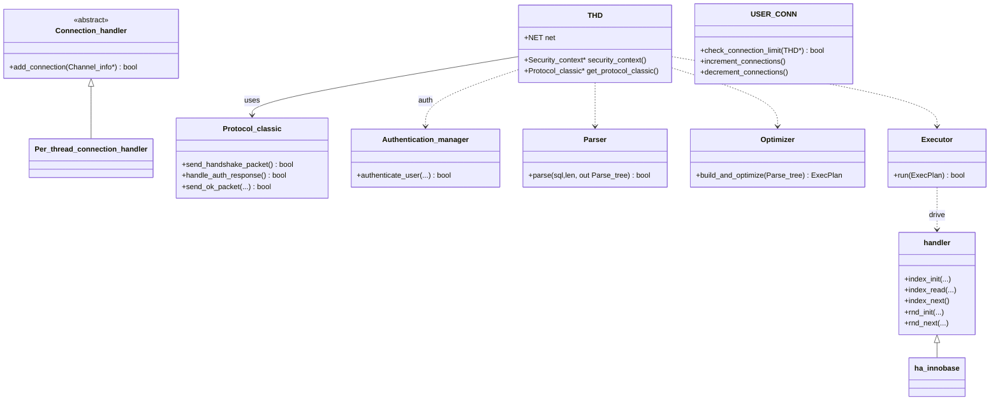

## 概述

MySQL是全球最流行的开源关系数据库管理系统，其架构设计体现了数据库系统的经典分层思想。MySQL的整体架构，揭示其分层设计背后的技术细节和实现原理。

<!--more-->

## 1. MySQL整体架构

### 1.1 分层架构设计原则

MySQL采用分层架构设计，遵循以下核心原则：

- **模块化设计**：各层职责明确，接口清晰
- **插件化架构**：存储引擎可插拔替换
- **高并发支持**：多线程处理连接请求
- **ACID保证**：完整的事务特性支持

### 1.2 MySQL架构全景图


### 1.3 各层核心职责

#### 连接层（Connection Layer）

- **连接管理**：处理客户端连接建立、维护和销毁
- **身份验证**：用户名密码验证、SSL加密
- **线程分配**：为每个连接分配处理线程
- **连接池管理**：复用连接，减少创建开销

#### SQL层（SQL Layer）

- **解析器**：SQL词法分析、语法分析、语义分析
- **优化器**：基于规则和代价的查询优化
- **执行器**：执行优化后的查询计划
- **缓存系统**：查询结果缓存、元数据缓存

#### 存储引擎接口层

- **抽象接口**：定义统一的存储引擎API
- **插件管理**：动态加载和卸载存储引擎
- **元数据管理**：表结构、索引信息管理

#### 存储引擎层

- **数据存储**：实际的数据读写操作
- **索引管理**：B+树、哈希等索引实现
- **事务处理**：ACID特性保证
- **并发控制**：锁机制、MVCC实现

## 2. 核心数据结构深度解析

为避免与专题文章重复，此处仅概览要点并提供跳转：

- THD（连接会话上下文）：负责连接状态、权限与事务等（详见《网络连接管理详细分析》）
- handler（存储引擎统一接口）：定义表扫描、索引访问、增删改查等抽象接口（详见《存储引擎接口层详细分析》）

## 3. 模块间交互流程

### 3.1 SQL执行完整流程图


### 3.2 事务处理流程


## 4. 核心模块列表

基于MySQL的分层架构，本系列文档将介绍以下核心模块：

### 4.1 SQL处理层模块

1. **SQL解析器模块** - 词法分析、语法分析、语义检查
2. **查询优化器模块** - 规则优化、代价优化、执行计划生成
3. **SQL执行器模块** - 执行计划执行、结果集处理

### 4.2 存储层模块

1. **[存储引擎接口模块](mysql-storage-interface.md)** - Handler抽象、插件管理
2. **[InnoDB存储引擎模块](mysql-innodb-engine.md)** - B+树、缓冲池、MVCC、锁机制
3. **[事务处理模块](mysql-transaction-system.md)** - ACID保证、并发控制、死锁检测

### 4.3 系统服务模块

1. **[连接管理模块](mysql-connection-management.md)** - 网络协议、线程池、权限验证
2. **[日志系统模块](mysql-logging-system.md)** - Binlog、Redo Log、Undo Log、Error Log
3. **[锁管理模块](mysql-lock-system.md)** - 表锁、行锁、意向锁、死锁检测

### 4.4 可观测性模块

1. **性能监控模块** - Performance Schema、慢查询、指标收集

## 5. 关键性能指标

### 5.1 系统级指标

```cpp
/**
 * MySQL系统性能指标结构
 * 用于监控和调优MySQL服务器性能
 */
struct mysql_performance_metrics {
    // 连接相关指标
    struct {
        uint64_t total_connections;        ///< 总连接数
        uint64_t active_connections;       ///< 活跃连接数
        uint64_t max_used_connections;     ///< 最大使用连接数
        uint64_t connection_errors_total;  ///< 连接错误总数
        double   avg_connection_time;      ///< 平均连接时间(秒)
    } connection_metrics;
    
    // SQL执行指标
    struct {
        uint64_t queries_total;            ///< 总查询数
        uint64_t slow_queries;             ///< 慢查询数
        uint64_t queries_per_second;       ///< 每秒查询数(QPS)
        double   avg_query_time;           ///< 平均查询时间(秒)
        uint64_t select_count;             ///< SELECT语句数
        uint64_t insert_count;             ///< INSERT语句数
        uint64_t update_count;             ///< UPDATE语句数
        uint64_t delete_count;             ///< DELETE语句数
    } query_metrics;
    
    // InnoDB指标
    struct {
        uint64_t buffer_pool_reads;        ///< 缓冲池读取次数
        uint64_t buffer_pool_read_requests;///< 缓冲池读取请求数
        double   buffer_pool_hit_ratio;    ///< 缓冲池命中率
        uint64_t pages_flushed;            ///< 刷新页面数
        uint64_t log_writes;               ///< 日志写入次数
        uint64_t row_lock_waits;           ///< 行锁等待次数
        double   avg_row_lock_time;        ///< 平均行锁时间(秒)
    } innodb_metrics;
    
    // 网络I/O指标
    struct {
        uint64_t bytes_sent;               ///< 发送字节数
        uint64_t bytes_received;           ///< 接收字节数
        uint64_t network_roundtrips;       ///< 网络往返次数
    } network_metrics;
};
```

### 5.2 性能调优要点

根据MySQL架构特点，关键性能调优方向：

1. **连接层优化**
   - 合理设置max_connections
   - 使用连接池减少连接开销
   - 优化网络参数

2. **SQL层优化**
   - 启用查询缓存（MySQL 5.7及以前）
   - 优化slow_query_log分析
   - 合理使用预处理语句

3. **存储引擎优化**
   - 调整InnoDB缓冲池大小
   - 优化索引设计
   - 合理配置日志文件大小

4. **系统层优化**
   - 文件系统选择和参数调优
   - 内存和CPU资源配置
   - I/O调度器优化

## 6. 总结

### 6.1 架构优势

MySQL的分层架构设计具有以下优势：

- **模块化清晰**：各层职责明确，便于维护和扩展
- **存储引擎可插拔**：支持多种存储引擎，满足不同应用需求
- **高并发支持**：多线程架构，支持大量并发连接
- **丰富的功能特性**：完整的SQL标准支持、事务处理、复制等

### 6.2 生产环境MySQL架构优化实战

基于《大规模MySQL生产实践》和《MySQL架构设计与优化》的经验总结：

#### 6.2.1 高并发架构优化案例

```sql
-- MySQL架构健康检查脚本
-- 1. 检查关键性能指标
SELECT 
  'Connections' as metric_name,
  VARIABLE_VALUE as current_value,
  'max_connections' as related_config
FROM PERFORMANCE_SCHEMA.GLOBAL_STATUS 
WHERE VARIABLE_NAME = 'Threads_connected'
UNION ALL
SELECT 
  'QPS',
  ROUND(VARIABLE_VALUE/Uptime_since_flush_status, 2),
  'query_cache_size'
FROM 
  (SELECT VARIABLE_VALUE FROM PERFORMANCE_SCHEMA.GLOBAL_STATUS WHERE VARIABLE_NAME = 'Questions') q,
  (SELECT VARIABLE_VALUE as Uptime_since_flush_status FROM PERFORMANCE_SCHEMA.GLOBAL_STATUS WHERE VARIABLE_NAME = 'Uptime_since_flush_status') u
UNION ALL
SELECT 
  'InnoDB Buffer Pool Hit Rate',
  ROUND(100 - (Innodb_buffer_pool_reads / Innodb_buffer_pool_read_requests * 100), 2),
  'innodb_buffer_pool_size'
FROM 
  (SELECT VARIABLE_VALUE as Innodb_buffer_pool_reads FROM PERFORMANCE_SCHEMA.GLOBAL_STATUS WHERE VARIABLE_NAME = 'Innodb_buffer_pool_reads') r,
  (SELECT VARIABLE_VALUE as Innodb_buffer_pool_read_requests FROM PERFORMANCE_SCHEMA.GLOBAL_STATUS WHERE VARIABLE_NAME = 'Innodb_buffer_pool_read_requests') rr;
```

#### 6.2.2 架构瓶颈诊断工具

```cpp
/**
 * MySQL架构瓶颈诊断器
 * 全面分析MySQL各层的性能瓶颈
 */
class MySQL_architecture_diagnostics {
private:
    struct architecture_metrics {
        // 连接层指标
        double connection_utilization;      ///< 连接使用率
        double auth_failure_rate;          ///< 认证失败率
        
        // SQL层指标  
        double parse_time_pct;             ///< 解析时间占比
        double optimize_time_pct;          ///< 优化时间占比
        double execute_time_pct;           ///< 执行时间占比
        
        // 存储层指标
        double buffer_pool_hit_rate;       ///< 缓冲池命中率
        double lock_wait_ratio;            ///< 锁等待比率
        double io_utilization;             ///< I/O使用率
        
        // 整体指标
        double cpu_utilization;            ///< CPU使用率
        double memory_utilization;         ///< 内存使用率
        double disk_utilization;           ///< 磁盘使用率
    };
    
public:
    /**
     * 执行全面的架构诊断
     * @return 诊断报告
     */
    architecture_diagnosis perform_full_diagnosis() {
        architecture_metrics metrics = collect_architecture_metrics();
        architecture_diagnosis diagnosis;
        
        // 1. 连接层诊断
        diagnose_connection_layer(metrics, diagnosis);
        
        // 2. SQL层诊断
        diagnose_sql_layer(metrics, diagnosis);
        
        // 3. 存储层诊断
        diagnose_storage_layer(metrics, diagnosis);
        
        // 4. 系统层诊断
        diagnose_system_layer(metrics, diagnosis);
        
        // 5. 生成综合建议
        generate_optimization_suggestions(diagnosis);
        
        return diagnosis;
    }
    
    /**
     * 识别架构瓶颈点
     */
    std::vector<bottleneck_info> identify_bottlenecks(const architecture_metrics &metrics) {
        std::vector<bottleneck_info> bottlenecks;
        
        // CPU瓶颈检测
        if (metrics.cpu_utilization > 80.0) {
            bottlenecks.push_back({
                .layer = "SYSTEM",
                .component = "CPU",
                .severity = metrics.cpu_utilization > 95.0 ? "CRITICAL" : "HIGH",
                .description = "CPU使用率过高: " + std::to_string(metrics.cpu_utilization) + "%",
                .impact = "可能导致查询响应延迟增加",
                .suggestions = {"优化慢查询", "增加CPU核心数", "使用读写分离"}
            });
        }
        
        // 内存瓶颈检测
        if (metrics.memory_utilization > 85.0) {
            bottlenecks.push_back({
                .layer = "SYSTEM", 
                .component = "MEMORY",
                .severity = "HIGH",
                .description = "内存使用率过高: " + std::to_string(metrics.memory_utilization) + "%",
                .impact = "可能触发swap，严重影响性能",
                .suggestions = {"调整innodb_buffer_pool_size", "优化内存使用", "增加物理内存"}
            });
        }
        
        // I/O瓶颈检测
        if (metrics.io_utilization > 80.0) {
            bottlenecks.push_back({
                .layer = "STORAGE",
                .component = "DISK_IO", 
                .severity = "HIGH",
                .description = "磁盘I/O使用率过高: " + std::to_string(metrics.io_utilization) + "%",
                .impact = "查询响应时间受磁盘I/O限制",
                .suggestions = {"使用SSD存储", "优化索引设计", "调整刷新策略"}
            });
        }
        
        // 锁等待瓶颈检测
        if (metrics.lock_wait_ratio > 5.0) {
            bottlenecks.push_back({
                .layer = "STORAGE_ENGINE",
                .component = "LOCK_SYSTEM",
                .severity = "MEDIUM",
                .description = "锁等待比例过高: " + std::to_string(metrics.lock_wait_ratio) + "%", 
                .impact = "并发性能受锁争用影响",
                .suggestions = {"优化事务逻辑", "调整隔离级别", "减少锁持有时间"}
            });
        }
        
        return bottlenecks;
    }
    
private:
    struct bottleneck_info {
        std::string layer;              ///< 架构层次
        std::string component;          ///< 组件名称
        std::string severity;           ///< 严重程度
        std::string description;        ///< 问题描述
        std::string impact;             ///< 影响分析
        std::vector<std::string> suggestions; ///< 优化建议
    };
    
    struct architecture_diagnosis {
        std::vector<bottleneck_info> bottlenecks;
        std::vector<std::string> optimization_suggestions;
        double overall_health_score;
    };
};
```

### 6.3 MySQL架构设计最佳实践

#### 6.3.1 分层架构设计原则应用

```cpp
/**
 * MySQL架构设计指导原则
 * 基于生产环境的架构设计最佳实践
 */
class MySQL_architecture_guidelines {
public:
    /**
     * 评估架构设计的合理性
     * @param config 架构配置
     * @return 评估结果和建议
     */
    architecture_assessment evaluate_architecture(const mysql_config &config) {
        architecture_assessment assessment;
        
        // 1. 连接层设计评估
        evaluate_connection_layer_design(config, assessment);
        
        // 2. 存储引擎选择评估
        evaluate_storage_engine_choice(config, assessment);
        
        // 3. 事务设计评估
        evaluate_transaction_design(config, assessment);
        
        // 4. 复制架构评估
        evaluate_replication_architecture(config, assessment);
        
        return assessment;
    }
    
    /**
     * 生成架构优化建议
     */
    std::vector<std::string> generate_architecture_recommendations(
        const workload_characteristics &workload) {
        
        std::vector<std::string> recommendations;
        
        if (workload.read_write_ratio > 10.0) {
            recommendations.push_back(
                "读写比例过高，建议实施读写分离架构，"
                "将读查询分发到从库，减轻主库压力");
        }
        
        if (workload.concurrent_connections > 1000) {
            recommendations.push_back(
                "高并发连接场景，建议使用连接池中间件（如ProxySQL），"
                "实现连接复用和负载均衡");
        }
        
        if (workload.data_size > 100 * 1024 * 1024 * 1024ULL) { // 100GB
            recommendations.push_back(
                "大数据量场景，建议考虑分库分表策略，"
                "使用中间件实现数据分片");
        }
        
        if (workload.has_complex_queries) {
            recommendations.push_back(
                "复杂查询场景，建议启用查询缓存或引入Redis缓存层，"
                "减少复杂查询的重复计算");
        }
        
        return recommendations;
    }
};
```

通过深入理解MySQL的架构设计和实现原理，我们能够更好地使用和优化MySQL数据库系统，充分发挥其在各种应用场景中的优势。

---

## 7. 关键函数调用路径总览

- 连接建立与认证
  - handle_connection() -> Protocol_classic::send_handshake_packet() -> Protocol_classic::handle_auth_response() -> Authentication_manager::authenticate_user() -> Protocol_classic::send_ok_packet()

- 命令处理（COM_QUERY）
  - do_command() -> dispatch_command(COM_QUERY) -> mysql_parse() -> Optimizer(计划生成) -> Executor -> handler::index_read()/index_next() 或 handler::rnd_init()/rnd_next() -> THD::send_result_set_metadata()/结果返回

- 数据库切换/控制命令
  - dispatch_command(COM_INIT_DB) -> mysql_change_db() -> OK/错误返回
  - dispatch_command(COM_PING) -> send_ok_packet()

- Handler 扫描与索引访问
  - 全表扫描：handler::open() -> handler::rnd_init() -> handler::rnd_next() ... -> handler::rnd_end() -> handler::close()
  - 索引扫描：handler::open() -> handler::index_init() -> handler::index_read() -> handler::index_next() ... -> handler::index_end() -> handler::close()

- InnoDB B+树点查读
  - btr_cur_t::search_to_nth_level() -> buf_pool_t::get_page() -> [命中] 返回页面 / [未命中] read_page_from_disk() -> fil_io() -> 页面入池 -> 返回记录

- InnoDB 插入（含页分裂）
  - btr_cur_t::optimistic_insert() -> [空间不足] btr_page_split_t::execute_split() -> move_records_to_new_page() -> update_page_links() -> insert_node_pointer_to_parent()

- 缓冲池脏页刷新
  - buf_pool_t::flush_dirty_pages() -> buf_flush_page() -> fil_io() -> 标记干净/维护flush list

- 行/表锁请求与等待
  - 行锁：lock_sys_t::lock_record() -> [冲突] create_waiting_record_lock() -> deadlock_check() -> wait_for_lock() -> 获锁/超时/死锁回滚
  - 表锁：lock_sys_t::lock_table() -> [冲突] create_waiting_table_lock() -> deadlock_check() -> wait_for_lock() -> 获锁/超时/死锁回滚

- 事务开始/提交/回滚
  - 开始：trx_t::start() -> [需要一致性读] ReadView::open()
  - 提交：trx_t::commit() -> lock_release_all_locks() -> trx_write_serialisation_history() -> read_view_close_for_trx() -> cleanup_transaction_resources()
  - 回滚：trx_t::rollback() -> trx_rollback_insert_undo_recs() -> trx_rollback_update_undo_recs() -> lock_release_all_locks()

- 协议响应
  - 成功：Protocol_classic::send_ok_packet()
  - 错误：Protocol_classic::send_error_packet()

- 线程池连接分发
  - Thread_pool_manager::assign_connection() -> Thread_group::enqueue_connection() -> [需要线程] Thread_pool_manager::create_worker_thread() -> worker_thread_main() -> handle_connection_in_thread_pool() -> handle_connection()

- 用户连接资源限制
  - USER_CONN::check_connection_limit() -> [通过] USER_CONN::increment_connections() / [关闭] USER_CONN::decrement_connections()

## 8. 运维诊断清单

- 连接压力判定
  - 触发条件：Threads_connected 接近 max_connections 的 80%
  - SQL：

    ```sql
    SELECT VARIABLE_VALUE AS threads_connected
    FROM PERFORMANCE_SCHEMA.GLOBAL_STATUS
    WHERE VARIABLE_NAME='Threads_connected';
    SELECT @@max_connections AS max_connections;
    ```

  - 处理选项：上调 max_connections（若CPU/内存余量>20%）或采用连接池/网关复用

- 缓冲池健康度
  - 触发条件：Innodb_buffer_pool_reads/Innodb_buffer_pool_read_requests > 0.05
  - SQL：

    ```sql
    SELECT ROUND(Innodb_buffer_pool_reads / NULLIF(Innodb_buffer_pool_read_requests,0), 4) AS miss_ratio
    FROM PERFORMANCE_SCHEMA.GLOBAL_STATUS
    WHERE VARIABLE_NAME IN ('Innodb_buffer_pool_reads','Innodb_buffer_pool_read_requests');
    ```

  - 处理选项：增大 innodb_buffer_pool_size 或优化热点表索引

- 锁等待与死锁
  - 触发条件：锁等待超时率 > 5% 或 每小时死锁 > 10
  - SQL：

    ```sql
    SELECT * FROM INFORMATION_SCHEMA.INNODB_LOCK_WAITS; -- 实时等待
    SHOW ENGINE INNODB STATUS; -- 死锁摘要
    ```

  - 处理选项：调整隔离级别至 RC、按固定顺序访问资源、拆分大事务

- 刷写压力与脏页高水位
  - 触发条件：modified_database_pages 占比 > 70%
  - SQL：

    ```sql
    SELECT modified_database_pages, pool_size,
           ROUND(modified_database_pages*100.0/pool_size,2) AS dirty_pct
    FROM INFORMATION_SCHEMA.INNODB_BUFFER_POOL_STATS;
    ```

  - 处理选项：提高刷新并发，调整 redo 大小与 flush 策略

## 9. 常见问题与处理

- 关于“命中率低就加内存”的判断：在顺序大扫描场景，命中率低为常见现象，可采用合适索引或分批处理，避免仅通过增加内存处理。
- 频繁短事务却持有大锁范围：用精准索引条件缩小锁范围，必要时使用覆盖索引避免回表锁定。
- 读多写少场景持续使用 RR：在多数 OLTP 读多写少系统，READ COMMITTED 可降低间隙锁导致的等待。
- 线程池规模过大：超过 CPU 核数×(1~2) 倍通常收益递减，可先定位并处理阻塞点，而非单纯增加线程。

## 相关文档

- [存储引擎接口层详细分析](mysql-storage-interface.md)  
- [InnoDB存储引擎详细分析](mysql-innodb-engine.md)
- [事务处理系统详细分析](mysql-transaction-system.md)
- [网络连接管理详细分析](mysql-connection-management.md)
- [日志系统详细分析](mysql-logging-system.md)
- [锁系统详细分析](mysql-lock-system.md)


## 11. 关键函数核心代码与功能说明

本节补充关键路径中的核心函数，实现要点与简要注释，便于将架构视图与具体实现建立映射。

```cpp
// 连接处理主循环（核心路径精炼版）
void handle_connection(THD *thd) {
    // 1) 握手
    Protocol_classic *proto = thd->get_protocol_classic();
    if (!proto->send_handshake_packet()) return;             // 发送握手

    // 2) 认证
    if (!proto->handle_auth_response()) {                    // 解析认证响应并校验
        proto->send_error_packet(ER_ACCESS_DENIED_ERROR, "Access denied");
        return;
    }

    // 3) 会话就绪
    if (!proto->send_ok_packet()) return;                    // 登录成功

    // 4) 命令循环
    while (!thd->killed && thd->net.vio != nullptr) {
        if (do_command(thd)) break;                          // 读取并分派命令
    }

    end_connection(thd);                                     // 连接清理
}

// 从网络读取一个命令并分派
bool do_command(THD *thd) {
    ulong len = my_net_read(&thd->net);
    if (len == packet_error) return true;                    // 断开或网络错误

    enum enum_server_command cmd = static_cast<enum_server_command>(thd->net.read_pos[0]);
    COM_DATA data{};
    if (!parse_com_data(thd->net.read_pos, len, &data)) {    // 解析请求体
        my_error(ER_MALFORMED_PACKET, MYF(0));
        return true;
    }
    return dispatch_command(thd, &data, cmd);                // 按类型处理
}

// 命令分派（仅展示关键分支）
bool dispatch_command(THD *thd, const COM_DATA *com, enum enum_server_command cmd) {
    switch (cmd) {
        case COM_QUERY:
            return mysql_parse(thd, com->com_query.query, com->com_query.length);
        case COM_INIT_DB:
            return mysql_change_db(thd, com->com_init_db.db_name, false);
        case COM_PING:
            return send_ok_packet(thd);
        case COM_QUIT:
            return true;
        default:
            my_error(ER_UNKNOWN_COM_ERROR, MYF(0));
            return true;
    }
}

// SQL 解析主入口（骨架）
bool mysql_parse(THD *thd, const char *query, size_t length) {
    Parser parser(thd);
    Parse_tree ast;
    if (!parser.parse(query, length, &ast)) {
        my_error(ER_PARSE_ERROR, MYF(0));
        return true;
    }

    // 生成并优化执行计划
    Optimizer optimizer(thd);
    ExecPlan plan = optimizer.build_and_optimize(ast);

    // 执行
    Executor exec(thd);
    return exec.run(plan); // 返回true表示关闭连接
}

// 执行器访问存储引擎（典型读路径）
bool Executor::run(const ExecPlan &plan) {
    for (const Step &op : plan.steps) {
        handler *h = op.table->file;                     // 通过Handler访问引擎
        if (op.type == Step::IndexScan) {
            h->index_init(op.index);
            if (h->index_read(op.key, op.key_len, HA_READ_KEY_EXACT))
                continue;                                // 首条
            do {
                // 处理当前行...
            } while (!h->index_next());                 // 顺序推进
            h->index_end();
        } else if (op.type == Step::FullScan) {
            h->rnd_init(true);
            while (!h->rnd_next(op.record_buf)) {
                // 处理当前行...
            }
            h->rnd_end();
        }
    }
    return false;
}
```

- 功能说明：
  - handle_connection: 完成握手、认证与命令循环的顶层控制。
  - do_command: 负责读取网络包、解析命令并进入分派。
  - dispatch_command: 将不同类型命令路由到对应处理器；COM_QUERY 进入 SQL 处理链路。
  - mysql_parse: 解析 SQL，生成 AST，构建并优化执行计划，交由执行器执行。
  - Executor::run: 按计划驱动 `handler` 接口对接具体存储引擎，覆盖索引扫描与全表扫描等常见操作。

## 12. 统一调用链

为减少重复，本节对关键调用链进行统一归并；如与第「7. 关键函数调用路径总览」内容重复，以本节为准。

- 连接建立与认证
  - handle_connection() → Protocol_classic::send_handshake_packet() → Protocol_classic::handle_auth_response() → Authentication_manager::authenticate_user() → Protocol_classic::send_ok_packet()

- 命令处理（COM_QUERY）
  - do_command() → dispatch_command(COM_QUERY) → mysql_parse() → Optimizer::build_and_optimize() → Executor::run() → handler::index_read()/index_next() 或 handler::rnd_init()/rnd_next() → 结果返回

- 数据库切换/控制命令
  - dispatch_command(COM_INIT_DB) → mysql_change_db() → OK/错误返回
  - dispatch_command(COM_PING) → send_ok_packet()

- Handler 扫描与索引访问
  - 全表扫描：handler::open() → handler::rnd_init() → handler::rnd_next()… → handler::rnd_end() → handler::close()
  - 索引扫描：handler::open() → handler::index_init() → handler::index_read() → handler::index_next()… → handler::index_end() → handler::close()

- InnoDB 读写要点
  - 点查读：btr_cur_t::search_to_nth_level() → buf_pool_t::get_page() → [命中/未命中读盘] → 返回记录
  - 插入含页分裂：btr_cur_t::optimistic_insert() → [不足] btr_page_split_t::execute_split() → move_records_to_new_page() → update_page_links() → insert_node_pointer_to_parent()

## 13. 关键函数时序图（补充）

- 连接建立与命令循环（handle_connection 精简时序）：


- COM_QUERY 关键路径（parse → optimize → execute）：


## 14. 关键结构体类结构图与继承关系

以核心连接/协议/执行与引擎衔接对象为主，给出类关系与依赖：



