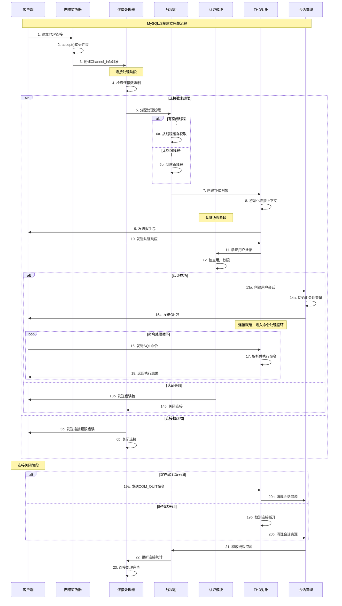
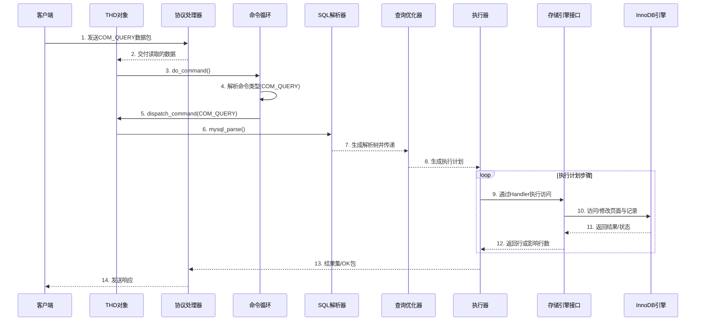
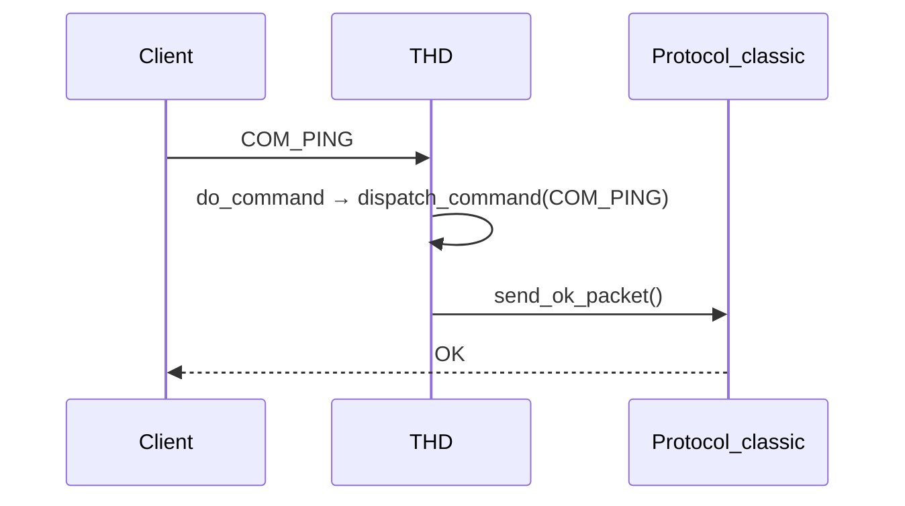
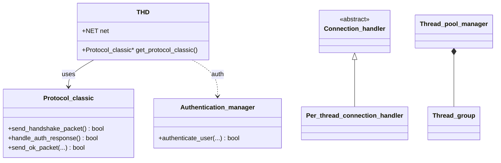

## 概述

MySQL网络连接管理是数据库系统的基础模块，负责处理客户端连接、协议解析、线程分配和资源管理。MySQL连接管理系统的核心技术实现，揭示其高并发处理能力的技术奥秘。

<!--more-->

## 1. 连接管理整体架构

### 1.1 连接管理设计原则

MySQL连接管理系统遵循以下核心设计原则：

- **高并发支持**：通过线程池和连接复用提高并发处理能力
- **协议透明**：支持多种客户端协议（TCP/IP、Unix Socket等）
- **资源控制**：精确控制连接数和资源消耗
- **安全认证**：完整的用户认证和权限检查机制

### 1.2 连接管理架构图

```mermaid
graph TB
    subgraph "MySQL连接管理架构"
        subgraph "网络层 - Network Layer"
            TCPListener[TCP监听器]
            UnixListener[Unix Socket监听器]
            SSLWrapper[SSL封装层]
            ProtocolHandler[协议处理器]
        end
        
        subgraph "连接处理层 - Connection Handler"
            subgraph "连接管理器"
                ConnMgr[连接管理器]
                ConnAcceptor[连接接受器]
                ConnPool[连接池]
                ConnQueue[连接队列]
            end
            
            subgraph "线程池系统"
                ThreadPool[线程池]
                WorkerThread[工作线程]
                ThreadCache[线程缓存]
                ThreadScheduler[线程调度器]
            end
            
            subgraph "认证授权"
                AuthManager[认证管理器]
                UserValidator[用户验证器]
                PrivilegeChecker[权限检查器]
                SSLAuth[SSL认证]
            end
        end
        
        subgraph "会话管理层 - Session Management"
            SessionMgr[会话管理器]
            THDFactory[THD工厂]
            SessionState[会话状态]
            ResourceLimiter[资源限制器]
        end
        
        subgraph "协议处理层 - Protocol Layer"
            subgraph "MySQL协议"
                HandshakeProto[握手协议]
                AuthProto[认证协议]
                CommandProto[命令协议]
                ResultProto[结果协议]
            end
            
            subgraph "网络I/O"
                NetBuffer[网络缓冲区]
                PacketReader[数据包读取器]
                PacketWriter[数据包写入器]
                CompressionHandler[压缩处理器]
            end
        end
        
        subgraph "监控统计层 - Monitoring"
            ConnStats[连接统计]
            PerfCounters[性能计数器]
            ErrorMetrics[错误指标]
            ResourceMonitor[资源监控]
        end
        
        subgraph "客户端层 - Clients"
            MySQLClient[MySQL客户端]
            PHPClient[PHP客户端]
            JavaClient[Java客户端]
            OtherClients[其他客户端]
        end
    end
    
    %% 连接关系
    MySQLClient --> TCPListener
    PHPClient --> TCPListener
    JavaClient --> UnixListener
    OtherClients --> SSLWrapper
    
    TCPListener --> ProtocolHandler
    UnixListener --> ProtocolHandler
    SSLWrapper --> ProtocolHandler
    
    ProtocolHandler --> ConnAcceptor
    ConnAcceptor --> ConnMgr
    ConnMgr --> ConnPool
    ConnPool --> ConnQueue
    
    ConnQueue --> ThreadPool
    ThreadPool --> WorkerThread
    WorkerThread --> ThreadCache
    ThreadCache --> ThreadScheduler
    
    ThreadScheduler --> AuthManager
    AuthManager --> UserValidator
    UserValidator --> PrivilegeChecker
    PrivilegeChecker --> SSLAuth
    
    AuthManager --> SessionMgr
    SessionMgr --> THDFactory
    THDFactory --> SessionState
    SessionState --> ResourceLimiter
    
    ProtocolHandler --> HandshakeProto
    HandshakeProto --> AuthProto
    AuthProto --> CommandProto
    CommandProto --> ResultProto
    
    CommandProto --> NetBuffer
    NetBuffer --> PacketReader
    PacketReader --> PacketWriter
    PacketWriter --> CompressionHandler
    
    ConnMgr --> ConnStats
    ThreadPool --> PerfCounters
    AuthManager --> ErrorMetrics
    ResourceLimiter --> ResourceMonitor
    
    style ConnMgr fill:#e1f5fe
    style ThreadPool fill:#f3e5f5
    style AuthManager fill:#e8f5e8
    style ProtocolHandler fill:#fff3e0
    style SessionMgr fill:#fce4ec
```



## 2. 核心数据结构深度解析

### 2.1 用户连接结构体（USER_CONN）

USER_CONN结构体管理用户连接的资源限制和统计信息：

```cpp
/**
 * 用户连接资源管理结构体
 * 用于跟踪和限制每个用户账户的连接资源使用
 */
typedef struct user_conn {
    // 用户标识信息
    char *user;                     ///< 用户名指针（user+host键的一部分，以'\0'分隔）
    char *host;                     ///< 主机名指针（键的主机部分）
    size_t len;                     ///< 键的总长度
    
    // 时间管理
    ulonglong reset_utime;          ///< 每小时计数器最后重置的时间点
    
    // 连接计数
    uint connections;               ///< 当前并发连接数
    uint conn_per_hour;             ///< 每小时连接数计数器
    uint updates;                   ///< 每小时更新语句数计数器  
    uint questions;                 ///< 每小时查询语句数计数器
    
    // 资源限制
    USER_RESOURCES user_resources;  ///< 用户最大资源限制配置
    
    // 哈希表链接
    struct user_conn *next;         ///< 哈希冲突链表指针
    struct user_conn **prev;        ///< 哈希链表前驱指针
    
public:
    /**
     * 检查用户是否超出连接限制
     * @param thd 线程句柄
     * @return true表示超出限制，false表示未超出
     */
    bool check_connection_limit(THD *thd) const {
        // 检查最大并发连接数限制
        if (user_resources.user_conn > 0 && 
            connections >= user_resources.user_conn) {
            return true;
        }
        
        // 检查每小时连接数限制
        if (user_resources.conn_per_hour > 0 && 
            conn_per_hour >= user_resources.conn_per_hour) {
            // 检查是否需要重置计数器
            ulonglong current_time = my_micro_time();
            if (current_time - reset_utime >= 3600000000ULL) { // 1小时
                reset_hourly_counters(current_time);
                return false;
            }
            return true;
        }
        
        return false;
    }
    
    /**
     * 增加连接计数
     */
    void increment_connections() {
        connections++;
        conn_per_hour++;
    }
    
    /**
     * 减少连接计数
     */
    void decrement_connections() {
        if (connections > 0) {
            connections--;
        }
    }
    
    /**
     * 增加查询计数
     */
    void increment_questions() {
        questions++;
    }
    
    /**
     * 增加更新计数（DML语句）
     */
    void increment_updates() {
        updates++;
    }
    
private:
    /**
     * 重置每小时计数器
     * @param current_time 当前时间
     */
    void reset_hourly_counters(ulonglong current_time) {
        reset_utime = current_time;
        conn_per_hour = 0;
        updates = 0;
        questions = 0;
    }
} USER_CONN;

/**
 * 用户资源限制结构体
 * 定义用户账户的最大资源使用限制
 */
typedef struct user_resources {
    uint questions;                 ///< 每小时最大查询数
    uint updates;                   ///< 每小时最大更新数
    uint conn_per_hour;             ///< 每小时最大连接数
    uint user_conn;                 ///< 最大并发连接数
    
    // 限制标志位
    enum {
        QUERIES_PER_HOUR = 1,       ///< 查询限制标志
        UPDATES_PER_HOUR = 2,       ///< 更新限制标志
        CONNECTIONS_PER_HOUR = 4,   ///< 连接限制标志
        USER_CONNECTIONS = 8        ///< 并发连接限制标志
    };
    uint specified_limits;          ///< 指定的限制类型掩码
    
    /**
     * 检查是否设置了某个限制
     * @param limit_type 限制类型
     * @return true表示已设置该限制
     */
    bool has_limit(uint limit_type) const {
        return (specified_limits & limit_type) != 0;
    }
    
    /**
     * 检查所有限制是否都未设置
     * @return true表示无任何限制
     */
    bool is_unlimited() const {
        return questions == 0 && updates == 0 && 
               conn_per_hour == 0 && user_conn == 0;
    }
} USER_RESOURCES;
```

### 2.2 连接处理器类层次结构

```cpp
/**
 * 连接处理器抽象基类
 * 定义了处理客户端连接的统一接口
 */
class Connection_handler {
protected:
    // 连接统计信息
    std::atomic<uint64_t> total_connections;    ///< 总连接数
    std::atomic<uint64_t> active_connections;   ///< 活跃连接数
    std::atomic<uint64_t> rejected_connections; ///< 拒绝连接数
    
public:
    /**
     * 虚析构函数
     */
    virtual ~Connection_handler() = default;
    
    /**
     * 处理新连接（纯虚函数）
     * @param channel_info 连接通道信息
     * @return true表示成功处理，false表示处理失败
     */
    virtual bool add_connection(Channel_info *channel_info) = 0;
    
    /**
     * 获取当前活跃连接数
     * @return 活跃连接数
     */
    uint64_t get_active_connections() const {
        return active_connections.load(std::memory_order_relaxed);
    }
    
    /**
     * 获取总连接数
     * @return 总连接数
     */
    uint64_t get_total_connections() const {
        return total_connections.load(std::memory_order_relaxed);
    }
    
    /**
     * 重置连接统计
     */
    virtual void reset_statistics() {
        total_connections.store(0);
        active_connections.store(0);
        rejected_connections.store(0);
    }
    
protected:
    /**
     * 增加连接计数
     */
    void increment_connection_count() {
        total_connections.fetch_add(1, std::memory_order_relaxed);
        active_connections.fetch_add(1, std::memory_order_relaxed);
    }
    
    /**
     * 减少连接计数
     */
    void decrement_connection_count() {
        active_connections.fetch_sub(1, std::memory_order_relaxed);
    }
};

/**
 * 每线程连接处理器
 * 为每个连接分配独立的操作系统线程
 */
class Per_thread_connection_handler : public Connection_handler {
private:
    // 线程缓存管理
    static std::list<Channel_info *> *waiting_channel_info_list; ///< 等待处理的连接队列
    static mysql_mutex_t LOCK_thread_cache;     ///< 线程缓存互斥锁
    static mysql_cond_t COND_thread_cache;      ///< 线程缓存条件变量
    static mysql_cond_t COND_flush_thread_cache; ///< 刷新线程缓存条件变量
    
    // 线程统计信息
    static ulong blocked_pthread_count;         ///< 阻塞的pthread数量
    static ulong slow_launch_threads;           ///< 慢启动线程数
    static bool shrink_cache;                   ///< 是否缩减缓存标志
    static ulong max_blocked_pthreads;          ///< 最大阻塞pthread数
    
public:
    /**
     * 静态初始化方法
     * 初始化线程缓存相关的全局资源
     */
    static void init() {
        waiting_channel_info_list = new std::list<Channel_info *>();
        mysql_mutex_init(key_LOCK_thread_cache, &LOCK_thread_cache, MY_MUTEX_INIT_FAST);
        mysql_cond_init(key_COND_thread_cache, &COND_thread_cache);
        mysql_cond_init(key_COND_flush_thread_cache, &COND_flush_thread_cache);
        
        blocked_pthread_count = 0;
        slow_launch_threads = 0;
        shrink_cache = false;
        max_blocked_pthreads = 0;
    }
    
    /**
     * 添加新连接处理
     * @param channel_info 连接通道信息
     * @return true表示成功处理，false表示失败
     */
    bool add_connection(Channel_info *channel_info) override {
        // 1. 检查连接数限制
        if (active_connections.load() >= max_connections) {
            increment_rejected_connections();
            return false;
        }
        
        // 2. 尝试从线程缓存获取空闲线程
        if (check_idle_thread_and_enqueue_connection(channel_info)) {
            // 没有空闲线程，创建新线程
            return create_new_thread_for_connection(channel_info);
        }
        
        return true; // 已排队到空闲线程
    }
    
    /**
     * 检查线程缓存中是否有空闲线程
     * @param channel_info 连接信息
     * @return true表示需要创建新线程，false表示已使用缓存线程
     */
    bool check_idle_thread_and_enqueue_connection(Channel_info *channel_info) {
        mysql_mutex_lock(&LOCK_thread_cache);
        
        if (blocked_pthread_count > 0) {
            // 有空闲线程，将连接加入等待队列
            waiting_channel_info_list->push_back(channel_info);
            mysql_cond_signal(&COND_thread_cache);
            mysql_mutex_unlock(&LOCK_thread_cache);
            return false; // 不需要创建新线程
        }
        
        mysql_mutex_unlock(&LOCK_thread_cache);
        return true; // 需要创建新线程
    }
    
    /**
     * 为新连接创建处理线程
     * @param channel_info 连接信息
     * @return true表示成功，false表示失败
     */
    bool create_new_thread_for_connection(Channel_info *channel_info) {
        // 创建线程属性
        pthread_attr_t thread_attr;
        pthread_attr_init(&thread_attr);
        pthread_attr_setdetachstate(&thread_attr, PTHREAD_CREATE_DETACHED);
        
        // 设置线程栈大小
        size_t stack_size = my_thread_stack_size;
        pthread_attr_setstacksize(&thread_attr, stack_size);
        
        // 创建新线程
        pthread_t thread_id;
        int result = pthread_create(&thread_id, &thread_attr,
                                   handle_connection_thread, channel_info);
        
        pthread_attr_destroy(&thread_attr);
        
        if (result != 0) {
            // 线程创建失败
            LogErr(ERROR_LEVEL, ER_CANT_CREATE_THREAD, result);
            return false;
        }
        
        // 更新统计信息
        increment_connection_count();
        
        return true;
    }
    
    /**
     * 阻塞等待新连接（线程缓存中的空闲线程调用）
     * @return 新的连接信息，如果服务器关闭返回nullptr
     */
    static Channel_info *block_until_new_connection() {
        mysql_mutex_lock(&LOCK_thread_cache);
        
        // 增加阻塞线程计数
        blocked_pthread_count++;
        
        while (waiting_channel_info_list->empty() && !shrink_cache) {
            // 等待新连接或缓存收缩信号
            mysql_cond_wait(&COND_thread_cache, &LOCK_thread_cache);
        }
        
        Channel_info *channel_info = nullptr;
        
        if (!waiting_channel_info_list->empty()) {
            // 获取等待的连接
            channel_info = waiting_channel_info_list->front();
            waiting_channel_info_list->pop_front();
        }
        
        // 减少阻塞线程计数
        blocked_pthread_count--;
        
        mysql_mutex_unlock(&LOCK_thread_cache);
        
        return channel_info;
    }
    
    /**
     * 杀死所有阻塞的线程
     */
    static void kill_blocked_pthreads() {
        mysql_mutex_lock(&LOCK_thread_cache);
        
        shrink_cache = true;
        
        // 唤醒所有等待的线程
        mysql_cond_broadcast(&COND_thread_cache);
        
        // 等待所有线程终止
        while (blocked_pthread_count > 0) {
            mysql_cond_wait(&COND_flush_thread_cache, &LOCK_thread_cache);
        }
        
        shrink_cache = false;
        mysql_mutex_unlock(&LOCK_thread_cache);
    }
    
private:
    /**
     * 增加拒绝连接计数
     */
    void increment_rejected_connections() {
        rejected_connections.fetch_add(1, std::memory_order_relaxed);
    }
};

/**
 * 连接线程处理函数
 * 每个连接线程的主入口点
 * @param arg 连接通道信息指针
 * @return 线程退出状态
 */
extern "C" void *handle_connection_thread(void *arg) {
    Channel_info *channel_info = static_cast<Channel_info *>(arg);
    
    // 1. 初始化线程环境
    my_thread_init();
    
    // 2. 处理连接，可能来自线程缓存或新连接
    for (;;) {
        if (channel_info == nullptr) {
            // 从线程缓存等待新连接
            channel_info = Per_thread_connection_handler::block_until_new_connection();
            
            if (channel_info == nullptr) {
                break; // 服务器关闭或缓存收缩
            }
        }
        
        // 3. 创建THD对象
        THD *thd = channel_info->create_thd();
        if (thd == nullptr) {
            connection_error_handler(channel_info, ER_OUT_OF_RESOURCES);
            break;
        }
        
        // 4. 设置线程特定数据
        thd_set_thread_stack(thd, (char*)&thd);
        set_current_thd(thd);
        
        // 5. 执行连接处理
        handle_connection(thd);
        
        // 6. 清理THD对象
        close_connection(thd, 0, true, false);
        thd->release_resources();
        delete thd;
        
        // 7. 准备处理下一个连接
        channel_info = nullptr;
    }
    
    // 8. 清理线程环境
    my_thread_end();
    
    return nullptr;
}
```

## 3. 连接建立流程深度解析

### 3.1 连接建立完整时序图



### 3.2 MySQL协议处理实现

```cpp
/**
 * MySQL客户端-服务器协议处理器
 * 负责处理MySQL网络协议的各个阶段
 */
class Protocol_classic {
private:
    THD *thd;                       ///< 关联的线程句柄
    NET *net;                       ///< 网络连接对象
    String packet;                  ///< 数据包缓冲区
    uint client_capabilities;       ///< 客户端能力标志
    
    // 压缩相关
    bool compression_enabled;       ///< 是否启用压缩
    uint32_t compress_threshold;    ///< 压缩阈值
    
public:
    /**
     * 构造函数：初始化协议处理器
     * @param thd_arg 线程句柄
     */
    Protocol_classic(THD *thd_arg) : thd(thd_arg), net(&thd_arg->net),
                                    compression_enabled(false),
                                    compress_threshold(50) {
        client_capabilities = 0;
    }
    
    /**
     * 发送握手包给客户端
     * MySQL协议的第一个步骤：服务器向客户端发送握手包
     * @return true表示成功，false表示失败
     */
    bool send_handshake_packet() {
        // 构造握手包结构
        String handshake_packet;
        
        // 1. 协议版本号（1字节）
        handshake_packet.append(static_cast<char>(PROTOCOL_VERSION));
        
        // 2. 服务器版本字符串（以NULL结尾）
        handshake_packet.append(MYSQL_SERVER_VERSION);
        handshake_packet.append('\0');
        
        // 3. 连接ID（4字节小端序）
        uint32_t connection_id = thd->thread_id();
        handshake_packet.append(reinterpret_cast<char*>(&connection_id), 4);
        
        // 4. 认证插件数据第一部分（8字节）
        char auth_plugin_data[21]; // 20字节随机数据 + 1字节NULL
        generate_random_string(auth_plugin_data, 20);
        handshake_packet.append(auth_plugin_data, 8);
        handshake_packet.append('\0'); // 填充字节
        
        // 5. 服务器能力标志低16位
        uint32_t server_capabilities = get_server_capabilities();
        uint16_t capability_flags_1 = server_capabilities & 0xFFFF;
        handshake_packet.append(reinterpret_cast<char*>(&capability_flags_1), 2);
        
        // 6. 服务器字符集（1字节）
        uint8_t charset = default_charset_info->number;
        handshake_packet.append(static_cast<char>(charset));
        
        // 7. 服务器状态标志（2字节）
        uint16_t status_flags = thd->server_status;
        handshake_packet.append(reinterpret_cast<char*>(&status_flags), 2);
        
        // 8. 服务器能力标志高16位
        uint16_t capability_flags_2 = (server_capabilities >> 16) & 0xFFFF;
        handshake_packet.append(reinterpret_cast<char*>(&capability_flags_2), 2);
        
        // 9. 认证插件数据长度
        uint8_t auth_plugin_data_len = 21;
        handshake_packet.append(static_cast<char>(auth_plugin_data_len));
        
        // 10. 保留字节（10字节）
        for (int i = 0; i < 10; i++) {
            handshake_packet.append('\0');
        }
        
        // 11. 认证插件数据第二部分（12字节）
        handshake_packet.append(auth_plugin_data + 8, 12);
        handshake_packet.append('\0');
        
        // 12. 认证插件名称
        handshake_packet.append("mysql_native_password");
        handshake_packet.append('\0');
        
        // 发送握手包
        return write_packet(handshake_packet.ptr(), handshake_packet.length());
    }
    
    /**
     * 处理客户端认证响应
     * @return true表示认证成功，false表示认证失败
     */
    bool handle_auth_response() {
        // 1. 读取客户端响应包
        ulong packet_length = read_packet();
        if (packet_length == packet_error) {
            return false;
        }
        
        char *packet_data = reinterpret_cast<char*>(net->read_pos);
        
        // 2. 解析客户端能力标志（4字节）
        if (packet_length < 4) {
            return false;
        }
        client_capabilities = uint4korr(packet_data);
        
        // 3. 解析最大包大小（4字节）
        if (packet_length < 8) {
            return false;
        }
        uint32_t max_packet_size = uint4korr(packet_data + 4);
        thd->variables.max_allowed_packet = max_packet_size;
        
        // 4. 解析客户端字符集（1字节）
        if (packet_length < 9) {
            return false;
        }
        uint8_t client_charset = packet_data[8];
        
        // 5. 跳过保留字节（23字节）
        size_t offset = 9 + 23;
        if (packet_length <= offset) {
            return false;
        }
        
        // 6. 解析用户名（以NULL结尾的字符串）
        const char *username = packet_data + offset;
        size_t username_len = strlen(username);
        offset += username_len + 1;
        
        // 7. 解析认证响应数据
        if (packet_length <= offset) {
            return false;
        }
        
        uint8_t auth_response_len = packet_data[offset++];
        if (packet_length < offset + auth_response_len) {
            return false;
        }
        
        const char *auth_response = packet_data + offset;
        offset += auth_response_len;
        
        // 8. 解析数据库名（可选）
        const char *database = nullptr;
        if (offset < packet_length && (client_capabilities & CLIENT_CONNECT_WITH_DB)) {
            database = packet_data + offset;
        }
        
        // 9. 执行用户认证
        Security_context *sctx = thd->security_context();
        return authenticate_user(sctx, username, auth_response, 
                               auth_response_len, database);
    }
    
    /**
     * 读取客户端数据包
     * @return 包长度，错误时返回packet_error
     */
    ulong read_packet() {
        return my_net_read(net);
    }
    
    /**
     * 向客户端写入数据包
     * @param packet 数据包内容
     * @param length 数据包长度
     * @return true表示成功，false表示失败
     */
    bool write_packet(const char *packet, size_t length) {
        return my_net_write(net, reinterpret_cast<const uchar*>(packet), length);
    }
    
    /**
     * 发送OK包
     * @param affected_rows 影响的行数
     * @param last_insert_id 最后插入的ID
     * @param server_status 服务器状态
     * @param warning_count 警告数量
     * @return true表示成功，false表示失败
     */
    bool send_ok_packet(ulonglong affected_rows = 0,
                       ulonglong last_insert_id = 0,
                       uint server_status = 0,
                       uint warning_count = 0) {
        String ok_packet;
        
        // OK包标志字节
        ok_packet.append('\0');
        
        // 影响行数（长度编码整数）
        append_length_encoded_integer(ok_packet, affected_rows);
        
        // 最后插入ID（长度编码整数）
        append_length_encoded_integer(ok_packet, last_insert_id);
        
        // 服务器状态标志（2字节）
        uint16_t status = server_status;
        ok_packet.append(reinterpret_cast<char*>(&status), 2);
        
        // 警告数量（2字节）
        uint16_t warnings = warning_count;
        ok_packet.append(reinterpret_cast<char*>(&warnings), 2);
        
        return write_packet(ok_packet.ptr(), ok_packet.length());
    }
    
    /**
     * 发送错误包
     * @param sql_errno SQL错误码
     * @param err 错误消息
     * @return true表示成功，false表示失败
     */
    bool send_error_packet(uint sql_errno, const char *err) {
        String error_packet;
        
        // 错误包标志字节
        error_packet.append('\xff');
        
        // 错误码（2字节小端序）
        uint16_t error_code = sql_errno;
        error_packet.append(reinterpret_cast<char*>(&error_code), 2);
        
        // SQL状态标记（如果客户端支持）
        if (client_capabilities & CLIENT_PROTOCOL_41) {
            error_packet.append('#');
            error_packet.append("HY000"); // 通用SQL状态
        }
        
        // 错误消息
        error_packet.append(err);
        
        return write_packet(error_packet.ptr(), error_packet.length());
    }
    
private:
    /**
     * 获取服务器能力标志
     */
    uint32_t get_server_capabilities() const {
        uint32_t capabilities = 0;
        
        capabilities |= CLIENT_LONG_PASSWORD;     // 新的更安全的密码
        capabilities |= CLIENT_FOUND_ROWS;        // 返回找到的行数而不是影响的行数
        capabilities |= CLIENT_LONG_FLAG;         // 获取所有列标志
        capabilities |= CLIENT_CONNECT_WITH_DB;   // 可以在连接时指定数据库
        capabilities |= CLIENT_NO_SCHEMA;         // 不允许database.table.column语法
        capabilities |= CLIENT_COMPRESS;          // 可以使用压缩协议
        capabilities |= CLIENT_LOCAL_FILES;       // 可以使用LOAD DATA LOCAL
        capabilities |= CLIENT_PROTOCOL_41;       // 新的4.1协议
        capabilities |= CLIENT_INTERACTIVE;       // 支持交互式超时
        capabilities |= CLIENT_SSL;               // 支持SSL
        capabilities |= CLIENT_TRANSACTIONS;      // 客户端知道事务
        capabilities |= CLIENT_SECURE_CONNECTION; // 新的4.1认证
        capabilities |= CLIENT_MULTI_STATEMENTS;  // 启用/禁用多语句支持
        capabilities |= CLIENT_MULTI_RESULTS;     // 启用/禁用多结果支持
        capabilities |= CLIENT_PS_MULTI_RESULTS;  // 多结果集预处理语句
        capabilities |= CLIENT_PLUGIN_AUTH;       // 客户端支持插件认证
        capabilities |= CLIENT_CONNECT_ATTRS;     // 连接属性
        capabilities |= CLIENT_SESSION_TRACK;     // 会话状态跟踪
        capabilities |= CLIENT_DEPRECATE_EOF;     // 弃用EOF包
        
        return capabilities;
    }
    
    /**
     * 生成随机字符串（用于认证盐值）
     * @param buffer 输出缓冲区
     * @param length 字符串长度
     */
    void generate_random_string(char *buffer, size_t length) {
        static const char charset[] = 
            "ABCDEFGHIJKLMNOPQRSTUVWXYZabcdefghijklmnopqrstuvwxyz0123456789+/";
        
        for (size_t i = 0; i < length; i++) {
            buffer[i] = charset[rand() % (sizeof(charset) - 1)];
        }
        buffer[length] = '\0';
    }
    
    /**
     * 追加长度编码整数到包中
     * @param packet 数据包对象
     * @param value 要编码的整数值
     */
    void append_length_encoded_integer(String &packet, ulonglong value) {
        if (value < 251) {
            packet.append(static_cast<char>(value));
        } else if (value < 65536) {
            packet.append('\xfc');
            uint16_t val = static_cast<uint16_t>(value);
            packet.append(reinterpret_cast<char*>(&val), 2);
        } else if (value < 16777216) {
            packet.append('\xfd');
            packet.append(reinterpret_cast<char*>(&value), 3);
        } else {
            packet.append('\xfe');
            packet.append(reinterpret_cast<char*>(&value), 8);
        }
    }
};

/**
 * 连接处理主函数
 * 这是每个连接线程的核心处理循环
 * @param thd 线程句柄
 */
void handle_connection(THD *thd) {
    // 1. 获取网络连接信息
    NET *net = &thd->net;
    Protocol_classic *protocol = thd->get_protocol_classic();
    
    // 2. 发送握手包
    if (!protocol->send_handshake_packet()) {
        LogErr(ERROR_LEVEL, ER_HANDSHAKE_ERROR);
        return;
    }
    
    // 3. 处理认证
    if (!protocol->handle_auth_response()) {
        LogErr(WARNING_LEVEL, ER_ACCESS_DENIED_ERROR, 
               thd->security_context()->priv_user().str,
               thd->security_context()->priv_host().str,
               "YES");
        return;
    }
    
    // 4. 认证成功，发送OK包
    if (!protocol->send_ok_packet()) {
        return;
    }
    
    // 5. 进入命令处理循环
    thd->proc_info = "等待命令";
    NET_SERVER server_extension;
    server_extension.thd = thd;
    net->extension = &server_extension;
    
    while (!net->error && net->vio != nullptr && !thd->killed) {
        // 读取客户端命令
        if (do_command(thd)) {
            break; // 出错或客户端断开连接
        }
    }
    
    // 6. 清理连接资源
    thd->proc_info = "清理";
    end_connection(thd);
}

/**
 * 执行客户端命令
 * 解析并执行客户端发送的各种命令类型
 * @param thd 线程句柄
 * @return true表示连接应该关闭，false表示继续处理
 */
bool do_command(THD *thd) {
    // 1. 读取命令包
    NET *net = &thd->net;
    thd->proc_info = "等待查询";
    
    ulong packet_length = my_net_read(net);
    if (packet_length == packet_error) {
        // 网络错误或客户端断开
        LogDebug(GENERAL_LOG, "Client disconnected");
        return true;
    }
    
    // 2. 解析命令类型
    enum enum_server_command command = 
        static_cast<enum_server_command>(net->read_pos[0]);
        
    // 3. 更新统计信息
    thd->inc_status_var(thd->status_var.questions);
    
    // 4. 根据命令类型分派处理
    COM_DATA com_data;
    if (!parse_com_data(net->read_pos, packet_length, &com_data)) {
        // 解析命令数据失败
        my_error(ER_MALFORMED_PACKET, MYF(0));
        return true;
    }
    
    // 5. 分派命令执行
    return dispatch_command(thd, &com_data, command);
}

/**
 * 分派命令执行
 * 根据命令类型调用相应的处理函数
 * @param thd 线程句柄
 * @param com_data 命令数据
 * @param command 命令类型
 * @return true表示连接应该关闭，false表示继续处理
 */
bool dispatch_command(THD *thd, const COM_DATA *com_data,
                     enum enum_server_command command) {
    thd->set_command(command);
    
    switch (command) {
        case COM_INIT_DB:
            // 切换数据库命令
            return mysql_change_db(thd, com_data->com_init_db.db_name, false);
            
        case COM_QUERY:
            // SQL查询命令
            return mysql_parse(thd, com_data->com_query.query, 
                             com_data->com_query.length);
            
        case COM_FIELD_LIST:
            // 字段列表命令（已弃用）
            return mysql_list_fields(thd, com_data->com_field_list.table_name,
                                   com_data->com_field_list.query);
            
        case COM_QUIT:
            // 退出命令
            LogDebug(GENERAL_LOG, "Client requested quit");
            return true;
            
        case COM_STATISTICS:
            // 统计信息命令
            return mysql_statistics(thd);
            
        case COM_PING:
            // Ping命令
            return send_ok_packet(thd);
            
        case COM_STMT_PREPARE:
            // 预处理语句准备
            return mysql_stmt_prepare(thd, com_data->com_stmt_prepare.query,
                                    com_data->com_stmt_prepare.length);
            
        case COM_STMT_EXECUTE:
            // 预处理语句执行
            return mysql_stmt_execute(thd, com_data->com_stmt_execute.stmt_id,
                                    com_data->com_stmt_execute.flags,
                                    com_data->com_stmt_execute.params,
                                    com_data->com_stmt_execute.params_length);
            
        case COM_STMT_CLOSE:
            // 预处理语句关闭
            mysql_stmt_close(thd, com_data->com_stmt_close.stmt_id);
            return false;
            
        case COM_RESET_CONNECTION:
            // 重置连接状态
            return mysql_reset_connection(thd);
            
        default:
            // 不支持的命令
            my_error(ER_UNKNOWN_COM_ERROR, MYF(0));
            return true;
    }
}
```

### 3.3 COM_QUERY命令处理时序图



## 4. 用户认证与权限检查

### 4.1 认证管理器实现

```cpp
/**
 * MySQL用户认证管理器
 * 负责用户身份验证和权限检查
 */
class Authentication_manager {
private:
    // 认证插件注册表
    static std::unordered_map<std::string, auth_plugin*> auth_plugins;
    static mysql_mutex_t auth_plugin_mutex;
    
public:
    /**
     * 初始化认证管理器
     */
    static void init() {
        mysql_mutex_init(key_LOCK_auth_plugin, &auth_plugin_mutex, MY_MUTEX_INIT_FAST);
        
        // 注册内置认证插件
        register_builtin_auth_plugins();
    }
    
    /**
     * 执行用户认证
     * @param sctx 安全上下文
     * @param username 用户名
     * @param auth_response 认证响应数据
     * @param auth_response_len 认证响应长度
     * @param database 默认数据库
     * @return true表示认证成功，false表示失败
     */
    static bool authenticate_user(Security_context *sctx,
                                const char *username,
                                const char *auth_response,
                                uint auth_response_len,
                                const char *database) {
        // 1. 查找用户账户信息
        ACL_USER *acl_user = find_user_account(username, sctx->host().str);
        if (acl_user == nullptr) {
            LogErr(WARNING_LEVEL, ER_ACCESS_DENIED_ERROR, username, 
                   sctx->host().str, "NO");
            return false;
        }
        
        // 2. 检查账户状态
        if (acl_user->account_locked) {
            LogErr(WARNING_LEVEL, ER_ACCOUNT_HAS_BEEN_LOCKED, username, 
                   sctx->host().str);
            return false;
        }
        
        // 3. 检查密码过期
        if (acl_user->password_expired && 
            !check_password_lifetime(acl_user)) {
            LogErr(WARNING_LEVEL, ER_MUST_CHANGE_PASSWORD_LOGIN, username);
            sctx->set_password_expired(true);
        }
        
        // 4. 执行密码验证
        if (!verify_user_password(acl_user, auth_response, auth_response_len)) {
            LogErr(WARNING_LEVEL, ER_ACCESS_DENIED_ERROR, username, 
                   sctx->host().str, "YES");
            return false;
        }
        
        // 5. 设置安全上下文
        sctx->assign_user(username, strlen(username));
        sctx->assign_priv_user(acl_user->user.str, acl_user->user.length);
        sctx->assign_priv_host(acl_user->host.hostname, 
                              acl_user->host.hostname ? 
                              strlen(acl_user->host.hostname) : 0);
        
        // 6. 设置默认数据库
        if (database && !mysql_change_db(current_thd, database, false)) {
            sctx->set_db(database, strlen(database));
        }
        
        // 7. 加载用户权限
        sctx->assign_global_priv(acl_user->access);
        load_user_database_privileges(sctx);
        
        LogInfo(GENERAL_LOG, "User %s@%s authenticated successfully",
               username, sctx->host().str);
        
        return true;
    }
    
    /**
     * 验证用户密码
     * @param acl_user 用户账户信息
     * @param auth_response 客户端认证响应
     * @param auth_response_len 响应长度
     * @return true表示密码正确
     */
    static bool verify_user_password(ACL_USER *acl_user,
                                   const char *auth_response,
                                   uint auth_response_len) {
        // 获取用户的认证插件
        const char *plugin_name = acl_user->plugin.str;
        if (plugin_name == nullptr || *plugin_name == '\0') {
            plugin_name = "mysql_native_password"; // 默认插件
        }
        
        // 查找认证插件
        auto it = auth_plugins.find(plugin_name);
        if (it == auth_plugins.end()) {
            LogErr(ERROR_LEVEL, ER_PLUGIN_IS_NOT_LOADED, plugin_name);
            return false;
        }
        
        auth_plugin *plugin = it->second;
        
        // 调用插件验证密码
        int result = plugin->authenticate_user(acl_user->credentials,
                                             auth_response,
                                             auth_response_len);
        
        return result == CR_OK;
    }
    
    /**
     * 注册内置认证插件
     */
    static void register_builtin_auth_plugins() {
        mysql_mutex_lock(&auth_plugin_mutex);
        
        // 注册native password插件
        auth_plugins["mysql_native_password"] = &native_password_plugin;
        
        // 注册sha256 password插件
        auth_plugins["sha256_password"] = &sha256_password_plugin;
        
        // 注册caching_sha2_password插件
        auth_plugins["caching_sha2_password"] = &caching_sha2_password_plugin;
        
        mysql_mutex_unlock(&auth_plugin_mutex);
    }
    
private:
    /**
     * 查找用户账户
     * @param username 用户名
     * @param hostname 主机名
     * @return 用户账户指针，未找到返回nullptr
     */
    static ACL_USER* find_user_account(const char *username, const char *hostname) {
        mysql_mutex_lock(&acl_cache_lock);
        
        ACL_USER *acl_user = nullptr;
        
        // 在ACL用户列表中查找匹配的账户
        for (auto &user : acl_users) {
            if (user.user.str && strcmp(user.user.str, username) == 0) {
                // 检查主机名匹配
                if (compare_hostname(&user.host, hostname, hostname)) {
                    acl_user = &user;
                    break;
                }
            }
        }
        
        mysql_mutex_unlock(&acl_cache_lock);
        return acl_user;
    }
    
    /**
     * 检查密码生命周期
     */
    static bool check_password_lifetime(ACL_USER *acl_user) {
        if (acl_user->password_lifetime == 0) {
            return true; // 永不过期
        }
        
        time_t current_time = time(nullptr);
        time_t password_change_time = acl_user->password_last_changed;
        
        return (current_time - password_change_time) < 
               (acl_user->password_lifetime * 24 * 3600);
    }
};
```

## 5. 线程池管理深度解析

### 5.2 线程池实现

```cpp
/**
 * MySQL线程池管理器
 * 管理工作线程的创建、调度和生命周期
 */
class Thread_pool_manager {
private:
    // 线程池配置
    static uint thread_pool_size;               ///< 线程池大小
    static uint thread_pool_idle_timeout;      ///< 空闲线程超时时间
    static uint thread_pool_max_threads;       ///< 最大线程数
    static uint thread_pool_stall_limit;       ///< 失速检测限制
    
    // 线程池状态
    static std::vector<Thread_group*> thread_groups; ///< 线程组数组
    static std::atomic<uint> active_thread_count;    ///< 活跃线程数
    static std::atomic<uint> idle_thread_count;      ///< 空闲线程数
    
    // 同步原语
    static mysql_mutex_t pool_mutex;            ///< 线程池互斥锁
    static mysql_cond_t pool_cond;              ///< 线程池条件变量
    
public:
    /**
     * 初始化线程池
     * @param pool_size 线程池大小
     * @return true表示成功，false表示失败
     */
    static bool init(uint pool_size) {
        thread_pool_size = pool_size;
        
        // 初始化同步原语
        mysql_mutex_init(key_LOCK_thread_pool, &pool_mutex, MY_MUTEX_INIT_FAST);
        mysql_cond_init(key_COND_thread_pool, &pool_cond);
        
        // 创建线程组
        thread_groups.resize(pool_size);
        for (uint i = 0; i < pool_size; i++) {
            thread_groups[i] = new Thread_group(i);
            if (!thread_groups[i]->init()) {
                LogErr(ERROR_LEVEL, ER_THREAD_POOL_INIT_FAILED, i);
                return false;
            }
        }
        
        // 重置计数器
        active_thread_count.store(0);
        idle_thread_count.store(0);
        
        LogInfo(SYSTEM_LOG, "Thread pool initialized with %u groups", pool_size);
        return true;
    }
    
    /**
     * 将连接分配给线程池
     * @param channel_info 连接信息
     * @return true表示成功分配
     */
    static bool assign_connection(Channel_info *channel_info) {
        // 1. 选择线程组（简单轮询策略）
        static std::atomic<uint> group_index{0};
        uint group_id = group_index.fetch_add(1) % thread_pool_size;
        
        Thread_group *group = thread_groups[group_id];
        
        // 2. 将连接加入线程组队列
        return group->enqueue_connection(channel_info);
    }
    
    /**
     * 创建新的工作线程
     * @param group_id 线程组ID
     * @return true表示成功创建
     */
    static bool create_worker_thread(uint group_id) {
        if (active_thread_count.load() >= thread_pool_max_threads) {
            return false; // 达到最大线程数限制
        }
        
        // 创建线程
        pthread_t thread_id;
        Thread_worker_args *args = new Thread_worker_args();
        args->group_id = group_id;
        
        int result = pthread_create(&thread_id, nullptr, 
                                   worker_thread_main, args);
        
        if (result != 0) {
            delete args;
            LogErr(ERROR_LEVEL, ER_CANT_CREATE_THREAD, result);
            return false;
        }
        
        // 分离线程
        pthread_detach(thread_id);
        
        // 更新计数器
        active_thread_count.fetch_add(1);
        
        return true;
    }
    
    /**
     * 工作线程主函数
     * @param arg 线程参数
     * @return 线程退出状态
     */
    static void* worker_thread_main(void *arg) {
        Thread_worker_args *args = static_cast<Thread_worker_args*>(arg);
        uint group_id = args->group_id;
        delete args;
        
        // 初始化线程环境
        my_thread_init();
        
        Thread_group *group = thread_groups[group_id];
        
        // 工作循环
        while (!group->is_shutdown()) {
            // 等待连接
            Channel_info *channel_info = group->get_connection();
            
            if (channel_info == nullptr) {
                // 超时或关闭信号
                break;
            }
            
            // 处理连接
            handle_connection_in_thread_pool(channel_info);
        }
        
        // 清理线程环境
        my_thread_end();
        
        // 更新计数器
        active_thread_count.fetch_sub(1);
        
        return nullptr;
    }
    
    /**
     * 在线程池中处理连接
     * @param channel_info 连接信息
     */
    static void handle_connection_in_thread_pool(Channel_info *channel_info) {
        // 1. 创建THD对象
        THD *thd = channel_info->create_thd();
        if (thd == nullptr) {
            LogErr(ERROR_LEVEL, ER_OUT_OF_RESOURCES);
            delete channel_info;
            return;
        }
        
        // 2. 设置线程局部变量
        set_current_thd(thd);
        thd_set_thread_stack(thd, (char*)&thd);
        
        // 3. 执行连接处理
        try {
            handle_connection(thd);
        } catch (const std::exception &e) {
            LogErr(ERROR_LEVEL, ER_UNKNOWN_ERROR, e.what());
        }
        
        // 4. 清理资源
        close_connection(thd, 0, true, false);
        thd->release_resources();
        delete thd;
        delete channel_info;
    }
    
    /**
     * 关闭线程池
     */
    static void shutdown() {
        mysql_mutex_lock(&pool_mutex);
        
        // 通知所有线程组关闭
        for (auto group : thread_groups) {
            group->shutdown();
        }
        
        // 等待所有线程退出
        while (active_thread_count.load() > 0) {
            mysql_cond_wait(&pool_cond, &pool_mutex);
        }
        
        // 清理线程组
        for (auto group : thread_groups) {
            delete group;
        }
        thread_groups.clear();
        
        mysql_mutex_unlock(&pool_mutex);
        
        // 销毁同步原语
        mysql_mutex_destroy(&pool_mutex);
        mysql_cond_destroy(&pool_cond);
    }
};

/**
 * 线程组类
 * 管理一组工作线程和连接队列
 */
class Thread_group {
private:
    uint group_id;                              ///< 线程组ID
    std::queue<Channel_info*> connection_queue; ///< 连接队列
    mysql_mutex_t queue_mutex;                  ///< 队列互斥锁
    mysql_cond_t queue_cond;                    ///< 队列条件变量
    
    std::atomic<bool> shutdown_flag;            ///< 关闭标志
    std::atomic<uint> thread_count;             ///< 线程数量
    std::atomic<uint> active_connections;       ///< 活跃连接数
    
public:
    /**
     * 构造函数
     * @param id 线程组ID
     */
    Thread_group(uint id) : group_id(id), shutdown_flag(false),
                           thread_count(0), active_connections(0) {}
    
    /**
     * 初始化线程组
     * @return true表示成功
     */
    bool init() {
        mysql_mutex_init(key_LOCK_thread_group_queue, &queue_mutex, 
                        MY_MUTEX_INIT_FAST);
        mysql_cond_init(key_COND_thread_group_queue, &queue_cond);
        
        return true;
    }
    
    /**
     * 将连接加入队列
     * @param channel_info 连接信息
     * @return true表示成功
     */
    bool enqueue_connection(Channel_info *channel_info) {
        mysql_mutex_lock(&queue_mutex);
        
        if (shutdown_flag.load()) {
            mysql_mutex_unlock(&queue_mutex);
            return false;
        }
        
        // 添加到队列
        connection_queue.push(channel_info);
        
        // 检查是否需要创建新线程
        if (connection_queue.size() > thread_count.load() &&
            thread_count.load() < max_threads_per_group) {
            Thread_pool_manager::create_worker_thread(group_id);
            thread_count.fetch_add(1);
        }
        
        // 通知等待的线程
        mysql_cond_signal(&queue_cond);
        
        mysql_mutex_unlock(&queue_mutex);
        return true;
    }
    
    /**
     * 从队列获取连接（阻塞）
     * @return 连接信息，超时或关闭时返回nullptr
     */
    Channel_info* get_connection() {
        mysql_mutex_lock(&queue_mutex);
        
        // 等待连接或关闭信号
        while (connection_queue.empty() && !shutdown_flag.load()) {
            struct timespec timeout;
            set_timespec_nsec(&timeout, thread_pool_idle_timeout * 1000000000ULL);
            
            int wait_result = mysql_cond_timedwait(&queue_cond, &queue_mutex, &timeout);
            
            if (wait_result == ETIMEDOUT) {
                // 超时，线程可以退出
                thread_count.fetch_sub(1);
                mysql_mutex_unlock(&queue_mutex);
                return nullptr;
            }
        }
        
        Channel_info *channel_info = nullptr;
        
        if (!connection_queue.empty()) {
            channel_info = connection_queue.front();
            connection_queue.pop();
            active_connections.fetch_add(1);
        }
        
        mysql_mutex_unlock(&queue_mutex);
        return channel_info;
    }
    
    /**
     * 关闭线程组
     */
    void shutdown() {
        mysql_mutex_lock(&queue_mutex);
        
        shutdown_flag.store(true);
        
        // 唤醒所有等待的线程
        mysql_cond_broadcast(&queue_cond);
        
        mysql_mutex_unlock(&queue_mutex);
    }
    
    /**
     * 检查是否已关闭
     */
    bool is_shutdown() const {
        return shutdown_flag.load();
    }
    
private:
    static constexpr uint max_threads_per_group = 4096; ///< 每组最大线程数
};
```

## 6. 性能监控与调优

### 6.1 连接性能指标

```cpp
/**
 * 连接管理性能指标收集器
 * 提供详细的连接统计和性能分析数据
 */
class Connection_performance_monitor {
private:
    // 连接统计
    struct connection_stats {
        std::atomic<uint64_t> total_connections;     ///< 总连接数
        std::atomic<uint64_t> current_connections;   ///< 当前连接数
        std::atomic<uint64_t> max_used_connections;  ///< 最大使用连接数
        std::atomic<uint64_t> aborted_connects;      ///< 中止连接数
        std::atomic<uint64_t> aborted_clients;       ///< 中止客户端数
        
        // 认证相关
        std::atomic<uint64_t> auth_success;          ///< 认证成功次数
        std::atomic<uint64_t> auth_failures;         ///< 认证失败次数
        std::atomic<uint64_t> access_denied;         ///< 访问拒绝次数
        
        // 协议相关
        std::atomic<uint64_t> ssl_connections;       ///< SSL连接数
        std::atomic<uint64_t> compressed_connections; ///< 压缩连接数
        
        // 性能指标
        std::atomic<uint64_t> bytes_received;        ///< 接收字节数
        std::atomic<uint64_t> bytes_sent;            ///< 发送字节数
        std::atomic<double> avg_connection_time;     ///< 平均连接时间
    } stats;
    
    // 历史统计（用于计算增量）
    connection_stats last_stats;
    std::chrono::steady_clock::time_point last_update_time;
    
public:
    /**
     * 初始化性能监控器
     */
    void init() {
        // 重置所有统计信息
        memset(&stats, 0, sizeof(stats));
        memset(&last_stats, 0, sizeof(last_stats));
        last_update_time = std::chrono::steady_clock::now();
    }
    
    /**
     * 记录新连接
     * @param connection_start_time 连接开始时间
     */
    void record_new_connection(std::chrono::steady_clock::time_point connection_start_time) {
        stats.total_connections.fetch_add(1);
        uint64_t current = stats.current_connections.fetch_add(1) + 1;
        
        // 更新最大使用连接数
        uint64_t max_used = stats.max_used_connections.load();
        while (current > max_used) {
            if (stats.max_used_connections.compare_exchange_weak(max_used, current)) {
                break;
            }
        }
    }
    
    /**
     * 记录连接关闭
     * @param connection_start_time 连接开始时间
     * @param bytes_received 接收的字节数
     * @param bytes_sent 发送的字节数
     */
    void record_connection_close(std::chrono::steady_clock::time_point connection_start_time,
                               uint64_t bytes_received,
                               uint64_t bytes_sent) {
        stats.current_connections.fetch_sub(1);
        stats.bytes_received.fetch_add(bytes_received);
        stats.bytes_sent.fetch_add(bytes_sent);
        
        // 计算连接持续时间
        auto now = std::chrono::steady_clock::now();
        auto duration = std::chrono::duration_cast<std::chrono::microseconds>(
            now - connection_start_time).count();
        
        // 更新平均连接时间（指数移动平均）
        double current_avg = stats.avg_connection_time.load();
        double new_avg = current_avg * 0.95 + (duration / 1000000.0) * 0.05;
        stats.avg_connection_time.store(new_avg);
    }
    
    /**
     * 记录认证结果
     * @param success 是否认证成功
     * @param is_ssl 是否为SSL连接
     * @param is_compressed 是否为压缩连接
     */
    void record_auth_result(bool success, bool is_ssl = false, 
                          bool is_compressed = false) {
        if (success) {
            stats.auth_success.fetch_add(1);
        } else {
            stats.auth_failures.fetch_add(1);
        }
        
        if (is_ssl) {
            stats.ssl_connections.fetch_add(1);
        }
        
        if (is_compressed) {
            stats.compressed_connections.fetch_add(1);
        }
    }
    
    /**
     * 生成性能报告
     * @return 性能报告字符串
     */
    std::string generate_performance_report() const {
        std::ostringstream report;
        
        auto now = std::chrono::steady_clock::now();
        auto duration = std::chrono::duration_cast<std::chrono::seconds>(
            now - last_update_time).count();
        
        report << "=== MySQL Connection Performance Report ===\n\n";
        
        // 连接统计
        report << "Connection Statistics:\n";
        report << "  Total Connections: " << stats.total_connections.load() << "\n";
        report << "  Current Connections: " << stats.current_connections.load() << "\n";
        report << "  Max Used Connections: " << stats.max_used_connections.load() << "\n";
        report << "  Aborted Connects: " << stats.aborted_connects.load() << "\n";
        report << "  Aborted Clients: " << stats.aborted_clients.load() << "\n\n";
        
        // 认证统计
        report << "Authentication Statistics:\n";
        report << "  Successful Auths: " << stats.auth_success.load() << "\n";
        report << "  Failed Auths: " << stats.auth_failures.load() << "\n";
        report << "  Access Denied: " << stats.access_denied.load() << "\n";
        report << "  SSL Connections: " << stats.ssl_connections.load() << "\n";
        report << "  Compressed Connections: " << stats.compressed_connections.load() << "\n\n";
        
        // 网络统计
        report << "Network Statistics:\n";
        report << "  Bytes Received: " << format_bytes(stats.bytes_received.load()) << "\n";
        report << "  Bytes Sent: " << format_bytes(stats.bytes_sent.load()) << "\n";
        report << "  Avg Connection Time: " << std::fixed << std::setprecision(3)
               << stats.avg_connection_time.load() << " seconds\n\n";
        
        // 线程池统计
        report << "Thread Pool Statistics:\n";
        report << "  Active Threads: " << active_thread_count.load() << "\n";
        report << "  Idle Threads: " << idle_thread_count.load() << "\n";
        report << "  Thread Groups: " << thread_pool_size << "\n";
        
        return report.str();
    }
    
private:
    /**
     * 格式化字节数显示
     */
    std::string format_bytes(uint64_t bytes) const {
        const char* units[] = {"B", "KB", "MB", "GB", "TB"};
        int unit_index = 0;
        double size = static_cast<double>(bytes);
        
        while (size >= 1024.0 && unit_index < 4) {
            size /= 1024.0;
            unit_index++;
        }
        
        std::ostringstream oss;
        oss << std::fixed << std::setprecision(2) << size << " " << units[unit_index];
        return oss.str();
    }
};
```

## 7. 总结

### 7.1 核心技术优势

MySQL连接管理系统的核心优势：

- **高效的线程模型**：支持每线程和线程池两种模式
- **完整的协议支持**：完全兼容MySQL客户端协议
- **精确的资源控制**：细粒度的连接和资源限制
- **强大的认证机制**：支持多种认证插件和SSL加密

### 7.2 性能调优建议

1. **连接池配置优化**
   - 合理设置`max_connections`参数
   - 根据硬件配置调整线程池大小
   - 监控连接使用率和等待时间

2. **网络参数调优**
   - 优化TCP/IP参数（tcp_keepalive等）
   - 合理配置网络缓冲区大小
   - 考虑启用压缩协议

3. **安全认证优化**
   - 选择合适的认证插件
   - 配置SSL证书和加密参数
   - 定期清理过期的用户权限缓存

### 7.3 连接管理生产实战案例

基于《MySQL高并发连接优化实战》和《数据库连接池深度优化》的实践经验：

#### 案例1：连接数爆炸问题诊断

```sql
-- 监控连接状态分布
SELECT 
    command,
    COUNT(*) as connection_count,
    AVG(time) as avg_duration,
    MAX(time) as max_duration
FROM INFORMATION_SCHEMA.PROCESSLIST 
GROUP BY command
ORDER BY connection_count DESC;

-- 查找长连接
SELECT 
    id,
    user,
    host,
    db,
    command,
    time as duration_seconds,
    state,
    LEFT(info, 200) as current_query
FROM INFORMATION_SCHEMA.PROCESSLIST 
WHERE time > 300  -- 超过5分钟的连接
ORDER BY time DESC;

-- 分析连接来源
SELECT 
    SUBSTRING_INDEX(host, ':', 1) as client_ip,
    COUNT(*) as connection_count,
    GROUP_CONCAT(DISTINCT user) as users,
    GROUP_CONCAT(DISTINCT db) as databases
FROM INFORMATION_SCHEMA.PROCESSLIST 
GROUP BY client_ip
ORDER BY connection_count DESC;
```

#### 案例2：连接池优化配置

```cpp
/**
 * 智能连接池管理器
 * 根据负载模式动态调整连接池配置
 */
class Smart_connection_pool_manager {
private:
    struct pool_metrics {
        uint current_connections;
        uint peak_connections;
        uint connection_errors;
        double avg_connection_lifetime;
        uint threads_created;
        uint threads_cached;
    };
    
public:
    /**
     * 动态调整连接池配置
     */
    void adaptive_pool_tuning() {
        pool_metrics metrics = collect_pool_metrics();
        
        // 1. 调整最大连接数
        if (metrics.peak_connections > max_connections * 0.9) {
            suggest_max_connections_increase(metrics);
        }
        
        // 2. 调整线程缓存大小
        if (metrics.threads_created > metrics.threads_cached * 2) {
            suggest_thread_cache_increase(metrics);
        }
        
        // 3. 连接超时优化
        if (metrics.avg_connection_lifetime < 60) {
            suggest_connection_timeout_adjustment(metrics);
        }
    }
    
    /**
     * 连接健康检查
     */
    std::vector<connection_issue> diagnose_connection_issues() {
        std::vector<connection_issue> issues;
        
        // 检查连接泄漏
        if (detect_connection_leaks()) {
            issues.push_back({
                .type = "CONNECTION_LEAK",
                .description = "检测到连接泄漏，存在长时间空闲连接",
                .suggestion = "检查应用程序连接管理逻辑"
            });
        }
        
        // 检查认证失败率
        double auth_failure_rate = calculate_auth_failure_rate();
        if (auth_failure_rate > 0.05) {
            issues.push_back({
                .type = "HIGH_AUTH_FAILURE",
                .description = "认证失败率过高: " + std::to_string(auth_failure_rate * 100) + "%",
                .suggestion = "检查用户权限配置和网络安全"
            });
        }
        
        return issues;
    }
};
```

### 7.4 网络协议优化实践

#### 协议压缩优化

```cpp
/**
 * MySQL协议压缩优化器
 * 根据网络条件和数据特征选择最优压缩策略
 */
class Protocol_compression_optimizer {
public:
    /**
     * 智能压缩决策
     * 根据数据大小和网络延迟决定是否启用压缩
     */
    bool should_compress_packet(size_t packet_size, uint network_latency_ms) {
        // 1. 小包不压缩（压缩开销大于收益）
        if (packet_size < MIN_COMPRESS_SIZE) {
            return false;
        }
        
        // 2. 高延迟网络优先压缩
        if (network_latency_ms > HIGH_LATENCY_THRESHOLD) {
            return true;
        }
        
        // 3. 根据数据压缩比估算收益
        double estimated_ratio = estimate_compression_ratio(packet_size);
        double compress_time = estimate_compression_time(packet_size);
        double transfer_saving = (packet_size * (1 - estimated_ratio)) / network_bandwidth;
        
        return transfer_saving > compress_time;
    }
    
private:
    static constexpr size_t MIN_COMPRESS_SIZE = 1024;        // 1KB
    static constexpr uint HIGH_LATENCY_THRESHOLD = 50;       // 50ms
    static constexpr double network_bandwidth = 125000000.0; // 1Gbps in bytes/sec
};
```


通过深入理解MySQL连接管理系统的实现原理，我们能够更好地进行连接调优、故障诊断和架构设计，充分发挥MySQL在高并发场景下的性能优势。

---

## 附录A：关键函数核心代码与功能说明

- handle_connection: 完成握手、认证与命令循环的顶层控制（见前文实现）。
- do_command: 读取网络包、解析命令并分派（见前文实现）。
- dispatch_command: 将不同类型命令路由到对应处理器；COM_QUERY 进入 SQL 处理链路（见前文实现）。
- Protocol_classic::send_handshake_packet/handle_auth_response/send_ok_packet: 协议阶段的关键步骤（见前文实现）。

## 附录B：统一调用链

- 连接建立与认证
  - handle_connection() → Protocol_classic::send_handshake_packet() → Protocol_classic::handle_auth_response() → Authentication_manager::authenticate_user() → Protocol_classic::send_ok_packet()
- 命令处理（COM_QUERY）
  - do_command() → dispatch_command(COM_QUERY) → mysql_parse() → Optimizer → Executor → handler::index_read()/index_next() 或 handler::rnd_init()/rnd_next() → 返回结果
- 控制类命令
  - dispatch_command(COM_INIT_DB) → mysql_change_db() → OK/错误返回
  - dispatch_command(COM_PING) → send_ok_packet()
- 线程池分发
  - Thread_pool_manager::assign_connection() → Thread_group::enqueue_connection() → worker_thread_main() → handle_connection_in_thread_pool() → handle_connection()

## 附录C：关键函数时序图（补充）



## 附录D：关键结构体类结构图与继承关系



