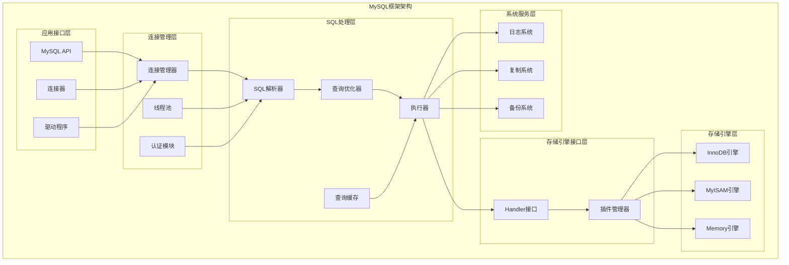

## 概述

MySQL作为世界上最流行的开源关系数据库管理系统，其框架设计体现了数据库系统的经典分层思想。本手册将为开发者提供从入门到精通的完整指南，涵盖MySQL框架的核心概念、API使用、配置优化和实战经验。

<!--more-->

## 1. MySQL框架概览

### 1.1 框架核心特性

MySQL框架具有以下核心特性：

- **分层架构设计**：连接层、SQL层、存储引擎层清晰分离
- **插件化存储引擎**：支持InnoDB、MyISAM等多种存储引擎
- **高并发处理**：支持线程池和每线程连接模式
- **完整事务支持**：ACID特性保证数据一致性
- **丰富的SQL支持**：完整的SQL标准实现
- **强大的复制机制**：主从复制、组复制等高可用方案

### 1.2 框架架构层次



## 2. 快速入门指南

### 2.1 环境准备

#### 系统要求

- **操作系统**：Linux (推荐)、Windows、macOS
- **内存**：最小4GB，推荐8GB以上
- **存储**：SSD推荐，最小20GB可用空间
- **网络**：千兆网络推荐

#### 编译环境

```bash
# CentOS/RHEL
sudo yum install -y gcc gcc-c++ cmake make
sudo yum install -y ncurses-devel openssl-devel

# Ubuntu/Debian
sudo apt-get install -y build-essential cmake
sudo apt-get install -y libncurses5-dev libssl-dev

# 下载MySQL源码
git clone https://github.com/mysql/mysql-server.git
cd mysql-server
git checkout 8.0
```

### 2.2 编译安装

```bash
# 创建构建目录
mkdir build && cd build

# 配置编译选项
cmake .. \
  -DCMAKE_INSTALL_PREFIX=/usr/local/mysql \
  -DMYSQL_DATADIR=/usr/local/mysql/data \
  -DSYSCONFDIR=/etc \
  -DWITH_INNOBASE_STORAGE_ENGINE=1 \
  -DWITH_PARTITION_STORAGE_ENGINE=1 \
  -DWITH_FEDERATED_STORAGE_ENGINE=1 \
  -DWITH_BLACKHOLE_STORAGE_ENGINE=1 \
  -DWITH_MYISAM_STORAGE_ENGINE=1 \
  -DENABLED_LOCAL_INFILE=1 \
  -DENABLE_DTRACE=0 \
  -DDEFAULT_CHARSET=utf8mb4 \
  -DDEFAULT_COLLATION=utf8mb4_general_ci \
  -DWITH_EMBEDDED_SERVER=1

# 编译（使用多核加速）
make -j$(nproc)

# 安装
sudo make install
```

### 2.3 基础配置

#### 创建配置文件

```ini
# /etc/my.cnf
[mysqld]
# 基础配置
port = 3306
socket = /tmp/mysql.sock
datadir = /usr/local/mysql/data
pid-file = /usr/local/mysql/data/mysqld.pid

# 字符集配置
character-set-server = utf8mb4
collation-server = utf8mb4_general_ci

# InnoDB配置
default-storage-engine = INNODB
innodb_buffer_pool_size = 1G
innodb_log_file_size = 256M
innodb_file_per_table = 1
innodb_flush_log_at_trx_commit = 1

# 连接配置
max_connections = 1000
max_connect_errors = 100000

# 查询缓存（MySQL 5.7及以前）
query_cache_type = 1
query_cache_size = 64M

# 日志配置
log-error = /usr/local/mysql/data/error.log
slow_query_log = 1
slow_query_log_file = /usr/local/mysql/data/slow.log
long_query_time = 2

# 二进制日志
log-bin = mysql-bin
binlog_format = ROW
expire_logs_days = 7

[mysql]
default-character-set = utf8mb4

[client]
default-character-set = utf8mb4
```

#### 初始化数据库

```bash
# 初始化数据目录
sudo /usr/local/mysql/bin/mysqld --initialize --user=mysql --datadir=/usr/local/mysql/data

# 启动MySQL服务
sudo /usr/local/mysql/bin/mysqld_safe --user=mysql &

# 安全初始化
sudo /usr/local/mysql/bin/mysql_secure_installation
```

## 3. 核心API概览

### 3.1 连接管理API

MySQL连接管理提供了丰富的API接口：

```cpp
/**
 * MySQL连接管理核心API
 */
namespace mysql_connection {
    
    /**
     * 连接建立API
     * @param host 主机地址
     * @param user 用户名
     * @param password 密码
     * @param database 数据库名
     * @param port 端口号
     * @return 连接句柄
     */
    MYSQL* mysql_real_connect(MYSQL *mysql,
                             const char *host,
                             const char *user,
                             const char *password,
                             const char *database,
                             unsigned int port,
                             const char *unix_socket,
                             unsigned long client_flag);
    
    /**
     * 连接初始化API
     * @param mysql 连接对象指针
     * @return 初始化后的连接对象
     */
    MYSQL* mysql_init(MYSQL *mysql);
    
    /**
     * 连接关闭API
     * @param mysql 连接对象
     */
    void mysql_close(MYSQL *mysql);
    
    /**
     * 连接状态检查API
     * @param mysql 连接对象
     * @return 0表示连接正常，非0表示连接异常
     */
    int mysql_ping(MYSQL *mysql);
    
    /**
     * 连接选项设置API
     * @param mysql 连接对象
     * @param option 选项类型
     * @param arg 选项值
     * @return 0表示成功，非0表示失败
     */
    int mysql_options(MYSQL *mysql, enum mysql_option option, const void *arg);
}
```

### 3.2 查询执行API

```cpp
/**
 * MySQL查询执行核心API
 */
namespace mysql_query {
    
    /**
     * 执行SQL查询API
     * @param mysql 连接对象
     * @param stmt_str SQL语句
     * @return 0表示成功，非0表示失败
     */
    int mysql_real_query(MYSQL *mysql, const char *stmt_str, unsigned long length);
    
    /**
     * 获取查询结果API
     * @param mysql 连接对象
     * @return 结果集对象
     */
    MYSQL_RES* mysql_store_result(MYSQL *mysql);
    
    /**
     * 获取结果行API
     * @param result 结果集对象
     * @return 行数据数组
     */
    MYSQL_ROW mysql_fetch_row(MYSQL_RES *result);
    
    /**
     * 释放结果集API
     * @param result 结果集对象
     */
    void mysql_free_result(MYSQL_RES *result);
    
    /**
     * 获取影响行数API
     * @param mysql 连接对象
     * @return 影响的行数
     */
    my_ulonglong mysql_affected_rows(MYSQL *mysql);
    
    /**
     * 获取插入ID API
     * @param mysql 连接对象
     * @return 最后插入的自增ID
     */
    my_ulonglong mysql_insert_id(MYSQL *mysql);
}
```

### 3.3 预处理语句API

```cpp
/**
 * MySQL预处理语句核心API
 */
namespace mysql_prepared {
    
    /**
     * 初始化预处理语句API
     * @param mysql 连接对象
     * @return 预处理语句对象
     */
    MYSQL_STMT* mysql_stmt_init(MYSQL *mysql);
    
    /**
     * 准备预处理语句API
     * @param stmt 预处理语句对象
     * @param stmt_str SQL语句
     * @param length 语句长度
     * @return 0表示成功，非0表示失败
     */
    int mysql_stmt_prepare(MYSQL_STMT *stmt, const char *stmt_str, unsigned long length);
    
    /**
     * 绑定参数API
     * @param stmt 预处理语句对象
     * @param bind 参数绑定数组
     * @return 0表示成功，非0表示失败
     */
    int mysql_stmt_bind_param(MYSQL_STMT *stmt, MYSQL_BIND *bind);
    
    /**
     * 执行预处理语句API
     * @param stmt 预处理语句对象
     * @return 0表示成功，非0表示失败
     */
    int mysql_stmt_execute(MYSQL_STMT *stmt);
    
    /**
     * 绑定结果API
     * @param stmt 预处理语句对象
     * @param bind 结果绑定数组
     * @return 0表示成功，非0表示失败
     */
    int mysql_stmt_bind_result(MYSQL_STMT *stmt, MYSQL_BIND *bind);
    
    /**
     * 获取结果行API
     * @param stmt 预处理语句对象
     * @return 0表示成功，MYSQL_NO_DATA表示无更多数据
     */
    int mysql_stmt_fetch(MYSQL_STMT *stmt);
    
    /**
     * 关闭预处理语句API
     * @param stmt 预处理语句对象
     * @return 0表示成功，非0表示失败
     */
    int mysql_stmt_close(MYSQL_STMT *stmt);
}
```

### 3.4 事务管理API

```cpp
/**
 * MySQL事务管理核心API
 */
namespace mysql_transaction {
    
    /**
     * 开始事务API
     * @param mysql 连接对象
     * @return 0表示成功，非0表示失败
     */
    int mysql_autocommit(MYSQL *mysql, my_bool auto_mode);
    
    /**
     * 提交事务API
     * @param mysql 连接对象
     * @return 0表示成功，非0表示失败
     */
    int mysql_commit(MYSQL *mysql);
    
    /**
     * 回滚事务API
     * @param mysql 连接对象
     * @return 0表示成功，非0表示失败
     */
    int mysql_rollback(MYSQL *mysql);
    
    /**
     * 设置事务隔离级别API
     * @param mysql 连接对象
     * @param level 隔离级别
     * @return 0表示成功，非0表示失败
     */
    int mysql_set_transaction_isolation_level(MYSQL *mysql, 
                                            enum enum_tx_isolation level);
}
```

## 4. 配置管理指南

### 4.1 性能配置

#### InnoDB引擎配置

```ini
[mysqld]
# InnoDB缓冲池配置
innodb_buffer_pool_size = 8G                    # 设置为物理内存的70-80%
innodb_buffer_pool_instances = 8                # 缓冲池实例数，建议1GB对应1个实例
innodb_buffer_pool_chunk_size = 128M            # 缓冲池块大小

# InnoDB日志配置
innodb_log_file_size = 1G                       # 日志文件大小
innodb_log_files_in_group = 2                   # 日志文件数量
innodb_log_buffer_size = 64M                    # 日志缓冲区大小
innodb_flush_log_at_trx_commit = 1              # 日志刷新策略

# InnoDB I/O配置
innodb_io_capacity = 2000                       # I/O容量
innodb_io_capacity_max = 4000                   # 最大I/O容量
innodb_read_io_threads = 8                      # 读I/O线程数
innodb_write_io_threads = 8                     # 写I/O线程数

# InnoDB页面配置
innodb_page_size = 16K                          # 页面大小
innodb_file_per_table = 1                       # 独立表空间
innodb_open_files = 4000                        # 打开文件数限制
```

#### 连接配置

```ini
[mysqld]
# 连接数配置
max_connections = 2000                          # 最大连接数
max_connect_errors = 100000                     # 最大连接错误数
max_user_connections = 1000                     # 单用户最大连接数

# 线程配置
thread_cache_size = 100                         # 线程缓存大小
thread_stack = 256K                             # 线程栈大小

# 超时配置
wait_timeout = 28800                            # 等待超时时间
interactive_timeout = 28800                     # 交互超时时间
connect_timeout = 10                            # 连接超时时间
```

#### 查询优化配置

```ini
[mysqld]
# 查询缓存配置（MySQL 5.7及以前）
query_cache_type = 1                            # 启用查询缓存
query_cache_size = 256M                         # 查询缓存大小
query_cache_limit = 2M                          # 单个查询缓存限制

# 排序和分组配置
sort_buffer_size = 2M                           # 排序缓冲区大小
read_buffer_size = 1M                           # 读缓冲区大小
read_rnd_buffer_size = 2M                       # 随机读缓冲区大小
join_buffer_size = 2M                           # 连接缓冲区大小

# 临时表配置
tmp_table_size = 64M                            # 临时表大小
max_heap_table_size = 64M                       # 内存表最大大小
```

### 4.2 安全配置

```ini
[mysqld]
# 网络安全
bind-address = 127.0.0.1                       # 绑定地址
skip-networking = 0                             # 启用网络连接
skip-name-resolve = 1                           # 跳过域名解析

# SSL配置
ssl-ca = /path/to/ca.pem                        # CA证书
ssl-cert = /path/to/server-cert.pem             # 服务器证书
ssl-key = /path/to/server-key.pem               # 服务器私钥

# 权限配置
secure-file-priv = /var/lib/mysql-files/        # 安全文件目录
local-infile = 0                                # 禁用本地文件加载

# 日志配置
general_log = 1                                 # 启用一般查询日志
general_log_file = /var/log/mysql/general.log   # 一般查询日志文件
log_error = /var/log/mysql/error.log            # 错误日志文件
```

### 4.3 高可用配置

#### 主从复制配置

**主服务器配置：**

```ini
[mysqld]
# 服务器ID（必须唯一）
server-id = 1

# 二进制日志
log-bin = mysql-bin
binlog_format = ROW
binlog_do_db = production_db
expire_logs_days = 7

# GTID配置（MySQL 5.6+）
gtid_mode = ON
enforce_gtid_consistency = ON
log_slave_updates = ON

# 复制配置
sync_binlog = 1
innodb_flush_log_at_trx_commit = 1
```

**从服务器配置：**

```ini
[mysqld]
# 服务器ID（必须唯一）
server-id = 2

# 中继日志
relay-log = mysql-relay-bin
relay_log_recovery = ON

# 只读配置
read_only = ON
super_read_only = ON

# GTID配置
gtid_mode = ON
enforce_gtid_consistency = ON
log_slave_updates = ON
```

## 5. 开发最佳实践

### 5.1 连接管理最佳实践

#### 连接池实现示例

```cpp
/**
 * MySQL连接池实现
 * 提供高效的连接复用和管理机制
 */
class MySQL_connection_pool {
private:
    struct connection_info {
        MYSQL *connection;
        std::chrono::steady_clock::time_point last_used;
        bool in_use;
        std::string connection_id;
    };
    
    std::vector<connection_info> connections;
    std::mutex pool_mutex;
    std::condition_variable pool_condition;
    
    // 连接池配置
    size_t max_connections;
    size_t min_connections;
    std::chrono::seconds idle_timeout;
    
    // 连接参数
    std::string host;
    std::string user;
    std::string password;
    std::string database;
    unsigned int port;
    
public:
    /**
     * 构造函数：初始化连接池
     */
    MySQL_connection_pool(const std::string &host,
                         const std::string &user,
                         const std::string &password,
                         const std::string &database,
                         unsigned int port = 3306,
                         size_t max_conn = 100,
                         size_t min_conn = 10)
        : host(host), user(user), password(password), 
          database(database), port(port),
          max_connections(max_conn), min_connections(min_conn),
          idle_timeout(std::chrono::seconds(300)) {
        
        // 初始化最小连接数
        initialize_pool();
        
        // 启动清理线程
        start_cleanup_thread();
    }
    
    /**
     * 获取连接
     * @param timeout 超时时间（毫秒）
     * @return 连接对象，失败返回nullptr
     */
    MYSQL* get_connection(int timeout_ms = 5000) {
        std::unique_lock<std::mutex> lock(pool_mutex);
        
        auto timeout = std::chrono::milliseconds(timeout_ms);
        auto deadline = std::chrono::steady_clock::now() + timeout;
        
        while (true) {
            // 查找可用连接
            for (auto &conn_info : connections) {
                if (!conn_info.in_use && is_connection_valid(conn_info.connection)) {
                    conn_info.in_use = true;
                    conn_info.last_used = std::chrono::steady_clock::now();
                    return conn_info.connection;
                }
            }
            
            // 如果没有可用连接且未达到最大连接数，创建新连接
            if (connections.size() < max_connections) {
                MYSQL *new_conn = create_new_connection();
                if (new_conn) {
                    connections.push_back({
                        new_conn,
                        std::chrono::steady_clock::now(),
                        true,
                        generate_connection_id()
                    });
                    return new_conn;
                }
            }
            
            // 等待连接释放或超时
            if (pool_condition.wait_until(lock, deadline) == std::cv_status::timeout) {
                throw std::runtime_error("获取数据库连接超时");
            }
        }
    }
    
    /**
     * 释放连接
     * @param connection 要释放的连接
     */
    void release_connection(MYSQL *connection) {
        std::lock_guard<std::mutex> lock(pool_mutex);
        
        for (auto &conn_info : connections) {
            if (conn_info.connection == connection) {
                conn_info.in_use = false;
                conn_info.last_used = std::chrono::steady_clock::now();
                pool_condition.notify_one();
                break;
            }
        }
    }
    
private:
    /**
     * 初始化连接池
     */
    void initialize_pool() {
        for (size_t i = 0; i < min_connections; ++i) {
            MYSQL *conn = create_new_connection();
            if (conn) {
                connections.push_back({
                    conn,
                    std::chrono::steady_clock::now(),
                    false,
                    generate_connection_id()
                });
            }
        }
    }
    
    /**
     * 创建新连接
     */
    MYSQL* create_new_connection() {
        MYSQL *mysql = mysql_init(nullptr);
        if (!mysql) {
            return nullptr;
        }
        
        // 设置连接选项
        my_bool reconnect = 1;
        mysql_options(mysql, MYSQL_OPT_RECONNECT, &reconnect);
        
        unsigned int timeout = 10;
        mysql_options(mysql, MYSQL_OPT_CONNECT_TIMEOUT, &timeout);
        
        // 建立连接
        if (!mysql_real_connect(mysql, host.c_str(), user.c_str(),
                               password.c_str(), database.c_str(),
                               port, nullptr, 0)) {
            mysql_close(mysql);
            return nullptr;
        }
        
        return mysql;
    }
    
    /**
     * 检查连接有效性
     */
    bool is_connection_valid(MYSQL *connection) {
        return mysql_ping(connection) == 0;
    }
    
    /**
     * 生成连接ID
     */
    std::string generate_connection_id() {
        static std::atomic<int> counter{0};
        return "conn_" + std::to_string(counter.fetch_add(1));
    }
    
    /**
     * 启动清理线程
     */
    void start_cleanup_thread() {
        std::thread cleanup_thread([this]() {
            while (true) {
                std::this_thread::sleep_for(std::chrono::minutes(1));
                cleanup_idle_connections();
            }
        });
        cleanup_thread.detach();
    }
    
    /**
     * 清理空闲连接
     */
    void cleanup_idle_connections() {
        std::lock_guard<std::mutex> lock(pool_mutex);
        
        auto now = std::chrono::steady_clock::now();
        auto it = connections.begin();
        
        while (it != connections.end()) {
            if (!it->in_use && 
                (now - it->last_used) > idle_timeout &&
                connections.size() > min_connections) {
                
                mysql_close(it->connection);
                it = connections.erase(it);
            } else {
                ++it;
            }
        }
    }
};
```

### 5.2 查询优化最佳实践

#### 预处理语句使用示例

```cpp
/**
 * MySQL预处理语句封装类
 * 提供类型安全的参数绑定和结果获取
 */
class MySQL_prepared_statement {
private:
    MYSQL *connection;
    MYSQL_STMT *statement;
    std::vector<MYSQL_BIND> param_binds;
    std::vector<MYSQL_BIND> result_binds;
    std::string query;
    
public:
    /**
     * 构造函数
     */
    MySQL_prepared_statement(MYSQL *conn, const std::string &sql)
        : connection(conn), query(sql) {
        
        statement = mysql_stmt_init(connection);
        if (!statement) {
            throw std::runtime_error("无法初始化预处理语句");
        }
        
        if (mysql_stmt_prepare(statement, query.c_str(), query.length()) != 0) {
            std::string error = mysql_stmt_error(statement);
            mysql_stmt_close(statement);
            throw std::runtime_error("预处理语句准备失败: " + error);
        }
        
        // 初始化参数绑定
        unsigned long param_count = mysql_stmt_param_count(statement);
        if (param_count > 0) {
            param_binds.resize(param_count);
            memset(param_binds.data(), 0, param_count * sizeof(MYSQL_BIND));
        }
    }
    
    /**
     * 析构函数
     */
    ~MySQL_prepared_statement() {
        if (statement) {
            mysql_stmt_close(statement);
        }
    }
    
    /**
     * 绑定整数参数
     */
    void bind_int(unsigned int index, int value) {
        if (index >= param_binds.size()) {
            throw std::out_of_range("参数索引超出范围");
        }
        
        param_binds[index].buffer_type = MYSQL_TYPE_LONG;
        param_binds[index].buffer = &value;
        param_binds[index].is_null = 0;
        param_binds[index].length = 0;
    }
    
    /**
     * 绑定字符串参数
     */
    void bind_string(unsigned int index, const std::string &value) {
        if (index >= param_binds.size()) {
            throw std::out_of_range("参数索引超出范围");
        }
        
        param_binds[index].buffer_type = MYSQL_TYPE_STRING;
        param_binds[index].buffer = const_cast<char*>(value.c_str());
        param_binds[index].buffer_length = value.length();
        param_binds[index].is_null = 0;
        param_binds[index].length = 0;
    }
    
    /**
     * 执行预处理语句
     */
    bool execute() {
        // 绑定参数
        if (!param_binds.empty()) {
            if (mysql_stmt_bind_param(statement, param_binds.data()) != 0) {
                return false;
            }
        }
        
        // 执行语句
        return mysql_stmt_execute(statement) == 0;
    }
    
    /**
     * 获取影响行数
     */
    my_ulonglong affected_rows() {
        return mysql_stmt_affected_rows(statement);
    }
    
    /**
     * 获取结果集
     */
    std::vector<std::vector<std::string>> fetch_all() {
        std::vector<std::vector<std::string>> results;
        
        // 获取结果元数据
        MYSQL_RES *metadata = mysql_stmt_result_metadata(statement);
        if (!metadata) {
            return results;
        }
        
        unsigned int field_count = mysql_num_fields(metadata);
        MYSQL_FIELD *fields = mysql_fetch_fields(metadata);
        
        // 准备结果绑定
        result_binds.resize(field_count);
        std::vector<std::string> row_data(field_count);
        std::vector<unsigned long> lengths(field_count);
        std::vector<my_bool> is_nulls(field_count);
        
        for (unsigned int i = 0; i < field_count; ++i) {
            result_binds[i].buffer_type = MYSQL_TYPE_STRING;
            result_binds[i].buffer = const_cast<char*>(row_data[i].c_str());
            result_binds[i].buffer_length = fields[i].max_length + 1;
            result_binds[i].length = &lengths[i];
            result_binds[i].is_null = &is_nulls[i];
        }
        
        // 绑定结果
        if (mysql_stmt_bind_result(statement, result_binds.data()) != 0) {
            mysql_free_result(metadata);
            return results;
        }
        
        // 获取所有行
        while (mysql_stmt_fetch(statement) == 0) {
            std::vector<std::string> row;
            for (unsigned int i = 0; i < field_count; ++i) {
                if (is_nulls[i]) {
                    row.push_back("");
                } else {
                    row.push_back(std::string(static_cast<char*>(result_binds[i].buffer), lengths[i]));
                }
            }
            results.push_back(row);
        }
        
        mysql_free_result(metadata);
        return results;
    }
};
```

### 5.3 事务管理最佳实践

#### 事务管理器实现

```cpp
/**
 * MySQL事务管理器
 * 提供RAII风格的事务管理
 */
class MySQL_transaction_manager {
private:
    MYSQL *connection;
    bool transaction_active;
    bool auto_rollback;
    
public:
    /**
     * 构造函数：开始事务
     */
    explicit MySQL_transaction_manager(MYSQL *conn, bool auto_rollback = true)
        : connection(conn), transaction_active(false), auto_rollback(auto_rollback) {
        
        if (mysql_autocommit(connection, 0) != 0) {
            throw std::runtime_error("无法关闭自动提交: " + std::string(mysql_error(connection)));
        }
        
        transaction_active = true;
    }
    
    /**
     * 析构函数：自动回滚未提交的事务
     */
    ~MySQL_transaction_manager() {
        if (transaction_active && auto_rollback) {
            rollback();
        }
        
        // 恢复自动提交
        mysql_autocommit(connection, 1);
    }
    
    /**
     * 提交事务
     */
    void commit() {
        if (!transaction_active) {
            throw std::runtime_error("没有活跃的事务可以提交");
        }
        
        if (mysql_commit(connection) != 0) {
            throw std::runtime_error("事务提交失败: " + std::string(mysql_error(connection)));
        }
        
        transaction_active = false;
    }
    
    /**
     * 回滚事务
     */
    void rollback() {
        if (!transaction_active) {
            return; // 没有活跃事务，直接返回
        }
        
        if (mysql_rollback(connection) != 0) {
            // 记录错误但不抛出异常（析构函数中调用）
            std::cerr << "事务回滚失败: " << mysql_error(connection) << std::endl;
        }
        
        transaction_active = false;
    }
    
    /**
     * 设置保存点
     */
    void savepoint(const std::string &name) {
        std::string sql = "SAVEPOINT " + name;
        if (mysql_real_query(connection, sql.c_str(), sql.length()) != 0) {
            throw std::runtime_error("设置保存点失败: " + std::string(mysql_error(connection)));
        }
    }
    
    /**
     * 回滚到保存点
     */
    void rollback_to_savepoint(const std::string &name) {
        std::string sql = "ROLLBACK TO SAVEPOINT " + name;
        if (mysql_real_query(connection, sql.c_str(), sql.length()) != 0) {
            throw std::runtime_error("回滚到保存点失败: " + std::string(mysql_error(connection)));
        }
    }
    
    /**
     * 释放保存点
     */
    void release_savepoint(const std::string &name) {
        std::string sql = "RELEASE SAVEPOINT " + name;
        if (mysql_real_query(connection, sql.c_str(), sql.length()) != 0) {
            throw std::runtime_error("释放保存点失败: " + std::string(mysql_error(connection)));
        }
    }
    
    /**
     * 检查事务是否活跃
     */
    bool is_active() const {
        return transaction_active;
    }
};

/**
 * 使用示例
 */
void example_transaction_usage(MYSQL *connection) {
    try {
        // 开始事务
        MySQL_transaction_manager tx(connection);
        
        // 执行数据库操作
        const char *sql1 = "INSERT INTO users (name, email) VALUES ('John', 'john@example.com')";
        if (mysql_real_query(connection, sql1, strlen(sql1)) != 0) {
            throw std::runtime_error("插入用户失败");
        }
        
        // 设置保存点
        tx.savepoint("user_inserted");
        
        const char *sql2 = "INSERT INTO profiles (user_id, bio) VALUES (LAST_INSERT_ID(), 'Software Engineer')";
        if (mysql_real_query(connection, sql2, strlen(sql2)) != 0) {
            // 回滚到保存点
            tx.rollback_to_savepoint("user_inserted");
            throw std::runtime_error("插入用户资料失败");
        }
        
        // 提交事务
        tx.commit();
        
    } catch (const std::exception &e) {
        std::cerr << "事务执行失败: " << e.what() << std::endl;
        // 事务会在析构函数中自动回滚
    }
}
```

## 6. 监控和调试

### 6.1 性能监控

#### 关键性能指标监控

```cpp
/**
 * MySQL性能监控器
 * 收集和分析MySQL关键性能指标
 */
class MySQL_performance_monitor {
private:
    MYSQL *connection;
    std::chrono::steady_clock::time_point last_sample_time;
    
    struct performance_metrics {
        // 连接指标
        uint64_t connections_total;
        uint64_t connections_current;
        uint64_t connections_max_used;
        uint64_t aborted_connects;
        
        // 查询指标
        uint64_t queries_total;
        uint64_t slow_queries;
        double queries_per_second;
        
        // InnoDB指标
        uint64_t innodb_buffer_pool_reads;
        uint64_t innodb_buffer_pool_read_requests;
        double innodb_buffer_pool_hit_ratio;
        uint64_t innodb_rows_read;
        uint64_t innodb_rows_inserted;
        uint64_t innodb_rows_updated;
        uint64_t innodb_rows_deleted;
        
        // 锁指标
        uint64_t table_locks_waited;
        uint64_t innodb_row_lock_waits;
        double innodb_row_lock_time_avg;
    };
    
    performance_metrics current_metrics;
    performance_metrics previous_metrics;
    
public:
    /**
     * 构造函数
     */
    explicit MySQL_performance_monitor(MYSQL *conn) 
        : connection(conn), last_sample_time(std::chrono::steady_clock::now()) {
        collect_metrics();
        previous_metrics = current_metrics;
    }
    
    /**
     * 收集性能指标
     */
    void collect_metrics() {
        const char *status_query = 
            "SHOW GLOBAL STATUS WHERE Variable_name IN ("
            "'Connections', 'Threads_connected', 'Max_used_connections', 'Aborted_connects', "
            "'Questions', 'Slow_queries', "
            "'Innodb_buffer_pool_reads', 'Innodb_buffer_pool_read_requests', "
            "'Innodb_rows_read', 'Innodb_rows_inserted', 'Innodb_rows_updated', 'Innodb_rows_deleted', "
            "'Table_locks_waited', 'Innodb_row_lock_waits', 'Innodb_row_lock_time_avg'"
            ")";
        
        if (mysql_real_query(connection, status_query, strlen(status_query)) != 0) {
            throw std::runtime_error("查询状态变量失败: " + std::string(mysql_error(connection)));
        }
        
        MYSQL_RES *result = mysql_store_result(connection);
        if (!result) {
            throw std::runtime_error("获取查询结果失败");
        }
        
        MYSQL_ROW row;
        while ((row = mysql_fetch_row(result)) != nullptr) {
            std::string var_name = row[0];
            uint64_t var_value = std::stoull(row[1]);
            
            if (var_name == "Connections") {
                current_metrics.connections_total = var_value;
            } else if (var_name == "Threads_connected") {
                current_metrics.connections_current = var_value;
            } else if (var_name == "Max_used_connections") {
                current_metrics.connections_max_used = var_value;
            } else if (var_name == "Aborted_connects") {
                current_metrics.aborted_connects = var_value;
            } else if (var_name == "Questions") {
                current_metrics.queries_total = var_value;
            } else if (var_name == "Slow_queries") {
                current_metrics.slow_queries = var_value;
            } else if (var_name == "Innodb_buffer_pool_reads") {
                current_metrics.innodb_buffer_pool_reads = var_value;
            } else if (var_name == "Innodb_buffer_pool_read_requests") {
                current_metrics.innodb_buffer_pool_read_requests = var_value;
            } else if (var_name == "Innodb_rows_read") {
                current_metrics.innodb_rows_read = var_value;
            } else if (var_name == "Innodb_rows_inserted") {
                current_metrics.innodb_rows_inserted = var_value;
            } else if (var_name == "Innodb_rows_updated") {
                current_metrics.innodb_rows_updated = var_value;
            } else if (var_name == "Innodb_rows_deleted") {
                current_metrics.innodb_rows_deleted = var_value;
            } else if (var_name == "Table_locks_waited") {
                current_metrics.table_locks_waited = var_value;
            } else if (var_name == "Innodb_row_lock_waits") {
                current_metrics.innodb_row_lock_waits = var_value;
            } else if (var_name == "Innodb_row_lock_time_avg") {
                current_metrics.innodb_row_lock_time_avg = var_value / 1000.0; // 转换为毫秒
            }
        }
        
        mysql_free_result(result);
        
        // 计算缓冲池命中率
        if (current_metrics.innodb_buffer_pool_read_requests > 0) {
            current_metrics.innodb_buffer_pool_hit_ratio = 
                1.0 - (static_cast<double>(current_metrics.innodb_buffer_pool_reads) / 
                       current_metrics.innodb_buffer_pool_read_requests);
        }
        
        // 计算QPS
        auto now = std::chrono::steady_clock::now();
        auto duration = std::chrono::duration_cast<std::chrono::seconds>(now - last_sample_time).count();
        if (duration > 0) {
            uint64_t query_diff = current_metrics.queries_total - previous_metrics.queries_total;
            current_metrics.queries_per_second = static_cast<double>(query_diff) / duration;
        }
        
        last_sample_time = now;
        previous_metrics = current_metrics;
    }
    
    /**
     * 生成性能报告
     */
    std::string generate_report() const {
        std::ostringstream report;
        
        report << "=== MySQL Performance Report ===\n\n";
        
        // 连接指标
        report << "Connection Metrics:\n";
        report << "  Total Connections: " << current_metrics.connections_total << "\n";
        report << "  Current Connections: " << current_metrics.connections_current << "\n";
        report << "  Max Used Connections: " << current_metrics.connections_max_used << "\n";
        report << "  Aborted Connects: " << current_metrics.aborted_connects << "\n\n";
        
        // 查询指标
        report << "Query Metrics:\n";
        report << "  Total Queries: " << current_metrics.queries_total << "\n";
        report << "  Slow Queries: " << current_metrics.slow_queries << "\n";
        report << "  Queries Per Second: " << std::fixed << std::setprecision(2) 
               << current_metrics.queries_per_second << "\n\n";
        
        // InnoDB指标
        report << "InnoDB Metrics:\n";
        report << "  Buffer Pool Hit Ratio: " << std::fixed << std::setprecision(4)
               << (current_metrics.innodb_buffer_pool_hit_ratio * 100) << "%\n";
        report << "  Rows Read: " << current_metrics.innodb_rows_read << "\n";
        report << "  Rows Inserted: " << current_metrics.innodb_rows_inserted << "\n";
        report << "  Rows Updated: " << current_metrics.innodb_rows_updated << "\n";
        report << "  Rows Deleted: " << current_metrics.innodb_rows_deleted << "\n\n";
        
        // 锁指标
        report << "Lock Metrics:\n";
        report << "  Table Locks Waited: " << current_metrics.table_locks_waited << "\n";
        report << "  InnoDB Row Lock Waits: " << current_metrics.innodb_row_lock_waits << "\n";
        report << "  Avg Row Lock Time: " << std::fixed << std::setprecision(2)
               << current_metrics.innodb_row_lock_time_avg << " ms\n";
        
        return report.str();
    }
    
    /**
     * 检查性能警告
     */
    std::vector<std::string> check_performance_warnings() const {
        std::vector<std::string> warnings;
        
        // 检查缓冲池命中率
        if (current_metrics.innodb_buffer_pool_hit_ratio < 0.95) {
            warnings.push_back("InnoDB缓冲池命中率过低: " + 
                             std::to_string(current_metrics.innodb_buffer_pool_hit_ratio * 100) + "%");
        }
        
        // 检查慢查询比例
        if (current_metrics.queries_total > 0) {
            double slow_query_ratio = static_cast<double>(current_metrics.slow_queries) / 
                                    current_metrics.queries_total;
            if (slow_query_ratio > 0.05) {
                warnings.push_back("慢查询比例过高: " + 
                                 std::to_string(slow_query_ratio * 100) + "%");
            }
        }
        
        // 检查连接使用率
        if (current_metrics.connections_max_used > 0) {
            double connection_usage = static_cast<double>(current_metrics.connections_current) / 
                                    current_metrics.connections_max_used;
            if (connection_usage > 0.8) {
                warnings.push_back("连接使用率过高: " + 
                                 std::to_string(connection_usage * 100) + "%");
            }
        }
        
        // 检查行锁等待
        if (current_metrics.innodb_row_lock_time_avg > 100.0) {
            warnings.push_back("平均行锁等待时间过长: " + 
                             std::to_string(current_metrics.innodb_row_lock_time_avg) + " ms");
        }
        
        return warnings;
    }
};
```

## 7. 故障排查指南

### 7.1 常见问题诊断

#### 连接问题诊断

```sql
-- 检查当前连接状态
SELECT 
    PROCESSLIST_ID as connection_id,
    PROCESSLIST_USER as user,
    PROCESSLIST_HOST as host,
    PROCESSLIST_DB as database,
    PROCESSLIST_COMMAND as command,
    PROCESSLIST_TIME as duration_seconds,
    PROCESSLIST_STATE as state,
    LEFT(PROCESSLIST_INFO, 100) as current_query
FROM performance_schema.threads 
WHERE TYPE = 'FOREGROUND'
ORDER BY PROCESSLIST_TIME DESC;

-- 检查连接错误统计
SHOW GLOBAL STATUS LIKE '%connect%';
SHOW GLOBAL STATUS LIKE '%abort%';

-- 检查最大连接数配置
SHOW VARIABLES LIKE 'max_connections';
SHOW STATUS LIKE 'Max_used_connections';
```

#### 性能问题诊断

```sql
-- 检查慢查询
SELECT 
    SCHEMA_NAME,
    DIGEST_TEXT,
    COUNT_STAR as exec_count,
    AVG_TIMER_WAIT/1000000000 as avg_time_seconds,
    MAX_TIMER_WAIT/1000000000 as max_time_seconds,
    SUM_ROWS_EXAMINED/COUNT_STAR as avg_rows_examined
FROM performance_schema.events_statements_summary_by_digest 
WHERE AVG_TIMER_WAIT > 1000000000  -- 超过1秒的查询
ORDER BY AVG_TIMER_WAIT DESC 
LIMIT 10;

-- 检查锁等待
SELECT 
    r.trx_id waiting_trx_id,
    r.trx_mysql_thread_id waiting_thread,
    r.trx_query waiting_query,
    b.trx_id blocking_trx_id,
    b.trx_mysql_thread_id blocking_thread,
    b.trx_query blocking_query
FROM information_schema.innodb_lock_waits w
INNER JOIN information_schema.innodb_trx b ON b.trx_id = w.blocking_trx_id
INNER JOIN information_schema.innodb_trx r ON r.trx_id = w.requesting_trx_id;

-- 检查InnoDB状态
SHOW ENGINE INNODB STATUS;
```

### 7.2 调试工具

#### MySQL调试器实现

```cpp
/**
 * MySQL调试工具类
 * 提供查询分析、性能诊断等调试功能
 */
class MySQL_debugger {
private:
    MYSQL *connection;
    bool debug_enabled;
    std::ofstream debug_log;
    
public:
    /**
     * 构造函数
     */
    explicit MySQL_debugger(MYSQL *conn, const std::string &log_file = "mysql_debug.log")
        : connection(conn), debug_enabled(true) {
        
        debug_log.open(log_file, std::ios::app);
        if (!debug_log.is_open()) {
            std::cerr << "无法打开调试日志文件: " << log_file << std::endl;
            debug_enabled = false;
        }
    }
    
    /**
     * 析构函数
     */
    ~MySQL_debugger() {
        if (debug_log.is_open()) {
            debug_log.close();
        }
    }
    
    /**
     * 执行查询并记录调试信息
     */
    bool execute_with_debug(const std::string &query) {
        auto start_time = std::chrono::high_resolution_clock::now();
        
        // 记录查询开始
        log_debug("执行查询: " + query);
        
        // 执行查询
        int result = mysql_real_query(connection, query.c_str(), query.length());
        
        auto end_time = std::chrono::high_resolution_clock::now();
        auto duration = std::chrono::duration_cast<std::chrono::microseconds>(
            end_time - start_time).count();
        
        if (result == 0) {
            // 查询成功
            my_ulonglong affected_rows = mysql_affected_rows(connection);
            log_debug("查询成功 - 执行时间: " + std::to_string(duration) + " 微秒, " +
                     "影响行数: " + std::to_string(affected_rows));
            
            // 如果是SELECT查询，记录结果集信息
            MYSQL_RES *res = mysql_store_result(connection);
            if (res) {
                int num_fields = mysql_num_fields(res);
                my_ulonglong num_rows = mysql_num_rows(res);
                log_debug("结果集 - 字段数: " + std::to_string(num_fields) + 
                         ", 行数: " + std::to_string(num_rows));
                mysql_free_result(res);
            }
        } else {
            // 查询失败
            std::string error = mysql_error(connection);
            log_debug("查询失败 - 错误: " + error + ", 执行时间: " + 
                     std::to_string(duration) + " 微秒");
        }
        
        return result == 0;
    }
    
    /**
     * 分析查询执行计划
     */
    void analyze_query_plan(const std::string &query) {
        std::string explain_query = "EXPLAIN FORMAT=JSON " + query;
        
        if (mysql_real_query(connection, explain_query.c_str(), explain_query.length()) != 0) {
            log_debug("无法获取查询执行计划: " + std::string(mysql_error(connection)));
            return;
        }
        
        MYSQL_RES *result = mysql_store_result(connection);
        if (!result) {
            log_debug("无法获取执行计划结果");
            return;
        }
        
        MYSQL_ROW row = mysql_fetch_row(result);
        if (row && row[0]) {
            log_debug("查询执行计划:\n" + std::string(row[0]));
        }
        
        mysql_free_result(result);
    }
    
    /**
     * 检查查询性能
     */
    void profile_query(const std::string &query) {
        // 启用性能分析
        mysql_real_query(connection, "SET profiling = 1", 18);
        
        // 执行查询
        execute_with_debug(query);
        
        // 获取性能分析结果
        const char *profile_query = "SHOW PROFILES";
        if (mysql_real_query(connection, profile_query, strlen(profile_query)) == 0) {
            MYSQL_RES *result = mysql_store_result(connection);
            if (result) {
                log_debug("查询性能分析:");
                
                MYSQL_ROW row;
                while ((row = mysql_fetch_row(result)) != nullptr) {
                    log_debug("Query ID: " + std::string(row[0]) + 
                             ", Duration: " + std::string(row[1]) + 
                             ", Query: " + std::string(row[2]));
                }
                
                mysql_free_result(result);
            }
        }
        
        // 关闭性能分析
        mysql_real_query(connection, "SET profiling = 0", 18);
    }
    
    /**
     * 检查表状态
     */
    void check_table_status(const std::string &table_name) {
        std::string status_query = "SHOW TABLE STATUS LIKE '" + table_name + "'";
        
        if (mysql_real_query(connection, status_query.c_str(), status_query.length()) != 0) {
            log_debug("无法获取表状态: " + std::string(mysql_error(connection)));
            return;
        }
        
        MYSQL_RES *result = mysql_store_result(connection);
        if (!result) {
            log_debug("无法获取表状态结果");
            return;
        }
        
        MYSQL_FIELD *fields = mysql_fetch_fields(result);
        int num_fields = mysql_num_fields(result);
        
        MYSQL_ROW row = mysql_fetch_row(result);
        if (row) {
            log_debug("表 " + table_name + " 状态:");
            for (int i = 0; i < num_fields; ++i) {
                if (row[i]) {
                    log_debug("  " + std::string(fields[i].name) + ": " + std::string(row[i]));
                }
            }
        }
        
        mysql_free_result(result);
    }
    
    /**
     * 检查索引使用情况
     */
    void check_index_usage(const std::string &table_name) {
        std::string index_query = "SHOW INDEX FROM " + table_name;
        
        if (mysql_real_query(connection, index_query.c_str(), index_query.length()) != 0) {
            log_debug("无法获取索引信息: " + std::string(mysql_error(connection)));
            return;
        }
        
        MYSQL_RES *result = mysql_store_result(connection);
        if (!result) {
            log_debug("无法获取索引信息结果");
            return;
        }
        
        log_debug("表 " + table_name + " 索引信息:");
        
        MYSQL_ROW row;
        while ((row = mysql_fetch_row(result)) != nullptr) {
            log_debug("  索引: " + std::string(row[2]) + 
                     ", 列: " + std::string(row[4]) + 
                     ", 唯一: " + std::string(row[1]) +
                     ", 基数: " + (row[6] ? std::string(row[6]) : "NULL"));
        }
        
        mysql_free_result(result);
    }
    
private:
    /**
     * 记录调试信息
     */
    void log_debug(const std::string &message) {
        if (!debug_enabled) return;
        
        auto now = std::chrono::system_clock::now();
        auto time_t = std::chrono::system_clock::to_time_t(now);
        
        debug_log << "[" << std::put_time(std::localtime(&time_t), "%Y-%m-%d %H:%M:%S") << "] "
                  << message << std::endl;
        debug_log.flush();
        
        // 同时输出到控制台
        std::cout << "[DEBUG] " << message << std::endl;
    }
};
```

## 8. 总结

MySQL框架使用手册涵盖了从基础安装配置到高级调试技巧的完整内容。通过本手册，开发者可以：

1. **快速上手**：通过环境准备和基础配置快速搭建MySQL开发环境
2. **深入理解**：掌握MySQL框架的核心概念和架构设计
3. **高效开发**：使用最佳实践进行连接管理、查询优化和事务处理
4. **性能调优**：通过监控工具和配置优化提升系统性能
5. **故障排查**：使用调试工具快速定位和解决问题

### 下一步学习建议

1. **深入模块学习**：详细学习各个模块的实现原理
2. **实战项目练习**：在实际项目中应用本手册的知识
3. **源码阅读**：阅读MySQL源码加深理解
4. **社区参与**：参与MySQL社区讨论和贡献

通过系统性的学习和实践，您将能够充分发挥MySQL框架的强大功能，构建高性能、高可用的数据库应用系统。
