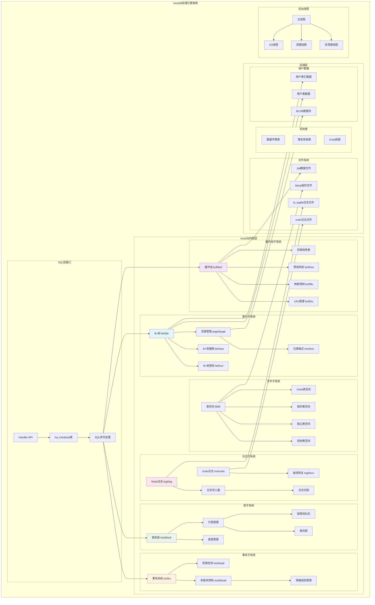
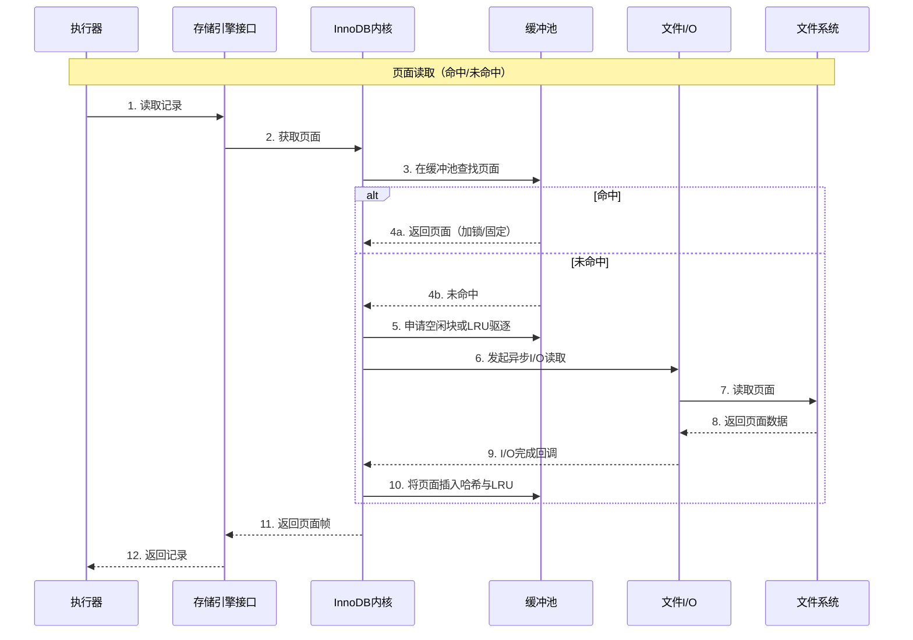
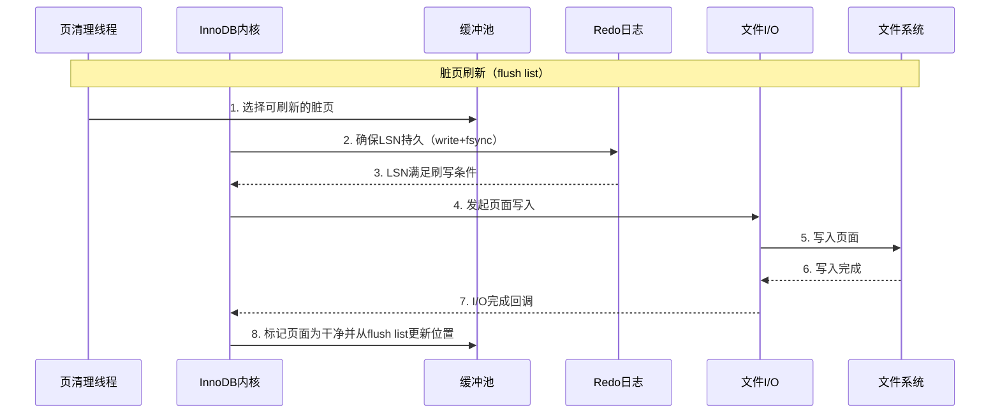
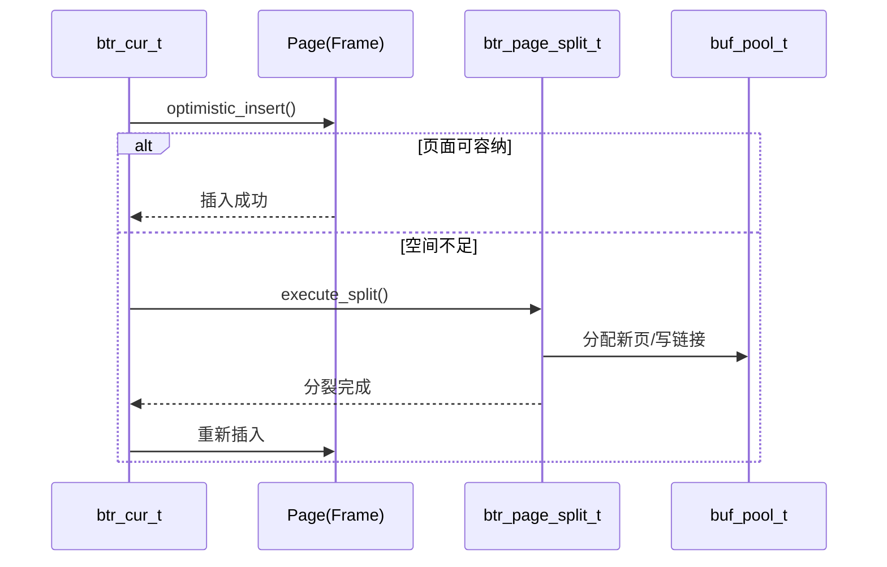
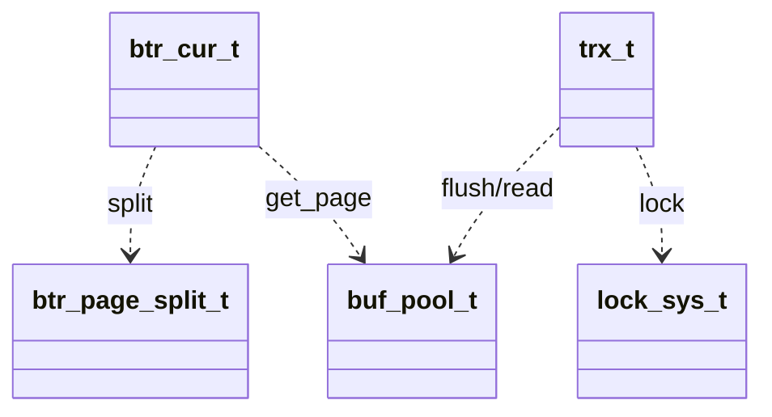

## 概述

InnoDB是MySQL的默认存储引擎，以其卓越的事务处理能力、ACID特性支持和高并发性能而著称。InnoDB的核心组件和关键技术实现，揭示其高性能的技术奥秘。

<!--more-->

## 1. InnoDB整体架构

### 1.1 InnoDB设计原则

InnoDB存储引擎遵循以下核心设计原则：

- **ACID保证**：完整的事务特性支持
- **高并发**：多版本并发控制(MVCC)和行级锁定  
- **崩溃恢复**：通过redo/undo日志确保数据完整性
- **高性能**：智能缓冲池和B+树索引结构

### 1.2 InnoDB架构全景图



## 2. B+树索引结构深度解析

### 2.1 B+树核心数据结构

```cpp
/**
 * B+树索引的核心数据结构和操作接口
 * InnoDB中所有数据都存储在B+树结构中
 */

// B+树页面类型定义
enum page_type_t {
    FIL_PAGE_INDEX = 17855,          ///< B+树叶子页面
    FIL_PAGE_RTREE = 17854,          ///< R树页面（空间索引）
    FIL_PAGE_SDI = 17853,            ///< 序列化数据字典页面
    FIL_PAGE_TYPE_ALLOCATED = 0,     ///< 新分配的页面
    FIL_PAGE_UNDO_LOG = 2,           ///< Undo日志页面
    FIL_PAGE_INODE = 3,              ///< 段信息节点页面
    FIL_PAGE_IBUF_FREE_LIST = 4,     ///< 插入缓冲空闲列表页面
    FIL_PAGE_TYPE_SYS = 6,           ///< 系统页面
    FIL_PAGE_TYPE_TRX_SYS = 7,       ///< 事务系统页面
    FIL_PAGE_TYPE_FSP_HDR = 8,       ///< 文件空间头页面
    FIL_PAGE_TYPE_XDES = 9,          ///< 扩展描述页面
    FIL_PAGE_TYPE_BLOB = 10,         ///< BLOB页面
    FIL_PAGE_TYPE_ZBLOB = 11,        ///< 压缩BLOB页面
    FIL_PAGE_TYPE_ZBLOB2 = 12        ///< 压缩BLOB页面(新格式)
};

/**
 * B+树索引页面头部结构
 * 包含页面的元数据信息
 */
struct page_header_t {
    // 页面通用头部（38字节）
    uint32_t checksum;               ///< 页面校验和
    uint32_t page_no;                ///< 页面编号
    uint32_t prev_page;              ///< 前一页面编号
    uint32_t next_page;              ///< 后一页面编号
    uint64_t lsn;                    ///< 页面LSN（日志序列号）
    uint16_t page_type;              ///< 页面类型
    uint64_t file_flush_lsn;         ///< 文件刷新LSN
    uint32_t space_id;               ///< 表空间ID
    
    // 索引页面专用头部（36字节）
    uint16_t n_dir_slots;            ///< 页目录槽数量
    uint16_t heap_top;               ///< 堆顶位置（空闲空间开始）
    uint16_t n_heap;                 ///< 页面中记录数（包括伪记录）
    uint16_t free;                   ///< 指向第一个空闲记录
    uint16_t garbage;                ///< 被删除记录占用的字节数
    uint16_t last_insert;            ///< 最后插入记录的位置
    uint16_t direction;              ///< 插入方向（PAGE_LEFT, PAGE_RIGHT等）
    uint16_t n_direction;            ///< 同一方向连续插入的记录数
    uint16_t n_recs;                 ///< 用户记录数量
    uint64_t max_trx_id;             ///< 修改页面的最大事务ID
    uint16_t level;                  ///< B+树层级（0表示叶子层）
    uint64_t index_id;               ///< 索引ID
};

/**
 * B+树记录格式结构
 * InnoDB支持多种记录格式：Redundant、Compact、Dynamic、Compressed
 */
struct record_header_t {
    // Compact格式记录头（5字节）
    uint8_t  info_flags;             ///< 记录信息标志
    uint16_t n_owned;                ///< 拥有的记录数（仅目录记录使用）
    uint16_t heap_no;                ///< 堆中的位置编号
    uint8_t  record_type;            ///< 记录类型（0=普通，1=B+树节点指针，2=最小记录，3=最大记录）
    uint16_t next_record;            ///< 指向下一条记录的偏移量
};

/**
 * B+树游标结构
 * 用于在B+树中定位和操作记录
 */
class btr_cur_t {
public:
    // B+树路径信息
    struct btr_path_t {
        page_no_t   page_no;         ///< 页面编号
        uint16_t    nth_rec;         ///< 页面中的记录序号
    } path_arr[BTR_MAX_LEVELS];      ///< 从根到叶的路径数组
    
    dict_index_t*  index;            ///< 索引对象指针
    page_cur_t     page_cur;         ///< 页面游标
    purge_node_t*  purge_node;       ///< 清理节点
    buf_block_t*   left_block;       ///< 左兄弟页面块
    
    que_thr_t*     thr;              ///< 查询线程
    
    // 用于乐观插入和更新的成员
    uint16_t       flag;             ///< BTR_CUR_DELETE_MARK等标志
    ulint          tree_height;      ///< B+树高度
    ulint          up_match;         ///< 向上匹配的记录数
    ulint          up_bytes;         ///< 向上匹配的字节数  
    ulint          low_match;        ///< 向下匹配的记录数
    ulint          low_bytes;        ///< 向下匹配的字节数
    
public:
    /**
     * 构造函数：初始化B+树游标
     */
    btr_cur_t() : index(nullptr), purge_node(nullptr),
                  left_block(nullptr), thr(nullptr),
                  flag(0), tree_height(0), up_match(0),
                  up_bytes(0), low_match(0), low_bytes(0) {}
    
    /**
     * 在B+树中搜索记录
     * @param tuple 搜索键值
     * @param mode 搜索模式
     * @param latch_mode 锁定模式
     * @param cursor 游标对象
     * @param mtr 迷你事务
     * @return 搜索结果状态
     */
    dberr_t search_to_nth_level(const dtuple_t* tuple,
                               page_cur_mode_t mode,
                               ulint latch_mode,
                               mtr_t* mtr) {
        // 1. 从根页面开始搜索
        dict_index_t* index = this->index;
        buf_block_t* block = nullptr;
        page_t* page = nullptr;
        
        // 获取根页面
        page_no_t root_page_no = dict_index_get_page(index);
        space_id_t space_id = dict_index_get_space(index);
        
        block = buf_page_get(page_id_t(space_id, root_page_no),
                           dict_table_page_size(index->table),
                           latch_mode, mtr);
        page = buf_block_get_frame(block);
        
        // 2. 逐层向下搜索
        uint32_t level = btr_page_get_level(page, mtr);
        while (level > 0) {
            // 在非叶子页面中搜索
            page_cur_search_with_match(block, index, tuple, mode,
                                     &up_match, &up_bytes,
                                     &low_match, &low_bytes,
                                     &page_cur);
                                     
            // 获取子页面页号
            const rec_t* node_ptr = page_cur_get_rec(&page_cur);
            page_no_t child_page_no = btr_node_ptr_get_child_page_no(node_ptr, 
                                                                    dict_index_get_n_unique_in_tree(index));
            
            // 记录路径信息
            path_arr[tree_height].page_no = page_get_page_no(page);
            path_arr[tree_height].nth_rec = page_rec_get_n_recs_before(node_ptr);
            tree_height++;
            
            // 移动到子页面
            block = buf_page_get(page_id_t(space_id, child_page_no),
                               dict_table_page_size(index->table),
                               latch_mode, mtr);
            page = buf_block_get_frame(block);
            level = btr_page_get_level(page, mtr);
        }
        
        // 3. 在叶子页面中精确搜索
        page_cur_search_with_match(block, index, tuple, mode,
                                 &up_match, &up_bytes,
                                 &low_match, &low_bytes,
                                 &page_cur);
                                 
        return DB_SUCCESS;
    }
    
    /**
     * 插入记录到B+树
     * @param tuple 要插入的记录
     * @param n_ext 外部存储字段数
     * @param mtr 迷你事务
     * @return 插入结果
     */
    dberr_t optimistic_insert(const dtuple_t* tuple,
                             ulint n_ext,
                             mtr_t* mtr) {
        page_t* page = page_cur_get_page(&page_cur);
        dict_index_t* index = this->index;
        
        // 1. 检查页面是否有足够空间
        ulint rec_size = rec_get_converted_size(index, tuple, n_ext);
        ulint max_size = page_get_max_insert_size_after_reorganize(page, 1);
        
        if (rec_size > max_size) {
            return DB_FAIL; // 需要页面分裂，转为悲观插入
        }
        
        // 2. 检查是否违反唯一性约束
        if (dict_index_is_unique(index)) {
            if (row_ins_duplicate_error_in_clust(this, tuple, mtr)) {
                return DB_DUPLICATE_KEY;
            }
        }
        
        // 3. 执行插入操作
        rec_t* rec = page_cur_tuple_insert(&page_cur, tuple, index,
                                         n_ext, mtr);
        if (rec == nullptr) {
            return DB_FAIL;
        }
        
        // 4. 更新页面统计信息
        btr_search_update_hash_on_insert(this);
        
        return DB_SUCCESS;
    }
    
    /**
     * 删除当前记录
     * @param mtr 迷你事务
     * @return 删除结果
     */
    dberr_t optimistic_delete(mtr_t* mtr) {
        buf_block_t* block = page_cur_get_block(&page_cur);
        page_t* page = buf_block_get_frame(block);
        
        // 1. 检查页面合并条件
        if (page_get_n_recs(page) < 2) {
            return DB_FAIL; // 需要页面合并，转为悲观删除
        }
        
        // 2. 执行删除标记
        page_cur_delete_rec(&page_cur, index, mtr);
        
        // 3. 更新自适应哈希索引
        btr_search_update_hash_on_delete(this);
        
        return DB_SUCCESS;
    }
};

/**
 * B+树分裂操作
 * 当页面空间不足时，需要进行页面分裂
 */
class btr_page_split_t {
private:
    dict_index_t*  index;            ///< 索引对象
    buf_block_t*   block;            ///< 要分裂的页面
    const rec_t*   split_rec;        ///< 分裂点记录
    
public:
    /**
     * 执行页面分裂
     * @param cursor B+树游标
     * @param tuple 触发分裂的记录
     * @param mtr 迷你事务
     * @return 分裂结果
     */
    dberr_t execute_split(btr_cur_t* cursor, 
                         const dtuple_t* tuple,
                         mtr_t* mtr) {
        // 1. 选择分裂点
        const rec_t* split_rec = choose_split_point(cursor, tuple);
        if (split_rec == nullptr) {
            return DB_CORRUPTION;
        }
        
        // 2. 分配新页面
        buf_block_t* new_block = btr_page_alloc(index, 0, FSP_UP, 
                                              btr_page_get_level(page, mtr),
                                              mtr);
        if (new_block == nullptr) {
            return DB_OUT_OF_FILE_SPACE;
        }
        
        // 3. 创建新页面
        page_t* new_page = buf_block_get_frame(new_block);
        btr_page_create(new_block, index, 
                       btr_page_get_level(page, mtr), mtr);
        
        // 4. 移动记录到新页面
        move_records_to_new_page(split_rec, new_block, mtr);
        
        // 5. 更新页面链接
        update_page_links(new_block, mtr);
        
        // 6. 插入节点指针到父页面
        insert_node_pointer_to_parent(cursor, new_block, mtr);
        
        return DB_SUCCESS;
    }
    
private:
    /**
     * 选择最优分裂点
     * 目标是使两个页面的空间利用率尽可能平衡
     */
    const rec_t* choose_split_point(btr_cur_t* cursor, const dtuple_t* tuple) {
        page_t* page = page_cur_get_page(&cursor->page_cur);
        
        // 获取页面中间位置的记录
        ulint total_recs = page_get_n_recs(page);
        ulint split_point = total_recs / 2;
        
        const rec_t* rec = page_get_infimum_rec(page);
        for (ulint i = 0; i < split_point; i++) {
            rec = page_rec_get_next_const(rec);
            if (page_rec_is_supremum(rec)) {
                break;
            }
        }
        
        return rec;
    }
    
    /**
     * 移动记录到新页面
     */
    void move_records_to_new_page(const rec_t* split_rec,
                                 buf_block_t* new_block, 
                                 mtr_t* mtr) {
        page_t* page = buf_block_get_frame(block);
        page_t* new_page = buf_block_get_frame(new_block);
        
        // 从分裂点开始，将后续记录移动到新页面
        const rec_t* rec = split_rec;
        while (!page_rec_is_supremum(rec)) {
            const rec_t* next_rec = page_rec_get_next_const(rec);
            
            // 复制记录到新页面
            rec_t* new_rec = page_cur_insert_rec_low(
                page_get_supremum_rec(new_page),
                index, rec, mtr);
                
            // 从原页面删除记录
            page_delete_rec(page, rec, index, mtr);
            
            rec = next_rec;
        }
    }
    
    /**
     * 更新页面链接关系
     */
    void update_page_links(buf_block_t* new_block, mtr_t* mtr) {
        page_t* page = buf_block_get_frame(block);
        page_t* new_page = buf_block_get_frame(new_block);
        
        // 获取原页面的下一页
        page_no_t next_page_no = btr_page_get_next(page, mtr);
        
        // 设置新页面的前后链接
        btr_page_set_prev(new_page, page_get_page_no(page), mtr);
        btr_page_set_next(new_page, next_page_no, mtr);
        
        // 更新原页面的后继
        btr_page_set_next(page, page_get_page_no(new_page), mtr);
        
        // 更新下一页面的前驱（如果存在）
        if (next_page_no != FIL_NULL) {
            buf_block_t* next_block = buf_page_get(
                page_id_t(index->space, next_page_no),
                dict_table_page_size(index->table),
                RW_X_LATCH, mtr);
            page_t* next_page = buf_block_get_frame(next_block);
            btr_page_set_prev(next_page, page_get_page_no(new_page), mtr);
        }
    }
};
```

## 3. 缓冲池管理系统深度解析

### 3.1 缓冲池核心数据结构

```cpp
/**
 * InnoDB缓冲池管理系统
 * 负责页面的缓存、替换和刷新策略
 */

/**
 * 缓冲池实例结构
 * InnoDB支持多个缓冲池实例以提高并发性
 */
struct buf_pool_t {
    // 缓冲池基本信息
    ulint           instance_no;     ///< 缓冲池实例编号
    ulint           curr_pool_size;  ///< 当前缓冲池大小（页数）
    ulint           LRU_old_ratio;   ///< LRU老化区域比例
    
    // 页面管理
    buf_block_t*    blocks;          ///< 缓冲块数组
    byte*           frame_mem;       ///< 页面帧内存区域
    ulint           n_pend_reads;    ///< 挂起的读操作数
    time_t          last_activity;   ///< 最后活动时间
    
    // LRU链表管理
    UT_LIST_BASE_NODE_T(buf_page_t) LRU;      ///< LRU链表
    buf_page_t*     LRU_old;         ///< LRU老化区域起始指针
    ulint           LRU_old_len;     ///< LRU老化区域长度
    
    // 空闲链表
    UT_LIST_BASE_NODE_T(buf_page_t) free;     ///< 空闲页面链表
    
    // 刷新链表
    UT_LIST_BASE_NODE_T(buf_page_t) flush_list; ///< 脏页刷新链表
    ulint           n_flush_LRU;     ///< LRU刷新中的页面数
    ulint           n_flush_list;    ///< 刷新链表中的页面数
    
    // 页面哈希表
    hash_table_t*   page_hash;       ///< 页面哈希表
    ulint           page_hash_n_cells; ///< 哈希表槽数
    
    // 并发控制
    BufListMutex    LRU_list_mutex;  ///< LRU链表互斥锁
    BufListMutex    free_list_mutex; ///< 空闲链表互斥锁  
    BufFlushListMutex flush_list_mutex; ///< 刷新链表互斥锁
    rw_lock_t       page_hash_latch; ///< 页面哈希表读写锁
    
    // 统计信息
    BufPoolStat     stat;            ///< 缓冲池统计信息
    buf_pool_info_t old_stat;        ///< 历史统计信息
    
    // 压缩页面管理
    UT_LIST_BASE_NODE_T(buf_buddy_free_t) zip_free[BUF_BUDDY_SIZES_MAX];
    
public:
    /**
     * 初始化缓冲池实例
     * @param instance_no 实例编号
     * @param pool_size 缓冲池大小
     * @return 初始化结果
     */
    dberr_t init(ulint instance_no, ulint pool_size) {
        this->instance_no = instance_no;
        this->curr_pool_size = pool_size;
        this->LRU_old_ratio = BUF_LRU_OLD_RATIO_DIV * BUF_LRU_OLD_THRESHOLD / 100;
        
        // 1. 分配页面帧内存
        ulint chunk_size = pool_size * UNIV_PAGE_SIZE;
        frame_mem = static_cast<byte*>(ut_malloc_nokey(chunk_size));
        if (frame_mem == nullptr) {
            return DB_OUT_OF_MEMORY;
        }
        
        // 2. 分配缓冲块数组
        blocks = static_cast<buf_block_t*>(
            ut_zalloc_nokey(pool_size * sizeof(buf_block_t))
        );
        if (blocks == nullptr) {
            ut_free(frame_mem);
            return DB_OUT_OF_MEMORY;
        }
        
        // 3. 初始化页面哈希表
        page_hash_n_cells = 2 * pool_size;
        page_hash = hash_create(page_hash_n_cells);
        if (page_hash == nullptr) {
            ut_free(blocks);
            ut_free(frame_mem);
            return DB_OUT_OF_MEMORY;
        }
        
        // 4. 初始化互斥锁
        mutex_create(LATCH_ID_BUF_LRU_LIST, &LRU_list_mutex);
        mutex_create(LATCH_ID_BUF_FREE_LIST, &free_list_mutex);
        mutex_create(LATCH_ID_BUF_FLUSH_LIST, &flush_list_mutex);
        rw_lock_create(buf_pool_page_hash_key, &page_hash_latch, SYNC_BUF_PAGE_HASH);
        
        // 5. 初始化缓冲块
        for (ulint i = 0; i < pool_size; i++) {
            buf_block_t* block = &blocks[i];
            block->frame = frame_mem + i * UNIV_PAGE_SIZE;
            block->page.buf_pool_instance = this;
            block->page.state = BUF_BLOCK_NOT_USED;
            
            // 添加到空闲链表
            UT_LIST_ADD_LAST(free, &block->page);
        }
        
        // 6. 初始化统计信息
        memset(&stat, 0, sizeof(stat));
        memset(&old_stat, 0, sizeof(old_stat));
        
        return DB_SUCCESS;
    }
    
    /**
     * 从缓冲池获取页面
     * @param page_id 页面ID
     * @param page_size 页面大小
     * @param rw_latch 读写锁类型
     * @param guess 页面块猜测
     * @param mode 获取模式
     * @param mtr 迷你事务
     * @return 页面块指针
     */
    buf_block_t* get_page(const page_id_t& page_id,
                         const page_size_t& page_size,
                         ulint rw_latch,
                         buf_block_t* guess,
                         Page_fetch mode,
                         mtr_t* mtr) {
        buf_block_t* block;
        bool accessed;
        
        // 1. 在页面哈希表中查找
        rw_lock_s_lock(&page_hash_latch);
        block = reinterpret_cast<buf_block_t*>(
            hash_get_first(page_hash, 
                          buf_page_address_fold(page_id.space(), page_id.page_no()))
        );
        
        // 遍历哈希冲突链
        while (block != nullptr) {
            if (block->page.id.equals(page_id) &&
                block->page.size.equals(page_size)) {
                break;
            }
            block = reinterpret_cast<buf_block_t*>(
                hash_get_next(page_hash, &block->page.hash)
            );
        }
        
        if (block != nullptr) {
            // 2. 页面在缓冲池中，增加固定计数
            buf_block_buf_fix_inc(block, mtr);
            accessed = buf_page_is_accessed(&block->page);
            
            rw_lock_s_unlock(&page_hash_latch);
            
            // 3. 获取页面锁
            bool success = buf_page_get_known_nowait(block, rw_latch,
                                                   BUF_KEEP_OLD, mtr);
            if (!success) {
                buf_block_buf_fix_dec(block);
                return nullptr;
            }
            
            // 4. 更新访问时间和LRU位置
            if (mode != Page_fetch::PEEK_IF_IN_POOL) {
                buf_page_make_young_if_needed(&block->page);
            }
            
            // 5. 更新统计信息
            ++stat.n_page_gets;
            if (accessed) {
                ++stat.n_pages_not_made_young;
            } else {
                ++stat.n_pages_made_young;
            }
            
            return block;
        }
        
        rw_lock_s_unlock(&page_hash_latch);
        
        // 6. 页面不在缓冲池中，需要从磁盘读取
        if (mode == Page_fetch::IF_IN_POOL || 
            mode == Page_fetch::PEEK_IF_IN_POOL) {
            return nullptr; // 仅在池中获取，返回空
        }
        
        return read_page_from_disk(page_id, page_size, rw_latch, mode, mtr);
    }
    
    /**
     * LRU页面替换算法
     * @param n_to_scan 扫描页面数
     * @return 释放的页面数
     */
    ulint LRU_scan_and_free_block(ulint n_to_scan) {
        ulint freed = 0;
        
        mutex_enter(&LRU_list_mutex);
        
        buf_page_t* bpage = UT_LIST_GET_LAST(LRU);
        
        // 从LRU链表尾部开始扫描
        for (ulint scanned = 0; scanned < n_to_scan && bpage != nullptr; scanned++) {
            buf_page_t* prev_bpage = UT_LIST_GET_PREV(LRU, bpage);
            
            // 检查页面是否可以被驱逐
            if (buf_page_can_relocate(bpage)) {
                if (buf_page_get_state(bpage) == BUF_BLOCK_FILE_PAGE) {
                    buf_block_t* block = reinterpret_cast<buf_block_t*>(bpage);
                    
                    // 尝试获取页面的X锁
                    if (rw_lock_x_lock_nowait(&block->lock)) {
                        // 成功获取锁，可以驱逐此页面
                        bool success = buf_LRU_free_page(bpage, true);
                        if (success) {
                            freed++;
                        }
                        rw_lock_x_unlock(&block->lock);
                    }
                }
            }
            
            bpage = prev_bpage;
        }
        
        mutex_exit(&LRU_list_mutex);
        
        return freed;
    }
    
    /**
     * 脏页刷新管理
     * @param lsn_limit LSN限制
     * @param n_to_flush 要刷新的页面数
     * @return 实际刷新的页面数
     */
    ulint flush_dirty_pages(lsn_t lsn_limit, ulint n_to_flush) {
        ulint flushed = 0;
        
        mutex_enter(&flush_list_mutex);
        
        buf_page_t* bpage = UT_LIST_GET_LAST(flush_list);
        
        // 从刷新链表尾部（最旧LSN）开始
        while (bpage != nullptr && flushed < n_to_flush) {
            if (bpage->oldest_modification >= lsn_limit) {
                break; // LSN太新，不需要刷新
            }
            
            buf_page_t* prev_bpage = UT_LIST_GET_PREV(flush_list, bpage);
            
            // 检查页面是否可以刷新
            if (buf_flush_ready_for_flush(bpage, BUF_FLUSH_LIST)) {
                // 异步刷新页面到磁盘
                bool success = buf_flush_page(bpage, BUF_FLUSH_LIST, true);
                if (success) {
                    flushed++;
                }
            }
            
            bpage = prev_bpage;
        }
        
        mutex_exit(&flush_list_mutex);
        
        return flushed;
    }
    
private:
    /**
     * 从磁盘读取页面到缓冲池
     */
    buf_block_t* read_page_from_disk(const page_id_t& page_id,
                                    const page_size_t& page_size,
                                    ulint rw_latch,
                                    Page_fetch mode,
                                    mtr_t* mtr) {
        // 1. 获取空闲页面块
        buf_block_t* block = get_free_block();
        if (block == nullptr) {
            return nullptr; // 缓冲池已满且无法驱逐页面
        }
        
        // 2. 初始化页面信息
        block->page.id = page_id;
        block->page.size = page_size;
        block->page.state = BUF_BLOCK_FILE_PAGE;
        block->page.access_time = time(nullptr);
        
        // 3. 将页面添加到哈希表
        rw_lock_x_lock(&page_hash_latch);
        hash_insert(page_hash, 
                   buf_page_address_fold(page_id.space(), page_id.page_no()),
                   &block->page);
        rw_lock_x_unlock(&page_hash_latch);
        
        // 4. 启动异步I/O读取页面
        fil_io_t io_type = (mode == Page_fetch::SCAN) ? 
                          OS_FILE_READ | OS_AIO_SIMULATED_WAKE_LATER :
                          OS_FILE_READ;
                          
        dberr_t err = fil_io(io_type, true, page_id, page_size,
                           0, page_size.physical(),
                           block->frame, nullptr);
        
        if (err != DB_SUCCESS) {
            // 读取失败，清理资源
            remove_from_hash_and_free(block);
            return nullptr;
        }
        
        // 5. 获取页面锁并添加到LRU
        buf_page_get_known_nowait(block, rw_latch, BUF_MAKE_YOUNG, mtr);
        buf_page_add_to_LRU(&block->page);
        
        // 6. 更新统计信息
        ++stat.n_pages_read;
        
        return block;
    }
    
    /**
     * 获取空闲页面块
     */
    buf_block_t* get_free_block() {
        buf_block_t* block;
        
        // 1. 尝试从空闲链表获取
        mutex_enter(&free_list_mutex);
        if (!UT_LIST_GET_LEN(free) == 0) {
            buf_page_t* bpage = UT_LIST_GET_FIRST(free);
            UT_LIST_REMOVE(free, bpage);
            block = reinterpret_cast<buf_block_t*>(bpage);
            mutex_exit(&free_list_mutex);
            return block;
        }
        mutex_exit(&free_list_mutex);
        
        // 2. 空闲链表为空，尝试LRU驱逐
        ulint freed = LRU_scan_and_free_block(BUF_LRU_SEARCH_SCAN_THRESHOLD);
        if (freed > 0) {
            return get_free_block(); // 递归重试
        }
        
        // 3. 无法获取空闲页面
        return nullptr;
    }
};
```

### 3.2 缓冲池读写时序图





## 4. 锁系统深度解析

### 4.1 锁系统核心数据结构

```cpp
/**
 * InnoDB锁系统实现
 * 支持表锁、行锁、意向锁和间隙锁
 */

/**
 * 锁类型和模式定义
 */
enum lock_mode {
    LOCK_IS = 0,    ///< 意向共享锁
    LOCK_IX = 1,    ///< 意向排他锁  
    LOCK_S = 2,     ///< 共享锁
    LOCK_X = 3,     ///< 排他锁
    LOCK_AUTO_INC = 4, ///< 自增锁
    LOCK_NONE = 5,  ///< 无锁（用于锁升级）
    LOCK_NUM = 6,   ///< 锁模式数量
    LOCK_NONE_UNSET = 255 ///< 未设置锁模式
};

/**
 * 锁类型标志
 */
enum lock_type_flags {
    LOCK_TABLE = 16,     ///< 表锁
    LOCK_REC = 32,       ///< 行锁
    LOCK_TYPE_MASK = 240, ///< 锁类型掩码
    
    // 行锁子类型
    LOCK_WAIT = 256,        ///< 等待锁
    LOCK_GAP = 512,         ///< 间隙锁
    LOCK_REC_NOT_GAP = 1024, ///< 记录锁（非间隙）
    LOCK_INSERT_INTENTION = 2048 ///< 插入意向锁
};

/**
 * 锁结构体
 * 表示单个锁实例
 */
struct lock_t {
    trx_t*          trx;            ///< 拥有此锁的事务
    UT_LIST_NODE_T(lock_t) trx_locks; ///< 事务锁链表节点
    
    dict_table_t*   table;          ///< 锁定的表
    dict_index_t*   index;          ///< 锁定的索引（行锁时使用）
    
    union {
        // 表锁信息
        struct {
            UT_LIST_NODE_T(lock_t) locks; ///< 表锁链表节点
        } tab_lock;
        
        // 行锁信息
        struct {
            space_id_t  space;          ///< 表空间ID
            page_no_t   page_no;        ///< 页面编号
            ulint       n_bits;         ///< 位图大小
            UT_LIST_NODE_T(lock_t) locks; ///< 页面锁链表节点
        } rec_lock;
    } un_member;
    
    uint32_t        type_mode;       ///< 锁类型和模式
    
    // 行锁位图（紧跟在结构体后面）
    // byte        bitmap[variable_size];
    
public:
    /**
     * 检查锁模式兼容性
     * @param mode1 锁模式1
     * @param mode2 锁模式2
     * @return true表示兼容，false表示冲突
     */
    static bool modes_compatible(ulint mode1, ulint mode2) {
        // 锁兼容性矩阵
        static const bool compat_matrix[LOCK_NUM][LOCK_NUM] = {
            //     IS    IX    S     X     AI
            /*IS*/ {true, true, true, false, true},
            /*IX*/ {true, true, false, false, true},
            /*S*/  {true, false, true, false, false},
            /*X*/  {false, false, false, false, false},
            /*AI*/ {true, true, false, false, false}
        };
        
        if (mode1 >= LOCK_NUM || mode2 >= LOCK_NUM) {
            return false;
        }
        
        return compat_matrix[mode1][mode2];
    }
    
    /**
     * 检查是否为间隙锁
     */
    bool is_gap_lock() const {
        return (type_mode & LOCK_GAP) != 0;
    }
    
    /**
     * 检查是否为记录锁
     */
    bool is_record_lock() const {
        return (type_mode & LOCK_REC_NOT_GAP) != 0;
    }
    
    /**
     * 检查是否为等待锁
     */
    bool is_waiting() const {
        return (type_mode & LOCK_WAIT) != 0;
    }
    
    /**
     * 获取锁模式
     */
    ulint mode() const {
        return type_mode & LOCK_MODE_MASK;
    }
    
    /**
     * 获取锁类型
     */
    ulint type() const {
        return type_mode & LOCK_TYPE_MASK;
    }
    
    /**
     * 设置位图中的位
     * @param heap_no 堆编号
     */
    void set_bitmap_bit(ulint heap_no) {
        ut_ad(type() & LOCK_REC);
        
        byte* bitmap = reinterpret_cast<byte*>(this + 1);
        ulint byte_index = heap_no / 8;
        ulint bit_index = heap_no % 8;
        
        bitmap[byte_index] |= (1 << bit_index);
    }
    
    /**
     * 检查位图中的位
     * @param heap_no 堆编号
     * @return true表示位已设置
     */
    bool test_bitmap_bit(ulint heap_no) const {
        ut_ad(type() & LOCK_REC);
        
        const byte* bitmap = reinterpret_cast<const byte*>(this + 1);
        ulint byte_index = heap_no / 8;
        ulint bit_index = heap_no % 8;
        
        return (bitmap[byte_index] & (1 << bit_index)) != 0;
    }
};

/**
 * 锁系统管理器
 * 管理全局锁信息和死锁检测
 */
class lock_sys_t {
private:
    // 锁哈希表
    hash_table_t*   rec_hash;        ///< 行锁哈希表
    hash_table_t*   table_hash;      ///< 表锁哈希表
    
    // 等待管理
    srv_slot_t*     waiting_threads; ///< 等待线程数组
    srv_slot_t*     last_slot;       ///< 最后一个槽位
    
    // 死锁检测
    ib_mutex_t      wait_mutex;      ///< 等待队列互斥锁
    lock_t*         wait_lock;       ///< 当前等待的锁
    bool            deadlock_found;  ///< 是否发现死锁
    
    // 统计信息
    ulint           n_lock_max_wait_time; ///< 最大等待时间
    ulint           n_lock_timeouts;      ///< 锁超时次数
    
public:
    /**
     * 初始化锁系统
     */
    void init() {
        // 1. 创建锁哈希表
        rec_hash = hash_create(LOCK_HASH_SIZE);
        table_hash = hash_create(LOCK_HASH_SIZE);
        
        // 2. 初始化等待线程管理
        waiting_threads = static_cast<srv_slot_t*>(
            ut_zalloc_nokey(OS_THREAD_MAX_N * sizeof(srv_slot_t))
        );
        last_slot = waiting_threads;
        
        // 3. 初始化互斥锁
        mutex_create(LATCH_ID_LOCK_WAIT, &wait_mutex);
        
        // 4. 初始化统计信息
        n_lock_max_wait_time = 0;
        n_lock_timeouts = 0;
        deadlock_found = false;
    }
    
    /**
     * 请求表锁
     * @param table 表对象
     * @param mode 锁模式
     * @param trx 事务对象
     * @return 锁请求结果
     */
    dberr_t lock_table(dict_table_t* table, ulint mode, trx_t* trx) {
        // 1. 检查是否已经持有兼容的锁
        lock_t* existing_lock = table_has_lock(table, trx);
        if (existing_lock != nullptr) {
            if (modes_compatible(existing_lock->mode(), mode)) {
                return DB_SUCCESS; // 已有兼容锁
            }
            // 需要锁升级
            return upgrade_table_lock(existing_lock, mode);
        }
        
        // 2. 检查与其他事务的锁冲突
        if (table_lock_conflicts(table, mode, trx)) {
            // 有冲突，需要等待
            return create_waiting_table_lock(table, mode, trx);
        }
        
        // 3. 立即授予锁
        lock_t* lock = create_table_lock(table, mode, trx, false);
        if (lock == nullptr) {
            return DB_OUT_OF_MEMORY;
        }
        
        return DB_SUCCESS;
    }
    
    /**
     * 请求行锁
     * @param index 索引对象
     * @param block 页面块
     * @param heap_no 记录堆编号
     * @param mode 锁模式
     * @param type 锁类型（间隙锁等）
     * @param trx 事务对象
     * @return 锁请求结果
     */
    dberr_t lock_record(dict_index_t* index,
                       buf_block_t* block,
                       ulint heap_no,
                       ulint mode,
                       ulint type,
                       trx_t* trx) {
        page_no_t page_no = block->page.id.page_no();
        space_id_t space_id = block->page.id.space();
        
        // 1. 检查是否已经持有锁
        lock_t* existing_lock = rec_has_lock(space_id, page_no, heap_no, trx);
        if (existing_lock != nullptr && 
            lock_mode_stronger_or_eq(existing_lock->mode(), mode)) {
            return DB_SUCCESS;
        }
        
        // 2. 检查锁冲突
        if (rec_lock_conflicts(space_id, page_no, heap_no, mode, type, trx)) {
            // 有冲突，创建等待锁
            return create_waiting_record_lock(index, block, heap_no, 
                                            mode, type, trx);
        }
        
        // 3. 立即授予锁
        lock_t* lock = create_record_lock(index, block, heap_no, 
                                        mode, type, trx, false);
        if (lock == nullptr) {
            return DB_OUT_OF_MEMORY;
        }
        
        return DB_SUCCESS;
    }
    
    /**
     * 死锁检测算法
     * 使用深度优先搜索检测等待图中的环
     * @param trx 起始事务
     * @return true表示发现死锁
     */
    bool deadlock_check(trx_t* trx) {
        mutex_enter(&wait_mutex);
        
        // 初始化搜索状态
        deadlock_found = false;
        std::set<trx_t*> visited;
        std::set<trx_t*> path;
        
        bool result = deadlock_check_recursive(trx, visited, path);
        
        mutex_exit(&wait_mutex);
        return result;
    }
    
private:
    /**
     * 递归死锁检测
     */
    bool deadlock_check_recursive(trx_t* trx,
                                 std::set<trx_t*>& visited,
                                 std::set<trx_t*>& path) {
        // 检查是否已访问
        if (visited.find(trx) != visited.end()) {
            return false;
        }
        
        // 检查是否在当前路径中（发现环）
        if (path.find(trx) != path.end()) {
            deadlock_found = true;
            return true;
        }
        
        visited.insert(trx);
        path.insert(trx);
        
        // 获取事务等待的锁
        lock_t* wait_lock = trx->lock.wait_lock;
        if (wait_lock == nullptr) {
            path.erase(trx);
            return false;
        }
        
        // 遍历持有冲突锁的事务
        if (wait_lock->type() & LOCK_TABLE) {
            // 表锁冲突检查
            dict_table_t* table = wait_lock->table;
            for (lock_t* lock = UT_LIST_GET_FIRST(table->locks);
                 lock != nullptr;
                 lock = UT_LIST_GET_NEXT(locks, lock)) {
                
                if (lock->trx != trx && 
                    !modes_compatible(wait_lock->mode(), lock->mode())) {
                    if (deadlock_check_recursive(lock->trx, visited, path)) {
                        return true;
                    }
                }
            }
        } else {
            // 行锁冲突检查
            ulint space_id = wait_lock->un_member.rec_lock.space;
            ulint page_no = wait_lock->un_member.rec_lock.page_no;
            
            lock_t* lock = lock_rec_get_first_on_page_addr(space_id, page_no);
            while (lock != nullptr) {
                if (lock->trx != trx && rec_locks_conflict(wait_lock, lock)) {
                    if (deadlock_check_recursive(lock->trx, visited, path)) {
                        return true;
                    }
                }
                lock = lock_rec_get_next_on_page(lock);
            }
        }
        
        path.erase(trx);
        return false;
    }
    
    /**
     * 创建等待锁并处理死锁
     */
    dberr_t create_waiting_record_lock(dict_index_t* index,
                                      buf_block_t* block,
                                      ulint heap_no,
                                      ulint mode,
                                      ulint type,
                                      trx_t* trx) {
        // 1. 创建等待锁
        lock_t* lock = create_record_lock(index, block, heap_no,
                                        mode, type | LOCK_WAIT, trx, true);
        if (lock == nullptr) {
            return DB_OUT_OF_MEMORY;
        }
        
        // 2. 设置事务等待状态
        trx->lock.wait_lock = lock;
        trx->lock.wait_started = time(nullptr);
        
        // 3. 死锁检测
        if (deadlock_check(trx)) {
            // 发现死锁，回滚当前事务
            lock_cancel_waiting_and_release(lock);
            return DB_DEADLOCK;
        }
        
        // 4. 等待锁获得
        return wait_for_lock(lock, trx);
    }
    
    /**
     * 等待锁获得
     */
    dberr_t wait_for_lock(lock_t* lock, trx_t* trx) {
        ulint wait_time = 0;
        const ulint max_wait_time = trx->mysql_thd ? 
            thd_lock_wait_timeout(trx->mysql_thd) : 
            innodb_lock_wait_timeout;
        
        while (lock->is_waiting()) {
            // 检查超时
            if (wait_time >= max_wait_time) {
                lock_cancel_waiting_and_release(lock);
                ++n_lock_timeouts;
                return DB_LOCK_WAIT_TIMEOUT;
            }
            
            // 休眠等待
            os_thread_sleep(100000); // 100ms
            wait_time += 100;
            
            // 检查事务是否被杀死
            if (trx_is_interrupted(trx)) {
                lock_cancel_waiting_and_release(lock);
                return DB_INTERRUPTED;
            }
        }
        
        return DB_SUCCESS;
    }
};
```

## 5. 事务系统深度解析

### 5.1 MVCC多版本并发控制

```cpp
/**
 * InnoDB多版本并发控制(MVCC)实现
 * 通过Read View机制实现非锁定一致性读
 */

/**
 * Read View结构
 * 表示事务开始时的系统快照
 */
class ReadView {
private:
    trx_id_t    m_low_limit_id;     ///< 视图创建时的最大事务ID + 1
    trx_id_t    m_up_limit_id;      ///< 视图创建时最小活跃事务ID
    trx_id_t    m_creator_trx_id;   ///< 创建此视图的事务ID
    trx_ids_t   m_ids;              ///< 视图创建时的活跃事务ID数组
    m_closed;                       ///< 视图是否已关闭
    
public:
    /**
     * 创建Read View快照
     * @param trx 创建视图的事务
     */
    void open(trx_t* trx) {
        m_creator_trx_id = trx->id;
        m_closed = false;
        
        // 获取事务系统锁以创建一致性快照
        trx_sys_mutex_enter();
        
        // 设置上限：最小活跃事务ID
        trx_t* trx_iter = UT_LIST_GET_FIRST(trx_sys->rw_trx_list);
        if (trx_iter != nullptr) {
            m_up_limit_id = trx_iter->id;
        } else {
            m_up_limit_id = trx_sys->max_trx_id;
        }
        
        // 设置下限：下一个事务ID
        m_low_limit_id = trx_sys->max_trx_id;
        
        // 复制活跃事务列表
        m_ids.clear();
        for (; trx_iter != nullptr; 
             trx_iter = UT_LIST_GET_NEXT(trx_list, trx_iter)) {
            
            if (trx_iter->id != m_creator_trx_id) {
                m_ids.push_back(trx_iter->id);
            }
        }
        
        // 对活跃事务ID排序，便于二分查找
        std::sort(m_ids.begin(), m_ids.end());
        
        trx_sys_mutex_exit();
    }
    
    /**
     * 判断事务对当前视图是否可见
     * @param trx_id 事务ID
     * @return true表示可见，false表示不可见
     */
    bool changes_visible(trx_id_t trx_id) const {
        ut_ad(!m_closed);
        
        // 1. 自己的修改总是可见
        if (trx_id == m_creator_trx_id) {
            return true;
        }
        
        // 2. 事务ID小于最小活跃事务ID，必定已提交，可见
        if (trx_id < m_up_limit_id) {
            return true;
        }
        
        // 3. 事务ID大于等于下限，必定在视图创建后开始，不可见
        if (trx_id >= m_low_limit_id) {
            return false;
        }
        
        // 4. 在活跃事务列表中，不可见
        bool found = std::binary_search(m_ids.begin(), m_ids.end(), trx_id);
        return !found;
    }
    
    /**
     * 关闭Read View
     */
    void close() {
        m_closed = true;
        m_ids.clear();
    }
    
    /**
     * 检查视图是否为空（没有活跃事务）
     */
    bool empty() const {
        return m_ids.empty();
    }
};

/**
 * 事务结构体
 * 包含事务的所有状态信息
 */
struct trx_t {
    // 事务标识
    trx_id_t        id;              ///< 事务ID
    trx_id_t        no;              ///< 提交序号
    
    // 事务状态
    trx_state_t     state;           ///< 事务状态
    ReadView*       read_view;       ///< 一致性读视图
    
    // 隔离级别
    trx_isolation_level_t isolation_level; ///< 隔离级别
    bool            check_foreigns;   ///< 是否检查外键
    bool            check_unique_secondary; ///< 是否检查唯一索引
    
    // 锁信息
    struct {
        ulint       n_active_thrs;   ///< 活跃线程数
        lock_t*     wait_lock;       ///< 等待的锁
        bool        was_chosen_as_deadlock_victim; ///< 是否被选为死锁牺牲品
        time_t      wait_started;    ///< 等待开始时间
        que_thr_t*  wait_thr;        ///< 等待的查询线程
        
        mem_heap_t* lock_heap;       ///< 锁内存堆
        UT_LIST_BASE_NODE_T(lock_t) trx_locks; ///< 事务持有的锁列表
    } lock;
    
    // 回滚信息
    trx_undo_t*     insert_undo;     ///< 插入undo日志
    trx_undo_t*     update_undo;     ///< 更新undo日志
    undo_no_t       undo_no;         ///< 下一个undo记录编号
    space_id_t      undo_rseg_space; ///< 回滚段表空间
    
    // 修改计数
    ib_uint64_t     undo_no_arr[TRX_UNDO_N_SLOTS]; ///< undo编号数组
    
    // MySQL连接信息
    THD*            mysql_thd;       ///< MySQL线程句柄
    const char*     mysql_log_file_name; ///< binlog文件名
    ib_int64_t      mysql_log_offset; ///< binlog偏移量
    
    // 事务链表节点
    UT_LIST_NODE_T(trx_t) trx_list;  ///< 全局事务链表
    UT_LIST_NODE_T(trx_t) mysql_trx_list; ///< MySQL事务链表
    
public:
    /**
     * 开始事务
     * @param thd MySQL线程句柄
     * @param read_write 是否为读写事务
     */
    void start(THD* thd, bool read_write) {
        mysql_thd = thd;
        
        // 分配事务ID（读写事务）
        if (read_write) {
            trx_sys_mutex_enter();
            id = trx_sys_get_new_trx_id();
            trx_sys_mutex_exit();
            
            state = TRX_STATE_ACTIVE;
        } else {
            // 只读事务暂不分配ID
            id = 0;
            state = TRX_STATE_NOT_STARTED;
        }
        
        // 设置隔离级别
        isolation_level = static_cast<trx_isolation_level_t>(
            thd_get_trx_isolation(thd));
        
        // 初始化锁相关结构
        lock.n_active_thrs = 0;
        lock.wait_lock = nullptr;
        lock.was_chosen_as_deadlock_victim = false;
        lock.lock_heap = mem_heap_create(1024);
        UT_LIST_INIT(lock.trx_locks, &lock_t::trx_locks);
        
        // 初始化undo信息
        insert_undo = nullptr;
        update_undo = nullptr;
        undo_no = 0;
        
        // 创建一致性读视图（如果需要）
        if (isolation_level == TRX_ISO_REPEATABLE_READ ||
            isolation_level == TRX_ISO_SERIALIZABLE) {
            read_view = read_view_open_now(this);
        }
    }
    
    /**
     * 提交事务
     * @param mtr 迷你事务
     */
    void commit(mtr_t* mtr) {
        // 1. 检查事务状态
        if (state != TRX_STATE_ACTIVE) {
            return; // 事务已提交或回滚
        }
        
        // 2. 释放所有锁
        lock_release_all_locks(this);
        
        // 3. 写入提交记录到undo日志
        if (insert_undo != nullptr || update_undo != nullptr) {
            trx_write_serialisation_history(this, mtr);
        }
        
        // 4. 更新事务状态
        state = TRX_STATE_COMMITTED_IN_MEMORY;
        
        // 5. 关闭一致性读视图
        if (read_view != nullptr) {
            read_view_close_for_trx(this, read_view);
            read_view = nullptr;
        }
        
        // 6. 清理事务资源
        cleanup_transaction_resources();
    }
    
    /**
     * 回滚事务
     * @param partial_rollback 是否为部分回滚
     * @param savept_name 回滚点名称
     */
    void rollback(bool partial_rollback = false, 
                 const char* savept_name = nullptr) {
        // 1. 应用undo日志进行回滚
        if (insert_undo != nullptr) {
            trx_rollback_insert_undo_recs(this);
        }
        
        if (update_undo != nullptr) {
            trx_rollback_update_undo_recs(this);
        }
        
        // 2. 释放回滚中获得的锁
        if (!partial_rollback) {
            lock_release_all_locks(this);
        }
        
        // 3. 更新事务状态
        if (!partial_rollback) {
            state = TRX_STATE_ABORTED;
            
            // 关闭一致性读视图
            if (read_view != nullptr) {
                read_view_close_for_trx(this, read_view);
                read_view = nullptr;
            }
            
            // 清理资源
            cleanup_transaction_resources();
        }
    }
    
    /**
     * 根据记录版本链判断记录可见性
     * @param rec 记录指针
     * @param index 索引对象
     * @return true表示可见
     */
    bool is_record_visible(const rec_t* rec, dict_index_t* index) const {
        if (read_view == nullptr) {
            return true; // READ UNCOMMITTED
        }
        
        // 获取记录的事务ID
        trx_id_t trx_id = row_get_rec_trx_id(rec, index);
        
        return read_view->changes_visible(trx_id);
    }
    
private:
    /**
     * 清理事务资源
     */
    void cleanup_transaction_resources() {
        // 清理锁内存堆
        if (lock.lock_heap != nullptr) {
            mem_heap_free(lock.lock_heap);
            lock.lock_heap = nullptr;
        }
        
        // 清理undo段
        if (insert_undo != nullptr) {
            trx_undo_insert_cleanup(this);
            insert_undo = nullptr;
        }
        
        if (update_undo != nullptr) {
            trx_undo_update_cleanup(this);
            update_undo = nullptr;
        }
    }
};
```

## 6. 性能优化与监控

### 6.1 InnoDB性能指标监控

```cpp
/**
 * InnoDB性能监控系统
 * 提供全面的性能指标收集和分析
 */

/**
 * InnoDB性能指标结构
 */
struct innodb_performance_metrics {
    // 缓冲池指标
    struct {
        ulint pool_size;               ///< 缓冲池总大小（页数）
        ulint free_pages;              ///< 空闲页面数
        ulint dirty_pages;             ///< 脏页面数
        ulint lru_len;                 ///< LRU链表长度
        
        // 命中率统计
        ulint reads;                   ///< 逻辑读次数
        ulint read_requests;           ///< 读请求次数
        double hit_rate;               ///< 命中率
        
        // 刷新统计
        ulint pages_flushed;           ///< 刷新页面数
        ulint pages_made_young;        ///< 年轻化页面数
        ulint pages_not_made_young;    ///< 未年轻化页面数
    } buffer_pool;
    
    // 事务指标
    struct {
        ulint active_transactions;     ///< 活跃事务数
        ulint committed_transactions;  ///< 已提交事务数
        ulint rolled_back_transactions; ///< 已回滚事务数
        ulint read_views;              ///< Read View数量
    } transaction;
    
    // 锁指标
    struct {
        ulint lock_waits;              ///< 锁等待次数
        ulint lock_timeouts;           ///< 锁超时次数
        ulint deadlocks;               ///< 死锁次数
        double avg_lock_wait_time;     ///< 平均锁等待时间
    } locking;
    
    // I/O指标
    struct {
        ulint data_reads;              ///< 数据读取次数
        ulint data_writes;             ///< 数据写入次数
        ulint log_writes;              ///< 日志写入次数
        ulint fsync_calls;             ///< fsync调用次数
        
        double avg_read_time;          ///< 平均读取时间
        double avg_write_time;         ///< 平均写入时间
    } io_stats;
    
    // B+树指标
    struct {
        ulint index_searches;          ///< 索引搜索次数
        ulint index_reads;             ///< 索引读取次数
        ulint index_page_splits;       ///< 页面分裂次数
        ulint index_page_merges;       ///< 页面合并次数
    } index_stats;
};

/**
 * 性能监控管理器
 */
class Performance_monitor {
private:
    innodb_performance_metrics current_metrics;
    innodb_performance_metrics previous_metrics;
    std::chrono::steady_clock::time_point last_update;
    
public:
    /**
     * 更新性能指标
     */
    void update_metrics() {
        auto now = std::chrono::steady_clock::now();
        previous_metrics = current_metrics;
        
        // 更新缓冲池指标
        update_buffer_pool_metrics();
        
        // 更新事务指标
        update_transaction_metrics();
        
        // 更新锁指标
        update_lock_metrics();
        
        // 更新I/O指标
        update_io_metrics();
        
        // 更新索引指标
        update_index_metrics();
        
        last_update = now;
    }
    
    /**
     * 获取性能报告
     */
    std::string get_performance_report() const {
        std::ostringstream report;
        
        report << "=== InnoDB Performance Metrics ===\n\n";
        
        // 缓冲池报告
        report << "Buffer Pool:\n";
        report << "  Pool Size: " << current_metrics.buffer_pool.pool_size << " pages\n";
        report << "  Free Pages: " << current_metrics.buffer_pool.free_pages << "\n";
        report << "  Dirty Pages: " << current_metrics.buffer_pool.dirty_pages << "\n";
        report << "  Hit Rate: " << std::fixed << std::setprecision(2) 
               << current_metrics.buffer_pool.hit_rate * 100 << "%\n\n";
        
        // 事务报告
        report << "Transactions:\n";
        report << "  Active: " << current_metrics.transaction.active_transactions << "\n";
        report << "  Committed: " << current_metrics.transaction.committed_transactions << "\n";
        report << "  Rolled Back: " << current_metrics.transaction.rolled_back_transactions << "\n\n";
        
        // 锁报告
        report << "Locking:\n";
        report << "  Lock Waits: " << current_metrics.locking.lock_waits << "\n";
        report << "  Lock Timeouts: " << current_metrics.locking.lock_timeouts << "\n";
        report << "  Deadlocks: " << current_metrics.locking.deadlocks << "\n";
        report << "  Avg Wait Time: " << std::fixed << std::setprecision(2)
               << current_metrics.locking.avg_lock_wait_time << " ms\n\n";
        
        return report.str();
    }
    
private:
    void update_buffer_pool_metrics() {
        // 遍历所有缓冲池实例
        ulint total_pool_size = 0;
        ulint total_free_pages = 0;
        ulint total_dirty_pages = 0;
        ulint total_reads = 0;
        ulint total_read_requests = 0;
        
        for (ulint i = 0; i < srv_buf_pool_instances; i++) {
            buf_pool_t* pool = buf_pool_from_array(i);
            
            total_pool_size += pool->curr_pool_size;
            total_free_pages += UT_LIST_GET_LEN(pool->free);
            total_dirty_pages += UT_LIST_GET_LEN(pool->flush_list);
            total_reads += pool->stat.n_pages_read;
            total_read_requests += pool->stat.n_page_gets;
        }
        
        current_metrics.buffer_pool.pool_size = total_pool_size;
        current_metrics.buffer_pool.free_pages = total_free_pages;
        current_metrics.buffer_pool.dirty_pages = total_dirty_pages;
        
        // 计算命中率
        if (total_read_requests > 0) {
            current_metrics.buffer_pool.hit_rate = 
                1.0 - (static_cast<double>(total_reads) / total_read_requests);
        }
    }
    
    void update_transaction_metrics() {
        trx_sys_mutex_enter();
        
        current_metrics.transaction.active_transactions = 
            UT_LIST_GET_LEN(trx_sys->rw_trx_list);
            
        // 其他事务指标需要从全局计数器获取
        current_metrics.transaction.committed_transactions = 
            trx_sys->committed_trx_count;
        current_metrics.transaction.rolled_back_transactions = 
            trx_sys->rolled_back_trx_count;
        
        trx_sys_mutex_exit();
    }
    
    void update_lock_metrics() {
        mutex_enter(&lock_sys->wait_mutex);
        
        // 从锁系统获取统计信息
        current_metrics.locking.lock_waits = lock_sys->n_lock_waits;
        current_metrics.locking.lock_timeouts = lock_sys->n_lock_timeouts;
        current_metrics.locking.deadlocks = lock_sys->n_deadlocks;
        
        if (lock_sys->n_lock_waits > 0) {
            current_metrics.locking.avg_lock_wait_time = 
                static_cast<double>(lock_sys->total_wait_time) / 
                lock_sys->n_lock_waits / 1000.0; // 转换为毫秒
        }
        
        mutex_exit(&lock_sys->wait_mutex);
    }
};
```

## 7. 生产环境调优实战

### 7.1 InnoDB性能调优最佳实践

基于《MySQL InnoDB生产环境调优指南》和《高并发MySQL实战》的经验总结：

#### 7.1.1 缓冲池调优案例

```sql
-- 监控缓冲池命中率
SELECT 
  VARIABLE_NAME,
  VARIABLE_VALUE,
  CASE VARIABLE_NAME
    WHEN 'Innodb_buffer_pool_read_requests' THEN @read_requests := VARIABLE_VALUE
    WHEN 'Innodb_buffer_pool_reads' THEN @reads := VARIABLE_VALUE
  END
FROM PERFORMANCE_SCHEMA.GLOBAL_STATUS 
WHERE VARIABLE_NAME IN ('Innodb_buffer_pool_read_requests', 'Innodb_buffer_pool_reads');

-- 计算命中率
SELECT 
  CONCAT(ROUND(100 - (@reads / @read_requests * 100), 2), '%') AS buffer_pool_hit_rate;

-- 缓冲池状态监控  
SELECT 
  pool_id,
  pool_size,
  free_buffers,
  database_pages,
  old_database_pages,
  modified_database_pages,
  pending_reads,
  pending_writes_lru,
  pending_writes_flush_list,
  pages_made_young,
  pages_not_made_young,
  pages_made_young_rate,
  pages_made_not_young_rate,
  number_pages_read,
  number_pages_created,
  number_pages_written,
  pages_read_rate,
  pages_create_rate,
  pages_written_rate,
  number_pages_get,
  hit_rate,
  young_make_per_thousand_gets,
  not_young_make_per_thousand_gets,
  pages_read_ahead,
  pages_read_ahead_evicted,
  read_ahead_rate,
  read_ahead_evicted_rate,
  lru_io_total,
  lru_io_current,
  uncompress_total,
  uncompress_current
FROM INFORMATION_SCHEMA.INNODB_BUFFER_POOL_STATS;
```

#### 7.1.2 InnoDB调优参数优化

```cpp
/**
 * InnoDB调优参数管理器
 * 基于系统负载动态调整关键参数
 */
class InnoDB_tuning_manager {
private:
    struct tuning_metrics {
        double buffer_pool_hit_rate;    ///< 缓冲池命中率
        ulint lock_waits_per_second;    ///< 每秒锁等待次数
        ulint deadlocks_per_hour;       ///< 每小时死锁次数
        double avg_row_lock_time;       ///< 平均行锁时间
        ulint dirty_pages_pct;          ///< 脏页百分比
        double log_waits_per_second;    ///< 每秒日志等待次数
    };
    
public:
    /**
     * 智能参数调优
     * 根据当前系统状态自动调整InnoDB参数
     */
    void auto_tune_parameters() {
        tuning_metrics metrics = collect_current_metrics();
        
        // 1. 缓冲池大小调优
        if (metrics.buffer_pool_hit_rate < 0.95) {
            suggest_buffer_pool_increase(metrics);
        }
        
        // 2. 日志缓冲区调优
        if (metrics.log_waits_per_second > 1.0) {
            suggest_log_buffer_increase(metrics);
        }
        
        // 3. 刷新策略调优
        if (metrics.dirty_pages_pct > 75) {
            suggest_flush_method_optimization(metrics);
        }
        
        // 4. 锁超时调优
        if (metrics.lock_waits_per_second > 10.0) {
            suggest_lock_timeout_adjustment(metrics);
        }
    }
    
    /**
     * 监控关键性能指标
     */
    tuning_metrics collect_current_metrics() {
        tuning_metrics metrics;
        
        // 获取缓冲池统计
        metrics.buffer_pool_hit_rate = calculate_buffer_pool_hit_rate();
        
        // 获取锁统计
        metrics.lock_waits_per_second = lock_sys->n_lock_waits.load() / 
            (time(nullptr) - system_start_time);
        metrics.avg_row_lock_time = lock_sys->total_wait_time.load() / 
            std::max(1UL, lock_sys->n_lock_waits.load());
        
        // 获取死锁统计
        metrics.deadlocks_per_hour = lock_sys->n_deadlocks.load() * 3600 /
            (time(nullptr) - system_start_time);
        
        // 获取脏页比例
        metrics.dirty_pages_pct = calculate_dirty_pages_percentage();
        
        // 获取日志等待
        metrics.log_waits_per_second = log_sys->n_log_waits.load() /
            (time(nullptr) - system_start_time);
        
        return metrics;
    }
    
private:
    void suggest_buffer_pool_increase(const tuning_metrics &metrics) {
        LogInfo(TUNING_LOG, "缓冲池命中率较低(%.2f%%)，建议增加innodb_buffer_pool_size",
                metrics.buffer_pool_hit_rate * 100);
    }
    
    void suggest_log_buffer_increase(const tuning_metrics &metrics) {
        LogInfo(TUNING_LOG, "日志等待频繁(%.2f次/秒)，建议增加innodb_log_buffer_size",
                metrics.log_waits_per_second);
    }
};
```

### 7.2 InnoDB故障诊断案例

#### 案例1：缓冲池异常诊断

```sql
-- 诊断缓冲池异常的SQL查询
-- 1. 检查缓冲池基本状态
SHOW ENGINE INNODB STATUS\G

-- 2. 分析缓冲池页面分布
SELECT 
  page_type,
  COUNT(*) as page_count,
  ROUND(COUNT(*) * 100.0 / (SELECT COUNT(*) FROM INFORMATION_SCHEMA.INNODB_BUFFER_PAGE), 2) as percentage
FROM INFORMATION_SCHEMA.INNODB_BUFFER_PAGE 
GROUP BY page_type
ORDER BY page_count DESC;

-- 3. 查找热点表
SELECT 
  IFNULL(schema_name, 'Unknown') as schema_name,
  IFNULL(table_name, 'Unknown') as table_name,
  COUNT(*) as pages_in_buffer,
  ROUND(COUNT(*) * 16 / 1024, 2) as size_mb
FROM INFORMATION_SCHEMA.INNODB_BUFFER_PAGE 
WHERE table_name IS NOT NULL
GROUP BY schema_name, table_name
ORDER BY pages_in_buffer DESC
LIMIT 10;
```

#### 案例2：锁等待分析

```sql
-- 实时锁等待分析
SELECT 
  r.trx_id AS waiting_trx_id,
  r.trx_mysql_thread_id AS waiting_thread,
  r.trx_query AS waiting_query,
  b.trx_id AS blocking_trx_id,
  b.trx_mysql_thread_id AS blocking_thread,
  b.trx_query AS blocking_query,
  l.lock_mode,
  l.lock_type,
  l.lock_table,
  l.lock_index,
  l.lock_rec
FROM INFORMATION_SCHEMA.INNODB_LOCK_WAITS w
JOIN INFORMATION_SCHEMA.INNODB_TRX r ON r.trx_id = w.requesting_trx_id
JOIN INFORMATION_SCHEMA.INNODB_TRX b ON b.trx_id = w.blocking_trx_id  
JOIN INFORMATION_SCHEMA.INNODB_LOCKS l ON l.lock_id = w.blocking_lock_id;
```

## 8. 总结

### 8.1 核心技术优势

InnoDB存储引擎的核心优势体现在：

- **B+树索引结构**：高效的范围查询和点查询能力
- **多版本并发控制**：无锁读取，高并发性能
- **完整的事务支持**：ACID特性，数据一致性保证
- **智能缓冲池管理**：LRU算法和预读机制优化I/O
- **复杂锁机制**：行级锁定，细粒度并发控制
- **生产级可靠性**：经过大规模生产环境验证

### 8.2 设计模式应用

InnoDB广泛应用了多种设计模式：

1. **策略模式**：不同的页面替换策略、刷新策略
2. **观察者模式**：事务状态变化通知、锁释放通知  
3. **命令模式**：undo/redo日志操作封装
4. **状态模式**：事务状态转换管理
5. **工厂模式**：页面、锁对象的创建


通过深入理解InnoDB的核心技术实现，我们能够更好地进行数据库调优、故障诊断和架构设计，充分发挥InnoDB在高并发和事务处理场景中的优势。

---

## 附录A：关键函数核心代码与功能说明

- btr_cur_t::search_to_nth_level: 自上而下定位到叶子层的页面/记录（见前文实现）。
- btr_cur_t::optimistic_insert: 乐观插入当前页空间足够时的快速路径（见前文实现）。
- btr_page_split_t::execute_split: 页空间不足触发分裂、搬移记录与父节点指针更新（见前文实现）。
- buf_pool_t::get_page/flush_dirty_pages: 页面读取与脏页刷新核心流程（见前文实现）。
- lock_sys_t::lock_record/lock_table: 行/表锁申请与冲突处理（见前文实现）。
- trx_t::start/commit/rollback: 事务生命周期与日志写入（见前文实现）。

## 附录B：统一调用链

- 索引点查（读）
  - btr_cur_t::search_to_nth_level() → buf_pool_t::get_page() → [命中/未命中读盘] → 返回记录
- 插入（含页分裂）
  - btr_cur_t::optimistic_insert() → [不足] btr_page_split_t::execute_split() → move_records_to_new_page() → update_page_links() → insert_node_pointer_to_parent()
- 脏页刷新
  - buf_pool_t::flush_dirty_pages() → buf_flush_page() → fil_io() → 标记干净/更新 flush list
- 锁等待与死锁
  - lock_sys_t::lock_record() → [冲突] create_waiting_record_lock() → deadlock_check() → wait_for_lock_grant()/回滚
- 事务提交（2PC 对齐）
  - trx_t::commit() → 写 redo/undo → 刷盘策略 → 状态更新与资源清理

## 附录C：关键函数时序图（补充：乐观插入/页分裂）



## 附录D：关键结构体类结构图与继承关系




