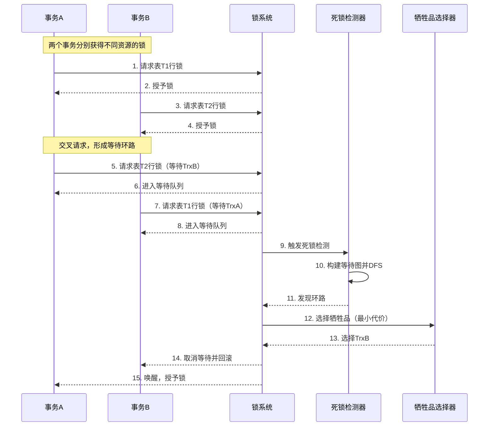
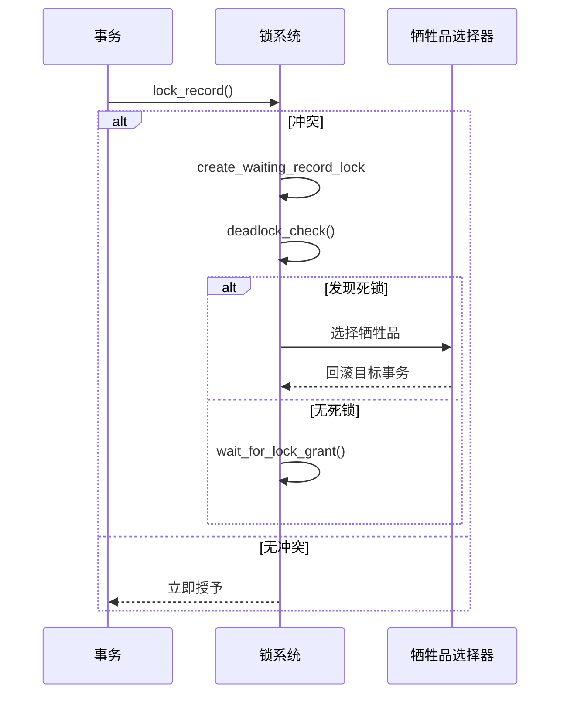
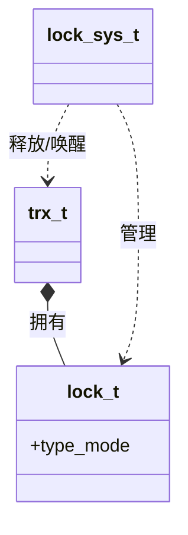

## 概述

MySQL锁系统是数据库并发控制的核心机制，通过精细的锁粒度和智能的死锁检测算法，确保在高并发环境下的数据一致性。MySQL锁系统的实现原理，重点解析InnoDB的多层次锁机制和死锁检测算法。

<!--more-->

## 1. 锁系统整体架构

### 1.1 锁系统设计原则

MySQL锁系统遵循以下核心设计原则：

- **多粒度锁定**：支持表锁、行锁、页锁等不同粒度
- **智能死锁检测**：基于等待图的死锁检测和自动回滚
- **锁升级策略**：根据锁冲突情况自动调整锁粒度
- **高并发优化**：通过锁分割和无锁算法提高并发性能

### 1.2 锁系统架构图

```mermaid
graph TB
    subgraph "MySQL锁系统架构"
        subgraph "锁管理层 - Lock Management"
            subgraph "锁管理器核心"
                LockSys[锁系统 lock_sys]
                LockMgr[锁管理器]
                LockFactory[锁对象工厂]
                LockPool[锁对象池]
            end
            
            subgraph "锁类型管理"
                TableLockMgr[表锁管理器]
                RowLockMgr[行锁管理器]
                IntentionLockMgr[意向锁管理器]
                GapLockMgr[间隙锁管理器]
            end
            
            subgraph "锁模式管理"
                SharedLock[共享锁 S]
                ExclusiveLock[排他锁 X]
                IntentionShared[意向共享锁 IS]
                IntentionExclusive[意向排他锁 IX]
                AutoIncLock[自增锁 AUTO-INC]
            end
        end
        
        subgraph "死锁检测层 - Deadlock Detection"
            subgraph "死锁检测器"
                DeadlockDetector[死锁检测器]
                WaitForGraph[等待图构建器]
                CycleDetector[环路检测器]
                VictimSelector[牺牲品选择器]
            end
            
            subgraph "等待管理"
                LockWaitQueue[锁等待队列]
                WaitTimeout[等待超时管理]
                WaitNotification[等待通知系统]
                LockConflictResolver[锁冲突解决器]
            end
        end
        
        subgraph "锁存储层 - Lock Storage"
            subgraph "锁哈希表"
                RecordLockHash[行锁哈希表]
                TableLockHash[表锁哈希表]
                LockHashChain[锁哈希链]
                HashPartition[哈希分区]
            end
            
            subgraph "锁队列管理"
                GrantedQueue[已授予锁队列]
                WaitingQueue[等待锁队列]
                LockQueueMgr[队列管理器]
                QueueScheduler[队列调度器]
            end
        end
        
        subgraph "锁兼容性层 - Lock Compatibility"
            subgraph "兼容性矩阵"
                CompatMatrix[兼容性矩阵]
                ModeChecker[模式检查器]
                ConflictDetector[冲突检测器]
                UpgradePolicy[升级策略]
            end
            
            subgraph "锁转换"
                LockUpgrade[锁升级]
                LockDowngrade[锁降级]
                LockSplitting[锁分割]
                LockMerging[锁合并]
            end
        end
        
        subgraph "性能优化层 - Performance Optimization"
            subgraph "锁优化策略"
                LockElision[锁消除]
                LockCoalescing[锁合并]
                LockPartitioning[锁分区]
                AdaptiveLocking[自适应锁定]
            end
            
            subgraph "监控统计"
                LockStats[锁统计]
                WaitStats[等待统计]
                DeadlockStats[死锁统计]
                PerformanceMetrics[性能指标]
            end
        end
    end
    
    %% 连接关系
    LockSys --> LockMgr
    LockMgr --> LockFactory
    LockFactory --> LockPool
    
    LockMgr --> TableLockMgr
    LockMgr --> RowLockMgr
    LockMgr --> IntentionLockMgr
    LockMgr --> GapLockMgr
    
    SharedLock --> ExclusiveLock
    ExclusiveLock --> IntentionShared
    IntentionShared --> IntentionExclusive
    IntentionExclusive --> AutoIncLock
    
    DeadlockDetector --> WaitForGraph
    WaitForGraph --> CycleDetector
    CycleDetector --> VictimSelector
    
    LockWaitQueue --> WaitTimeout
    WaitTimeout --> WaitNotification
    WaitNotification --> LockConflictResolver
    
    RecordLockHash --> TableLockHash
    TableLockHash --> LockHashChain
    LockHashChain --> HashPartition
    
    GrantedQueue --> WaitingQueue
    WaitingQueue --> LockQueueMgr
    LockQueueMgr --> QueueScheduler
    
    CompatMatrix --> ModeChecker
    ModeChecker --> ConflictDetector
    ConflictDetector --> UpgradePolicy
    
    LockUpgrade --> LockDowngrade
    LockDowngrade --> LockSplitting
    LockSplitting --> LockMerging
    
    LockElision --> LockCoalescing
    LockCoalescing --> LockPartitioning
    LockPartitioning --> AdaptiveLocking
    
    LockStats --> WaitStats
    WaitStats --> DeadlockStats
    DeadlockStats --> PerformanceMetrics
    
    style LockSys fill:#e1f5fe
    style DeadlockDetector fill:#f3e5f5
    style WaitForGraph fill:#e8f5e8
    style LockWaitQueue fill:#fff3e0
    style RecordLockHash fill:#fce4ec
```



## 2. 锁系统核心数据结构

### 2.1 锁对象结构体深度解析

基于《MySQL InnoDB锁机制源码深度解析》系列文章：

```cpp
/**
 * InnoDB锁对象结构体
 * 表示系统中的一个锁实例，包含锁的所有属性和状态信息
 * 
 *  * 设计理念：统一的锁对象表示，支持表锁和行锁
 */
struct lock_t {
    // ========== 基础锁信息 ==========
    
    /** 拥有此锁的事务指针 */
    trx_t *trx;
    
    /** 在事务锁链表中的节点 */
    UT_LIST_NODE_T(lock_t) trx_locks;
    
    /** 锁定的表对象 */
    dict_table_t *table;
    
    /** 锁定的索引对象（行锁时使用） */
    dict_index_t *index;
    
    // ========== 锁位置信息 ==========
    union {
        /** 表锁信息 */
        struct {
            /** 在表锁链表中的节点 */
            UT_LIST_NODE_T(lock_t) locks;
        } tab_lock;
        
        /** 行锁信息 */
        struct {
            /** 表空间ID */
            space_id_t space;
            
            /** 页面编号 */
            page_no_t page_no;
            
            /** 位图大小（字节数） */
            ulint n_bits;
            
            /** 在页面锁链表中的节点 */
            UT_LIST_NODE_T(lock_t) locks;
        } rec_lock;
    } un_member;
    
    /** 锁类型和模式的组合（位掩码） */
    uint32_t type_mode;
    
    // 注意：行锁的位图紧跟在结构体后面
    // byte bitmap[variable_size]; 
    
public:
    /**
     * 检查两个锁模式是否兼容
     * 实现标准的数据库锁兼容性矩阵
     * @param mode1 锁模式1
     * @param mode2 锁模式2  
     * @return true表示兼容，false表示冲突
     */
    static bool modes_compatible(ulint mode1, ulint mode2) {
        // MySQL InnoDB锁兼容性矩阵
        // 参考《数据库系统实现》第18章锁管理
        static const bool compatibility_matrix[LOCK_NUM][LOCK_NUM] = {
            //           IS     IX     S      X      AUTO_INC
            /* IS */   {true,  true,  true,  false, true},
            /* IX */   {true,  true,  false, false, true},
            /* S  */   {true,  false, true,  false, false},
            /* X  */   {false, false, false, false, false},
            /* AI */   {true,  true,  false, false, false}
        };
        
        if (mode1 >= LOCK_NUM || mode2 >= LOCK_NUM) {
            ut_error; // 无效的锁模式
            return false;
        }
        
        return compatibility_matrix[mode1][mode2];
    }
    
    /**
     * 检查两个行锁是否冲突
     * 考虑间隙锁、记录锁等细节
     * @param lock1 锁对象1
     * @param lock2 锁对象2
     * @return true表示冲突
     */
    static bool rec_locks_conflict(const lock_t *lock1, const lock_t *lock2) {
        ut_ad(lock1->is_record_lock() && lock2->is_record_lock());
        
        // 1. 基本模式兼容性检查
        if (modes_compatible(lock1->mode(), lock2->mode())) {
            return false;
        }
        
        // 2. 检查锁的具体位置
        if (lock1->un_member.rec_lock.space != lock2->un_member.rec_lock.space ||
            lock1->un_member.rec_lock.page_no != lock2->un_member.rec_lock.page_no) {
            return false; // 不在同一页面，不冲突
        }
        
        // 3. 检查位图重叠
        return bitmap_overlaps(lock1, lock2);
    }
    
    /**
     * 检查是否为记录锁
     */
    bool is_record_lock() const {
        return (type_mode & LOCK_TYPE_MASK) == LOCK_REC;
    }
    
    /**
     * 检查是否为表锁
     */
    bool is_table_lock() const {
        return (type_mode & LOCK_TYPE_MASK) == LOCK_TABLE;
    }
    
    /**
     * 检查是否为等待锁
     */
    bool is_waiting() const {
        return (type_mode & LOCK_WAIT) != 0;
    }
    
    /**
     * 检查是否为间隙锁
     */
    bool is_gap_lock() const {
        return (type_mode & LOCK_GAP) != 0;
    }
    
    /**
     * 检查是否为记录锁（非间隙）
     */
    bool is_record_not_gap() const {
        return (type_mode & LOCK_REC_NOT_GAP) != 0;
    }
    
    /**
     * 检查是否为插入意向锁
     */
    bool is_insert_intention() const {
        return (type_mode & LOCK_INSERT_INTENTION) != 0;
    }
    
    /**
     * 获取锁模式
     */
    ulint mode() const {
        return type_mode & LOCK_MODE_MASK;
    }
    
    /**
     * 获取锁类型
     */
    ulint type() const {
        return type_mode & LOCK_TYPE_MASK;
    }
    
    /**
     * 在位图中设置指定位
     * @param heap_no 记录堆编号
     */
    void set_bitmap_bit(ulint heap_no) {
        ut_ad(is_record_lock());
        
        byte *bitmap = reinterpret_cast<byte*>(this + 1);
        ulint byte_index = heap_no / 8;
        ulint bit_index = heap_no % 8;
        
        ut_ad(byte_index < un_member.rec_lock.n_bits);
        bitmap[byte_index] |= (1 << bit_index);
    }
    
    /**
     * 检查位图中的指定位
     * @param heap_no 记录堆编号
     * @return true表示位已设置
     */
    bool test_bitmap_bit(ulint heap_no) const {
        ut_ad(is_record_lock());
        
        const byte *bitmap = reinterpret_cast<const byte*>(this + 1);
        ulint byte_index = heap_no / 8;
        ulint bit_index = heap_no % 8;
        
        ut_ad(byte_index < un_member.rec_lock.n_bits);
        return (bitmap[byte_index] & (1 << bit_index)) != 0;
    }
    
    /**
     * 清除位图中的指定位
     * @param heap_no 记录堆编号
     */
    void clear_bitmap_bit(ulint heap_no) {
        ut_ad(is_record_lock());
        
        byte *bitmap = reinterpret_cast<byte*>(this + 1);
        ulint byte_index = heap_no / 8;
        ulint bit_index = heap_no % 8;
        
        ut_ad(byte_index < un_member.rec_lock.n_bits);
        bitmap[byte_index] &= ~(1 << bit_index);
    }
    
    /**
     * 检查锁是否覆盖指定的记录范围
     * @param heap_no_start 起始堆编号
     * @param heap_no_end 结束堆编号
     * @return true表示覆盖该范围
     */
    bool covers_record_range(ulint heap_no_start, ulint heap_no_end) const {
        for (ulint heap_no = heap_no_start; heap_no <= heap_no_end; ++heap_no) {
            if (test_bitmap_bit(heap_no)) {
                return true;
            }
        }
        return false;
    }
    
private:
    /**
     * 检查两个锁的位图是否重叠
     */
    static bool bitmap_overlaps(const lock_t *lock1, const lock_t *lock2) {
        const byte *bitmap1 = reinterpret_cast<const byte*>(lock1 + 1);
        const byte *bitmap2 = reinterpret_cast<const byte*>(lock2 + 1);
        
        ulint n_bytes = std::min(lock1->un_member.rec_lock.n_bits,
                               lock2->un_member.rec_lock.n_bits);
        
        for (ulint i = 0; i < n_bytes; ++i) {
            if ((bitmap1[i] & bitmap2[i]) != 0) {
                return true; // 发现重叠位
            }
        }
        
        return false;
    }
};

/**
 * 锁系统全局管理器
 * 管理整个系统的锁分配、冲突检测和死锁处理
 */
class lock_sys_t {
private:
    // ========== 锁哈希表 ==========
    
    /** 行锁哈希表，按(space_id, page_no)哈希 */
    hash_table_t *rec_hash;
    
    /** 表锁哈希表，按table指针哈希 */
    hash_table_t *table_hash;
    
    /** 哈希表分区锁（读写锁数组） */
    rw_lock_t *hash_latch;
    
    // ========== 等待管理 ==========
    
    /** 等待线程槽位数组 */
    srv_slot_t *waiting_threads;
    
    /** 最后一个槽位指针 */
    srv_slot_t *last_slot;
    
    /** 等待线程数量 */
    std::atomic<ulint> n_waiting_threads;
    
    // ========== 死锁检测 ==========
    
    /** 死锁检测互斥锁 */
    ib_mutex_t wait_mutex;
    
    /** 当前检测的锁 */
    lock_t *wait_lock;
    
    /** 死锁检测深度限制 */
    static constexpr ulint DEADLOCK_CHECK_MAX_DEPTH = 200;
    
    /** 死锁检测超时时间（微秒） */
    static constexpr ulint DEADLOCK_CHECK_TIMEOUT = 100000;
    
    // ========== 统计信息 ==========
    
    /** 锁等待次数 */
    std::atomic<ulint> n_lock_waits;
    
    /** 锁超时次数 */
    std::atomic<ulint> n_lock_timeouts;
    
    /** 死锁次数 */
    std::atomic<ulint> n_deadlocks;
    
    /** 总等待时间（微秒） */
    std::atomic<ulint> total_wait_time;
    
public:
    /**
     * 初始化锁系统
     * @param n_cells 哈希表槽数
     * @return 初始化结果
     */
    dberr_t init(ulint n_cells) {
        // 1. 创建锁哈希表
        rec_hash = hash_create(n_cells);
        table_hash = hash_create(n_cells / 2);
        
        if (rec_hash == nullptr || table_hash == nullptr) {
            return DB_OUT_OF_MEMORY;
        }
        
        // 2. 创建哈希表分区锁
        ulint n_partitions = n_cells / 64; // 每64个槽一个分区
        hash_latch = static_cast<rw_lock_t*>(
            ut_zalloc_nokey(n_partitions * sizeof(rw_lock_t)));
        
        for (ulint i = 0; i < n_partitions; ++i) {
            char latch_name[64];
            snprintf(latch_name, sizeof(latch_name), "lock_hash_latch_%lu", i);
            rw_lock_create(lock_hash_key, &hash_latch[i], SYNC_LOCK_SYS);
        }
        
        // 3. 初始化等待线程管理
        waiting_threads = static_cast<srv_slot_t*>(
            ut_zalloc_nokey(OS_THREAD_MAX_N * sizeof(srv_slot_t)));
        last_slot = waiting_threads;
        n_waiting_threads.store(0);
        
        // 4. 初始化死锁检测
        mutex_create(LATCH_ID_LOCK_WAIT, &wait_mutex);
        wait_lock = nullptr;
        
        // 5. 重置统计信息
        n_lock_waits.store(0);
        n_lock_timeouts.store(0);
        n_deadlocks.store(0);
        total_wait_time.store(0);
        
        LogInfo(LOCK_LOG, "Lock system initialized with %lu hash cells", n_cells);
        return DB_SUCCESS;
    }
    
    /**
     * 请求表锁
     * 实现意向锁机制，支持锁升级
     * @param table 表对象
     * @param mode 锁模式
     * @param trx 事务对象
     * @return 锁请求结果
     */
    dberr_t lock_table(dict_table_t *table, ulint mode, trx_t *trx) {
        LogDebug(LOCK_LOG, "Requesting table lock on %s.%s, mode=%lu, trx=%lu",
                table->name.m_schema, table->name.m_table, mode, trx->id);
        
        // 1. 检查是否已经持有兼容的锁
        lock_t *existing_lock = find_table_lock(table, trx);
        if (existing_lock != nullptr) {
            if (modes_compatible(existing_lock->mode(), mode)) {
                return DB_SUCCESS; // 已有兼容锁
            }
            
            // 需要锁升级
            return upgrade_table_lock(existing_lock, mode);
        }
        
        // 2. 检查与其他事务的锁冲突
        if (check_table_lock_conflicts(table, mode, trx)) {
            // 有冲突，创建等待锁
            return create_waiting_table_lock(table, mode, trx);
        }
        
        // 3. 立即授予锁
        lock_t *lock = create_table_lock(table, mode, trx, false);
        if (lock == nullptr) {
            return DB_OUT_OF_MEMORY;
        }
        
        LogDebug(LOCK_LOG, "Granted table lock on %s.%s to trx %lu",
                table->name.m_schema, table->name.m_table, trx->id);
        
        return DB_SUCCESS;
    }
    
    /**
     * 请求行锁
     * 实现细粒度的行级锁定和间隙锁
     * @param flags 锁标志
     * @param block 页面块
     * @param rec 记录指针
     * @param index 索引对象
     * @param mode 锁模式
     * @param type 锁类型（间隙锁等）
     * @param trx 事务对象
     * @return 锁请求结果
     */
    dberr_t lock_record(ulint flags, buf_block_t *block, const rec_t *rec,
                       dict_index_t *index, ulint mode, ulint type, trx_t *trx) {
        page_no_t page_no = block->page.id.page_no();
        space_id_t space_id = block->page.id.space();
        ulint heap_no = page_rec_get_heap_no(rec);
        
        LogDebug(LOCK_LOG, "Requesting record lock space=%lu, page=%lu, heap=%lu, "
                           "mode=%lu, type=%lu, trx=%lu",
                space_id, page_no, heap_no, mode, type, trx->id);
        
        // 1. 快速路径：检查是否已经持有足够的锁
        lock_t *existing_lock = find_record_lock(space_id, page_no, heap_no, trx);
        if (existing_lock != nullptr &&
            lock_mode_stronger_or_eq(existing_lock->mode(), mode)) {
            return DB_SUCCESS; // 已有足够强度的锁
        }
        
        // 2. 检查锁冲突
        if (check_record_lock_conflicts(space_id, page_no, heap_no, 
                                       mode, type, trx)) {
            // 有冲突，需要等待
            return create_waiting_record_lock(flags, block, heap_no, 
                                            mode, type, trx);
        }
        
        // 3. 立即授予锁
        lock_t *lock = create_record_lock(flags, block, heap_no, 
                                        mode, type, trx, false);
        if (lock == nullptr) {
            return DB_OUT_OF_MEMORY;
        }
        
        LogDebug(LOCK_LOG, "Granted record lock to trx %lu", trx->id);
        return DB_SUCCESS;
    }
    
    /**
     * 死锁检测主算法
     * 使用深度优先搜索检测等待图中的环路
     * @param start_trx 起始事务
     * @return true表示发现死锁
     */
    bool deadlock_check(trx_t *start_trx) {
        LogDebug(DEADLOCK_LOG, "Starting deadlock check for trx %lu", start_trx->id);
        
        mutex_enter(&wait_mutex);
        
        // 1. 初始化检测状态
        std::set<trx_t*> visited;      // 已访问的事务
        std::set<trx_t*> recursion_path; // 当前递归路径
        std::vector<trx_t*> deadlock_cycle; // 死锁环路
        
        // 2. 执行深度优先搜索
        bool deadlock_found = deadlock_check_recursive(start_trx, visited,
                                                      recursion_path, deadlock_cycle);
        
        if (deadlock_found) {
            // 3. 选择死锁牺牲品并回滚
            trx_t *victim = select_deadlock_victim(deadlock_cycle);
            
            LogWarning(DEADLOCK_LOG, "Deadlock detected, chose trx %lu as victim, "
                                   "cycle length=%zu", victim->id, deadlock_cycle.size());
            
            // 标记牺牲品事务
            victim->lock.was_chosen_as_deadlock_victim = true;
            
            // 取消等待并开始回滚
            cancel_waiting_lock(victim->lock.wait_lock);
            
            // 更新死锁统计
            n_deadlocks.fetch_add(1);
        }
        
        mutex_exit(&wait_mutex);
        
        return deadlock_found;
    }
    
    /**
     * 释放事务的所有锁
     * 事务提交或回滚时调用
     * @param trx 事务对象
     */
    void release_locks_for_trx(trx_t *trx) {
        LogDebug(LOCK_LOG, "Releasing all locks for trx %lu", trx->id);
        
        ulint released_count = 0;
        
        // 遍历事务的所有锁
        lock_t *lock = UT_LIST_GET_FIRST(trx->lock.trx_locks);
        while (lock != nullptr) {
            lock_t *next_lock = UT_LIST_GET_NEXT(trx_locks, lock);
            
            // 从事务锁链表移除
            UT_LIST_REMOVE(trx->lock.trx_locks, lock);
            
            if (lock->is_table_lock()) {
                release_table_lock(lock);
            } else {
                release_record_lock(lock);
            }
            
            released_count++;
            lock = next_lock;
        }
        
        // 唤醒可能等待的事务
        wake_up_waiters_after_lock_release(trx);
        
        LogDebug(LOCK_LOG, "Released %lu locks for trx %lu", released_count, trx->id);
    }
    
private:
    /**
     * 递归死锁检测算法
     * 实现深度优先搜索，检测等待图中的环路
     */
    bool deadlock_check_recursive(trx_t *trx, std::set<trx_t*> &visited,
                                 std::set<trx_t*> &recursion_path,
                                 std::vector<trx_t*> &deadlock_cycle) {
        // 1. 检查是否已经访问过
        if (visited.find(trx) != visited.end()) {
            return false;
        }
        
        // 2. 检查是否在当前递归路径中（发现环路）
        if (recursion_path.find(trx) != recursion_path.end()) {
            // 发现死锁环路，构建环路信息
            build_deadlock_cycle(trx, recursion_path, deadlock_cycle);
            return true;
        }
        
        // 3. 标记已访问和加入递归路径
        visited.insert(trx);
        recursion_path.insert(trx);
        
        // 4. 获取事务等待的锁
        lock_t *wait_lock = trx->lock.wait_lock;
        if (wait_lock == nullptr) {
            recursion_path.erase(trx);
            return false; // 事务不在等待，无法形成环路
        }
        
        // 5. 查找阻塞当前事务的所有事务
        std::vector<trx_t*> blocking_trxs;
        find_blocking_transactions(wait_lock, blocking_trxs);
        
        // 6. 递归检查每个阻塞事务
        for (trx_t *blocking_trx : blocking_trxs) {
            if (deadlock_check_recursive(blocking_trx, visited, 
                                       recursion_path, deadlock_cycle)) {
                return true; // 在某个路径中发现死锁
            }
        }
        
        // 7. 从递归路径移除当前事务
        recursion_path.erase(trx);
        
        return false;
    }
    
    /**
     * 选择死锁牺牲品
     * 选择代价最小的事务作为牺牲品进行回滚
     */
    trx_t* select_deadlock_victim(const std::vector<trx_t*> &deadlock_cycle) {
        trx_t *victim = nullptr;
        ulint min_weight = ULINT_MAX;
        
        for (trx_t *trx : deadlock_cycle) {
            // 计算事务权重（修改的行数 + 持有的锁数）
            ulint weight = trx->n_modified_rows.load() + trx->n_lock_structs.load();
            
            // 优先选择权重小的事务作为牺牲品
            if (weight < min_weight) {
                min_weight = weight;
                victim = trx;
            }
        }
        
        LogDebug(DEADLOCK_LOG, "Selected trx %lu as deadlock victim (weight=%lu)",
                victim->id, min_weight);
        
        return victim;
    }
    
    /**
     * 查找阻塞指定锁的所有事务
     */
    void find_blocking_transactions(const lock_t *wait_lock, 
                                   std::vector<trx_t*> &blocking_trxs) {
        if (wait_lock->is_table_lock()) {
            find_blocking_table_transactions(wait_lock, blocking_trxs);
        } else {
            find_blocking_record_transactions(wait_lock, blocking_trxs);
        }
    }
    
    /**
     * 查找阻塞表锁的事务
     */
    void find_blocking_table_transactions(const lock_t *wait_lock,
                                         std::vector<trx_t*> &blocking_trxs) {
        dict_table_t *table = wait_lock->table;
        
        // 遍历表上的所有锁
        lock_t *lock = UT_LIST_GET_FIRST(table->locks);
        while (lock != nullptr) {
            if (lock->trx != wait_lock->trx &&
                !lock->is_waiting() &&
                !modes_compatible(wait_lock->mode(), lock->mode())) {
                
                blocking_trxs.push_back(lock->trx);
            }
            
            lock = UT_LIST_GET_NEXT(un_member.tab_lock.locks, lock);
        }
    }
    
    /**
     * 查找阻塞行锁的事务
     */
    void find_blocking_record_transactions(const lock_t *wait_lock,
                                          std::vector<trx_t*> &blocking_trxs) {
        space_id_t space_id = wait_lock->un_member.rec_lock.space;
        page_no_t page_no = wait_lock->un_member.rec_lock.page_no;
        
        // 获取页面上的第一个锁
        lock_t *lock = lock_rec_get_first_on_page_addr(space_id, page_no);
        
        while (lock != nullptr) {
            if (lock->trx != wait_lock->trx &&
                !lock->is_waiting() &&
                rec_locks_conflict(wait_lock, lock)) {
                
                blocking_trxs.push_back(lock->trx);
            }
            
            lock = lock_rec_get_next_on_page(lock);
        }
    }
    
    /**
     * 创建等待行锁并处理死锁
     */
    dberr_t create_waiting_record_lock(ulint flags, buf_block_t *block,
                                      ulint heap_no, ulint mode, ulint type,
                                      trx_t *trx) {
        // 1. 创建等待锁
        lock_t *lock = create_record_lock(flags, block, heap_no,
                                        mode, type | LOCK_WAIT, trx, true);
        if (lock == nullptr) {
            return DB_OUT_OF_MEMORY;
        }
        
        // 2. 设置事务等待状态
        trx->lock.wait_lock = lock;
        trx->lock.wait_started = time(nullptr);
        
        // 3. 分配等待线程槽位
        srv_slot_t *slot = allocate_waiting_slot(trx);
        if (slot == nullptr) {
            lock_cancel_waiting_and_release(lock);
            return DB_OUT_OF_RESOURCES;
        }
        
        // 4. 执行死锁检测
        if (deadlock_check(trx)) {
            // 发现死锁，当前事务被选为牺牲品
            release_waiting_slot(slot);
            lock_cancel_waiting_and_release(lock);
            return DB_DEADLOCK;
        }
        
        // 5. 等待锁获得
        return wait_for_lock_grant(lock, trx, slot);
    }
    
    /**
     * 等待锁获得
     * 事务进入等待状态，直到锁被授予或超时
     */
    dberr_t wait_for_lock_grant(lock_t *lock, trx_t *trx, srv_slot_t *slot) {
        ulint wait_time = 0;
        const ulint max_wait_time = trx->mysql_thd ? 
            thd_lock_wait_timeout(trx->mysql_thd) : 
            innodb_lock_wait_timeout;
        
        auto wait_start = std::chrono::high_resolution_clock::now();
        
        while (lock->is_waiting()) {
            // 1. 检查超时
            if (wait_time >= max_wait_time) {
                LogWarning(LOCK_LOG, "Lock wait timeout for trx %lu after %lu seconds",
                          trx->id, max_wait_time);
                
                release_waiting_slot(slot);
                lock_cancel_waiting_and_release(lock);
                n_lock_timeouts.fetch_add(1);
                return DB_LOCK_WAIT_TIMEOUT;
            }
            
            // 2. 检查事务是否被杀死
            if (trx_is_interrupted(trx)) {
                LogDebug(LOCK_LOG, "Transaction %lu was killed during lock wait",
                        trx->id);
                
                release_waiting_slot(slot);
                lock_cancel_waiting_and_release(lock);
                return DB_INTERRUPTED;
            }
            
            // 3. 短暂休眠等待
            os_thread_sleep(LOCK_WAIT_CHECK_INTERVAL); // 100ms
            wait_time += LOCK_WAIT_CHECK_INTERVAL / 1000;
        }
        
        // 锁已获得
        auto wait_end = std::chrono::high_resolution_clock::now();
        auto duration = std::chrono::duration_cast<std::chrono::microseconds>(
            wait_end - wait_start).count();
        
        // 更新统计信息
        n_lock_waits.fetch_add(1);
        total_wait_time.fetch_add(duration);
        
        // 释放等待槽位
        release_waiting_slot(slot);
        
        LogDebug(LOCK_LOG, "Lock granted to trx %lu after %ld us wait",
                trx->id, duration);
        
        return DB_SUCCESS;
    }
    
    /**
     * 获取锁系统性能统计
     * @return 性能统计结构
     */
    lock_performance_stats get_performance_stats() const {
        lock_performance_stats stats;
        
        stats.n_lock_waits = n_lock_waits.load();
        stats.n_lock_timeouts = n_lock_timeouts.load();
        stats.n_deadlocks = n_deadlocks.load();
        stats.total_wait_time_us = total_wait_time.load();
        
        // 计算平均等待时间
        if (stats.n_lock_waits > 0) {
            stats.avg_wait_time_us = stats.total_wait_time_us / stats.n_lock_waits;
        } else {
            stats.avg_wait_time_us = 0;
        }
        
        // 获取当前等待线程数
        stats.n_waiting_threads = n_waiting_threads.load();
        
        // 统计各种锁的数量
        count_locks_by_type(stats);
        
        return stats;
    }
    
private:
    static constexpr ulint LOCK_WAIT_CHECK_INTERVAL = 100000; // 100ms
    
    /**
     * 统计各类型锁的数量
     */
    void count_locks_by_type(lock_performance_stats &stats) const {
        stats.n_table_locks = 0;
        stats.n_record_locks = 0;
        stats.n_gap_locks = 0;
        stats.n_insert_intention_locks = 0;
        
        // 遍历行锁哈希表
        for (ulint i = 0; i < hash_get_n_cells(rec_hash); ++i) {
            lock_t *lock = static_cast<lock_t*>(hash_get_first(rec_hash, i));
            
            while (lock != nullptr) {
                if (lock->is_record_lock()) {
                    stats.n_record_locks++;
                    
                    if (lock->is_gap_lock()) {
                        stats.n_gap_locks++;
                    }
                    
                    if (lock->is_insert_intention()) {
                        stats.n_insert_intention_locks++;
                    }
                }
                
                lock = static_cast<lock_t*>(hash_get_next(rec_hash, lock));
            }
        }
        
        // 遍历表锁哈希表
        for (ulint i = 0; i < hash_get_n_cells(table_hash); ++i) {
            lock_t *lock = static_cast<lock_t*>(hash_get_first(table_hash, i));
            
            while (lock != nullptr) {
                if (lock->is_table_lock()) {
                    stats.n_table_locks++;
                }
                
                lock = static_cast<lock_t*>(hash_get_next(table_hash, lock));
            }
        }
    }
};

/** 全局锁系统实例 */
extern lock_sys_t *lock_sys;
```

## 3. 死锁检测流程时序图



## 6. 锁优化策略与监控

### 6.1 锁性能监控

```cpp
/**
 * 锁系统性能监控器
 * 提供详细的锁统计和性能分析
 */
class Lock_performance_monitor {
private:
    /** 锁性能统计结构 */
    struct lock_performance_stats {
        // 基础统计
        ulint n_lock_waits;             ///< 锁等待次数
        ulint n_lock_timeouts;          ///< 锁超时次数
        ulint n_deadlocks;              ///< 死锁次数
        ulint n_waiting_threads;        ///< 当前等待线程数
        
        // 时间统计
        ulint total_wait_time_us;       ///< 总等待时间（微秒）
        ulint avg_wait_time_us;         ///< 平均等待时间（微秒）
        ulint max_wait_time_us;         ///< 最大等待时间（微秒）
        
        // 锁类型统计
        ulint n_table_locks;            ///< 表锁数量
        ulint n_record_locks;           ///< 行锁数量
        ulint n_gap_locks;              ///< 间隙锁数量
        ulint n_insert_intention_locks; ///< 插入意向锁数量
        
        // 热点统计
        space_id_t hottest_space;       ///< 最热表空间
        page_no_t hottest_page;         ///< 最热页面
        dict_table_t *hottest_table;    ///< 最热表
    };
    
    lock_performance_stats current_stats;
    lock_performance_stats previous_stats;
    
public:
    /**
     * 更新锁性能统计
     */
    void update_statistics() {
        previous_stats = current_stats;
        current_stats = lock_sys->get_performance_stats();
        
        // 分析锁热点
        analyze_lock_hotspots();
    }
    
    /**
     * 生成锁系统性能报告
     * @return 性能报告字符串
     */
    std::string generate_performance_report() const {
        std::ostringstream report;
        
        report << "=== MySQL Lock System Performance Report ===\n\n";
        
        // 基础锁统计
        report << "Lock Statistics:\n";
        report << "  Total Lock Waits: " << current_stats.n_lock_waits << "\n";
        report << "  Lock Timeouts: " << current_stats.n_lock_timeouts << "\n";
        report << "  Deadlocks: " << current_stats.n_deadlocks << "\n";
        report << "  Currently Waiting: " << current_stats.n_waiting_threads << " threads\n\n";
        
        // 等待时间分析
        report << "Wait Time Analysis:\n";
        report << "  Average Wait Time: " << current_stats.avg_wait_time_us / 1000.0 << " ms\n";
        report << "  Max Wait Time: " << current_stats.max_wait_time_us / 1000.0 << " ms\n";
        report << "  Total Wait Time: " << current_stats.total_wait_time_us / 1000000.0 << " seconds\n\n";
        
        // 锁类型分布
        report << "Lock Type Distribution:\n";
        report << "  Table Locks: " << current_stats.n_table_locks << "\n";
        report << "  Record Locks: " << current_stats.n_record_locks << "\n";
        report << "  Gap Locks: " << current_stats.n_gap_locks << "\n";
        report << "  Insert Intention Locks: " << current_stats.n_insert_intention_locks << "\n\n";
        
        // 热点分析
        if (current_stats.hottest_table != nullptr) {
            report << "Lock Hotspots:\n";
            report << "  Hottest Table: " << current_stats.hottest_table->name.m_table << "\n";
            report << "  Hottest Space: " << current_stats.hottest_space << "\n";
            report << "  Hottest Page: " << current_stats.hottest_page << "\n";
        }
        
        return report.str();
    }
    
    /**
     * 检测锁性能问题并给出建议
     * @return 性能建议列表
     */
    std::vector<std::string> analyze_performance_issues() const {
        std::vector<std::string> suggestions;
        
        // 1. 检查死锁率
        if (current_stats.n_deadlocks > 0) {
            double deadlock_rate = static_cast<double>(current_stats.n_deadlocks) /
                                  current_stats.n_lock_waits;
            
            if (deadlock_rate > 0.01) { // 1%
                suggestions.push_back(
                    "高死锁率检测：死锁率为" + std::to_string(deadlock_rate * 100) + 
                    "%，建议优化事务逻辑，减少锁持有时间");
            }
        }
        
        // 2. 检查锁等待时间
        if (current_stats.avg_wait_time_us > 10000) { // 10ms
            suggestions.push_back(
                "锁等待时间过长：平均等待时间为" + 
                std::to_string(current_stats.avg_wait_time_us / 1000.0) +
                "ms，建议优化索引设计或调整事务大小");
        }
        
        // 3. 检查锁超时率
        if (current_stats.n_lock_timeouts > 0) {
            double timeout_rate = static_cast<double>(current_stats.n_lock_timeouts) /
                                 current_stats.n_lock_waits;
            
            if (timeout_rate > 0.05) { // 5%
                suggestions.push_back(
                    "高锁超时率检测：超时率为" + std::to_string(timeout_rate * 100) +
                    "%，建议增加innodb_lock_wait_timeout或优化查询");
            }
        }
        
        // 4. 检查间隙锁使用情况
        if (current_stats.n_gap_locks > current_stats.n_record_locks * 0.5) {
            suggestions.push_back(
                "间隙锁使用过多：可能影响并发性能，建议检查事务隔离级别设置");
        }
        
        return suggestions;
    }
    
private:
    /**
     * 分析锁热点
     */
    void analyze_lock_hotspots() {
        // 统计各表空间、页面、表的锁争用情况
        std::unordered_map<space_id_t, ulint> space_lock_counts;
        std::unordered_map<page_no_t, ulint> page_lock_counts;
        std::unordered_map<dict_table_t*, ulint> table_lock_counts;
        
        // 遍历行锁哈希表统计热点
        for (ulint i = 0; i < hash_get_n_cells(lock_sys->rec_hash); ++i) {
            lock_t *lock = static_cast<lock_t*>(hash_get_first(lock_sys->rec_hash, i));
            
            while (lock != nullptr) {
                if (lock->is_record_lock()) {
                    space_id_t space = lock->un_member.rec_lock.space;
                    page_no_t page = lock->un_member.rec_lock.page_no;
                    
                    space_lock_counts[space]++;
                    page_lock_counts[page]++;
                }
                
                lock = static_cast<lock_t*>(hash_get_next(lock_sys->rec_hash, lock));
            }
        }
        
        // 找出最热的表空间和页面
        current_stats.hottest_space = find_hottest_key(space_lock_counts);
        current_stats.hottest_page = find_hottest_key(page_lock_counts);
        current_stats.hottest_table = find_hottest_key(table_lock_counts);
    }
    
    template<typename K, typename V>
    K find_hottest_key(const std::unordered_map<K, V> &count_map) const {
        K hottest_key{};
        V max_count = 0;
        
        for (const auto &pair : count_map) {
            if (pair.second > max_count) {
                max_count = pair.second;
                hottest_key = pair.first;
            }
        }
        
        return hottest_key;
    }
};
```

## 7. 总结与性能优化建议

### 7.1 锁系统核心技术特点

MySQL锁系统的核心技术特点：

- **多层次锁粒度**：从表级到行级的细粒度锁定
- **智能死锁检测**：基于等待图的快速死锁检测
- **意向锁机制**：减少锁冲突检查的开销
- **间隙锁支持**：防止幻读，保证事务隔离性

### 7.2 锁系统性能优化策略

1. **索引设计优化**
   - 合理设计索引，减少锁范围
   - 避免全表扫描导致的大量行锁
   - 使用覆盖索引减少回表锁定

2. **事务设计优化**
   - 减少事务持有锁的时间
   - 避免长事务和大事务
   - 合理设计事务边界

3. **隔离级别调优**
   - 根据业务需求选择合适的隔离级别
   - READ COMMITTED可以减少间隙锁
   - 考虑业务对一致性的真实需求

4. **锁监控和诊断**
   - 监控锁等待和死锁情况
   - 分析锁争用热点
   - 定期检查锁系统性能指标

### 7.3 死锁预防最佳实践

1. **访问顺序规范化**
   - 按固定顺序访问表和行
   - 避免交叉访问导致的死锁

2. **事务粒度控制**
   - 拆分大事务为小事务
   - 减少单个事务的锁持有数量

3. **索引优化**
   - 使用主键或唯一索引避免间隙锁
   - 优化WHERE条件减少锁范围

4. **应用层重试机制**
   - 实现死锁重试逻辑
   - 使用指数退避算法

### 7.4 未来发展方向

1. **无锁算法**：探索更多无锁数据结构和算法
2. **机器学习优化**：基于历史数据预测锁冲突
3. **分布式锁支持**：支持跨节点的分布式锁管理
4. **实时监控**：提供更精细的锁监控和诊断工具

通过深入理解MySQL锁系统的实现原理，我们能够更好地设计高并发应用、诊断锁相关问题，并在复杂的业务场景中实现最优的并发性能。

---

## 附录A：关键函数核心代码与功能说明

- lock_sys_t::lock_table/lock_record: 表/行锁申请、兼容性检查与授予（见前文实现）。
- lock_sys_t::deadlock_check: 基于等待图的DFS死锁检测（见前文实现）。
- lock_sys_t::wait_for_lock_grant: 等待/超时/被杀处理与统计（见前文实现）。
- lock_t::modes_compatible/rec_locks_conflict: 模式兼容矩阵与行锁冲突判断（见前文实现）。

## 附录B：统一调用链

- 表锁路径
  - lock_table() → [已有兼容锁?] 授予/升级 → [冲突] create_waiting_table_lock() → deadlock_check() → wait_for_lock_grant()
- 行锁路径
  - lock_record() → [已有足够强度?] 返回 → [冲突] create_waiting_record_lock() → deadlock_check() → wait_for_lock_grant()
- 释放与唤醒
  - release_locks_for_trx() → 唤醒等待者 → 统计更新

## 附录C：关键函数时序图（补充：等待直至授予/超时）



## 附录D：关键结构体类结构图与继承关系



