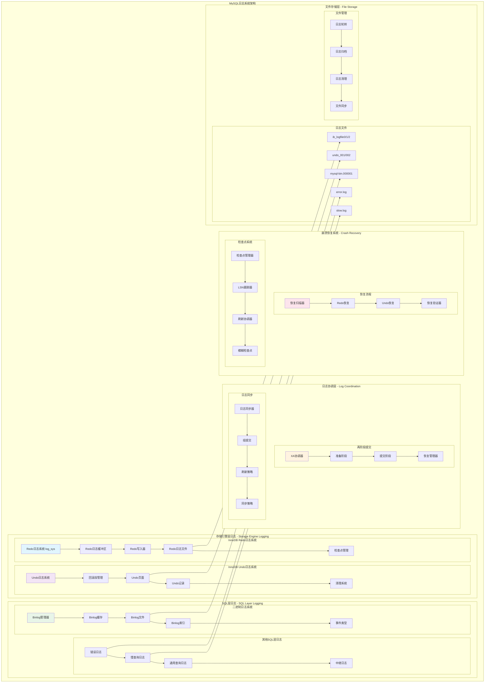
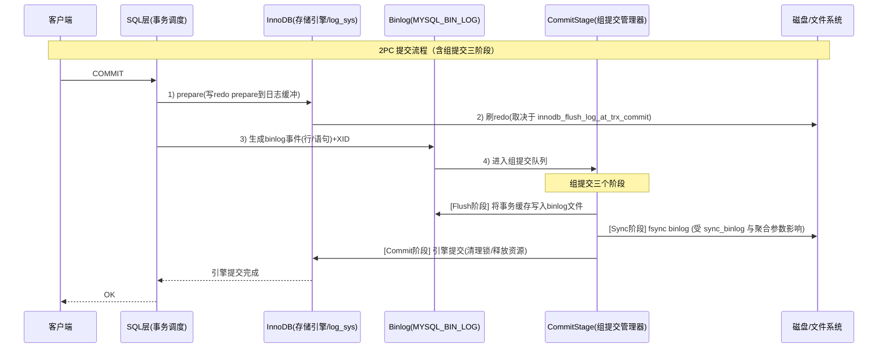
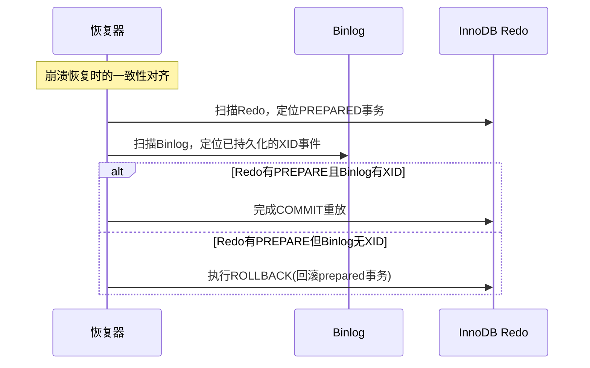
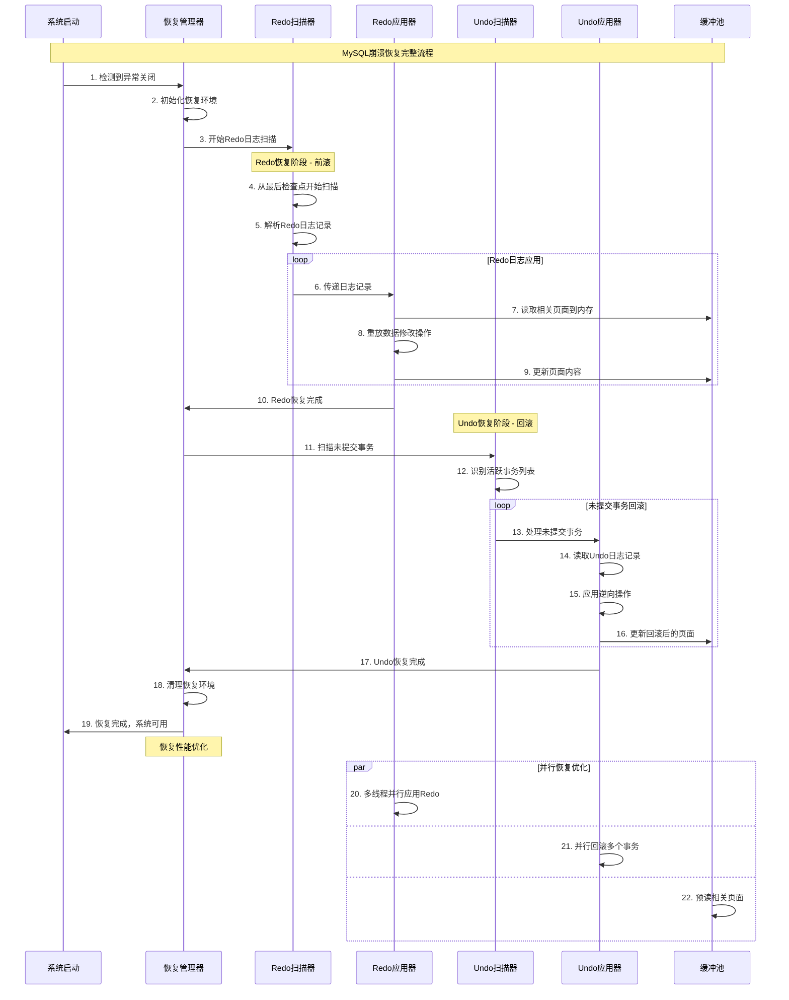
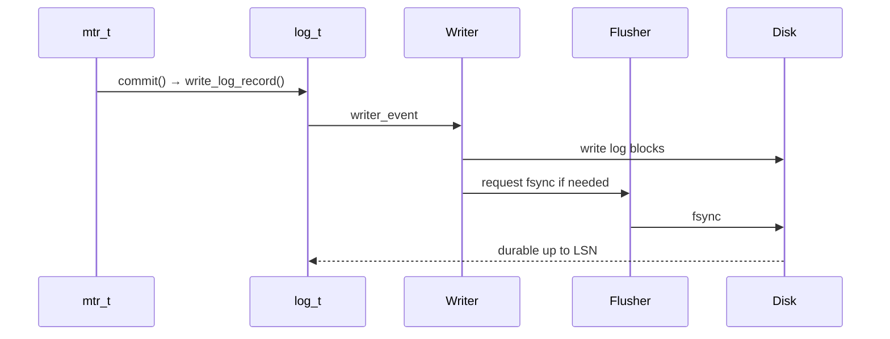
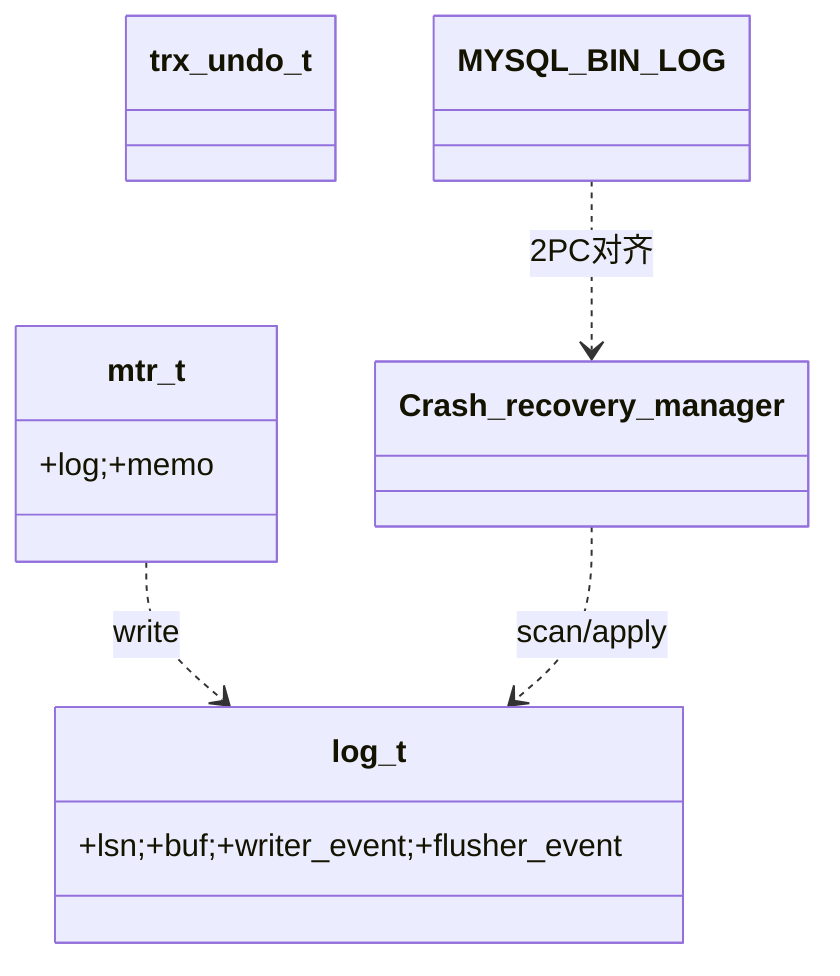

## 概述

MySQL日志系统是保证数据库ACID特性的重要基础设施，包含多种类型的日志文件，每种日志都有其特定的作用和实现机制。MySQL日志系统的核心技术实现，揭示其在数据恢复、事务回滚和主从复制中的关键作用。

<!--more-->

## 1. 日志系统整体架构

### 1.1 日志系统设计原则

MySQL日志系统遵循以下核心设计原则：

- **WAL机制**：Write-Ahead Logging，先写日志再写数据
- **分层设计**：不同层次的日志服务不同目的
- **高性能**：通过批量写入和异步刷新优化性能
- **可靠性**：多种机制确保日志的持久性和完整性

### 1.2 日志系统架构图



## 2. Redo Log重做日志系统深度解析

### 2.1 Redo Log核心数据结构

```cpp
/**
 * InnoDB Redo日志系统核心结构
 * 负责记录所有的数据修改操作，用于崩溃恢复
 * 
 * 核心理论：WAL (Write-Ahead Logging) 机制
 */

/**
 * 全局Redo日志系统对象
 * log_sys是InnoDB中唯一的全局日志系统实例
 */
struct log_t {
    // ========== 基础配置信息 ==========
    
    /** 日志文件组目录路径 */
    char *log_group_home_dir;
    
    /** 单个日志文件的大小（字节） */
    ib_uint64_t log_file_size;
    
    /** 日志文件数量 */
    ulint n_log_files;
    
    /** 日志块大小，通常为512字节 */
    ulint log_block_size;
    
    // ========== LSN管理 ==========
    
    /** 当前分配的LSN（Log Sequence Number） */
    std::atomic<lsn_t> lsn;
    
    /** 已写入日志缓冲区的LSN */
    std::atomic<lsn_t> buf_ready_for_write_lsn;
    
    /** 已刷新到磁盘的LSN */
    std::atomic<lsn_t> flushed_to_disk_lsn;
    
    /** 最后检查点的LSN */
    lsn_t last_checkpoint_lsn;
    
    /** 下一个检查点的LSN */
    lsn_t next_checkpoint_lsn;
    
    // ========== 日志缓冲区 ==========
    
    /** 日志缓冲区起始地址 */
    byte *buf;
    
    /** 日志缓冲区大小 */
    ulint buf_size;
    
    /** 缓冲区当前写入位置 */
    std::atomic<ulint> buf_free;
    
    /** 缓冲区下一个读取位置 */
    ulint buf_next_to_write;
    
    // ========== 并发控制 ==========
    
    /** 日志系统互斥锁 */
    LogSysMutex mutex;
    
    /** 写入线程条件变量 */
    os_event_t writer_event;
    
    /** 刷新线程条件变量 */
    os_event_t flusher_event;
    
    /** 检查点线程条件变量 */
    os_event_t checkpointer_event;
    
    // ========== 统计信息 ==========
    
    /** 写入请求次数 */
    std::atomic<ulint> n_log_ios;
    
    /** 等待写入的次数 */
    std::atomic<ulint> n_log_waits;
    
    /** 平均写入时间（微秒） */
    std::atomic<double> avg_write_time;
    
public:
    /**
     * 初始化Redo日志系统
     * @param log_file_size_requested 请求的日志文件大小
     * @param n_log_files_requested 请求的日志文件数量
     * @return 初始化结果
     */
    dberr_t init(ib_uint64_t log_file_size_requested, 
                ulint n_log_files_requested) {
        // 1. 设置日志文件参数
        log_file_size = log_file_size_requested;
        n_log_files = n_log_files_requested;
        log_block_size = OS_FILE_LOG_BLOCK_SIZE;
        
        // 2. 分配日志缓冲区
        buf_size = srv_log_buffer_size;
        buf = static_cast<byte*>(ut_malloc_nokey(buf_size));
        if (buf == nullptr) {
            return DB_OUT_OF_MEMORY;
        }
        
        // 初始化缓冲区
        memset(buf, 0, buf_size);
        buf_free.store(LOG_BUF_WRITE_MARGIN);
        buf_next_to_write = 0;
        
        // 3. 初始化LSN
        lsn.store(LOG_START_LSN);
        buf_ready_for_write_lsn.store(LOG_START_LSN);
        flushed_to_disk_lsn.store(LOG_START_LSN);
        last_checkpoint_lsn = LOG_START_LSN;
        next_checkpoint_lsn = LOG_START_LSN;
        
        // 4. 初始化同步原语
        mutex_create(LATCH_ID_LOG_SYS, &mutex);
        writer_event = os_event_create("log_writer");
        flusher_event = os_event_create("log_flusher");
        checkpointer_event = os_event_create("log_checkpointer");
        
        // 5. 重置统计信息
        n_log_ios.store(0);
        n_log_waits.store(0);
        avg_write_time.store(0.0);
        
        LogInfo(LOG_SUBSYS, "Redo log system initialized: file_size=%llu, files=%lu, buffer_size=%lu",
               log_file_size, n_log_files, buf_size);
        
        return DB_SUCCESS;
    }
    
    /**
     * 向日志缓冲区写入日志记录
     * 这是WAL机制的核心实现函数
     * @param type 日志记录类型
     * @param space_id 表空间ID
     * @param page_no 页面编号
     * @param log_data 日志数据
     * @param data_len 数据长度
     * @return 分配的LSN
     */
    lsn_t write_log_record(mlog_id_t type, space_id_t space_id, page_no_t page_no,
                          const byte *log_data, ulint data_len) {
        // 1. 计算日志记录总长度
        ulint total_len = calculate_log_record_size(type, space_id, page_no, data_len);
        
        // 2. 在日志缓冲区中预留空间
        mutex_enter(&mutex);
        
        // 检查缓冲区空间
        while (buf_free.load() + total_len > buf_size - LOG_BUF_FLUSH_MARGIN) {
            // 缓冲区空间不足，等待日志写入线程刷新
            mutex_exit(&mutex);
            
            // 唤醒写入线程
            os_event_set(writer_event);
            
            // 等待空间释放
            os_thread_sleep(1000); // 1ms
            
            mutex_enter(&mutex);
            n_log_waits.fetch_add(1);
        }
        
        // 3. 分配LSN
        lsn_t start_lsn = lsn.fetch_add(total_len);
        
        // 4. 写入日志记录到缓冲区
        ulint buf_offset = buf_free.load();
        byte *log_ptr = buf + buf_offset;
        
        // 写入日志记录头
        mach_write_to_1(log_ptr, type);
        log_ptr += 1;
        
        if (type != MLOG_SINGLE_REC_FLAG) {
            // 写入空间ID（压缩编码）
            log_ptr += mach_write_compressed(log_ptr, space_id);
            
            // 写入页面编号（压缩编码）
            log_ptr += mach_write_compressed(log_ptr, page_no);
        }
        
        // 写入数据长度（如果需要）
        if (data_len > 0) {
            log_ptr += mach_write_compressed(log_ptr, data_len);
            
            // 写入实际数据
            memcpy(log_ptr, log_data, data_len);
            log_ptr += data_len;
        }
        
        // 5. 更新缓冲区位置
        buf_free.store(buf_offset + total_len);
        
        // 6. 设置准备写入的LSN
        buf_ready_for_write_lsn.store(start_lsn + total_len);
        
        mutex_exit(&mutex);
        
        // 7. 如果满足条件，立即唤醒写入线程
        if (should_flush_immediately(total_len)) {
            os_event_set(writer_event);
        }
        
        LogDebug(LOG_SUBSYS, "Wrote log record type=%d, space=%lu, page=%lu, len=%lu, lsn=%llu",
                type, space_id, page_no, data_len, start_lsn);
        
        return start_lsn;
    }
    
    /**
     * 日志写入线程主函数
     * 负责将日志缓冲区的内容写入到日志文件
     */
    void log_writer_thread() {
        LogInfo(LOG_SUBSYS, "Log writer thread started");
        
        while (!srv_shutdown_state.is_set()) {
            // 1. 等待写入事件
            os_event_wait_time(writer_event, 100000); // 100ms超时
            os_event_reset(writer_event);
            
            // 2. 检查是否有数据需要写入
            mutex_enter(&mutex);
            
            ulint write_len = buf_free.load() - buf_next_to_write;
            if (write_len == 0) {
                mutex_exit(&mutex);
                continue;
            }
            
            // 3. 准备写入数据
            byte *write_buf = buf + buf_next_to_write;
            lsn_t write_lsn = buf_ready_for_write_lsn.load();
            
            mutex_exit(&mutex);
            
            // 4. 写入日志文件
            dberr_t err = write_to_log_files(write_buf, write_len, write_lsn);
            if (err != DB_SUCCESS) {
                LogErr(ERROR_LEVEL, ER_INNODB_LOG_WRITE_FAILED, err);
                continue;
            }
            
            // 5. 更新写入位置
            mutex_enter(&mutex);
            buf_next_to_write += write_len;
            
            // 如果缓冲区写满，重置到开头（环形缓冲区）
            if (buf_next_to_write >= buf_size - LOG_BUF_WRITE_MARGIN) {
                buf_next_to_write = 0;
                buf_free.store(LOG_BUF_WRITE_MARGIN);
            }
            
            mutex_exit(&mutex);
            
            // 6. 更新统计信息
            n_log_ios.fetch_add(1);
            
            // 7. 检查是否需要刷新到磁盘
            if (should_sync_to_disk(write_lsn)) {
                os_event_set(flusher_event);
            }
        }
        
        LogInfo(LOG_SUBSYS, "Log writer thread stopped");
    }
    
    /**
     * 日志刷新线程主函数
     * 负责将写入的日志数据同步到磁盘
     */
    void log_flusher_thread() {
        LogInfo(LOG_SUBSYS, "Log flusher thread started");
        
        while (!srv_shutdown_state.is_set()) {
            // 1. 等待刷新事件
            os_event_wait_time(flusher_event, 1000000); // 1s超时
            os_event_reset(flusher_event);
            
            // 2. 获取当前需要刷新的LSN
            lsn_t flush_up_to_lsn = buf_ready_for_write_lsn.load();
            lsn_t flushed_lsn = flushed_to_disk_lsn.load();
            
            if (flush_up_to_lsn <= flushed_lsn) {
                continue; // 没有新数据需要刷新
            }
            
            // 3. 执行fsync同步到磁盘
            auto start_time = std::chrono::high_resolution_clock::now();
            
            dberr_t err = sync_log_files_to_disk(flush_up_to_lsn);
            
            auto end_time = std::chrono::high_resolution_clock::now();
            auto duration = std::chrono::duration_cast<std::chrono::microseconds>(
                end_time - start_time).count();
            
            if (err == DB_SUCCESS) {
                // 4. 更新已刷新LSN
                flushed_to_disk_lsn.store(flush_up_to_lsn);
                
                // 5. 更新平均写入时间
                double current_avg = avg_write_time.load();
                double new_avg = current_avg * 0.9 + duration * 0.1;
                avg_write_time.store(new_avg);
                
                LogDebug(LOG_SUBSYS, "Synced log to disk up to LSN %llu, took %ld us",
                        flush_up_to_lsn, duration);
            } else {
                LogErr(ERROR_LEVEL, ER_INNODB_LOG_SYNC_FAILED, err);
            }
            
            // 6. 唤醒等待同步的事务
            wake_up_waiting_transactions(flush_up_to_lsn);
        }
        
        LogInfo(LOG_SUBSYS, "Log flusher thread stopped");
    }
    
    /**
     * 等待指定LSN刷新到磁盘
     * 事务在提交时需要等待其日志记录持久化
     * @param lsn 要等待的LSN
     * @param timeout_ms 超时时间（毫秒）
     * @return true表示成功，false表示超时
     */
    bool wait_for_lsn_flushed(lsn_t lsn, ulint timeout_ms = 0) {
        auto start_time = std::chrono::steady_clock::now();
        
        while (flushed_to_disk_lsn.load() < lsn) {
            // 检查超时
            if (timeout_ms > 0) {
                auto now = std::chrono::steady_clock::now();
                auto elapsed = std::chrono::duration_cast<std::chrono::milliseconds>(
                    now - start_time).count();
                
                if (elapsed >= timeout_ms) {
                    LogWarning(LOG_SUBSYS, "Wait for LSN %llu flushed timeout after %lu ms",
                              lsn, timeout_ms);
                    return false;
                }
            }
            
            // 唤醒刷新线程
            os_event_set(flusher_event);
            
            // 短暂休眠
            os_thread_sleep(1000); // 1ms
        }
        
        return true;
    }
    
    /**
     * 执行检查点操作
     * 将所有脏页刷新到磁盘，并记录检查点LSN
     * @param sync 是否同步等待完成
     * @return 操作结果
     */
    dberr_t make_checkpoint(bool sync = true) {
        LogInfo(LOG_SUBSYS, "Starting checkpoint at LSN %llu", lsn.load());
        
        // 1. 获取当前LSN作为检查点LSN
        lsn_t checkpoint_lsn = lsn.load();
        
        // 2. 刷新所有脏页到磁盘
        dberr_t err = buf_flush_lists(checkpoint_lsn, sync);
        if (err != DB_SUCCESS) {
            LogErr(ERROR_LEVEL, ER_INNODB_CHECKPOINT_FAILED, err);
            return err;
        }
        
        // 3. 等待所有脏页刷新完成
        if (sync) {
            buf_flush_wait_flushed(checkpoint_lsn);
        }
        
        // 4. 写入检查点记录到日志
        err = write_checkpoint_record(checkpoint_lsn);
        if (err != DB_SUCCESS) {
            return err;
        }
        
        // 5. 更新检查点LSN
        last_checkpoint_lsn = checkpoint_lsn;
        next_checkpoint_lsn = checkpoint_lsn + srv_log_checkpoint_every;
        
        LogInfo(LOG_SUBSYS, "Checkpoint completed at LSN %llu", checkpoint_lsn);
        
        return DB_SUCCESS;
    }
    
private:
    /**
     * 计算日志记录大小
     */
    ulint calculate_log_record_size(mlog_id_t type, space_id_t space_id, 
                                   page_no_t page_no, ulint data_len) {
        ulint size = 1; // 类型字节
        
        if (type != MLOG_SINGLE_REC_FLAG) {
            size += mach_get_compressed_size(space_id);
            size += mach_get_compressed_size(page_no);
        }
        
        if (data_len > 0) {
            size += mach_get_compressed_size(data_len);
            size += data_len;
        }
        
        return size;
    }
    
    /**
     * 判断是否应该立即刷新
     */
    bool should_flush_immediately(ulint log_len) {
        // 如果是大事务或缓冲区使用率高，立即刷新
        return log_len > LOG_BUF_WRITE_MARGIN / 2 ||
               buf_free.load() > buf_size * 0.8;
    }
    
    /**
     * 写入数据到日志文件
     */
    dberr_t write_to_log_files(const byte *buffer, ulint len, lsn_t lsn) {
        // 计算写入的文件编号和偏移量
        ib_uint64_t offset = (lsn - LOG_START_LSN) % (log_file_size * n_log_files);
        ulint file_no = offset / log_file_size;
        ulint file_offset = offset % log_file_size;
        
        // 构造文件名
        char log_file_name[FN_REFLEN];
        snprintf(log_file_name, sizeof(log_file_name), "%s/ib_logfile%lu",
                log_group_home_dir, file_no);
        
        // 执行文件写入
        return fil_io(OS_FILE_WRITE, true, page_id_t(SRV_LOG_SPACE_FIRST_ID, 0),
                     univ_page_size, file_offset, len, 
                     const_cast<byte*>(buffer), nullptr);
    }
    
    /**
     * 同步日志文件到磁盘
     */
    dberr_t sync_log_files_to_disk(lsn_t lsn) {
        // 对所有日志文件执行fsync
        for (ulint i = 0; i < n_log_files; ++i) {
            char log_file_name[FN_REFLEN];
            snprintf(log_file_name, sizeof(log_file_name), "%s/ib_logfile%lu",
                    log_group_home_dir, i);
            
            dberr_t err = os_file_fsync_posix(log_file_name);
            if (err != DB_SUCCESS) {
                return err;
            }
        }
        
        return DB_SUCCESS;
    }
    
    /**
     * 唤醒等待日志同步的事务
     */
    void wake_up_waiting_transactions(lsn_t flushed_lsn) {
        // 遍历等待列表，唤醒满足条件的事务
        // 具体实现需要维护等待事务列表...
    }
};

/** 全局日志系统实例 */
extern log_t *log_sys;
```

### 2.2 Mini-Transaction (MTR) 实现

```cpp
/**
 * Mini-Transaction：InnoDB的原子操作单元
 * 确保对页面的修改要么全部成功，要么全部失败
 * 

 */
class mtr_t {
private:
    /** MTR状态 */
    mtr_state_t m_state;
    
    /** 日志记录列表 */
    mtr_buf_t m_log;
    
    /** 修改的页面列表 */
    mtr_buf_t m_memo;
    
    /** 分配的LSN范围 */
    lsn_t m_start_lsn;
    lsn_t m_end_lsn;
    
    /** MTR标志 */
    ulint m_log_mode;
    
    /** 内存堆（用于临时分配） */
    mem_heap_t *m_heap;
    
public:
    /**
     * 构造函数：初始化MTR
     */
    mtr_t() : m_state(MTR_STATE_INIT), m_start_lsn(0), m_end_lsn(0),
             m_log_mode(MTR_LOG_ALL), m_heap(nullptr) {
        dyn_array_create(&m_log);
        dyn_array_create(&m_memo);
    }
    
    /**
     * 析构函数：确保MTR已提交
     */
    ~mtr_t() {
        ut_ad(m_state == MTR_STATE_COMMITTED || m_state == MTR_STATE_INIT);
        
        if (m_heap != nullptr) {
            mem_heap_free(m_heap);
        }
        
        dyn_array_free(&m_log);
        dyn_array_free(&m_memo);
    }
    
    /**
     * 开始MTR
     */
    void start() {
        ut_ad(m_state == MTR_STATE_INIT);
        
        m_state = MTR_STATE_ACTIVE;
        m_start_lsn = 0;
        m_end_lsn = 0;
        
        // 清空日志和备忘录
        dyn_array_close(&m_log);
        dyn_array_close(&m_memo);
        
        LogDebug(MTR_LOG, "MTR started");
    }
    
    /**
     * 提交MTR
     * 将所有日志记录写入日志缓冲区，并释放页面锁
     */
    void commit() {
        ut_ad(m_state == MTR_STATE_ACTIVE);
        
        LogDebug(MTR_LOG, "Committing MTR with %lu log records",
                dyn_array_get_data_size(&m_log));
        
        // 1. 如果有日志记录，写入日志系统
        if (dyn_array_get_data_size(&m_log) > 0) {
            commit_log_records();
        }
        
        // 2. 释放所有页面锁
        release_all_page_latches();
        
        // 3. 更新MTR状态
        m_state = MTR_STATE_COMMITTED;
        
        LogDebug(MTR_LOG, "MTR committed, LSN range [%llu, %llu]",
                m_start_lsn, m_end_lsn);
    }
    
    /**
     * 写入日志记录到MTR
     * @param type 日志类型
     * @param space_id 表空间ID
     * @param page_no 页面编号
     * @param log_data 日志数据
     * @param len 数据长度
     */
    void log_write(mlog_id_t type, space_id_t space_id, page_no_t page_no,
                  const byte *log_data, ulint len) {
        ut_ad(m_state == MTR_STATE_ACTIVE);
        
        // 1. 计算日志记录大小
        ulint total_len = 1; // 类型字节
        
        if (type != MLOG_SINGLE_REC_FLAG) {
            total_len += mach_get_compressed_size(space_id);
            total_len += mach_get_compressed_size(page_no);
        }
        
        if (len > 0) {
            total_len += mach_get_compressed_size(len);
            total_len += len;
        }
        
        // 2. 在MTR日志缓冲区中分配空间
        byte *log_ptr = static_cast<byte*>(dyn_array_push(&m_log, total_len));
        
        // 3. 写入日志记录
        mach_write_to_1(log_ptr, type);
        log_ptr += 1;
        
        if (type != MLOG_SINGLE_REC_FLAG) {
            log_ptr += mach_write_compressed(log_ptr, space_id);
            log_ptr += mach_write_compressed(log_ptr, page_no);
        }
        
        if (len > 0) {
            log_ptr += mach_write_compressed(log_ptr, len);
            memcpy(log_ptr, log_data, len);
        }
        
        LogDebug(MTR_LOG, "Added log record type=%d, space=%lu, page=%lu to MTR",
                type, space_id, page_no);
    }
    
    /**
     * 添加页面到MTR备忘录
     * 记录对页面的锁定，在MTR提交时释放
     * @param block 页面块
     * @param type 锁定类型
     */
    void memo_push(buf_block_t *block, mtr_memo_type_t type) {
        ut_ad(m_state == MTR_STATE_ACTIVE);
        
        // 在备忘录中记录页面和锁定类型
        mtr_memo_slot_t *slot = static_cast<mtr_memo_slot_t*>(
            dyn_array_push(&m_memo, sizeof(mtr_memo_slot_t)));
        
        slot->object = block;
        slot->type = type;
        
        LogDebug(MTR_LOG, "Added page %lu:%lu to MTR memo with type %d",
                block->page.id.space(), block->page.id.page_no(), type);
    }
    
    /**
     * 获取MTR的内存堆
     * @return 内存堆指针
     */
    mem_heap_t* get_heap() {
        if (m_heap == nullptr) {
            m_heap = mem_heap_create(1024);
        }
        return m_heap;
    }
    
private:
    /**
     * 提交日志记录到全局日志系统
     */
    void commit_log_records() {
        if (m_log_mode == MTR_LOG_NONE) {
            return; // 不记录日志
        }
        
        // 1. 获取日志数据
        const byte *log_data = dyn_array_get_data_ptr(&m_log, 0);
        ulint log_len = dyn_array_get_data_size(&m_log);
        
        // 2. 写入到全局日志系统
        m_start_lsn = log_sys->write_log_record(MLOG_MULTI_REC_END, 0, 0,
                                               log_data, log_len);
        m_end_lsn = m_start_lsn + log_len;
        
        // 3. 在所有修改的页面上设置LSN
        set_lsn_on_modified_pages();
    }
    
    /**
     * 释放所有页面锁
     */
    void release_all_page_latches() {
        mtr_memo_slot_t *slot;
        ulint offset = dyn_array_get_data_size(&m_memo);
        
        // 逆序释放锁（LIFO顺序）
        while (offset > 0) {
            offset -= sizeof(mtr_memo_slot_t);
            slot = dyn_array_get_element(&m_memo, offset);
            
            switch (slot->type) {
                case MTR_MEMO_PAGE_S_FIX:
                    // 释放共享锁
                    rw_lock_s_unlock(&static_cast<buf_block_t*>(slot->object)->lock);
                    break;
                    
                case MTR_MEMO_PAGE_X_FIX:
                    // 释放排他锁
                    rw_lock_x_unlock(&static_cast<buf_block_t*>(slot->object)->lock);
                    break;
                    
                case MTR_MEMO_BUF_FIX:
                    // 减少缓冲区固定计数
                    buf_block_unfix(static_cast<buf_block_t*>(slot->object));
                    break;
                    
                default:
                    ut_error; // 未知类型
            }
        }
    }
    
    /**
     * 在修改的页面上设置LSN
     */
    void set_lsn_on_modified_pages() {
        mtr_memo_slot_t *slot;
        ulint offset = 0;
        
        while (offset < dyn_array_get_data_size(&m_memo)) {
            slot = dyn_array_get_element(&m_memo, offset);
            offset += sizeof(mtr_memo_slot_t);
            
            if (slot->type == MTR_MEMO_PAGE_X_FIX) {
                // 只有排他锁定的页面才会被修改
                buf_block_t *block = static_cast<buf_block_t*>(slot->object);
                
                // 设置页面LSN
                mach_write_to_8(block->frame + FIL_PAGE_LSN, m_end_lsn);
                
                // 标记页面为脏页
                buf_flush_set_dirty(block, m_end_lsn);
                
                LogDebug(MTR_LOG, "Set LSN %llu on modified page %lu:%lu",
                        m_end_lsn, block->page.id.space(), block->page.id.page_no());
            }
        }
    }
    
    /**
     * 写入检查点记录
     */
    dberr_t write_checkpoint_record(lsn_t checkpoint_lsn) {
        // 构造检查点日志记录
        byte checkpoint_buf[SIZE_OF_MLOG_CHECKPOINT];
        
        mach_write_to_1(checkpoint_buf, MLOG_CHECKPOINT);
        mach_write_to_8(checkpoint_buf + 1, checkpoint_lsn);
        
        // 写入到日志缓冲区
        log_sys->write_log_record(MLOG_CHECKPOINT, 0, 0,
                                checkpoint_buf, sizeof(checkpoint_buf));
        
        return DB_SUCCESS;
    }
};
```

## 3. Undo Log回滚日志系统深度解析

### 3.1 Undo Log核心实现

```cpp
/**
 * InnoDB Undo日志系统
 * 负责事务回滚和MVCC的历史版本管理
 * 
 * 参考《MySQL InnoDB Undo日志机制深度解析》
 */

/**
 * Undo日志段结构
 * 每个事务使用一个或多个Undo段来记录回滚信息
 */
struct trx_undo_t {
    // ========== 基础信息 ==========
    
    /** Undo段ID */
    ulint id;
    
    /** Undo类型：TRX_UNDO_INSERT或TRX_UNDO_UPDATE */
    ulint type;
    
    /** Undo段状态 */
    ulint state;
    
    /** Undo段大小（页面数） */
    ulint size;
    
    // ========== 页面管理 ==========
    
    /** Undo段头页面编号 */
    page_no_t hdr_page_no;
    
    /** Undo段头页面内偏移 */
    ulint hdr_offset;
    
    /** 最后一个Undo页面编号 */
    page_no_t last_page_no;
    
    /** 最后页面的下一个可用偏移 */
    ulint top_offset;
    
    // ========== 事务信息 ==========
    
    /** 拥有此Undo段的事务ID */
    trx_id_t trx_id;
    
    /** XA事务ID（如果是XA事务） */
    XID *xid;
    
    /** 所属的回滚段 */
    trx_rseg_t *rseg;
    
    // ========== 链表管理 ==========
    
    /** 在回滚段中的链表节点 */
    UT_LIST_NODE_T(trx_undo_t) undo_list;
    
    /** 在历史链表中的节点（已提交事务） */
    UT_LIST_NODE_T(trx_undo_t) history_list;
    
public:
    /**
     * 创建新的Undo段
     * @param trx 事务对象
     * @param rseg 回滚段
     * @param type Undo类型
     * @param mtr 迷你事务
     * @return 新创建的Undo段
     */
    static trx_undo_t* create_undo_segment(trx_t *trx, trx_rseg_t *rseg,
                                         ulint type, mtr_t *mtr) {
        // 1. 分配Undo段对象
        trx_undo_t *undo = static_cast<trx_undo_t*>(
            mem_heap_alloc(trx->lock.lock_heap, sizeof(trx_undo_t)));
        
        // 2. 分配Undo头页面
        buf_block_t *block = trx_undo_seg_create(rseg, type, mtr);
        if (block == nullptr) {
            return nullptr;
        }
        
        // 3. 初始化Undo段
        undo->id = get_next_undo_segment_id(rseg);
        undo->type = type;
        undo->state = TRX_UNDO_ACTIVE;
        undo->size = 1; // 初始只有头页面
        
        undo->hdr_page_no = block->page.id.page_no();
        undo->hdr_offset = TRX_UNDO_SEG_HDR;
        undo->last_page_no = undo->hdr_page_no;
        undo->top_offset = TRX_UNDO_PAGE_HDR + TRX_UNDO_PAGE_HDR_SIZE;
        
        undo->trx_id = trx->id;
        undo->xid = trx->xid;
        undo->rseg = rseg;
        
        // 4. 加入回滚段的Undo链表
        if (type == TRX_UNDO_INSERT) {
            UT_LIST_ADD_LAST(rseg->insert_undo_list, undo);
        } else {
            UT_LIST_ADD_LAST(rseg->update_undo_list, undo);
        }
        
        LogDebug(UNDO_LOG, "Created undo segment %lu for trx %lu, type=%s",
                undo->id, trx->id, type == TRX_UNDO_INSERT ? "INSERT" : "UPDATE");
        
        return undo;
    }
    
    /**
     * 在Undo段中写入Undo记录
     * @param trx 事务对象
     * @param undo_data Undo记录数据
     * @param undo_len 记录长度
     * @param mtr 迷你事务
     * @return 回滚指针
     */
    roll_ptr_t write_undo_record(trx_t *trx, const byte *undo_data, 
                                ulint undo_len, mtr_t *mtr) {
        // 1. 获取最后一个Undo页面
        buf_block_t *undo_block = buf_page_get(page_id_t(rseg->space, last_page_no),
                                             univ_page_size, RW_X_LATCH, mtr);
        
        page_t *undo_page = buf_block_get_frame(undo_block);
        
        // 2. 检查页面空间是否足够
        ulint free_space = TRX_UNDO_PAGE_HDR + TRX_UNDO_PAGE_HDR_SIZE;
        ulint used_space = mach_read_from_2(undo_page + TRX_UNDO_PAGE_HDR + TRX_UNDO_PAGE_FREE);
        
        if (used_space + undo_len + 10 > UNIV_PAGE_SIZE - 100) {
            // 当前页面空间不足，分配新页面
            dberr_t err = add_undo_page(mtr);
            if (err != DB_SUCCESS) {
                return 0;
            }
            
            // 重新获取最新的Undo页面
            undo_block = buf_page_get(page_id_t(rseg->space, last_page_no),
                                    univ_page_size, RW_X_LATCH, mtr);
            undo_page = buf_block_get_frame(undo_block);
            used_space = TRX_UNDO_PAGE_HDR + TRX_UNDO_PAGE_HDR_SIZE;
        }
        
        // 3. 写入Undo记录到页面
        byte *undo_rec_ptr = undo_page + used_space;
        memcpy(undo_rec_ptr, undo_data, undo_len);
        
        // 4. 更新页面头信息
        mach_write_to_2(undo_page + TRX_UNDO_PAGE_HDR + TRX_UNDO_PAGE_FREE,
                       used_space + undo_len);
        
        // 5. 生成回滚指针
        roll_ptr_t roll_ptr = trx_undo_build_roll_ptr(
            type == TRX_UNDO_INSERT,    // is_insert
            rseg->id,                   // 回滚段ID
            last_page_no,               // 页面编号
            used_space                  // 页面内偏移
        );
        
        // 6. 更新Undo段信息
        top_offset = used_space + undo_len;
        
        LogDebug(UNDO_LOG, "Wrote undo record len=%lu to segment %lu, roll_ptr=%llu",
                undo_len, id, roll_ptr);
        
        return roll_ptr;
    }
    
    /**
     * 应用Undo记录进行事务回滚
     * @param undo_rec Undo记录指针
     * @param trx 事务对象
     * @param mtr 迷你事务
     * @return 操作结果
     */
    dberr_t apply_undo_record(const byte *undo_rec, trx_t *trx, mtr_t *mtr) {
        // 1. 解析Undo记录类型
        ulint type_cmpl = mach_read_from_1(undo_rec);
        ulint type = type_cmpl & (TRX_UNDO_CMPL_INFO_MULT - 1);
        
        switch (type) {
            case TRX_UNDO_INSERT_REC:
                return apply_insert_undo_record(undo_rec, trx, mtr);
                
            case TRX_UNDO_UPD_EXIST_REC:
                return apply_update_undo_record(undo_rec, trx, mtr);
                
            case TRX_UNDO_UPD_DEL_REC:
                return apply_delete_undo_record(undo_rec, trx, mtr);
                
            case TRX_UNDO_DEL_MARK_REC:
                return apply_delete_mark_undo_record(undo_rec, trx, mtr);
                
            default:
                LogErr(ERROR_LEVEL, ER_INNODB_UNDO_RECORD_CORRUPTED, type);
                return DB_CORRUPTION;
        }
    }
    
    /**
     * 清理已提交事务的Undo段
     * Purge线程调用此函数清理不再需要的Undo记录
     */
    void purge_committed_undo_logs() {
        if (state != TRX_UNDO_COMMITTED) {
            return; // 只清理已提交的Undo段
        }
        
        LogDebug(PURGE_LOG, "Purging committed undo segment %lu for trx %lu",
                id, trx_id);
        
        // 1. 从历史链表移除
        UT_LIST_REMOVE(rseg->history_list, this);
        
        // 2. 释放所有Undo页面
        for (ulint i = 0; i < size; ++i) {
            page_no_t page_no = get_nth_undo_page_no(i);
            trx_undo_free_page(rseg, true, page_no, nullptr);
        }
        
        // 3. 释放Undo段头
        trx_undo_seg_free(this);
        
        LogDebug(PURGE_LOG, "Purged undo segment %lu, freed %lu pages",
                id, size);
    }
    
private:
    /**
     * 添加新的Undo页面
     */
    dberr_t add_undo_page(mtr_t *mtr) {
        // 分配新页面
        buf_block_t *new_block = trx_undo_add_page(this, mtr);
        if (new_block == nullptr) {
            return DB_OUT_OF_FILE_SPACE;
        }
        
        // 更新段信息
        last_page_no = new_block->page.id.page_no();
        top_offset = TRX_UNDO_PAGE_HDR + TRX_UNDO_PAGE_HDR_SIZE;
        size++;
        
        return DB_SUCCESS;
    }
    
    /**
     * 应用插入Undo记录
     */
    dberr_t apply_insert_undo_record(const byte *undo_rec, trx_t *trx, mtr_t *mtr) {
        // 解析Undo记录，获取要删除的记录位置
        space_id_t space_id;
        page_no_t page_no;
        ulint offset;
        
        parse_insert_undo_record(undo_rec, &space_id, &page_no, &offset);
        
        // 删除对应的记录（插入的逆操作）
        return delete_record_by_position(space_id, page_no, offset, mtr);
    }
    
    /**
     * 应用更新Undo记录
     */
    dberr_t apply_update_undo_record(const byte *undo_rec, trx_t *trx, mtr_t *mtr) {
        // 解析Undo记录，恢复记录的旧值
        upd_t *update = parse_update_undo_record(undo_rec);
        
        // 应用逆向更新
        return apply_reverse_update(update, mtr);
    }
};

/**
 * 回滚段管理器
 * 管理多个Undo段的分配和回收
 */
class Rollback_segment_manager {
private:
    /** 回滚段数组 */
    static trx_rseg_t *rollback_segments[TRX_SYS_N_RSEGS];
    
    /** 下一个分配的回滚段索引 */
    static std::atomic<ulint> next_rseg_index;
    
    /** 回滚段初始化标志 */
    static bool initialized;
    
public:
    /**
     * 初始化回滚段系统
     * @param n_rollback_segments 回滚段数量
     * @return 初始化结果
     */
    static dberr_t init(ulint n_rollback_segments) {
        // 1. 清空回滚段数组
        memset(rollback_segments, 0, sizeof(rollback_segments));
        next_rseg_index.store(0);
        
        // 2. 创建回滚段
        for (ulint i = 0; i < n_rollback_segments; ++i) {
            trx_rseg_t *rseg = create_rollback_segment(i);
            if (rseg == nullptr) {
                LogErr(ERROR_LEVEL, ER_INNODB_ROLLBACK_SEGMENT_CREATE_FAILED, i);
                return DB_ERROR;
            }
            rollback_segments[i] = rseg;
        }
        
        initialized = true;
        
        LogInfo(UNDO_LOG, "Initialized %lu rollback segments", n_rollback_segments);
        return DB_SUCCESS;
    }
    
    /**
     * 为事务分配回滚段
     * 使用轮询策略在多个回滚段间分配
     * @param trx 事务对象
     * @return 分配的回滚段
     */
    static trx_rseg_t* assign_rollback_segment(trx_t *trx) {
        // 轮询选择回滚段，避免热点
        ulint rseg_id = next_rseg_index.fetch_add(1) % TRX_SYS_N_RSEGS;
        
        trx_rseg_t *rseg = rollback_segments[rseg_id];
        
        if (rseg == nullptr || rseg->skip_allocation) {
            // 回滚段不可用，使用默认回滚段
            rseg = rollback_segments[0];
        }
        
        LogDebug(UNDO_LOG, "Assigned rollback segment %lu to transaction %lu",
                rseg_id, trx->id);
        
        return rseg;
    }
    
    /**
     * 清理过期的Undo段
     * Purge线程定期调用此函数清理已提交事务的Undo数据
     * @param oldest_view 最老的活跃ReadView
     * @return 清理的Undo段数量
     */
    static ulint purge_expired_undo_logs(const ReadView *oldest_view) {
        ulint purged_count = 0;
        
        // 遍历所有回滚段
        for (ulint i = 0; i < TRX_SYS_N_RSEGS; ++i) {
            trx_rseg_t *rseg = rollback_segments[i];
            if (rseg == nullptr) continue;
            
            mutex_enter(&rseg->mutex);
            
            // 清理历史链表中的过期Undo段
            trx_undo_t *undo = UT_LIST_GET_LAST(rseg->history_list);
            while (undo != nullptr) {
                trx_undo_t *prev_undo = UT_LIST_GET_PREV(history_list, undo);
                
                // 检查是否可以清理（没有ReadView需要此版本）
                if (undo->trx_id < oldest_view->get_up_limit_id()) {
                    undo->purge_committed_undo_logs();
                    purged_count++;
                } else {
                    break; // 后续的Undo段更新，无需继续检查
                }
                
                undo = prev_undo;
            }
            
            mutex_exit(&rseg->mutex);
        }
        
        LogInfo(PURGE_LOG, "Purged %lu expired undo segments", purged_count);
        return purged_count;
    }
    
private:
    /**
     * 创建回滚段
     */
    static trx_rseg_t* create_rollback_segment(ulint rseg_id) {
        // 分配回滚段对象
        trx_rseg_t *rseg = static_cast<trx_rseg_t*>(
            ut_zalloc_nokey(sizeof(trx_rseg_t)));
        
        rseg->id = rseg_id;
        rseg->space = 0; // 系统表空间
        rseg->page_no = trx_rseg_header_create(rseg_id);
        
        if (rseg->page_no == FIL_NULL) {
            ut_free(rseg);
            return nullptr;
        }
        
        // 初始化互斥锁
        mutex_create(LATCH_ID_TRX_RSEG, &rseg->mutex);
        
        // 初始化Undo链表
        UT_LIST_INIT(rseg->insert_undo_list, &trx_undo_t::undo_list);
        UT_LIST_INIT(rseg->update_undo_list, &trx_undo_t::undo_list);
        UT_LIST_INIT(rseg->history_list, &trx_undo_t::history_list);
        
        return rseg;
    }
};
```

## 4. Binary Log二进制日志系统深度解析

### 4.1 Binlog核心实现

```cpp
/**
 * MySQL二进制日志系统
 * 用于主从复制和点时间恢复
 * 
深度文章
 */
class MYSQL_BIN_LOG : public TC_LOG {
private:
    // ========== 文件管理 ==========
    
    /** 当前二进制日志文件句柄 */
    Binlog_ofile *m_binlog_file;
    
    /** 日志文件名模板 */
    char *name;
    
    /** 当前日志文件全路径 */
    char log_file_name[FN_REFLEN];
    
    /** 日志索引文件管理器 */
    Binlog_index *index_file;
    
    // ========== 缓存管理 ==========
    
    /** 事务级别的binlog缓存 */
    binlog_cache_data *stmt_cache;
    
    /** 语句级别的binlog缓存 */
    binlog_cache_data *trx_cache;
    
    // ========== 同步控制 ==========
    
    /** 主binlog互斥锁 */
    mysql_mutex_t LOCK_log;
    
    /** binlog结束位置锁 */
    mysql_mutex_t LOCK_binlog_end_pos;
    
    /** 组提交相关锁 */
    mysql_mutex_t LOCK_commit_queue;
    mysql_mutex_t LOCK_after_commit_queue;
    mysql_mutex_t LOCK_done;
    
    // ========== 组提交管理 ==========
    
    /** 提交阶段管理器 */
    Commit_stage_manager stage_manager;
    
    /** 当前文件大小 */
    std::atomic<my_off_t> bytes_written;
    
    /** 是否启用组提交 */
    bool group_commit_enabled;
    
public:
    /**
     * 构造函数：初始化二进制日志系统
     */
    MYSQL_BIN_LOG() : m_binlog_file(nullptr), name(nullptr),
                     stmt_cache(nullptr), trx_cache(nullptr),
                     group_commit_enabled(true) {
        // 初始化互斥锁
        mysql_mutex_init(key_LOCK_log, &LOCK_log, MY_MUTEX_INIT_SLOW);
        mysql_mutex_init(key_LOCK_binlog_end_pos, &LOCK_binlog_end_pos, MY_MUTEX_INIT_FAST);
        mysql_mutex_init(key_LOCK_commit_queue, &LOCK_commit_queue, MY_MUTEX_INIT_FAST);
        mysql_mutex_init(key_LOCK_after_commit_queue, &LOCK_after_commit_queue, MY_MUTEX_INIT_FAST);
        mysql_mutex_init(key_LOCK_done, &LOCK_done, MY_MUTEX_INIT_FAST);
        
        bytes_written.store(0);
    }
    
    /**
     * 打开二进制日志文件
     * @param log_name 日志文件名前缀
     * @param new_name 新文件名（输出）
     * @return 操作结果
     */
    int open(const char *log_name, const char **new_name) {
        DBUG_TRACE;
        
        // 1. 构造日志文件名
        create_log_file_name(log_file_name, sizeof(log_file_name), 
                           log_name, get_next_log_index());
        
        // 2. 创建并打开日志文件
        m_binlog_file = new Binlog_ofile();
        if (!m_binlog_file->open(log_file_name, 
                                MYF(MY_WME | MY_NABP | MY_WAIT_IF_FULL))) {
            LogErr(ERROR_LEVEL, ER_CANT_OPEN_FILE, log_file_name, errno);
            return 1;
        }
        
        // 3. 写入格式描述事件
        Format_description_log_event format_event;
        if (write_event_to_file(&format_event)) {
            return 1;
        }
        
        // 4. 更新索引文件
        if (index_file->add_log_file_name(log_file_name)) {
            return 1;
        }
        
        // 5. 重置文件大小计数器
        bytes_written.store(format_event.get_event_len());
        
        *new_name = log_file_name;
        
        LogInfo(BINLOG_LOG, "Opened binary log file: %s", log_file_name);
        return 0;
    }
    
    /**
     * 写入事务到二进制日志
     * 实现组提交优化，提高写入性能
     * @param thd 线程句柄
     * @param all 是否为完整事务提交
     * @return 操作结果
     */
    int commit(THD *thd, bool all) override {
        DBUG_TRACE;
        
        // 1. 检查是否需要记录binlog
        if (!should_log_transaction(thd, all)) {
            return 0;
        }
        
        // 2. 准备事务的binlog缓存
        binlog_cache_data *cache_data = get_binlog_cache_data(thd, all);
        if (cache_data->is_empty()) {
            return 0; // 没有需要记录的事件
        }
        
        // 3. 进入组提交流程
        if (group_commit_enabled) {
            return group_commit_transaction(thd, cache_data, all);
        } else {
            return single_commit_transaction(thd, cache_data, all);
        }
    }
    
    /**
     * 组提交实现：三阶段提交优化
     * FLUSH阶段 -> SYNC阶段 -> COMMIT阶段
     * @param thd 线程句柄
     * @param cache_data binlog缓存
     * @param all 是否完整提交
     * @return 操作结果
     */
    int group_commit_transaction(THD *thd, binlog_cache_data *cache_data, bool all) {
        // 阶段1：FLUSH - 将事务数据写入binlog文件
        Stage_manager::flush_error_t flush_err = 
            stage_manager.enroll_for(Stage_manager::FLUSH_STAGE, thd, nullptr);
        
        if (flush_err == Stage_manager::FLUSH_ERROR) {
            return 1;
        }
        
        // 作为flush leader，负责刷新所有排队的事务
        if (stage_manager.is_flush_leader(thd)) {
            flush_err = flush_thread_caches_to_file(thd);
        }
        
        // 阶段2：SYNC - 将binlog文件同步到磁盘
        Stage_manager::sync_error_t sync_err =
            stage_manager.enroll_for(Stage_manager::SYNC_STAGE, thd, nullptr);
        
        if (sync_err == Stage_manager::SYNC_ERROR) {
            return 1;
        }
        
        if (stage_manager.is_sync_leader(thd)) {
            sync_err = sync_binlog_file_to_disk();
        }
        
        // 阶段3：COMMIT - 提交存储引擎事务
        Stage_manager::commit_error_t commit_err =
            stage_manager.enroll_for(Stage_manager::COMMIT_STAGE, thd, nullptr);
        
        if (stage_manager.is_commit_leader(thd)) {
            commit_err = commit_storage_engines(thd);
        }
        
        // 等待所有阶段完成
        stage_manager.wait_for_completion(thd);
        
        LogDebug(BINLOG_LOG, "Group commit completed for transaction %lu",
                thd->thread_id());
        
        return (flush_err == Stage_manager::FLUSH_OK &&
                sync_err == Stage_manager::SYNC_OK &&
                commit_err == Stage_manager::COMMIT_OK) ? 0 : 1;
    }
    
    /**
     * 写入单个事件到binlog文件
     * @param event_info 事件信息
     * @return 操作结果
     */
    int write_event_to_binlog(Log_event *event_info) {
        mysql_mutex_lock(&LOCK_log);
        
        // 1. 检查文件大小，是否需要轮转
        if (should_rotate_log()) {
            int err = rotate_log_file();
            if (err) {
                mysql_mutex_unlock(&LOCK_log);
                return err;
            }
        }
        
        // 2. 获取当前文件位置
        my_off_t current_pos = m_binlog_file->position();
        
        // 3. 写入事件到文件
        int err = event_info->write(m_binlog_file);
        if (err) {
            mysql_mutex_unlock(&LOCK_log);
            LogErr(ERROR_LEVEL, ER_ERROR_ON_WRITE, log_file_name, err);
            return err;
        }
        
        // 4. 更新文件大小
        bytes_written.fetch_add(event_info->get_event_len());
        
        // 5. 更新binlog位置
        update_binlog_end_pos(log_file_name, m_binlog_file->position());
        
        mysql_mutex_unlock(&LOCK_log);
        
        LogDebug(BINLOG_LOG, "Wrote event type=%d, size=%lu to binlog at pos=%llu",
                event_info->get_type_code(), event_info->get_event_len(), current_pos);
        
        return 0;
    }
    
    /**
     * 轮转日志文件
     * 当当前文件达到最大大小时创建新文件
     * @return 操作结果
     */
    int rotate_log_file() {
        LogInfo(BINLOG_LOG, "Rotating binary log file from %s", log_file_name);
        
        // 1. 写入轮转事件
        Rotate_log_event rotate_event(log_file_name, 0, 
                                     Rotate_log_event::DUP_NAME);
        int err = write_event_to_file(&rotate_event);
        if (err) return err;
        
        // 2. 关闭当前文件
        if (m_binlog_file) {
            m_binlog_file->close();
            delete m_binlog_file;
        }
        
        // 3. 创建新的日志文件
        create_log_file_name(log_file_name, sizeof(log_file_name),
                           name, get_next_log_index());
        
        m_binlog_file = new Binlog_ofile();
        if (!m_binlog_file->open(log_file_name, 
                                MYF(MY_WME | MY_NABP | MY_WAIT_IF_FULL))) {
            return 1;
        }
        
        // 4. 写入格式描述事件到新文件
        Format_description_log_event format_event;
        err = write_event_to_file(&format_event);
        if (err) return err;
        
        // 5. 更新索引文件
        err = index_file->add_log_file_name(log_file_name);
        if (err) return err;
        
        // 6. 重置文件大小计数器
        bytes_written.store(format_event.get_event_len());
        
        LogInfo(BINLOG_LOG, "Rotated to new binary log file: %s", log_file_name);
        return 0;
    }
    
private:
    /**
     * 检查是否应该轮转日志
     */
    bool should_rotate_log() const {
        return bytes_written.load() >= max_binlog_size;
    }
    
    /**
     * 刷新线程缓存到文件
     */
    Stage_manager::flush_error_t flush_thread_caches_to_file(THD *thd) {
        // 获取flush阶段的所有线程
        std::vector<THD*> flush_queue = stage_manager.get_flush_queue();
        
        for (THD *queue_thd : flush_queue) {
            binlog_cache_data *cache_data = get_binlog_cache_data(queue_thd, true);
            
            if (!cache_data->is_empty()) {
                int err = cache_data->flush_to_file(m_binlog_file);
                if (err) {
                    return Stage_manager::FLUSH_ERROR;
                }
            }
        }
        
        return Stage_manager::FLUSH_OK;
    }
    
    /**
     * 同步binlog文件到磁盘
     */
    Stage_manager::sync_error_t sync_binlog_file_to_disk() {
        if (sync_binlog_period > 0) {
            int err = m_binlog_file->sync();
            if (err) {
                LogErr(ERROR_LEVEL, ER_ERROR_ON_WRITE, log_file_name, err);
                return Stage_manager::SYNC_ERROR;
            }
        }
        
        return Stage_manager::SYNC_OK;
    }
    
    /**
     * 提交存储引擎事务
     */
    Stage_manager::commit_error_t commit_storage_engines(THD *thd) {
        std::vector<THD*> commit_queue = stage_manager.get_commit_queue();
        
        for (THD *queue_thd : commit_queue) {
            // 调用存储引擎的提交接口
            int err = ha_commit_low(queue_thd, true);
            if (err) {
                LogErr(ERROR_LEVEL, ER_ERROR_DURING_COMMIT, err);
                return Stage_manager::COMMIT_ERROR;
            }
        }
        
        return Stage_manager::COMMIT_OK;
    }
};

/**
 * Binlog事件类型管理器
 * 管理不同类型的binlog事件
 */
class Binlog_event_manager {
public:
    /**
     * 创建查询事件
     * @param thd 线程句柄
     * @param query SQL查询字符串
     * @param query_len 查询长度
     * @return 查询事件对象
     */
    static Query_log_event* create_query_event(THD *thd, const char *query,
                                             size_t query_len) {
        // 构造查询事件
        Query_log_event *event = new Query_log_event(
            thd,                        // 线程句柄
            query,                      // SQL语句
            query_len,                  // 语句长度
            false,                      // 不使用缓存
            true,                       // 抑制use语句
            true,                       // 立即刷新
            true                        // 记录GTID
        );
        
        LogDebug(BINLOG_LOG, "Created query event: %.*s", 
                static_cast<int>(std::min(query_len, size_t(100))), query);
        
        return event;
    }
    
    /**
     * 创建行事件（RBR模式）
     * @param thd 线程句柄
     * @param table 表对象
     * @param event_type 事件类型
     * @return 行事件对象
     */
    static Rows_log_event* create_rows_event(THD *thd, TABLE *table,
                                            Log_event_type event_type) {
        Rows_log_event *event = nullptr;
        
        switch (event_type) {
            case WRITE_ROWS_EVENT:
                event = new Write_rows_log_event(thd, table, true, false);
                break;
                
            case UPDATE_ROWS_EVENT:
                event = new Update_rows_log_event(thd, table, true);
                break;
                
            case DELETE_ROWS_EVENT:
                event = new Delete_rows_log_event(thd, table, true);
                break;
                
            default:
                ut_error; // 不支持的事件类型
        }
        
        LogDebug(BINLOG_LOG, "Created rows event type=%d for table %s.%s",
                event_type, table->s->db.str, table->s->table_name.str);
        
        return event;
    }
    
    /**
     * 创建事务开始事件
     * @param thd 线程句柄
     * @return GTID事件对象
     */
    static Gtid_log_event* create_transaction_begin_event(THD *thd) {
        // 生成GTID
        Gtid gtid;
        generate_gtid_for_transaction(thd, &gtid);
        
        // 创建GTID事件
        Gtid_log_event *event = new Gtid_log_event(
            thd->server_id,             // 服务器ID
            true,                       // 是否提交标志
            gtid,                       // GTID
            true,                       // 立即刷新
            0                           // 最后提交时间戳
        );
        
        LogDebug(BINLOG_LOG, "Created GTID event for transaction begin: %s",
                gtid.to_string().c_str());
        
        return event;
    }
};
```

### 4.2 Binlog格式与事件类型

MySQL支持三种 `binlog_format`：

- **STATEMENT**：记录原始SQL；体积小，但依赖上下文，可能受非确定性函数影响。
- **ROW**：记录行级变更（`Table_map` + `Write_rows/Update_rows/Delete_rows`）；最可靠，体积较大，可通过`binlog_row_image`控制列集。
- **MIXED**：自动在`STATEMENT`与`ROW`间切换（例如非确定性或函数副作用时降级为ROW）。

关键事件类型（与源码类名对应）：

- `Query_log_event`（语句事件，`MYSQL_BIN_LOG::write()` 入口之一）
- `Table_map_log_event`（行事件表映射）
- `Write_rows_log_event` / `Update_rows_log_event` / `Delete_rows_log_event`
- `Xid_log_event`（事务提交边界，方便复制与恢复）

常用配置与建议：

- `binlog_format=ROW`，`binlog_row_image=FULL|MINIMAL`（按需求取舍体积与恢复精度）
- `gtid_mode=ON`，`enforce_gtid_consistency=ON` 以提升复制一致性与切换能力
- `binlog_checksum=CRC32` 增强完整性校验

### 4.3 组提交与刷盘参数（性能/一致性权衡）

影响二阶段提交耐久性的核心参数：

- `innodb_flush_log_at_trx_commit`
  - 1：每次提交将Redo写入并`fsync`，最强一致性
  - 2：提交写入缓冲区，后台fsync（断电丢最近事务）
  - 0：提交仅写内存，定时器刷盘（性能最好，一致性最弱）
- `sync_binlog`
  - 1：每次提交`fsync` binlog 文件
  - N>1：聚合N次后`fsync`（掉电丢失最近< N个事务的binlog）
  - 0：依赖OS缓存（风险最大）
- 组提交聚合控制：`binlog_group_commit_sync_delay`（微秒延迟）、`binlog_group_commit_sync_no_delay_count`（聚合条数阈值）
- 其他：`innodb_log_file_size`、`innodb_log_files_in_group`、`innodb_flush_method` 影响吞吐与抖动

推荐组合（单机强一致 vs. 高性能）：

- 强一致：`innodb_flush_log_at_trx_commit=1` + `sync_binlog=1`
- 兼顾性能：`innodb_flush_log_at_trx_commit=1` + `sync_binlog=100`（可承受极端断电影响的最新部分事务）
- 性能优先（测试/报表）：`innodb_flush_log_at_trx_commit=2` + `sync_binlog=0/100`

### 4.4 两阶段提交(2PC)与组提交三阶段时序



关键一致性点：

- Redo prepare 必须先于 binlog 持久化；binlog fsync 成功后再执行引擎 commit，确保崩溃后“要么两者都有，要么两者都无”。
- 组提交通过`Commit_stage_manager`对多个事务进行 Flush/Sync/Commit 分离并并行化，提升吞吐。

### 4.5 2PC崩溃场景与恢复对齐时序



## 5. 崩溃恢复系统深度解析

### 5.1 崩溃恢复流程时序图



### 5.2 崩溃恢复管理器实现

## 附录A：关键函数核心代码与功能说明

- log_t::init/write_log_record/log_writer_thread/log_flusher_thread/make_checkpoint：Redo 管理、写入与刷盘、检查点（见前文实现）。
- mtr_t::start/log_write/commit：MTR 原子单元与日志聚合提交（见前文实现）。
- trx_undo_t::create_undo_segment/write_undo_record/apply_undo_record：Undo 段与记录的写入/回放（见前文实现）。
- MYSQL_BIN_LOG::open/commit/group_commit_transaction/rotate_log_file：Binlog 打开、提交与组提交流程（见前文实现）。
- Crash_recovery_manager::perform_redo_recovery/perform_undo_recovery：崩溃恢复的前滚/回滚（见前文实现）。

## 附录B：统一调用链

- Redo 写入
  - mtr_t::commit() → log_t::write_log_record() → log_writer_thread() → [需要] log_flusher_thread() → flushed_to_disk_lsn
- Undo 写入
  - trx_t::assign_undo_segment() → trx_undo_t::write_undo_record() → 回滚指针写入记录
- Binlog 组提交
  - MYSQL_BIN_LOG::commit() → group_commit_transaction() [Flush→Sync→Commit] → fsync → 引擎提交
- 2PC 对齐
  - 引擎 prepare(redo) → binlog 持久 → 引擎 commit，崩溃后按 Redo/Binlog 对齐恢复
- 崩溃恢复
  - 扫描 Redo（从检查点）→ 应用 Redo → 扫描未提交事务 → 应用 Undo 回滚

## 附录C：关键函数时序图（补充：Redo 写入与刷盘）



## 附录D：关键结构体类结构图与继承关系



```cpp
/**
 * 崩溃恢复管理器
 * 协调整个恢复过程，包括Redo恢复和Undo恢复
 * 

 */
class Crash_recovery_manager {
private:
    /** 恢复起始LSN */
    lsn_t recovery_start_lsn;
    
    /** 恢复结束LSN */
    lsn_t recovery_end_lsn;
    
    /** 已应用的Redo记录数 */
    std::atomic<ulint> redo_records_applied;
    
    /** 需要回滚的事务列表 */
    std::vector<trx_t*> transactions_to_rollback;
    
    /** 恢复线程池 */
    std::vector<std::thread> recovery_threads;
    
public:
    /**
     * 执行完整的崩溃恢复流程
     * @return 恢复结果
     */
    dberr_t perform_crash_recovery() {
        LogInfo(RECOVERY_LOG, "Starting crash recovery");
        
        auto start_time = std::chrono::high_resolution_clock::now();
        
        // 1. 初始化恢复环境
        dberr_t err = init_recovery_environment();
        if (err != DB_SUCCESS) {
            return err;
        }
        
        // 2. 执行Redo恢复（前滚）
        err = perform_redo_recovery();
        if (err != DB_SUCCESS) {
            LogErr(ERROR_LEVEL, ER_INNODB_REDO_RECOVERY_FAILED, err);
            return err;
        }
        
        // 3. 扫描未提交事务
        err = scan_uncommitted_transactions();
        if (err != DB_SUCCESS) {
            return err;
        }
        
        // 4. 执行Undo恢复（回滚）
        err = perform_undo_recovery();
        if (err != DB_SUCCESS) {
            LogErr(ERROR_LEVEL, ER_INNODB_UNDO_RECOVERY_FAILED, err);
            return err;
        }
        
        // 5. 清理恢复环境
        cleanup_recovery_environment();
        
        auto end_time = std::chrono::high_resolution_clock::now();
        auto duration = std::chrono::duration_cast<std::chrono::milliseconds>(
            end_time - start_time).count();
        
        LogInfo(RECOVERY_LOG, "Crash recovery completed in %ld ms, "
                              "applied %lu redo records, rolled back %zu transactions",
                duration, redo_records_applied.load(), transactions_to_rollback.size());
        
        return DB_SUCCESS;
    }
    
    /**
     * 执行Redo日志恢复
     * 重放从最后检查点到崩溃点的所有已提交修改
     * @return 恢复结果
     */
    dberr_t perform_redo_recovery() {
        LogInfo(RECOVERY_LOG, "Starting redo log recovery from LSN %llu",
                recovery_start_lsn);
        
        // 1. 初始化Redo日志扫描器
        Log_recovery_scanner scanner(recovery_start_lsn);
        
        // 2. 创建并行恢复线程
        const ulint n_recovery_threads = std::min(srv_n_purge_threads, 4UL);
        recovery_threads.reserve(n_recovery_threads);
        
        for (ulint i = 0; i < n_recovery_threads; ++i) {
            recovery_threads.emplace_back(&Crash_recovery_manager::redo_worker_thread,
                                        this, i);
        }
        
        // 3. 扫描并分发Redo记录
        Log_record_batch batch;
        while (scanner.scan_next_batch(&batch)) {
            // 分发给工作线程
            distribute_redo_records_to_workers(batch);
        }
        
        // 4. 等待所有工作线程完成
        for (auto &thread : recovery_threads) {
            thread.join();
        }
        recovery_threads.clear();
        
        LogInfo(RECOVERY_LOG, "Redo recovery completed, applied %lu records",
                redo_records_applied.load());
        
        return DB_SUCCESS;
    }
    
    /**
     * 执行Undo恢复
     * 回滚所有未提交的事务
     * @return 恢复结果
     */
    dberr_t perform_undo_recovery() {
        LogInfo(RECOVERY_LOG, "Starting undo recovery for %zu transactions",
                transactions_to_rollback.size());
        
        // 并行回滚多个事务
        std::vector<std::thread> rollback_threads;
        
        for (trx_t *trx : transactions_to_rollback) {
            rollback_threads.emplace_back([trx]() {
                LogDebug(RECOVERY_LOG, "Rolling back transaction %lu", trx->id);
                
                trx->rollback(false); // 完全回滚
                
                LogDebug(RECOVERY_LOG, "Transaction %lu rollback completed", trx->id);
            });
        }
        
        // 等待所有回滚完成
        for (auto &thread : rollback_threads) {
            thread.join();
        }
        
        LogInfo(RECOVERY_LOG, "Undo recovery completed");
        return DB_SUCCESS;
    }
    
private:
    /**
     * Redo恢复工作线程
     */
    void redo_worker_thread(ulint thread_id) {
        LogDebug(RECOVERY_LOG, "Redo recovery worker %lu started", thread_id);
        
        Log_record record;
        while (get_next_redo_record(thread_id, &record)) {
            // 应用Redo记录
            apply_redo_record(&record);
            redo_records_applied.fetch_add(1);
        }
        
        LogDebug(RECOVERY_LOG, "Redo recovery worker %lu completed", thread_id);
    }
    
    /**
     * 应用单个Redo记录
     */
    void apply_redo_record(const Log_record *record) {
        switch (record->type) {
            case MLOG_1BYTE:
                apply_1byte_log_record(record);
                break;
                
            case MLOG_2BYTES:
                apply_2bytes_log_record(record);
                break;
                
            case MLOG_4BYTES:
                apply_4bytes_log_record(record);
                break;
                
            case MLOG_8BYTES:
                apply_8bytes_log_record(record);
                break;
                
            case MLOG_REC_INSERT:
                apply_insert_log_record(record);
                break;
                
            case MLOG_REC_DELETE:
                apply_delete_log_record(record);
                break;
                
            case MLOG_REC_UPDATE_IN_PLACE:
                apply_update_log_record(record);
                break;
                
            default:
                LogWarning(RECOVERY_LOG, "Unknown redo log record type: %d", 
                          record->type);
        }
    }
};
```

## 6. 总结

### 6.1 日志系统核心优势

MySQL日志系统的核心优势体现在：

- **完整的事务支持**：通过Redo/Undo日志确保ACID特性
- **高效的WAL机制**：先写日志后写数据，优化磁盘I/O
- **快速崩溃恢复**：基于检查点的增量恢复算法
- **灵活的复制支持**：二进制日志支持多种复制模式

### 6.2 性能优化策略

1. **日志缓冲区调优**
   - 合理设置`innodb_log_buffer_size`
   - 监控日志等待次数
   - 优化组提交参数

2. **日志文件配置**
   - 设置合适的日志文件大小
   - 使用多个日志文件提高并发
   - 将日志文件放在高速存储设备上

3. **检查点优化**
   - 调整检查点频率
   - 优化脏页刷新策略
   - 监控检查点年龄


通过深入理解MySQL日志系统的实现原理，我们能够更好地进行数据库调优、制定备份策略，并在发生故障时快速定位问题和恢复数据。

