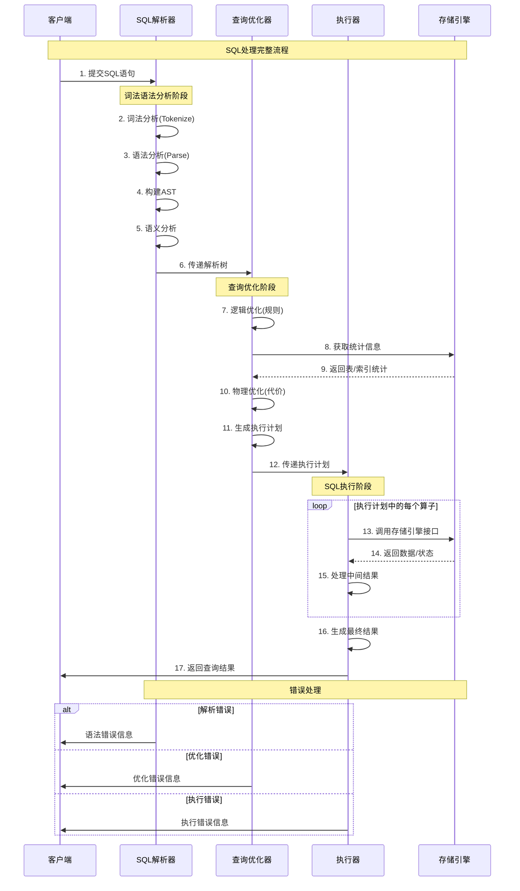

## 概述

MySQL SQL处理模块是数据库系统的核心组件，负责将用户的SQL语句转换为可执行的查询计划并执行。本文将深入分析SQL处理模块的三个核心组件：SQL解析器、查询优化器和执行器，揭示其架构设计、关键算法和源码实现。

<!--more-->

## 1. SQL处理模块架构概览

### 1.1 模块架构图

```mermaid
graph TB
    subgraph "MySQL SQL处理模块架构"
        subgraph "输入层"
            SQLText[SQL文本]
            PreparedStmt[预处理语句]
            StoredProc[存储过程]
        end
        
        subgraph "词法语法分析层"
            Lexer[词法分析器]
            Parser[语法分析器]
            AST[抽象语法树]
            SemanticAnalyzer[语义分析器]
        end
        
        subgraph "查询优化层"
            subgraph "逻辑优化"
                RuleOptimizer[规则优化器]
                Rewriter[查询重写器]
                Simplifier[表达式简化器]
            end
            
            subgraph "物理优化"
                CostOptimizer[代价优化器]
                IndexSelector[索引选择器]
                JoinOptimizer[连接优化器]
                StatisticsManager[统计信息管理]
            end
            
            subgraph "执行计划"
                PlanGenerator[计划生成器]
                PlanCache[计划缓存]
                PlanTree[执行计划树]
            end
        end
        
        subgraph "执行引擎层"
            subgraph "执行器"
                Executor[SQL执行器]
                OperatorEngine[算子引擎]
                ResultProcessor[结果处理器]
            end
            
            subgraph "算子库"
                ScanOp[扫描算子]
                JoinOp[连接算子]
                SortOp[排序算子]
                GroupOp[分组算子]
                FilterOp[过滤算子]
                ProjectOp[投影算子]
            end
            
            subgraph "存储接口"
                HandlerInterface[Handler接口]
                IndexAccess[索引访问]
                TableAccess[表访问]
            end
        end
        
        subgraph "辅助组件"
            ErrorHandler[错误处理器]
            MemoryManager[内存管理器]
            TempTableManager[临时表管理器]
            CacheManager[缓存管理器]
        end
    end
    
    %% 数据流向
    SQLText --> Lexer
    PreparedStmt --> Parser
    StoredProc --> Parser
    
    Lexer --> Parser
    Parser --> AST
    AST --> SemanticAnalyzer
    
    SemanticAnalyzer --> RuleOptimizer
    RuleOptimizer --> Rewriter
    Rewriter --> Simplifier
    
    Simplifier --> CostOptimizer
    CostOptimizer --> IndexSelector
    IndexSelector --> JoinOptimizer
    JoinOptimizer --> StatisticsManager
    
    StatisticsManager --> PlanGenerator
    PlanGenerator --> PlanCache
    PlanCache --> PlanTree
    
    PlanTree --> Executor
    Executor --> OperatorEngine
    OperatorEngine --> ResultProcessor
    
    OperatorEngine --> ScanOp
    OperatorEngine --> JoinOp
    OperatorEngine --> SortOp
    OperatorEngine --> GroupOp
    OperatorEngine --> FilterOp
    OperatorEngine --> ProjectOp
    
    ScanOp --> HandlerInterface
    JoinOp --> IndexAccess
    SortOp --> TableAccess
    
    Executor --> ErrorHandler
    Executor --> MemoryManager
    Executor --> TempTableManager
    Executor --> CacheManager
    
    style Lexer fill:#e1f5fe
    style CostOptimizer fill:#f3e5f5
    style Executor fill:#e8f5e8
    style HandlerInterface fill:#fff3e0
    style PlanCache fill:#fce4ec
```



### 1.2 处理流程时序图



## 2. SQL解析器深度解析

### 2.1 解析器架构

SQL解析器负责将SQL文本转换为内部的抽象语法树(AST)，包含以下核心组件：

#### 2.1.1 词法分析器(Lexer)

```cpp
/**
 * MySQL词法分析器
 * 将SQL文本分解为标记(Token)序列
 * 位置：sql/sql_lex.h, sql/sql_lex.cc
 */
class Lex_input_stream {
private:
    const char *m_ptr;              ///< 当前读取位置
    const char *m_tok_start;        ///< 当前标记开始位置
    const char *m_tok_end;          ///< 当前标记结束位置
    const char *m_end_of_query;     ///< 查询结束位置
    
    uint m_line;                    ///< 当前行号
    uint m_column;                  ///< 当前列号
    
    CHARSET_INFO *m_charset;        ///< 字符集信息
    
public:
    /**
     * 构造函数：初始化词法分析器
     * @param buffer SQL文本缓冲区
     * @param length 缓冲区长度
     * @param charset 字符集
     */
    Lex_input_stream(const char *buffer, uint length, CHARSET_INFO *charset)
        : m_ptr(buffer), m_tok_start(buffer), m_tok_end(buffer),
          m_end_of_query(buffer + length), m_line(1), m_column(1),
          m_charset(charset) {}
    
    /**
     * 读取下一个标记
     * @param yylval 标记值输出参数
     * @param yylloc 位置信息输出参数
     * @return 标记类型
     */
    int lex_one_token(YYSTYPE *yylval, YYLTYPE *yylloc) {
        // 跳过空白字符和注释
        skip_whitespace_and_comments();
        
        // 记录标记开始位置
        m_tok_start = m_ptr;
        yylloc->first_line = m_line;
        yylloc->first_column = m_column;
        
        if (m_ptr >= m_end_of_query) {
            return 0; // EOF
        }
        
        // 识别标记类型
        int token_type = identify_token_type();
        
        // 记录标记结束位置
        m_tok_end = m_ptr;
        yylloc->last_line = m_line;
        yylloc->last_column = m_column;
        
        // 设置标记值
        set_token_value(token_type, yylval);
        
        return token_type;
    }
    
private:
    /**
     * 跳过空白字符和注释
     */
    void skip_whitespace_and_comments() {
        while (m_ptr < m_end_of_query) {
            if (my_isspace(m_charset, *m_ptr)) {
                // 跳过空白字符
                if (*m_ptr == '\n') {
                    m_line++;
                    m_column = 1;
                } else {
                    m_column++;
                }
                m_ptr++;
            } else if (*m_ptr == '/' && m_ptr + 1 < m_end_of_query && *(m_ptr + 1) == '*') {
                // 跳过/* */注释
                skip_c_comment();
            } else if (*m_ptr == '-' && m_ptr + 1 < m_end_of_query && *(m_ptr + 1) == '-') {
                // 跳过-- 注释
                skip_line_comment();
            } else if (*m_ptr == '#') {
                // 跳过# 注释
                skip_line_comment();
            } else {
                break;
            }
        }
    }
    
    /**
     * 识别标记类型
     */
    int identify_token_type() {
        char c = *m_ptr;
        
        // 数字
        if (my_isdigit(m_charset, c)) {
            return scan_number();
        }
        
        // 字符串字面量
        if (c == '\'' || c == '"') {
            return scan_string_literal(c);
        }
        
        // 标识符或关键字
        if (my_isalpha(m_charset, c) || c == '_' || c == '$') {
            return scan_identifier_or_keyword();
        }
        
        // 操作符和标点符号
        return scan_operator_or_punctuation();
    }
    
    /**
     * 扫描数字
     */
    int scan_number() {
        const char *start = m_ptr;
        bool has_dot = false;
        bool has_exp = false;
        
        // 扫描整数部分
        while (m_ptr < m_end_of_query && my_isdigit(m_charset, *m_ptr)) {
            m_ptr++;
            m_column++;
        }
        
        // 检查小数点
        if (m_ptr < m_end_of_query && *m_ptr == '.') {
            has_dot = true;
            m_ptr++;
            m_column++;
            
            // 扫描小数部分
            while (m_ptr < m_end_of_query && my_isdigit(m_charset, *m_ptr)) {
                m_ptr++;
                m_column++;
            }
        }
        
        // 检查科学计数法
        if (m_ptr < m_end_of_query && (*m_ptr == 'e' || *m_ptr == 'E')) {
            has_exp = true;
            m_ptr++;
            m_column++;
            
            // 检查符号
            if (m_ptr < m_end_of_query && (*m_ptr == '+' || *m_ptr == '-')) {
                m_ptr++;
                m_column++;
            }
            
            // 扫描指数部分
            while (m_ptr < m_end_of_query && my_isdigit(m_charset, *m_ptr)) {
                m_ptr++;
                m_column++;
            }
        }
        
        // 返回相应的数字类型
        if (has_dot || has_exp) {
            return DECIMAL_NUM;
        } else {
            return NUM;
        }
    }
    
    /**
     * 扫描字符串字面量
     */
    int scan_string_literal(char quote_char) {
        m_ptr++; // 跳过开始引号
        m_column++;
        
        while (m_ptr < m_end_of_query) {
            if (*m_ptr == quote_char) {
                // 检查是否是转义的引号
                if (m_ptr + 1 < m_end_of_query && *(m_ptr + 1) == quote_char) {
                    m_ptr += 2; // 跳过转义的引号
                    m_column += 2;
                } else {
                    m_ptr++; // 跳过结束引号
                    m_column++;
                    break;
                }
            } else if (*m_ptr == '\\' && m_ptr + 1 < m_end_of_query) {
                // 处理转义字符
                m_ptr += 2;
                m_column += 2;
            } else {
                if (*m_ptr == '\n') {
                    m_line++;
                    m_column = 1;
                } else {
                    m_column++;
                }
                m_ptr++;
            }
        }
        
        return TEXT_STRING;
    }
    
    /**
     * 扫描标识符或关键字
     */
    int scan_identifier_or_keyword() {
        const char *start = m_ptr;
        
        // 扫描标识符字符
        while (m_ptr < m_end_of_query && 
               (my_isalnum(m_charset, *m_ptr) || *m_ptr == '_' || *m_ptr == '$')) {
            m_ptr++;
            m_column++;
        }
        
        // 检查是否是关键字
        size_t length = m_ptr - start;
        int keyword_token = lookup_keyword(start, length);
        
        if (keyword_token != 0) {
            return keyword_token;
        } else {
            return IDENT;
        }
    }
    
    /**
     * 查找关键字
     */
    int lookup_keyword(const char *str, size_t length) {
        // 使用哈希表或二分查找来查找关键字
        // 这里简化为线性查找
        
        struct keyword_entry {
            const char *name;
            int token;
        };
        
        static const keyword_entry keywords[] = {
            {"SELECT", SELECT_SYM},
            {"FROM", FROM},
            {"WHERE", WHERE},
            {"INSERT", INSERT_SYM},
            {"UPDATE", UPDATE_SYM},
            {"DELETE", DELETE_SYM},
            {"CREATE", CREATE_SYM},
            {"DROP", DROP},
            {"ALTER", ALTER},
            {"TABLE", TABLE_SYM},
            {"INDEX", INDEX_SYM},
            {"PRIMARY", PRIMARY_SYM},
            {"KEY", KEY_SYM},
            {"FOREIGN", FOREIGN},
            {"REFERENCES", REFERENCES},
            {"CONSTRAINT", CONSTRAINT},
            {"NULL", NULL_SYM},
            {"NOT", NOT_SYM},
            {"AND", AND_SYM},
            {"OR", OR_SYM},
            {"ORDER", ORDER_SYM},
            {"BY", BY},
            {"GROUP", GROUP_SYM},
            {"HAVING", HAVING},
            {"LIMIT", LIMIT},
            {"OFFSET", OFFSET},
            {"UNION", UNION_SYM},
            {"JOIN", JOIN_SYM},
            {"INNER", INNER_SYM},
            {"LEFT", LEFT},
            {"RIGHT", RIGHT},
            {"OUTER", OUTER},
            {"ON", ON},
            {"USING", USING},
            {"AS", AS},
            {"DISTINCT", DISTINCT},
            {"ALL", ALL},
            {"EXISTS", EXISTS},
            {"IN", IN_SYM},
            {"LIKE", LIKE},
            {"BETWEEN", BETWEEN_SYM},
            {"IS", IS},
            {"CASE", CASE_SYM},
            {"WHEN", WHEN_SYM},
            {"THEN", THEN_SYM},
            {"ELSE", ELSE},
            {"END", END},
            {"IF", IF},
            {"IFNULL", IFNULL},
            {"NULLIF", NULLIF},
            {"COALESCE", COALESCE},
            {NULL, 0}
        };
        
        for (const keyword_entry *entry = keywords; entry->name; entry++) {
            if (length == strlen(entry->name) && 
                my_strnncoll(m_charset, (const uchar*)str, length,
                           (const uchar*)entry->name, length) == 0) {
                return entry->token;
            }
        }
        
        return 0; // 不是关键字
    }
};
```

#### 2.1.2 语法分析器(Parser)

```cpp
/**
 * MySQL语法分析器
 * 使用Yacc/Bison生成的LR解析器
 * 位置：sql/sql_yacc.yy, sql/sql_parse.cc
 */
class SQL_parser {
private:
    THD *thd;                       ///< 线程句柄
    Lex_input_stream *lexer;        ///< 词法分析器
    LEX *lex;                       ///< 词法上下文
    
    // 解析状态
    int parse_error_count;          ///< 解析错误计数
    bool abort_on_warning;          ///< 遇到警告时是否中止
    
public:
    /**
     * 构造函数
     */
    SQL_parser(THD *thd_arg, Lex_input_stream *lexer_arg)
        : thd(thd_arg), lexer(lexer_arg), parse_error_count(0),
          abort_on_warning(false) {
        lex = thd->lex;
    }
    
    /**
     * 解析SQL语句
     * @return 0表示成功，非0表示失败
     */
    int parse() {
        // 初始化解析状态
        lex_start(thd);
        
        // 调用Yacc生成的解析函数
        int result = MYSQLparse(this);
        
        if (result != 0 || parse_error_count > 0) {
            return 1; // 解析失败
        }
        
        // 语义分析
        if (semantic_analysis() != 0) {
            return 1;
        }
        
        return 0; // 解析成功
    }
    
    /**
     * 语义分析
     * 检查语义正确性并构建完整的AST
     */
    int semantic_analysis() {
        // 1. 名称解析
        if (resolve_names() != 0) {
            return 1;
        }
        
        // 2. 类型检查
        if (type_checking() != 0) {
            return 1;
        }
        
        // 3. 权限检查
        if (privilege_checking() != 0) {
            return 1;
        }
        
        // 4. 语义验证
        if (semantic_validation() != 0) {
            return 1;
        }
        
        return 0;
    }
    
private:
    /**
     * 名称解析
     * 解析表名、列名、函数名等标识符
     */
    int resolve_names() {
        SELECT_LEX *select_lex = lex->current_select;
        
        if (!select_lex) {
            return 0; // 非SELECT语句
        }
        
        // 解析表引用
        for (TABLE_LIST *table = select_lex->table_list.first;
             table; table = table->next_local) {
            
            if (resolve_table_reference(table) != 0) {
                return 1;
            }
        }
        
        // 解析列引用
        List_iterator<Item> it(select_lex->item_list);
        Item *item;
        while ((item = it++)) {
            if (resolve_column_references(item) != 0) {
                return 1;
            }
        }
        
        // 解析WHERE条件中的列引用
        if (select_lex->where && 
            resolve_column_references(select_lex->where) != 0) {
            return 1;
        }
        
        return 0;
    }
    
    /**
     * 解析表引用
     */
    int resolve_table_reference(TABLE_LIST *table) {
        // 1. 检查表是否存在
        if (!table->table_name || !table->table_name_length) {
            my_error(ER_NO_TABLE_NAME_ALLOWED, MYF(0));
            return 1;
        }
        
        // 2. 解析数据库名
        if (!table->db || !table->db_length) {
            table->db = thd->db;
            table->db_length = thd->db_length;
        }
        
        // 3. 检查表访问权限
        if (check_table_access(thd, SELECT_ACL, table, FALSE, UINT_MAX, FALSE)) {
            return 1;
        }
        
        // 4. 打开表定义
        if (open_table_definition(thd, table) != 0) {
            return 1;
        }
        
        return 0;
    }
    
    /**
     * 解析列引用
     */
    int resolve_column_references(Item *item) {
        if (!item) {
            return 0;
        }
        
        switch (item->type()) {
            case Item::FIELD_ITEM: {
                Item_field *field_item = static_cast<Item_field*>(item);
                
                // 查找列定义
                Field *field = find_field_in_tables(thd, field_item,
                                                   lex->current_select->table_list.first,
                                                   NULL, NULL, NULL, TRUE, FALSE);
                
                if (!field) {
                    my_error(ER_BAD_FIELD_ERROR, MYF(0), 
                           field_item->field_name, thd->where);
                    return 1;
                }
                
                // 设置字段引用
                field_item->set_field(field);
                break;
            }
            
            case Item::FUNC_ITEM: {
                Item_func *func_item = static_cast<Item_func*>(item);
                
                // 递归解析函数参数
                for (uint i = 0; i < func_item->argument_count(); i++) {
                    if (resolve_column_references(func_item->arguments()[i]) != 0) {
                        return 1;
                    }
                }
                break;
            }
            
            case Item::COND_ITEM: {
                Item_cond *cond_item = static_cast<Item_cond*>(item);
                
                // 递归解析条件表达式
                List_iterator<Item> li(*cond_item->argument_list());
                Item *arg;
                while ((arg = li++)) {
                    if (resolve_column_references(arg) != 0) {
                        return 1;
                    }
                }
                break;
            }
            
            default:
                // 其他类型的项目
                break;
        }
        
        return 0;
    }
    
    /**
     * 类型检查
     */
    int type_checking() {
        SELECT_LEX *select_lex = lex->current_select;
        
        if (!select_lex) {
            return 0;
        }
        
        // 检查SELECT列表中的表达式类型
        List_iterator<Item> it(select_lex->item_list);
        Item *item;
        while ((item = it++)) {
            if (check_expression_type(item) != 0) {
                return 1;
            }
        }
        
        // 检查WHERE条件的类型
        if (select_lex->where && 
            check_boolean_expression(select_lex->where) != 0) {
            return 1;
        }
        
        // 检查HAVING条件的类型
        if (select_lex->having && 
            check_boolean_expression(select_lex->having) != 0) {
            return 1;
        }
        
        return 0;
    }
    
    /**
     * 检查表达式类型
     */
    int check_expression_type(Item *item) {
        if (!item) {
            return 0;
        }
        
        // 固定表达式类型
        if (item->fix_fields(thd, &item) != 0) {
            return 1;
        }
        
        // 检查类型兼容性
        if (!item->type_handler()->can_return_value()) {
            my_error(ER_INVALID_TYPE_FOR_JSON, MYF(0), item->full_name());
            return 1;
        }
        
        return 0;
    }
    
    /**
     * 检查布尔表达式
     */
    int check_boolean_expression(Item *item) {
        if (check_expression_type(item) != 0) {
            return 1;
        }
        
        // 检查是否可以作为布尔条件
        if (!item->can_be_bool_condition()) {
            my_error(ER_INVALID_USE_OF_NULL, MYF(0));
            return 1;
        }
        
        return 0;
    }
};
```

### 2.2 抽象语法树(AST)结构

```cpp
/**
 * MySQL抽象语法树节点基类
 * 位置：sql/item.h, sql/sql_lex.h
 */
class Parse_tree_node {
protected:
    POS m_pos;                      ///< 源码位置信息
    
public:
    /**
     * 构造函数
     */
    explicit Parse_tree_node(const POS &pos) : m_pos(pos) {}
    
    /**
     * 虚析构函数
     */
    virtual ~Parse_tree_node() = default;
    
    /**
     * 获取节点类型
     */
    virtual enum_parse_tree_node_type type() const = 0;
    
    /**
     * 上下文化处理
     * 在语义分析阶段调用
     */
    virtual bool contextualize(Parse_context *pc) = 0;
    
    /**
     * 获取源码位置
     */
    const POS &pos() const { return m_pos; }
};

/**
 * SELECT语句AST节点
 */
class PT_select_stmt : public Parse_tree_node {
private:
    PT_with_clause *m_with_clause;          ///< WITH子句
    PT_query_expression *m_query_expression; ///< 查询表达式
    
public:
    PT_select_stmt(const POS &pos,
                   PT_with_clause *with_clause,
                   PT_query_expression *query_expression)
        : Parse_tree_node(pos),
          m_with_clause(with_clause),
          m_query_expression(query_expression) {}
    
    enum_parse_tree_node_type type() const override {
        return PT_TYPE_SELECT_STMT;
    }
    
    bool contextualize(Parse_context *pc) override {
        if (m_with_clause && m_with_clause->contextualize(pc)) {
            return true;
        }
        
        if (m_query_expression->contextualize(pc)) {
            return true;
        }
        
        return false;
    }
    
    PT_query_expression *get_query_expression() const {
        return m_query_expression;
    }
};

/**
 * 查询表达式AST节点
 */
class PT_query_expression : public Parse_tree_node {
private:
    PT_query_expression_body *m_body;       ///< 查询体
    PT_order *m_order;                      ///< ORDER BY子句
    PT_limit_clause *m_limit;               ///< LIMIT子句
    
public:
    PT_query_expression(const POS &pos,
                       PT_query_expression_body *body,
                       PT_order *order,
                       PT_limit_clause *limit)
        : Parse_tree_node(pos),
          m_body(body),
          m_order(order),
          m_limit(limit) {}
    
    enum_parse_tree_node_type type() const override {
        return PT_TYPE_QUERY_EXPRESSION;
    }
    
    bool contextualize(Parse_context *pc) override {
        if (m_body->contextualize(pc)) {
            return true;
        }
        
        if (m_order && m_order->contextualize(pc)) {
            return true;
        }
        
        if (m_limit && m_limit->contextualize(pc)) {
            return true;
        }
        
        return false;
    }
};

/**
 * SELECT查询体AST节点
 */
class PT_query_specification : public PT_query_expression_body {
private:
    PT_hint_list *m_hint_list;              ///< 查询提示
    PT_query_options *m_options;            ///< 查询选项(DISTINCT等)
    PT_select_item_list *m_item_list;       ///< SELECT列表
    PT_table_reference_list *m_from_clause; ///< FROM子句
    Item *m_where_clause;                   ///< WHERE子句
    PT_group *m_group_clause;               ///< GROUP BY子句
    Item *m_having_clause;                  ///< HAVING子句
    PT_window_list *m_windows;              ///< 窗口函数定义
    
public:
    PT_query_specification(const POS &pos,
                          PT_hint_list *hint_list,
                          PT_query_options *options,
                          PT_select_item_list *item_list,
                          PT_table_reference_list *from_clause,
                          Item *where_clause,
                          PT_group *group_clause,
                          Item *having_clause,
                          PT_window_list *windows)
        : PT_query_expression_body(pos),
          m_hint_list(hint_list),
          m_options(options),
          m_item_list(item_list),
          m_from_clause(from_clause),
          m_where_clause(where_clause),
          m_group_clause(group_clause),
          m_having_clause(having_clause),
          m_windows(windows) {}
    
    bool contextualize(Parse_context *pc) override {
        SELECT_LEX *select_lex = pc->select;
        
        // 处理查询选项
        if (m_options && m_options->contextualize(pc)) {
            return true;
        }
        
        // 处理FROM子句
        if (m_from_clause && m_from_clause->contextualize(pc)) {
            return true;
        }
        
        // 处理SELECT列表
        if (m_item_list->contextualize(pc)) {
            return true;
        }
        
        // 处理WHERE子句
        if (m_where_clause) {
            select_lex->where = m_where_clause;
        }
        
        // 处理GROUP BY子句
        if (m_group_clause && m_group_clause->contextualize(pc)) {
            return true;
        }
        
        // 处理HAVING子句
        if (m_having_clause) {
            select_lex->having = m_having_clause;
        }
        
        return false;
    }
};
```

## 3. 查询优化器深度解析

### 3.1 优化器架构

查询优化器是MySQL SQL处理模块的核心，负责将解析后的SQL转换为高效的执行计划。

#### 3.1.1 优化器主控制器

```cpp
/**
 * MySQL查询优化器主控制器
 * 位置：sql/sql_optimizer.h, sql/sql_optimizer.cc
 */
class Optimize_table_order {
private:
    THD *thd;                       ///< 线程句柄
    SELECT_LEX *select_lex;         ///< SELECT语句
    JOIN *join;                     ///< 连接对象
    
    // 优化状态
    table_map const_table_map;      ///< 常量表位图
    table_map found_const_table_map; ///< 已找到的常量表
    
    // 统计信息
    ha_rows record_count;           ///< 预估记录数
    double read_time;               ///< 预估读取时间
    
public:
    /**
     * 构造函数
     */
    Optimize_table_order(THD *thd_arg, SELECT_LEX *select_lex_arg, JOIN *join_arg)
        : thd(thd_arg), select_lex(select_lex_arg), join(join_arg),
          const_table_map(0), found_const_table_map(0),
          record_count(0), read_time(0.0) {}
    
    /**
     * 执行查询优化
     * @return true表示优化失败，false表示成功
     */
    bool optimize() {
        DBUG_ENTER("Optimize_table_order::optimize");
        
        // 1. 预处理阶段
        if (preprocessing_phase()) {
            DBUG_RETURN(true);
        }
        
        // 2. 逻辑优化阶段
        if (logical_optimization_phase()) {
            DBUG_RETURN(true);
        }
        
        // 3. 物理优化阶段
        if (physical_optimization_phase()) {
            DBUG_RETURN(true);
        }
        
        // 4. 后处理阶段
        if (postprocessing_phase()) {
            DBUG_RETURN(true);
        }
        
        DBUG_RETURN(false);
    }
    
private:
    /**
     * 预处理阶段
     * 进行基本的查询分析和准备工作
     */
    bool preprocessing_phase() {
        DBUG_ENTER("preprocessing_phase");
        
        // 1. 分析常量表达式
        if (analyze_constant_expressions()) {
            DBUG_RETURN(true);
        }
        
        // 2. 识别常量表
        if (identify_constant_tables()) {
            DBUG_RETURN(true);
        }
        
        // 3. 分析WHERE条件
        if (analyze_where_conditions()) {
            DBUG_RETURN(true);
        }
        
        // 4. 预估表大小
        if (estimate_table_sizes()) {
            DBUG_RETURN(true);
        }
        
        DBUG_RETURN(false);
    }
    
    /**
     * 逻辑优化阶段
     * 应用各种逻辑优化规则
     */
    bool logical_optimization_phase() {
        DBUG_ENTER("logical_optimization_phase");
        
        // 1. 条件下推
        if (push_down_conditions()) {
            DBUG_RETURN(true);
        }
        
        // 2. 投影下推
        if (push_down_projections()) {
            DBUG_RETURN(true);
        }
        
        // 3. 子查询优化
        if (optimize_subqueries()) {
            DBUG_RETURN(true);
        }
        
        // 4. 连接消除
        if (eliminate_joins()) {
            DBUG_RETURN(true);
        }
        
        // 5. 表达式简化
        if (simplify_expressions()) {
            DBUG_RETURN(true);
        }
        
        DBUG_RETURN(false);
    }
    
    /**
     * 物理优化阶段
     * 选择最优的物理执行计划
     */
    bool physical_optimization_phase() {
        DBUG_ENTER("physical_optimization_phase");
        
        // 1. 访问路径选择
        if (choose_access_paths()) {
            DBUG_RETURN(true);
        }
        
        // 2. 连接顺序优化
        if (optimize_join_order()) {
            DBUG_RETURN(true);
        }
        
        // 3. 连接算法选择
        if (choose_join_algorithms()) {
            DBUG_RETURN(true);
        }
        
        // 4. 排序优化
        if (optimize_sorting()) {
            DBUG_RETURN(true);
        }
        
        // 5. 分组优化
        if (optimize_grouping()) {
            DBUG_RETURN(true);
        }
        
        DBUG_RETURN(false);
    }
    
    /**
     * 条件下推优化
     * 将WHERE条件尽可能下推到表扫描层
     */
    bool push_down_conditions() {
        DBUG_ENTER("push_down_conditions");
        
        if (!select_lex->where) {
            DBUG_RETURN(false); // 没有WHERE条件
        }
        
        // 分析WHERE条件中的各个子条件
        List<Item> condition_list;
        split_conditions(select_lex->where, &condition_list);
        
        // 为每个表收集可下推的条件
        for (uint i = 0; i < join->tables; i++) {
            JOIN_TAB *tab = join->join_tab + i;
            TABLE *table = tab->table;
            
            List<Item> pushable_conditions;
            
            // 检查每个条件是否可以下推到当前表
            List_iterator<Item> it(condition_list);
            Item *condition;
            while ((condition = it++)) {
                if (can_push_condition_to_table(condition, table)) {
                    pushable_conditions.push_back(condition);
                }
            }
            
            // 构建下推的条件表达式
            if (pushable_conditions.elements > 0) {
                Item *pushed_condition = build_and_condition(&pushable_conditions);
                tab->select_cond = pushed_condition;
            }
        }
        
        DBUG_RETURN(false);
    }
    
    /**
     * 检查条件是否可以下推到指定表
     */
    bool can_push_condition_to_table(Item *condition, TABLE *table) {
        // 检查条件中引用的所有列是否都来自指定表
        Item_field_visitor visitor(table);
        condition->traverse_cond(&Item::visit_all_fields, &visitor);
        
        return visitor.all_fields_from_table();
    }
    
    /**
     * 连接顺序优化
     * 使用动态规划算法找到最优连接顺序
     */
    bool optimize_join_order() {
        DBUG_ENTER("optimize_join_order");
        
        uint table_count = join->tables;
        
        if (table_count <= 1) {
            DBUG_RETURN(false); // 单表查询，无需优化连接顺序
        }
        
        // 使用启发式算法或动态规划
        if (table_count <= MAX_TABLES_FOR_EXHAUSTIVE_SEARCH) {
            // 表数较少，使用穷举搜索
            return exhaustive_join_order_search();
        } else {
            // 表数较多，使用贪心算法
            return greedy_join_order_search();
        }
    }
    
    /**
     * 穷举搜索连接顺序
     */
    bool exhaustive_join_order_search() {
        DBUG_ENTER("exhaustive_join_order_search");
        
        uint table_count = join->tables;
        
        // 使用位图表示表的集合
        table_map all_tables = (1ULL << table_count) - 1;
        
        // 动态规划表：dp[mask] = 访问mask表示的表集合的最小代价
        std::vector<double> dp(1ULL << table_count, DBL_MAX);
        std::vector<int> best_last_table(1ULL << table_count, -1);
        
        // 初始化单表访问代价
        for (uint i = 0; i < table_count; i++) {
            table_map mask = 1ULL << i;
            dp[mask] = calculate_table_scan_cost(i);
        }
        
        // 动态规划计算最优连接顺序
        for (table_map mask = 1; mask <= all_tables; mask++) {
            if (__builtin_popcountll(mask) <= 1) {
                continue; // 跳过单表情况
            }
            
            // 枚举最后加入的表
            for (uint i = 0; i < table_count; i++) {
                if (!(mask & (1ULL << i))) {
                    continue; // 表i不在当前集合中
                }
                
                table_map prev_mask = mask & ~(1ULL << i);
                if (dp[prev_mask] == DBL_MAX) {
                    continue; // 前面的表集合无法访问
                }
                
                // 计算连接代价
                double join_cost = calculate_join_cost(prev_mask, i);
                double total_cost = dp[prev_mask] + join_cost;
                
                if (total_cost < dp[mask]) {
                    dp[mask] = total_cost;
                    best_last_table[mask] = i;
                }
            }
        }
        
        // 重构最优连接顺序
        if (reconstruct_join_order(all_tables, best_last_table)) {
            DBUG_RETURN(true);
        }
        
        DBUG_RETURN(false);
    }
    
    /**
     * 计算表扫描代价
     */
    double calculate_table_scan_cost(uint table_index) {
        JOIN_TAB *tab = join->join_tab + table_index;
        TABLE *table = tab->table;
        
        // 获取表统计信息
        ha_rows row_count = table->file->stats.records;
        double avg_row_length = table->file->stats.mean_rec_length;
        
        // 考虑WHERE条件的选择性
        double selectivity = calculate_condition_selectivity(tab->select_cond);
        
        // 计算I/O代价
        double io_cost = row_count * selectivity * IO_COST_PER_ROW;
        
        // 计算CPU代价
        double cpu_cost = row_count * selectivity * CPU_COST_PER_ROW;
        
        return io_cost + cpu_cost;
    }
    
    /**
     * 计算连接代价
     */
    double calculate_join_cost(table_map left_tables, uint right_table) {
        JOIN_TAB *right_tab = join->join_tab + right_table;
        
        // 估算左侧表集合的输出行数
        ha_rows left_row_count = estimate_row_count_for_table_set(left_tables);
        
        // 估算右侧表的行数
        ha_rows right_row_count = right_tab->table->file->stats.records;
        
        // 根据连接条件估算连接选择性
        double join_selectivity = estimate_join_selectivity(left_tables, right_table);
        
        // 选择连接算法并计算代价
        if (can_use_index_join(left_tables, right_table)) {
            // 索引连接
            return left_row_count * log2(right_row_count) * INDEX_LOOKUP_COST;
        } else {
            // 嵌套循环连接
            return left_row_count * right_row_count * join_selectivity * CPU_COST_PER_ROW;
        }
    }
};
```

#### 3.1.2 代价模型

```cpp
/**
 * MySQL代价模型
 * 用于估算各种操作的执行代价
 * 位置：sql/opt_costmodel.h, sql/opt_costmodel.cc
 */
class Cost_model_server {
private:
    // 代价常量
    static constexpr double ROW_EVALUATE_COST = 0.1;      ///< 行评估代价
    static constexpr double KEY_COMPARE_COST = 0.05;      ///< 键比较代价
    static constexpr double MEMORY_TEMPTABLE_CREATE_COST = 1.0; ///< 内存临时表创建代价
    static constexpr double MEMORY_TEMPTABLE_ROW_COST = 0.1;    ///< 内存临时表行代价
    static constexpr double DISK_TEMPTABLE_CREATE_COST = 20.0;  ///< 磁盘临时表创建代价
    static constexpr double DISK_TEMPTABLE_ROW_COST = 0.5;     ///< 磁盘临时表行代价
    
    // 服务器级别的代价参数
    Cost_constant_cache *cost_constants;    ///< 代价常量缓存
    
public:
    /**
     * 构造函数
     */
    Cost_model_server() : cost_constants(nullptr) {}
    
    /**
     * 初始化代价模型
     */
    void init() {
        cost_constants = new Cost_constant_cache();
        cost_constants->init();
    }
    
    /**
     * 计算行评估代价
     * @param row_count 行数
     * @return 评估代价
     */
    double row_evaluate_cost(double row_count) const {
        return row_count * ROW_EVALUATE_COST;
    }
    
    /**
     * 计算键比较代价
     * @param keys 键比较次数
     * @return 比较代价
     */
    double key_compare_cost(double keys) const {
        return keys * KEY_COMPARE_COST;
    }
    
    /**
     * 计算内存临时表代价
     * @param create_cost 创建代价
     * @param row_count 行数
     * @return 总代价
     */
    double memory_temptable_cost(double create_cost, double row_count) const {
        return create_cost * MEMORY_TEMPTABLE_CREATE_COST + 
               row_count * MEMORY_TEMPTABLE_ROW_COST;
    }
    
    /**
     * 计算磁盘临时表代价
     * @param create_cost 创建代价
     * @param row_count 行数
     * @return 总代价
     */
    double disk_temptable_cost(double create_cost, double row_count) const {
        return create_cost * DISK_TEMPTABLE_CREATE_COST + 
               row_count * DISK_TEMPTABLE_ROW_COST;
    }
    
    /**
     * 计算排序代价
     * @param row_count 行数
     * @param sort_length 排序键长度
     * @param remove_duplicates 是否去重
     * @return 排序代价
     */
    double sort_cost(ha_rows row_count, uint sort_length, bool remove_duplicates) const {
        if (row_count <= 1) {
            return 0.0;
        }
        
        // 基本排序代价：O(n log n)
        double basic_cost = row_count * log2(row_count) * KEY_COMPARE_COST;
        
        // 考虑排序键长度的影响
        double length_factor = 1.0 + sort_length / 100.0;
        basic_cost *= length_factor;
        
        // 如果需要去重，增加额外代价
        if (remove_duplicates) {
            basic_cost += row_count * ROW_EVALUATE_COST;
        }
        
        return basic_cost;
    }
    
    /**
     * 计算分组代价
     * @param row_count 输入行数
     * @param group_count 分组数
     * @param group_length 分组键长度
     * @return 分组代价
     */
    double group_cost(ha_rows row_count, ha_rows group_count, uint group_length) const {
        if (row_count <= 1) {
            return 0.0;
        }
        
        // 基本分组代价
        double basic_cost = row_count * ROW_EVALUATE_COST;
        
        // 如果使用哈希分组
        if (group_count < row_count / 2) {
            // 哈希表查找代价
            basic_cost += row_count * KEY_COMPARE_COST;
            
            // 哈希表维护代价
            basic_cost += group_count * ROW_EVALUATE_COST;
        } else {
            // 排序分组代价
            basic_cost += sort_cost(row_count, group_length, false);
        }
        
        return basic_cost;
    }
};

/**
 * 表级代价模型
 */
class Cost_model_table {
private:
    const Cost_model_server *server_cost_model;  ///< 服务器代价模型
    const TABLE *table;                          ///< 关联的表
    
    // 表级代价常量
    double io_block_read_cost;                   ///< I/O块读取代价
    double memory_block_read_cost;               ///< 内存块读取代价
    
public:
    /**
     * 构造函数
     */
    Cost_model_table(const Cost_model_server *server_model, const TABLE *table_arg)
        : server_cost_model(server_model), table(table_arg) {
        
        // 初始化表级代价常量
        io_block_read_cost = 1.0;
        memory_block_read_cost = 0.25;
    }
    
    /**
     * 计算表扫描代价
     * @param row_count 扫描行数
     * @return 扫描代价
     */
    double table_scan_cost(ha_rows row_count) const {
        if (row_count == 0) {
            return 0.0;
        }
        
        // 计算需要读取的数据页数
        ha_rows pages_to_read = calculate_pages_to_read(row_count);
        
        // I/O代价
        double io_cost = pages_to_read * io_block_read_cost;
        
        // CPU代价
        double cpu_cost = server_cost_model->row_evaluate_cost(row_count);
        
        return io_cost + cpu_cost;
    }
    
    /**
     * 计算索引扫描代价
     * @param index 索引信息
     * @param row_count 扫描行数
     * @param ranges 扫描范围数
     * @return 扫描代价
     */
    double index_scan_cost(const KEY *index, ha_rows row_count, uint ranges) const {
        if (row_count == 0) {
            return 0.0;
        }
        
        // 索引页面读取代价
        ha_rows index_pages = calculate_index_pages_to_read(index, ranges);
        double index_io_cost = index_pages * io_block_read_cost;
        
        // 数据页面读取代价（如果需要回表）
        double data_io_cost = 0.0;
        if (need_table_access(index)) {
            ha_rows data_pages = calculate_data_pages_to_read(row_count);
            data_io_cost = data_pages * io_block_read_cost;
        }
        
        // CPU代价
        double cpu_cost = server_cost_model->row_evaluate_cost(row_count);
        
        return index_io_cost + data_io_cost + cpu_cost;
    }
    
    /**
     * 计算索引查找代价
     * @param index 索引信息
     * @param lookup_count 查找次数
     * @return 查找代价
     */
    double index_lookup_cost(const KEY *index, ha_rows lookup_count) const {
        if (lookup_count == 0) {
            return 0.0;
        }
        
        // 索引查找的平均代价
        double avg_lookup_cost = log2(table->file->stats.records) * 
                               server_cost_model->key_compare_cost(1.0);
        
        // 总查找代价
        double total_lookup_cost = lookup_count * avg_lookup_cost;
        
        // 如果需要回表，增加数据页面访问代价
        if (need_table_access(index)) {
            total_lookup_cost += lookup_count * io_block_read_cost;
        }
        
        return total_lookup_cost;
    }
    
private:
    /**
     * 计算需要读取的数据页数
     */
    ha_rows calculate_pages_to_read(ha_rows row_count) const {
        if (row_count == 0) {
            return 0;
        }
        
        // 估算每页的平均行数
        uint rows_per_page = table->file->stats.block_size / 
                           std::max(table->file->stats.mean_rec_length, 1U);
        
        if (rows_per_page == 0) {
            rows_per_page = 1;
        }
        
        // 计算需要的页数
        ha_rows pages = (row_count + rows_per_page - 1) / rows_per_page;
        
        return std::min(pages, table->file->stats.data_file_length / 
                              table->file->stats.block_size);
    }
    
    /**
     * 计算需要读取的索引页数
     */
    ha_rows calculate_index_pages_to_read(const KEY *index, uint ranges) const {
        // 简化计算：假设每个范围需要读取log(n)个索引页
        double avg_pages_per_range = log2(table->file->stats.records / 
                                        std::max(index->actual_key_parts, 1U));
        
        return static_cast<ha_rows>(ranges * avg_pages_per_range);
    }
    
    /**
     * 检查是否需要访问表数据
     */
    bool need_table_access(const KEY *index) const {
        // 如果是覆盖索引，则不需要回表
        // 这里简化处理，实际需要检查查询的列是否都在索引中
        return true;
    }
};
```

## 4. 执行器深度解析

### 4.1 执行器架构

执行器负责执行优化器生成的查询计划，将逻辑操作转换为对存储引擎的具体调用。

#### 4.1.1 执行器主控制器

```cpp
/**
 * MySQL SQL执行器
 * 位置：sql/sql_executor.h, sql/sql_executor.cc
 */
class Query_executor {
private:
    THD *thd;                       ///< 线程句柄
    SELECT_LEX *select_lex;         ///< SELECT语句
    JOIN *join;                     ///< 连接对象
    
    // 执行状态
    bool execution_started;         ///< 是否已开始执行
    bool send_row_count_only;       ///< 是否只发送行数
    ha_rows examined_rows;          ///< 已检查的行数
    ha_rows sent_rows;              ///< 已发送的行数
    
    // 临时表管理
    List<TABLE> temp_tables;        ///< 临时表列表
    
public:
    /**
     * 构造函数
     */
    Query_executor(THD *thd_arg, SELECT_LEX *select_lex_arg, JOIN *join_arg)
        : thd(thd_arg), select_lex(select_lex_arg), join(join_arg),
          execution_started(false), send_row_count_only(false),
          examined_rows(0), sent_rows(0) {}
    
    /**
     * 执行查询
     * @return 0表示成功，非0表示失败
     */
    int execute() {
        DBUG_ENTER("Query_executor::execute");
        
        // 1. 执行前准备
        if (prepare_execution()) {
            DBUG_RETURN(1);
        }
        
        // 2. 执行查询计划
        if (execute_query_plan()) {
            DBUG_RETURN(1);
        }
        
        // 3. 执行后清理
        if (cleanup_execution()) {
            DBUG_RETURN(1);
        }
        
        DBUG_RETURN(0);
    }
    
private:
    /**
     * 执行前准备
     */
    int prepare_execution() {
        DBUG_ENTER("prepare_execution");
        
        // 1. 打开所有表
        if (open_tables()) {
            DBUG_RETURN(1);
        }
        
        // 2. 初始化访问方法
        if (initialize_access_methods()) {
            DBUG_RETURN(1);
        }
        
        // 3. 准备临时表
        if (prepare_temporary_tables()) {
            DBUG_RETURN(1);
        }
        
        // 4. 初始化排序和分组
        if (initialize_sorting_and_grouping()) {
            DBUG_RETURN(1);
        }
        
        execution_started = true;
        DBUG_RETURN(0);
    }
    
    /**
     * 执行查询计划
     */
    int execute_query_plan() {
        DBUG_ENTER("execute_query_plan");
        
        // 根据查询类型选择执行路径
        if (join->group_list || join->order) {
            // 需要排序或分组的查询
            return execute_with_sorting_or_grouping();
        } else if (join->tables > 1) {
            // 多表连接查询
            return execute_join_query();
        } else {
            // 单表查询
            return execute_single_table_query();
        }
    }
    
    /**
     * 执行单表查询
     */
    int execute_single_table_query() {
        DBUG_ENTER("execute_single_table_query");
        
        JOIN_TAB *tab = join->join_tab;
        TABLE *table = tab->table;
        
        // 初始化表扫描
        if (init_table_scan(tab)) {
            DBUG_RETURN(1);
        }
        
        // 发送结果集头部
        if (send_result_set_metadata()) {
            DBUG_RETURN(1);
        }
        
        // 扫描表并发送结果
        int error = 0;
        while (!(error = read_next_row(tab))) {
            examined_rows++;
            
            // 应用WHERE条件
            if (tab->select_cond && !tab->select_cond->val_int()) {
                continue;
            }
            
            // 发送结果行
            if (send_result_row()) {
                DBUG_RETURN(1);
            }
            
            sent_rows++;
            
            // 检查LIMIT
            if (select_lex->select_limit && sent_rows >= select_lex->select_limit) {
                break;
            }
        }
        
        // 结束表扫描
        end_table_scan(tab);
        
        if (error > 0) {
            DBUG_RETURN(1);
        }
        
        DBUG_RETURN(0);
    }
    
    /**
     * 执行多表连接查询
     */
    int execute_join_query() {
        DBUG_ENTER("execute_join_query");
        
        // 初始化所有表的扫描
        for (uint i = 0; i < join->tables; i++) {
            if (init_table_scan(join->join_tab + i)) {
                DBUG_RETURN(1);
            }
        }
        
        // 发送结果集头部
        if (send_result_set_metadata()) {
            DBUG_RETURN(1);
        }
        
        // 执行嵌套循环连接
        if (execute_nested_loop_join(0)) {
            DBUG_RETURN(1);
        }
        
        // 结束所有表的扫描
        for (uint i = 0; i < join->tables; i++) {
            end_table_scan(join->join_tab + i);
        }
        
        DBUG_RETURN(0);
    }
    
    /**
     * 执行嵌套循环连接
     * @param table_index 当前表索引
     */
    int execute_nested_loop_join(uint table_index) {
        DBUG_ENTER("execute_nested_loop_join");
        
        if (table_index >= join->tables) {
            // 所有表都已连接，发送结果行
            if (send_result_row()) {
                DBUG_RETURN(1);
            }
            
            sent_rows++;
            
            // 检查LIMIT
            if (select_lex->select_limit && sent_rows >= select_lex->select_limit) {
                DBUG_RETURN(1);
            }
            
            DBUG_RETURN(0);
        }
        
        JOIN_TAB *tab = join->join_tab + table_index;
        
        // 重置表扫描
        if (reset_table_scan(tab)) {
            DBUG_RETURN(1);
        }
        
        // 扫描当前表
        int error = 0;
        while (!(error = read_next_row(tab))) {
            examined_rows++;
            
            // 应用连接条件
            if (tab->on_expr && !tab->on_expr->val_int()) {
                continue;
            }
            
            // 递归处理下一个表
            if (execute_nested_loop_join(table_index + 1)) {
                DBUG_RETURN(1);
            }
        }
        
        if (error > 0) {
            DBUG_RETURN(1);
        }
        
        DBUG_RETURN(0);
    }
    
    /**
     * 初始化表扫描
     */
    int init_table_scan(JOIN_TAB *tab) {
        DBUG_ENTER("init_table_scan");
        
        TABLE *table = tab->table;
        
        // 根据访问方法初始化扫描
        switch (tab->type) {
            case JT_ALL:
                // 全表扫描
                if (table->file->ha_rnd_init(true)) {
                    DBUG_RETURN(1);
                }
                break;
                
            case JT_INDEX_SCAN:
                // 索引扫描
                if (table->file->ha_index_init(tab->index, true)) {
                    DBUG_RETURN(1);
                }
                break;
                
            case JT_RANGE:
                // 范围扫描
                if (init_range_scan(tab)) {
                    DBUG_RETURN(1);
                }
                break;
                
            case JT_REF:
                // 引用扫描
                if (init_ref_scan(tab)) {
                    DBUG_RETURN(1);
                }
                break;
                
            case JT_CONST:
                // 常量表
                if (read_const_table(tab)) {
                    DBUG_RETURN(1);
                }
                break;
                
            default:
                DBUG_RETURN(1);
        }
        
        DBUG_RETURN(0);
    }
    
    /**
     * 读取下一行
     */
    int read_next_row(JOIN_TAB *tab) {
        DBUG_ENTER("read_next_row");
        
        TABLE *table = tab->table;
        int error = 0;
        
        switch (tab->type) {
            case JT_ALL:
                error = table->file->ha_rnd_next(table->record[0]);
                break;
                
            case JT_INDEX_SCAN:
                error = table->file->ha_index_next(table->record[0]);
                break;
                
            case JT_RANGE:
                error = read_next_range_row(tab);
                break;
                
            case JT_REF:
                error = read_next_ref_row(tab);
                break;
                
            case JT_CONST:
                error = HA_ERR_END_OF_FILE; // 常量表只有一行
                break;
                
            default:
                error = HA_ERR_GENERIC;
        }
        
        DBUG_RETURN(error);
    }
    
    /**
     * 发送结果集元数据
     */
    int send_result_set_metadata() {
        DBUG_ENTER("send_result_set_metadata");
        
        List<Item> &fields = select_lex->item_list;
        
        if (thd->send_result_metadata(&fields, Protocol::SEND_NUM_ROWS | Protocol::SEND_EOF)) {
            DBUG_RETURN(1);
        }
        
        DBUG_RETURN(0);
    }
    
    /**
     * 发送结果行
     */
    int send_result_row() {
        DBUG_ENTER("send_result_row");
        
        List<Item> &fields = select_lex->item_list;
        
        if (thd->send_result_set_row(&fields)) {
            DBUG_RETURN(1);
        }
        
        DBUG_RETURN(0);
    }
};
```

### 4.2 算子执行引擎

```cpp
/**
 * 算子执行引擎
 * 实现各种查询算子的执行逻辑
 */
class Operator_executor {
public:
    /**
     * 扫描算子
     * 执行表扫描或索引扫描
     */
    class Scan_operator {
    private:
        JOIN_TAB *tab;                  ///< 连接表信息
        TABLE *table;                   ///< 表对象
        bool scan_initialized;          ///< 扫描是否已初始化
        
    public:
        Scan_operator(JOIN_TAB *tab_arg) 
            : tab(tab_arg), table(tab_arg->table), scan_initialized(false) {}
        
        /**
         * 初始化扫描
         */
        int init() {
            if (scan_initialized) {
                return 0;
            }
            
            int error = 0;
            switch (tab->type) {
                case JT_ALL:
                    error = table->file->ha_rnd_init(true);
                    break;
                case JT_INDEX_SCAN:
                    error = table->file->ha_index_init(tab->index, true);
                    break;
                default:
                    error = HA_ERR_GENERIC;
            }
            
            if (!error) {
                scan_initialized = true;
            }
            
            return error;
        }
        
        /**
         * 读取下一行
         */
        int next() {
            if (!scan_initialized) {
                return HA_ERR_GENERIC;
            }
            
            switch (tab->type) {
                case JT_ALL:
                    return table->file->ha_rnd_next(table->record[0]);
                case JT_INDEX_SCAN:
                    return table->file->ha_index_next(table->record[0]);
                default:
                    return HA_ERR_GENERIC;
            }
        }
        
        /**
         * 结束扫描
         */
        void end() {
            if (!scan_initialized) {
                return;
            }
            
            switch (tab->type) {
                case JT_ALL:
                    table->file->ha_rnd_end();
                    break;
                case JT_INDEX_SCAN:
                    table->file->ha_index_end();
                    break;
            }
            
            scan_initialized = false;
        }
    };
    
    /**
     * 连接算子
     * 执行两个表的连接操作
     */
    class Join_operator {
    private:
        Scan_operator *left_scan;       ///< 左表扫描算子
        Scan_operator *right_scan;      ///< 右表扫描算子
        Item *join_condition;           ///< 连接条件
        
        bool left_row_valid;            ///< 左表当前行是否有效
        bool right_scan_started;        ///< 右表扫描是否已开始
        
    public:
        Join_operator(Scan_operator *left, Scan_operator *right, Item *condition)
            : left_scan(left), right_scan(right), join_condition(condition),
              left_row_valid(false), right_scan_started(false) {}
        
        /**
         * 初始化连接
         */
        int init() {
            if (left_scan->init() || right_scan->init()) {
                return 1;
            }
            
            // 读取左表第一行
            if (left_scan->next() == 0) {
                left_row_valid = true;
            }
            
            return 0;
        }
        
        /**
         * 获取下一个连接结果
         */
        int next() {
            while (left_row_valid) {
                if (!right_scan_started) {
                    // 开始右表扫描
                    right_scan_started = true;
                } else {
                    // 继续右表扫描
                    if (right_scan->next() != 0) {
                        // 右表扫描结束，移动到左表下一行
                        if (left_scan->next() != 0) {
                            left_row_valid = false;
                            break;
                        }
                        right_scan_started = false;
                        continue;
                    }
                }
                
                // 检查连接条件
                if (!join_condition || join_condition->val_int()) {
                    return 0; // 找到匹配的行
                }
            }
            
            return HA_ERR_END_OF_FILE;
        }
        
        /**
         * 结束连接
         */
        void end() {
            left_scan->end();
            right_scan->end();
        }
    };
    
    /**
     * 排序算子
     * 对输入数据进行排序
     */
    class Sort_operator {
    private:
        Filesort *filesort;             ///< 文件排序对象
        IO_CACHE *io_cache;             ///< I/O缓存
        bool sort_initialized;          ///< 排序是否已初始化
        
    public:
        Sort_operator(Filesort *filesort_arg)
            : filesort(filesort_arg), io_cache(nullptr), sort_initialized(false) {}
        
        /**
         * 初始化排序
         */
        int init() {
            if (sort_initialized) {
                return 0;
            }
            
            // 创建排序缓冲区
            if (filesort->sort_buffer_size == 0) {
                filesort->sort_buffer_size = thd->variables.sortbuff_size;
            }
            
            // 初始化I/O缓存
            io_cache = new IO_CACHE;
            if (init_io_cache(io_cache, -1, 0, 0, 0, MYF(MY_WME))) {
                delete io_cache;
                io_cache = nullptr;
                return 1;
            }
            
            sort_initialized = true;
            return 0;
        }
        
        /**
         * 执行排序
         */
        int execute(ha_rows *examined_rows) {
            if (!sort_initialized) {
                return 1;
            }
            
            // 执行文件排序
            ha_rows found_rows = filesort_execute(thd, filesort, examined_rows);
            
            if (found_rows == HA_POS_ERROR) {
                return 1;
            }
            
            return 0;
        }
        
        /**
         * 读取排序后的下一行
         */
        int next() {
            if (!sort_initialized || !io_cache) {
                return HA_ERR_GENERIC;
            }
            
            // 从排序结果中读取下一行
            return read_sorted_record(io_cache);
        }
        
        /**
         * 结束排序
         */
        void end() {
            if (io_cache) {
                end_io_cache(io_cache);
                delete io_cache;
                io_cache = nullptr;
            }
            sort_initialized = false;
        }
    };
    
    /**
     * 分组算子
     * 对输入数据进行分组和聚合
     */
    class Group_operator {
    private:
        ORDER *group_list;              ///< 分组列表
        Item **group_fields;            ///< 分组字段
        uint group_field_count;         ///< 分组字段数量
        
        uchar *group_buffer;            ///< 分组缓冲区
        uint group_buffer_length;       ///< 缓冲区长度
        bool first_group;               ///< 是否是第一个分组
        
    public:
        Group_operator(ORDER *group_list_arg)
            : group_list(group_list_arg), group_fields(nullptr),
              group_field_count(0), group_buffer(nullptr),
              group_buffer_length(0), first_group(true) {}
        
        /**
         * 初始化分组
         */
        int init() {
            if (!group_list) {
                return 0;
            }
            
            // 计算分组字段数量
            ORDER *group = group_list;
            while (group) {
                group_field_count++;
                group = group->next;
            }
            
            // 分配分组字段数组
            group_fields = new Item*[group_field_count];
            
            // 填充分组字段
            group = group_list;
            for (uint i = 0; i < group_field_count; i++) {
                group_fields[i] = *group->item;
                group = group->next;
            }
            
            // 计算分组缓冲区大小
            group_buffer_length = 0;
            for (uint i = 0; i < group_field_count; i++) {
                group_buffer_length += group_fields[i]->max_length;
            }
            
            // 分配分组缓冲区
            if (group_buffer_length > 0) {
                group_buffer = new uchar[group_buffer_length];
            }
            
            return 0;
        }
        
        /**
         * 检查是否开始新的分组
         */
        bool is_new_group() {
            if (first_group) {
                first_group = false;
                save_current_group();
                return true;
            }
            
            // 比较当前行与保存的分组值
            uchar *buffer_pos = group_buffer;
            for (uint i = 0; i < group_field_count; i++) {
                String current_value;
                group_fields[i]->val_str(&current_value);
                
                uint field_length = group_fields[i]->max_length;
                if (memcmp(buffer_pos, current_value.ptr(), 
                          std::min(field_length, current_value.length())) != 0) {
                    save_current_group();
                    return true;
                }
                
                buffer_pos += field_length;
            }
            
            return false;
        }
        
        /**
         * 结束分组
         */
        void end() {
            delete[] group_fields;
            delete[] group_buffer;
            group_fields = nullptr;
            group_buffer = nullptr;
        }
        
    private:
        /**
         * 保存当前分组的值
         */
        void save_current_group() {
            if (!group_buffer) {
                return;
            }
            
            uchar *buffer_pos = group_buffer;
            for (uint i = 0; i < group_field_count; i++) {
                String current_value;
                group_fields[i]->val_str(&current_value);
                
                uint field_length = group_fields[i]->max_length;
                uint copy_length = std::min(field_length, current_value.length());
                
                memcpy(buffer_pos, current_value.ptr(), copy_length);
                if (copy_length < field_length) {
                    memset(buffer_pos + copy_length, 0, field_length - copy_length);
                }
                
                buffer_pos += field_length;
            }
        }
    };
};
```

## 5. 总结

MySQL SQL处理模块是数据库系统的核心，通过分层架构实现了从SQL文本到执行结果的完整转换过程：

### 5.1 模块特点

1. **分层设计**：解析器、优化器、执行器各司其职
2. **可扩展性**：支持多种优化规则和执行算子
3. **高性能**：基于代价的优化和高效的执行算法
4. **容错性**：完善的错误处理和恢复机制

### 5.2 关键技术

1. **词法语法分析**：使用Lex/Yacc技术构建解析器
2. **查询优化**：结合规则优化和代价优化
3. **执行引擎**：基于算子的流水线执行模型
4. **代价估算**：精确的统计信息和代价模型

### 5.3 性能优化要点

1. **解析优化**：缓存解析结果，减少重复解析
2. **优化器调优**：合理设置优化器参数
3. **执行优化**：选择合适的算子和访问方法
4. **内存管理**：高效的临时表和排序缓冲区管理

通过深入理解SQL处理模块的实现原理，开发者可以更好地编写高效的SQL语句，并对数据库性能进行调优。
