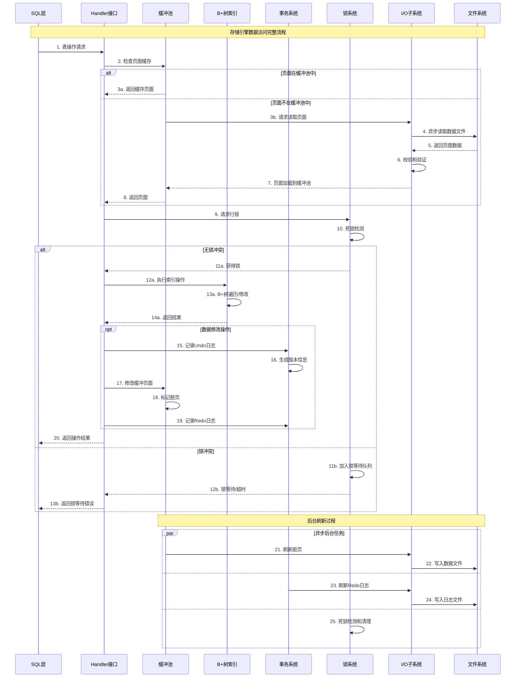

## 概述

MySQL存储引擎模块是数据库系统的核心组件，负责数据的实际存储、检索和管理。InnoDB作为MySQL的默认存储引擎，提供了完整的ACID事务支持、行级锁定和崩溃恢复功能。本文将深入分析存储引擎模块的架构设计、核心算法和关键实现。

<!--more-->

## 1. 存储引擎模块架构概览

### 1.1 存储引擎架构图

```mermaid
graph TB
    subgraph "MySQL存储引擎模块架构"
        subgraph "存储引擎接口层"
            HandlerAPI[Handler API]
            PluginMgr[插件管理器]
            TableDef[表定义管理]
            IndexMgr[索引管理器]
        end
        
        subgraph "InnoDB存储引擎"
            subgraph "缓冲池管理"
                BufferPool[缓冲池]
                PageHash[页面哈希表]
                LRUList[LRU链表]
                FlushList[刷新链表]
                FreeList[空闲链表]
            end
            
            subgraph "索引结构"
                BPlusTree[B+树索引]
                ClusteredIndex[聚簇索引]
                SecondaryIndex[二级索引]
                AdaptiveHash[自适应哈希索引]
            end
            
            subgraph "事务系统"
                TrxSys[事务系统]
                MVCC[多版本并发控制]
                ReadView[读视图]
                UndoLog[Undo日志]
                RedoLog[Redo日志]
            end
            
            subgraph "锁管理"
                LockSys[锁系统]
                RowLock[行锁]
                TableLock[表锁]
                IntentionLock[意向锁]
                DeadlockDetector[死锁检测器]
            end
            
            subgraph "页面管理"
                PageMgr[页面管理器]
                SpaceMgr[表空间管理]
                ExtentMgr[区管理器]
                SegmentMgr[段管理器]
            end
            
            subgraph "I/O子系统"
                AsyncIO[异步I/O]
                DoubleWrite[双写缓冲]
                Checksum[校验和]
                Compression[压缩]
            end
        end
        
        subgraph "其他存储引擎"
            MyISAM[MyISAM引擎]
            Memory[Memory引擎]
            Archive[Archive引擎]
            CSV[CSV引擎]
        end
        
        subgraph "文件系统层"
            DataFiles[数据文件(.ibd)]
            LogFiles[日志文件(ib_logfile)]
            TempFiles[临时文件]
            UndoFiles[Undo文件]
        end
    end
    
    %% 接口关系
    HandlerAPI --> PluginMgr
    PluginMgr --> BufferPool
    PluginMgr --> BPlusTree
    PluginMgr --> TrxSys
    PluginMgr --> LockSys
    PluginMgr --> PageMgr
    PluginMgr --> AsyncIO
    
    %% 内部关系
    BufferPool --> PageHash
    BufferPool --> LRUList
    BufferPool --> FlushList
    BufferPool --> FreeList
    
    BPlusTree --> ClusteredIndex
    BPlusTree --> SecondaryIndex
    BPlusTree --> AdaptiveHash
    
    TrxSys --> MVCC
    MVCC --> ReadView
    TrxSys --> UndoLog
    TrxSys --> RedoLog
    
    LockSys --> RowLock
    LockSys --> TableLock
    LockSys --> IntentionLock
    LockSys --> DeadlockDetector
    
    PageMgr --> SpaceMgr
    SpaceMgr --> ExtentMgr
    ExtentMgr --> SegmentMgr
    
    AsyncIO --> DoubleWrite
    AsyncIO --> Checksum
    AsyncIO --> Compression
    
    %% 文件系统关系
    BufferPool --> DataFiles
    RedoLog --> LogFiles
    TrxSys --> UndoFiles
    PageMgr --> TempFiles
    
    %% 其他引擎
    PluginMgr --> MyISAM
    PluginMgr --> Memory
    PluginMgr --> Archive
    PluginMgr --> CSV
    
    style HandlerAPI fill:#e1f5fe
    style BufferPool fill:#f3e5f5
    style BPlusTree fill:#e8f5e8
    style TrxSys fill:#fff3e0
    style LockSys fill:#fce4ec
    style AsyncIO fill:#f1f8e9
```

### 1.2 存储引擎交互时序图



## 2. Handler接口层深度解析

### 2.1 Handler基类设计

```cpp
/**
 * MySQL存储引擎Handler基类
 * 定义了存储引擎的统一接口
 * 位置：sql/handler.h, sql/handler.cc
 */
class handler {
protected:
    TABLE_SHARE *table_share;          ///< 表共享信息
    TABLE *table;                      ///< 表对象
    uchar *ref;                        ///< 行引用缓冲区
    uchar *dup_ref;                    ///< 重复行引用缓冲区
    
    // 统计信息
    ha_statistics stats;               ///< 表统计信息
    
    // 事务相关
    THD *ha_thd() const;               ///< 获取线程句柄
    
    // 错误处理
    int my_errno;                      ///< 最后的错误码
    
public:
    /**
     * 构造函数
     * @param hton 存储引擎句柄类型
     * @param table_arg 表对象
     */
    handler(handlerton *hton, TABLE_SHARE *share)
        : table_share(share), table(nullptr), ref(nullptr), dup_ref(nullptr),
          my_errno(0) {
        // 初始化统计信息
        memset(&stats, 0, sizeof(stats));
    }
    
    /**
     * 虚析构函数
     */
    virtual ~handler() = default;
    
    // ========== 表管理接口 ==========
    
    /**
     * 打开表
     * @param name 表名
     * @param mode 打开模式
     * @param test_if_locked 是否测试锁定
     * @return 0表示成功，非0表示失败
     */
    virtual int open(const char *name, int mode, uint test_if_locked) = 0;
    
    /**
     * 关闭表
     * @return 0表示成功，非0表示失败
     */
    virtual int close() = 0;
    
    /**
     * 创建表
     * @param name 表名
     * @param table 表定义
     * @param create_info 创建信息
     * @return 0表示成功，非0表示失败
     */
    virtual int create(const char *name, TABLE *table, HA_CREATE_INFO *create_info) {
        return HA_ERR_WRONG_COMMAND;
    }
    
    /**
     * 删除表
     * @param name 表名
     * @return 0表示成功，非0表示失败
     */
    virtual int delete_table(const char *name) {
        return HA_ERR_WRONG_COMMAND;
    }
    
    // ========== 行操作接口 ==========
    
    /**
     * 插入行
     * @param buf 行数据缓冲区
     * @return 0表示成功，非0表示失败
     */
    virtual int write_row(uchar *buf) = 0;
    
    /**
     * 更新行
     * @param old_data 旧行数据
     * @param new_data 新行数据
     * @return 0表示成功，非0表示失败
     */
    virtual int update_row(const uchar *old_data, uchar *new_data) = 0;
    
    /**
     * 删除行
     * @param buf 行数据缓冲区
     * @return 0表示成功，非0表示失败
     */
    virtual int delete_row(const uchar *buf) = 0;
    
    // ========== 扫描接口 ==========
    
    /**
     * 初始化随机扫描
     * @param scan 是否扫描
     * @return 0表示成功，非0表示失败
     */
    virtual int rnd_init(bool scan) = 0;
    
    /**
     * 读取下一行（随机扫描）
     * @param buf 行数据缓冲区
     * @return 0表示成功，HA_ERR_END_OF_FILE表示结束
     */
    virtual int rnd_next(uchar *buf) = 0;
    
    /**
     * 根据位置读取行
     * @param buf 行数据缓冲区
     * @param pos 行位置
     * @return 0表示成功，非0表示失败
     */
    virtual int rnd_pos(uchar *buf, uchar *pos) = 0;
    
    /**
     * 结束随机扫描
     */
    virtual int rnd_end() = 0;
    
    // ========== 索引接口 ==========
    
    /**
     * 初始化索引扫描
     * @param idx 索引号
     * @param sorted 是否排序
     * @return 0表示成功，非0表示失败
     */
    virtual int index_init(uint idx, bool sorted) = 0;
    
    /**
     * 索引读取
     * @param buf 行数据缓冲区
     * @param key 键值
     * @param keylen 键长度
     * @param find_flag 查找标志
     * @return 0表示成功，非0表示失败
     */
    virtual int index_read(uchar *buf, const uchar *key, uint key_len,
                          enum ha_rkey_function find_flag) = 0;
    
    /**
     * 读取下一行（索引扫描）
     * @param buf 行数据缓冲区
     * @return 0表示成功，HA_ERR_END_OF_FILE表示结束
     */
    virtual int index_next(uchar *buf) = 0;
    
    /**
     * 读取上一行（索引扫描）
     * @param buf 行数据缓冲区
     * @return 0表示成功，HA_ERR_END_OF_FILE表示结束
     */
    virtual int index_prev(uchar *buf) = 0;
    
    /**
     * 结束索引扫描
     */
    virtual int index_end() = 0;
    
    // ========== 事务接口 ==========
    
    /**
     * 开始事务
     * @param thd 线程句柄
     * @param start_stmt 是否开始语句
     * @return 0表示成功，非0表示失败
     */
    virtual int start_stmt(THD *thd, thr_lock_type lock_type) {
        return 0;
    }
    
    /**
     * 外部锁定
     * @param thd 线程句柄
     * @param lock_type 锁类型
     * @return 0表示成功，非0表示失败
     */
    virtual int external_lock(THD *thd, int lock_type) {
        return 0;
    }
    
    // ========== 统计信息接口 ==========
    
    /**
     * 获取表信息
     * @param flag 信息标志
     * @return 0表示成功，非0表示失败
     */
    virtual int info(uint flag) = 0;
    
    /**
     * 获取记录数
     * @return 记录数估计值
     */
    virtual ha_rows records() {
        return stats.records;
    }
    
    /**
     * 扫描时间估计
     * @return 扫描时间
     */
    virtual double scan_time() {
        return ulonglong2double(stats.data_file_length) / IO_SIZE + 2;
    }
    
    /**
     * 读取时间估计
     * @param index 索引号
     * @param ranges 范围数
     * @param rows 行数
     * @return 读取时间
     */
    virtual double read_time(uint index, uint ranges, ha_rows rows) {
        return rows;
    }
    
    // ========== 能力查询接口 ==========
    
    /**
     * 获取表标志
     * @return 表标志位掩码
     */
    virtual Table_flags table_flags() const = 0;
    
    /**
     * 获取索引标志
     * @param inx 索引号
     * @param part 索引部分
     * @param all_parts 是否所有部分
     * @return 索引标志位掩码
     */
    virtual ulong index_flags(uint inx, uint part, bool all_parts) const = 0;
    
    /**
     * 获取最大支持的索引长度
     * @return 最大索引长度
     */
    virtual uint max_supported_key_length() const {
        return MAX_KEY_LENGTH;
    }
    
    /**
     * 获取最大支持的索引部分数
     * @return 最大索引部分数
     */
    virtual uint max_supported_key_parts() const {
        return MAX_REF_PARTS;
    }
    
    /**
     * 获取最大支持的索引部分长度
     * @return 最大索引部分长度
     */
    virtual uint max_supported_key_part_length() const {
        return MAX_KEY_LENGTH;
    }
    
protected:
    /**
     * 设置主键引用
     * @param ref 引用缓冲区
     * @param record 记录缓冲区
     */
    virtual void position(const uchar *record) = 0;
    
    /**
     * 获取引用长度
     * @return 引用长度
     */
    virtual uint ref_length() const = 0;
};
```

### 2.2 InnoDB Handler实现

```cpp
/**
 * InnoDB存储引擎Handler实现
 * 位置：storage/innobase/handler/ha_innodb.h, storage/innobase/handler/ha_innodb.cc
 */
class ha_innobase : public handler {
private:
    dict_index_t *prebuilt_index;      ///< 预构建索引
    row_prebuilt_t *prebuilt;          ///< 预构建结构
    THD *user_thd;                     ///< 用户线程句柄
    
    // InnoDB特有成员
    dict_table_t *ib_table;            ///< InnoDB表对象
    dict_index_t *primary_key;         ///< 主键索引
    
    // 事务相关
    trx_t *trx;                        ///< 当前事务
    
    // 统计信息
    ib_uint64_t auto_inc_counter_for_this_stat; ///< 自增计数器
    
public:
    /**
     * 构造函数
     */
    ha_innobase(handlerton *hton, TABLE_SHARE *table_arg)
        : handler(hton, table_arg), prebuilt_index(nullptr),
          prebuilt(nullptr), user_thd(nullptr), ib_table(nullptr),
          primary_key(nullptr), trx(nullptr),
          auto_inc_counter_for_this_stat(0) {}
    
    /**
     * 析构函数
     */
    ~ha_innobase() override {
        if (prebuilt) {
            row_prebuilt_free(prebuilt, FALSE);
        }
    }
    
    // ========== 表管理实现 ==========
    
    /**
     * 打开表实现
     */
    int open(const char *name, int mode, uint test_if_locked) override {
        DBUG_ENTER("ha_innobase::open");
        
        // 1. 获取InnoDB表对象
        ib_table = dict_table_open_on_name(name, FALSE, FALSE, DICT_ERR_IGNORE_NONE);
        if (!ib_table) {
            DBUG_RETURN(HA_ERR_NO_SUCH_TABLE);
        }
        
        // 2. 创建预构建结构
        prebuilt = row_create_prebuilt(ib_table, table->s->reclength);
        if (!prebuilt) {
            dict_table_close(ib_table, FALSE, FALSE);
            DBUG_RETURN(HA_ERR_OUT_OF_MEM);
        }
        
        // 3. 设置主键索引
        primary_key = dict_table_get_first_index(ib_table);
        prebuilt->index = primary_key;
        
        // 4. 初始化统计信息
        if (info(HA_STATUS_VARIABLE | HA_STATUS_CONST | HA_STATUS_TIME)) {
            dict_table_close(ib_table, FALSE, FALSE);
            row_prebuilt_free(prebuilt, FALSE);
            DBUG_RETURN(HA_ERR_CRASHED);
        }
        
        // 5. 设置引用长度
        ref_length = DATA_ROW_ID_LEN;
        if (primary_key) {
            ref_length = dict_index_get_n_unique(primary_key);
        }
        
        DBUG_RETURN(0);
    }
    
    /**
     * 关闭表实现
     */
    int close() override {
        DBUG_ENTER("ha_innobase::close");
        
        if (prebuilt) {
            row_prebuilt_free(prebuilt, FALSE);
            prebuilt = nullptr;
        }
        
        if (ib_table) {
            dict_table_close(ib_table, FALSE, FALSE);
            ib_table = nullptr;
        }
        
        DBUG_RETURN(0);
    }
    
    // ========== 行操作实现 ==========
    
    /**
     * 插入行实现
     */
    int write_row(uchar *record) override {
        DBUG_ENTER("ha_innobase::write_row");
        
        int error = 0;
        
        // 1. 获取当前事务
        trx = check_trx_exists(ha_thd());
        
        // 2. 构建InnoDB行格式
        dtuple_t *row = row_build_for_mysql(prebuilt, record);
        if (!row) {
            DBUG_RETURN(HA_ERR_OUT_OF_MEM);
        }
        
        // 3. 执行插入操作
        error = row_insert_for_mysql(prebuilt, row);
        
        // 4. 处理错误
        if (error != DB_SUCCESS) {
            error = convert_error_code_to_mysql(error, ib_table->flags, ha_thd());
        }
        
        DBUG_RETURN(error);
    }
    
    /**
     * 更新行实现
     */
    int update_row(const uchar *old_data, uchar *new_data) override {
        DBUG_ENTER("ha_innobase::update_row");
        
        int error = 0;
        
        // 1. 获取当前事务
        trx = check_trx_exists(ha_thd());
        
        // 2. 构建更新向量
        upd_t *uvect = row_get_prebuilt_update_vector(prebuilt);
        if (!uvect) {
            DBUG_RETURN(HA_ERR_OUT_OF_MEM);
        }
        
        // 3. 填充更新字段
        error = calc_row_difference(uvect, old_data, new_data, table, prebuilt);
        if (error != 0) {
            DBUG_RETURN(error);
        }
        
        // 4. 执行更新操作
        error = row_update_for_mysql(prebuilt, uvect);
        
        // 5. 处理错误
        if (error != DB_SUCCESS) {
            error = convert_error_code_to_mysql(error, ib_table->flags, ha_thd());
        }
        
        DBUG_RETURN(error);
    }
    
    /**
     * 删除行实现
     */
    int delete_row(const uchar *record) override {
        DBUG_ENTER("ha_innobase::delete_row");
        
        int error = 0;
        
        // 1. 获取当前事务
        trx = check_trx_exists(ha_thd());
        
        // 2. 执行删除操作
        error = row_delete_for_mysql(prebuilt, record);
        
        // 3. 处理错误
        if (error != DB_SUCCESS) {
            error = convert_error_code_to_mysql(error, ib_table->flags, ha_thd());
        }
        
        DBUG_RETURN(error);
    }
    
    // ========== 扫描实现 ==========
    
    /**
     * 初始化随机扫描实现
     */
    int rnd_init(bool scan) override {
        DBUG_ENTER("ha_innobase::rnd_init");
        
        // 1. 设置扫描模式
        prebuilt->sql_stat_start = TRUE;
        
        // 2. 选择聚簇索引进行扫描
        if (prebuilt->clust_index_was_generated) {
            prebuilt->index = dict_table_get_first_index(ib_table);
        } else {
            prebuilt->index = dict_table_get_first_index(ib_table);
        }
        
        // 3. 初始化扫描
        int error = change_active_index(dict_index_get_space(prebuilt->index));
        
        DBUG_RETURN(error);
    }
    
    /**
     * 读取下一行实现（随机扫描）
     */
    int rnd_next(uchar *buf) override {
        DBUG_ENTER("ha_innobase::rnd_next");
        
        int error = 0;
        
        // 1. 执行行扫描
        error = general_fetch(buf, ROW_SEL_NEXT, 0);
        
        DBUG_RETURN(error);
    }
    
    /**
     * 根据位置读取行实现
     */
    int rnd_pos(uchar *buf, uchar *pos) override {
        DBUG_ENTER("ha_innobase::rnd_pos");
        
        int error = 0;
        
        // 1. 设置搜索模式
        prebuilt->row_search_mode = ROW_SEL_EXACT;
        
        // 2. 根据位置查找行
        error = index_read(buf, pos, ref_length, HA_READ_KEY_EXACT);
        
        DBUG_RETURN(error);
    }
    
    /**
     * 结束随机扫描实现
     */
    int rnd_end() override {
        DBUG_ENTER("ha_innobase::rnd_end");
        DBUG_RETURN(index_end());
    }
    
    // ========== 索引实现 ==========
    
    /**
     * 初始化索引扫描实现
     */
    int index_init(uint keynr, bool sorted) override {
        DBUG_ENTER("ha_innobase::index_init");
        
        int error = 0;
        
        // 1. 获取索引对象
        dict_index_t *index = innobase_get_index(keynr);
        if (!index) {
            DBUG_RETURN(HA_ERR_CRASHED);
        }
        
        // 2. 设置活跃索引
        error = change_active_index(keynr);
        if (error) {
            DBUG_RETURN(error);
        }
        
        // 3. 初始化预构建结构
        prebuilt->index = index;
        prebuilt->sql_stat_start = TRUE;
        
        DBUG_RETURN(0);
    }
    
    /**
     * 索引读取实现
     */
    int index_read(uchar *buf, const uchar *key, uint key_len,
                   enum ha_rkey_function find_flag) override {
        DBUG_ENTER("ha_innobase::index_read");
        
        int error = 0;
        
        // 1. 构建搜索元组
        dtuple_t *search_tuple = build_search_tuple(key, key_len, find_flag);
        if (!search_tuple) {
            DBUG_RETURN(HA_ERR_OUT_OF_MEM);
        }
        
        // 2. 设置搜索模式
        prebuilt->search_tuple = search_tuple;
        prebuilt->row_search_mode = convert_search_mode_to_innobase(find_flag);
        
        // 3. 执行搜索
        error = general_fetch(buf, ROW_SEL_EXACT, 0);
        
        DBUG_RETURN(error);
    }
    
    /**
     * 读取下一行实现（索引扫描）
     */
    int index_next(uchar *buf) override {
        DBUG_ENTER("ha_innobase::index_next");
        
        int error = general_fetch(buf, ROW_SEL_NEXT, 0);
        
        DBUG_RETURN(error);
    }
    
    /**
     * 读取上一行实现（索引扫描）
     */
    int index_prev(uchar *buf) override {
        DBUG_ENTER("ha_innobase::index_prev");
        
        int error = general_fetch(buf, ROW_SEL_PREV, 0);
        
        DBUG_RETURN(error);
    }
    
    /**
     * 结束索引扫描实现
     */
    int index_end() override {
        DBUG_ENTER("ha_innobase::index_end");
        
        // 重置预构建结构状态
        prebuilt->sql_stat_start = TRUE;
        prebuilt->search_tuple = nullptr;
        
        DBUG_RETURN(0);
    }
    
    // ========== 统计信息实现 ==========
    
    /**
     * 获取表信息实现
     */
    int info(uint flag) override {
        DBUG_ENTER("ha_innobase::info");
        
        if (flag & HA_STATUS_VARIABLE) {
            // 获取可变统计信息
            dict_table_stats_lock(ib_table, RW_S_LATCH);
            
            stats.records = ib_table->stat_n_rows;
            stats.deleted = 0;
            stats.data_file_length = ((ulonglong) ib_table->stat_clustered_index_size)
                                   * UNIV_PAGE_SIZE;
            stats.index_file_length = ((ulonglong) ib_table->stat_sum_of_other_index_sizes)
                                    * UNIV_PAGE_SIZE;
            
            dict_table_stats_unlock(ib_table, RW_S_LATCH);
        }
        
        if (flag & HA_STATUS_CONST) {
            // 获取常量统计信息
            stats.max_data_file_length = TB_MAX_DATA_FILE_LEN;
            stats.create_time = 0;
            stats.block_size = UNIV_PAGE_SIZE;
        }
        
        if (flag & HA_STATUS_TIME) {
            // 获取时间统计信息
            stats.update_time = (ulong) ib_table->update_time;
        }
        
        if (flag & HA_STATUS_AUTO) {
            // 获取自增统计信息
            stats.auto_increment_value = innobase_peek_autoinc();
        }
        
        DBUG_RETURN(0);
    }
    
    // ========== 能力查询实现 ==========
    
    /**
     * 获取表标志实现
     */
    Table_flags table_flags() const override {
        return (HA_REC_NOT_IN_SEQ |
                HA_NULL_IN_KEY |
                HA_CAN_INDEX_BLOBS |
                HA_CAN_SQL_HANDLER |
                HA_PARTIAL_COLUMN_READ |
                HA_TABLE_SCAN_ON_INDEX |
                HA_CAN_FULLTEXT |
                HA_CAN_EXPORT |
                HA_CAN_GEOMETRY |
                HA_SUPPORTS_FOREIGN_KEYS |
                HA_BINLOG_ROW_CAPABLE |
                HA_BINLOG_STMT_CAPABLE |
                HA_DUPLICATE_POS |
                HA_CAN_ONLINE_BACKUPS);
    }
    
    /**
     * 获取索引标志实现
     */
    ulong index_flags(uint inx, uint part, bool all_parts) const override {
        return (HA_READ_NEXT |
                HA_READ_PREV |
                HA_READ_ORDER |
                HA_READ_RANGE |
                HA_KEYREAD_ONLY);
    }
    
private:
    /**
     * 通用获取函数
     * 统一处理各种扫描模式的行获取
     */
    int general_fetch(uchar *buf, uint direction, uint match_mode) {
        DBUG_ENTER("ha_innobase::general_fetch");
        
        int error = 0;
        
        // 1. 获取当前事务
        trx = check_trx_exists(ha_thd());
        
        // 2. 执行行搜索
        error = row_search_for_mysql(buf, PAGE_CUR_UNSUPP, prebuilt, 
                                   match_mode, direction);
        
        // 3. 转换错误码
        switch (error) {
            case DB_SUCCESS:
                error = 0;
                table->status = 0;
                break;
            case DB_RECORD_NOT_FOUND:
                error = HA_ERR_END_OF_FILE;
                table->status = STATUS_NOT_FOUND;
                break;
            case DB_END_OF_INDEX:
                error = HA_ERR_END_OF_FILE;
                table->status = STATUS_NOT_FOUND;
                break;
            default:
                error = convert_error_code_to_mysql(error, ib_table->flags, ha_thd());
                table->status = STATUS_NOT_FOUND;
                break;
        }
        
        DBUG_RETURN(error);
    }
    
    /**
     * 构建搜索元组
     */
    dtuple_t *build_search_tuple(const uchar *key, uint key_len, 
                                enum ha_rkey_function find_flag) {
        // 实现搜索元组的构建逻辑
        // 这里简化处理
        return row_build_search_tuple_for_mysql(prebuilt, key, key_len);
    }
    
    /**
     * 转换搜索模式
     */
    uint convert_search_mode_to_innobase(enum ha_rkey_function find_flag) {
        switch (find_flag) {
            case HA_READ_KEY_EXACT:
                return PAGE_CUR_GE;
            case HA_READ_KEY_OR_NEXT:
                return PAGE_CUR_GE;
            case HA_READ_KEY_OR_PREV:
                return PAGE_CUR_LE;
            case HA_READ_AFTER_KEY:
                return PAGE_CUR_G;
            case HA_READ_BEFORE_KEY:
                return PAGE_CUR_L;
            default:
                return PAGE_CUR_UNSUPP;
        }
    }
};
```

## 3. InnoDB缓冲池管理

### 3.1 缓冲池架构

```cpp
/**
 * InnoDB缓冲池管理器
 * 负责页面缓存、LRU管理和脏页刷新
 * 位置：storage/innobase/buf/buf0buf.h, storage/innobase/buf/buf0buf.cc
 */
class buf_pool_t {
private:
    // 缓冲池基本信息
    ulint instance_no;                  ///< 缓冲池实例号
    ulint curr_pool_size;               ///< 当前缓冲池大小
    ulint old_pool_size;                ///< 旧缓冲池大小
    
    // 页面管理
    buf_page_t *pages;                  ///< 页面数组
    buf_block_t *blocks;                ///< 块数组
    ulint n_pend_reads;                 ///< 待读取页面数
    ulint n_pend_unzip;                 ///< 待解压页面数
    
    // 哈希表
    hash_table_t *page_hash;            ///< 页面哈希表
    rw_lock_t page_hash_latch;          ///< 页面哈希表锁
    
    // LRU链表
    UT_LIST_BASE_NODE_T(buf_page_t) LRU; ///< LRU链表
    ulint LRU_old_len;                  ///< LRU旧部分长度
    buf_page_t *LRU_old;                ///< LRU旧部分起始点
    
    // 空闲链表
    UT_LIST_BASE_NODE_T(buf_page_t) free; ///< 空闲链表
    ulint n_pend_decomp;                ///< 待解压页面数
    
    // 刷新链表
    UT_LIST_BASE_NODE_T(buf_page_t) flush_list; ///< 刷新链表
    ulint n_flush[BUF_FLUSH_N_TYPES];   ///< 各类型刷新计数
    
    // 同步原语
    BufListMutex LRU_list_mutex;        ///< LRU链表互斥锁
    BufListMutex free_list_mutex;       ///< 空闲链表互斥锁
    BufListMutex flush_list_mutex;      ///< 刷新链表互斥锁
    rw_lock_t hash_lock;                ///< 哈希锁
    
    // 统计信息
    BufPoolStat stat;                   ///< 缓冲池统计
    
public:
    /**
     * 构造函数
     */
    buf_pool_t() : instance_no(0), curr_pool_size(0), old_pool_size(0),
                   pages(nullptr), blocks(nullptr), n_pend_reads(0),
                   n_pend_unzip(0), page_hash(nullptr), LRU_old_len(0),
                   LRU_old(nullptr), n_pend_decomp(0) {
        
        // 初始化链表
        UT_LIST_INIT(LRU, &buf_page_t::LRU);
        UT_LIST_INIT(free, &buf_page_t::list);
        UT_LIST_INIT(flush_list, &buf_page_t::list);
        
        // 初始化统计信息
        memset(&stat, 0, sizeof(stat));
        memset(n_flush, 0, sizeof(n_flush));
    }
    
    /**
     * 初始化缓冲池
     * @param pool_size 缓冲池大小（页面数）
     * @return DB_SUCCESS表示成功
     */
    dberr_t init(ulint pool_size) {
        DBUG_ENTER("buf_pool_t::init");
        
        curr_pool_size = pool_size;
        
        // 1. 分配页面数组
        pages = static_cast<buf_page_t*>(
            ut_zalloc_nokey(pool_size * sizeof(buf_page_t)));
        if (!pages) {
            DBUG_RETURN(DB_OUT_OF_MEMORY);
        }
        
        // 2. 分配块数组
        blocks = static_cast<buf_block_t*>(
            ut_zalloc_nokey(pool_size * sizeof(buf_block_t)));
        if (!blocks) {
            ut_free(pages);
            DBUG_RETURN(DB_OUT_OF_MEMORY);
        }
        
        // 3. 创建页面哈希表
        page_hash = hash_create(2 * pool_size);
        if (!page_hash) {
            ut_free(pages);
            ut_free(blocks);
            DBUG_RETURN(DB_OUT_OF_MEMORY);
        }
        
        // 4. 初始化页面和块
        for (ulint i = 0; i < pool_size; i++) {
            buf_block_init(&blocks[i], &pages[i]);
            UT_LIST_ADD_LAST(free, &pages[i]);
        }
        
        // 5. 初始化同步原语
        rw_lock_create(buf_pool_page_hash_key, &page_hash_latch, SYNC_BUF_PAGE_HASH);
        rw_lock_create(buf_pool_hash_key, &hash_lock, SYNC_BUF_POOL);
        
        // 6. 设置LRU旧部分
        LRU_old_len = pool_size * BUF_LRU_OLD_RATIO / BUF_LRU_OLD_RATIO_DIV;
        
        DBUG_RETURN(DB_SUCCESS);
    }
    
    /**
     * 获取页面
     * @param page_id 页面ID
     * @param rw_latch 读写锁类型
     * @param guess 猜测的块指针
     * @param mode 获取模式
     * @param mtr 迷你事务
     * @return 页面指针
     */
    buf_block_t *get(const page_id_t &page_id, ulint rw_latch,
                     buf_block_t *guess, ulint mode, mtr_t *mtr) {
        DBUG_ENTER("buf_pool_t::get");
        
        buf_block_t *block = nullptr;
        bool found_in_pool = false;
        
        // 1. 在哈希表中查找页面
        rw_lock_s_lock(&page_hash_latch);
        block = reinterpret_cast<buf_block_t*>(
            hash_get_first(page_hash, page_id_fold(page_id)));
        
        while (block) {
            if (page_id_equals(block->page.id, page_id)) {
                found_in_pool = true;
                break;
            }
            block = reinterpret_cast<buf_block_t*>(
                hash_get_next(page_hash, block));
        }
        rw_lock_s_unlock(&page_hash_latch);
        
        if (found_in_pool) {
            // 2. 页面在缓冲池中，更新LRU
            buf_page_make_young_if_needed(&block->page);
            
            // 3. 获取页面锁
            if (!buf_page_get_io_fix(&block->page)) {
                buf_block_buf_fix_inc(block, __FILE__, __LINE__);
                
                switch (rw_latch) {
                    case RW_S_LATCH:
                        rw_lock_s_lock(&block->lock);
                        break;
                    case RW_X_LATCH:
                        rw_lock_x_lock(&block->lock);
                        break;
                    case RW_NO_LATCH:
                        break;
                }
            }
        } else {
            // 4. 页面不在缓冲池中，需要从磁盘读取
            block = buf_page_get_low(page_id, rw_latch, guess, mode, mtr);
        }
        
        DBUG_RETURN(block);
    }
    
    /**
     * 从磁盘读取页面
     */
    buf_block_t *buf_page_get_low(const page_id_t &page_id, ulint rw_latch,
                                  buf_block_t *guess, ulint mode, mtr_t *mtr) {
        DBUG_ENTER("buf_page_get_low");
        
        buf_block_t *block = nullptr;
        
        // 1. 分配空闲页面
        block = buf_LRU_get_free_block();
        if (!block) {
            DBUG_RETURN(nullptr);
        }
        
        // 2. 初始化页面
        buf_page_init(block, page_id);
        
        // 3. 添加到哈希表
        rw_lock_x_lock(&page_hash_latch);
        hash_insert(page_hash, page_id_fold(page_id), &block->page);
        rw_lock_x_unlock(&page_hash_latch);
        
        // 4. 启动异步读取
        if (buf_read_page(page_id, block)) {
            // 读取失败，清理资源
            buf_page_release_latch(block, rw_latch);
            buf_LRU_block_free_non_file_page(block);
            DBUG_RETURN(nullptr);
        }
        
        // 5. 等待读取完成
        buf_wait_for_read(block);
        
        // 6. 获取页面锁
        switch (rw_latch) {
            case RW_S_LATCH:
                rw_lock_s_lock(&block->lock);
                break;
            case RW_X_LATCH:
                rw_lock_x_lock(&block->lock);
                break;
        }
        
        DBUG_RETURN(block);
    }
    
    /**
     * 释放页面
     * @param block 页面块
     * @param rw_latch 读写锁类型
     */
    void release_page(buf_block_t *block, ulint rw_latch) {
        DBUG_ENTER("buf_pool_t::release_page");
        
        // 1. 释放页面锁
        switch (rw_latch) {
            case RW_S_LATCH:
                rw_lock_s_unlock(&block->lock);
                break;
            case RW_X_LATCH:
                rw_lock_x_unlock(&block->lock);
                break;
        }
        
        // 2. 减少引用计数
        buf_block_buf_fix_dec(block);
        
        DBUG_VOID_RETURN;
    }
    
    /**
     * 标记页面为脏页
     * @param block 页面块
     * @param lsn 日志序列号
     * @param mtr 迷你事务
     */
    void mark_dirty(buf_block_t *block, lsn_t lsn, mtr_t *mtr) {
        DBUG_ENTER("buf_pool_t::mark_dirty");
        
        ut_ad(buf_block_get_state(block) == BUF_BLOCK_FILE_PAGE);
        ut_ad(mtr_memo_contains_page(mtr, block, MTR_MEMO_PAGE_X_FIX));
        
        // 1. 设置脏页标志
        buf_flush_list_mutex_enter();
        
        if (!buf_page_in_file(&block->page)) {
            buf_flush_list_mutex_exit();
            DBUG_VOID_RETURN;
        }
        
        if (buf_page_get_state(&block->page) != BUF_BLOCK_FILE_PAGE) {
            buf_flush_list_mutex_exit();
            DBUG_VOID_RETURN;
        }
        
        // 2. 添加到刷新链表
        if (!buf_page_in_flush_list(&block->page)) {
            buf_flush_insert_into_flush_list(this, &block->page, lsn);
        } else {
            buf_flush_update_hp(&block->page, lsn);
        }
        
        buf_flush_list_mutex_exit();
        
        // 3. 更新统计信息
        ++stat.n_pages_made_dirty;
        
        DBUG_VOID_RETURN;
    }
    
    /**
     * 刷新脏页
     * @param flush_type 刷新类型
     * @param min_n 最小刷新页面数
     * @param lsn_limit LSN限制
     * @return 实际刷新的页面数
     */
    ulint flush_dirty_pages(buf_flush_t flush_type, ulint min_n, lsn_t lsn_limit) {
        DBUG_ENTER("buf_pool_t::flush_dirty_pages");
        
        ulint count = 0;
        
        // 1. 获取刷新链表锁
        buf_flush_list_mutex_enter();
        
        // 2. 遍历刷新链表
        buf_page_t *bpage = UT_LIST_GET_LAST(flush_list);
        
        while (bpage && count < min_n) {
            buf_page_t *prev = UT_LIST_GET_PREV(list, bpage);
            
            // 3. 检查LSN限制
            if (lsn_limit > 0 && bpage->newest_modification > lsn_limit) {
                bpage = prev;
                continue;
            }
            
            // 4. 尝试刷新页面
            if (buf_flush_ready_for_flush(bpage, flush_type)) {
                buf_flush_list_mutex_exit();
                
                bool flushed = buf_flush_page(this, bpage, flush_type, true);
                if (flushed) {
                    ++count;
                }
                
                buf_flush_list_mutex_enter();
            }
            
            bpage = prev;
        }
        
        buf_flush_list_mutex_exit();
        
        DBUG_RETURN(count);
    }
    
private:
    /**
     * 初始化页面块
     */
    void buf_block_init(buf_block_t *block, buf_page_t *bpage) {
        block->page.buf_pool_index = instance_no;
        block->page.state = BUF_BLOCK_NOT_USED;
        block->page.buf_fix_count = 0;
        block->page.io_fix = BUF_IO_NONE;
        
        block->index = nullptr;
        block->made_dirty_with_no_latch = false;
        block->n_hash_helps = 0;
        block->n_fields = 1;
        block->n_bytes = 0;
        block->left_side = TRUE;
        
        rw_lock_create(buf_block_lock_key, &block->lock, SYNC_LEVEL_VARYING);
        rw_lock_create(buf_block_debug_latch_key, &block->debug_latch, SYNC_NO_ORDER_CHECK);
    }
    
    /**
     * 获取空闲块
     */
    buf_block_t *buf_LRU_get_free_block() {
        buf_block_t *block = nullptr;
        
        free_list_mutex.enter();
        
        if (!UT_LIST_GET_LEN(free)) {
            // 没有空闲页面，尝试从LRU中淘汰
            free_list_mutex.exit();
            block = buf_LRU_get_free_only();
        } else {
            // 从空闲链表获取
            buf_page_t *bpage = UT_LIST_GET_FIRST(free);
            UT_LIST_REMOVE(free, bpage);
            
            block = reinterpret_cast<buf_block_t*>(bpage);
            free_list_mutex.exit();
        }
        
        return block;
    }
};
```

## 4. B+树索引实现

### 4.1 B+树结构定义

```cpp
/**
 * InnoDB B+树索引实现
 * 位置：storage/innobase/btr/btr0btr.h, storage/innobase/btr/btr0btr.cc
 */

/**
 * B+树游标结构
 * 用于在B+树中定位和遍历
 */
struct btr_cur_t {
    dict_index_t *index;                ///< 索引对象
    page_cur_t page_cur;                ///< 页面游标
    purge_node_t *purge_node;           ///< 清理节点
    buf_block_t *left_block;            ///< 左兄弟块
    
    que_thr_t *thr;                     ///< 查询线程
    
    // 路径信息
    btr_path_t *path_arr;               ///< 路径数组
    ulint n_fields;                     ///< 字段数
    ulint up_match;                     ///< 上匹配数
    ulint up_bytes;                     ///< 上匹配字节数
    ulint low_match;                    ///< 下匹配数
    ulint low_bytes;                    ///< 下匹配字节数
    
    ulint flag;                         ///< 标志位
    ulint tree_height;                  ///< 树高度
    ulint rtr_info;                     ///< R树信息
};

/**
 * B+树操作类
 */
class BTree_operations {
public:
    /**
     * 在B+树中搜索记录
     * @param index 索引对象
     * @param tuple 搜索元组
     * @param mode 搜索模式
     * @param latch_mode 锁存模式
     * @param cursor 游标对象
     * @param has_search_latch 是否有搜索锁存
     * @param mtr 迷你事务
     * @return 搜索结果
     */
    static ulint search_to_nth_level(dict_index_t *index,
                                   ulint level,
                                   const dtuple_t *tuple,
                                   ulint mode,
                                   ulint latch_mode,
                                   btr_cur_t *cursor,
                                   ulint has_search_latch,
                                   mtr_t *mtr) {
        DBUG_ENTER("btr_cur_search_to_nth_level");
        
        page_t *page;
        buf_block_t *block;
        ulint page_mode;
        ulint insert_planned;
        ulint estimate;
        ulint ignore_sec_unique;
        ulint root_height = 0;
        
        // 1. 获取根页面
        const page_size_t page_size(dict_table_page_size(index->table));
        const page_id_t page_id(dict_index_get_space(index), 
                               dict_index_get_page(index));
        
        block = buf_page_get_gen(page_id, page_size, RW_NO_LATCH, 
                               nullptr, Page_fetch::NORMAL, __FILE__, __LINE__, mtr);
        page = buf_block_get_frame(block);
        
        // 2. 从根开始向下搜索
        ulint height = btr_page_get_level(page, mtr);
        root_height = height;
        cursor->tree_height = height + 1;
        
        while (height > level) {
            // 3. 在内部节点中搜索
            const rec_t *node_ptr = page_cur_search_with_match(
                block, index, tuple, mode, &cursor->up_match,
                &cursor->up_bytes, &cursor->low_match, &cursor->low_bytes,
                &cursor->page_cur);
            
            // 4. 获取子页面页号
            ulint child_page_no = btr_node_ptr_get_child_page_no(node_ptr, index);
            
            // 5. 释放当前页面并获取子页面
            const page_id_t child_page_id(dict_index_get_space(index), child_page_no);
            
            block = buf_page_get_gen(child_page_id, page_size, 
                                   get_latch_mode(height, latch_mode),
                                   nullptr, Page_fetch::NORMAL, __FILE__, __LINE__, mtr);
            page = buf_block_get_frame(block);
            height = btr_page_get_level(page, mtr);
        }
        
        // 6. 在叶子节点中搜索
        const rec_t *rec = page_cur_search_with_match(
            block, index, tuple, mode, &cursor->up_match,
            &cursor->up_bytes, &cursor->low_match, &cursor->low_bytes,
            &cursor->page_cur);
        
        // 7. 设置游标状态
        cursor->index = index;
        
        DBUG_RETURN(DB_SUCCESS);
    }
    
    /**
     * 插入记录到B+树
     * @param flags 标志位
     * @param cursor 游标对象
     * @param offsets 偏移数组
     * @param heap 内存堆
     * @param entry 插入条目
     * @param rec 记录指针
     * @param big_rec 大记录
     * @param n_ext 外部字段数
     * @param thr 查询线程
     * @param mtr 迷你事务
     * @return 插入结果
     */
    static dberr_t insert(ulint flags,
                         btr_cur_t *cursor,
                         ulint **offsets,
                         mem_heap_t **heap,
                         dtuple_t *entry,
                         rec_t **rec,
                         big_rec_t **big_rec,
                         ulint n_ext,
                         que_thr_t *thr,
                         mtr_t *mtr) {
        DBUG_ENTER("btr_cur_insert");
        
        dict_index_t *index = cursor->index;
        big_rec_t *big_rec_vec = nullptr;
        dberr_t err = DB_SUCCESS;
        
        *big_rec = nullptr;
        
        // 1. 尝试乐观插入
        err = btr_cur_optimistic_insert(flags, cursor, offsets, heap,
                                      entry, rec, big_rec, n_ext, thr, mtr);
        
        if (err != DB_FAIL) {
            DBUG_RETURN(err);
        }
        
        // 2. 乐观插入失败，尝试悲观插入
        err = btr_cur_pessimistic_insert(flags, cursor, offsets, heap,
                                       entry, rec, big_rec, n_ext, thr, mtr);
        
        DBUG_RETURN(err);
    }
    
    /**
     * 乐观插入实现
     * 假设页面有足够空间，直接插入
     */
    static dberr_t btr_cur_optimistic_insert(ulint flags,
                                           btr_cur_t *cursor,
                                           ulint **offsets,
                                           mem_heap_t **heap,
                                           dtuple_t *entry,
                                           rec_t **rec,
                                           big_rec_t **big_rec,
                                           ulint n_ext,
                                           que_thr_t *thr,
                                           mtr_t *mtr) {
        DBUG_ENTER("btr_cur_optimistic_insert");
        
        page_t *page;
        ulint max_size;
        rec_t *dummy_rec;
        buf_block_t *block;
        page_cur_t *page_cursor;
        
        block = btr_cur_get_block(cursor);
        page = buf_block_get_frame(block);
        page_cursor = btr_cur_get_page_cur(cursor);
        
        // 1. 检查页面空间
        max_size = page_get_max_insert_size_after_reorganize(page, 1);
        
        ulint rec_size = rec_get_converted_size(cursor->index, entry, n_ext);
        
        if (rec_size > max_size) {
            DBUG_RETURN(DB_FAIL);
        }
        
        // 2. 执行插入
        *rec = page_cur_tuple_insert(page_cursor, entry, cursor->index,
                                   offsets, heap, n_ext, mtr);
        
        if (*rec == nullptr) {
            DBUG_RETURN(DB_FAIL);
        }
        
        // 3. 更新页面统计信息
        btr_page_update_max_trx_id(block, buf_block_get_page_zip(block),
                                  thr_get_trx(thr)->id, mtr);
        
        DBUG_RETURN(DB_SUCCESS);
    }
    
    /**
     * 悲观插入实现
     * 可能需要分裂页面
     */
    static dberr_t btr_cur_pessimistic_insert(ulint flags,
                                            btr_cur_t *cursor,
                                            ulint **offsets,
                                            mem_heap_t **heap,
                                            dtuple_t *entry,
                                            rec_t **rec,
                                            big_rec_t **big_rec,
                                            ulint n_ext,
                                            que_thr_t *thr,
                                            mtr_t *mtr) {
        DBUG_ENTER("btr_cur_pessimistic_insert");
        
        dict_index_t *index = cursor->index;
        big_rec_t *big_rec_vec = nullptr;
        dberr_t err;
        bool inherit = false;
        
        // 1. 检查是否需要分裂
        if (page_has_garbage(btr_cur_get_page(cursor))) {
            // 先尝试重组页面
            btr_page_reorganize(cursor, index, mtr);
            
            // 重组后再次尝试乐观插入
            err = btr_cur_optimistic_insert(flags, cursor, offsets, heap,
                                          entry, rec, big_rec, n_ext, thr, mtr);
            if (err != DB_FAIL) {
                DBUG_RETURN(err);
            }
        }
        
        // 2. 需要分裂页面
        if (dict_index_get_page(index) == btr_cur_get_block(cursor)->page.id.page_no()) {
            // 分裂根页面
            err = btr_root_raise_and_insert(flags, cursor, offsets, heap,
                                          entry, n_ext, thr, mtr);
        } else {
            // 分裂非根页面
            err = btr_page_split_and_insert(flags, cursor, offsets, heap,
                                          entry, n_ext, thr, mtr);
        }
        
        DBUG_RETURN(err);
    }
    
    /**
     * 页面分裂实现
     */
    static dberr_t btr_page_split_and_insert(ulint flags,
                                            btr_cur_t *cursor,
                                            ulint **offsets,
                                            mem_heap_t **heap,
                                            dtuple_t *entry,
                                            ulint n_ext,
                                            que_thr_t *thr,
                                            mtr_t *mtr) {
        DBUG_ENTER("btr_page_split_and_insert");
        
        buf_block_t *block;
        page_t *page;
        buf_block_t *new_block;
        page_t *new_page;
        rec_t *split_rec;
        ulint n_iterations = 0;
        dberr_t err;
        
        block = btr_cur_get_block(cursor);
        page = buf_block_get_frame(block);
        
        // 1. 分配新页面
        new_block = btr_page_alloc(cursor->index, 0, FSP_NO_DIR, 
                                 btr_page_get_level(page, mtr), mtr, mtr);
        if (new_block == nullptr) {
            DBUG_RETURN(DB_OUT_OF_FILE_SPACE);
        }
        
        new_page = buf_block_get_frame(new_block);
        
        // 2. 初始化新页面
        btr_page_create(new_block, buf_block_get_page_zip(new_block),
                       cursor->index, btr_page_get_level(page, mtr), mtr);
        
        // 3. 确定分裂点
        split_rec = btr_page_get_split_rec(cursor, entry, n_ext);
        
        // 4. 移动记录到新页面
        err = page_move_rec_list_end(new_block, block, split_rec,
                                   cursor->index, mtr);
        if (err != DB_SUCCESS) {
            btr_page_free_low(cursor->index, new_block, 
                            btr_page_get_level(new_page, mtr), mtr);
            DBUG_RETURN(err);
        }
        
        // 5. 更新页面链接
        btr_page_set_next(page, buf_block_get_page_zip(block),
                         new_block->page.id.page_no(), mtr);
        btr_page_set_prev(new_page, buf_block_get_page_zip(new_block),
                         block->page.id.page_no(), mtr);
        
        // 6. 插入新的节点指针到父页面
        dtuple_t *node_ptr = dict_index_build_node_ptr(
            cursor->index, split_rec, new_block->page.id.page_no(),
            *heap, btr_page_get_level(page, mtr));
        
        err = btr_insert_on_non_leaf_level(flags, cursor->index,
                                         btr_page_get_level(page, mtr) + 1,
                                         node_ptr, mtr);
        
        DBUG_RETURN(err);
    }
    
    /**
     * 删除记录
     * @param cursor 游标对象
     * @param flags 标志位
     * @param rollback 是否回滚
     * @param mtr 迷你事务
     * @return 删除结果
     */
    static dberr_t delete_record(btr_cur_t *cursor,
                                ulint flags,
                                bool rollback,
                                mtr_t *mtr) {
        DBUG_ENTER("btr_cur_del");
        
        dberr_t err;
        
        // 1. 尝试乐观删除
        err = btr_cur_optimistic_delete(cursor, flags, mtr);
        
        if (err != DB_FAIL) {
            DBUG_RETURN(err);
        }
        
        // 2. 乐观删除失败，尝试悲观删除
        err = btr_cur_pessimistic_delete(cursor, flags, rollback, mtr);
        
        DBUG_RETURN(err);
    }
    
private:
    /**
     * 获取锁存模式
     */
    static ulint get_latch_mode(ulint height, ulint latch_mode) {
        if (height == 0) {
            return latch_mode;
        } else {
            return BTR_SEARCH_LEAF;
        }
    }
};
```

## 5. MVCC多版本并发控制

### 5.1 MVCC实现架构

```cpp
/**
 * InnoDB MVCC实现
 * 通过Undo日志和ReadView实现多版本并发控制
 * 位置：storage/innobase/read/read0read.h, storage/innobase/read/read0read.cc
 */

/**
 * 读视图结构
 * 用于实现一致性读
 */
struct ReadView {
    // 事务ID信息
    trx_id_t m_low_limit_id;           ///< 低水位事务ID
    trx_id_t m_up_limit_id;            ///< 高水位事务ID
    trx_id_t m_creator_trx_id;         ///< 创建者事务ID
    
    // 活跃事务列表
    trx_ids_t m_ids;                   ///< 活跃事务ID数组
    ulint m_n_trx_ids;                 ///< 活跃事务数量
    
    // 读视图状态
    bool m_closed;                     ///< 是否已关闭
    
    // 内存管理
    UT_LIST_NODE_T(ReadView) m_view_list; ///< 读视图链表节点
    
public:
    /**
     * 构造函数
     */
    ReadView() : m_low_limit_id(0), m_up_limit_id(0), m_creator_trx_id(0),
                 m_n_trx_ids(0), m_closed(false) {
        UT_LIST_INIT(m_ids, &trx_id_t::list);
    }
    
    /**
     * 打开读视图
     * @param trx 事务对象
     */
    void open(trx_t *trx) {
        DBUG_ENTER("ReadView::open");
        
        m_creator_trx_id = trx->id;
        m_closed = false;
        
        // 1. 获取事务系统锁
        trx_sys_mutex_enter();
        
        // 2. 设置低水位（下一个要分配的事务ID）
        m_low_limit_id = trx_sys_get_max_trx_id();
        
        // 3. 收集活跃事务ID
        collect_active_trx_ids();
        
        // 4. 设置高水位（最小的活跃事务ID）
        if (m_n_trx_ids > 0) {
            m_up_limit_id = m_ids[0];
        } else {
            m_up_limit_id = m_low_limit_id;
        }
        
        trx_sys_mutex_exit();
        
        DBUG_VOID_RETURN;
    }
    
    /**
     * 关闭读视图
     */
    void close() {
        m_closed = true;
    }
    
    /**
     * 检查事务ID是否可见
     * @param trx_id 事务ID
     * @return true表示可见，false表示不可见
     */
    bool changes_visible(trx_id_t trx_id) const {
        DBUG_ENTER("ReadView::changes_visible");
        
        if (trx_id == m_creator_trx_id) {
            // 自己的修改总是可见的
            DBUG_RETURN(true);
        }
        
        if (trx_id < m_up_limit_id) {
            // 事务ID小于高水位，肯定已提交，可见
            DBUG_RETURN(true);
        }
        
        if (trx_id >= m_low_limit_id) {
            // 事务ID大于等于低水位，肯定未提交，不可见
            DBUG_RETURN(false);
        }
        
        // 在高低水位之间，需要检查是否在活跃事务列表中
        bool found = binary_search_active_trx_id(trx_id);
        
        // 如果在活跃列表中，说明未提交，不可见
        DBUG_RETURN(!found);
    }
    
    /**
     * 获取记录的可见版本
     * @param rec 记录指针
     * @param index 索引对象
     * @param offsets 偏移数组
     * @param heap 内存堆
     * @param mtr 迷你事务
     * @return 可见的记录版本
     */
    const rec_t *get_visible_version(const rec_t *rec,
                                   dict_index_t *index,
                                   ulint *offsets,
                                   mem_heap_t *heap,
                                   mtr_t *mtr) const {
        DBUG_ENTER("ReadView::get_visible_version");
        
        const rec_t *version = rec;
        trx_id_t trx_id;
        
        // 1. 获取记录的事务ID
        trx_id = row_get_rec_trx_id(version, index, offsets);
        
        // 2. 检查当前版本是否可见
        if (changes_visible(trx_id)) {
            DBUG_RETURN(version);
        }
        
        // 3. 当前版本不可见，查找历史版本
        version = row_vers_build_for_consistent_read(
            version, mtr, index, offsets, this, heap);
        
        DBUG_RETURN(version);
    }
    
private:
    /**
     * 收集活跃事务ID
     */
    void collect_active_trx_ids() {
        DBUG_ENTER("ReadView::collect_active_trx_ids");
        
        m_n_trx_ids = 0;
        
        // 遍历事务系统中的活跃事务
        for (trx_t *trx = UT_LIST_GET_FIRST(trx_sys->rw_trx_list);
             trx != nullptr;
             trx = UT_LIST_GET_NEXT(trx_list, trx)) {
            
            if (trx->id != m_creator_trx_id && 
                trx_state_eq(trx, TRX_STATE_ACTIVE)) {
                
                // 添加到活跃事务列表
                m_ids.push_back(trx->id);
                m_n_trx_ids++;
            }
        }
        
        // 对活跃事务ID进行排序
        if (m_n_trx_ids > 1) {
            std::sort(m_ids.begin(), m_ids.end());
        }
        
        DBUG_VOID_RETURN;
    }
    
    /**
     * 二分查找活跃事务ID
     */
    bool binary_search_active_trx_id(trx_id_t trx_id) const {
        if (m_n_trx_ids == 0) {
            return false;
        }
        
        ulint left = 0;
        ulint right = m_n_trx_ids - 1;
        
        while (left <= right) {
            ulint mid = (left + right) / 2;
            
            if (m_ids[mid] == trx_id) {
                return true;
            } else if (m_ids[mid] < trx_id) {
                left = mid + 1;
            } else {
                if (mid == 0) break;
                right = mid - 1;
            }
        }
        
        return false;
    }
};

/**
 * 行版本构建器
 * 负责根据Undo日志构建历史版本
 */
class Row_version_builder {
public:
    /**
     * 为一致性读构建行版本
     * @param rec 当前记录
     * @param mtr 迷你事务
     * @param index 索引对象
     * @param offsets 偏移数组
     * @param view 读视图
     * @param heap 内存堆
     * @return 可见的记录版本
     */
    static const rec_t *build_for_consistent_read(const rec_t *rec,
                                                mtr_t *mtr,
                                                dict_index_t *index,
                                                ulint *offsets,
                                                const ReadView *view,
                                                mem_heap_t *heap) {
        DBUG_ENTER("row_vers_build_for_consistent_read");
        
        const rec_t *version = rec;
        trx_id_t trx_id;
        roll_ptr_t roll_ptr;
        
        // 1. 获取当前记录的事务信息
        trx_id = row_get_rec_trx_id(version, index, offsets);
        roll_ptr = row_get_rec_roll_ptr(version, index, offsets);
        
        // 2. 检查当前版本是否可见
        if (view->changes_visible(trx_id)) {
            DBUG_RETURN(version);
        }
        
        // 3. 沿着Undo链查找可见版本
        while (roll_ptr != 0) {
            // 4. 获取Undo记录
            trx_undo_rec_t *undo_rec = trx_undo_get_undo_rec_low(roll_ptr, heap);
            if (!undo_rec) {
                break;
            }
            
            // 5. 从Undo记录构建历史版本
            version = build_prev_version_for_consistent_read(
                version, mtr, index, offsets, heap, undo_rec);
            
            if (!version) {
                break;
            }
            
            // 6. 获取历史版本的事务信息
            trx_id = row_get_rec_trx_id(version, index, offsets);
            roll_ptr = row_get_rec_roll_ptr(version, index, offsets);
            
            // 7. 检查历史版本是否可见
            if (view->changes_visible(trx_id)) {
                DBUG_RETURN(version);
            }
        }
        
        // 8. 没有找到可见版本，返回NULL
        DBUG_RETURN(nullptr);
    }
    
private:
    /**
     * 从Undo记录构建前一个版本
     */
    static const rec_t *build_prev_version_for_consistent_read(
        const rec_t *index_rec,
        mtr_t *mtr,
        dict_index_t *index,
        ulint *offsets,
        mem_heap_t *heap,
        trx_undo_rec_t *undo_rec) {
        
        DBUG_ENTER("build_prev_version_for_consistent_read");
        
        dtuple_t *entry;
        const rec_t *version;
        
        // 1. 从Undo记录构建数据元组
        entry = row_build_index_entry_low(index_rec, index, offsets, 
                                        undo_rec, heap);
        if (!entry) {
            DBUG_RETURN(nullptr);
        }
        
        // 2. 从数据元组构建记录
        version = rec_convert_dtuple_to_rec(entry, index, offsets, heap);
        
        DBUG_RETURN(version);
    }
};
```

## 6. 总结

MySQL存储引擎模块是数据库系统的核心，InnoDB作为默认存储引擎提供了完整的ACID事务支持：

### 6.1 核心特性

1. **插件化架构**：通过Handler接口实现存储引擎的可插拔
2. **高效缓存**：缓冲池管理提供高效的页面缓存机制
3. **B+树索引**：支持聚簇索引和二级索引的高效访问
4. **MVCC机制**：通过读视图和Undo日志实现多版本并发控制
5. **事务支持**：完整的ACID特性保证数据一致性

### 6.2 关键算法

1. **LRU算法**：缓冲池页面淘汰策略
2. **B+树算法**：索引结构的插入、删除和查找
3. **MVCC算法**：多版本并发控制实现
4. **锁算法**：行锁和表锁的实现机制

### 6.3 性能优化要点

1. **缓冲池调优**：合理设置innodb_buffer_pool_size
2. **索引优化**：选择合适的索引策略
3. **事务优化**：减少事务持有时间
4. **I/O优化**：使用SSD和调整I/O参数

通过深入理解存储引擎模块的实现原理，开发者可以更好地进行数据库设计和性能调优，充分发挥InnoDB存储引擎的强大功能。
