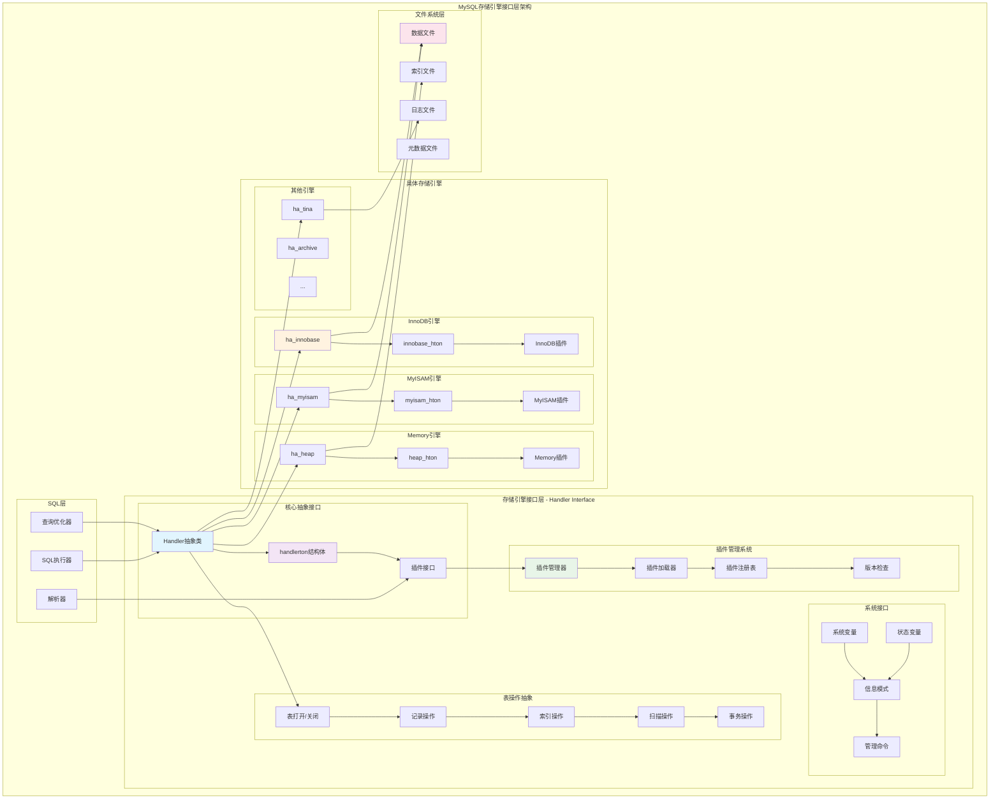
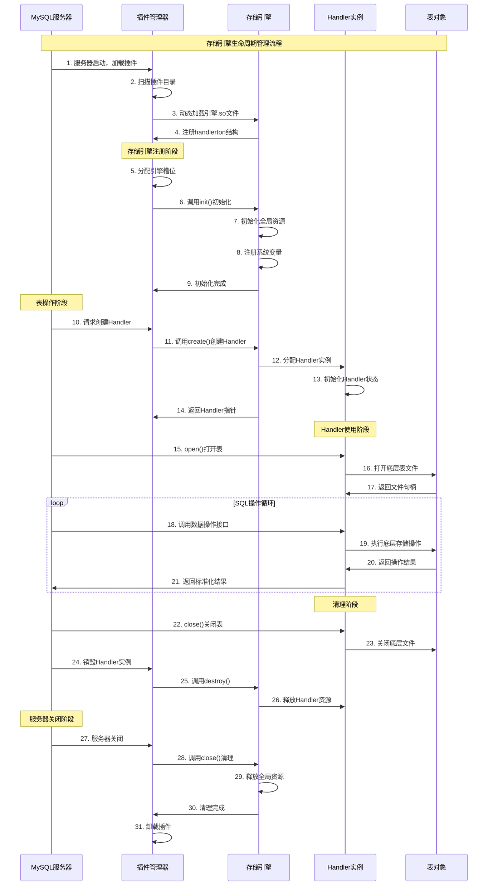
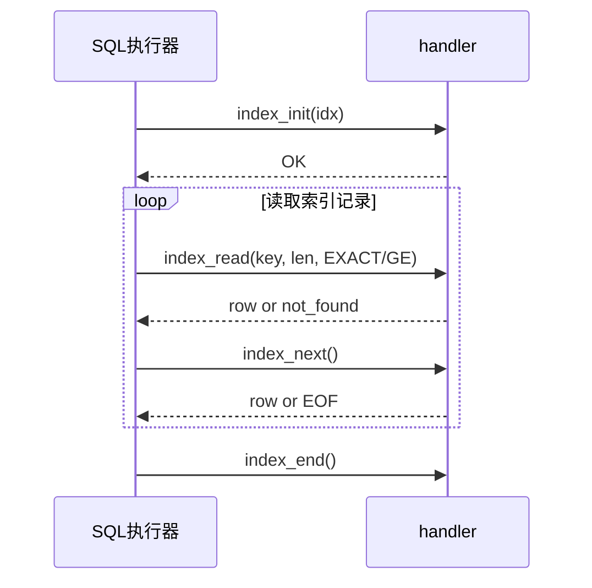
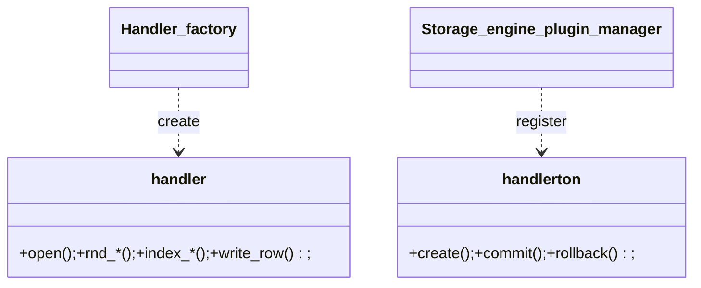

## 概述

MySQL存储引擎接口层是数据库系统的核心抽象层，它定义了统一的存储引擎API，使得MySQL能够支持多种不同的存储引擎。这一接口层的设计原理、核心数据结构和实现机制。

<!--more-->

## 1. 存储引擎接口层整体架构

### 1.1 接口层设计原则

MySQL存储引擎接口层采用经典的抽象工厂模式：

- **统一接口**：所有存储引擎实现相同的抽象接口
- **插件化架构**：支持动态加载和卸载存储引擎
- **透明性**：上层SQL层无需关心具体存储引擎实现
- **扩展性**：易于添加新的存储引擎

### 1.2 存储引擎接口层架构图



## 2. Handler抽象类深度解析

### 2.1 Handler类核心定义

Handler类是所有存储引擎必须实现的抽象基类：

```cpp
/**
 * Handler类：MySQL存储引擎接口的抽象基类
 * 定义了所有存储引擎必须实现的接口方法
 * 为SQL层提供统一的数据访问接口
 */
class handler {
protected:
    // 基础成员变量
    TABLE_SHARE *table_share;    ///< 表共享信息，包含表的元数据
    TABLE *table;                ///< 当前操作的表对象指针
    handlerton *ht;             ///< 指向存储引擎句柄的指针
    
    // 记录定位和引用
    uchar *ref;                  ///< 当前记录的物理位置引用
    uchar *dup_ref;             ///< 重复键检测时使用的引用
    uint ref_length;            ///< 记录引用的字节长度
    
    // 索引相关
    uint active_index;          ///< 当前活跃索引的编号（MAX_KEY表示无索引）
    uint keyread;               ///< 仅读索引标志位掩码
    
    // 统计信息
    ha_statistics stats;         ///< 表统计信息（记录数、索引大小等）
    ha_rows estimation_rows_to_insert; ///< 预估要插入的行数
    
    // 性能监控相关  
    PSI_table *m_psi;           ///< Performance Schema表接口
    PSI_table_locker_state m_psi_locker_state; ///< PSI状态
    
public:
    /**
     * Handler构造函数
     * @param hton 存储引擎句柄指针
     * @param share 表共享信息指针
     */
    handler(handlerton *hton_arg, TABLE_SHARE *share_arg)
        : table_share(share_arg), table(nullptr), ht(hton_arg),
          ref(nullptr), dup_ref(nullptr), ref_length(sizeof(my_off_t)),
          active_index(MAX_KEY), keyread(0) {
        // 初始化统计信息
        memset(&stats, 0, sizeof(stats));
        estimation_rows_to_insert = 0;
        m_psi = nullptr;
    }
    
    /**
     * 虚析构函数，确保派生类正确析构
     */
    virtual ~handler() = default;
    
    // ========== 表生命周期管理接口 ==========
    
    /**
     * 打开表文件
     * @param name 表名（包含路径）
     * @param mode 打开模式（O_RDONLY, O_RDWR等）
     * @param test_if_locked 是否测试表锁定状态
     * @return 0表示成功，非0表示错误码
     */
    virtual int open(const char *name, int mode, uint test_if_locked) = 0;
    
    /**
     * 关闭表文件，释放相关资源
     * @return 0表示成功，非0表示错误码
     */
    virtual int close() = 0;
    
    /**
     * 创建新表
     * @param name 表名
     * @param table_arg 表结构信息
     * @param ha_create_info 创建参数
     * @return 0表示成功，非0表示错误码
     */
    virtual int create(const char *name, TABLE *table_arg,
                      HA_CREATE_INFO *ha_create_info,
                      dd::Table *table_def) {
        // 默认实现返回不支持
        return HA_ERR_WRONG_COMMAND;
    }
    
    /**
     * 删除表文件
     * @param name 表名
     * @return 0表示成功，非0表示错误码
     */
    virtual int delete_table(const char *name, const dd::Table *table_def) {
        return HA_ERR_WRONG_COMMAND;
    }
    
    // ========== 数据扫描接口 ==========
    
    /**
     * 初始化全表扫描
     * @param scan true表示进行扫描，false表示仅初始化
     * @return 0表示成功，非0表示错误码
     */
    virtual int rnd_init(bool scan = true) = 0;
    
    /**
     * 结束全表扫描，释放相关资源
     * @return 0表示成功，非0表示错误码
     */
    virtual int rnd_end() = 0;
    
    /**
     * 读取下一条记录（全表扫描）
     * @param buf 用于存储记录数据的缓冲区
     * @return 0表示成功，HA_ERR_END_OF_FILE表示扫描结束，其他表示错误
     */
    virtual int rnd_next(uchar *buf) = 0;
    
    /**
     * 根据位置读取指定记录
     * @param buf 用于存储记录数据的缓冲区
     * @param pos 记录位置信息
     * @return 0表示成功，HA_ERR_KEY_NOT_FOUND表示记录不存在
     */
    virtual int rnd_pos(uchar *buf, uchar *pos) = 0;
    
    /**
     * 获取当前记录的位置信息
     * @param ref 用于存储位置信息的缓冲区
     */
    virtual void position(const uchar *record) = 0;
    
    // ========== 索引操作接口 ==========
    
    /**
     * 初始化索引扫描
     * @param idx 索引编号
     * @param sorted 是否需要排序结果
     * @return 0表示成功，非0表示错误码
     */
    virtual int index_init(uint idx, bool sorted = false) = 0;
    
    /**
     * 结束索引扫描
     * @return 0表示成功，非0表示错误码
     */
    virtual int index_end() = 0;
    
    /**
     * 根据键值读取记录
     * @param buf 用于存储记录数据的缓冲区
     * @param key 搜索键值
     * @param key_len 键值长度
     * @param find_flag 查找标志（HA_READ_KEY_EXACT等）
     * @return 0表示成功，HA_ERR_KEY_NOT_FOUND表示未找到
     */
    virtual int index_read(uchar *buf, const uchar *key, uint key_len,
                          enum ha_rkey_function find_flag) = 0;
                          
    /**
     * 读取下一条索引记录
     * @param buf 用于存储记录数据的缓冲区
     * @return 0表示成功，HA_ERR_END_OF_FILE表示扫描结束
     */
    virtual int index_next(uchar *buf) = 0;
    
    /**
     * 读取前一条索引记录
     * @param buf 用于存储记录数据的缓冲区
     * @return 0表示成功，HA_ERR_END_OF_FILE表示到达开始
     */
    virtual int index_prev(uchar *buf) = 0;
    
    /**
     * 读取第一条索引记录
     * @param buf 用于存储记录数据的缓冲区
     * @return 0表示成功，HA_ERR_END_OF_FILE表示索引为空
     */
    virtual int index_first(uchar *buf) = 0;
    
    /**
     * 读取最后一条索引记录
     * @param buf 用于存储记录数据的缓冲区
     * @return 0表示成功，HA_ERR_END_OF_FILE表示索引为空
     */
    virtual int index_last(uchar *buf) = 0;
    
    // ========== 数据修改接口 ==========
    
    /**
     * 插入新记录
     * @param buf 要插入的记录数据
     * @return 0表示成功，HA_ERR_FOUND_DUPP_KEY表示重复键错误
     */
    virtual int write_row(uchar *buf) = 0;
    
    /**
     * 更新当前记录
     * @param old_data 旧记录数据
     * @param new_data 新记录数据
     * @return 0表示成功，非0表示错误码
     */
    virtual int update_row(const uchar *old_data, const uchar *new_data) = 0;
    
    /**
     * 删除当前记录
     * @param buf 要删除的记录数据
     * @return 0表示成功，非0表示错误码
     */
    virtual int delete_row(const uchar *buf) = 0;
    
    // ========== 事务接口 ==========
    
    /**
     * 开始事务
     * @param thd 线程句柄
     * @param level 事务隔离级别
     * @return 0表示成功，非0表示错误码
     */
    virtual int start_stmt(THD *thd, thr_lock_type lock_type) { return 0; }
    
    /**
     * 外部锁定（表级锁）
     * @param thd 线程句柄
     * @param lock_type 锁类型
     * @return 0表示成功，非0表示错误码
     */
    virtual int external_lock(THD *thd, int lock_type) { return 0; }
    
    // ========== 统计信息接口 ==========
    
    /**
     * 获取表统计信息
     * @param flag 信息类型标志
     * @return 0表示成功，非0表示错误码
     */
    virtual int info(uint flag) = 0;
    
    /**
     * 获取记录数估算值
     * @return 表中的记录数
     */
    virtual ha_rows records() { return stats.records; }
    
    /**
     * 估算索引基数
     * @param inx 索引编号
     * @return 索引的基数（唯一值数量）
     */
    virtual ha_rows index_cardinality(uint inx) {
        return stats.records / 10; // 简单估算
    }
    
    // ========== 能力标志接口 ==========
    
    /**
     * 获取表级功能标志
     * @return 功能标志位掩码
     */
    virtual Table_flags table_flags() const = 0;
    
    /**
     * 获取索引级功能标志
     * @param idx 索引编号
     * @param part 索引部分编号
     * @param all_parts 是否包含所有部分
     * @return 索引功能标志位掩码
     */
    virtual ulong index_flags(uint idx, uint part, bool all_parts) const = 0;
    
    /**
     * 获取最大键长度
     * @return 支持的最大键长度（字节）
     */
    virtual uint max_key_length() const { return 0; }
    
    /**
     * 获取最大键部分数量
     * @return 支持的最大键部分数
     */
    virtual uint max_key_parts() const { return 0; }
    
    // ========== 批量操作接口 ==========
    
    /**
     * 开始批量插入
     * @param rows 预估插入行数
     * @param flags 插入标志
     */
    virtual void start_bulk_insert(ha_rows rows, uint flags = 0) {
        estimation_rows_to_insert = rows;
    }
    
    /**
     * 结束批量插入
     * @return 0表示成功，非0表示错误码
     */
    virtual int end_bulk_insert() { 
        estimation_rows_to_insert = 0;
        return 0; 
    }
    
    // ========== 工具方法 ==========
    
    /**
     * 获取存储引擎名称
     * @return 存储引擎名称字符串
     */
    virtual const char *table_type() const {
        return hton_name(ht)->str;
    }
    
    /**
     * 检查是否支持指定操作
     * @param operation 操作类型
     * @return true表示支持，false表示不支持
     */
    bool check_if_supported_operation(enum ha_base_keytype operation) const {
        return (table_flags() & operation) != 0;
    }
    
    /**
     * 打印错误信息
     * @param error 错误码
     * @param errflag 错误标志
     */
    virtual void print_error(int error, myf errflag);
    
protected:
    /**
     * 获取线程句柄
     * @return 当前线程的THD指针
     */
    THD *ha_thd() const;
    
    /**
     * 更新统计信息
     */
    void update_statistics() {
        // 更新访问次数、I/O次数等统计信息
        stats.data_file_length = get_data_file_size();
        stats.index_file_length = get_index_file_size();
        stats.records = estimate_record_count();
    }
    
    /**
     * 获取数据文件大小（由派生类实现）
     */
    virtual my_off_t get_data_file_size() const { return 0; }
    
    /**
     * 获取索引文件大小（由派生类实现）
     */
    virtual my_off_t get_index_file_size() const { return 0; }
    
    /**
     * 估算记录数（由派生类实现）
     */
    virtual ha_rows estimate_record_count() const { return HA_POS_ERROR; }
};
```

### 2.2 Handler错误码定义

```cpp
/**
 * Handler接口错误码定义
 * 这些错误码用于统一不同存储引擎的错误报告
 */
enum ha_base_keytype {
    // 成功状态
    HA_ERR_OK = 0,                    ///< 操作成功
    
    // 通用错误
    HA_ERR_KEY_NOT_FOUND = 120,       ///< 键值未找到
    HA_ERR_FOUND_DUPP_KEY = 121,      ///< 发现重复键
    HA_ERR_RECORD_CHANGED = 123,      ///< 记录已被修改（乐观锁）
    HA_ERR_WRONG_INDEX = 124,         ///< 错误的索引
    HA_ERR_CRASHED = 126,             ///< 表文件损坏
    HA_ERR_WRONG_IN_RECORD = 127,     ///< 记录格式错误
    HA_ERR_OUT_OF_MEM = 128,          ///< 内存不足
    
    // 文件操作错误
    HA_ERR_NOT_A_TABLE = 130,         ///< 不是有效的表文件
    HA_ERR_WRONG_COMMAND = 131,       ///< 不支持的操作
    HA_ERR_OLD_FILE = 132,            ///< 旧文件格式
    HA_ERR_NO_ACTIVE_RECORD = 133,    ///< 没有活跃记录
    HA_ERR_RECORD_DELETED = 134,      ///< 记录已删除
    HA_ERR_RECORD_FILE_FULL = 135,    ///< 记录文件已满
    HA_ERR_INDEX_FILE_FULL = 136,     ///< 索引文件已满
    HA_ERR_END_OF_FILE = 137,         ///< 到达文件末尾
    HA_ERR_UNSUPPORTED = 138,         ///< 不支持的功能
    
    // 锁相关错误
    HA_ERR_TO_BIG_ROW = 139,          ///< 行太大
    HA_ERR_WRONG_CREATE_OPTION = 140, ///< 错误的创建选项
    HA_ERR_FOUND_DUPP_UNIQUE = 141,   ///< 唯一索引重复
    HA_ERR_UNKNOWN_CHARSET = 142,     ///< 未知字符集
    HA_ERR_WRONG_MRG_TABLE_DEF = 143, ///< 错误的合并表定义
    HA_ERR_CRASHED_ON_REPAIR = 144,   ///< 修复时表损坏
    HA_ERR_CRASHED_ON_USAGE = 145,    ///< 使用时表损坏
    HA_ERR_LOCK_WAIT_TIMEOUT = 146,   ///< 锁等待超时
    HA_ERR_LOCK_TABLE_FULL = 147,     ///< 锁表已满
    HA_ERR_READ_ONLY_TRANSACTION = 148, ///< 只读事务
    
    // 死锁和事务错误
    HA_ERR_LOCK_DEADLOCK = 149,       ///< 检测到死锁
    HA_ERR_CANNOT_ADD_FOREIGN = 150,  ///< 无法添加外键
    HA_ERR_NO_REFERENCED_ROW = 151,   ///< 没有被引用行
    HA_ERR_ROW_IS_REFERENCED = 152,   ///< 行被引用中
    HA_ERR_NO_SAVEPOINT = 153,        ///< 没有保存点
    HA_ERR_NON_UNIQUE_BLOCK_SIZE = 154, ///< 非唯一块大小
    HA_ERR_NO_SUCH_TABLE = 155,       ///< 表不存在
    HA_ERR_TABLE_EXIST = 156,         ///< 表已存在
    HA_ERR_NO_CONNECTION = 157,       ///< 没有连接
    HA_ERR_NULL_IN_SPATIAL = 158,     ///< 空间索引中有NULL值
    HA_ERR_TABLE_DEF_CHANGED = 159,   ///< 表定义已改变
    HA_ERR_NO_PARTITION_FOUND = 160,  ///< 未找到分区
    HA_ERR_RBR_LOGGING_FAILED = 161,  ///< RBR日志记录失败
    HA_ERR_DROP_INDEX_FK = 162,       ///< 不能删除外键索引
    HA_ERR_FOREIGN_DUPLICATE_KEY = 163, ///< 外键重复键
    HA_ERR_TABLE_NEEDS_UPGRADE = 164, ///< 表需要升级
    HA_ERR_TABLE_READONLY = 165,      ///< 表只读
    HA_ERR_AUTOINC_READ_FAILED = 166, ///< 自增读取失败
    HA_ERR_AUTOINC_ERANGE = 167,      ///< 自增值超出范围
    HA_ERR_GENERIC = 168,             ///< 通用错误
    HA_ERR_RECORD_IS_THE_SAME = 169,  ///< 记录相同
    HA_ERR_LOGGING_IMPOSSIBLE = 170,  ///< 无法记录日志
    HA_ERR_CORRUPT_EVENT = 171,       ///< 损坏事件
    HA_ERR_ROWS_EVENT_APPLY = 172,    ///< 行事件应用失败
    HA_ERR_FILE_TOO_SHORT = 173,      ///< 文件太短
    HA_ERR_WRONG_CRC = 174,           ///< CRC错误
    HA_ERR_TOO_MANY_CONCURRENT_TRXS = 175, ///< 并发事务太多
    HA_ERR_NOT_IN_LOCK_PARTITIONS = 176,   ///< 不在锁定分区中
    HA_ERR_INDEX_COL_TOO_LONG = 177,       ///< 索引列太长
    HA_ERR_INDEX_CORRUPT = 178,            ///< 索引损坏
    HA_ERR_UNDO_REC_TOO_BIG = 179,         ///< Undo记录太大
    HA_ERR_TABLE_IN_FK_CHECK = 180,        ///< 表在外键检查中
    HA_ERR_TABLESPACE_EXISTS = 181,        ///< 表空间已存在
    HA_ERR_FTS_EXCEED_RESULT_CACHE_LIMIT = 182, ///< 全文搜索结果超限
    HA_ERR_TEMP_FILE_WRITE_FAILURE = 183,  ///< 临时文件写入失败
    HA_ERR_INNODB_FORCED_RECOVERY = 184,   ///< InnoDB强制恢复模式
    HA_ERR_FTS_TOO_MANY_WORDS_IN_PHRASE = 185, ///< 短语中单词太多
    
    // 新增错误码
    HA_ERR_LAST = 186                 ///< 最后一个错误码
};

/**
 * 将Handler错误码转换为MySQL错误码
 * @param error Handler错误码
 * @return 对应的MySQL错误码
 */
int ha_error_to_mysql_error(int error) {
    switch (error) {
        case HA_ERR_KEY_NOT_FOUND:
            return ER_KEY_NOT_FOUND;
        case HA_ERR_FOUND_DUPP_KEY:
            return ER_DUP_KEY;
        case HA_ERR_RECORD_CHANGED:
            return ER_CHECKREAD;
        case HA_ERR_WRONG_INDEX:
            return ER_WRONG_MRG_TABLE;
        case HA_ERR_CRASHED:
            return ER_NOT_KEYFILE;
        case HA_ERR_OUT_OF_MEM:
            return ER_OUT_OF_RESOURCES;
        case HA_ERR_WRONG_COMMAND:
            return ER_ILLEGAL_HA;
        case HA_ERR_OLD_FILE:
            return ER_OLD_KEYFILE;
        case HA_ERR_UNSUPPORTED:
            return ER_UNSUPPORTED_EXTENSION;
        case HA_ERR_LOCK_WAIT_TIMEOUT:
            return ER_LOCK_WAIT_TIMEOUT;
        case HA_ERR_LOCK_DEADLOCK:
            return ER_LOCK_DEADLOCK;
        default:
            return ER_GET_ERRNO;
    }
}
```

## 3. handlerton结构体深度解析

### 3.1 handlerton核心定义

handlerton结构体定义了存储引擎的全局接口和属性：

```cpp
/**
 * handlerton：存储引擎的全局描述符
 * 包含存储引擎的全局函数指针、属性和状态信息
 * 每个存储引擎有且仅有一个handlerton实例
 */
struct handlerton {
    // 基础信息
    const char *name;               ///< 存储引擎名称
    SHOW_COMP_OPTION state;        ///< 引擎状态（SHOW_OPTION_YES/NO/DISABLED）
    const char *comment;           ///< 引擎描述信息
    uint db_type;                  ///< 数据库类型ID（向后兼容）
    
    // 插件信息
    plugin_ref plugin_ref;         ///< 插件引用
    uint slot;                     ///< 在hton数组中的槽位编号
    uint32 license;                ///< 许可证类型
    void *data;                    ///< 引擎私有数据指针
    
    // 能力标志
    uint32 flags;                  ///< 引擎功能标志位
    uint32 system_database_flag;   ///< 系统数据库标志
    
    // ========== 生命周期管理函数 ==========
    
    /**
     * 初始化存储引擎
     * @param hton handlerton指针
     * @return 0表示成功，非0表示失败
     */
    int (*init)(handlerton *hton);
    
    /**
     * 清理存储引擎，释放全局资源
     * @param hton handlerton指针
     * @return 0表示成功，非0表示失败
     */
    int (*close)(handlerton *hton);
    
    /**
     * 服务器启动后的初始化
     * 在所有插件加载完成后调用
     */
    void (*post_ddl)(THD *thd);
    
    /**
     * 服务器关闭前的清理
     */
    void (*pre_shutdown)(void);
    
    // ========== Handler实例管理 ==========
    
    /**
     * 创建Handler实例
     * @param hton handlerton指针
     * @param share 表共享信息
     * @param mem_root 内存分配器
     * @return 新创建的Handler实例指针
     */
    handler *(*create)(handlerton *hton, TABLE_SHARE *share, 
                      bool partitioned, MEM_ROOT *mem_root);
                      
    /**
     * 销毁Handler实例
     * @param handler 要销毁的Handler指针
     */
    void (*destroy)(handler *handler);
    
    // ========== 事务管理接口 ==========
    
    /**
     * 提交事务
     * @param hton handlerton指针
     * @param thd 线程句柄
     * @param all 是否提交全部事务层级
     * @return 0表示成功，非0表示失败
     */
    int (*commit)(handlerton *hton, THD *thd, bool all);
    
    /**
     * 回滚事务
     * @param hton handlerton指针
     * @param thd 线程句柄
     * @param all 是否回滚全部事务层级
     * @return 0表示成功，非0表示失败
     */
    int (*rollback)(handlerton *hton, THD *thd, bool all);
    
    /**
     * 准备两阶段提交
     * @param hton handlerton指针
     * @param thd 线程句柄
     * @param all 是否准备全部事务层级
     * @return 0表示成功，非0表示失败
     */
    int (*prepare)(handlerton *hton, THD *thd, bool all);
    
    /**
     * XA事务恢复
     * @param hton handlerton指针
     * @param list XA事务ID列表
     * @return 找到的XA事务数量
     */
    int (*recover)(handlerton *hton, XID *list, uint len);
    
    /**
     * 提交XA事务
     * @param hton handlerton指针
     * @param xid XA事务ID
     * @return 0表示成功，非0表示失败
     */
    int (*commit_by_xid)(handlerton *hton, XID *xid);
    
    /**
     * 回滚XA事务
     * @param hton handlerton指针
     * @param xid XA事务ID
     * @return 0表示成功，非0表示失败
     */
    int (*rollback_by_xid)(handlerton *hton, XID *xid);
    
    // ========== 保存点管理 ==========
    
    /**
     * 创建保存点
     * @param hton handlerton指针
     * @param thd 线程句柄
     * @param sv 保存点结构
     * @return 0表示成功，非0表示失败
     */
    int (*savepoint_set)(handlerton *hton, THD *thd, void *sv);
    
    /**
     * 回滚到保存点
     * @param hton handlerton指针
     * @param thd 线程句柄
     * @param sv 保存点结构
     * @return 0表示成功，非0表示失败
     */
    int (*savepoint_rollback)(handlerton *hton, THD *thd, void *sv);
    
    /**
     * 释放保存点
     * @param hton handlerton指针
     * @param thd 线程句柄
     * @param sv 保存点结构
     * @return 0表示成功，非0表示失败
     */
    int (*savepoint_release)(handlerton *hton, THD *thd, void *sv);
    
    /**
     * 保存点数据大小
     */
    uint savepoint_offset;
    
    // ========== 表管理接口 ==========
    
    /**
     * 发现表文件
     * @param hton handlerton指针
     * @param db 数据库名
     * @param name 表名
     * @param table_def 表定义（输出参数）
     * @return true表示找到，false表示未找到
     */
    bool (*discover_table)(handlerton *hton, THD *thd, 
                          const char *db, const char *name,
                          dd::Table **table_def);
                          
    /**
     * 发现表名列表
     * @param hton handlerton指针
     * @param db 数据库名  
     * @param dirp 目录句柄
     * @param result 结果列表
     * @return 0表示成功，非0表示失败
     */
    int (*discover_table_names)(handlerton *hton, const char *db,
                               MY_DIR *dirp,
                               handlerton::discovered_list *result);
                               
    /**
     * 删除表实现
     * @param hton handlerton指针
     * @param name 表名
     * @return 0表示成功，非0表示失败
     */
    int (*drop_table)(handlerton *hton, const char *name);
    
    /**
     * 重命名表实现
     * @param hton handlerton指针
     * @param from 原表名
     * @param to 新表名
     * @return 0表示成功，非0表示失败
     */
    int (*rename_table)(handlerton *hton, const char *from, const char *to);
    
    // ========== 统计信息接口 ==========
    
    /**
     * 获取表统计信息
     * @param hton handlerton指针
     * @param thd 线程句柄
     * @param check_opt 检查选项
     * @param name 表名
     * @return 统计信息结构
     */
    int (*get_tablespace_statistics)(handlerton *hton, const char *path,
                                   ha_tablespace_statistics *stats);
    
    /**
     * 更新表统计信息
     * @param hton handlerton指针
     * @param thd 线程句柄
     * @param table 表对象
     * @return 0表示成功，非0表示失败
     */
    int (*update_table_statistics)(handlerton *hton, THD *thd, TABLE *table);
    
    // ========== 系统变量和状态变量 ==========
    
    /**
     * 系统变量数组
     */
    struct st_mysql_sys_var **system_vars;
    
    /**
     * 状态变量数组
     */
    struct st_mysql_show_var *status_vars;
    
    /**
     * 获取系统变量值
     * @param thd 线程句柄
     * @param var 变量类型
     * @return 变量值
     */
    ulong (*get_sys_var_value)(THD *thd, int var);
    
    // ========== 复制支持接口 ==========
    
    /**
     * 准备复制
     * @param thd 线程句柄
     * @return 0表示成功，非0表示失败
     */
    int (*binlog_func)(handlerton *hton, THD *thd, enum_binlog_func fn, void *arg);
    
    /**
     * 检查是否支持复制
     * @return true表示支持，false表示不支持
     */
    bool (*is_supported_system_table)(const char *db, const char *table_name,
                                     bool is_sql_layer_system_table);
                                     
    // ========== 全文搜索接口 ==========
    
    /**
     * 创建全文索引解析器
     */
    int (*create_parser)(MYSQL_FTPARSER_PARAM *param);
    
    // ========== 分区支持 ==========
    
    /**
     * 分区标志位
     */
    uint32 partition_flags;
    
    /**
     * 获取分区处理器
     * @param table 表对象
     * @param mem_root 内存分配器
     * @return 分区处理器指针
     */
    Partition_handler *(*get_partition_handler)(TABLE *table, 
                                               MEM_ROOT *mem_root);
};

/**
 * handlerton功能标志位定义
 */
enum handlerton_flags {
    HTON_NO_FLAGS = 0,
    HTON_CLOSE_CURSORS_AT_COMMIT = (1 << 0),   ///< 提交时关闭游标
    HTON_ALTER_NOT_SUPPORTED = (1 << 1),       ///< 不支持ALTER TABLE
    HTON_CAN_RECREATE = (1 << 2),              ///< 可以重新创建
    HTON_FLUSH_AFTER_RENAME = (1 << 3),        ///< 重命名后需要刷新
    HTON_NOT_USER_SELECTABLE = (1 << 4),       ///< 用户不能选择此引擎
    HTON_TEMPORARY_NOT_SUPPORTED = (1 << 5),   ///< 不支持临时表
    HTON_SUPPORT_LOG_TABLES = (1 << 6),        ///< 支持日志表
    HTON_NO_PARTITION = (1 << 7),              ///< 不支持分区
    HTON_SUPPORTS_EXTENDED_KEYS = (1 << 8),    ///< 支持扩展键
    HTON_NATIVE_SYS_VERSIONING = (1 << 9),     ///< 支持系统版本控制
    HTON_SUPPORTS_ATOMIC_DDL = (1 << 10),      ///< 支持原子DDL
    HTON_SUPPORTS_FOREIGN_KEYS = (1 << 11),    ///< 支持外键
    HTON_SUPPORTS_TAGS = (1 << 12),            ///< 支持标签
    HTON_SUPPORTS_HISTOGRAM = (1 << 13)        ///< 支持直方图统计
};
```

## 4. 插件管理系统深度解析

### 4.1 插件管理器实现

```cpp
/**
 * 存储引擎插件管理器
 * 负责存储引擎的动态加载、注册和卸载
 */
class Storage_engine_plugin_manager {
private:
    // 全局存储引擎数组
    static handlerton *hton_table[MAX_HA];     ///< handlerton数组
    static uint total_ha;                      ///< 已注册的存储引擎数量
    
    // 插件注册表
    static std::unordered_map<std::string, handlerton*> engine_registry;
    static mysql_mutex_t plugin_mutex;         ///< 插件操作互斥锁
    
public:
    /**
     * 初始化插件管理器
     */
    static void init() {
        memset(hton_table, 0, sizeof(hton_table));
        total_ha = 0;
        mysql_mutex_init(key_LOCK_plugin, &plugin_mutex, MY_MUTEX_INIT_FAST);
    }
    
    /**
     * 注册存储引擎插件
     * @param engine_name 引擎名称
     * @param hton handlerton指针
     * @return 0表示成功，非0表示失败
     */
    static int register_storage_engine(const char *engine_name, handlerton *hton) {
        MUTEX_LOCK(lock, &plugin_mutex);
        
        // 检查是否已注册
        if (engine_registry.find(engine_name) != engine_registry.end()) {
            return ER_STORAGE_ENGINE_ALREADY_EXISTS;
        }
        
        // 检查数组容量
        if (total_ha >= MAX_HA) {
            return ER_TOO_MANY_STORAGE_ENGINES;
        }
        
        // 分配槽位
        uint slot = total_ha++;
        hton->slot = slot;
        hton_table[slot] = hton;
        
        // 加入注册表
        engine_registry[engine_name] = hton;
        
        // 调用引擎初始化
        if (hton->init && hton->init(hton)) {
            // 初始化失败，回滚注册
            unregister_storage_engine_internal(engine_name);
            return ER_STORAGE_ENGINE_INIT_FAILED;
        }
        
        LogErr(INFORMATION_LEVEL, ER_STORAGE_ENGINE_REGISTERED, engine_name);
        return 0;
    }
    
    /**
     * 卸载存储引擎插件
     * @param engine_name 引擎名称
     * @return 0表示成功，非0表示失败
     */
    static int unregister_storage_engine(const char *engine_name) {
        MUTEX_LOCK(lock, &plugin_mutex);
        
        auto it = engine_registry.find(engine_name);
        if (it == engine_registry.end()) {
            return ER_STORAGE_ENGINE_NOT_FOUND;
        }
        
        handlerton *hton = it->second;
        
        // 检查是否有表在使用此引擎
        if (count_tables_using_engine(hton) > 0) {
            return ER_STORAGE_ENGINE_IN_USE;
        }
        
        return unregister_storage_engine_internal(engine_name);
    }
    
    /**
     * 根据名称查找存储引擎
     * @param engine_name 引擎名称
     * @return handlerton指针，未找到返回nullptr
     */
    static handlerton* find_storage_engine(const char *engine_name) {
        MUTEX_LOCK(lock, &plugin_mutex);
        
        auto it = engine_registry.find(engine_name);
        return (it != engine_registry.end()) ? it->second : nullptr;
    }
    
    /**
     * 根据槽位获取存储引擎
     * @param slot 槽位编号
     * @return handlerton指针，槽位无效返回nullptr
     */
    static handlerton* get_storage_engine_by_slot(uint slot) {
        return (slot < total_ha) ? hton_table[slot] : nullptr;
    }
    
    /**
     * 获取所有已注册的存储引擎列表
     * @param engines 引擎列表（输出参数）
     * @return 引擎数量
     */
    static uint get_all_storage_engines(std::vector<handlerton*>& engines) {
        MUTEX_LOCK(lock, &plugin_mutex);
        
        engines.clear();
        engines.reserve(total_ha);
        
        for (uint i = 0; i < total_ha; ++i) {
            if (hton_table[i] != nullptr) {
                engines.push_back(hton_table[i]);
            }
        }
        
        return engines.size();
    }
    
    /**
     * 检查存储引擎是否可用
     * @param hton handlerton指针
     * @return true表示可用，false表示不可用
     */
    static bool is_storage_engine_available(handlerton *hton) {
        return hton && hton->state == SHOW_OPTION_YES;
    }
    
    /**
     * 清理插件管理器
     */
    static void cleanup() {
        MUTEX_LOCK(lock, &plugin_mutex);
        
        // 逆序清理所有引擎
        for (int i = total_ha - 1; i >= 0; --i) {
            handlerton *hton = hton_table[i];
            if (hton && hton->close) {
                hton->close(hton);
            }
        }
        
        engine_registry.clear();
        total_ha = 0;
        
        mysql_mutex_destroy(&plugin_mutex);
    }
    
private:
    /**
     * 内部卸载实现
     * @param engine_name 引擎名称
     * @return 0表示成功，非0表示失败
     */
    static int unregister_storage_engine_internal(const char *engine_name) {
        auto it = engine_registry.find(engine_name);
        if (it == engine_registry.end()) {
            return ER_STORAGE_ENGINE_NOT_FOUND;
        }
        
        handlerton *hton = it->second;
        uint slot = hton->slot;
        
        // 调用引擎清理
        if (hton->close) {
            hton->close(hton);
        }
        
        // 清理槽位
        hton_table[slot] = nullptr;
        
        // 如果是最后一个槽位，调整total_ha
        if (slot == total_ha - 1) {
            while (total_ha > 0 && hton_table[total_ha - 1] == nullptr) {
                total_ha--;
            }
        }
        
        // 从注册表移除
        engine_registry.erase(it);
        
        LogErr(INFORMATION_LEVEL, ER_STORAGE_ENGINE_UNREGISTERED, engine_name);
        return 0;
    }
    
    /**
     * 统计使用指定引擎的表数量
     * @param hton handlerton指针
     * @return 表数量
     */
    static uint count_tables_using_engine(handlerton *hton) {
        // 遍历所有打开的表，统计使用此引擎的数量
        uint count = 0;
        
        // 这里需要访问表缓存管理器
        // 具体实现略...
        
        return count;
    }
};
```

### 4.2 存储引擎实例创建流程

```cpp
/**
 * 存储引擎Handler实例创建和管理
 */
class Handler_factory {
public:
    /**
     * 创建Handler实例
     * @param hton handlerton指针
     * @param share 表共享信息
     * @param partitioned 是否为分区表
     * @param mem_root 内存分配器
     * @return Handler实例指针
     */
    static handler* create_handler(handlerton *hton, TABLE_SHARE *share,
                                  bool partitioned, MEM_ROOT *mem_root) {
        DBUG_TRACE;
        
        // 检查存储引擎是否可用
        if (!Storage_engine_plugin_manager::is_storage_engine_available(hton)) {
            LogErr(ERROR_LEVEL, ER_STORAGE_ENGINE_NOT_AVAILABLE, hton->name);
            return nullptr;
        }
        
        // 调用存储引擎的create函数
        handler *h = hton->create(hton, share, partitioned, mem_root);
        if (h == nullptr) {
            LogErr(ERROR_LEVEL, ER_HANDLER_CREATE_FAILED, hton->name);
            return nullptr;
        }
        
        // 设置表对象引用
        h->table_share = share;
        h->ht = hton;
        
        // 初始化性能监控接口
        if (PSI_TABLE_CALL(get_table_share) != nullptr) {
            h->m_psi = PSI_TABLE_CALL(get_table_share)(false, share);
        }
        
        // 初始化引用长度
        h->ref_length = h->get_ref_length();
        
        LogDebug(STORAGE_ENGINE_LOG, "Created handler for table %s.%s using engine %s",
                share->db.str, share->table_name.str, hton->name);
                
        return h;
    }
    
    /**
     * 销毁Handler实例
     * @param handler Handler实例指针
     */
    static void destroy_handler(handler *handler) {
        if (handler == nullptr) return;
        
        handlerton *hton = handler->ht;
        const char *engine_name = hton->name;
        const char *table_name = handler->table_share ? 
                                handler->table_share->table_name.str : "unknown";
        
        LogDebug(STORAGE_ENGINE_LOG, "Destroying handler for table %s using engine %s",
                table_name, engine_name);
        
        // 调用存储引擎的destroy函数
        if (hton->destroy) {
            hton->destroy(handler);
        } else {
            // 默认实现：直接删除
            delete handler;
        }
    }
    
    /**
     * 根据表类型创建Handler
     * @param table_type 表类型名称
     * @param share 表共享信息
     * @param mem_root 内存分配器
     * @return Handler实例指针
     */
    static handler* create_handler_by_name(const char *table_type,
                                          TABLE_SHARE *share, 
                                          MEM_ROOT *mem_root) {
        handlerton *hton = Storage_engine_plugin_manager::find_storage_engine(table_type);
        if (hton == nullptr) {
            LogErr(ERROR_LEVEL, ER_UNKNOWN_STORAGE_ENGINE, table_type);
            return nullptr;
        }
        
        return create_handler(hton, share, false, mem_root);
    }
    
    /**
     * 为分区表创建Handler
     * @param hton handlerton指针
     * @param share 表共享信息
     * @param mem_root 内存分配器
     * @return Handler实例指针
     */
    static handler* create_partition_handler(handlerton *hton, 
                                           TABLE_SHARE *share,
                                           MEM_ROOT *mem_root) {
        // 检查是否支持分区
        if (hton->flags & HTON_NO_PARTITION) {
            LogErr(ERROR_LEVEL, ER_PARTITION_NOT_SUPPORTED, hton->name);
            return nullptr;
        }
        
        return create_handler(hton, share, true, mem_root);
    }
    
private:
    /**
     * 获取引用长度的默认实现
     */
    static uint get_default_ref_length() {
        return sizeof(my_off_t);  // 默认使用文件偏移量大小
    }
};
```

## 5. 存储引擎生命周期管理

### 5.1 存储引擎初始化流程时序图



### 5.2 表打开和关闭流程

```cpp
/**
 * 表操作生命周期管理
 * 管理表的打开、使用和关闭过程
 */
class Table_lifecycle_manager {
public:
    /**
     * 打开表的完整流程
     * @param thd 线程句柄
     * @param table_share 表共享信息
     * @param table 表对象
     * @return 0表示成功，非0表示失败
     */
    static int open_table(THD *thd, TABLE_SHARE *share, TABLE *table) {
        DBUG_TRACE;
        int error = 0;
        
        // 1. 创建Handler实例
        handler *h = Handler_factory::create_handler(share->db_type(), 
                                                    share, false, 
                                                    &table->mem_root);
        if (h == nullptr) {
            return ER_OUTOFMEMORY;
        }
        
        table->file = h;
        h->table = table;
        
        // 2. 设置表标志和选项
        h->table_flags_are_set = false;
        
        // 3. 调用Handler的open方法
        char path[FN_REFLEN + 1];
        build_table_filename(path, sizeof(path) - 1,
                           share->db.str, share->table_name.str, "", 0);
                           
        error = h->open(path, table->db_stat, HA_OPEN_IGNORE_IF_LOCKED);
        if (error) {
            LogErr(ERROR_LEVEL, ER_CANT_OPEN_FILE, path, error);
            goto err;
        }
        
        // 4. 初始化索引信息
        error = init_table_indexes(table);
        if (error) goto err;
        
        // 5. 设置主键和唯一键信息
        error = setup_key_info(table);
        if (error) goto err;
        
        // 6. 初始化字段默认值
        error = init_field_defaults(table);
        if (error) goto err;
        
        // 7. 获取表统计信息
        error = h->info(HA_STATUS_VARIABLE | HA_STATUS_CONST);
        if (error) goto err;
        
        // 8. 设置记录缓冲区
        if (!(table->record[0] = (uchar*)alloc_root(&table->mem_root, 
                                                   share->reclength))) {
            error = ER_OUTOFMEMORY;
            goto err;
        }
        
        if (!(table->record[1] = (uchar*)alloc_root(&table->mem_root, 
                                                   share->reclength))) {
            error = ER_OUTOFMEMORY;
            goto err;
        }
        
        // 9. 初始化字段指针
        error = init_field_pointers(table);
        if (error) goto err;
        
        LogDebug(TABLE_LOG, "Successfully opened table %s.%s using engine %s",
                share->db.str, share->table_name.str, h->table_type());
                
        return 0;
        
    err:
        if (table->file) {
            table->file->close();
            Handler_factory::destroy_handler(table->file);
            table->file = nullptr;
        }
        return error;
    }
    
    /**
     * 关闭表的完整流程
     * @param table 表对象
     */
    static void close_table(TABLE *table) {
        DBUG_TRACE;
        
        if (table->file == nullptr) return;
        
        const char *table_name = table->s ? table->s->table_name.str : "unknown";
        const char *engine_name = table->file->table_type();
        
        LogDebug(TABLE_LOG, "Closing table %s using engine %s",
                table_name, engine_name);
        
        // 1. 刷新未提交的更改
        if (table->file->has_transactions()) {
            table->file->external_lock(current_thd, F_UNLCK);
        }
        
        // 2. 关闭Handler
        table->file->close();
        
        // 3. 清理Handler实例
        Handler_factory::destroy_handler(table->file);
        table->file = nullptr;
        
        // 4. 清理表级资源
        cleanup_table_resources(table);
        
        LogDebug(TABLE_LOG, "Table %s closed successfully", table_name);
    }
    
private:
    /**
     * 初始化表索引信息
     */
    static int init_table_indexes(TABLE *table) {
        TABLE_SHARE *share = table->s;
        handler *file = table->file;
        
        // 设置主键信息
        if (share->primary_key < MAX_KEY) {
            table->key_info = &share->key_info[share->primary_key];
        }
        
        // 检查索引功能支持
        for (uint i = 0; i < share->keys; i++) {
            KEY *key = &share->key_info[i];
            ulong flags = file->index_flags(i, 0, true);
            
            // 检查是否支持部分键扫描
            if (!(flags & HA_READ_NEXT)) {
                key->flags |= HA_NOSAME;  // 标记为不支持范围扫描
            }
            
            // 检查是否支持NULL值
            if (!(flags & HA_NULL_IN_KEY)) {
                for (uint j = 0; j < key->user_defined_key_parts; j++) {
                    if (key->key_part[j].field->null_bit) {
                        return ER_WRONG_INDEX_DEFINITION;
                    }
                }
            }
        }
        
        return 0;
    }
    
    /**
     * 设置键信息
     */
    static int setup_key_info(TABLE *table) {
        TABLE_SHARE *share = table->s;
        
        // 查找最优的主键或唯一键
        table->primary_key = share->primary_key;
        
        if (table->primary_key >= MAX_KEY) {
            // 没有显式主键，寻找唯一非空键
            for (uint i = 0; i < share->keys; i++) {
                KEY *key = &share->key_info[i];
                if ((key->flags & HA_NOSAME) && !(key->flags & HA_NULL_PART_KEY)) {
                    table->primary_key = i;
                    break;
                }
            }
        }
        
        return 0;
    }
    
    /**
     * 初始化字段默认值
     */
    static int init_field_defaults(TABLE *table) {
        for (Field **field = table->field; *field; field++) {
            if ((*field)->has_insert_default_general_value_expression() ||
                (*field)->has_update_default_general_value_expression()) {
                // 设置默认值表达式
                continue;
            }
            
            // 设置简单默认值
            (*field)->set_default();
        }
        
        return 0;
    }
    
    /**
     * 初始化字段指针
     */
    static int init_field_pointers(TABLE *table) {
        TABLE_SHARE *share = table->s;
        uchar *record = table->record[0];
        
        for (uint i = 0; i < share->fields; i++) {
            Field *field = share->field[i];
            field->ptr = record + field->offset(record);
            
            if (field->null_bit) {
                field->null_ptr = record + field->null_offset();
            }
        }
        
        return 0;
    }
    
    /**
     * 清理表级资源
     */
    static void cleanup_table_resources(TABLE *table) {
        // 清理字段资源
        if (table->field) {
            for (Field **field = table->field; *field; field++) {
                (*field)->cleanup();
            }
        }
        
        // 清理键缓存
        if (table->key_info) {
            // 键信息由TABLE_SHARE管理，无需单独释放
        }
        
        // 重置表状态
        table->db_stat = 0;
        table->status = STATUS_NO_RECORD;
    }
};
```

## 6. 总结

### 6.1 接口层核心优势

MySQL存储引擎接口层设计具有以下优势：

- **统一抽象**：为所有存储引擎提供统一的操作接口
- **插件化架构**：支持动态加载和卸载存储引擎
- **透明性**：上层SQL无需关心底层存储实现
- **扩展性**：易于开发和集成新的存储引擎

### 6.2 设计模式应用

接口层广泛应用了多种设计模式：

1. **抽象工厂模式**：Handler类作为产品接口，各存储引擎作为具体工厂
2. **策略模式**：不同存储引擎实现不同的数据存储策略
3. **模板方法模式**：定义通用的表操作流程模板
4. **适配器模式**：将不同存储引擎适配为统一接口


通过深入理解MySQL存储引擎接口层的设计和实现，我们能够更好地选择和优化存储引擎，并在需要时开发定制的存储解决方案。


## 附录A：关键函数核心代码与功能说明

- handler::{rnd_init/rnd_next/rnd_end/index_init/index_read/index_next}: 表扫描与索引扫描的统一接口（见前文实现）。
- handler::{write_row/update_row/delete_row}: DML 写路径抽象（见前文实现）。
- handlerton::{create/destroy/commit/rollback/prepare}: 引擎实例与事务对接（见前文实现）。
- Storage_engine_plugin_manager::{register/unregister/find}: 插件注册与查找（见前文实现）。
- Handler_factory::{create_handler/destroy_handler}: Handler 生命周期管理（见前文实现）。

## 附录B：统一调用链

- 打开表
  - Handler_factory::create_handler() → handler::open() → handler::info()
- 全表扫描
  - handler::rnd_init() → [loop] handler::rnd_next() → handler::rnd_end()
- 索引扫描
  - handler::index_init() → index_read()/index_next() → index_end()
- 写路径
  - handler::write_row()/update_row()/delete_row() → 引擎内部实现 → 返回标准化错误码
- 事务对接
  - handlerton::prepare() → MYSQL_BIN_LOG 组提交 → handlerton::commit()/rollback()

## 附录C：关键函数时序图（补充：索引扫描）



## 附录D：关键结构体类结构图与继承关系



