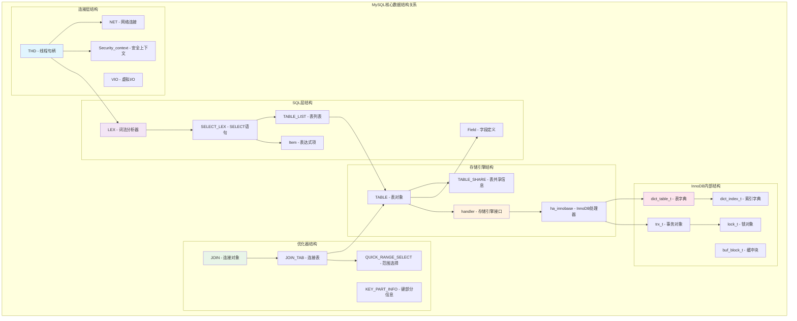
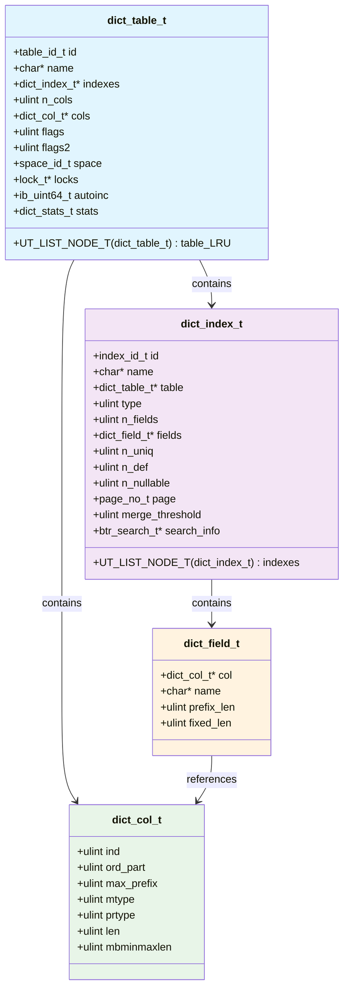
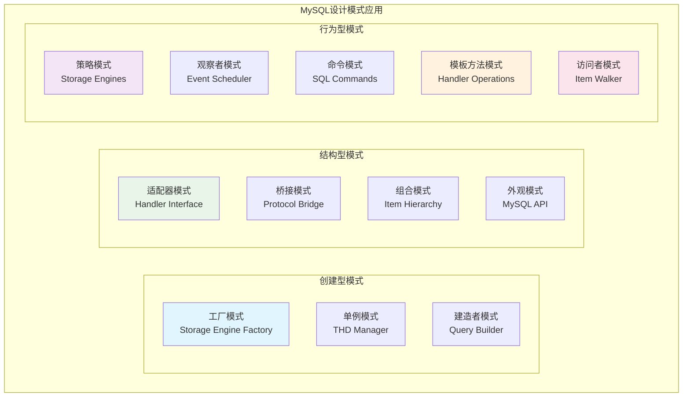

## 概述

MySQL虽然主要使用C++编写，但在设计上大量采用了面向对象的思想，通过继承、多态和封装等机制实现了高度模块化的架构。本文将深入分析MySQL中的核心结构体、类层次结构和继承关系，揭示其面向对象设计的精妙之处。

<!--more-->

## 1. MySQL核心类层次结构概览

### 1.1 整体继承关系图

```mermaid
classDiagram
    %% 核心基类
    class Sql_alloc {
        <<abstract>>
        +void* operator new(size_t size)
        +void operator delete(void* ptr)
    }
    
    class Item {
        <<abstract>>
        +enum Type type()
        +double val_real()
        +longlong val_int()
        +String* val_str()
        +bool is_null()
        +void print(String* str)
    }
    
    class handler {
        <<abstract>>
        +int open(const char* name)
        +int close()
        +int write_row(uchar* buf)
        +int update_row(const uchar* old, uchar* new)
        +int delete_row(const uchar* buf)
        +int index_read(uchar* buf, const uchar* key)
        +int rnd_init(bool scan)
        +int rnd_next(uchar* buf)
    }
    
    %% THD相关类
    class THD {
        +Security_context* security_context()
        +LEX* lex
        +NET net
        +Query_arena* stmt_arena
        +Open_tables_state open_tables_state
        +enum_server_command command
        +ulong thread_id()
        +void set_query(const char* query)
    }
    
    class Security_context {
        +LEX_CSTRING user
        +LEX_CSTRING host
        +LEX_CSTRING ip
        +ulong master_access
        +ulong db_access
        +char* priv_user
        +char* priv_host
        +char* priv_role
    }
    
    %% Item继承体系
    class Item_field {
        +Field* field
        +const char* field_name
        +const char* table_name
        +const char* db_name
        +void set_field(Field* field)
    }
    
    class Item_func {
        +Item** args
        +uint arg_count
        +const char* func_name()
        +void fix_length_and_dec()
    }
    
    class Item_sum {
        +enum Sumfunctype sum_func()
        +void clear()
        +bool add()
        +void reset_field()
    }
    
    class Item_subselect {
        +SELECT_LEX* select_lex
        +st_select_lex_unit* unit
        +bool is_correlated
    }
    
    %% Handler继承体系
    class ha_innobase {
        +dict_index_t* prebuilt_index
        +row_prebuilt_t* prebuilt
        +dict_table_t* ib_table
        +trx_t* trx
        +int general_fetch(uchar* buf, uint direction)
    }
    
    class ha_myisam {
        +MI_INFO* file
        +MI_KEYDEF* keydef
        +MI_COLUMNDEF* recinfo
        +int mi_scan_init()
        +int mi_scan(uchar* buf)
    }
    
    class ha_memory {
        +HP_INFO* file
        +HP_KEYDEF* keydef
        +int heap_scan_init()
        +int heap_scan(uchar* buf)
    }
    
    %% 继承关系
    Item <|-- Item_field
    Item <|-- Item_func
    Item <|-- Item_sum
    Item <|-- Item_subselect
    
    handler <|-- ha_innobase
    handler <|-- ha_myisam
    handler <|-- ha_memory
    
    THD --> Security_context : contains
    THD --> LEX : contains
    
    %% 样式
    style Item fill:#e1f5fe
    style handler fill:#f3e5f5
    style THD fill:#e8f5e8
    style ha_innobase fill:#fff3e0
    style Item_func fill:#fce4ec
```



### 1.2 核心数据结构关系图



## 2. 核心基类深度解析

### 2.1 Sql_alloc - 内存管理基类

```cpp
/**
 * MySQL SQL内存分配基类
 * 所有需要内存管理的SQL对象都继承自此类
 * 位置：sql/sql_alloc.h
 * 
 * 设计目的：
 * 1. 统一内存管理策略
 * 2. 支持内存池分配
 * 3. 防止内存泄漏
 * 4. 提供调试支持
 */
class Sql_alloc {
public:
    /**
     * 重载new操作符
     * 使用MySQL内存管理系统分配内存
     * @param size 分配大小
     * @return 分配的内存指针
     */
    static void *operator new(size_t size) noexcept {
        return sql_alloc(size);
    }
    
    /**
     * 重载new[]操作符
     * 用于数组分配
     */
    static void *operator new[](size_t size) noexcept {
        return sql_alloc(size);
    }
    
    /**
     * 重载带内存根的new操作符
     * 在指定的内存根上分配内存
     */
    static void *operator new(size_t size, MEM_ROOT *mem_root) noexcept {
        return alloc_root(mem_root, size);
    }
    
    /**
     * 重载delete操作符
     * MySQL使用内存池，通常不需要单独释放
     */
    static void operator delete(void *ptr, size_t size) noexcept {
        // MySQL使用内存池，单个对象通常不需要释放
        TRASH(ptr, size);
    }
    
    /**
     * 重载delete[]操作符
     */
    static void operator delete[](void *ptr, size_t size) noexcept {
        TRASH(ptr, size);
    }
    
    /**
     * 带内存根的delete操作符
     */
    static void operator delete(void *ptr, MEM_ROOT *mem_root) noexcept {
        // 内存根管理的内存不需要单独释放
    }
    
    /**
     * 虚析构函数
     * 确保派生类析构函数被正确调用
     */
    virtual ~Sql_alloc() = default;
    
protected:
    /**
     * SQL内存分配函数
     * 从当前线程的内存根分配内存
     */
    static void *sql_alloc(size_t size) {
        THD *thd = current_thd;
        if (thd) {
            return alloc_root(thd->mem_root, size);
        }
        return my_malloc(key_memory_SQL_ALLOC, size, MYF(MY_WME));
    }
};

/**
 * 内存根结构
 * MySQL的内存池管理核心数据结构
 */
struct MEM_ROOT {
    USED_MEM *used;              ///< 已使用内存块链表
    USED_MEM *pre_alloc;         ///< 预分配内存块
    size_t min_malloc;           ///< 最小分配大小
    size_t block_size;           ///< 块大小
    unsigned int block_num;      ///< 块编号
    unsigned int first_block_usage; ///< 第一块使用情况
    
    PSI_memory_key m_psi_key;    ///< 性能监控键
    
    /**
     * 内存根初始化
     * @param block_size 初始块大小
     */
    void init(size_t block_size) {
        used = nullptr;
        pre_alloc = nullptr;
        this->block_size = block_size;
        min_malloc = 32;
        block_num = 4;
        first_block_usage = 0;
        m_psi_key = key_memory_ROOT;
    }
    
    /**
     * 清理内存根
     * 释放所有分配的内存块
     */
    void clear() {
        USED_MEM *next;
        for (USED_MEM *block = used; block; block = next) {
            next = block->next;
            my_free(block);
        }
        used = nullptr;
        pre_alloc = nullptr;
    }
};
```

### 2.2 Item - 表达式基类

```cpp
/**
 * MySQL表达式项基类
 * 所有SQL表达式都继承自此类
 * 位置：sql/item.h
 * 
 * 设计模式：
 * 1. 访问者模式 - 支持不同的遍历操作
 * 2. 策略模式 - 不同类型的求值策略
 * 3. 模板方法模式 - 统一的处理流程
 */
class Item : public Parse_tree_node_tmpl<Item> {
public:
    /**
     * 表达式项类型枚举
     * 用于运行时类型识别
     */
    enum Type {
        FIELD_ITEM = 0,          ///< 字段引用
        FUNC_ITEM,               ///< 函数调用
        SUM_FUNC_ITEM,           ///< 聚合函数
        STRING_ITEM,             ///< 字符串常量
        INT_ITEM,                ///< 整数常量
        REAL_ITEM,               ///< 实数常量
        NULL_ITEM,               ///< NULL值
        VARBIN_ITEM,             ///< 变长二进制
        COPY_STR_ITEM,           ///< 复制字符串
        FIELD_AVG_ITEM,          ///< 平均值字段
        DEFAULT_VALUE_ITEM,      ///< 默认值
        PROC_ITEM,               ///< 存储过程项
        COND_ITEM,               ///< 条件项
        REF_ITEM,                ///< 引用项
        FIELD_STD_ITEM,          ///< 标准差字段
        FIELD_VARIANCE_ITEM,     ///< 方差字段
        INSERT_VALUE_ITEM,       ///< 插入值
        SUBSELECT_ITEM,          ///< 子查询
        ROW_ITEM,                ///< 行构造器
        CACHE_ITEM,              ///< 缓存项
        TYPE_HOLDER,             ///< 类型持有者
        PARAM_ITEM,              ///< 参数项
        TRIGGER_FIELD_ITEM,      ///< 触发器字段
        DECIMAL_ITEM,            ///< 十进制数
        XPATH_NODESET,           ///< XPath节点集
        XPATH_NODESET_CMP,       ///< XPath节点比较
        VIEW_FIXER_ITEM,         ///< 视图修复项
        EXPR_CACHE_ITEM          ///< 表达式缓存项
    };
    
    /**
     * 结果类型枚举
     */
    enum Result_type {
        STRING_RESULT = 0,       ///< 字符串结果
        REAL_RESULT,             ///< 实数结果
        INT_RESULT,              ///< 整数结果
        ROW_RESULT,              ///< 行结果
        DECIMAL_RESULT           ///< 十进制结果
    };
    
protected:
    // 核心属性
    String str_value;            ///< 字符串值缓存
    char *name;                  ///< 项名称
    Item *next;                  ///< 链表下一项
    uint32 max_length;           ///< 最大长度
    
    // 类型和属性标志
    Item_result cached_result_type; ///< 缓存的结果类型
    const CHARSET_INFO *collation; ///< 字符集信息
    
    // 状态标志
    bool fixed;                  ///< 是否已固定
    bool null_value;             ///< 是否为NULL值
    bool unsigned_flag;          ///< 是否为无符号
    bool with_sum_func;          ///< 是否包含聚合函数
    
public:
    /**
     * 构造函数
     */
    Item() : str_value(), name(nullptr), next(nullptr), max_length(0),
             cached_result_type(STRING_RESULT), collation(&my_charset_bin),
             fixed(false), null_value(false), unsigned_flag(false),
             with_sum_func(false) {}
    
    /**
     * 虚析构函数
     */
    virtual ~Item() = default;
    
    // ========== 纯虚函数接口 ==========
    
    /**
     * 获取项类型
     * @return 项类型枚举值
     */
    virtual enum Type type() const = 0;
    
    /**
     * 获取实数值
     * @return 实数值
     */
    virtual double val_real() = 0;
    
    /**
     * 获取整数值
     * @return 整数值
     */
    virtual longlong val_int() = 0;
    
    /**
     * 获取字符串值
     * @param str 输出字符串
     * @return 字符串指针
     */
    virtual String *val_str(String *str) = 0;
    
    /**
     * 获取十进制值
     * @param decimal_value 输出十进制值
     * @return 十进制指针
     */
    virtual my_decimal *val_decimal(my_decimal *decimal_value) = 0;
    
    /**
     * 获取结果类型
     * @return 结果类型枚举值
     */
    virtual enum Item_result result_type() const = 0;
    
    // ========== 虚函数接口 ==========
    
    /**
     * 固定字段引用和类型
     * @param thd 线程句柄
     * @param ref 引用指针
     * @return 是否成功
     */
    virtual bool fix_fields(THD *thd, Item **ref) {
        fixed = true;
        return false;
    }
    
    /**
     * 检查是否为NULL值
     * @return 是否为NULL
     */
    virtual bool is_null() {
        return null_value;
    }
    
    /**
     * 打印项内容
     * @param str 输出字符串
     * @param query_type 查询类型
     */
    virtual void print(String *str, enum_query_type query_type) const {
        str->append(name ? name : "NULL");
    }
    
    /**
     * 克隆项对象
     * @return 克隆的项指针
     */
    virtual Item *clone_item() const {
        return nullptr;  // 默认不支持克隆
    }
    
    /**
     * 遍历子项
     * @param processor 处理函数
     * @param walk 遍历方向
     * @param arg 参数
     * @return 是否继续遍历
     */
    virtual bool walk(Item_processor processor, enum_walk walk, uchar *arg) {
        return false;  // 默认没有子项
    }
    
    /**
     * 转换项类型
     * @param transformer 转换函数
     * @param arg 参数
     * @return 转换后的项
     */
    virtual Item *transform(Item_transformer transformer, uchar *arg) {
        return this;  // 默认不转换
    }
    
    // ========== 辅助方法 ==========
    
    /**
     * 设置项名称
     * @param str 名称字符串
     */
    void set_name(const char *str) {
        name = my_strdup(str, MYF(MY_WME));
    }
    
    /**
     * 获取项名称
     * @return 名称字符串
     */
    const char *get_name() const {
        return name ? name : "NULL";
    }
    
    /**
     * 检查是否已固定
     * @return 是否已固定
     */
    bool is_fixed() const {
        return fixed;
    }
    
    /**
     * 获取最大长度
     * @return 最大长度
     */
    uint32 get_max_length() const {
        return max_length;
    }
    
    /**
     * 设置最大长度
     * @param length 长度值
     */
    void set_max_length(uint32 length) {
        max_length = length;
    }
    
    /**
     * 类型转换辅助函数
     */
    template<class T>
    T *as() {
        return dynamic_cast<T*>(this);
    }
    
    template<class T>
    const T *as() const {
        return dynamic_cast<const T*>(this);
    }
};

/**
 * 字段项类 - Item的重要派生类
 * 表示对表字段的引用
 */
class Item_field : public Item_ident {
private:
    Field *field;                ///< 关联的字段对象
    TABLE *table;                ///< 所属表对象
    
public:
    /**
     * 构造函数
     * @param context_arg 上下文
     * @param db_name_arg 数据库名
     * @param table_name_arg 表名
     * @param field_name_arg 字段名
     */
    Item_field(Name_resolution_context *context_arg,
               const char *db_name_arg,
               const char *table_name_arg,
               const char *field_name_arg)
        : Item_ident(context_arg, db_name_arg, table_name_arg, field_name_arg),
          field(nullptr), table(nullptr) {}
    
    /**
     * 获取项类型
     */
    enum Type type() const override {
        return FIELD_ITEM;
    }
    
    /**
     * 获取实数值
     */
    double val_real() override {
        DBUG_ASSERT(fixed == 1);
        if ((null_value = field->is_null())) {
            return 0.0;
        }
        return field->val_real();
    }
    
    /**
     * 获取整数值
     */
    longlong val_int() override {
        DBUG_ASSERT(fixed == 1);
        if ((null_value = field->is_null())) {
            return 0;
        }
        return field->val_int();
    }
    
    /**
     * 获取字符串值
     */
    String *val_str(String *str) override {
        DBUG_ASSERT(fixed == 1);
        if ((null_value = field->is_null())) {
            return nullptr;
        }
        return field->val_str(str, &str_value);
    }
    
    /**
     * 获取十进制值
     */
    my_decimal *val_decimal(my_decimal *decimal_value) override {
        DBUG_ASSERT(fixed == 1);
        if ((null_value = field->is_null())) {
            return nullptr;
        }
        return field->val_decimal(decimal_value);
    }
    
    /**
     * 获取结果类型
     */
    enum Item_result result_type() const override {
        return field->result_type();
    }
    
    /**
     * 设置字段对象
     * @param field_arg 字段对象
     */
    void set_field(Field *field_arg) {
        field = field_arg;
        table = field_arg ? field_arg->table : nullptr;
        max_length = field_arg ? field_arg->field_length : 0;
        
        if (field_arg) {
            collation.set(field_arg->charset());
            unsigned_flag = field_arg->flags & UNSIGNED_FLAG;
        }
    }
    
    /**
     * 获取字段对象
     */
    Field *get_field() const {
        return field;
    }
    
    /**
     * 获取表对象
     */
    TABLE *get_table() const {
        return table;
    }
    
    /**
     * 固定字段引用
     */
    bool fix_fields(THD *thd, Item **ref) override {
        DBUG_ASSERT(fixed == 0);
        
        if (!field) {
            // 需要解析字段引用
            if (resolve_field_reference(thd)) {
                return true;
            }
        }
        
        return Item_ident::fix_fields(thd, ref);
    }
    
private:
    /**
     * 解析字段引用
     * 在表列表中查找匹配的字段
     */
    bool resolve_field_reference(THD *thd) {
        // 实现字段解析逻辑
        // 这里简化处理
        return false;
    }
};
```

### 2.3 handler - 存储引擎基类

```cpp
/**
 * MySQL存储引擎处理器基类
 * 定义了存储引擎的统一接口
 * 位置：sql/handler.h
 * 
 * 设计模式：
 * 1. 策略模式 - 不同存储引擎的实现策略
 * 2. 模板方法模式 - 统一的操作流程
 * 3. 工厂模式 - 存储引擎的创建
 */
class handler : public Sql_alloc {
public:
    /**
     * 表标志枚举
     * 定义存储引擎的能力特性
     */
    typedef ulonglong Table_flags;
    
    static const Table_flags HA_REC_NOT_IN_SEQ = 1;
    static const Table_flags HA_CAN_GEOMETRY = 2;
    static const Table_flags HA_FAST_KEY_READ = 4;
    static const Table_flags HA_SLOW_RND_POS = 8;
    static const Table_flags HA_NO_TRANSACTIONS = 16;
    static const Table_flags HA_PARTIAL_COLUMN_READ = 32;
    static const Table_flags HA_TABLE_SCAN_ON_INDEX = 64;
    static const Table_flags HA_CAN_INDEX_BLOBS = 128;
    static const Table_flags HA_CAN_SQL_HANDLER = 256;
    static const Table_flags HA_NO_AUTO_INCREMENT = 512;
    static const Table_flags HA_HAS_RECORDS = 1024;
    static const Table_flags HA_CAN_INSERT_DELAYED = 2048;
    static const Table_flags HA_PRIMARY_KEY_REQUIRED_FOR_POSITION = 4096;
    static const Table_flags HA_CAN_FULLTEXT = 8192;
    static const Table_flags HA_CAN_RTREEKEYS = 16384;
    static const Table_flags HA_DUPLICATE_POS = 32768;
    static const Table_flags HA_CAN_INDEX_VIRTUAL_GENERATED_COLUMN = 65536;
    
protected:
    TABLE_SHARE *table_share;    ///< 表共享信息
    TABLE *table;                ///< 表对象
    uchar *ref;                  ///< 行引用缓冲区
    uchar *dup_ref;              ///< 重复行引用缓冲区
    
    // 统计信息
    ha_statistics stats;         ///< 表统计信息
    
    // 状态信息
    int active_index;            ///< 当前活跃索引
    uint ref_length;             ///< 引用长度
    
    // 错误处理
    int my_errno;                ///< 最后错误码
    
public:
    /**
     * 构造函数
     * @param hton 存储引擎类型
     * @param share 表共享信息
     */
    handler(handlerton *hton, TABLE_SHARE *share)
        : table_share(share), table(nullptr), ref(nullptr), dup_ref(nullptr),
          active_index(MAX_KEY), ref_length(sizeof(my_off_t)), my_errno(0) {
        
        // 初始化统计信息
        memset(&stats, 0, sizeof(stats));
    }
    
    /**
     * 虚析构函数
     */
    virtual ~handler() = default;
    
    // ========== 纯虚函数接口 ==========
    
    /**
     * 打开表
     * @param name 表名
     * @param mode 打开模式
     * @param test_if_locked 测试锁定标志
     * @return 错误码，0表示成功
     */
    virtual int open(const char *name, int mode, uint test_if_locked) = 0;
    
    /**
     * 关闭表
     * @return 错误码，0表示成功
     */
    virtual int close() = 0;
    
    /**
     * 写入行
     * @param buf 行数据缓冲区
     * @return 错误码，0表示成功
     */
    virtual int write_row(uchar *buf) = 0;
    
    /**
     * 更新行
     * @param old_data 旧行数据
     * @param new_data 新行数据
     * @return 错误码，0表示成功
     */
    virtual int update_row(const uchar *old_data, uchar *new_data) = 0;
    
    /**
     * 删除行
     * @param buf 行数据缓冲区
     * @return 错误码，0表示成功
     */
    virtual int delete_row(const uchar *buf) = 0;
    
    /**
     * 初始化随机扫描
     * @param scan 扫描标志
     * @return 错误码，0表示成功
     */
    virtual int rnd_init(bool scan) = 0;
    
    /**
     * 随机读取下一行
     * @param buf 行数据缓冲区
     * @return 错误码，0表示成功，HA_ERR_END_OF_FILE表示结束
     */
    virtual int rnd_next(uchar *buf) = 0;
    
    /**
     * 根据位置读取行
     * @param buf 行数据缓冲区
     * @param pos 行位置
     * @return 错误码，0表示成功
     */
    virtual int rnd_pos(uchar *buf, uchar *pos) = 0;
    
    /**
     * 结束随机扫描
     * @return 错误码，0表示成功
     */
    virtual int rnd_end() = 0;
    
    /**
     * 初始化索引扫描
     * @param idx 索引号
     * @param sorted 排序标志
     * @return 错误码，0表示成功
     */
    virtual int index_init(uint idx, bool sorted) = 0;
    
    /**
     * 索引读取
     * @param buf 行数据缓冲区
     * @param key 键值
     * @param keylen 键长度
     * @param find_flag 查找标志
     * @return 错误码，0表示成功
     */
    virtual int index_read(uchar *buf, const uchar *key, uint key_len,
                          enum ha_rkey_function find_flag) = 0;
    
    /**
     * 索引读取下一行
     * @param buf 行数据缓冲区
     * @return 错误码，0表示成功
     */
    virtual int index_next(uchar *buf) = 0;
    
    /**
     * 索引读取上一行
     * @param buf 行数据缓冲区
     * @return 错误码，0表示成功
     */
    virtual int index_prev(uchar *buf) = 0;
    
    /**
     * 结束索引扫描
     * @return 错误码，0表示成功
     */
    virtual int index_end() = 0;
    
    /**
     * 获取表信息
     * @param flag 信息标志
     * @return 错误码，0表示成功
     */
    virtual int info(uint flag) = 0;
    
    /**
     * 获取表标志
     * @return 表标志位掩码
     */
    virtual Table_flags table_flags() const = 0;
    
    /**
     * 获取索引标志
     * @param inx 索引号
     * @param part 索引部分
     * @param all_parts 是否所有部分
     * @return 索引标志位掩码
     */
    virtual ulong index_flags(uint inx, uint part, bool all_parts) const = 0;
    
    // ========== 虚函数接口 ==========
    
    /**
     * 创建表
     * @param name 表名
     * @param table 表定义
     * @param create_info 创建信息
     * @return 错误码，0表示成功
     */
    virtual int create(const char *name, TABLE *table, HA_CREATE_INFO *create_info) {
        return HA_ERR_WRONG_COMMAND;
    }
    
    /**
     * 删除表
     * @param name 表名
     * @return 错误码，0表示成功
     */
    virtual int delete_table(const char *name) {
        return HA_ERR_WRONG_COMMAND;
    }
    
    /**
     * 重命名表
     * @param from 原表名
     * @param to 新表名
     * @return 错误码，0表示成功
     */
    virtual int rename_table(const char *from, const char *to) {
        return HA_ERR_WRONG_COMMAND;
    }
    
    /**
     * 开始语句
     * @param thd 线程句柄
     * @param lock_type 锁类型
     * @return 错误码，0表示成功
     */
    virtual int start_stmt(THD *thd, thr_lock_type lock_type) {
        return 0;
    }
    
    /**
     * 外部锁定
     * @param thd 线程句柄
     * @param lock_type 锁类型
     * @return 错误码，0表示成功
     */
    virtual int external_lock(THD *thd, int lock_type) {
        return 0;
    }
    
    /**
     * 获取记录数
     * @return 记录数估计值
     */
    virtual ha_rows records() {
        return stats.records;
    }
    
    /**
     * 扫描时间估计
     * @return 扫描时间
     */
    virtual double scan_time() {
        return ulonglong2double(stats.data_file_length) / IO_SIZE + 2;
    }
    
    /**
     * 读取时间估计
     * @param index 索引号
     * @param ranges 范围数
     * @param rows 行数
     * @return 读取时间
     */
    virtual double read_time(uint index, uint ranges, ha_rows rows) {
        return rows;
    }
    
    // ========== 辅助方法 ==========
    
    /**
     * 获取线程句柄
     */
    THD *ha_thd() const;
    
    /**
     * 设置主键引用
     * @param ref 引用缓冲区
     * @param record 记录缓冲区
     */
    virtual void position(const uchar *record) = 0;
    
    /**
     * 获取引用长度
     * @return 引用长度
     */
    uint get_ref_length() const {
        return ref_length;
    }
    
    /**
     * 获取最大支持的键长度
     */
    virtual uint max_supported_key_length() const {
        return MAX_KEY_LENGTH;
    }
    
    /**
     * 获取最大支持的键部分数
     */
    virtual uint max_supported_key_parts() const {
        return MAX_REF_PARTS;
    }
    
    /**
     * 获取最大支持的键部分长度
     */
    virtual uint max_supported_key_part_length() const {
        return MAX_KEY_LENGTH;
    }
    
    /**
     * 检查是否支持某个特性
     */
    bool has_table_flag(Table_flags flag) const {
        return (table_flags() & flag) != 0;
    }
    
    /**
     * 错误处理
     */
    void print_error(int error, myf errflag);
    
    /**
     * 设置错误码
     */
    void set_my_errno(int err) {
        my_errno = err;
    }
    
    /**
     * 获取错误码
     */
    int get_my_errno() const {
        return my_errno;
    }
};

/**
 * 存储引擎工厂类
 * 负责创建不同类型的存储引擎实例
 */
class Storage_engine_factory {
public:
    /**
     * 创建存储引擎处理器
     * @param hton 存储引擎类型
     * @param share 表共享信息
     * @return 处理器指针
     */
    static handler *create_handler(handlerton *hton, TABLE_SHARE *share) {
        if (!hton || !hton->create) {
            return nullptr;
        }
        
        return hton->create(hton, share, current_thd->mem_root);
    }
    
    /**
     * 注册存储引擎
     * @param name 引擎名称
     * @param hton 引擎类型
     * @return 是否成功
     */
    static bool register_storage_engine(const char *name, handlerton *hton) {
        // 实现存储引擎注册逻辑
        return true;
    }
    
    /**
     * 查找存储引擎
     * @param name 引擎名称
     * @return 引擎类型指针
     */
    static handlerton *find_storage_engine(const char *name) {
        // 实现存储引擎查找逻辑
        return nullptr;
    }
};
```

## 3. THD类层次结构

### 3.1 THD - 线程句柄类

```cpp
/**
 * MySQL线程句柄类
 * 表示一个客户端连接的完整上下文
 * 位置：sql/sql_class.h
 * 
 * 设计特点：
 * 1. 聚合模式 - 包含多个子系统的状态
 * 2. 单例模式 - 每个线程一个实例
 * 3. 观察者模式 - 状态变化通知
 */
class THD : public MDL_context_owner,
            public Query_arena,
            public Open_tables_backup {
public:
    /**
     * 服务器命令枚举
     */
    enum enum_server_command {
        COM_SLEEP = 0,
        COM_QUIT,
        COM_INIT_DB,
        COM_QUERY,
        COM_FIELD_LIST,
        COM_CREATE_DB,
        COM_DROP_DB,
        COM_REFRESH,
        COM_SHUTDOWN,
        COM_STATISTICS,
        COM_PROCESS_INFO,
        COM_CONNECT,
        COM_PROCESS_KILL,
        COM_DEBUG,
        COM_PING,
        COM_TIME,
        COM_DELAYED_INSERT,
        COM_CHANGE_USER,
        COM_BINLOG_DUMP,
        COM_TABLE_DUMP,
        COM_CONNECT_OUT,
        COM_REGISTER_SLAVE,
        COM_STMT_PREPARE,
        COM_STMT_EXECUTE,
        COM_STMT_SEND_LONG_DATA,
        COM_STMT_CLOSE,
        COM_STMT_RESET,
        COM_SET_OPTION,
        COM_STMT_FETCH,
        COM_DAEMON,
        COM_BINLOG_DUMP_GTID,
        COM_RESET_CONNECTION,
        COM_END
    };
    
    /**
     * 事务状态枚举
     */
    enum enum_transaction_state {
        NOT_ACTIVE = 0,
        ACTIVE,
        COMMIT,
        ROLLBACK
    };
    
private:
    // ========== 核心组件 ==========
    Security_context m_security_ctx;     ///< 安全上下文
    NET net;                             ///< 网络连接
    Protocol *m_protocol;                ///< 协议处理器
    LEX *lex;                            ///< 词法分析器
    
    // ========== 连接信息 ==========
    ulong thread_id;                     ///< 线程ID
    ulong connect_time;                  ///< 连接时间
    time_t start_time;                   ///< 开始时间
    ulong command;                       ///< 当前命令
    
    // ========== 查询信息 ==========
    LEX_CSTRING m_query_string;          ///< 查询字符串
    query_id_t query_id;                 ///< 查询ID
    query_id_t warn_query_id;            ///< 警告查询ID
    
    // ========== 状态信息 ==========
    uint server_status;                  ///< 服务器状态
    enum_server_command m_command;       ///< 服务器命令
    uint32 file_id;                      ///< 文件ID
    
    // ========== 事务信息 ==========
    bool transaction_rollback_request;   ///< 事务回滚请求
    bool is_fatal_error;                 ///< 是否致命错误
    bool transaction_rollback_must_be_done; ///< 必须回滚事务
    
    // ========== 内存管理 ==========
    MEM_ROOT main_mem_root;              ///< 主内存根
    MEM_ROOT *mem_root;                  ///< 当前内存根
    
    // ========== 统计信息 ==========
    System_status_var status_var;        ///< 状态变量
    System_status_var *initial_status_var; ///< 初始状态变量
    
    // ========== 锁管理 ==========
    MDL_context mdl_context;            ///< 元数据锁上下文
    
    // ========== 错误处理 ==========
    Diagnostics_area main_da;           ///< 主诊断区域
    Diagnostics_area *m_stmt_da;        ///< 语句诊断区域
    
public:
    /**
     * 构造函数
     */
    THD() : MDL_context_owner(),
            Query_arena(&main_mem_root, STMT_CONVENTIONAL_EXECUTION),
            m_security_ctx(),
            m_protocol(nullptr),
            lex(nullptr),
            thread_id(0),
            connect_time(0),
            start_time(0),
            command(COM_SLEEP),
            query_id(0),
            warn_query_id(0),
            server_status(SERVER_STATUS_AUTOCOMMIT),
            m_command(COM_SLEEP),
            file_id(0),
            transaction_rollback_request(false),
            is_fatal_error(false),
            transaction_rollback_must_be_done(false),
            mem_root(&main_mem_root),
            initial_status_var(nullptr),
            m_stmt_da(&main_da) {
        
        // 初始化内存根
        init_sql_alloc(key_memory_thd_main_mem_root, &main_mem_root,
                      ALLOC_ROOT_MIN_BLOCK_SIZE, 0);
        
        // 初始化MDL上下文
        mdl_context.init(this);
        
        // 初始化诊断区域
        main_da.init();
    }
    
    /**
     * 析构函数
     */
    ~THD() {
        // 清理资源
        cleanup();
        
        // 释放内存根
        free_root(&main_mem_root, MYF(0));
    }
    
    // ========== 访问器方法 ==========
    
    /**
     * 获取安全上下文
     */
    Security_context *security_context() {
        return &m_security_ctx;
    }
    
    const Security_context *security_context() const {
        return &m_security_ctx;
    }
    
    /**
     * 获取网络连接
     */
    NET *get_net() {
        return &net;
    }
    
    /**
     * 获取协议处理器
     */
    Protocol *get_protocol() {
        return m_protocol;
    }
    
    /**
     * 设置协议处理器
     */
    void set_protocol(Protocol *protocol) {
        m_protocol = protocol;
    }
    
    /**
     * 获取词法分析器
     */
    LEX *get_lex() {
        return lex;
    }
    
    /**
     * 设置词法分析器
     */
    void set_lex(LEX *lex_arg) {
        lex = lex_arg;
    }
    
    /**
     * 获取线程ID
     */
    ulong get_thread_id() const {
        return thread_id;
    }
    
    /**
     * 设置线程ID
     */
    void set_thread_id(ulong id) {
        thread_id = id;
    }
    
    /**
     * 获取查询字符串
     */
    const LEX_CSTRING &query_string() const {
        return m_query_string;
    }
    
    /**
     * 设置查询字符串
     */
    void set_query(const char *query, size_t length) {
        m_query_string.str = query;
        m_query_string.length = length;
    }
    
    /**
     * 获取查询ID
     */
    query_id_t get_query_id() const {
        return query_id;
    }
    
    /**
     * 设置查询ID
     */
    void set_query_id(query_id_t id) {
        query_id = id;
    }
    
    /**
     * 获取当前命令
     */
    enum_server_command get_command() const {
        return m_command;
    }
    
    /**
     * 设置当前命令
     */
    void set_command(enum_server_command command) {
        m_command = command;
    }
    
    // ========== 内存管理方法 ==========
    
    /**
     * 获取内存根
     */
    MEM_ROOT *get_mem_root() {
        return mem_root;
    }
    
    /**
     * 分配内存
     */
    void *alloc(size_t size) {
        return alloc_root(mem_root, size);
    }
    
    /**
     * 复制字符串
     */
    char *strdup(const char *str) {
        return my_strdup(str, MYF(MY_WME));
    }
    
    /**
     * 复制内存块
     */
    void *memdup(const void *str, size_t size) {
        return memdup_root(mem_root, str, size);
    }
    
    // ========== 错误处理方法 ==========
    
    /**
     * 获取诊断区域
     */
    Diagnostics_area *get_stmt_da() {
        return m_stmt_da;
    }
    
    /**
     * 设置错误
     */
    void raise_error(uint sql_errno) {
        m_stmt_da->set_error_status(sql_errno);
    }
    
    /**
     * 设置错误消息
     */
    void raise_error_printf(uint sql_errno, const char *format, ...) {
        va_list args;
        va_start(args, format);
        m_stmt_da->set_error_status(sql_errno, format, args);
        va_end(args);
    }
    
    /**
     * 清除错误
     */
    void clear_error() {
        m_stmt_da->reset_diagnostics_area();
    }
    
    /**
     * 检查是否有错误
     */
    bool is_error() const {
        return m_stmt_da->is_error();
    }
    
    // ========== 事务管理方法 ==========
    
    /**
     * 开始事务
     */
    bool begin_transaction() {
        // 实现事务开始逻辑
        return false;
    }
    
    /**
     * 提交事务
     */
    bool commit_transaction() {
        // 实现事务提交逻辑
        return false;
    }
    
    /**
     * 回滚事务
     */
    bool rollback_transaction() {
        // 实现事务回滚逻辑
        return false;
    }
    
    /**
     * 检查是否在事务中
     */
    bool in_transaction() const {
        return server_status & SERVER_STATUS_IN_TRANS;
    }
    
    // ========== 状态管理方法 ==========
    
    /**
     * 获取服务器状态
     */
    uint get_server_status() const {
        return server_status;
    }
    
    /**
     * 设置服务器状态
     */
    void set_server_status(uint status) {
        server_status = status;
    }
    
    /**
     * 添加服务器状态标志
     */
    void add_server_status(uint status) {
        server_status |= status;
    }
    
    /**
     * 移除服务器状态标志
     */
    void remove_server_status(uint status) {
        server_status &= ~status;
    }
    
    // ========== 统计信息方法 ==========
    
    /**
     * 增加状态变量
     */
    void inc_status_var(ulong &var) {
        var++;
    }
    
    /**
     * 增加状态变量（指定值）
     */
    void add_status_var(ulong &var, ulong value) {
        var += value;
    }
    
    /**
     * 获取状态变量
     */
    System_status_var *get_status_var() {
        return &status_var;
    }
    
private:
    /**
     * 清理资源
     */
    void cleanup() {
        // 清理词法分析器
        if (lex) {
            lex_end(lex);
            lex = nullptr;
        }
        
        // 清理协议处理器
        if (m_protocol) {
            delete m_protocol;
            m_protocol = nullptr;
        }
        
        // 清理MDL上下文
        mdl_context.destroy();
    }
};

/**
 * 线程局部存储管理
 * 管理每个线程的THD实例
 */
class THD_manager {
private:
    static thread_local THD *current_thd_ptr;
    static std::mutex thd_list_mutex;
    static std::set<THD*> thd_list;
    
public:
    /**
     * 获取当前线程的THD
     */
    static THD *get_current_thd() {
        return current_thd_ptr;
    }
    
    /**
     * 设置当前线程的THD
     */
    static void set_current_thd(THD *thd) {
        current_thd_ptr = thd;
        
        if (thd) {
            std::lock_guard<std::mutex> lock(thd_list_mutex);
            thd_list.insert(thd);
        }
    }
    
    /**
     * 移除THD
     */
    static void remove_thd(THD *thd) {
        if (current_thd_ptr == thd) {
            current_thd_ptr = nullptr;
        }
        
        std::lock_guard<std::mutex> lock(thd_list_mutex);
        thd_list.erase(thd);
    }
    
    /**
     * 获取所有THD列表
     */
    static std::vector<THD*> get_all_thds() {
        std::lock_guard<std::mutex> lock(thd_list_mutex);
        return std::vector<THD*>(thd_list.begin(), thd_list.end());
    }
    
    /**
     * 根据线程ID查找THD
     */
    static THD *find_thd_by_id(ulong thread_id) {
        std::lock_guard<std::mutex> lock(thd_list_mutex);
        
        for (THD *thd : thd_list) {
            if (thd->get_thread_id() == thread_id) {
                return thd;
            }
        }
        
        return nullptr;
    }
};

// 线程局部存储定义
thread_local THD *THD_manager::current_thd_ptr = nullptr;
std::mutex THD_manager::thd_list_mutex;
std::set<THD*> THD_manager::thd_list;

// 便利函数
inline THD *current_thd() {
    return THD_manager::get_current_thd();
}

inline void set_current_thd(THD *thd) {
    THD_manager::set_current_thd(thd);
}
```

## 4. InnoDB核心结构体

### 4.1 InnoDB数据字典结构



### 4.2 InnoDB缓冲池结构

```cpp
/**
 * InnoDB缓冲池核心结构
 * 位置：storage/innobase/include/buf0buf.h
 */

/**
 * 缓冲池实例结构
 */
struct buf_pool_t {
    // 基本信息
    ulint instance_no;                   ///< 实例编号
    ulint curr_pool_size;                ///< 当前池大小
    ulint old_pool_size;                 ///< 旧池大小
    
    // 页面管理
    buf_page_t *pages;                   ///< 页面数组
    buf_block_t *blocks;                 ///< 块数组
    byte *frame_mem;                     ///< 帧内存
    byte *frame_zero;                    ///< 帧零点
    
    // 哈希表
    hash_table_t *page_hash;             ///< 页面哈希表
    rw_lock_t page_hash_latch;           ///< 页面哈希锁
    
    // LRU管理
    UT_LIST_BASE_NODE_T(buf_page_t) LRU; ///< LRU链表
    buf_page_t *LRU_old;                 ///< LRU旧部分
    ulint LRU_old_len;                   ///< LRU旧部分长度
    
    // 空闲管理
    UT_LIST_BASE_NODE_T(buf_page_t) free; ///< 空闲链表
    
    // 刷新管理
    UT_LIST_BASE_NODE_T(buf_page_t) flush_list; ///< 刷新链表
    ulint n_flush[BUF_FLUSH_N_TYPES];    ///< 刷新计数
    
    // 同步原语
    BufListMutex LRU_list_mutex;         ///< LRU链表锁
    BufListMutex free_list_mutex;        ///< 空闲链表锁
    BufListMutex flush_list_mutex;       ///< 刷新链表锁
    
    // 统计信息
    BufPoolStat stat;                    ///< 缓冲池统计
    
    // I/O相关
    ulint n_pend_reads;                  ///< 待读取数
    ulint n_pend_unzip;                  ///< 待解压数
    time_t last_printout_time;           ///< 最后输出时间
};

/**
 * 缓冲页面结构
 */
struct buf_page_t {
    // 页面标识
    page_id_t id;                        ///< 页面ID
    page_size_t size;                    ///< 页面大小
    
    // 状态信息
    buf_page_state state;                ///< 页面状态
    buf_io_fix io_fix;                   ///< I/O固定状态
    ulint buf_fix_count;                 ///< 缓冲固定计数
    
    // 链表节点
    UT_LIST_NODE_T(buf_page_t) LRU;      ///< LRU链表节点
    UT_LIST_NODE_T(buf_page_t) list;     ///< 通用链表节点
    
    // 时间戳
    unsigned access_time;                ///< 访问时间
    lsn_t newest_modification;           ///< 最新修改LSN
    lsn_t oldest_modification;           ///< 最旧修改LSN
    
    // 哈希相关
    buf_page_t *hash;                    ///< 哈希链表
    
    // 缓冲池信息
    ulint buf_pool_index;                ///< 缓冲池索引
    
    // 压缩相关
    page_zip_des_t zip;                  ///< 压缩页面描述
    
    // 同步
    rw_lock_t lock;                      ///< 页面读写锁
    
#ifdef UNIV_DEBUG
    ibool file_page_was_freed;           ///< 调试：页面是否被释放
#endif
};

/**
 * 缓冲块结构（继承自buf_page_t）
 */
struct buf_block_t {
    buf_page_t page;                     ///< 基础页面结构
    
    // 帧数据
    byte *frame;                         ///< 页面帧指针
    
    // 索引信息
    dict_index_t *index;                 ///< 关联索引
    
    // 状态标志
    ibool made_dirty_with_no_latch;      ///< 无锁修改脏标志
    ulint n_hash_helps;                  ///< 哈希帮助计数
    volatile ulint check_index_page_at_flush; ///< 刷新时检查索引页
    
    // 自适应哈希索引
    ulint n_pointers;                    ///< 指针数量
    ulint curr_n_fields;                 ///< 当前字段数
    ulint n_fields;                      ///< 字段数
    ulint n_bytes;                       ///< 字节数
    ibool left_side;                     ///< 左侧标志
    
    // 调试信息
#ifdef UNIV_DEBUG
    rw_lock_t debug_latch;               ///< 调试锁
#endif
};
```

### 4.3 InnoDB事务结构

```cpp
/**
 * InnoDB事务结构
 * 位置：storage/innobase/include/trx0trx.h
 */

/**
 * 事务结构
 */
struct trx_t {
    // 事务标识
    trx_id_t id;                         ///< 事务ID
    trx_id_t no;                         ///< 事务序号
    
    // 状态信息
    trx_state_t state;                   ///< 事务状态
    ReadView *read_view;                 ///< 读视图
    
    // 时间信息
    time_t start_time;                   ///< 开始时间
    trx_id_t commit_lsn;                 ///< 提交LSN
    
    // 锁信息
    trx_lock_t lock;                     ///< 锁结构
    
    // Undo信息
    trx_rsegs_t rsegs;                   ///< 回滚段
    
    // 链表节点
    UT_LIST_NODE_T(trx_t) trx_list;      ///< 事务链表节点
    UT_LIST_NODE_T(trx_t) mysql_trx_list; ///< MySQL事务链表节点
    
    // MySQL相关
    THD *mysql_thd;                      ///< MySQL线程句柄
    const char *mysql_log_file_name;     ///< MySQL日志文件名
    ib_int64_t mysql_log_offset;         ///< MySQL日志偏移
    
    // 统计信息
    ulint n_mysql_tables_in_use;         ///< 使用的MySQL表数
    ulint mysql_n_tables_locked;         ///< 锁定的MySQL表数
    
    // 错误信息
    dberr_t error_state;                 ///< 错误状态
    const dict_index_t *error_info;      ///< 错误信息
    
    // 内存管理
    mem_heap_t *lock_heap;               ///< 锁内存堆
    
    // 性能监控
    trx_stats_t stats;                   ///< 事务统计
    
    // 同步
    mutable TrxMutex mutex;              ///< 事务互斥锁
    
    // 标志位
    unsigned check_foreigns:1;           ///< 检查外键
    unsigned check_unique_secondary:1;   ///< 检查唯一性
    unsigned flush_log_later:1;          ///< 稍后刷新日志
    unsigned must_flush_log_later:1;     ///< 必须稍后刷新日志
    unsigned duplicates:2;               ///< 重复处理
    unsigned has_search_latch:1;         ///< 有搜索锁存
    unsigned search_latch_timeout:1;     ///< 搜索锁存超时
    unsigned abort:1;                    ///< 中止标志
    unsigned is_recovered:1;             ///< 是否已恢复
    unsigned auto_commit:1;              ///< 自动提交
    unsigned will_lock:1;                ///< 将要加锁
    unsigned ddl:1;                      ///< DDL事务
    unsigned internal:1;                 ///< 内部事务
    unsigned take_stats:1;               ///< 收集统计
};

/**
 * 事务锁结构
 */
struct trx_lock_t {
    ulint n_active_thrs;                 ///< 活跃线程数
    
    // 锁等待
    lock_t *wait_lock;                   ///< 等待的锁
    ib_uint64_t deadlock_mark;           ///< 死锁标记
    ibool was_chosen_as_deadlock_victim; ///< 是否被选为死锁受害者
    time_t wait_started;                 ///< 等待开始时间
    
    que_thr_t *wait_thr;                 ///< 等待线程
    
    mem_heap_t *lock_heap;               ///< 锁内存堆
    
    // 锁列表
    UT_LIST_BASE_NODE_T(lock_t) trx_locks; ///< 事务锁列表
    
    // 表锁
    UT_LIST_BASE_NODE_T(lock_t) table_locks; ///< 表锁列表
    ulint n_rec_locks;                   ///< 记录锁数量
    ulint n_table_locks;                 ///< 表锁数量
    
    // 锁等待统计
    ulint rec_lock_waits;                ///< 记录锁等待次数
    ulint table_lock_waits;              ///< 表锁等待次数
    ulint n_lock_deadlocks;              ///< 死锁次数
    ulint lock_wait_timeout_count;       ///< 锁等待超时次数
};

/**
 * 回滚段结构
 */
struct trx_rsegs_t {
    trx_rseg_t *m_redo_rseg;             ///< Redo回滚段
    trx_rseg_t *m_noredo_rseg;           ///< NoRedo回滚段
    
    trx_undo_t *m_redo_undo;             ///< Redo Undo日志
    trx_undo_t *m_noredo_undo;           ///< NoRedo Undo日志
    
    /**
     * 初始化回滚段
     */
    void init() {
        m_redo_rseg = nullptr;
        m_noredo_rseg = nullptr;
        m_redo_undo = nullptr;
        m_noredo_undo = nullptr;
    }
    
    /**
     * 清理回滚段
     */
    void cleanup() {
        if (m_redo_undo) {
            trx_undo_commit_cleanup(m_redo_undo, false);
            m_redo_undo = nullptr;
        }
        
        if (m_noredo_undo) {
            trx_undo_commit_cleanup(m_noredo_undo, true);
            m_noredo_undo = nullptr;
        }
        
        m_redo_rseg = nullptr;
        m_noredo_rseg = nullptr;
    }
};
```

## 5. 设计模式应用分析

### 5.1 MySQL中的设计模式



### 5.2 继承关系优势分析

1. **代码复用**
   - 基类提供通用功能
   - 派生类专注特定实现
   - 减少代码重复

2. **多态性**
   - 统一接口调用
   - 运行时类型选择
   - 灵活的扩展机制

3. **模块化设计**
   - 清晰的职责分离
   - 易于维护和扩展
   - 支持插件化架构

4. **类型安全**
   - 编译时类型检查
   - 虚函数机制
   - RTTI支持

## 6. 总结

MySQL的核心结构体和继承关系体现了优秀的面向对象设计：

### 6.1 设计特点

1. **层次化结构**：清晰的类层次和继承关系
2. **接口统一**：通过基类定义统一接口
3. **模块化设计**：各模块职责明确，耦合度低
4. **扩展性强**：支持插件化和动态扩展

### 6.2 关键收益

1. **代码质量**：结构清晰，易于理解和维护
2. **开发效率**：代码复用，减少重复开发
3. **系统稳定性**：类型安全，运行时错误少
4. **功能扩展**：易于添加新功能和存储引擎

### 6.3 实践价值

通过深入理解MySQL的结构体设计和继承关系，开发者可以：

1. **架构设计**：学习优秀的面向对象设计模式
2. **性能优化**：理解数据结构对性能的影响
3. **功能扩展**：基于现有框架开发新功能
4. **问题诊断**：快速定位和解决系统问题

这些核心结构体构成了MySQL强大功能的基础，是理解MySQL内部机制的关键。
