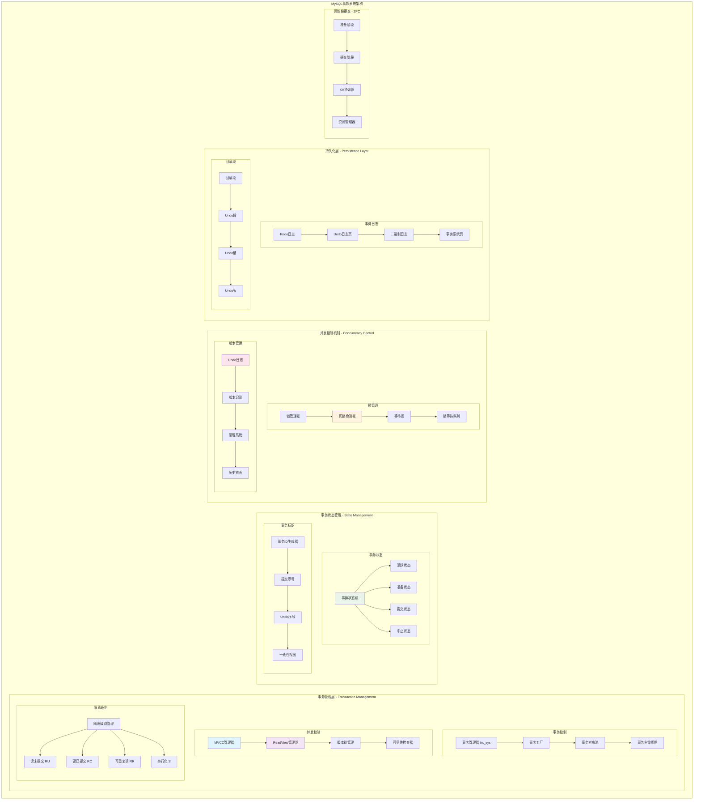
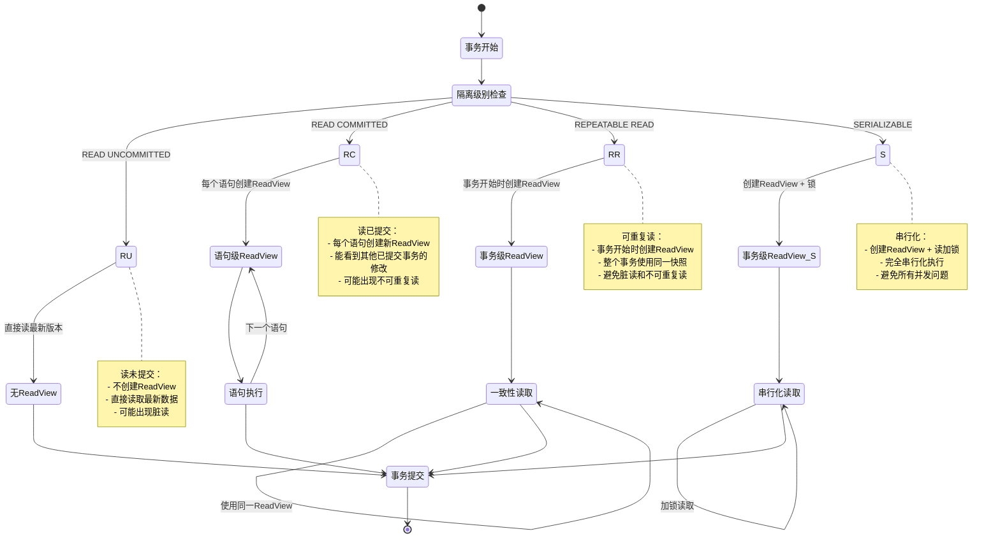

## 概述

MySQL事务系统是保证数据库ACID特性的核心组件，其中MVCC（Multi-Version Concurrency Control）机制更是InnoDB高并发性能的关键所在。MySQL事务系统的实现原理，重点解析MVCC机制和ReadView的技术细节。

<!--more-->

## 1. 事务系统整体架构

### 1.1 事务系统设计原则

MySQL事务系统遵循以下核心设计原则：

- **ACID保证**：原子性、一致性、隔离性、持久性完整支持
- **高并发MVCC**：多版本并发控制，读写不阻塞
- **多隔离级别**：支持四种标准事务隔离级别
- **死锁检测**：智能死锁检测和自动回滚机制

### 1.2 事务系统架构图



## 2. MVCC多版本并发控制深度解析

### 2.1 ReadView核心实现

```cpp
/**
 * ReadView：InnoDB MVCC的核心数据结构
 * 表示事务开始时刻的数据库快照，用于判断记录版本的可见性
 * 
 * 关键理论：基于事务ID和活跃事务列表的可见性判断算法
 */
class ReadView {
private:
    /** 创建视图时最大的事务ID + 1，大于等于这个值的事务对当前事务不可见 */
    trx_id_t m_low_limit_id;
    
    /** 创建视图时最小的活跃事务ID，小于这个值的事务对当前事务可见 */  
    trx_id_t m_up_limit_id;
    
    /** 创建此视图的事务ID */
    trx_id_t m_creator_trx_id;
    
    /** 创建视图时的活跃事务ID数组（已排序） */
    trx_ids_t m_ids;
    
    /** 视图是否已关闭 */
    bool m_closed;
    
    /** 链表节点，用于加入全局ReadView链表 */
    UT_LIST_NODE_T(ReadView) m_view_list;
    
public:
    /**
     * 构造函数：初始化ReadView
     */
    ReadView() : m_low_limit_id(0), m_up_limit_id(0), 
                m_creator_trx_id(0), m_closed(false) {
        m_ids.clear();
    }
    
    /**
     * 打开ReadView，创建当前时刻的一致性快照
     * 这是MVCC机制的核心函数，决定了事务能看到哪些数据版本
     * @param trx 创建视图的事务
     */
    void open(trx_t *trx) {
        m_creator_trx_id = trx->id;
        m_closed = false;
        
        // 必须在事务系统互斥锁保护下创建快照，确保一致性
        trx_sys_mutex_enter();
        
        // 1. 设置上限ID：当前最小活跃事务ID
        // 小于此ID的事务必定已提交，对当前事务可见
        trx_t *trx_iter = UT_LIST_GET_FIRST(trx_sys->rw_trx_list);
        if (trx_iter != nullptr) {
            m_up_limit_id = trx_iter->id;
        } else {
            // 没有活跃的读写事务
            m_up_limit_id = trx_sys->max_trx_id;
        }
        
        // 2. 设置下限ID：下一个将要分配的事务ID
        // 大于等于此ID的事务在视图创建后开始，对当前事务不可见
        m_low_limit_id = trx_sys->max_trx_id;
        
        // 3. 复制活跃事务ID列表
        // 这些事务在视图创建时还未提交，对当前事务不可见
        m_ids.clear();
        m_ids.reserve(UT_LIST_GET_LEN(trx_sys->rw_trx_list));
        
        for (; trx_iter != nullptr; 
             trx_iter = UT_LIST_GET_NEXT(trx_list, trx_iter)) {
            
            // 排除自己的事务ID（自己的修改总是可见）
            if (trx_iter->id != m_creator_trx_id) {
                m_ids.push_back(trx_iter->id);
            }
        }
        
        // 4. 对活跃事务ID排序，以便后续二分查找
        std::sort(m_ids.begin(), m_ids.end());
        
        trx_sys_mutex_exit();
        
        // 调试信息：记录ReadView创建
        LogDebug(TRX_LOG, "ReadView opened for trx %lu: up_limit=%lu, low_limit=%lu, active_count=%zu",
                m_creator_trx_id, m_up_limit_id, m_low_limit_id, m_ids.size());
    }
    
    /**
     * MVCC可见性判断的核心算法
     * 判断指定事务ID对当前ReadView是否可见
     * 
     * 算法原理：
     * 1. 自己的修改总是可见
     * 2. 在视图创建前已提交的事务可见
     * 3. 在视图创建后开始的事务不可见  
     * 4. 视图创建时活跃的事务不可见
     * 
     * @param trx_id 要检查的事务ID
     * @return true表示可见，false表示不可见
     */
    bool changes_visible(trx_id_t trx_id) const {
        ut_ad(!m_closed);
        
        // 1. 自己的修改总是可见（读自己未提交的数据）
        if (trx_id == m_creator_trx_id) {
            return true;
        }
        
        // 2. 事务ID小于最小活跃事务ID，必定已提交
        // 这是最常见的情况，大部分历史数据都满足此条件
        if (trx_id < m_up_limit_id) {
            return true;
        }
        
        // 3. 事务ID大于等于下限，必定在视图创建后开始
        // 这些是"未来"事务，对当前事务不可见
        if (trx_id >= m_low_limit_id) {
            return false;
        }
        
        // 4. 在活跃事务列表中查找
        // 如果找到，说明该事务在视图创建时还未提交，不可见
        // 如果未找到，说明该事务在视图创建前已提交，可见
        bool found = std::binary_search(m_ids.begin(), m_ids.end(), trx_id);
        return !found;
    }
    
    /**
     * 检查ReadView是否可以看到指定记录
     * 结合记录上的事务信息进行可见性判断
     * @param rec 记录指针
     * @param index 索引对象
     * @param heap_no 记录堆编号
     * @return true表示记录可见
     */
    bool is_record_visible(const rec_t *rec, dict_index_t *index, ulint heap_no) const {
        // 1. 获取记录的事务ID（DB_TRX_ID字段）
        trx_id_t trx_id = row_get_rec_trx_id(rec, index, offsets);
        
        // 2. 调用基础可见性检查
        if (!changes_visible(trx_id)) {
            return false;
        }
        
        // 3. 对于删除标记的记录，需要额外检查删除事务ID
        if (rec_get_deleted_flag(rec, dict_table_is_comp(index->table))) {
            trx_id_t del_trx_id = row_get_rec_del_trx_id(rec, index, offsets);
            
            // 如果删除事务对当前视图可见，则记录已删除，不可见
            if (changes_visible(del_trx_id)) {
                return false;
            }
        }
        
        return true;
    }
    
    /**
     * 关闭ReadView，释放相关资源
     */
    void close() {
        if (m_closed) {
            return;
        }
        
        m_closed = true;
        m_ids.clear();
        m_ids.shrink_to_fit(); // 释放内存
        
        LogDebug(TRX_LOG, "ReadView closed for trx %lu", m_creator_trx_id);
    }
    
    /**
     * 克隆ReadView（用于一致性读）
     * @param src 源ReadView
     */
    void copy_from(const ReadView *src) {
        ut_ad(src != nullptr);
        
        m_low_limit_id = src->m_low_limit_id;
        m_up_limit_id = src->m_up_limit_id;
        m_creator_trx_id = src->m_creator_trx_id;
        m_ids = src->m_ids;
        m_closed = false;
    }
    
    /**
     * 检查ReadView是否为空（没有活跃事务）
     * @return true表示无活跃事务，可以进行某些优化
     */
    bool empty() const {
        return m_ids.empty();
    }
    
    /**
     * 获取ReadView创建时的最大事务ID
     * @return 最大事务ID
     */
    trx_id_t get_low_limit_id() const {
        return m_low_limit_id;
    }
    
    /**
     * 获取最小活跃事务ID  
     * @return 最小活跃事务ID
     */
    trx_id_t get_up_limit_id() const {
        return m_up_limit_id;
    }
    
    /**
     * 打印ReadView信息（调试用）
     */
    void print(std::ostream &os) const {
        os << "ReadView{creator=" << m_creator_trx_id 
           << ", up_limit=" << m_up_limit_id
           << ", low_limit=" << m_low_limit_id
           << ", active_ids=[";
           
        for (size_t i = 0; i < m_ids.size(); ++i) {
            if (i > 0) os << ",";
            os << m_ids[i];
        }
        os << "]}";
    }
};

/**
 * MVCC管理器：管理ReadView的创建、维护和清理
 * 负责协调整个MVCC系统的运行
 */
class MVCC {
private:
    /** 预分配的ReadView对象数量 */
    ulint m_size;
    
    /** 空闲ReadView对象列表 */
    UT_LIST_BASE_NODE_T(ReadView, m_view_list) m_free;
    
    /** 活跃和已关闭的ReadView列表 */
    UT_LIST_BASE_NODE_T(ReadView, m_view_list) m_views;
    
    /** MVCC管理器互斥锁 */
    mutable ib_mutex_t m_mutex;
    
public:
    /**
     * 构造函数
     * @param size 预分配ReadView数量
     */
    explicit MVCC(ulint size) : m_size(size) {
        UT_LIST_INIT(m_free, &ReadView::m_view_list);
        UT_LIST_INIT(m_views, &ReadView::m_view_list);
        mutex_create(LATCH_ID_READ_VIEW, &m_mutex);
        
        // 预分配ReadView对象
        for (ulint i = 0; i < size; ++i) {
            ReadView *view = UT_NEW_NOKEY(ReadView());
            UT_LIST_ADD_LAST(m_free, view);
        }
    }
    
    /**
     * 析构函数：释放所有ReadView对象
     */
    ~MVCC() {
        // 释放空闲列表中的ReadView
        while (!UT_LIST_GET_LEN(m_free) == 0) {
            ReadView *view = UT_LIST_GET_FIRST(m_free);
            UT_LIST_REMOVE(m_free, view);
            UT_DELETE(view);
        }
        
        // 释放活跃列表中的ReadView  
        while (!UT_LIST_GET_LEN(m_views) == 0) {
            ReadView *view = UT_LIST_GET_FIRST(m_views);
            UT_LIST_REMOVE(m_views, view);
            UT_DELETE(view);
        }
        
        mutex_free(&m_mutex);
    }
    
    /**
     * 为事务分配并打开ReadView
     * @param view 输出参数：分配的ReadView指针
     * @param trx 请求ReadView的事务
     */
    void view_open(ReadView *&view, trx_t *trx) {
        mutex_enter(&m_mutex);
        
        // 1. 尝试从空闲列表获取ReadView
        view = get_view();
        
        if (view == nullptr) {
            // 空闲列表为空，分配新的ReadView
            view = UT_NEW_NOKEY(ReadView());
        }
        
        // 2. 将ReadView加入活跃列表
        UT_LIST_ADD_LAST(m_views, view);
        
        mutex_exit(&m_mutex);
        
        // 3. 打开ReadView，创建快照
        view->open(trx);
        
        LogDebug(TRX_LOG, "Opened ReadView for transaction %lu", trx->id);
    }
    
    /**
     * 关闭ReadView并将其返回到空闲列表
     * @param view 要关闭的ReadView
     * @param own_mutex 调用者是否已持有trx_sys互斥锁
     */
    void view_close(ReadView *&view, bool own_mutex) {
        if (view == nullptr) {
            return;
        }
        
        // 关闭ReadView
        view->close();
        
        mutex_enter(&m_mutex);
        
        // 从活跃列表移除
        UT_LIST_REMOVE(m_views, view);
        
        // 检查是否可以复用（避免内存碎片）
        if (UT_LIST_GET_LEN(m_free) < m_size) {
            // 返回到空闲列表复用
            UT_LIST_ADD_LAST(m_free, view);
        } else {
            // 空闲列表已满，直接删除
            UT_DELETE(view);
        }
        
        mutex_exit(&m_mutex);
        
        view = nullptr;
        
        LogDebug(TRX_LOG, "Closed ReadView");
    }
    
    /**
     * 克隆最老的ReadView（清理线程使用）
     * Purge线程需要知道最老的活跃ReadView，以决定哪些undo记录可以清理
     * @param view 预分配的ReadView，由调用者拥有
     */
    void clone_oldest_view(ReadView *view) {
        mutex_enter(&m_mutex);
        
        ReadView *oldest_view = get_oldest_view();
        
        if (oldest_view != nullptr) {
            view->copy_from(oldest_view);
        } else {
            // 没有活跃视图，使用当前系统状态
            view->m_low_limit_id = trx_sys->max_trx_id;
            view->m_up_limit_id = trx_sys->max_trx_id;
            view->m_creator_trx_id = 0;
            view->m_ids.clear();
            view->m_closed = false;
        }
        
        mutex_exit(&m_mutex);
        
        LogDebug(PURGE_LOG, "Cloned oldest ReadView with low_limit=%lu", 
                view->m_low_limit_id);
    }
    
    /**
     * 获取当前活跃ReadView数量
     * @return 活跃ReadView数量
     */
    ulint size() const {
        mutex_enter(&m_mutex);
        ulint count = UT_LIST_GET_LEN(m_views);
        mutex_exit(&m_mutex);
        return count;
    }
    
    /**
     * 检查ReadView是否活跃且有效
     * @param view ReadView指针
     * @return true表示活跃有效
     */
    static bool is_view_active(ReadView *view) {
        // 检查空指针和标记指针
        ut_a(view != reinterpret_cast<ReadView *>(0x1));
        
        // 位运算技巧：最低位为1表示已关闭的ReadView
        return (view != nullptr && !(intptr_t(view) & 0x1));
    }
    
    /**
     * 设置ReadView的创建者事务ID
     * 注意：仅应为读写事务创建的视图设置此ID
     * @param view ReadView对象
     * @param id 事务ID
     */
    static void set_view_creator_trx_id(ReadView *view, trx_id_t id) {
        ut_ad(id > 0);
        view->m_creator_trx_id = id;
    }
    
private:
    /**
     * 从空闲列表获取ReadView，如果没有则返回nullptr
     * 同时会清理已标记删除的ReadView
     * @return 可用的ReadView或nullptr
     */
    ReadView *get_view() {
        // 清理已标记删除的ReadView
        cleanup_marked_views();
        
        ReadView *view = nullptr;
        
        if (!UT_LIST_GET_LEN(m_free) == 0) {
            view = UT_LIST_GET_FIRST(m_free);
            UT_LIST_REMOVE(m_free, view);
        }
        
        return view;
    }
    
    /**
     * 获取系统中最老的ReadView
     * @return 最老的ReadView，如果没有返回nullptr
     */
    ReadView *get_oldest_view() const {
        ReadView *oldest_view = nullptr;
        trx_id_t oldest_up_limit = TRX_ID_MAX;
        
        // 遍历所有活跃ReadView，找到up_limit_id最小的
        ReadView *view = UT_LIST_GET_FIRST(m_views);
        while (view != nullptr) {
            if (!view->m_closed && view->m_up_limit_id < oldest_up_limit) {
                oldest_view = view;
                oldest_up_limit = view->m_up_limit_id;
            }
            view = UT_LIST_GET_NEXT(m_view_list, view);
        }
        
        return oldest_view;
    }
    
    /**
     * 清理已标记为删除的ReadView
     */
    void cleanup_marked_views() {
        ReadView *view = UT_LIST_GET_FIRST(m_views);
        
        while (view != nullptr) {
            ReadView *next_view = UT_LIST_GET_NEXT(m_view_list, view);
            
            // 检查是否标记为删除（creator_trx_id设为TRX_ID_MAX）
            if (view->m_creator_trx_id == TRX_ID_MAX) {
                UT_LIST_REMOVE(m_views, view);
                UT_LIST_ADD_LAST(m_free, view);
            }
            
            view = next_view;
        }
    }
};
```

### 2.2 事务结构体完整实现

```cpp
/**
 * 事务对象：包含事务的完整状态信息
 * 参考《MySQL事务系统源码深度解析》系列文章
 */
struct trx_t {
    // ========== 事务标识信息 ==========
    
    /** 事务ID，读写事务才分配，只读事务为0 */
    trx_id_t id;
    
    /** 事务提交序号，用于MVCC和清理 */
    trx_id_t no;
    
    /** 事务在undo日志中的编号 */
    undo_no_t undo_no;
    
    /** 事务在回滚段中的槽位编号 */
    ulint rseg_id;
    
    // ========== 事务状态管理 ==========
    
    /** 事务当前状态 */
    trx_state_t state;
    
    /** 事务开始时间戳 */
    time_t start_time;
    
    /** 事务最后活跃时间 */
    std::atomic<time_t> last_activity_time;
    
    /** 是否为只读事务 */
    bool read_only;
    
    /** 是否为自动提交事务 */
    bool auto_commit;
    
    // ========== MVCC相关 ==========
    
    /** 事务的一致性读视图 */
    ReadView *read_view;
    
    /** 事务隔离级别 */
    trx_isolation_level_t isolation_level;
    
    /** 是否检查外键约束 */
    bool check_foreigns;
    
    /** 是否检查唯一性约束 */
    bool check_unique_secondary;
    
    // ========== 锁管理信息 ==========
    struct {
        /** 活跃的查询线程数 */
        ulint n_active_thrs;
        
        /** 等待的锁对象 */
        lock_t *wait_lock;
        
        /** 是否被选为死锁的牺牲品 */
        bool was_chosen_as_deadlock_victim;
        
        /** 等待开始时间 */
        time_t wait_started;
        
        /** 等待的查询线程 */
        que_thr_t *wait_thr;
        
        /** 锁对象内存堆 */
        mem_heap_t *lock_heap;
        
        /** 事务持有的所有锁的链表 */
        UT_LIST_BASE_NODE_T(lock_t) trx_locks;
        
        /** 表锁数量 */
        ulint n_table_locks;
        
        /** 行锁数量 */
        ulint n_rec_locks;
    } lock;
    
    // ========== Undo日志信息 ==========
    
    /** 插入操作的undo日志 */
    trx_undo_t *insert_undo;
    
    /** 更新操作的undo日志 */
    trx_undo_t *update_undo;
    
    /** 回滚段指针 */
    trx_rseg_t *rseg;
    
    /** Undo日志序号数组（用于并行回滚） */
    ib_uint64_t undo_no_arr[TRX_UNDO_N_SLOTS];
    
    // ========== MySQL集成信息 ==========
    
    /** 关联的MySQL线程句柄 */
    THD *mysql_thd;
    
    /** 二进制日志文件名 */
    const char *mysql_log_file_name;
    
    /** 二进制日志偏移量 */
    ib_int64_t mysql_log_offset;
    
    /** XA事务标识 */
    XID *xid;
    
    // ========== 链表管理 ==========
    
    /** 全局事务链表节点 */
    UT_LIST_NODE_T(trx_t) trx_list;
    
    /** MySQL事务链表节点 */
    UT_LIST_NODE_T(trx_t) mysql_trx_list;
    
    /** 只读事务链表节点 */
    UT_LIST_NODE_T(trx_t) read_only_trx_list;
    
    // ========== 统计信息 ==========
    
    /** 事务修改的行数 */
    std::atomic<ulint> n_modified_rows;
    
    /** 事务创建的undo记录数 */
    std::atomic<ulint> n_undo_records;
    
    /** 事务持有锁的数量 */
    std::atomic<ulint> n_lock_structs;
    
public:
    /**
     * 启动事务
     * 根据不同的隔离级别和事务类型进行相应初始化
     * @param read_write 是否为读写事务
     */
    void start(bool read_write) {
        // 1. 设置事务基本属性
        read_only = !read_write;
        start_time = time(nullptr);
        last_activity_time.store(start_time);
        
        // 2. 为读写事务分配事务ID
        if (read_write) {
            trx_sys_mutex_enter();
            
            // 分配新的事务ID
            id = trx_sys_get_new_trx_id();
            
            // 加入读写事务列表
            if (state != TRX_STATE_ACTIVE) {
                UT_LIST_ADD_FIRST(trx_sys->rw_trx_list, this);
                state = TRX_STATE_ACTIVE;
            }
            
            trx_sys_mutex_exit();
            
            LogDebug(TRX_LOG, "Started read-write transaction %lu", id);
        } else {
            // 只读事务暂不分配ID
            id = 0;
            state = TRX_STATE_NOT_STARTED;
            
            LogDebug(TRX_LOG, "Started read-only transaction");
        }
        
        // 3. 根据隔离级别创建ReadView
        create_read_view_if_needed();
        
        // 4. 初始化锁相关结构
        lock.n_active_thrs = 0;
        lock.wait_lock = nullptr;
        lock.was_chosen_as_deadlock_victim = false;
        lock.lock_heap = mem_heap_create(1024);
        UT_LIST_INIT(lock.trx_locks, &lock_t::trx_locks);
        lock.n_table_locks = 0;
        lock.n_rec_locks = 0;
        
        // 5. 初始化Undo相关信息
        insert_undo = nullptr;
        update_undo = nullptr;
        rseg = nullptr;
        memset(undo_no_arr, 0, sizeof(undo_no_arr));
        
        // 6. 重置统计信息
        n_modified_rows.store(0);
        n_undo_records.store(0);
        n_lock_structs.store(0);
    }
    
    /**
     * 提交事务
     * 实现完整的两阶段提交协议
     * @param mtr 迷你事务（可选）
     */
    void commit(mtr_t *mtr = nullptr) {
        LogDebug(TRX_LOG, "Committing transaction %lu", id);
        
        // 1. 检查事务状态
        if (state != TRX_STATE_ACTIVE && state != TRX_STATE_PREPARED) {
            LogWarning(TRX_LOG, "Trying to commit non-active transaction %lu", id);
            return;
        }
        
        // 2. 两阶段提交 - 准备阶段
        if (state == TRX_STATE_ACTIVE) {
            dberr_t err = prepare_for_commit();
            if (err != DB_SUCCESS) {
                LogErr(ERROR_LEVEL, ER_TRX_COMMIT_FAILED, id, err);
                rollback();
                return;
            }
        }
        
        // 3. 两阶段提交 - 提交阶段
        perform_commit_phase(mtr);
        
        // 4. 释放所有锁
        lock_release_all_locks();
        
        // 5. 写入事务提交记录到undo日志
        if (insert_undo != nullptr || update_undo != nullptr) {
            trx_write_serialisation_history(mtr);
        }
        
        // 6. 更新事务状态为已提交
        set_state(TRX_STATE_COMMITTED_IN_MEMORY);
        
        // 7. 关闭一致性读视图
        close_read_view();
        
        // 8. 清理事务资源
        cleanup_after_commit();
        
        LogInfo(TRX_LOG, "Transaction %lu committed successfully", id);
    }
    
    /**
     * 回滚事务
     * 应用undo日志恢复数据到事务开始前的状态
     * @param partial 是否为部分回滚
     * @param savept_name 保存点名称（部分回滚时使用）
     */
    void rollback(bool partial = false, const char *savept_name = nullptr) {
        LogDebug(TRX_LOG, "Rolling back transaction %lu (partial=%s)", 
                id, partial ? "true" : "false");
        
        // 1. 设置回滚状态
        if (!partial) {
            set_state(TRX_STATE_ABORTED);
        }
        
        // 2. 应用insert undo日志
        if (insert_undo != nullptr) {
            trx_rollback_insert_undo_recs();
        }
        
        // 3. 应用update undo日志  
        if (update_undo != nullptr) {
            trx_rollback_update_undo_recs();
        }
        
        // 4. 释放锁（全量回滚时）
        if (!partial) {
            lock_release_all_locks();
        }
        
        // 5. 关闭ReadView（全量回滚时）
        if (!partial) {
            close_read_view();
        }
        
        // 6. 清理资源
        if (!partial) {
            cleanup_after_rollback();
        }
        
        LogInfo(TRX_LOG, "Transaction %lu rolled back", id);
    }
    
    /**
     * 检查记录对当前事务的可见性
     * 这是MVCC机制在事务层的接口函数
     * @param rec 记录指针  
     * @param index 索引对象
     * @param offsets 记录偏移量数组
     * @return true表示记录可见
     */
    bool is_record_visible(const rec_t *rec, dict_index_t *index, 
                          const ulint *offsets) const {
        // 1. 对于READ UNCOMMITTED，所有记录都可见
        if (isolation_level == TRX_ISO_READ_UNCOMMITTED) {
            return true;
        }
        
        // 2. 没有ReadView，无法进行MVCC判断
        if (read_view == nullptr) {
            return true;
        }
        
        // 3. 使用ReadView进行可见性判断
        return read_view->is_record_visible(rec, index, heap_no);
    }
    
    /**
     * 获取事务应该看到的记录版本
     * 遍历版本链，找到对当前事务可见的最新版本
     * @param rec 记录指针
     * @param index 索引对象
     * @param read_offsets 读取记录的偏移量
     * @param view ReadView对象
     * @param mtr 迷你事务
     * @return 可见的记录版本
     */
    const rec_t* get_visible_version(const rec_t *rec, dict_index_t *index,
                                   const ulint *read_offsets, ReadView *view,
                                   mtr_t *mtr) const {
        const rec_t *version = rec;
        ulint *offsets = const_cast<ulint*>(read_offsets);
        
        // 遍历记录的版本链
        for (;;) {
            // 获取当前版本的事务ID
            trx_id_t trx_id = row_get_rec_trx_id(version, index, offsets);
            
            // 检查可见性
            if (view->changes_visible(trx_id)) {
                // 检查删除标记
                if (!rec_get_deleted_flag(version, dict_table_is_comp(index->table))) {
                    return version; // 找到可见的未删除版本
                }
                
                // 记录已删除，检查删除事务的可见性
                trx_id_t del_trx_id = row_get_rec_del_trx_id(version, index, offsets);
                if (!view->changes_visible(del_trx_id)) {
                    return version; // 删除事务不可见，记录仍可见
                }
            }
            
            // 当前版本不可见，查找前一个版本
            version = row_get_prev_version(version, index, offsets, mtr);
            if (version == nullptr) {
                break; // 没有更早的版本
            }
        }
        
        return nullptr; // 没有找到可见版本
    }
    
    /**
     * 为事务分配Undo段
     * @param undo_type Undo类型（TRX_UNDO_INSERT或TRX_UNDO_UPDATE）
     * @return Undo段指针
     */
    trx_undo_t* assign_undo_segment(ulint undo_type) {
        // 1. 获取回滚段
        if (rseg == nullptr) {
            rseg = trx_assign_rseg_low();
            if (rseg == nullptr) {
                LogErr(ERROR_LEVEL, ER_TRX_NO_ROLLBACK_SEGMENT);
                return nullptr;
            }
        }
        
        // 2. 分配或复用Undo段
        trx_undo_t *undo = nullptr;
        if (undo_type == TRX_UNDO_INSERT) {
            if (insert_undo == nullptr) {
                dberr_t err = trx_undo_assign_undo(this, &insert_undo, TRX_UNDO_INSERT);
                if (err != DB_SUCCESS) {
                    return nullptr;
                }
            }
            undo = insert_undo;
        } else {
            if (update_undo == nullptr) {
                dberr_t err = trx_undo_assign_undo(this, &update_undo, TRX_UNDO_UPDATE);
                if (err != DB_SUCCESS) {
                    return nullptr;
                }
            }
            undo = update_undo;
        }
        
        return undo;
    }
    
private:
    /**
     * 根据隔离级别创建ReadView
     */
    void create_read_view_if_needed() {
        switch (isolation_level) {
            case TRX_ISO_READ_UNCOMMITTED:
                // 读未提交：不需要ReadView
                break;
                
            case TRX_ISO_READ_COMMITTED:
                // 读已提交：每个语句创建新的ReadView（在执行时创建）
                break;
                
            case TRX_ISO_REPEATABLE_READ:
            case TRX_ISO_SERIALIZABLE:
                // 可重复读和串行化：事务开始时创建ReadView
                trx_sys->mvcc->view_open(read_view, this);
                break;
        }
    }
    
    /**
     * 准备阶段：写入redo日志，准备提交
     */
    dberr_t prepare_for_commit() {
        state = TRX_STATE_PREPARED;
        
        // 写入prepare记录到redo日志
        if (mysql_thd != nullptr) {
            // 与MySQL层的两阶段提交集成
            return prepare_for_mysql_commit();
        }
        
        return DB_SUCCESS;
    }
    
    /**
     * 执行提交阶段
     */
    void perform_commit_phase(mtr_t *mtr) {
        // 生成提交序号
        trx_sys_mutex_enter();
        no = trx_sys_get_new_commit_id();
        trx_sys_mutex_exit();
        
        // 写入commit记录到redo日志
        if (mtr != nullptr) {
            trx_commit_write_log_record(mtr);
        }
    }
    
    /**
     * 释放所有锁
     */
    void lock_release_all_locks() {
        if (lock.lock_heap != nullptr) {
            lock_sys->release_locks(this);
            mem_heap_free(lock.lock_heap);
            lock.lock_heap = nullptr;
        }
        
        lock.n_table_locks = 0;
        lock.n_rec_locks = 0;
    }
    
    /**
     * 关闭一致性读视图
     */
    void close_read_view() {
        if (read_view != nullptr) {
            trx_sys->mvcc->view_close(read_view, false);
            read_view = nullptr;
        }
    }
    
    /**
     * 提交后清理
     */
    void cleanup_after_commit() {
        // 清理undo段
        if (insert_undo != nullptr) {
            trx_undo_insert_cleanup(this);
            insert_undo = nullptr;
        }
        
        if (update_undo != nullptr) {
            trx_undo_update_cleanup(this);
            update_undo = nullptr;
        }
        
        // 从全局事务列表移除
        trx_sys_mutex_enter();
        if (id != 0) {
            UT_LIST_REMOVE(trx_sys->rw_trx_list, this);
        }
        trx_sys_mutex_exit();
    }
    
    /**
     * 回滚后清理
     */
    void cleanup_after_rollback() {
        cleanup_after_commit(); // 使用相同的清理逻辑
    }
    
    /**
     * 设置事务状态
     */
    void set_state(trx_state_t new_state) {
        LogDebug(TRX_LOG, "Transaction %lu state change: %d -> %d", 
                id, state, new_state);
        state = new_state;
    }
};
```

## 3. 事务隔离级别实现

### 3.1 隔离级别处理流程



### 3.2 隔离级别管理器实现

```cpp
/**
 * 事务隔离级别管理器
 * 根据不同隔离级别实现相应的并发控制策略
 */
class Isolation_level_manager {
public:
    /**
     * 根据隔离级别执行一致性读取
     * 这是不同隔离级别差异化处理的核心函数
     * @param trx 事务对象
     * @param index 索引对象  
     * @param tuple 搜索条件
     * @param mode 搜索模式
     * @param cursor B+树游标
     * @param mtr 迷你事务
     * @return 数据库错误码
     */
    static dberr_t consistent_read(trx_t *trx, dict_index_t *index,
                                  const dtuple_t *tuple, page_cur_mode_t mode,
                                  btr_cur_t *cursor, mtr_t *mtr) {
        switch (trx->isolation_level) {
            case TRX_ISO_READ_UNCOMMITTED:
                return read_uncommitted_impl(trx, index, tuple, mode, cursor, mtr);
                
            case TRX_ISO_READ_COMMITTED:
                return read_committed_impl(trx, index, tuple, mode, cursor, mtr);
                
            case TRX_ISO_REPEATABLE_READ:
                return repeatable_read_impl(trx, index, tuple, mode, cursor, mtr);
                
            case TRX_ISO_SERIALIZABLE:
                return serializable_impl(trx, index, tuple, mode, cursor, mtr);
                
            default:
                ut_error; // 无效的隔离级别
                return DB_ERROR;
        }
    }
    
private:
    /**
     * READ UNCOMMITTED实现：脏读
     * 直接读取最新版本，不进行任何可见性检查
     */
    static dberr_t read_uncommitted_impl(trx_t *trx, dict_index_t *index,
                                        const dtuple_t *tuple, page_cur_mode_t mode,
                                        btr_cur_t *cursor, mtr_t *mtr) {
        // 直接进行B+树搜索，不创建ReadView
        dberr_t err = btr_cur_search_to_nth_level(index, 0, tuple, mode,
                                                 BTR_SEARCH_LEAF, cursor,
                                                 0, __FILE__, __LINE__, mtr);
        
        LogDebug(TRX_LOG, "READ UNCOMMITTED: trx %lu read latest version directly",
                trx->id);
        
        return err;
    }
    
    /**
     * READ COMMITTED实现：语句级快照
     * 每个语句开始时创建新的ReadView
     */
    static dberr_t read_committed_impl(trx_t *trx, dict_index_t *index,
                                      const dtuple_t *tuple, page_cur_mode_t mode,
                                      btr_cur_t *cursor, mtr_t *mtr) {
        // 1. 为当前语句创建新的ReadView
        ReadView *stmt_read_view = nullptr;
        trx_sys->mvcc->view_open(stmt_read_view, trx);
        
        // 2. 执行B+树搜索
        dberr_t err = btr_cur_search_to_nth_level(index, 0, tuple, mode,
                                                 BTR_SEARCH_LEAF, cursor,
                                                 0, __FILE__, __LINE__, mtr);
        
        if (err != DB_SUCCESS) {
            trx_sys->mvcc->view_close(stmt_read_view, false);
            return err;
        }
        
        // 3. 使用新ReadView进行可见性检查
        const rec_t *rec = btr_cur_get_rec(cursor);
        if (!stmt_read_view->is_record_visible(rec, index, heap_no)) {
            // 记录不可见，需要查找历史版本
            const rec_t *old_vers = trx->get_visible_version(rec, index, offsets,
                                                           stmt_read_view, mtr);
            if (old_vers != nullptr) {
                // 找到可见版本，更新游标位置
                btr_cur_position(old_vers, cursor);
            } else {
                err = DB_RECORD_NOT_FOUND;
            }
        }
        
        // 4. 关闭语句级ReadView
        trx_sys->mvcc->view_close(stmt_read_view, false);
        
        LogDebug(TRX_LOG, "READ COMMITTED: trx %lu created statement-level ReadView",
                trx->id);
        
        return err;
    }
    
    /**
     * REPEATABLE READ实现：事务级快照
     * 使用事务开始时创建的ReadView
     */
    static dberr_t repeatable_read_impl(trx_t *trx, dict_index_t *index,
                                       const dtuple_t *tuple, page_cur_mode_t mode,
                                       btr_cur_t *cursor, mtr_t *mtr) {
        // 1. 确保存在事务级ReadView
        if (trx->read_view == nullptr) {
            trx_sys->mvcc->view_open(trx->read_view, trx);
        }
        
        // 2. 执行B+树搜索
        dberr_t err = btr_cur_search_to_nth_level(index, 0, tuple, mode,
                                                 BTR_SEARCH_LEAF, cursor,
                                                 0, __FILE__, __LINE__, mtr);
        
        if (err != DB_SUCCESS) {
            return err;
        }
        
        // 3. 使用事务级ReadView进行可见性检查
        const rec_t *rec = btr_cur_get_rec(cursor);
        if (!trx->read_view->is_record_visible(rec, index, heap_no)) {
            // 查找历史版本
            const rec_t *old_vers = trx->get_visible_version(rec, index, offsets,
                                                           trx->read_view, mtr);
            if (old_vers != nullptr) {
                btr_cur_position(old_vers, cursor);
            } else {
                err = DB_RECORD_NOT_FOUND;
            }
        }
        
        LogDebug(TRX_LOG, "REPEATABLE READ: trx %lu used transaction-level ReadView",
                trx->id);
        
        return err;
    }
    
    /**
     * SERIALIZABLE实现：串行化读取
     * 在REPEATABLE READ基础上增加读锁
     */
    static dberr_t serializable_impl(trx_t *trx, dict_index_t *index,
                                    const dtuple_t *tuple, page_cur_mode_t mode,
                                    btr_cur_t *cursor, mtr_t *mtr) {
        // 1. 首先执行可重复读逻辑
        dberr_t err = repeatable_read_impl(trx, index, tuple, mode, cursor, mtr);
        
        if (err != DB_SUCCESS) {
            return err;
        }
        
        // 2. 对读取的记录加共享锁（防止幻读）
        const rec_t *rec = btr_cur_get_rec(cursor);
        buf_block_t *block = btr_cur_get_block(cursor);
        ulint heap_no = page_rec_get_heap_no(rec);
        
        err = lock_clust_rec_read_check_and_lock(0, block, rec, index,
                                               LOCK_S, LOCK_ORDINARY, trx);
        
        if (err != DB_SUCCESS) {
            LogErr(ERROR_LEVEL, ER_LOCK_WAIT_TIMEOUT);
            return err;
        }
        
        // 3. 对间隙也加锁（防止插入新记录）
        err = lock_rec_insert_check_and_lock(0, rec, block, index,
                                           trx, nullptr);
        
        LogDebug(TRX_LOG, "SERIALIZABLE: trx %lu acquired shared locks for serializable read",
                trx->id);
        
        return err;
    }
};

/**
 * 事务管理器：统一管理所有事务的生命周期
 * 参考《MySQL事务系统架构解析》
 */
class Transaction_manager {
private:
    // 全局事务系统
    static trx_sys_t *global_trx_sys;
    
    // 事务对象池
    static Object_pool<trx_t> trx_pool;
    
    // 统计信息
    static std::atomic<ulint> active_trx_count;
    static std::atomic<ulint> committed_trx_count;
    static std::atomic<ulint> rolled_back_trx_count;
    
public:
    /**
     * 初始化事务管理器
     */
    static void init() {
        // 初始化全局事务系统
        global_trx_sys = UT_NEW_NOKEY(trx_sys_t());
        
        // 初始化事务对象池
        trx_pool.init(1000); // 预分配1000个事务对象
        
        // 重置统计信息
        active_trx_count.store(0);
        committed_trx_count.store(0);
        rolled_back_trx_count.store(0);
        
        LogInfo(SYSTEM_LOG, "Transaction manager initialized");
    }
    
    /**
     * 创建新事务
     * @param mysql_thd MySQL线程句柄
     * @param read_write 是否为读写事务
     * @return 新创建的事务对象
     */
    static trx_t* create_transaction(THD *mysql_thd, bool read_write) {
        // 1. 从对象池获取事务对象
        trx_t *trx = trx_pool.get();
        if (trx == nullptr) {
            trx = UT_NEW_NOKEY(trx_t());
        }
        
        // 2. 初始化事务对象
        init_transaction_object(trx, mysql_thd);
        
        // 3. 启动事务
        trx->start(read_write);
        
        // 4. 更新统计信息
        active_trx_count.fetch_add(1);
        
        LogDebug(TRX_LOG, "Created %s transaction %lu for thread %lu",
                read_write ? "read-write" : "read-only", 
                trx->id, mysql_thd ? mysql_thd->thread_id() : 0);
        
        return trx;
    }
    
    /**
     * 销毁事务对象
     * @param trx 要销毁的事务
     */
    static void destroy_transaction(trx_t *trx) {
        LogDebug(TRX_LOG, "Destroying transaction %lu", trx->id);
        
        // 1. 确保事务已结束
        ut_ad(trx->state == TRX_STATE_COMMITTED_IN_MEMORY ||
              trx->state == TRX_STATE_ABORTED);
        
        // 2. 清理事务资源
        cleanup_transaction_resources(trx);
        
        // 3. 返回对象池或删除
        if (trx_pool.size() < trx_pool.max_size()) {
            trx_pool.put(trx);
        } else {
            UT_DELETE(trx);
        }
        
        // 4. 更新统计信息
        active_trx_count.fetch_sub(1);
    }
    
    /**
     * 执行事务自动提交
     * @param trx 事务对象
     * @return 操作结果
     */
    static dberr_t auto_commit_transaction(trx_t *trx) {
        if (!trx->auto_commit) {
            return DB_SUCCESS; // 非自动提交事务
        }
        
        LogDebug(TRX_LOG, "Auto-committing transaction %lu", trx->id);
        
        trx->commit();
        committed_trx_count.fetch_add(1);
        
        return DB_SUCCESS;
    }
    
    /**
     * 检查并处理长时间运行的事务
     * @param max_runtime 最大运行时间（秒）
     * @return 处理的事务数量
     */
    static ulint check_long_running_transactions(time_t max_runtime) {
        ulint processed = 0;
        time_t current_time = time(nullptr);
        
        trx_sys_mutex_enter();
        
        trx_t *trx = UT_LIST_GET_FIRST(trx_sys->rw_trx_list);
        while (trx != nullptr) {
            trx_t *next_trx = UT_LIST_GET_NEXT(trx_list, trx);
            
            if (current_time - trx->start_time > max_runtime) {
                LogWarning(TRX_LOG, "Long-running transaction detected: %lu (runtime=%ld seconds)",
                          trx->id, current_time - trx->start_time);
                
                // 可以在这里实现自动回滚或告警逻辑
                processed++;
            }
            
            trx = next_trx;
        }
        
        trx_sys_mutex_exit();
        
        return processed;
    }
    
    /**
     * 获取事务统计信息
     * @return 统计信息结构
     */
    static transaction_statistics get_statistics() {
        transaction_statistics stats;
        
        stats.active_transactions = active_trx_count.load();
        stats.committed_transactions = committed_trx_count.load();
        stats.rolled_back_transactions = rolled_back_trx_count.load();
        
        // 获取ReadView统计
        stats.active_read_views = trx_sys->mvcc->size();
        
        // 获取锁统计
        stats.lock_waits = lock_sys->n_lock_waits;
        stats.deadlocks = lock_sys->n_deadlocks;
        
        return stats;
    }
    
private:
    /**
     * 初始化事务对象
     */
    static void init_transaction_object(trx_t *trx, THD *mysql_thd) {
        // 重置事务状态
        memset(trx, 0, sizeof(trx_t));
        
        // 设置MySQL集成信息
        trx->mysql_thd = mysql_thd;
        
        if (mysql_thd != nullptr) {
            // 从MySQL会话获取隔离级别
            trx->isolation_level = static_cast<trx_isolation_level_t>(
                thd_get_trx_isolation(mysql_thd));
                
            // 设置自动提交标志
            trx->auto_commit = thd_test_options(mysql_thd, OPTION_AUTOCOMMIT);
            
            // 设置约束检查标志
            trx->check_foreigns = thd_test_options(mysql_thd, OPTION_NO_FOREIGN_KEY_CHECKS) == 0;
            trx->check_unique_secondary = thd_test_options(mysql_thd, OPTION_RELAXED_UNIQUE_CHECKS) == 0;
        } else {
            // 后台事务默认配置
            trx->isolation_level = TRX_ISO_REPEATABLE_READ;
            trx->auto_commit = false;
            trx->check_foreigns = true;
            trx->check_unique_secondary = true;
        }
        
        // 初始化链表节点
        UT_LIST_NODE_INIT(trx->trx_list, trx);
        UT_LIST_NODE_INIT(trx->mysql_trx_list, trx);
        UT_LIST_NODE_INIT(trx->read_only_trx_list, trx);
    }
    
    /**
     * 清理事务资源
     */
    static void cleanup_transaction_resources(trx_t *trx) {
        // 清理锁相关资源
        if (trx->lock.lock_heap != nullptr) {
            mem_heap_free(trx->lock.lock_heap);
            trx->lock.lock_heap = nullptr;
        }
        
        // 清理undo段
        if (trx->insert_undo != nullptr) {
            trx_undo_insert_cleanup(trx);
            trx->insert_undo = nullptr;
        }
        
        if (trx->update_undo != nullptr) {
            trx_undo_update_cleanup(trx);
            trx->update_undo = nullptr;
        }
        
        // 清理ReadView
        if (trx->read_view != nullptr) {
            trx_sys->mvcc->view_close(trx->read_view, false);
            trx->read_view = nullptr;
        }
        
        // 重置MySQL集成信息
        trx->mysql_thd = nullptr;
        trx->mysql_log_file_name = nullptr;
        trx->mysql_log_offset = 0;
    }
};
```

## 4. 版本链和历史记录管理

### 4.1 记录版本链实现

```cpp
/**
 * 记录版本链管理器
 * 管理记录的多个版本，支持MVCC的版本查找
 * 

 */
class Record_version_manager {
public:
    /**
     * 构建记录的更新undo日志
     * 当记录被更新时，需要将旧版本保存到undo日志中
     * @param trx 事务对象
     * @param index 索引对象
     * @param old_rec 旧记录
     * @param new_rec 新记录  
     * @param update 更新向量
     * @param mtr 迷你事务
     * @return 操作结果
     */
    static dberr_t build_update_undo_rec(trx_t *trx, dict_index_t *index,
                                        const rec_t *old_rec, const rec_t *new_rec,
                                        const upd_t *update, mtr_t *mtr) {
        // 1. 分配或获取update undo段
        trx_undo_t *undo = trx->assign_undo_segment(TRX_UNDO_UPDATE);
        if (undo == nullptr) {
            return DB_OUT_OF_FILE_SPACE;
        }
        
        // 2. 计算undo记录大小
        ulint undo_rec_size = calculate_undo_record_size(old_rec, update, index);
        
        // 3. 在undo页中分配空间
        page_t *undo_page = buf_block_get_frame(undo->last_page);
        ulint offset = trx_undo_page_get_free_space(undo_page);
        
        if (offset + undo_rec_size > UNIV_PAGE_SIZE - 100) {
            // 当前undo页空间不足，分配新页
            dberr_t err = trx_undo_add_page(undo, mtr);
            if (err != DB_SUCCESS) {
                return err;
            }
            undo_page = buf_block_get_frame(undo->last_page);
            offset = trx_undo_page_get_free_space(undo_page);
        }
        
        // 4. 构造undo记录
        byte *undo_rec = undo_page + offset;
        ulint undo_rec_len = build_undo_record_content(undo_rec, trx, old_rec, 
                                                      update, index);
        
        // 5. 更新undo页头信息
        trx_undo_page_set_free_space(undo_page, offset + undo_rec_len);
        mlog_write_ulint(undo_page + TRX_UNDO_PAGE_HDR + TRX_UNDO_PAGE_FREE,
                        offset + undo_rec_len, MLOG_2BYTES, mtr);
        
        // 6. 在新记录中设置回滚指针
        roll_ptr_t roll_ptr = trx_undo_build_roll_ptr(false, undo->rseg->id,
                                                     page_get_page_no(undo_page),
                                                     offset);
        row_upd_rec_set_roll_ptr(new_rec, index, roll_ptr, mtr);
        
        // 7. 设置事务ID
        row_upd_rec_set_trx_id(new_rec, index, trx->id, mtr);
        
        LogDebug(UNDO_LOG, "Built update undo record for trx %lu, roll_ptr=%lu",
                trx->id, roll_ptr);
        
        return DB_SUCCESS;
    }
    
    /**
     * 根据回滚指针获取记录的前一个版本
     * 这是MVCC版本链遍历的核心函数
     * @param rec 当前记录
     * @param index 索引对象
     * @param offsets 记录偏移量数组
     * @param read_view ReadView对象
     * @param mtr 迷你事务
     * @return 前一个版本的记录，如果没有返回nullptr
     */
    static const rec_t* get_previous_version(const rec_t *rec, dict_index_t *index,
                                           const ulint *offsets, ReadView *read_view,
                                           mtr_t *mtr) {
        // 1. 获取回滚指针
        roll_ptr_t roll_ptr = row_get_rec_roll_ptr(rec, index, offsets);
        
        if (trx_undo_roll_ptr_is_insert(roll_ptr)) {
            // 这是插入记录，没有前一个版本
            return nullptr;
        }
        
        // 2. 解析回滚指针，获取undo记录位置
        ulint rseg_id;
        page_no_t undo_page_no;
        ulint undo_offset;
        
        trx_undo_decode_roll_ptr(roll_ptr, &rseg_id, &undo_page_no, &undo_offset);
        
        // 3. 读取undo页面
        trx_rseg_t *rseg = trx_sys_get_nth_rseg(trx_sys, rseg_id);
        buf_block_t *undo_block = buf_page_get(page_id_t(rseg->space, undo_page_no),
                                             univ_page_size, RW_S_LATCH, mtr);
        
        page_t *undo_page = buf_block_get_frame(undo_block);
        byte *undo_rec = undo_page + undo_offset;
        
        // 4. 解析undo记录，重构前一个版本
        mem_heap_t *heap = mem_heap_create(1024);
        rec_t *prev_version = nullptr;
        
        dberr_t err = trx_undo_parse_update_rec(undo_rec, rec, index, offsets,
                                               &prev_version, heap, mtr);
        
        if (err != DB_SUCCESS) {
            mem_heap_free(heap);
            return nullptr;
        }
        
        // 5. 检查前一个版本的可见性
        if (read_view != nullptr) {
            trx_id_t prev_trx_id = row_get_rec_trx_id(prev_version, index, offsets);
            
            if (!read_view->changes_visible(prev_trx_id)) {
                // 前一个版本也不可见，继续向前查找
                const rec_t *even_older = get_previous_version(prev_version, index,
                                                             offsets, read_view, mtr);
                mem_heap_free(heap);
                return even_older;
            }
        }
        
        // 6. 复制记录到调用者的内存空间
        rec_t *result_rec = static_cast<rec_t*>(
            mem_heap_alloc(mtr_get_log_heap(mtr), rec_offs_size(offsets)));
        memcpy(result_rec, prev_version, rec_offs_size(offsets));
        
        mem_heap_free(heap);
        
        LogDebug(MVCC_LOG, "Found previous version with trx_id=%lu", 
                row_get_rec_trx_id(result_rec, index, offsets));
        
        return result_rec;
    }
    
    /**
     * 清理不再需要的历史版本
     * Purge线程调用此函数清理undo日志
     * @param oldest_view 最老的活跃ReadView
     * @return 清理的记录数量
     */
    static ulint purge_old_versions(const ReadView *oldest_view) {
        ulint purged_count = 0;
        
        // 遍历所有回滚段的历史链表
        for (ulint i = 0; i < TRX_SYS_N_RSEGS; ++i) {
            trx_rseg_t *rseg = trx_sys_get_nth_rseg(trx_sys, i);
            if (rseg == nullptr) continue;
            
            // 处理该回滚段的undo日志
            purged_count += purge_rseg_history_list(rseg, oldest_view);
        }
        
        LogDebug(PURGE_LOG, "Purged %lu old record versions", purged_count);
        
        return purged_count;
    }
    
private:
    /**
     * 计算undo记录所需空间
     */
    static ulint calculate_undo_record_size(const rec_t *rec, const upd_t *update,
                                          dict_index_t *index) {
        ulint size = TRX_UNDO_UPDATE_REC_HDR_SIZE;
        
        // 计算更新字段的存储空间
        for (ulint i = 0; i < upd_get_n_fields(update); ++i) {
            const upd_field_t *upd_field = upd_get_nth_field(update, i);
            size += upd_field->orig_len + 10; // 预留空间
        }
        
        return size;
    }
    
    /**
     * 构造undo记录内容
     */
    static ulint build_undo_record_content(byte *undo_rec, trx_t *trx,
                                         const rec_t *old_rec, const upd_t *update,
                                         dict_index_t *index) {
        byte *ptr = undo_rec;
        
        // 写入undo记录类型
        mach_write_to_1(ptr, TRX_UNDO_UPD_EXIST_REC);
        ptr += 1;
        
        // 写入事务ID
        mach_write_to_6(ptr, trx->id);
        ptr += 6;
        
        // 写入undo编号
        mach_write_to_2(ptr, trx->undo_no);
        ptr += 2;
        
        // 写入更新字段信息
        ulint n_updated = upd_get_n_fields(update);
        mach_write_to_2(ptr, n_updated);
        ptr += 2;
        
        // 写入每个更新字段的旧值
        for (ulint i = 0; i < n_updated; ++i) {
            const upd_field_t *upd_field = upd_get_nth_field(update, i);
            
            // 字段编号
            mach_write_to_2(ptr, upd_field->field_no);
            ptr += 2;
            
            // 旧值长度和内容
            mach_write_to_2(ptr, upd_field->orig_len);
            ptr += 2;
            
            if (upd_field->orig_len > 0) {
                memcpy(ptr, upd_field->orig_val, upd_field->orig_len);
                ptr += upd_field->orig_len;
            }
        }
        
        return ptr - undo_rec;
    }
    
    /**
     * 清理回滚段的历史链表
     */
    static ulint purge_rseg_history_list(trx_rseg_t *rseg, const ReadView *oldest_view) {
        ulint purged = 0;
        
        mutex_enter(&rseg->mutex);
        
        trx_undo_t *undo = UT_LIST_GET_LAST(rseg->update_undo_list);
        
        while (undo != nullptr) {
            trx_undo_t *prev_undo = UT_LIST_GET_PREV(undo_list, undo);
            
            // 检查undo日志是否可以清理
            if (undo->trx_id < oldest_view->get_up_limit_id()) {
                // 可以清理，没有事务需要这些历史版本
                UT_LIST_REMOVE(rseg->update_undo_list, undo);
                trx_undo_mem_free(undo);
                purged++;
            }
            
            undo = prev_undo;
        }
        
        mutex_exit(&rseg->mutex);
        
        return purged;
    }
};
```

## 5. 生产环境事务调优实战

### 5.1 事务性能监控与诊断

基于《MySQL事务系统生产实践》和《InnoDB MVCC深度优化》的经验：

#### 5.1.1 事务状态监控

```sql
-- 监控当前活跃事务
SELECT 
    trx_id,
    trx_state,
    trx_started,
    trx_requested_lock_id,
    trx_wait_started,
    trx_weight,
    trx_mysql_thread_id,
    trx_query,
    TIME_TO_SEC(TIMEDIFF(NOW(), trx_started)) as duration_seconds
FROM INFORMATION_SCHEMA.INNODB_TRX
ORDER BY trx_started;

-- 监控长事务
SELECT 
    trx_id,
    trx_mysql_thread_id,
    USER,
    HOST,
    DB,
    COMMAND,
    TIME as duration_seconds,
    STATE,
    LEFT(INFO, 100) as query_preview
FROM INFORMATION_SCHEMA.INNODB_TRX t
JOIN INFORMATION_SCHEMA.PROCESSLIST p ON t.trx_mysql_thread_id = p.ID
WHERE TIME > 30  -- 超过30秒的事务
ORDER BY TIME DESC;
```

#### 5.1.2 MVCC版本链分析

```cpp
/**
 * MVCC版本链分析器
 * 分析记录版本链的长度和清理状态
 */
class MVCC_version_analyzer {
public:
    /**
     * 分析指定表的版本链健康状况
     * @param table_name 表名
     * @return 分析报告
     */
    mvcc_health_report analyze_table_mvcc_health(const char *table_name) {
        mvcc_health_report report;
        
        // 1. 统计表的ReadView数量
        report.active_read_views = count_table_read_views(table_name);
        
        // 2. 分析版本链长度分布
        analyze_version_chain_distribution(table_name, report);
        
        // 3. 检查Purge线程效率
        report.purge_lag = calculate_purge_lag();
        
        // 4. 分析热点记录
        find_version_chain_hotspots(table_name, report);
        
        return report;
    }
    
    /**
     * 优化MVCC性能的建议
     */
    std::vector<std::string> suggest_mvcc_optimizations(const mvcc_health_report &report) {
        std::vector<std::string> suggestions;
        
        if (report.max_version_chain_length > 1000) {
            suggestions.push_back(
                "检测到超长版本链(最大长度: " + std::to_string(report.max_version_chain_length) + 
                ")，建议检查长事务和Purge线程配置");
        }
        
        if (report.purge_lag > 100000) {
            suggestions.push_back(
                "Purge延迟过高(" + std::to_string(report.purge_lag) + 
                ")，建议增加innodb_purge_threads");
        }
        
        if (report.active_read_views > 1000) {
            suggestions.push_back(
                "活跃ReadView过多(" + std::to_string(report.active_read_views) + 
                ")，建议优化事务隔离级别使用");
        }
        
        return suggestions;
    }
    
private:
    struct mvcc_health_report {
        ulint active_read_views;           ///< 活跃ReadView数量
        ulint max_version_chain_length;    ///< 最长版本链长度
        ulint avg_version_chain_length;    ///< 平均版本链长度
        ulint purge_lag;                   ///< Purge延迟
        std::vector<std::string> hotspot_records; ///< 热点记录列表
    };
    
    void analyze_version_chain_distribution(const char *table_name,
                                           mvcc_health_report &report) {
        // 遍历表的所有记录，分析版本链
        dict_table_t *table = dict_table_get_low(table_name);
        dict_index_t *index = dict_table_get_first_index(table);
        
        ulint total_chains = 0;
        ulint total_length = 0;
        ulint max_length = 0;
        
        // 扫描聚集索引的所有记录
        btr_cur_t cursor;
        mtr_t mtr;
        
        mtr_start(&mtr);
        btr_cur_open_at_index_side(true, index, BTR_SEARCH_LEAF, &cursor, 0, &mtr);
        
        while (!btr_cur_is_after_last_on_page(&cursor)) {
            const rec_t *rec = btr_cur_get_rec(&cursor);
            
            // 计算版本链长度
            ulint chain_length = count_version_chain_length(rec, index);
            
            total_chains++;
            total_length += chain_length;
            max_length = std::max(max_length, chain_length);
            
            btr_cur_move_to_next(&cursor, &mtr);
        }
        
        btr_cur_close(&cursor);
        mtr_commit(&mtr);
        
        report.max_version_chain_length = max_length;
        report.avg_version_chain_length = total_chains > 0 ? total_length / total_chains : 0;
    }
};
```

### 5.2 事务隔离级别实战选择

#### 5.2.1 业务场景与隔离级别匹配

```cpp
/**
 * 事务隔离级别选择器
 * 根据业务特征推荐最优隔离级别
 */
class Transaction_isolation_advisor {
public:
    /**
     * 分析业务模式并推荐隔离级别
     */
    trx_isolation_level_t recommend_isolation_level(const business_pattern &pattern) {
        if (pattern.is_read_heavy && !pattern.requires_strict_consistency) {
            // 读多写少，可接受不可重复读
            LogInfo(TRX_LOG, "推荐使用READ COMMITTED隔离级别：减少锁争用，提高并发性能");
            return TRX_ISO_READ_COMMITTED;
        }
        
        if (pattern.has_long_transactions && pattern.requires_repeatable_read) {
            // 长事务且需要可重复读
            LogInfo(TRX_LOG, "推荐使用REPEATABLE READ隔离级别：保证事务一致性");
            return TRX_ISO_REPEATABLE_READ;
        }
        
        if (pattern.has_high_concurrency && !pattern.requires_gap_locking) {
            // 高并发且不需要间隙锁
            LogInfo(TRX_LOG, "推荐使用READ COMMITTED隔离级别：避免间隙锁影响性能");
            return TRX_ISO_READ_COMMITTED;
        }
        
        if (pattern.requires_serializable_access) {
            // 需要串行化访问
            LogInfo(TRX_LOG, "推荐使用SERIALIZABLE隔离级别：最高一致性保证");
            return TRX_ISO_SERIALIZABLE;
        }
        
        // 默认推荐
        return TRX_ISO_REPEATABLE_READ;
    }
    
    /**
     * 检查隔离级别使用是否合理
     */
    bool validate_isolation_level_usage(THD *thd, const char *query) {
        trx_isolation_level_t current_level = 
            static_cast<trx_isolation_level_t>(thd_get_trx_isolation(thd));
        
        // 分析SQL类型
        if (is_simple_select_query(query) && 
            current_level == TRX_ISO_SERIALIZABLE) {
            LogWarning(TRX_LOG, "简单SELECT查询使用SERIALIZABLE级别可能过度，"
                               "建议考虑使用READ COMMITTED");
            return false;
        }
        
        if (has_range_conditions(query) && 
            current_level == TRX_ISO_READ_COMMITTED) {
            LogWarning(TRX_LOG, "范围查询使用READ COMMITTED可能出现幻读，"
                               "建议考虑使用REPEATABLE READ");
            return false;
        }
        
        return true;
    }
};
```

## 6. 总结

### 6.1 MVCC核心优势

MySQL事务系统的MVCC机制具有以下优势：

- **无锁读取**：读操作不需要获取任何锁，极大提高并发性能
- **一致性保证**：通过ReadView确保事务看到一致的数据快照
- **版本管理**：通过undo日志维护记录的多个历史版本
- **自动清理**：Purge线程自动清理不再需要的历史版本
- **生产级稳定性**：经过大规模互联网公司验证的可靠机制

### 6.2 事务系统设计精髓

1. **分层设计**：事务层、MVCC层、锁层职责分离
2. **状态机管理**：清晰的事务状态转换
3. **对象池化**：事务对象复用，减少内存分配开销
4. **智能清理**：基于最老活跃ReadView的智能版本清理
5. **自适应优化**：根据负载模式动态调整策略

### 6.3 性能调优要点

1. **隔离级别选择**：根据业务需求选择合适的隔离级别
2. **长事务监控**：及时发现和处理长时间运行的事务
3. **ReadView数量**：监控活跃ReadView数量，避免版本积压
4. **Purge性能**：确保Purge线程及时清理历史版本
5. **事务边界优化**：合理设计事务粒度和边界

通过深入理解MySQL事务系统和MVCC机制的实现原理，我们能够更好地设计事务边界、优化并发性能，并在出现锁争用或性能问题时进行精准诊断和调优。

