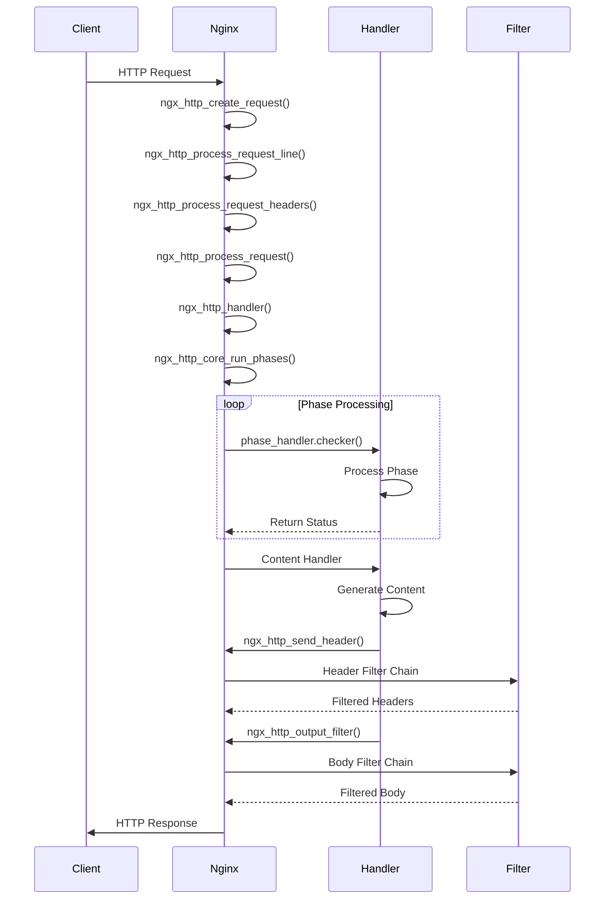
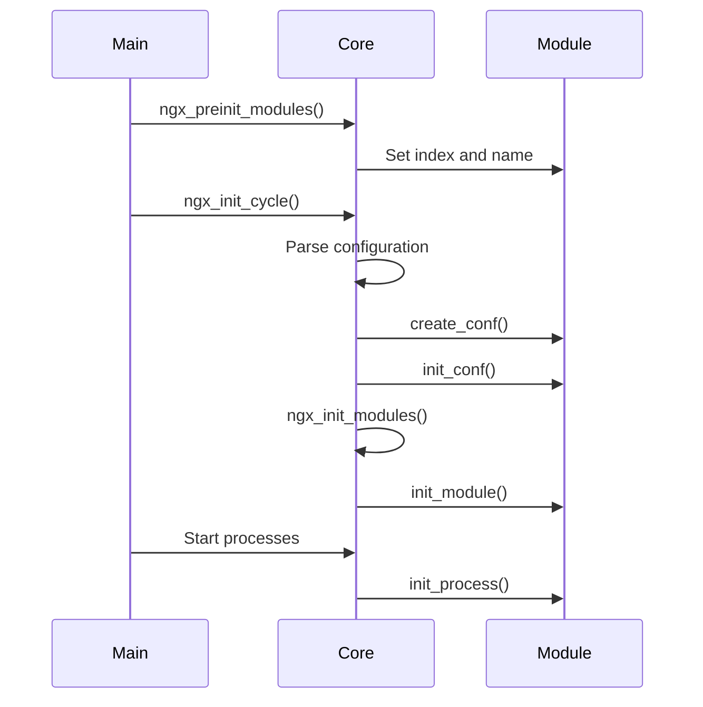

# Nginx API深入分析

## 1. 概述

本文档深入分析Nginx对外提供的API接口，包括HTTP处理API、模块初始化API、配置解析API等核心接口的实现原理和调用链路。

## 2. 核心API分类

### 2.1 HTTP处理API
- 请求创建和处理
- 响应发送
- 过滤器链
- 上游代理

### 2.2 模块管理API
- 模块初始化
- 模块配置
- 动态模块加载

### 2.3 配置解析API
- 配置文件解析
- 指令处理
- 配置验证

### 2.4 内存管理API
- 内存池操作
- 缓冲区管理
- 字符串处理

## 3. HTTP处理API详解

### 3.1 请求处理入口函数

#### ngx_http_handler()
**功能**: HTTP请求的主要处理入口
**位置**: `src/http/ngx_http_core_module.c:834`

```c
void
ngx_http_handler(ngx_http_request_t *r)
{
    ngx_http_core_main_conf_t  *cmcf;

    r->connection->log->action = NULL;

    // 处理连接类型
    if (!r->internal) {
        switch (r->headers_in.connection_type) {
        case 0:
            r->keepalive = (r->http_version > NGX_HTTP_VERSION_10);
            break;
        case NGX_HTTP_CONNECTION_CLOSE:
            r->keepalive = 0;
            break;
        case NGX_HTTP_CONNECTION_KEEP_ALIVE:
            r->keepalive = 1;
            break;
        }

        r->lingering_close = (r->headers_in.content_length_n > 0
                              || r->headers_in.chunked);
        r->phase_handler = 0;

    } else {
        cmcf = ngx_http_get_module_main_conf(r, ngx_http_core_module);
        r->phase_handler = cmcf->phase_engine.server_rewrite_index;
    }

    r->valid_location = 1;
    r->write_event_handler = ngx_http_core_run_phases;
    
    // 开始执行处理阶段
    ngx_http_core_run_phases(r);
}
```

**调用链路**:
1. `ngx_http_process_request()` → `ngx_http_handler()`
2. `ngx_http_handler()` → `ngx_http_core_run_phases()`
3. `ngx_http_core_run_phases()` → 各阶段处理器

#### ngx_http_core_run_phases()
**功能**: 执行HTTP请求处理的各个阶段
**位置**: `src/http/ngx_http_core_module.c:877`

```c
void
ngx_http_core_run_phases(ngx_http_request_t *r)
{
    ngx_int_t                   rc;
    ngx_http_phase_handler_t   *ph;
    ngx_http_core_main_conf_t  *cmcf;

    cmcf = ngx_http_get_module_main_conf(r, ngx_http_core_module);
    ph = cmcf->phase_engine.handlers;

    // 循环执行各阶段处理器
    while (ph[r->phase_handler].checker) {
        rc = ph[r->phase_handler].checker(r, &ph[r->phase_handler]);
        
        if (rc == NGX_OK) {
            return;
        }
    }
}
```

**HTTP处理阶段**:
1. `NGX_HTTP_POST_READ_PHASE` - 读取请求头后
2. `NGX_HTTP_SERVER_REWRITE_PHASE` - server级重写
3. `NGX_HTTP_FIND_CONFIG_PHASE` - 查找配置
4. `NGX_HTTP_REWRITE_PHASE` - location级重写
5. `NGX_HTTP_POST_REWRITE_PHASE` - 重写后处理
6. `NGX_HTTP_PREACCESS_PHASE` - 访问前检查
7. `NGX_HTTP_ACCESS_PHASE` - 访问控制
8. `NGX_HTTP_POST_ACCESS_PHASE` - 访问后处理
9. `NGX_HTTP_PRECONTENT_PHASE` - 内容前处理
10. `NGX_HTTP_CONTENT_PHASE` - 内容生成
11. `NGX_HTTP_LOG_PHASE` - 日志记录

### 3.2 请求创建API

#### ngx_http_create_request()
**功能**: 创建HTTP请求对象
**位置**: `src/http/ngx_http_request.c`

```c
ngx_http_request_t *
ngx_http_create_request(ngx_connection_t *c)
{
    ngx_http_request_t        *r;
    ngx_http_log_ctx_t        *ctx;
    ngx_http_core_main_conf_t *cmcf;

    // 分配请求对象
    r = ngx_http_alloc_request(c);
    if (r == NULL) {
        return NULL;
    }

    // 初始化请求基本信息
    r->signature = NGX_HTTP_MODULE;
    r->connection = c;
    r->main_conf = cmcf->main_conf;
    r->srv_conf = cmcf->srv_conf;
    r->loc_conf = cmcf->loc_conf;

    // 设置事件处理器
    r->read_event_handler = ngx_http_process_request_line;
    r->write_event_handler = ngx_http_request_empty_handler;

    // 初始化请求头
    if (ngx_list_init(&r->headers_out.headers, r->pool, 20,
                      sizeof(ngx_table_elt_t)) != NGX_OK)
    {
        ngx_http_close_request(r, NGX_HTTP_INTERNAL_SERVER_ERROR);
        return NULL;
    }

    return r;
}
```

### 3.3 响应发送API

#### ngx_http_send_header()
**功能**: 发送HTTP响应头
**位置**: `src/http/ngx_http_header_filter_module.c`

```c
ngx_int_t
ngx_http_send_header(ngx_http_request_t *r)
{
    if (r->header_sent) {
        return NGX_OK;
    }

    r->header_sent = 1;

    if (r != r->main) {
        return NGX_OK;
    }

    // 调用头部过滤器链
    return ngx_http_top_header_filter(r);
}
```

#### ngx_http_output_filter()
**功能**: 输出响应体数据
**位置**: `src/http/ngx_http_core_module.c`

```c
ngx_int_t
ngx_http_output_filter(ngx_http_request_t *r, ngx_chain_t *in)
{
    ngx_int_t          rc;
    ngx_connection_t  *c;

    c = r->connection;

    ngx_log_debug2(NGX_LOG_DEBUG_HTTP, c->log, 0,
                   "http output filter \"%V?%V\"", &r->uri, &r->args);

    // 调用输出过滤器链
    rc = ngx_http_top_body_filter(r, in);

    if (rc == NGX_ERROR) {
        /* NGX_ERROR may be returned by any filter */
        c->error = 1;
    }

    return rc;
}
```

### 3.4 请求体读取API

#### ngx_http_read_client_request_body()
**功能**: 读取客户端请求体
**位置**: `src/http/ngx_http_request_body.c`

```c
ngx_int_t
ngx_http_read_client_request_body(ngx_http_request_t *r,
    ngx_http_client_body_handler_pt post_handler)
{
    size_t                     preread;
    ssize_t                    size;
    ngx_int_t                  rc;
    ngx_buf_t                 *b;
    ngx_chain_t               *cl, **next;
    ngx_temp_file_t           *tf;
    ngx_http_request_body_t   *rb;
    ngx_http_core_loc_conf_t  *clcf;

    r->main->count++;

    if (r != r->main || r->request_body || r->discard_body) {
        r->request_body_no_buffering = 0;
        post_handler(r);
        return NGX_OK;
    }

    // 分配请求体结构
    rb = ngx_pcalloc(r->pool, sizeof(ngx_http_request_body_t));
    if (rb == NULL) {
        return NGX_HTTP_INTERNAL_SERVER_ERROR;
    }

    r->request_body = rb;

    // 检查Content-Length
    if (r->headers_in.content_length_n < 0 && !r->headers_in.chunked) {
        r->request_body_no_buffering = 0;
        post_handler(r);
        return NGX_OK;
    }

    rb->post_handler = post_handler;

    // 处理预读数据
    preread = r->header_in->last - r->header_in->pos;

    if (preread) {
        // 处理已预读的数据
        // ...
    }

    // 继续读取请求体
    rc = ngx_http_do_read_client_request_body(r);

    if (rc >= NGX_HTTP_SPECIAL_RESPONSE) {
        return rc;
    }

    return NGX_OK;
}
```

## 4. 模块管理API详解

### 4.1 模块初始化API

#### ngx_preinit_modules()
**功能**: 预初始化所有模块
**位置**: `src/core/ngx_module.c:26`

```c
ngx_int_t
ngx_preinit_modules(void)
{
    ngx_uint_t  i;

    // 遍历所有静态模块，设置索引和名称
    for (i = 0; ngx_modules[i]; i++) {
        ngx_modules[i]->index = i;
        ngx_modules[i]->name = ngx_module_names[i];
    }

    ngx_modules_n = i;
    ngx_max_module = ngx_modules_n + NGX_MAX_DYNAMIC_MODULES;

    return NGX_OK;
}
```

#### ngx_init_modules()
**功能**: 初始化所有模块
**位置**: `src/core/ngx_module.c:66`

```c
ngx_int_t
ngx_init_modules(ngx_cycle_t *cycle)
{
    ngx_uint_t  i;

    // 调用每个模块的init_module回调
    for (i = 0; cycle->modules[i]; i++) {
        if (cycle->modules[i]->init_module) {
            if (cycle->modules[i]->init_module(cycle) != NGX_OK) {
                return NGX_ERROR;
            }
        }
    }

    return NGX_OK;
}
```

### 4.2 动态模块加载API

#### ngx_load_module()
**功能**: 动态加载模块
**位置**: `src/core/nginx.c:1582`

```c
static char *
ngx_load_module(ngx_conf_t *cf, ngx_command_t *cmd, void *conf)
{
#if (NGX_HAVE_DLOPEN)
    void                *handle;
    char               **names, **order;
    ngx_str_t           *value, file;
    ngx_uint_t           i;
    ngx_module_t        *module, **modules;
    ngx_pool_cleanup_t  *cln;

    if (cf->cycle->modules_used) {
        return "is specified too late";
    }

    value = cf->args->elts;
    file = value[1];

    // 获取完整文件路径
    if (ngx_conf_full_name(cf->cycle, &file, 0) != NGX_OK) {
        return NGX_CONF_ERROR;
    }

    // 动态加载共享库
    handle = ngx_dlopen(file.data);
    if (handle == NULL) {
        ngx_conf_log_error(NGX_LOG_EMERG, cf, 0,
                           ngx_dlopen_n " \"%s\" failed (%s)",
                           file.data, ngx_dlerror());
        return NGX_CONF_ERROR;
    }

    // 获取模块数组
    modules = ngx_dlsym(handle, "ngx_modules");
    if (modules == NULL) {
        ngx_conf_log_error(NGX_LOG_EMERG, cf, 0,
                           ngx_dlsym_n " \"%V\", \"%s\" failed (%s)",
                           &value[1], "ngx_modules", ngx_dlerror());
        return NGX_CONF_ERROR;
    }

    // 获取模块名称数组
    names = ngx_dlsym(handle, "ngx_module_names");
    if (names == NULL) {
        ngx_conf_log_error(NGX_LOG_EMERG, cf, 0,
                           ngx_dlsym_n " \"%V\", \"%s\" failed (%s)",
                           &value[1], "ngx_module_names", ngx_dlerror());
        return NGX_CONF_ERROR;
    }

    // 注册所有模块
    for (i = 0; modules[i]; i++) {
        module = modules[i];
        module->name = names[i];

        if (ngx_add_module(cf, &file, module, order) != NGX_OK) {
            return NGX_CONF_ERROR;
        }
    }

    return NGX_CONF_OK;
#else
    ngx_conf_log_error(NGX_LOG_EMERG, cf, 0,
                       "\"load_module\" is not supported on this platform");
    return NGX_CONF_ERROR;
#endif
}
```

## 5. 配置解析API详解

### 5.1 配置文件解析入口

#### ngx_conf_parse()
**功能**: 解析配置文件
**位置**: `src/core/ngx_conf_file.c`

```c
char *
ngx_conf_parse(ngx_conf_t *cf, ngx_str_t *filename)
{
    char             *rv;
    ngx_fd_t          fd;
    ngx_int_t         rc;
    ngx_buf_t         buf;
    ngx_conf_file_t  *prev, conf_file;
    enum {
        parse_file = 0,
        parse_block,
        parse_param
    } type;

    // 确定解析类型
    if (filename) {
        /* open configuration file */
        fd = ngx_open_file(filename->data, NGX_FILE_RDONLY, NGX_FILE_OPEN, 0);
        if (fd == NGX_INVALID_FILE) {
            ngx_conf_log_error(NGX_LOG_EMERG, cf, ngx_errno,
                               ngx_open_file_n " \"%s\" failed",
                               filename->data);
            return NGX_CONF_ERROR;
        }

        type = parse_file;

    } else if (cf->conf_file->file.fd != NGX_INVALID_FILE) {
        type = parse_block;

    } else {
        type = parse_param;
    }

    // 主解析循环
    for ( ;; ) {
        rc = ngx_conf_read_token(cf);

        if (rc == NGX_ERROR) {
            goto failed;
        }

        if (rc == NGX_CONF_BLOCK_DONE) {
            if (type != parse_block) {
                ngx_conf_log_error(NGX_LOG_EMERG, cf, 0, "unexpected \"}\"");
                goto failed;
            }
            goto done;
        }

        if (rc == NGX_CONF_FILE_DONE) {
            if (type == parse_block) {
                ngx_conf_log_error(NGX_LOG_EMERG, cf, 0,
                                   "unexpected end of file, expecting \"}\"");
                goto failed;
            }
            goto done;
        }

        if (rc == NGX_CONF_BLOCK_START) {
            if (type == parse_param) {
                ngx_conf_log_error(NGX_LOG_EMERG, cf, 0,
                                   "block directives are not supported "
                                   "in -g option");
                goto failed;
            }
        }

        // 处理指令
        rv = ngx_conf_handler(cf, rc);

        if (rv == NGX_CONF_OK) {
            continue;
        }

        if (rv == NGX_CONF_ERROR) {
            goto failed;
        }

        ngx_conf_log_error(NGX_LOG_EMERG, cf, 0, "%s", rv);
        goto failed;
    }

done:
    rv = NGX_CONF_OK;

failed:
    if (filename) {
        if (ngx_close_file(fd) == NGX_FILE_ERROR) {
            ngx_log_error(NGX_LOG_ALERT, cf->log, ngx_errno,
                          ngx_close_file_n " %s failed", filename->data);
            rv = NGX_CONF_ERROR;
        }
    }

    return rv;
}
```

### 5.2 指令处理API

#### ngx_conf_handler()
**功能**: 处理配置指令
**位置**: `src/core/ngx_conf_file.c`

```c
static char *
ngx_conf_handler(ngx_conf_t *cf, ngx_int_t last)
{
    char           *rv;
    void           *conf, **confp;
    ngx_uint_t      i, found;
    ngx_str_t      *name;
    ngx_command_t  *cmd;

    name = cf->args->elts;
    found = 0;

    // 遍历所有模块的指令
    for (i = 0; cf->cycle->modules[i]; i++) {

        cmd = cf->cycle->modules[i]->commands;
        if (cmd == NULL) {
            continue;
        }

        // 查找匹配的指令
        for ( /* void */ ; cmd->name.len; cmd++) {

            if (name->len != cmd->name.len) {
                continue;
            }

            if (ngx_strcmp(name->data, cmd->name.data) != 0) {
                continue;
            }

            found = 1;

            // 检查指令上下文
            if (cf->cycle->modules[i]->type != NGX_CONF_MODULE
                && cf->cycle->modules[i]->type != cf->module_type)
            {
                continue;
            }

            if (!(cmd->type & cf->cmd_type)) {
                continue;
            }

            if (!(cmd->type & NGX_CONF_BLOCK) && last != NGX_OK) {
                ngx_conf_log_error(NGX_LOG_EMERG, cf, 0,
                                  "directive \"%s\" is not terminated by \";\"",
                                  name->data);
                return NGX_CONF_ERROR;
            }

            if ((cmd->type & NGX_CONF_BLOCK) && last != NGX_CONF_BLOCK_START) {
                ngx_conf_log_error(NGX_LOG_EMERG, cf, 0,
                                  "directive \"%s\" has no opening \"{\"",
                                  name->data);
                return NGX_CONF_ERROR;
            }

            // 获取配置结构
            if (cmd->type & NGX_DIRECT_CONF) {
                conf = ((void **) cf->ctx)[cf->cycle->modules[i]->index];

            } else if (cmd->type & NGX_MAIN_CONF) {
                conf = &(((void **) cf->ctx)[cf->cycle->modules[i]->index]);

            } else if (cf->ctx) {
                confp = *(void **) ((char *) cf->ctx + cmd->conf);

                if (confp) {
                    conf = confp[cf->cycle->modules[i]->ctx_index];
                }
            }

            // 调用指令处理函数
            rv = cmd->set(cf, cmd, conf);

            if (rv == NGX_CONF_OK) {
                return NGX_CONF_OK;
            }

            if (rv == NGX_CONF_ERROR) {
                return NGX_CONF_ERROR;
            }

            ngx_conf_log_error(NGX_LOG_EMERG, cf, 0,
                              "\"%s\" directive %s", name->data, rv);

            return NGX_CONF_ERROR;
        }
    }

    if (found) {
        ngx_conf_log_error(NGX_LOG_EMERG, cf, 0,
                          "\"%s\" directive is not allowed here", name->data);

        return NGX_CONF_ERROR;
    }

    ngx_conf_log_error(NGX_LOG_EMERG, cf, 0,
                      "unknown directive \"%s\"", name->data);

    return NGX_CONF_ERROR;
}
```

## 6. 内存管理API详解

### 6.1 内存池API

#### ngx_create_pool()
**功能**: 创建内存池
**位置**: `src/core/ngx_palloc.c`

```c
ngx_pool_t *
ngx_create_pool(size_t size, ngx_log_t *log)
{
    ngx_pool_t  *p;

    p = ngx_memalign(NGX_POOL_ALIGNMENT, size, log);
    if (p == NULL) {
        return NULL;
    }

    p->d.last = (u_char *) p + sizeof(ngx_pool_t);
    p->d.end = (u_char *) p + size;
    p->d.next = NULL;
    p->d.failed = 0;

    size = size - sizeof(ngx_pool_t);
    p->max = (size < NGX_MAX_ALLOC_FROM_POOL) ? size : NGX_MAX_ALLOC_FROM_POOL;

    p->current = p;
    p->chain = NULL;
    p->large = NULL;
    p->cleanup = NULL;
    p->log = log;

    return p;
}
```

#### ngx_palloc()
**功能**: 从内存池分配内存
**位置**: `src/core/ngx_palloc.c`

```c
void *
ngx_palloc(ngx_pool_t *pool, size_t size)
{
    if (size <= pool->max) {
        return ngx_palloc_small(pool, size, 1);
    }

    return ngx_palloc_large(pool, size);
}
```

### 6.2 缓冲区API

#### ngx_create_temp_buf()
**功能**: 创建临时缓冲区
**位置**: `src/core/ngx_buf.c`

```c
ngx_buf_t *
ngx_create_temp_buf(ngx_pool_t *pool, size_t size)
{
    ngx_buf_t *b;

    b = ngx_calloc_buf(pool);
    if (b == NULL) {
        return NULL;
    }

    b->start = ngx_palloc(pool, size);
    if (b->start == NULL) {
        return NULL;
    }

    b->pos = b->start;
    b->last = b->start;
    b->end = b->last + size;
    b->temporary = 1;

    return b;
}
```

## 7. API调用时序图

### 7.1 HTTP请求处理时序



### 7.2 模块初始化时序



## 8. 关键数据结构关系图

```mermaid
classDiagram
    class ngx_cycle_t {
        +pool: ngx_pool_t*
        +log: ngx_log_t*
        +modules: ngx_module_t**
        +conf_ctx: void****
        +connections: ngx_connection_t*
        +listening: ngx_array_t
    }

    class ngx_module_t {
        +index: ngx_uint_t
        +name: char*
        +ctx: void*
        +commands: ngx_command_t*
        +type: ngx_uint_t
        +init_module(): ngx_int_t
        +init_process(): ngx_int_t
    }

    class ngx_http_request_t {
        +connection: ngx_connection_t*
        +pool: ngx_pool_t*
        +headers_in: ngx_http_headers_in_t
        +headers_out: ngx_http_headers_out_t
        +method: ngx_uint_t
        +uri: ngx_str_t
        +args: ngx_str_t
    }

    class ngx_connection_t {
        +fd: ngx_socket_t
        +data: void*
        +read: ngx_event_t*
        +write: ngx_event_t*
        +pool: ngx_pool_t*
        +log: ngx_log_t*
    }

    ngx_cycle_t ||--o{ ngx_module_t
    ngx_cycle_t ||--o{ ngx_connection_t
    ngx_connection_t ||--|| ngx_http_request_t
    ngx_http_request_t ||--|| ngx_cycle_t
```

## 9. 实战应用示例

### 9.1 自定义HTTP模块

```c
// 模块配置结构
typedef struct {
    ngx_str_t  message;
} ngx_http_hello_loc_conf_t;

// 内容处理函数
static ngx_int_t
ngx_http_hello_handler(ngx_http_request_t *r)
{
    ngx_int_t                     rc;
    ngx_buf_t                    *b;
    ngx_chain_t                   out;
    ngx_http_hello_loc_conf_t    *hlcf;

    // 获取模块配置
    hlcf = ngx_http_get_module_loc_conf(r, ngx_http_hello_module);

    // 设置响应头
    r->headers_out.status = NGX_HTTP_OK;
    r->headers_out.content_length_n = hlcf->message.len;

    // 发送响应头
    rc = ngx_http_send_header(r);
    if (rc == NGX_ERROR || rc > NGX_OK || r->header_only) {
        return rc;
    }

    // 创建响应体
    b = ngx_create_temp_buf(r->pool, hlcf->message.len);
    if (b == NULL) {
        return NGX_HTTP_INTERNAL_SERVER_ERROR;
    }

    ngx_memcpy(b->pos, hlcf->message.data, hlcf->message.len);
    b->last = b->pos + hlcf->message.len;
    b->last_buf = 1;
    b->last_in_chain = 1;

    out.buf = b;
    out.next = NULL;

    // 发送响应体
    return ngx_http_output_filter(r, &out);
}

// 模块定义
ngx_module_t ngx_http_hello_module = {
    NGX_MODULE_V1,
    &ngx_http_hello_module_ctx,
    ngx_http_hello_commands,
    NGX_HTTP_MODULE,
    NULL,                          /* init master */
    NULL,                          /* init module */
    NULL,                          /* init process */
    NULL,                          /* init thread */
    NULL,                          /* exit thread */
    NULL,                          /* exit process */
    NULL,                          /* exit master */
    NGX_MODULE_V1_PADDING
};
```

### 9.2 过滤器模块

```c
// 头部过滤器
static ngx_int_t
ngx_http_custom_header_filter(ngx_http_request_t *r)
{
    ngx_table_elt_t  *h;

    // 添加自定义头部
    h = ngx_list_push(&r->headers_out.headers);
    if (h == NULL) {
        return NGX_ERROR;
    }

    h->hash = 1;
    ngx_str_set(&h->key, "X-Custom-Header");
    ngx_str_set(&h->value, "Custom Value");

    // 调用下一个过滤器
    return ngx_http_next_header_filter(r);
}

// 体过滤器
static ngx_int_t
ngx_http_custom_body_filter(ngx_http_request_t *r, ngx_chain_t *in)
{
    ngx_chain_t  *cl;

    // 处理输入链
    for (cl = in; cl; cl = cl->next) {
        // 处理缓冲区数据
        // ...
    }

    // 调用下一个过滤器
    return ngx_http_next_body_filter(r, in);
}
```

## 10. 性能优化建议

### 10.1 内存使用优化
- 合理使用内存池，避免内存泄漏
- 预分配常用数据结构
- 使用零拷贝技术

### 10.2 网络处理优化
- 使用异步非阻塞I/O
- 合理设置缓冲区大小
- 启用TCP_NODELAY和TCP_NOPUSH

### 10.3 模块开发优化
- 避免在关键路径上进行复杂计算
- 使用高效的数据结构
- 合理使用缓存机制

## 11. 总结

Nginx的API设计体现了以下特点：

1. **分层设计**: 核心API、HTTP API、模块API层次分明
2. **事件驱动**: 基于事件的异步处理模型
3. **内存高效**: 内存池和零拷贝技术
4. **模块化**: 高度模块化的架构设计
5. **可扩展**: 支持动态模块加载

通过深入理解这些API的实现原理和调用关系，开发者可以更好地扩展Nginx功能，开发高性能的Web应用。
