# Nginx 整体架构图和时序图

## 1. 概述

本文档提供Nginx的整体架构图、时序图和模块交互图，帮助开发者从宏观角度理解Nginx的设计架构和运行机制。

## 2. 整体架构图

### 2.1 系统层次架构

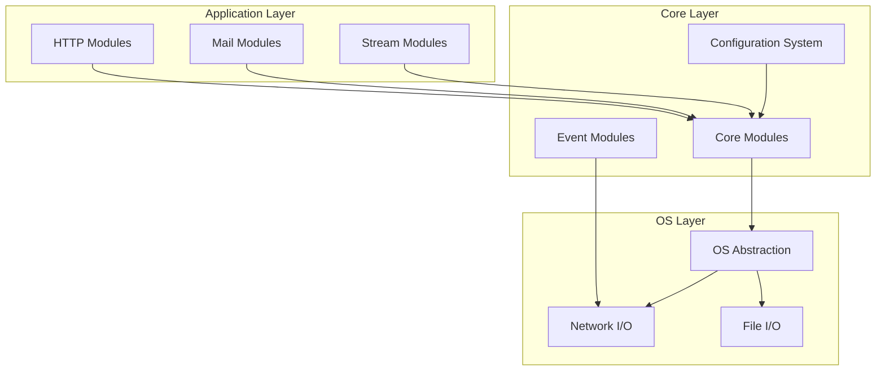
```mermaid
graph TB
    subgraph "Application Layer"
        A[HTTP Modules]
        B[Mail Modules]
        C[Stream Modules]
    end
    
    subgraph "Core Layer"
        D[Core Modules]
        E[Event Modules]
        F[Configuration System]
    end
    
    subgraph "OS Layer"
        G[OS Abstraction]
        H[Network I/O]
        I[File I/O]
    end
    
    A --> D
    B --> D
    C --> D
    D --> G
    E --> H
    F --> D
    G --> H
    G --> I
```

### 2.2 进程架构图

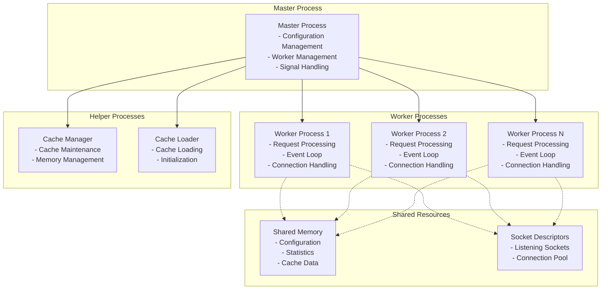
```mermaid
graph TB
    subgraph "Master Process"
        M[Master Process<br/>- Configuration Management<br/>- Worker Management<br/>- Signal Handling]
    end
    
    subgraph "Worker Processes"
        W1[Worker Process 1<br/>- Request Processing<br/>- Event Loop<br/>- Connection Handling]
        W2[Worker Process 2<br/>- Request Processing<br/>- Event Loop<br/>- Connection Handling]
        W3[Worker Process N<br/>- Request Processing<br/>- Event Loop<br/>- Connection Handling]
    end
    
    subgraph "Helper Processes"
        CM[Cache Manager<br/>- Cache Maintenance<br/>- Memory Management]
        CL[Cache Loader<br/>- Cache Loading<br/>- Initialization]
    end
    
    M --> W1
    M --> W2
    M --> W3
    M --> CM
    M --> CL
    
    subgraph "Shared Resources"
        SHM[Shared Memory<br/>- Configuration<br/>- Statistics<br/>- Cache Data]
        SOCK[Socket Descriptors<br/>- Listening Sockets<br/>- Connection Pool]
    end
    
    W1 -.-> SHM
    W2 -.-> SHM
    W3 -.-> SHM
    W1 -.-> SOCK
    W2 -.-> SOCK
    W3 -.-> SOCK
```

### 2.3 模块架构图

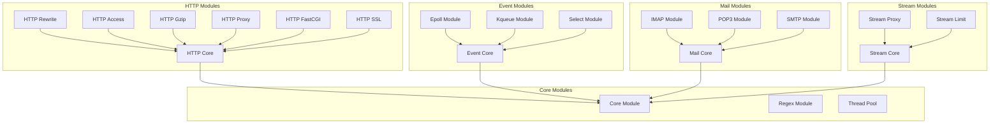
```mermaid
graph TB
    subgraph "HTTP Modules"
        HC[HTTP Core]
        HR[HTTP Rewrite]
        HA[HTTP Access]
        HG[HTTP Gzip]
        HP[HTTP Proxy]
        HF[HTTP FastCGI]
        HS[HTTP SSL]
    end
    
    subgraph "Event Modules"
        EC[Event Core]
        EE[Epoll Module]
        EK[Kqueue Module]
        ES[Select Module]
    end
    
    subgraph "Core Modules"
        CC[Core Module]
        CR[Regex Module]
        CT[Thread Pool]
    end
    
    subgraph "Mail Modules"
        MC[Mail Core]
        MI[IMAP Module]
        MP[POP3 Module]
        MS[SMTP Module]
    end
    
    subgraph "Stream Modules"
        SC[Stream Core]
        SP[Stream Proxy]
        SL[Stream Limit]
    end
    
    HC --> CC
    HR --> HC
    HA --> HC
    HG --> HC
    HP --> HC
    HF --> HC
    HS --> HC
    
    EC --> CC
    EE --> EC
    EK --> EC
    ES --> EC
    
    MC --> CC
    MI --> MC
    MP --> MC
    MS --> MC
    
    SC --> CC
    SP --> SC
    SL --> SC
```

## 3. 启动时序图

### 3.1 Master进程启动时序

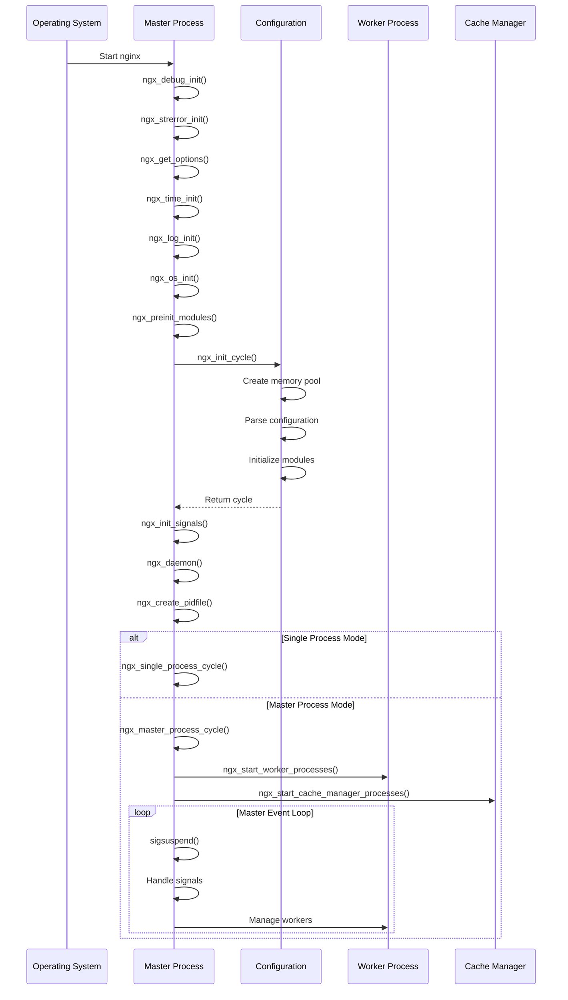
```mermaid
sequenceDiagram
    participant OS as Operating System
    participant M as Master Process
    participant C as Configuration
    participant W as Worker Process
    participant CM as Cache Manager

    OS->>M: Start nginx
    M->>M: ngx_debug_init()
    M->>M: ngx_strerror_init()
    M->>M: ngx_get_options()
    M->>M: ngx_time_init()
    M->>M: ngx_log_init()
    M->>M: ngx_os_init()
    M->>M: ngx_preinit_modules()
    
    M->>C: ngx_init_cycle()
    C->>C: Create memory pool
    C->>C: Parse configuration
    C->>C: Initialize modules
    C-->>M: Return cycle
    
    M->>M: ngx_init_signals()
    M->>M: ngx_daemon()
    M->>M: ngx_create_pidfile()
    
    alt Single Process Mode
        M->>M: ngx_single_process_cycle()
    else Master Process Mode
        M->>M: ngx_master_process_cycle()
        M->>W: ngx_start_worker_processes()
        M->>CM: ngx_start_cache_manager_processes()
        
        loop Master Event Loop
            M->>M: sigsuspend()
            M->>M: Handle signals
            M->>W: Manage workers
        end
    end
```

### 3.2 Worker进程启动时序

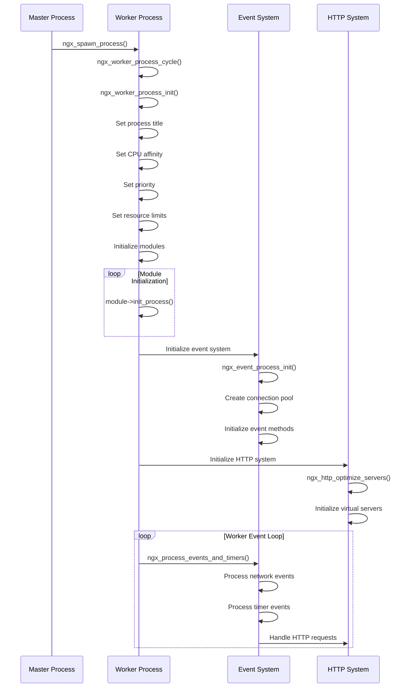
```mermaid
sequenceDiagram
    participant M as Master Process
    participant W as Worker Process
    participant E as Event System
    participant H as HTTP System

    M->>W: ngx_spawn_process()
    W->>W: ngx_worker_process_cycle()
    W->>W: ngx_worker_process_init()
    
    W->>W: Set process title
    W->>W: Set CPU affinity
    W->>W: Set priority
    W->>W: Set resource limits
    
    W->>W: Initialize modules
    loop Module Initialization
        W->>W: module->init_process()
    end
    
    W->>E: Initialize event system
    E->>E: ngx_event_process_init()
    E->>E: Create connection pool
    E->>E: Initialize event methods
    
    W->>H: Initialize HTTP system
    H->>H: ngx_http_optimize_servers()
    H->>H: Initialize virtual servers
    
    loop Worker Event Loop
        W->>E: ngx_process_events_and_timers()
        E->>E: Process network events
        E->>E: Process timer events
        E->>H: Handle HTTP requests
    end
```

## 4. HTTP请求处理时序图

### 4.1 完整HTTP请求处理流程

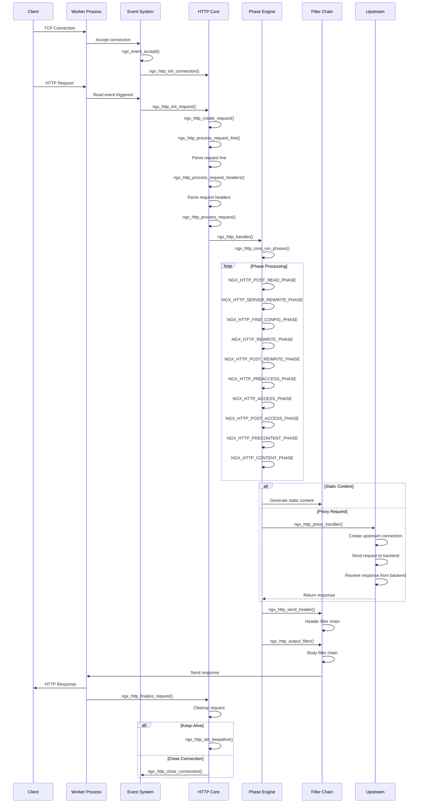
```mermaid
sequenceDiagram
    participant C as Client
    participant W as Worker Process
    participant E as Event System
    participant H as HTTP Core
    participant P as Phase Engine
    participant F as Filter Chain
    participant U as Upstream

    C->>W: TCP Connection
    W->>E: Accept connection
    E->>E: ngx_event_accept()
    E->>H: ngx_http_init_connection()
    
    C->>W: HTTP Request
    W->>E: Read event triggered
    E->>H: ngx_http_init_request()
    H->>H: ngx_http_create_request()
    
    H->>H: ngx_http_process_request_line()
    H->>H: Parse request line
    H->>H: ngx_http_process_request_headers()
    H->>H: Parse request headers
    
    H->>H: ngx_http_process_request()
    H->>P: ngx_http_handler()
    P->>P: ngx_http_core_run_phases()
    
    loop Phase Processing
        P->>P: NGX_HTTP_POST_READ_PHASE
        P->>P: NGX_HTTP_SERVER_REWRITE_PHASE
        P->>P: NGX_HTTP_FIND_CONFIG_PHASE
        P->>P: NGX_HTTP_REWRITE_PHASE
        P->>P: NGX_HTTP_POST_REWRITE_PHASE
        P->>P: NGX_HTTP_PREACCESS_PHASE
        P->>P: NGX_HTTP_ACCESS_PHASE
        P->>P: NGX_HTTP_POST_ACCESS_PHASE
        P->>P: NGX_HTTP_PRECONTENT_PHASE
        P->>P: NGX_HTTP_CONTENT_PHASE
    end
    
    alt Static Content
        P->>F: Generate static content
    else Proxy Request
        P->>U: ngx_http_proxy_handler()
        U->>U: Create upstream connection
        U->>U: Send request to backend
        U->>U: Receive response from backend
        U-->>P: Return response
    end
    
    P->>F: ngx_http_send_header()
    F->>F: Header filter chain
    P->>F: ngx_http_output_filter()
    F->>F: Body filter chain
    
    F->>W: Send response
    W->>C: HTTP Response
    
    W->>H: ngx_http_finalize_request()
    H->>H: Cleanup request
    
    alt Keep-Alive
        H->>H: ngx_http_set_keepalive()
    else Close Connection
        H->>E: ngx_http_close_connection()
    end
```

### 4.2 HTTP阶段处理详细时序

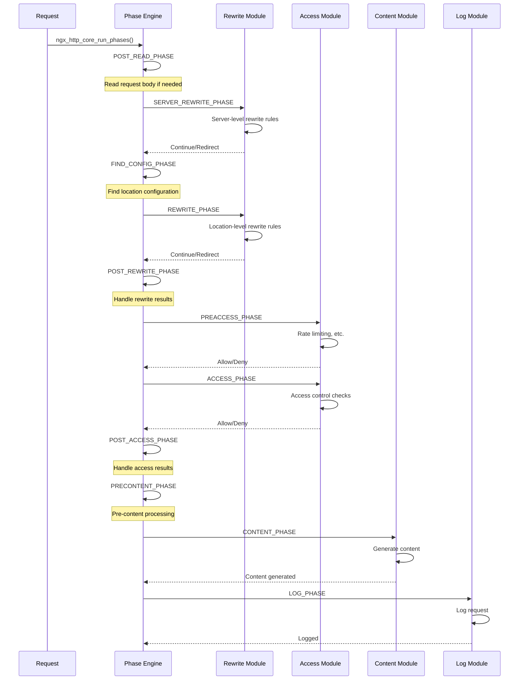
```mermaid
sequenceDiagram
    participant R as Request
    participant PE as Phase Engine
    participant RW as Rewrite Module
    participant AC as Access Module
    participant CT as Content Module
    participant LG as Log Module

    R->>PE: ngx_http_core_run_phases()
    
    PE->>PE: POST_READ_PHASE
    Note over PE: Read request body if needed
    
    PE->>RW: SERVER_REWRITE_PHASE
    RW->>RW: Server-level rewrite rules
    RW-->>PE: Continue/Redirect
    
    PE->>PE: FIND_CONFIG_PHASE
    Note over PE: Find location configuration
    
    PE->>RW: REWRITE_PHASE
    RW->>RW: Location-level rewrite rules
    RW-->>PE: Continue/Redirect
    
    PE->>PE: POST_REWRITE_PHASE
    Note over PE: Handle rewrite results
    
    PE->>AC: PREACCESS_PHASE
    AC->>AC: Rate limiting, etc.
    AC-->>PE: Allow/Deny
    
    PE->>AC: ACCESS_PHASE
    AC->>AC: Access control checks
    AC-->>PE: Allow/Deny
    
    PE->>PE: POST_ACCESS_PHASE
    Note over PE: Handle access results
    
    PE->>PE: PRECONTENT_PHASE
    Note over PE: Pre-content processing
    
    PE->>CT: CONTENT_PHASE
    CT->>CT: Generate content
    CT-->>PE: Content generated
    
    PE->>LG: LOG_PHASE
    LG->>LG: Log request
    LG-->>PE: Logged
```

## 5. 事件处理架构图

### 5.1 事件循环架构

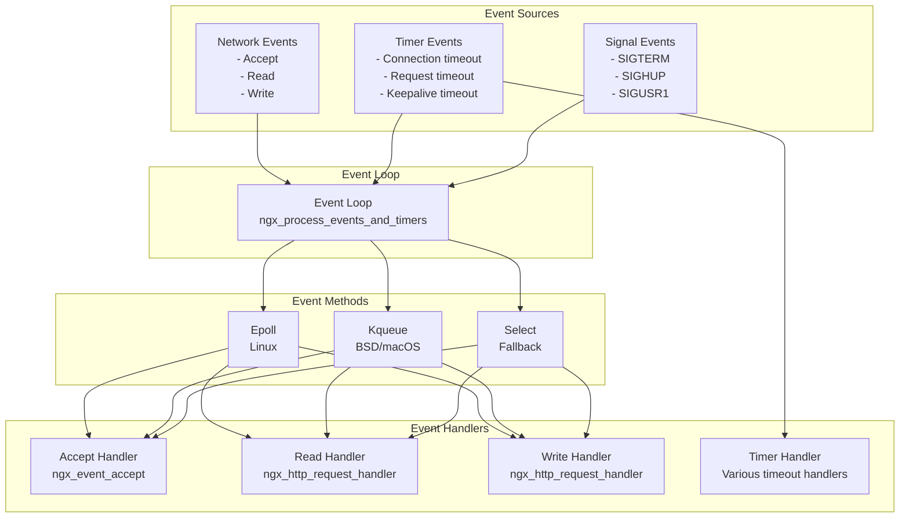
```mermaid
graph TB
    subgraph "Event Loop"
        EL[Event Loop<br/>ngx_process_events_and_timers]
    end
    
    subgraph "Event Sources"
        NE[Network Events<br/>- Accept<br/>- Read<br/>- Write]
        TE[Timer Events<br/>- Connection timeout<br/>- Request timeout<br/>- Keepalive timeout]
        SE[Signal Events<br/>- SIGTERM<br/>- SIGHUP<br/>- SIGUSR1]
    end
    
    subgraph "Event Methods"
        EP[Epoll<br/>Linux]
        KQ[Kqueue<br/>BSD/macOS]
        SEL[Select<br/>Fallback]
    end
    
    subgraph "Event Handlers"
        AH[Accept Handler<br/>ngx_event_accept]
        RH[Read Handler<br/>ngx_http_request_handler]
        WH[Write Handler<br/>ngx_http_request_handler]
        TH[Timer Handler<br/>Various timeout handlers]
    end
    
    NE --> EL
    TE --> EL
    SE --> EL
    
    EL --> EP
    EL --> KQ
    EL --> SEL
    
    EP --> AH
    EP --> RH
    EP --> WH
    KQ --> AH
    KQ --> RH
    KQ --> WH
    SEL --> AH
    SEL --> RH
    SEL --> WH
    
    TE --> TH
```

### 5.2 连接处理流程图

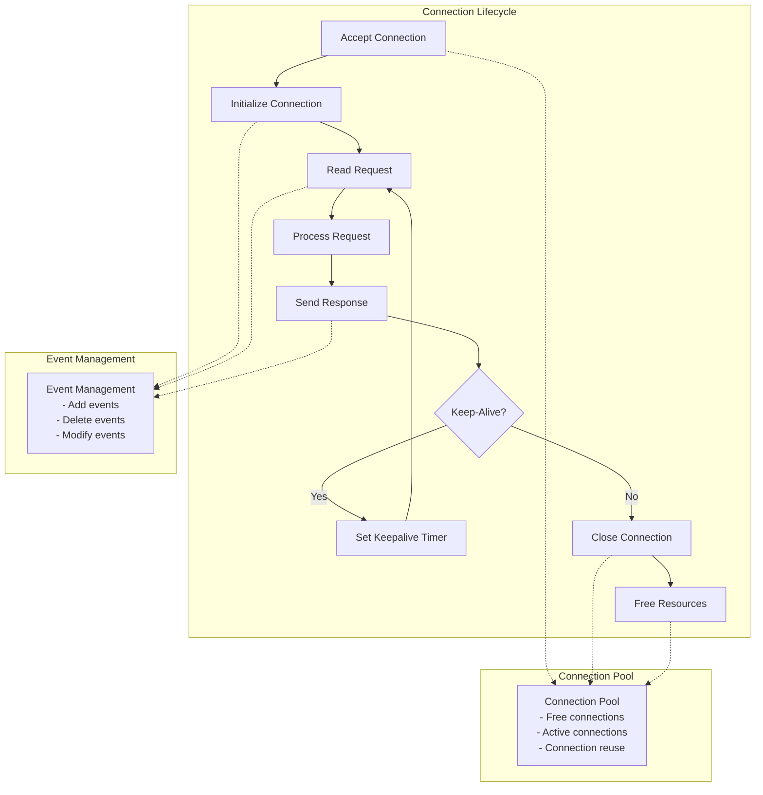
```mermaid
graph TB
    subgraph "Connection Lifecycle"
        A[Accept Connection] --> B[Initialize Connection]
        B --> C[Read Request]
        C --> D[Process Request]
        D --> E[Send Response]
        E --> F{Keep-Alive?}
        F -->|Yes| G[Set Keepalive Timer]
        F -->|No| H[Close Connection]
        G --> C
        H --> I[Free Resources]
    end
    
    subgraph "Connection Pool"
        CP[Connection Pool<br/>- Free connections<br/>- Active connections<br/>- Connection reuse]
    end
    
    subgraph "Event Management"
        EM[Event Management<br/>- Add events<br/>- Delete events<br/>- Modify events]
    end
    
    A -.-> CP
    B -.-> EM
    C -.-> EM
    E -.-> EM
    H -.-> CP
    I -.-> CP
```

## 6. 内存管理架构图

### 6.1 内存池架构

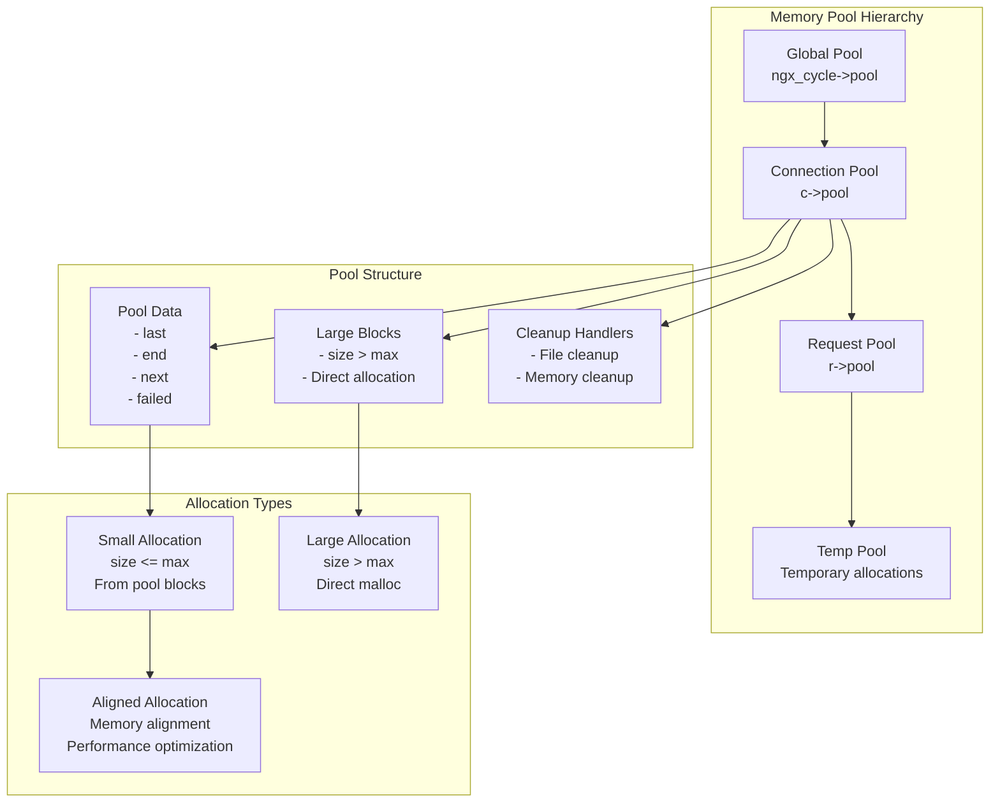
```mermaid
graph TB
    subgraph "Memory Pool Hierarchy"
        GP[Global Pool<br/>ngx_cycle->pool]
        CP[Connection Pool<br/>c->pool]
        RP[Request Pool<br/>r->pool]
        TP[Temp Pool<br/>Temporary allocations]
    end
    
    subgraph "Pool Structure"
        PD[Pool Data<br/>- last<br/>- end<br/>- next<br/>- failed]
        PL[Large Blocks<br/>- size > max<br/>- Direct allocation]
        PC[Cleanup Handlers<br/>- File cleanup<br/>- Memory cleanup]
    end
    
    subgraph "Allocation Types"
        SA[Small Allocation<br/>size <= max<br/>From pool blocks]
        LA[Large Allocation<br/>size > max<br/>Direct malloc]
        AA[Aligned Allocation<br/>Memory alignment<br/>Performance optimization]
    end
    
    GP --> CP
    CP --> RP
    RP --> TP
    
    CP --> PD
    CP --> PL
    CP --> PC
    
    PD --> SA
    PL --> LA
    SA --> AA
```

### 6.2 缓冲区管理架构

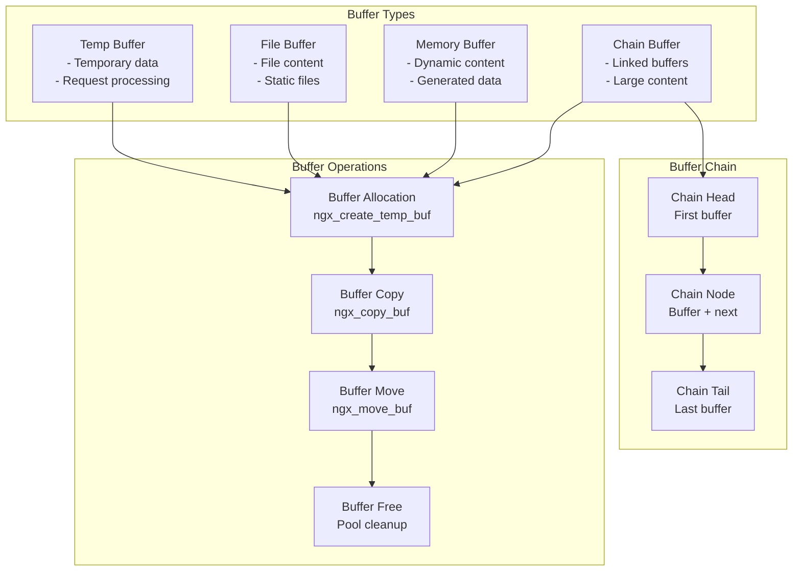
```mermaid
graph TB
    subgraph "Buffer Types"
        TB[Temp Buffer<br/>- Temporary data<br/>- Request processing]
        FB[File Buffer<br/>- File content<br/>- Static files]
        MB[Memory Buffer<br/>- Dynamic content<br/>- Generated data]
        CB[Chain Buffer<br/>- Linked buffers<br/>- Large content]
    end
    
    subgraph "Buffer Operations"
        BA[Buffer Allocation<br/>ngx_create_temp_buf]
        BC[Buffer Copy<br/>ngx_copy_buf]
        BM[Buffer Move<br/>ngx_move_buf]
        BF[Buffer Free<br/>Pool cleanup]
    end
    
    subgraph "Buffer Chain"
        CH[Chain Head<br/>First buffer]
        CN[Chain Node<br/>Buffer + next]
        CT[Chain Tail<br/>Last buffer]
    end
    
    TB --> BA
    FB --> BA
    MB --> BA
    CB --> BA
    
    BA --> BC
    BC --> BM
    BM --> BF
    
    CH --> CN
    CN --> CT
    CB --> CH
```

## 7. 配置系统架构图

### 7.1 配置解析架构

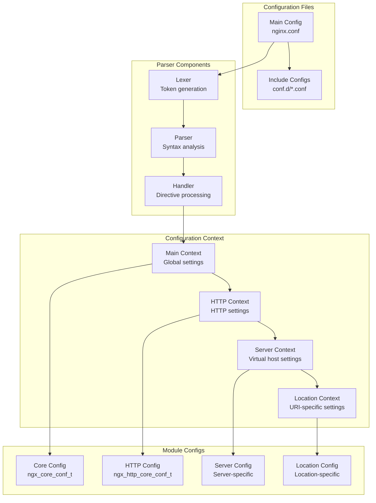
```mermaid
graph TB
    subgraph "Configuration Files"
        MC[Main Config<br/>nginx.conf]
        IC[Include Configs<br/>conf.d/*.conf]
        MC --> IC
    end
    
    subgraph "Parser Components"
        L[Lexer<br/>Token generation]
        P[Parser<br/>Syntax analysis]
        H[Handler<br/>Directive processing]
    end
    
    subgraph "Configuration Context"
        MAIN[Main Context<br/>Global settings]
        HTTP[HTTP Context<br/>HTTP settings]
        SERVER[Server Context<br/>Virtual host settings]
        LOCATION[Location Context<br/>URI-specific settings]
    end
    
    subgraph "Module Configs"
        CC[Core Config<br/>ngx_core_conf_t]
        HC[HTTP Config<br/>ngx_http_core_conf_t]
        SC[Server Config<br/>Server-specific]
        LC[Location Config<br/>Location-specific]
    end
    
    MC --> L
    L --> P
    P --> H
    
    H --> MAIN
    MAIN --> HTTP
    HTTP --> SERVER
    SERVER --> LOCATION
    
    MAIN --> CC
    HTTP --> HC
    SERVER --> SC
    LOCATION --> LC
```

### 7.2 指令处理流程图

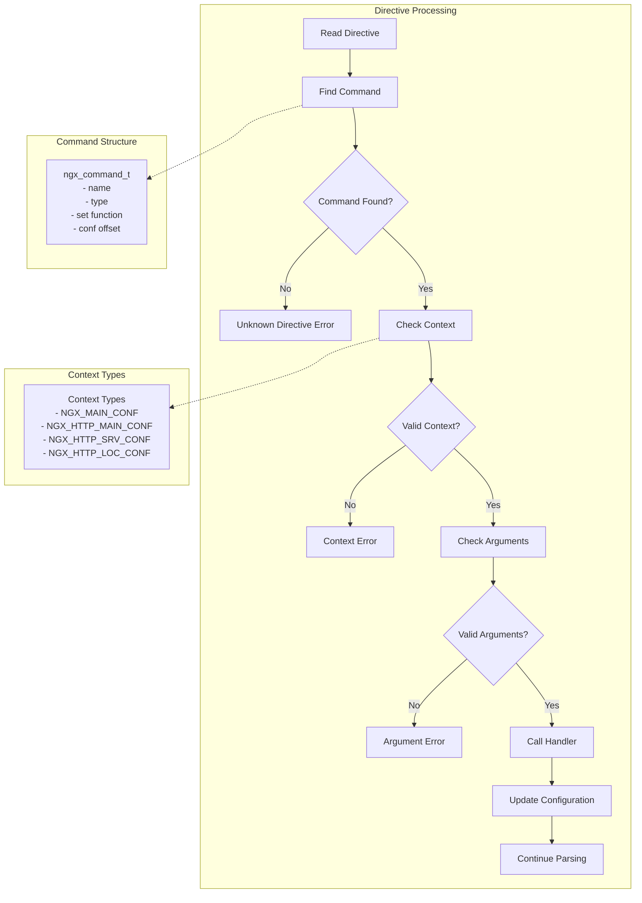
```mermaid
graph TB
    subgraph "Directive Processing"
        A[Read Directive] --> B[Find Command]
        B --> C{Command Found?}
        C -->|No| D[Unknown Directive Error]
        C -->|Yes| E[Check Context]
        E --> F{Valid Context?}
        F -->|No| G[Context Error]
        F -->|Yes| H[Check Arguments]
        H --> I{Valid Arguments?}
        I -->|No| J[Argument Error]
        I -->|Yes| K[Call Handler]
        K --> L[Update Configuration]
        L --> M[Continue Parsing]
    end
    
    subgraph "Command Structure"
        CS[ngx_command_t<br/>- name<br/>- type<br/>- set function<br/>- conf offset]
    end
    
    subgraph "Context Types"
        CT[Context Types<br/>- NGX_MAIN_CONF<br/>- NGX_HTTP_MAIN_CONF<br/>- NGX_HTTP_SRV_CONF<br/>- NGX_HTTP_LOC_CONF]
    end
    
    B -.-> CS
    E -.-> CT
```

## 8. 模块交互图

### 8.1 HTTP模块交互

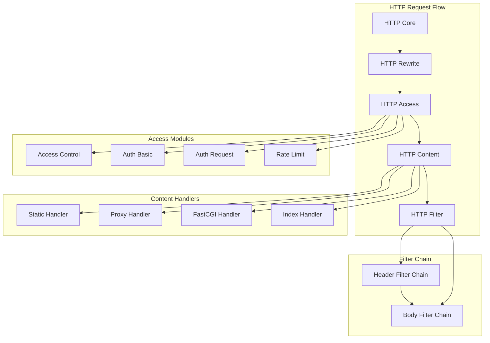
```mermaid
graph TB
    subgraph "HTTP Request Flow"
        HC[HTTP Core] --> HR[HTTP Rewrite]
        HR --> HA[HTTP Access]
        HA --> HCT[HTTP Content]
        HCT --> HF[HTTP Filter]
    end
    
    subgraph "Filter Chain"
        HHF[Header Filter Chain]
        HBF[Body Filter Chain]
        
        HHF --> HBF
    end
    
    subgraph "Content Handlers"
        HS[Static Handler]
        HP[Proxy Handler]
        HFC[FastCGI Handler]
        HI[Index Handler]
    end
    
    subgraph "Access Modules"
        HAC[Access Control]
        HAL[Auth Basic]
        HAR[Auth Request]
        HRL[Rate Limit]
    end
    
    HCT --> HS
    HCT --> HP
    HCT --> HFC
    HCT --> HI
    
    HA --> HAC
    HA --> HAL
    HA --> HAR
    HA --> HRL
    
    HF --> HHF
    HF --> HBF
```

### 8.2 事件模块交互

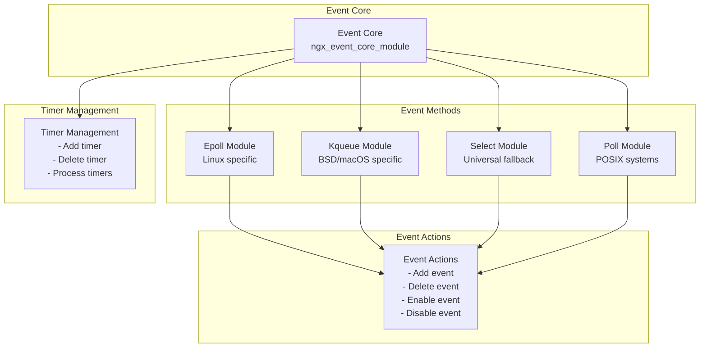
```mermaid
graph TB
    subgraph "Event Core"
        EC[Event Core<br/>ngx_event_core_module]
    end
    
    subgraph "Event Methods"
        EE[Epoll Module<br/>Linux specific]
        EK[Kqueue Module<br/>BSD/macOS specific]
        ES[Select Module<br/>Universal fallback]
        EP[Poll Module<br/>POSIX systems]
    end
    
    subgraph "Event Actions"
        EA[Event Actions<br/>- Add event<br/>- Delete event<br/>- Enable event<br/>- Disable event]
    end
    
    subgraph "Timer Management"
        TM[Timer Management<br/>- Add timer<br/>- Delete timer<br/>- Process timers]
    end
    
    EC --> EE
    EC --> EK
    EC --> ES
    EC --> EP
    
    EE --> EA
    EK --> EA
    ES --> EA
    EP --> EA
    
    EC --> TM
```

## 9. 负载均衡架构图

### 9.1 上游服务器架构

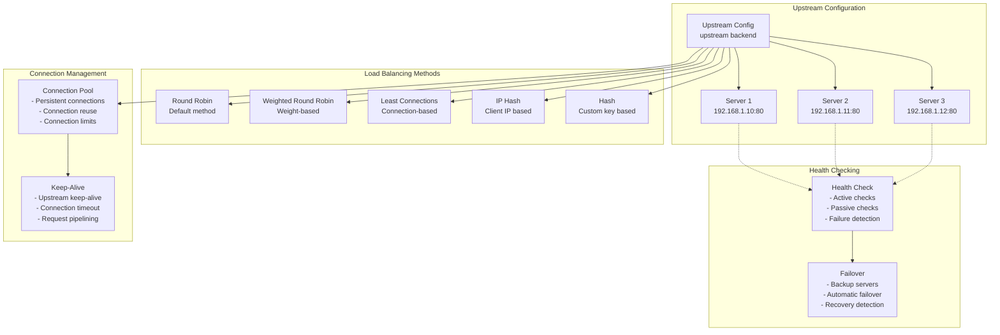
```mermaid
graph TB
    subgraph "Upstream Configuration"
        UC[Upstream Config<br/>upstream backend]
        S1[Server 1<br/>192.168.1.10:80]
        S2[Server 2<br/>192.168.1.11:80]
        S3[Server 3<br/>192.168.1.12:80]
        
        UC --> S1
        UC --> S2
        UC --> S3
    end
    
    subgraph "Load Balancing Methods"
        RR[Round Robin<br/>Default method]
        WRR[Weighted Round Robin<br/>Weight-based]
        LF[Least Connections<br/>Connection-based]
        IPH[IP Hash<br/>Client IP based]
        H[Hash<br/>Custom key based]
    end
    
    subgraph "Health Checking"
        HC[Health Check<br/>- Active checks<br/>- Passive checks<br/>- Failure detection]
        FB[Failover<br/>- Backup servers<br/>- Automatic failover<br/>- Recovery detection]
    end
    
    subgraph "Connection Management"
        CP[Connection Pool<br/>- Persistent connections<br/>- Connection reuse<br/>- Connection limits]
        KA[Keep-Alive<br/>- Upstream keep-alive<br/>- Connection timeout<br/>- Request pipelining]
    end
    
    UC --> RR
    UC --> WRR
    UC --> LF
    UC --> IPH
    UC --> H
    
    S1 -.-> HC
    S2 -.-> HC
    S3 -.-> HC
    
    HC --> FB
    
    UC --> CP
    CP --> KA
```

### 9.2 代理请求流程图

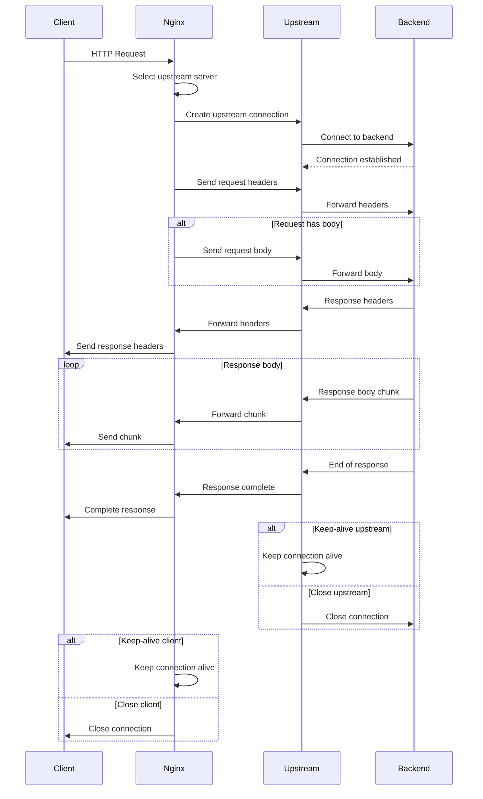
```mermaid
sequenceDiagram
    participant C as Client
    participant N as Nginx
    participant U as Upstream
    participant B as Backend

    C->>N: HTTP Request
    N->>N: Select upstream server
    N->>U: Create upstream connection
    U->>B: Connect to backend
    B-->>U: Connection established
    
    N->>U: Send request headers
    U->>B: Forward headers
    
    alt Request has body
        N->>U: Send request body
        U->>B: Forward body
    end
    
    B->>U: Response headers
    U->>N: Forward headers
    N->>C: Send response headers
    
    loop Response body
        B->>U: Response body chunk
        U->>N: Forward chunk
        N->>C: Send chunk
    end
    
    B->>U: End of response
    U->>N: Response complete
    N->>C: Complete response
    
    alt Keep-alive upstream
        U->>U: Keep connection alive
    else Close upstream
        U->>B: Close connection
    end
    
    alt Keep-alive client
        N->>N: Keep connection alive
    else Close client
        N->>C: Close connection
    end
```

## 10. 缓存系统架构图

### 10.1 缓存层次架构

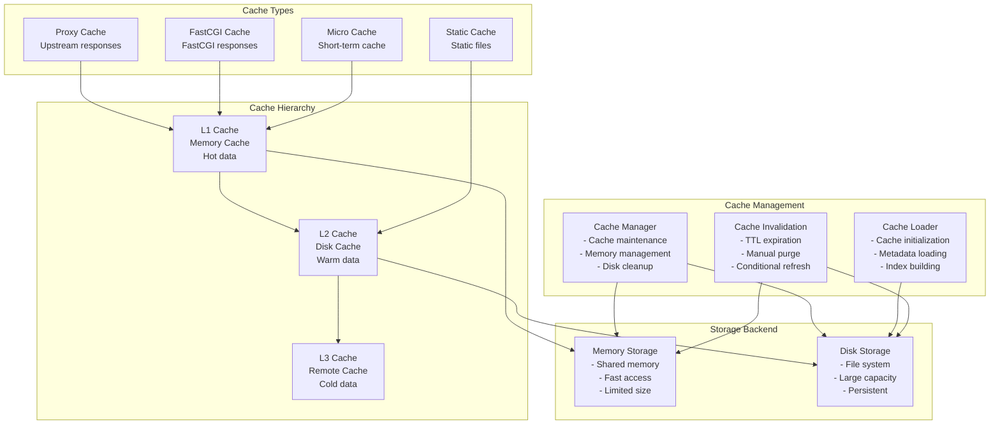
```mermaid
graph TB
    subgraph "Cache Hierarchy"
        L1[L1 Cache<br/>Memory Cache<br/>Hot data]
        L2[L2 Cache<br/>Disk Cache<br/>Warm data]
        L3[L3 Cache<br/>Remote Cache<br/>Cold data]
    end
    
    subgraph "Cache Types"
        PC[Proxy Cache<br/>Upstream responses]
        FC[FastCGI Cache<br/>FastCGI responses]
        SC[Static Cache<br/>Static files]
        MC[Micro Cache<br/>Short-term cache]
    end
    
    subgraph "Cache Management"
        CM[Cache Manager<br/>- Cache maintenance<br/>- Memory management<br/>- Disk cleanup]
        CL[Cache Loader<br/>- Cache initialization<br/>- Metadata loading<br/>- Index building]
        CI[Cache Invalidation<br/>- TTL expiration<br/>- Manual purge<br/>- Conditional refresh]
    end
    
    subgraph "Storage Backend"
        MEM[Memory Storage<br/>- Shared memory<br/>- Fast access<br/>- Limited size]
        DISK[Disk Storage<br/>- File system<br/>- Large capacity<br/>- Persistent]
    end
    
    L1 --> L2
    L2 --> L3
    
    PC --> L1
    FC --> L1
    SC --> L2
    MC --> L1
    
    L1 --> MEM
    L2 --> DISK
    
    CM --> MEM
    CM --> DISK
    CL --> DISK
    CI --> MEM
    CI --> DISK
```

### 10.2 缓存处理流程图

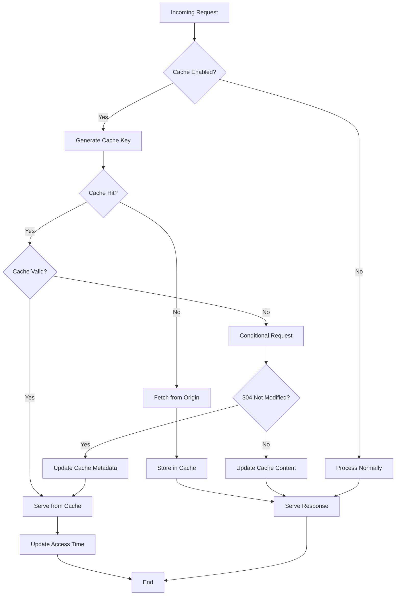
```mermaid
graph TB
    A[Incoming Request] --> B{Cache Enabled?}
    B -->|No| C[Process Normally]
    B -->|Yes| D[Generate Cache Key]
    D --> E{Cache Hit?}
    E -->|Yes| F{Cache Valid?}
    E -->|No| G[Fetch from Origin]
    F -->|Yes| H[Serve from Cache]
    F -->|No| I[Conditional Request]
    I --> J{304 Not Modified?}
    J -->|Yes| K[Update Cache Metadata]
    J -->|No| L[Update Cache Content]
    G --> M[Store in Cache]
    M --> N[Serve Response]
    H --> O[Update Access Time]
    K --> H
    L --> N
    C --> N
    O --> P[End]
    N --> P
```

## 11. SSL/TLS架构图

### 11.1 SSL处理架构

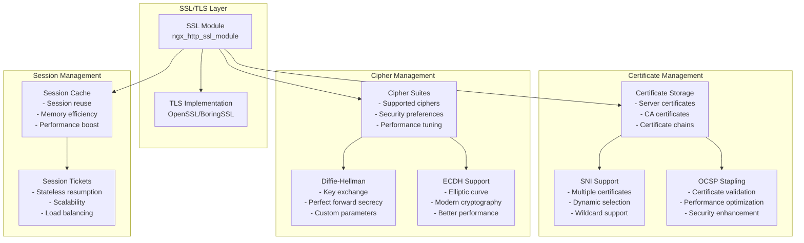
```mermaid
graph TB
    subgraph "SSL/TLS Layer"
        SSL[SSL Module<br/>ngx_http_ssl_module]
        TLS[TLS Implementation<br/>OpenSSL/BoringSSL]
    end
    
    subgraph "Certificate Management"
        CERT[Certificate Storage<br/>- Server certificates<br/>- CA certificates<br/>- Certificate chains]
        SNI[SNI Support<br/>- Multiple certificates<br/>- Dynamic selection<br/>- Wildcard support]
        OCSP[OCSP Stapling<br/>- Certificate validation<br/>- Performance optimization<br/>- Security enhancement]
    end
    
    subgraph "Cipher Management"
        CS[Cipher Suites<br/>- Supported ciphers<br/>- Security preferences<br/>- Performance tuning]
        DH[Diffie-Hellman<br/>- Key exchange<br/>- Perfect forward secrecy<br/>- Custom parameters]
        ECDH[ECDH Support<br/>- Elliptic curve<br/>- Modern cryptography<br/>- Better performance]
    end
    
    subgraph "Session Management"
        SC[Session Cache<br/>- Session reuse<br/>- Memory efficiency<br/>- Performance boost]
        ST[Session Tickets<br/>- Stateless resumption<br/>- Scalability<br/>- Load balancing]
    end
    
    SSL --> TLS
    SSL --> CERT
    SSL --> CS
    SSL --> SC
    
    CERT --> SNI
    CERT --> OCSP
    
    CS --> DH
    CS --> ECDH
    
    SC --> ST
```

### 11.2 SSL握手时序图

```mermaid
sequenceDiagram
    participant C as Client
    participant N as Nginx
    participant SSL as SSL Engine

    C->>N: TCP Connection
    C->>N: ClientHello
    N->>SSL: Process ClientHello
    SSL->>SSL: Select cipher suite
    SSL->>SSL: Load certificate
    SSL-->>N: ServerHello + Certificate
    N->>C: ServerHello + Certificate
    
    C->>C: Verify certificate
    C->>N: ClientKeyExchange
    N->>SSL: Process key exchange
    SSL->>SSL: Generate session keys
    
    C->>N: ChangeCipherSpec + Finished
    N->>SSL: Verify finished message
    SSL-->>N: Session established
    N->>C: ChangeCipherSpec + Finished
    
    Note over C,N: Encrypted communication begins
    
    C->>N: Encrypted HTTP Request
    N->>SSL: Decrypt request
    SSL-->>N: Decrypted data
    N->>N: Process HTTP request
    N->>SSL: Encrypt response
    SSL-->>N: Encrypted data
    N->>C: Encrypted HTTP Response
```

## 12. 监控和统计架构图

### 12.1 统计收集架构

```mermaid
graph TB
    subgraph "Statistics Collection"
        SC[Statistics Collector<br/>- Request counters<br/>- Response times<br/>- Error rates]
        SM[Shared Memory<br/>- Cross-process stats<br/>- Atomic operations<br/>- Lock-free updates]
    end
    
    subgraph "Metrics Types"
        RM[Request Metrics<br/>- Total requests<br/>- Requests per second<br/>- Request size]
        CM[Connection Metrics<br/>- Active connections<br/>- Connection rate<br/>- Connection duration]
        UM[Upstream Metrics<br/>- Backend status<br/>- Response times<br/>- Failure rates]
        EM[Error Metrics<br/>- HTTP errors<br/>- SSL errors<br/>- Timeout errors]
    end
    
    subgraph "Export Formats"
        JSON[JSON Format<br/>- REST API<br/>- Machine readable<br/>- Integration friendly]
        PROM[Prometheus Format<br/>- Time series<br/>- Monitoring systems<br/>- Alerting support]
        LOG[Log Format<br/>- Access logs<br/>- Error logs<br/>- Custom formats]
    end
    
    SC --> SM
    
    SC --> RM
    SC --> CM
    SC --> UM
    SC --> EM
    
    SM --> JSON
    SM --> PROM
    SM --> LOG
```

### 12.2 健康检查架构

```mermaid
graph TB
    subgraph "Health Check Types"
        AC[Active Checks<br/>- Periodic probes<br/>- Custom endpoints<br/>- Configurable intervals]
        PC[Passive Checks<br/>- Request monitoring<br/>- Error detection<br/>- Automatic marking]
    end
    
    subgraph "Check Methods"
        HTTP[HTTP Checks<br/>- GET/POST requests<br/>- Status code validation<br/>- Response content check]
        TCP[TCP Checks<br/>- Connection test<br/>- Port availability<br/>- Network reachability]
        CUSTOM[Custom Checks<br/>- Script execution<br/>- External tools<br/>- Complex validation]
    end
    
    subgraph "Failure Handling"
        FD[Failure Detection<br/>- Threshold-based<br/>- Consecutive failures<br/>- Time-based windows]
        FB[Failover Logic<br/>- Server marking<br/>- Traffic redirection<br/>- Backup activation]
        REC[Recovery Detection<br/>- Health restoration<br/>- Gradual traffic increase<br/>- Monitoring period]
    end
    
    AC --> HTTP
    AC --> TCP
    AC --> CUSTOM
    
    PC --> FD
    AC --> FD
    
    FD --> FB
    FB --> REC
```

## 13. 总结

Nginx的架构设计体现了以下核心特点：

### 13.1 设计原则
- **模块化**: 高度模块化的设计，功能解耦
- **事件驱动**: 异步非阻塞的事件处理模型
- **多进程**: Master-Worker进程模型，稳定可靠
- **内存高效**: 内存池管理，减少内存碎片
- **配置驱动**: 灵活的配置系统，运行时可重载

### 13.2 性能特点
- **高并发**: 单个Worker可处理数万并发连接
- **低内存**: 高效的内存管理和数据结构
- **零拷贝**: 减少数据复制，提高性能
- **缓存友好**: 多层缓存架构，提升响应速度
- **负载均衡**: 多种负载均衡算法，高可用性

### 13.3 扩展性
- **插件架构**: 支持第三方模块开发
- **动态加载**: 运行时加载模块
- **配置热更新**: 无缝配置重载
- **API友好**: 丰富的开发接口
- **跨平台**: 支持多种操作系统

通过这些架构图和时序图，开发者可以更好地理解Nginx的内部工作机制，为深入学习和扩展Nginx功能打下坚实基础。
