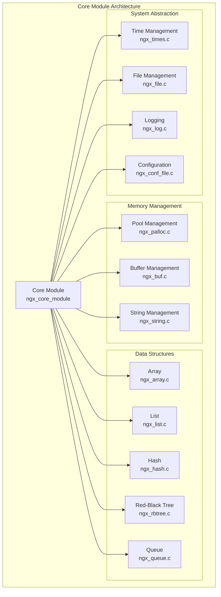
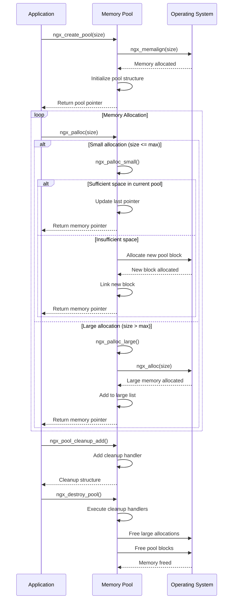
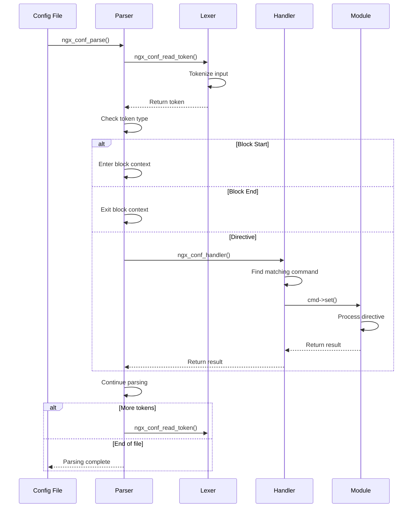

# Nginx 核心模块深度分析

## 1. 概述

核心模块是Nginx的基础组件，提供了内存管理、字符串处理、数据结构、配置解析等基础功能。本文档深入分析核心模块的架构设计、关键函数实现和数据结构。

## 2. 核心模块架构图



## 3. 内存管理子系统

### 3.1 内存池架构

#### 数据结构定义

```c
// 内存池数据结构
typedef struct {
    u_char               *last;      // 当前可分配位置
    u_char               *end;       // 池结束位置
    ngx_pool_t           *next;      // 下一个池
    ngx_uint_t            failed;    // 分配失败次数
} ngx_pool_data_t;

// 内存池主结构
struct ngx_pool_s {
    ngx_pool_data_t       d;         // 池数据
    size_t                max;       // 最大分配大小
    ngx_pool_t           *current;   // 当前池
    ngx_chain_t          *chain;     // 缓冲区链
    ngx_pool_large_t     *large;     // 大块内存链表
    ngx_pool_cleanup_t   *cleanup;   // 清理函数链表
    ngx_log_t            *log;       // 日志对象
};

// 大块内存结构
struct ngx_pool_large_s {
    ngx_pool_large_t     *next;      // 下一个大块
    void                 *alloc;     // 分配的内存
};

// 清理函数结构
struct ngx_pool_cleanup_s {
    ngx_pool_cleanup_pt   handler;   // 清理函数
    void                 *data;      // 清理数据
    ngx_pool_cleanup_t   *next;      // 下一个清理函数
};
```

#### 核心函数实现

##### ngx_create_pool() - 创建内存池

```c
ngx_pool_t *
ngx_create_pool(size_t size, ngx_log_t *log)
{
    ngx_pool_t  *p;

    // 按对齐要求分配内存
    p = ngx_memalign(NGX_POOL_ALIGNMENT, size, log);
    if (p == NULL) {
        return NULL;
    }

    // 初始化池数据
    p->d.last = (u_char *) p + sizeof(ngx_pool_t);
    p->d.end = (u_char *) p + size;
    p->d.next = NULL;
    p->d.failed = 0;

    // 计算最大分配大小
    size = size - sizeof(ngx_pool_t);
    p->max = (size < NGX_MAX_ALLOC_FROM_POOL) ? size : NGX_MAX_ALLOC_FROM_POOL;

    // 初始化其他字段
    p->current = p;
    p->chain = NULL;
    p->large = NULL;
    p->cleanup = NULL;
    p->log = log;

    return p;
}
```

**功能说明**:
- 按对齐要求分配内存，提高访问效率
- 初始化池的基本信息和边界
- 设置最大分配大小限制
- 建立清理和大块内存管理链表

##### ngx_palloc() - 内存分配

```c
void *
ngx_palloc(ngx_pool_t *pool, size_t size)
{
    // 小块内存从池中分配
    if (size <= pool->max) {
        return ngx_palloc_small(pool, size, 1);
    }

    // 大块内存单独分配
    return ngx_palloc_large(pool, size);
}

static ngx_inline void *
ngx_palloc_small(ngx_pool_t *pool, size_t size, ngx_uint_t align)
{
    u_char      *m;
    ngx_pool_t  *p;

    p = pool->current;

    do {
        m = p->d.last;

        // 对齐处理
        if (align) {
            m = ngx_align_ptr(m, NGX_ALIGNMENT);
        }

        // 检查是否有足够空间
        if ((size_t) (p->d.end - m) >= size) {
            p->d.last = m + size;
            return m;
        }

        p = p->d.next;

    } while (p);

    // 当前池空间不足，分配新池
    return ngx_palloc_block(pool, size);
}

static void *
ngx_palloc_large(ngx_pool_t *pool, size_t size)
{
    void              *p;
    ngx_uint_t         n;
    ngx_pool_large_t  *large;

    // 直接分配内存
    p = ngx_alloc(size, pool->log);
    if (p == NULL) {
        return NULL;
    }

    n = 0;

    // 查找可用的large结构
    for (large = pool->large; large; large = large->next) {
        if (large->alloc == NULL) {
            large->alloc = p;
            return p;
        }

        if (n++ > 3) {
            break;
        }
    }

    // 分配新的large结构
    large = ngx_palloc_small(pool, sizeof(ngx_pool_large_t), 1);
    if (large == NULL) {
        ngx_free(p);
        return NULL;
    }

    large->alloc = p;
    large->next = pool->large;
    pool->large = large;

    return p;
}
```

**功能说明**:
- 根据大小选择分配策略
- 小块内存从池中分配，提高效率
- 大块内存单独分配，避免浪费
- 支持内存对齐，提高访问性能

##### ngx_destroy_pool() - 销毁内存池

```c
void
ngx_destroy_pool(ngx_pool_t *pool)
{
    ngx_pool_t          *p, *n;
    ngx_pool_large_t    *l;
    ngx_pool_cleanup_t  *c;

    // 执行清理函数
    for (c = pool->cleanup; c; c = c->next) {
        if (c->handler) {
            ngx_log_debug1(NGX_LOG_DEBUG_ALLOC, pool->log, 0,
                           "run cleanup: %p", c);
            c->handler(c->data);
        }
    }

    // 释放大块内存
    for (l = pool->large; l; l = l->next) {
        if (l->alloc) {
            ngx_free(l->alloc);
        }
    }

    // 释放池链表
    for (p = pool, n = pool->d.next; /* void */; p = n, n = n->d.next) {
        ngx_free(p);

        if (n == NULL) {
            break;
        }
    }
}
```

**功能说明**:
- 按顺序执行所有清理函数
- 释放所有大块内存
- 释放池链表中的所有内存块
- 确保没有内存泄漏

### 3.2 内存池时序图



## 4. 字符串处理子系统

### 4.1 字符串结构定义

```c
// Nginx字符串结构
typedef struct {
    size_t      len;     // 字符串长度
    u_char     *data;    // 字符串数据
} ngx_str_t;

// 字符串常量定义宏
#define ngx_string(str)     { sizeof(str) - 1, (u_char *) str }
#define ngx_null_string     { 0, NULL }
#define ngx_str_set(str, text)                                               \
    (str)->len = sizeof(text) - 1; (str)->data = (u_char *) text
#define ngx_str_null(str)   (str)->len = 0; (str)->data = NULL
```

### 4.2 核心字符串函数

#### ngx_pstrdup() - 字符串复制

```c
u_char *
ngx_pstrdup(ngx_pool_t *pool, ngx_str_t *src)
{
    u_char  *dst;

    // 从内存池分配空间
    dst = ngx_pnalloc(pool, src->len);
    if (dst == NULL) {
        return NULL;
    }

    // 复制字符串内容
    ngx_memcpy(dst, src->data, src->len);

    return dst;
}
```

#### ngx_cpystrn() - 安全字符串复制

```c
u_char *
ngx_cpystrn(u_char *dst, u_char *src, size_t n)
{
    if (n == 0) {
        return dst;
    }

    // 复制字符串，确保以null结尾
    while (--n) {
        *dst = *src;

        if (*dst == '\0') {
            return dst;
        }

        dst++;
        src++;
    }

    *dst = '\0';

    return dst;
}
```

#### ngx_sprintf() - 格式化字符串

```c
u_char * ngx_cdecl
ngx_sprintf(u_char *buf, const char *fmt, ...)
{
    u_char   *p;
    va_list   args;

    va_start(args, fmt);
    p = ngx_vslprintf(buf, (void *) -1, fmt, args);
    va_end(args);

    return p;
}
```

**支持的格式化选项**:
- `%[0][width][x][X]O` - off_t类型
- `%[0][width]T` - time_t类型  
- `%[0][width][u][x|X]z` - ssize_t/size_t类型
- `%[0][width][u][x|X]d` - int/u_int类型
- `%[0][width][u][x|X]l` - long类型
- `%[0][width|m][u][x|X]i` - ngx_int_t/ngx_uint_t类型
- `%s` - 字符串
- `%V` - ngx_str_t类型

## 5. 数据结构子系统

### 5.1 动态数组 (ngx_array_t)

#### 结构定义

```c
typedef struct {
    void        *elts;      // 元素数组
    ngx_uint_t   nelts;     // 元素个数
    size_t       size;      // 元素大小
    ngx_uint_t   nalloc;    // 分配的元素个数
    ngx_pool_t  *pool;      // 内存池
} ngx_array_t;
```

#### 核心函数

##### ngx_array_init() - 初始化数组

```c
static ngx_inline ngx_int_t
ngx_array_init(ngx_array_t *array, ngx_pool_t *pool, ngx_uint_t n, size_t size)
{
    /*
     * set "array->nelts" before "array->elts", otherwise MSVC thinks
     * that "array->nelts" may be used without having been initialized
     */

    array->nelts = 0;
    array->size = size;
    array->nalloc = n;
    array->pool = pool;

    array->elts = ngx_palloc(pool, n * size);
    if (array->elts == NULL) {
        return NGX_ERROR;
    }

    return NGX_OK;
}
```

##### ngx_array_push() - 添加元素

```c
void *
ngx_array_push(ngx_array_t *a)
{
    void        *elt, *new;
    size_t       size;
    ngx_pool_t  *p;

    if (a->nelts == a->nalloc) {

        /* the array is full */

        size = a->size * a->nalloc;

        p = a->pool;

        if ((u_char *) a->elts + size == p->d.last
            && p->d.last + a->size <= p->d.end)
        {
            /*
             * the array allocation is the last in the pool
             * and there is space for new allocation
             */

            p->d.last += a->size;
            a->nalloc++;

        } else {
            /* allocate a new array */

            new = ngx_palloc(p, 2 * size);
            if (new == NULL) {
                return NULL;
            }

            ngx_memcpy(new, a->elts, size);
            a->elts = new;
            a->nalloc *= 2;
        }
    }

    elt = (u_char *) a->elts + a->size * a->nelts;
    a->nelts++;

    return elt;
}
```

**功能说明**:
- 检查数组是否已满
- 如果数组在池末尾且有空间，直接扩展
- 否则分配新的双倍大小数组并复制数据
- 返回新元素的指针

### 5.2 链表 (ngx_list_t)

#### 结构定义

```c
typedef struct ngx_list_part_s  ngx_list_part_t;

struct ngx_list_part_s {
    void             *elts;     // 元素数组
    ngx_uint_t        nelts;    // 当前元素个数
    ngx_list_part_t  *next;     // 下一个部分
};

typedef struct {
    ngx_list_part_t  *last;     // 最后一个部分
    ngx_list_part_t   part;     // 第一个部分
    size_t            size;     // 元素大小
    ngx_uint_t        nalloc;   // 每部分分配的元素个数
    ngx_pool_t       *pool;     // 内存池
} ngx_list_t;
```

#### 核心函数

##### ngx_list_push() - 添加元素

```c
void *
ngx_list_push(ngx_list_t *l)
{
    void             *elt;
    ngx_list_part_t  *last;

    last = l->last;

    if (last->nelts == l->nalloc) {

        /* the last part is full, allocate a new list part */

        last = ngx_palloc(l->pool, sizeof(ngx_list_part_t));
        if (last == NULL) {
            return NULL;
        }

        last->elts = ngx_palloc(l->pool, l->nalloc * l->size);
        if (last->elts == NULL) {
            return NULL;
        }

        last->nelts = 0;
        last->next = NULL;

        l->last->next = last;
        l->last = last;
    }

    elt = (char *) last->elts + l->size * last->nelts;
    last->nelts++;

    return elt;
}
```

### 5.3 哈希表 (ngx_hash_t)

#### 结构定义

```c
typedef struct {
    ngx_hash_elt_t  **buckets;  // 桶数组
    ngx_uint_t        size;     // 桶的个数
} ngx_hash_t;

typedef struct {
    void             *value;    // 值
    u_short           len;      // 键长度
    u_char            name[1];  // 键名称
} ngx_hash_elt_t;
```

#### 核心函数

##### ngx_hash_find() - 查找元素

```c
void *
ngx_hash_find(ngx_hash_t *hash, ngx_uint_t key, u_char *name, size_t len)
{
    ngx_uint_t       i;
    ngx_hash_elt_t  *elt;

    elt = hash->buckets[key % hash->size];

    if (elt == NULL) {
        return NULL;
    }

    while (elt->value) {
        if (len != (size_t) elt->len) {
            goto next;
        }

        for (i = 0; i < len; i++) {
            if (name[i] != elt->name[i]) {
                goto next;
            }
        }

        return elt->value;

    next:

        elt = (ngx_hash_elt_t *) ngx_align_ptr(&elt->name[0] + elt->len,
                                               sizeof(void *));
        continue;
    }

    return NULL;
}
```

### 5.4 红黑树 (ngx_rbtree_t)

#### 结构定义

```c
typedef struct ngx_rbtree_node_s  ngx_rbtree_node_t;

struct ngx_rbtree_node_s {
    ngx_rbtree_key_t       key;     // 键值
    ngx_rbtree_node_t     *left;    // 左子树
    ngx_rbtree_node_t     *right;   // 右子树
    ngx_rbtree_node_t     *parent;  // 父节点
    u_char                 color;   // 节点颜色
    u_char                 data;    // 节点数据
};

typedef struct ngx_rbtree_s  ngx_rbtree_t;

typedef void (*ngx_rbtree_insert_pt) (ngx_rbtree_node_t *root,
    ngx_rbtree_node_t *node, ngx_rbtree_node_t *sentinel);

struct ngx_rbtree_s {
    ngx_rbtree_node_t     *root;      // 根节点
    ngx_rbtree_node_t     *sentinel;  // 哨兵节点
    ngx_rbtree_insert_pt   insert;    // 插入函数
};
```

#### 核心函数

##### ngx_rbtree_insert() - 插入节点

```c
void
ngx_rbtree_insert(ngx_rbtree_t *tree, ngx_rbtree_node_t *node)
{
    ngx_rbtree_node_t  **root, *temp, *sentinel;

    /* a binary tree insert */

    root = &tree->root;
    sentinel = tree->sentinel;

    if (*root == sentinel) {
        node->parent = NULL;
        node->left = sentinel;
        node->right = sentinel;
        ngx_rbt_red(node);
        *root = node;

        return;
    }

    tree->insert(*root, node, sentinel);

    /* re-balance tree */

    while (node != *root && ngx_rbt_is_red(node->parent)) {

        if (node->parent == node->parent->parent->left) {
            temp = node->parent->parent->right;

            if (ngx_rbt_is_red(temp)) {
                ngx_rbt_black(node->parent);
                ngx_rbt_black(temp);
                ngx_rbt_red(node->parent->parent);
                node = node->parent->parent;

            } else {
                if (node == node->parent->right) {
                    node = node->parent;
                    ngx_rbtree_left_rotate(root, sentinel, node);
                }

                ngx_rbt_black(node->parent);
                ngx_rbt_red(node->parent->parent);
                ngx_rbtree_right_rotate(root, sentinel, node->parent->parent);
            }

        } else {
            temp = node->parent->parent->left;

            if (ngx_rbt_is_red(temp)) {
                ngx_rbt_black(node->parent);
                ngx_rbt_black(temp);
                ngx_rbt_red(node->parent->parent);
                node = node->parent->parent;

            } else {
                if (node == node->parent->left) {
                    node = node->parent;
                    ngx_rbtree_right_rotate(root, sentinel, node);
                }

                ngx_rbt_black(node->parent);
                ngx_rbt_red(node->parent->parent);
                ngx_rbtree_left_rotate(root, sentinel, node->parent->parent);
            }
        }
    }

    ngx_rbt_black(*root);
}
```

## 6. 时间管理子系统

### 6.1 时间结构定义

```c
typedef struct {
    time_t      sec;     // 秒
    ngx_uint_t  msec;    // 毫秒
    ngx_int_t   gmtoff;  // GMT偏移
} ngx_time_t;

// 全局时间变量
extern volatile ngx_time_t  *ngx_cached_time;
extern volatile ngx_str_t    ngx_cached_err_log_time;
extern volatile ngx_str_t    ngx_cached_http_time;
extern volatile ngx_str_t    ngx_cached_http_log_time;
extern volatile ngx_str_t    ngx_cached_http_log_iso8601;
extern volatile ngx_str_t    ngx_cached_syslog_time;
```

### 6.2 核心时间函数

#### ngx_time_init() - 时间初始化

```c
void
ngx_time_init(void)
{
    ngx_cached_err_log_time.len = sizeof("1970/09/28 12:00:00") - 1;
    ngx_cached_http_time.len = sizeof("Mon, 28 Sep 1970 06:00:00 GMT") - 1;
    ngx_cached_http_log_time.len = sizeof("28/Sep/1970:12:00:00 +0600") - 1;
    ngx_cached_http_log_iso8601.len = sizeof("1970-09-28T12:00:00+06:00") - 1;
    ngx_cached_syslog_time.len = sizeof("Sep 28 12:00:00") - 1;

    ngx_cached_time = &cached_time[0];

    ngx_time_update();
}
```

#### ngx_time_update() - 更新时间

```c
void
ngx_time_update(void)
{
    u_char          *p0, *p1, *p2, *p3, *p4;
    ngx_tm_t         tm, gmt;
    time_t           sec;
    ngx_uint_t       msec;
    ngx_time_t      *tp;
    struct timeval   tv;

    if (!ngx_trylock(&ngx_time_lock)) {
        return;
    }

    ngx_gettimeofday(&tv);

    sec = tv.tv_sec;
    msec = tv.tv_usec / 1000;

    ngx_current_msec = (ngx_msec_t) sec * 1000 + msec;

    tp = &cached_time[slot];

    if (tp->sec == sec) {
        tp->msec = msec;
        ngx_unlock(&ngx_time_lock);
        return;
    }

    if (slot == NGX_TIME_SLOTS - 1) {
        slot = 0;
    } else {
        slot++;
    }

    tp = &cached_time[slot];

    tp->sec = sec;
    tp->msec = msec;

    ngx_gmtime(sec, &gmt);

    // 格式化各种时间字符串
    p0 = &cached_err_log_time[slot][0];
    (void) ngx_sprintf(p0, "%4d/%02d/%02d %02d:%02d:%02d",
                       tm.ngx_tm_year, tm.ngx_tm_mon,
                       tm.ngx_tm_mday, tm.ngx_tm_hour,
                       tm.ngx_tm_min, tm.ngx_tm_sec);

    // ... 其他时间格式

    ngx_memory_barrier();

    ngx_cached_time = tp;
    ngx_cached_http_time.data = p1;
    ngx_cached_err_log_time.data = p0;
    ngx_cached_http_log_time.data = p2;
    ngx_cached_http_log_iso8601.data = p3;
    ngx_cached_syslog_time.data = p4;

    ngx_unlock(&ngx_time_lock);
}
```

**功能说明**:
- 使用缓存避免频繁系统调用
- 预格式化常用时间字符串
- 使用内存屏障确保原子性
- 支持多种时间格式

## 7. 日志系统

### 7.1 日志结构定义

```c
struct ngx_log_s {
    ngx_uint_t           log_level;      // 日志级别
    ngx_open_file_t     *file;           // 日志文件
    ngx_atomic_uint_t    connection;     // 连接号
    time_t               disk_full_time; // 磁盘满时间
    ngx_log_handler_pt   handler;        // 处理函数
    void                *data;           // 数据
    ngx_log_writer_pt    writer;         // 写入函数
    void                *wdata;          // 写入数据
    char                *action;         // 当前动作
    ngx_log_t           *next;           // 下一个日志
};

// 日志级别定义
#define NGX_LOG_STDERR            0
#define NGX_LOG_EMERG             1
#define NGX_LOG_ALERT             2
#define NGX_LOG_CRIT              3
#define NGX_LOG_ERR               4
#define NGX_LOG_WARN              5
#define NGX_LOG_NOTICE            6
#define NGX_LOG_INFO              7
#define NGX_LOG_DEBUG             8
```

### 7.2 核心日志函数

#### ngx_log_error() - 记录错误日志

```c
void
ngx_log_error(ngx_uint_t level, ngx_log_t *log, ngx_err_t err,
    const char *fmt, ...)
{
    va_list  args;

    if (log->log_level >= level) {
        va_start(args, fmt);
        ngx_log_error_core(level, log, err, fmt, args);
        va_end(args);
    }
}
```

#### ngx_log_error_core() - 日志核心处理

```c
void
ngx_log_error_core(ngx_uint_t level, ngx_log_t *log, ngx_err_t err,
    const char *fmt, va_list args)
{
    u_char  *p, *last, *msg;
    u_char   errstr[NGX_MAX_ERROR_STR];

    if (log->file->fd == NGX_INVALID_FILE) {
        return;
    }

    last = errstr + NGX_MAX_ERROR_STR;

    p = ngx_cpymem(errstr, ngx_cached_err_log_time.data,
                   ngx_cached_err_log_time.len);

    p = ngx_slprintf(p, last, " [%V] ", &err_levels[level]);

    /* pid#tid */
    p = ngx_slprintf(p, last, "%P#" NGX_TID_T_FMT ": ",
                    ngx_log_pid, ngx_log_tid);

    if (log->connection) {
        p = ngx_slprintf(p, last, "*%uA ", log->connection);
    }

    msg = p;

    p = ngx_vslprintf(p, last, fmt, args);

    if (err) {
        p = ngx_log_errno(p, last, err);
    }

    if (level != NGX_LOG_DEBUG && log->handler) {
        p = log->handler(log, p, last - p);
    }

    if (p > last - NGX_LINEFEED_SIZE) {
        p = last - NGX_LINEFEED_SIZE;
    }

    ngx_linefeed(p);

    (void) ngx_write_fd(log->file->fd, errstr, p - errstr);
}
```

## 8. 配置解析系统

### 8.1 配置结构定义

```c
struct ngx_conf_s {
    char                 *name;      // 配置名称
    ngx_array_t          *args;      // 参数数组
    ngx_cycle_t          *cycle;     // 周期对象
    ngx_pool_t           *pool;      // 内存池
    ngx_pool_t           *temp_pool; // 临时内存池
    ngx_conf_file_t      *conf_file; // 配置文件
    ngx_log_t            *log;       // 日志对象
    void                 *ctx;       // 上下文
    ngx_uint_t            module_type; // 模块类型
    ngx_uint_t            cmd_type;    // 命令类型
    ngx_conf_handler_pt   handler;     // 处理函数
    void                 *handler_conf; // 处理配置
};

struct ngx_command_s {
    ngx_str_t             name;      // 指令名称
    ngx_uint_t            type;      // 指令类型
    char               *(*set)(ngx_conf_t *cf, ngx_command_t *cmd, void *conf);
    ngx_uint_t            conf;      // 配置偏移
    ngx_uint_t            offset;    // 结构偏移
    void                 *post;      // 后处理函数
};
```

### 8.2 配置解析流程图



## 9. 核心模块性能优化

### 9.1 内存优化策略

1. **内存池设计**
   - 减少malloc/free调用次数
   - 按页对齐分配，提高缓存效率
   - 分离小块和大块内存管理

2. **内存复用**
   - 连接池复用连接对象
   - 请求池复用请求对象
   - 缓冲区链复用缓冲区

3. **零拷贝技术**
   - sendfile系统调用
   - mmap内存映射
   - splice管道传输

### 9.2 数据结构优化

1. **缓存友好设计**
   - 数据结构紧凑排列
   - 热数据集中存放
   - 避免指针跳转

2. **算法优化**
   - 哈希表快速查找
   - 红黑树平衡查找
   - 基数树前缀匹配

### 9.3 时间优化

1. **时间缓存**
   - 避免频繁gettimeofday调用
   - 预格式化时间字符串
   - 使用定时器批量更新

2. **惰性计算**
   - 延迟计算非关键数据
   - 按需格式化字符串
   - 缓存计算结果

## 10. 实战应用示例

### 10.1 自定义内存池使用

```c
// 创建专用内存池
ngx_pool_t *pool = ngx_create_pool(4096, log);

// 分配内存
char *buffer = ngx_palloc(pool, 1024);
ngx_str_t *str = ngx_palloc(pool, sizeof(ngx_str_t));

// 添加清理函数
ngx_pool_cleanup_t *cln = ngx_pool_cleanup_add(pool, 0);
cln->handler = cleanup_handler;
cln->data = cleanup_data;

// 使用完毕后销毁
ngx_destroy_pool(pool);
```

### 10.2 动态数组操作

```c
// 初始化数组
ngx_array_t *array = ngx_array_create(pool, 10, sizeof(ngx_str_t));

// 添加元素
ngx_str_t *str = ngx_array_push(array);
ngx_str_set(str, "hello world");

// 遍历数组
ngx_str_t *elts = array->elts;
for (i = 0; i < array->nelts; i++) {
    // 处理 elts[i]
}
```

### 10.3 哈希表使用

```c
// 初始化哈希表
ngx_hash_init_t hash_init;
hash_init.hash = &hash;
hash_init.key = ngx_hash_key_lc;
hash_init.max_size = 512;
hash_init.bucket_size = 64;
hash_init.name = "test_hash";
hash_init.pool = pool;
hash_init.temp_pool = temp_pool;

// 构建哈希表
if (ngx_hash_init(&hash_init, keys.keys.elts, keys.keys.nelts) != NGX_OK) {
    return NGX_ERROR;
}

// 查找元素
value = ngx_hash_find(&hash, key, name.data, name.len);
```

## 11. 总结

Nginx核心模块的设计体现了以下特点：

### 11.1 设计原则
- **高效内存管理**: 内存池减少碎片，提高分配效率
- **数据结构优化**: 针对不同场景选择最优数据结构
- **缓存友好**: 数据布局考虑CPU缓存特性
- **零拷贝**: 减少数据复制，提高性能

### 11.2 核心优势
- **内存效率**: 内存池管理，减少内存泄漏
- **高性能**: 优化的数据结构和算法
- **可扩展**: 模块化设计，易于扩展
- **跨平台**: 抽象层屏蔽平台差异

### 11.3 应用价值
- 为上层模块提供高效的基础设施
- 统一的内存管理和数据结构接口
- 优化的字符串和时间处理
- 完善的日志和配置系统

通过深入理解核心模块的实现原理，开发者可以更好地利用Nginx的基础设施，开发高性能的扩展模块。
