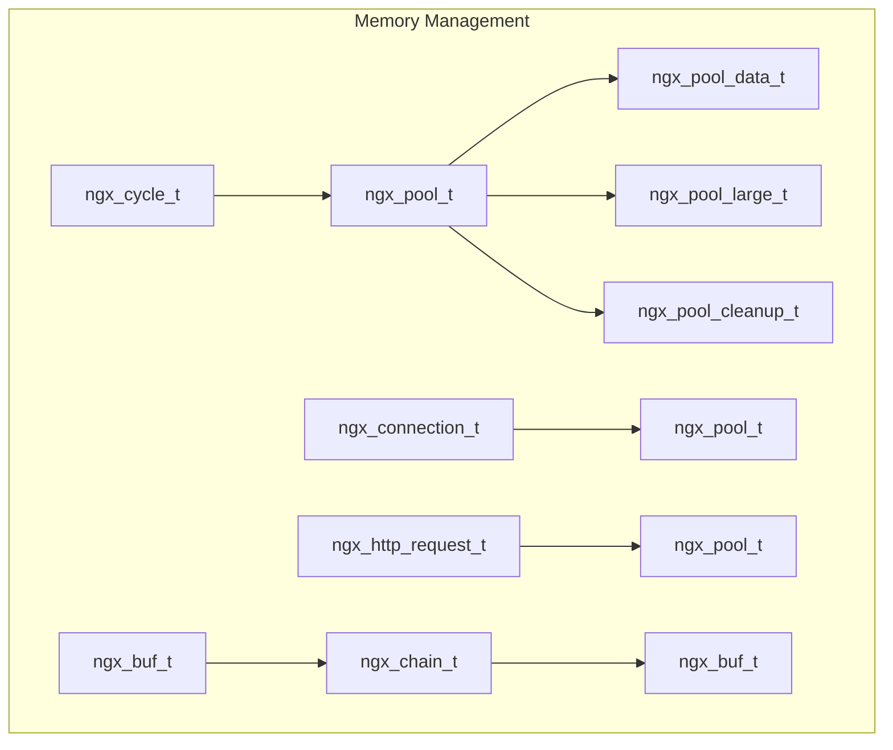
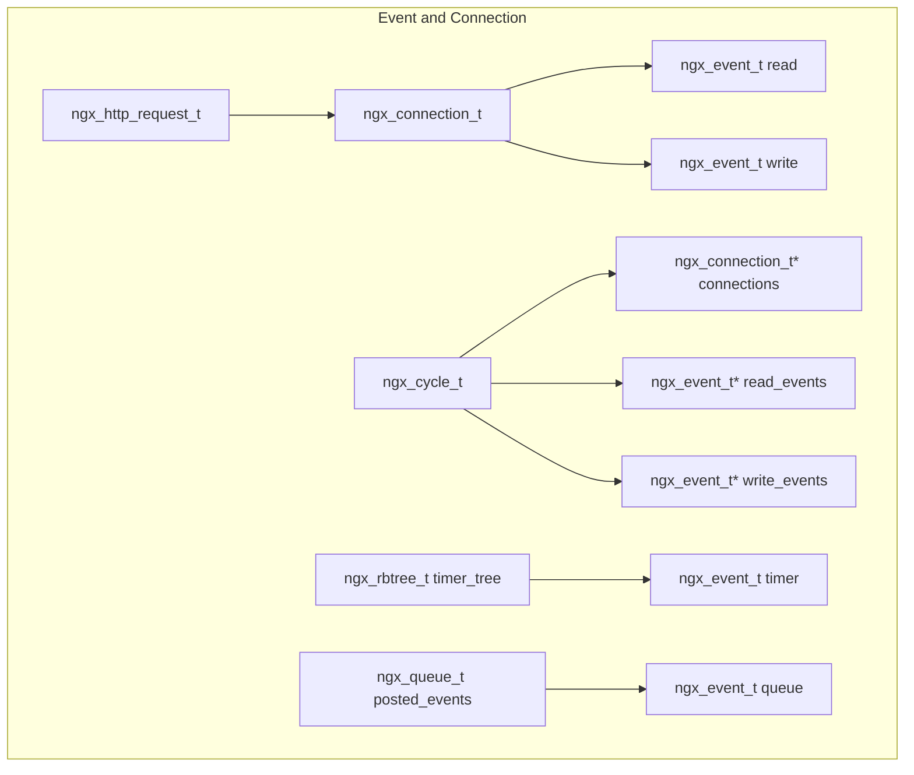
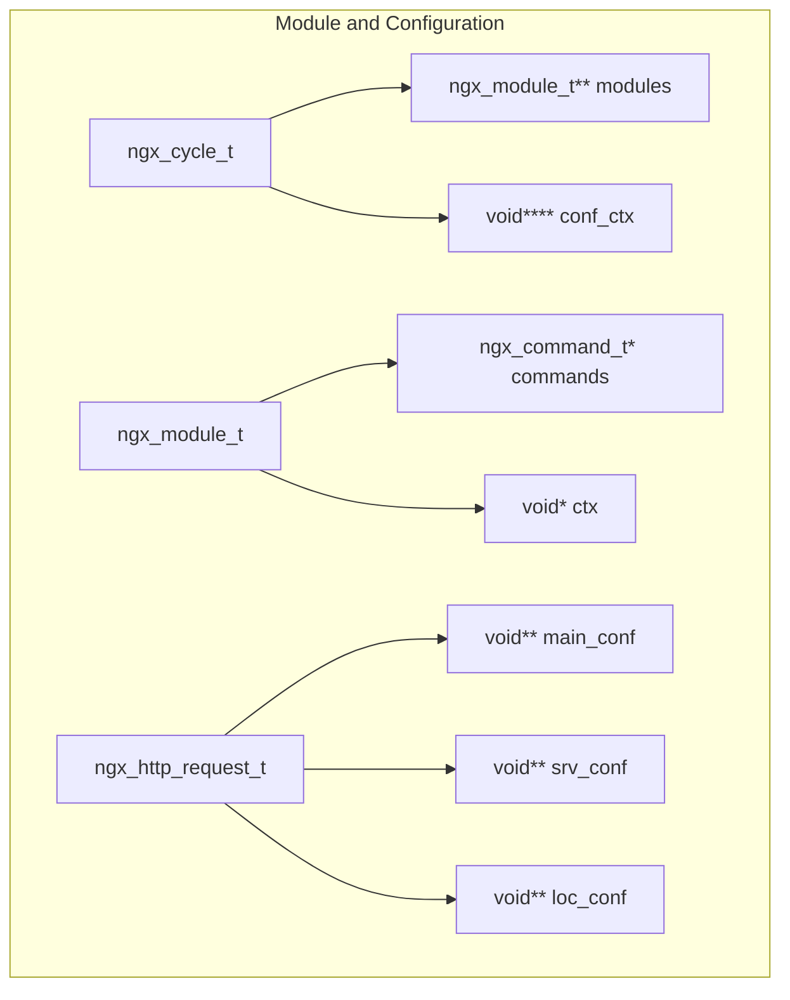

# Nginx 关键数据结构和继承关系分析

## 1. 概述

Nginx采用C语言开发，通过精心设计的数据结构实现了高效的内存管理、快速的数据访问和灵活的模块化架构。本文档深入分析Nginx中的关键数据结构及其相互关系。

## 2. 数据结构继承关系图

```mermaid
classDiagram
    class ngx_cycle_t {
        +pool: ngx_pool_t*
        +log: ngx_log_t*
        +modules: ngx_module_t**
        +conf_ctx: void****
        +connections: ngx_connection_t*
        +listening: ngx_array_t
        +paths: ngx_array_t
        +open_files: ngx_list_t
        +shared_memory: ngx_list_t
    }

    class ngx_module_t {
        +ctx_index: ngx_uint_t
        +index: ngx_uint_t
        +name: char*
        +ctx: void*
        +commands: ngx_command_t*
        +type: ngx_uint_t
        +init_master(): ngx_int_t
        +init_module(): ngx_int_t
        +init_process(): ngx_int_t
        +exit_process(): void
    }

    class ngx_connection_t {
        +data: void*
        +read: ngx_event_t*
        +write: ngx_event_t*
        +fd: ngx_socket_t
        +recv: ngx_recv_pt
        +send: ngx_send_pt
        +pool: ngx_pool_t*
        +log: ngx_log_t*
        +sockaddr: struct sockaddr*
        +listening: ngx_listening_t*
    }

    class ngx_event_t {
        +data: void*
        +handler: ngx_event_handler_pt
        +write: unsigned
        +accept: unsigned
        +active: unsigned
        +ready: unsigned
        +timer: ngx_rbtree_node_t
        +queue: ngx_queue_t
    }

    class ngx_http_request_t {
        +connection: ngx_connection_t*
        +ctx: void**
        +main_conf: void**
        +srv_conf: void**
        +loc_conf: void**
        +pool: ngx_pool_t*
        +headers_in: ngx_http_headers_in_t
        +headers_out: ngx_http_headers_out_t
        +request_body: ngx_http_request_body_t*
        +upstream: ngx_http_upstream_t*
    }

    class ngx_pool_t {
        +d: ngx_pool_data_t
        +max: size_t
        +current: ngx_pool_t*
        +chain: ngx_chain_t*
        +large: ngx_pool_large_t*
        +cleanup: ngx_pool_cleanup_t*
        +log: ngx_log_t*
    }

    class ngx_buf_t {
        +pos: u_char*
        +last: u_char*
        +file_pos: off_t
        +file_last: off_t
        +start: u_char*
        +end: u_char*
        +tag: ngx_buf_tag_t
        +file: ngx_file_t*
        +shadow: ngx_buf_t*
        +temporary: unsigned
        +memory: unsigned
        +mmap: unsigned
        +recycled: unsigned
        +in_file: unsigned
        +flush: unsigned
        +sync: unsigned
        +last_buf: unsigned
        +last_in_chain: unsigned
    }

    ngx_cycle_t ||--o{ ngx_module_t
    ngx_cycle_t ||--o{ ngx_connection_t
    ngx_connection_t ||--|| ngx_event_t : read
    ngx_connection_t ||--|| ngx_event_t : write
    ngx_connection_t ||--|| ngx_pool_t
    ngx_http_request_t ||--|| ngx_connection_t
    ngx_http_request_t ||--|| ngx_pool_t
    ngx_pool_t ||--o{ ngx_buf_t
```

## 3. 核心数据结构详解

### 3.1 ngx_cycle_t - 全局周期结构

```c
struct ngx_cycle_s {
    void                  ****conf_ctx;      // 配置上下文数组
    ngx_pool_t               *pool;          // 全局内存池
    
    ngx_log_t                *log;           // 主日志对象
    ngx_log_t                 new_log;       // 新日志对象
    
    ngx_uint_t                log_use_stderr; // 使用stderr标志
    
    ngx_connection_t        **files;         // 文件连接数组
    ngx_connection_t         *free_connections; // 空闲连接链表
    ngx_uint_t                free_connection_n; // 空闲连接数量
    
    ngx_module_t            **modules;       // 模块数组
    ngx_uint_t                modules_n;     // 模块数量
    ngx_uint_t                modules_used;  // 模块使用标志
    
    ngx_queue_t               reusable_connections_queue; // 可复用连接队列
    ngx_uint_t                reusable_connections_n;     // 可复用连接数量
    time_t                    connections_reuse_time;     // 连接复用时间
    
    ngx_array_t               listening;     // 监听端口数组
    ngx_array_t               paths;         // 路径数组
    
    ngx_array_t               config_dump;   // 配置转储数组
    ngx_rbtree_t              config_dump_rbtree;    // 配置转储红黑树
    ngx_rbtree_node_t         config_dump_sentinel;  // 配置转储哨兵
    
    ngx_list_t                open_files;    // 打开文件链表
    ngx_list_t                shared_memory; // 共享内存链表
    
    ngx_uint_t                connection_n;  // 连接总数
    ngx_uint_t                files_n;       // 文件总数
    
    ngx_connection_t         *connections;   // 连接数组
    ngx_event_t              *read_events;   // 读事件数组
    ngx_event_t              *write_events;  // 写事件数组
    
    ngx_cycle_t              *old_cycle;     // 旧周期对象
    
    ngx_str_t                 conf_file;     // 配置文件路径
    ngx_str_t                 conf_param;    // 配置参数
    ngx_str_t                 conf_prefix;   // 配置前缀
    ngx_str_t                 prefix;        // 安装前缀
    ngx_str_t                 error_log;     // 错误日志路径
    ngx_str_t                 lock_file;     // 锁文件路径
    ngx_str_t                 hostname;      // 主机名
};
```

**功能说明**:
- 全局配置和状态管理中心
- 管理所有模块、连接、事件等资源
- 提供配置热重载支持
- 维护系统运行时状态

### 3.2 ngx_module_t - 模块结构

```c
struct ngx_module_s {
    ngx_uint_t            ctx_index;         // 上下文索引
    ngx_uint_t            index;             // 模块索引
    
    char                 *name;              // 模块名称
    
    ngx_uint_t            spare0;            // 保留字段
    ngx_uint_t            spare1;            // 保留字段
    
    ngx_uint_t            version;           // 模块版本
    const char           *signature;         // 模块签名
    
    void                 *ctx;               // 模块上下文
    ngx_command_t        *commands;          // 指令数组
    ngx_uint_t            type;              // 模块类型
    
    // 生命周期回调函数
    ngx_int_t           (*init_master)(ngx_log_t *log);
    ngx_int_t           (*init_module)(ngx_cycle_t *cycle);
    ngx_int_t           (*init_process)(ngx_cycle_t *cycle);
    ngx_int_t           (*init_thread)(ngx_cycle_t *cycle);
    void                (*exit_thread)(ngx_cycle_t *cycle);
    void                (*exit_process)(ngx_cycle_t *cycle);
    void                (*exit_master)(ngx_cycle_t *cycle);
    
    uintptr_t             spare_hook0;       // 保留钩子
    uintptr_t             spare_hook1;       // 保留钩子
    uintptr_t             spare_hook2;       // 保留钩子
    uintptr_t             spare_hook3;       // 保留钩子
    uintptr_t             spare_hook4;       // 保留钩子
    uintptr_t             spare_hook5;       // 保留钩子
    uintptr_t             spare_hook6;       // 保留钩子
    uintptr_t             spare_hook7;       // 保留钩子
};
```

**模块类型定义**:
```c
#define NGX_CORE_MODULE      0x45524F43  /* "CORE" */
#define NGX_CONF_MODULE      0x464E4F43  /* "CONF" */
#define NGX_EVENT_MODULE     0x544E5645  /* "EVNT" */
#define NGX_HTTP_MODULE      0x50545448  /* "HTTP" */
#define NGX_MAIL_MODULE      0x4C49414D  /* "MAIL" */
#define NGX_STREAM_MODULE    0x4D525453  /* "STRM" */
```

### 3.3 ngx_connection_t - 连接结构

```c
struct ngx_connection_s {
    void               *data;                // 连接关联数据
    ngx_event_t        *read;                // 读事件
    ngx_event_t        *write;               // 写事件
    
    ngx_socket_t        fd;                  // 套接字描述符
    
    ngx_recv_pt         recv;                // 接收函数指针
    ngx_send_pt         send;                // 发送函数指针
    ngx_recv_chain_pt   recv_chain;          // 接收链函数指针
    ngx_send_chain_pt   send_chain;          // 发送链函数指针
    
    ngx_listening_t    *listening;           // 监听结构
    
    off_t               sent;                // 已发送字节数
    
    ngx_log_t          *log;                 // 连接日志
    
    ngx_pool_t         *pool;                // 连接内存池
    
    int                 type;                // 连接类型
    struct sockaddr    *sockaddr;            // 套接字地址
    socklen_t           socklen;             // 地址长度
    ngx_str_t           addr_text;           // 地址文本表示
    
    ngx_proxy_protocol_t  *proxy_protocol;  // 代理协议
    
#if (NGX_SSL || NGX_COMPAT)
    ngx_ssl_connection_t  *ssl;              // SSL连接
#endif
    
    ngx_udp_connection_t  *udp;              // UDP连接
    
    struct sockaddr    *local_sockaddr;      // 本地地址
    socklen_t           local_socklen;       // 本地地址长度
    
    ngx_buf_t          *buffer;              // 接收缓冲区
    
    ngx_queue_t         queue;               // 队列节点
    
    ngx_atomic_uint_t   number;              // 连接编号
    
    ngx_msec_t          start_time;          // 开始时间
    ngx_uint_t          requests;            // 请求数量
    
    unsigned            buffered:8;          // 缓冲标志
    
    unsigned            log_error:3;         // 日志错误级别
    
    unsigned            timedout:1;          // 超时标志
    unsigned            error:1;             // 错误标志
    unsigned            destroyed:1;         // 销毁标志
    unsigned            pipeline:1;          // 管道标志
    
    unsigned            idle:1;              // 空闲标志
    unsigned            reusable:1;          // 可复用标志
    unsigned            close:1;             // 关闭标志
    unsigned            shared:1;            // 共享标志
    
    unsigned            sendfile:1;          // sendfile标志
    unsigned            sndlowat:1;          // 发送低水位标志
    unsigned            tcp_nodelay:2;       // TCP_NODELAY标志
    unsigned            tcp_nopush:2;        // TCP_NOPUSH标志
    
    unsigned            need_last_buf:1;     // 需要最后缓冲区标志
    
#if (NGX_HAVE_AIO_SENDFILE || NGX_COMPAT)
    unsigned            busy_count:2;        // 忙计数
#endif
    
#if (NGX_THREADS || NGX_COMPAT)
    ngx_thread_task_t  *sendfile_task;       // sendfile任务
#endif
};
```

### 3.4 ngx_event_t - 事件结构

```c
struct ngx_event_s {
    void            *data;                   // 事件数据
    
    unsigned         write:1;                // 写事件标志
    unsigned         accept:1;               // 接受连接标志
    unsigned         instance:1;             // 实例标志
    unsigned         active:1;               // 激活标志
    unsigned         disabled:1;             // 禁用标志
    unsigned         ready:1;                // 就绪标志
    unsigned         oneshot:1;              // 一次性标志
    unsigned         complete:1;             // 完成标志
    
    unsigned         eof:1;                  // 文件结束标志
    unsigned         error:1;                // 错误标志
    
    unsigned         timedout:1;             // 超时标志
    unsigned         timer_set:1;            // 定时器设置标志
    
    unsigned         delayed:1;              // 延迟标志
    unsigned         deferred_accept:1;      // 延迟接受标志
    unsigned         pending_eof:1;          // 待处理EOF标志
    unsigned         posted:1;               // 已投递标志
    unsigned         closed:1;               // 关闭标志
    
    unsigned         channel:1;              // 通道标志
    unsigned         resolver:1;             // 解析器标志
    unsigned         cancelable:1;           // 可取消标志
    
#if (NGX_HAVE_KQUEUE)
    unsigned         kq_vnode:1;             // kqueue vnode标志
    int              kq_errno;               // kqueue错误码
#endif
    
    int              available;              // 可用数据量
    
    ngx_event_handler_pt  handler;           // 事件处理函数
    
#if (NGX_HAVE_IOCP)
    ngx_event_ovlp_t ovlp;                   // IOCP重叠结构
#endif
    
    ngx_uint_t       index;                  // 事件索引
    
    ngx_log_t       *log;                    // 事件日志
    
    ngx_rbtree_node_t   timer;               // 定时器节点
    ngx_queue_t         queue;               // 队列节点
};
```

### 3.5 ngx_http_request_t - HTTP请求结构

```c
struct ngx_http_request_s {
    uint32_t                          signature;         // 签名 "HTTP"
    
    ngx_connection_t                 *connection;        // 连接对象
    
    void                            **ctx;               // 模块上下文数组
    void                            **main_conf;         // 主配置数组
    void                            **srv_conf;          // 服务器配置数组
    void                            **loc_conf;          // 位置配置数组
    
    ngx_http_event_handler_pt         read_event_handler;  // 读事件处理器
    ngx_http_event_handler_pt         write_event_handler; // 写事件处理器
    
#if (NGX_HTTP_CACHE)
    ngx_http_cache_t                 *cache;             // 缓存对象
#endif
    
    ngx_http_upstream_t              *upstream;          // 上游对象
    ngx_array_t                      *upstream_states;   // 上游状态数组
    
    ngx_pool_t                       *pool;              // 请求内存池
    ngx_buf_t                        *header_in;         // 请求头缓冲区
    
    ngx_http_headers_in_t             headers_in;        // 请求头
    ngx_http_headers_out_t            headers_out;       // 响应头
    
    ngx_http_request_body_t          *request_body;      // 请求体
    
    time_t                            lingering_time;    // 延迟关闭时间
    time_t                            start_sec;         // 开始秒数
    ngx_msec_t                        start_msec;        // 开始毫秒数
    
    ngx_uint_t                        method;            // HTTP方法
    ngx_uint_t                        http_version;      // HTTP版本
    
    ngx_str_t                         request_line;      // 请求行
    ngx_str_t                         uri;               // URI
    ngx_str_t                         args;              // 参数
    ngx_str_t                         exten;             // 扩展名
    ngx_str_t                         unparsed_uri;      // 未解析URI
    
    ngx_str_t                         method_name;       // 方法名
    ngx_str_t                         http_protocol;     // HTTP协议
    ngx_str_t                         schema;            // 协议模式
    
    ngx_chain_t                      *out;               // 输出链
    ngx_http_request_t               *main;              // 主请求
    ngx_http_request_t               *parent;            // 父请求
    ngx_http_postponed_request_t     *postponed;         // 延迟请求
    ngx_http_post_subrequest_t       *post_subrequest;   // 子请求后处理
    
    ngx_http_posted_request_t        *posted_requests;   // 投递请求
    
    ngx_int_t                         phase_handler;     // 阶段处理器索引
    ngx_http_handler_pt               content_handler;   // 内容处理器
    
    ngx_uint_t                        access_code;       // 访问代码
    
    ngx_http_variable_value_t        *variables;         // 变量数组
    
#if (NGX_PCRE)
    ngx_uint_t                        ncaptures;         // 捕获数量
    int                              *captures;          // 捕获数组
    u_char                           *captures_data;     // 捕获数据
#endif
    
    size_t                            limit_rate;        // 限速
    size_t                            limit_rate_after;  // 限速后
    
    /* used to learn the Apache compatible response length without a header */
    size_t                            header_size;       // 头部大小
    
    off_t                             request_length;    // 请求长度
    
    ngx_uint_t                        err_status;        // 错误状态
    ngx_http_connection_t            *http_connection;   // HTTP连接
    
    ngx_http_log_handler_pt           log_handler;       // 日志处理器
    
    ngx_http_cleanup_t               *cleanup;           // 清理链表
    
    unsigned                          count:16;          // 引用计数
    unsigned                          subrequests:8;     // 子请求数量
    unsigned                          blocked:8;         // 阻塞计数
    
    unsigned                          aio:1;             // AIO标志
    
    unsigned                          http_state:4;      // HTTP状态
    
    /* URI with "/." and on Win32 with "//" */
    unsigned                          complex_uri:1;     // 复杂URI标志
    
    /* URI with "%" */
    unsigned                          quoted_uri:1;      // 引用URI标志
    
    /* URI with "+" */
    unsigned                          plus_in_uri:1;     // URI中有+号标志
    
    /* URI with " " */
    unsigned                          space_in_uri:1;    // URI中有空格标志
    
    unsigned                          invalid_header:1;  // 无效头部标志
    
    unsigned                          add_uri_to_alias:1; // 添加URI到别名标志
    unsigned                          valid_location:1;   // 有效位置标志
    unsigned                          valid_unparsed_uri:1; // 有效未解析URI标志
    unsigned                          uri_changed:1;      // URI改变标志
    unsigned                          uri_changes:4;      // URI改变次数
    
    unsigned                          request_body_in_single_buf:1;     // 请求体在单个缓冲区标志
    unsigned                          request_body_in_file_only:1;      // 请求体仅在文件标志
    unsigned                          request_body_in_persistent_file:1; // 请求体在持久文件标志
    unsigned                          request_body_in_clean_file:1;     // 请求体在清理文件标志
    unsigned                          request_body_file_group_access:1; // 请求体文件组访问标志
    unsigned                          request_body_file_log_level:3;    // 请求体文件日志级别
    unsigned                          request_body_no_buffering:1;      // 请求体无缓冲标志
    
    unsigned                          subrequest_in_memory:1;           // 子请求在内存标志
    unsigned                          waited:1;                         // 等待标志
    
#if (NGX_HTTP_CACHE)
    unsigned                          cached:1;                         // 缓存标志
#endif
    
#if (NGX_HTTP_GZIP)
    unsigned                          gzip_tested:1;                    // gzip测试标志
    unsigned                          gzip_ok:1;                        // gzip可用标志
    unsigned                          gzip_vary:1;                      // gzip变化标志
#endif
    
#if (NGX_PCRE)
    unsigned                          realloc_captures:1;               // 重新分配捕获标志
#endif
    
    unsigned                          proxy:1;                          // 代理标志
    unsigned                          bypass_cache:1;                   // 绕过缓存标志
    unsigned                          no_cache:1;                       // 无缓存标志
    
    /*
     * instead of using the request context data in
     * ngx_http_limit_conn_module and ngx_http_limit_req_module
     * we use the single bits in the request structure
     */
    unsigned                          limit_conn_status:2;              // 连接限制状态
    unsigned                          limit_req_status:3;               // 请求限制状态
    
    unsigned                          limit_rate_set:1;                 // 限速设置标志
    unsigned                          limit_rate_after_set:1;           // 限速后设置标志
    
#if 0
    unsigned                          cacheable:1;                      // 可缓存标志
#endif
    
    unsigned                          pipeline:1;                       // 管道标志
    unsigned                          chunked:1;                        // 分块标志
    unsigned                          header_only:1;                    // 仅头部标志
    unsigned                          expect_trailers:1;                // 期望尾部标志
    unsigned                          keepalive:1;                      // 保持连接标志
    unsigned                          lingering_close:1;                // 延迟关闭标志
    
    unsigned                          discard_body:1;                   // 丢弃体标志
    unsigned                          reading_body:1;                   // 读取体标志
    unsigned                          internal:1;                       // 内部标志
    unsigned                          error_page:1;                     // 错误页面标志
    unsigned                          filter_finalize:1;                // 过滤器完成标志
    unsigned                          post_action:1;                    // 后动作标志
    unsigned                          request_complete:1;               // 请求完成标志
    unsigned                          request_output:1;                 // 请求输出标志
    unsigned                          header_sent:1;                    // 头部已发送标志
    unsigned                          expect_tested:1;                  // 期望测试标志
    unsigned                          root:1;                           // 根标志
    unsigned                          lowercase:1;                      // 小写标志
    unsigned                          file_ranges:1;                    // 文件范围标志
    unsigned                          allow_ranges:1;                   // 允许范围标志
    unsigned                          single_range:1;                   // 单一范围标志
    unsigned                          disable_not_modified:1;           // 禁用未修改标志
    unsigned                          stat_reading:1;                   // 统计读取标志
    unsigned                          stat_writing:1;                   // 统计写入标志
    unsigned                          stat_processing:1;                // 统计处理标志
    
    unsigned                          background:1;                     // 后台标志
    unsigned                          health_check:1;                   // 健康检查标志
};
```

## 4. 内存管理数据结构

### 4.1 ngx_pool_t - 内存池结构

```c
typedef struct {
    u_char               *last;              // 当前分配位置
    u_char               *end;               // 池结束位置
    ngx_pool_t           *next;              // 下一个池
    ngx_uint_t            failed;            // 失败次数
} ngx_pool_data_t;

struct ngx_pool_s {
    ngx_pool_data_t       d;                 // 池数据
    size_t                max;               // 最大分配大小
    ngx_pool_t           *current;           // 当前池
    ngx_chain_t          *chain;             // 缓冲区链
    ngx_pool_large_t     *large;             // 大块内存链表
    ngx_pool_cleanup_t   *cleanup;           // 清理函数链表
    ngx_log_t            *log;               // 日志对象
};

// 大块内存结构
struct ngx_pool_large_s {
    ngx_pool_large_t     *next;              // 下一个大块
    void                 *alloc;             // 分配的内存
};

// 清理函数结构
struct ngx_pool_cleanup_s {
    ngx_pool_cleanup_pt   handler;           // 清理函数
    void                 *data;              // 清理数据
    ngx_pool_cleanup_t   *next;              // 下一个清理函数
};
```

### 4.2 ngx_buf_t - 缓冲区结构

```c
struct ngx_buf_s {
    u_char          *pos;                    // 数据开始位置
    u_char          *last;                   // 数据结束位置
    off_t            file_pos;               // 文件开始位置
    off_t            file_last;              // 文件结束位置
    
    u_char          *start;                  // 缓冲区开始
    u_char          *end;                    // 缓冲区结束
    ngx_buf_tag_t    tag;                    // 缓冲区标签
    ngx_file_t      *file;                   // 文件对象
    ngx_buf_t       *shadow;                 // 影子缓冲区
    
    /* the buf's content could be changed */
    unsigned         temporary:1;            // 临时缓冲区
    
    /*
     * the buf's content is in a memory cache or in a read only memory
     * and must not be changed
     */
    unsigned         memory:1;               // 内存缓冲区
    
    /* the buf's content is mmap()ed and must not be changed */
    unsigned         mmap:1;                 // mmap缓冲区
    
    unsigned         recycled:1;             // 可回收缓冲区
    unsigned         in_file:1;              // 文件缓冲区
    unsigned         flush:1;                // 刷新标志
    unsigned         sync:1;                 // 同步标志
    unsigned         last_buf:1;             // 最后缓冲区
    unsigned         last_in_chain:1;        // 链中最后缓冲区
    
    unsigned         last_shadow:1;          // 最后影子缓冲区
    unsigned         temp_file:1;            // 临时文件
    
    /* STUB */ int   num;                    // 调试用编号
};

// 缓冲区链结构
struct ngx_chain_s {
    ngx_buf_t    *buf;                       // 缓冲区
    ngx_chain_t  *next;                      // 下一个链节点
};
```

## 5. 容器数据结构

### 5.1 ngx_array_t - 动态数组

```c
typedef struct {
    void        *elts;                       // 元素数组
    ngx_uint_t   nelts;                      // 元素个数
    size_t       size;                       // 元素大小
    ngx_uint_t   nalloc;                     // 分配的元素个数
    ngx_pool_t  *pool;                       // 内存池
} ngx_array_t;
```

**特点**:
- 动态扩容，自动管理内存
- 元素类型固定，大小统一
- 基于内存池分配，无需手动释放
- 支持快速随机访问

### 5.2 ngx_list_t - 链表

```c
typedef struct ngx_list_part_s  ngx_list_part_t;

struct ngx_list_part_s {
    void             *elts;                  // 元素数组
    ngx_uint_t        nelts;                 // 当前元素个数
    ngx_list_part_t  *next;                  // 下一个部分
};

typedef struct {
    ngx_list_part_t  *last;                  // 最后一个部分
    ngx_list_part_t   part;                  // 第一个部分
    size_t            size;                  // 元素大小
    ngx_uint_t        nalloc;                // 每部分分配的元素个数
    ngx_pool_t       *pool;                  // 内存池
} ngx_list_t;
```

**特点**:
- 分段存储，减少内存碎片
- 只支持尾部插入
- 适合存储大量同类型数据
- 遍历效率高

### 5.3 ngx_hash_t - 哈希表

```c
typedef struct {
    ngx_hash_elt_t  **buckets;               // 桶数组
    ngx_uint_t        size;                  // 桶的个数
} ngx_hash_t;

typedef struct {
    void             *value;                 // 值
    u_short           len;                   // 键长度
    u_char            name[1];               // 键名称
} ngx_hash_elt_t;

// 哈希表初始化结构
typedef struct {
    ngx_hash_t       *hash;                  // 哈希表
    ngx_hash_key_pt   key;                   // 哈希函数
    
    ngx_uint_t        max_size;              // 最大大小
    ngx_uint_t        bucket_size;           // 桶大小
    
    char             *name;                  // 名称
    ngx_pool_t       *pool;                  // 内存池
    ngx_pool_t       *temp_pool;             // 临时内存池
} ngx_hash_init_t;
```

**特点**:
- 开放寻址法解决冲突
- 静态哈希表，构建后不可修改
- 查找效率O(1)
- 适合配置数据存储

### 5.4 ngx_rbtree_t - 红黑树

```c
typedef ngx_uint_t  ngx_rbtree_key_t;
typedef ngx_int_t   ngx_rbtree_key_int_t;

typedef struct ngx_rbtree_node_s  ngx_rbtree_node_t;

struct ngx_rbtree_node_s {
    ngx_rbtree_key_t       key;              // 键值
    ngx_rbtree_node_t     *left;             // 左子树
    ngx_rbtree_node_t     *right;            // 右子树
    ngx_rbtree_node_t     *parent;           // 父节点
    u_char                 color;            // 节点颜色
    u_char                 data;             // 节点数据
};

typedef struct ngx_rbtree_s  ngx_rbtree_t;

typedef void (*ngx_rbtree_insert_pt) (ngx_rbtree_node_t *root,
    ngx_rbtree_node_t *node, ngx_rbtree_node_t *sentinel);

struct ngx_rbtree_s {
    ngx_rbtree_node_t     *root;             // 根节点
    ngx_rbtree_node_t     *sentinel;         // 哨兵节点
    ngx_rbtree_insert_pt   insert;           // 插入函数
};
```

**特点**:
- 自平衡二叉搜索树
- 查找、插入、删除时间复杂度O(log n)
- 用于定时器管理、缓存索引等
- 支持范围查询

### 5.5 ngx_queue_t - 双向链表队列

```c
typedef struct ngx_queue_s  ngx_queue_t;

struct ngx_queue_s {
    ngx_queue_t  *prev;                      // 前一个节点
    ngx_queue_t  *next;                      // 后一个节点
};
```

**特点**:
- 侵入式双向链表
- 不存储数据，只维护链接关系
- 插入删除操作O(1)
- 适合实现各种队列和链表

## 6. 字符串和I/O数据结构

### 6.1 ngx_str_t - 字符串结构

```c
typedef struct {
    size_t      len;                         // 字符串长度
    u_char     *data;                        // 字符串数据
} ngx_str_t;

// 字符串操作宏
#define ngx_string(str)     { sizeof(str) - 1, (u_char *) str }
#define ngx_null_string     { 0, NULL }
#define ngx_str_set(str, text)                                               \
    (str)->len = sizeof(text) - 1; (str)->data = (u_char *) text
#define ngx_str_null(str)   (str)->len = 0; (str)->data = NULL
```

**特点**:
- 二进制安全，支持包含'\0'的字符串
- 长度和数据分离存储
- 避免strlen()调用，提高性能
- 支持字符串切片操作

### 6.2 ngx_file_t - 文件结构

```c
struct ngx_file_s {
    ngx_fd_t                   fd;           // 文件描述符
    ngx_str_t                  name;         // 文件名
    ngx_file_info_t            info;         // 文件信息
    
    off_t                      offset;       // 文件偏移
    off_t                      sys_offset;   // 系统偏移
    
    ngx_log_t                 *log;          // 日志对象
    
#if (NGX_THREADS || NGX_COMPAT)
    ngx_int_t                (*thread_handler)(ngx_thread_task_t *task,
                                               ngx_file_t *file);
    void                      *thread_ctx;   // 线程上下文
    ngx_thread_task_t         *thread_task;  // 线程任务
#endif
    
#if (NGX_HAVE_FILE_AIO || NGX_COMPAT)
    ngx_event_aio_t           *aio;          // AIO事件
#endif
    
    unsigned                   valid_info:1; // 有效信息标志
    unsigned                   directio:1;   // 直接I/O标志
};
```

## 7. 数据结构关系图

### 7.1 内存管理关系



### 7.2 事件和连接关系



### 7.3 模块和配置关系



## 8. 数据结构使用模式

### 8.1 RAII模式 (Resource Acquisition Is Initialization)

```c
// 内存池自动管理资源
ngx_pool_t *pool = ngx_create_pool(4096, log);

// 从池中分配的内存无需手动释放
char *buffer = ngx_palloc(pool, 1024);
ngx_array_t *array = ngx_array_create(pool, 10, sizeof(ngx_str_t));

// 注册清理函数
ngx_pool_cleanup_t *cln = ngx_pool_cleanup_add(pool, 0);
cln->handler = cleanup_function;
cln->data = cleanup_data;

// 销毁池时自动释放所有资源
ngx_destroy_pool(pool);
```

### 8.2 对象池模式

```c
// 连接池预分配连接对象
cycle->connections = ngx_alloc(sizeof(ngx_connection_t) * cycle->connection_n,
                               cycle->log);
cycle->read_events = ngx_alloc(sizeof(ngx_event_t) * cycle->connection_n,
                               cycle->log);
cycle->write_events = ngx_alloc(sizeof(ngx_event_t) * cycle->connection_n,
                                cycle->log);

// 建立连接和事件的对应关系
for (i = 0; i < cycle->connection_n; i++) {
    cycle->connections[i].read = &cycle->read_events[i];
    cycle->connections[i].write = &cycle->write_events[i];
    cycle->read_events[i].data = &cycle->connections[i];
    cycle->write_events[i].data = &cycle->connections[i];
}
```

### 8.3 侵入式容器模式

```c
// 结构体包含队列节点
typedef struct {
    ngx_queue_t   queue;    // 队列节点
    ngx_str_t     name;     // 实际数据
    ngx_uint_t    value;    // 实际数据
} my_data_t;

// 插入队列
my_data_t *data = ngx_palloc(pool, sizeof(my_data_t));
ngx_queue_insert_tail(&queue_head, &data->queue);

// 从队列节点获取数据
ngx_queue_t *q = ngx_queue_head(&queue_head);
my_data_t *data = ngx_queue_data(q, my_data_t, queue);
```

## 9. 性能优化设计

### 9.1 内存对齐

```c
// 内存池对齐分配
#define NGX_POOL_ALIGNMENT       16
#define ngx_align(d, a)     (((d) + (a - 1)) & ~(a - 1))
#define ngx_align_ptr(p, a)                                                   \
    (u_char *) (((uintptr_t) (p) + ((uintptr_t) a - 1)) & ~((uintptr_t) a - 1))

// 确保数据结构对齐
p->d.last = ngx_align_ptr(p->d.last, NGX_ALIGNMENT);
```

### 9.2 缓存友好设计

```c
// 事件结构紧凑排列，提高缓存命中率
struct ngx_event_s {
    void            *data;           // 8字节
    
    // 位域紧凑存储，减少内存占用
    unsigned         write:1;
    unsigned         accept:1;
    unsigned         instance:1;
    // ... 更多位域
    
    int              available;      // 4字节
    ngx_event_handler_pt  handler;   // 8字节
    // ...
};
```

### 9.3 零拷贝支持

```c
// 缓冲区支持多种数据源
struct ngx_buf_s {
    u_char          *pos;            // 内存数据
    u_char          *last;
    off_t            file_pos;       // 文件数据
    off_t            file_last;
    
    unsigned         memory:1;       // 内存缓冲区
    unsigned         in_file:1;      // 文件缓冲区
    unsigned         mmap:1;         // mmap缓冲区
    // ...
};
```

## 10. 实战应用示例

### 10.1 自定义数据结构

```c
// 定义包含队列节点的数据结构
typedef struct {
    ngx_queue_t       queue;         // 队列节点
    ngx_rbtree_node_t rbnode;        // 红黑树节点
    ngx_str_t         key;           // 键
    ngx_str_t         value;         // 值
    time_t            expire;        // 过期时间
} my_cache_node_t;

// 初始化缓存
typedef struct {
    ngx_queue_t       lru_queue;     // LRU队列
    ngx_rbtree_t      rbtree;        // 查找树
    ngx_rbtree_node_t sentinel;      // 哨兵节点
    ngx_pool_t       *pool;          // 内存池
    ngx_uint_t        max_size;      // 最大大小
    ngx_uint_t        current_size;  // 当前大小
} my_cache_t;

// 缓存操作函数
my_cache_t *
my_cache_create(ngx_pool_t *pool, ngx_uint_t max_size)
{
    my_cache_t *cache;
    
    cache = ngx_palloc(pool, sizeof(my_cache_t));
    if (cache == NULL) {
        return NULL;
    }
    
    ngx_queue_init(&cache->lru_queue);
    ngx_rbtree_init(&cache->rbtree, &cache->sentinel,
                    ngx_rbtree_insert_value);
    
    cache->pool = pool;
    cache->max_size = max_size;
    cache->current_size = 0;
    
    return cache;
}

my_cache_node_t *
my_cache_lookup(my_cache_t *cache, ngx_str_t *key)
{
    uint32_t          hash;
    ngx_rbtree_node_t *node, *sentinel;
    my_cache_node_t   *cn;
    
    hash = ngx_crc32_short(key->data, key->len);
    
    node = cache->rbtree.root;
    sentinel = cache->rbtree.sentinel;
    
    while (node != sentinel) {
        if (hash < node->key) {
            node = node->left;
            continue;
        }
        
        if (hash > node->key) {
            node = node->right;
            continue;
        }
        
        /* hash == node->key */
        
        cn = (my_cache_node_t *) node;
        
        if (key->len == cn->key.len
            && ngx_memcmp(key->data, cn->key.data, key->len) == 0)
        {
            // 移到LRU队列头部
            ngx_queue_remove(&cn->queue);
            ngx_queue_insert_head(&cache->lru_queue, &cn->queue);
            
            return cn;
        }
        
        node = (hash < node->key) ? node->left : node->right;
    }
    
    return NULL;
}
```

### 10.2 内存池使用最佳实践

```c
// 分层内存池设计
typedef struct {
    ngx_pool_t  *main_pool;      // 主池，生命周期长
    ngx_pool_t  *temp_pool;      // 临时池，频繁重置
    ngx_pool_t  *request_pool;   // 请求池，请求结束时销毁
} my_pools_t;

// 初始化分层池
my_pools_t *
my_pools_create(ngx_log_t *log)
{
    my_pools_t *pools;
    
    pools = ngx_alloc(sizeof(my_pools_t), log);
    if (pools == NULL) {
        return NULL;
    }
    
    pools->main_pool = ngx_create_pool(NGX_DEFAULT_POOL_SIZE, log);
    if (pools->main_pool == NULL) {
        ngx_free(pools);
        return NULL;
    }
    
    pools->temp_pool = ngx_create_pool(4096, log);
    if (pools->temp_pool == NULL) {
        ngx_destroy_pool(pools->main_pool);
        ngx_free(pools);
        return NULL;
    }
    
    pools->request_pool = NULL;  // 按需创建
    
    return pools;
}

// 请求开始时创建请求池
ngx_int_t
my_request_start(my_pools_t *pools)
{
    if (pools->request_pool) {
        ngx_destroy_pool(pools->request_pool);
    }
    
    pools->request_pool = ngx_create_pool(8192, pools->main_pool->log);
    return (pools->request_pool != NULL) ? NGX_OK : NGX_ERROR;
}

// 请求结束时销毁请求池
void
my_request_end(my_pools_t *pools)
{
    if (pools->request_pool) {
        ngx_destroy_pool(pools->request_pool);
        pools->request_pool = NULL;
    }
    
    // 重置临时池
    ngx_reset_pool(pools->temp_pool);
}
```

## 11. 总结

Nginx的数据结构设计体现了以下特点：

### 11.1 设计原则
- **内存高效**: 内存池管理，减少碎片和泄漏
- **缓存友好**: 数据结构紧凑，提高缓存命中率
- **类型安全**: 强类型设计，减少运行时错误
- **性能优先**: 针对高频操作优化数据结构

### 11.2 核心优势
- **统一的内存管理**: 内存池提供统一的分配和释放机制
- **高效的容器**: 针对不同场景选择最优的数据结构
- **零拷贝支持**: 缓冲区设计支持多种数据源
- **模块化设计**: 清晰的模块和配置结构

### 11.3 应用价值
- 为高性能网络服务器提供基础数据结构
- 统一的编程模型，简化开发复杂度
- 优秀的性能表现，支撑大规模应用
- 可扩展的架构，支持自定义数据结构

通过深入理解这些数据结构的设计思想和实现细节，开发者可以更好地利用Nginx的基础设施，开发高性能的网络应用。
