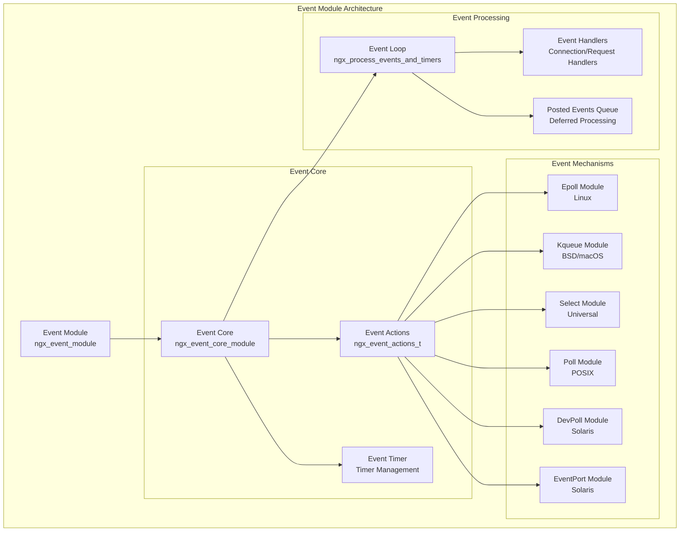
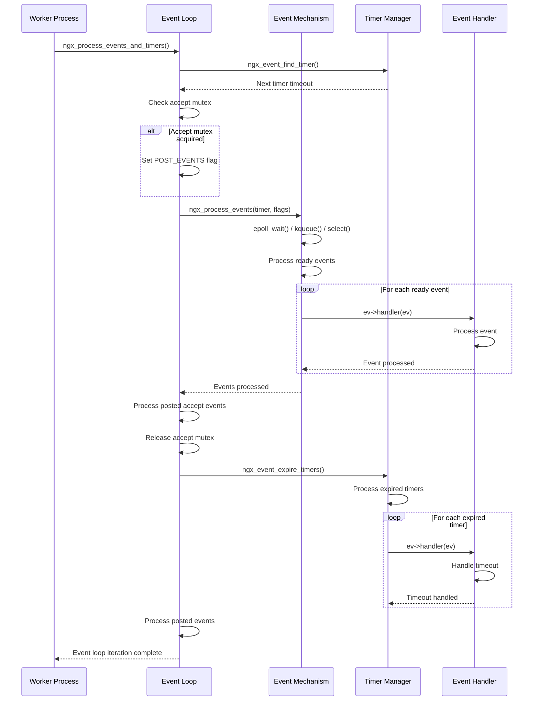
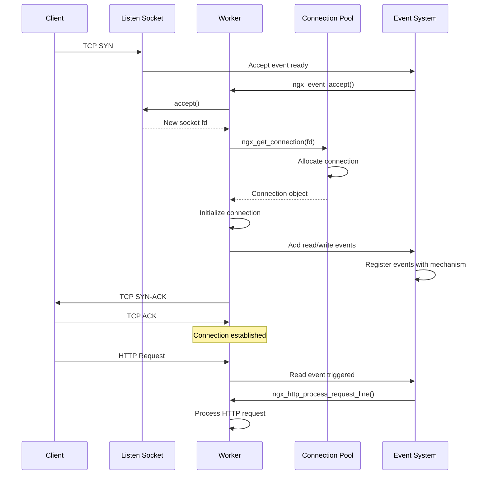

# Nginx 事件模块深度分析

## 1. 概述

事件模块是Nginx高性能的核心所在，实现了异步非阻塞的事件驱动架构。本文档深入分析事件模块的设计原理、不同事件机制的实现以及性能优化策略。

## 2. 事件模块架构图



## 3. 事件结构定义

### 3.1 核心事件结构

```c
// 事件结构定义
struct ngx_event_s {
    void            *data;           // 事件数据(通常是连接对象)
    
    // 事件标志位
    unsigned         write:1;        // 写事件
    unsigned         accept:1;       // 接受连接事件
    unsigned         instance:1;     // 实例标识(防止过期事件)
    unsigned         active:1;       // 事件已激活
    unsigned         disabled:1;     // 事件已禁用
    unsigned         ready:1;        // 事件就绪
    unsigned         oneshot:1;      // 一次性事件
    unsigned         complete:1;     // AIO操作完成
    unsigned         eof:1;          // 连接结束
    unsigned         error:1;        // 错误标志
    unsigned         timedout:1;     // 超时标志
    unsigned         timer_set:1;    // 定时器已设置
    unsigned         delayed:1;      // 延迟处理
    unsigned         deferred_accept:1; // 延迟接受
    unsigned         pending_eof:1;  // 待处理的EOF
    unsigned         posted:1;       // 已投递到队列
    unsigned         closed:1;       // 连接已关闭
    
    int              available;      // 可用数据量
    ngx_event_handler_pt  handler;   // 事件处理函数
    
    ngx_uint_t       index;          // 事件索引
    ngx_log_t       *log;            // 日志对象
    ngx_rbtree_node_t   timer;       // 定时器节点
    ngx_queue_t      queue;          // 队列节点
};
```

### 3.2 事件动作接口

```c
// 事件操作接口
typedef struct {
    // 添加/删除事件
    ngx_int_t  (*add)(ngx_event_t *ev, ngx_int_t event, ngx_uint_t flags);
    ngx_int_t  (*del)(ngx_event_t *ev, ngx_int_t event, ngx_uint_t flags);
    
    // 启用/禁用事件
    ngx_int_t  (*enable)(ngx_event_t *ev, ngx_int_t event, ngx_uint_t flags);
    ngx_int_t  (*disable)(ngx_event_t *ev, ngx_int_t event, ngx_uint_t flags);
    
    // 连接管理
    ngx_int_t  (*add_conn)(ngx_connection_t *c);
    ngx_int_t  (*del_conn)(ngx_connection_t *c, ngx_uint_t flags);
    
    // 通知机制
    ngx_int_t  (*notify)(ngx_event_handler_pt handler);
    
    // 事件处理
    ngx_int_t  (*process_events)(ngx_cycle_t *cycle, ngx_msec_t timer,
                                 ngx_uint_t flags);
    
    // 初始化/清理
    ngx_int_t  (*init)(ngx_cycle_t *cycle, ngx_msec_t timer);
    void       (*done)(ngx_cycle_t *cycle);
} ngx_event_actions_t;
```

## 4. 事件机制实现

### 4.1 Epoll 实现 (Linux)

#### 初始化函数

```c
static ngx_int_t
ngx_epoll_init(ngx_cycle_t *cycle, ngx_msec_t timer)
{
    ngx_epoll_conf_t  *epcf;

    epcf = ngx_event_get_conf(cycle->conf_ctx, ngx_epoll_module);

    if (ep == -1) {
        // 创建epoll实例
        ep = epoll_create(cycle->connection_n / 2);
        if (ep == -1) {
            ngx_log_error(NGX_LOG_EMERG, cycle->log, ngx_errno,
                          "epoll_create() failed");
            return NGX_ERROR;
        }

#if (NGX_HAVE_EVENTFD)
        // 初始化通知机制
        if (ngx_epoll_notify_init(cycle->log) != NGX_OK) {
            ngx_epoll_module_ctx.actions.notify = NULL;
        }
#endif

#if (NGX_HAVE_FILE_AIO)
        // 初始化异步I/O
        ngx_epoll_aio_init(cycle, epcf);
#endif
    }

    // 分配事件列表
    if (nevents < epcf->events) {
        if (event_list) {
            ngx_free(event_list);
        }

        event_list = ngx_alloc(sizeof(struct epoll_event) * epcf->events,
                               cycle->log);
        if (event_list == NULL) {
            return NGX_ERROR;
        }
    }

    nevents = epcf->events;
    
    // 设置I/O操作和事件动作
    ngx_io = ngx_os_io;
    ngx_event_actions = ngx_epoll_module_ctx.actions;

    // 设置事件标志
#if (NGX_HAVE_CLEAR_EVENT)
    ngx_event_flags = NGX_USE_CLEAR_EVENT
#else
    ngx_event_flags = NGX_USE_LEVEL_EVENT
#endif
                      |NGX_USE_GREEDY_EVENT
                      |NGX_USE_EPOLL_EVENT;

    return NGX_OK;
}
```

#### 添加事件函数

```c
static ngx_int_t
ngx_epoll_add_event(ngx_event_t *ev, ngx_int_t event, ngx_uint_t flags)
{
    int                  op;
    uint32_t             events, prev;
    ngx_event_t         *e;
    ngx_connection_t    *c;
    struct epoll_event   ee;

    c = ev->data;

    events = (uint32_t) event;

    if (event == NGX_READ_EVENT) {
        e = c->write;
        prev = EPOLLOUT;
#if (NGX_READ_EVENT != EPOLLIN|EPOLLRDHUP)
        events = EPOLLIN|EPOLLRDHUP;
#endif

    } else {
        e = c->read;
        prev = EPOLLIN|EPOLLRDHUP;
#if (NGX_WRITE_EVENT != EPOLLOUT)
        events = EPOLLOUT;
#endif
    }

    if (e->active) {
        op = EPOLL_CTL_MOD;
        events |= prev;

    } else {
        op = EPOLL_CTL_ADD;
    }

#if (NGX_HAVE_EPOLLEXCLUSIVE && NGX_HAVE_EPOLLRDHUP)
    if (flags & NGX_EXCLUSIVE_EVENT) {
        events &= ~EPOLLRDHUP;
    }
#endif

    ee.events = events | (uint32_t) flags;
    ee.data.ptr = (void *) ((uintptr_t) c | ev->instance);

    ngx_log_debug3(NGX_LOG_DEBUG_EVENT, ev->log, 0,
                   "epoll add event: fd:%d op:%d ev:%08XD",
                   c->fd, op, ee.events);

    if (epoll_ctl(ep, op, c->fd, &ee) == -1) {
        ngx_log_error(NGX_LOG_ALERT, ev->log, ngx_errno,
                      "epoll_ctl(%d, %d) failed", op, c->fd);
        return NGX_ERROR;
    }

    ev->active = 1;
#if 0
    ev->oneshot = (flags & NGX_ONESHOT_EVENT) ? 1 : 0;
#endif

    return NGX_OK;
}
```

#### 事件处理函数

```c
static ngx_int_t
ngx_epoll_process_events(ngx_cycle_t *cycle, ngx_msec_t timer, ngx_uint_t flags)
{
    int                events;
    uint32_t           revents;
    ngx_int_t          instance, i;
    ngx_uint_t         level;
    ngx_err_t          err;
    ngx_event_t       *rev, *wev;
    ngx_queue_t       *queue;
    ngx_connection_t  *c;

    // 等待事件发生
    ngx_log_debug1(NGX_LOG_DEBUG_EVENT, cycle->log, 0,
                   "epoll timer: %M", timer);

    events = epoll_wait(ep, event_list, (int) nevents, timer);

    err = (events == -1) ? ngx_errno : 0;

    // 更新时间
    if (flags & NGX_UPDATE_TIME || ngx_event_timer_alarm) {
        ngx_time_update();
    }

    // 处理错误
    if (err) {
        if (err == NGX_EINTR) {
            if (ngx_event_timer_alarm) {
                ngx_event_timer_alarm = 0;
                return NGX_OK;
            }
            level = NGX_LOG_INFO;
        } else {
            level = NGX_LOG_ALERT;
        }

        ngx_log_error(level, cycle->log, err, "epoll_wait() failed");
        return NGX_ERROR;
    }

    if (events == 0) {
        if (timer != NGX_TIMER_INFINITE) {
            return NGX_OK;
        }

        ngx_log_error(NGX_LOG_ALERT, cycle->log, 0,
                      "epoll_wait() returned no events without timeout");
        return NGX_ERROR;
    }

    // 处理每个就绪事件
    for (i = 0; i < events; i++) {
        c = event_list[i].data.ptr;

        instance = (uintptr_t) c & 1;
        c = (ngx_connection_t *) ((uintptr_t) c & (uintptr_t) ~1);

        rev = c->read;

        if (c->fd == -1 || rev->instance != instance) {
            /*
             * the stale event from a file descriptor
             * that was just closed in this iteration
             */

            ngx_log_debug1(NGX_LOG_DEBUG_EVENT, cycle->log, 0,
                           "epoll: stale event %p", c);
            continue;
        }

        revents = event_list[i].events;

        ngx_log_debug3(NGX_LOG_DEBUG_EVENT, cycle->log, 0,
                       "epoll: fd:%d ev:%04XD d:%p",
                       c->fd, revents, event_list[i].data.ptr);

        // 处理错误事件
        if (revents & (EPOLLERR|EPOLLHUP)) {
            ngx_log_debug2(NGX_LOG_DEBUG_EVENT, cycle->log, 0,
                           "epoll_wait() error on fd:%d ev:%04XD",
                           c->fd, revents);

            /*
             * if the error events were returned, add EPOLLIN and EPOLLOUT
             * to handle the events at least in one active handler
             */

            revents |= EPOLLIN|EPOLLOUT;
        }

#if 0
        if (revents & ~(EPOLLIN|EPOLLOUT|EPOLLERR|EPOLLHUP)) {
            ngx_log_error(NGX_LOG_ALERT, cycle->log, 0,
                          "strange epoll_wait() events fd:%d ev:%04XD",
                          c->fd, revents);
        }
#endif

        // 处理读事件
        if ((revents & EPOLLIN) && rev->active) {

#if (NGX_HAVE_EPOLLRDHUP)
            if (revents & EPOLLRDHUP) {
                rev->pending_eof = 1;
            }
#endif

            rev->ready = 1;
            rev->available = -1;

            if (flags & NGX_POST_EVENTS) {
                queue = rev->accept ? &ngx_posted_accept_events
                                    : &ngx_posted_events;

                ngx_post_event(rev, queue);

            } else {
                rev->handler(rev);
            }
        }

        wev = c->write;

        // 处理写事件
        if ((revents & EPOLLOUT) && wev->active) {

            if (c->fd == -1 || wev->instance != instance) {
                /*
                 * the stale event from a file descriptor
                 * that was just closed in this iteration
                 */

                ngx_log_debug1(NGX_LOG_DEBUG_EVENT, cycle->log, 0,
                               "epoll: stale event %p", c);
                continue;
            }

            wev->ready = 1;
#if (NGX_THREADS)
            wev->complete = 1;
#endif

            if (flags & NGX_POST_EVENTS) {
                ngx_post_event(wev, &ngx_posted_events);

            } else {
                wev->handler(wev);
            }
        }
    }

    return NGX_OK;
}
```

### 4.2 Kqueue 实现 (BSD/macOS)

#### 初始化函数

```c
static ngx_int_t
ngx_kqueue_init(ngx_cycle_t *cycle, ngx_msec_t timer)
{
    ngx_kqueue_conf_t  *kcf;
    struct timespec     ts;
    struct kevent       kev;

    kcf = ngx_event_get_conf(cycle->conf_ctx, ngx_kqueue_module);

    if (kq == -1) {
        kq = kqueue();

        if (kq == -1) {
            ngx_log_error(NGX_LOG_EMERG, cycle->log, ngx_errno,
                          "kqueue() failed");
            return NGX_ERROR;
        }

        ngx_log_debug0(NGX_LOG_DEBUG_EVENT, cycle->log, 0, "kqueue created");
    }

    if (nevents < kcf->events) {
        if (change_list) {
            ngx_free(change_list);
        }

        if (event_list) {
            ngx_free(event_list);
        }

        change_list = ngx_alloc(kcf->changes * sizeof(struct kevent),
                                cycle->log);
        if (change_list == NULL) {
            return NGX_ERROR;
        }

        event_list = ngx_alloc(kcf->events * sizeof(struct kevent),
                               cycle->log);
        if (event_list == NULL) {
            return NGX_ERROR;
        }
    }

    nchanges = 0;
    nevents = kcf->events;

    ngx_io = ngx_os_io;

    ngx_event_actions = ngx_kqueue_module_ctx.actions;

    ngx_event_flags = NGX_USE_ONESHOT_EVENT|NGX_USE_KQUEUE_EVENT
                      |NGX_USE_LOWAT_EVENT|NGX_USE_VNODE_EVENT;

    return NGX_OK;
}
```

### 4.3 Select 实现 (通用)

#### 事件处理函数

```c
static ngx_int_t
ngx_select_process_events(ngx_cycle_t *cycle, ngx_msec_t timer,
    ngx_uint_t flags)
{
    int                 ready, nready;
    ngx_err_t           err;
    ngx_uint_t          i, found;
    ngx_event_t        *ev;
    ngx_connection_t   *c;
    struct timeval      tv, *tp;
    fd_set              work_read_fd_set, work_write_fd_set;

    if (max_fd == -1) {
        return NGX_OK;
    }

    ngx_log_debug1(NGX_LOG_DEBUG_EVENT, cycle->log, 0,
                   "select timer: %M", timer);

    work_read_fd_set = master_read_fd_set;
    work_write_fd_set = master_write_fd_set;

    if (timer == NGX_TIMER_INFINITE) {
        tp = NULL;

    } else {
        tv.tv_sec = (long) (timer / 1000);
        tv.tv_usec = (long) ((timer % 1000) * 1000);
        tp = &tv;
    }

    ngx_log_debug1(NGX_LOG_DEBUG_EVENT, cycle->log, 0,
                   "select read fd_set: %08Xd", *(int *) &work_read_fd_set);

    ready = select(max_fd + 1, &work_read_fd_set, &work_write_fd_set, NULL, tp);

    err = (ready == -1) ? ngx_errno : 0;

    if (flags & NGX_UPDATE_TIME || ngx_event_timer_alarm) {
        ngx_time_update();
    }

    ngx_log_debug2(NGX_LOG_DEBUG_EVENT, cycle->log, 0,
                   "select ready %d of %d", ready, nevents);

    if (err) {
        if (err == NGX_EINTR) {
            if (ngx_event_timer_alarm) {
                ngx_event_timer_alarm = 0;
                return NGX_OK;
            }

            level = NGX_LOG_INFO;

        } else {
            level = NGX_LOG_ALERT;
        }

        ngx_log_error(level, cycle->log, err, "select() failed");

        if (err == NGX_EBADF) {
            ngx_select_repair_fd_sets(cycle);
        }

        return NGX_ERROR;
    }

    if (ready == 0) {
        if (timer != NGX_TIMER_INFINITE) {
            return NGX_OK;
        }

        ngx_log_error(NGX_LOG_ALERT, cycle->log, 0,
                      "select() returned no events without timeout");
        return NGX_ERROR;
    }

    nready = 0;

    for (i = 0; i < nevents && ready; i++) {

        c = event_index[i];

        if (c->fd == -1) {
            continue;
        }

        found = 0;

        ev = c->read;

        if (ev->active && FD_ISSET(c->fd, &work_read_fd_set)) {
            found = 1;

            ngx_log_debug1(NGX_LOG_DEBUG_EVENT, cycle->log, 0,
                           "select read %d", c->fd);

            ev->ready = 1;
            ev->available = -1;

            if (flags & NGX_POST_EVENTS) {
                queue = ev->accept ? &ngx_posted_accept_events
                                   : &ngx_posted_events;

                ngx_post_event(ev, queue);

            } else {
                ev->handler(ev);
            }

            nready++;
        }

        ev = c->write;

        if (ev->active && FD_ISSET(c->fd, &work_write_fd_set)) {
            found = 1;

            ngx_log_debug1(NGX_LOG_DEBUG_EVENT, cycle->log, 0,
                           "select write %d", c->fd);

            ev->ready = 1;

            if (flags & NGX_POST_EVENTS) {
                ngx_post_event(ev, &ngx_posted_events);

            } else {
                ev->handler(ev);
            }

            nready++;
        }

        if (found) {
            ready--;
        }
    }

    if (ready != 0) {
        ngx_log_error(NGX_LOG_ALERT, cycle->log, 0, "select ready != events");
    }

    return NGX_OK;
}
```

## 5. 事件循环核心

### 5.1 主事件循环

```c
void
ngx_process_events_and_timers(ngx_cycle_t *cycle)
{
    ngx_uint_t  flags;
    ngx_msec_t  timer, delta;

    if (ngx_timer_resolution) {
        timer = NGX_TIMER_INFINITE;
        flags = 0;

    } else {
        timer = ngx_event_find_timer();
        flags = NGX_UPDATE_TIME;

#if (NGX_WIN32)

        /* handle signals from master in case of network inactivity */

        if (timer == NGX_TIMER_INFINITE || timer > 500) {
            timer = 500;
        }

#endif
    }

    if (ngx_use_accept_mutex) {
        if (ngx_accept_disabled > 0) {
            ngx_accept_disabled--;

        } else {
            if (ngx_trylock_accept_mutex(cycle) == NGX_ERROR) {
                return;
            }

            if (ngx_accept_mutex_held) {
                flags |= NGX_POST_EVENTS;

            } else {
                if (timer == NGX_TIMER_INFINITE
                    || timer > ngx_accept_mutex_delay)
                {
                    timer = ngx_accept_mutex_delay;
                }
            }
        }
    }

    if (!ngx_queue_empty(&ngx_posted_next_events)) {
        ngx_event_move_posted_next(cycle);
        timer = 0;
    }

    delta = ngx_current_msec;

    // 调用具体的事件处理函数
    (void) ngx_process_events(cycle, timer, flags);

    delta = ngx_current_msec - delta;

    ngx_log_debug1(NGX_LOG_DEBUG_EVENT, cycle->log, 0,
                   "timer delta: %M", delta);

    // 处理投递的accept事件
    ngx_event_process_posted(cycle, &ngx_posted_accept_events);

    if (ngx_accept_mutex_held) {
        ngx_shmtx_unlock(&ngx_accept_mutex);
    }

    // 处理定时器事件
    if (delta) {
        ngx_event_expire_timers();
    }

    // 处理投递的普通事件
    ngx_event_process_posted(cycle, &ngx_posted_events);
}
```

### 5.2 事件投递机制

```c
// 投递事件到队列
void
ngx_post_event(ngx_event_t *ev, ngx_queue_t *queue)
{
    if (!ev->posted) {
        ev->posted = 1;
        ngx_queue_insert_tail(queue, &ev->queue);

        ngx_log_debug1(NGX_LOG_DEBUG_EVENT, ev->log, 0, "post event %p", ev);

    } else  {
        ngx_log_debug1(NGX_LOG_DEBUG_EVENT, ev->log, 0,
                       "update posted event %p", ev);
    }
}

// 处理投递的事件
static void
ngx_event_process_posted(ngx_cycle_t *cycle, ngx_queue_t *posted)
{
    ngx_queue_t  *q;
    ngx_event_t  *ev;

    while (!ngx_queue_empty(posted)) {

        q = ngx_queue_head(posted);
        ev = ngx_queue_data(q, ngx_event_t, queue);

        ngx_log_debug1(NGX_LOG_DEBUG_EVENT, cycle->log, 0,
                      "posted event %p", ev);

        ngx_delete_posted_event(ev);

        ev->handler(ev);
    }
}
```

## 6. 定时器管理

### 6.1 定时器结构

```c
// 定时器红黑树
extern ngx_rbtree_t  ngx_event_timer_rbtree;
extern ngx_rbtree_node_t  ngx_event_timer_sentinel;

// 定时器操作宏
#define ngx_event_timer_set(ev, timer)                                      \
    do {                                                                     \
        ev->timer.key = ngx_current_msec + timer;                           \
        ngx_rbtree_insert(&ngx_event_timer_rbtree, &ev->timer);             \
        ev->timer_set = 1;                                                   \
    } while (0)

#define ngx_event_timer_del(ev)                                              \
    do {                                                                     \
        ngx_rbtree_delete(&ngx_event_timer_rbtree, &ev->timer);             \
        ev->timer_set = 0;                                                   \
    } while (0)
```

### 6.2 定时器处理

```c
// 查找最近的定时器
ngx_msec_t
ngx_event_find_timer(void)
{
    ngx_msec_int_t      timer;
    ngx_rbtree_node_t  *node, *root, *sentinel;

    if (ngx_event_timer_rbtree.root == &ngx_event_timer_sentinel) {
        return NGX_TIMER_INFINITE;
    }

    root = ngx_event_timer_rbtree.root;
    sentinel = ngx_event_timer_rbtree.sentinel;

    node = ngx_rbtree_min(root, sentinel);

    timer = (ngx_msec_int_t) (node->key - ngx_current_msec);

    return (ngx_msec_t) (timer > 0 ? timer : 0);
}

// 处理过期定时器
void
ngx_event_expire_timers(void)
{
    ngx_event_t        *ev;
    ngx_rbtree_node_t  *node, *root, *sentinel;

    sentinel = ngx_event_timer_rbtree.sentinel;

    for ( ;; ) {
        root = ngx_event_timer_rbtree.root;

        if (root == sentinel) {
            return;
        }

        node = ngx_rbtree_min(root, sentinel);

        /* node->key > ngx_current_msec */

        if ((ngx_msec_int_t) (node->key - ngx_current_msec) > 0) {
            return;
        }

        ev = ngx_rbtree_data(node, ngx_event_t, timer);

        ngx_log_debug2(NGX_LOG_DEBUG_EVENT, ev->log, 0,
                       "event timer del: %d: %M",
                       ngx_event_ident(ev->data), ev->timer.key);

        ngx_rbtree_delete(&ngx_event_timer_rbtree, &ev->timer);

#if (NGX_DEBUG)
        ev->timer.left = NULL;
        ev->timer.right = NULL;
        ev->timer.parent = NULL;
#endif

        ev->timer_set = 0;

        ev->timedout = 1;

        ev->handler(ev);
    }
}
```

## 7. 连接管理

### 7.1 连接池管理

```c
// 获取空闲连接
ngx_connection_t *
ngx_get_connection(ngx_socket_t s, ngx_log_t *log)
{
    ngx_uint_t         instance;
    ngx_event_t       *rev, *wev;
    ngx_connection_t  *c;

    /* disable warning: Win32 SOCKET is u_int while UNIX socket is int */

    if (ngx_cycle->free_connections) {

        c = ngx_cycle->free_connections;

        if (c->fd != -1) {
            ngx_log_error(NGX_LOG_ALERT, log, 0,
                          ngx_get_connection_n " reused connection");
        }

        ngx_cycle->free_connections = c->data;
        ngx_cycle->free_connection_n--;

        if (ngx_cycle->files && (ngx_uint_t) s >= ngx_cycle->files_n) {
            ngx_log_error(NGX_LOG_ALERT, log, 0,
                          "the new socket has number %d, "
                          "but only %ui files are available",
                          s, ngx_cycle->files_n);
            return NULL;
        }

    } else if (ngx_cycle->free_connection_n == 0) {

        ngx_log_error(NGX_LOG_ALERT, log, 0,
                      "%ui worker_connections are not enough",
                      ngx_cycle->connection_n);

        return NULL;

    } else {
        c = NULL;
    }

    if (c == NULL) {
        c = &ngx_cycle->connections[ngx_cycle->connection_n
                                    - ngx_cycle->free_connection_n];

        /* ngx_connection_t is allocated in a single ngx_palloc() */

        rev = &ngx_cycle->read_events[ngx_cycle->connection_n
                                      - ngx_cycle->free_connection_n];
        wev = &ngx_cycle->write_events[ngx_cycle->connection_n
                                       - ngx_cycle->free_connection_n];

        ngx_cycle->free_connection_n--;
    }

    /* we have a pool here */

    rev = c->read;
    wev = c->write;

    ngx_memzero(c, sizeof(ngx_connection_t));

    c->read = rev;
    c->write = wev;
    c->fd = s;
    c->log = log;

    instance = rev->instance;

    ngx_memzero(rev, sizeof(ngx_event_t));
    ngx_memzero(wev, sizeof(ngx_event_t));

    rev->instance = !instance;
    wev->instance = !instance;

    rev->index = NGX_INVALID_INDEX;
    wev->index = NGX_INVALID_INDEX;

    rev->data = c;
    wev->data = c;

    wev->write = 1;

    return c;
}

// 释放连接
void
ngx_free_connection(ngx_connection_t *c)
{
    c->data = ngx_cycle->free_connections;
    ngx_cycle->free_connections = c;
    ngx_cycle->free_connection_n++;

    if (ngx_cycle->files && c->fd != -1) {
        ngx_cycle->files[c->fd] = NULL;
    }

    c->fd = (ngx_socket_t) -1;
}
```

## 8. 事件模块时序图

### 8.1 事件循环时序



### 8.2 连接建立时序



## 9. 性能优化策略

### 9.1 事件机制选择

```c
// 事件机制优先级选择
static char *
ngx_event_core_init_conf(ngx_cycle_t *cycle, void *conf)
{
    ngx_event_conf_t  *ecf = conf;
    ngx_module_t      *module;

    module = NULL;

#if (NGX_HAVE_EPOLL) && !(NGX_TEST_BUILD_EPOLL)
    // Linux优先选择epoll
    fd = epoll_create(100);
    if (fd != -1) {
        (void) close(fd);
        module = &ngx_epoll_module;
    }
#endif

#if (NGX_HAVE_KQUEUE)
    // BSD/macOS优先选择kqueue
    module = &ngx_kqueue_module;
#endif

#if (NGX_HAVE_DEVPOLL)
    // Solaris选择/dev/poll
    module = &ngx_devpoll_module;
#endif

#if (NGX_HAVE_SELECT)
    // 通用fallback选择select
    if (module == NULL) {
        module = &ngx_select_module;
    }
#endif

    // 设置选择的事件模块
    ngx_conf_init_uint_value(ecf->use, module->ctx_index);
    
    return NGX_CONF_OK;
}
```

### 9.2 事件处理优化

1. **批量事件处理**
   - 一次系统调用获取多个事件
   - 减少用户态/内核态切换开销

2. **事件投递机制**
   - 延迟处理非紧急事件
   - 优先处理accept事件

3. **连接复用**
   - 连接池避免频繁创建/销毁
   - Keep-alive减少连接建立开销

4. **定时器优化**
   - 红黑树高效管理定时器
   - 批量处理过期定时器

### 9.3 内存优化

1. **预分配事件结构**
   - 启动时预分配事件和连接对象
   - 避免运行时内存分配

2. **零拷贝技术**
   - sendfile直接从文件到socket
   - splice在管道间传输数据

3. **缓存友好设计**
   - 事件结构紧凑排列
   - 热数据集中存放

## 10. 实战应用示例

### 10.1 自定义事件处理器

```c
// 自定义读事件处理器
static void
my_read_event_handler(ngx_event_t *rev)
{
    ssize_t             n;
    ngx_connection_t   *c;
    u_char              buffer[1024];

    c = rev->data;

    if (rev->timedout) {
        ngx_log_error(NGX_LOG_INFO, c->log, NGX_ETIMEDOUT, "client timed out");
        ngx_close_connection(c);
        return;
    }

    n = c->recv(c, buffer, sizeof(buffer));

    if (n == NGX_AGAIN) {
        if (ngx_handle_read_event(rev, 0) != NGX_OK) {
            ngx_close_connection(c);
        }
        return;
    }

    if (n == NGX_ERROR || n == 0) {
        ngx_close_connection(c);
        return;
    }

    // 处理接收到的数据
    process_data(buffer, n);

    // 继续监听读事件
    if (ngx_handle_read_event(rev, 0) != NGX_OK) {
        ngx_close_connection(c);
    }
}

// 设置定时器
static void
set_connection_timeout(ngx_connection_t *c, ngx_msec_t timeout)
{
    ngx_event_t  *rev;

    rev = c->read;

    if (rev->timer_set) {
        ngx_del_timer(rev);
    }

    ngx_add_timer(rev, timeout);
}
```

### 10.2 事件驱动服务器框架

```c
// 简化的事件驱动服务器
static void
my_event_server_init(ngx_cycle_t *cycle)
{
    ngx_listening_t    *ls;
    ngx_connection_t   *c;

    // 创建监听socket
    ls = ngx_create_listening(cycle->pool, &addr, sizeof(struct sockaddr_in));
    if (ls == NULL) {
        return;
    }

    ls->handler = my_accept_handler;
    ls->log = cycle->log;

    // 打开监听socket
    if (ngx_open_listening_sockets(cycle) != NGX_OK) {
        return;
    }

    // 配置监听socket
    ngx_configure_listening_sockets(cycle);
}

static void
my_accept_handler(ngx_event_t *ev)
{
    socklen_t          socklen;
    ngx_err_t          err;
    ngx_log_t         *log;
    ngx_uint_t         level;
    ngx_socket_t       s;
    ngx_event_t       *rev, *wev;
    ngx_listening_t   *ls;
    ngx_connection_t  *c, *lc;
    struct sockaddr   *sa;
    u_char             sa_buf[NGX_SOCKADDRLEN];

    lc = ev->data;
    ls = lc->listening;
    ev->ready = 0;

    do {
        socklen = NGX_SOCKADDRLEN;
        s = accept(lc->fd, (struct sockaddr *) sa_buf, &socklen);

        if (s == (ngx_socket_t) -1) {
            err = ngx_socket_errno;

            if (err == NGX_EAGAIN) {
                return;
            }

            level = NGX_LOG_ALERT;
            if (err == NGX_ECONNABORTED) {
                level = NGX_LOG_ERR;
            }

            ngx_log_error(level, ev->log, err, "accept() failed");
            return;
        }

        // 获取连接对象
        c = ngx_get_connection(s, ev->log);
        if (c == NULL) {
            if (ngx_close_socket(s) == -1) {
                ngx_log_error(NGX_LOG_ALERT, ev->log, ngx_socket_errno,
                              ngx_close_socket_n " failed");
            }
            return;
        }

        // 设置连接属性
        c->pool = ngx_create_pool(ls->pool_size, ev->log);
        if (c->pool == NULL) {
            ngx_close_accepted_connection(c);
            return;
        }

        // 设置事件处理器
        rev = c->read;
        wev = c->write;

        rev->handler = my_read_event_handler;
        wev->handler = my_write_event_handler;

        // 添加读事件
        if (ngx_add_event(rev, NGX_READ_EVENT, 0) != NGX_OK) {
            ngx_close_accepted_connection(c);
            return;
        }

        // 设置超时
        ngx_add_timer(rev, 60000);

    } while (ev->available);
}
```

## 11. 调试和监控

### 11.1 事件调试

```c
// 事件调试宏
#if (NGX_DEBUG)
#define ngx_event_debug(ev, fmt, ...)                                        \
    ngx_log_debug3(NGX_LOG_DEBUG_EVENT, (ev)->log, 0,                       \
                   "event %p: " fmt, ev, ##__VA_ARGS__)
#else
#define ngx_event_debug(ev, fmt, ...)
#endif

// 连接状态监控
static void
ngx_connection_debug(ngx_connection_t *c)
{
    ngx_log_debug6(NGX_LOG_DEBUG_EVENT, c->log, 0,
                   "connection: fd:%d read:%d write:%d "
                   "pool:%p sent:%O buffered:%O",
                   c->fd, c->read->ready, c->write->ready,
                   c->pool, c->sent, c->buffered);
}
```

### 11.2 性能监控

```c
// 事件统计
typedef struct {
    ngx_atomic_t  connections;
    ngx_atomic_t  accepts;
    ngx_atomic_t  handled;
    ngx_atomic_t  requests;
    ngx_atomic_t  reading;
    ngx_atomic_t  writing;
    ngx_atomic_t  waiting;
} ngx_event_stats_t;

// 更新统计信息
static void
ngx_event_update_stats(ngx_event_t *ev)
{
    if (ev->accept) {
        ngx_atomic_fetch_add(ngx_stat_accepts, 1);
    }
    
    if (ev->write) {
        ngx_atomic_fetch_add(ngx_stat_writing, 1);
    } else {
        ngx_atomic_fetch_add(ngx_stat_reading, 1);
    }
}
```

## 12. 总结

Nginx事件模块的设计体现了以下核心特点：

### 12.1 设计优势
- **高效事件机制**: 支持epoll、kqueue等高性能事件机制
- **异步非阻塞**: 单线程处理大量并发连接
- **事件驱动**: 基于事件的响应式编程模型
- **跨平台抽象**: 统一的事件接口，支持多种操作系统

### 12.2 性能特点
- **高并发**: 单个Worker可处理数万并发连接
- **低延迟**: 事件就绪即处理，响应迅速
- **资源高效**: 内存和CPU使用效率高
- **可扩展**: 支持多Worker进程并行处理

### 12.3 应用价值
- 为HTTP、Mail、Stream等上层模块提供高效的事件基础设施
- 统一的异步编程模型，简化模块开发
- 优秀的性能表现，支撑高负载应用
- 灵活的扩展机制，支持自定义事件处理

通过深入理解事件模块的实现原理，开发者可以更好地利用Nginx的事件驱动架构，开发高性能的网络应用。
