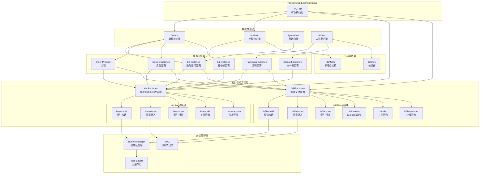
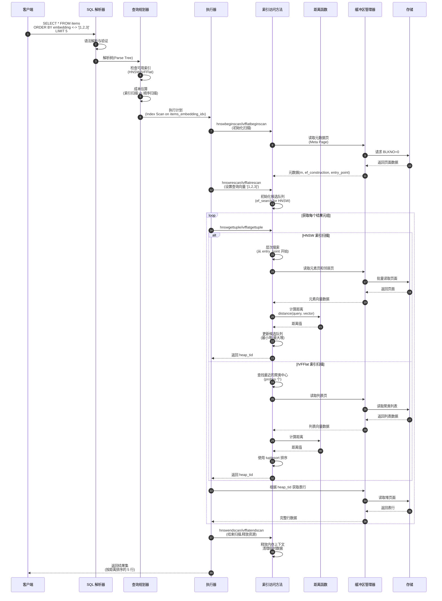

# pgvector-00-总览

## 0. 摘要

### 项目目标
pgvector 是一个开源的 PostgreSQL 扩展,用于实现向量相似度搜索。该项目将向量数据与关系型数据存储在同一数据库中,支持精确和近似最近邻搜索,提供 ACID 合规性、时间点恢复和 PostgreSQL 的所有强大特性。

### 问题域
- 向量存储:支持单精度、半精度、二进制和稀疏向量
- 距离计算:L2距离、内积、余弦距离、L1距离、汉明距离、杰卡德距离
- 索引优化:通过 HNSW 和 IVFFlat 索引实现高效的近似最近邻搜索
- 数据规模:支持最多 16,000 维的向量,非分区表默认限制 32TB

### 核心能力边界
**支持能力:**

- 多种向量类型:vector(单精度)、halfvec(半精度)、bit(二进制)、sparsevec(稀疏)
- 两种索引类型:HNSW(层次化可导航小世界图)、IVFFlat(倒排文件索引)
- 丰富的距离函数和向量运算
- 并行索引构建和查询优化
- COPY 批量加载支持

**非目标:**

- 不是独立的向量数据库(依赖 PostgreSQL)
- 不支持 GPU 加速
- 索引维度限制:HNSW 最多 2000 维,IVFFlat 最多 2000 维
- 不提供向量生成功能(需外部生成向量)

### 运行环境
- **语言**: C 语言
- **运行时**: PostgreSQL 13+ 数据库服务器
- **依赖**: PostgreSQL 服务端开发头文件
- **编译器**: GCC 9+、Clang 7+ 或 MSVC 2019+
- **部署形态**: PostgreSQL 扩展插件模式

## 1. 整体架构图



### 架构说明

#### 1. 组件职责与耦合关系

**数据类型层**:

- 定义四种向量数据类型的内存布局和基本操作
- 提供输入/输出函数、类型转换函数
- 所有类型都是 PostgreSQL 的可变长度类型(varlena)
- 同步耦合:距离计算层直接调用数据类型的访问宏

**距离计算层**:

- 实现各种距离度量函数,使用内联函数和 SIMD 优化
- 支持向量间的距离和相似度计算
- 为索引层提供距离计算支持函数
- 同步耦合:被索引层和查询执行器调用

**索引访问方法层**:

- 实现 PostgreSQL 的索引访问方法接口(Index Access Method)
- HNSW:基于图的索引,查询性能优于 IVFFlat,但构建较慢
- IVFFlat:基于聚类的索引,构建快但查询性能略差
- 异步耦合:通过 WAL 异步持久化索引数据

**存储管理层**:

- 复用 PostgreSQL 的缓冲区管理器和 WAL 机制
- 使用 Generic WAL 记录索引修改操作
- 页面布局:元数据页、列表页、元素页

#### 2. 数据流与控制流

**数据流**:

```
用户 SQL → Parser → Planner → Executor → Index AM → Buffer → Disk
                                    ↓
                                Distance Function ← Vector Type
```

**控制流**:

- 查询路径:SQL解析 → 查询规划 → 索引扫描/顺序扫描 → 距离计算 → 结果排序
- 插入路径:INSERT → 表插入 → 索引插入 → WAL记录 → 缓冲区写入
- 索引构建路径:CREATE INDEX → 表扫描 → K-means(IVFFlat)/图构建(HNSW) → 批量插入

#### 3. 跨进程/跨线程/跨协程路径

**并行索引构建(跨进程)**:

- Leader 进程创建共享内存段和动态共享内存(DSM)
- Worker 进程通过 ParallelContext 访问共享状态
- 使用 ConditionVariable 和 spinlock 同步工作进度
- 数据流:Table Scan → Shared Memory → Per-Worker Build → Merge

**并行查询扫描(跨进程)**:

- PostgreSQL 的并行查询框架自动处理
- 每个 worker 扫描表的一部分
- 使用 Gather 节点合并结果

**内存分配器**:

- 索引构建使用自定义内存分配器 HnswAllocator
- 在 maintenance_work_mem 内优先使用连续内存
- 超出限制后回退到 palloc

#### 4. 高可用、扩展性与状态管理

**高可用**:

- 通过 WAL 支持主从复制
- 支持 ACID 事务特性
- 支持时间点恢复(PITR)

**扩展性**:

- 垂直扩展:通过增加 maintenance_work_mem 加速索引构建
- 水平扩展:通过 PostgreSQL 复制或 Citus 分片
- 并行构建:支持最多 max_parallel_maintenance_workers 个并行 worker

**状态管理**:

- 无状态:距离计算函数
- 会话状态:GUC 参数(hnsw.ef_search、ivfflat.probes)
- 持久状态:索引元数据、向量数据

## 2. 全局时序图

### 主要业务闭环:向量相似度查询



### 时序图说明

#### 1. 入口点与参数验证
- **查询入口**:客户端通过 libpq 或其他 PostgreSQL 客户端库提交 SQL
- **语法验证**:Parser 验证 ORDER BY 使用距离操作符(`<->`、`<#>`、`<=>`等)和 LIMIT 子句
- **类型检查**:确保查询向量维度与表定义的向量类型一致

#### 2. 鉴权与权限检查
- PostgreSQL 的标准权限系统控制表和索引的访问
- 需要 SELECT 权限才能查询表
- 索引由 PostgreSQL 自动选择,用户无需显式权限

#### 3. 幂等性与重试策略
- **查询幂等性**:SELECT 查询天然幂等,可安全重试
- **重试点**:
  - 网络层:客户端连接失败时重试
  - 事务层:读取冲突时 PostgreSQL 自动重试
- **无副作用**:查询操作不修改数据,失败重试不会产生不一致

#### 4. 超时与资源限制
- **statement_timeout**:SQL 语句执行超时(默认无限制)
- **work_mem**:排序和哈希操作的内存限制
- **hnsw.ef_search**:HNSW 索引的动态候选列表大小(影响查询时间和召回率)
- **ivfflat.probes**:IVFFlat 索引扫描的聚类数量(影响查询时间和召回率)
- **hnsw.max_scan_tuples**:迭代扫描的最大元组数(20000,防止扫描时间过长)

#### 5. 回退策略
- **索引不可用**:Planner 自动选择顺序扫描(Seq Scan)
- **内存不足**:HNSW 使用外部排序,IVFFlat 使用 tuplesort
- **页面损坏**:通过 PostgreSQL 的 WAL 恢复机制修复
- **索引陈旧**:VACUUM 和 REINDEX 清理和重建索引

#### 6. 并发控制
- **读写并发**:使用 MVCC,查询不阻塞插入
- **索引锁**:HNSW 使用元素级别的 LWLock,IVFFlat 使用页面锁
- **Dead tuple**:VACUUM 清理已删除但未回收的元组

#### 7. 性能关键路径
- **距离计算**:使用 SIMD 指令优化(SSE、AVX、FMA)
- **缓冲区命中**:索引页面缓存在 shared_buffers
- **I/O 优化**:
  - 顺序读取:HNSW 的邻居页面连续存储
  - 批量读取:BufferAccessStrategy 预取页面
- **内存分配**:HNSW 使用内存池减少 palloc 调用

## 3. 模块边界与交互图

### 模块列表

| 模块名 | 源文件 | 对外 API | 主要职责 |
|--------|--------|----------|----------|
| Vector 类型 | vector.c/h | vector_in, vector_out, vector_send, vector_recv, 距离函数 | 单精度向量类型定义和操作 |
| HalfVec 类型 | halfvec.c/h | halfvec_in, halfvec_out, halfvec_send, halfvec_recv | 半精度向量类型定义和操作 |
| SparseVec 类型 | sparsevec.c/h | sparsevec_in, sparsevec_out, sparsevec_send, sparsevec_recv | 稀疏向量类型定义和操作 |
| BitVec 类型 | bitvec.c/h | bit_in, bit_out(复用PG) | 二进制向量操作 |
| HNSW 索引 | hnsw*.c/h | hnswbuild, hnswinsert, hnswscan 等 | 层次可导航小世界图索引 |
| IVFFlat 索引 | ivfflat*.c/h | ivfflatbuild, ivfflatinsert, ivfflatscan 等 | 倒排文件索引 |
| HalfUtils | halfutils.c/h | HalfToFloat4, Float4ToHalf | 半精度浮点数转换 |
| BitUtils | bitutils.c/h | 位操作函数 | 位向量操作优化 |

### 模块交互矩阵

| 调用方 → 被调方 | Vector | HalfVec | SparseVec | BitVec | HNSW | IVFFlat | Distance | Buffer | WAL |
|-----------------|--------|---------|-----------|--------|------|---------|----------|--------|-----|
| **SQL Executor** | ✓(同步) | ✓(同步) | ✓(同步) | ✓(同步) | ✓(同步) | ✓(同步) | - | - | - |
| **HNSW** | ✓(同步) | ✓(同步) | ✓(同步) | ✓(同步) | - | - | ✓(同步) | ✓(同步) | ✓(同步) |
| **IVFFlat** | ✓(同步) | ✓(同步) | - | ✓(同步) | - | - | ✓(同步) | ✓(同步) | ✓(同步) |
| **Distance Func** | ✓(同步) | ✓(同步) | ✓(同步) | ✓(同步) | - | - | - | - | - |
| **Type Cast** | ✓(同步) | ✓(同步) | - | - | - | - | - | - | - |

### 交互说明

#### 1. 同步调用
- **SQL Executor → Vector Types**:查询执行器调用向量类型的 I/O 函数和操作符
- **Index AM → Distance Functions**:索引扫描时同步调用距离计算函数
- **Index AM → Buffer Manager**:同步读写页面,阻塞等待 I/O 完成
- **Type Cast → Vector Types**:类型转换函数直接调用源和目标类型的访问函数

#### 2. 异步消息
- PostgreSQL 扩展层面没有异步消息传递
- 所有操作都是同步的函数调用

#### 3. 共享存储
- **shared_buffers**:所有模块共享页面缓冲池
- **WAL buffers**:索引修改通过 Generic WAL 记录到共享 WAL 缓冲区
- **DSM(并行构建)**:Leader 和 Worker 进程共享索引构建状态

#### 4. 订阅/发布
- 无发布订阅模式
- 通过 PostgreSQL 的逻辑复制可以订阅表变更,但 pgvector 本身不实现

### 错误语义

| 模块 | 错误类型 | 错误码 | 恢复策略 |
|------|----------|--------|----------|
| Vector Types | 维度不匹配 | ERRCODE_DATA_EXCEPTION | 返回错误,事务回滚 |
| Vector Types | NaN/Inf 值 | ERRCODE_DATA_EXCEPTION | 返回错误,事务回滚 |
| HNSW | 维度超限 | ERRCODE_PROGRAM_LIMIT_EXCEEDED | 返回错误,建议降维 |
| IVFFlat | 列表数超限 | ERRCODE_INVALID_PARAMETER_VALUE | 返回错误,调整参数 |
| Buffer Manager | 页面校验失败 | - | 通过 WAL 恢复 |
| Index Build | 内存不足 | - | 回退到磁盘排序 |

### 一致性要求

| 交互 | 一致性级别 | 机制 |
|------|-----------|------|
| 表数据 ↔ 索引数据 | 强一致 | WAL + MVCC |
| 并行构建的 Worker 间 | 最终一致 | 共享内存 + 自旋锁 |
| 主从复制 | 最终一致(可配置同步) | WAL 流式复制 |
| 查询结果 | 快照隔离 | MVCC + 事务 ID |

## 4. 关键设计与权衡

### 4.1 数据一致性与事务边界

#### 强一致性保证
- **ACID 事务**:所有索引操作在事务内执行,提交前通过 WAL 保证持久化
- **MVCC**:使用元组版本控制,查询看到一致的快照
- **索引可见性**:新插入的向量索引条目对并发事务立即可见(基于 MVCC)

#### 事务边界

```c
// 索引插入的事务边界
BEGIN;
  INSERT INTO items (embedding) VALUES ('[1,2,3]');
  -- 自动触发索引插入
  -- hnswinsert() 或 ivfflatinsert()
  -- WAL 记录索引修改
COMMIT;
  -- WAL 刷新到磁盘
  -- 缓冲区标记为脏页
```

#### 锁策略
- **HNSW**:
  - 元素级 LWLock:保护单个图节点的邻居列表
  - Entry Point Lock:保护图的入口点更新
  - 无死锁:锁顺序固定(先 entry point,后元素)
- **IVFFlat**:
  - 页面级锁:使用 Buffer Manager 的页面锁
  - 列表元数据锁:保护列表头部的插入页指针

### 4.2 并发控制策略

#### 读写并发

```c
// HNSW 插入时的并发控制
LWLockAcquire(&element->lock, LW_EXCLUSIVE);
// 修改邻居列表
HnswUpdateNeighbors(element, ...);
LWLockRelease(&element->lock);

// 查询时的并发控制
LWLockAcquire(&element->lock, LW_SHARED);
// 读取邻居列表
neighbors = HnswGetNeighbors(element, level);
LWLockRelease(&element->lock);
```

#### 多版本并发(MVCC)
- 向量数据使用堆表的 MVCC
- 索引条目包含多个 heap_tid(HNSW_HEAPTIDS = 10)
- 查询时过滤不可见的元组版本

### 4.3 性能关键路径

#### P95 延迟优化
**HNSW 查询路径**:

1. 元数据页读取:~0.1ms(缓存命中)
2. 层次搜索:~1-10ms(取决于 ef_search 和数据规模)
3. 距离计算:~0.01ms/向量(1000 维,使用 SIMD)
4. 堆表访问:~0.1ms/行(缓存命中)

**IVFFlat 查询路径**:

1. 元数据页读取:~0.1ms
2. 聚类中心距离计算:~0.1ms(100 个聚类)
3. 列表扫描:~1-50ms(取决于 probes 和列表大小)
4. Tuplesort 排序:~1ms(内存排序)

#### 内存峰值
- **HNSW 构建**:~(元组数 × (向量大小 + 邻居指针)) + overhead
  - 1M 向量,1000 维,m=16:~(1M × (4KB + 320B)) ≈ 4.3GB
- **IVFFlat 构建**:~(采样数 × 向量大小 + 聚类中心数 × 向量大小)
  - 1M 向量,1000 维,100 个聚类:~(50K × 4KB + 100 × 4KB) ≈ 200MB

#### I/O 热点
- **HNSW**:入口点和上层节点频繁访问(建议 pin 在 shared_buffers)
- **IVFFlat**:元数据页和聚类中心页频繁访问
- **优化**:
  - 增大 shared_buffers(推荐系统内存的 25%)
  - 使用 SSD 减少随机读取延迟
  - 使用 BRIN 或 B-tree 索引配合过滤条件

### 4.4 可观测性指标

#### 关键指标

| 指标 | 含义 | 采集方式 | 建议阈值 |
|------|------|----------|----------|
| 索引大小 | pg_relation_size('idx_name') | pg_stat_user_indexes | <表大小 × 2 |
| 索引扫描次数 | idx_scan | pg_stat_user_indexes | 持续监控 |
| 索引命中率 | idx_scan / (idx_scan + seq_scan) | pg_stat_user_tables | >90% |
| 查询 P95 延迟 | 95 百分位查询时间 | pg_stat_statements | <100ms |
| 缓冲区命中率 | blks_hit / (blks_hit + blks_read) | pg_stat_database | >99% |
| 索引膨胀 | dead tuples / live tuples | pgstattuple | <20% |
| 并行构建进度 | blocks_done / blocks_total | pg_stat_progress_create_index | - |

#### 性能调优建议

```sql
-- 检查索引使用情况
SELECT schemaname, tablename, indexname, idx_scan, idx_tup_read, idx_tup_fetch
FROM pg_stat_user_indexes
WHERE schemaname NOT IN ('pg_catalog', 'information_schema');

-- 检查慢查询
SELECT query, calls, mean_exec_time, stddev_exec_time, max_exec_time
FROM pg_stat_statements
ORDER BY mean_exec_time DESC
LIMIT 20;

-- 检查缓冲区命中率
SELECT datname,
       blks_hit::float / (blks_hit + blks_read) AS cache_hit_ratio
FROM pg_stat_database
WHERE datname = current_database();
```

### 4.5 配置项与可变参数

#### HNSW 参数

| 参数 | 类型 | 默认值 | 范围 | 影响 |
|------|------|--------|------|------|
| m | 构建时 | 16 | 2-100 | 每层连接数,越大召回越高但索引越大 |
| ef_construction | 构建时 | 64 | 4-1000 | 构建时候选列表大小,越大质量越高但构建越慢 |
| hnsw.ef_search | 查询时 | 40 | 1-1000 | 查询时候选列表大小,越大召回越高但查询越慢 |
| hnsw.iterative_scan | 查询时 | off | off/relaxed_order/strict_order | 迭代扫描模式,处理过滤查询 |
| hnsw.max_scan_tuples | 查询时 | 20000 | - | 迭代扫描的最大元组数 |
| hnsw.scan_mem_multiplier | 查询时 | 1 | - | 扫描内存倍数(相对 work_mem) |

#### IVFFlat 参数

| 参数 | 类型 | 默认值 | 范围 | 影响 |
|------|------|--------|------|------|
| lists | 构建时 | 100 | 1-32768 | 聚类数量,建议 rows/1000(小表) 或 sqrt(rows)(大表) |
| ivfflat.probes | 查询时 | 1 | 1-lists | 查询的聚类数,建议 sqrt(lists),越大召回越高但越慢 |
| ivfflat.iterative_scan | 查询时 | off | off/relaxed_order | 迭代扫描模式 |
| ivfflat.max_probes | 查询时 | - | 1-lists | 迭代扫描的最大 probes |

#### PostgreSQL 通用参数

| 参数 | 建议值 | 影响 |
|------|--------|------|
| shared_buffers | 系统内存 25% | 索引页面缓存 |
| maintenance_work_mem | 8GB-16GB | 索引构建速度 |
| work_mem | 64MB-256MB | 查询排序内存 |
| max_parallel_maintenance_workers | CPU核心数 - 2 | 并行构建速度 |
| max_parallel_workers_per_gather | 4 | 并行查询速度 |

## 5. 典型使用示例与最佳实践

### 示例 1:最小可运行入口

```sql
-- 1. 创建扩展
CREATE EXTENSION vector;

-- 2. 创建表
CREATE TABLE documents (
    id bigserial PRIMARY KEY,
    content text,
    embedding vector(1536)  -- OpenAI ada-002 embedding
);

-- 3. 插入数据
INSERT INTO documents (content, embedding) VALUES
('PostgreSQL is a powerful database', '[0.1, 0.2, ..., 0.5]'),
('Vector search is useful for AI', '[0.2, 0.3, ..., 0.6]');

-- 4. 创建索引(选择其一)
-- HNSW 索引(推荐):查询快,构建慢
CREATE INDEX ON documents USING hnsw (embedding vector_l2_ops);

-- IVFFlat 索引:构建快,查询慢
CREATE INDEX ON documents USING ivfflat (embedding vector_l2_ops)
WITH (lists = 100);

-- 5. 查询最相似的文档
SELECT id, content, embedding <-> '[0.15, 0.25, ..., 0.55]' AS distance
FROM documents
ORDER BY embedding <-> '[0.15, 0.25, ..., 0.55]'
LIMIT 5;
```

### 示例 2:批量加载与索引优化

```sql
-- 1. 创建表(不带索引)
CREATE TABLE embeddings (
    id bigserial PRIMARY KEY,
    doc_id bigint,
    embedding vector(768)
);

-- 2. 配置批量加载参数
SET maintenance_work_mem = '8GB';
SET max_parallel_maintenance_workers = 7;

-- 3. 使用 COPY 批量加载(最快)
COPY embeddings (doc_id, embedding)
FROM '/path/to/embeddings.csv'
WITH (FORMAT CSV);

-- 或使用二进制格式(更快)
COPY embeddings (doc_id, embedding)
FROM STDIN
WITH (FORMAT BINARY);

-- 4. 加载完成后创建索引
CREATE INDEX CONCURRENTLY embeddings_embedding_idx
ON embeddings USING hnsw (embedding vector_cosine_ops)
WITH (m = 16, ef_construction = 64);

-- 5. 分析表以更新统计信息
ANALYZE embeddings;

-- 6. 查询优化
-- 6.1 调整 ef_search 提高召回率
BEGIN;
SET LOCAL hnsw.ef_search = 100;
SELECT * FROM embeddings
ORDER BY embedding <=> '[...]'
LIMIT 10;
COMMIT;

-- 6.2 启用迭代扫描处理过滤条件
SET hnsw.iterative_scan = strict_order;
SELECT * FROM embeddings
WHERE doc_id > 1000
ORDER BY embedding <=> '[...]'
LIMIT 10;
```

### 示例 3:混合查询与分区表

```sql
-- 1. 创建分区表
CREATE TABLE embeddings_partitioned (
    id bigserial,
    category_id int,
    embedding vector(384)
) PARTITION BY LIST(category_id);

-- 2. 创建分区
CREATE TABLE embeddings_cat1 PARTITION OF embeddings_partitioned
FOR VALUES IN (1);

CREATE TABLE embeddings_cat2 PARTITION OF embeddings_partitioned
FOR VALUES IN (2);

-- 3. 每个分区创建索引
CREATE INDEX ON embeddings_cat1 USING hnsw (embedding vector_l2_ops);
CREATE INDEX ON embeddings_cat2 USING hnsw (embedding vector_l2_ops);

-- 4. 混合查询:过滤 + 向量搜索
-- 4.1 使用 B-tree 索引加速过滤
CREATE INDEX ON embeddings_partitioned (category_id);

-- 4.2 查询
SELECT * FROM embeddings_partitioned
WHERE category_id = 1  -- 分区裁剪 + 过滤
ORDER BY embedding <-> '[...]'
LIMIT 5;

-- 5. 混合搜索:向量搜索 + 全文搜索
ALTER TABLE embeddings_partitioned ADD COLUMN content_tsv tsvector;
CREATE INDEX ON embeddings_partitioned USING gin(content_tsv);

-- Reciprocal Rank Fusion (RRF)
WITH vector_search AS (
    SELECT id, ROW_NUMBER() OVER (ORDER BY embedding <-> '[...]') AS rank
    FROM embeddings_partitioned
    LIMIT 20
),
text_search AS (
    SELECT id, ROW_NUMBER() OVER (ORDER BY ts_rank_cd(content_tsv, query) DESC) AS rank
    FROM embeddings_partitioned, plainto_tsquery('search query') query
    WHERE content_tsv @@ query
    LIMIT 20
)
SELECT COALESCE(v.id, t.id) AS id,
       1.0 / (60 + v.rank) + 1.0 / (60 + t.rank) AS score
FROM vector_search v
FULL OUTER JOIN text_search t USING (id)
ORDER BY score DESC
LIMIT 10;
```

### 最佳实践总结

#### 索引选择
1. **HNSW**:
   - 适用场景:查询性能优先,可接受较长构建时间
   - 数据规模:任意(无需预训练)
   - 参数建议:m=16, ef_construction=64(默认),ef_search根据召回率调整

2. **IVFFlat**:
   - 适用场景:构建时间敏感,查询性能要求不高
   - 数据规模:需要足够数据训练聚类中心(至少 lists × 50 行)
   - 参数建议:lists=rows/1000 或 sqrt(rows), probes=sqrt(lists)

#### 性能调优
1. **索引构建**:
   - 先加载数据,后创建索引
   - 增大 maintenance_work_mem
   - 使用并行构建(max_parallel_maintenance_workers)
   - 使用 CONCURRENTLY 避免阻塞写入

2. **查询优化**:
   - 确保 ORDER BY + LIMIT 触发索引扫描
   - 增大 shared_buffers 提高缓存命中率
   - 对于过滤查询,使用迭代扫描或部分索引
   - 监控 EXPLAIN ANALYZE 输出

3. **维护操作**:
   - 定期 VACUUM 清理 dead tuples
   - HNSW 索引膨胀后 REINDEX CONCURRENTLY
   - 监控索引大小和查询性能

#### 数据规模建议
- **100K 行以下**:任意索引,差异不明显
- **100K-1M 行**:HNSW 推荐,IVFFlat lists=100-1000
- **1M-10M 行**:HNSW(m=16, ef_construction=64), IVFFlat(lists=1000-3000)
- **10M+ 行**:考虑分区表 + HNSW,或使用 Citus 分片

#### 常见陷阱
1. **索引未使用**:缺少 ORDER BY + LIMIT
2. **召回率低**:ef_search 或 probes 设置过小
3. **构建超时**:maintenance_work_mem 过小或未使用并行
4. **内存溢出**:向量维度过高,考虑降维或半精度索引
5. **过滤查询慢**:未使用迭代扫描或部分索引

---

**文档版本**: 1.0  
**最后更新**: 2025-01-04  
**适用 pgvector 版本**: v0.8.1
