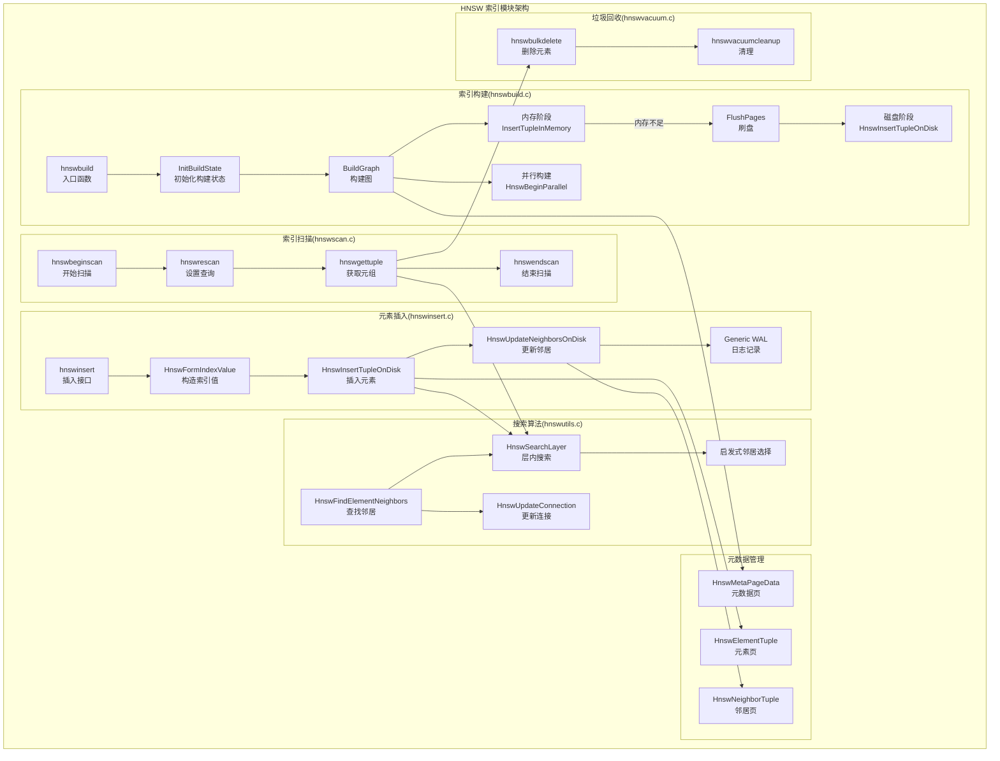
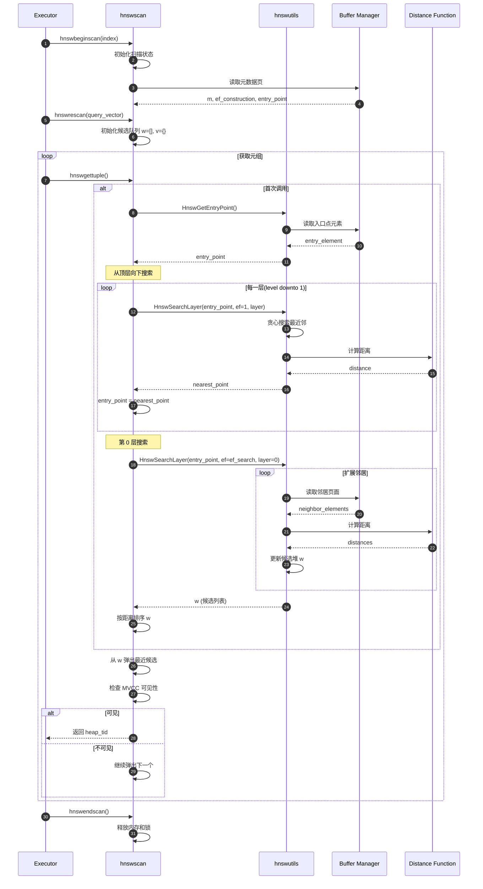

# pgvector-05-HNSW索引模块-概览

## 模块概述

HNSW(Hierarchical Navigable Small World)索引模块实现了层次化可导航小世界图算法,用于高效的近似最近邻搜索。该模块是 pgvector 的两种索引类型之一,相比 IVFFlat 提供更好的查询性能(速度-召回率权衡),但构建时间更长且内存占用更大。

### 核心思想

HNSW 构建一个多层图结构:

- **第 0 层(基础层)**:包含所有向量,每个节点连接 2M 个邻居
- **上层**:包含部分向量(指数递减),每个节点连接 M 个邻居
- **搜索策略**:从上层入口点开始,逐层向下搜索,每层贪心寻找最近邻

### 算法特性
- **时间复杂度**:
  - 构建:O(N × log(N) × M × ef_construction)
  - 查询:O(log(N) × M × ef_search)
- **空间复杂度**:O(N × M × log(N))
- **召回率**:通常 95-99%(取决于参数)

### 模块职责

1. **索引构建**(hnswbuild.c):
   - 两阶段构建:内存阶段 + 磁盘阶段
   - 并行构建支持(多worker协同)
   - 内存管理:优先使用 maintenance_work_mem,超限后刷盘

2. **元素插入**(hnswinsert.c):
   - 单行插入时调用
   - 与查询共享搜索算法
   - WAL 日志记录

3. **索引扫描**(hnswscan.c):
   - 实现 PostgreSQL 索引扫描接口
   - 层次搜索算法
   - 迭代扫描(处理过滤条件)

4. **工具函数**(hnswutils.c):
   - 图搜索核心算法
   - 邻居选择启发式
   - 元数据管理

5. **垃圾回收**(hnswvacuum.c):
   - VACUUM 时清理已删除元素
   - 修复邻居链接
   - 压缩索引

## 架构图



## 关键数据结构

### 1. HnswMetaPageData(元数据页)

```c
typedef struct HnswMetaPageData
{
    uint32 magicNumber;        // 魔数:0xA953A953
    uint32 version;            // 版本号:1
    uint32 dimensions;         // 向量维度
    uint16 m;                  // 邻居数参数
    uint16 efConstruction;     // 构建时候选列表大小
    BlockNumber entryBlkno;    // 入口点块号
    OffsetNumber entryOffno;   // 入口点偏移
    int16 entryLevel;          // 入口点层级
    BlockNumber insertPage;    // 插入页面块号
} HnswMetaPageData;
```

**存储位置**:Block 0(HNSW_METAPAGE_BLKNO)

### 2. HnswElementTuple(元素页)

```c
typedef struct HnswElementTupleData
{
    uint8 type;                       // 元组类型:HNSW_ELEMENT_TUPLE_TYPE (1)
    uint8 level;                      // 元素层级
    uint8 deleted;                    // 删除标记
    uint8 version;                    // 版本号
    ItemPointerData heaptids[10];     // 堆元组ID数组(MVCC支持)
    ItemPointerData neighbortid;      // 邻居元组ID
    uint16 unused;
    Vector data;                      // 向量数据
} HnswElementTupleData;
```

**说明**:

- `heaptids`:支持多版本,最多 10 个堆元组 ID
- `neighbortid`:指向 HnswNeighborTuple 的位置
- `data`:实际向量数据(varlena 格式)

### 3. HnswNeighborTuple(邻居页)

```c
typedef struct HnswNeighborTupleData
{
    uint8 type;                      // 元组类型:HNSW_NEIGHBOR_TUPLE_TYPE (2)
    uint8 version;
    uint16 count;                    // 邻居数量
    ItemPointerData indextids[];     // 邻居索引元组ID数组
} HnswNeighborTupleData;
```

**布局**:

- 每个层级一个数组段
- 第 0 层:最多 2M 个邻居
- 上层:最多 M 个邻居
- 总大小:可变,取决于元素层级

### 4. HnswElement(内存表示)

```c
typedef struct HnswElementData
{
    HnswElementPtr next;              // 链表下一个元素
    ItemPointerData heaptids[10];     // 堆元组ID
    uint8 heaptidsLength;
    uint8 level;                      // 层级
    uint8 deleted;
    uint8 version;
    uint32 hash;                      // 向量哈希(用于去重)
    HnswNeighborsPtr neighbors;       // 邻居指针
    BlockNumber blkno;                // 磁盘块号
    OffsetNumber offno;               // 磁盘偏移
    OffsetNumber neighborOffno;
    BlockNumber neighborPage;
    DatumPtr value;                   // 向量值指针
    LWLock lock;                      // 元素级锁
} HnswElementData;
```

**特点**:

- 构建时使用相对指针(HnswElementPtr)支持共享内存
- 每个元素一个 LWLock,保护邻居修改
- 支持内存和磁盘双重表示

## 核心算法

### 算法 1:层次搜索(HnswSearchLayer)

#### 伪代码

```
函数 SearchLayer(query, entryPoints, ef, layer):
    输入:
        query - 查询向量
        entryPoints - 入口点集合
        ef - 候选列表大小
        layer - 当前层级
    输出:
        candidates - 最近的 ef 个候选点

    W = entryPoints           // 候选集(最小堆,按距离)
    v = 空集                  // 已访问集
    C = entryPoints           // 动态候选列表

    while C 非空:
        c = C 中距离 query 最近的点
        f = W 中距离 query 最远的点

        if distance(c, query) > distance(f, query):
            break  // 所有候选点都比当前最坏点更远

        从 C 移除 c
        for each e in c 的邻居(layer):
            if e not in v:
                加 e 到 v
                f = W 中距离 query 最远的点

                if distance(e, query) < distance(f, query) or |W| < ef:
                    加 e 到 C
                    加 e 到 W
                    if |W| > ef:
                        从 W 移除最远点

    return W
```

#### C 实现(简化版)

```c
List *
HnswSearchLayer(char *base, HnswQuery *q, List *ep, int ef, int lc,
                Relation index, HnswSupport *support, int m,
                bool inserting, HnswElement skipElement,
                visited_hash *v, pairingheap **discarded,
                bool initVisited, int64 *tuples)
{
    List *w = ep;  // 结果集
    pairingheap *C = pairingheap_allocate(...);  // 候选堆

    // 1. 初始化候选集
    foreach(lc, ep)
    {
        HnswSearchCandidate *hc = llnext(lc);
        pairingheap_add(C, &hc->c_node);
    }

    // 2. 搜索循环
    while (!pairingheap_is_empty(C))
    {
        // 获取最近候选
        HnswSearchCandidate *c = HnswGetSearchCandidateConst(...);
        pairingheap_remove_first(C);

        // 获取当前最远结果
        HnswSearchCandidate *f = llast(w);

        // 提前终止条件
        if (c->distance > f->distance)
            break;

        // 3. 扩展邻居
        HnswElement e = HnswPtrAccess(base, c->element);
        HnswNeighborArray *neighbors = HnswGetNeighbors(base, e, lc);

        for (int i = 0; i < neighbors->length; i++)
        {
            HnswElement eN = HnswPtrAccess(base, neighbors->items[i].element);

            // 跳过已访问节点
            if (visited_hash_contains(v, eN))
                continue;

            visited_hash_insert(v, eN);

            // 计算距离
            distance = FunctionCall2Coll(...);  // 调用距离函数

            // 4. 更新候选和结果
            if (distance < f->distance || list_length(w) < ef)
            {
                HnswSearchCandidate *hc = palloc(...);
                hc->element = neighbors->items[i].element;
                hc->distance = distance;

                pairingheap_add(C, &hc->c_node);
                w = lappend(w, hc);

                // 保持 w 大小为 ef
                if (list_length(w) > ef)
                {
                    w = list_delete_last(w);
                    // 可选:保存到 discarded 堆
                }
            }
        }
    }

    return w;
}
```

#### 时间复杂度分析

- **最坏情况**:O(N),访问所有节点
- **平均情况**:O(log(N) × M × ef)
  - log(N):层数
  - M:每个节点的邻居数
  - ef:候选列表大小
- **空间复杂度**:O(ef + visited_size)

### 算法 2:邻居选择启发式

HNSW 使用启发式算法选择邻居,保持图的可导航性:

```c
void
HnswUpdateConnection(char *base, HnswNeighborArray *neighbors,
                     HnswElement newElement, float distance,
                     int lm, int *updateIdx,
                     Relation index, HnswSupport *support)
{
    int idx;

    // 1. 如果邻居数未满,直接添加
    if (neighbors->length < lm)
    {
        neighbors->items[neighbors->length].element = newElement;
        neighbors->items[neighbors->length].distance = distance;
        neighbors->length++;
        return;
    }

    // 2. 找到最远邻居
    idx = 0;
    for (int i = 1; i < lm; i++)
    {
        if (neighbors->items[i].distance > neighbors->items[idx].distance)
            idx = i;
    }

    // 3. 如果新元素更近,替换最远邻居
    if (distance < neighbors->items[idx].distance)
    {
        neighbors->items[idx].element = newElement;
        neighbors->items[idx].distance = distance;
        if (updateIdx)
            *updateIdx = idx;
    }
}
```

**启发式策略**:

- **简单策略**(当前实现):保留 M 个最近邻居
- **原论文策略**(未实现):考虑邻居间的多样性,避免聚集

## 两阶段构建详解

### 阶段 1:内存阶段

**触发条件**:

- 默认使用 maintenance_work_mem
- 计算公式:`graph->memoryTotal = maintenance_work_mem × 1024`

**内存分配**:

```c
InitGraph(&buildstate->graphData, NULL, (Size) maintenance_work_mem * 1024L);

// 每个元素占用:
// - HnswElementData:约 100 bytes
// - 向量数据:4 × dim bytes
// - 邻居数组:M × (level + 1) × sizeof(pointer)
// 估算:1000 维向量,m=16,平均层级 2
//       约 4KB/元素
// 8GB maintenance_work_mem 可容纳约 200万 向量
```

**构建流程**:

1. 表扫描,逐行插入向量
2. 每个向量:
   - 随机生成层级(指数分布)
   - 从入口点开始搜索
   - 更新邻居连接
3. 检查内存使用:
   - 如果 `memoryUsed >= memoryTotal`,触发 FlushPages

**并行构建**:

- Leader 进程分配共享内存(DSM)
- Worker 进程并行扫描表
- 使用相对指针(relptr)共享图数据
- LWLock 保护元素和入口点

### 阶段 2:磁盘阶段

**触发条件**:

- 内存阶段内存不足
- 或者表数据太大无法全部放入内存

**FlushPages 流程**:

```c
static void
FlushPages(HnswBuildState *buildstate)
{
    HnswGraph *graph = buildstate->graph;
    HnswElement element;
    
    // 1. 创建元数据页
    HnswUpdateMetaPage(...);
    
    // 2. 遍历内存中的所有元素
    element = HnswPtrAccess(NULL, graph->head);
    while (element != NULL)
    {
        // 2.1 序列化元素到磁盘
        HnswElementTuple etup = ...;
        HnswSetElementTuple(NULL, etup, element);
        
        // 2.2 插入到索引页面
        InsertElementPage(buildstate, element, etup);
        
        // 2.3 插入邻居页面
        HnswNeighborTuple ntup = ...;
        HnswSetNeighborTuple(NULL, ntup, element, m);
        InsertNeighborPage(buildstate, element, ntup);
        
        element = HnswPtrAccess(NULL, element->next);
    }
    
    // 3. 标记已刷盘
    graph->flushed = true;
}
```

**磁盘插入**(后续元组):

- 使用 HnswInsertTupleOnDisk
- 与单行 INSERT 相同逻辑
- 区别:构建时不写 WAL

## 查询流程

### 完整查询路径



### 参数影响

| 参数 | 影响 | 建议值 |
|------|------|--------|
| m | 邻居数,影响图连通性和查询时间 | 16(默认) |
| ef_construction | 构建时候选列表大小,影响索引质量 | 64(默认),可增至 200 |
| hnsw.ef_search | 查询时候选列表大小,影响召回率和速度 | 40(默认),根据召回率调整 |

**性能权衡**:

- ef_search ↑ → 召回率 ↑、查询时间 ↑
- ef_search ↓ → 召回率 ↓、查询时间 ↓

## 并发控制

### 锁策略

1. **元素级 LWLock**:
   - 每个元素一个 LWLock
   - 保护:`heaptids`、`neighbors`
   - 获取顺序:先 entry point,后普通元素(避免死锁)

2. **Entry Point Lock**:
   - `graph->entryLock`:保护入口点更新
   - `graph->entryWaitLock`:等待入口点初始化

3. **Allocator Lock**:
   - `graph->allocatorLock`:保护内存分配器
   - 短暂持有,分配后立即释放

4. **Flush Lock**:
   - `graph->flushLock`:保护刷盘操作
   - 共享锁:正常插入
   - 排他锁:刷盘

### MVCC 支持

```c
// 元素包含多个 heap_tid
typedef struct HnswElementData
{
    ItemPointerData heaptids[HNSW_HEAPTIDS];  // 最多 10 个版本
    uint8 heaptidsLength;
    ...
} HnswElementData;

// 查询时过滤不可见版本
for (int i = 0; i < element->heaptidsLength; i++)
{
    if (table_tuple_satisfies_snapshot(..., &element->heaptids[i], ...))
    {
        *tid = element->heaptids[i];
        return true;  // 找到可见版本
    }
}
```

## 性能优化

### 1. 内存优化

- **内存池**:GenerationContext 减少 palloc 开销
- **相对指针**:共享内存中使用 relptr
- **延迟加载**:仅在需要时加载向量数据

### 2. I/O 优化

- **BufferAccessStrategy**:顺序扫描策略
- **批量读取**:预取邻居页面
- **页面布局**:元素和邻居分开存储,减少写入冲突

### 3. 计算优化

- **距离缓存**:候选列表缓存计算过的距离
- **SIMD**:距离函数自动向量化
- **提前终止**:候选距离超过最远结果时停止

---

**文档版本**: 1.0  
**最后更新**: 2025-01-04  
**对应源文件**: src/hnsw*.c, src/hnsw.h
