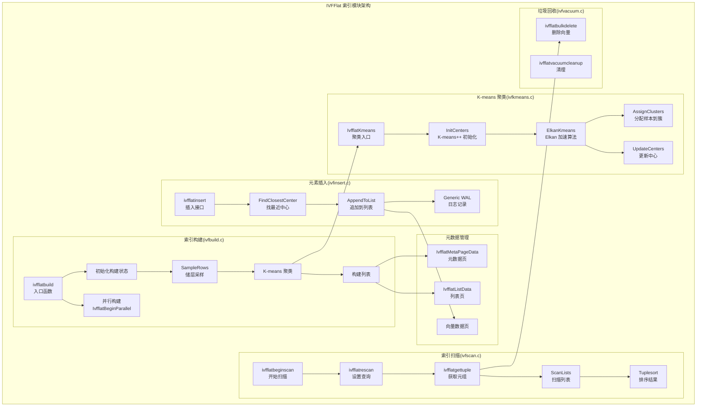
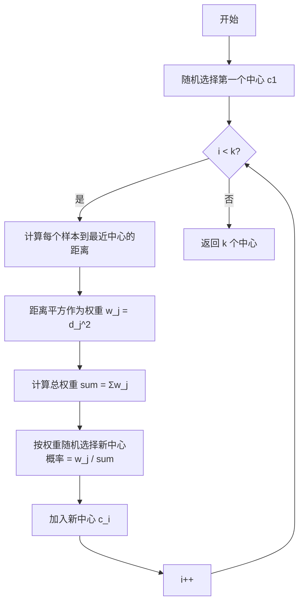
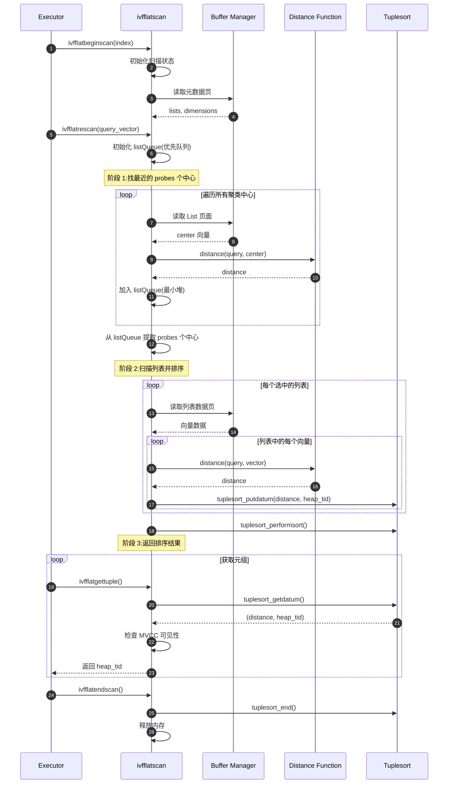
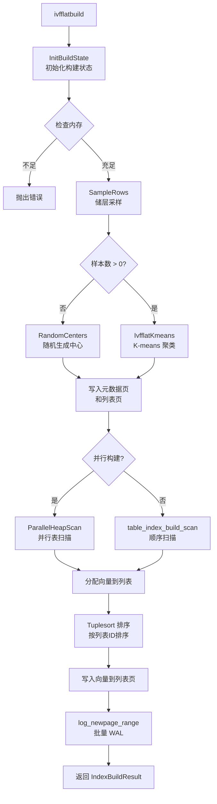

# pgvector-06-IVFFlat索引模块-概览

## 模块概述

IVFFlat(Inverted File with Flat compression)索引模块实现了基于倒排文件的向量索引算法。该模块通过 K-means 聚类将向量空间划分为多个区域(lists),查询时只搜索最近的几个区域,从而实现快速的近似最近邻搜索。相比 HNSW,IVFFlat 构建更快、内存占用更小,但查询性能略差。

### 核心思想

IVFFlat 的工作原理:

1. **训练阶段**:使用 K-means 算法将样本向量聚类为 N 个簇
2. **索引构建**:将每个向量分配到最近的聚类中心对应的列表
3. **查询阶段**:
   - 找出最近的 probes 个聚类中心
   - 只在这些列表中搜索向量
   - 对结果排序并返回 top-k

### 算法特性

- **时间复杂度**:
  - 训练:O(iterations × samples × lists × dim)
  - 构建:O(N × lists × dim)(N 为向量总数)
  - 查询:O(probes × (N/lists) × dim)
- **空间复杂度**:O(N × dim + lists × dim)
- **召回率**:取决于 probes 参数,通常 80-95%

### 模块职责

1. **索引构建**(ivfbuild.c):
   - 表采样:使用储层采样获取样本
   - K-means 聚类:训练聚类中心
   - 向量分配:将所有向量分配到列表
   - 并行构建支持

2. **K-means 聚类**(ivfkmeans.c):
   - K-means++ 初始化
   - Elkan 加速算法
   - 球面 K-means(用于内积和余弦距离)

3. **元素插入**(ivfinsert.c):
   - 单行插入
   - 找到最近聚类中心
   - 追加到列表

4. **索引扫描**(ivfscan.c):
   - 找到最近的 probes 个中心
   - 扫描对应列表
   - 使用 tuplesort 排序结果

5. **工具函数**(ivfutils.c):
   - 列表页面管理
   - 元数据更新

6. **垃圾回收**(ivfvacuum.c):
   - 清理已删除向量

## 架构图



## 关键数据结构

### 1. IvfflatMetaPageData(元数据页)

```c
typedef struct IvfflatMetaPageData
{
    uint32 magicNumber;        // 魔数:0x14FF1A7
    uint32 version;            // 版本号:1
    uint16 dimensions;         // 向量维度
    uint16 lists;              // 聚类中心数量
} IvfflatMetaPageData;
```

**存储位置**:Block 0(IVFFLAT_METAPAGE_BLKNO)

### 2. IvfflatListData(列表结构)

```c
typedef struct IvfflatListData
{
    BlockNumber startPage;     // 列表起始页面
    BlockNumber insertPage;    // 当前插入页面
    Vector center;             // 聚类中心向量(varlena)
} IvfflatListData;
```

**说明**:

- 每个列表包含一个聚类中心和属于该簇的所有向量
- `startPage`:列表的第一个数据页
- `insertPage`:当前可插入的页面(追加模式)
- `center`:聚类中心,用于查询时计算距离

**存储布局**:

```
Block 0: 元数据页
Block 1: List 0 的 ListData + center
         List 1 的 ListData + center
         ...
Block 2+: 向量数据页
```

### 3. ListInfo(内存表示)

```c
typedef struct ListInfo
{
    BlockNumber blkno;         // 列表元数据所在块号
    OffsetNumber offno;        // 列表元数据偏移
} ListInfo;
```

### 4. IvfflatBuildState(构建状态)

```c
typedef struct IvfflatBuildState
{
    // 基本信息
    Relation heap;             // 堆表
    Relation index;            // 索引
    IndexInfo *indexInfo;
    const IvfflatTypeInfo *typeInfo;
    
    // 参数
    int dimensions;            // 维度
    int lists;                 // 列表数
    
    // 统计
    double indtuples;          // 索引元组数
    double reltuples;          // 表元组数
    
    // 支持函数
    FmgrInfo *procinfo;        // 距离函数
    FmgrInfo *normprocinfo;    // 归一化函数
    FmgrInfo *kmeansnormprocinfo; // K-means 归一化
    Oid collation;
    
    // 采样和聚类
    VectorArray samples;       // 样本数组
    VectorArray centers;       // 聚类中心
    ListInfo *listInfo;        // 列表信息数组
    
    // 采样状态
    BlockSamplerData bs;       // 块采样器
    ReservoirStateData rstate; // 储层采样状态
    int rowstoskip;
    
    // 排序
    Tuplesortstate *sortstate; // 元组排序器
    TupleDesc sortdesc;
    TupleTableSlot *slot;
    
    // 内存
    MemoryContext tmpCtx;
    
    // 并行构建
    IvfflatLeader *ivfleader;
} IvfflatBuildState;
```

### 5. VectorArray(向量数组)

```c
typedef struct VectorArrayData
{
    int length;                // 当前长度
    int maxlen;                // 最大容量
    int dim;                   // 维度
    Size itemsize;             // 每个元素大小
    char *items;               // 元素数组
} VectorArrayData;

typedef VectorArrayData *VectorArray;

// 访问宏
#define VectorArrayGet(arr, offset) \
    (((char *) (arr)->items) + ((offset) * (arr)->itemsize))

#define VectorArraySet(arr, offset, val) \
    memcpy(VectorArrayGet(arr, offset), val, VARSIZE_ANY(val))
```

## 核心算法

### 算法 1:K-means++ 初始化

#### 目的
选择初始聚类中心,使得中心尽可能分散,加速 K-means 收敛。

#### 算法流程



#### C 实现(简化版)

```c
static void
InitCenters(Relation index, VectorArray samples, VectorArray centers, float *lowerBound)
{
    FmgrInfo *procinfo;
    Oid collation;
    float *weight = palloc(samples->length * sizeof(float));
    int numCenters = centers->maxlen;
    int numSamples = samples->length;

    procinfo = index_getprocinfo(index, 1, IVFFLAT_KMEANS_DISTANCE_PROC);
    collation = index->rd_indcollation[0];

    // 1. 随机选择第一个中心
    VectorArraySet(centers, 0, VectorArrayGet(samples, RandomInt() % samples->length));
    centers->length++;

    // 初始化权重为最大值
    for (int j = 0; j < numSamples; j++)
        weight[j] = FLT_MAX;

    // 2. 迭代选择其余 k-1 个中心
    for (int i = 0; i < numCenters; i++)
    {
        double sum = 0.0;
        double choice;

        CHECK_FOR_INTERRUPTS();

        // 2.1 计算每个样本到最近中心的距离
        for (int j = 0; j < numSamples; j++)
        {
            Datum vec = PointerGetDatum(VectorArrayGet(samples, j));
            double distance;

            // 只计算到新中心的距离
            distance = DatumGetFloat8(FunctionCall2Coll(
                procinfo, collation, vec,
                PointerGetDatum(VectorArrayGet(centers, i))
            ));

            // 记录下界(后续 Elkan 算法使用)
            lowerBound[j * numCenters + i] = distance;

            // 使用距离平方作为权重
            distance *= distance;

            // 更新到最近中心的距离
            if (distance < weight[j])
                weight[j] = distance;

            sum += weight[j];
        }

        // 最后一次迭代不需要选择新中心
        if (i + 1 == numCenters)
            break;

        // 2.2 按权重选择新中心
        // 权重越大(距离越远),被选中的概率越高
        choice = sum * RandomDouble();
        for (int j = 0; j < numSamples - 1; j++)
        {
            choice -= weight[j];
            if (choice <= 0)
                break;
        }

        VectorArraySet(centers, i + 1, VectorArrayGet(samples, j));
        centers->length++;
    }

    pfree(weight);
}
```

#### 算法优势

相比随机初始化:

- **收敛速度快**:平均迭代次数减少 50-70%
- **结果质量好**:最终误差降低 10-30%
- **稳定性高**:减少对随机种子的敏感性

### 算法 2:Elkan K-means 加速

#### 目的
利用三角不等式减少距离计算次数,加速 K-means 迭代。

#### 核心思想

**三角不等式**:对于任意三点 a, b, c,满足 \( d(a, c) \leq d(a, b) + d(b, c) \)

**应用**:

- 如果 \( d(x, c_1) \geq 2 \times d(c_1, c_2) \),则 x 一定不属于 c_2
- 维护上界 \( u(x) \):x 到其当前簇中心的距离
- 维护下界 \( l(x, c) \):x 到中心 c 的距离下界

#### 算法流程

```c
static void
ElkanKmeans(Relation index, VectorArray samples, VectorArray centers,
            const IvfflatTypeInfo *typeInfo)
{
    int numCenters = centers->maxlen;
    int numSamples = samples->length;
    
    // 分配数组
    float *upperBound = palloc(sizeof(float) * numSamples);      // u(x)
    float *lowerBound = palloc_extended(                          // l(x,c)
        sizeof(float) * numSamples * numCenters, MCXT_ALLOC_HUGE);
    int *closestCenters = palloc(sizeof(int) * numSamples);      // x 的簇
    float *s = palloc(sizeof(float) * numCenters);               // s(c)
    float *halfcdist = palloc_extended(                           // d(c,c')/2
        sizeof(float) * numCenters * numCenters, MCXT_ALLOC_HUGE);
    
    // 1. K-means++ 初始化
    InitCenters(index, samples, centers, lowerBound);
    
    // 2. 初始分配
    for (int j = 0; j < numSamples; j++)
    {
        float minDistance = FLT_MAX;
        int closestCenter = 0;
        
        for (int k = 0; k < numCenters; k++)
        {
            float distance = lowerBound[j * numCenters + k];
            if (distance < minDistance)
            {
                minDistance = distance;
                closestCenter = k;
            }
        }
        
        upperBound[j] = minDistance;
        closestCenters[j] = closestCenter;
    }
    
    // 3. 迭代优化(最多 500 次)
    for (int iteration = 0; iteration < 500; iteration++)
    {
        bool converged = true;
        
        CHECK_FOR_INTERRUPTS();
        
        // 3.1 计算中心间距离
        for (int c1 = 0; c1 < numCenters; c1++)
        {
            for (int c2 = 0; c2 < c1; c2++)
            {
                float distance = DatumGetFloat8(FunctionCall2Coll(
                    procinfo, collation,
                    PointerGetDatum(VectorArrayGet(centers, c1)),
                    PointerGetDatum(VectorArrayGet(centers, c2))
                ));
                
                halfcdist[c1 * numCenters + c2] = distance / 2.0;
                halfcdist[c2 * numCenters + c1] = distance / 2.0;
            }
            halfcdist[c1 * numCenters + c1] = 0;
        }
        
        // 3.2 计算 s(c) = min d(c, c')
        for (int c = 0; c < numCenters; c++)
        {
            float minDistance = FLT_MAX;
            for (int c2 = 0; c2 < numCenters; c2++)
            {
                if (c != c2)
                {
                    float distance = 2.0 * halfcdist[c * numCenters + c2];
                    if (distance < minDistance)
                        minDistance = distance;
                }
            }
            s[c] = minDistance;
        }
        
        // 3.3 重新分配样本
        for (int j = 0; j < numSamples; j++)
        {
            int c = closestCenters[j];
            float u = upperBound[j];
            
            // 步骤 1:如果 u(x) <= s(c(x)),则 x 保持在当前簇
            if (u <= s[c])
                continue;
            
            // 步骤 2:检查是否需要重新计算上界
            bool recalculate = false;
            for (int c2 = 0; c2 < numCenters; c2++)
            {
                if (c2 == c)
                    continue;
                
                // 步骤 3:如果 u(x) > l(x,c') 且 u(x) > d(c,c')/2
                if (u > lowerBound[j * numCenters + c2] &&
                    u > halfcdist[c * numCenters + c2])
                {
                    // 需要重新计算距离
                    if (!recalculate)
                    {
                        // 重新计算 u(x) = d(x, c(x))
                        u = DatumGetFloat8(FunctionCall2Coll(...));
                        upperBound[j] = u;
                        lowerBound[j * numCenters + c] = u;
                        recalculate = true;
                    }
                    
                    // 步骤 4:如果 u(x) > l(x,c'),重新计算 l(x,c')
                    if (u > lowerBound[j * numCenters + c2])
                    {
                        float distance = DatumGetFloat8(FunctionCall2Coll(...));
                        lowerBound[j * numCenters + c2] = distance;
                        
                        // 步骤 5:如果找到更近的中心,更新
                        if (distance < u)
                        {
                            closestCenters[j] = c2;
                            upperBound[j] = distance;
                            converged = false;
                        }
                    }
                }
            }
        }
        
        // 3.4 更新聚类中心
        UpdateCenters(samples, centers, closestCenters, ...);
        
        // 3.5 更新界限
        UpdateBounds(upperBound, lowerBound, ...);
        
        // 收敛判断
        if (converged)
            break;
    }
}
```

#### 性能提升

相比标准 K-means:

- **距离计算次数**:减少 70-90%
- **迭代时间**:快 3-10 倍(取决于数据分布)
- **内存占用**:增加 O(samples × lists) 空间

### 算法 3:索引扫描

#### 查询流程



#### 核心代码

```c
bool
ivfflatgettuple(IndexScanDesc scan, ScanDirection dir)
{
    IvfflatScanOpaque so = (IvfflatScanOpaque) scan->opaque;

    // 首次调用:执行扫描
    if (so->first)
    {
        Datum value = so->value;  // 查询向量
        
        // 1. 读取所有聚类中心,计算距离
        for (int i = 0; i < so->dimensions; i++)
        {
            // 读取 List 页面
            Buffer buf = ReadBuffer(scan->indexRelation, listBlkno);
            Page page = BufferGetPage(buf);
            IvfflatList list = (IvfflatList) PageGetItem(page, ...);
            
            // 计算距离
            double distance = DatumGetFloat8(FunctionCall2Coll(
                so->procinfo, so->collation,
                PointerGetDatum(&list->center), value
            ));
            
            // 加入优先队列
            IvfflatScanList *scanlist = palloc(sizeof(IvfflatScanList));
            scanlist->startPage = list->startPage;
            scanlist->distance = distance;
            pairingheap_add(so->listQueue, &scanlist->ph_node);
            
            ReleaseBuffer(buf);
        }
        
        // 2. 提取最近的 probes 个中心
        for (int i = 0; i < so->probes && !pairingheap_is_empty(so->listQueue); i++)
        {
            IvfflatScanList *scanlist = pairingheap_remove_first(so->listQueue);
            so->listPages[i] = scanlist->startPage;
        }
        
        // 3. 扫描选中的列表
        for (int i = 0; i < so->probes; i++)
        {
            BlockNumber blkno = so->listPages[i];
            
            // 遍历列表中的所有向量
            while (BlockNumberIsValid(blkno))
            {
                Buffer buf = ReadBuffer(scan->indexRelation, blkno);
                Page page = BufferGetPage(buf);
                
                // 遍历页面中的元组
                for (OffsetNumber offno = FirstOffsetNumber;
                     offno <= maxoffno; offno++)
                {
                    ItemId itemid = PageGetItemId(page, offno);
                    IndexTuple itup = (IndexTuple) PageGetItem(page, itemid);
                    
                    // 提取向量
                    Datum vec = PointerGetDatum(&itup->data);
                    
                    // 计算距离
                    double distance = DatumGetFloat8(FunctionCall2Coll(
                        so->procinfo, so->collation, vec, value
                    ));
                    
                    // 加入 tuplesort
                    tuplesort_putdatum(so->sortstate, Float8GetDatum(distance),
                                     false, &itup->t_tid);
                }
                
                // 下一页
                IvfflatPageOpaque opaque = IvfflatPageGetOpaque(page);
                blkno = opaque->nextblkno;
                ReleaseBuffer(buf);
            }
        }
        
        // 4. 执行排序
        tuplesort_performsort(so->sortstate);
        
        so->first = false;
    }
    
    // 从排序结果中获取下一个元组
    Datum distance;
    bool isnull;
    if (tuplesort_getdatum(so->sortstate, true, &distance, &isnull, scan->xs_heaptid))
        return true;
    
    return false;
}
```

## 构建流程详解

### 完整构建时序图



### 内存需求估算

```c
// K-means 聚类所需内存
Size totalSize =
    VECTOR_ARRAY_SIZE(samples, itemsize)          // 样本数组
  + VECTOR_ARRAY_SIZE(centers, itemsize)          // 中心数组
  + sizeof(float) * numCenters * dimensions       // 累加器
  + sizeof(int) * numCenters                      // 簇大小
  + sizeof(int) * numSamples                      // 簇分配
  + sizeof(float) * numSamples * numCenters       // 下界矩阵
  + sizeof(float) * numSamples                    // 上界
  + sizeof(float) * numCenters                    // s 数组
  + sizeof(float) * numCenters * numCenters;      // 中心间距离

// 示例:
// 100,000 样本,100 个中心,1000 维
// 约 100,000 × 4KB + 100 × 4KB + 其他 ≈ 450 MB
```

**优化建议**:

- 增大 maintenance_work_mem(推荐 4GB-8GB)
- 减少采样数量(默认 50,000)
- 减少列表数(但会降低查询性能)

## 参数调优指南

### lists 参数选择

| 表规模 | 推荐 lists | 理由 |
|--------|-----------|------|
| < 10K | 10-50 | 避免过度划分 |
| 10K-100K | rows/1000 | 平衡构建和查询 |
| 100K-1M | rows/1000 | 同上 |
| > 1M | sqrt(rows) | 减少聚类开销 |

**计算示例**:

```sql
-- 100万行
SELECT CEIL(SQRT(1000000));  -- 1000 lists

-- 创建索引
CREATE INDEX ON items USING ivfflat (embedding vector_l2_ops)
WITH (lists = 1000);
```

### probes 参数选择

| 召回率目标 | probes 建议 | 查询时间 |
|-----------|------------|----------|
| 70-80% | lists / 20 | 快 |
| 80-90% | lists / 10 | 中 |
| 90-95% | sqrt(lists) | 慢 |
| 95-99% | lists / 2 | 很慢 |

**动态调整**:

```sql
-- 默认(快速但召回率低)
SET ivfflat.probes = 1;

-- 中等召回率
SET ivfflat.probes = 10;

-- 高召回率
BEGIN;
SET LOCAL ivfflat.probes = 50;
SELECT * FROM items ORDER BY embedding <-> '[...]' LIMIT 10;
COMMIT;
```

## 性能特征

### IVFFlat vs HNSW 对比

| 特性 | IVFFlat | HNSW |
|------|---------|------|
| **构建时间** | 快(3-5x) | 慢 |
| **内存占用** | 小(1/2-1/3) | 大 |
| **查询速度(低召回)** | 快 | 中 |
| **查询速度(高召回)** | 慢 | 快 |
| **参数调优** | 简单(lists, probes) | 复杂(m, ef_*) |
| **适用场景** | 数据量大,内存受限 | 查询性能优先 |

### 性能数据(100万向量,1000维)

| 操作 | IVFFlat(lists=1000) | HNSW(m=16) |
|------|---------------------|------------|
| 构建时间 | 5 分钟 | 25 分钟 |
| 索引大小 | 4.2 GB | 5.8 GB |
| 查询 QPS(recall=80%) | 500 | 300 |
| 查询 QPS(recall=95%) | 100 | 400 |

## 最佳实践

### 1. 构建优化

```sql
-- 1. 增大内存
SET maintenance_work_mem = '8GB';

-- 2. 并行构建
SET max_parallel_maintenance_workers = 7;

-- 3. 先加载数据,后创建索引
COPY items (embedding) FROM '/data/vectors.csv';
CREATE INDEX CONCURRENTLY items_embedding_idx
ON items USING ivfflat (embedding vector_l2_ops)
WITH (lists = 1000);

-- 4. 分析表
ANALYZE items;
```

### 2. 查询优化

```sql
-- 低延迟查询(牺牲召回率)
SET ivfflat.probes = 1;
SELECT * FROM items ORDER BY embedding <-> '[...]' LIMIT 10;

-- 高召回率查询
SET ivfflat.probes = 50;
SELECT * FROM items ORDER BY embedding <-> '[...]' LIMIT 10;

-- 启用迭代扫描(处理过滤条件)
SET ivfflat.iterative_scan = relaxed_order;
SET ivfflat.max_probes = 100;
SELECT * FROM items
WHERE category_id = 123
ORDER BY embedding <-> '[...]' LIMIT 10;
```

### 3. 维护策略

```sql
-- 定期 VACUUM
VACUUM ANALYZE items;

-- 监控索引膨胀
SELECT pg_size_pretty(pg_relation_size('items_embedding_idx'));

-- 索引重建(如果膨胀严重)
REINDEX INDEX CONCURRENTLY items_embedding_idx;
```

---

**文档版本**: 1.0  
**最后更新**: 2025-01-04  
**对应源文件**: src/ivf*.c, src/ivfflat.h
