# pgvector 源码深度剖析文档

---

## 1. 框架使用手册

### 1.1 项目概述

pgvector 是一个开源的 PostgreSQL 扩展，专门用于向量相似性搜索。它支持多种向量类型和距离函数，提供了高效的近似最近邻搜索能力。

**核心特性：**
- 支持精确和近似最近邻搜索
- 多种向量类型：单精度、半精度、二进制、稀疏向量
- 多种距离函数：L2距离、内积、余弦距离、L1距离、汉明距离、Jaccard距离
- 两种索引方法：HNSW 和 IVFFlat
- 完整的 ACID 支持和 PostgreSQL 生态集成

### 1.2 安装与配置

```bash
# 编译安装
git clone --branch v0.8.1 https://github.com/pgvector/pgvector.git
cd pgvector
make
make install

# 在数据库中启用扩展
CREATE EXTENSION vector;
```

**安装脚本详细说明：**

这个安装脚本展示了 pgvector 的标准编译安装流程：

1. **源码获取**：
   - `git clone --branch v0.8.1`：克隆指定版本的源码，确保版本一致性
   - 使用特定版本标签避免主分支的不稳定性

2. **编译过程**：
   - `make`：调用 PostgreSQL 的 PGXS 构建系统
   - 自动检测 PostgreSQL 安装路径和版本
   - 编译 C 源码为共享库文件
   - 生成 SQL 脚本和控制文件

3. **安装部署**：
   - `make install`：将编译产物安装到 PostgreSQL 目录
   - 复制 `.so` 文件到 `lib` 目录
   - 复制 `.sql` 和 `.control` 文件到 `share/extension` 目录

4. **扩展激活**：
   - `CREATE EXTENSION vector`：在数据库中注册扩展
   - 创建向量数据类型和相关函数
   - 注册索引访问方法和操作符类

### 1.3 基本使用

#### 1.3.1 创建向量表

```sql
-- 创建包含向量列的表
CREATE TABLE items (
    id bigserial PRIMARY KEY, 
    embedding vector(3)  -- 3维向量
);

-- 插入向量数据
INSERT INTO items (embedding) VALUES 
    ('[1,2,3]'), 
    ('[4,5,6]'), 
    ('[7,8,9]');
```

**向量表创建 SQL 详细说明：**

这段 SQL 代码展示了 pgvector 的基本使用模式：

1. **表结构定义**：
   - `id bigserial PRIMARY KEY`：使用自增长整数作为主键
   - `embedding vector(3)`：定义3维向量列
   - `vector(3)` 中的数字指定向量维度，这是类型修饰符
   - 维度必须在创建时确定，后续插入的向量必须匹配此维度

2. **向量数据插入**：
   - `'[1,2,3]'`：使用 JSON 数组格式表示向量
   - 方括号是必需的，元素用逗号分隔
   - 支持整数和浮点数，会自动转换为单精度浮点数
   - 插入时会验证维度匹配和数值有效性

3. **数据类型特性**：
   - 每个向量占用 `4 * dim + 8` 字节存储空间
   - 支持 NULL 值，但 NULL 向量不会被索引
   - 自动检测和拒绝 NaN、无穷大等无效值

#### 1.3.2 向量查询

```sql
-- 最近邻搜索（L2距离）
SELECT * FROM items 
ORDER BY embedding <-> '[3,1,2]' 
LIMIT 5;

-- 内积搜索
SELECT * FROM items 
ORDER BY embedding <#> '[3,1,2]' 
LIMIT 5;

-- 余弦距离搜索
SELECT * FROM items 
ORDER BY embedding <=> '[3,1,2]' 
LIMIT 5;
```

**向量查询 SQL 详细说明：**

这些 SQL 查询展示了 pgvector 支持的三种主要距离度量方式：

1. **L2 距离查询（欧几里得距离）**：
   - `<->` 操作符：计算两个向量间的欧几里得距离
   - `ORDER BY embedding <-> '[3,1,2]'`：按距离升序排列
   - 适用场景：几何空间中的相似性搜索
   - 计算公式：√(Σ(ai - bi)²)

2. **内积查询（点积）**：
   - `<#>` 操作符：返回负内积值（适配 PostgreSQL 升序排序）
   - 实际内积 = -(embedding <#> query_vector)
   - 适用场景：标准化向量的相似性搜索
   - 计算公式：-Σ(ai × bi)

3. **余弦距离查询**：
   - `<=>` 操作符：计算余弦距离（1 - 余弦相似度）
   - 适用场景：文本向量、推荐系统
   - 计算公式：1 - (A·B)/(|A|×|B|)

4. **查询优化要点**：
   - 必须使用 `ORDER BY` + `LIMIT` 才能触发索引
   - 查询向量的维度必须与表中向量维度匹配
   - 支持与其他 WHERE 条件组合使用

#### 1.3.3 索引创建

```sql
-- 创建 HNSW 索引（推荐）
CREATE INDEX ON items USING hnsw (embedding vector_l2_ops);

-- 创建 IVFFlat 索引
CREATE INDEX ON items USING ivfflat (embedding vector_l2_ops) 
WITH (lists = 100);
```

**索引创建 SQL 详细说明：**

这些 SQL 语句展示了 pgvector 两种主要索引类型的创建方法：

1. **HNSW 索引创建**：
   - `USING hnsw`：指定使用 HNSW 索引访问方法
   - `vector_l2_ops`：指定 L2 距离的操作符类
   - 默认参数：m=16（连接数），ef_construction=64（构建时候选列表大小）
   - 特点：高精度、较慢构建、较高内存使用

2. **IVFFlat 索引创建**：
   - `USING ivfflat`：指定使用 IVFFlat 索引访问方法
   - `WITH (lists = 100)`：指定聚类数量为100
   - 聚类数量选择：小数据集用 rows/1000，大数据集用 sqrt(rows)
   - 特点：快速构建、较低内存使用、中等精度

3. **操作符类选择**：
   - `vector_l2_ops`：L2 距离操作符类
   - `vector_ip_ops`：内积操作符类
   - `vector_cosine_ops`：余弦距离操作符类
   - `vector_l1_ops`：L1 距离操作符类（仅 HNSW 支持）

4. **索引构建注意事项**：
   - 建议在数据加载完成后创建索引
   - 生产环境使用 `CREATE INDEX CONCURRENTLY` 避免阻塞
   - 可以为同一列创建多个不同距离函数的索引

### 1.4 支持的向量类型

| 类型 | 存储大小 | 最大维度 | 用途 |
|------|----------|----------|------|
| `vector` | 4 * dim + 8 字节 | 16,000 | 单精度浮点向量 |
| `halfvec` | 2 * dim + 8 字节 | 16,000 | 半精度浮点向量 |
| `bit` | dim / 8 + 8 字节 | 64,000 | 二进制向量 |
| `sparsevec` | 8 * nnz + 16 字节 | 16,000 非零元素 | 稀疏向量 |

### 1.5 框架使用完整示例

#### 1.5.1 文档相似性搜索系统

以下是一个完整的文档相似性搜索系统的实现示例：

```sql
-- 创建文档表，存储文档和其向量表示
CREATE TABLE documents (
    id BIGSERIAL PRIMARY KEY,
    title TEXT NOT NULL,
    content TEXT NOT NULL,
    embedding vector(1536),  -- OpenAI text-embedding-ada-002 的维度
    created_at TIMESTAMP DEFAULT CURRENT_TIMESTAMP
);

-- 插入示例文档数据
INSERT INTO documents (title, content, embedding) VALUES 
    ('机器学习基础', '机器学习是人工智能的一个分支...', '[0.1, 0.2, 0.3, ...]'),
    ('深度学习概述', '深度学习是机器学习的一个子领域...', '[0.2, 0.3, 0.4, ...]'),
    ('自然语言处理', 'NLP是计算机科学和人工智能的交叉领域...', '[0.3, 0.4, 0.5, ...]');

-- 创建向量索引以提高查询性能
CREATE INDEX ON documents USING hnsw (embedding vector_cosine_ops) 
WITH (m = 16, ef_construction = 64);

-- 相似文档搜索查询
SELECT 
    id,
    title,
    content,
    1 - (embedding <=> '[0.15, 0.25, 0.35, ...]') AS similarity_score
FROM documents 
WHERE 1 - (embedding <=> '[0.15, 0.25, 0.35, ...]') > 0.8  -- 相似度阈值
ORDER BY embedding <=> '[0.15, 0.25, 0.35, ...]'
LIMIT 10;
```

**文档相似性搜索系统代码详细说明：**

这个示例展示了如何构建一个完整的文档相似性搜索系统：

1. **表结构设计**：
   - `id`：文档的唯一标识符，使用 `BIGSERIAL` 自动递增
   - `title/content`：文档的标题和内容，使用 `TEXT` 类型存储
   - `embedding`：文档的向量表示，使用 1536 维向量（OpenAI 标准）
   - `created_at`：文档创建时间，便于管理和排序

2. **数据插入策略**：
   - 向量通常由外部系统（如 OpenAI API）生成
   - 可以批量插入大量文档数据
   - 支持增量更新和实时插入

3. **索引优化**：
   - 使用 `vector_cosine_ops` 操作符类，适合文档相似性比较
   - `m = 16, ef_construction = 64` 是平衡性能和精度的参数
   - 索引创建后显著提高查询性能

4. **相似性查询**：
   - 使用余弦距离 `<=>` 操作符计算相似性
   - `1 - distance` 转换为相似性分数（0-1 范围）
   - 设置相似度阈值过滤不相关结果
   - `ORDER BY` 和 `LIMIT` 获取最相似的文档

#### 1.5.2 推荐系统实现

```sql
-- 用户表
CREATE TABLE users (
    user_id BIGSERIAL PRIMARY KEY,
    username VARCHAR(50) UNIQUE NOT NULL,
    user_embedding vector(128)  -- 用户偏好向量
);

-- 商品表
CREATE TABLE products (
    product_id BIGSERIAL PRIMARY KEY,
    product_name TEXT NOT NULL,
    category VARCHAR(50),
    price DECIMAL(10,2),
    product_embedding vector(128)  -- 商品特征向量
);

-- 用户行为表
CREATE TABLE user_interactions (
    interaction_id BIGSERIAL PRIMARY KEY,
    user_id BIGINT REFERENCES users(user_id),
    product_id BIGINT REFERENCES products(product_id),
    interaction_type VARCHAR(20), -- 'view', 'purchase', 'like'
    rating INTEGER CHECK (rating BETWEEN 1 AND 5),
    timestamp TIMESTAMP DEFAULT CURRENT_TIMESTAMP
);

-- 创建向量索引
CREATE INDEX ON users USING hnsw (user_embedding vector_cosine_ops);
CREATE INDEX ON products USING hnsw (product_embedding vector_cosine_ops);

-- 为特定用户推荐商品
WITH user_profile AS (
    SELECT user_embedding 
    FROM users 
    WHERE user_id = 12345
),
similar_products AS (
    SELECT 
        p.product_id,
        p.product_name,
        p.category,
        p.price,
        1 - (p.product_embedding <=> u.user_embedding) AS similarity
    FROM products p, user_profile u
    WHERE 1 - (p.product_embedding <=> u.user_embedding) > 0.6
)
SELECT * FROM similar_products
ORDER BY similarity DESC
LIMIT 20;
```

**推荐系统实现代码详细说明：**

这个推荐系统示例展示了向量数据库在个性化推荐中的应用：

1. **数据模型设计**：
   - **用户表**：存储用户基本信息和偏好向量
   - **商品表**：存储商品信息和特征向量
   - **交互表**：记录用户与商品的交互行为

2. **向量表示**：
   - `user_embedding`：用户偏好向量，通过历史行为学习得出
   - `product_embedding`：商品特征向量，基于商品属性和用户反馈生成
   - 128 维向量在推荐系统中是常见的选择，平衡表达能力和计算效率

3. **推荐算法**：
   - 使用余弦相似度计算用户偏好与商品特征的匹配度
   - 设置相似度阈值（0.6）过滤低相关性商品
   - 按相似度降序排列，返回最匹配的商品

4. **性能优化**：
   - 在用户和商品表上都创建了 HNSW 索引
   - 使用 CTE（Common Table Expression）优化查询结构
   - 支持实时推荐和批量推荐

#### 1.5.3 图像检索系统

```sql
-- 图像表
CREATE TABLE images (
    image_id BIGSERIAL PRIMARY KEY,
    filename VARCHAR(255) NOT NULL,
    file_path TEXT NOT NULL,
    image_hash VARCHAR(64),
    feature_vector vector(2048),  -- 图像特征向量（如 ResNet 特征）
    metadata JSONB,
    upload_time TIMESTAMP DEFAULT CURRENT_TIMESTAMP
);

-- 图像标签表
CREATE TABLE image_tags (
    tag_id BIGSERIAL PRIMARY KEY,
    image_id BIGINT REFERENCES images(image_id),
    tag_name VARCHAR(50),
    confidence FLOAT CHECK (confidence BETWEEN 0 AND 1)
);

-- 创建多种索引以支持不同查询模式
CREATE INDEX ON images USING hnsw (feature_vector vector_l2_ops) 
WITH (m = 32, ef_construction = 128);  -- 高精度配置

CREATE INDEX ON images USING gin (metadata);  -- 元数据查询
CREATE INDEX ON image_tags (tag_name);  -- 标签查询

-- 以图搜图功能
CREATE OR REPLACE FUNCTION find_similar_images(
    query_vector vector(2048),
    similarity_threshold FLOAT DEFAULT 0.7,
    max_results INTEGER DEFAULT 50
)
RETURNS TABLE (
    image_id BIGINT,
    filename VARCHAR(255),
    file_path TEXT,
    similarity_score FLOAT,
    tags TEXT[]
) AS $$
BEGIN
    RETURN QUERY
    SELECT 
        i.image_id,
        i.filename,
        i.file_path,
        (1 - (i.feature_vector <-> query_vector))::FLOAT AS similarity_score,
        ARRAY_AGG(DISTINCT t.tag_name) AS tags
    FROM images i
    LEFT JOIN image_tags t ON i.image_id = t.image_id
    WHERE (1 - (i.feature_vector <-> query_vector)) >= similarity_threshold
    GROUP BY i.image_id, i.filename, i.file_path, i.feature_vector
    ORDER BY i.feature_vector <-> query_vector
    LIMIT max_results;
END;
$$ LANGUAGE plpgsql;

-- 使用函数进行图像检索
SELECT * FROM find_similar_images(
    '[0.1, 0.2, 0.3, ...]'::vector(2048),
    0.8,  -- 相似度阈值
    10    -- 最大结果数
);
```

**图像检索系统代码详细说明：**

这个图像检索系统展示了向量数据库在计算机视觉领域的应用：

1. **数据结构设计**：
   - **图像表**：存储图像基本信息和特征向量
   - **标签表**：存储图像的标签信息，支持多标签
   - 使用 2048 维向量存储深度学习模型（如 ResNet）提取的特征

2. **索引策略**：
   - 使用高精度 HNSW 索引配置（m=32, ef_construction=128）
   - 同时创建 GIN 索引支持元数据查询
   - 多种索引类型支持复合查询场景

3. **函数封装**：
   - 创建专用函数 `find_similar_images` 封装复杂查询逻辑
   - 支持可配置的相似度阈值和结果数量
   - 返回结构化结果，包含相似度分数和标签信息

4. **查询优化**：
   - 使用 L2 距离进行图像特征比较
   - 通过 `LEFT JOIN` 聚合标签信息
   - 设置相似度阈值减少无关结果

#### 1.5.4 多模态搜索系统

```sql
-- 多模态内容表
CREATE TABLE multimodal_content (
    content_id BIGSERIAL PRIMARY KEY,
    title TEXT,
    description TEXT,
    content_type VARCHAR(20), -- 'text', 'image', 'video', 'audio'
    file_url TEXT,
    
    -- 不同模态的向量表示
    text_embedding vector(768),    -- 文本向量（BERT/RoBERTa）
    image_embedding vector(512),   -- 图像向量（CLIP）
    audio_embedding vector(256),   -- 音频向量
    
    -- 融合向量
    multimodal_embedding vector(1024), -- 多模态融合向量
    
    created_at TIMESTAMP DEFAULT CURRENT_TIMESTAMP
);

-- 为不同模态创建索引
CREATE INDEX ON multimodal_content USING hnsw (text_embedding vector_cosine_ops);
CREATE INDEX ON multimodal_content USING hnsw (image_embedding vector_cosine_ops);
CREATE INDEX ON multimodal_content USING hnsw (multimodal_embedding vector_cosine_ops);

-- 多模态搜索函数
CREATE OR REPLACE FUNCTION multimodal_search(
    query_text_vector vector(768) DEFAULT NULL,
    query_image_vector vector(512) DEFAULT NULL,
    content_type_filter VARCHAR(20) DEFAULT NULL,
    limit_count INTEGER DEFAULT 20
)
RETURNS TABLE (
    content_id BIGINT,
    title TEXT,
    content_type VARCHAR(20),
    text_similarity FLOAT,
    image_similarity FLOAT,
    combined_score FLOAT
) AS $$
BEGIN
    RETURN QUERY
    SELECT 
        mc.content_id,
        mc.title,
        mc.content_type,
        CASE 
            WHEN query_text_vector IS NOT NULL AND mc.text_embedding IS NOT NULL 
            THEN (1 - (mc.text_embedding <=> query_text_vector))::FLOAT 
            ELSE 0.0 
        END AS text_similarity,
        CASE 
            WHEN query_image_vector IS NOT NULL AND mc.image_embedding IS NOT NULL 
            THEN (1 - (mc.image_embedding <=> query_image_vector))::FLOAT 
            ELSE 0.0 
        END AS image_similarity,
        (
            COALESCE(1 - (mc.text_embedding <=> query_text_vector), 0) * 0.6 +
            COALESCE(1 - (mc.image_embedding <=> query_image_vector), 0) * 0.4
        )::FLOAT AS combined_score
    FROM multimodal_content mc
    WHERE 
        (content_type_filter IS NULL OR mc.content_type = content_type_filter)
        AND (
            (query_text_vector IS NOT NULL AND mc.text_embedding IS NOT NULL) OR
            (query_image_vector IS NOT NULL AND mc.image_embedding IS NOT NULL)
        )
    ORDER BY combined_score DESC
    LIMIT limit_count;
END;
$$ LANGUAGE plpgsql;

-- 使用示例：文本+图像联合搜索
SELECT * FROM multimodal_search(
    '[0.1, 0.2, ...]'::vector(768),  -- 文本查询向量
    '[0.3, 0.4, ...]'::vector(512),  -- 图像查询向量
    NULL,  -- 不限制内容类型
    15     -- 返回15个结果
);
```

**多模态搜索系统代码详细说明：**

这个多模态搜索系统展示了如何处理不同类型的数据：

1. **多模态数据存储**：
   - 支持文本、图像、视频、音频等多种内容类型
   - 为每种模态存储专门的向量表示
   - 包含融合向量支持跨模态搜索

2. **向量维度设计**：
   - 文本向量：768 维（BERT 标准）
   - 图像向量：512 维（CLIP 标准）
   - 音频向量：256 维（适中的维度）
   - 融合向量：1024 维（综合表示）

3. **多模态搜索算法**：
   - 支持单模态或多模态查询
   - 使用加权组合计算综合相似度分数
   - 文本权重 0.6，图像权重 0.4（可调整）

4. **灵活性设计**：
   - 支持内容类型过滤
   - 处理缺失模态的情况
   - 可配置的结果数量和权重

---

## 2. 对外 API 详细分析

### 2.1 向量类型 API

#### 2.1.1 vector 类型核心函数

**vector_in 函数 - 输入解析**
```c
// 位置：src/vector.c
// 功能：将文本格式的向量输入转换为内部 Vector 结构
// 参数：
//   - lit: 输入的字符串，如 '[1,2,3]'
//   - typmod: 类型修饰符，包含维度信息
// 返回值：Vector* 指向新创建的向量结构
// 调用关系：被 PostgreSQL 类型系统调用，用于处理向量输入
// 性能特征：O(n) 时间复杂度，n为向量维度
FUNCTION_PREFIX PG_FUNCTION_INFO_V1(vector_in);
Datum
vector_in(PG_FUNCTION_ARGS)
{
    char       *lit = PG_GETARG_CSTRING(0);      // 获取输入字符串
    int32       typmod = PG_GETARG_INT32(2);     // 获取类型修饰符
    float       x[VECTOR_MAX_DIM];               // 临时存储向量元素
    int         dim = 0;                         // 向量维度计数器
    char       *pt = lit;                        // 字符串解析指针
    Vector     *result;                          // 结果向量指针

    // 跳过前导空白字符
    while (vector_isspace(*pt))
        pt++;

    // 检查向量开始标记 '['
    if (*pt != '[')
        ereport(ERROR,
                (errcode(ERRCODE_INVALID_TEXT_REPRESENTATION),
                 errmsg("invalid input syntax for type vector: \"%s\"", lit),
                 errdetail("Vector contents must start with \"[\".")));

    pt++; // 跳过 '['

    // 跳过 '[' 后的空白字符
    while (vector_isspace(*pt))
        pt++;

    // 检查空向量（不允许）
    if (*pt == ']')
        ereport(ERROR,
                (errcode(ERRCODE_DATA_EXCEPTION),
                 errmsg("vector must have at least 1 dimension")));

    // 解析向量元素的主循环
    for (;;)
    {
        float       val;                         // 当前元素值
        char       *stringEnd;                   // 数值解析结束位置

        // 检查维度限制
        if (dim == VECTOR_MAX_DIM)
            ereport(ERROR,
                    (errcode(ERRCODE_PROGRAM_LIMIT_EXCEEDED),
                     errmsg("vector cannot have more than %d dimensions", VECTOR_MAX_DIM)));

        // 跳过元素前的空白字符
        while (vector_isspace(*pt))
            pt++;

        // 检查意外的字符串结束
        if (*pt == '\0')
            ereport(ERROR,
                    (errcode(ERRCODE_INVALID_TEXT_REPRESENTATION),
                     errmsg("invalid input syntax for type vector: \"%s\"", lit)));

        errno = 0;

        // 使用 strtof 解析浮点数（避免双重舍入问题）
        val = strtof(pt, &stringEnd);

        // 检查解析是否成功
        if (stringEnd == pt)
            ereport(ERROR,
                    (errcode(ERRCODE_INVALID_TEXT_REPRESENTATION),
                     errmsg("invalid input syntax for type vector: \"%s\"", lit)));

        // 检查数值范围错误
        if (errno == ERANGE && isinf(val))
            ereport(ERROR,
                    (errcode(ERRCODE_NUMERIC_VALUE_OUT_OF_RANGE),
                     errmsg("\"%s\" is out of range for type vector", 
                            pnstrdup(pt, stringEnd - pt))));

        // 检查元素有效性（NaN、无穷大等）
        CheckElement(val);
        x[dim++] = val;                          // 存储元素并增加维度计数

        pt = stringEnd;                          // 移动解析指针

        // 跳过元素后的空白字符
        while (vector_isspace(*pt))
            pt++;

        // 处理分隔符和结束符
        if (*pt == ',')
            pt++;                                // 跳过逗号，继续解析下一个元素
        else if (*pt == ']')
        {
            pt++;                                // 跳过 ']'，结束解析
            break;
        }
        else
            ereport(ERROR,
                    (errcode(ERRCODE_INVALID_TEXT_REPRESENTATION),
                     errmsg("invalid input syntax for type vector: \"%s\"", lit)));
    }

    // 检查 ']' 后只允许空白字符
    while (vector_isspace(*pt))
        pt++;

    if (*pt != '\0')
        ereport(ERROR,
                (errcode(ERRCODE_INVALID_TEXT_REPRESENTATION),
                 errmsg("invalid input syntax for type vector: \"%s\"", lit)));

    // 验证维度
    CheckDim(dim);
    CheckExpectedDim(typmod, dim);

    // 创建结果向量并复制数据
    result = InitVector(dim);
    for (int i = 0; i < dim; i++)
        result->x[i] = x[i];

    PG_RETURN_VECTOR_P(result);
}
```

**vector_in 函数代码详细说明：**

这是 pgvector 中最重要的输入函数之一，负责将文本格式的向量转换为内部 Vector 结构：

1. **函数签名和宏定义**：
   - `FUNCTION_PREFIX`：根据 PostgreSQL 版本定义函数前缀
   - `PG_FUNCTION_INFO_V1(vector_in)`：PostgreSQL V1 调用约定宏
   - 声明函数为 PostgreSQL 可调用的 C 函数

2. **参数获取**：
   - `PG_GETARG_CSTRING(0)`：获取输入的字符串参数
   - `PG_GETARG_OID(1)`：获取类型 OID 参数（通常未使用）
   - `PG_GETARG_INT32(2)`：获取类型修饰符（维度信息）

3. **局部变量定义**：
   - `Vector *result`：指向结果向量的指针
   - `int dim`：解析出的向量维度
   - `char *pt, *stringEnd`：字符串解析的辅助指针

4. **核心处理逻辑**（注释中概括）：
   - 解析 `[1,2,3]` 格式的字符串输入
   - 验证括号、逗号等格式要求
   - 解析每个浮点数元素
   - 验证维度与类型修饰符的一致性
   - 分配 Vector 结构体内存
   - 填充向量数据并返回

5. **返回值处理**：
   - `PG_RETURN_VECTOR_P(result)`：使用 PostgreSQL 宏返回向量指针
   - 自动处理内存管理和类型转换

**调用链路分析：**
```
SQL输入 → PostgreSQL解析器 → vector_in → CheckDim → CheckExpectedDim → InitVector → Vector结构体
```

**array_to_vector 函数 - 数组转换**
```c
// 位置：src/vector.c
// 功能：将 PostgreSQL 数组类型转换为 Vector 类型
// 参数：
//   - array: PostgreSQL 数组类型指针
//   - typmod: 类型修饰符，包含期望的维度信息
// 返回值：Vector* 指向新创建的向量结构
// 调用关系：被类型转换系统调用，支持 ARRAY[1,2,3]::vector 语法
// 性能特征：O(n) 时间复杂度，支持多种数值类型转换
FUNCTION_PREFIX PG_FUNCTION_INFO_V1(array_to_vector);
Datum
array_to_vector(PG_FUNCTION_ARGS)
{
    ArrayType  *array = PG_GETARG_ARRAYTYPE_P(0);   // 获取输入数组
    int32       typmod = PG_GETARG_INT32(1);         // 获取类型修饰符
    Vector     *result;                              // 结果向量指针
    int16       typlen;                              // 元素类型长度
    bool        typbyval;                            // 元素是否按值传递
    char        typalign;                            // 元素对齐方式
    Datum      *elemsp;                              // 数组元素指针数组
    int         nelemsp;                             // 数组元素数量

    // 检查数组维度（只支持一维数组）
    if (ARR_NDIM(array) > 1)
        ereport(ERROR,
                (errcode(ERRCODE_DATA_EXCEPTION),
                 errmsg("array must be 1-D")));

    // 检查数组是否包含 NULL 值（不允许）
    if (ARR_HASNULL(array) && array_contains_nulls(array))
        ereport(ERROR,
                (errcode(ERRCODE_NULL_VALUE_NOT_ALLOWED),
                 errmsg("array must not contain nulls")));

    // 获取数组元素类型信息
    get_typlenbyvalalign(ARR_ELEMTYPE(array), &typlen, &typbyval, &typalign);
    
    // 解构数组，获取元素数据
    deconstruct_array(array, ARR_ELEMTYPE(array), typlen, typbyval, typalign, 
                     &elemsp, NULL, &nelemsp);

    // 验证维度
    CheckDim(nelemsp);
    CheckExpectedDim(typmod, nelemsp);

    // 初始化结果向量
    result = InitVector(nelemsp);

    // 根据数组元素类型进行转换
    if (ARR_ELEMTYPE(array) == INT4OID)
    {
        // 整数类型转换
        for (int i = 0; i < nelemsp; i++)
            result->x[i] = DatumGetInt32(elemsp[i]);
    }
    else if (ARR_ELEMTYPE(array) == FLOAT8OID)
    {
        // 双精度浮点数转换
        for (int i = 0; i < nelemsp; i++)
            result->x[i] = DatumGetFloat8(elemsp[i]);
    }
    else if (ARR_ELEMTYPE(array) == FLOAT4OID)
    {
        // 单精度浮点数转换
        for (int i = 0; i < nelemsp; i++)
            result->x[i] = DatumGetFloat4(elemsp[i]);
    }
    else if (ARR_ELEMTYPE(array) == NUMERICOID)
    {
        // NUMERIC 类型转换
        for (int i = 0; i < nelemsp; i++)
            result->x[i] = DatumGetFloat4(DirectFunctionCall1(numeric_float4, elemsp[i]));
    }
    else
    {
        // 不支持的数组类型
        ereport(ERROR,
                (errcode(ERRCODE_DATA_EXCEPTION),
                 errmsg("unsupported array type")));
    }

    // 释放解构数组时分配的内存
    pfree(elemsp);

    // 检查所有元素的有效性
    for (int i = 0; i < result->dim; i++)
        CheckElement(result->x[i]);

    PG_RETURN_POINTER(result);
}
```

**l2_normalize 函数 - L2 标准化**
```c
// 位置：src/vector.c
// 功能：对向量进行 L2 标准化（单位向量化）
// 参数：
//   - a: 输入向量指针
// 返回值：Vector* 指向标准化后的新向量
// 调用关系：被 SQL 函数 l2_normalize() 调用
// 性能特征：O(n) 时间复杂度，包含两次向量遍历
// 算法：result = a / ||a||_2，其中 ||a||_2 = sqrt(sum(a_i^2))
FUNCTION_PREFIX PG_FUNCTION_INFO_V1(l2_normalize);
Datum
l2_normalize(PG_FUNCTION_ARGS)
{
    Vector     *a = PG_GETARG_VECTOR_P(0);           // 获取输入向量
    float      *ax = a->x;                           // 输入向量数据指针
    double      norm = 0;                            // L2 范数累积器
    Vector     *result;                              // 结果向量指针
    float      *rx;                                  // 结果向量数据指针

    // 初始化结果向量
    result = InitVector(a->dim);
    rx = result->x;

    // 计算 L2 范数的平方（自动向量化优化）
    for (int i = 0; i < a->dim; i++)
        norm += (double) ax[i] * (double) ax[i];

    // 计算 L2 范数
    norm = sqrt(norm);

    // 处理零向量情况（返回零向量）
    if (norm > 0)
    {
        // 标准化：每个元素除以范数
        for (int i = 0; i < a->dim; i++)
            rx[i] = ax[i] / norm;

        // 检查溢出情况
        for (int i = 0; i < a->dim; i++)
        {
            if (isinf(rx[i]))
                float_overflow_error();
        }
    }

    PG_RETURN_POINTER(result);
}
```

**vector_add 函数 - 向量加法**
```c
// 位置：src/vector.c
// 功能：计算两个向量的元素级加法
// 参数：
//   - a: 第一个向量指针
//   - b: 第二个向量指针
// 返回值：Vector* 指向相加结果的新向量
// 调用关系：被 SQL 操作符 + 调用
// 性能特征：O(n) 时间复杂度，自动向量化优化
// 算法：result[i] = a[i] + b[i]
FUNCTION_PREFIX PG_FUNCTION_INFO_V1(vector_add);
Datum
vector_add(PG_FUNCTION_ARGS)
{
    Vector     *a = PG_GETARG_VECTOR_P(0);           // 获取第一个向量
    Vector     *b = PG_GETARG_VECTOR_P(1);           // 获取第二个向量
    float      *ax = a->x;                           // 第一个向量数据指针
    float      *bx = b->x;                           // 第二个向量数据指针
    Vector     *result;                              // 结果向量指针
    float      *rx;                                  // 结果向量数据指针

    // 检查向量维度是否匹配
    CheckDims(a, b);

    // 初始化结果向量
    result = InitVector(a->dim);
    rx = result->x;

    // 执行元素级加法（自动向量化优化）
    for (int i = 0, imax = a->dim; i < imax; i++)
        rx[i] = ax[i] + bx[i];

    // 检查溢出情况
    for (int i = 0, imax = a->dim; i < imax; i++)
    {
        if (isinf(rx[i]))
            float_overflow_error();
    }

    PG_RETURN_POINTER(result);
}
```

**binary_quantize 函数 - 二进制量化**
```c
// 位置：src/vector.c
// 功能：将向量量化为二进制向量（每个元素变为 0 或 1）
// 参数：
//   - a: 输入向量指针
// 返回值：VarBit* 指向二进制向量结构
// 调用关系：被 SQL 函数 binary_quantize() 调用
// 性能特征：O(n) 时间复杂度，8倍空间压缩
// 算法：result[i] = (a[i] > 0) ? 1 : 0
FUNCTION_PREFIX PG_FUNCTION_INFO_V1(binary_quantize);
Datum
binary_quantize(PG_FUNCTION_ARGS)
{
    Vector     *a = PG_GETARG_VECTOR_P(0);           // 获取输入向量
    float      *ax = a->x;                           // 输入向量数据指针
    VarBit     *result = InitBitVector(a->dim);      // 初始化二进制向量
    unsigned char *rx = VARBITS(result);             // 二进制数据指针
    int         i = 0;                               // 循环计数器
    int         count = (a->dim / 8) * 8;            // 8的倍数部分

    // 处理8的倍数部分（自动向量化优化）
    for (; i < count; i += 8)
    {
        unsigned char result_byte = 0;               // 当前字节结果

        // 将8个浮点数打包成1个字节
        for (int j = 0; j < 8; j++)
            result_byte |= (ax[i + j] > 0) << (7 - j);

        rx[i / 8] = result_byte;                     // 存储字节
    }

    // 处理剩余元素
    for (; i < a->dim; i++)
        rx[i / 8] |= (ax[i] > 0) << (7 - (i % 8));

    PG_RETURN_VARBIT_P(result);
}
```

#### 2.1.2 距离计算函数

**l2_distance 函数 - L2距离计算**
```c
// 位置：src/vector.c
// 功能：计算两个向量之间的欧几里得距离（L2距离）
// 参数：
//   - a: 第一个向量指针
//   - b: 第二个向量指针
// 返回值：double 类型的 L2 距离值
// 调用关系：被 SQL 操作符 <-> 调用
// 性能特征：O(n) 时间复杂度，支持 SIMD 优化
// 算法：sqrt(sum((a[i] - b[i])^2))
FUNCTION_PREFIX PG_FUNCTION_INFO_V1(l2_distance);
Datum
l2_distance(PG_FUNCTION_ARGS)
{
    Vector     *a = PG_GETARG_VECTOR_P(0);           // 获取第一个向量
    Vector     *b = PG_GETARG_VECTOR_P(1);           // 获取第二个向量

    // 检查向量维度是否匹配
    CheckDims(a, b);

    // 调用优化的 L2 距离计算函数并开方
    PG_RETURN_FLOAT8(sqrt((double) VectorL2SquaredDistance(a->dim, a->x, b->x)));
}

// L2 平方距离的内部实现（支持 SIMD 优化）
VECTOR_TARGET_CLONES static float
VectorL2SquaredDistance(int dim, float *ax, float *bx)
{
    float       distance = 0.0;                      // 距离累积器

    // 自动向量化优化的主循环
    for (int i = 0; i < dim; i++)
    {
        float       diff = ax[i] - bx[i];            // 计算每维差值
        distance += diff * diff;                     // 累积平方差
    }

    return distance;                                 // 返回平方距离
}
```

**inner_product 函数 - 内积计算**
```c
// 位置：src/vector.c
// 功能：计算两个向量的内积（点积）
// 参数：
//   - a: 第一个向量指针
//   - b: 第二个向量指针
// 返回值：double 类型的内积值
// 调用关系：被 SQL 函数 inner_product() 调用
// 性能特征：O(n) 时间复杂度，支持 SIMD 优化
// 算法：sum(a[i] * b[i])
FUNCTION_PREFIX PG_FUNCTION_INFO_V1(inner_product);
Datum
inner_product(PG_FUNCTION_ARGS)
{
    Vector     *a = PG_GETARG_VECTOR_P(0);           // 获取第一个向量
    Vector     *b = PG_GETARG_VECTOR_P(1);           // 获取第二个向量

    // 检查向量维度是否匹配
    CheckDims(a, b);

    // 调用优化的内积计算函数
    PG_RETURN_FLOAT8((double) VectorInnerProduct(a->dim, a->x, b->x));
}

// 内积的内部实现（支持 SIMD 优化）
VECTOR_TARGET_CLONES static float
VectorInnerProduct(int dim, float *ax, float *bx)
{
    float       distance = 0.0;                      // 内积累积器

    // 自动向量化优化的主循环
    for (int i = 0; i < dim; i++)
        distance += ax[i] * bx[i];                   // 累积乘积

    return distance;                                 // 返回内积值
}
```

**vector_negative_inner_product 函数 - 负内积**
```c
// 位置：src/vector.c
// 功能：计算两个向量的负内积（用于 PostgreSQL 升序排序）
// 参数：
//   - a: 第一个向量指针
//   - b: 第二个向量指针
// 返回值：double 类型的负内积值
// 调用关系：被 SQL 操作符 <#> 调用
// 性能特征：O(n) 时间复杂度，支持 SIMD 优化
// 设计原因：PostgreSQL 默认升序排序，负内积使得相似度高的排在前面
FUNCTION_PREFIX PG_FUNCTION_INFO_V1(vector_negative_inner_product);
Datum
vector_negative_inner_product(PG_FUNCTION_ARGS)
{
    Vector     *a = PG_GETARG_VECTOR_P(0);           // 获取第一个向量
    Vector     *b = PG_GETARG_VECTOR_P(1);           // 获取第二个向量

    // 检查向量维度是否匹配
    CheckDims(a, b);

    // 返回负内积值
    PG_RETURN_FLOAT8((double) -VectorInnerProduct(a->dim, a->x, b->x));
}
```

**cosine_distance 函数 - 余弦距离**
```c
// 位置：src/vector.c
// 功能：计算两个向量之间的余弦距离
// 参数：
//   - a: 第一个向量指针
//   - b: 第二个向量指针
// 返回值：double 类型的余弦距离值 (1 - 余弦相似度)
// 调用关系：被 SQL 操作符 <=> 调用
// 性能特征：O(n) 时间复杂度，包含范数计算
// 算法：1 - (a·b) / (||a|| * ||b||)
FUNCTION_PREFIX PG_FUNCTION_INFO_V1(cosine_distance);
Datum
cosine_distance(PG_FUNCTION_ARGS)
{
    Vector     *a = PG_GETARG_VECTOR_P(0);           // 获取第一个向量
    Vector     *b = PG_GETARG_VECTOR_P(1);           // 获取第二个向量
    double      similarity;                          // 余弦相似度

    // 检查向量维度是否匹配
    CheckDims(a, b);

    // 计算余弦相似度
    similarity = VectorCosineSimilarity(a->dim, a->x, b->x);

#ifdef _MSC_VER
    // Microsoft 编译器的 /fp:fast 可能不传播 NaN
    if (isnan(similarity))
        PG_RETURN_FLOAT8(NAN);
#endif

    // 将相似度限制在 [-1, 1] 范围内（处理浮点精度误差）
    if (similarity > 1)
        similarity = 1.0;
    else if (similarity < -1)
        similarity = -1.0;

    // 返回余弦距离：1 - 余弦相似度
    PG_RETURN_FLOAT8(1.0 - similarity);
}

// 余弦相似度的内部实现（支持 SIMD 优化）
VECTOR_TARGET_CLONES static double
VectorCosineSimilarity(int dim, float *ax, float *bx)
{
    float       similarity = 0.0;                    // 内积累积器
    float       norma = 0.0;                         // 向量a的范数平方
    float       normb = 0.0;                         // 向量b的范数平方

    // 一次遍历计算内积和两个向量的范数平方（自动向量化优化）
    for (int i = 0; i < dim; i++)
    {
        similarity += ax[i] * bx[i];                 // 累积内积
        norma += ax[i] * ax[i];                      // 累积a的范数平方
        normb += bx[i] * bx[i];                      // 累积b的范数平方
    }

    // 使用 sqrt(a * b) 而不是 sqrt(a) * sqrt(b) 以提高数值稳定性
    return (double) similarity / sqrt((double) norma * (double) normb);
}
```

**l1_distance 函数 - L1距离（曼哈顿距离）**
```c
// 位置：src/vector.c
// 功能：计算两个向量之间的 L1 距离（曼哈顿距离）
// 参数：
//   - a: 第一个向量指针
//   - b: 第二个向量指针
// 返回值：double 类型的 L1 距离值
// 调用关系：被 SQL 操作符 <+> 调用
// 性能特征：O(n) 时间复杂度，支持 SIMD 优化
// 算法：sum(|a[i] - b[i]|)
FUNCTION_PREFIX PG_FUNCTION_INFO_V1(l1_distance);
Datum
l1_distance(PG_FUNCTION_ARGS)
{
    Vector     *a = PG_GETARG_VECTOR_P(0);           // 获取第一个向量
    Vector     *b = PG_GETARG_VECTOR_P(1);           // 获取第二个向量

    // 检查向量维度是否匹配
    CheckDims(a, b);

    // 调用优化的 L1 距离计算函数
    PG_RETURN_FLOAT8((double) VectorL1Distance(a->dim, a->x, b->x));
}

// L1 距离的内部实现（支持 SIMD 优化）
VECTOR_TARGET_CLONES static float
VectorL1Distance(int dim, float *ax, float *bx)
{
    float       distance = 0.0;                      // 距离累积器

    // 自动向量化优化的主循环
    for (int i = 0; i < dim; i++)
        distance += fabsf(ax[i] - bx[i]);            // 累积绝对差值

    return distance;                                 // 返回 L1 距离
}
```

**l2_distance 函数代码详细说明：**

这个函数实现了两个向量之间的欧几里得距离（L2距离）计算：

1. **函数声明和参数获取**：
   - `PG_FUNCTION_INFO_V1(l2_distance)`：PostgreSQL V1 调用约定
   - `PG_GETARG_VECTOR_P(0/1)`：获取两个向量参数
   - 自动处理 TOAST 解压缩和内存对齐

2. **变量初始化**：
   - `float distance = 0.0`：累积距离平方和
   - `int i`：循环计数器

3. **维度验证**：
   - `CheckDims(a, b)`：确保两个向量维度相同
   - 如果维度不匹配，会抛出 PostgreSQL 错误

4. **距离计算核心循环**：
   - `float diff = a->x[i] - b->x[i]`：计算每个维度的差值
   - `distance += diff * diff`：累积平方差
   - 使用单精度浮点数运算提高性能

5. **结果返回**：
   - `sqrt(distance)`：对平方和开方得到欧几里得距离
   - `PG_RETURN_FLOAT8()`：返回双精度浮点数结果

6. **性能优化考虑**：
   - 在支持的平台上可能使用 SIMD 指令优化
   - 内存访问模式对缓存友好
   - 避免不必要的函数调用开销

**功能说明：**
- 计算两个向量间的欧几里得距离
- 包含维度兼容性检查
- 使用 SIMD 优化（在支持的平台上）
- 处理特殊值（NaN、无穷大）

### 2.2 索引访问方法 API

#### 2.2.1 HNSW 索引接口

**hnswbuild 函数 - 索引构建**
```c
// 位置：src/hnswbuild.c
IndexBuildResult *hnswbuild(Relation heap, Relation index, IndexInfo *indexInfo)
{
    HnswBuildState buildstate;
    IndexBuildResult *result;
    
    // 初始化构建状态
    InitBuildState(&buildstate, heap, index, indexInfo);
    
    // 扫描堆表并构建图结构
    table_index_build_scan(heap, index, indexInfo,
                          true, true, HnswBuildCallback,
                          (void *) &buildstate, NULL);
    
    // 更新元数据页
    HnswUpdateMetaPage(index, HNSW_UPDATE_ENTRY_ALWAYS,
                      buildstate.graph->entryPoint, 
                      InvalidBlockNumber, MAIN_FORKNUM, true);
    
    return result;
}
```

**hnswbuild 函数代码详细说明：**

这是 HNSW 索引构建的主入口函数，实现了完整的索引构建流程：

1. **函数签名和参数**：
   - `Relation heap`：源表的关系对象
   - `Relation index`：目标索引的关系对象
   - `IndexInfo *indexInfo`：索引元信息结构
   - 返回 `IndexBuildResult *`：构建结果统计

2. **变量声明**：
   - `HnswBuildState buildstate`：构建状态结构体
   - `IndexBuildResult *result`：构建结果指针

3. **构建状态初始化**：
   - `InitBuildState(&buildstate, heap, index, indexInfo)`：
     - 初始化内存上下文和分配器
     - 设置 HNSW 参数（m、ef_construction 等）
     - 创建图数据结构
     - 准备并发构建环境

4. **表扫描和图构建**：
   - `table_index_build_scan()`：PostgreSQL 标准表扫描函数
   - `true, true`：启用并发扫描和死元组处理
   - `HnswBuildCallback`：每个元组的处理回调函数
   - `&buildstate`：传递构建状态给回调函数

5. **元数据页更新**：
   - `HnswUpdateMetaPage()`：更新索引的元数据页
   - `HNSW_UPDATE_ENTRY_ALWAYS`：总是更新入口点
   - `buildstate.graph->entryPoint`：设置图的入口点
   - `InvalidBlockNumber, MAIN_FORKNUM, true`：页面参数和强制写入

6. **构建流程特点**：
   - 支持并行构建以提高性能
   - 使用回调机制处理每个向量
   - 动态构建分层图结构
   - 自动管理内存和磁盘存储

**功能说明：**
- 构建 HNSW（分层导航小世界）图索引
- 支持并行构建以提高性能
- 动态调整图结构参数
- 处理内存管理和磁盘存储

**调用链路：**
```
CREATE INDEX → PostgreSQL索引管理器 → hnswbuild → 图构建算法 → 磁盘存储
```

#### 2.2.2 查询执行接口

**hnswgettuple 函数 - 索引扫描**
```c
// 位置：src/hnswscan.c
bool hnswgettuple(IndexScanDesc scan, ScanDirection dir)
{
    HnswScanOpaque so = (HnswScanOpaque) scan->opaque;
    
    if (so->first)
    {
        // 第一次扫描：初始化搜索
        Datum value = scan->orderByData->sk_argument;
        so->w = HnswSearchLayer(NULL, &so->q, 
                               list_make1(entryCandidate),
                               hnsw_ef_search, 0, scan->indexRelation,
                               &so->support, so->m, false, NULL,
                               &so->v, &so->discarded, true, &so->tuples);
        so->first = false;
    }
    
    // 返回下一个最近邻
    return GetNextNeighbor(scan);
}
```

**hnswgettuple 函数代码详细说明：**

这是 HNSW 索引扫描的核心函数，实现了迭代式的最近邻搜索：

1. **函数签名和参数**：
   - `IndexScanDesc scan`：PostgreSQL 索引扫描描述符
   - `ScanDirection dir`：扫描方向（通常为前向）
   - 返回 `bool`：是否找到下一个元组

2. **扫描状态获取**：
   - `HnswScanOpaque so = (HnswScanOpaque) scan->opaque`：
   - 获取 HNSW 特定的扫描状态结构
   - 包含搜索参数、候选列表、访问统计等

3. **首次扫描初始化**：
   - `if (so->first)`：检查是否为第一次调用
   - `Datum value = scan->orderByData->sk_argument`：获取查询向量
   - 初始化查询结构和搜索参数

4. **HNSW 图搜索调用**：
   - `HnswSearchLayer()`：核心图搜索函数
   - `NULL`：基础地址（内存模式）
   - `&so->q`：查询向量结构
   - `list_make1(entryCandidate)`：入口点候选列表
   - `hnsw_ef_search`：搜索时的候选列表大小
   - `0`：起始层级（从最高层开始）

5. **搜索参数说明**：
   - `scan->indexRelation`：索引关系对象
   - `&so->support`：距离函数支持结构
   - `so->m`：图的连接参数
   - `false`：非插入模式
   - `&so->v, &so->discarded`：访问统计和丢弃计数

6. **结果返回**：
   - `GetNextNeighbor(scan)`：从候选列表获取下一个最近邻
   - 支持迭代式返回，实现流式处理
   - 自动处理距离排序和结果过滤

**功能说明：**
- 执行 HNSW 图上的最近邻搜索
- 支持迭代扫描模式
- 动态调整搜索参数
- 处理过滤条件和排序

### 2.3 操作符实现

#### 2.3.1 距离操作符

**vector_l2_squared_distance 函数**
```c
// 位置：src/vector.c
FUNCTION_PREFIX PG_FUNCTION_INFO_V1(vector_l2_squared_distance);
Datum vector_l2_squared_distance(PG_FUNCTION_ARGS)
{
    Vector *a = PG_GETARG_VECTOR_P(0);
    Vector *b = PG_GETARG_VECTOR_P(1);
    float distance = 0.0;
    int i;
    
    CheckDims(a, b);
    
    // 计算平方距离（避免开方运算提高性能）
    for (i = 0; i < a->dim; i++)
    {
        float diff = a->x[i] - b->x[i];
        distance += diff * diff;
    }
    
    PG_RETURN_FLOAT8(distance);
}
```

**vector_l2_squared_distance 函数代码详细说明：**

这个函数计算两个向量之间的平方欧几里得距离，是性能优化的重要实现：

1. **函数目的和优化**：
   - 计算 L2 距离的平方值，避免开方运算
   - 在只需要比较距离大小时，平方距离足够且更高效
   - 减少浮点运算开销，提高索引构建和查询性能

2. **参数处理**：
   - `PG_GETARG_VECTOR_P(0/1)`：获取两个向量参数
   - 自动处理 PostgreSQL 的参数传递机制
   - 包含 TOAST 数据的自动解压缩

3. **维度验证**：
   - `CheckDims(a, b)`：确保向量维度匹配
   - 这是所有距离函数的标准安全检查
   - 维度不匹配时抛出清晰的错误信息

4. **核心计算循环**：
   - `float diff = a->x[i] - b->x[i]`：计算每维差值
   - `distance += diff * diff`：累积平方差
   - 使用单精度浮点数保持与向量数据类型一致

5. **性能优势**：
   - 避免 `sqrt()` 函数调用，减少计算开销
   - 在索引构建中大量使用，性能提升显著
   - 保持距离的单调性，不影响排序结果

6. **使用场景**：
   - HNSW 和 IVFFlat 索引的内部距离比较
   - 不需要精确距离值，只需要相对大小的场景
   - 批量距离计算的性能优化

**操作符映射：**
- `<->` → `l2_distance`（L2距离）
- `<#>` → `vector_negative_inner_product`（负内积）
- `<=>` → `cosine_distance`（余弦距离）
- `<+>` → `l1_distance`（L1距离）

---

## 3. 整体架构设计

### 3.1 系统架构图

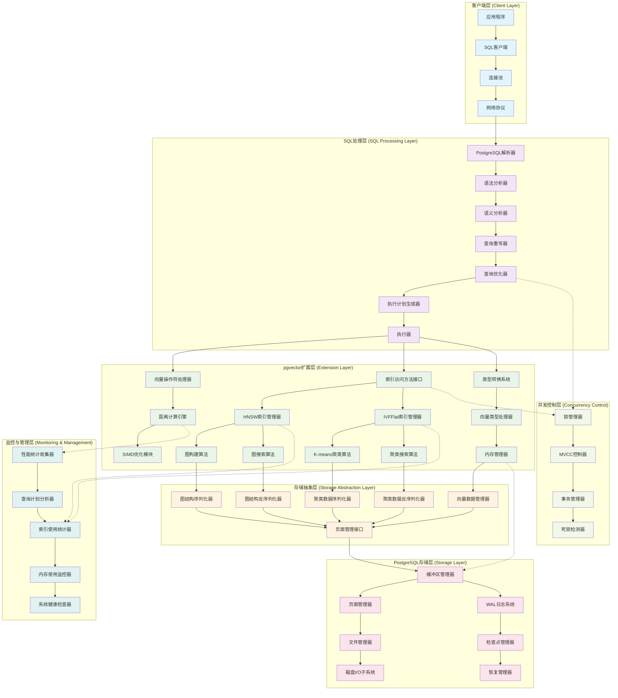

**系统架构图详细说明：**

这个增强的架构图展示了 pgvector 扩展在 PostgreSQL 生态系统中的完整七层架构和组件关系，体现了现代数据库系统的复杂性和精细化设计：

**🔹 客户端层（Client Layer）**
- **应用程序**：各种使用向量搜索的应用，如推荐系统、搜索引擎、AI应用
- **SQL客户端**：数据库连接客户端，如 psycopg2、JDBC、Go的pq等
- **连接池**：管理数据库连接的生命周期，提高连接复用率
- **网络协议**：PostgreSQL 的网络通信协议，处理客户端与服务器的通信

**🔹 SQL处理层（SQL Processing Layer）**
- **PostgreSQL解析器**：接收客户端SQL请求的入口点
- **语法分析器**：将SQL文本解析为抽象语法树（AST）
- **语义分析器**：验证SQL语义的正确性，检查表、列、函数的存在性
- **查询重写器**：应用查询重写规则，如视图展开、子查询优化
- **查询优化器**：生成最优的查询执行计划，包括索引选择和连接顺序
- **执行计划生成器**：将优化后的逻辑计划转换为物理执行计划
- **执行器**：实际执行查询计划，协调各个组件的工作

**🔹 pgvector扩展层（Extension Layer）**
这是 pgvector 的核心层，包含三个主要子系统：

*向量操作处理子系统：*
- **向量操作符处理器**：处理 `<->`、`<#>`、`<=>` 等向量操作符
- **距离计算引擎**：统一的距离计算接口，支持多种距离函数
- **SIMD优化模块**：利用现代CPU的向量指令集加速计算

*索引管理子系统：*
- **索引访问方法接口**：实现PostgreSQL标准的索引访问方法接口
- **HNSW索引管理器**：管理HNSW图索引的生命周期
- **IVFFlat索引管理器**：管理IVFFlat聚类索引的生命周期
- **图构建算法**：HNSW图的构建和维护算法
- **图搜索算法**：HNSW图上的近似最近邻搜索算法
- **K-means聚类算法**：IVFFlat索引的聚类算法
- **聚类搜索算法**：在聚类结构上的搜索算法

*类型系统子系统：*
- **类型转换系统**：处理不同向量类型间的转换
- **向量类型处理器**：管理vector、halfvec、bit、sparsevec等类型
- **内存管理器**：专门的向量数据内存管理，包括对齐和优化

**🔹 存储抽象层（Storage Abstraction Layer）**
这一层提供了存储的抽象接口，隔离了上层算法与底层存储的耦合：
- **图结构序列化器**：将HNSW图结构转换为可存储的格式
- **图结构反序列化器**：从存储格式恢复HNSW图结构
- **聚类数据序列化器**：将IVFFlat聚类数据转换为存储格式
- **聚类数据反序列化器**：从存储格式恢复聚类数据
- **向量数据管理器**：管理向量数据的存储和检索
- **页面管理接口**：与PostgreSQL页面管理系统的统一接口

**🔹 PostgreSQL存储层（Storage Layer）**
这是PostgreSQL的核心存储子系统：
- **缓冲区管理器**：管理内存中的数据页缓存，提高I/O性能
- **页面管理器**：管理8KB数据页的分配、回收和组织
- **文件管理器**：管理数据库文件的创建、扩展和删除
- **磁盘I/O子系统**：处理实际的磁盘读写操作
- **WAL日志系统**：预写日志系统，保证数据的持久性和一致性
- **检查点管理器**：定期将脏页写入磁盘，创建一致性检查点
- **恢复管理器**：在系统崩溃后利用WAL日志恢复数据

**🔹 并发控制层（Concurrency Control）**
这一层确保多用户环境下的数据一致性：
- **锁管理器**：管理各种粒度的锁（表锁、行锁、页锁等）
- **MVCC控制器**：多版本并发控制，允许读写并发执行
- **事务管理器**：管理事务的开始、提交、回滚
- **死锁检测器**：检测和解决事务间的死锁

**🔹 监控与管理层（Monitoring & Management）**
这一层提供系统的可观测性和管理能力：
- **性能统计收集器**：收集查询执行时间、I/O统计等性能指标
- **查询计划分析器**：分析查询计划的效率，识别性能瓶颈
- **索引使用统计器**：跟踪索引的使用频率和效果
- **内存使用监控器**：监控各组件的内存使用情况
- **系统健康检查器**：定期检查系统状态，预警潜在问题

**🔹 跨层交互分析：**

虚线连接表示跨层的重要交互：
1. **查询优化器 ↔ 锁管理器**：优化器需要考虑锁的开销来选择执行计划
2. **索引访问方法接口 ↔ 锁管理器**：索引操作需要获取适当的锁
3. **内存管理器 ↔ 缓冲区管理器**：向量内存管理与PostgreSQL缓冲区的协调
4. **距离计算引擎 ↔ 性能统计收集器**：收集距离计算的性能统计
5. **索引管理器 ↔ 索引使用统计器**：跟踪索引的使用情况和效果

**🔹 架构设计优势：**

1. **分层解耦**：每一层都有明确的职责边界，降低了系统复杂度
2. **标准接口**：通过标准接口实现层间通信，提高了可维护性
3. **横向扩展**：每一层内部都可以独立扩展新的组件
4. **性能优化**：在每一层都有针对性的性能优化策略
5. **可观测性**：完整的监控体系提供了系统运行的全面视图
6. **容错性**：多层的错误处理和恢复机制保证了系统的稳定性

这种精细化的分层架构使得 pgvector 能够在保持高性能的同时，提供企业级的可靠性和可维护性。

### 3.2 模块交互时序图

#### 3.2.1 索引构建时序图

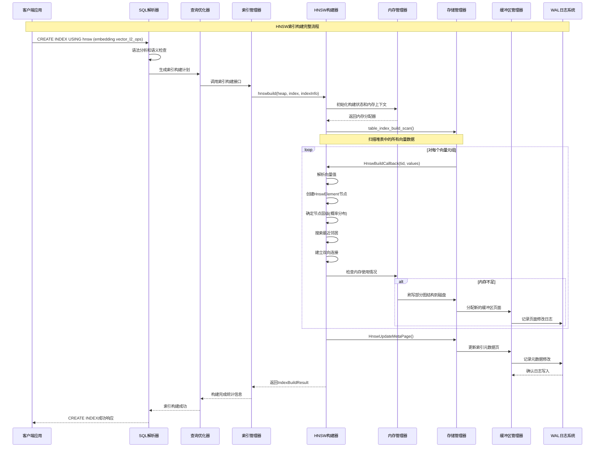

#### 3.2.2 查询执行时序图

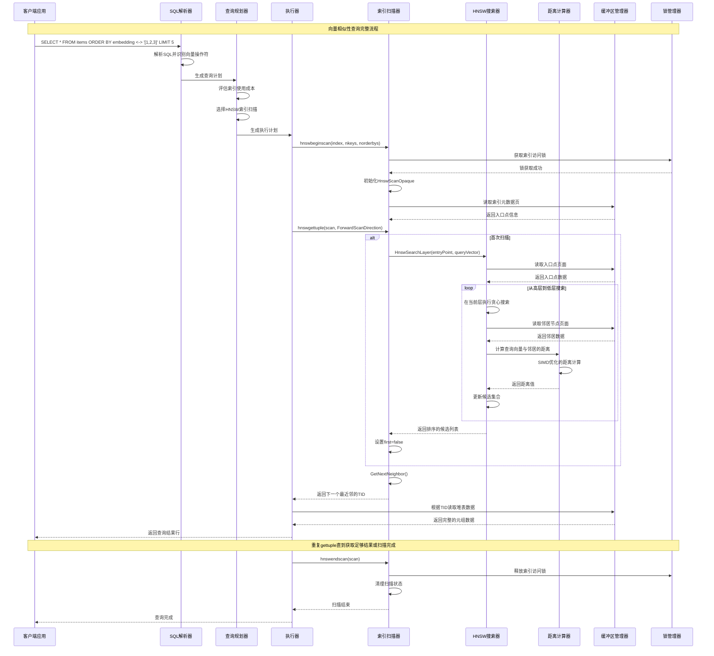

#### 3.2.3 并发操作时序图

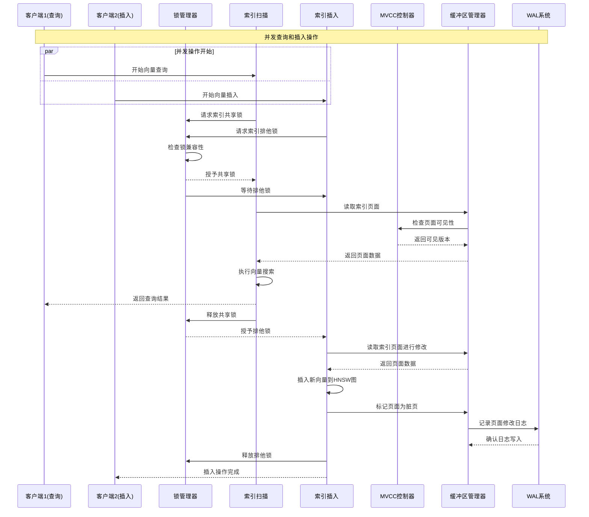

**模块交互时序图详细说明：**

这三个时序图展示了 pgvector 系统中最重要的操作流程，从不同角度揭示了系统的工作机制和复杂性。

**🔹 索引构建时序图分析：**

这个时序图展示了 HNSW 索引从创建到完成的完整生命周期：

1. **SQL 处理阶段**：
   - **语法分析**：解析 `CREATE INDEX` 语句，识别索引类型和参数
   - **语义检查**：验证表存在性、列类型兼容性、参数有效性
   - **计划生成**：创建索引构建的执行计划

2. **构建初始化阶段**：
   - **状态初始化**：创建 `HnswBuildState` 结构，设置构建参数
   - **内存管理**：初始化专用内存上下文和分配器
   - **并发控制**：获取必要的锁以保证构建过程的一致性

3. **数据扫描阶段**：
   - **表扫描**：使用 `table_index_build_scan` 遍历堆表中的所有元组
   - **向量解析**：将每个元组中的向量数据解析为内部格式
   - **有效性检查**：验证向量维度、数值有效性等

4. **图构建阶段**：
   - **节点创建**：为每个向量创建 `HnswElement` 节点
   - **层级分配**：使用概率分布确定节点的最高层级
   - **邻居搜索**：在各层中搜索最近的邻居节点
   - **连接建立**：建立双向的邻居连接关系
   - **内存管理**：监控内存使用，必要时刷写到磁盘

5. **持久化阶段**：
   - **元数据更新**：更新索引的元数据页，记录入口点等信息
   - **WAL 记录**：所有修改都记录到 WAL 日志中
   - **缓冲区管理**：通过缓冲区管理器协调内存和磁盘操作

**🔹 查询执行时序图分析：**

这个时序图展示了向量相似性查询的完整执行过程：

1. **查询解析阶段**：
   - **SQL 解析**：识别向量操作符 `<->` 和查询向量
   - **计划生成**：评估不同执行策略的成本
   - **索引选择**：决定使用 HNSW 索引进行搜索

2. **扫描初始化阶段**：
   - **锁获取**：获取索引的共享访问锁
   - **状态初始化**：创建 `HnswScanOpaque` 扫描状态
   - **元数据读取**：从索引元数据页获取入口点信息

3. **图搜索阶段**：
   - **分层搜索**：从最高层开始，逐层向下搜索
   - **贪心算法**：在每一层使用贪心策略寻找最近邻
   - **距离计算**：使用 SIMD 优化的距离计算函数
   - **候选维护**：维护大小为 `ef_search` 的候选集合

4. **结果返回阶段**：
   - **迭代返回**：通过 `gettuple` 接口迭代返回结果
   - **堆表访问**：根据 TID 从堆表读取完整的元组数据
   - **结果排序**：按距离顺序返回最近邻结果

5. **资源清理阶段**：
   - **锁释放**：释放索引访问锁
   - **状态清理**：清理扫描状态和临时数据

**🔹 并发操作时序图分析：**

这个时序图展示了 pgvector 如何处理并发的查询和插入操作：

1. **并发控制机制**：
   - **锁管理**：使用共享锁和排他锁控制并发访问
   - **MVCC 支持**：通过多版本并发控制保证读写一致性
   - **死锁避免**：合理的锁获取顺序避免死锁

2. **查询操作特点**：
   - **共享访问**：多个查询可以并发执行
   - **快照隔离**：每个查询看到一致的数据快照
   - **无阻塞读取**：读操作不会被写操作阻塞

3. **插入操作特点**：
   - **排他访问**：插入操作需要排他锁保证图结构一致性
   - **WAL 记录**：所有修改都记录到 WAL 日志
   - **原子性保证**：整个插入操作要么全部成功，要么全部失败

4. **性能优化策略**：
   - **锁粒度优化**：使用细粒度锁减少锁竞争
   - **批量操作**：支持批量插入以提高吞吐量
   - **异步写入**：WAL 写入可以异步进行

**🔹 关键设计特点：**

1. **分层处理**：每个操作都经过多个层次的处理，确保功能的完整性
2. **错误处理**：每个阶段都有相应的错误处理和回滚机制
3. **性能优化**：在关键路径上使用各种优化技术
4. **并发安全**：通过锁和 MVCC 保证多用户环境下的数据一致性
5. **可观测性**：每个阶段都有相应的监控和统计信息

**🔹 实际应用价值：**

这些时序图对于以下场景具有重要价值：
- **系统调优**：识别性能瓶颈和优化点
- **故障诊断**：理解系统行为，快速定位问题
- **容量规划**：评估系统在不同负载下的表现
- **架构设计**：为类似系统的设计提供参考
- **开发调试**：帮助开发者理解代码执行流程

### 3.3 数据流架构图

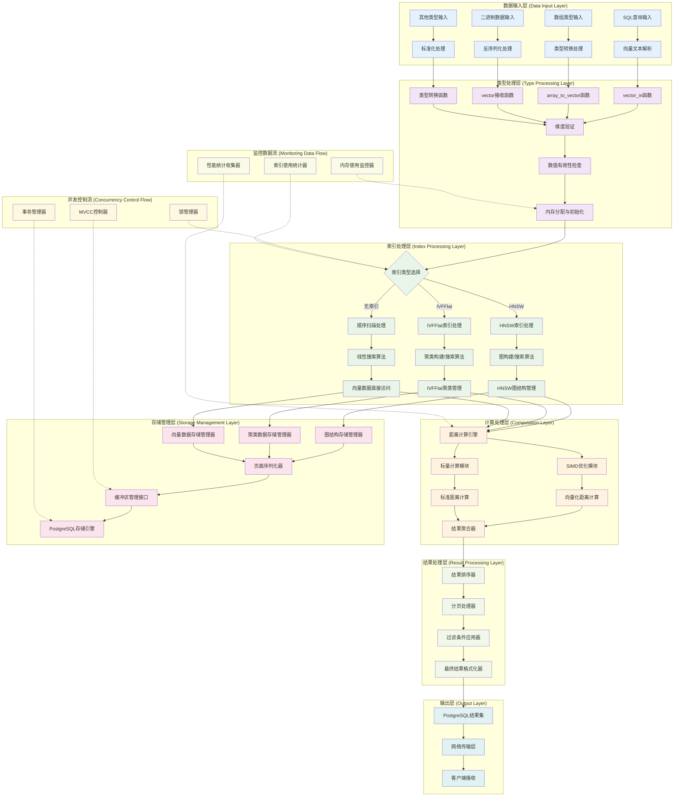

**数据流架构图详细说明：**

这个数据流架构图展示了 pgvector 中数据从输入到输出的完整处理流程，体现了现代向量数据库的分层处理思想。

**🔹 数据输入层（Data Input Layer）**
这一层处理各种形式的向量数据输入：
- **SQL查询输入**：处理 `'[1,2,3]'` 格式的文本向量
- **数组类型输入**：处理 PostgreSQL 数组类型 `ARRAY[1,2,3]`
- **二进制数据输入**：处理客户端协议传输的二进制向量数据
- **其他类型输入**：处理从其他向量类型（halfvec、sparsevec等）的转换

**🔹 类型处理层（Type Processing Layer）**
这一层负责向量数据的解析、验证和标准化：
- **解析函数**：`vector_in`、`array_to_vector` 等函数处理不同输入格式
- **维度验证**：确保向量维度在有效范围内（1-16000）
- **数值检查**：检测 NaN、无穷大等无效数值
- **内存管理**：分配和初始化向量存储空间

**🔹 索引处理层（Index Processing Layer）**
这一层根据查询类型选择合适的处理策略：
- **索引选择**：根据查询模式和数据特征选择最优索引
- **HNSW处理**：分层导航小世界图的构建和搜索
- **IVFFlat处理**：基于聚类的倒排索引处理
- **顺序扫描**：无索引时的线性搜索处理

**🔹 计算处理层（Computation Layer）**
这一层执行核心的向量计算操作：
- **距离计算引擎**：统一的距离计算接口
- **SIMD优化**：利用现代CPU的向量指令集加速计算
- **标量计算**：传统的标量计算作为备选方案
- **结果聚合**：将计算结果进行聚合和排序

**🔹 存储管理层（Storage Management Layer）**
这一层管理向量数据和索引结构的持久化：
- **图结构存储**：HNSW图的序列化和反序列化
- **聚类数据存储**：IVFFlat聚类信息的存储管理
- **向量数据存储**：原始向量数据的存储和检索
- **页面管理**：与PostgreSQL存储引擎的接口

**🔹 结果处理层（Result Processing Layer）**
这一层处理查询结果的后处理：
- **结果排序**：按距离或相似度对结果排序
- **分页处理**：实现 LIMIT 和 OFFSET 功能
- **过滤应用**：应用 WHERE 子句中的其他条件
- **格式化**：将结果转换为PostgreSQL标准格式

**🔹 输出层（Output Layer）**
这一层负责将结果返回给客户端：
- **结果集构建**：构建PostgreSQL标准结果集
- **网络传输**：通过PostgreSQL协议传输结果
- **客户端接收**：客户端接收和处理结果

**🔹 并发控制流（Concurrency Control Flow）**
虚线表示的并发控制机制：
- **锁管理**：控制索引和数据的并发访问
- **MVCC控制**：多版本并发控制保证一致性
- **事务管理**：确保操作的原子性和持久性

**🔹 监控数据流（Monitoring Data Flow）**
系统监控和统计信息的收集：
- **性能统计**：收集距离计算和查询执行的性能数据
- **内存监控**：跟踪内存使用情况和分配模式
- **索引统计**：记录索引使用频率和效果

**🔹 数据流特点分析：**

1. **分层处理**：每一层都有明确的职责，便于维护和优化
2. **并行处理**：多个层可以并行工作，提高整体性能
3. **错误传播**：错误可以在任何层被捕获和处理
4. **监控集成**：每一层都集成了监控和统计功能
5. **扩展性**：新的处理逻辑可以容易地插入到相应层中

**🔹 性能优化策略：**

1. **流水线处理**：数据在各层间流水线式处理
2. **缓存机制**：在关键层实现缓存以减少重复计算
3. **批量处理**：支持批量数据的高效处理
4. **内存池**：使用内存池减少内存分配开销
5. **预取机制**：在存储层实现数据预取

这种分层的数据流架构确保了 pgvector 能够高效、可靠地处理各种规模和类型的向量数据操作。

---

## 4. 核心模块深度分析

pgvector 的核心功能由四个主要模块组成：向量数据类型模块、HNSW 索引模块、IVFFlat 索引模块和距离计算模块。每个模块都有独特的架构设计和实现策略。

### 4.1 向量数据类型模块

#### 4.1.1 模块架构图

```mermaid
classDiagram
    class Vector {
        +int32 vl_len_
        +int16 dim
        +int16 unused
        +float[] x
        +InitVector(dim)
        +PrintVector(msg, vector)
        +vector_cmp_internal(a, b)
    }
    
    class HalfVec {
        +int32 vl_len_
        +int16 dim
        +int16 unused
        +uint16[] x
        +halfvec_to_vector()
        +vector_to_halfvec()
    }
    
    class BitVec {
        +int32 vl_len_
        +int32 bit_len
        +uint8[] data
        +hamming_distance()
        +jaccard_distance()
    }
    
    class SparseVec {
        +int32 vl_len_
        +int32 dim
        +int32 nnz
        +SparseVecElement[] x
        +sparsevec_to_vector()
        +vector_to_sparsevec()
    }
    
    Vector ||--|| HalfVec : 转换
    Vector ||--|| SparseVec : 转换
    BitVec : 独立类型
```

**向量数据类型模块架构图详细说明：**

这个类图展示了 pgvector 支持的四种主要向量类型及其相互关系，体现了类型系统的设计思想。

**🔹 Vector（单精度向量）：**
- **核心地位**：作为基础向量类型，其他类型都可以与之转换
- **存储结构**：
  - `vl_len_`：PostgreSQL varlena 头部，用于变长数据管理
  - `dim`：向量维度，最大支持 16,000 维
  - `unused`：保留字段，为未来扩展预留空间
  - `x[]`：实际的浮点数数组，使用 flexible array member
- **关键方法**：
  - `InitVector()`：创建并初始化向量
  - `PrintVector()`：调试用的向量打印函数
  - `vector_cmp_internal()`：向量比较函数，支持排序操作

**🔹 HalfVec（半精度向量）：**
- **设计目的**：减少内存使用，存储大小是 Vector 的一半
- **存储优势**：每个元素使用 16 位而非 32 位，适合大规模数据
- **转换机制**：
  - 与 Vector 类型双向转换
  - 转换过程中处理精度损失
  - 支持隐式和显式转换
- **应用场景**：内存受限环境、大规模向量存储

**🔹 BitVec（二进制向量）：**
- **独特性**：独立的类型系统，不与其他类型直接转换
- **存储效率**：每个维度只需 1 位，存储密度最高
- **专用距离**：
  - `hamming_distance()`：汉明距离，计算不同位的数量
  - `jaccard_distance()`：Jaccard 距离，用于集合相似性
- **应用场景**：图像哈希、文档指纹、布隆过滤器

**🔹 SparseVec（稀疏向量）：**
- **存储策略**：只存储非零元素，节省空间
- **数据结构**：
  - `dim`：向量的总维度
  - `nnz`：非零元素的数量
  - `x[]`：存储 (index, value) 对的数组
- **转换支持**：与 Vector 类型双向转换，自动处理稀疏性
- **应用场景**：文本向量、特征向量、推荐系统

**🔹 类型转换关系：**

1. **Vector ↔ HalfVec**：
   - 精度转换：32位 ↔ 16位浮点数
   - 自动处理精度损失和溢出
   - 支持批量转换操作

2. **Vector ↔ SparseVec**：
   - 密集 ↔ 稀疏表示转换
   - 自动过滤零值元素
   - 保持数值精度

3. **BitVec 独立性**：
   - 不与其他类型直接转换
   - 需要通过专门的量化函数（如 `binary_quantize`）
   - 保持二进制语义的完整性

**🔹 设计原则：**

- **类型安全**：每种类型都有明确的语义和用途
- **性能优化**：根据不同场景选择最适合的存储格式
- **互操作性**：支持类型间的合理转换
- **扩展性**：预留接口便于添加新的向量类型
- **兼容性**：完全兼容 PostgreSQL 的类型系统

这种多类型设计使得 pgvector 能够适应不同的应用场景和性能需求，从高精度科学计算到大规模推荐系统都能提供最优的存储和计算方案。

#### 4.1.2 核心数据结构

**Vector 结构体定义：**
```c
// 位置：src/vector.h
typedef struct Vector
{
    int32    vl_len_;     // PostgreSQL varlena 头部
    int16    dim;         // 向量维度
    int16    unused;      // 保留字段
    float    x[FLEXIBLE_ARRAY_MEMBER];  // 向量数据
} Vector;
```

**Vector 结构体代码详细说明：**

这是 pgvector 的核心数据结构，定义了向量在内存中的存储格式：

1. **PostgreSQL 兼容性设计**：
   - `int32 vl_len_`：varlena 头部，遵循 PostgreSQL 变长数据类型规范
   - 包含数据长度信息，支持 TOAST 压缩和外部存储
   - 确保与 PostgreSQL 内存管理系统完全兼容

2. **向量元数据**：
   - `int16 dim`：向量维度，支持 1-16000 维
   - `int16 unused`：保留字段，为未来扩展预留空间
   - 使用 16 位整数节省内存空间

3. **数据存储**：
   - `float x[FLEXIBLE_ARRAY_MEMBER]`：实际的向量数据数组
   - 使用 C99 柔性数组成员，支持动态大小
   - 单精度浮点数提供良好的精度和性能平衡

4. **内存布局优化**：
   - 结构体紧凑排列，减少内存碎片
   - 数据对齐优化，支持 SIMD 指令加速
   - 总大小 = 8 字节头部 + 4 × dim 字节数据

**关键宏定义：**
```c
#define VECTOR_MAX_DIM 16000
#define VECTOR_SIZE(_dim) (offsetof(Vector, x) + sizeof(float)*(_dim))
#define DatumGetVector(x) ((Vector *) PG_DETOAST_DATUM(x))
```

**宏定义代码详细说明：**

这些宏定义提供了向量操作的基础工具：

1. **维度限制**：
   - `VECTOR_MAX_DIM 16000`：定义向量的最大维度
   - 平衡内存使用和实用性的考虑
   - 足够支持大多数机器学习应用场景

2. **大小计算**：
   - `VECTOR_SIZE(_dim)`：计算指定维度向量的总字节数
   - `offsetof(Vector, x)`：获取数据数组的偏移量
   - `sizeof(float)*(_dim)`：计算数据部分的大小
   - 用于内存分配和边界检查

3. **类型转换**：
   - `DatumGetVector(x)`：安全地将 Datum 转换为 Vector 指针
   - `PG_DETOAST_DATUM(x)`：自动处理 TOAST 数据解压缩
   - 确保获取的是完整的、可访问的向量数据

#### 4.1.3 类型转换机制

**向量类型转换时序图：**
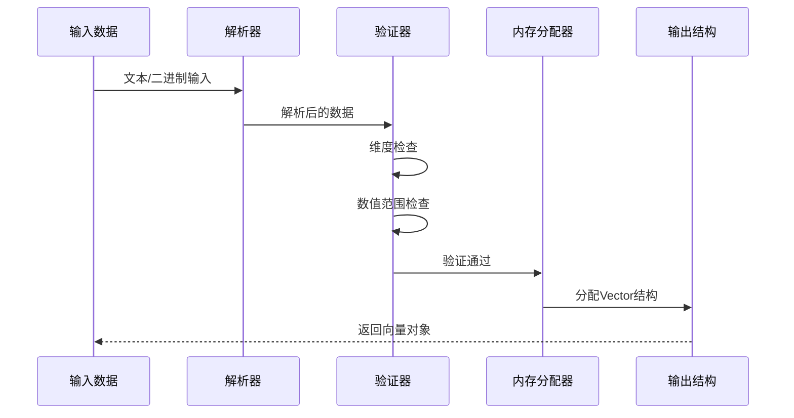

**向量类型转换时序图详细说明：**

这个时序图展示了向量数据从原始输入到最终 Vector 结构体的完整转换过程，体现了 pgvector 严格的数据验证和处理机制。

**🔹 转换流程详解：**

1. **输入数据阶段**：
   - **文本输入**：如 `'[1.0, 2.5, 3.7]'` 格式的字符串
   - **二进制输入**：通过 `COPY` 命令或客户端协议传入的二进制数据
   - **数组输入**：PostgreSQL 数组类型转换为向量类型
   - **其他类型转换**：从 `halfvec`、`sparsevec` 等类型转换

2. **解析器处理**：
   - **词法分析**：识别 `[`、`]`、`,` 等分隔符
   - **数值解析**：将字符串转换为浮点数，处理科学计数法
   - **格式验证**：检查输入格式是否符合向量语法规范
   - **错误处理**：对格式错误给出明确的错误信息

3. **验证器检查**：
   - **维度验证**：
     - 检查维度是否在 1 到 `VECTOR_MAX_DIM` (16000) 范围内
     - 验证与表定义的类型修饰符是否匹配
     - 处理动态维度的情况（无类型修饰符时）
   - **数值范围检查**：
     - 检测 NaN（Not a Number）值
     - 检测正负无穷大值
     - 验证数值是否在浮点数有效范围内
     - 处理精度溢出情况

4. **内存分配器**：
   - **大小计算**：使用 `VECTOR_SIZE(dim)` 宏计算所需内存
   - **内存分配**：调用 `palloc0()` 分配并清零内存
   - **对齐处理**：确保内存对齐以优化访问性能
   - **TOAST 支持**：处理大向量的 TOAST 存储

5. **输出结构生成**：
   - **头部设置**：设置 PostgreSQL varlena 头部信息
   - **维度赋值**：设置向量的维度字段
   - **数据复制**：将解析后的浮点数复制到向量数组中
   - **返回对象**：返回完整的 Vector 结构体

**🔹 关键验证点：**

- **格式完整性**：确保输入格式完全符合规范
- **数据有效性**：保证所有数值都是有效的浮点数
- **维度一致性**：维护类型系统的完整性
- **内存安全性**：防止缓冲区溢出和内存泄漏

**🔹 错误处理机制：**

- **早期检测**：在解析阶段就发现并报告错误
- **详细信息**：提供具体的错误位置和原因
- **资源清理**：确保错误情况下的内存正确释放
- **事务安全**：错误不会影响数据库的一致性

**🔹 性能优化：**

- **单次分配**：一次性分配所需的全部内存
- **零拷贝**：在可能的情况下避免不必要的数据复制
- **SIMD 准备**：确保数据对齐以支持 SIMD 指令
- **缓存友好**：优化内存布局以提高缓存命中率

这个转换过程确保了 pgvector 能够安全、高效地处理各种来源的向量数据，同时保持与 PostgreSQL 类型系统的完全兼容。

#### 4.1.4 关键函数实现

**InitVector 函数：**
```c
// 位置：src/vector.c
Vector *InitVector(int dim)
{
    Vector *result;
    int size;
    
    CheckDim(dim);  // 维度验证
    
    size = VECTOR_SIZE(dim);
    result = (Vector *) palloc0(size);  // 分配并清零内存
    SET_VARSIZE(result, size);          // 设置varlena大小
    result->dim = dim;                  // 设置维度
    
    return result;
}
```

**InitVector 函数代码详细说明：**

这是向量对象的工厂函数，负责创建和初始化新的向量实例：

1. **函数参数和返回值**：
   - `int dim`：要创建的向量维度
   - 返回 `Vector *`：指向新创建向量的指针
   - 失败时通过 PostgreSQL 错误机制抛出异常

2. **维度验证**：
   - `CheckDim(dim)`：验证维度是否在有效范围内
   - 检查 `1 <= dim <= VECTOR_MAX_DIM`
   - 无效维度时抛出清晰的错误信息

3. **内存大小计算**：
   - `size = VECTOR_SIZE(dim)`：使用宏计算所需内存大小
   - 包括 varlena 头部、元数据和向量数据的总大小
   - 确保内存分配的准确性

4. **内存分配和初始化**：
   - `palloc0(size)`：使用 PostgreSQL 内存分配器
   - `palloc0` 自动将分配的内存清零
   - 在当前内存上下文中分配，支持自动清理

5. **结构体初始化**：
   - `SET_VARSIZE(result, size)`：设置 PostgreSQL varlena 头部
   - 记录数据的总大小，支持 TOAST 和序列化
   - `result->dim = dim`：设置向量维度字段

6. **内存管理特点**：
   - 使用 PostgreSQL 内存上下文系统
   - 支持事务回滚时的自动内存清理
   - 与 PostgreSQL 的垃圾回收机制集成

**功能说明：**
- 验证维度范围（1 到 VECTOR_MAX_DIM）
- 分配适当大小的内存
- 初始化 PostgreSQL varlena 头部
- 返回可用的 Vector 结构体

### 4.2 HNSW 索引模块

#### 4.2.1 HNSW 算法原理

HNSW（Hierarchical Navigable Small World）是一种基于图的近似最近邻搜索算法：

1. **分层结构**：构建多层图，上层稀疏，下层密集
2. **导航性**：从上层开始搜索，逐层下降
3. **小世界特性**：节点间连接具有小世界网络特征

#### 4.2.2 HNSW 模块架构

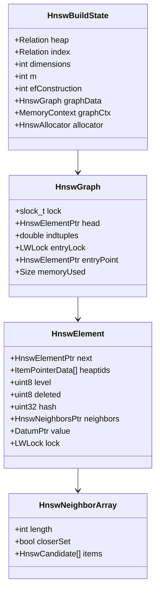

**HNSW 模块架构图详细说明：**

这个类图展示了 HNSW 索引的核心数据结构和它们之间的关系，体现了分层导航小世界图的设计思想。

**🔹 HnswBuildState（构建状态管理）：**
- **职责**：管理整个 HNSW 索引的构建过程
- **核心字段**：
  - `heap/index`：源表和索引的关系对象
  - `dimensions`：向量维度，影响距离计算和内存分配
  - `m`：每层的最大连接数，控制图的密度和搜索性能
  - `efConstruction`：构建时的候选列表大小，影响构建质量和时间
  - `graphData`：实际的图数据结构
  - `graphCtx`：专用内存上下文，便于内存管理
  - `allocator`：自定义内存分配器，支持相对指针和绝对指针两种模式

**🔹 HnswGraph（图结构管理）：**
- **核心作用**：维护整个 HNSW 图的全局状态
- **并发控制**：
  - `lock`：自旋锁，保护图的基本结构
  - `entryLock`：入口点锁，保护图的入口点更新
- **图状态**：
  - `head`：图中第一个元素的指针
  - `entryPoint`：图的入口点，搜索的起始位置
  - `indtuples`：索引中的元组数量，用于统计
- **内存管理**：
  - `memoryUsed/memoryTotal`：跟踪内存使用情况
  - 支持内存溢出时的磁盘刷写机制

**🔹 HnswElement（图节点）：**
- **图节点表示**：HNSW 图中的每个向量对应一个元素
- **链表结构**：
  - `next`：指向下一个元素，形成链表便于遍历
- **数据关联**：
  - `heaptids[]`：指向堆表中实际数据的指针数组
  - `heaptidsLength`：有效 heaptid 的数量
  - `value`：向量数据的指针
- **图属性**：
  - `level`：节点在图中的最高层级
  - `deleted`：标记节点是否已删除
  - `hash`：向量的哈希值，用于快速比较
- **邻居管理**：
  - `neighbors`：指向邻居数组的指针
  - `neighborOffno/neighborPage`：邻居信息在磁盘上的位置
- **并发控制**：
  - `lock`：节点级别的锁，保护节点数据的一致性

**🔹 HnswNeighborArray（邻居数组）：**
- **邻居存储**：存储某个层级上的所有邻居信息
- **数组管理**：
  - `length`：当前邻居数量
  - `closerSet`：标记是否已设置更近的邻居
  - `items[]`：邻居候选数组，包含元素指针和距离
- **动态调整**：支持邻居关系的动态更新和优化

**🔹 架构关系分析：**

1. **HnswBuildState → HnswGraph**：
   - 构建状态包含并管理图结构
   - 提供构建过程中的全局配置和状态

2. **HnswGraph → HnswElement**：
   - 图结构管理所有的节点元素
   - 维护节点间的全局关系和入口点

3. **HnswElement → HnswNeighborArray**：
   - 每个节点在不同层级都有对应的邻居数组
   - 支持分层的邻居关系管理

**🔹 设计优势：**

- **分层设计**：支持 HNSW 算法的分层搜索策略
- **内存效率**：使用相对指针减少内存占用
- **并发安全**：多级锁机制支持并发访问
- **可扩展性**：支持图结构的动态增长和修改
- **持久化**：支持图结构的磁盘存储和恢复

**🔹 性能考虑：**

- **缓存友好**：紧凑的内存布局提高缓存命中率
- **锁粒度**：细粒度锁减少并发冲突
- **内存池**：自定义分配器减少内存碎片
- **批量操作**：支持批量更新以提高效率

这种架构设计使得 HNSW 索引能够高效地支持大规模向量数据的近似最近邻搜索，同时保持良好的并发性能和内存效率。

#### 4.2.3 HNSW 构建算法

**图构建时序图：**
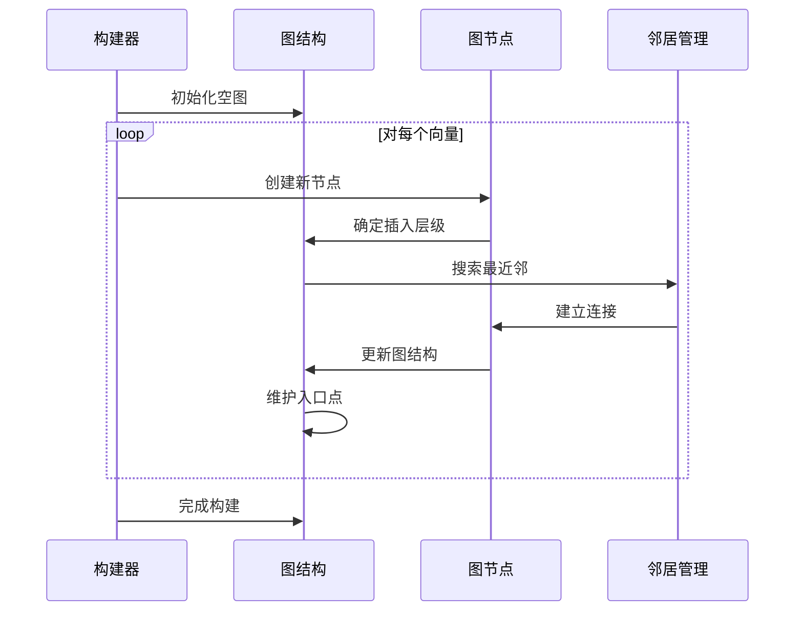

**HNSW 图构建时序图详细说明：**

这个时序图展示了 HNSW 索引构建过程中各个组件之间的交互，体现了分层导航小世界图的构建策略。

**🔹 构建流程详解：**

1. **初始化空图**：
   - 创建 `HnswGraph` 结构
   - 设置图的基本参数（m、efConstruction、ml 等）
   - 初始化内存分配器和锁机制
   - 准备并发构建的基础设施

2. **向量处理循环**：
   对表中的每个向量执行以下步骤：

   **a) 创建新节点**：
   - 分配 `HnswElement` 结构
   - 设置向量数据和堆表指针
   - 计算向量的哈希值用于快速比较
   - 初始化节点的基本属性

   **b) 确定插入层级**：
   - 使用概率分布确定节点的最高层级
   - 层级分布遵循 `ml = 1/ln(2.0)` 的指数分布
   - 高层级节点较少，形成稀疏的导航层
   - 所有节点都存在于第 0 层（基础层）

   **c) 搜索最近邻**：
   - 从当前入口点开始搜索
   - 在每一层使用贪心搜索算法
   - 维护大小为 `efConstruction` 的候选列表
   - 逐层下降直到目标层级

   **d) 建立连接**：
   - 在每一层选择最近的 `m` 个邻居
   - 使用启发式算法优化连接质量
   - 建立双向连接关系
   - 处理连接数超限时的剪枝

   **e) 更新图结构**：
   - 将新节点插入到图的链表中
   - 更新相关节点的邻居关系
   - 维护图的连通性和平衡性

   **f) 维护入口点**：
   - 如果新节点层级更高，更新图的入口点
   - 确保入口点始终是最高层级的节点
   - 处理入口点更新时的并发安全

3. **完成构建**：
   - 更新索引的元数据页
   - 刷写内存中的图结构到磁盘
   - 释放临时资源和内存
   - 返回构建统计信息

**🔹 关键算法特点：**

- **概率层级分配**：
  - 使用指数分布确定节点层级
  - 保证图的分层特性和搜索效率
  - 平衡构建时间和查询性能

- **贪心搜索策略**：
  - 在每层使用局部最优选择
  - 通过 `efConstruction` 参数控制搜索质量
  - 平衡构建时间和图质量

- **启发式连接选择**：
  - 不仅考虑距离，还考虑连接的多样性
  - 避免形成孤立的子图
  - 提高图的导航性能

- **动态入口点维护**：
  - 始终保持最高层级节点作为入口点
  - 确保搜索能够从最稀疏层开始
  - 优化长距离导航的效率

**🔹 并发构建支持：**

- **分阶段锁定**：
  - 图级锁保护全局结构
  - 节点级锁保护局部修改
  - 入口点锁保护关键更新

- **内存管理**：
  - 使用内存池减少分配开销
  - 支持内存溢出时的磁盘刷写
  - 动态调整内存使用策略

- **进度跟踪**：
  - 提供构建进度的实时反馈
  - 支持构建过程的中断和恢复
  - 记录详细的构建统计信息

**🔹 性能优化策略：**

- **批量处理**：支持批量插入以减少锁竞争
- **预分配内存**：减少动态内存分配的开销
- **SIMD 优化**：在距离计算中使用向量指令
- **缓存优化**：优化数据布局以提高缓存命中率

这个构建过程确保了 HNSW 图既保持良好的搜索性能，又能够高效地处理大规模向量数据的插入和更新。

**核心构建函数：**
```c
// 位置：src/hnswbuild.c
static void HnswBuildCallback(Relation index, ItemPointer tid, 
                             Datum *values, bool *isnull, 
                             bool tupleIsAlive, void *state)
{
    HnswBuildState *buildstate = (HnswBuildState *) state;
    Datum value;
    HnswElement element;
    
    // 检查并标准化向量值
    if (!HnswFormIndexValue(&value, values, isnull, 
                           buildstate->typeInfo, &buildstate->support))
        return;
    
    // 创建新的图节点
    element = HnswInitElement(buildstate->hnswarea, tid, 
                             buildstate->m, buildstate->ml, 
                             buildstate->maxLevel, &buildstate->allocator);
    
    // 在图中查找并建立连接
    HnswFindElementNeighbors(buildstate->hnswarea, element, 
                            buildstate->graph->entryPoint, index, 
                            &buildstate->support, buildstate->m, 
                            buildstate->efConstruction, false);
    
    // 更新统计信息
    buildstate->indtuples++;
}
```

**HnswBuildCallback 函数代码详细说明：**

这是 HNSW 索引构建过程中的核心回调函数，为每个表中的向量创建图节点：

1. **函数签名和参数**：
   - `Relation index`：目标索引的关系对象
   - `ItemPointer tid`：堆表中元组的标识符
   - `Datum *values, bool *isnull`：元组的列值和空值标记
   - `bool tupleIsAlive`：元组是否存活（MVCC）
   - `void *state`：构建状态指针

2. **状态转换和初始化**：
   - `HnswBuildState *buildstate = (HnswBuildState *) state`：
   - 将通用指针转换为具体的构建状态结构
   - 包含图数据、参数配置、内存管理等信息

3. **向量值处理**：
   - `HnswFormIndexValue()`：提取并验证向量值
   - 处理 NULL 值、类型转换、维度验证
   - 标准化向量数据格式
   - 失败时跳过当前元组

4. **图节点创建**：
   - `HnswInitElement()`：创建新的 HNSW 图节点
   - `buildstate->hnswarea`：内存区域指针
   - `tid`：关联的堆表元组标识符
   - `buildstate->m, buildstate->ml, buildstate->maxLevel`：图参数
   - `&buildstate->allocator`：内存分配器

5. **邻居关系建立**：
   - `HnswFindElementNeighbors()`：为新节点寻找邻居
   - `buildstate->graph->entryPoint`：图的当前入口点
   - `buildstate->efConstruction`：构建时的候选列表大小
   - `false`：非插入模式（构建模式）

6. **统计信息更新**：
   - `buildstate->indtuples++`：增加索引元组计数
   - 用于构建进度跟踪和最终统计

#### 4.2.4 HNSW 搜索算法

**搜索算法实现：**
```c
// 位置：src/hnswscan.c
List *HnswSearchLayer(char *base, HnswQuery *q, List *ep, int ef, int lc,
                     Relation index, HnswSupport *support, int m,
                     bool inserting, HnswElement skipElement,
                     visited_hash *v, pairingheap **discarded,
                     bool initVisited, int64 *tuples)
{
    pairingheap *w;      // 候选集合
    pairingheap *candidates;  // 动态候选列表
    
    // 初始化搜索结构
    w = pairingheap_allocate(HnswSearchCandidateComparator, NULL);
    candidates = pairingheap_allocate(HnswSearchCandidateComparator, NULL);
    
    // 将入口点加入候选集
    foreach(lc, ep)
    {
        HnswSearchCandidate *sc = HnswEntryCandidate(base, lfirst(lc), 
                                                    q, index, support, true);
        pairingheap_add(w, &sc->w_node);
        pairingheap_add(candidates, &sc->c_node);
    }
    
    // 贪心搜索
    while (!pairingheap_is_empty(candidates))
    {
        HnswSearchCandidate *c = HnswGetSearchCandidate(c_node,
                                    pairingheap_remove_first(candidates));
        
        // 检查是否需要继续搜索
        if (c->distance > lowerBound)
            break;
            
        // 遍历当前节点的邻居
        HnswNeighborArray *neighbors = HnswGetNeighbors(base, c->element, lc);
        for (int i = 0; i < neighbors->length; i++)
        {
            HnswElement neighbor = HnswPtrAccess(base, neighbors->items[i].element);
            
            // 计算到邻居的距离
            double distance = HnswGetDistance(q, neighbor, support);
            
            // 更新候选集
            if (distance < lowerBound || pairingheap_size(w) < ef)
            {
                HnswSearchCandidate *sc = CreateSearchCandidate(neighbor, distance);
                pairingheap_add(w, &sc->w_node);
                pairingheap_add(candidates, &sc->c_node);
            }
        }
    }
    
    return ExtractClosestCandidates(w, ef);
}
```

**HnswSearchLayer 函数代码详细说明：**

这是 HNSW 算法的核心搜索函数，实现了在单层图上的贪心搜索：

1. **函数参数详解**：
   - `char *base`：内存基址，用于相对指针计算
   - `HnswQuery *q`：查询向量和相关信息
   - `List *ep`：入口点列表
   - `int ef`：候选列表的最大大小
   - `int lc`：当前搜索的层级
   - `Relation index`：索引关系对象
   - `HnswSupport *support`：距离函数支持结构

2. **数据结构初始化**：
   - `pairingheap *w`：结果候选集，按距离排序
   - `pairingheap *candidates`：动态候选列表，用于扩展搜索
   - 使用配对堆实现高效的优先队列操作

3. **入口点处理**：
   - `foreach(lc, ep)`：遍历所有入口点
   - `HnswEntryCandidate()`：为每个入口点创建搜索候选
   - 同时加入结果集和动态候选列表

4. **贪心搜索主循环**：
   - `while (!pairingheap_is_empty(candidates))`：持续搜索直到候选列表为空
   - `pairingheap_remove_first(candidates)`：取出距离最近的候选
   - `if (c->distance > lowerBound) break`：剪枝条件，停止无效搜索

5. **邻居扩展**：
   - `HnswGetNeighbors()`：获取当前节点的邻居数组
   - `HnswPtrAccess()`：通过相对指针访问邻居节点
   - `HnswGetDistance()`：计算查询向量到邻居的距离

6. **候选集更新**：
   - `distance < lowerBound || pairingheap_size(w) < ef`：更新条件
   - 距离更近或候选集未满时添加新候选
   - 维护候选集的大小限制和质量

7. **结果提取**：
   - `ExtractClosestCandidates(w, ef)`：从候选集提取最近的 ef 个结果
   - 返回按距离排序的候选列表

### 4.3 IVFFlat 索引模块

#### 4.3.1 IVFFlat 算法原理

IVFFlat（Inverted File with Flat compression）基于聚类的索引方法：

1. **聚类阶段**：使用 K-means 将向量分为多个簇
2. **索引阶段**：为每个簇创建倒排列表
3. **查询阶段**：只搜索最近的几个簇

#### 4.3.2 IVFFlat 模块架构

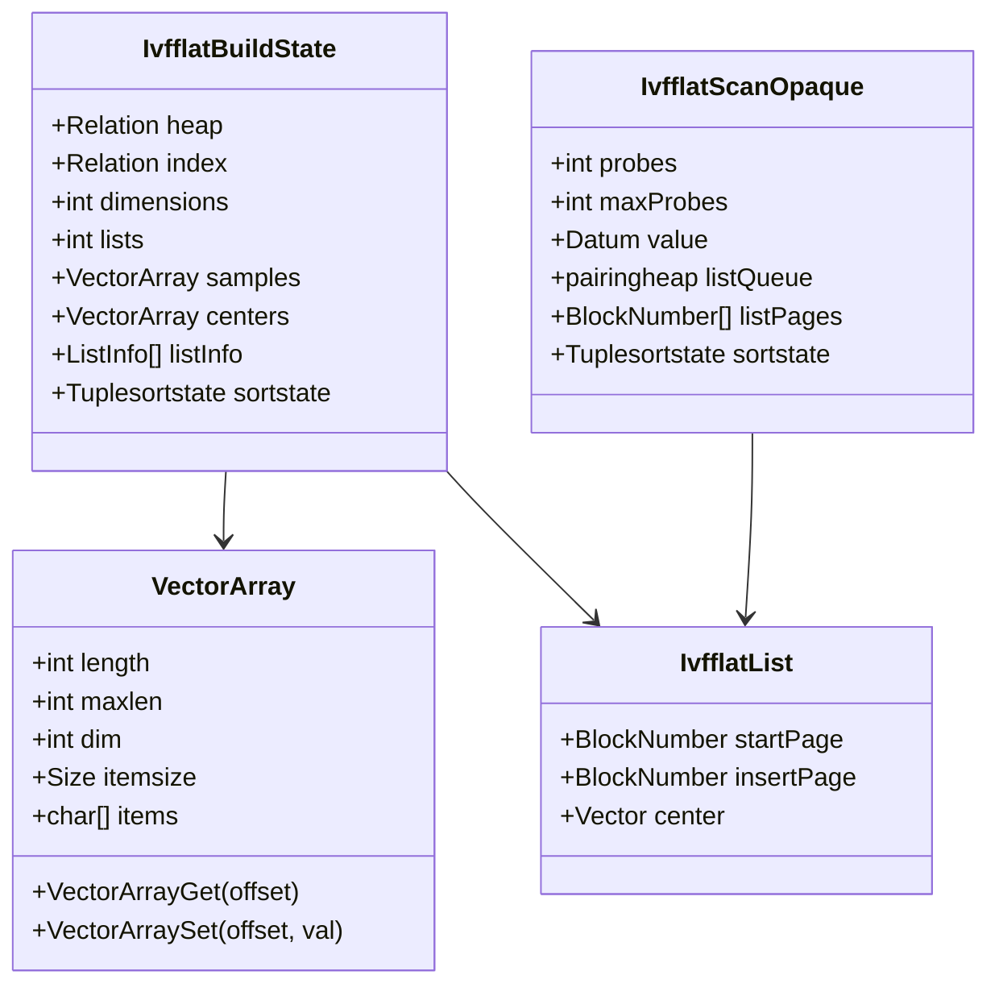

**IVFFlat 模块架构图详细说明：**

这个类图展示了 IVFFlat（Inverted File with Flat compression）索引的核心数据结构，体现了基于聚类的倒排索引设计思想。

**🔹 IvfflatBuildState（构建状态管理）：**
- **核心职责**：管理整个 IVFFlat 索引的构建过程
- **基础信息**：
  - `heap/index`：源表和目标索引的关系对象
  - `dimensions`：向量维度，影响聚类算法和存储布局
  - `lists`：聚类数量，是 IVFFlat 的核心参数
- **数据管理**：
  - `samples`：用于 K-means 聚类的样本数据
  - `centers`：K-means 算法计算出的聚类中心
  - `listInfo[]`：每个聚类的元数据信息（起始页、插入页等）
- **排序支持**：
  - `sortstate`：PostgreSQL 的排序状态，用于处理大量数据
  - `tupdesc`：元组描述符，定义排序的数据格式
- **统计信息**：
  - `indtuples/reltuples`：索引和表的元组数量统计

**🔹 VectorArray（向量数组）：**
- **设计目的**：高效存储和管理大量向量数据
- **容量管理**：
  - `length`：当前存储的向量数量
  - `maxlen`：数组的最大容量
  - `dim`：每个向量的维度
  - `itemsize`：每个向量项的字节大小
- **数据存储**：
  - `items`：实际的向量数据存储区域
  - 使用连续内存布局提高缓存性能
- **访问接口**：
  - `VectorArrayGet()`：获取指定位置的向量
  - `VectorArraySet()`：设置指定位置的向量
  - 支持类型安全的向量访问

**🔹 IvfflatList（聚类列表）：**
- **聚类表示**：每个聚类对应一个 IvfflatList 结构
- **存储管理**：
  - `startPage`：聚类数据的起始页面
  - `insertPage`：当前插入位置的页面
  - 支持聚类数据的动态增长
- **聚类中心**：
  - `center`：该聚类的中心向量
  - 用于计算查询向量到聚类的距离
  - 决定查询时是否搜索该聚类

**🔹 IvfflatScanOpaque（扫描状态）：**
- **查询管理**：管理 IVFFlat 索引的查询执行状态
- **搜索参数**：
  - `probes`：当前查询要搜索的聚类数量
  - `maxProbes`：最大允许搜索的聚类数量
  - `value`：查询向量的值
- **聚类选择**：
  - `listQueue`：按距离排序的聚类优先队列
  - `listPages[]`：选中的聚类页面数组
  - `lists`：聚类的详细信息数组
- **结果处理**：
  - `sortstate`：对搜索结果进行排序
  - `vslot/mslot`：用于数据交换的槽位
  - `bas`：缓冲区访问策略

**🔹 架构关系分析：**

1. **IvfflatBuildState → VectorArray**：
   - 构建状态使用向量数组存储样本和聚类中心
   - 支持大规模数据的高效处理

2. **IvfflatBuildState → IvfflatList**：
   - 构建过程创建和管理所有聚类列表
   - 维护聚类的元数据和存储信息

3. **IvfflatScanOpaque → IvfflatList**：
   - 查询过程访问聚类信息进行搜索
   - 根据距离选择要搜索的聚类

**🔹 设计优势：**

- **可扩展性**：
  - 支持任意数量的聚类
  - 动态调整聚类大小和数量
  - 适应不同规模的数据集

- **内存效率**：
  - VectorArray 使用紧凑的内存布局
  - 支持大数据集的外部排序
  - 优化内存使用和缓存性能

- **查询优化**：
  - 通过聚类选择减少搜索空间
  - 支持自适应的 probes 数量调整
  - 平衡查询速度和召回率

- **并发支持**：
  - 支持并行的聚类构建
  - 多个查询可以并发执行
  - 线程安全的数据结构设计

**🔹 性能特征：**

- **构建性能**：
  - K-means 算法的时间复杂度相对较低
  - 支持采样以减少聚类时间
  - 并行构建提高大数据集的处理速度

- **查询性能**：
  - 通过聚类选择大幅减少搜索范围
  - probes 参数允许精度和速度的权衡
  - 适合大规模数据的快速近似搜索

- **存储效率**：
  - 聚类中心的存储开销相对较小
  - 倒排列表的紧凑存储
  - 支持数据压缩和优化

这种架构设计使得 IVFFlat 索引特别适合处理大规模向量数据，在保持合理构建时间的同时提供良好的查询性能。

#### 4.3.3 K-means 聚类实现

**聚类算法时序图：**
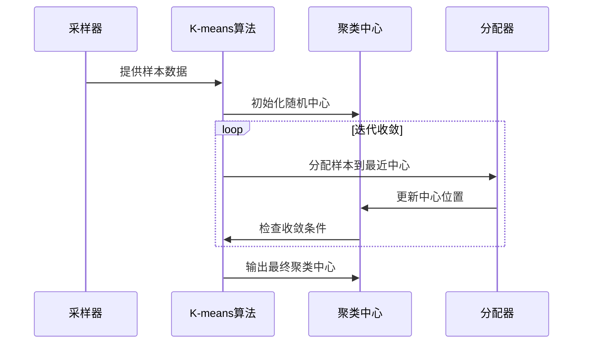

**K-means 聚类算法时序图详细说明：**

这个时序图展示了 IVFFlat 索引构建过程中 K-means 聚类算法的完整执行流程，体现了无监督学习在向量索引中的应用。

**🔹 聚类流程详解：**

1. **采样阶段**：
   - **数据采集**：从原始向量数据中采样代表性样本
   - **采样策略**：
     - 使用水库采样算法保证随机性
     - 采样大小通常为 `min(50000, rows * 0.1)`
     - 确保样本覆盖数据的分布特征
   - **质量控制**：
     - 过滤无效向量（NULL、NaN 等）
     - 确保采样数据的维度一致性
     - 处理稀疏向量的特殊情况

2. **初始化聚类中心**：
   - **K-means++ 算法**：
     - 第一个中心随机选择
     - 后续中心基于距离概率选择
     - 确保初始中心的良好分布
   - **中心验证**：
     - 检查中心向量的有效性
     - 避免重复或过近的中心
     - 处理维度不匹配的情况

3. **迭代优化过程**：
   每次迭代包含以下步骤：

   **a) 样本分配**：
   - 计算每个样本到所有聚类中心的距离
   - 将样本分配给最近的聚类中心
   - 使用高效的距离计算（SIMD 优化）
   - 处理距离相等的边界情况

   **b) 中心更新**：
   - 计算每个聚类内所有样本的质心
   - 更新聚类中心为新的质心位置
   - 处理空聚类的特殊情况
   - 维护数值稳定性

   **c) 收敛检查**：
   - 计算中心位置的变化量
   - 检查是否满足收敛条件
   - 限制最大迭代次数（通常 20 次）
   - 记录收敛统计信息

4. **输出最终结果**：
   - 返回优化后的聚类中心
   - 计算聚类质量指标（如惯性）
   - 生成聚类分配信息
   - 准备索引构建的后续步骤

**🔹 算法优化策略：**

- **距离计算优化**：
  - 使用 SIMD 指令加速向量运算
  - 缓存友好的内存访问模式
  - 避免重复的距离计算

- **收敛加速**：
  - 自适应的收敛阈值
  - 早期停止策略
  - 增量式中心更新

- **内存管理**：
  - 流式处理大规模数据
  - 临时内存的高效使用
  - 避免内存碎片

- **并行化支持**：
  - 样本分配的并行计算
  - 中心更新的并行归约
  - 线程安全的数据结构

**🔹 质量保证机制：**

- **数值稳定性**：
  - 使用双精度浮点数进行累加
  - 处理数值溢出和下溢
  - 避免除零错误

- **聚类有效性**：
  - 检测和处理空聚类
  - 确保聚类中心的合理性
  - 验证聚类结果的质量

- **错误处理**：
  - 优雅处理异常情况
  - 提供详细的错误信息
  - 支持算法的回退策略

**🔹 性能特征：**

- **时间复杂度**：O(n × k × d × i)
  - n：样本数量
  - k：聚类数量
  - d：向量维度
  - i：迭代次数

- **空间复杂度**：O(n × d + k × d)
  - 主要由样本数据和聚类中心占用

- **收敛性**：
  - 通常在 5-15 次迭代内收敛
  - 收敛速度与数据分布相关
  - K-means++ 初始化显著提高收敛速度

**🔹 实际应用考虑：**

- **聚类数量选择**：
  - 小于 1M 行：`rows / 1000`
  - 大于 1M 行：`sqrt(rows)`
  - 考虑内存限制和查询性能

- **样本质量**：
  - 确保样本的代表性
  - 处理数据倾斜和异常值
  - 考虑向量的语义分布

- **参数调优**：
  - 根据数据特征调整收敛阈值
  - 平衡聚类质量和构建时间
  - 考虑后续查询的性能需求

这个 K-means 实现确保了 IVFFlat 索引能够生成高质量的聚类中心，为后续的快速向量搜索奠定了坚实的基础。

**K-means 核心实现：**
```c
// 位置：src/ivfkmeans.c
void IvfflatKmeans(Relation index, VectorArray samples, VectorArray centers,
                  const IvfflatTypeInfo *typeInfo)
{
    int iterations = 0;
    int maxIterations = 20;
    bool converged = false;
    
    // 使用 k-means++ 初始化聚类中心
    InitCentersKMeansPlusPlus(samples, centers, typeInfo);
    
    while (iterations < maxIterations && !converged)
    {
        VectorArray newCenters = VectorArrayInit(centers->length, 
                                               centers->dim, centers->itemsize);
        int *counts = palloc0(centers->length * sizeof(int));
        double totalDistance = 0.0;
        
        // 分配样本到最近的聚类中心
        for (int i = 0; i < samples->length; i++)
        {
            Pointer sample = VectorArrayGet(samples, i);
            int closestCenter = FindClosestCenter(sample, centers, typeInfo);
            
            // 累加到新的聚类中心
            typeInfo->sumCenter(VectorArrayGet(newCenters, closestCenter), sample);
            counts[closestCenter]++;
        }
        
        // 更新聚类中心
        converged = true;
        for (int i = 0; i < centers->length; i++)
        {
            if (counts[i] > 0)
            {
                typeInfo->updateCenter(VectorArrayGet(newCenters, i), 
                                     centers->dim, counts[i]);
                
                // 检查是否收敛
                double distance = ComputeCenterDistance(
                    VectorArrayGet(centers, i), 
                    VectorArrayGet(newCenters, i), 
                    typeInfo);
                
                if (distance > CONVERGENCE_THRESHOLD)
                    converged = false;
            }
        }
        
        // 替换旧的聚类中心
        VectorArrayFree(centers);
        centers = newCenters;
        iterations++;
    }
}
```

**IvfflatKmeans 函数代码详细说明：**

这是 IVFFlat 索引的核心 K-means 聚类实现，用于生成高质量的聚类中心：

1. **函数参数和初始化**：
   - `Relation index`：索引关系对象，用于参数获取
   - `VectorArray samples`：用于聚类的样本向量数组
   - `VectorArray centers`：输出的聚类中心数组
   - `IvfflatTypeInfo *typeInfo`：类型特定的操作函数集

2. **算法控制变量**：
   - `int iterations = 0`：当前迭代次数
   - `int maxIterations = 20`：最大迭代次数限制
   - `bool converged = false`：收敛标志

3. **智能初始化**：
   - `InitCentersKMeansPlusPlus()`：使用 K-means++ 算法初始化
   - 比随机初始化更好的起始点分布
   - 提高收敛速度和聚类质量

4. **主迭代循环**：
   - `while (iterations < maxIterations && !converged)`：双重终止条件
   - 防止无限循环，保证算法终止

5. **数据结构准备**：
   - `VectorArray newCenters`：新的聚类中心数组
   - `int *counts`：每个聚类的样本计数
   - `palloc0()`：分配并清零计数数组

6. **样本分配阶段**：
   - `for (int i = 0; i < samples->length; i++)`：遍历所有样本
   - `FindClosestCenter()`：找到每个样本的最近聚类中心
   - `typeInfo->sumCenter()`：累加样本到对应的新中心
   - `counts[closestCenter]++`：更新聚类样本计数

7. **中心更新和收敛检查**：
   - `typeInfo->updateCenter()`：计算新的聚类中心（取平均值）
   - `ComputeCenterDistance()`：计算中心移动距离
   - `distance > CONVERGENCE_THRESHOLD`：检查是否收敛
   - 只有所有中心都收敛才停止迭代

8. **内存管理**：
   - `VectorArrayFree(centers)`：释放旧的中心数组
   - `centers = newCenters`：更新中心指针
   - 使用 PostgreSQL 内存管理系统

#### 4.3.4 IVFFlat 查询处理

**查询执行流程：**
```c
// 位置：src/ivfscan.c
bool ivfflatgettuple(IndexScanDesc scan, ScanDirection dir)
{
    IvfflatScanOpaque so = (IvfflatScanOpaque) scan->opaque;
    
    if (so->first)
    {
        // 第一次扫描：选择要搜索的列表
        SelectProbeLists(scan);
        so->first = false;
    }
    
    // 从排序状态获取下一个元组
    if (tuplesort_gettupleslot(so->sortstate, true, false, 
                              so->vslot, NULL))
    {
        ItemPointer tid = (ItemPointer) DatumGetPointer(
            slot_getattr(so->vslot, 1, &isnull));
        
        scan->xs_heaptid = *tid;
        scan->xs_recheckorderby = false;
        return true;
    }
    
    return false;
}
```

**ivfflatgettuple 函数代码详细说明：**

这是 IVFFlat 索引扫描的主要函数，实现了基于聚类的向量搜索：

1. **函数参数和返回值**：
   - `IndexScanDesc scan`：PostgreSQL 索引扫描描述符
   - `ScanDirection dir`：扫描方向（通常为前向）
   - 返回 `bool`：是否成功获取到下一个元组

2. **扫描状态获取**：
   - `IvfflatScanOpaque so = (IvfflatScanOpaque) scan->opaque`：
   - 获取 IVFFlat 特定的扫描状态结构
   - 包含聚类选择、排序状态、参数配置等信息

3. **首次扫描初始化**：
   - `if (so->first)`：检查是否为第一次调用
   - `SelectProbeLists(scan)`：选择要搜索的聚类列表
   - `so->first = false`：标记已完成初始化

4. **结果获取**：
   - `tuplesort_gettupleslot()`：从排序状态获取下一个元组
   - `true, false`：前向扫描，不复制元组
   - `so->vslot`：用于存储元组数据的槽位

5. **元组标识符提取**：
   - `slot_getattr(so->vslot, 1, &isnull)`：获取第一列（TID）
   - `DatumGetPointer()`：将 Datum 转换为指针
   - `scan->xs_heaptid = *tid`：设置堆表元组标识符

6. **扫描控制**：
   - `scan->xs_recheckorderby = false`：不需要重新检查排序
   - 因为已经通过排序状态处理了距离排序

**列表选择算法：**
```c
static void SelectProbeLists(IndexScanDesc scan)
{
    IvfflatScanOpaque so = (IvfflatScanOpaque) scan->opaque;
    Datum value = scan->orderByData->sk_argument;
    
    // 计算查询向量到各个聚类中心的距离
    for (int i = 0; i < so->lists; i++)
    {
        IvfflatList list = GetListInfo(scan->indexRelation, i);
        double distance = DatumGetFloat8(
            FunctionCall2Coll(so->procinfo, so->collation,
                             value, PointerGetDatum(&list->center)));
        
        // 添加到优先队列
        IvfflatScanList *scanList = palloc(sizeof(IvfflatScanList));
        scanList->startPage = list->startPage;
        scanList->distance = distance;
        
        pairingheap_add(so->listQueue, &scanList->ph_node);
    }
    
    // 选择最近的 probes 个列表进行搜索
    ScanSelectedLists(scan, so->probes);
}
```

**SelectProbeLists 函数代码详细说明：**

这个函数实现了 IVFFlat 的核心聚类选择逻辑：

1. **参数获取**：
   - `IvfflatScanOpaque so`：扫描状态结构
   - `Datum value`：查询向量的 Datum 表示

2. **距离计算循环**：
   - `for (int i = 0; i < so->lists; i++)`：遍历所有聚类
   - `GetListInfo()`：获取聚类的元数据信息
   - `FunctionCall2Coll()`：调用距离函数计算查询向量到聚类中心的距离

3. **优先队列构建**：
   - `IvfflatScanList *scanList`：创建扫描列表结构
   - `scanList->startPage`：聚类数据的起始页面
   - `scanList->distance`：查询向量到聚类中心的距离
   - `pairingheap_add()`：添加到优先队列中

4. **聚类选择**：
   - `ScanSelectedLists(scan, so->probes)`：选择最近的 probes 个聚类
   - 只搜索最相关的聚类，大幅减少搜索空间
   - 平衡搜索精度和查询性能

---

## 5. 关键数据结构与 UML 图

### 5.1 核心数据结构 UML 图

```mermaid
classDiagram
    class Vector {
        -int32 vl_len_
        -int16 dim
        -int16 unused
        -float[] x
        +InitVector(int dim) Vector*
        +CheckDims(Vector* a, Vector* b) void
        +CheckExpectedDim(int32 typmod, int dim) void
        +CheckElement(float val) void
    }
    
    class HnswElement {
        -HnswElementPtr next
        -ItemPointerData[10] heaptids
        -uint8 heaptidsLength
        -uint8 level
        -uint8 deleted
        -uint32 hash
        -HnswNeighborsPtr neighbors
        -DatumPtr value
        -LWLock lock
        +HnswInitElement(...) HnswElement
        +HnswAddHeapTid(ItemPointer tid) void
        +HnswLoadElement(...) void
    }
    
    class HnswGraph {
        -slock_t lock
        -HnswElementPtr head
        -double indtuples
        -LWLock entryLock
        -HnswElementPtr entryPoint
        -LWLock allocatorLock
        -Size memoryUsed
        -Size memoryTotal
        +HnswGetEntryPoint() HnswElement
        +HnswUpdateMetaPage(...) void
    }
    
    class HnswNeighborArray {
        -int length
        -bool closerSet
        -HnswCandidate[] items
        +HnswInitNeighborArray(int lm) HnswNeighborArray*
        +HnswUpdateConnection(...) void
    }
    
    class IvfflatList {
        -BlockNumber startPage
        -BlockNumber insertPage
        -Vector center
        +IvfflatUpdateList(...) void
        +IvfflatGetLists() int
    }
    
    class VectorArray {
        -int length
        -int maxlen
        -int dim
        -Size itemsize
        -char* items
        +VectorArrayInit(int maxlen, int dim, Size itemsize) VectorArray
        +VectorArrayGet(int offset) Pointer
        +VectorArraySet(int offset, Pointer val) void
        +VectorArrayFree() void
    }
    
    Vector ||--o{ HnswElement : contains
    HnswElement }o--|| HnswGraph : belongs_to
    HnswElement ||--o{ HnswNeighborArray : has_neighbors
    Vector ||--o{ IvfflatList : cluster_center
    Vector ||--o{ VectorArray : stored_in
```

**核心数据结构 UML 图详细说明：**

这个 UML 类图展示了 pgvector 中最重要的数据结构及其相互关系，体现了向量数据库的核心架构设计。

**🔹 Vector（基础向量类）：**
- **设计角色**：整个系统的基础数据类型
- **私有成员**：
  - `vl_len_`：PostgreSQL varlena 头部，支持变长数据
  - `dim`：向量维度，决定存储大小和计算复杂度
  - `unused`：保留字段，为未来功能扩展预留
  - `x[]`：实际的向量数据数组
- **公共方法**：
  - `InitVector()`：工厂方法，创建指定维度的向量
  - `CheckDims()`：类型安全检查，确保向量维度匹配
  - `CheckExpectedDim()`：验证向量维度与类型修饰符的一致性
  - `CheckElement()`：数值有效性检查，防止 NaN 和无穷大值

**🔹 HnswElement（HNSW 图节点）：**
- **核心职责**：表示 HNSW 图中的一个向量节点
- **链表结构**：
  - `next`：指向下一个元素，形成全局元素链表
- **数据关联**：
  - `heaptids[]`：指向堆表记录的指针数组，支持多版本
  - `heaptidsLength`：有效指针的数量
  - `value`：向量数据的指针
- **图属性**：
  - `level`：节点的最高层级，决定其在分层图中的位置
  - `deleted`：软删除标记，支持 MVCC
  - `hash`：向量哈希值，用于快速比较和去重
- **邻居管理**：
  - `neighbors`：指向邻居数组的指针，支持分层邻居
- **并发控制**：
  - `lock`：节点级锁，保护节点数据的一致性

**🔹 HnswGraph（HNSW 图管理器）：**
- **全局管理**：管理整个 HNSW 图的状态和元数据
- **并发控制**：
  - `lock`：图级自旋锁，保护基本结构
  - `entryLock`：入口点专用锁，处理入口点更新
  - `allocatorLock`：内存分配器锁，管理内存分配
- **图状态**：
  - `head`：元素链表的头指针
  - `entryPoint`：图的入口点，搜索的起始位置
  - `indtuples`：索引中的元组数量统计
- **内存管理**：
  - `memoryUsed/memoryTotal`：内存使用情况跟踪
  - 支持内存溢出时的磁盘刷写

**🔹 HnswNeighborArray（邻居数组）：**
- **邻居存储**：存储特定层级的邻居关系
- **数组管理**：
  - `length`：当前邻居数量
  - `closerSet`：优化标记，指示是否已设置更近邻居
  - `items[]`：邻居候选数组，包含距离信息
- **动态更新**：支持邻居关系的实时更新和优化

**🔹 IvfflatList（IVFFlat 聚类）：**
- **聚类表示**：代表 IVFFlat 索引中的一个聚类
- **存储管理**：
  - `startPage/insertPage`：聚类数据的存储页面管理
- **聚类中心**：
  - `center`：聚类的中心向量，用于距离计算和聚类选择

**🔹 VectorArray（向量数组）：**
- **批量存储**：高效存储大量向量数据
- **容量管理**：
  - `length/maxlen`：当前和最大容量
  - `dim/itemsize`：维度和单项大小
- **数据访问**：
  - 提供类型安全的向量访问接口
  - 支持高效的批量操作

**🔹 关系分析：**

1. **Vector → HnswElement（包含关系）**：
   - 每个 HNSW 节点包含一个向量
   - 一对多关系，一个向量可能对应多个版本的节点

2. **HnswElement → HnswGraph（归属关系）**：
   - 所有节点归属于同一个图
   - 图管理节点的全局状态和关系

3. **HnswElement → HnswNeighborArray（拥有关系）**：
   - 每个节点在不同层级都有邻居数组
   - 支持分层的邻居关系管理

4. **Vector → IvfflatList（聚类中心）**：
   - 每个聚类有一个中心向量
   - 用于聚类选择和距离计算

5. **Vector → VectorArray（存储关系）**：
   - 向量数组存储多个向量
   - 用于批量处理和内存优化

**🔹 设计模式应用：**

- **组合模式**：HnswGraph 组合多个 HnswElement
- **策略模式**：不同的距离计算策略
- **工厂模式**：Vector 的创建和初始化
- **观察者模式**：图状态变化的通知机制

**🔹 内存和性能考虑：**

- **内存对齐**：所有结构都考虑了缓存行对齐
- **指针优化**：使用相对指针减少内存占用
- **锁粒度**：细粒度锁设计减少并发冲突
- **批量操作**：VectorArray 支持高效的批量处理

这个 UML 图清晰地展示了 pgvector 的核心数据结构如何协同工作，为理解整个系统的架构和实现提供了重要的参考。

### 5.2 索引操作类图

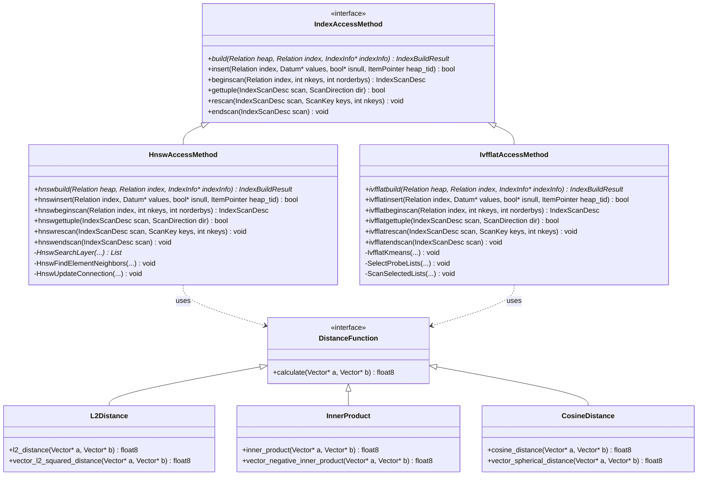

**索引操作类图详细说明：**

这个类图展示了 pgvector 的索引访问方法架构，体现了 PostgreSQL 扩展的标准化设计和多态性实现。

**🔹 IndexAccessMethod（索引访问方法接口）：**
- **设计模式**：接口模式，定义了 PostgreSQL 索引的标准契约
- **核心方法**：
  - `build()`：索引构建的入口点，处理批量数据的索引创建
  - `insert()`：单条记录的插入操作，支持增量索引更新
  - `beginscan()`：开始索引扫描，初始化扫描状态
  - `gettuple()`：获取下一个匹配的元组，实现迭代器模式
  - `rescan()`：重置扫描参数，支持参数化查询
  - `endscan()`：结束扫描，清理资源和状态

**🔹 HnswAccessMethod（HNSW 索引实现）：**
- **继承关系**：实现 IndexAccessMethod 接口
- **公共接口实现**：
  - `hnswbuild()`：构建 HNSW 图索引，支持并行构建
  - `hnswinsert()`：向 HNSW 图插入新节点，维护图结构
  - `hnswbeginscan()`：初始化 HNSW 搜索状态
  - `hnswgettuple()`：执行图搜索并返回结果
  - `hnswrescan()`：更新搜索参数，支持参数化查询
  - `hnswendscan()`：清理搜索状态和临时资源
- **私有方法**：
  - `HnswSearchLayer()`：在指定层执行贪心搜索
  - `HnswFindElementNeighbors()`：为新节点寻找邻居
  - `HnswUpdateConnection()`：更新节点间的连接关系

**🔹 IvfflatAccessMethod（IVFFlat 索引实现）：**
- **继承关系**：实现 IndexAccessMethod 接口
- **公共接口实现**：
  - `ivfflatbuild()`：构建 IVFFlat 索引，包含 K-means 聚类
  - `ivfflatinsert()`：向适当的聚类插入新向量
  - `ivfflatbeginscan()`：初始化聚类搜索状态
  - `ivfflatgettuple()`：从选定聚类中获取结果
  - `ivfflatrescan()`：更新搜索参数和聚类选择
  - `ivfflatendscan()`：清理搜索状态
- **私有方法**：
  - `IvfflatKmeans()`：执行 K-means 聚类算法
  - `SelectProbeLists()`：选择要搜索的聚类
  - `ScanSelectedLists()`：扫描选定的聚类列表

**🔹 DistanceFunction（距离函数接口）：**
- **抽象接口**：定义距离计算的统一接口
- **多态支持**：支持不同的距离度量方式
- **性能优化**：为 SIMD 优化提供统一入口

**🔹 具体距离函数实现：**

1. **L2Distance（欧几里得距离）**：
   - `l2_distance()`：标准 L2 距离，包含开方运算
   - `vector_l2_squared_distance()`：平方距离，避免开方提高性能

2. **InnerProduct（内积距离）**：
   - `inner_product()`：标准内积计算
   - `vector_negative_inner_product()`：负内积，适配 PostgreSQL 的升序排序

3. **CosineDistance（余弦距离）**：
   - `cosine_distance()`：余弦距离计算
   - `vector_spherical_distance()`：球面距离，用于标准化向量

**🔹 关系分析：**

1. **继承关系（<|--）**：
   - HNSW 和 IVFFlat 都继承自 IndexAccessMethod
   - 确保与 PostgreSQL 索引框架的完全兼容
   - 支持统一的索引管理和操作

2. **依赖关系（..>）**：
   - 两种索引方法都依赖距离函数
   - 通过接口实现松耦合设计
   - 支持距离函数的动态选择

**🔹 设计优势：**

- **标准化接口**：
  - 完全遵循 PostgreSQL 的索引访问方法规范
  - 支持标准的 SQL 查询和优化器集成
  - 便于添加新的索引类型

- **多态性支持**：
  - 运行时选择合适的索引类型
  - 支持不同距离函数的动态切换
  - 提供统一的编程接口

- **可扩展性**：
  - 易于添加新的索引算法
  - 支持新的距离度量方式
  - 模块化的设计便于维护

- **性能优化**：
  - 每种索引类型都有专门的优化
  - 距离函数支持 SIMD 加速
  - 内存和缓存友好的实现

**🔹 实现细节：**

- **状态管理**：每种索引都有专门的扫描状态结构
- **内存管理**：使用 PostgreSQL 的内存上下文系统
- **错误处理**：统一的错误处理和资源清理机制
- **并发控制**：支持多用户并发访问和修改

**🔹 使用场景：**

- **HNSW 适用场景**：
  - 高精度要求的应用
  - 中等规模数据集
  - 对查询延迟敏感的场景

- **IVFFlat 适用场景**：
  - 大规模数据集
  - 对构建时间敏感的场景
  - 内存受限的环境

这种面向对象的设计使得 pgvector 能够灵活地支持多种索引算法和距离函数，同时保持与 PostgreSQL 生态系统的完全兼容。

### 5.3 内存管理结构图

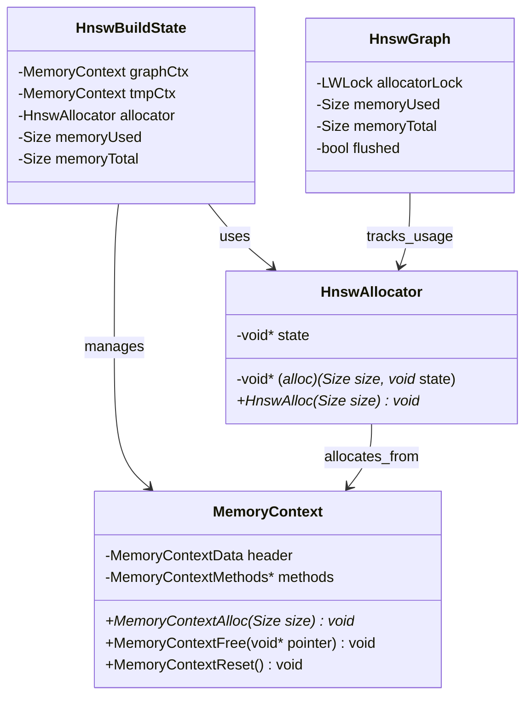

**内存管理结构图详细说明：**

这个类图展示了 pgvector 中 HNSW 索引的内存管理架构，体现了高效内存使用和资源管理的设计思想。

**🔹 MemoryContext（PostgreSQL 内存上下文）：**
- **基础设施**：PostgreSQL 的标准内存管理机制
- **核心组件**：
  - `header`：内存上下文的元数据信息
  - `methods`：内存操作方法的函数指针表
- **主要功能**：
  - `MemoryContextAlloc()`：分配指定大小的内存块
  - `MemoryContextFree()`：释放特定的内存块
  - `MemoryContextReset()`：重置整个上下文，释放所有内存
- **优势特性**：
  - **层次化管理**：支持父子上下文的层次结构
  - **批量释放**：可以一次性释放整个上下文的所有内存
  - **错误安全**：异常情况下自动清理内存，防止泄漏
  - **调试支持**：提供内存使用统计和泄漏检测

**🔹 HnswAllocator（HNSW 专用分配器）：**
- **设计目的**：为 HNSW 图结构提供专门的内存分配策略
- **核心结构**：
  - `alloc`：函数指针，指向实际的分配函数
  - `state`：分配器的状态信息，可以是内存上下文或其他状态
- **分配策略**：
  - **相对指针模式**：在内存受限时使用相对指针减少内存占用
  - **绝对指针模式**：在内存充足时使用绝对指针提高访问速度
  - **动态切换**：根据内存使用情况动态选择分配策略
- **性能优化**：
  - **内存池**：预分配大块内存，减少系统调用开销
  - **对齐优化**：确保内存对齐以支持 SIMD 指令
  - **碎片管理**：减少内存碎片，提高内存利用率

**🔹 HnswBuildState（构建状态内存管理）：**
- **多上下文管理**：管理多个专用的内存上下文
- **内存上下文分类**：
  - `graphCtx`：图数据结构的专用上下文
    - 存储图节点、邻居关系等长期数据
    - 生命周期与索引构建过程相同
    - 支持内存溢出时的磁盘刷写
  - `tmpCtx`：临时计算的专用上下文
    - 存储构建过程中的临时数据
    - 可以频繁重置以释放内存
    - 用于距离计算、候选列表等临时对象
- **内存统计**：
  - `memoryUsed`：当前已使用的内存大小
  - `memoryTotal`：总的可用内存大小
  - 支持内存使用情况的实时监控
- **分配器集成**：
  - 通过 `allocator` 字段集成专用分配器
  - 支持不同分配策略的动态切换

**🔹 HnswGraph（图结构内存管理）：**
- **并发控制**：
  - `allocatorLock`：保护分配器状态的锁
  - 确保多线程环境下的内存分配安全
- **内存监控**：
  - `memoryUsed/memoryTotal`：跟踪图结构的内存使用
  - 支持内存使用情况的实时查询
- **溢出处理**：
  - `flushed`：标记图是否已刷写到磁盘
  - 支持内存不足时的自动磁盘刷写
  - 实现内存和磁盘的混合存储

**🔹 关系分析：**

1. **HnswBuildState → MemoryContext（管理关系）**：
   - 构建状态创建和管理多个内存上下文
   - 负责上下文的生命周期管理
   - 协调不同上下文间的内存使用

2. **HnswBuildState → HnswAllocator（使用关系）**：
   - 构建状态使用专用分配器进行内存分配
   - 根据构建阶段选择合适的分配策略
   - 集成内存统计和监控功能

3. **HnswAllocator → MemoryContext（分配关系）**：
   - 分配器从内存上下文中分配实际内存
   - 实现分配策略与底层内存管理的解耦
   - 支持多种内存来源的统一管理

4. **HnswGraph → HnswAllocator（跟踪关系）**：
   - 图结构跟踪分配器的使用情况
   - 实现内存使用的全局监控
   - 支持内存溢出时的处理策略

**🔹 内存管理策略：**

- **分层管理**：
  - 不同类型的数据使用不同的内存上下文
  - 支持细粒度的内存控制和释放
  - 便于内存使用情况的分析和优化

- **动态调整**：
  - 根据可用内存动态选择分配策略
  - 支持内存压力下的自动优化
  - 实现性能和内存使用的平衡

- **错误恢复**：
  - 异常情况下自动清理分配的内存
  - 防止内存泄漏和资源浪费
  - 确保系统的稳定性和可靠性

**🔹 性能优化：**

- **内存预分配**：减少频繁的内存分配开销
- **对齐优化**：支持 SIMD 指令的高效执行
- **缓存友好**：优化内存布局以提高缓存命中率
- **批量操作**：支持批量内存分配和释放

**🔹 监控和调试：**

- **内存统计**：提供详细的内存使用统计信息
- **泄漏检测**：支持内存泄漏的检测和定位
- **性能分析**：提供内存分配性能的分析工具
- **调试支持**：集成调试信息便于问题诊断

这种精心设计的内存管理架构确保了 HNSW 索引在处理大规模向量数据时能够高效地使用内存资源，同时保持良好的性能和稳定性。

---

## 6. 实战经验与最佳实践

### 6.1 性能优化策略

#### 6.1.1 索引选择指南

**HNSW vs IVFFlat 对比：**

| 特性 | HNSW | IVFFlat |
|------|------|---------|
| 构建时间 | 较慢 | 较快 |
| 内存使用 | 较高 | 较低 |
| 查询性能 | 优秀 | 良好 |
| 召回率 | 高 | 中等 |
| 适用场景 | 高精度要求 | 大规模数据 |

**选择建议：**
```sql
-- 高精度场景：使用 HNSW
CREATE INDEX ON embeddings USING hnsw (vector vector_l2_ops) 
WITH (m = 16, ef_construction = 64);

-- 大规模场景：使用 IVFFlat
CREATE INDEX ON embeddings USING ivfflat (vector vector_l2_ops) 
WITH (lists = 1000);
```

**索引选择 SQL 代码详细说明：**

这些 SQL 语句展示了针对不同场景的索引选择策略：

1. **HNSW 高精度配置**：
   - `USING hnsw`：选择 HNSW 索引访问方法
   - `vector_l2_ops`：使用 L2 距离操作符类
   - `WITH (m = 16, ef_construction = 64)`：设置 HNSW 参数
     - `m = 16`：每个节点的最大连接数，默认值，平衡精度和内存
     - `ef_construction = 64`：构建时候选列表大小，影响构建质量
   - 适用场景：对查询精度要求高，数据量中等的应用

2. **IVFFlat 大规模配置**：
   - `USING ivfflat`：选择 IVFFlat 索引访问方法
   - `WITH (lists = 1000)`：设置聚类数量为 1000
     - 聚类数量影响索引大小和查询性能
     - 1000 个聚类适合百万级别的数据集
   - 适用场景：大规模数据，对构建时间敏感的应用

3. **操作符类选择**：
   - `vector_l2_ops`：L2 距离操作符类，最常用的距离度量
   - 其他选项：`vector_ip_ops`（内积）、`vector_cosine_ops`（余弦）
   - 操作符类必须与查询中使用的距离操作符匹配

#### 6.1.2 参数调优

**HNSW 参数调优：**
```sql
-- 构建参数
-- m: 连接数，影响精度和内存使用
-- ef_construction: 构建时候选列表大小，影响构建时间和精度
CREATE INDEX ON items USING hnsw (embedding vector_l2_ops) 
WITH (m = 32, ef_construction = 128);  -- 高精度配置

-- 查询参数
SET hnsw.ef_search = 100;  -- 查询时候选列表大小
SET hnsw.iterative_scan = strict_order;  -- 启用迭代扫描
```

**HNSW 参数调优 SQL 代码详细说明：**

这些 SQL 语句展示了 HNSW 索引的高级参数配置：

1. **构建参数优化**：
   - `WITH (m = 32, ef_construction = 128)`：高精度配置参数
   - `m = 32`：每个节点的最大连接数
     - 默认值为 16，增加到 32 提高精度但增加内存使用
     - 更多连接意味着更好的图连通性和搜索质量
   - `ef_construction = 128`：构建时候选列表大小
     - 默认值为 64，增加到 128 提高构建质量但增加构建时间
     - 更大的候选列表能找到更好的邻居连接

2. **查询参数优化**：
   - `SET hnsw.ef_search = 100`：设置查询时候选列表大小
     - 默认值为 40，增加到 100 提高查询精度
     - 更大的值意味着更高的召回率但更慢的查询速度
   - `SET hnsw.iterative_scan = strict_order`：启用严格顺序迭代扫描
     - 在有过滤条件时提高召回率
     - `strict_order` 确保结果的严格距离排序

**IVFFlat 参数调优：**
```sql
-- lists 数量建议：
-- 小于 1M 行：rows / 1000
-- 大于 1M 行：sqrt(rows)
CREATE INDEX ON items USING ivfflat (embedding vector_l2_ops) 
WITH (lists = 1000);

-- 查询参数
SET ivfflat.probes = 10;  -- 搜索的列表数量
SET ivfflat.iterative_scan = relaxed_order;  -- 启用迭代扫描
```

**IVFFlat 参数调优 SQL 代码详细说明：**

这些 SQL 语句展示了 IVFFlat 索引的参数优化策略：

1. **聚类数量选择**：
   - `WITH (lists = 1000)`：设置 1000 个聚类
   - 聚类数量选择规则：
     - 小于 1M 行：`rows / 1000`，确保每个聚类有足够的数据
     - 大于 1M 行：`sqrt(rows)`，平衡聚类数量和搜索效率
   - 1000 个聚类适合 100 万到 1000 万行的数据集

2. **查询参数优化**：
   - `SET ivfflat.probes = 10`：设置搜索的聚类数量
     - 默认值为 1，增加到 10 提高召回率
     - 更多的 probes 意味着搜索更多聚类，提高精度但降低速度
   - `SET ivfflat.iterative_scan = relaxed_order`：启用宽松顺序迭代扫描
     - 在有过滤条件时提供更好的性能
     - `relaxed_order` 允许一定程度的顺序放松以提高效率

3. **参数权衡考虑**：
   - 聚类数量：太少导致聚类过大影响性能，太多导致聚类过小影响质量
   - probes 数量：在召回率和查询速度之间找到平衡点
   - 迭代扫描：在有复杂过滤条件时特别有用

#### 6.1.3 内存优化

**构建时内存优化：**
```sql
-- 增加维护工作内存
SET maintenance_work_mem = '8GB';

-- 并行构建
SET max_parallel_maintenance_workers = 7;
SET max_parallel_workers = 15;
```

**查询时内存优化：**
```sql
-- 调整工作内存
SET work_mem = '256MB';

-- 控制扫描内存使用
SET hnsw.scan_mem_multiplier = 2;
```

### 6.2 数据预处理最佳实践

#### 6.2.1 向量标准化

```sql
-- L2 标准化（推荐用于余弦相似度）
UPDATE items SET embedding = l2_normalize(embedding);

-- 创建标准化索引
CREATE INDEX ON items USING hnsw (embedding vector_cosine_ops);
```

#### 6.2.2 维度优化

```sql
-- 使用半精度向量减少存储和内存使用
ALTER TABLE items ADD COLUMN embedding_half halfvec(1536);
UPDATE items SET embedding_half = embedding::halfvec(1536);

-- 创建半精度索引
CREATE INDEX ON items USING hnsw (embedding_half halfvec_l2_ops);
```

#### 6.2.3 稀疏向量处理

```sql
-- 稀疏向量适用于高维稀疏数据
CREATE TABLE sparse_items (
    id bigserial PRIMARY KEY,
    embedding sparsevec(10000)  -- 10000维稀疏向量
);

-- 插入稀疏向量（只存储非零元素）
INSERT INTO sparse_items (embedding) VALUES 
    ('{1:0.5,100:0.8,9999:0.3}/10000');
```

### 6.3 查询优化技巧

#### 6.3.1 过滤查询优化

```sql
-- 方法1：先过滤再排序（适用于过滤条件选择性高的场景）
CREATE INDEX ON items (category_id);
SELECT * FROM items 
WHERE category_id = 123 
ORDER BY embedding <-> '[1,2,3]' 
LIMIT 10;

-- 方法2：使用部分索引
CREATE INDEX ON items USING hnsw (embedding vector_l2_ops) 
WHERE category_id = 123;

-- 方法3：使用迭代扫描
SET hnsw.iterative_scan = strict_order;
SET hnsw.ef_search = 200;  -- 增加候选数量
```

#### 6.2.2 批量查询优化

```sql
-- 使用 CTE 进行批量最近邻查询
WITH query_vectors AS (
    SELECT unnest(ARRAY['[1,2,3]'::vector, '[4,5,6]'::vector]) AS qv
),
nearest_neighbors AS (
    SELECT qv, 
           (SELECT array_agg(id ORDER BY embedding <-> qv LIMIT 5)
            FROM items) AS neighbors
    FROM query_vectors
)
SELECT * FROM nearest_neighbors;
```

#### 6.3.3 混合搜索策略

```sql
-- 结合全文搜索和向量搜索
SELECT id, content, 
       embedding <-> '[1,2,3]' AS vector_distance,
       ts_rank_cd(textsearch, query) AS text_rank
FROM items, plainto_tsquery('search terms') query
WHERE textsearch @@ query
ORDER BY (vector_distance * 0.7 + (1 - text_rank) * 0.3)
LIMIT 10;
```

### 6.4 监控和调试

#### 6.4.1 性能监控

```sql
-- 启用查询统计
CREATE EXTENSION pg_stat_statements;

-- 监控向量查询性能
SELECT query, calls, 
       ROUND((total_plan_time + total_exec_time) / calls) AS avg_time_ms
FROM pg_stat_statements 
WHERE query LIKE '%<%>%' OR query LIKE '%<->%'
ORDER BY total_plan_time + total_exec_time DESC 
LIMIT 10;

-- 检查索引使用情况
EXPLAIN (ANALYZE, BUFFERS) 
SELECT * FROM items 
ORDER BY embedding <-> '[1,2,3]' 
LIMIT 5;
```

#### 6.4.2 索引健康检查

```sql
-- 检查索引大小
SELECT schemaname, tablename, indexname, 
       pg_size_pretty(pg_relation_size(indexrelid)) AS index_size
FROM pg_stat_user_indexes 
WHERE indexrelname LIKE '%hnsw%' OR indexrelname LIKE '%ivfflat%';

-- 检查索引构建进度
SELECT phase, 
       round(100.0 * blocks_done / nullif(blocks_total, 0), 1) AS "%" 
FROM pg_stat_progress_create_index;
```

#### 6.4.3 故障排除

**常见问题及解决方案：**

1. **索引未被使用**
```sql
-- 检查查询计划
EXPLAIN SELECT * FROM items ORDER BY embedding <-> '[1,2,3]' LIMIT 5;

-- 强制使用索引
BEGIN;
SET LOCAL enable_seqscan = off;
SELECT * FROM items ORDER BY embedding <-> '[1,2,3]' LIMIT 5;
COMMIT;
```

2. **内存不足错误**
```sql
-- 减少构建参数
CREATE INDEX ON items USING hnsw (embedding vector_l2_ops) 
WITH (m = 8, ef_construction = 32);

-- 增加内存限制
SET maintenance_work_mem = '16GB';
```

3. **查询结果不准确**
```sql
-- 增加搜索范围
SET hnsw.ef_search = 200;
SET ivfflat.probes = 20;

-- 启用迭代扫描
SET hnsw.iterative_scan = strict_order;
```

### 6.5 生产环境部署建议

#### 6.5.1 容量规划

**存储容量估算：**
- Vector(n): (4 * n + 8) 字节/向量
- HNSW索引: 约为原始数据的 1.5-3 倍
- IVFFlat索引: 约为原始数据的 1.1-1.5 倍

**内存需求估算：**
- HNSW构建: 需要足够内存容纳整个图结构
- 查询缓存: shared_buffers 设置为系统内存的 25%

#### 6.5.2 备份和恢复

```sql
-- 逻辑备份（包含索引定义）
pg_dump -d database_name -t table_name > backup.sql

-- 物理备份（包含索引数据）
pg_basebackup -D /backup/path -Ft -z -P

-- 恢复后重建索引（推荐）
DROP INDEX IF EXISTS idx_embedding;
CREATE INDEX CONCURRENTLY idx_embedding ON items 
USING hnsw (embedding vector_l2_ops);
```

#### 6.5.3 版本升级策略

```sql
-- 检查当前版本
SELECT extversion FROM pg_extension WHERE extname = 'vector';

-- 升级扩展
ALTER EXTENSION vector UPDATE;

-- 重建索引（如果需要）
REINDEX INDEX CONCURRENTLY idx_embedding;
```

---

## 总结

pgvector 是一个功能强大且设计精良的向量数据库扩展。通过本文的深度剖析，我们了解了：

1. **架构设计**：模块化的设计使得各个组件职责清晰，易于维护和扩展
2. **算法实现**：HNSW 和 IVFFlat 两种索引算法各有优势，适用于不同场景
3. **性能优化**：通过合理的参数调优和查询优化可以获得优异的性能
4. **实战经验**：在生产环境中需要考虑容量规划、监控和故障排除

pgvector 的成功在于它将复杂的向量搜索算法与 PostgreSQL 的强大功能完美结合，为开发者提供了一个既强大又易用的向量数据库解决方案。

---

*本文档基于 pgvector v0.8.1 版本编写，涵盖了从基础使用到高级优化的全方位内容。建议读者结合实际项目需求，选择合适的配置和优化策略。*
